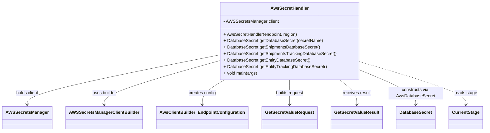
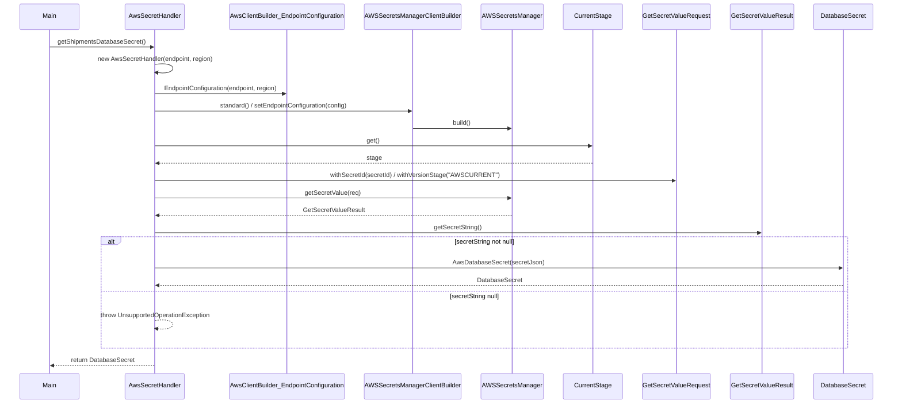

# Diagram: platform-java-lambdas/infrastructure/datastore/src/main/java/com/freightverify/infrastructure/aws/secret/AwsSecretHandler.java

> Auto-generated by Obscura crawlers

## Diagram 1

### SVG

<svg id="container" width="1714.5" xmlns="http://www.w3.org/2000/svg" class="classDiagram" height="486" viewBox="0 0 1714.5 486" role="graphics-document document" aria-roledescription="class"><g><defs><marker id="container_class-aggregationStart" class="marker aggregation class" refX="18" refY="7" markerWidth="190" markerHeight="240" orient="auto"><path d="M 18,7 L9,13 L1,7 L9,1 Z"></path></marker></defs><defs><marker id="container_class-aggregationEnd" class="marker aggregation class" refX="1" refY="7" markerWidth="20" markerHeight="28" orient="auto"><path d="M 18,7 L9,13 L1,7 L9,1 Z"></path></marker></defs><defs><marker id="container_class-extensionStart" class="marker extension class" refX="18" refY="7" markerWidth="190" markerHeight="240" orient="auto"><path d="M 1,7 L18,13 V 1 Z"></path></marker></defs><defs><marker id="container_class-extensionEnd" class="marker extension class" refX="1" refY="7" markerWidth="20" markerHeight="28" orient="auto"><path d="M 1,1 V 13 L18,7 Z"></path></marker></defs><defs><marker id="container_class-compositionStart" class="marker composition class" refX="18" refY="7" markerWidth="190" markerHeight="240" orient="auto"><path d="M 18,7 L9,13 L1,7 L9,1 Z"></path></marker></defs><defs><marker id="container_class-compositionEnd" class="marker composition class" refX="1" refY="7" markerWidth="20" markerHeight="28" orient="auto"><path d="M 18,7 L9,13 L1,7 L9,1 Z"></path></marker></defs><defs><marker id="container_class-dependencyStart" class="marker dependency class" refX="6" refY="7" markerWidth="190" markerHeight="240" orient="auto"><path d="M 5,7 L9,13 L1,7 L9,1 Z"></path></marker></defs><defs><marker id="container_class-dependencyEnd" class="marker dependency class" refX="13" refY="7" markerWidth="20" markerHeight="28" orient="auto"><path d="M 18,7 L9,13 L14,7 L9,1 Z"></path></marker></defs><defs><marker id="container_class-lollipopStart" class="marker lollipop class" refX="13" refY="7" markerWidth="190" markerHeight="240" orient="auto"><circle stroke="black" fill="transparent" cx="7" cy="7" r="6"></circle></marker></defs><defs><marker id="container_class-lollipopEnd" class="marker lollipop class" refX="1" refY="7" markerWidth="190" markerHeight="240" orient="auto"><circle stroke="black" fill="transparent" cx="7" cy="7" r="6"></circle></marker></defs><g class="root"><g class="clusters"></g><g class="edgePaths"><path d="M766.527,204.547L654.525,227.956C542.523,251.365,318.52,298.182,206.518,328.758C94.516,359.333,94.516,373.667,94.516,380.833L94.516,388" id="id_AwsSecretHandler_AWSSecretsManager_1" class="edge-thickness-normal edge-pattern-solid relation" style=";;;" data-edge="true" data-et="edge" data-id="id_AwsSecretHandler_AWSSecretsManager_1" data-points="W3sieCI6NzY2LjUyNzM0Mzc1LCJ5IjoyMDQuNTQ3MjI1NDQxODM5Nn0seyJ4Ijo5NC41MTU2MjUsInkiOjM0NX0seyJ4Ijo5NC41MTU2MjUsInkiOjM5NH1d" marker-end="url(#container_class-dependencyEnd)"></path><path d="M766.527,226.354L699.663,246.129C632.799,265.903,499.072,305.451,432.208,332.392C365.344,359.333,365.344,373.667,365.344,380.833L365.344,388" id="id_AwsSecretHandler_AWSSecretsManagerClientBuilder_2" class="edge-thickness-normal edge-pattern-solid relation" style=";;;" data-edge="true" data-et="edge" data-id="id_AwsSecretHandler_AWSSecretsManagerClientBuilder_2" data-points="W3sieCI6NzY2LjUyNzM0Mzc1LCJ5IjoyMjYuMzU0MjAxMzMzNjA0N30seyJ4IjozNjUuMzQzNzUsInkiOjM0NX0seyJ4IjozNjUuMzQzNzUsInkiOjM5NH1d" marker-end="url(#container_class-dependencyEnd)"></path><path d="M788.09,296L775.054,304.167C762.018,312.333,735.947,328.667,722.911,344C709.875,359.333,709.875,373.667,709.875,380.833L709.875,388" id="id_AwsSecretHandler_AwsClientBuilder_EndpointConfiguration_3" class="edge-thickness-normal edge-pattern-solid relation" style=";;;" data-edge="true" data-et="edge" data-id="id_AwsSecretHandler_AwsClientBuilder_EndpointConfiguration_3" data-points="W3sieCI6Nzg4LjA4OTc0MjU1MTgxMzUsInkiOjI5Nn0seyJ4Ijo3MDkuODc1LCJ5IjozNDV9LHsieCI6NzA5Ljg3NSwieSI6Mzk0fV0=" marker-end="url(#container_class-dependencyEnd)"></path><path d="M1017.945,296L1017.945,304.167C1017.945,312.333,1017.945,328.667,1017.945,344C1017.945,359.333,1017.945,373.667,1017.945,380.833L1017.945,388" id="id_AwsSecretHandler_GetSecretValueRequest_4" class="edge-thickness-normal edge-pattern-solid relation" style=";;;" data-edge="true" data-et="edge" data-id="id_AwsSecretHandler_GetSecretValueRequest_4" data-points="W3sieCI6MTAxNy45NDUzMTI1LCJ5IjoyOTZ9LHsieCI6MTAxNy45NDUzMTI1LCJ5IjozNDV9LHsieCI6MTAxNy45NDUzMTI1LCJ5IjozOTR9XQ==" marker-end="url(#container_class-dependencyEnd)"></path><path d="M1196.167,296L1206.275,304.167C1216.382,312.333,1236.597,328.667,1246.705,344C1256.813,359.333,1256.813,373.667,1256.813,380.833L1256.813,388" id="id_AwsSecretHandler_GetSecretValueResult_5" class="edge-thickness-normal edge-pattern-solid relation" style=";;;" data-edge="true" data-et="edge" data-id="id_AwsSecretHandler_GetSecretValueResult_5" data-points="W3sieCI6MTE5Ni4xNjc0NjI3NTkwNjczLCJ5IjoyOTZ9LHsieCI6MTI1Ni44MTI1LCJ5IjozNDV9LHsieCI6MTI1Ni44MTI1LCJ5IjozOTR9XQ==" marker-end="url(#container_class-dependencyEnd)"></path><path d="M1269.363,259.986L1302.352,274.155C1335.341,288.324,1401.319,316.662,1434.308,337.998C1467.297,359.333,1467.297,373.667,1467.297,380.833L1467.297,388" id="id_AwsSecretHandler_DatabaseSecret_6" class="edge-thickness-normal edge-pattern-solid relation" style=";;;" data-edge="true" data-et="edge" data-id="id_AwsSecretHandler_DatabaseSecret_6" data-points="W3sieCI6MTI2OS4zNjMyODEyNSwieSI6MjU5Ljk4NTk3ODA1ODY2MDl9LHsieCI6MTQ2Ny4yOTY4NzUsInkiOjM0NX0seyJ4IjoxNDY3LjI5Njg3NSwieSI6Mzk0fV0=" marker-end="url(#container_class-dependencyEnd)"></path><path d="M1269.363,229.182L1332.242,248.485C1395.12,267.788,1520.876,306.394,1583.755,332.864C1646.633,359.333,1646.633,373.667,1646.633,380.833L1646.633,388" id="id_AwsSecretHandler_CurrentStage_7" class="edge-thickness-normal edge-pattern-dashed relation" style=";;;" data-edge="true" data-et="edge" data-id="id_AwsSecretHandler_CurrentStage_7" data-points="W3sieCI6MTI2OS4zNjMyODEyNSwieSI6MjI5LjE4MjQ5MjA0NjkyMzE2fSx7IngiOjE2NDYuNjMyODEyNSwieSI6MzQ1fSx7IngiOjE2NDYuNjMyODEyNSwieSI6Mzk0fV0=" marker-end="url(#container_class-dependencyEnd)"></path></g><g class="edgeLabels"><g class="edgeLabel" transform="translate(94.515625, 345)"><g class="label" data-id="id_AwsSecretHandler_AWSSecretsManager_1" transform="translate(-42.671875, -12)"><foreignObject width="85.34375" height="24">

holds client

</foreignObject></g></g><g class="edgeLabel" transform="translate(365.34375, 345)"><g class="label" data-id="id_AwsSecretHandler_AWSSecretsManagerClientBuilder_2" transform="translate(-44.8125, -12)"><foreignObject width="89.625" height="24">

uses builder

</foreignObject></g></g><g class="edgeLabel" transform="translate(709.875, 345)"><g class="label" data-id="id_AwsSecretHandler_AwsClientBuilder_EndpointConfiguration_3" transform="translate(-50.078125, -12)"><foreignObject width="100.15625" height="24">

creates config

</foreignObject></g></g><g class="edgeLabel" transform="translate(1017.9453125, 345)"><g class="label" data-id="id_AwsSecretHandler_GetSecretValueRequest_4" transform="translate(-52.2421875, -12)"><foreignObject width="104.484375" height="24">

builds request

</foreignObject></g></g><g class="edgeLabel" transform="translate(1256.8125, 345)"><g class="label" data-id="id_AwsSecretHandler_GetSecretValueResult_5" transform="translate(-52.4453125, -12)"><foreignObject width="104.890625" height="24">

receives result

</foreignObject></g></g><g class="edgeLabel" transform="translate(1467.296875, 345)"><g class="label" data-id="id_AwsSecretHandler_DatabaseSecret_6" transform="translate(-100, -24)"><foreignObject width="200" height="48">

constructs via AwsDatabaseSecret

</foreignObject></g></g><g class="edgeLabel" transform="translate(1646.6328125, 345)"><g class="label" data-id="id_AwsSecretHandler_CurrentStage_7" transform="translate(-41.359375, -12)"><foreignObject width="82.71875" height="24">

reads stage

</foreignObject></g></g></g><g class="nodes"><g class="node default" id="classId-AwsSecretHandler-0" transform="translate(1017.9453125, 152)"><g class="basic label-container"><path d="M-251.41796875 -144 L251.41796875 -144 L251.41796875 144 L-251.41796875 144" stroke="none" stroke-width="0" fill="#ECECFF" style=""></path><path d="M-251.41796875 -144 C-148.04192371485263 -144, -44.66587867970526 -144, 251.41796875 -144 M-251.41796875 -144 C-75.80818585764246 -144, 99.80159703471509 -144, 251.41796875 -144 M251.41796875 -144 C251.41796875 -52.23692805987798, 251.41796875 39.526143880244035, 251.41796875 144 M251.41796875 -144 C251.41796875 -46.30061269467852, 251.41796875 51.39877461064296, 251.41796875 144 M251.41796875 144 C115.32280271181386 144, -20.772363326372272 144, -251.41796875 144 M251.41796875 144 C83.43456153623703 144, -84.54884567752595 144, -251.41796875 144 M-251.41796875 144 C-251.41796875 79.02860805650575, -251.41796875 14.057216113011492, -251.41796875 -144 M-251.41796875 144 C-251.41796875 76.8536694418386, -251.41796875 9.70733888367721, -251.41796875 -144" stroke="#9370DB" stroke-width="1.3" fill="none" stroke-dasharray="0 0" style=""></path></g><g class="annotation-group text" transform="translate(0, -120)"></g><g class="label-group text" transform="translate(-66.9609375, -120)"><g class="label" style="font-weight: bolder" transform="translate(0,-12)"><foreignObject width="133.921875" height="24">

AwsSecretHandler

</foreignObject></g></g><g class="members-group text" transform="translate(-239.41796875, -72)"><g class="label" style="" transform="translate(0,-12)"><foreignObject width="201.1875" height="24">

- AWSSecretsManager client

</foreignObject></g></g><g class="methods-group text" transform="translate(-239.41796875, -24)"><g class="label" style="" transform="translate(0,-12)"><foreignObject width="274.3125" height="24">

+ AwsSecretHandler(endpoint, region)

</foreignObject></g><g class="label" style="" transform="translate(0,12)"><foreignObject width="360.65625" height="24">

+ DatabaseSecret getDatabaseSecret(secretName)

</foreignObject></g><g class="label" style="" transform="translate(0,36)"><foreignObject width="351.71875" height="24">

+ DatabaseSecret getShipmentsDatabaseSecret()

</foreignObject></g><g class="label" style="" transform="translate(0,60)"><foreignObject width="411.875" height="24">

+ DatabaseSecret getShipmentsTrackingDatabaseSecret()

</foreignObject></g><g class="label" style="" transform="translate(0,84)"><foreignObject width="316.1875" height="24">

+ DatabaseSecret getEntityDatabaseSecret()

</foreignObject></g><g class="label" style="" transform="translate(0,108)"><foreignObject width="376.34375" height="24">

+ DatabaseSecret getEntityTrackingDatabaseSecret()

</foreignObject></g><g class="label" style="" transform="translate(0,132)"><foreignObject width="124.703125" height="24">

+ void main(args)

</foreignObject></g></g><g class="divider" style=""><path d="M-251.41796875 -96 C-139.47717771125298 -96, -27.536386672505927 -96, 251.41796875 -96 M-251.41796875 -96 C-141.29705178992452 -96, -31.17613482984902 -96, 251.41796875 -96" stroke="#9370DB" stroke-width="1.3" fill="none" stroke-dasharray="0 0" style=""></path></g><g class="divider" style=""><path d="M-251.41796875 -48 C-81.35994826488295 -48, 88.69807222023411 -48, 251.41796875 -48 M-251.41796875 -48 C-57.91037463628922 -48, 135.59721947742156 -48, 251.41796875 -48" stroke="#9370DB" stroke-width="1.3" fill="none" stroke-dasharray="0 0" style=""></path></g></g><g class="node default" id="classId-AWSSecretsManager-1" transform="translate(94.515625, 436)"><g class="basic label-container"><path d="M-86.515625 -42 L86.515625 -42 L86.515625 42 L-86.515625 42" stroke="none" stroke-width="0" fill="#ECECFF" style=""></path><path d="M-86.515625 -42 C-19.59579890067083 -42, 47.32402719865834 -42, 86.515625 -42 M-86.515625 -42 C-36.89058679504458 -42, 12.734451409910847 -42, 86.515625 -42 M86.515625 -42 C86.515625 -11.13710929791145, 86.515625 19.7257814041771, 86.515625 42 M86.515625 -42 C86.515625 -9.181829577617108, 86.515625 23.636340844765783, 86.515625 42 M86.515625 42 C38.98793367802985 42, -8.539757643940305 42, -86.515625 42 M86.515625 42 C42.19272326129676 42, -2.1301784774064743 42, -86.515625 42 M-86.515625 42 C-86.515625 17.208618185630353, -86.515625 -7.582763628739293, -86.515625 -42 M-86.515625 42 C-86.515625 8.638797171061107, -86.515625 -24.722405657877786, -86.515625 -42" stroke="#9370DB" stroke-width="1.3" fill="none" stroke-dasharray="0 0" style=""></path></g><g class="annotation-group text" transform="translate(0, -18)"></g><g class="label-group text" transform="translate(-74.515625, -18)"><g class="label" style="font-weight: bolder" transform="translate(0,-12)"><foreignObject width="149.03125" height="24">

AWSSecretsManager

</foreignObject></g></g><g class="members-group text" transform="translate(-74.515625, 30)"></g><g class="methods-group text" transform="translate(-74.515625, 60)"></g><g class="divider" style=""><path d="M-86.515625 6 C-30.72467665883856 6, 25.066271682322878 6, 86.515625 6 M-86.515625 6 C-20.412622203405988 6, 45.690380593188024 6, 86.515625 6" stroke="#9370DB" stroke-width="1.3" fill="none" stroke-dasharray="0 0" style=""></path></g><g class="divider" style=""><path d="M-86.515625 24 C-39.980964458302225 24, 6.55369608339555 24, 86.515625 24 M-86.515625 24 C-34.06815673452158 24, 18.37931153095684 24, 86.515625 24" stroke="#9370DB" stroke-width="1.3" fill="none" stroke-dasharray="0 0" style=""></path></g></g><g class="node default" id="classId-AWSSecretsManagerClientBuilder-2" transform="translate(365.34375, 436)"><g class="basic label-container"><path d="M-134.3125 -42 L134.3125 -42 L134.3125 42 L-134.3125 42" stroke="none" stroke-width="0" fill="#ECECFF" style=""></path><path d="M-134.3125 -42 C-32.55413083012505 -42, 69.2042383397499 -42, 134.3125 -42 M-134.3125 -42 C-49.15538226855563 -42, 36.001735462888746 -42, 134.3125 -42 M134.3125 -42 C134.3125 -10.978535272723196, 134.3125 20.042929454553608, 134.3125 42 M134.3125 -42 C134.3125 -8.45393711509707, 134.3125 25.09212576980586, 134.3125 42 M134.3125 42 C31.23220457572009 42, -71.84809084855982 42, -134.3125 42 M134.3125 42 C52.35245439438508 42, -29.607591211229845 42, -134.3125 42 M-134.3125 42 C-134.3125 16.886173203174824, -134.3125 -8.227653593650352, -134.3125 -42 M-134.3125 42 C-134.3125 24.6657681916005, -134.3125 7.331536383200998, -134.3125 -42" stroke="#9370DB" stroke-width="1.3" fill="none" stroke-dasharray="0 0" style=""></path></g><g class="annotation-group text" transform="translate(0, -18)"></g><g class="label-group text" transform="translate(-122.3125, -18)"><g class="label" style="font-weight: bolder" transform="translate(0,-12)"><foreignObject width="244.625" height="24">

AWSSecretsManagerClientBuilder

</foreignObject></g></g><g class="members-group text" transform="translate(-122.3125, 30)"></g><g class="methods-group text" transform="translate(-122.3125, 60)"></g><g class="divider" style=""><path d="M-134.3125 6 C-67.95154876046674 6, -1.5905975209334713 6, 134.3125 6 M-134.3125 6 C-42.457791238883516 6, 49.39691752223297 6, 134.3125 6" stroke="#9370DB" stroke-width="1.3" fill="none" stroke-dasharray="0 0" style=""></path></g><g class="divider" style=""><path d="M-134.3125 24 C-51.690795438960066 24, 30.930909122079868 24, 134.3125 24 M-134.3125 24 C-39.95078947196696 24, 54.41092105606609 24, 134.3125 24" stroke="#9370DB" stroke-width="1.3" fill="none" stroke-dasharray="0 0" style=""></path></g></g><g class="node default" id="classId-AwsClientBuilder_EndpointConfiguration-3" transform="translate(709.875, 436)"><g class="basic label-container"><path d="M-160.21875 -42 L160.21875 -42 L160.21875 42 L-160.21875 42" stroke="none" stroke-width="0" fill="#ECECFF" style=""></path><path d="M-160.21875 -42 C-69.84419564851498 -42, 20.530358702970034 -42, 160.21875 -42 M-160.21875 -42 C-42.92681828140796 -42, 74.36511343718408 -42, 160.21875 -42 M160.21875 -42 C160.21875 -10.788869796155247, 160.21875 20.422260407689507, 160.21875 42 M160.21875 -42 C160.21875 -9.462917411627956, 160.21875 23.07416517674409, 160.21875 42 M160.21875 42 C90.56330239028719 42, 20.907854780574382 42, -160.21875 42 M160.21875 42 C95.19100838055071 42, 30.163266761101426 42, -160.21875 42 M-160.21875 42 C-160.21875 16.532729878226462, -160.21875 -8.934540243547076, -160.21875 -42 M-160.21875 42 C-160.21875 17.908698248306557, -160.21875 -6.182603503386886, -160.21875 -42" stroke="#9370DB" stroke-width="1.3" fill="none" stroke-dasharray="0 0" style=""></path></g><g class="annotation-group text" transform="translate(0, -18)"></g><g class="label-group text" transform="translate(-148.21875, -18)"><g class="label" style="font-weight: bolder" transform="translate(0,-12)"><foreignObject width="296.4375" height="24">

AwsClientBuilder_EndpointConfiguration

</foreignObject></g></g><g class="members-group text" transform="translate(-148.21875, 30)"></g><g class="methods-group text" transform="translate(-148.21875, 60)"></g><g class="divider" style=""><path d="M-160.21875 6 C-59.476322845739006 6, 41.26610430852199 6, 160.21875 6 M-160.21875 6 C-89.71513751141563 6, -19.211525022831268 6, 160.21875 6" stroke="#9370DB" stroke-width="1.3" fill="none" stroke-dasharray="0 0" style=""></path></g><g class="divider" style=""><path d="M-160.21875 24 C-80.22446652471976 24, -0.23018304943951762 24, 160.21875 24 M-160.21875 24 C-59.02452733151087 24, 42.169695336978265 24, 160.21875 24" stroke="#9370DB" stroke-width="1.3" fill="none" stroke-dasharray="0 0" style=""></path></g></g><g class="node default" id="classId-GetSecretValueRequest-4" transform="translate(1017.9453125, 436)"><g class="basic label-container"><path d="M-97.8515625 -42 L97.8515625 -42 L97.8515625 42 L-97.8515625 42" stroke="none" stroke-width="0" fill="#ECECFF" style=""></path><path d="M-97.8515625 -42 C-55.39538842382312 -42, -12.939214347646242 -42, 97.8515625 -42 M-97.8515625 -42 C-45.26045853352224 -42, 7.330645432955521 -42, 97.8515625 -42 M97.8515625 -42 C97.8515625 -10.03987550004619, 97.8515625 21.92024899990762, 97.8515625 42 M97.8515625 -42 C97.8515625 -21.20015283156089, 97.8515625 -0.4003056631217774, 97.8515625 42 M97.8515625 42 C30.79954830826209 42, -36.25246588347582 42, -97.8515625 42 M97.8515625 42 C51.60282552579313 42, 5.354088551586258 42, -97.8515625 42 M-97.8515625 42 C-97.8515625 22.96892461088675, -97.8515625 3.9378492217734973, -97.8515625 -42 M-97.8515625 42 C-97.8515625 21.954073160554685, -97.8515625 1.9081463211093705, -97.8515625 -42" stroke="#9370DB" stroke-width="1.3" fill="none" stroke-dasharray="0 0" style=""></path></g><g class="annotation-group text" transform="translate(0, -18)"></g><g class="label-group text" transform="translate(-85.8515625, -18)"><g class="label" style="font-weight: bolder" transform="translate(0,-12)"><foreignObject width="171.703125" height="24">

GetSecretValueRequest

</foreignObject></g></g><g class="members-group text" transform="translate(-85.8515625, 30)"></g><g class="methods-group text" transform="translate(-85.8515625, 60)"></g><g class="divider" style=""><path d="M-97.8515625 6 C-31.321796358819753 6, 35.20796978236049 6, 97.8515625 6 M-97.8515625 6 C-35.634346130148025 6, 26.58287023970395 6, 97.8515625 6" stroke="#9370DB" stroke-width="1.3" fill="none" stroke-dasharray="0 0" style=""></path></g><g class="divider" style=""><path d="M-97.8515625 24 C-50.81502194198577 24, -3.7784813839715383 24, 97.8515625 24 M-97.8515625 24 C-37.31977505709049 24, 23.212012385819023 24, 97.8515625 24" stroke="#9370DB" stroke-width="1.3" fill="none" stroke-dasharray="0 0" style=""></path></g></g><g class="node default" id="classId-GetSecretValueResult-5" transform="translate(1256.8125, 436)"><g class="basic label-container"><path d="M-91.015625 -42 L91.015625 -42 L91.015625 42 L-91.015625 42" stroke="none" stroke-width="0" fill="#ECECFF" style=""></path><path d="M-91.015625 -42 C-38.019265717286665 -42, 14.97709356542667 -42, 91.015625 -42 M-91.015625 -42 C-50.73855699312144 -42, -10.461488986242884 -42, 91.015625 -42 M91.015625 -42 C91.015625 -11.914197751405315, 91.015625 18.17160449718937, 91.015625 42 M91.015625 -42 C91.015625 -12.913096425520298, 91.015625 16.173807148959405, 91.015625 42 M91.015625 42 C53.70584338884412 42, 16.396061777688246 42, -91.015625 42 M91.015625 42 C53.97149493206567 42, 16.927364864131334 42, -91.015625 42 M-91.015625 42 C-91.015625 21.66117340474982, -91.015625 1.322346809499642, -91.015625 -42 M-91.015625 42 C-91.015625 16.88144383726942, -91.015625 -8.237112325461162, -91.015625 -42" stroke="#9370DB" stroke-width="1.3" fill="none" stroke-dasharray="0 0" style=""></path></g><g class="annotation-group text" transform="translate(0, -18)"></g><g class="label-group text" transform="translate(-79.015625, -18)"><g class="label" style="font-weight: bolder" transform="translate(0,-12)"><foreignObject width="158.03125" height="24">

GetSecretValueResult

</foreignObject></g></g><g class="members-group text" transform="translate(-79.015625, 30)"></g><g class="methods-group text" transform="translate(-79.015625, 60)"></g><g class="divider" style=""><path d="M-91.015625 6 C-49.67155493570905 6, -8.327484871418093 6, 91.015625 6 M-91.015625 6 C-37.73513180148734 6, 15.545361397025317 6, 91.015625 6" stroke="#9370DB" stroke-width="1.3" fill="none" stroke-dasharray="0 0" style=""></path></g><g class="divider" style=""><path d="M-91.015625 24 C-50.716281283780575 24, -10.416937567561149 24, 91.015625 24 M-91.015625 24 C-51.76604987629656 24, -12.516474752593126 24, 91.015625 24" stroke="#9370DB" stroke-width="1.3" fill="none" stroke-dasharray="0 0" style=""></path></g></g><g class="node default" id="classId-DatabaseSecret-6" transform="translate(1467.296875, 436)"><g class="basic label-container"><path d="M-69.46875 -42 L69.46875 -42 L69.46875 42 L-69.46875 42" stroke="none" stroke-width="0" fill="#ECECFF" style=""></path><path d="M-69.46875 -42 C-23.029034196318747 -42, 23.410681607362505 -42, 69.46875 -42 M-69.46875 -42 C-24.95306082280677 -42, 19.56262835438646 -42, 69.46875 -42 M69.46875 -42 C69.46875 -21.709016482958475, 69.46875 -1.4180329659169502, 69.46875 42 M69.46875 -42 C69.46875 -17.943874873380437, 69.46875 6.112250253239125, 69.46875 42 M69.46875 42 C41.48109719876598 42, 13.493444397531952 42, -69.46875 42 M69.46875 42 C24.01503647500072 42, -21.43867704999856 42, -69.46875 42 M-69.46875 42 C-69.46875 9.910198204123233, -69.46875 -22.179603591753533, -69.46875 -42 M-69.46875 42 C-69.46875 24.653100691357718, -69.46875 7.306201382715436, -69.46875 -42" stroke="#9370DB" stroke-width="1.3" fill="none" stroke-dasharray="0 0" style=""></path></g><g class="annotation-group text" transform="translate(0, -18)"></g><g class="label-group text" transform="translate(-57.46875, -18)"><g class="label" style="font-weight: bolder" transform="translate(0,-12)"><foreignObject width="114.9375" height="24">

DatabaseSecret

</foreignObject></g></g><g class="members-group text" transform="translate(-57.46875, 30)"></g><g class="methods-group text" transform="translate(-57.46875, 60)"></g><g class="divider" style=""><path d="M-69.46875 6 C-28.246417707340584 6, 12.975914585318833 6, 69.46875 6 M-69.46875 6 C-38.24853242536611 6, -7.028314850732215 6, 69.46875 6" stroke="#9370DB" stroke-width="1.3" fill="none" stroke-dasharray="0 0" style=""></path></g><g class="divider" style=""><path d="M-69.46875 24 C-35.93702506677098 24, -2.4053001335419566 24, 69.46875 24 M-69.46875 24 C-24.04903433918834 24, 21.370681321623323 24, 69.46875 24" stroke="#9370DB" stroke-width="1.3" fill="none" stroke-dasharray="0 0" style=""></path></g></g><g class="node default" id="classId-CurrentStage-7" transform="translate(1646.6328125, 436)"><g class="basic label-container"><path d="M-59.8671875 -42 L59.8671875 -42 L59.8671875 42 L-59.8671875 42" stroke="none" stroke-width="0" fill="#ECECFF" style=""></path><path d="M-59.8671875 -42 C-34.62313997082434 -42, -9.379092441648673 -42, 59.8671875 -42 M-59.8671875 -42 C-34.10309297667291 -42, -8.33899845334583 -42, 59.8671875 -42 M59.8671875 -42 C59.8671875 -22.04790267120069, 59.8671875 -2.095805342401377, 59.8671875 42 M59.8671875 -42 C59.8671875 -11.665441857675738, 59.8671875 18.669116284648524, 59.8671875 42 M59.8671875 42 C35.57753438983883 42, 11.287881279677656 42, -59.8671875 42 M59.8671875 42 C28.06098430234779 42, -3.7452188953044185 42, -59.8671875 42 M-59.8671875 42 C-59.8671875 12.189788118628012, -59.8671875 -17.620423762743975, -59.8671875 -42 M-59.8671875 42 C-59.8671875 21.441090320649053, -59.8671875 0.8821806412981061, -59.8671875 -42" stroke="#9370DB" stroke-width="1.3" fill="none" stroke-dasharray="0 0" style=""></path></g><g class="annotation-group text" transform="translate(0, -18)"></g><g class="label-group text" transform="translate(-47.8671875, -18)"><g class="label" style="font-weight: bolder" transform="translate(0,-12)"><foreignObject width="95.734375" height="24">

CurrentStage

</foreignObject></g></g><g class="members-group text" transform="translate(-47.8671875, 30)"></g><g class="methods-group text" transform="translate(-47.8671875, 60)"></g><g class="divider" style=""><path d="M-59.8671875 6 C-12.922377215369607 6, 34.022433069260785 6, 59.8671875 6 M-59.8671875 6 C-15.483442826362868 6, 28.900301847274264 6, 59.8671875 6" stroke="#9370DB" stroke-width="1.3" fill="none" stroke-dasharray="0 0" style=""></path></g><g class="divider" style=""><path d="M-59.8671875 24 C-13.718730369670169 24, 32.42972676065966 24, 59.8671875 24 M-59.8671875 24 C-29.496831195896455 24, 0.8735251082070903 24, 59.8671875 24" stroke="#9370DB" stroke-width="1.3" fill="none" stroke-dasharray="0 0" style=""></path></g></g></g></g></g></svg>

## Diagram 2

### SVG

<svg id="container" width="2379.5" xmlns="http://www.w3.org/2000/svg" height="1081" viewBox="-50 -10 2379.5 1081" role="graphics-document document" aria-roledescription="sequence"><g><rect x="2129.5" y="995" fill="#eaeaea" stroke="#666" width="150" height="65" name="DB" rx="3" ry="3" class="actor actor-bottom"></rect><text x="2204.5" y="1027.5" dominant-baseline="central" alignment-baseline="central" class="actor actor-box" style="text-anchor: middle; font-size: 16px; font-weight: 400;"><tspan x="2204.5" dy="0">DatabaseSecret</tspan></text></g><g><rect x="1904.5" y="995" fill="#eaeaea" stroke="#666" width="175" height="65" name="Res" rx="3" ry="3" class="actor actor-bottom"></rect><text x="1992" y="1027.5" dominant-baseline="central" alignment-baseline="central" class="actor actor-box" style="text-anchor: middle; font-size: 16px; font-weight: 400;"><tspan x="1992" dy="0">GetSecretValueResult</tspan></text></g><g><rect x="1665.5" y="995" fill="#eaeaea" stroke="#666" width="189" height="65" name="Req" rx="3" ry="3" class="actor actor-bottom"></rect><text x="1760" y="1027.5" dominant-baseline="central" alignment-baseline="central" class="actor actor-box" style="text-anchor: middle; font-size: 16px; font-weight: 400;"><tspan x="1760" dy="0">GetSecretValueRequest</tspan></text></g><g><rect x="1465.5" y="995" fill="#eaeaea" stroke="#666" width="150" height="65" name="Stage" rx="3" ry="3" class="actor actor-bottom"></rect><text x="1540.5" y="1027.5" dominant-baseline="central" alignment-baseline="central" class="actor actor-box" style="text-anchor: middle; font-size: 16px; font-weight: 400;"><tspan x="1540.5" dy="0">CurrentStage</tspan></text></g><g><rect x="1249.5" y="995" fill="#eaeaea" stroke="#666" width="166" height="65" name="Client" rx="3" ry="3" class="actor actor-bottom"></rect><text x="1332.5" y="1027.5" dominant-baseline="central" alignment-baseline="central" class="actor actor-box" style="text-anchor: middle; font-size: 16px; font-weight: 400;"><tspan x="1332.5" dy="0">AWSSecretsManager</tspan></text></g><g><rect x="938.5" y="995" fill="#eaeaea" stroke="#666" width="261" height="65" name="Builder" rx="3" ry="3" class="actor actor-bottom"></rect><text x="1069" y="1027.5" dominant-baseline="central" alignment-baseline="central" class="actor actor-box" style="text-anchor: middle; font-size: 16px; font-weight: 400;"><tspan x="1069" dy="0">AWSSecretsManagerClientBuilder</tspan></text></g><g><rect x="575.5" y="995" fill="#eaeaea" stroke="#666" width="313" height="65" name="Config" rx="3" ry="3" class="actor actor-bottom"></rect><text x="732" y="1027.5" dominant-baseline="central" alignment-baseline="central" class="actor actor-box" style="text-anchor: middle; font-size: 16px; font-weight: 400;"><tspan x="732" dy="0">AwsClientBuilder_EndpointConfiguration</tspan></text></g><g><rect x="292" y="995" fill="#eaeaea" stroke="#666" width="152" height="65" name="AwsSecretHandler" rx="3" ry="3" class="actor actor-bottom"></rect><text x="368" y="1027.5" dominant-baseline="central" alignment-baseline="central" class="actor actor-box" style="text-anchor: middle; font-size: 16px; font-weight: 400;"><tspan x="368" dy="0">AwsSecretHandler</tspan></text></g><g><rect x="0" y="995" fill="#eaeaea" stroke="#666" width="150" height="65" name="Main" rx="3" ry="3" class="actor actor-bottom"></rect><text x="75" y="1027.5" dominant-baseline="central" alignment-baseline="central" class="actor actor-box" style="text-anchor: middle; font-size: 16px; font-weight: 400;"><tspan x="75" dy="0">Main</tspan></text></g><g><line id="actor8" x1="2204.5" y1="65" x2="2204.5" y2="995" class="actor-line 200" stroke-width="0.5px" stroke="#999" name="DB"></line><g id="root-8"><rect x="2129.5" y="0" fill="#eaeaea" stroke="#666" width="150" height="65" name="DB" rx="3" ry="3" class="actor actor-top"></rect><text x="2204.5" y="32.5" dominant-baseline="central" alignment-baseline="central" class="actor actor-box" style="text-anchor: middle; font-size: 16px; font-weight: 400;"><tspan x="2204.5" dy="0">DatabaseSecret</tspan></text></g></g><g><line id="actor7" x1="1992" y1="65" x2="1992" y2="995" class="actor-line 200" stroke-width="0.5px" stroke="#999" name="Res"></line><g id="root-7"><rect x="1904.5" y="0" fill="#eaeaea" stroke="#666" width="175" height="65" name="Res" rx="3" ry="3" class="actor actor-top"></rect><text x="1992" y="32.5" dominant-baseline="central" alignment-baseline="central" class="actor actor-box" style="text-anchor: middle; font-size: 16px; font-weight: 400;"><tspan x="1992" dy="0">GetSecretValueResult</tspan></text></g></g><g><line id="actor6" x1="1760" y1="65" x2="1760" y2="995" class="actor-line 200" stroke-width="0.5px" stroke="#999" name="Req"></line><g id="root-6"><rect x="1665.5" y="0" fill="#eaeaea" stroke="#666" width="189" height="65" name="Req" rx="3" ry="3" class="actor actor-top"></rect><text x="1760" y="32.5" dominant-baseline="central" alignment-baseline="central" class="actor actor-box" style="text-anchor: middle; font-size: 16px; font-weight: 400;"><tspan x="1760" dy="0">GetSecretValueRequest</tspan></text></g></g><g><line id="actor5" x1="1540.5" y1="65" x2="1540.5" y2="995" class="actor-line 200" stroke-width="0.5px" stroke="#999" name="Stage"></line><g id="root-5"><rect x="1465.5" y="0" fill="#eaeaea" stroke="#666" width="150" height="65" name="Stage" rx="3" ry="3" class="actor actor-top"></rect><text x="1540.5" y="32.5" dominant-baseline="central" alignment-baseline="central" class="actor actor-box" style="text-anchor: middle; font-size: 16px; font-weight: 400;"><tspan x="1540.5" dy="0">CurrentStage</tspan></text></g></g><g><line id="actor4" x1="1332.5" y1="65" x2="1332.5" y2="995" class="actor-line 200" stroke-width="0.5px" stroke="#999" name="Client"></line><g id="root-4"><rect x="1249.5" y="0" fill="#eaeaea" stroke="#666" width="166" height="65" name="Client" rx="3" ry="3" class="actor actor-top"></rect><text x="1332.5" y="32.5" dominant-baseline="central" alignment-baseline="central" class="actor actor-box" style="text-anchor: middle; font-size: 16px; font-weight: 400;"><tspan x="1332.5" dy="0">AWSSecretsManager</tspan></text></g></g><g><line id="actor3" x1="1069" y1="65" x2="1069" y2="995" class="actor-line 200" stroke-width="0.5px" stroke="#999" name="Builder"></line><g id="root-3"><rect x="938.5" y="0" fill="#eaeaea" stroke="#666" width="261" height="65" name="Builder" rx="3" ry="3" class="actor actor-top"></rect><text x="1069" y="32.5" dominant-baseline="central" alignment-baseline="central" class="actor actor-box" style="text-anchor: middle; font-size: 16px; font-weight: 400;"><tspan x="1069" dy="0">AWSSecretsManagerClientBuilder</tspan></text></g></g><g><line id="actor2" x1="732" y1="65" x2="732" y2="995" class="actor-line 200" stroke-width="0.5px" stroke="#999" name="Config"></line><g id="root-2"><rect x="575.5" y="0" fill="#eaeaea" stroke="#666" width="313" height="65" name="Config" rx="3" ry="3" class="actor actor-top"></rect><text x="732" y="32.5" dominant-baseline="central" alignment-baseline="central" class="actor actor-box" style="text-anchor: middle; font-size: 16px; font-weight: 400;"><tspan x="732" dy="0">AwsClientBuilder_EndpointConfiguration</tspan></text></g></g><g><line id="actor1" x1="368" y1="65" x2="368" y2="995" class="actor-line 200" stroke-width="0.5px" stroke="#999" name="AwsSecretHandler"></line><g id="root-1"><rect x="292" y="0" fill="#eaeaea" stroke="#666" width="152" height="65" name="AwsSecretHandler" rx="3" ry="3" class="actor actor-top"></rect><text x="368" y="32.5" dominant-baseline="central" alignment-baseline="central" class="actor actor-box" style="text-anchor: middle; font-size: 16px; font-weight: 400;"><tspan x="368" dy="0">AwsSecretHandler</tspan></text></g></g><g><line id="actor0" x1="75" y1="65" x2="75" y2="995" class="actor-line 200" stroke-width="0.5px" stroke="#999" name="Main"></line><g id="root-0"><rect x="0" y="0" fill="#eaeaea" stroke="#666" width="150" height="65" name="Main" rx="3" ry="3" class="actor actor-top"></rect><text x="75" y="32.5" dominant-baseline="central" alignment-baseline="central" class="actor actor-box" style="text-anchor: middle; font-size: 16px; font-weight: 400;"><tspan x="75" dy="0">Main</tspan></text></g></g><g></g><defs><symbol id="computer" width="24" height="24"><path transform="scale(.5)" d="M2 2v13h20v-13h-20zm18 11h-16v-9h16v9zm-10.228 6l.466-1h3.524l.467 1h-4.457zm14.228 3h-24l2-6h2.104l-1.33 4h18.45l-1.297-4h2.073l2 6zm-5-10h-14v-7h14v7z"></path></symbol></defs><defs><symbol id="database" fill-rule="evenodd" clip-rule="evenodd"><path transform="scale(.5)" d="M12.258.001l.256.004.255.005.253.008.251.01.249.012.247.015.246.016.242.019.241.02.239.023.236.024.233.027.231.028.229.031.225.032.223.034.22.036.217.038.214.04.211.041.208.043.205.045.201.046.198.048.194.05.191.051.187.053.183.054.18.056.175.057.172.059.168.06.163.061.16.063.155.064.15.066.074.033.073.033.071.034.07.034.069.035.068.035.067.035.066.035.064.036.064.036.062.036.06.036.06.037.058.037.058.037.055.038.055.038.053.038.052.038.051.039.05.039.048.039.047.039.045.04.044.04.043.04.041.04.04.041.039.041.037.041.036.041.034.041.033.042.032.042.03.042.029.042.027.042.026.043.024.043.023.043.021.043.02.043.018.044.017.043.015.044.013.044.012.044.011.045.009.044.007.045.006.045.004.045.002.045.001.045v17l-.001.045-.002.045-.004.045-.006.045-.007.045-.009.044-.011.045-.012.044-.013.044-.015.044-.017.043-.018.044-.02.043-.021.043-.023.043-.024.043-.026.043-.027.042-.029.042-.03.042-.032.042-.033.042-.034.041-.036.041-.037.041-.039.041-.04.041-.041.04-.043.04-.044.04-.045.04-.047.039-.048.039-.05.039-.051.039-.052.038-.053.038-.055.038-.055.038-.058.037-.058.037-.06.037-.06.036-.062.036-.064.036-.064.036-.066.035-.067.035-.068.035-.069.035-.07.034-.071.034-.073.033-.074.033-.15.066-.155.064-.16.063-.163.061-.168.06-.172.059-.175.057-.18.056-.183.054-.187.053-.191.051-.194.05-.198.048-.201.046-.205.045-.208.043-.211.041-.214.04-.217.038-.22.036-.223.034-.225.032-.229.031-.231.028-.233.027-.236.024-.239.023-.241.02-.242.019-.246.016-.247.015-.249.012-.251.01-.253.008-.255.005-.256.004-.258.001-.258-.001-.256-.004-.255-.005-.253-.008-.251-.01-.249-.012-.247-.015-.245-.016-.243-.019-.241-.02-.238-.023-.236-.024-.234-.027-.231-.028-.228-.031-.226-.032-.223-.034-.22-.036-.217-.038-.214-.04-.211-.041-.208-.043-.204-.045-.201-.046-.198-.048-.195-.05-.19-.051-.187-.053-.184-.054-.179-.056-.176-.057-.172-.059-.167-.06-.164-.061-.159-.063-.155-.064-.151-.066-.074-.033-.072-.033-.072-.034-.07-.034-.069-.035-.068-.035-.067-.035-.066-.035-.064-.036-.063-.036-.062-.036-.061-.036-.06-.037-.058-.037-.057-.037-.056-.038-.055-.038-.053-.038-.052-.038-.051-.039-.049-.039-.049-.039-.046-.039-.046-.04-.044-.04-.043-.04-.041-.04-.04-.041-.039-.041-.037-.041-.036-.041-.034-.041-.033-.042-.032-.042-.03-.042-.029-.042-.027-.042-.026-.043-.024-.043-.023-.043-.021-.043-.02-.043-.018-.044-.017-.043-.015-.044-.013-.044-.012-.044-.011-.045-.009-.044-.007-.045-.006-.045-.004-.045-.002-.045-.001-.045v-17l.001-.045.002-.045.004-.045.006-.045.007-.045.009-.044.011-.045.012-.044.013-.044.015-.044.017-.043.018-.044.02-.043.021-.043.023-.043.024-.043.026-.043.027-.042.029-.042.03-.042.032-.042.033-.042.034-.041.036-.041.037-.041.039-.041.04-.041.041-.04.043-.04.044-.04.046-.04.046-.039.049-.039.049-.039.051-.039.052-.038.053-.038.055-.038.056-.038.057-.037.058-.037.06-.037.061-.036.062-.036.063-.036.064-.036.066-.035.067-.035.068-.035.069-.035.07-.034.072-.034.072-.033.074-.033.151-.066.155-.064.159-.063.164-.061.167-.06.172-.059.176-.057.179-.056.184-.054.187-.053.19-.051.195-.05.198-.048.201-.046.204-.045.208-.043.211-.041.214-.04.217-.038.22-.036.223-.034.226-.032.228-.031.231-.028.234-.027.236-.024.238-.023.241-.02.243-.019.245-.016.247-.015.249-.012.251-.01.253-.008.255-.005.256-.004.258-.001.258.001zm-9.258 20.499v.01l.001.021.003.021.004.022.005.021.006.022.007.022.009.023.01.022.011.023.012.023.013.023.015.023.016.024.017.023.018.024.019.024.021.024.022.025.023.024.024.025.052.049.056.05.061.051.066.051.07.051.075.051.079.052.084.052.088.052.092.052.097.052.102.051.105.052.11.052.114.051.119.051.123.051.127.05.131.05.135.05.139.048.144.049.147.047.152.047.155.047.16.045.163.045.167.043.171.043.176.041.178.041.183.039.187.039.19.037.194.035.197.035.202.033.204.031.209.03.212.029.216.027.219.025.222.024.226.021.23.02.233.018.236.016.24.015.243.012.246.01.249.008.253.005.256.004.259.001.26-.001.257-.004.254-.005.25-.008.247-.011.244-.012.241-.014.237-.016.233-.018.231-.021.226-.021.224-.024.22-.026.216-.027.212-.028.21-.031.205-.031.202-.034.198-.034.194-.036.191-.037.187-.039.183-.04.179-.04.175-.042.172-.043.168-.044.163-.045.16-.046.155-.046.152-.047.148-.048.143-.049.139-.049.136-.05.131-.05.126-.05.123-.051.118-.052.114-.051.11-.052.106-.052.101-.052.096-.052.092-.052.088-.053.083-.051.079-.052.074-.052.07-.051.065-.051.06-.051.056-.05.051-.05.023-.024.023-.025.021-.024.02-.024.019-.024.018-.024.017-.024.015-.023.014-.024.013-.023.012-.023.01-.023.01-.022.008-.022.006-.022.006-.022.004-.022.004-.021.001-.021.001-.021v-4.127l-.077.055-.08.053-.083.054-.085.053-.087.052-.09.052-.093.051-.095.05-.097.05-.1.049-.102.049-.105.048-.106.047-.109.047-.111.046-.114.045-.115.045-.118.044-.12.043-.122.042-.124.042-.126.041-.128.04-.13.04-.132.038-.134.038-.135.037-.138.037-.139.035-.142.035-.143.034-.144.033-.147.032-.148.031-.15.03-.151.03-.153.029-.154.027-.156.027-.158.026-.159.025-.161.024-.162.023-.163.022-.165.021-.166.02-.167.019-.169.018-.169.017-.171.016-.173.015-.173.014-.175.013-.175.012-.177.011-.178.01-.179.008-.179.008-.181.006-.182.005-.182.004-.184.003-.184.002h-.37l-.184-.002-.184-.003-.182-.004-.182-.005-.181-.006-.179-.008-.179-.008-.178-.01-.176-.011-.176-.012-.175-.013-.173-.014-.172-.015-.171-.016-.17-.017-.169-.018-.167-.019-.166-.02-.165-.021-.163-.022-.162-.023-.161-.024-.159-.025-.157-.026-.156-.027-.155-.027-.153-.029-.151-.03-.15-.03-.148-.031-.146-.032-.145-.033-.143-.034-.141-.035-.14-.035-.137-.037-.136-.037-.134-.038-.132-.038-.13-.04-.128-.04-.126-.041-.124-.042-.122-.042-.12-.044-.117-.043-.116-.045-.113-.045-.112-.046-.109-.047-.106-.047-.105-.048-.102-.049-.1-.049-.097-.05-.095-.05-.093-.052-.09-.051-.087-.052-.085-.053-.083-.054-.08-.054-.077-.054v4.127zm0-5.654v.011l.001.021.003.021.004.021.005.022.006.022.007.022.009.022.01.022.011.023.012.023.013.023.015.024.016.023.017.024.018.024.019.024.021.024.022.024.023.025.024.024.052.05.056.05.061.05.066.051.07.051.075.052.079.051.084.052.088.052.092.052.097.052.102.052.105.052.11.051.114.051.119.052.123.05.127.051.131.05.135.049.139.049.144.048.147.048.152.047.155.046.16.045.163.045.167.044.171.042.176.042.178.04.183.04.187.038.19.037.194.036.197.034.202.033.204.032.209.03.212.028.216.027.219.025.222.024.226.022.23.02.233.018.236.016.24.014.243.012.246.01.249.008.253.006.256.003.259.001.26-.001.257-.003.254-.006.25-.008.247-.01.244-.012.241-.015.237-.016.233-.018.231-.02.226-.022.224-.024.22-.025.216-.027.212-.029.21-.03.205-.032.202-.033.198-.035.194-.036.191-.037.187-.039.183-.039.179-.041.175-.042.172-.043.168-.044.163-.045.16-.045.155-.047.152-.047.148-.048.143-.048.139-.05.136-.049.131-.05.126-.051.123-.051.118-.051.114-.052.11-.052.106-.052.101-.052.096-.052.092-.052.088-.052.083-.052.079-.052.074-.051.07-.052.065-.051.06-.05.056-.051.051-.049.023-.025.023-.024.021-.025.02-.024.019-.024.018-.024.017-.024.015-.023.014-.023.013-.024.012-.022.01-.023.01-.023.008-.022.006-.022.006-.022.004-.021.004-.022.001-.021.001-.021v-4.139l-.077.054-.08.054-.083.054-.085.052-.087.053-.09.051-.093.051-.095.051-.097.05-.1.049-.102.049-.105.048-.106.047-.109.047-.111.046-.114.045-.115.044-.118.044-.12.044-.122.042-.124.042-.126.041-.128.04-.13.039-.132.039-.134.038-.135.037-.138.036-.139.036-.142.035-.143.033-.144.033-.147.033-.148.031-.15.03-.151.03-.153.028-.154.028-.156.027-.158.026-.159.025-.161.024-.162.023-.163.022-.165.021-.166.02-.167.019-.169.018-.169.017-.171.016-.173.015-.173.014-.175.013-.175.012-.177.011-.178.009-.179.009-.179.007-.181.007-.182.005-.182.004-.184.003-.184.002h-.37l-.184-.002-.184-.003-.182-.004-.182-.005-.181-.007-.179-.007-.179-.009-.178-.009-.176-.011-.176-.012-.175-.013-.173-.014-.172-.015-.171-.016-.17-.017-.169-.018-.167-.019-.166-.02-.165-.021-.163-.022-.162-.023-.161-.024-.159-.025-.157-.026-.156-.027-.155-.028-.153-.028-.151-.03-.15-.03-.148-.031-.146-.033-.145-.033-.143-.033-.141-.035-.14-.036-.137-.036-.136-.037-.134-.038-.132-.039-.13-.039-.128-.04-.126-.041-.124-.042-.122-.043-.12-.043-.117-.044-.116-.044-.113-.046-.112-.046-.109-.046-.106-.047-.105-.048-.102-.049-.1-.049-.097-.05-.095-.051-.093-.051-.09-.051-.087-.053-.085-.052-.083-.054-.08-.054-.077-.054v4.139zm0-5.666v.011l.001.02.003.022.004.021.005.022.006.021.007.022.009.023.01.022.011.023.012.023.013.023.015.023.016.024.017.024.018.023.019.024.021.025.022.024.023.024.024.025.052.05.056.05.061.05.066.051.07.051.075.052.079.051.084.052.088.052.092.052.097.052.102.052.105.051.11.052.114.051.119.051.123.051.127.05.131.05.135.05.139.049.144.048.147.048.152.047.155.046.16.045.163.045.167.043.171.043.176.042.178.04.183.04.187.038.19.037.194.036.197.034.202.033.204.032.209.03.212.028.216.027.219.025.222.024.226.021.23.02.233.018.236.017.24.014.243.012.246.01.249.008.253.006.256.003.259.001.26-.001.257-.003.254-.006.25-.008.247-.01.244-.013.241-.014.237-.016.233-.018.231-.02.226-.022.224-.024.22-.025.216-.027.212-.029.21-.03.205-.032.202-.033.198-.035.194-.036.191-.037.187-.039.183-.039.179-.041.175-.042.172-.043.168-.044.163-.045.16-.045.155-.047.152-.047.148-.048.143-.049.139-.049.136-.049.131-.051.126-.05.123-.051.118-.052.114-.051.11-.052.106-.052.101-.052.096-.052.092-.052.088-.052.083-.052.079-.052.074-.052.07-.051.065-.051.06-.051.056-.05.051-.049.023-.025.023-.025.021-.024.02-.024.019-.024.018-.024.017-.024.015-.023.014-.024.013-.023.012-.023.01-.022.01-.023.008-.022.006-.022.006-.022.004-.022.004-.021.001-.021.001-.021v-4.153l-.077.054-.08.054-.083.053-.085.053-.087.053-.09.051-.093.051-.095.051-.097.05-.1.049-.102.048-.105.048-.106.048-.109.046-.111.046-.114.046-.115.044-.118.044-.12.043-.122.043-.124.042-.126.041-.128.04-.13.039-.132.039-.134.038-.135.037-.138.036-.139.036-.142.034-.143.034-.144.033-.147.032-.148.032-.15.03-.151.03-.153.028-.154.028-.156.027-.158.026-.159.024-.161.024-.162.023-.163.023-.165.021-.166.02-.167.019-.169.018-.169.017-.171.016-.173.015-.173.014-.175.013-.175.012-.177.01-.178.01-.179.009-.179.007-.181.006-.182.006-.182.004-.184.003-.184.001-.185.001-.185-.001-.184-.001-.184-.003-.182-.004-.182-.006-.181-.006-.179-.007-.179-.009-.178-.01-.176-.01-.176-.012-.175-.013-.173-.014-.172-.015-.171-.016-.17-.017-.169-.018-.167-.019-.166-.02-.165-.021-.163-.023-.162-.023-.161-.024-.159-.024-.157-.026-.156-.027-.155-.028-.153-.028-.151-.03-.15-.03-.148-.032-.146-.032-.145-.033-.143-.034-.141-.034-.14-.036-.137-.036-.136-.037-.134-.038-.132-.039-.13-.039-.128-.041-.126-.041-.124-.041-.122-.043-.12-.043-.117-.044-.116-.044-.113-.046-.112-.046-.109-.046-.106-.048-.105-.048-.102-.048-.1-.05-.097-.049-.095-.051-.093-.051-.09-.052-.087-.052-.085-.053-.083-.053-.08-.054-.077-.054v4.153zm8.74-8.179l-.257.004-.254.005-.25.008-.247.011-.244.012-.241.014-.237.016-.233.018-.231.021-.226.022-.224.023-.22.026-.216.027-.212.028-.21.031-.205.032-.202.033-.198.034-.194.036-.191.038-.187.038-.183.04-.179.041-.175.042-.172.043-.168.043-.163.045-.16.046-.155.046-.152.048-.148.048-.143.048-.139.049-.136.05-.131.05-.126.051-.123.051-.118.051-.114.052-.11.052-.106.052-.101.052-.096.052-.092.052-.088.052-.083.052-.079.052-.074.051-.07.052-.065.051-.06.05-.056.05-.051.05-.023.025-.023.024-.021.024-.02.025-.019.024-.018.024-.017.023-.015.024-.014.023-.013.023-.012.023-.01.023-.01.022-.008.022-.006.023-.006.021-.004.022-.004.021-.001.021-.001.021.001.021.001.021.004.021.004.022.006.021.006.023.008.022.01.022.01.023.012.023.013.023.014.023.015.024.017.023.018.024.019.024.02.025.021.024.023.024.023.025.051.05.056.05.06.05.065.051.07.052.074.051.079.052.083.052.088.052.092.052.096.052.101.052.106.052.11.052.114.052.118.051.123.051.126.051.131.05.136.05.139.049.143.048.148.048.152.048.155.046.16.046.163.045.168.043.172.043.175.042.179.041.183.04.187.038.191.038.194.036.198.034.202.033.205.032.21.031.212.028.216.027.22.026.224.023.226.022.231.021.233.018.237.016.241.014.244.012.247.011.25.008.254.005.257.004.26.001.26-.001.257-.004.254-.005.25-.008.247-.011.244-.012.241-.014.237-.016.233-.018.231-.021.226-.022.224-.023.22-.026.216-.027.212-.028.21-.031.205-.032.202-.033.198-.034.194-.036.191-.038.187-.038.183-.04.179-.041.175-.042.172-.043.168-.043.163-.045.16-.046.155-.046.152-.048.148-.048.143-.048.139-.049.136-.05.131-.05.126-.051.123-.051.118-.051.114-.052.11-.052.106-.052.101-.052.096-.052.092-.052.088-.052.083-.052.079-.052.074-.051.07-.052.065-.051.06-.05.056-.05.051-.05.023-.025.023-.024.021-.024.02-.025.019-.024.018-.024.017-.023.015-.024.014-.023.013-.023.012-.023.01-.023.01-.022.008-.022.006-.023.006-.021.004-.022.004-.021.001-.021.001-.021-.001-.021-.001-.021-.004-.021-.004-.022-.006-.021-.006-.023-.008-.022-.01-.022-.01-.023-.012-.023-.013-.023-.014-.023-.015-.024-.017-.023-.018-.024-.019-.024-.02-.025-.021-.024-.023-.024-.023-.025-.051-.05-.056-.05-.06-.05-.065-.051-.07-.052-.074-.051-.079-.052-.083-.052-.088-.052-.092-.052-.096-.052-.101-.052-.106-.052-.11-.052-.114-.052-.118-.051-.123-.051-.126-.051-.131-.05-.136-.05-.139-.049-.143-.048-.148-.048-.152-.048-.155-.046-.16-.046-.163-.045-.168-.043-.172-.043-.175-.042-.179-.041-.183-.04-.187-.038-.191-.038-.194-.036-.198-.034-.202-.033-.205-.032-.21-.031-.212-.028-.216-.027-.22-.026-.224-.023-.226-.022-.231-.021-.233-.018-.237-.016-.241-.014-.244-.012-.247-.011-.25-.008-.254-.005-.257-.004-.26-.001-.26.001z"></path></symbol></defs><defs><symbol id="clock" width="24" height="24"><path transform="scale(.5)" d="M12 2c5.514 0 10 4.486 10 10s-4.486 10-10 10-10-4.486-10-10 4.486-10 10-10zm0-2c-6.627 0-12 5.373-12 12s5.373 12 12 12 12-5.373 12-12-5.373-12-12-12zm5.848 12.459c.202.038.202.333.001.372-1.907.361-6.045 1.111-6.547 1.111-.719 0-1.301-.582-1.301-1.301 0-.512.77-5.447 1.125-7.445.034-.192.312-.181.343.014l.985 6.238 5.394 1.011z"></path></symbol></defs><defs><marker id="arrowhead" refX="7.9" refY="5" markerUnits="userSpaceOnUse" markerWidth="12" markerHeight="12" orient="auto-start-reverse"><path d="M -1 0 L 10 5 L 0 10 z"></path></marker></defs><defs><marker id="crosshead" markerWidth="15" markerHeight="8" orient="auto" refX="4" refY="4.5"><path fill="none" stroke="#000000" stroke-width="1pt" d="M 1,2 L 6,7 M 6,2 L 1,7" style="stroke-dasharray: 0, 0;"></path></marker></defs><defs><marker id="filled-head" refX="15.5" refY="7" markerWidth="20" markerHeight="28" orient="auto"><path d="M 18,7 L9,13 L14,7 L9,1 Z"></path></marker></defs><defs><marker id="sequencenumber" refX="15" refY="15" markerWidth="60" markerHeight="40" orient="auto"><circle cx="15" cy="15" r="6"></circle></marker></defs><g><line x1="217" y1="633" x2="2215.5" y2="633" class="loopLine"></line><line x1="2215.5" y1="633" x2="2215.5" y2="927" class="loopLine"></line><line x1="217" y1="927" x2="2215.5" y2="927" class="loopLine"></line><line x1="217" y1="633" x2="217" y2="927" class="loopLine"></line><line x1="217" y1="779" x2="2215.5" y2="779" class="loopLine" style="stroke-dasharray: 3, 3;"></line><polygon points="217,633 267,633 267,646 258.6,653 217,653" class="labelBox"></polygon><text x="242" y="646" text-anchor="middle" dominant-baseline="middle" alignment-baseline="middle" class="labelText" style="font-size: 16px; font-weight: 400;">alt</text><text x="1241.25" y="651" text-anchor="middle" class="loopText" style="font-size: 16px; font-weight: 400;"><tspan x="1241.25">[secretString not null]</tspan></text><text x="1216.25" y="797" text-anchor="middle" class="loopText" style="font-size: 16px; font-weight: 400;">[secretString null]</text></g><text x="220" y="80" text-anchor="middle" dominant-baseline="middle" alignment-baseline="middle" class="messageText" dy="1em" style="font-size: 16px; font-weight: 400;">getShipmentsDatabaseSecret()</text><line x1="76" y1="113" x2="364" y2="113" class="messageLine0" stroke-width="2" stroke="none" marker-end="url(#arrowhead)" style="fill: none;"></line><text x="369" y="128" text-anchor="middle" dominant-baseline="middle" alignment-baseline="middle" class="messageText" dy="1em" style="font-size: 16px; font-weight: 400;">new AwsSecretHandler(endpoint, region)</text><path d="M 369,161 C 429,151 429,191 369,181" class="messageLine0" stroke-width="2" stroke="none" marker-end="url(#arrowhead)" style="fill: none;"></path><text x="549" y="206" text-anchor="middle" dominant-baseline="middle" alignment-baseline="middle" class="messageText" dy="1em" style="font-size: 16px; font-weight: 400;">EndpointConfiguration(endpoint, region)</text><line x1="369" y1="239" x2="728" y2="239" class="messageLine0" stroke-width="2" stroke="none" marker-end="url(#arrowhead)" style="fill: none;"></line><text x="717" y="254" text-anchor="middle" dominant-baseline="middle" alignment-baseline="middle" class="messageText" dy="1em" style="font-size: 16px; font-weight: 400;">standard() / setEndpointConfiguration(config)</text><line x1="369" y1="287" x2="1065" y2="287" class="messageLine0" stroke-width="2" stroke="none" marker-end="url(#arrowhead)" style="fill: none;"></line><text x="1199" y="302" text-anchor="middle" dominant-baseline="middle" alignment-baseline="middle" class="messageText" dy="1em" style="font-size: 16px; font-weight: 400;">build()</text><line x1="1070" y1="335" x2="1328.5" y2="335" class="messageLine0" stroke-width="2" stroke="none" marker-end="url(#arrowhead)" style="fill: none;"></line><text x="953" y="350" text-anchor="middle" dominant-baseline="middle" alignment-baseline="middle" class="messageText" dy="1em" style="font-size: 16px; font-weight: 400;">get()</text><line x1="369" y1="383" x2="1536.5" y2="383" class="messageLine0" stroke-width="2" stroke="none" marker-end="url(#arrowhead)" style="fill: none;"></line><text x="956" y="398" text-anchor="middle" dominant-baseline="middle" alignment-baseline="middle" class="messageText" dy="1em" style="font-size: 16px; font-weight: 400;">stage</text><line x1="1539.5" y1="431" x2="372" y2="431" class="messageLine1" stroke-width="2" stroke="none" marker-end="url(#arrowhead)" style="stroke-dasharray: 3, 3; fill: none;"></line><text x="1063" y="446" text-anchor="middle" dominant-baseline="middle" alignment-baseline="middle" class="messageText" dy="1em" style="font-size: 16px; font-weight: 400;">withSecretId(secretId) / withVersionStage("AWSCURRENT")</text><line x1="369" y1="479" x2="1756" y2="479" class="messageLine0" stroke-width="2" stroke="none" marker-end="url(#arrowhead)" style="fill: none;"></line><text x="849" y="494" text-anchor="middle" dominant-baseline="middle" alignment-baseline="middle" class="messageText" dy="1em" style="font-size: 16px; font-weight: 400;">getSecretValue(req)</text><line x1="369" y1="527" x2="1328.5" y2="527" class="messageLine0" stroke-width="2" stroke="none" marker-end="url(#arrowhead)" style="fill: none;"></line><text x="852" y="542" text-anchor="middle" dominant-baseline="middle" alignment-baseline="middle" class="messageText" dy="1em" style="font-size: 16px; font-weight: 400;">GetSecretValueResult</text><line x1="1331.5" y1="575" x2="372" y2="575" class="messageLine1" stroke-width="2" stroke="none" marker-end="url(#arrowhead)" style="stroke-dasharray: 3, 3; fill: none;"></line><text x="1179" y="590" text-anchor="middle" dominant-baseline="middle" alignment-baseline="middle" class="messageText" dy="1em" style="font-size: 16px; font-weight: 400;">getSecretString()</text><line x1="369" y1="623" x2="1988" y2="623" class="messageLine0" stroke-width="2" stroke="none" marker-end="url(#arrowhead)" style="fill: none;"></line><text x="1285" y="683" text-anchor="middle" dominant-baseline="middle" alignment-baseline="middle" class="messageText" dy="1em" style="font-size: 16px; font-weight: 400;">AwsDatabaseSecret(secretJson)</text><line x1="369" y1="716" x2="2200.5" y2="716" class="messageLine0" stroke-width="2" stroke="none" marker-end="url(#arrowhead)" style="fill: none;"></line><text x="1288" y="731" text-anchor="middle" dominant-baseline="middle" alignment-baseline="middle" class="messageText" dy="1em" style="font-size: 16px; font-weight: 400;">DatabaseSecret</text><line x1="2203.5" y1="764" x2="372" y2="764" class="messageLine1" stroke-width="2" stroke="none" marker-end="url(#arrowhead)" style="stroke-dasharray: 3, 3; fill: none;"></line><text x="369" y="824" text-anchor="middle" dominant-baseline="middle" alignment-baseline="middle" class="messageText" dy="1em" style="font-size: 16px; font-weight: 400;">throw UnsupportedOperationException</text><path d="M 369,857 C 429,847 429,887 369,877" class="messageLine1" stroke-width="2" stroke="none" marker-end="url(#arrowhead)" style="stroke-dasharray: 3, 3; fill: none;"></path><text x="223" y="942" text-anchor="middle" dominant-baseline="middle" alignment-baseline="middle" class="messageText" dy="1em" style="font-size: 16px; font-weight: 400;">return DatabaseSecret</text><line x1="367" y1="975" x2="79" y2="975" class="messageLine1" stroke-width="2" stroke="none" marker-end="url(#arrowhead)" style="stroke-dasharray: 3, 3; fill: none;"></line></svg>
