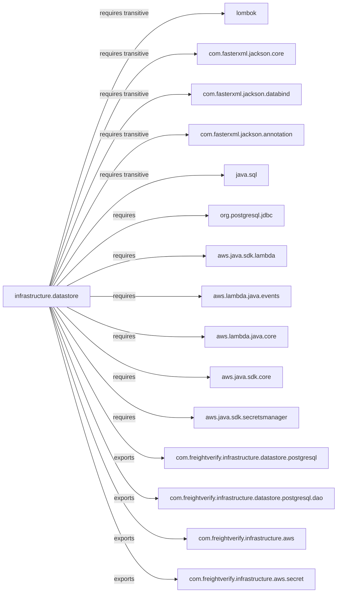

# Diagram: platform-java-lambdas/infrastructure/datastore/src/main/java/module-info.java

> Auto-generated by Obscura crawlers

## Mermaid

### SVG

<svg id="container" width="899.0625" xmlns="http://www.w3.org/2000/svg" class="flowchart" height="1526" viewBox="0 0 899.0625 1526" role="graphics-document document" aria-roledescription="flowchart-v2"><g><marker id="container_flowchart-v2-pointEnd" class="marker flowchart-v2" viewBox="0 0 10 10" refX="5" refY="5" markerUnits="userSpaceOnUse" markerWidth="8" markerHeight="8" orient="auto"><path d="M 0 0 L 10 5 L 0 10 z" class="arrowMarkerPath" style="stroke-width: 1; stroke-dasharray: 1, 0;"></path></marker><marker id="container_flowchart-v2-pointStart" class="marker flowchart-v2" viewBox="0 0 10 10" refX="4.5" refY="5" markerUnits="userSpaceOnUse" markerWidth="8" markerHeight="8" orient="auto"><path d="M 0 5 L 10 10 L 10 0 z" class="arrowMarkerPath" style="stroke-width: 1; stroke-dasharray: 1, 0;"></path></marker><marker id="container_flowchart-v2-circleEnd" class="marker flowchart-v2" viewBox="0 0 10 10" refX="11" refY="5" markerUnits="userSpaceOnUse" markerWidth="11" markerHeight="11" orient="auto"><circle cx="5" cy="5" r="5" class="arrowMarkerPath" style="stroke-width: 1; stroke-dasharray: 1, 0;"></circle></marker><marker id="container_flowchart-v2-circleStart" class="marker flowchart-v2" viewBox="0 0 10 10" refX="-1" refY="5" markerUnits="userSpaceOnUse" markerWidth="11" markerHeight="11" orient="auto"><circle cx="5" cy="5" r="5" class="arrowMarkerPath" style="stroke-width: 1; stroke-dasharray: 1, 0;"></circle></marker><marker id="container_flowchart-v2-crossEnd" class="marker cross flowchart-v2" viewBox="0 0 11 11" refX="12" refY="5.2" markerUnits="userSpaceOnUse" markerWidth="11" markerHeight="11" orient="auto"><path d="M 1,1 l 9,9 M 10,1 l -9,9" class="arrowMarkerPath" style="stroke-width: 2; stroke-dasharray: 1, 0;"></path></marker><marker id="container_flowchart-v2-crossStart" class="marker cross flowchart-v2" viewBox="0 0 11 11" refX="-1" refY="5.2" markerUnits="userSpaceOnUse" markerWidth="11" markerHeight="11" orient="auto"><path d="M 1,1 l 9,9 M 10,1 l -9,9" class="arrowMarkerPath" style="stroke-width: 2; stroke-dasharray: 1, 0;"></path></marker><g class="root"><g class="clusters"></g><g class="edgePaths"><path d="M131.722,736L164.966,619.167C198.21,502.333,264.699,268.667,341.965,151.833C419.232,35,507.276,35,551.298,35L595.32,35" id="L_MD_L10_0" class="edge-thickness-normal edge-pattern-solid edge-thickness-normal edge-pattern-solid flowchart-link" style=";" data-edge="true" data-et="edge" data-id="L_MD_L10_0" data-points="W3sieCI6MTMxLjcyMTc2NTUzOTE0ODM1LCJ5Ijo3MzZ9LHsieCI6MzMxLjE4NzUsInkiOjM1fSx7IngiOjU5OS4zMjAzMTI1LCJ5IjozNX1d" marker-end="url(#container_flowchart-v2-pointEnd)"></path><path d="M133.002,736L166.033,636.5C199.064,537,265.126,338,330.452,238.5C395.779,139,460.37,139,492.665,139L524.961,139" id="L_MD_L11_0" class="edge-thickness-normal edge-pattern-solid edge-thickness-normal edge-pattern-solid flowchart-link" style=";" data-edge="true" data-et="edge" data-id="L_MD_L11_0" data-points="W3sieCI6MTMzLjAwMjIxNjA0NTY3MzA3LCJ5Ijo3MzZ9LHsieCI6MzMxLjE4NzUsInkiOjEzOX0seyJ4Ijo1MjguOTYwOTM3NSwieSI6MTM5fV0=" marker-end="url(#container_flowchart-v2-pointEnd)"></path><path d="M134.795,736L167.527,653.833C200.259,571.667,265.723,407.333,327.876,325.167C390.029,243,448.87,243,478.29,243L507.711,243" id="L_MD_L12_0" class="edge-thickness-normal edge-pattern-solid edge-thickness-normal edge-pattern-solid flowchart-link" style=";" data-edge="true" data-et="edge" data-id="L_MD_L12_0" data-points="W3sieCI6MTM0Ljc5NDg0Njc1NDgwNzY4LCJ5Ijo3MzZ9LHsieCI6MzMxLjE4NzUsInkiOjI0M30seyJ4Ijo1MTEuNzEwOTM3NSwieSI6MjQzfV0=" marker-end="url(#container_flowchart-v2-pointEnd)"></path><path d="M137.484,736L169.768,671.167C202.052,606.333,266.62,476.667,327.095,411.833C387.57,347,443.953,347,472.145,347L500.336,347" id="L_MD_L13_0" class="edge-thickness-normal edge-pattern-solid edge-thickness-normal edge-pattern-solid flowchart-link" style=";" data-edge="true" data-et="edge" data-id="L_MD_L13_0" data-points="W3sieCI6MTM3LjQ4Mzc5MjgxODUwOTYsInkiOjczNn0seyJ4IjozMzEuMTg3NSwieSI6MzQ3fSx7IngiOjUwNC4zMzU5Mzc1LCJ5IjozNDd9XQ==" marker-end="url(#container_flowchart-v2-pointEnd)"></path><path d="M141.965,736L173.502,688.5C205.039,641,268.113,546,343.657,498.5C419.201,451,507.214,451,551.22,451L595.227,451" id="L_MD_L14_0" class="edge-thickness-normal edge-pattern-solid edge-thickness-normal edge-pattern-solid flowchart-link" style=";" data-edge="true" data-et="edge" data-id="L_MD_L14_0" data-points="W3sieCI6MTQxLjk2NTM2OTU5MTM0NjE2LCJ5Ijo3MzZ9LHsieCI6MzMxLjE4NzUsInkiOjQ1MX0seyJ4Ijo1OTkuMjI2NTYyNSwieSI6NDUxfV0=" marker-end="url(#container_flowchart-v2-pointEnd)"></path><path d="M150.929,736L180.972,705.833C211.015,675.667,271.101,615.333,338.153,585.167C405.206,555,479.224,555,516.233,555L553.242,555" id="L_MD_L15_0" class="edge-thickness-normal edge-pattern-solid edge-thickness-normal edge-pattern-solid flowchart-link" style=";" data-edge="true" data-et="edge" data-id="L_MD_L15_0" data-points="W3sieCI6MTUwLjkyODUyMzEzNzAxOTIzLCJ5Ijo3MzZ9LHsieCI6MzMxLjE4NzUsInkiOjU1NX0seyJ4Ijo1NTcuMjQyMTg3NSwieSI6NTU1fV0=" marker-end="url(#container_flowchart-v2-pointEnd)"></path><path d="M177.818,736L203.38,723.167C228.941,710.333,280.064,684.667,341.832,671.833C403.599,659,476.01,659,512.216,659L548.422,659" id="L_MD_L16_0" class="edge-thickness-normal edge-pattern-solid edge-thickness-normal edge-pattern-solid flowchart-link" style=";" data-edge="true" data-et="edge" data-id="L_MD_L16_0" data-points="W3sieCI6MTc3LjgxNzk4Mzc3NDAzODQ1LCJ5Ijo3MzZ9LHsieCI6MzMxLjE4NzUsInkiOjY1OX0seyJ4Ijo1NTIuNDIxODc1LCJ5Ijo2NTl9XQ==" marker-end="url(#container_flowchart-v2-pointEnd)"></path><path d="M240.078,763L255.263,763C270.448,763,300.818,763,350.35,763C399.883,763,468.578,763,502.926,763L537.273,763" id="L_MD_L17_0" class="edge-thickness-normal edge-pattern-solid edge-thickness-normal edge-pattern-solid flowchart-link" style=";" data-edge="true" data-et="edge" data-id="L_MD_L17_0" data-points="W3sieCI6MjQwLjA3ODEyNSwieSI6NzYzfSx7IngiOjMzMS4xODc1LCJ5Ijo3NjN9LHsieCI6NTQxLjI3MzQzNzUsInkiOjc2M31d" marker-end="url(#container_flowchart-v2-pointEnd)"></path><path d="M177.818,790L203.38,802.833C228.941,815.667,280.064,841.333,341.367,854.167C402.669,867,474.151,867,509.892,867L545.633,867" id="L_MD_L18_0" class="edge-thickness-normal edge-pattern-solid edge-thickness-normal edge-pattern-solid flowchart-link" style=";" data-edge="true" data-et="edge" data-id="L_MD_L18_0" data-points="W3sieCI6MTc3LjgxNzk4Mzc3NDAzODQ1LCJ5Ijo3OTB9LHsieCI6MzMxLjE4NzUsInkiOjg2N30seyJ4Ijo1NDkuNjMyODEyNSwieSI6ODY3fV0=" marker-end="url(#container_flowchart-v2-pointEnd)"></path><path d="M150.929,790L180.972,820.167C211.015,850.333,271.101,910.667,339.34,940.833C407.578,971,483.969,971,522.164,971L560.359,971" id="L_MD_L19_0" class="edge-thickness-normal edge-pattern-solid edge-thickness-normal edge-pattern-solid flowchart-link" style=";" data-edge="true" data-et="edge" data-id="L_MD_L19_0" data-points="W3sieCI6MTUwLjkyODUyMzEzNzAxOTIzLCJ5Ijo3OTB9LHsieCI6MzMxLjE4NzUsInkiOjk3MX0seyJ4Ijo1NjQuMzU5Mzc1LCJ5Ijo5NzF9XQ==" marker-end="url(#container_flowchart-v2-pointEnd)"></path><path d="M141.965,790L173.502,837.5C205.039,885,268.113,980,330.851,1027.5C393.589,1075,455.99,1075,487.19,1075L518.391,1075" id="L_MD_L20_0" class="edge-thickness-normal edge-pattern-solid edge-thickness-normal edge-pattern-solid flowchart-link" style=";" data-edge="true" data-et="edge" data-id="L_MD_L20_0" data-points="W3sieCI6MTQxLjk2NTM2OTU5MTM0NjE2LCJ5Ijo3OTB9LHsieCI6MzMxLjE4NzUsInkiOjEwNzV9LHsieCI6NTIyLjM5MDYyNSwieSI6MTA3NX1d" marker-end="url(#container_flowchart-v2-pointEnd)"></path><path d="M137.484,790L169.768,854.833C202.052,919.667,266.62,1049.333,316.035,1114.167C365.451,1179,399.714,1179,416.845,1179L433.977,1179" id="L_MD_E1_0" class="edge-thickness-normal edge-pattern-solid edge-thickness-normal edge-pattern-solid flowchart-link" style=";" data-edge="true" data-et="edge" data-id="L_MD_E1_0" data-points="W3sieCI6MTM3LjQ4Mzc5MjgxODUwOTYsInkiOjc5MH0seyJ4IjozMzEuMTg3NSwieSI6MTE3OX0seyJ4Ijo0MzcuOTc2NTYyNSwieSI6MTE3OX1d" marker-end="url(#container_flowchart-v2-pointEnd)"></path><path d="M134.795,790L167.527,872.167C200.259,954.333,265.723,1118.667,312.974,1200.833C360.224,1283,389.26,1283,403.779,1283L418.297,1283" id="L_MD_E2_0" class="edge-thickness-normal edge-pattern-solid edge-thickness-normal edge-pattern-solid flowchart-link" style=";" data-edge="true" data-et="edge" data-id="L_MD_E2_0" data-points="W3sieCI6MTM0Ljc5NDg0Njc1NDgwNzY4LCJ5Ijo3OTB9LHsieCI6MzMxLjE4NzUsInkiOjEyODN9LHsieCI6NDIyLjI5Njg3NSwieSI6MTI4M31d" marker-end="url(#container_flowchart-v2-pointEnd)"></path><path d="M133.002,790L166.033,889.5C199.064,989,265.126,1188,325.416,1287.5C385.706,1387,440.224,1387,467.483,1387L494.742,1387" id="L_MD_E3_0" class="edge-thickness-normal edge-pattern-solid edge-thickness-normal edge-pattern-solid flowchart-link" style=";" data-edge="true" data-et="edge" data-id="L_MD_E3_0" data-points="W3sieCI6MTMzLjAwMjIxNjA0NTY3MzA3LCJ5Ijo3OTB9LHsieCI6MzMxLjE4NzUsInkiOjEzODd9LHsieCI6NDk4Ljc0MjE4NzUsInkiOjEzODd9XQ==" marker-end="url(#container_flowchart-v2-pointEnd)"></path><path d="M131.722,790L164.966,906.833C198.21,1023.667,264.699,1257.333,321.208,1374.167C377.716,1491,424.245,1491,447.509,1491L470.773,1491" id="L_MD_E4_0" class="edge-thickness-normal edge-pattern-solid edge-thickness-normal edge-pattern-solid flowchart-link" style=";" data-edge="true" data-et="edge" data-id="L_MD_E4_0" data-points="W3sieCI6MTMxLjcyMTc2NTUzOTE0ODM1LCJ5Ijo3OTB9LHsieCI6MzMxLjE4NzUsInkiOjE0OTF9LHsieCI6NDc0Ljc3MzQzNzUsInkiOjE0OTF9XQ==" marker-end="url(#container_flowchart-v2-pointEnd)"></path></g><g class="edgeLabels"><g class="edgeLabel" transform="translate(331.1875, 35)"><g class="label" data-id="L_MD_L10_0" transform="translate(-66.109375, -12)"><foreignObject width="132.21875" height="24">

requires transitive

</foreignObject></g></g><g class="edgeLabel" transform="translate(331.1875, 139)"><g class="label" data-id="L_MD_L11_0" transform="translate(-66.109375, -12)"><foreignObject width="132.21875" height="24">

requires transitive

</foreignObject></g></g><g class="edgeLabel" transform="translate(331.1875, 243)"><g class="label" data-id="L_MD_L12_0" transform="translate(-66.109375, -12)"><foreignObject width="132.21875" height="24">

requires transitive

</foreignObject></g></g><g class="edgeLabel" transform="translate(331.1875, 347)"><g class="label" data-id="L_MD_L13_0" transform="translate(-66.109375, -12)"><foreignObject width="132.21875" height="24">

requires transitive

</foreignObject></g></g><g class="edgeLabel" transform="translate(331.1875, 451)"><g class="label" data-id="L_MD_L14_0" transform="translate(-66.109375, -12)"><foreignObject width="132.21875" height="24">

requires transitive

</foreignObject></g></g><g class="edgeLabel" transform="translate(331.1875, 555)"><g class="label" data-id="L_MD_L15_0" transform="translate(-29.8515625, -12)"><foreignObject width="59.703125" height="24">

requires

</foreignObject></g></g><g class="edgeLabel" transform="translate(331.1875, 659)"><g class="label" data-id="L_MD_L16_0" transform="translate(-29.8515625, -12)"><foreignObject width="59.703125" height="24">

requires

</foreignObject></g></g><g class="edgeLabel" transform="translate(331.1875, 763)"><g class="label" data-id="L_MD_L17_0" transform="translate(-29.8515625, -12)"><foreignObject width="59.703125" height="24">

requires

</foreignObject></g></g><g class="edgeLabel" transform="translate(331.1875, 867)"><g class="label" data-id="L_MD_L18_0" transform="translate(-29.8515625, -12)"><foreignObject width="59.703125" height="24">

requires

</foreignObject></g></g><g class="edgeLabel" transform="translate(331.1875, 971)"><g class="label" data-id="L_MD_L19_0" transform="translate(-29.8515625, -12)"><foreignObject width="59.703125" height="24">

requires

</foreignObject></g></g><g class="edgeLabel" transform="translate(331.1875, 1075)"><g class="label" data-id="L_MD_L20_0" transform="translate(-29.8515625, -12)"><foreignObject width="59.703125" height="24">

requires

</foreignObject></g></g><g class="edgeLabel" transform="translate(331.1875, 1179)"><g class="label" data-id="L_MD_E1_0" transform="translate(-27.3046875, -12)"><foreignObject width="54.609375" height="24">

exports

</foreignObject></g></g><g class="edgeLabel" transform="translate(331.1875, 1283)"><g class="label" data-id="L_MD_E2_0" transform="translate(-27.3046875, -12)"><foreignObject width="54.609375" height="24">

exports

</foreignObject></g></g><g class="edgeLabel" transform="translate(331.1875, 1387)"><g class="label" data-id="L_MD_E3_0" transform="translate(-27.3046875, -12)"><foreignObject width="54.609375" height="24">

exports

</foreignObject></g></g><g class="edgeLabel" transform="translate(331.1875, 1491)"><g class="label" data-id="L_MD_E4_0" transform="translate(-27.3046875, -12)"><foreignObject width="54.609375" height="24">

exports

</foreignObject></g></g></g><g class="nodes"><g class="node default" id="flowchart-MD-0" transform="translate(124.0390625, 763)"><rect class="basic label-container" style="" x="-116.0390625" y="-27" width="232.078125" height="54"></rect><g class="label" style="" transform="translate(-86.0390625, -12)"><rect></rect><foreignObject width="172.078125" height="24">

infrastructure.datastore

</foreignObject></g></g><g class="node default" id="flowchart-L10-1" transform="translate(656.6796875, 35)"><rect class="basic label-container" style="" x="-57.359375" y="-27" width="114.71875" height="54"></rect><g class="label" style="" transform="translate(-27.359375, -12)"><rect></rect><foreignObject width="54.71875" height="24">

lombok

</foreignObject></g></g><g class="node default" id="flowchart-L11-2" transform="translate(656.6796875, 139)"><rect class="basic label-container" style="" x="-127.71875" y="-27" width="255.4375" height="54"></rect><g class="label" style="" transform="translate(-97.71875, -12)"><rect></rect><foreignObject width="195.4375" height="24">

com.fasterxml.jackson.core

</foreignObject></g></g><g class="node default" id="flowchart-L12-3" transform="translate(656.6796875, 243)"><rect class="basic label-container" style="" x="-144.96875" y="-27" width="289.9375" height="54"></rect><g class="label" style="" transform="translate(-114.96875, -12)"><rect></rect><foreignObject width="229.9375" height="24">

com.fasterxml.jackson.databind

</foreignObject></g></g><g class="node default" id="flowchart-L13-4" transform="translate(656.6796875, 347)"><rect class="basic label-container" style="" x="-152.34375" y="-27" width="304.6875" height="54"></rect><g class="label" style="" transform="translate(-122.34375, -12)"><rect></rect><foreignObject width="244.6875" height="24">

com.fasterxml.jackson.annotation

</foreignObject></g></g><g class="node default" id="flowchart-L14-5" transform="translate(656.6796875, 451)"><rect class="basic label-container" style="" x="-57.453125" y="-27" width="114.90625" height="54"></rect><g class="label" style="" transform="translate(-27.453125, -12)"><rect></rect><foreignObject width="54.90625" height="24">

java.sql

</foreignObject></g></g><g class="node default" id="flowchart-L15-6" transform="translate(656.6796875, 555)"><rect class="basic label-container" style="" x="-99.4375" y="-27" width="198.875" height="54"></rect><g class="label" style="" transform="translate(-69.4375, -12)"><rect></rect><foreignObject width="138.875" height="24">

org.postgresql.jdbc

</foreignObject></g></g><g class="node default" id="flowchart-L16-7" transform="translate(656.6796875, 659)"><rect class="basic label-container" style="" x="-104.2578125" y="-27" width="208.515625" height="54"></rect><g class="label" style="" transform="translate(-74.2578125, -12)"><rect></rect><foreignObject width="148.515625" height="24">

aws.java.sdk.lambda

</foreignObject></g></g><g class="node default" id="flowchart-L17-8" transform="translate(656.6796875, 763)"><rect class="basic label-container" style="" x="-115.40625" y="-27" width="230.8125" height="54"></rect><g class="label" style="" transform="translate(-85.40625, -12)"><rect></rect><foreignObject width="170.8125" height="24">

aws.lambda.java.events

</foreignObject></g></g><g class="node default" id="flowchart-L18-9" transform="translate(656.6796875, 867)"><rect class="basic label-container" style="" x="-107.046875" y="-27" width="214.09375" height="54"></rect><g class="label" style="" transform="translate(-77.046875, -12)"><rect></rect><foreignObject width="154.09375" height="24">

aws.lambda.java.core

</foreignObject></g></g><g class="node default" id="flowchart-L19-10" transform="translate(656.6796875, 971)"><rect class="basic label-container" style="" x="-92.3203125" y="-27" width="184.640625" height="54"></rect><g class="label" style="" transform="translate(-62.3203125, -12)"><rect></rect><foreignObject width="124.640625" height="24">

aws.java.sdk.core

</foreignObject></g></g><g class="node default" id="flowchart-L20-11" transform="translate(656.6796875, 1075)"><rect class="basic label-container" style="" x="-134.2890625" y="-27" width="268.578125" height="54"></rect><g class="label" style="" transform="translate(-104.2890625, -12)"><rect></rect><foreignObject width="208.578125" height="24">

aws.java.sdk.secretsmanager

</foreignObject></g></g><g class="node default" id="flowchart-E1-12" transform="translate(656.6796875, 1179)"><rect class="basic label-container" style="" x="-218.703125" y="-27" width="437.40625" height="54"></rect><g class="label" style="" transform="translate(-188.703125, -12)"><rect></rect><foreignObject width="377.40625" height="24">

com.freightverify.infrastructure.datastore.postgresql

</foreignObject></g></g><g class="node default" id="flowchart-E2-13" transform="translate(656.6796875, 1283)"><rect class="basic label-container" style="" x="-234.3828125" y="-27" width="468.765625" height="54"></rect><g class="label" style="" transform="translate(-204.3828125, -12)"><rect></rect><foreignObject width="408.765625" height="24">

com.freightverify.infrastructure.datastore.postgresql.dao

</foreignObject></g></g><g class="node default" id="flowchart-E3-14" transform="translate(656.6796875, 1387)"><rect class="basic label-container" style="" x="-157.9375" y="-27" width="315.875" height="54"></rect><g class="label" style="" transform="translate(-127.9375, -12)"><rect></rect><foreignObject width="255.875" height="24">

com.freightverify.infrastructure.aws

</foreignObject></g></g><g class="node default" id="flowchart-E4-15" transform="translate(656.6796875, 1491)"><rect class="basic label-container" style="" x="-181.90625" y="-27" width="363.8125" height="54"></rect><g class="label" style="" transform="translate(-151.90625, -12)"><rect></rect><foreignObject width="303.8125" height="24">

com.freightverify.infrastructure.aws.secret

</foreignObject></g></g></g></g></g></svg>
