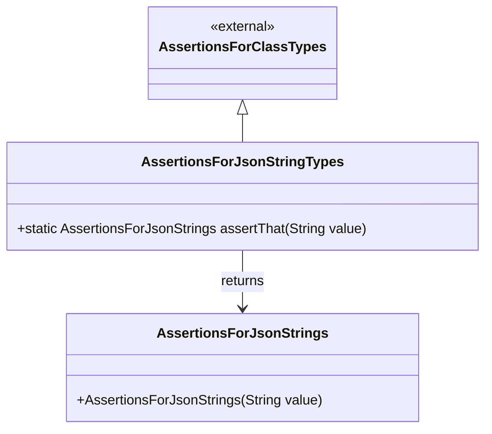

# Diagram: platform-java-lambdas/infrastructure/testing/src/main/java/com/freightverify/infrastructure/testing/assertions/AssertionsForJsonStringTypes.java

> Auto-generated by Obscura crawlers

## Mermaid

> SVG rendering failed for this diagram.
