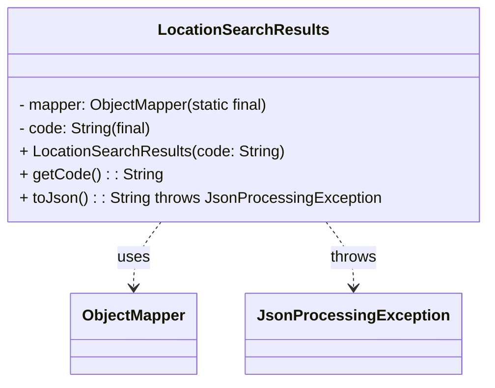

# Diagram: platform-java-lambdas/location/src/main/java/com/freightverify/location/LocationSearchResults.java

> Auto-generated by Obscura crawlers

## Mermaid

### SVG

<svg id="container" width="491.375" xmlns="http://www.w3.org/2000/svg" class="classDiagram" height="396" viewBox="0 0 491.375 396" role="graphics-document document" aria-roledescription="class"><g><defs><marker id="container_class-aggregationStart" class="marker aggregation class" refX="18" refY="7" markerWidth="190" markerHeight="240" orient="auto"><path d="M 18,7 L9,13 L1,7 L9,1 Z"></path></marker></defs><defs><marker id="container_class-aggregationEnd" class="marker aggregation class" refX="1" refY="7" markerWidth="20" markerHeight="28" orient="auto"><path d="M 18,7 L9,13 L1,7 L9,1 Z"></path></marker></defs><defs><marker id="container_class-extensionStart" class="marker extension class" refX="18" refY="7" markerWidth="190" markerHeight="240" orient="auto"><path d="M 1,7 L18,13 V 1 Z"></path></marker></defs><defs><marker id="container_class-extensionEnd" class="marker extension class" refX="1" refY="7" markerWidth="20" markerHeight="28" orient="auto"><path d="M 1,1 V 13 L18,7 Z"></path></marker></defs><defs><marker id="container_class-compositionStart" class="marker composition class" refX="18" refY="7" markerWidth="190" markerHeight="240" orient="auto"><path d="M 18,7 L9,13 L1,7 L9,1 Z"></path></marker></defs><defs><marker id="container_class-compositionEnd" class="marker composition class" refX="1" refY="7" markerWidth="20" markerHeight="28" orient="auto"><path d="M 18,7 L9,13 L1,7 L9,1 Z"></path></marker></defs><defs><marker id="container_class-dependencyStart" class="marker dependency class" refX="6" refY="7" markerWidth="190" markerHeight="240" orient="auto"><path d="M 5,7 L9,13 L1,7 L9,1 Z"></path></marker></defs><defs><marker id="container_class-dependencyEnd" class="marker dependency class" refX="13" refY="7" markerWidth="20" markerHeight="28" orient="auto"><path d="M 18,7 L9,13 L14,7 L9,1 Z"></path></marker></defs><defs><marker id="container_class-lollipopStart" class="marker lollipop class" refX="13" refY="7" markerWidth="190" markerHeight="240" orient="auto"><circle stroke="black" fill="transparent" cx="7" cy="7" r="6"></circle></marker></defs><defs><marker id="container_class-lollipopEnd" class="marker lollipop class" refX="1" refY="7" markerWidth="190" markerHeight="240" orient="auto"><circle stroke="black" fill="transparent" cx="7" cy="7" r="6"></circle></marker></defs><g class="root"><g class="clusters"></g><g class="edgePaths"><path d="M164.518,230L160.008,236.167C155.499,242.333,146.48,254.667,141.97,266C137.461,277.333,137.461,287.667,137.461,292.833L137.461,298" id="id_LocationSearchResults_ObjectMapper_1" class="edge-thickness-normal edge-pattern-dashed relation" style=";;;" data-edge="true" data-et="edge" data-id="id_LocationSearchResults_ObjectMapper_1" data-points="W3sieCI6MTY0LjUxNzU3ODEyNSwieSI6MjMwfSx7IngiOjEzNy40NjA5Mzc1LCJ5IjoyNjd9LHsieCI6MTM3LjQ2MDkzNzUsInkiOjMwNH1d" marker-end="url(#container_class-dependencyEnd)"></path><path d="M326.857,230L331.367,236.167C335.876,242.333,344.895,254.667,349.405,266C353.914,277.333,353.914,287.667,353.914,292.833L353.914,298" id="id_LocationSearchResults_JsonProcessingException_2" class="edge-thickness-normal edge-pattern-dashed relation" style=";;;" data-edge="true" data-et="edge" data-id="id_LocationSearchResults_JsonProcessingException_2" data-points="W3sieCI6MzI2Ljg1NzQyMTg3NSwieSI6MjMwfSx7IngiOjM1My45MTQwNjI1LCJ5IjoyNjd9LHsieCI6MzUzLjkxNDA2MjUsInkiOjMwNH1d" marker-end="url(#container_class-dependencyEnd)"></path></g><g class="edgeLabels"><g class="edgeLabel" transform="translate(137.4609375, 267)"><g class="label" data-id="id_LocationSearchResults_ObjectMapper_1" transform="translate(-16.4921875, -12)"><foreignObject width="32.984375" height="24">

uses

</foreignObject></g></g><g class="edgeLabel" transform="translate(353.9140625, 267)"><g class="label" data-id="id_LocationSearchResults_JsonProcessingException_2" transform="translate(-24.5703125, -12)"><foreignObject width="49.140625" height="24">

throws

</foreignObject></g></g></g><g class="nodes"><g class="node default" id="classId-LocationSearchResults-0" transform="translate(245.6875, 119)"><g class="basic label-container"><path d="M-237.6875 -111 L237.6875 -111 L237.6875 111 L-237.6875 111" stroke="none" stroke-width="0" fill="#ECECFF" style=""></path><path d="M-237.6875 -111 C-131.0820436935176 -111, -24.47658738703518 -111, 237.6875 -111 M-237.6875 -111 C-62.54759258989597 -111, 112.59231482020806 -111, 237.6875 -111 M237.6875 -111 C237.6875 -34.84055465886526, 237.6875 41.31889068226948, 237.6875 111 M237.6875 -111 C237.6875 -48.92960927533929, 237.6875 13.140781449321423, 237.6875 111 M237.6875 111 C141.54895309100073 111, 45.41040618200148 111, -237.6875 111 M237.6875 111 C88.45026358851925 111, -60.7869728229615 111, -237.6875 111 M-237.6875 111 C-237.6875 52.09495779372323, -237.6875 -6.810084412553536, -237.6875 -111 M-237.6875 111 C-237.6875 22.94791262573635, -237.6875 -65.1041747485273, -237.6875 -111" stroke="#9370DB" stroke-width="1.3" fill="none" stroke-dasharray="0 0" style=""></path></g><g class="annotation-group text" transform="translate(0, -87)"></g><g class="label-group text" transform="translate(-83.0625, -87)"><g class="label" style="font-weight: bolder" transform="translate(0,-12)"><foreignObject width="166.125" height="24">

LocationSearchResults

</foreignObject></g></g><g class="members-group text" transform="translate(-225.6875, -39)"></g><g class="methods-group text" transform="translate(-225.6875, -9)"><g class="label" style="" transform="translate(0,-12)"><foreignObject width="263.703125" height="24">

- mapper: ObjectMapper(static final)

</foreignObject></g><g class="label" style="" transform="translate(0,12)"><foreignObject width="138.796875" height="24">

- code: String(final)

</foreignObject></g><g class="label" style="" transform="translate(0,36)"><foreignObject width="272.21875" height="24">

+ LocationSearchResults(code: String)

</foreignObject></g><g class="label" style="" transform="translate(0,60)"><foreignObject width="144.71875" height="24">

+ getCode() : : String

</foreignObject></g><g class="label" style="" transform="translate(0,84)"><foreignObject width="368.3125" height="24">

+ toJson() : : String throws JsonProcessingException

</foreignObject></g></g><g class="divider" style=""><path d="M-237.6875 -63 C-67.51397448198037 -63, 102.65955103603926 -63, 237.6875 -63 M-237.6875 -63 C-124.25558315835251 -63, -10.823666316705015 -63, 237.6875 -63" stroke="#9370DB" stroke-width="1.3" fill="none" stroke-dasharray="0 0" style=""></path></g><g class="divider" style=""><path d="M-237.6875 -39 C-69.84004119269935 -39, 98.00741761460131 -39, 237.6875 -39 M-237.6875 -39 C-73.1449334269538 -39, 91.3976331460924 -39, 237.6875 -39" stroke="#9370DB" stroke-width="1.3" fill="none" stroke-dasharray="0 0" style=""></path></g></g><g class="node default" id="classId-ObjectMapper-1" transform="translate(137.4609375, 346)"><g class="basic label-container"><path d="M-63.7421875 -42 L63.7421875 -42 L63.7421875 42 L-63.7421875 42" stroke="none" stroke-width="0" fill="#ECECFF" style=""></path><path d="M-63.7421875 -42 C-30.4100860812707 -42, 2.9220153374586033 -42, 63.7421875 -42 M-63.7421875 -42 C-36.796197750925 -42, -9.850208001850014 -42, 63.7421875 -42 M63.7421875 -42 C63.7421875 -18.20540514275181, 63.7421875 5.589189714496378, 63.7421875 42 M63.7421875 -42 C63.7421875 -8.491763142018783, 63.7421875 25.016473715962434, 63.7421875 42 M63.7421875 42 C14.234008371146537 42, -35.274170757706926 42, -63.7421875 42 M63.7421875 42 C25.203457644459462 42, -13.335272211081076 42, -63.7421875 42 M-63.7421875 42 C-63.7421875 16.62162948349199, -63.7421875 -8.75674103301602, -63.7421875 -42 M-63.7421875 42 C-63.7421875 21.96442010749543, -63.7421875 1.9288402149908634, -63.7421875 -42" stroke="#9370DB" stroke-width="1.3" fill="none" stroke-dasharray="0 0" style=""></path></g><g class="annotation-group text" transform="translate(0, -18)"></g><g class="label-group text" transform="translate(-51.7421875, -18)"><g class="label" style="font-weight: bolder" transform="translate(0,-12)"><foreignObject width="103.484375" height="24">

ObjectMapper

</foreignObject></g></g><g class="members-group text" transform="translate(-51.7421875, 30)"></g><g class="methods-group text" transform="translate(-51.7421875, 60)"></g><g class="divider" style=""><path d="M-63.7421875 6 C-25.598483423369316 6, 12.545220653261367 6, 63.7421875 6 M-63.7421875 6 C-15.924155607068734 6, 31.893876285862532 6, 63.7421875 6" stroke="#9370DB" stroke-width="1.3" fill="none" stroke-dasharray="0 0" style=""></path></g><g class="divider" style=""><path d="M-63.7421875 24 C-28.95256987789508 24, 5.8370477442098405 24, 63.7421875 24 M-63.7421875 24 C-34.9796328363911 24, -6.217078172782195 24, 63.7421875 24" stroke="#9370DB" stroke-width="1.3" fill="none" stroke-dasharray="0 0" style=""></path></g></g><g class="node default" id="classId-JsonProcessingException-2" transform="translate(353.9140625, 346)"><g class="basic label-container"><path d="M-102.7109375 -42 L102.7109375 -42 L102.7109375 42 L-102.7109375 42" stroke="none" stroke-width="0" fill="#ECECFF" style=""></path><path d="M-102.7109375 -42 C-21.935425913806853 -42, 58.840085672386294 -42, 102.7109375 -42 M-102.7109375 -42 C-37.01062661958552 -42, 28.689684260828955 -42, 102.7109375 -42 M102.7109375 -42 C102.7109375 -15.930798551063177, 102.7109375 10.138402897873647, 102.7109375 42 M102.7109375 -42 C102.7109375 -20.399448075420384, 102.7109375 1.2011038491592316, 102.7109375 42 M102.7109375 42 C56.61501032675572 42, 10.519083153511446 42, -102.7109375 42 M102.7109375 42 C27.043768523983744 42, -48.62340045203251 42, -102.7109375 42 M-102.7109375 42 C-102.7109375 18.76221840892309, -102.7109375 -4.47556318215382, -102.7109375 -42 M-102.7109375 42 C-102.7109375 14.336623371010596, -102.7109375 -13.326753257978808, -102.7109375 -42" stroke="#9370DB" stroke-width="1.3" fill="none" stroke-dasharray="0 0" style=""></path></g><g class="annotation-group text" transform="translate(0, -18)"></g><g class="label-group text" transform="translate(-90.7109375, -18)"><g class="label" style="font-weight: bolder" transform="translate(0,-12)"><foreignObject width="181.421875" height="24">

JsonProcessingException

</foreignObject></g></g><g class="members-group text" transform="translate(-90.7109375, 30)"></g><g class="methods-group text" transform="translate(-90.7109375, 60)"></g><g class="divider" style=""><path d="M-102.7109375 6 C-48.5646988154129 6, 5.581539869174193 6, 102.7109375 6 M-102.7109375 6 C-60.707230080249225 6, -18.70352266049845 6, 102.7109375 6" stroke="#9370DB" stroke-width="1.3" fill="none" stroke-dasharray="0 0" style=""></path></g><g class="divider" style=""><path d="M-102.7109375 24 C-59.596087905865005 24, -16.48123831173001 24, 102.7109375 24 M-102.7109375 24 C-46.21429944200906 24, 10.282338615981885 24, 102.7109375 24" stroke="#9370DB" stroke-width="1.3" fill="none" stroke-dasharray="0 0" style=""></path></g></g></g></g></g></svg>
