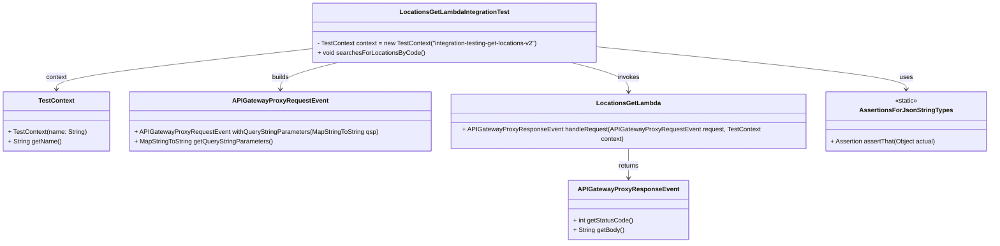
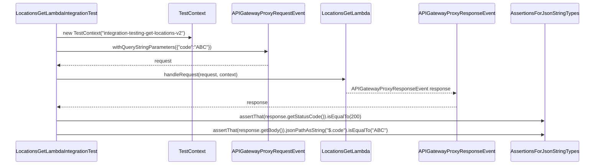

# Diagram: platform-java-lambdas/location/src/test/java/com/freightverify/location/lambda/LocationsGetLambdaIntegrationTest.java

> Auto-generated by Obscura crawlers

## Diagram 1

### SVG

<svg id="container" width="2484.03125" xmlns="http://www.w3.org/2000/svg" class="classDiagram" height="614" viewBox="0 0 2484.03125 614" role="graphics-document document" aria-roledescription="class"><g><defs><marker id="container_class-aggregationStart" class="marker aggregation class" refX="18" refY="7" markerWidth="190" markerHeight="240" orient="auto"><path d="M 18,7 L9,13 L1,7 L9,1 Z"></path></marker></defs><defs><marker id="container_class-aggregationEnd" class="marker aggregation class" refX="1" refY="7" markerWidth="20" markerHeight="28" orient="auto"><path d="M 18,7 L9,13 L1,7 L9,1 Z"></path></marker></defs><defs><marker id="container_class-extensionStart" class="marker extension class" refX="18" refY="7" markerWidth="190" markerHeight="240" orient="auto"><path d="M 1,7 L18,13 V 1 Z"></path></marker></defs><defs><marker id="container_class-extensionEnd" class="marker extension class" refX="1" refY="7" markerWidth="20" markerHeight="28" orient="auto"><path d="M 1,1 V 13 L18,7 Z"></path></marker></defs><defs><marker id="container_class-compositionStart" class="marker composition class" refX="18" refY="7" markerWidth="190" markerHeight="240" orient="auto"><path d="M 18,7 L9,13 L1,7 L9,1 Z"></path></marker></defs><defs><marker id="container_class-compositionEnd" class="marker composition class" refX="1" refY="7" markerWidth="20" markerHeight="28" orient="auto"><path d="M 18,7 L9,13 L1,7 L9,1 Z"></path></marker></defs><defs><marker id="container_class-dependencyStart" class="marker dependency class" refX="6" refY="7" markerWidth="190" markerHeight="240" orient="auto"><path d="M 5,7 L9,13 L1,7 L9,1 Z"></path></marker></defs><defs><marker id="container_class-dependencyEnd" class="marker dependency class" refX="13" refY="7" markerWidth="20" markerHeight="28" orient="auto"><path d="M 18,7 L9,13 L14,7 L9,1 Z"></path></marker></defs><defs><marker id="container_class-lollipopStart" class="marker lollipop class" refX="13" refY="7" markerWidth="190" markerHeight="240" orient="auto"><circle stroke="black" fill="transparent" cx="7" cy="7" r="6"></circle></marker></defs><defs><marker id="container_class-lollipopEnd" class="marker lollipop class" refX="1" refY="7" markerWidth="190" markerHeight="240" orient="auto"><circle stroke="black" fill="transparent" cx="7" cy="7" r="6"></circle></marker></defs><g class="root"><g class="clusters"></g><g class="edgePaths"><path d="M773.295,123.868L667.901,135.723C562.507,147.578,351.718,171.289,246.324,188.311C140.93,205.333,140.93,215.667,140.93,220.833L140.93,226" id="id_LocationsGetLambdaIntegrationTest_TestContext_1" class="edge-thickness-normal edge-pattern-solid relation" style=";;;" data-edge="true" data-et="edge" data-id="id_LocationsGetLambdaIntegrationTest_TestContext_1" data-points="W3sieCI6NzczLjI5NDkyMTg3NSwieSI6MTIzLjg2NzY0MDc5OTAwMDM3fSx7IngiOjE0MC45Mjk2ODc1LCJ5IjoxOTV9LHsieCI6MTQwLjkyOTY4NzUsInkiOjIzMn1d" marker-end="url(#container_class-dependencyEnd)"></path><path d="M843.274,158L819.155,164.167C795.037,170.333,746.8,182.667,722.681,194C698.563,205.333,698.563,215.667,698.563,220.833L698.563,226" id="id_LocationsGetLambdaIntegrationTest_APIGatewayProxyRequestEvent_2" class="edge-thickness-normal edge-pattern-solid relation" style=";;;" data-edge="true" data-et="edge" data-id="id_LocationsGetLambdaIntegrationTest_APIGatewayProxyRequestEvent_2" data-points="W3sieCI6ODQzLjI3Mzc2ODgzMzcwNTQsInkiOjE1OH0seyJ4Ijo2OTguNTYyNSwieSI6MTk1fSx7IngiOjY5OC41NjI1LCJ5IjoyMzJ9XQ==" marker-end="url(#container_class-dependencyEnd)"></path><path d="M1429.941,158L1454.06,164.167C1478.178,170.333,1526.415,182.667,1550.534,196C1574.652,209.333,1574.652,223.667,1574.652,230.833L1574.652,238" id="id_LocationsGetLambdaIntegrationTest_LocationsGetLambda_3" class="edge-thickness-normal edge-pattern-solid relation" style=";;;" data-edge="true" data-et="edge" data-id="id_LocationsGetLambdaIntegrationTest_LocationsGetLambda_3" data-points="W3sieCI6MTQyOS45NDEwNzQ5MTYyOTQ2LCJ5IjoxNTh9LHsieCI6MTU3NC42NTIzNDM3NSwieSI6MTk1fSx7IngiOjE1NzQuNjUyMzQzNzUsInkiOjI0NH1d" marker-end="url(#container_class-dependencyEnd)"></path><path d="M1499.92,118.712L1629.272,131.426C1758.625,144.141,2017.33,169.571,2146.683,187.452C2276.035,205.333,2276.035,215.667,2276.035,220.833L2276.035,226" id="id_LocationsGetLambdaIntegrationTest_AssertionsForJsonStringTypes_4" class="edge-thickness-normal edge-pattern-solid relation" style=";;;" data-edge="true" data-et="edge" data-id="id_LocationsGetLambdaIntegrationTest_AssertionsForJsonStringTypes_4" data-points="W3sieCI6MTQ5OS45MTk5MjE4NzUsInkiOjExOC43MTE3ODY1MTU2NDA1N30seyJ4IjoyMjc2LjAzNTE1NjI1LCJ5IjoxOTV9LHsieCI6MjI3Ni4wMzUxNTYyNSwieSI6MjMyfV0=" marker-end="url(#container_class-dependencyEnd)"></path><path d="M1574.652,370L1574.652,378.167C1574.652,386.333,1574.652,402.667,1574.652,416C1574.652,429.333,1574.652,439.667,1574.652,444.833L1574.652,450" id="id_LocationsGetLambda_APIGatewayProxyResponseEvent_5" class="edge-thickness-normal edge-pattern-solid relation" style=";;;" data-edge="true" data-et="edge" data-id="id_LocationsGetLambda_APIGatewayProxyResponseEvent_5" data-points="W3sieCI6MTU3NC42NTIzNDM3NSwieSI6MzcwfSx7IngiOjE1NzQuNjUyMzQzNzUsInkiOjQxOX0seyJ4IjoxNTc0LjY1MjM0Mzc1LCJ5Ijo0NTZ9XQ==" marker-end="url(#container_class-dependencyEnd)"></path></g><g class="edgeLabels"><g class="edgeLabel" transform="translate(140.9296875, 195)"><g class="label" data-id="id_LocationsGetLambdaIntegrationTest_TestContext_1" transform="translate(-26.8515625, -12)"><foreignObject width="53.703125" height="24">

context

</foreignObject></g></g><g class="edgeLabel" transform="translate(698.5625, 195)"><g class="label" data-id="id_LocationsGetLambdaIntegrationTest_APIGatewayProxyRequestEvent_2" transform="translate(-22.4921875, -12)"><foreignObject width="44.984375" height="24">

builds

</foreignObject></g></g><g class="edgeLabel" transform="translate(1574.65234375, 195)"><g class="label" data-id="id_LocationsGetLambdaIntegrationTest_LocationsGetLambda_3" transform="translate(-27.5859375, -12)"><foreignObject width="55.171875" height="24">

invokes

</foreignObject></g></g><g class="edgeLabel" transform="translate(2276.03515625, 195)"><g class="label" data-id="id_LocationsGetLambdaIntegrationTest_AssertionsForJsonStringTypes_4" transform="translate(-16.4921875, -12)"><foreignObject width="32.984375" height="24">

uses

</foreignObject></g></g><g class="edgeLabel" transform="translate(1574.65234375, 419)"><g class="label" data-id="id_LocationsGetLambda_APIGatewayProxyResponseEvent_5" transform="translate(-26.265625, -12)"><foreignObject width="52.53125" height="24">

returns

</foreignObject></g></g></g><g class="nodes"><g class="node default" id="classId-LocationsGetLambdaIntegrationTest-0" transform="translate(1136.607421875, 83)"><g class="basic label-container"><path d="M-363.3125 -75 L363.3125 -75 L363.3125 75 L-363.3125 75" stroke="none" stroke-width="0" fill="#ECECFF" style=""></path><path d="M-363.3125 -75 C-208.23188387438344 -75, -53.151267748766884 -75, 363.3125 -75 M-363.3125 -75 C-181.11806091710184 -75, 1.0763781657963136 -75, 363.3125 -75 M363.3125 -75 C363.3125 -31.85339874305565, 363.3125 11.293202513888701, 363.3125 75 M363.3125 -75 C363.3125 -37.05074771362693, 363.3125 0.898504572746134, 363.3125 75 M363.3125 75 C140.80515535215565 75, -81.7021892956887 75, -363.3125 75 M363.3125 75 C121.97825360715683 75, -119.35599278568634 75, -363.3125 75 M-363.3125 75 C-363.3125 20.58548471545842, -363.3125 -33.82903056908316, -363.3125 -75 M-363.3125 75 C-363.3125 26.352380839213822, -363.3125 -22.295238321572356, -363.3125 -75" stroke="#9370DB" stroke-width="1.3" fill="none" stroke-dasharray="0 0" style=""></path></g><g class="annotation-group text" transform="translate(0, -51)"></g><g class="label-group text" transform="translate(-132.921875, -51)"><g class="label" style="font-weight: bolder" transform="translate(0,-12)"><foreignObject width="265.84375" height="24">

LocationsGetLambdaIntegrationTest

</foreignObject></g></g><g class="members-group text" transform="translate(-351.3125, -3)"></g><g class="methods-group text" transform="translate(-351.3125, 27)"><g class="label" style="" transform="translate(0,-12)"><foreignObject width="569.703125" height="24">

- TestContext context = new TestContext("integration-testing-get-locations-v2")

</foreignObject></g><g class="label" style="" transform="translate(0,12)"><foreignObject width="268" height="24">

+ void searchesForLocationsByCode()

</foreignObject></g></g><g class="divider" style=""><path d="M-363.3125 -27 C-173.7291779454163 -27, 15.854144109167407 -27, 363.3125 -27 M-363.3125 -27 C-130.23733752690472 -27, 102.83782494619055 -27, 363.3125 -27" stroke="#9370DB" stroke-width="1.3" fill="none" stroke-dasharray="0 0" style=""></path></g><g class="divider" style=""><path d="M-363.3125 -3 C-135.00131480571304 -3, 93.30987038857393 -3, 363.3125 -3 M-363.3125 -3 C-192.54630832317594 -3, -21.78011664635187 -3, 363.3125 -3" stroke="#9370DB" stroke-width="1.3" fill="none" stroke-dasharray="0 0" style=""></path></g></g><g class="node default" id="classId-TestContext-1" transform="translate(140.9296875, 307)"><g class="basic label-container"><path d="M-132.9296875 -75 L132.9296875 -75 L132.9296875 75 L-132.9296875 75" stroke="none" stroke-width="0" fill="#ECECFF" style=""></path><path d="M-132.9296875 -75 C-60.80150202962405 -75, 11.326683440751907 -75, 132.9296875 -75 M-132.9296875 -75 C-57.92572465560799 -75, 17.078238188784013 -75, 132.9296875 -75 M132.9296875 -75 C132.9296875 -24.754390996277124, 132.9296875 25.491218007445752, 132.9296875 75 M132.9296875 -75 C132.9296875 -43.39080922983047, 132.9296875 -11.781618459660926, 132.9296875 75 M132.9296875 75 C68.51526724136602 75, 4.100846982732037 75, -132.9296875 75 M132.9296875 75 C56.41143933447725 75, -20.106808831045498 75, -132.9296875 75 M-132.9296875 75 C-132.9296875 30.829333243936176, -132.9296875 -13.341333512127648, -132.9296875 -75 M-132.9296875 75 C-132.9296875 29.389783072584194, -132.9296875 -16.22043385483161, -132.9296875 -75" stroke="#9370DB" stroke-width="1.3" fill="none" stroke-dasharray="0 0" style=""></path></g><g class="annotation-group text" transform="translate(0, -51)"></g><g class="label-group text" transform="translate(-43.421875, -51)"><g class="label" style="font-weight: bolder" transform="translate(0,-12)"><foreignObject width="86.84375" height="24">

TestContext

</foreignObject></g></g><g class="members-group text" transform="translate(-120.9296875, -3)"></g><g class="methods-group text" transform="translate(-120.9296875, 27)"><g class="label" style="" transform="translate(0,-12)"><foreignObject width="198.4375" height="24">

+ TestContext(name: String)

</foreignObject></g><g class="label" style="" transform="translate(0,12)"><foreignObject width="134.34375" height="24">

+ String getName()

</foreignObject></g></g><g class="divider" style=""><path d="M-132.9296875 -27 C-46.57823760493855 -27, 39.7732122901229 -27, 132.9296875 -27 M-132.9296875 -27 C-53.434472554698885 -27, 26.06074239060223 -27, 132.9296875 -27" stroke="#9370DB" stroke-width="1.3" fill="none" stroke-dasharray="0 0" style=""></path></g><g class="divider" style=""><path d="M-132.9296875 -3 C-51.67705349128023 -3, 29.575580517439533 -3, 132.9296875 -3 M-132.9296875 -3 C-57.880010245875184 -3, 17.169667008249633 -3, 132.9296875 -3" stroke="#9370DB" stroke-width="1.3" fill="none" stroke-dasharray="0 0" style=""></path></g></g><g class="node default" id="classId-APIGatewayProxyRequestEvent-2" transform="translate(698.5625, 307)"><g class="basic label-container"><path d="M-374.703125 -75 L374.703125 -75 L374.703125 75 L-374.703125 75" stroke="none" stroke-width="0" fill="#ECECFF" style=""></path><path d="M-374.703125 -75 C-206.14772867082212 -75, -37.59233234164424 -75, 374.703125 -75 M-374.703125 -75 C-221.67008557971158 -75, -68.63704615942316 -75, 374.703125 -75 M374.703125 -75 C374.703125 -17.33963845358062, 374.703125 40.32072309283876, 374.703125 75 M374.703125 -75 C374.703125 -31.757395256404635, 374.703125 11.48520948719073, 374.703125 75 M374.703125 75 C128.68298807365377 75, -117.33714885269245 75, -374.703125 75 M374.703125 75 C130.167075429899 75, -114.368974140202 75, -374.703125 75 M-374.703125 75 C-374.703125 34.45491292245417, -374.703125 -6.09017415509166, -374.703125 -75 M-374.703125 75 C-374.703125 34.7776639599554, -374.703125 -5.444672080089205, -374.703125 -75" stroke="#9370DB" stroke-width="1.3" fill="none" stroke-dasharray="0 0" style=""></path></g><g class="annotation-group text" transform="translate(0, -51)"></g><g class="label-group text" transform="translate(-113.65625, -51)"><g class="label" style="font-weight: bolder" transform="translate(0,-12)"><foreignObject width="227.3125" height="24">

APIGatewayProxyRequestEvent

</foreignObject></g></g><g class="members-group text" transform="translate(-362.703125, -3)"></g><g class="methods-group text" transform="translate(-362.703125, 27)"><g class="label" style="" transform="translate(0,-12)"><foreignObject width="611.75" height="24">

+ APIGatewayProxyRequestEvent withQueryStringParameters(MapStringToString qsp)

</foreignObject></g><g class="label" style="" transform="translate(0,12)"><foreignObject width="350.109375" height="24">

+ MapStringToString getQueryStringParameters()

</foreignObject></g></g><g class="divider" style=""><path d="M-374.703125 -27 C-220.24959340008542 -27, -65.79606180017083 -27, 374.703125 -27 M-374.703125 -27 C-202.02865888803757 -27, -29.354192776075138 -27, 374.703125 -27" stroke="#9370DB" stroke-width="1.3" fill="none" stroke-dasharray="0 0" style=""></path></g><g class="divider" style=""><path d="M-374.703125 -3 C-122.93330914941055 -3, 128.8365067011789 -3, 374.703125 -3 M-374.703125 -3 C-198.79460946421722 -3, -22.886093928434434 -3, 374.703125 -3" stroke="#9370DB" stroke-width="1.3" fill="none" stroke-dasharray="0 0" style=""></path></g></g><g class="node default" id="classId-LocationsGetLambda-3" transform="translate(1574.65234375, 307)"><g class="basic label-container"><path d="M-451.38671875 -63 L451.38671875 -63 L451.38671875 63 L-451.38671875 63" stroke="none" stroke-width="0" fill="#ECECFF" style=""></path><path d="M-451.38671875 -63 C-234.2439348429831 -63, -17.10115093596619 -63, 451.38671875 -63 M-451.38671875 -63 C-181.93738521191625 -63, 87.5119483261675 -63, 451.38671875 -63 M451.38671875 -63 C451.38671875 -32.235098622535524, 451.38671875 -1.4701972450710485, 451.38671875 63 M451.38671875 -63 C451.38671875 -19.451626941551595, 451.38671875 24.09674611689681, 451.38671875 63 M451.38671875 63 C175.5468997074198 63, -100.29291933516038 63, -451.38671875 63 M451.38671875 63 C152.61451580559805 63, -146.1576871388039 63, -451.38671875 63 M-451.38671875 63 C-451.38671875 19.045958510399274, -451.38671875 -24.908082979201453, -451.38671875 -63 M-451.38671875 63 C-451.38671875 27.424225525144244, -451.38671875 -8.151548949711511, -451.38671875 -63" stroke="#9370DB" stroke-width="1.3" fill="none" stroke-dasharray="0 0" style=""></path></g><g class="annotation-group text" transform="translate(0, -39)"></g><g class="label-group text" transform="translate(-77.0078125, -39)"><g class="label" style="font-weight: bolder" transform="translate(0,-12)"><foreignObject width="154.015625" height="24">

LocationsGetLambda

</foreignObject></g></g><g class="members-group text" transform="translate(-439.38671875, 9)"></g><g class="methods-group text" transform="translate(-439.38671875, 39)"><g class="label" style="" transform="translate(0,-12)"><foreignObject width="801.765625" height="24">

+ APIGatewayProxyResponseEvent handleRequest(APIGatewayProxyRequestEvent request, TestContext context)

</foreignObject></g></g><g class="divider" style=""><path d="M-451.38671875 -15 C-118.32964509021724 -15, 214.72742856956552 -15, 451.38671875 -15 M-451.38671875 -15 C-184.80379153019226 -15, 81.77913568961549 -15, 451.38671875 -15" stroke="#9370DB" stroke-width="1.3" fill="none" stroke-dasharray="0 0" style=""></path></g><g class="divider" style=""><path d="M-451.38671875 9 C-268.7970216368493 9, -86.20732452369862 9, 451.38671875 9 M-451.38671875 9 C-218.80738837648778 9, 13.771941997024442 9, 451.38671875 9" stroke="#9370DB" stroke-width="1.3" fill="none" stroke-dasharray="0 0" style=""></path></g></g><g class="node default" id="classId-APIGatewayProxyResponseEvent-4" transform="translate(1574.65234375, 531)"><g class="basic label-container"><path d="M-147.0546875 -75 L147.0546875 -75 L147.0546875 75 L-147.0546875 75" stroke="none" stroke-width="0" fill="#ECECFF" style=""></path><path d="M-147.0546875 -75 C-80.68601778070571 -75, -14.317348061411423 -75, 147.0546875 -75 M-147.0546875 -75 C-34.10927026144623 -75, 78.83614697710755 -75, 147.0546875 -75 M147.0546875 -75 C147.0546875 -39.81528212120416, 147.0546875 -4.630564242408326, 147.0546875 75 M147.0546875 -75 C147.0546875 -41.80372277525423, 147.0546875 -8.607445550508459, 147.0546875 75 M147.0546875 75 C76.84617548284224 75, 6.637663465684483 75, -147.0546875 75 M147.0546875 75 C60.04824803267012 75, -26.958191434659767 75, -147.0546875 75 M-147.0546875 75 C-147.0546875 31.22262871435133, -147.0546875 -12.55474257129734, -147.0546875 -75 M-147.0546875 75 C-147.0546875 36.681091292634186, -147.0546875 -1.6378174147316287, -147.0546875 -75" stroke="#9370DB" stroke-width="1.3" fill="none" stroke-dasharray="0 0" style=""></path></g><g class="annotation-group text" transform="translate(0, -51)"></g><g class="label-group text" transform="translate(-119.125, -51)"><g class="label" style="font-weight: bolder" transform="translate(0,-12)"><foreignObject width="238.25" height="24">

APIGatewayProxyResponseEvent

</foreignObject></g></g><g class="members-group text" transform="translate(-135.0546875, -3)"></g><g class="methods-group text" transform="translate(-135.0546875, 27)"><g class="label" style="" transform="translate(0,-12)"><foreignObject width="150.984375" height="24">

+ int getStatusCode()

</foreignObject></g><g class="label" style="" transform="translate(0,12)"><foreignObject width="128.796875" height="24">

+ String getBody()

</foreignObject></g></g><g class="divider" style=""><path d="M-147.0546875 -27 C-85.47448990091222 -27, -23.894292301824436 -27, 147.0546875 -27 M-147.0546875 -27 C-77.85463039703313 -27, -8.654573294066267 -27, 147.0546875 -27" stroke="#9370DB" stroke-width="1.3" fill="none" stroke-dasharray="0 0" style=""></path></g><g class="divider" style=""><path d="M-147.0546875 -3 C-36.370960914486574 -3, 74.31276567102685 -3, 147.0546875 -3 M-147.0546875 -3 C-66.91806440544725 -3, 13.218558689105492 -3, 147.0546875 -3" stroke="#9370DB" stroke-width="1.3" fill="none" stroke-dasharray="0 0" style=""></path></g></g><g class="node default" id="classId-AssertionsForJsonStringTypes-5" transform="translate(2276.03515625, 307)"><g class="basic label-container"><path d="M-199.99609375 -75 L199.99609375 -75 L199.99609375 75 L-199.99609375 75" stroke="none" stroke-width="0" fill="#ECECFF" style=""></path><path d="M-199.99609375 -75 C-85.23590891801001 -75, 29.524275913979977 -75, 199.99609375 -75 M-199.99609375 -75 C-86.6649545243531 -75, 26.666184701293787 -75, 199.99609375 -75 M199.99609375 -75 C199.99609375 -15.818621978610395, 199.99609375 43.36275604277921, 199.99609375 75 M199.99609375 -75 C199.99609375 -31.550249049979215, 199.99609375 11.899501900041571, 199.99609375 75 M199.99609375 75 C112.58219630802135 75, 25.168298866042704 75, -199.99609375 75 M199.99609375 75 C72.70042312297974 75, -54.595247504040515 75, -199.99609375 75 M-199.99609375 75 C-199.99609375 42.641310810298144, -199.99609375 10.282621620596288, -199.99609375 -75 M-199.99609375 75 C-199.99609375 29.57423615242839, -199.99609375 -15.851527695143218, -199.99609375 -75" stroke="#9370DB" stroke-width="1.3" fill="none" stroke-dasharray="0 0" style=""></path></g><g class="annotation-group text" transform="translate(-29.0234375, -51)"><g class="label" style="" transform="translate(0,-12)"><foreignObject width="58.046875" height="24">

«static»

</foreignObject></g></g><g class="label-group text" transform="translate(-109.0546875, -27)"><g class="label" style="font-weight: bolder" transform="translate(0,-12)"><foreignObject width="218.109375" height="24">

AssertionsForJsonStringTypes

</foreignObject></g></g><g class="members-group text" transform="translate(-187.99609375, 21)"></g><g class="methods-group text" transform="translate(-187.99609375, 51)"><g class="label" style="" transform="translate(0,-12)"><foreignObject width="266.9375" height="24">

+ Assertion assertThat(Object actual)

</foreignObject></g></g><g class="divider" style=""><path d="M-199.99609375 -3 C-98.71964152295939 -3, 2.556810704081215 -3, 199.99609375 -3 M-199.99609375 -3 C-58.21250970397716 -3, 83.57107434204568 -3, 199.99609375 -3" stroke="#9370DB" stroke-width="1.3" fill="none" stroke-dasharray="0 0" style=""></path></g><g class="divider" style=""><path d="M-199.99609375 21 C-48.903353589452735 21, 102.18938657109453 21, 199.99609375 21 M-199.99609375 21 C-57.669486242456 21, 84.657121265088 21, 199.99609375 21" stroke="#9370DB" stroke-width="1.3" fill="none" stroke-dasharray="0 0" style=""></path></g></g></g></g></g></svg>

## Diagram 2

### SVG

<svg id="container" width="1999" xmlns="http://www.w3.org/2000/svg" height="555" viewBox="-50 -10 1999 555" role="graphics-document document" aria-roledescription="sequence"><g><rect x="1666" y="469" fill="#eaeaea" stroke="#666" width="233" height="65" name="Assert" rx="3" ry="3" class="actor actor-bottom"></rect><text x="1782.5" y="501.5" dominant-baseline="central" alignment-baseline="central" class="actor actor-box" style="text-anchor: middle; font-size: 16px; font-weight: 400;"><tspan x="1782.5" dy="0">AssertionsForJsonStringTypes</tspan></text></g><g><rect x="1362" y="469" fill="#eaeaea" stroke="#666" width="254" height="65" name="Resp" rx="3" ry="3" class="actor actor-bottom"></rect><text x="1489" y="501.5" dominant-baseline="central" alignment-baseline="central" class="actor actor-box" style="text-anchor: middle; font-size: 16px; font-weight: 400;"><tspan x="1489" dy="0">APIGatewayProxyResponseEvent</tspan></text></g><g><rect x="1029" y="469" fill="#eaeaea" stroke="#666" width="172" height="65" name="Lambda" rx="3" ry="3" class="actor actor-bottom"></rect><text x="1115" y="501.5" dominant-baseline="central" alignment-baseline="central" class="actor actor-box" style="text-anchor: middle; font-size: 16px; font-weight: 400;"><tspan x="1115" dy="0">LocationsGetLambda</tspan></text></g><g><rect x="736" y="469" fill="#eaeaea" stroke="#666" width="243" height="65" name="Req" rx="3" ry="3" class="actor actor-bottom"></rect><text x="857.5" y="501.5" dominant-baseline="central" alignment-baseline="central" class="actor actor-box" style="text-anchor: middle; font-size: 16px; font-weight: 400;"><tspan x="857.5" dy="0">APIGatewayProxyRequestEvent</tspan></text></g><g><rect x="536" y="469" fill="#eaeaea" stroke="#666" width="150" height="65" name="Ctx" rx="3" ry="3" class="actor actor-bottom"></rect><text x="611" y="501.5" dominant-baseline="central" alignment-baseline="central" class="actor actor-box" style="text-anchor: middle; font-size: 16px; font-weight: 400;"><tspan x="611" dy="0">TestContext</tspan></text></g><g><rect x="0" y="469" fill="#eaeaea" stroke="#666" width="282" height="65" name="Test" rx="3" ry="3" class="actor actor-bottom"></rect><text x="141" y="501.5" dominant-baseline="central" alignment-baseline="central" class="actor actor-box" style="text-anchor: middle; font-size: 16px; font-weight: 400;"><tspan x="141" dy="0">LocationsGetLambdaIntegrationTest</tspan></text></g><g><line id="actor5" x1="1782.5" y1="65" x2="1782.5" y2="469" class="actor-line 200" stroke-width="0.5px" stroke="#999" name="Assert"></line><g id="root-5"><rect x="1666" y="0" fill="#eaeaea" stroke="#666" width="233" height="65" name="Assert" rx="3" ry="3" class="actor actor-top"></rect><text x="1782.5" y="32.5" dominant-baseline="central" alignment-baseline="central" class="actor actor-box" style="text-anchor: middle; font-size: 16px; font-weight: 400;"><tspan x="1782.5" dy="0">AssertionsForJsonStringTypes</tspan></text></g></g><g><line id="actor4" x1="1489" y1="65" x2="1489" y2="469" class="actor-line 200" stroke-width="0.5px" stroke="#999" name="Resp"></line><g id="root-4"><rect x="1362" y="0" fill="#eaeaea" stroke="#666" width="254" height="65" name="Resp" rx="3" ry="3" class="actor actor-top"></rect><text x="1489" y="32.5" dominant-baseline="central" alignment-baseline="central" class="actor actor-box" style="text-anchor: middle; font-size: 16px; font-weight: 400;"><tspan x="1489" dy="0">APIGatewayProxyResponseEvent</tspan></text></g></g><g><line id="actor3" x1="1115" y1="65" x2="1115" y2="469" class="actor-line 200" stroke-width="0.5px" stroke="#999" name="Lambda"></line><g id="root-3"><rect x="1029" y="0" fill="#eaeaea" stroke="#666" width="172" height="65" name="Lambda" rx="3" ry="3" class="actor actor-top"></rect><text x="1115" y="32.5" dominant-baseline="central" alignment-baseline="central" class="actor actor-box" style="text-anchor: middle; font-size: 16px; font-weight: 400;"><tspan x="1115" dy="0">LocationsGetLambda</tspan></text></g></g><g><line id="actor2" x1="857.5" y1="65" x2="857.5" y2="469" class="actor-line 200" stroke-width="0.5px" stroke="#999" name="Req"></line><g id="root-2"><rect x="736" y="0" fill="#eaeaea" stroke="#666" width="243" height="65" name="Req" rx="3" ry="3" class="actor actor-top"></rect><text x="857.5" y="32.5" dominant-baseline="central" alignment-baseline="central" class="actor actor-box" style="text-anchor: middle; font-size: 16px; font-weight: 400;"><tspan x="857.5" dy="0">APIGatewayProxyRequestEvent</tspan></text></g></g><g><line id="actor1" x1="611" y1="65" x2="611" y2="469" class="actor-line 200" stroke-width="0.5px" stroke="#999" name="Ctx"></line><g id="root-1"><rect x="536" y="0" fill="#eaeaea" stroke="#666" width="150" height="65" name="Ctx" rx="3" ry="3" class="actor actor-top"></rect><text x="611" y="32.5" dominant-baseline="central" alignment-baseline="central" class="actor actor-box" style="text-anchor: middle; font-size: 16px; font-weight: 400;"><tspan x="611" dy="0">TestContext</tspan></text></g></g><g><line id="actor0" x1="141" y1="65" x2="141" y2="469" class="actor-line 200" stroke-width="0.5px" stroke="#999" name="Test"></line><g id="root-0"><rect x="0" y="0" fill="#eaeaea" stroke="#666" width="282" height="65" name="Test" rx="3" ry="3" class="actor actor-top"></rect><text x="141" y="32.5" dominant-baseline="central" alignment-baseline="central" class="actor actor-box" style="text-anchor: middle; font-size: 16px; font-weight: 400;"><tspan x="141" dy="0">LocationsGetLambdaIntegrationTest</tspan></text></g></g><g></g><defs><symbol id="computer" width="24" height="24"><path transform="scale(.5)" d="M2 2v13h20v-13h-20zm18 11h-16v-9h16v9zm-10.228 6l.466-1h3.524l.467 1h-4.457zm14.228 3h-24l2-6h2.104l-1.33 4h18.45l-1.297-4h2.073l2 6zm-5-10h-14v-7h14v7z"></path></symbol></defs><defs><symbol id="database" fill-rule="evenodd" clip-rule="evenodd"><path transform="scale(.5)" d="M12.258.001l.256.004.255.005.253.008.251.01.249.012.247.015.246.016.242.019.241.02.239.023.236.024.233.027.231.028.229.031.225.032.223.034.22.036.217.038.214.04.211.041.208.043.205.045.201.046.198.048.194.05.191.051.187.053.183.054.18.056.175.057.172.059.168.06.163.061.16.063.155.064.15.066.074.033.073.033.071.034.07.034.069.035.068.035.067.035.066.035.064.036.064.036.062.036.06.036.06.037.058.037.058.037.055.038.055.038.053.038.052.038.051.039.05.039.048.039.047.039.045.04.044.04.043.04.041.04.04.041.039.041.037.041.036.041.034.041.033.042.032.042.03.042.029.042.027.042.026.043.024.043.023.043.021.043.02.043.018.044.017.043.015.044.013.044.012.044.011.045.009.044.007.045.006.045.004.045.002.045.001.045v17l-.001.045-.002.045-.004.045-.006.045-.007.045-.009.044-.011.045-.012.044-.013.044-.015.044-.017.043-.018.044-.02.043-.021.043-.023.043-.024.043-.026.043-.027.042-.029.042-.03.042-.032.042-.033.042-.034.041-.036.041-.037.041-.039.041-.04.041-.041.04-.043.04-.044.04-.045.04-.047.039-.048.039-.05.039-.051.039-.052.038-.053.038-.055.038-.055.038-.058.037-.058.037-.06.037-.06.036-.062.036-.064.036-.064.036-.066.035-.067.035-.068.035-.069.035-.07.034-.071.034-.073.033-.074.033-.15.066-.155.064-.16.063-.163.061-.168.06-.172.059-.175.057-.18.056-.183.054-.187.053-.191.051-.194.05-.198.048-.201.046-.205.045-.208.043-.211.041-.214.04-.217.038-.22.036-.223.034-.225.032-.229.031-.231.028-.233.027-.236.024-.239.023-.241.02-.242.019-.246.016-.247.015-.249.012-.251.01-.253.008-.255.005-.256.004-.258.001-.258-.001-.256-.004-.255-.005-.253-.008-.251-.01-.249-.012-.247-.015-.245-.016-.243-.019-.241-.02-.238-.023-.236-.024-.234-.027-.231-.028-.228-.031-.226-.032-.223-.034-.22-.036-.217-.038-.214-.04-.211-.041-.208-.043-.204-.045-.201-.046-.198-.048-.195-.05-.19-.051-.187-.053-.184-.054-.179-.056-.176-.057-.172-.059-.167-.06-.164-.061-.159-.063-.155-.064-.151-.066-.074-.033-.072-.033-.072-.034-.07-.034-.069-.035-.068-.035-.067-.035-.066-.035-.064-.036-.063-.036-.062-.036-.061-.036-.06-.037-.058-.037-.057-.037-.056-.038-.055-.038-.053-.038-.052-.038-.051-.039-.049-.039-.049-.039-.046-.039-.046-.04-.044-.04-.043-.04-.041-.04-.04-.041-.039-.041-.037-.041-.036-.041-.034-.041-.033-.042-.032-.042-.03-.042-.029-.042-.027-.042-.026-.043-.024-.043-.023-.043-.021-.043-.02-.043-.018-.044-.017-.043-.015-.044-.013-.044-.012-.044-.011-.045-.009-.044-.007-.045-.006-.045-.004-.045-.002-.045-.001-.045v-17l.001-.045.002-.045.004-.045.006-.045.007-.045.009-.044.011-.045.012-.044.013-.044.015-.044.017-.043.018-.044.02-.043.021-.043.023-.043.024-.043.026-.043.027-.042.029-.042.03-.042.032-.042.033-.042.034-.041.036-.041.037-.041.039-.041.04-.041.041-.04.043-.04.044-.04.046-.04.046-.039.049-.039.049-.039.051-.039.052-.038.053-.038.055-.038.056-.038.057-.037.058-.037.06-.037.061-.036.062-.036.063-.036.064-.036.066-.035.067-.035.068-.035.069-.035.07-.034.072-.034.072-.033.074-.033.151-.066.155-.064.159-.063.164-.061.167-.06.172-.059.176-.057.179-.056.184-.054.187-.053.19-.051.195-.05.198-.048.201-.046.204-.045.208-.043.211-.041.214-.04.217-.038.22-.036.223-.034.226-.032.228-.031.231-.028.234-.027.236-.024.238-.023.241-.02.243-.019.245-.016.247-.015.249-.012.251-.01.253-.008.255-.005.256-.004.258-.001.258.001zm-9.258 20.499v.01l.001.021.003.021.004.022.005.021.006.022.007.022.009.023.01.022.011.023.012.023.013.023.015.023.016.024.017.023.018.024.019.024.021.024.022.025.023.024.024.025.052.049.056.05.061.051.066.051.07.051.075.051.079.052.084.052.088.052.092.052.097.052.102.051.105.052.11.052.114.051.119.051.123.051.127.05.131.05.135.05.139.048.144.049.147.047.152.047.155.047.16.045.163.045.167.043.171.043.176.041.178.041.183.039.187.039.19.037.194.035.197.035.202.033.204.031.209.03.212.029.216.027.219.025.222.024.226.021.23.02.233.018.236.016.24.015.243.012.246.01.249.008.253.005.256.004.259.001.26-.001.257-.004.254-.005.25-.008.247-.011.244-.012.241-.014.237-.016.233-.018.231-.021.226-.021.224-.024.22-.026.216-.027.212-.028.21-.031.205-.031.202-.034.198-.034.194-.036.191-.037.187-.039.183-.04.179-.04.175-.042.172-.043.168-.044.163-.045.16-.046.155-.046.152-.047.148-.048.143-.049.139-.049.136-.05.131-.05.126-.05.123-.051.118-.052.114-.051.11-.052.106-.052.101-.052.096-.052.092-.052.088-.053.083-.051.079-.052.074-.052.07-.051.065-.051.06-.051.056-.05.051-.05.023-.024.023-.025.021-.024.02-.024.019-.024.018-.024.017-.024.015-.023.014-.024.013-.023.012-.023.01-.023.01-.022.008-.022.006-.022.006-.022.004-.022.004-.021.001-.021.001-.021v-4.127l-.077.055-.08.053-.083.054-.085.053-.087.052-.09.052-.093.051-.095.05-.097.05-.1.049-.102.049-.105.048-.106.047-.109.047-.111.046-.114.045-.115.045-.118.044-.12.043-.122.042-.124.042-.126.041-.128.04-.13.04-.132.038-.134.038-.135.037-.138.037-.139.035-.142.035-.143.034-.144.033-.147.032-.148.031-.15.03-.151.03-.153.029-.154.027-.156.027-.158.026-.159.025-.161.024-.162.023-.163.022-.165.021-.166.02-.167.019-.169.018-.169.017-.171.016-.173.015-.173.014-.175.013-.175.012-.177.011-.178.01-.179.008-.179.008-.181.006-.182.005-.182.004-.184.003-.184.002h-.37l-.184-.002-.184-.003-.182-.004-.182-.005-.181-.006-.179-.008-.179-.008-.178-.01-.176-.011-.176-.012-.175-.013-.173-.014-.172-.015-.171-.016-.17-.017-.169-.018-.167-.019-.166-.02-.165-.021-.163-.022-.162-.023-.161-.024-.159-.025-.157-.026-.156-.027-.155-.027-.153-.029-.151-.03-.15-.03-.148-.031-.146-.032-.145-.033-.143-.034-.141-.035-.14-.035-.137-.037-.136-.037-.134-.038-.132-.038-.13-.04-.128-.04-.126-.041-.124-.042-.122-.042-.12-.044-.117-.043-.116-.045-.113-.045-.112-.046-.109-.047-.106-.047-.105-.048-.102-.049-.1-.049-.097-.05-.095-.05-.093-.052-.09-.051-.087-.052-.085-.053-.083-.054-.08-.054-.077-.054v4.127zm0-5.654v.011l.001.021.003.021.004.021.005.022.006.022.007.022.009.022.01.022.011.023.012.023.013.023.015.024.016.023.017.024.018.024.019.024.021.024.022.024.023.025.024.024.052.05.056.05.061.05.066.051.07.051.075.052.079.051.084.052.088.052.092.052.097.052.102.052.105.052.11.051.114.051.119.052.123.05.127.051.131.05.135.049.139.049.144.048.147.048.152.047.155.046.16.045.163.045.167.044.171.042.176.042.178.04.183.04.187.038.19.037.194.036.197.034.202.033.204.032.209.03.212.028.216.027.219.025.222.024.226.022.23.02.233.018.236.016.24.014.243.012.246.01.249.008.253.006.256.003.259.001.26-.001.257-.003.254-.006.25-.008.247-.01.244-.012.241-.015.237-.016.233-.018.231-.02.226-.022.224-.024.22-.025.216-.027.212-.029.21-.03.205-.032.202-.033.198-.035.194-.036.191-.037.187-.039.183-.039.179-.041.175-.042.172-.043.168-.044.163-.045.16-.045.155-.047.152-.047.148-.048.143-.048.139-.05.136-.049.131-.05.126-.051.123-.051.118-.051.114-.052.11-.052.106-.052.101-.052.096-.052.092-.052.088-.052.083-.052.079-.052.074-.051.07-.052.065-.051.06-.05.056-.051.051-.049.023-.025.023-.024.021-.025.02-.024.019-.024.018-.024.017-.024.015-.023.014-.023.013-.024.012-.022.01-.023.01-.023.008-.022.006-.022.006-.022.004-.021.004-.022.001-.021.001-.021v-4.139l-.077.054-.08.054-.083.054-.085.052-.087.053-.09.051-.093.051-.095.051-.097.05-.1.049-.102.049-.105.048-.106.047-.109.047-.111.046-.114.045-.115.044-.118.044-.12.044-.122.042-.124.042-.126.041-.128.04-.13.039-.132.039-.134.038-.135.037-.138.036-.139.036-.142.035-.143.033-.144.033-.147.033-.148.031-.15.03-.151.03-.153.028-.154.028-.156.027-.158.026-.159.025-.161.024-.162.023-.163.022-.165.021-.166.02-.167.019-.169.018-.169.017-.171.016-.173.015-.173.014-.175.013-.175.012-.177.011-.178.009-.179.009-.179.007-.181.007-.182.005-.182.004-.184.003-.184.002h-.37l-.184-.002-.184-.003-.182-.004-.182-.005-.181-.007-.179-.007-.179-.009-.178-.009-.176-.011-.176-.012-.175-.013-.173-.014-.172-.015-.171-.016-.17-.017-.169-.018-.167-.019-.166-.02-.165-.021-.163-.022-.162-.023-.161-.024-.159-.025-.157-.026-.156-.027-.155-.028-.153-.028-.151-.03-.15-.03-.148-.031-.146-.033-.145-.033-.143-.033-.141-.035-.14-.036-.137-.036-.136-.037-.134-.038-.132-.039-.13-.039-.128-.04-.126-.041-.124-.042-.122-.043-.12-.043-.117-.044-.116-.044-.113-.046-.112-.046-.109-.046-.106-.047-.105-.048-.102-.049-.1-.049-.097-.05-.095-.051-.093-.051-.09-.051-.087-.053-.085-.052-.083-.054-.08-.054-.077-.054v4.139zm0-5.666v.011l.001.02.003.022.004.021.005.022.006.021.007.022.009.023.01.022.011.023.012.023.013.023.015.023.016.024.017.024.018.023.019.024.021.025.022.024.023.024.024.025.052.05.056.05.061.05.066.051.07.051.075.052.079.051.084.052.088.052.092.052.097.052.102.052.105.051.11.052.114.051.119.051.123.051.127.05.131.05.135.05.139.049.144.048.147.048.152.047.155.046.16.045.163.045.167.043.171.043.176.042.178.04.183.04.187.038.19.037.194.036.197.034.202.033.204.032.209.03.212.028.216.027.219.025.222.024.226.021.23.02.233.018.236.017.24.014.243.012.246.01.249.008.253.006.256.003.259.001.26-.001.257-.003.254-.006.25-.008.247-.01.244-.013.241-.014.237-.016.233-.018.231-.02.226-.022.224-.024.22-.025.216-.027.212-.029.21-.03.205-.032.202-.033.198-.035.194-.036.191-.037.187-.039.183-.039.179-.041.175-.042.172-.043.168-.044.163-.045.16-.045.155-.047.152-.047.148-.048.143-.049.139-.049.136-.049.131-.051.126-.05.123-.051.118-.052.114-.051.11-.052.106-.052.101-.052.096-.052.092-.052.088-.052.083-.052.079-.052.074-.052.07-.051.065-.051.06-.051.056-.05.051-.049.023-.025.023-.025.021-.024.02-.024.019-.024.018-.024.017-.024.015-.023.014-.024.013-.023.012-.023.01-.022.01-.023.008-.022.006-.022.006-.022.004-.022.004-.021.001-.021.001-.021v-4.153l-.077.054-.08.054-.083.053-.085.053-.087.053-.09.051-.093.051-.095.051-.097.05-.1.049-.102.048-.105.048-.106.048-.109.046-.111.046-.114.046-.115.044-.118.044-.12.043-.122.043-.124.042-.126.041-.128.04-.13.039-.132.039-.134.038-.135.037-.138.036-.139.036-.142.034-.143.034-.144.033-.147.032-.148.032-.15.03-.151.03-.153.028-.154.028-.156.027-.158.026-.159.024-.161.024-.162.023-.163.023-.165.021-.166.02-.167.019-.169.018-.169.017-.171.016-.173.015-.173.014-.175.013-.175.012-.177.01-.178.01-.179.009-.179.007-.181.006-.182.006-.182.004-.184.003-.184.001-.185.001-.185-.001-.184-.001-.184-.003-.182-.004-.182-.006-.181-.006-.179-.007-.179-.009-.178-.01-.176-.01-.176-.012-.175-.013-.173-.014-.172-.015-.171-.016-.17-.017-.169-.018-.167-.019-.166-.02-.165-.021-.163-.023-.162-.023-.161-.024-.159-.024-.157-.026-.156-.027-.155-.028-.153-.028-.151-.03-.15-.03-.148-.032-.146-.032-.145-.033-.143-.034-.141-.034-.14-.036-.137-.036-.136-.037-.134-.038-.132-.039-.13-.039-.128-.041-.126-.041-.124-.041-.122-.043-.12-.043-.117-.044-.116-.044-.113-.046-.112-.046-.109-.046-.106-.048-.105-.048-.102-.048-.1-.05-.097-.049-.095-.051-.093-.051-.09-.052-.087-.052-.085-.053-.083-.053-.08-.054-.077-.054v4.153zm8.74-8.179l-.257.004-.254.005-.25.008-.247.011-.244.012-.241.014-.237.016-.233.018-.231.021-.226.022-.224.023-.22.026-.216.027-.212.028-.21.031-.205.032-.202.033-.198.034-.194.036-.191.038-.187.038-.183.04-.179.041-.175.042-.172.043-.168.043-.163.045-.16.046-.155.046-.152.048-.148.048-.143.048-.139.049-.136.05-.131.05-.126.051-.123.051-.118.051-.114.052-.11.052-.106.052-.101.052-.096.052-.092.052-.088.052-.083.052-.079.052-.074.051-.07.052-.065.051-.06.05-.056.05-.051.05-.023.025-.023.024-.021.024-.02.025-.019.024-.018.024-.017.023-.015.024-.014.023-.013.023-.012.023-.01.023-.01.022-.008.022-.006.023-.006.021-.004.022-.004.021-.001.021-.001.021.001.021.001.021.004.021.004.022.006.021.006.023.008.022.01.022.01.023.012.023.013.023.014.023.015.024.017.023.018.024.019.024.02.025.021.024.023.024.023.025.051.05.056.05.06.05.065.051.07.052.074.051.079.052.083.052.088.052.092.052.096.052.101.052.106.052.11.052.114.052.118.051.123.051.126.051.131.05.136.05.139.049.143.048.148.048.152.048.155.046.16.046.163.045.168.043.172.043.175.042.179.041.183.04.187.038.191.038.194.036.198.034.202.033.205.032.21.031.212.028.216.027.22.026.224.023.226.022.231.021.233.018.237.016.241.014.244.012.247.011.25.008.254.005.257.004.26.001.26-.001.257-.004.254-.005.25-.008.247-.011.244-.012.241-.014.237-.016.233-.018.231-.021.226-.022.224-.023.22-.026.216-.027.212-.028.21-.031.205-.032.202-.033.198-.034.194-.036.191-.038.187-.038.183-.04.179-.041.175-.042.172-.043.168-.043.163-.045.16-.046.155-.046.152-.048.148-.048.143-.048.139-.049.136-.05.131-.05.126-.051.123-.051.118-.051.114-.052.11-.052.106-.052.101-.052.096-.052.092-.052.088-.052.083-.052.079-.052.074-.051.07-.052.065-.051.06-.05.056-.05.051-.05.023-.025.023-.024.021-.024.02-.025.019-.024.018-.024.017-.023.015-.024.014-.023.013-.023.012-.023.01-.023.01-.022.008-.022.006-.023.006-.021.004-.022.004-.021.001-.021.001-.021-.001-.021-.001-.021-.004-.021-.004-.022-.006-.021-.006-.023-.008-.022-.01-.022-.01-.023-.012-.023-.013-.023-.014-.023-.015-.024-.017-.023-.018-.024-.019-.024-.02-.025-.021-.024-.023-.024-.023-.025-.051-.05-.056-.05-.06-.05-.065-.051-.07-.052-.074-.051-.079-.052-.083-.052-.088-.052-.092-.052-.096-.052-.101-.052-.106-.052-.11-.052-.114-.052-.118-.051-.123-.051-.126-.051-.131-.05-.136-.05-.139-.049-.143-.048-.148-.048-.152-.048-.155-.046-.16-.046-.163-.045-.168-.043-.172-.043-.175-.042-.179-.041-.183-.04-.187-.038-.191-.038-.194-.036-.198-.034-.202-.033-.205-.032-.21-.031-.212-.028-.216-.027-.22-.026-.224-.023-.226-.022-.231-.021-.233-.018-.237-.016-.241-.014-.244-.012-.247-.011-.25-.008-.254-.005-.257-.004-.26-.001-.26.001z"></path></symbol></defs><defs><symbol id="clock" width="24" height="24"><path transform="scale(.5)" d="M12 2c5.514 0 10 4.486 10 10s-4.486 10-10 10-10-4.486-10-10 4.486-10 10-10zm0-2c-6.627 0-12 5.373-12 12s5.373 12 12 12 12-5.373 12-12-5.373-12-12-12zm5.848 12.459c.202.038.202.333.001.372-1.907.361-6.045 1.111-6.547 1.111-.719 0-1.301-.582-1.301-1.301 0-.512.77-5.447 1.125-7.445.034-.192.312-.181.343.014l.985 6.238 5.394 1.011z"></path></symbol></defs><defs><marker id="arrowhead" refX="7.9" refY="5" markerUnits="userSpaceOnUse" markerWidth="12" markerHeight="12" orient="auto-start-reverse"><path d="M -1 0 L 10 5 L 0 10 z"></path></marker></defs><defs><marker id="crosshead" markerWidth="15" markerHeight="8" orient="auto" refX="4" refY="4.5"><path fill="none" stroke="#000000" stroke-width="1pt" d="M 1,2 L 6,7 M 6,2 L 1,7" style="stroke-dasharray: 0, 0;"></path></marker></defs><defs><marker id="filled-head" refX="15.5" refY="7" markerWidth="20" markerHeight="28" orient="auto"><path d="M 18,7 L9,13 L14,7 L9,1 Z"></path></marker></defs><defs><marker id="sequencenumber" refX="15" refY="15" markerWidth="60" markerHeight="40" orient="auto"><circle cx="15" cy="15" r="6"></circle></marker></defs><text x="375" y="80" text-anchor="middle" dominant-baseline="middle" alignment-baseline="middle" class="messageText" dy="1em" style="font-size: 16px; font-weight: 400;">new TestContext("integration-testing-get-locations-v2")</text><line x1="142" y1="113" x2="607" y2="113" class="messageLine0" stroke-width="2" stroke="none" marker-end="url(#arrowhead)" style="fill: none;"></line><text x="498" y="128" text-anchor="middle" dominant-baseline="middle" alignment-baseline="middle" class="messageText" dy="1em" style="font-size: 16px; font-weight: 400;">withQueryStringParameters({"code":"ABC"})</text><line x1="142" y1="161" x2="853.5" y2="161" class="messageLine0" stroke-width="2" stroke="none" marker-end="url(#arrowhead)" style="fill: none;"></line><text x="501" y="176" text-anchor="middle" dominant-baseline="middle" alignment-baseline="middle" class="messageText" dy="1em" style="font-size: 16px; font-weight: 400;">request</text><line x1="856.5" y1="209" x2="145" y2="209" class="messageLine1" stroke-width="2" stroke="none" marker-end="url(#arrowhead)" style="stroke-dasharray: 3, 3; fill: none;"></line><text x="627" y="224" text-anchor="middle" dominant-baseline="middle" alignment-baseline="middle" class="messageText" dy="1em" style="font-size: 16px; font-weight: 400;">handleRequest(request, context)</text><line x1="142" y1="257" x2="1111" y2="257" class="messageLine0" stroke-width="2" stroke="none" marker-end="url(#arrowhead)" style="fill: none;"></line><text x="1301" y="272" text-anchor="middle" dominant-baseline="middle" alignment-baseline="middle" class="messageText" dy="1em" style="font-size: 16px; font-weight: 400;">APIGatewayProxyResponseEvent response</text><line x1="1116" y1="305" x2="1485" y2="305" class="messageLine1" stroke-width="2" stroke="none" marker-end="url(#arrowhead)" style="stroke-dasharray: 3, 3; fill: none;"></line><text x="817" y="320" text-anchor="middle" dominant-baseline="middle" alignment-baseline="middle" class="messageText" dy="1em" style="font-size: 16px; font-weight: 400;">response</text><line x1="1488" y1="353" x2="145" y2="353" class="messageLine1" stroke-width="2" stroke="none" marker-end="url(#arrowhead)" style="stroke-dasharray: 3, 3; fill: none;"></line><text x="960" y="368" text-anchor="middle" dominant-baseline="middle" alignment-baseline="middle" class="messageText" dy="1em" style="font-size: 16px; font-weight: 400;">assertThat(response.getStatusCode()).isEqualTo(200)</text><line x1="142" y1="401" x2="1778.5" y2="401" class="messageLine0" stroke-width="2" stroke="none" marker-end="url(#arrowhead)" style="fill: none;"></line><text x="960" y="416" text-anchor="middle" dominant-baseline="middle" alignment-baseline="middle" class="messageText" dy="1em" style="font-size: 16px; font-weight: 400;">assertThat(response.getBody()).jsonPathAsString("$.code").isEqualTo("ABC")</text><line x1="142" y1="449" x2="1778.5" y2="449" class="messageLine0" stroke-width="2" stroke="none" marker-end="url(#arrowhead)" style="fill: none;"></line></svg>
