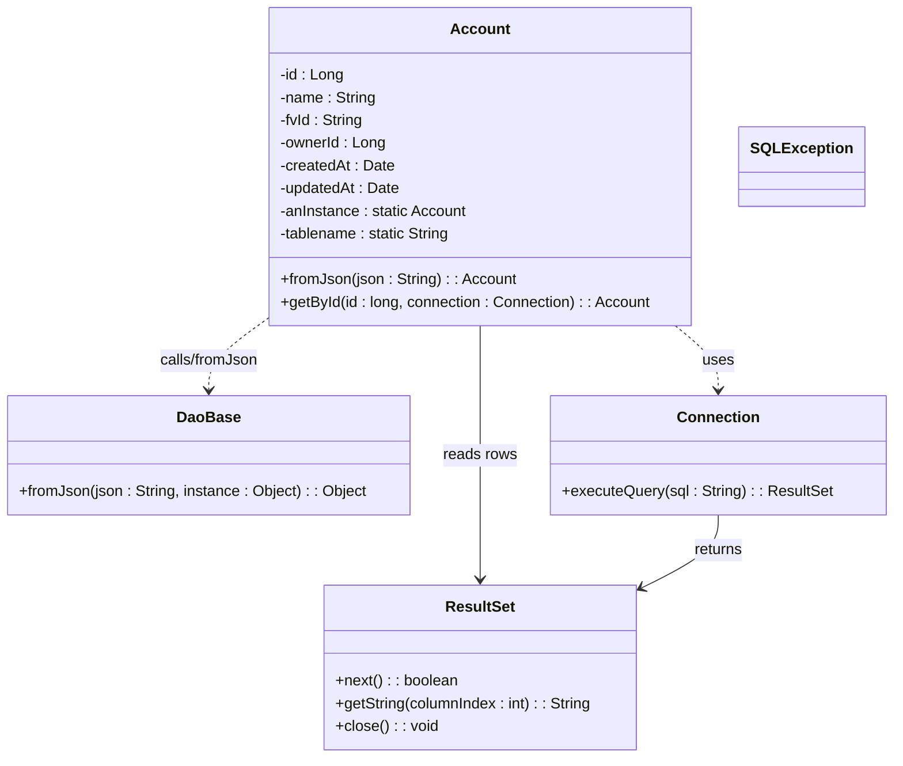
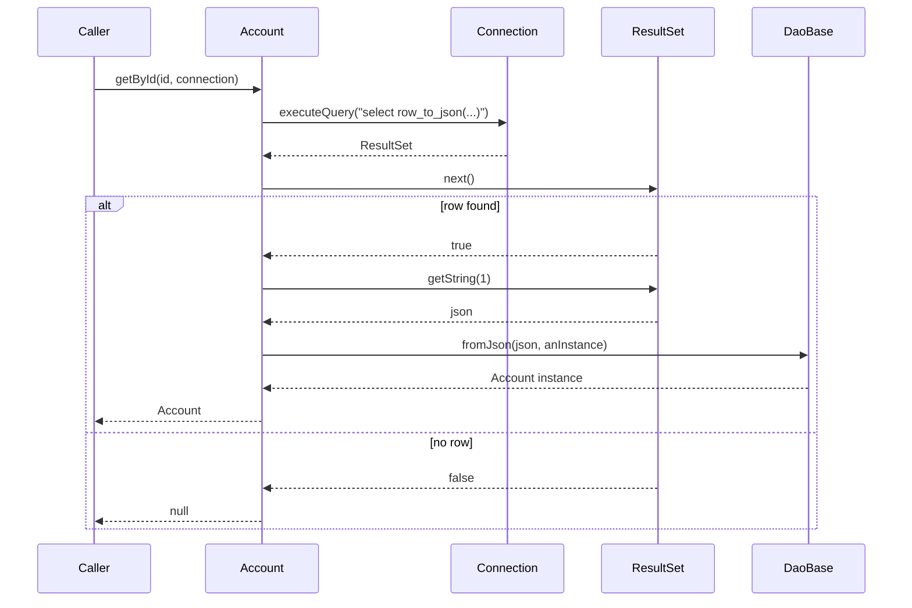

# Diagram: platform-java-lambdas/shipment/src/main/java/com/freightverify/shipment/datastore/postgresql/dao/Account.java

> Auto-generated by Obscura crawlers

## Diagram 1

### SVG

<svg id="container" width="934.703125" xmlns="http://www.w3.org/2000/svg" class="classDiagram" height="800" viewBox="0 0 934.703125 800" role="graphics-document document" aria-roledescription="class"><g><defs><marker id="container_class-aggregationStart" class="marker aggregation class" refX="18" refY="7" markerWidth="190" markerHeight="240" orient="auto"><path d="M 18,7 L9,13 L1,7 L9,1 Z"></path></marker></defs><defs><marker id="container_class-aggregationEnd" class="marker aggregation class" refX="1" refY="7" markerWidth="20" markerHeight="28" orient="auto"><path d="M 18,7 L9,13 L1,7 L9,1 Z"></path></marker></defs><defs><marker id="container_class-extensionStart" class="marker extension class" refX="18" refY="7" markerWidth="190" markerHeight="240" orient="auto"><path d="M 1,7 L18,13 V 1 Z"></path></marker></defs><defs><marker id="container_class-extensionEnd" class="marker extension class" refX="1" refY="7" markerWidth="20" markerHeight="28" orient="auto"><path d="M 1,1 V 13 L18,7 Z"></path></marker></defs><defs><marker id="container_class-compositionStart" class="marker composition class" refX="18" refY="7" markerWidth="190" markerHeight="240" orient="auto"><path d="M 18,7 L9,13 L1,7 L9,1 Z"></path></marker></defs><defs><marker id="container_class-compositionEnd" class="marker composition class" refX="1" refY="7" markerWidth="20" markerHeight="28" orient="auto"><path d="M 18,7 L9,13 L1,7 L9,1 Z"></path></marker></defs><defs><marker id="container_class-dependencyStart" class="marker dependency class" refX="6" refY="7" markerWidth="190" markerHeight="240" orient="auto"><path d="M 5,7 L9,13 L1,7 L9,1 Z"></path></marker></defs><defs><marker id="container_class-dependencyEnd" class="marker dependency class" refX="13" refY="7" markerWidth="20" markerHeight="28" orient="auto"><path d="M 18,7 L9,13 L14,7 L9,1 Z"></path></marker></defs><defs><marker id="container_class-lollipopStart" class="marker lollipop class" refX="13" refY="7" markerWidth="190" markerHeight="240" orient="auto"><circle stroke="black" fill="transparent" cx="7" cy="7" r="6"></circle></marker></defs><defs><marker id="container_class-lollipopEnd" class="marker lollipop class" refX="1" refY="7" markerWidth="190" markerHeight="240" orient="auto"><circle stroke="black" fill="transparent" cx="7" cy="7" r="6"></circle></marker></defs><g class="root"><g class="clusters"></g><g class="edgePaths"><path d="M281.324,336.11L270.922,343.592C260.52,351.073,239.715,366.037,229.313,378.685C218.91,391.333,218.91,401.667,218.91,406.833L218.91,412" id="id_Account_DaoBase_1" class="edge-thickness-normal edge-pattern-dashed relation" style=";;;" data-edge="true" data-et="edge" data-id="id_Account_DaoBase_1" data-points="W3sieCI6MjgxLjMyNDIxODc1LCJ5IjozMzYuMTA5OTgxMjI0Mzg5MX0seyJ4IjoyMTguOTEwMTU2MjUsInkiOjM4MX0seyJ4IjoyMTguOTEwMTU2MjUsInkiOjQxOH1d" marker-end="url(#container_class-dependencyEnd)"></path><path d="M707.538,344L715.012,350.167C722.485,356.333,737.432,368.667,744.905,380C752.379,391.333,752.379,401.667,752.379,406.833L752.379,412" id="id_Account_Connection_2" class="edge-thickness-normal edge-pattern-dashed relation" style=";;;" data-edge="true" data-et="edge" data-id="id_Account_Connection_2" data-points="W3sieCI6NzA3LjUzODI2MjE5NTEyMTksInkiOjM0NH0seyJ4Ijo3NTIuMzc4OTA2MjUsInkiOjM4MX0seyJ4Ijo3NTIuMzc4OTA2MjUsInkiOjQxOH1d" marker-end="url(#container_class-dependencyEnd)"></path><path d="M503.938,344L503.938,350.167C503.938,356.333,503.938,368.667,503.938,391.5C503.938,414.333,503.938,447.667,503.938,481C503.938,514.333,503.938,547.667,503.938,569.5C503.938,591.333,503.938,601.667,503.938,606.833L503.938,612" id="id_Account_ResultSet_3" class="edge-thickness-normal edge-pattern-solid relation" style=";;;" data-edge="true" data-et="edge" data-id="id_Account_ResultSet_3" data-points="W3sieCI6NTAzLjkzNzUsInkiOjM0NH0seyJ4Ijo1MDMuOTM3NSwieSI6MzgxfSx7IngiOjUwMy45Mzc1LCJ5Ijo0ODF9LHsieCI6NTAzLjkzNzUsInkiOjU4MX0seyJ4Ijo1MDMuOTM3NSwieSI6NjE4fV0=" marker-end="url(#container_class-dependencyEnd)"></path><path d="M752.379,544L752.379,550.167C752.379,556.333,752.379,568.667,739.537,581.243C726.696,593.819,701.013,606.638,688.171,613.047L675.329,619.456" id="id_Connection_ResultSet_4" class="edge-thickness-normal edge-pattern-solid relation" style=";;;" data-edge="true" data-et="edge" data-id="id_Connection_ResultSet_4" data-points="W3sieCI6NzUyLjM3ODkwNjI1LCJ5Ijo1NDR9LHsieCI6NzUyLjM3ODkwNjI1LCJ5Ijo1ODF9LHsieCI6NjY5Ljk2MDkzNzUsInkiOjYyMi4xMzU3NjgzMDU1Mjk4fV0=" marker-end="url(#container_class-dependencyEnd)"></path></g><g class="edgeLabels"><g class="edgeLabel" transform="translate(218.91015625, 381)"><g class="label" data-id="id_Account_DaoBase_1" transform="translate(-52.953125, -12)"><foreignObject width="105.90625" height="24">

calls/fromJson

</foreignObject></g></g><g class="edgeLabel" transform="translate(752.37890625, 381)"><g class="label" data-id="id_Account_Connection_2" transform="translate(-16.4921875, -12)"><foreignObject width="32.984375" height="24">

uses

</foreignObject></g></g><g class="edgeLabel" transform="translate(503.9375, 481)"><g class="label" data-id="id_Account_ResultSet_3" transform="translate(-39.1171875, -12)"><foreignObject width="78.234375" height="24">

reads rows

</foreignObject></g></g><g class="edgeLabel" transform="translate(752.37890625, 581)"><g class="label" data-id="id_Connection_ResultSet_4" transform="translate(-26.265625, -12)"><foreignObject width="52.53125" height="24">

returns

</foreignObject></g></g></g><g class="nodes"><g class="node default" id="classId-Account-0" transform="translate(503.9375, 176)"><g class="basic label-container"><path d="M-222.61328125 -168 L222.61328125 -168 L222.61328125 168 L-222.61328125 168" stroke="none" stroke-width="0" fill="#ECECFF" style=""></path><path d="M-222.61328125 -168 C-109.39308380775631 -168, 3.8271136344873753 -168, 222.61328125 -168 M-222.61328125 -168 C-100.70907746193552 -168, 21.195126326128957 -168, 222.61328125 -168 M222.61328125 -168 C222.61328125 -39.90126731773944, 222.61328125 88.19746536452112, 222.61328125 168 M222.61328125 -168 C222.61328125 -37.33799623479146, 222.61328125 93.32400753041708, 222.61328125 168 M222.61328125 168 C125.95280398900404 168, 29.292326728008078 168, -222.61328125 168 M222.61328125 168 C73.13874486854033 168, -76.33579151291934 168, -222.61328125 168 M-222.61328125 168 C-222.61328125 51.18902072831209, -222.61328125 -65.62195854337583, -222.61328125 -168 M-222.61328125 168 C-222.61328125 96.75241492427035, -222.61328125 25.50482984854071, -222.61328125 -168" stroke="#9370DB" stroke-width="1.3" fill="none" stroke-dasharray="0 0" style=""></path></g><g class="annotation-group text" transform="translate(0, -144)"></g><g class="label-group text" transform="translate(-29.0234375, -144)"><g class="label" style="font-weight: bolder" transform="translate(0,-12)"><foreignObject width="58.046875" height="24">

Account

</foreignObject></g></g><g class="members-group text" transform="translate(-210.61328125, -96)"><g class="label" style="" transform="translate(0,-12)"><foreignObject width="67.46875" height="24">

-id : Long

</foreignObject></g><g class="label" style="" transform="translate(0,12)"><foreignObject width="102.171875" height="24">

-name : String

</foreignObject></g><g class="label" style="" transform="translate(0,36)"><foreignObject width="88.9375" height="24">

-fvId : String

</foreignObject></g><g class="label" style="" transform="translate(0,60)"><foreignObject width="112.765625" height="24">

-ownerId : Long

</foreignObject></g><g class="label" style="" transform="translate(0,84)"><foreignObject width="121.25" height="24">

-createdAt : Date

</foreignObject></g><g class="label" style="" transform="translate(0,108)"><foreignObject width="127.734375" height="24">

-updatedAt : Date

</foreignObject></g><g class="label" style="" transform="translate(0,132)"><foreignObject width="199.625" height="24">

-anInstance : static Account

</foreignObject></g><g class="label" style="" transform="translate(0,156)"><foreignObject width="183.296875" height="24">

-tablename : static String

</foreignObject></g></g><g class="methods-group text" transform="translate(-210.61328125, 120)"><g class="label" style="" transform="translate(0,-12)"><foreignObject width="247.78125" height="24">

+fromJson(json : String) : : Account

</foreignObject></g><g class="label" style="" transform="translate(0,12)"><foreignObject width="392.203125" height="24">

+getById(id : long, connection : Connection) : : Account

</foreignObject></g></g><g class="divider" style=""><path d="M-222.61328125 -120 C-69.43603234344434 -120, 83.74121656311132 -120, 222.61328125 -120 M-222.61328125 -120 C-67.993655613855 -120, 86.62597002229 -120, 222.61328125 -120" stroke="#9370DB" stroke-width="1.3" fill="none" stroke-dasharray="0 0" style=""></path></g><g class="divider" style=""><path d="M-222.61328125 96 C-73.59311759959255 96, 75.42704605081491 96, 222.61328125 96 M-222.61328125 96 C-105.86564602693592 96, 10.88198919612816 96, 222.61328125 96" stroke="#9370DB" stroke-width="1.3" fill="none" stroke-dasharray="0 0" style=""></path></g></g><g class="node default" id="classId-DaoBase-1" transform="translate(218.91015625, 481)"><g class="basic label-container"><path d="M-210.91015625 -63 L210.91015625 -63 L210.91015625 63 L-210.91015625 63" stroke="none" stroke-width="0" fill="#ECECFF" style=""></path><path d="M-210.91015625 -63 C-51.1750745632898 -63, 108.5600071234204 -63, 210.91015625 -63 M-210.91015625 -63 C-98.49281899716638 -63, 13.924518255667238 -63, 210.91015625 -63 M210.91015625 -63 C210.91015625 -12.70585728147843, 210.91015625 37.58828543704314, 210.91015625 63 M210.91015625 -63 C210.91015625 -19.334673994861454, 210.91015625 24.330652010277092, 210.91015625 63 M210.91015625 63 C100.71099841931172 63, -9.488159411376557 63, -210.91015625 63 M210.91015625 63 C121.89426420498954 63, 32.87837215997908 63, -210.91015625 63 M-210.91015625 63 C-210.91015625 28.677431629397596, -210.91015625 -5.645136741204809, -210.91015625 -63 M-210.91015625 63 C-210.91015625 20.907874605697344, -210.91015625 -21.18425078860531, -210.91015625 -63" stroke="#9370DB" stroke-width="1.3" fill="none" stroke-dasharray="0 0" style=""></path></g><g class="annotation-group text" transform="translate(0, -39)"></g><g class="label-group text" transform="translate(-31.7109375, -39)"><g class="label" style="font-weight: bolder" transform="translate(0,-12)"><foreignObject width="63.421875" height="24">

DaoBase

</foreignObject></g></g><g class="members-group text" transform="translate(-198.91015625, 9)"></g><g class="methods-group text" transform="translate(-198.91015625, 39)"><g class="label" style="" transform="translate(0,-12)"><foreignObject width="366.109375" height="24">

+fromJson(json : String, instance : Object) : : Object

</foreignObject></g></g><g class="divider" style=""><path d="M-210.91015625 -15 C-59.35613174515623 -15, 92.19789275968753 -15, 210.91015625 -15 M-210.91015625 -15 C-82.89725599746706 -15, 45.11564425506589 -15, 210.91015625 -15" stroke="#9370DB" stroke-width="1.3" fill="none" stroke-dasharray="0 0" style=""></path></g><g class="divider" style=""><path d="M-210.91015625 9 C-44.69907556670225 9, 121.5120051165955 9, 210.91015625 9 M-210.91015625 9 C-119.91457765157669 9, -28.918999053153385 9, 210.91015625 9" stroke="#9370DB" stroke-width="1.3" fill="none" stroke-dasharray="0 0" style=""></path></g></g><g class="node default" id="classId-Connection-2" transform="translate(752.37890625, 481)"><g class="basic label-container"><path d="M-174.32421875 -63 L174.32421875 -63 L174.32421875 63 L-174.32421875 63" stroke="none" stroke-width="0" fill="#ECECFF" style=""></path><path d="M-174.32421875 -63 C-54.22099691489642 -63, 65.88222492020716 -63, 174.32421875 -63 M-174.32421875 -63 C-51.32646125042281 -63, 71.67129624915438 -63, 174.32421875 -63 M174.32421875 -63 C174.32421875 -34.648242041375774, 174.32421875 -6.296484082751547, 174.32421875 63 M174.32421875 -63 C174.32421875 -34.830238631332996, 174.32421875 -6.660477262665992, 174.32421875 63 M174.32421875 63 C65.39949323208467 63, -43.52523228583067 63, -174.32421875 63 M174.32421875 63 C69.6810629978214 63, -34.9620927543572 63, -174.32421875 63 M-174.32421875 63 C-174.32421875 31.81893070394012, -174.32421875 0.6378614078802372, -174.32421875 -63 M-174.32421875 63 C-174.32421875 36.424401468841694, -174.32421875 9.848802937683395, -174.32421875 -63" stroke="#9370DB" stroke-width="1.3" fill="none" stroke-dasharray="0 0" style=""></path></g><g class="annotation-group text" transform="translate(0, -39)"></g><g class="label-group text" transform="translate(-41.2265625, -39)"><g class="label" style="font-weight: bolder" transform="translate(0,-12)"><foreignObject width="82.453125" height="24">

Connection

</foreignObject></g></g><g class="members-group text" transform="translate(-162.32421875, 9)"></g><g class="methods-group text" transform="translate(-162.32421875, 39)"><g class="label" style="" transform="translate(0,-12)"><foreignObject width="283.421875" height="24">

+executeQuery(sql : String) : : ResultSet

</foreignObject></g></g><g class="divider" style=""><path d="M-174.32421875 -15 C-84.7729935815637 -15, 4.778231586872607 -15, 174.32421875 -15 M-174.32421875 -15 C-70.33586621959411 -15, 33.65248631081178 -15, 174.32421875 -15" stroke="#9370DB" stroke-width="1.3" fill="none" stroke-dasharray="0 0" style=""></path></g><g class="divider" style=""><path d="M-174.32421875 9 C-69.06356332321015 9, 36.197092103579706 9, 174.32421875 9 M-174.32421875 9 C-76.03049649564858 9, 22.263225758702845 9, 174.32421875 9" stroke="#9370DB" stroke-width="1.3" fill="none" stroke-dasharray="0 0" style=""></path></g></g><g class="node default" id="classId-ResultSet-3" transform="translate(503.9375, 705)"><g class="basic label-container"><path d="M-166.0234375 -87 L166.0234375 -87 L166.0234375 87 L-166.0234375 87" stroke="none" stroke-width="0" fill="#ECECFF" style=""></path><path d="M-166.0234375 -87 C-73.24361420660526 -87, 19.536209086789484 -87, 166.0234375 -87 M-166.0234375 -87 C-62.57078773882289 -87, 40.88186202235423 -87, 166.0234375 -87 M166.0234375 -87 C166.0234375 -40.01063807601404, 166.0234375 6.978723847971921, 166.0234375 87 M166.0234375 -87 C166.0234375 -29.08678258402358, 166.0234375 28.826434831952838, 166.0234375 87 M166.0234375 87 C48.846338622599234 87, -68.33076025480153 87, -166.0234375 87 M166.0234375 87 C90.4965524615855 87, 14.96966742317099 87, -166.0234375 87 M-166.0234375 87 C-166.0234375 51.26547156471752, -166.0234375 15.530943129435045, -166.0234375 -87 M-166.0234375 87 C-166.0234375 40.969667204724594, -166.0234375 -5.060665590550812, -166.0234375 -87" stroke="#9370DB" stroke-width="1.3" fill="none" stroke-dasharray="0 0" style=""></path></g><g class="annotation-group text" transform="translate(0, -63)"></g><g class="label-group text" transform="translate(-35.21875, -63)"><g class="label" style="font-weight: bolder" transform="translate(0,-12)"><foreignObject width="70.4375" height="24">

ResultSet

</foreignObject></g></g><g class="members-group text" transform="translate(-154.0234375, -15)"></g><g class="methods-group text" transform="translate(-154.0234375, 15)"><g class="label" style="" transform="translate(0,-12)"><foreignObject width="129.6875" height="24">

+next() : : boolean

</foreignObject></g><g class="label" style="" transform="translate(0,12)"><foreignObject width="272.828125" height="24">

+getString(columnIndex : int) : : String

</foreignObject></g><g class="label" style="" transform="translate(0,36)"><foreignObject width="107.78125" height="24">

+close() : : void

</foreignObject></g></g><g class="divider" style=""><path d="M-166.0234375 -39 C-90.23032562846433 -39, -14.437213756928656 -39, 166.0234375 -39 M-166.0234375 -39 C-71.17596218928202 -39, 23.671513121435964 -39, 166.0234375 -39" stroke="#9370DB" stroke-width="1.3" fill="none" stroke-dasharray="0 0" style=""></path></g><g class="divider" style=""><path d="M-166.0234375 -15 C-38.93787274528684 -15, 88.14769200942632 -15, 166.0234375 -15 M-166.0234375 -15 C-77.86178937276443 -15, 10.299858754471131 -15, 166.0234375 -15" stroke="#9370DB" stroke-width="1.3" fill="none" stroke-dasharray="0 0" style=""></path></g></g><g class="node default" id="classId-SQLException-4" transform="translate(838.44921875, 176)"><g class="basic label-container"><path d="M-61.8984375 -42 L61.8984375 -42 L61.8984375 42 L-61.8984375 42" stroke="none" stroke-width="0" fill="#ECECFF" style=""></path><path d="M-61.8984375 -42 C-18.16391599390149 -42, 25.57060551219702 -42, 61.8984375 -42 M-61.8984375 -42 C-20.02677812728247 -42, 21.84488124543506 -42, 61.8984375 -42 M61.8984375 -42 C61.8984375 -12.01173348179989, 61.8984375 17.97653303640022, 61.8984375 42 M61.8984375 -42 C61.8984375 -22.32689633035802, 61.8984375 -2.653792660716043, 61.8984375 42 M61.8984375 42 C23.51696368568564 42, -14.864510128628723 42, -61.8984375 42 M61.8984375 42 C25.904268664114937 42, -10.089900171770125 42, -61.8984375 42 M-61.8984375 42 C-61.8984375 23.290624823606276, -61.8984375 4.581249647212552, -61.8984375 -42 M-61.8984375 42 C-61.8984375 14.711020542518277, -61.8984375 -12.577958914963446, -61.8984375 -42" stroke="#9370DB" stroke-width="1.3" fill="none" stroke-dasharray="0 0" style=""></path></g><g class="annotation-group text" transform="translate(0, -18)"></g><g class="label-group text" transform="translate(-49.8984375, -18)"><g class="label" style="font-weight: bolder" transform="translate(0,-12)"><foreignObject width="99.796875" height="24">

SQLException

</foreignObject></g></g><g class="members-group text" transform="translate(-49.8984375, 30)"></g><g class="methods-group text" transform="translate(-49.8984375, 60)"></g><g class="divider" style=""><path d="M-61.8984375 6 C-21.29740561322157 6, 19.30362627355686 6, 61.8984375 6 M-61.8984375 6 C-24.416307600801233 6, 13.065822298397535 6, 61.8984375 6" stroke="#9370DB" stroke-width="1.3" fill="none" stroke-dasharray="0 0" style=""></path></g><g class="divider" style=""><path d="M-61.8984375 24 C-13.921345620192788 24, 34.05574625961442 24, 61.8984375 24 M-61.8984375 24 C-12.673343136151871 24, 36.55175122769626 24, 61.8984375 24" stroke="#9370DB" stroke-width="1.3" fill="none" stroke-dasharray="0 0" style=""></path></g></g></g></g></g></svg>

## Diagram 2

### SVG

<svg id="container" width="1237" xmlns="http://www.w3.org/2000/svg" height="847" viewBox="-50 -10 1237 847" role="graphics-document document" aria-roledescription="sequence"><g><rect x="987" y="761" fill="#eaeaea" stroke="#666" width="150" height="65" name="DaoBase" rx="3" ry="3" class="actor actor-bottom"></rect><text x="1062" y="793.5" dominant-baseline="central" alignment-baseline="central" class="actor actor-box" style="text-anchor: middle; font-size: 16px; font-weight: 400;"><tspan x="1062" dy="0">DaoBase</tspan></text></g><g><rect x="787" y="761" fill="#eaeaea" stroke="#666" width="150" height="65" name="ResultSet" rx="3" ry="3" class="actor actor-bottom"></rect><text x="862" y="793.5" dominant-baseline="central" alignment-baseline="central" class="actor actor-box" style="text-anchor: middle; font-size: 16px; font-weight: 400;"><tspan x="862" dy="0">ResultSet</tspan></text></g><g><rect x="587" y="761" fill="#eaeaea" stroke="#666" width="150" height="65" name="Connection" rx="3" ry="3" class="actor actor-bottom"></rect><text x="662" y="793.5" dominant-baseline="central" alignment-baseline="central" class="actor actor-box" style="text-anchor: middle; font-size: 16px; font-weight: 400;"><tspan x="662" dy="0">Connection</tspan></text></g><g><rect x="238" y="761" fill="#eaeaea" stroke="#666" width="150" height="65" name="Account" rx="3" ry="3" class="actor actor-bottom"></rect><text x="313" y="793.5" dominant-baseline="central" alignment-baseline="central" class="actor actor-box" style="text-anchor: middle; font-size: 16px; font-weight: 400;"><tspan x="313" dy="0">Account</tspan></text></g><g><rect x="0" y="761" fill="#eaeaea" stroke="#666" width="150" height="65" name="Caller" rx="3" ry="3" class="actor actor-bottom"></rect><text x="75" y="793.5" dominant-baseline="central" alignment-baseline="central" class="actor actor-box" style="text-anchor: middle; font-size: 16px; font-weight: 400;"><tspan x="75" dy="0">Caller</tspan></text></g><g><line id="actor4" x1="1062" y1="65" x2="1062" y2="761" class="actor-line 200" stroke-width="0.5px" stroke="#999" name="DaoBase"></line><g id="root-4"><rect x="987" y="0" fill="#eaeaea" stroke="#666" width="150" height="65" name="DaoBase" rx="3" ry="3" class="actor actor-top"></rect><text x="1062" y="32.5" dominant-baseline="central" alignment-baseline="central" class="actor actor-box" style="text-anchor: middle; font-size: 16px; font-weight: 400;"><tspan x="1062" dy="0">DaoBase</tspan></text></g></g><g><line id="actor3" x1="862" y1="65" x2="862" y2="761" class="actor-line 200" stroke-width="0.5px" stroke="#999" name="ResultSet"></line><g id="root-3"><rect x="787" y="0" fill="#eaeaea" stroke="#666" width="150" height="65" name="ResultSet" rx="3" ry="3" class="actor actor-top"></rect><text x="862" y="32.5" dominant-baseline="central" alignment-baseline="central" class="actor actor-box" style="text-anchor: middle; font-size: 16px; font-weight: 400;"><tspan x="862" dy="0">ResultSet</tspan></text></g></g><g><line id="actor2" x1="662" y1="65" x2="662" y2="761" class="actor-line 200" stroke-width="0.5px" stroke="#999" name="Connection"></line><g id="root-2"><rect x="587" y="0" fill="#eaeaea" stroke="#666" width="150" height="65" name="Connection" rx="3" ry="3" class="actor actor-top"></rect><text x="662" y="32.5" dominant-baseline="central" alignment-baseline="central" class="actor actor-box" style="text-anchor: middle; font-size: 16px; font-weight: 400;"><tspan x="662" dy="0">Connection</tspan></text></g></g><g><line id="actor1" x1="313" y1="65" x2="313" y2="761" class="actor-line 200" stroke-width="0.5px" stroke="#999" name="Account"></line><g id="root-1"><rect x="238" y="0" fill="#eaeaea" stroke="#666" width="150" height="65" name="Account" rx="3" ry="3" class="actor actor-top"></rect><text x="313" y="32.5" dominant-baseline="central" alignment-baseline="central" class="actor actor-box" style="text-anchor: middle; font-size: 16px; font-weight: 400;"><tspan x="313" dy="0">Account</tspan></text></g></g><g><line id="actor0" x1="75" y1="65" x2="75" y2="761" class="actor-line 200" stroke-width="0.5px" stroke="#999" name="Caller"></line><g id="root-0"><rect x="0" y="0" fill="#eaeaea" stroke="#666" width="150" height="65" name="Caller" rx="3" ry="3" class="actor actor-top"></rect><text x="75" y="32.5" dominant-baseline="central" alignment-baseline="central" class="actor actor-box" style="text-anchor: middle; font-size: 16px; font-weight: 400;"><tspan x="75" dy="0">Caller</tspan></text></g></g><g></g><defs><symbol id="computer" width="24" height="24"><path transform="scale(.5)" d="M2 2v13h20v-13h-20zm18 11h-16v-9h16v9zm-10.228 6l.466-1h3.524l.467 1h-4.457zm14.228 3h-24l2-6h2.104l-1.33 4h18.45l-1.297-4h2.073l2 6zm-5-10h-14v-7h14v7z"></path></symbol></defs><defs><symbol id="database" fill-rule="evenodd" clip-rule="evenodd"><path transform="scale(.5)" d="M12.258.001l.256.004.255.005.253.008.251.01.249.012.247.015.246.016.242.019.241.02.239.023.236.024.233.027.231.028.229.031.225.032.223.034.22.036.217.038.214.04.211.041.208.043.205.045.201.046.198.048.194.05.191.051.187.053.183.054.18.056.175.057.172.059.168.06.163.061.16.063.155.064.15.066.074.033.073.033.071.034.07.034.069.035.068.035.067.035.066.035.064.036.064.036.062.036.06.036.06.037.058.037.058.037.055.038.055.038.053.038.052.038.051.039.05.039.048.039.047.039.045.04.044.04.043.04.041.04.04.041.039.041.037.041.036.041.034.041.033.042.032.042.03.042.029.042.027.042.026.043.024.043.023.043.021.043.02.043.018.044.017.043.015.044.013.044.012.044.011.045.009.044.007.045.006.045.004.045.002.045.001.045v17l-.001.045-.002.045-.004.045-.006.045-.007.045-.009.044-.011.045-.012.044-.013.044-.015.044-.017.043-.018.044-.02.043-.021.043-.023.043-.024.043-.026.043-.027.042-.029.042-.03.042-.032.042-.033.042-.034.041-.036.041-.037.041-.039.041-.04.041-.041.04-.043.04-.044.04-.045.04-.047.039-.048.039-.05.039-.051.039-.052.038-.053.038-.055.038-.055.038-.058.037-.058.037-.06.037-.06.036-.062.036-.064.036-.064.036-.066.035-.067.035-.068.035-.069.035-.07.034-.071.034-.073.033-.074.033-.15.066-.155.064-.16.063-.163.061-.168.06-.172.059-.175.057-.18.056-.183.054-.187.053-.191.051-.194.05-.198.048-.201.046-.205.045-.208.043-.211.041-.214.04-.217.038-.22.036-.223.034-.225.032-.229.031-.231.028-.233.027-.236.024-.239.023-.241.02-.242.019-.246.016-.247.015-.249.012-.251.01-.253.008-.255.005-.256.004-.258.001-.258-.001-.256-.004-.255-.005-.253-.008-.251-.01-.249-.012-.247-.015-.245-.016-.243-.019-.241-.02-.238-.023-.236-.024-.234-.027-.231-.028-.228-.031-.226-.032-.223-.034-.22-.036-.217-.038-.214-.04-.211-.041-.208-.043-.204-.045-.201-.046-.198-.048-.195-.05-.19-.051-.187-.053-.184-.054-.179-.056-.176-.057-.172-.059-.167-.06-.164-.061-.159-.063-.155-.064-.151-.066-.074-.033-.072-.033-.072-.034-.07-.034-.069-.035-.068-.035-.067-.035-.066-.035-.064-.036-.063-.036-.062-.036-.061-.036-.06-.037-.058-.037-.057-.037-.056-.038-.055-.038-.053-.038-.052-.038-.051-.039-.049-.039-.049-.039-.046-.039-.046-.04-.044-.04-.043-.04-.041-.04-.04-.041-.039-.041-.037-.041-.036-.041-.034-.041-.033-.042-.032-.042-.03-.042-.029-.042-.027-.042-.026-.043-.024-.043-.023-.043-.021-.043-.02-.043-.018-.044-.017-.043-.015-.044-.013-.044-.012-.044-.011-.045-.009-.044-.007-.045-.006-.045-.004-.045-.002-.045-.001-.045v-17l.001-.045.002-.045.004-.045.006-.045.007-.045.009-.044.011-.045.012-.044.013-.044.015-.044.017-.043.018-.044.02-.043.021-.043.023-.043.024-.043.026-.043.027-.042.029-.042.03-.042.032-.042.033-.042.034-.041.036-.041.037-.041.039-.041.04-.041.041-.04.043-.04.044-.04.046-.04.046-.039.049-.039.049-.039.051-.039.052-.038.053-.038.055-.038.056-.038.057-.037.058-.037.06-.037.061-.036.062-.036.063-.036.064-.036.066-.035.067-.035.068-.035.069-.035.07-.034.072-.034.072-.033.074-.033.151-.066.155-.064.159-.063.164-.061.167-.06.172-.059.176-.057.179-.056.184-.054.187-.053.19-.051.195-.05.198-.048.201-.046.204-.045.208-.043.211-.041.214-.04.217-.038.22-.036.223-.034.226-.032.228-.031.231-.028.234-.027.236-.024.238-.023.241-.02.243-.019.245-.016.247-.015.249-.012.251-.01.253-.008.255-.005.256-.004.258-.001.258.001zm-9.258 20.499v.01l.001.021.003.021.004.022.005.021.006.022.007.022.009.023.01.022.011.023.012.023.013.023.015.023.016.024.017.023.018.024.019.024.021.024.022.025.023.024.024.025.052.049.056.05.061.051.066.051.07.051.075.051.079.052.084.052.088.052.092.052.097.052.102.051.105.052.11.052.114.051.119.051.123.051.127.05.131.05.135.05.139.048.144.049.147.047.152.047.155.047.16.045.163.045.167.043.171.043.176.041.178.041.183.039.187.039.19.037.194.035.197.035.202.033.204.031.209.03.212.029.216.027.219.025.222.024.226.021.23.02.233.018.236.016.24.015.243.012.246.01.249.008.253.005.256.004.259.001.26-.001.257-.004.254-.005.25-.008.247-.011.244-.012.241-.014.237-.016.233-.018.231-.021.226-.021.224-.024.22-.026.216-.027.212-.028.21-.031.205-.031.202-.034.198-.034.194-.036.191-.037.187-.039.183-.04.179-.04.175-.042.172-.043.168-.044.163-.045.16-.046.155-.046.152-.047.148-.048.143-.049.139-.049.136-.05.131-.05.126-.05.123-.051.118-.052.114-.051.11-.052.106-.052.101-.052.096-.052.092-.052.088-.053.083-.051.079-.052.074-.052.07-.051.065-.051.06-.051.056-.05.051-.05.023-.024.023-.025.021-.024.02-.024.019-.024.018-.024.017-.024.015-.023.014-.024.013-.023.012-.023.01-.023.01-.022.008-.022.006-.022.006-.022.004-.022.004-.021.001-.021.001-.021v-4.127l-.077.055-.08.053-.083.054-.085.053-.087.052-.09.052-.093.051-.095.05-.097.05-.1.049-.102.049-.105.048-.106.047-.109.047-.111.046-.114.045-.115.045-.118.044-.12.043-.122.042-.124.042-.126.041-.128.04-.13.04-.132.038-.134.038-.135.037-.138.037-.139.035-.142.035-.143.034-.144.033-.147.032-.148.031-.15.03-.151.03-.153.029-.154.027-.156.027-.158.026-.159.025-.161.024-.162.023-.163.022-.165.021-.166.02-.167.019-.169.018-.169.017-.171.016-.173.015-.173.014-.175.013-.175.012-.177.011-.178.01-.179.008-.179.008-.181.006-.182.005-.182.004-.184.003-.184.002h-.37l-.184-.002-.184-.003-.182-.004-.182-.005-.181-.006-.179-.008-.179-.008-.178-.01-.176-.011-.176-.012-.175-.013-.173-.014-.172-.015-.171-.016-.17-.017-.169-.018-.167-.019-.166-.02-.165-.021-.163-.022-.162-.023-.161-.024-.159-.025-.157-.026-.156-.027-.155-.027-.153-.029-.151-.03-.15-.03-.148-.031-.146-.032-.145-.033-.143-.034-.141-.035-.14-.035-.137-.037-.136-.037-.134-.038-.132-.038-.13-.04-.128-.04-.126-.041-.124-.042-.122-.042-.12-.044-.117-.043-.116-.045-.113-.045-.112-.046-.109-.047-.106-.047-.105-.048-.102-.049-.1-.049-.097-.05-.095-.05-.093-.052-.09-.051-.087-.052-.085-.053-.083-.054-.08-.054-.077-.054v4.127zm0-5.654v.011l.001.021.003.021.004.021.005.022.006.022.007.022.009.022.01.022.011.023.012.023.013.023.015.024.016.023.017.024.018.024.019.024.021.024.022.024.023.025.024.024.052.05.056.05.061.05.066.051.07.051.075.052.079.051.084.052.088.052.092.052.097.052.102.052.105.052.11.051.114.051.119.052.123.05.127.051.131.05.135.049.139.049.144.048.147.048.152.047.155.046.16.045.163.045.167.044.171.042.176.042.178.04.183.04.187.038.19.037.194.036.197.034.202.033.204.032.209.03.212.028.216.027.219.025.222.024.226.022.23.02.233.018.236.016.24.014.243.012.246.01.249.008.253.006.256.003.259.001.26-.001.257-.003.254-.006.25-.008.247-.01.244-.012.241-.015.237-.016.233-.018.231-.02.226-.022.224-.024.22-.025.216-.027.212-.029.21-.03.205-.032.202-.033.198-.035.194-.036.191-.037.187-.039.183-.039.179-.041.175-.042.172-.043.168-.044.163-.045.16-.045.155-.047.152-.047.148-.048.143-.048.139-.05.136-.049.131-.05.126-.051.123-.051.118-.051.114-.052.11-.052.106-.052.101-.052.096-.052.092-.052.088-.052.083-.052.079-.052.074-.051.07-.052.065-.051.06-.05.056-.051.051-.049.023-.025.023-.024.021-.025.02-.024.019-.024.018-.024.017-.024.015-.023.014-.023.013-.024.012-.022.01-.023.01-.023.008-.022.006-.022.006-.022.004-.021.004-.022.001-.021.001-.021v-4.139l-.077.054-.08.054-.083.054-.085.052-.087.053-.09.051-.093.051-.095.051-.097.05-.1.049-.102.049-.105.048-.106.047-.109.047-.111.046-.114.045-.115.044-.118.044-.12.044-.122.042-.124.042-.126.041-.128.04-.13.039-.132.039-.134.038-.135.037-.138.036-.139.036-.142.035-.143.033-.144.033-.147.033-.148.031-.15.03-.151.03-.153.028-.154.028-.156.027-.158.026-.159.025-.161.024-.162.023-.163.022-.165.021-.166.02-.167.019-.169.018-.169.017-.171.016-.173.015-.173.014-.175.013-.175.012-.177.011-.178.009-.179.009-.179.007-.181.007-.182.005-.182.004-.184.003-.184.002h-.37l-.184-.002-.184-.003-.182-.004-.182-.005-.181-.007-.179-.007-.179-.009-.178-.009-.176-.011-.176-.012-.175-.013-.173-.014-.172-.015-.171-.016-.17-.017-.169-.018-.167-.019-.166-.02-.165-.021-.163-.022-.162-.023-.161-.024-.159-.025-.157-.026-.156-.027-.155-.028-.153-.028-.151-.03-.15-.03-.148-.031-.146-.033-.145-.033-.143-.033-.141-.035-.14-.036-.137-.036-.136-.037-.134-.038-.132-.039-.13-.039-.128-.04-.126-.041-.124-.042-.122-.043-.12-.043-.117-.044-.116-.044-.113-.046-.112-.046-.109-.046-.106-.047-.105-.048-.102-.049-.1-.049-.097-.05-.095-.051-.093-.051-.09-.051-.087-.053-.085-.052-.083-.054-.08-.054-.077-.054v4.139zm0-5.666v.011l.001.02.003.022.004.021.005.022.006.021.007.022.009.023.01.022.011.023.012.023.013.023.015.023.016.024.017.024.018.023.019.024.021.025.022.024.023.024.024.025.052.05.056.05.061.05.066.051.07.051.075.052.079.051.084.052.088.052.092.052.097.052.102.052.105.051.11.052.114.051.119.051.123.051.127.05.131.05.135.05.139.049.144.048.147.048.152.047.155.046.16.045.163.045.167.043.171.043.176.042.178.04.183.04.187.038.19.037.194.036.197.034.202.033.204.032.209.03.212.028.216.027.219.025.222.024.226.021.23.02.233.018.236.017.24.014.243.012.246.01.249.008.253.006.256.003.259.001.26-.001.257-.003.254-.006.25-.008.247-.01.244-.013.241-.014.237-.016.233-.018.231-.02.226-.022.224-.024.22-.025.216-.027.212-.029.21-.03.205-.032.202-.033.198-.035.194-.036.191-.037.187-.039.183-.039.179-.041.175-.042.172-.043.168-.044.163-.045.16-.045.155-.047.152-.047.148-.048.143-.049.139-.049.136-.049.131-.051.126-.05.123-.051.118-.052.114-.051.11-.052.106-.052.101-.052.096-.052.092-.052.088-.052.083-.052.079-.052.074-.052.07-.051.065-.051.06-.051.056-.05.051-.049.023-.025.023-.025.021-.024.02-.024.019-.024.018-.024.017-.024.015-.023.014-.024.013-.023.012-.023.01-.022.01-.023.008-.022.006-.022.006-.022.004-.022.004-.021.001-.021.001-.021v-4.153l-.077.054-.08.054-.083.053-.085.053-.087.053-.09.051-.093.051-.095.051-.097.05-.1.049-.102.048-.105.048-.106.048-.109.046-.111.046-.114.046-.115.044-.118.044-.12.043-.122.043-.124.042-.126.041-.128.04-.13.039-.132.039-.134.038-.135.037-.138.036-.139.036-.142.034-.143.034-.144.033-.147.032-.148.032-.15.03-.151.03-.153.028-.154.028-.156.027-.158.026-.159.024-.161.024-.162.023-.163.023-.165.021-.166.02-.167.019-.169.018-.169.017-.171.016-.173.015-.173.014-.175.013-.175.012-.177.01-.178.01-.179.009-.179.007-.181.006-.182.006-.182.004-.184.003-.184.001-.185.001-.185-.001-.184-.001-.184-.003-.182-.004-.182-.006-.181-.006-.179-.007-.179-.009-.178-.01-.176-.01-.176-.012-.175-.013-.173-.014-.172-.015-.171-.016-.17-.017-.169-.018-.167-.019-.166-.02-.165-.021-.163-.023-.162-.023-.161-.024-.159-.024-.157-.026-.156-.027-.155-.028-.153-.028-.151-.03-.15-.03-.148-.032-.146-.032-.145-.033-.143-.034-.141-.034-.14-.036-.137-.036-.136-.037-.134-.038-.132-.039-.13-.039-.128-.041-.126-.041-.124-.041-.122-.043-.12-.043-.117-.044-.116-.044-.113-.046-.112-.046-.109-.046-.106-.048-.105-.048-.102-.048-.1-.05-.097-.049-.095-.051-.093-.051-.09-.052-.087-.052-.085-.053-.083-.053-.08-.054-.077-.054v4.153zm8.74-8.179l-.257.004-.254.005-.25.008-.247.011-.244.012-.241.014-.237.016-.233.018-.231.021-.226.022-.224.023-.22.026-.216.027-.212.028-.21.031-.205.032-.202.033-.198.034-.194.036-.191.038-.187.038-.183.04-.179.041-.175.042-.172.043-.168.043-.163.045-.16.046-.155.046-.152.048-.148.048-.143.048-.139.049-.136.05-.131.05-.126.051-.123.051-.118.051-.114.052-.11.052-.106.052-.101.052-.096.052-.092.052-.088.052-.083.052-.079.052-.074.051-.07.052-.065.051-.06.05-.056.05-.051.05-.023.025-.023.024-.021.024-.02.025-.019.024-.018.024-.017.023-.015.024-.014.023-.013.023-.012.023-.01.023-.01.022-.008.022-.006.023-.006.021-.004.022-.004.021-.001.021-.001.021.001.021.001.021.004.021.004.022.006.021.006.023.008.022.01.022.01.023.012.023.013.023.014.023.015.024.017.023.018.024.019.024.02.025.021.024.023.024.023.025.051.05.056.05.06.05.065.051.07.052.074.051.079.052.083.052.088.052.092.052.096.052.101.052.106.052.11.052.114.052.118.051.123.051.126.051.131.05.136.05.139.049.143.048.148.048.152.048.155.046.16.046.163.045.168.043.172.043.175.042.179.041.183.04.187.038.191.038.194.036.198.034.202.033.205.032.21.031.212.028.216.027.22.026.224.023.226.022.231.021.233.018.237.016.241.014.244.012.247.011.25.008.254.005.257.004.26.001.26-.001.257-.004.254-.005.25-.008.247-.011.244-.012.241-.014.237-.016.233-.018.231-.021.226-.022.224-.023.22-.026.216-.027.212-.028.21-.031.205-.032.202-.033.198-.034.194-.036.191-.038.187-.038.183-.04.179-.041.175-.042.172-.043.168-.043.163-.045.16-.046.155-.046.152-.048.148-.048.143-.048.139-.049.136-.05.131-.05.126-.051.123-.051.118-.051.114-.052.11-.052.106-.052.101-.052.096-.052.092-.052.088-.052.083-.052.079-.052.074-.051.07-.052.065-.051.06-.05.056-.05.051-.05.023-.025.023-.024.021-.024.02-.025.019-.024.018-.024.017-.023.015-.024.014-.023.013-.023.012-.023.01-.023.01-.022.008-.022.006-.023.006-.021.004-.022.004-.021.001-.021.001-.021-.001-.021-.001-.021-.004-.021-.004-.022-.006-.021-.006-.023-.008-.022-.01-.022-.01-.023-.012-.023-.013-.023-.014-.023-.015-.024-.017-.023-.018-.024-.019-.024-.02-.025-.021-.024-.023-.024-.023-.025-.051-.05-.056-.05-.06-.05-.065-.051-.07-.052-.074-.051-.079-.052-.083-.052-.088-.052-.092-.052-.096-.052-.101-.052-.106-.052-.11-.052-.114-.052-.118-.051-.123-.051-.126-.051-.131-.05-.136-.05-.139-.049-.143-.048-.148-.048-.152-.048-.155-.046-.16-.046-.163-.045-.168-.043-.172-.043-.175-.042-.179-.041-.183-.04-.187-.038-.191-.038-.194-.036-.198-.034-.202-.033-.205-.032-.21-.031-.212-.028-.216-.027-.22-.026-.224-.023-.226-.022-.231-.021-.233-.018-.237-.016-.241-.014-.244-.012-.247-.011-.25-.008-.254-.005-.257-.004-.26-.001-.26.001z"></path></symbol></defs><defs><symbol id="clock" width="24" height="24"><path transform="scale(.5)" d="M12 2c5.514 0 10 4.486 10 10s-4.486 10-10 10-10-4.486-10-10 4.486-10 10-10zm0-2c-6.627 0-12 5.373-12 12s5.373 12 12 12 12-5.373 12-12-5.373-12-12-12zm5.848 12.459c.202.038.202.333.001.372-1.907.361-6.045 1.111-6.547 1.111-.719 0-1.301-.582-1.301-1.301 0-.512.77-5.447 1.125-7.445.034-.192.312-.181.343.014l.985 6.238 5.394 1.011z"></path></symbol></defs><defs><marker id="arrowhead" refX="7.9" refY="5" markerUnits="userSpaceOnUse" markerWidth="12" markerHeight="12" orient="auto-start-reverse"><path d="M -1 0 L 10 5 L 0 10 z"></path></marker></defs><defs><marker id="crosshead" markerWidth="15" markerHeight="8" orient="auto" refX="4" refY="4.5"><path fill="none" stroke="#000000" stroke-width="1pt" d="M 1,2 L 6,7 M 6,2 L 1,7" style="stroke-dasharray: 0, 0;"></path></marker></defs><defs><marker id="filled-head" refX="15.5" refY="7" markerWidth="20" markerHeight="28" orient="auto"><path d="M 18,7 L9,13 L14,7 L9,1 Z"></path></marker></defs><defs><marker id="sequencenumber" refX="15" refY="15" markerWidth="60" markerHeight="40" orient="auto"><circle cx="15" cy="15" r="6"></circle></marker></defs><g><line x1="64" y1="267" x2="1073" y2="267" class="loopLine"></line><line x1="1073" y1="267" x2="1073" y2="741" class="loopLine"></line><line x1="64" y1="741" x2="1073" y2="741" class="loopLine"></line><line x1="64" y1="267" x2="64" y2="741" class="loopLine"></line><line x1="64" y1="605" x2="1073" y2="605" class="loopLine" style="stroke-dasharray: 3, 3;"></line><polygon points="64,267 114,267 114,280 105.6,287 64,287" class="labelBox"></polygon><text x="89" y="280" text-anchor="middle" dominant-baseline="middle" alignment-baseline="middle" class="labelText" style="font-size: 16px; font-weight: 400;">alt</text><text x="593.5" y="285" text-anchor="middle" class="loopText" style="font-size: 16px; font-weight: 400;"><tspan x="593.5">[row found]</tspan></text><text x="568.5" y="623" text-anchor="middle" class="loopText" style="font-size: 16px; font-weight: 400;">[no row]</text></g><text x="193" y="80" text-anchor="middle" dominant-baseline="middle" alignment-baseline="middle" class="messageText" dy="1em" style="font-size: 16px; font-weight: 400;">getById(id, connection)</text><line x1="76" y1="113" x2="309" y2="113" class="messageLine0" stroke-width="2" stroke="none" marker-end="url(#arrowhead)" style="fill: none;"></line><text x="486" y="128" text-anchor="middle" dominant-baseline="middle" alignment-baseline="middle" class="messageText" dy="1em" style="font-size: 16px; font-weight: 400;">executeQuery("select row_to_json(...)")</text><line x1="314" y1="161" x2="658" y2="161" class="messageLine0" stroke-width="2" stroke="none" marker-end="url(#arrowhead)" style="fill: none;"></line><text x="489" y="176" text-anchor="middle" dominant-baseline="middle" alignment-baseline="middle" class="messageText" dy="1em" style="font-size: 16px; font-weight: 400;">ResultSet</text><line x1="661" y1="209" x2="317" y2="209" class="messageLine1" stroke-width="2" stroke="none" marker-end="url(#arrowhead)" style="stroke-dasharray: 3, 3; fill: none;"></line><text x="586" y="224" text-anchor="middle" dominant-baseline="middle" alignment-baseline="middle" class="messageText" dy="1em" style="font-size: 16px; font-weight: 400;">next()</text><line x1="314" y1="257" x2="858" y2="257" class="messageLine0" stroke-width="2" stroke="none" marker-end="url(#arrowhead)" style="fill: none;"></line><text x="589" y="317" text-anchor="middle" dominant-baseline="middle" alignment-baseline="middle" class="messageText" dy="1em" style="font-size: 16px; font-weight: 400;">true</text><line x1="861" y1="350" x2="317" y2="350" class="messageLine1" stroke-width="2" stroke="none" marker-end="url(#arrowhead)" style="stroke-dasharray: 3, 3; fill: none;"></line><text x="586" y="365" text-anchor="middle" dominant-baseline="middle" alignment-baseline="middle" class="messageText" dy="1em" style="font-size: 16px; font-weight: 400;">getString(1)</text><line x1="314" y1="398" x2="858" y2="398" class="messageLine0" stroke-width="2" stroke="none" marker-end="url(#arrowhead)" style="fill: none;"></line><text x="589" y="413" text-anchor="middle" dominant-baseline="middle" alignment-baseline="middle" class="messageText" dy="1em" style="font-size: 16px; font-weight: 400;">json</text><line x1="861" y1="446" x2="317" y2="446" class="messageLine1" stroke-width="2" stroke="none" marker-end="url(#arrowhead)" style="stroke-dasharray: 3, 3; fill: none;"></line><text x="686" y="461" text-anchor="middle" dominant-baseline="middle" alignment-baseline="middle" class="messageText" dy="1em" style="font-size: 16px; font-weight: 400;">fromJson(json, anInstance)</text><line x1="314" y1="494" x2="1058" y2="494" class="messageLine0" stroke-width="2" stroke="none" marker-end="url(#arrowhead)" style="fill: none;"></line><text x="689" y="509" text-anchor="middle" dominant-baseline="middle" alignment-baseline="middle" class="messageText" dy="1em" style="font-size: 16px; font-weight: 400;">Account instance</text><line x1="1061" y1="542" x2="317" y2="542" class="messageLine1" stroke-width="2" stroke="none" marker-end="url(#arrowhead)" style="stroke-dasharray: 3, 3; fill: none;"></line><text x="196" y="557" text-anchor="middle" dominant-baseline="middle" alignment-baseline="middle" class="messageText" dy="1em" style="font-size: 16px; font-weight: 400;">Account</text><line x1="312" y1="590" x2="79" y2="590" class="messageLine1" stroke-width="2" stroke="none" marker-end="url(#arrowhead)" style="stroke-dasharray: 3, 3; fill: none;"></line><text x="589" y="650" text-anchor="middle" dominant-baseline="middle" alignment-baseline="middle" class="messageText" dy="1em" style="font-size: 16px; font-weight: 400;">false</text><line x1="861" y1="683" x2="317" y2="683" class="messageLine1" stroke-width="2" stroke="none" marker-end="url(#arrowhead)" style="stroke-dasharray: 3, 3; fill: none;"></line><text x="196" y="698" text-anchor="middle" dominant-baseline="middle" alignment-baseline="middle" class="messageText" dy="1em" style="font-size: 16px; font-weight: 400;">null</text><line x1="312" y1="731" x2="79" y2="731" class="messageLine1" stroke-width="2" stroke="none" marker-end="url(#arrowhead)" style="stroke-dasharray: 3, 3; fill: none;"></line></svg>
