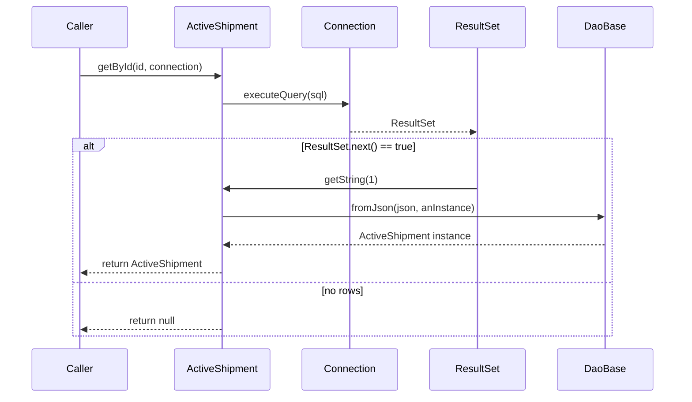

# Diagram: platform-java-lambdas/shipment/src/main/java/com/freightverify/shipment/datastore/postgresql/dao/ActiveShipment.java

> Auto-generated by Obscura crawlers

## Diagram 1

```mermaid
classDiagram
class ActiveShipment {
  -static anInstance: ActiveShipment
  +static tablename: String
  -id: Long
  -actorType: String
  -actorId: String
  -actorEmail: String
  -fvId: String
  -createdByOrgId: Long
  -creatorShipmentId: String
  -totalDistance: BigDecimal
  -progress: Long
  -obcAssetId: String
  -createdAt: Date
  -updatedAt: Date
  -currentStatus: String
  -activeStatus: String
  -activeUntil: Date
  -eta: Date
  -currentException: String
  -remainingDistance: BigDecimal
  -isBehindSchedule: Boolean
  -modeId: Long
  -leg: Boolean
  -modeName: String
  -trailerNumber: String
  -carrierOrganizationId: Long
  -carrierName: String
  -carrierFvId: String
  -carrierMcNumber: String
  -carrierScac: String
  -originLocationActualId: Long
  -destinationLocationActualId: Long
  -originCode: String
  -originName: String
  -originLocationId: Long
  -originAddress: String
  -originCity: String
  -originState: String
  -originPostalCode: String
  -originCountry: String
  -originLadId: Long
  -originLadName: String
  -originEarliestArrival: Date
  -originLatestArrival: Date
  -originCalculatedEta: Date
  -originActualArrival: Date
  -originActualDeparture: Date
  -originStopIdentifier: String
  -destinationCode: String
  -destinationName: String
  -destinationLocationId: Long
  -destinationAddress: String
  -destinationCity: String
  -destinationState: String
  -destinationPostalCode: String
  -destinationCountry: String
  -destinationLadId: Long
  -destinationLadName: String
  -destinationEarliestArrival: Date
  -destinationLatestArrival: Date
  -destinationCalculatedEta: Date
  -destinationActualArrival: Date
  -destinationActualDeparture: Date
  -destinationStopIdentifier: String
  -isRackReturn: Boolean
  -lineOfBusinessId: Long
  -trackingDisabled: Boolean
  -proNumber: String
  -railAssetId: String
  -routeNumber: String
  -referenceNumber: String
  -lastStatusUpdate: Date
  -destinationEta: Date
  -currentCity: String
  -currentState: String
  -currentPostalCode: String
  -currentCountry: String
  -remainingMiles: BigDecimal
  -currentLatitude: BigDecimal
  -currentLongitude: BigDecimal
  -currentReportedAt: Date
  -submodeId: Long
  -parentShipmentId: Long
  -tripPlanNumber: String
  -shipmentReferenceDetails: JsonNode
  -stopDetails: JsonNode
  -shipmentPolicy: JsonNode
  -shipmentDetails: JsonNode
  -latestEventShipmentId: Long
  -currentRoadOrganizationId: Long
  -currentRoadName: String
  -currentRoadScac: String
  -statusTypeName: String
  -statusName: String
  -railTrainId: String
  -railLoadedStatus: String
  -ts: Date
  -modified: Date
  -originRegion: JsonNode
  -destinationRegion: JsonNode
  -originTimezone: String
  -destinationTimezone: String
  -shipmentChangeTs: Date
  -activeChildShipment: String
  -destinationFrozenEta: Date
  -destinationFrozenEtaReason: String
  -railCreatorShipmentId: String
  -customerFvId: String
  -driverId: Long
  -statusUpdatedAt: Date
  -assetUnqueryable: Boolean
  -assetTrackingStartStop: Long
  -isIntegration: Boolean
  -statusDetails: JsonNode
  -pickedUpAt: Date
  -deliveredAt: Date
  -destinationNewlocId: Long
  -originNewlocId: Long
  -shipmentId3pl: String
  -vinsAdded: Date
  -latestEventTs: Date
  -deltaTs: Date
  -changeDetails: JsonNode
  -originalScheduleStartDay: Long
  -currentScheduleOffset: Long
  -allowOriginWindowCarrierUpdate: Boolean
  -allowDestinationWindowCarrierUpdate: Boolean
  -tripPlanId: Long
  +static fromJson(json: String): ActiveShipment
  +static getById(id: long, connection: Connection): ActiveShipment
}
class DaoBase
class Connection
class ResultSet
class JsonNode
ActiveShipment ..> DaoBase : delegates to
ActiveShipment ..> Connection : executes query with
ActiveShipment ..> ResultSet : reads from
ActiveShipment ..> JsonNode : contains JSON fields
```

### SVG

<svg id="container" width="590.4921875" xmlns="http://www.w3.org/2000/svg" class="classDiagram" height="3390" viewBox="0 0 590.4921875 3390" role="graphics-document document" aria-roledescription="class"><g><defs><marker id="container_class-aggregationStart" class="marker aggregation class" refX="18" refY="7" markerWidth="190" markerHeight="240" orient="auto"><path d="M 18,7 L9,13 L1,7 L9,1 Z"></path></marker></defs><defs><marker id="container_class-aggregationEnd" class="marker aggregation class" refX="1" refY="7" markerWidth="20" markerHeight="28" orient="auto"><path d="M 18,7 L9,13 L1,7 L9,1 Z"></path></marker></defs><defs><marker id="container_class-extensionStart" class="marker extension class" refX="18" refY="7" markerWidth="190" markerHeight="240" orient="auto"><path d="M 1,7 L18,13 V 1 Z"></path></marker></defs><defs><marker id="container_class-extensionEnd" class="marker extension class" refX="1" refY="7" markerWidth="20" markerHeight="28" orient="auto"><path d="M 1,1 V 13 L18,7 Z"></path></marker></defs><defs><marker id="container_class-compositionStart" class="marker composition class" refX="18" refY="7" markerWidth="190" markerHeight="240" orient="auto"><path d="M 18,7 L9,13 L1,7 L9,1 Z"></path></marker></defs><defs><marker id="container_class-compositionEnd" class="marker composition class" refX="1" refY="7" markerWidth="20" markerHeight="28" orient="auto"><path d="M 18,7 L9,13 L1,7 L9,1 Z"></path></marker></defs><defs><marker id="container_class-dependencyStart" class="marker dependency class" refX="6" refY="7" markerWidth="190" markerHeight="240" orient="auto"><path d="M 5,7 L9,13 L1,7 L9,1 Z"></path></marker></defs><defs><marker id="container_class-dependencyEnd" class="marker dependency class" refX="13" refY="7" markerWidth="20" markerHeight="28" orient="auto"><path d="M 18,7 L9,13 L14,7 L9,1 Z"></path></marker></defs><defs><marker id="container_class-lollipopStart" class="marker lollipop class" refX="13" refY="7" markerWidth="190" markerHeight="240" orient="auto"><circle stroke="black" fill="transparent" cx="7" cy="7" r="6"></circle></marker></defs><defs><marker id="container_class-lollipopEnd" class="marker lollipop class" refX="1" refY="7" markerWidth="190" markerHeight="240" orient="auto"><circle stroke="black" fill="transparent" cx="7" cy="7" r="6"></circle></marker></defs><g class="root"><g class="clusters"></g><g class="edgePaths"><path d="M73.286,3224L72.453,3230.167C71.62,3236.333,69.955,3248.667,69.122,3260C68.289,3271.333,68.289,3281.667,68.289,3286.833L68.289,3292" id="id_ActiveShipment_DaoBase_1" class="edge-thickness-normal edge-pattern-dashed relation" style=";;;" data-edge="true" data-et="edge" data-id="id_ActiveShipment_DaoBase_1" data-points="W3sieCI6NzMuMjg1OTc3ODY4NTQxMDQsInkiOjMyMjR9LHsieCI6NjguMjg5MDYyNSwieSI6MzI2MX0seyJ4Ijo2OC4yODkwNjI1LCJ5IjozMjk4fV0=" marker-end="url(#container_class-dependencyEnd)"></path><path d="M216.919,3224L216.637,3230.167C216.355,3236.333,215.791,3248.667,215.509,3260C215.227,3271.333,215.227,3281.667,215.227,3286.833L215.227,3292" id="id_ActiveShipment_Connection_2" class="edge-thickness-normal edge-pattern-dashed relation" style=";;;" data-edge="true" data-et="edge" data-id="id_ActiveShipment_Connection_2" data-points="W3sieCI6MjE2LjkxODUwMDY2NDg5MzYsInkiOjMyMjR9LHsieCI6MjE1LjIyNjU2MjUsInkiOjMyNjF9LHsieCI6MjE1LjIyNjU2MjUsInkiOjMyOTh9XQ==" marker-end="url(#container_class-dependencyEnd)"></path><path d="M363.98,3224L364.262,3230.167C364.544,3236.333,365.108,3248.667,365.39,3260C365.672,3271.333,365.672,3281.667,365.672,3286.833L365.672,3292" id="id_ActiveShipment_ResultSet_3" class="edge-thickness-normal edge-pattern-dashed relation" style=";;;" data-edge="true" data-et="edge" data-id="id_ActiveShipment_ResultSet_3" data-points="W3sieCI6MzYzLjk3OTkzNjgzNTEwNjQsInkiOjMyMjR9LHsieCI6MzY1LjY3MTg3NSwieSI6MzI2MX0seyJ4IjozNjUuNjcxODc1LCJ5IjozMjk4fV0=" marker-end="url(#container_class-dependencyEnd)"></path><path d="M504.84,3224L505.662,3230.167C506.485,3236.333,508.129,3248.667,508.951,3260C509.773,3271.333,509.773,3281.667,509.773,3286.833L509.773,3292" id="id_ActiveShipment_JsonNode_4" class="edge-thickness-normal edge-pattern-dashed relation" style=";;;" data-edge="true" data-et="edge" data-id="id_ActiveShipment_JsonNode_4" data-points="W3sieCI6NTA0Ljg0MDMwOTE3NTUzMTk2LCJ5IjozMjI0fSx7IngiOjUwOS43NzM0Mzc1LCJ5IjozMjYxfSx7IngiOjUwOS43NzM0Mzc1LCJ5IjozMjk4fV0=" marker-end="url(#container_class-dependencyEnd)"></path></g><g class="edgeLabels"><g class="edgeLabel" transform="translate(68.2890625, 3261)"><g class="label" data-id="id_ActiveShipment_DaoBase_1" transform="translate(-44.59375, -12)"><foreignObject width="89.1875" height="24">

delegates to

</foreignObject></g></g><g class="edgeLabel" transform="translate(215.2265625, 3261)"><g class="label" data-id="id_ActiveShipment_Connection_2" transform="translate(-72.359375, -12)"><foreignObject width="144.71875" height="24">

executes query with

</foreignObject></g></g><g class="edgeLabel" transform="translate(365.671875, 3261)"><g class="label" data-id="id_ActiveShipment_ResultSet_3" transform="translate(-39.1796875, -12)"><foreignObject width="78.359375" height="24">

reads from

</foreignObject></g></g><g class="edgeLabel" transform="translate(509.7734375, 3261)"><g class="label" data-id="id_ActiveShipment_JsonNode_4" transform="translate(-72.71875, -12)"><foreignObject width="145.4375" height="24">

contains JSON fields

</foreignObject></g></g></g><g class="nodes"><g class="node default" id="classId-ActiveShipment-0" transform="translate(290.44921875, 1616)"><g class="basic label-container"><path d="M-282.44921875 -1608 L282.44921875 -1608 L282.44921875 1608 L-282.44921875 1608" stroke="none" stroke-width="0" fill="#ECECFF" style=""></path><path d="M-282.44921875 -1608 C-142.02606889762583 -1608, -1.6029190452516673 -1608, 282.44921875 -1608 M-282.44921875 -1608 C-117.5956854210844 -1608, 47.257847907831206 -1608, 282.44921875 -1608 M282.44921875 -1608 C282.44921875 -955.6538520314892, 282.44921875 -303.3077040629785, 282.44921875 1608 M282.44921875 -1608 C282.44921875 -649.8579269699109, 282.44921875 308.2841460601783, 282.44921875 1608 M282.44921875 1608 C84.03742792039597 1608, -114.37436290920806 1608, -282.44921875 1608 M282.44921875 1608 C97.54748185590304 1608, -87.35425503819391 1608, -282.44921875 1608 M-282.44921875 1608 C-282.44921875 912.8912122665297, -282.44921875 217.78242453305938, -282.44921875 -1608 M-282.44921875 1608 C-282.44921875 600.0155416129143, -282.44921875 -407.9689167741715, -282.44921875 -1608" stroke="#9370DB" stroke-width="1.3" fill="none" stroke-dasharray="0 0" style=""></path></g><g class="annotation-group text" transform="translate(0, -1584)"></g><g class="label-group text" transform="translate(-57.4609375, -1584)"><g class="label" style="font-weight: bolder" transform="translate(0,-12)"><foreignObject width="114.921875" height="24">

ActiveShipment

</foreignObject></g></g><g class="members-group text" transform="translate(-270.44921875, -1536)"><g class="label" style="" transform="translate(0,-12)"><foreignObject width="251.328125" height="24">

-static anInstance: ActiveShipment

</foreignObject></g><g class="label" style="" transform="translate(0,12)"><foreignObject width="180.6875" height="24">

+static tablename: String

</foreignObject></g><g class="label" style="" transform="translate(0,36)"><foreignObject width="63.21875" height="24">

-id: Long

</foreignObject></g><g class="label" style="" transform="translate(0,60)"><foreignObject width="128.3125" height="24">

-actorType: String

</foreignObject></g><g class="label" style="" transform="translate(0,84)"><foreignObject width="108.875" height="24">

-actorId: String

</foreignObject></g><g class="label" style="" transform="translate(0,108)"><foreignObject width="134.765625" height="24">

-actorEmail: String

</foreignObject></g><g class="label" style="" transform="translate(0,132)"><foreignObject width="84.703125" height="24">

-fvId: String

</foreignObject></g><g class="label" style="" transform="translate(0,156)"><foreignObject width="160.796875" height="24">

-createdByOrgId: Long

</foreignObject></g><g class="label" style="" transform="translate(0,180)"><foreignObject width="193.0625" height="24">

-creatorShipmentId: String

</foreignObject></g><g class="label" style="" transform="translate(0,204)"><foreignObject width="191" height="24">

-totalDistance: BigDecimal

</foreignObject></g><g class="label" style="" transform="translate(0,228)"><foreignObject width="111.203125" height="24">

-progress: Long

</foreignObject></g><g class="label" style="" transform="translate(0,252)"><foreignObject width="136.640625" height="24">

-obcAssetId: String

</foreignObject></g><g class="label" style="" transform="translate(0,276)"><foreignObject width="117.078125" height="24">

-createdAt: Date

</foreignObject></g><g class="label" style="" transform="translate(0,300)"><foreignObject width="123.5625" height="24">

-updatedAt: Date

</foreignObject></g><g class="label" style="" transform="translate(0,324)"><foreignObject width="155.609375" height="24">

-currentStatus: String

</foreignObject></g><g class="label" style="" transform="translate(0,348)"><foreignObject width="145.984375" height="24">

-activeStatus: String

</foreignObject></g><g class="label" style="" transform="translate(0,372)"><foreignObject width="125.671875" height="24">

-activeUntil: Date

</foreignObject></g><g class="label" style="" transform="translate(0,396)"><foreignObject width="70.734375" height="24">

-eta: Date

</foreignObject></g><g class="label" style="" transform="translate(0,420)"><foreignObject width="180.703125" height="24">

-currentException: String

</foreignObject></g><g class="label" style="" transform="translate(0,444)"><foreignObject width="230.234375" height="24">

-remainingDistance: BigDecimal

</foreignObject></g><g class="label" style="" transform="translate(0,468)"><foreignObject width="204.140625" height="24">

-isBehindSchedule: Boolean

</foreignObject></g><g class="label" style="" transform="translate(0,492)"><foreignObject width="104.78125" height="24">

-modeId: Long

</foreignObject></g><g class="label" style="" transform="translate(0,516)"><foreignObject width="95.84375" height="24">

-leg: Boolean

</foreignObject></g><g class="label" style="" transform="translate(0,540)"><foreignObject width="140.828125" height="24">

-modeName: String

</foreignObject></g><g class="label" style="" transform="translate(0,564)"><foreignObject width="159.953125" height="24">

-trailerNumber: String

</foreignObject></g><g class="label" style="" transform="translate(0,588)"><foreignObject width="203.46875" height="24">

-carrierOrganizationId: Long

</foreignObject></g><g class="label" style="" transform="translate(0,612)"><foreignObject width="147.4375" height="24">

-carrierName: String

</foreignObject></g><g class="label" style="" transform="translate(0,636)"><foreignObject width="134.828125" height="24">

-carrierFvId: String

</foreignObject></g><g class="label" style="" transform="translate(0,660)"><foreignObject width="183.96875" height="24">

-carrierMcNumber: String

</foreignObject></g><g class="label" style="" transform="translate(0,684)"><foreignObject width="137.984375" height="24">

-carrierScac: String

</foreignObject></g><g class="label" style="" transform="translate(0,708)"><foreignObject width="212.921875" height="24">

-originLocationActualId: Long

</foreignObject></g><g class="label" style="" transform="translate(0,732)"><foreignObject width="253.8125" height="24">

-destinationLocationActualId: Long

</foreignObject></g><g class="label" style="" transform="translate(0,756)"><foreignObject width="135.921875" height="24">

-originCode: String

</foreignObject></g><g class="label" style="" transform="translate(0,780)"><foreignObject width="141.71875" height="24">

-originName: String

</foreignObject></g><g class="label" style="" transform="translate(0,804)"><foreignObject width="167.78125" height="24">

-originLocationId: Long

</foreignObject></g><g class="label" style="" transform="translate(0,828)"><foreignObject width="157.15625" height="24">

-originAddress: String

</foreignObject></g><g class="label" style="" transform="translate(0,852)"><foreignObject width="126.765625" height="24">

-originCity: String

</foreignObject></g><g class="label" style="" transform="translate(0,876)"><foreignObject width="137" height="24">

-originState: String

</foreignObject></g><g class="label" style="" transform="translate(0,900)"><foreignObject width="180.453125" height="24">

-originPostalCode: String

</foreignObject></g><g class="label" style="" transform="translate(0,924)"><foreignObject width="156.21875" height="24">

-originCountry: String

</foreignObject></g><g class="label" style="" transform="translate(0,948)"><foreignObject width="131.75" height="24">

-originLadId: Long

</foreignObject></g><g class="label" style="" transform="translate(0,972)"><foreignObject width="167.796875" height="24">

-originLadName: String

</foreignObject></g><g class="label" style="" transform="translate(0,996)"><foreignObject width="191.34375" height="24">

-originEarliestArrival: Date

</foreignObject></g><g class="label" style="" transform="translate(0,1020)"><foreignObject width="180.9375" height="24">

-originLatestArrival: Date

</foreignObject></g><g class="label" style="" transform="translate(0,1044)"><foreignObject width="188.46875" height="24">

-originCalculatedEta: Date

</foreignObject></g><g class="label" style="" transform="translate(0,1068)"><foreignObject width="182.0625" height="24">

-originActualArrival: Date

</foreignObject></g><g class="label" style="" transform="translate(0,1092)"><foreignObject width="207.765625" height="24">

-originActualDeparture: Date

</foreignObject></g><g class="label" style="" transform="translate(0,1116)"><foreignObject width="199.6875" height="24">

-originStopIdentifier: String

</foreignObject></g><g class="label" style="" transform="translate(0,1140)"><foreignObject width="176.828125" height="24">

-destinationCode: String

</foreignObject></g><g class="label" style="" transform="translate(0,1164)"><foreignObject width="182.609375" height="24">

-destinationName: String

</foreignObject></g><g class="label" style="" transform="translate(0,1188)"><foreignObject width="208.6875" height="24">

-destinationLocationId: Long

</foreignObject></g><g class="label" style="" transform="translate(0,1212)"><foreignObject width="198.0625" height="24">

-destinationAddress: String

</foreignObject></g><g class="label" style="" transform="translate(0,1236)"><foreignObject width="167.65625" height="24">

-destinationCity: String

</foreignObject></g><g class="label" style="" transform="translate(0,1260)"><foreignObject width="177.890625" height="24">

-destinationState: String

</foreignObject></g><g class="label" style="" transform="translate(0,1284)"><foreignObject width="221.359375" height="24">

-destinationPostalCode: String

</foreignObject></g><g class="label" style="" transform="translate(0,1308)"><foreignObject width="197.109375" height="24">

-destinationCountry: String

</foreignObject></g><g class="label" style="" transform="translate(0,1332)"><foreignObject width="172.640625" height="24">

-destinationLadId: Long

</foreignObject></g><g class="label" style="" transform="translate(0,1356)"><foreignObject width="208.703125" height="24">

-destinationLadName: String

</foreignObject></g><g class="label" style="" transform="translate(0,1380)"><foreignObject width="232.234375" height="24">

-destinationEarliestArrival: Date

</foreignObject></g><g class="label" style="" transform="translate(0,1404)"><foreignObject width="221.828125" height="24">

-destinationLatestArrival: Date

</foreignObject></g><g class="label" style="" transform="translate(0,1428)"><foreignObject width="229.375" height="24">

-destinationCalculatedEta: Date

</foreignObject></g><g class="label" style="" transform="translate(0,1452)"><foreignObject width="222.953125" height="24">

-destinationActualArrival: Date

</foreignObject></g><g class="label" style="" transform="translate(0,1476)"><foreignObject width="248.671875" height="24">

-destinationActualDeparture: Date

</foreignObject></g><g class="label" style="" transform="translate(0,1500)"><foreignObject width="240.578125" height="24">

-destinationStopIdentifier: String

</foreignObject></g><g class="label" style="" transform="translate(0,1524)"><foreignObject width="169.046875" height="24">

-isRackReturn: Boolean

</foreignObject></g><g class="label" style="" transform="translate(0,1548)"><foreignObject width="171.0625" height="24">

-lineOfBusinessId: Long

</foreignObject></g><g class="label" style="" transform="translate(0,1572)"><foreignObject width="195.5" height="24">

-trackingDisabled: Boolean

</foreignObject></g><g class="label" style="" transform="translate(0,1596)"><foreignObject width="140.46875" height="24">

-proNumber: String

</foreignObject></g><g class="label" style="" transform="translate(0,1620)"><foreignObject width="133.671875" height="24">

-railAssetId: String

</foreignObject></g><g class="label" style="" transform="translate(0,1644)"><foreignObject width="154.53125" height="24">

-routeNumber: String

</foreignObject></g><g class="label" style="" transform="translate(0,1668)"><foreignObject width="184.109375" height="24">

-referenceNumber: String

</foreignObject></g><g class="label" style="" transform="translate(0,1692)"><foreignObject width="172.3125" height="24">

-lastStatusUpdate: Date

</foreignObject></g><g class="label" style="" transform="translate(0,1716)"><foreignObject width="153.484375" height="24">

-destinationEta: Date

</foreignObject></g><g class="label" style="" transform="translate(0,1740)"><foreignObject width="137.0625" height="24">

-currentCity: String

</foreignObject></g><g class="label" style="" transform="translate(0,1764)"><foreignObject width="147.296875" height="24">

-currentState: String

</foreignObject></g><g class="label" style="" transform="translate(0,1788)"><foreignObject width="190.765625" height="24">

-currentPostalCode: String

</foreignObject></g><g class="label" style="" transform="translate(0,1812)"><foreignObject width="166.515625" height="24">

-currentCountry: String

</foreignObject></g><g class="label" style="" transform="translate(0,1836)"><foreignObject width="205.90625" height="24">

-remainingMiles: BigDecimal

</foreignObject></g><g class="label" style="" transform="translate(0,1860)"><foreignObject width="207.9375" height="24">

-currentLatitude: BigDecimal

</foreignObject></g><g class="label" style="" transform="translate(0,1884)"><foreignObject width="220.265625" height="24">

-currentLongitude: BigDecimal

</foreignObject></g><g class="label" style="" transform="translate(0,1908)"><foreignObject width="182.203125" height="24">

-currentReportedAt: Date

</foreignObject></g><g class="label" style="" transform="translate(0,1932)"><foreignObject width="131.0625" height="24">

-submodeId: Long

</foreignObject></g><g class="label" style="" transform="translate(0,1956)"><foreignObject width="180.75" height="24">

-parentShipmentId: Long

</foreignObject></g><g class="label" style="" transform="translate(0,1980)"><foreignObject width="173.640625" height="24">

-tripPlanNumber: String

</foreignObject></g><g class="label" style="" transform="translate(0,2004)"><foreignObject width="274.59375" height="24">

-shipmentReferenceDetails: JsonNode

</foreignObject></g><g class="label" style="" transform="translate(0,2028)"><foreignObject width="166.09375" height="24">

-stopDetails: JsonNode

</foreignObject></g><g class="label" style="" transform="translate(0,2052)"><foreignObject width="195.5625" height="24">

-shipmentPolicy: JsonNode

</foreignObject></g><g class="label" style="" transform="translate(0,2076)"><foreignObject width="202.6875" height="24">

-shipmentDetails: JsonNode

</foreignObject></g><g class="label" style="" transform="translate(0,2100)"><foreignObject width="213.859375" height="24">

-latestEventShipmentId: Long

</foreignObject></g><g class="label" style="" transform="translate(0,2124)"><foreignObject width="244.953125" height="24">

-currentRoadOrganizationId: Long

</foreignObject></g><g class="label" style="" transform="translate(0,2148)"><foreignObject width="188.921875" height="24">

-currentRoadName: String

</foreignObject></g><g class="label" style="" transform="translate(0,2172)"><foreignObject width="179.484375" height="24">

-currentRoadScac: String

</foreignObject></g><g class="label" style="" transform="translate(0,2196)"><foreignObject width="177.609375" height="24">

-statusTypeName: String

</foreignObject></g><g class="label" style="" transform="translate(0,2220)"><foreignObject width="143.875" height="24">

-statusName: String

</foreignObject></g><g class="label" style="" transform="translate(0,2244)"><foreignObject width="131.21875" height="24">

-railTrainId: String

</foreignObject></g><g class="label" style="" transform="translate(0,2268)"><foreignObject width="179.890625" height="24">

-railLoadedStatus: String

</foreignObject></g><g class="label" style="" transform="translate(0,2292)"><foreignObject width="60.8125" height="24">

-ts: Date

</foreignObject></g><g class="label" style="" transform="translate(0,2316)"><foreignObject width="112.265625" height="24">

-modified: Date

</foreignObject></g><g class="label" style="" transform="translate(0,2340)"><foreignObject width="176.125" height="24">

-originRegion: JsonNode

</foreignObject></g><g class="label" style="" transform="translate(0,2364)"><foreignObject width="217.015625" height="24">

-destinationRegion: JsonNode

</foreignObject></g><g class="label" style="" transform="translate(0,2388)"><foreignObject width="169.078125" height="24">

-originTimezone: String

</foreignObject></g><g class="label" style="" transform="translate(0,2412)"><foreignObject width="209.96875" height="24">

-destinationTimezone: String

</foreignObject></g><g class="label" style="" transform="translate(0,2436)"><foreignObject width="184.078125" height="24">

-shipmentChangeTs: Date

</foreignObject></g><g class="label" style="" transform="translate(0,2460)"><foreignObject width="206.96875" height="24">

-activeChildShipment: String

</foreignObject></g><g class="label" style="" transform="translate(0,2484)"><foreignObject width="200.6875" height="24">

-destinationFrozenEta: Date

</foreignObject></g><g class="label" style="" transform="translate(0,2508)"><foreignObject width="263.1875" height="24">

-destinationFrozenEtaReason: String

</foreignObject></g><g class="label" style="" transform="translate(0,2532)"><foreignObject width="217.65625" height="24">

-railCreatorShipmentId: String

</foreignObject></g><g class="label" style="" transform="translate(0,2556)"><foreignObject width="154.625" height="24">

-customerFvId: String

</foreignObject></g><g class="label" style="" transform="translate(0,2580)"><foreignObject width="106.390625" height="24">

-driverId: Long

</foreignObject></g><g class="label" style="" transform="translate(0,2604)"><foreignObject width="169.234375" height="24">

-statusUpdatedAt: Date

</foreignObject></g><g class="label" style="" transform="translate(0,2628)"><foreignObject width="204.6875" height="24">

-assetUnqueryable: Boolean

</foreignObject></g><g class="label" style="" transform="translate(0,2652)"><foreignObject width="215.03125" height="24">

-assetTrackingStartStop: Long

</foreignObject></g><g class="label" style="" transform="translate(0,2676)"><foreignObject width="166.1875" height="24">

-isIntegration: Boolean

</foreignObject></g><g class="label" style="" transform="translate(0,2700)"><foreignObject width="178.625" height="24">

-statusDetails: JsonNode

</foreignObject></g><g class="label" style="" transform="translate(0,2724)"><foreignObject width="130.75" height="24">

-pickedUpAt: Date

</foreignObject></g><g class="label" style="" transform="translate(0,2748)"><foreignObject width="130.640625" height="24">

-deliveredAt: Date

</foreignObject></g><g class="label" style="" transform="translate(0,2772)"><foreignObject width="199.28125" height="24">

-destinationNewlocId: Long

</foreignObject></g><g class="label" style="" transform="translate(0,2796)"><foreignObject width="158.390625" height="24">

-originNewlocId: Long

</foreignObject></g><g class="label" style="" transform="translate(0,2820)"><foreignObject width="162.484375" height="24">

-shipmentId3pl: String

</foreignObject></g><g class="label" style="" transform="translate(0,2844)"><foreignObject width="123.296875" height="24">

-vinsAdded: Date

</foreignObject></g><g class="label" style="" transform="translate(0,2868)"><foreignObject width="143.3125" height="24">

-latestEventTs: Date

</foreignObject></g><g class="label" style="" transform="translate(0,2892)"><foreignObject width="99.921875" height="24">

-deltaTs: Date

</foreignObject></g><g class="label" style="" transform="translate(0,2916)"><foreignObject width="186.125" height="24">

-changeDetails: JsonNode

</foreignObject></g><g class="label" style="" transform="translate(0,2940)"><foreignObject width="232.875" height="24">

-originalScheduleStartDay: Long

</foreignObject></g><g class="label" style="" transform="translate(0,2964)"><foreignObject width="212.109375" height="24">

-currentScheduleOffset: Long

</foreignObject></g><g class="label" style="" transform="translate(0,2988)"><foreignObject width="315.953125" height="24">

-allowOriginWindowCarrierUpdate: Boolean

</foreignObject></g><g class="label" style="" transform="translate(0,3012)"><foreignObject width="355.859375" height="24">

-allowDestinationWindowCarrierUpdate: Boolean

</foreignObject></g><g class="label" style="" transform="translate(0,3036)"><foreignObject width="121.140625" height="24">

-tripPlanId: Long

</foreignObject></g></g><g class="methods-group text" transform="translate(-270.44921875, 1560)"><g class="label" style="" transform="translate(0,-12)"><foreignObject width="343.5" height="24">

+static fromJson(json: String) : : ActiveShipment

</foreignObject></g><g class="label" style="" transform="translate(0,12)"><foreignObject width="483.4375" height="24">

+static getById(id: long, connection: Connection) : : ActiveShipment

</foreignObject></g></g><g class="divider" style=""><path d="M-282.44921875 -1560 C-154.28235106368942 -1560, -26.115483377378837 -1560, 282.44921875 -1560 M-282.44921875 -1560 C-89.2230472358286 -1560, 104.0031242783428 -1560, 282.44921875 -1560" stroke="#9370DB" stroke-width="1.3" fill="none" stroke-dasharray="0 0" style=""></path></g><g class="divider" style=""><path d="M-282.44921875 1536 C-128.5479152386778 1536, 25.353388272644395 1536, 282.44921875 1536 M-282.44921875 1536 C-83.65683140493792 1536, 115.13555594012416 1536, 282.44921875 1536" stroke="#9370DB" stroke-width="1.3" fill="none" stroke-dasharray="0 0" style=""></path></g></g><g class="node default" id="classId-DaoBase-1" transform="translate(68.2890625, 3340)"><g class="basic label-container"><path d="M-43.7109375 -42 L43.7109375 -42 L43.7109375 42 L-43.7109375 42" stroke="none" stroke-width="0" fill="#ECECFF" style=""></path><path d="M-43.7109375 -42 C-23.088211225705162 -42, -2.4654849514103248 -42, 43.7109375 -42 M-43.7109375 -42 C-16.000546640930498 -42, 11.709844218139004 -42, 43.7109375 -42 M43.7109375 -42 C43.7109375 -20.110906069022004, 43.7109375 1.7781878619559919, 43.7109375 42 M43.7109375 -42 C43.7109375 -25.074838790676182, 43.7109375 -8.149677581352364, 43.7109375 42 M43.7109375 42 C16.53220882259669 42, -10.64651985480662 42, -43.7109375 42 M43.7109375 42 C24.178195918528065 42, 4.64545433705613 42, -43.7109375 42 M-43.7109375 42 C-43.7109375 19.120631662239393, -43.7109375 -3.758736675521213, -43.7109375 -42 M-43.7109375 42 C-43.7109375 16.919551760995727, -43.7109375 -8.160896478008546, -43.7109375 -42" stroke="#9370DB" stroke-width="1.3" fill="none" stroke-dasharray="0 0" style=""></path></g><g class="annotation-group text" transform="translate(0, -18)"></g><g class="label-group text" transform="translate(-31.7109375, -18)"><g class="label" style="font-weight: bolder" transform="translate(0,-12)"><foreignObject width="63.421875" height="24">

DaoBase

</foreignObject></g></g><g class="members-group text" transform="translate(-31.7109375, 30)"></g><g class="methods-group text" transform="translate(-31.7109375, 60)"></g><g class="divider" style=""><path d="M-43.7109375 6 C-23.248021221791152 6, -2.7851049435823043 6, 43.7109375 6 M-43.7109375 6 C-20.239192430307273 6, 3.232552639385453 6, 43.7109375 6" stroke="#9370DB" stroke-width="1.3" fill="none" stroke-dasharray="0 0" style=""></path></g><g class="divider" style=""><path d="M-43.7109375 24 C-20.12475044377942 24, 3.4614366124411617 24, 43.7109375 24 M-43.7109375 24 C-26.02244298247538 24, -8.333948464950758 24, 43.7109375 24" stroke="#9370DB" stroke-width="1.3" fill="none" stroke-dasharray="0 0" style=""></path></g></g><g class="node default" id="classId-Connection-2" transform="translate(215.2265625, 3340)"><g class="basic label-container"><path d="M-53.2265625 -42 L53.2265625 -42 L53.2265625 42 L-53.2265625 42" stroke="none" stroke-width="0" fill="#ECECFF" style=""></path><path d="M-53.2265625 -42 C-19.41589140126443 -42, 14.394779697471137 -42, 53.2265625 -42 M-53.2265625 -42 C-29.734272505674955 -42, -6.24198251134991 -42, 53.2265625 -42 M53.2265625 -42 C53.2265625 -9.569795107477695, 53.2265625 22.86040978504461, 53.2265625 42 M53.2265625 -42 C53.2265625 -12.748102871547133, 53.2265625 16.503794256905735, 53.2265625 42 M53.2265625 42 C12.768627759237297 42, -27.689306981525405 42, -53.2265625 42 M53.2265625 42 C12.339190909549593 42, -28.548180680900813 42, -53.2265625 42 M-53.2265625 42 C-53.2265625 21.886310109933042, -53.2265625 1.7726202198660843, -53.2265625 -42 M-53.2265625 42 C-53.2265625 9.522363777581639, -53.2265625 -22.955272444836723, -53.2265625 -42" stroke="#9370DB" stroke-width="1.3" fill="none" stroke-dasharray="0 0" style=""></path></g><g class="annotation-group text" transform="translate(0, -18)"></g><g class="label-group text" transform="translate(-41.2265625, -18)"><g class="label" style="font-weight: bolder" transform="translate(0,-12)"><foreignObject width="82.453125" height="24">

Connection

</foreignObject></g></g><g class="members-group text" transform="translate(-41.2265625, 30)"></g><g class="methods-group text" transform="translate(-41.2265625, 60)"></g><g class="divider" style=""><path d="M-53.2265625 6 C-23.740091963429286 6, 5.746378573141428 6, 53.2265625 6 M-53.2265625 6 C-17.507434071441615 6, 18.21169435711677 6, 53.2265625 6" stroke="#9370DB" stroke-width="1.3" fill="none" stroke-dasharray="0 0" style=""></path></g><g class="divider" style=""><path d="M-53.2265625 24 C-14.527520608691596 24, 24.17152128261681 24, 53.2265625 24 M-53.2265625 24 C-18.137237640821475 24, 16.95208721835705 24, 53.2265625 24" stroke="#9370DB" stroke-width="1.3" fill="none" stroke-dasharray="0 0" style=""></path></g></g><g class="node default" id="classId-ResultSet-3" transform="translate(365.671875, 3340)"><g class="basic label-container"><path d="M-47.21875 -42 L47.21875 -42 L47.21875 42 L-47.21875 42" stroke="none" stroke-width="0" fill="#ECECFF" style=""></path><path d="M-47.21875 -42 C-19.643297346093497 -42, 7.932155307813005 -42, 47.21875 -42 M-47.21875 -42 C-11.962052649140837 -42, 23.294644701718326 -42, 47.21875 -42 M47.21875 -42 C47.21875 -11.261891641305596, 47.21875 19.47621671738881, 47.21875 42 M47.21875 -42 C47.21875 -20.339596909889604, 47.21875 1.3208061802207922, 47.21875 42 M47.21875 42 C14.209770608797164 42, -18.79920878240567 42, -47.21875 42 M47.21875 42 C14.193263801315055 42, -18.83222239736989 42, -47.21875 42 M-47.21875 42 C-47.21875 9.0014355832881, -47.21875 -23.9971288334238, -47.21875 -42 M-47.21875 42 C-47.21875 18.42007944051067, -47.21875 -5.159841118978662, -47.21875 -42" stroke="#9370DB" stroke-width="1.3" fill="none" stroke-dasharray="0 0" style=""></path></g><g class="annotation-group text" transform="translate(0, -18)"></g><g class="label-group text" transform="translate(-35.21875, -18)"><g class="label" style="font-weight: bolder" transform="translate(0,-12)"><foreignObject width="70.4375" height="24">

ResultSet

</foreignObject></g></g><g class="members-group text" transform="translate(-35.21875, 30)"></g><g class="methods-group text" transform="translate(-35.21875, 60)"></g><g class="divider" style=""><path d="M-47.21875 6 C-19.96389967162146 6, 7.290950656757083 6, 47.21875 6 M-47.21875 6 C-23.811814596734855 6, -0.4048791934697107 6, 47.21875 6" stroke="#9370DB" stroke-width="1.3" fill="none" stroke-dasharray="0 0" style=""></path></g><g class="divider" style=""><path d="M-47.21875 24 C-11.642650786970115 24, 23.93344842605977 24, 47.21875 24 M-47.21875 24 C-22.460669283102778 24, 2.2974114337944442 24, 47.21875 24" stroke="#9370DB" stroke-width="1.3" fill="none" stroke-dasharray="0 0" style=""></path></g></g><g class="node default" id="classId-JsonNode-4" transform="translate(509.7734375, 3340)"><g class="basic label-container"><path d="M-46.8828125 -42 L46.8828125 -42 L46.8828125 42 L-46.8828125 42" stroke="none" stroke-width="0" fill="#ECECFF" style=""></path><path d="M-46.8828125 -42 C-27.133199774600246 -42, -7.383587049200493 -42, 46.8828125 -42 M-46.8828125 -42 C-23.54782970185733 -42, -0.21284690371466297 -42, 46.8828125 -42 M46.8828125 -42 C46.8828125 -10.375102898834214, 46.8828125 21.24979420233157, 46.8828125 42 M46.8828125 -42 C46.8828125 -20.423924567239396, 46.8828125 1.1521508655212074, 46.8828125 42 M46.8828125 42 C11.678390292978875 42, -23.52603191404225 42, -46.8828125 42 M46.8828125 42 C15.782927841645293 42, -15.316956816709414 42, -46.8828125 42 M-46.8828125 42 C-46.8828125 22.38218579396293, -46.8828125 2.764371587925858, -46.8828125 -42 M-46.8828125 42 C-46.8828125 20.037915558890095, -46.8828125 -1.92416888221981, -46.8828125 -42" stroke="#9370DB" stroke-width="1.3" fill="none" stroke-dasharray="0 0" style=""></path></g><g class="annotation-group text" transform="translate(0, -18)"></g><g class="label-group text" transform="translate(-34.8828125, -18)"><g class="label" style="font-weight: bolder" transform="translate(0,-12)"><foreignObject width="69.765625" height="24">

JsonNode

</foreignObject></g></g><g class="members-group text" transform="translate(-34.8828125, 30)"></g><g class="methods-group text" transform="translate(-34.8828125, 60)"></g><g class="divider" style=""><path d="M-46.8828125 6 C-25.138258944003073 6, -3.393705388006147 6, 46.8828125 6 M-46.8828125 6 C-23.28000375010605 6, 0.32280499978789834 6, 46.8828125 6" stroke="#9370DB" stroke-width="1.3" fill="none" stroke-dasharray="0 0" style=""></path></g><g class="divider" style=""><path d="M-46.8828125 24 C-23.222826827285445 24, 0.43715884542911 24, 46.8828125 24 M-46.8828125 24 C-19.047217415143397 24, 8.788377669713206 24, 46.8828125 24" stroke="#9370DB" stroke-width="1.3" fill="none" stroke-dasharray="0 0" style=""></path></g></g></g></g></g></svg>

## Diagram 2

### SVG

<svg id="container" width="1089" xmlns="http://www.w3.org/2000/svg" height="655" viewBox="-50 -10 1089 655" role="graphics-document document" aria-roledescription="sequence"><g><rect x="839" y="569" fill="#eaeaea" stroke="#666" width="150" height="65" name="DaoBase" rx="3" ry="3" class="actor actor-bottom"></rect><text x="914" y="601.5" dominant-baseline="central" alignment-baseline="central" class="actor actor-box" style="text-anchor: middle; font-size: 16px; font-weight: 400;"><tspan x="914" dy="0">DaoBase</tspan></text></g><g><rect x="639" y="569" fill="#eaeaea" stroke="#666" width="150" height="65" name="ResultSet" rx="3" ry="3" class="actor actor-bottom"></rect><text x="714" y="601.5" dominant-baseline="central" alignment-baseline="central" class="actor actor-box" style="text-anchor: middle; font-size: 16px; font-weight: 400;"><tspan x="714" dy="0">ResultSet</tspan></text></g><g><rect x="439" y="569" fill="#eaeaea" stroke="#666" width="150" height="65" name="Connection" rx="3" ry="3" class="actor actor-bottom"></rect><text x="514" y="601.5" dominant-baseline="central" alignment-baseline="central" class="actor actor-box" style="text-anchor: middle; font-size: 16px; font-weight: 400;"><tspan x="514" dy="0">Connection</tspan></text></g><g><rect x="238" y="569" fill="#eaeaea" stroke="#666" width="150" height="65" name="ActiveShipment" rx="3" ry="3" class="actor actor-bottom"></rect><text x="313" y="601.5" dominant-baseline="central" alignment-baseline="central" class="actor actor-box" style="text-anchor: middle; font-size: 16px; font-weight: 400;"><tspan x="313" dy="0">ActiveShipment</tspan></text></g><g><rect x="0" y="569" fill="#eaeaea" stroke="#666" width="150" height="65" name="Caller" rx="3" ry="3" class="actor actor-bottom"></rect><text x="75" y="601.5" dominant-baseline="central" alignment-baseline="central" class="actor actor-box" style="text-anchor: middle; font-size: 16px; font-weight: 400;"><tspan x="75" dy="0">Caller</tspan></text></g><g><line id="actor4" x1="914" y1="65" x2="914" y2="569" class="actor-line 200" stroke-width="0.5px" stroke="#999" name="DaoBase"></line><g id="root-4"><rect x="839" y="0" fill="#eaeaea" stroke="#666" width="150" height="65" name="DaoBase" rx="3" ry="3" class="actor actor-top"></rect><text x="914" y="32.5" dominant-baseline="central" alignment-baseline="central" class="actor actor-box" style="text-anchor: middle; font-size: 16px; font-weight: 400;"><tspan x="914" dy="0">DaoBase</tspan></text></g></g><g><line id="actor3" x1="714" y1="65" x2="714" y2="569" class="actor-line 200" stroke-width="0.5px" stroke="#999" name="ResultSet"></line><g id="root-3"><rect x="639" y="0" fill="#eaeaea" stroke="#666" width="150" height="65" name="ResultSet" rx="3" ry="3" class="actor actor-top"></rect><text x="714" y="32.5" dominant-baseline="central" alignment-baseline="central" class="actor actor-box" style="text-anchor: middle; font-size: 16px; font-weight: 400;"><tspan x="714" dy="0">ResultSet</tspan></text></g></g><g><line id="actor2" x1="514" y1="65" x2="514" y2="569" class="actor-line 200" stroke-width="0.5px" stroke="#999" name="Connection"></line><g id="root-2"><rect x="439" y="0" fill="#eaeaea" stroke="#666" width="150" height="65" name="Connection" rx="3" ry="3" class="actor actor-top"></rect><text x="514" y="32.5" dominant-baseline="central" alignment-baseline="central" class="actor actor-box" style="text-anchor: middle; font-size: 16px; font-weight: 400;"><tspan x="514" dy="0">Connection</tspan></text></g></g><g><line id="actor1" x1="313" y1="65" x2="313" y2="569" class="actor-line 200" stroke-width="0.5px" stroke="#999" name="ActiveShipment"></line><g id="root-1"><rect x="238" y="0" fill="#eaeaea" stroke="#666" width="150" height="65" name="ActiveShipment" rx="3" ry="3" class="actor actor-top"></rect><text x="313" y="32.5" dominant-baseline="central" alignment-baseline="central" class="actor actor-box" style="text-anchor: middle; font-size: 16px; font-weight: 400;"><tspan x="313" dy="0">ActiveShipment</tspan></text></g></g><g><line id="actor0" x1="75" y1="65" x2="75" y2="569" class="actor-line 200" stroke-width="0.5px" stroke="#999" name="Caller"></line><g id="root-0"><rect x="0" y="0" fill="#eaeaea" stroke="#666" width="150" height="65" name="Caller" rx="3" ry="3" class="actor actor-top"></rect><text x="75" y="32.5" dominant-baseline="central" alignment-baseline="central" class="actor actor-box" style="text-anchor: middle; font-size: 16px; font-weight: 400;"><tspan x="75" dy="0">Caller</tspan></text></g></g><g></g><defs><symbol id="computer" width="24" height="24"><path transform="scale(.5)" d="M2 2v13h20v-13h-20zm18 11h-16v-9h16v9zm-10.228 6l.466-1h3.524l.467 1h-4.457zm14.228 3h-24l2-6h2.104l-1.33 4h18.45l-1.297-4h2.073l2 6zm-5-10h-14v-7h14v7z"></path></symbol></defs><defs><symbol id="database" fill-rule="evenodd" clip-rule="evenodd"><path transform="scale(.5)" d="M12.258.001l.256.004.255.005.253.008.251.01.249.012.247.015.246.016.242.019.241.02.239.023.236.024.233.027.231.028.229.031.225.032.223.034.22.036.217.038.214.04.211.041.208.043.205.045.201.046.198.048.194.05.191.051.187.053.183.054.18.056.175.057.172.059.168.06.163.061.16.063.155.064.15.066.074.033.073.033.071.034.07.034.069.035.068.035.067.035.066.035.064.036.064.036.062.036.06.036.06.037.058.037.058.037.055.038.055.038.053.038.052.038.051.039.05.039.048.039.047.039.045.04.044.04.043.04.041.04.04.041.039.041.037.041.036.041.034.041.033.042.032.042.03.042.029.042.027.042.026.043.024.043.023.043.021.043.02.043.018.044.017.043.015.044.013.044.012.044.011.045.009.044.007.045.006.045.004.045.002.045.001.045v17l-.001.045-.002.045-.004.045-.006.045-.007.045-.009.044-.011.045-.012.044-.013.044-.015.044-.017.043-.018.044-.02.043-.021.043-.023.043-.024.043-.026.043-.027.042-.029.042-.03.042-.032.042-.033.042-.034.041-.036.041-.037.041-.039.041-.04.041-.041.04-.043.04-.044.04-.045.04-.047.039-.048.039-.05.039-.051.039-.052.038-.053.038-.055.038-.055.038-.058.037-.058.037-.06.037-.06.036-.062.036-.064.036-.064.036-.066.035-.067.035-.068.035-.069.035-.07.034-.071.034-.073.033-.074.033-.15.066-.155.064-.16.063-.163.061-.168.06-.172.059-.175.057-.18.056-.183.054-.187.053-.191.051-.194.05-.198.048-.201.046-.205.045-.208.043-.211.041-.214.04-.217.038-.22.036-.223.034-.225.032-.229.031-.231.028-.233.027-.236.024-.239.023-.241.02-.242.019-.246.016-.247.015-.249.012-.251.01-.253.008-.255.005-.256.004-.258.001-.258-.001-.256-.004-.255-.005-.253-.008-.251-.01-.249-.012-.247-.015-.245-.016-.243-.019-.241-.02-.238-.023-.236-.024-.234-.027-.231-.028-.228-.031-.226-.032-.223-.034-.22-.036-.217-.038-.214-.04-.211-.041-.208-.043-.204-.045-.201-.046-.198-.048-.195-.05-.19-.051-.187-.053-.184-.054-.179-.056-.176-.057-.172-.059-.167-.06-.164-.061-.159-.063-.155-.064-.151-.066-.074-.033-.072-.033-.072-.034-.07-.034-.069-.035-.068-.035-.067-.035-.066-.035-.064-.036-.063-.036-.062-.036-.061-.036-.06-.037-.058-.037-.057-.037-.056-.038-.055-.038-.053-.038-.052-.038-.051-.039-.049-.039-.049-.039-.046-.039-.046-.04-.044-.04-.043-.04-.041-.04-.04-.041-.039-.041-.037-.041-.036-.041-.034-.041-.033-.042-.032-.042-.03-.042-.029-.042-.027-.042-.026-.043-.024-.043-.023-.043-.021-.043-.02-.043-.018-.044-.017-.043-.015-.044-.013-.044-.012-.044-.011-.045-.009-.044-.007-.045-.006-.045-.004-.045-.002-.045-.001-.045v-17l.001-.045.002-.045.004-.045.006-.045.007-.045.009-.044.011-.045.012-.044.013-.044.015-.044.017-.043.018-.044.02-.043.021-.043.023-.043.024-.043.026-.043.027-.042.029-.042.03-.042.032-.042.033-.042.034-.041.036-.041.037-.041.039-.041.04-.041.041-.04.043-.04.044-.04.046-.04.046-.039.049-.039.049-.039.051-.039.052-.038.053-.038.055-.038.056-.038.057-.037.058-.037.06-.037.061-.036.062-.036.063-.036.064-.036.066-.035.067-.035.068-.035.069-.035.07-.034.072-.034.072-.033.074-.033.151-.066.155-.064.159-.063.164-.061.167-.06.172-.059.176-.057.179-.056.184-.054.187-.053.19-.051.195-.05.198-.048.201-.046.204-.045.208-.043.211-.041.214-.04.217-.038.22-.036.223-.034.226-.032.228-.031.231-.028.234-.027.236-.024.238-.023.241-.02.243-.019.245-.016.247-.015.249-.012.251-.01.253-.008.255-.005.256-.004.258-.001.258.001zm-9.258 20.499v.01l.001.021.003.021.004.022.005.021.006.022.007.022.009.023.01.022.011.023.012.023.013.023.015.023.016.024.017.023.018.024.019.024.021.024.022.025.023.024.024.025.052.049.056.05.061.051.066.051.07.051.075.051.079.052.084.052.088.052.092.052.097.052.102.051.105.052.11.052.114.051.119.051.123.051.127.05.131.05.135.05.139.048.144.049.147.047.152.047.155.047.16.045.163.045.167.043.171.043.176.041.178.041.183.039.187.039.19.037.194.035.197.035.202.033.204.031.209.03.212.029.216.027.219.025.222.024.226.021.23.02.233.018.236.016.24.015.243.012.246.01.249.008.253.005.256.004.259.001.26-.001.257-.004.254-.005.25-.008.247-.011.244-.012.241-.014.237-.016.233-.018.231-.021.226-.021.224-.024.22-.026.216-.027.212-.028.21-.031.205-.031.202-.034.198-.034.194-.036.191-.037.187-.039.183-.04.179-.04.175-.042.172-.043.168-.044.163-.045.16-.046.155-.046.152-.047.148-.048.143-.049.139-.049.136-.05.131-.05.126-.05.123-.051.118-.052.114-.051.11-.052.106-.052.101-.052.096-.052.092-.052.088-.053.083-.051.079-.052.074-.052.07-.051.065-.051.06-.051.056-.05.051-.05.023-.024.023-.025.021-.024.02-.024.019-.024.018-.024.017-.024.015-.023.014-.024.013-.023.012-.023.01-.023.01-.022.008-.022.006-.022.006-.022.004-.022.004-.021.001-.021.001-.021v-4.127l-.077.055-.08.053-.083.054-.085.053-.087.052-.09.052-.093.051-.095.05-.097.05-.1.049-.102.049-.105.048-.106.047-.109.047-.111.046-.114.045-.115.045-.118.044-.12.043-.122.042-.124.042-.126.041-.128.04-.13.04-.132.038-.134.038-.135.037-.138.037-.139.035-.142.035-.143.034-.144.033-.147.032-.148.031-.15.03-.151.03-.153.029-.154.027-.156.027-.158.026-.159.025-.161.024-.162.023-.163.022-.165.021-.166.02-.167.019-.169.018-.169.017-.171.016-.173.015-.173.014-.175.013-.175.012-.177.011-.178.01-.179.008-.179.008-.181.006-.182.005-.182.004-.184.003-.184.002h-.37l-.184-.002-.184-.003-.182-.004-.182-.005-.181-.006-.179-.008-.179-.008-.178-.01-.176-.011-.176-.012-.175-.013-.173-.014-.172-.015-.171-.016-.17-.017-.169-.018-.167-.019-.166-.02-.165-.021-.163-.022-.162-.023-.161-.024-.159-.025-.157-.026-.156-.027-.155-.027-.153-.029-.151-.03-.15-.03-.148-.031-.146-.032-.145-.033-.143-.034-.141-.035-.14-.035-.137-.037-.136-.037-.134-.038-.132-.038-.13-.04-.128-.04-.126-.041-.124-.042-.122-.042-.12-.044-.117-.043-.116-.045-.113-.045-.112-.046-.109-.047-.106-.047-.105-.048-.102-.049-.1-.049-.097-.05-.095-.05-.093-.052-.09-.051-.087-.052-.085-.053-.083-.054-.08-.054-.077-.054v4.127zm0-5.654v.011l.001.021.003.021.004.021.005.022.006.022.007.022.009.022.01.022.011.023.012.023.013.023.015.024.016.023.017.024.018.024.019.024.021.024.022.024.023.025.024.024.052.05.056.05.061.05.066.051.07.051.075.052.079.051.084.052.088.052.092.052.097.052.102.052.105.052.11.051.114.051.119.052.123.05.127.051.131.05.135.049.139.049.144.048.147.048.152.047.155.046.16.045.163.045.167.044.171.042.176.042.178.04.183.04.187.038.19.037.194.036.197.034.202.033.204.032.209.03.212.028.216.027.219.025.222.024.226.022.23.02.233.018.236.016.24.014.243.012.246.01.249.008.253.006.256.003.259.001.26-.001.257-.003.254-.006.25-.008.247-.01.244-.012.241-.015.237-.016.233-.018.231-.02.226-.022.224-.024.22-.025.216-.027.212-.029.21-.03.205-.032.202-.033.198-.035.194-.036.191-.037.187-.039.183-.039.179-.041.175-.042.172-.043.168-.044.163-.045.16-.045.155-.047.152-.047.148-.048.143-.048.139-.05.136-.049.131-.05.126-.051.123-.051.118-.051.114-.052.11-.052.106-.052.101-.052.096-.052.092-.052.088-.052.083-.052.079-.052.074-.051.07-.052.065-.051.06-.05.056-.051.051-.049.023-.025.023-.024.021-.025.02-.024.019-.024.018-.024.017-.024.015-.023.014-.023.013-.024.012-.022.01-.023.01-.023.008-.022.006-.022.006-.022.004-.021.004-.022.001-.021.001-.021v-4.139l-.077.054-.08.054-.083.054-.085.052-.087.053-.09.051-.093.051-.095.051-.097.05-.1.049-.102.049-.105.048-.106.047-.109.047-.111.046-.114.045-.115.044-.118.044-.12.044-.122.042-.124.042-.126.041-.128.04-.13.039-.132.039-.134.038-.135.037-.138.036-.139.036-.142.035-.143.033-.144.033-.147.033-.148.031-.15.03-.151.03-.153.028-.154.028-.156.027-.158.026-.159.025-.161.024-.162.023-.163.022-.165.021-.166.02-.167.019-.169.018-.169.017-.171.016-.173.015-.173.014-.175.013-.175.012-.177.011-.178.009-.179.009-.179.007-.181.007-.182.005-.182.004-.184.003-.184.002h-.37l-.184-.002-.184-.003-.182-.004-.182-.005-.181-.007-.179-.007-.179-.009-.178-.009-.176-.011-.176-.012-.175-.013-.173-.014-.172-.015-.171-.016-.17-.017-.169-.018-.167-.019-.166-.02-.165-.021-.163-.022-.162-.023-.161-.024-.159-.025-.157-.026-.156-.027-.155-.028-.153-.028-.151-.03-.15-.03-.148-.031-.146-.033-.145-.033-.143-.033-.141-.035-.14-.036-.137-.036-.136-.037-.134-.038-.132-.039-.13-.039-.128-.04-.126-.041-.124-.042-.122-.043-.12-.043-.117-.044-.116-.044-.113-.046-.112-.046-.109-.046-.106-.047-.105-.048-.102-.049-.1-.049-.097-.05-.095-.051-.093-.051-.09-.051-.087-.053-.085-.052-.083-.054-.08-.054-.077-.054v4.139zm0-5.666v.011l.001.02.003.022.004.021.005.022.006.021.007.022.009.023.01.022.011.023.012.023.013.023.015.023.016.024.017.024.018.023.019.024.021.025.022.024.023.024.024.025.052.05.056.05.061.05.066.051.07.051.075.052.079.051.084.052.088.052.092.052.097.052.102.052.105.051.11.052.114.051.119.051.123.051.127.05.131.05.135.05.139.049.144.048.147.048.152.047.155.046.16.045.163.045.167.043.171.043.176.042.178.04.183.04.187.038.19.037.194.036.197.034.202.033.204.032.209.03.212.028.216.027.219.025.222.024.226.021.23.02.233.018.236.017.24.014.243.012.246.01.249.008.253.006.256.003.259.001.26-.001.257-.003.254-.006.25-.008.247-.01.244-.013.241-.014.237-.016.233-.018.231-.02.226-.022.224-.024.22-.025.216-.027.212-.029.21-.03.205-.032.202-.033.198-.035.194-.036.191-.037.187-.039.183-.039.179-.041.175-.042.172-.043.168-.044.163-.045.16-.045.155-.047.152-.047.148-.048.143-.049.139-.049.136-.049.131-.051.126-.05.123-.051.118-.052.114-.051.11-.052.106-.052.101-.052.096-.052.092-.052.088-.052.083-.052.079-.052.074-.052.07-.051.065-.051.06-.051.056-.05.051-.049.023-.025.023-.025.021-.024.02-.024.019-.024.018-.024.017-.024.015-.023.014-.024.013-.023.012-.023.01-.022.01-.023.008-.022.006-.022.006-.022.004-.022.004-.021.001-.021.001-.021v-4.153l-.077.054-.08.054-.083.053-.085.053-.087.053-.09.051-.093.051-.095.051-.097.05-.1.049-.102.048-.105.048-.106.048-.109.046-.111.046-.114.046-.115.044-.118.044-.12.043-.122.043-.124.042-.126.041-.128.04-.13.039-.132.039-.134.038-.135.037-.138.036-.139.036-.142.034-.143.034-.144.033-.147.032-.148.032-.15.03-.151.03-.153.028-.154.028-.156.027-.158.026-.159.024-.161.024-.162.023-.163.023-.165.021-.166.02-.167.019-.169.018-.169.017-.171.016-.173.015-.173.014-.175.013-.175.012-.177.01-.178.01-.179.009-.179.007-.181.006-.182.006-.182.004-.184.003-.184.001-.185.001-.185-.001-.184-.001-.184-.003-.182-.004-.182-.006-.181-.006-.179-.007-.179-.009-.178-.01-.176-.01-.176-.012-.175-.013-.173-.014-.172-.015-.171-.016-.17-.017-.169-.018-.167-.019-.166-.02-.165-.021-.163-.023-.162-.023-.161-.024-.159-.024-.157-.026-.156-.027-.155-.028-.153-.028-.151-.03-.15-.03-.148-.032-.146-.032-.145-.033-.143-.034-.141-.034-.14-.036-.137-.036-.136-.037-.134-.038-.132-.039-.13-.039-.128-.041-.126-.041-.124-.041-.122-.043-.12-.043-.117-.044-.116-.044-.113-.046-.112-.046-.109-.046-.106-.048-.105-.048-.102-.048-.1-.05-.097-.049-.095-.051-.093-.051-.09-.052-.087-.052-.085-.053-.083-.053-.08-.054-.077-.054v4.153zm8.74-8.179l-.257.004-.254.005-.25.008-.247.011-.244.012-.241.014-.237.016-.233.018-.231.021-.226.022-.224.023-.22.026-.216.027-.212.028-.21.031-.205.032-.202.033-.198.034-.194.036-.191.038-.187.038-.183.04-.179.041-.175.042-.172.043-.168.043-.163.045-.16.046-.155.046-.152.048-.148.048-.143.048-.139.049-.136.05-.131.05-.126.051-.123.051-.118.051-.114.052-.11.052-.106.052-.101.052-.096.052-.092.052-.088.052-.083.052-.079.052-.074.051-.07.052-.065.051-.06.05-.056.05-.051.05-.023.025-.023.024-.021.024-.02.025-.019.024-.018.024-.017.023-.015.024-.014.023-.013.023-.012.023-.01.023-.01.022-.008.022-.006.023-.006.021-.004.022-.004.021-.001.021-.001.021.001.021.001.021.004.021.004.022.006.021.006.023.008.022.01.022.01.023.012.023.013.023.014.023.015.024.017.023.018.024.019.024.02.025.021.024.023.024.023.025.051.05.056.05.06.05.065.051.07.052.074.051.079.052.083.052.088.052.092.052.096.052.101.052.106.052.11.052.114.052.118.051.123.051.126.051.131.05.136.05.139.049.143.048.148.048.152.048.155.046.16.046.163.045.168.043.172.043.175.042.179.041.183.04.187.038.191.038.194.036.198.034.202.033.205.032.21.031.212.028.216.027.22.026.224.023.226.022.231.021.233.018.237.016.241.014.244.012.247.011.25.008.254.005.257.004.26.001.26-.001.257-.004.254-.005.25-.008.247-.011.244-.012.241-.014.237-.016.233-.018.231-.021.226-.022.224-.023.22-.026.216-.027.212-.028.21-.031.205-.032.202-.033.198-.034.194-.036.191-.038.187-.038.183-.04.179-.041.175-.042.172-.043.168-.043.163-.045.16-.046.155-.046.152-.048.148-.048.143-.048.139-.049.136-.05.131-.05.126-.051.123-.051.118-.051.114-.052.11-.052.106-.052.101-.052.096-.052.092-.052.088-.052.083-.052.079-.052.074-.051.07-.052.065-.051.06-.05.056-.05.051-.05.023-.025.023-.024.021-.024.02-.025.019-.024.018-.024.017-.023.015-.024.014-.023.013-.023.012-.023.01-.023.01-.022.008-.022.006-.023.006-.021.004-.022.004-.021.001-.021.001-.021-.001-.021-.001-.021-.004-.021-.004-.022-.006-.021-.006-.023-.008-.022-.01-.022-.01-.023-.012-.023-.013-.023-.014-.023-.015-.024-.017-.023-.018-.024-.019-.024-.02-.025-.021-.024-.023-.024-.023-.025-.051-.05-.056-.05-.06-.05-.065-.051-.07-.052-.074-.051-.079-.052-.083-.052-.088-.052-.092-.052-.096-.052-.101-.052-.106-.052-.11-.052-.114-.052-.118-.051-.123-.051-.126-.051-.131-.05-.136-.05-.139-.049-.143-.048-.148-.048-.152-.048-.155-.046-.16-.046-.163-.045-.168-.043-.172-.043-.175-.042-.179-.041-.183-.04-.187-.038-.191-.038-.194-.036-.198-.034-.202-.033-.205-.032-.21-.031-.212-.028-.216-.027-.22-.026-.224-.023-.226-.022-.231-.021-.233-.018-.237-.016-.241-.014-.244-.012-.247-.011-.25-.008-.254-.005-.257-.004-.26-.001-.26.001z"></path></symbol></defs><defs><symbol id="clock" width="24" height="24"><path transform="scale(.5)" d="M12 2c5.514 0 10 4.486 10 10s-4.486 10-10 10-10-4.486-10-10 4.486-10 10-10zm0-2c-6.627 0-12 5.373-12 12s5.373 12 12 12 12-5.373 12-12-5.373-12-12-12zm5.848 12.459c.202.038.202.333.001.372-1.907.361-6.045 1.111-6.547 1.111-.719 0-1.301-.582-1.301-1.301 0-.512.77-5.447 1.125-7.445.034-.192.312-.181.343.014l.985 6.238 5.394 1.011z"></path></symbol></defs><defs><marker id="arrowhead" refX="7.9" refY="5" markerUnits="userSpaceOnUse" markerWidth="12" markerHeight="12" orient="auto-start-reverse"><path d="M -1 0 L 10 5 L 0 10 z"></path></marker></defs><defs><marker id="crosshead" markerWidth="15" markerHeight="8" orient="auto" refX="4" refY="4.5"><path fill="none" stroke="#000000" stroke-width="1pt" d="M 1,2 L 6,7 M 6,2 L 1,7" style="stroke-dasharray: 0, 0;"></path></marker></defs><defs><marker id="filled-head" refX="15.5" refY="7" markerWidth="20" markerHeight="28" orient="auto"><path d="M 18,7 L9,13 L14,7 L9,1 Z"></path></marker></defs><defs><marker id="sequencenumber" refX="15" refY="15" markerWidth="60" markerHeight="40" orient="auto"><circle cx="15" cy="15" r="6"></circle></marker></defs><g><line x1="64" y1="219" x2="925" y2="219" class="loopLine"></line><line x1="925" y1="219" x2="925" y2="549" class="loopLine"></line><line x1="64" y1="549" x2="925" y2="549" class="loopLine"></line><line x1="64" y1="219" x2="64" y2="549" class="loopLine"></line><line x1="64" y1="461" x2="925" y2="461" class="loopLine" style="stroke-dasharray: 3, 3;"></line><polygon points="64,219 114,219 114,232 105.6,239 64,239" class="labelBox"></polygon><text x="89" y="232" text-anchor="middle" dominant-baseline="middle" alignment-baseline="middle" class="labelText" style="font-size: 16px; font-weight: 400;">alt</text><text x="519.5" y="237" text-anchor="middle" class="loopText" style="font-size: 16px; font-weight: 400;"><tspan x="519.5">[ResultSet.next() == true]</tspan></text><text x="494.5" y="479" text-anchor="middle" class="loopText" style="font-size: 16px; font-weight: 400;">[no rows]</text></g><text x="193" y="80" text-anchor="middle" dominant-baseline="middle" alignment-baseline="middle" class="messageText" dy="1em" style="font-size: 16px; font-weight: 400;">getById(id, connection)</text><line x1="76" y1="113" x2="309" y2="113" class="messageLine0" stroke-width="2" stroke="none" marker-end="url(#arrowhead)" style="fill: none;"></line><text x="412" y="128" text-anchor="middle" dominant-baseline="middle" alignment-baseline="middle" class="messageText" dy="1em" style="font-size: 16px; font-weight: 400;">executeQuery(sql)</text><line x1="314" y1="161" x2="510" y2="161" class="messageLine0" stroke-width="2" stroke="none" marker-end="url(#arrowhead)" style="fill: none;"></line><text x="613" y="176" text-anchor="middle" dominant-baseline="middle" alignment-baseline="middle" class="messageText" dy="1em" style="font-size: 16px; font-weight: 400;">ResultSet</text><line x1="515" y1="209" x2="710" y2="209" class="messageLine1" stroke-width="2" stroke="none" marker-end="url(#arrowhead)" style="stroke-dasharray: 3, 3; fill: none;"></line><text x="515" y="269" text-anchor="middle" dominant-baseline="middle" alignment-baseline="middle" class="messageText" dy="1em" style="font-size: 16px; font-weight: 400;">getString(1)</text><line x1="713" y1="302" x2="317" y2="302" class="messageLine0" stroke-width="2" stroke="none" marker-end="url(#arrowhead)" style="fill: none;"></line><text x="612" y="317" text-anchor="middle" dominant-baseline="middle" alignment-baseline="middle" class="messageText" dy="1em" style="font-size: 16px; font-weight: 400;">fromJson(json, anInstance)</text><line x1="314" y1="350" x2="910" y2="350" class="messageLine0" stroke-width="2" stroke="none" marker-end="url(#arrowhead)" style="fill: none;"></line><text x="615" y="365" text-anchor="middle" dominant-baseline="middle" alignment-baseline="middle" class="messageText" dy="1em" style="font-size: 16px; font-weight: 400;">ActiveShipment instance</text><line x1="913" y1="398" x2="317" y2="398" class="messageLine1" stroke-width="2" stroke="none" marker-end="url(#arrowhead)" style="stroke-dasharray: 3, 3; fill: none;"></line><text x="196" y="413" text-anchor="middle" dominant-baseline="middle" alignment-baseline="middle" class="messageText" dy="1em" style="font-size: 16px; font-weight: 400;">return ActiveShipment</text><line x1="312" y1="446" x2="79" y2="446" class="messageLine1" stroke-width="2" stroke="none" marker-end="url(#arrowhead)" style="stroke-dasharray: 3, 3; fill: none;"></line><text x="196" y="506" text-anchor="middle" dominant-baseline="middle" alignment-baseline="middle" class="messageText" dy="1em" style="font-size: 16px; font-weight: 400;">return null</text><line x1="312" y1="539" x2="79" y2="539" class="messageLine1" stroke-width="2" stroke="none" marker-end="url(#arrowhead)" style="stroke-dasharray: 3, 3; fill: none;"></line></svg>
