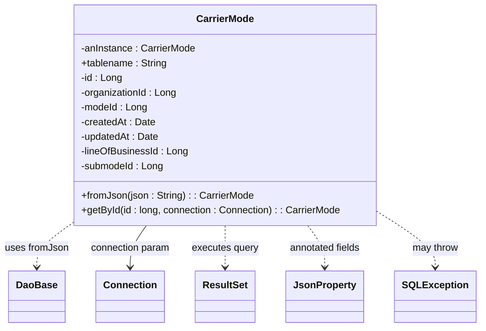

# Diagram: platform-java-lambdas/shipment/src/main/java/com/freightverify/shipment/datastore/postgresql/dao/CarrierMode.java


> Auto-generated by Obscura crawlers

## Diagram 1



### SVG

<svg id="container" width="754.7265625" xmlns="http://www.w3.org/2000/svg" class="classDiagram" height="534" viewBox="0 0 754.7265625 534" role="graphics-document document" aria-roledescription="class"><style>#container{font-family:"trebuchet ms",verdana,arial,sans-serif;font-size:16px;fill:#333;}@keyframes edge-animation-frame{from{stroke-dashoffset:0;}}@keyframes dash{to{stroke-dashoffset:0;}}#container .edge-animation-slow{stroke-dasharray:9,5!important;stroke-dashoffset:900;animation:dash 50s linear infinite;stroke-linecap:round;}#container .edge-animation-fast{stroke-dasharray:9,5!important;stroke-dashoffset:900;animation:dash 20s linear infinite;stroke-linecap:round;}#container .error-icon{fill:#552222;}#container .error-text{fill:#552222;stroke:#552222;}#container .edge-thickness-normal{stroke-width:1px;}#container .edge-thickness-thick{stroke-width:3.5px;}#container .edge-pattern-solid{stroke-dasharray:0;}#container .edge-thickness-invisible{stroke-width:0;fill:none;}#container .edge-pattern-dashed{stroke-dasharray:3;}#container .edge-pattern-dotted{stroke-dasharray:2;}#container .marker{fill:#333333;stroke:#333333;}#container .marker.cross{stroke:#333333;}#container svg{font-family:"trebuchet ms",verdana,arial,sans-serif;font-size:16px;}#container p{margin:0;}#container g.classGroup text{fill:#9370DB;stroke:none;font-family:"trebuchet ms",verdana,arial,sans-serif;font-size:10px;}#container g.classGroup text .title{font-weight:bolder;}#container .nodeLabel,#container .edgeLabel{color:#131300;}#container .edgeLabel .label rect{fill:#ECECFF;}#container .label text{fill:#131300;}#container .labelBkg{background:#ECECFF;}#container .edgeLabel .label span{background:#ECECFF;}#container .classTitle{font-weight:bolder;}#container .node rect,#container .node circle,#container .node ellipse,#container .node polygon,#container .node path{fill:#ECECFF;stroke:#9370DB;stroke-width:1px;}#container .divider{stroke:#9370DB;stroke-width:1;}#container g.clickable{cursor:pointer;}#container g.classGroup rect{fill:#ECECFF;stroke:#9370DB;}#container g.classGroup line{stroke:#9370DB;stroke-width:1;}#container .classLabel .box{stroke:none;stroke-width:0;fill:#ECECFF;opacity:0.5;}#container .classLabel .label{fill:#9370DB;font-size:10px;}#container .relation{stroke:#333333;stroke-width:1;fill:none;}#container .dashed-line{stroke-dasharray:3;}#container .dotted-line{stroke-dasharray:1 2;}#container #compositionStart,#container .composition{fill:#333333!important;stroke:#333333!important;stroke-width:1;}#container #compositionEnd,#container .composition{fill:#333333!important;stroke:#333333!important;stroke-width:1;}#container #dependencyStart,#container .dependency{fill:#333333!important;stroke:#333333!important;stroke-width:1;}#container #dependencyStart,#container .dependency{fill:#333333!important;stroke:#333333!important;stroke-width:1;}#container #extensionStart,#container .extension{fill:transparent!important;stroke:#333333!important;stroke-width:1;}#container #extensionEnd,#container .extension{fill:transparent!important;stroke:#333333!important;stroke-width:1;}#container #aggregationStart,#container .aggregation{fill:transparent!important;stroke:#333333!important;stroke-width:1;}#container #aggregationEnd,#container .aggregation{fill:transparent!important;stroke:#333333!important;stroke-width:1;}#container #lollipopStart,#container .lollipop{fill:#ECECFF!important;stroke:#333333!important;stroke-width:1;}#container #lollipopEnd,#container .lollipop{fill:#ECECFF!important;stroke:#333333!important;stroke-width:1;}#container .edgeTerminals{font-size:11px;line-height:initial;}#container .classTitleText{text-anchor:middle;font-size:18px;fill:#333;}#container .label-icon{display:inline-block;height:1em;overflow:visible;vertical-align:-0.125em;}#container .node .label-icon path{fill:currentColor;stroke:revert;stroke-width:revert;}#container :root{--mermaid-font-family:"trebuchet ms",verdana,arial,sans-serif;}</style><g><defs><marker id="container_class-aggregationStart" class="marker aggregation class" refX="18" refY="7" markerWidth="190" markerHeight="240" orient="auto"><path d="M 18,7 L9,13 L1,7 L9,1 Z"></path></marker></defs><defs><marker id="container_class-aggregationEnd" class="marker aggregation class" refX="1" refY="7" markerWidth="20" markerHeight="28" orient="auto"><path d="M 18,7 L9,13 L1,7 L9,1 Z"></path></marker></defs><defs><marker id="container_class-extensionStart" class="marker extension class" refX="18" refY="7" markerWidth="190" markerHeight="240" orient="auto"><path d="M 1,7 L18,13 V 1 Z"></path></marker></defs><defs><marker id="container_class-extensionEnd" class="marker extension class" refX="1" refY="7" markerWidth="20" markerHeight="28" orient="auto"><path d="M 1,1 V 13 L18,7 Z"></path></marker></defs><defs><marker id="container_class-compositionStart" class="marker composition class" refX="18" refY="7" markerWidth="190" markerHeight="240" orient="auto"><path d="M 18,7 L9,13 L1,7 L9,1 Z"></path></marker></defs><defs><marker id="container_class-compositionEnd" class="marker composition class" refX="1" refY="7" markerWidth="20" markerHeight="28" orient="auto"><path d="M 18,7 L9,13 L1,7 L9,1 Z"></path></marker></defs><defs><marker id="container_class-dependencyStart" class="marker dependency class" refX="6" refY="7" markerWidth="190" markerHeight="240" orient="auto"><path d="M 5,7 L9,13 L1,7 L9,1 Z"></path></marker></defs><defs><marker id="container_class-dependencyEnd" class="marker dependency class" refX="13" refY="7" markerWidth="20" markerHeight="28" orient="auto"><path d="M 18,7 L9,13 L14,7 L9,1 Z"></path></marker></defs><defs><marker id="container_class-lollipopStart" class="marker lollipop class" refX="13" refY="7" markerWidth="190" markerHeight="240" orient="auto"><circle stroke="black" fill="transparent" cx="7" cy="7" r="6"></circle></marker></defs><defs><marker id="container_class-lollipopEnd" class="marker lollipop class" refX="1" refY="7" markerWidth="190" markerHeight="240" orient="auto"><circle stroke="black" fill="transparent" cx="7" cy="7" r="6"></circle></marker></defs><g class="root"><g class="clusters"></g><g class="edgePaths"><path d="M109.941,367.976L101.485,374.147C93.029,380.318,76.116,392.659,67.66,403.996C59.203,415.333,59.203,425.667,59.203,430.833L59.203,436" id="id_CarrierMode_DaoBase_1" class="edge-thickness-normal edge-pattern-dashed relation" style=";;;" data-edge="true" data-et="edge" data-id="id_CarrierMode_DaoBase_1" data-points="W3sieCI6MTA5Ljk0MTQwNjI1LCJ5IjozNjcuOTc2MzE2ODI2NDgxfSx7IngiOjU5LjIwMzEyNSwieSI6NDA1fSx7IngiOjU5LjIwMzEyNSwieSI6NDQyfV0=" marker-end="url(#container_class-dependencyEnd)"></path><path d="M231.793,368L227.517,374.167C223.242,380.333,214.691,392.667,210.416,404C206.141,415.333,206.141,425.667,206.141,430.833L206.141,436" id="id_CarrierMode_Connection_2" class="edge-thickness-normal edge-pattern-solid relation" style=";;;" data-edge="true" data-et="edge" data-id="id_CarrierMode_Connection_2" data-points="W3sieCI6MjMxLjc5MjU5MDcyNTgwNjQ2LCJ5IjozNjh9LHsieCI6MjA2LjE0MDYyNSwieSI6NDA1fSx7IngiOjIwNi4xNDA2MjUsInkiOjQ0Mn1d" marker-end="url(#container_class-dependencyEnd)"></path><path d="M356.586,368L356.586,374.167C356.586,380.333,356.586,392.667,356.586,404C356.586,415.333,356.586,425.667,356.586,430.833L356.586,436" id="id_CarrierMode_ResultSet_3" class="edge-thickness-normal edge-pattern-dashed relation" style=";;;" data-edge="true" data-et="edge" data-id="id_CarrierMode_ResultSet_3" data-points="W3sieCI6MzU2LjU4NTkzNzUsInkiOjM2OH0seyJ4IjozNTYuNTg1OTM3NSwieSI6NDA1fSx7IngiOjM1Ni41ODU5Mzc1LCJ5Ijo0NDJ9XQ==" marker-end="url(#container_class-dependencyEnd)"></path><path d="M486.635,368L491.09,374.167C495.546,380.333,504.456,392.667,508.912,404C513.367,415.333,513.367,425.667,513.367,430.833L513.367,436" id="id_CarrierMode_JsonProperty_4" class="edge-thickness-normal edge-pattern-dashed relation" style=";;;" data-edge="true" data-et="edge" data-id="id_CarrierMode_JsonProperty_4" data-points="W3sieCI6NDg2LjYzNDkwMDYzMzY0MDU0LCJ5IjozNjh9LHsieCI6NTEzLjM2NzE4NzUsInkiOjQwNX0seyJ4Ijo1MTMuMzY3MTg3NSwieSI6NDQyfV0=" marker-end="url(#container_class-dependencyEnd)"></path><path d="M603.23,351.056L616.83,360.047C630.43,369.037,657.629,387.019,671.229,401.176C684.828,415.333,684.828,425.667,684.828,430.833L684.828,436" id="id_CarrierMode_SQLException_5" class="edge-thickness-normal edge-pattern-dashed relation" style=";;;" data-edge="true" data-et="edge" data-id="id_CarrierMode_SQLException_5" data-points="W3sieCI6NjAzLjIzMDQ2ODc1LCJ5IjozNTEuMDU2MDE1NzA4Njc1NDN9LHsieCI6Njg0LjgyODEyNSwieSI6NDA1fSx7IngiOjY4NC44MjgxMjUsInkiOjQ0Mn1d" marker-end="url(#container_class-dependencyEnd)"></path></g><g class="edgeLabels"><g class="edgeLabel" transform="translate(59.203125, 405)"><g class="label" data-id="id_CarrierMode_DaoBase_1" transform="translate(-51.203125, -12)"><foreignObject width="102.40625" height="24"><div xmlns="http://www.w3.org/1999/xhtml" class="labelBkg" style="display: table-cell; white-space: nowrap; line-height: 1.5; max-width: 200px; text-align: center;"><span class="edgeLabel"><p>uses fromJson</p></span></div></foreignObject></g></g><g class="edgeLabel" transform="translate(206.140625, 405)"><g class="label" data-id="id_CarrierMode_Connection_2" transform="translate(-65.5625, -12)"><foreignObject width="131.125" height="24"><div xmlns="http://www.w3.org/1999/xhtml" class="labelBkg" style="display: table-cell; white-space: nowrap; line-height: 1.5; max-width: 200px; text-align: center;"><span class="edgeLabel"><p>connection param</p></span></div></foreignObject></g></g><g class="edgeLabel" transform="translate(356.5859375, 405)"><g class="label" data-id="id_CarrierMode_ResultSet_3" transform="translate(-54.671875, -12)"><foreignObject width="109.34375" height="24"><div xmlns="http://www.w3.org/1999/xhtml" class="labelBkg" style="display: table-cell; white-space: nowrap; line-height: 1.5; max-width: 200px; text-align: center;"><span class="edgeLabel"><p>executes query</p></span></div></foreignObject></g></g><g class="edgeLabel" transform="translate(513.3671875, 405)"><g class="label" data-id="id_CarrierMode_JsonProperty_4" transform="translate(-59.40625, -12)"><foreignObject width="118.8125" height="24"><div xmlns="http://www.w3.org/1999/xhtml" class="labelBkg" style="display: table-cell; white-space: nowrap; line-height: 1.5; max-width: 200px; text-align: center;"><span class="edgeLabel"><p>annotated fields</p></span></div></foreignObject></g></g><g class="edgeLabel" transform="translate(684.828125, 405)"><g class="label" data-id="id_CarrierMode_SQLException_5" transform="translate(-37.9765625, -12)"><foreignObject width="75.953125" height="24"><div xmlns="http://www.w3.org/1999/xhtml" class="labelBkg" style="display: table-cell; white-space: nowrap; line-height: 1.5; max-width: 200px; text-align: center;"><span class="edgeLabel"><p>may throw</p></span></div></foreignObject></g></g></g><g class="nodes"><g class="node default" id="classId-CarrierMode-0" transform="translate(356.5859375, 188)"><g class="basic label-container"><path d="M-246.64453125 -180 L246.64453125 -180 L246.64453125 180 L-246.64453125 180" stroke="none" stroke-width="0" fill="#ECECFF" style=""></path><path d="M-246.64453125 -180 C-118.66682876069366 -180, 9.310873728612677 -180, 246.64453125 -180 M-246.64453125 -180 C-74.76235806425214 -180, 97.11981512149572 -180, 246.64453125 -180 M246.64453125 -180 C246.64453125 -61.53771403905611, 246.64453125 56.924571921887775, 246.64453125 180 M246.64453125 -180 C246.64453125 -73.21280723759362, 246.64453125 33.574385524812755, 246.64453125 180 M246.64453125 180 C80.79054436016276 180, -85.06344252967449 180, -246.64453125 180 M246.64453125 180 C96.86990753050401 180, -52.90471618899198 180, -246.64453125 180 M-246.64453125 180 C-246.64453125 52.1086652595433, -246.64453125 -75.7826694809134, -246.64453125 -180 M-246.64453125 180 C-246.64453125 51.35979770951363, -246.64453125 -77.28040458097274, -246.64453125 -180" stroke="#9370DB" stroke-width="1.3" fill="none" stroke-dasharray="0 0" style=""></path></g><g class="annotation-group text" transform="translate(0, -156)"></g><g class="label-group text" transform="translate(-45.3828125, -156)"><g class="label" style="font-weight: bolder" transform="translate(0,-12)"><foreignObject width="90.765625" height="24"><div xmlns="http://www.w3.org/1999/xhtml" style="display: table-cell; white-space: nowrap; line-height: 1.5; max-width: 139px; text-align: center;"><span class="nodeLabel markdown-node-label" style=""><p>CarrierMode</p></span></div></foreignObject></g></g><g class="members-group text" transform="translate(-234.64453125, -108)"><g class="label" style="" transform="translate(0,-12)"><foreignObject width="187.3125" height="24"><div xmlns="http://www.w3.org/1999/xhtml" style="display: table-cell; white-space: nowrap; line-height: 1.5; max-width: 245px; text-align: center;"><span class="nodeLabel markdown-node-label" style=""><p>-anInstance : CarrierMode</p></span></div></foreignObject></g><g class="label" style="" transform="translate(0,12)"><foreignObject width="140.828125" height="24"><div xmlns="http://www.w3.org/1999/xhtml" style="display: table-cell; white-space: nowrap; line-height: 1.5; max-width: 199px; text-align: center;"><span class="nodeLabel markdown-node-label" style=""><p>+tablename : String</p></span></div></foreignObject></g><g class="label" style="" transform="translate(0,36)"><foreignObject width="67.46875" height="24"><div xmlns="http://www.w3.org/1999/xhtml" style="display: table-cell; white-space: nowrap; line-height: 1.5; max-width: 125px; text-align: center;"><span class="nodeLabel markdown-node-label" style=""><p>-id : Long</p></span></div></foreignObject></g><g class="label" style="" transform="translate(0,60)"><foreignObject width="158.03125" height="24"><div xmlns="http://www.w3.org/1999/xhtml" style="display: table-cell; white-space: nowrap; line-height: 1.5; max-width: 216px; text-align: center;"><span class="nodeLabel markdown-node-label" style=""><p>-organizationId : Long</p></span></div></foreignObject></g><g class="label" style="" transform="translate(0,84)"><foreignObject width="109.015625" height="24"><div xmlns="http://www.w3.org/1999/xhtml" style="display: table-cell; white-space: nowrap; line-height: 1.5; max-width: 167px; text-align: center;"><span class="nodeLabel markdown-node-label" style=""><p>-modeId : Long</p></span></div></foreignObject></g><g class="label" style="" transform="translate(0,108)"><foreignObject width="121.25" height="24"><div xmlns="http://www.w3.org/1999/xhtml" style="display: table-cell; white-space: nowrap; line-height: 1.5; max-width: 179px; text-align: center;"><span class="nodeLabel markdown-node-label" style=""><p>-createdAt : Date</p></span></div></foreignObject></g><g class="label" style="" transform="translate(0,132)"><foreignObject width="127.734375" height="24"><div xmlns="http://www.w3.org/1999/xhtml" style="display: table-cell; white-space: nowrap; line-height: 1.5; max-width: 185px; text-align: center;"><span class="nodeLabel markdown-node-label" style=""><p>-updatedAt : Date</p></span></div></foreignObject></g><g class="label" style="" transform="translate(0,156)"><foreignObject width="175.296875" height="24"><div xmlns="http://www.w3.org/1999/xhtml" style="display: table-cell; white-space: nowrap; line-height: 1.5; max-width: 233px; text-align: center;"><span class="nodeLabel markdown-node-label" style=""><p>-lineOfBusinessId : Long</p></span></div></foreignObject></g><g class="label" style="" transform="translate(0,180)"><foreignObject width="135.296875" height="24"><div xmlns="http://www.w3.org/1999/xhtml" style="display: table-cell; white-space: nowrap; line-height: 1.5; max-width: 193px; text-align: center;"><span class="nodeLabel markdown-node-label" style=""><p>-submodeId : Long</p></span></div></foreignObject></g></g><g class="methods-group text" transform="translate(-234.64453125, 132)"><g class="label" style="" transform="translate(0,-12)"><foreignObject width="279.5" height="24"><div xmlns="http://www.w3.org/1999/xhtml" style="display: table-cell; white-space: nowrap; line-height: 1.5; max-width: 337px; text-align: center;"><span class="nodeLabel markdown-node-label" style=""><p>+fromJson(json : String) : : CarrierMode</p></span></div></foreignObject></g><g class="label" style="" transform="translate(0,12)"><foreignObject width="423.90625" height="24"><div xmlns="http://www.w3.org/1999/xhtml" style="display: table-cell; white-space: nowrap; line-height: 1.5; max-width: 481px; text-align: center;"><span class="nodeLabel markdown-node-label" style=""><p>+getById(id : long, connection : Connection) : : CarrierMode</p></span></div></foreignObject></g></g><g class="divider" style=""><path d="M-246.64453125 -132 C-68.71537394442802 -132, 109.21378336114395 -132, 246.64453125 -132 M-246.64453125 -132 C-126.54190857663002 -132, -6.439285903260043 -132, 246.64453125 -132" stroke="#9370DB" stroke-width="1.3" fill="none" stroke-dasharray="0 0" style=""></path></g><g class="divider" style=""><path d="M-246.64453125 108 C-60.08371801368466 108, 126.47709522263068 108, 246.64453125 108 M-246.64453125 108 C-90.67728933099625 108, 65.28995258800751 108, 246.64453125 108" stroke="#9370DB" stroke-width="1.3" fill="none" stroke-dasharray="0 0" style=""></path></g></g><g class="node default" id="classId-DaoBase-1" transform="translate(59.203125, 484)"><g class="basic label-container"><path d="M-43.7109375 -42 L43.7109375 -42 L43.7109375 42 L-43.7109375 42" stroke="none" stroke-width="0" fill="#ECECFF" style=""></path><path d="M-43.7109375 -42 C-14.706001302781178 -42, 14.298934894437643 -42, 43.7109375 -42 M-43.7109375 -42 C-24.635841892578718 -42, -5.560746285157435 -42, 43.7109375 -42 M43.7109375 -42 C43.7109375 -15.746048504570119, 43.7109375 10.507902990859762, 43.7109375 42 M43.7109375 -42 C43.7109375 -17.97015671235461, 43.7109375 6.059686575290783, 43.7109375 42 M43.7109375 42 C24.843227970220777 42, 5.9755184404415544 42, -43.7109375 42 M43.7109375 42 C21.811795240084162 42, -0.08734701983167525 42, -43.7109375 42 M-43.7109375 42 C-43.7109375 24.5035570594292, -43.7109375 7.0071141188583965, -43.7109375 -42 M-43.7109375 42 C-43.7109375 20.900291746724353, -43.7109375 -0.1994165065512945, -43.7109375 -42" stroke="#9370DB" stroke-width="1.3" fill="none" stroke-dasharray="0 0" style=""></path></g><g class="annotation-group text" transform="translate(0, -18)"></g><g class="label-group text" transform="translate(-31.7109375, -18)"><g class="label" style="font-weight: bolder" transform="translate(0,-12)"><foreignObject width="63.421875" height="24"><div xmlns="http://www.w3.org/1999/xhtml" style="display: table-cell; white-space: nowrap; line-height: 1.5; max-width: 113px; text-align: center;"><span class="nodeLabel markdown-node-label" style=""><p>DaoBase</p></span></div></foreignObject></g></g><g class="members-group text" transform="translate(-31.7109375, 30)"></g><g class="methods-group text" transform="translate(-31.7109375, 60)"></g><g class="divider" style=""><path d="M-43.7109375 6 C-18.289332896384117 6, 7.132271707231766 6, 43.7109375 6 M-43.7109375 6 C-13.397687609706914 6, 16.915562280586173 6, 43.7109375 6" stroke="#9370DB" stroke-width="1.3" fill="none" stroke-dasharray="0 0" style=""></path></g><g class="divider" style=""><path d="M-43.7109375 24 C-25.53591506716489 24, -7.36089263432978 24, 43.7109375 24 M-43.7109375 24 C-23.457479023043724 24, -3.204020546087449 24, 43.7109375 24" stroke="#9370DB" stroke-width="1.3" fill="none" stroke-dasharray="0 0" style=""></path></g></g><g class="node default" id="classId-Connection-2" transform="translate(206.140625, 484)"><g class="basic label-container"><path d="M-53.2265625 -42 L53.2265625 -42 L53.2265625 42 L-53.2265625 42" stroke="none" stroke-width="0" fill="#ECECFF" style=""></path><path d="M-53.2265625 -42 C-16.138637969984487 -42, 20.949286560031027 -42, 53.2265625 -42 M-53.2265625 -42 C-11.519294228109018 -42, 30.187974043781963 -42, 53.2265625 -42 M53.2265625 -42 C53.2265625 -8.675499793878302, 53.2265625 24.649000412243396, 53.2265625 42 M53.2265625 -42 C53.2265625 -19.485632931742412, 53.2265625 3.028734136515176, 53.2265625 42 M53.2265625 42 C18.2610926900809 42, -16.7043771198382 42, -53.2265625 42 M53.2265625 42 C21.677303992829533 42, -9.871954514340935 42, -53.2265625 42 M-53.2265625 42 C-53.2265625 15.955175129994196, -53.2265625 -10.089649740011609, -53.2265625 -42 M-53.2265625 42 C-53.2265625 10.648191329819259, -53.2265625 -20.703617340361482, -53.2265625 -42" stroke="#9370DB" stroke-width="1.3" fill="none" stroke-dasharray="0 0" style=""></path></g><g class="annotation-group text" transform="translate(0, -18)"></g><g class="label-group text" transform="translate(-41.2265625, -18)"><g class="label" style="font-weight: bolder" transform="translate(0,-12)"><foreignObject width="82.453125" height="24"><div xmlns="http://www.w3.org/1999/xhtml" style="display: table-cell; white-space: nowrap; line-height: 1.5; max-width: 132px; text-align: center;"><span class="nodeLabel markdown-node-label" style=""><p>Connection</p></span></div></foreignObject></g></g><g class="members-group text" transform="translate(-41.2265625, 30)"></g><g class="methods-group text" transform="translate(-41.2265625, 60)"></g><g class="divider" style=""><path d="M-53.2265625 6 C-11.040955856303803 6, 31.144650787392393 6, 53.2265625 6 M-53.2265625 6 C-24.703960359507906 6, 3.818641780984187 6, 53.2265625 6" stroke="#9370DB" stroke-width="1.3" fill="none" stroke-dasharray="0 0" style=""></path></g><g class="divider" style=""><path d="M-53.2265625 24 C-24.569740402667605 24, 4.087081694664789 24, 53.2265625 24 M-53.2265625 24 C-17.480648831296598 24, 18.265264837406804 24, 53.2265625 24" stroke="#9370DB" stroke-width="1.3" fill="none" stroke-dasharray="0 0" style=""></path></g></g><g class="node default" id="classId-ResultSet-3" transform="translate(356.5859375, 484)"><g class="basic label-container"><path d="M-47.21875 -42 L47.21875 -42 L47.21875 42 L-47.21875 42" stroke="none" stroke-width="0" fill="#ECECFF" style=""></path><path d="M-47.21875 -42 C-21.14623211069588 -42, 4.926285778608239 -42, 47.21875 -42 M-47.21875 -42 C-14.930887503611011 -42, 17.356974992777978 -42, 47.21875 -42 M47.21875 -42 C47.21875 -17.314481798119054, 47.21875 7.371036403761892, 47.21875 42 M47.21875 -42 C47.21875 -24.00148964623403, 47.21875 -6.002979292468062, 47.21875 42 M47.21875 42 C22.204673381679914 42, -2.809403236640172 42, -47.21875 42 M47.21875 42 C9.543778095159233 42, -28.131193809681534 42, -47.21875 42 M-47.21875 42 C-47.21875 23.253282322514785, -47.21875 4.50656464502957, -47.21875 -42 M-47.21875 42 C-47.21875 22.23315644021424, -47.21875 2.4663128804284824, -47.21875 -42" stroke="#9370DB" stroke-width="1.3" fill="none" stroke-dasharray="0 0" style=""></path></g><g class="annotation-group text" transform="translate(0, -18)"></g><g class="label-group text" transform="translate(-35.21875, -18)"><g class="label" style="font-weight: bolder" transform="translate(0,-12)"><foreignObject width="70.4375" height="24"><div xmlns="http://www.w3.org/1999/xhtml" style="display: table-cell; white-space: nowrap; line-height: 1.5; max-width: 119px; text-align: center;"><span class="nodeLabel markdown-node-label" style=""><p>ResultSet</p></span></div></foreignObject></g></g><g class="members-group text" transform="translate(-35.21875, 30)"></g><g class="methods-group text" transform="translate(-35.21875, 60)"></g><g class="divider" style=""><path d="M-47.21875 6 C-19.466619901596793 6, 8.285510196806413 6, 47.21875 6 M-47.21875 6 C-24.80546164973337 6, -2.392173299466741 6, 47.21875 6" stroke="#9370DB" stroke-width="1.3" fill="none" stroke-dasharray="0 0" style=""></path></g><g class="divider" style=""><path d="M-47.21875 24 C-27.020974392894143 24, -6.823198785788286 24, 47.21875 24 M-47.21875 24 C-13.983321833711948 24, 19.252106332576105 24, 47.21875 24" stroke="#9370DB" stroke-width="1.3" fill="none" stroke-dasharray="0 0" style=""></path></g></g><g class="node default" id="classId-JsonProperty-4" transform="translate(513.3671875, 484)"><g class="basic label-container"><path d="M-59.5625 -42 L59.5625 -42 L59.5625 42 L-59.5625 42" stroke="none" stroke-width="0" fill="#ECECFF" style=""></path><path d="M-59.5625 -42 C-23.840609580806067 -42, 11.881280838387866 -42, 59.5625 -42 M-59.5625 -42 C-23.032918581443788 -42, 13.496662837112424 -42, 59.5625 -42 M59.5625 -42 C59.5625 -11.690363715758899, 59.5625 18.619272568482202, 59.5625 42 M59.5625 -42 C59.5625 -11.347525193466193, 59.5625 19.304949613067613, 59.5625 42 M59.5625 42 C16.78356472589782 42, -25.995370548204363 42, -59.5625 42 M59.5625 42 C34.949874961600514 42, 10.337249923201028 42, -59.5625 42 M-59.5625 42 C-59.5625 9.580891684840594, -59.5625 -22.83821663031881, -59.5625 -42 M-59.5625 42 C-59.5625 12.354944483667541, -59.5625 -17.290111032664917, -59.5625 -42" stroke="#9370DB" stroke-width="1.3" fill="none" stroke-dasharray="0 0" style=""></path></g><g class="annotation-group text" transform="translate(0, -18)"></g><g class="label-group text" transform="translate(-47.5625, -18)"><g class="label" style="font-weight: bolder" transform="translate(0,-12)"><foreignObject width="95.125" height="24"><div xmlns="http://www.w3.org/1999/xhtml" style="display: table-cell; white-space: nowrap; line-height: 1.5; max-width: 143px; text-align: center;"><span class="nodeLabel markdown-node-label" style=""><p>JsonProperty</p></span></div></foreignObject></g></g><g class="members-group text" transform="translate(-47.5625, 30)"></g><g class="methods-group text" transform="translate(-47.5625, 60)"></g><g class="divider" style=""><path d="M-59.5625 6 C-18.461816763050194 6, 22.63886647389961 6, 59.5625 6 M-59.5625 6 C-33.18548092168552 6, -6.808461843371035 6, 59.5625 6" stroke="#9370DB" stroke-width="1.3" fill="none" stroke-dasharray="0 0" style=""></path></g><g class="divider" style=""><path d="M-59.5625 24 C-19.969444058501438 24, 19.623611882997125 24, 59.5625 24 M-59.5625 24 C-23.599251621207465 24, 12.36399675758507 24, 59.5625 24" stroke="#9370DB" stroke-width="1.3" fill="none" stroke-dasharray="0 0" style=""></path></g></g><g class="node default" id="classId-SQLException-5" transform="translate(684.828125, 484)"><g class="basic label-container"><path d="M-61.8984375 -42 L61.8984375 -42 L61.8984375 42 L-61.8984375 42" stroke="none" stroke-width="0" fill="#ECECFF" style=""></path><path d="M-61.8984375 -42 C-19.253401970617524 -42, 23.39163355876495 -42, 61.8984375 -42 M-61.8984375 -42 C-13.077063949641783 -42, 35.744309600716434 -42, 61.8984375 -42 M61.8984375 -42 C61.8984375 -15.058012709157218, 61.8984375 11.883974581685564, 61.8984375 42 M61.8984375 -42 C61.8984375 -17.135741932207054, 61.8984375 7.728516135585892, 61.8984375 42 M61.8984375 42 C28.38129703409615 42, -5.1358434318077 42, -61.8984375 42 M61.8984375 42 C20.96882432708793 42, -19.96078884582414 42, -61.8984375 42 M-61.8984375 42 C-61.8984375 22.38067028647652, -61.8984375 2.7613405729530385, -61.8984375 -42 M-61.8984375 42 C-61.8984375 22.75910673985047, -61.8984375 3.5182134797009397, -61.8984375 -42" stroke="#9370DB" stroke-width="1.3" fill="none" stroke-dasharray="0 0" style=""></path></g><g class="annotation-group text" transform="translate(0, -18)"></g><g class="label-group text" transform="translate(-49.8984375, -18)"><g class="label" style="font-weight: bolder" transform="translate(0,-12)"><foreignObject width="99.796875" height="24"><div xmlns="http://www.w3.org/1999/xhtml" style="display: table-cell; white-space: nowrap; line-height: 1.5; max-width: 148px; text-align: center;"><span class="nodeLabel markdown-node-label" style=""><p>SQLException</p></span></div></foreignObject></g></g><g class="members-group text" transform="translate(-49.8984375, 30)"></g><g class="methods-group text" transform="translate(-49.8984375, 60)"></g><g class="divider" style=""><path d="M-61.8984375 6 C-20.826547863926535 6, 20.24534177214693 6, 61.8984375 6 M-61.8984375 6 C-25.623382332847285 6, 10.65167283430543 6, 61.8984375 6" stroke="#9370DB" stroke-width="1.3" fill="none" stroke-dasharray="0 0" style=""></path></g><g class="divider" style=""><path d="M-61.8984375 24 C-14.3921100325094 24, 33.1142174349812 24, 61.8984375 24 M-61.8984375 24 C-23.349739692271605 24, 15.19895811545679 24, 61.8984375 24" stroke="#9370DB" stroke-width="1.3" fill="none" stroke-dasharray="0 0" style=""></path></g></g></g></g></g></svg>

## Diagram 2

```mermaid
flowchart TD
A[CarrierMode.getById(id, connection)] --> B[Build SQL: select row_to_json(row) from ( select * from public.carrier_mode where id = <id> ) row]
B --> C[Execute: connection.executeQuery(SQL)]
C --> D{results.next()?}
D -- Yes --> E[json = results.getString(1)]
E --> F[CarrierMode.fromJson(json)]
F --> G[return CarrierMode]
D -- No --> H[return null]
C --> I[ResultSet auto-closed (try-with-resources)]
F --> I
G --> I
H --> I
```

> SVG rendering failed for this diagram.
