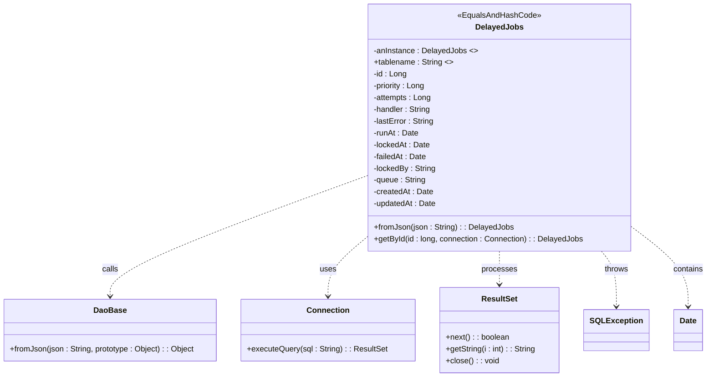
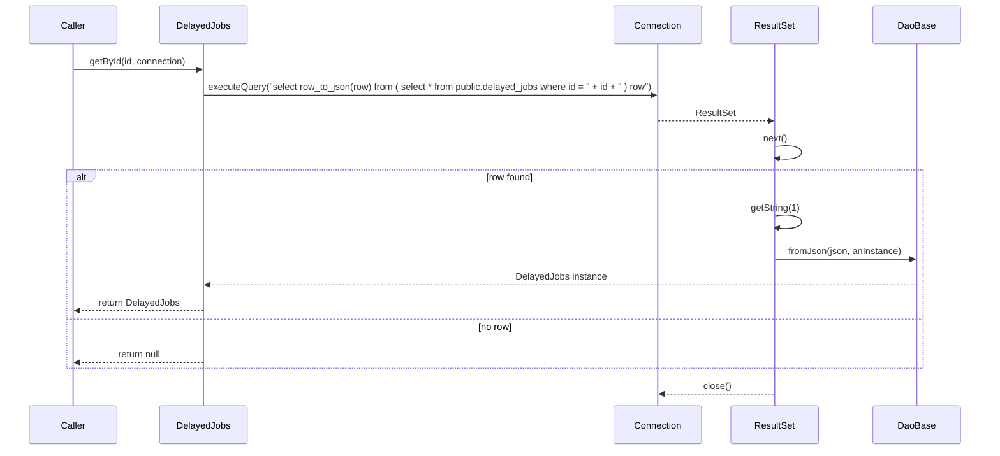

# Diagram: platform-java-lambdas/shipment/src/main/java/com/freightverify/shipment/datastore/postgresql/dao/DelayedJobs.java

> Auto-generated by Obscura crawlers

## Diagram 1

### SVG

<svg id="container" width="1422.890625" xmlns="http://www.w3.org/2000/svg" class="classDiagram" height="768" viewBox="0 0 1422.890625 768" role="graphics-document document" aria-roledescription="class"><g><defs><marker id="container_class-aggregationStart" class="marker aggregation class" refX="18" refY="7" markerWidth="190" markerHeight="240" orient="auto"><path d="M 18,7 L9,13 L1,7 L9,1 Z"></path></marker></defs><defs><marker id="container_class-aggregationEnd" class="marker aggregation class" refX="1" refY="7" markerWidth="20" markerHeight="28" orient="auto"><path d="M 18,7 L9,13 L1,7 L9,1 Z"></path></marker></defs><defs><marker id="container_class-extensionStart" class="marker extension class" refX="18" refY="7" markerWidth="190" markerHeight="240" orient="auto"><path d="M 1,7 L18,13 V 1 Z"></path></marker></defs><defs><marker id="container_class-extensionEnd" class="marker extension class" refX="1" refY="7" markerWidth="20" markerHeight="28" orient="auto"><path d="M 1,1 V 13 L18,7 Z"></path></marker></defs><defs><marker id="container_class-compositionStart" class="marker composition class" refX="18" refY="7" markerWidth="190" markerHeight="240" orient="auto"><path d="M 18,7 L9,13 L1,7 L9,1 Z"></path></marker></defs><defs><marker id="container_class-compositionEnd" class="marker composition class" refX="1" refY="7" markerWidth="20" markerHeight="28" orient="auto"><path d="M 18,7 L9,13 L1,7 L9,1 Z"></path></marker></defs><defs><marker id="container_class-dependencyStart" class="marker dependency class" refX="6" refY="7" markerWidth="190" markerHeight="240" orient="auto"><path d="M 5,7 L9,13 L1,7 L9,1 Z"></path></marker></defs><defs><marker id="container_class-dependencyEnd" class="marker dependency class" refX="13" refY="7" markerWidth="20" markerHeight="28" orient="auto"><path d="M 18,7 L9,13 L14,7 L9,1 Z"></path></marker></defs><defs><marker id="container_class-lollipopStart" class="marker lollipop class" refX="13" refY="7" markerWidth="190" markerHeight="240" orient="auto"><circle stroke="black" fill="transparent" cx="7" cy="7" r="6"></circle></marker></defs><defs><marker id="container_class-lollipopEnd" class="marker lollipop class" refX="1" refY="7" markerWidth="190" markerHeight="240" orient="auto"><circle stroke="black" fill="transparent" cx="7" cy="7" r="6"></circle></marker></defs><g class="root"><g class="clusters"></g><g class="edgePaths"><path d="M744.348,357.652L657.613,389.543C570.879,421.435,397.41,485.217,310.676,526.275C223.941,567.333,223.941,585.667,223.941,594.833L223.941,604" id="id_DelayedJobs_DaoBase_1" class="edge-thickness-normal edge-pattern-dashed relation" style=";;;" data-edge="true" data-et="edge" data-id="id_DelayedJobs_DaoBase_1" data-points="W3sieCI6NzQ0LjM0NzY1NjI1LCJ5IjozNTcuNjUxODQ2NTUwNjcwMn0seyJ4IjoyMjMuOTQxNDA2MjUsInkiOjU0OX0seyJ4IjoyMjMuOTQxNDA2MjUsInkiOjYxMH1d" marker-end="url(#container_class-dependencyEnd)"></path><path d="M744.348,482.008L730.991,493.173C717.634,504.339,690.921,526.669,677.564,547.001C664.207,567.333,664.207,585.667,664.207,594.833L664.207,604" id="id_DelayedJobs_Connection_2" class="edge-thickness-normal edge-pattern-dashed relation" style=";;;" data-edge="true" data-et="edge" data-id="id_DelayedJobs_Connection_2" data-points="W3sieCI6NzQ0LjM0NzY1NjI1LCJ5Ijo0ODIuMDA4MDMzNDQ0NDM4Mn0seyJ4Ijo2NjQuMjA3MDMxMjUsInkiOjU0OX0seyJ4Ijo2NjQuMjA3MDMxMjUsInkiOjYxMH1d" marker-end="url(#container_class-dependencyEnd)"></path><path d="M1009.93,512L1009.93,518.167C1009.93,524.333,1009.93,536.667,1009.93,548C1009.93,559.333,1009.93,569.667,1009.93,574.833L1009.93,580" id="id_DelayedJobs_ResultSet_3" class="edge-thickness-normal edge-pattern-dashed relation" style=";;;" data-edge="true" data-et="edge" data-id="id_DelayedJobs_ResultSet_3" data-points="W3sieCI6MTAwOS45Mjk2ODc1LCJ5Ijo1MTJ9LHsieCI6MTAwOS45Mjk2ODc1LCJ5Ijo1NDl9LHsieCI6MTAwOS45Mjk2ODc1LCJ5Ijo1ODZ9XQ==" marker-end="url(#container_class-dependencyEnd)"></path><path d="M1213.358,512L1218.336,518.167C1223.314,524.333,1233.27,536.667,1238.248,555.5C1243.227,574.333,1243.227,599.667,1243.227,612.333L1243.227,625" id="id_DelayedJobs_SQLException_4" class="edge-thickness-normal edge-pattern-dashed relation" style=";;;" data-edge="true" data-et="edge" data-id="id_DelayedJobs_SQLException_4" data-points="W3sieCI6MTIxMy4zNTgxMDQ0NTUwMTc0LCJ5Ijo1MTJ9LHsieCI6MTI0My4yMjY1NjI1LCJ5Ijo1NDl9LHsieCI6MTI0My4yMjY1NjI1LCJ5Ijo2MzF9XQ==" marker-end="url(#container_class-dependencyEnd)"></path><path d="M1275.512,465.184L1293.593,479.153C1311.674,493.123,1347.837,521.061,1365.919,547.697C1384,574.333,1384,599.667,1384,612.333L1384,625" id="id_DelayedJobs_Date_5" class="edge-thickness-normal edge-pattern-dashed relation" style=";;;" data-edge="true" data-et="edge" data-id="id_DelayedJobs_Date_5" data-points="W3sieCI6MTI3NS41MTE3MTg3NSwieSI6NDY1LjE4MzkwMzg0NDk0ODkzfSx7IngiOjEzODQsInkiOjU0OX0seyJ4IjoxMzg0LCJ5Ijo2MzF9XQ==" marker-end="url(#container_class-dependencyEnd)"></path></g><g class="edgeLabels"><g class="edgeLabel" transform="translate(223.94140625, 549)"><g class="label" data-id="id_DelayedJobs_DaoBase_1" transform="translate(-16.4453125, -12)"><foreignObject width="32.890625" height="24">

calls

</foreignObject></g></g><g class="edgeLabel" transform="translate(664.20703125, 549)"><g class="label" data-id="id_DelayedJobs_Connection_2" transform="translate(-16.4921875, -12)"><foreignObject width="32.984375" height="24">

uses

</foreignObject></g></g><g class="edgeLabel" transform="translate(1009.9296875, 549)"><g class="label" data-id="id_DelayedJobs_ResultSet_3" transform="translate(-35.7890625, -12)"><foreignObject width="71.578125" height="24">

processes

</foreignObject></g></g><g class="edgeLabel" transform="translate(1243.2265625, 549)"><g class="label" data-id="id_DelayedJobs_SQLException_4" transform="translate(-24.5703125, -12)"><foreignObject width="49.140625" height="24">

throws

</foreignObject></g></g><g class="edgeLabel" transform="translate(1384, 549)"><g class="label" data-id="id_DelayedJobs_Date_5" transform="translate(-30.890625, -12)"><foreignObject width="61.78125" height="24">

contains

</foreignObject></g></g></g><g class="nodes"><g class="node default" id="classId-DelayedJobs-0" transform="translate(1009.9296875, 260)"><g class="basic label-container"><path d="M-265.58203125 -252 L265.58203125 -252 L265.58203125 252 L-265.58203125 252" stroke="none" stroke-width="0" fill="#ECECFF" style=""></path><path d="M-265.58203125 -252 C-120.41938456714368 -252, 24.74326211571264 -252, 265.58203125 -252 M-265.58203125 -252 C-154.43843180727316 -252, -43.294832364546295 -252, 265.58203125 -252 M265.58203125 -252 C265.58203125 -80.9634317406177, 265.58203125 90.07313651876461, 265.58203125 252 M265.58203125 -252 C265.58203125 -146.9659091768743, 265.58203125 -41.93181835374861, 265.58203125 252 M265.58203125 252 C57.064497344385984 252, -151.45303656122803 252, -265.58203125 252 M265.58203125 252 C97.97800172518606 252, -69.62602779962788 252, -265.58203125 252 M-265.58203125 252 C-265.58203125 108.34805881821401, -265.58203125 -35.30388236357197, -265.58203125 -252 M-265.58203125 252 C-265.58203125 98.68415878848268, -265.58203125 -54.63168242303465, -265.58203125 -252" stroke="#9370DB" stroke-width="1.3" fill="none" stroke-dasharray="0 0" style=""></path></g><g class="annotation-group text" transform="translate(-83.2109375, -228)"><g class="label" style="" transform="translate(0,-12)"><foreignObject width="166.421875" height="24">

«EqualsAndHashCode»

</foreignObject></g></g><g class="label-group text" transform="translate(-45.375, -204)"><g class="label" style="font-weight: bolder" transform="translate(0,-12)"><foreignObject width="90.75" height="24">

DelayedJobs

</foreignObject></g></g><g class="members-group text" transform="translate(-253.58203125, -156)"><g class="label" style="" transform="translate(0,-12)"><foreignObject width="207.609375" height="24">

-anInstance : DelayedJobs &lt;&gt;

</foreignObject></g><g class="label" style="" transform="translate(0,12)"><foreignObject width="161.0625" height="24">

+tablename : String &lt;&gt;

</foreignObject></g><g class="label" style="" transform="translate(0,36)"><foreignObject width="67.46875" height="24">

-id : Long

</foreignObject></g><g class="label" style="" transform="translate(0,60)"><foreignObject width="107.171875" height="24">

-priority : Long

</foreignObject></g><g class="label" style="" transform="translate(0,84)"><foreignObject width="118.34375" height="24">

-attempts : Long

</foreignObject></g><g class="label" style="" transform="translate(0,108)"><foreignObject width="118.1875" height="24">

-handler : String

</foreignObject></g><g class="label" style="" transform="translate(0,132)"><foreignObject width="123.84375" height="24">

-lastError : String

</foreignObject></g><g class="label" style="" transform="translate(0,156)"><foreignObject width="91.6875" height="24">

-runAt : Date

</foreignObject></g><g class="label" style="" transform="translate(0,180)"><foreignObject width="114.765625" height="24">

-lockedAt : Date

</foreignObject></g><g class="label" style="" transform="translate(0,204)"><foreignObject width="107.703125" height="24">

-failedAt : Date

</foreignObject></g><g class="label" style="" transform="translate(0,228)"><foreignObject width="127.1875" height="24">

-lockedBy : String

</foreignObject></g><g class="label" style="" transform="translate(0,252)"><foreignObject width="107.28125" height="24">

-queue : String

</foreignObject></g><g class="label" style="" transform="translate(0,276)"><foreignObject width="121.25" height="24">

-createdAt : Date

</foreignObject></g><g class="label" style="" transform="translate(0,300)"><foreignObject width="127.734375" height="24">

-updatedAt : Date

</foreignObject></g></g><g class="methods-group text" transform="translate(-253.58203125, 204)"><g class="label" style="" transform="translate(0,-12)"><foreignObject width="279.546875" height="24">

+fromJson(json : String) : : DelayedJobs

</foreignObject></g><g class="label" style="" transform="translate(0,12)"><foreignObject width="423.953125" height="24">

+getById(id : long, connection : Connection) : : DelayedJobs

</foreignObject></g></g><g class="divider" style=""><path d="M-265.58203125 -180 C-108.46881262600422 -180, 48.644405997991555 -180, 265.58203125 -180 M-265.58203125 -180 C-62.97655830297626 -180, 139.62891464404748 -180, 265.58203125 -180" stroke="#9370DB" stroke-width="1.3" fill="none" stroke-dasharray="0 0" style=""></path></g><g class="divider" style=""><path d="M-265.58203125 180 C-106.71859500099328 180, 52.14484124801345 180, 265.58203125 180 M-265.58203125 180 C-98.25699893714346 180, 69.06803337571307 180, 265.58203125 180" stroke="#9370DB" stroke-width="1.3" fill="none" stroke-dasharray="0 0" style=""></path></g></g><g class="node default" id="classId-DaoBase-1" transform="translate(223.94140625, 673)"><g class="basic label-container"><path d="M-215.94140625 -63 L215.94140625 -63 L215.94140625 63 L-215.94140625 63" stroke="none" stroke-width="0" fill="#ECECFF" style=""></path><path d="M-215.94140625 -63 C-74.13677559897857 -63, 67.66785505204285 -63, 215.94140625 -63 M-215.94140625 -63 C-126.99267818288533 -63, -38.043950115770656 -63, 215.94140625 -63 M215.94140625 -63 C215.94140625 -35.071561892072864, 215.94140625 -7.143123784145722, 215.94140625 63 M215.94140625 -63 C215.94140625 -16.30991384394659, 215.94140625 30.380172312106822, 215.94140625 63 M215.94140625 63 C83.4454370741341 63, -49.05053210173179 63, -215.94140625 63 M215.94140625 63 C91.12348701463328 63, -33.69443222073343 63, -215.94140625 63 M-215.94140625 63 C-215.94140625 35.40366226105269, -215.94140625 7.807324522105382, -215.94140625 -63 M-215.94140625 63 C-215.94140625 24.68621383270152, -215.94140625 -13.627572334596962, -215.94140625 -63" stroke="#9370DB" stroke-width="1.3" fill="none" stroke-dasharray="0 0" style=""></path></g><g class="annotation-group text" transform="translate(0, -39)"></g><g class="label-group text" transform="translate(-31.7109375, -39)"><g class="label" style="font-weight: bolder" transform="translate(0,-12)"><foreignObject width="63.421875" height="24">

DaoBase

</foreignObject></g></g><g class="members-group text" transform="translate(-203.94140625, 9)"></g><g class="methods-group text" transform="translate(-203.94140625, 39)"><g class="label" style="" transform="translate(0,-12)"><foreignObject width="376.171875" height="24">

+fromJson(json : String, prototype : Object) : : Object

</foreignObject></g></g><g class="divider" style=""><path d="M-215.94140625 -15 C-70.14445857833115 -15, 75.65248909333769 -15, 215.94140625 -15 M-215.94140625 -15 C-65.83953438573738 -15, 84.26233747852524 -15, 215.94140625 -15" stroke="#9370DB" stroke-width="1.3" fill="none" stroke-dasharray="0 0" style=""></path></g><g class="divider" style=""><path d="M-215.94140625 9 C-95.13759474244134 9, 25.666216765117326 9, 215.94140625 9 M-215.94140625 9 C-110.38797974145787 9, -4.834553232915738 9, 215.94140625 9" stroke="#9370DB" stroke-width="1.3" fill="none" stroke-dasharray="0 0" style=""></path></g></g><g class="node default" id="classId-Connection-2" transform="translate(664.20703125, 673)"><g class="basic label-container"><path d="M-174.32421875 -63 L174.32421875 -63 L174.32421875 63 L-174.32421875 63" stroke="none" stroke-width="0" fill="#ECECFF" style=""></path><path d="M-174.32421875 -63 C-92.18532311485114 -63, -10.046427479702288 -63, 174.32421875 -63 M-174.32421875 -63 C-52.07145668407152 -63, 70.18130538185696 -63, 174.32421875 -63 M174.32421875 -63 C174.32421875 -22.859049248818778, 174.32421875 17.281901502362444, 174.32421875 63 M174.32421875 -63 C174.32421875 -14.494540083157723, 174.32421875 34.010919833684554, 174.32421875 63 M174.32421875 63 C42.08514734633209 63, -90.15392405733581 63, -174.32421875 63 M174.32421875 63 C80.18308422032989 63, -13.958050309340223 63, -174.32421875 63 M-174.32421875 63 C-174.32421875 19.61506358774554, -174.32421875 -23.769872824508923, -174.32421875 -63 M-174.32421875 63 C-174.32421875 33.023426138830686, -174.32421875 3.0468522776613653, -174.32421875 -63" stroke="#9370DB" stroke-width="1.3" fill="none" stroke-dasharray="0 0" style=""></path></g><g class="annotation-group text" transform="translate(0, -39)"></g><g class="label-group text" transform="translate(-41.2265625, -39)"><g class="label" style="font-weight: bolder" transform="translate(0,-12)"><foreignObject width="82.453125" height="24">

Connection

</foreignObject></g></g><g class="members-group text" transform="translate(-162.32421875, 9)"></g><g class="methods-group text" transform="translate(-162.32421875, 39)"><g class="label" style="" transform="translate(0,-12)"><foreignObject width="283.421875" height="24">

+executeQuery(sql : String) : : ResultSet

</foreignObject></g></g><g class="divider" style=""><path d="M-174.32421875 -15 C-60.13156308768704 -15, 54.06109257462592 -15, 174.32421875 -15 M-174.32421875 -15 C-36.66549292367313 -15, 100.99323290265374 -15, 174.32421875 -15" stroke="#9370DB" stroke-width="1.3" fill="none" stroke-dasharray="0 0" style=""></path></g><g class="divider" style=""><path d="M-174.32421875 9 C-46.84348063376903 9, 80.63725748246193 9, 174.32421875 9 M-174.32421875 9 C-63.66477203862398 9, 46.99467467275204 9, 174.32421875 9" stroke="#9370DB" stroke-width="1.3" fill="none" stroke-dasharray="0 0" style=""></path></g></g><g class="node default" id="classId-ResultSet-3" transform="translate(1009.9296875, 673)"><g class="basic label-container"><path d="M-121.3984375 -87 L121.3984375 -87 L121.3984375 87 L-121.3984375 87" stroke="none" stroke-width="0" fill="#ECECFF" style=""></path><path d="M-121.3984375 -87 C-67.56899165804228 -87, -13.739545816084544 -87, 121.3984375 -87 M-121.3984375 -87 C-25.262900062008427 -87, 70.87263737598315 -87, 121.3984375 -87 M121.3984375 -87 C121.3984375 -51.54193672063099, 121.3984375 -16.083873441261986, 121.3984375 87 M121.3984375 -87 C121.3984375 -51.74572489056092, 121.3984375 -16.491449781121844, 121.3984375 87 M121.3984375 87 C25.8648882492092 87, -69.6686610015816 87, -121.3984375 87 M121.3984375 87 C40.664259168018546 87, -40.06991916396291 87, -121.3984375 87 M-121.3984375 87 C-121.3984375 30.81486044184762, -121.3984375 -25.370279116304758, -121.3984375 -87 M-121.3984375 87 C-121.3984375 37.13894127160062, -121.3984375 -12.722117456798756, -121.3984375 -87" stroke="#9370DB" stroke-width="1.3" fill="none" stroke-dasharray="0 0" style=""></path></g><g class="annotation-group text" transform="translate(0, -63)"></g><g class="label-group text" transform="translate(-35.21875, -63)"><g class="label" style="font-weight: bolder" transform="translate(0,-12)"><foreignObject width="70.4375" height="24">

ResultSet

</foreignObject></g></g><g class="members-group text" transform="translate(-109.3984375, -15)"></g><g class="methods-group text" transform="translate(-109.3984375, 15)"><g class="label" style="" transform="translate(0,-12)"><foreignObject width="129.6875" height="24">

+next() : : boolean

</foreignObject></g><g class="label" style="" transform="translate(0,12)"><foreignObject width="183.578125" height="24">

+getString(i : int) : : String

</foreignObject></g><g class="label" style="" transform="translate(0,36)"><foreignObject width="107.78125" height="24">

+close() : : void

</foreignObject></g></g><g class="divider" style=""><path d="M-121.3984375 -39 C-52.297557196986546 -39, 16.80332310602691 -39, 121.3984375 -39 M-121.3984375 -39 C-70.02566641722302 -39, -18.652895334446058 -39, 121.3984375 -39" stroke="#9370DB" stroke-width="1.3" fill="none" stroke-dasharray="0 0" style=""></path></g><g class="divider" style=""><path d="M-121.3984375 -15 C-29.90128627671494 -15, 61.59586494657012 -15, 121.3984375 -15 M-121.3984375 -15 C-65.81833604379995 -15, -10.238234587599905 -15, 121.3984375 -15" stroke="#9370DB" stroke-width="1.3" fill="none" stroke-dasharray="0 0" style=""></path></g></g><g class="node default" id="classId-SQLException-4" transform="translate(1243.2265625, 673)"><g class="basic label-container"><path d="M-61.8984375 -42 L61.8984375 -42 L61.8984375 42 L-61.8984375 42" stroke="none" stroke-width="0" fill="#ECECFF" style=""></path><path d="M-61.8984375 -42 C-33.825214885253494 -42, -5.751992270506989 -42, 61.8984375 -42 M-61.8984375 -42 C-17.86398345651184 -42, 26.17047058697632 -42, 61.8984375 -42 M61.8984375 -42 C61.8984375 -20.010756225054042, 61.8984375 1.9784875498919163, 61.8984375 42 M61.8984375 -42 C61.8984375 -16.76876251349666, 61.8984375 8.462474973006678, 61.8984375 42 M61.8984375 42 C28.051662883637285 42, -5.795111732725431 42, -61.8984375 42 M61.8984375 42 C16.568852335576196 42, -28.76073282884761 42, -61.8984375 42 M-61.8984375 42 C-61.8984375 24.159712884033567, -61.8984375 6.319425768067134, -61.8984375 -42 M-61.8984375 42 C-61.8984375 11.634392782695766, -61.8984375 -18.731214434608468, -61.8984375 -42" stroke="#9370DB" stroke-width="1.3" fill="none" stroke-dasharray="0 0" style=""></path></g><g class="annotation-group text" transform="translate(0, -18)"></g><g class="label-group text" transform="translate(-49.8984375, -18)"><g class="label" style="font-weight: bolder" transform="translate(0,-12)"><foreignObject width="99.796875" height="24">

SQLException

</foreignObject></g></g><g class="members-group text" transform="translate(-49.8984375, 30)"></g><g class="methods-group text" transform="translate(-49.8984375, 60)"></g><g class="divider" style=""><path d="M-61.8984375 6 C-34.07559884785262 6, -6.2527601957052426 6, 61.8984375 6 M-61.8984375 6 C-35.25917619726709 6, -8.619914894534176 6, 61.8984375 6" stroke="#9370DB" stroke-width="1.3" fill="none" stroke-dasharray="0 0" style=""></path></g><g class="divider" style=""><path d="M-61.8984375 24 C-25.298416037732224 24, 11.301605424535552 24, 61.8984375 24 M-61.8984375 24 C-12.496424922785856 24, 36.90558765442829 24, 61.8984375 24" stroke="#9370DB" stroke-width="1.3" fill="none" stroke-dasharray="0 0" style=""></path></g></g><g class="node default" id="classId-Date-5" transform="translate(1384, 673)"><g class="basic label-container"><path d="M-28.875 -42 L28.875 -42 L28.875 42 L-28.875 42" stroke="none" stroke-width="0" fill="#ECECFF" style=""></path><path d="M-28.875 -42 C-16.431929172182127 -42, -3.988858344364253 -42, 28.875 -42 M-28.875 -42 C-11.114093547259458 -42, 6.6468129054810845 -42, 28.875 -42 M28.875 -42 C28.875 -11.36672710763101, 28.875 19.26654578473798, 28.875 42 M28.875 -42 C28.875 -21.172809350940582, 28.875 -0.3456187018811647, 28.875 42 M28.875 42 C14.670419155010356 42, 0.4658383100207111 42, -28.875 42 M28.875 42 C5.803759277210347 42, -17.267481445579307 42, -28.875 42 M-28.875 42 C-28.875 24.624041166114203, -28.875 7.248082332228407, -28.875 -42 M-28.875 42 C-28.875 15.530642225539609, -28.875 -10.938715548920783, -28.875 -42" stroke="#9370DB" stroke-width="1.3" fill="none" stroke-dasharray="0 0" style=""></path></g><g class="annotation-group text" transform="translate(0, -18)"></g><g class="label-group text" transform="translate(-16.875, -18)"><g class="label" style="font-weight: bolder" transform="translate(0,-12)"><foreignObject width="33.75" height="24">

Date

</foreignObject></g></g><g class="members-group text" transform="translate(-16.875, 30)"></g><g class="methods-group text" transform="translate(-16.875, 60)"></g><g class="divider" style=""><path d="M-28.875 6 C-12.81599570247537 6, 3.243008595049261 6, 28.875 6 M-28.875 6 C-9.23799972881412 6, 10.399000542371759 6, 28.875 6" stroke="#9370DB" stroke-width="1.3" fill="none" stroke-dasharray="0 0" style=""></path></g><g class="divider" style=""><path d="M-28.875 24 C-11.634752313600071 24, 5.605495372799858 24, 28.875 24 M-28.875 24 C-12.440967681092467 24, 3.993064637815067 24, 28.875 24" stroke="#9370DB" stroke-width="1.3" fill="none" stroke-dasharray="0 0" style=""></path></g></g></g></g></g></svg>

## Diagram 2

### SVG

<svg id="container" width="1794" xmlns="http://www.w3.org/2000/svg" height="811" viewBox="-50 -10 1794 811" role="graphics-document document" aria-roledescription="sequence"><g><rect x="1544" y="725" fill="#eaeaea" stroke="#666" width="150" height="65" name="DaoBase" rx="3" ry="3" class="actor actor-bottom"></rect><text x="1619" y="757.5" dominant-baseline="central" alignment-baseline="central" class="actor actor-box" style="text-anchor: middle; font-size: 16px; font-weight: 400;"><tspan x="1619" dy="0">DaoBase</tspan></text></g><g><rect x="1280" y="725" fill="#eaeaea" stroke="#666" width="150" height="65" name="ResultSet" rx="3" ry="3" class="actor actor-bottom"></rect><text x="1355" y="757.5" dominant-baseline="central" alignment-baseline="central" class="actor actor-box" style="text-anchor: middle; font-size: 16px; font-weight: 400;"><tspan x="1355" dy="0">ResultSet</tspan></text></g><g><rect x="1080" y="725" fill="#eaeaea" stroke="#666" width="150" height="65" name="Connection" rx="3" ry="3" class="actor actor-bottom"></rect><text x="1155" y="757.5" dominant-baseline="central" alignment-baseline="central" class="actor actor-box" style="text-anchor: middle; font-size: 16px; font-weight: 400;"><tspan x="1155" dy="0">Connection</tspan></text></g><g><rect x="238" y="725" fill="#eaeaea" stroke="#666" width="150" height="65" name="DelayedJobs" rx="3" ry="3" class="actor actor-bottom"></rect><text x="313" y="757.5" dominant-baseline="central" alignment-baseline="central" class="actor actor-box" style="text-anchor: middle; font-size: 16px; font-weight: 400;"><tspan x="313" dy="0">DelayedJobs</tspan></text></g><g><rect x="0" y="725" fill="#eaeaea" stroke="#666" width="150" height="65" name="Caller" rx="3" ry="3" class="actor actor-bottom"></rect><text x="75" y="757.5" dominant-baseline="central" alignment-baseline="central" class="actor actor-box" style="text-anchor: middle; font-size: 16px; font-weight: 400;"><tspan x="75" dy="0">Caller</tspan></text></g><g><line id="actor4" x1="1619" y1="65" x2="1619" y2="725" class="actor-line 200" stroke-width="0.5px" stroke="#999" name="DaoBase"></line><g id="root-4"><rect x="1544" y="0" fill="#eaeaea" stroke="#666" width="150" height="65" name="DaoBase" rx="3" ry="3" class="actor actor-top"></rect><text x="1619" y="32.5" dominant-baseline="central" alignment-baseline="central" class="actor actor-box" style="text-anchor: middle; font-size: 16px; font-weight: 400;"><tspan x="1619" dy="0">DaoBase</tspan></text></g></g><g><line id="actor3" x1="1355" y1="65" x2="1355" y2="725" class="actor-line 200" stroke-width="0.5px" stroke="#999" name="ResultSet"></line><g id="root-3"><rect x="1280" y="0" fill="#eaeaea" stroke="#666" width="150" height="65" name="ResultSet" rx="3" ry="3" class="actor actor-top"></rect><text x="1355" y="32.5" dominant-baseline="central" alignment-baseline="central" class="actor actor-box" style="text-anchor: middle; font-size: 16px; font-weight: 400;"><tspan x="1355" dy="0">ResultSet</tspan></text></g></g><g><line id="actor2" x1="1155" y1="65" x2="1155" y2="725" class="actor-line 200" stroke-width="0.5px" stroke="#999" name="Connection"></line><g id="root-2"><rect x="1080" y="0" fill="#eaeaea" stroke="#666" width="150" height="65" name="Connection" rx="3" ry="3" class="actor actor-top"></rect><text x="1155" y="32.5" dominant-baseline="central" alignment-baseline="central" class="actor actor-box" style="text-anchor: middle; font-size: 16px; font-weight: 400;"><tspan x="1155" dy="0">Connection</tspan></text></g></g><g><line id="actor1" x1="313" y1="65" x2="313" y2="725" class="actor-line 200" stroke-width="0.5px" stroke="#999" name="DelayedJobs"></line><g id="root-1"><rect x="238" y="0" fill="#eaeaea" stroke="#666" width="150" height="65" name="DelayedJobs" rx="3" ry="3" class="actor actor-top"></rect><text x="313" y="32.5" dominant-baseline="central" alignment-baseline="central" class="actor actor-box" style="text-anchor: middle; font-size: 16px; font-weight: 400;"><tspan x="313" dy="0">DelayedJobs</tspan></text></g></g><g><line id="actor0" x1="75" y1="65" x2="75" y2="725" class="actor-line 200" stroke-width="0.5px" stroke="#999" name="Caller"></line><g id="root-0"><rect x="0" y="0" fill="#eaeaea" stroke="#666" width="150" height="65" name="Caller" rx="3" ry="3" class="actor actor-top"></rect><text x="75" y="32.5" dominant-baseline="central" alignment-baseline="central" class="actor actor-box" style="text-anchor: middle; font-size: 16px; font-weight: 400;"><tspan x="75" dy="0">Caller</tspan></text></g></g><g></g><defs><symbol id="computer" width="24" height="24"><path transform="scale(.5)" d="M2 2v13h20v-13h-20zm18 11h-16v-9h16v9zm-10.228 6l.466-1h3.524l.467 1h-4.457zm14.228 3h-24l2-6h2.104l-1.33 4h18.45l-1.297-4h2.073l2 6zm-5-10h-14v-7h14v7z"></path></symbol></defs><defs><symbol id="database" fill-rule="evenodd" clip-rule="evenodd"><path transform="scale(.5)" d="M12.258.001l.256.004.255.005.253.008.251.01.249.012.247.015.246.016.242.019.241.02.239.023.236.024.233.027.231.028.229.031.225.032.223.034.22.036.217.038.214.04.211.041.208.043.205.045.201.046.198.048.194.05.191.051.187.053.183.054.18.056.175.057.172.059.168.06.163.061.16.063.155.064.15.066.074.033.073.033.071.034.07.034.069.035.068.035.067.035.066.035.064.036.064.036.062.036.06.036.06.037.058.037.058.037.055.038.055.038.053.038.052.038.051.039.05.039.048.039.047.039.045.04.044.04.043.04.041.04.04.041.039.041.037.041.036.041.034.041.033.042.032.042.03.042.029.042.027.042.026.043.024.043.023.043.021.043.02.043.018.044.017.043.015.044.013.044.012.044.011.045.009.044.007.045.006.045.004.045.002.045.001.045v17l-.001.045-.002.045-.004.045-.006.045-.007.045-.009.044-.011.045-.012.044-.013.044-.015.044-.017.043-.018.044-.02.043-.021.043-.023.043-.024.043-.026.043-.027.042-.029.042-.03.042-.032.042-.033.042-.034.041-.036.041-.037.041-.039.041-.04.041-.041.04-.043.04-.044.04-.045.04-.047.039-.048.039-.05.039-.051.039-.052.038-.053.038-.055.038-.055.038-.058.037-.058.037-.06.037-.06.036-.062.036-.064.036-.064.036-.066.035-.067.035-.068.035-.069.035-.07.034-.071.034-.073.033-.074.033-.15.066-.155.064-.16.063-.163.061-.168.06-.172.059-.175.057-.18.056-.183.054-.187.053-.191.051-.194.05-.198.048-.201.046-.205.045-.208.043-.211.041-.214.04-.217.038-.22.036-.223.034-.225.032-.229.031-.231.028-.233.027-.236.024-.239.023-.241.02-.242.019-.246.016-.247.015-.249.012-.251.01-.253.008-.255.005-.256.004-.258.001-.258-.001-.256-.004-.255-.005-.253-.008-.251-.01-.249-.012-.247-.015-.245-.016-.243-.019-.241-.02-.238-.023-.236-.024-.234-.027-.231-.028-.228-.031-.226-.032-.223-.034-.22-.036-.217-.038-.214-.04-.211-.041-.208-.043-.204-.045-.201-.046-.198-.048-.195-.05-.19-.051-.187-.053-.184-.054-.179-.056-.176-.057-.172-.059-.167-.06-.164-.061-.159-.063-.155-.064-.151-.066-.074-.033-.072-.033-.072-.034-.07-.034-.069-.035-.068-.035-.067-.035-.066-.035-.064-.036-.063-.036-.062-.036-.061-.036-.06-.037-.058-.037-.057-.037-.056-.038-.055-.038-.053-.038-.052-.038-.051-.039-.049-.039-.049-.039-.046-.039-.046-.04-.044-.04-.043-.04-.041-.04-.04-.041-.039-.041-.037-.041-.036-.041-.034-.041-.033-.042-.032-.042-.03-.042-.029-.042-.027-.042-.026-.043-.024-.043-.023-.043-.021-.043-.02-.043-.018-.044-.017-.043-.015-.044-.013-.044-.012-.044-.011-.045-.009-.044-.007-.045-.006-.045-.004-.045-.002-.045-.001-.045v-17l.001-.045.002-.045.004-.045.006-.045.007-.045.009-.044.011-.045.012-.044.013-.044.015-.044.017-.043.018-.044.02-.043.021-.043.023-.043.024-.043.026-.043.027-.042.029-.042.03-.042.032-.042.033-.042.034-.041.036-.041.037-.041.039-.041.04-.041.041-.04.043-.04.044-.04.046-.04.046-.039.049-.039.049-.039.051-.039.052-.038.053-.038.055-.038.056-.038.057-.037.058-.037.06-.037.061-.036.062-.036.063-.036.064-.036.066-.035.067-.035.068-.035.069-.035.07-.034.072-.034.072-.033.074-.033.151-.066.155-.064.159-.063.164-.061.167-.06.172-.059.176-.057.179-.056.184-.054.187-.053.19-.051.195-.05.198-.048.201-.046.204-.045.208-.043.211-.041.214-.04.217-.038.22-.036.223-.034.226-.032.228-.031.231-.028.234-.027.236-.024.238-.023.241-.02.243-.019.245-.016.247-.015.249-.012.251-.01.253-.008.255-.005.256-.004.258-.001.258.001zm-9.258 20.499v.01l.001.021.003.021.004.022.005.021.006.022.007.022.009.023.01.022.011.023.012.023.013.023.015.023.016.024.017.023.018.024.019.024.021.024.022.025.023.024.024.025.052.049.056.05.061.051.066.051.07.051.075.051.079.052.084.052.088.052.092.052.097.052.102.051.105.052.11.052.114.051.119.051.123.051.127.05.131.05.135.05.139.048.144.049.147.047.152.047.155.047.16.045.163.045.167.043.171.043.176.041.178.041.183.039.187.039.19.037.194.035.197.035.202.033.204.031.209.03.212.029.216.027.219.025.222.024.226.021.23.02.233.018.236.016.24.015.243.012.246.01.249.008.253.005.256.004.259.001.26-.001.257-.004.254-.005.25-.008.247-.011.244-.012.241-.014.237-.016.233-.018.231-.021.226-.021.224-.024.22-.026.216-.027.212-.028.21-.031.205-.031.202-.034.198-.034.194-.036.191-.037.187-.039.183-.04.179-.04.175-.042.172-.043.168-.044.163-.045.16-.046.155-.046.152-.047.148-.048.143-.049.139-.049.136-.05.131-.05.126-.05.123-.051.118-.052.114-.051.11-.052.106-.052.101-.052.096-.052.092-.052.088-.053.083-.051.079-.052.074-.052.07-.051.065-.051.06-.051.056-.05.051-.05.023-.024.023-.025.021-.024.02-.024.019-.024.018-.024.017-.024.015-.023.014-.024.013-.023.012-.023.01-.023.01-.022.008-.022.006-.022.006-.022.004-.022.004-.021.001-.021.001-.021v-4.127l-.077.055-.08.053-.083.054-.085.053-.087.052-.09.052-.093.051-.095.05-.097.05-.1.049-.102.049-.105.048-.106.047-.109.047-.111.046-.114.045-.115.045-.118.044-.12.043-.122.042-.124.042-.126.041-.128.04-.13.04-.132.038-.134.038-.135.037-.138.037-.139.035-.142.035-.143.034-.144.033-.147.032-.148.031-.15.03-.151.03-.153.029-.154.027-.156.027-.158.026-.159.025-.161.024-.162.023-.163.022-.165.021-.166.02-.167.019-.169.018-.169.017-.171.016-.173.015-.173.014-.175.013-.175.012-.177.011-.178.01-.179.008-.179.008-.181.006-.182.005-.182.004-.184.003-.184.002h-.37l-.184-.002-.184-.003-.182-.004-.182-.005-.181-.006-.179-.008-.179-.008-.178-.01-.176-.011-.176-.012-.175-.013-.173-.014-.172-.015-.171-.016-.17-.017-.169-.018-.167-.019-.166-.02-.165-.021-.163-.022-.162-.023-.161-.024-.159-.025-.157-.026-.156-.027-.155-.027-.153-.029-.151-.03-.15-.03-.148-.031-.146-.032-.145-.033-.143-.034-.141-.035-.14-.035-.137-.037-.136-.037-.134-.038-.132-.038-.13-.04-.128-.04-.126-.041-.124-.042-.122-.042-.12-.044-.117-.043-.116-.045-.113-.045-.112-.046-.109-.047-.106-.047-.105-.048-.102-.049-.1-.049-.097-.05-.095-.05-.093-.052-.09-.051-.087-.052-.085-.053-.083-.054-.08-.054-.077-.054v4.127zm0-5.654v.011l.001.021.003.021.004.021.005.022.006.022.007.022.009.022.01.022.011.023.012.023.013.023.015.024.016.023.017.024.018.024.019.024.021.024.022.024.023.025.024.024.052.05.056.05.061.05.066.051.07.051.075.052.079.051.084.052.088.052.092.052.097.052.102.052.105.052.11.051.114.051.119.052.123.05.127.051.131.05.135.049.139.049.144.048.147.048.152.047.155.046.16.045.163.045.167.044.171.042.176.042.178.04.183.04.187.038.19.037.194.036.197.034.202.033.204.032.209.03.212.028.216.027.219.025.222.024.226.022.23.02.233.018.236.016.24.014.243.012.246.01.249.008.253.006.256.003.259.001.26-.001.257-.003.254-.006.25-.008.247-.01.244-.012.241-.015.237-.016.233-.018.231-.02.226-.022.224-.024.22-.025.216-.027.212-.029.21-.03.205-.032.202-.033.198-.035.194-.036.191-.037.187-.039.183-.039.179-.041.175-.042.172-.043.168-.044.163-.045.16-.045.155-.047.152-.047.148-.048.143-.048.139-.05.136-.049.131-.05.126-.051.123-.051.118-.051.114-.052.11-.052.106-.052.101-.052.096-.052.092-.052.088-.052.083-.052.079-.052.074-.051.07-.052.065-.051.06-.05.056-.051.051-.049.023-.025.023-.024.021-.025.02-.024.019-.024.018-.024.017-.024.015-.023.014-.023.013-.024.012-.022.01-.023.01-.023.008-.022.006-.022.006-.022.004-.021.004-.022.001-.021.001-.021v-4.139l-.077.054-.08.054-.083.054-.085.052-.087.053-.09.051-.093.051-.095.051-.097.05-.1.049-.102.049-.105.048-.106.047-.109.047-.111.046-.114.045-.115.044-.118.044-.12.044-.122.042-.124.042-.126.041-.128.04-.13.039-.132.039-.134.038-.135.037-.138.036-.139.036-.142.035-.143.033-.144.033-.147.033-.148.031-.15.03-.151.03-.153.028-.154.028-.156.027-.158.026-.159.025-.161.024-.162.023-.163.022-.165.021-.166.02-.167.019-.169.018-.169.017-.171.016-.173.015-.173.014-.175.013-.175.012-.177.011-.178.009-.179.009-.179.007-.181.007-.182.005-.182.004-.184.003-.184.002h-.37l-.184-.002-.184-.003-.182-.004-.182-.005-.181-.007-.179-.007-.179-.009-.178-.009-.176-.011-.176-.012-.175-.013-.173-.014-.172-.015-.171-.016-.17-.017-.169-.018-.167-.019-.166-.02-.165-.021-.163-.022-.162-.023-.161-.024-.159-.025-.157-.026-.156-.027-.155-.028-.153-.028-.151-.03-.15-.03-.148-.031-.146-.033-.145-.033-.143-.033-.141-.035-.14-.036-.137-.036-.136-.037-.134-.038-.132-.039-.13-.039-.128-.04-.126-.041-.124-.042-.122-.043-.12-.043-.117-.044-.116-.044-.113-.046-.112-.046-.109-.046-.106-.047-.105-.048-.102-.049-.1-.049-.097-.05-.095-.051-.093-.051-.09-.051-.087-.053-.085-.052-.083-.054-.08-.054-.077-.054v4.139zm0-5.666v.011l.001.02.003.022.004.021.005.022.006.021.007.022.009.023.01.022.011.023.012.023.013.023.015.023.016.024.017.024.018.023.019.024.021.025.022.024.023.024.024.025.052.05.056.05.061.05.066.051.07.051.075.052.079.051.084.052.088.052.092.052.097.052.102.052.105.051.11.052.114.051.119.051.123.051.127.05.131.05.135.05.139.049.144.048.147.048.152.047.155.046.16.045.163.045.167.043.171.043.176.042.178.04.183.04.187.038.19.037.194.036.197.034.202.033.204.032.209.03.212.028.216.027.219.025.222.024.226.021.23.02.233.018.236.017.24.014.243.012.246.01.249.008.253.006.256.003.259.001.26-.001.257-.003.254-.006.25-.008.247-.01.244-.013.241-.014.237-.016.233-.018.231-.02.226-.022.224-.024.22-.025.216-.027.212-.029.21-.03.205-.032.202-.033.198-.035.194-.036.191-.037.187-.039.183-.039.179-.041.175-.042.172-.043.168-.044.163-.045.16-.045.155-.047.152-.047.148-.048.143-.049.139-.049.136-.049.131-.051.126-.05.123-.051.118-.052.114-.051.11-.052.106-.052.101-.052.096-.052.092-.052.088-.052.083-.052.079-.052.074-.052.07-.051.065-.051.06-.051.056-.05.051-.049.023-.025.023-.025.021-.024.02-.024.019-.024.018-.024.017-.024.015-.023.014-.024.013-.023.012-.023.01-.022.01-.023.008-.022.006-.022.006-.022.004-.022.004-.021.001-.021.001-.021v-4.153l-.077.054-.08.054-.083.053-.085.053-.087.053-.09.051-.093.051-.095.051-.097.05-.1.049-.102.048-.105.048-.106.048-.109.046-.111.046-.114.046-.115.044-.118.044-.12.043-.122.043-.124.042-.126.041-.128.04-.13.039-.132.039-.134.038-.135.037-.138.036-.139.036-.142.034-.143.034-.144.033-.147.032-.148.032-.15.03-.151.03-.153.028-.154.028-.156.027-.158.026-.159.024-.161.024-.162.023-.163.023-.165.021-.166.02-.167.019-.169.018-.169.017-.171.016-.173.015-.173.014-.175.013-.175.012-.177.01-.178.01-.179.009-.179.007-.181.006-.182.006-.182.004-.184.003-.184.001-.185.001-.185-.001-.184-.001-.184-.003-.182-.004-.182-.006-.181-.006-.179-.007-.179-.009-.178-.01-.176-.01-.176-.012-.175-.013-.173-.014-.172-.015-.171-.016-.17-.017-.169-.018-.167-.019-.166-.02-.165-.021-.163-.023-.162-.023-.161-.024-.159-.024-.157-.026-.156-.027-.155-.028-.153-.028-.151-.03-.15-.03-.148-.032-.146-.032-.145-.033-.143-.034-.141-.034-.14-.036-.137-.036-.136-.037-.134-.038-.132-.039-.13-.039-.128-.041-.126-.041-.124-.041-.122-.043-.12-.043-.117-.044-.116-.044-.113-.046-.112-.046-.109-.046-.106-.048-.105-.048-.102-.048-.1-.05-.097-.049-.095-.051-.093-.051-.09-.052-.087-.052-.085-.053-.083-.053-.08-.054-.077-.054v4.153zm8.74-8.179l-.257.004-.254.005-.25.008-.247.011-.244.012-.241.014-.237.016-.233.018-.231.021-.226.022-.224.023-.22.026-.216.027-.212.028-.21.031-.205.032-.202.033-.198.034-.194.036-.191.038-.187.038-.183.04-.179.041-.175.042-.172.043-.168.043-.163.045-.16.046-.155.046-.152.048-.148.048-.143.048-.139.049-.136.05-.131.05-.126.051-.123.051-.118.051-.114.052-.11.052-.106.052-.101.052-.096.052-.092.052-.088.052-.083.052-.079.052-.074.051-.07.052-.065.051-.06.05-.056.05-.051.05-.023.025-.023.024-.021.024-.02.025-.019.024-.018.024-.017.023-.015.024-.014.023-.013.023-.012.023-.01.023-.01.022-.008.022-.006.023-.006.021-.004.022-.004.021-.001.021-.001.021.001.021.001.021.004.021.004.022.006.021.006.023.008.022.01.022.01.023.012.023.013.023.014.023.015.024.017.023.018.024.019.024.02.025.021.024.023.024.023.025.051.05.056.05.06.05.065.051.07.052.074.051.079.052.083.052.088.052.092.052.096.052.101.052.106.052.11.052.114.052.118.051.123.051.126.051.131.05.136.05.139.049.143.048.148.048.152.048.155.046.16.046.163.045.168.043.172.043.175.042.179.041.183.04.187.038.191.038.194.036.198.034.202.033.205.032.21.031.212.028.216.027.22.026.224.023.226.022.231.021.233.018.237.016.241.014.244.012.247.011.25.008.254.005.257.004.26.001.26-.001.257-.004.254-.005.25-.008.247-.011.244-.012.241-.014.237-.016.233-.018.231-.021.226-.022.224-.023.22-.026.216-.027.212-.028.21-.031.205-.032.202-.033.198-.034.194-.036.191-.038.187-.038.183-.04.179-.041.175-.042.172-.043.168-.043.163-.045.16-.046.155-.046.152-.048.148-.048.143-.048.139-.049.136-.05.131-.05.126-.051.123-.051.118-.051.114-.052.11-.052.106-.052.101-.052.096-.052.092-.052.088-.052.083-.052.079-.052.074-.051.07-.052.065-.051.06-.05.056-.05.051-.05.023-.025.023-.024.021-.024.02-.025.019-.024.018-.024.017-.023.015-.024.014-.023.013-.023.012-.023.01-.023.01-.022.008-.022.006-.023.006-.021.004-.022.004-.021.001-.021.001-.021-.001-.021-.001-.021-.004-.021-.004-.022-.006-.021-.006-.023-.008-.022-.01-.022-.01-.023-.012-.023-.013-.023-.014-.023-.015-.024-.017-.023-.018-.024-.019-.024-.02-.025-.021-.024-.023-.024-.023-.025-.051-.05-.056-.05-.06-.05-.065-.051-.07-.052-.074-.051-.079-.052-.083-.052-.088-.052-.092-.052-.096-.052-.101-.052-.106-.052-.11-.052-.114-.052-.118-.051-.123-.051-.126-.051-.131-.05-.136-.05-.139-.049-.143-.048-.148-.048-.152-.048-.155-.046-.16-.046-.163-.045-.168-.043-.172-.043-.175-.042-.179-.041-.183-.04-.187-.038-.191-.038-.194-.036-.198-.034-.202-.033-.205-.032-.21-.031-.212-.028-.216-.027-.22-.026-.224-.023-.226-.022-.231-.021-.233-.018-.237-.016-.241-.014-.244-.012-.247-.011-.25-.008-.254-.005-.257-.004-.26-.001-.26.001z"></path></symbol></defs><defs><symbol id="clock" width="24" height="24"><path transform="scale(.5)" d="M12 2c5.514 0 10 4.486 10 10s-4.486 10-10 10-10-4.486-10-10 4.486-10 10-10zm0-2c-6.627 0-12 5.373-12 12s5.373 12 12 12 12-5.373 12-12-5.373-12-12-12zm5.848 12.459c.202.038.202.333.001.372-1.907.361-6.045 1.111-6.547 1.111-.719 0-1.301-.582-1.301-1.301 0-.512.77-5.447 1.125-7.445.034-.192.312-.181.343.014l.985 6.238 5.394 1.011z"></path></symbol></defs><defs><marker id="arrowhead" refX="7.9" refY="5" markerUnits="userSpaceOnUse" markerWidth="12" markerHeight="12" orient="auto-start-reverse"><path d="M -1 0 L 10 5 L 0 10 z"></path></marker></defs><defs><marker id="crosshead" markerWidth="15" markerHeight="8" orient="auto" refX="4" refY="4.5"><path fill="none" stroke="#000000" stroke-width="1pt" d="M 1,2 L 6,7 M 6,2 L 1,7" style="stroke-dasharray: 0, 0;"></path></marker></defs><defs><marker id="filled-head" refX="15.5" refY="7" markerWidth="20" markerHeight="28" orient="auto"><path d="M 18,7 L9,13 L14,7 L9,1 Z"></path></marker></defs><defs><marker id="sequencenumber" refX="15" refY="15" markerWidth="60" markerHeight="40" orient="auto"><circle cx="15" cy="15" r="6"></circle></marker></defs><g><line x1="64" y1="297" x2="1630" y2="297" class="loopLine"></line><line x1="1630" y1="297" x2="1630" y2="657" class="loopLine"></line><line x1="64" y1="657" x2="1630" y2="657" class="loopLine"></line><line x1="64" y1="297" x2="64" y2="657" class="loopLine"></line><line x1="64" y1="569" x2="1630" y2="569" class="loopLine" style="stroke-dasharray: 3, 3;"></line><polygon points="64,297 114,297 114,310 105.6,317 64,317" class="labelBox"></polygon><text x="89" y="310" text-anchor="middle" dominant-baseline="middle" alignment-baseline="middle" class="labelText" style="font-size: 16px; font-weight: 400;">alt</text><text x="872" y="315" text-anchor="middle" class="loopText" style="font-size: 16px; font-weight: 400;"><tspan x="872">[row found]</tspan></text><text x="847" y="587" text-anchor="middle" class="loopText" style="font-size: 16px; font-weight: 400;">[no row]</text></g><text x="193" y="80" text-anchor="middle" dominant-baseline="middle" alignment-baseline="middle" class="messageText" dy="1em" style="font-size: 16px; font-weight: 400;">getById(id, connection)</text><line x1="76" y1="113" x2="309" y2="113" class="messageLine0" stroke-width="2" stroke="none" marker-end="url(#arrowhead)" style="fill: none;"></line><text x="733" y="128" text-anchor="middle" dominant-baseline="middle" alignment-baseline="middle" class="messageText" dy="1em" style="font-size: 16px; font-weight: 400;">executeQuery("select row_to_json(row) from ( select * from public.delayed_jobs where id = " + id + " ) row")</text><line x1="314" y1="161" x2="1151" y2="161" class="messageLine0" stroke-width="2" stroke="none" marker-end="url(#arrowhead)" style="fill: none;"></line><text x="1254" y="176" text-anchor="middle" dominant-baseline="middle" alignment-baseline="middle" class="messageText" dy="1em" style="font-size: 16px; font-weight: 400;">ResultSet</text><line x1="1156" y1="209" x2="1351" y2="209" class="messageLine1" stroke-width="2" stroke="none" marker-end="url(#arrowhead)" style="stroke-dasharray: 3, 3; fill: none;"></line><text x="1356" y="224" text-anchor="middle" dominant-baseline="middle" alignment-baseline="middle" class="messageText" dy="1em" style="font-size: 16px; font-weight: 400;">next()</text><path d="M 1356,257 C 1416,247 1416,287 1356,277" class="messageLine0" stroke-width="2" stroke="none" marker-end="url(#arrowhead)" style="fill: none;"></path><text x="1356" y="347" text-anchor="middle" dominant-baseline="middle" alignment-baseline="middle" class="messageText" dy="1em" style="font-size: 16px; font-weight: 400;">getString(1)</text><path d="M 1356,380 C 1416,370 1416,410 1356,400" class="messageLine0" stroke-width="2" stroke="none" marker-end="url(#arrowhead)" style="fill: none;"></path><text x="1486" y="425" text-anchor="middle" dominant-baseline="middle" alignment-baseline="middle" class="messageText" dy="1em" style="font-size: 16px; font-weight: 400;">fromJson(json, anInstance)</text><line x1="1356" y1="458" x2="1615" y2="458" class="messageLine0" stroke-width="2" stroke="none" marker-end="url(#arrowhead)" style="fill: none;"></line><text x="968" y="473" text-anchor="middle" dominant-baseline="middle" alignment-baseline="middle" class="messageText" dy="1em" style="font-size: 16px; font-weight: 400;">DelayedJobs instance</text><line x1="1618" y1="506" x2="317" y2="506" class="messageLine1" stroke-width="2" stroke="none" marker-end="url(#arrowhead)" style="stroke-dasharray: 3, 3; fill: none;"></line><text x="196" y="521" text-anchor="middle" dominant-baseline="middle" alignment-baseline="middle" class="messageText" dy="1em" style="font-size: 16px; font-weight: 400;">return DelayedJobs</text><line x1="312" y1="554" x2="79" y2="554" class="messageLine1" stroke-width="2" stroke="none" marker-end="url(#arrowhead)" style="stroke-dasharray: 3, 3; fill: none;"></line><text x="196" y="614" text-anchor="middle" dominant-baseline="middle" alignment-baseline="middle" class="messageText" dy="1em" style="font-size: 16px; font-weight: 400;">return null</text><line x1="312" y1="647" x2="79" y2="647" class="messageLine1" stroke-width="2" stroke="none" marker-end="url(#arrowhead)" style="stroke-dasharray: 3, 3; fill: none;"></line><text x="1257" y="672" text-anchor="middle" dominant-baseline="middle" alignment-baseline="middle" class="messageText" dy="1em" style="font-size: 16px; font-weight: 400;">close()</text><line x1="1354" y1="705" x2="1159" y2="705" class="messageLine1" stroke-width="2" stroke="none" marker-end="url(#arrowhead)" style="stroke-dasharray: 3, 3; fill: none;"></line></svg>
