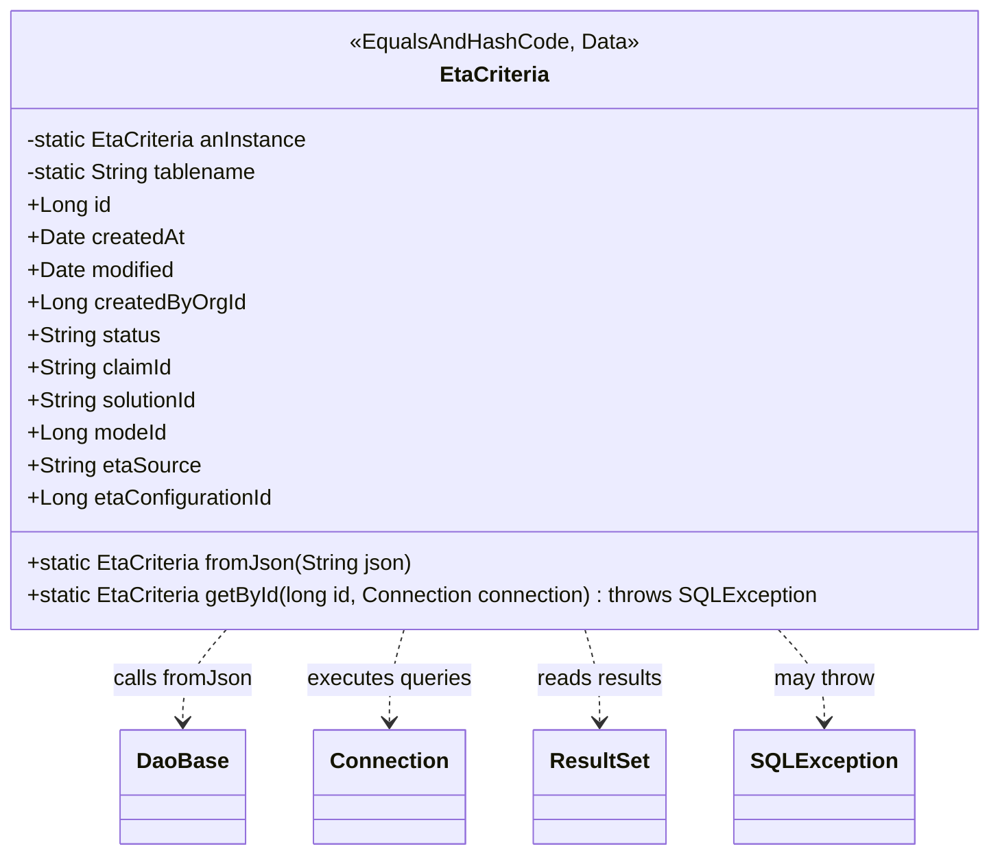

# Diagram: platform-java-lambdas/shipment/src/main/java/com/freightverify/shipment/datastore/postgresql/dao/EtaCriteria.java


> Auto-generated by Obscura crawlers

## Diagram 1



### SVG

<svg id="container" width="730.140625" xmlns="http://www.w3.org/2000/svg" class="classDiagram" height="630" viewBox="0 0 730.140625 630" role="graphics-document document" aria-roledescription="class"><style>#container{font-family:"trebuchet ms",verdana,arial,sans-serif;font-size:16px;fill:#333;}@keyframes edge-animation-frame{from{stroke-dashoffset:0;}}@keyframes dash{to{stroke-dashoffset:0;}}#container .edge-animation-slow{stroke-dasharray:9,5!important;stroke-dashoffset:900;animation:dash 50s linear infinite;stroke-linecap:round;}#container .edge-animation-fast{stroke-dasharray:9,5!important;stroke-dashoffset:900;animation:dash 20s linear infinite;stroke-linecap:round;}#container .error-icon{fill:#552222;}#container .error-text{fill:#552222;stroke:#552222;}#container .edge-thickness-normal{stroke-width:1px;}#container .edge-thickness-thick{stroke-width:3.5px;}#container .edge-pattern-solid{stroke-dasharray:0;}#container .edge-thickness-invisible{stroke-width:0;fill:none;}#container .edge-pattern-dashed{stroke-dasharray:3;}#container .edge-pattern-dotted{stroke-dasharray:2;}#container .marker{fill:#333333;stroke:#333333;}#container .marker.cross{stroke:#333333;}#container svg{font-family:"trebuchet ms",verdana,arial,sans-serif;font-size:16px;}#container p{margin:0;}#container g.classGroup text{fill:#9370DB;stroke:none;font-family:"trebuchet ms",verdana,arial,sans-serif;font-size:10px;}#container g.classGroup text .title{font-weight:bolder;}#container .nodeLabel,#container .edgeLabel{color:#131300;}#container .edgeLabel .label rect{fill:#ECECFF;}#container .label text{fill:#131300;}#container .labelBkg{background:#ECECFF;}#container .edgeLabel .label span{background:#ECECFF;}#container .classTitle{font-weight:bolder;}#container .node rect,#container .node circle,#container .node ellipse,#container .node polygon,#container .node path{fill:#ECECFF;stroke:#9370DB;stroke-width:1px;}#container .divider{stroke:#9370DB;stroke-width:1;}#container g.clickable{cursor:pointer;}#container g.classGroup rect{fill:#ECECFF;stroke:#9370DB;}#container g.classGroup line{stroke:#9370DB;stroke-width:1;}#container .classLabel .box{stroke:none;stroke-width:0;fill:#ECECFF;opacity:0.5;}#container .classLabel .label{fill:#9370DB;font-size:10px;}#container .relation{stroke:#333333;stroke-width:1;fill:none;}#container .dashed-line{stroke-dasharray:3;}#container .dotted-line{stroke-dasharray:1 2;}#container #compositionStart,#container .composition{fill:#333333!important;stroke:#333333!important;stroke-width:1;}#container #compositionEnd,#container .composition{fill:#333333!important;stroke:#333333!important;stroke-width:1;}#container #dependencyStart,#container .dependency{fill:#333333!important;stroke:#333333!important;stroke-width:1;}#container #dependencyStart,#container .dependency{fill:#333333!important;stroke:#333333!important;stroke-width:1;}#container #extensionStart,#container .extension{fill:transparent!important;stroke:#333333!important;stroke-width:1;}#container #extensionEnd,#container .extension{fill:transparent!important;stroke:#333333!important;stroke-width:1;}#container #aggregationStart,#container .aggregation{fill:transparent!important;stroke:#333333!important;stroke-width:1;}#container #aggregationEnd,#container .aggregation{fill:transparent!important;stroke:#333333!important;stroke-width:1;}#container #lollipopStart,#container .lollipop{fill:#ECECFF!important;stroke:#333333!important;stroke-width:1;}#container #lollipopEnd,#container .lollipop{fill:#ECECFF!important;stroke:#333333!important;stroke-width:1;}#container .edgeTerminals{font-size:11px;line-height:initial;}#container .classTitleText{text-anchor:middle;font-size:18px;fill:#333;}#container .label-icon{display:inline-block;height:1em;overflow:visible;vertical-align:-0.125em;}#container .node .label-icon path{fill:currentColor;stroke:revert;stroke-width:revert;}#container :root{--mermaid-font-family:"trebuchet ms",verdana,arial,sans-serif;}</style><g><defs><marker id="container_class-aggregationStart" class="marker aggregation class" refX="18" refY="7" markerWidth="190" markerHeight="240" orient="auto"><path d="M 18,7 L9,13 L1,7 L9,1 Z"></path></marker></defs><defs><marker id="container_class-aggregationEnd" class="marker aggregation class" refX="1" refY="7" markerWidth="20" markerHeight="28" orient="auto"><path d="M 18,7 L9,13 L1,7 L9,1 Z"></path></marker></defs><defs><marker id="container_class-extensionStart" class="marker extension class" refX="18" refY="7" markerWidth="190" markerHeight="240" orient="auto"><path d="M 1,7 L18,13 V 1 Z"></path></marker></defs><defs><marker id="container_class-extensionEnd" class="marker extension class" refX="1" refY="7" markerWidth="20" markerHeight="28" orient="auto"><path d="M 1,1 V 13 L18,7 Z"></path></marker></defs><defs><marker id="container_class-compositionStart" class="marker composition class" refX="18" refY="7" markerWidth="190" markerHeight="240" orient="auto"><path d="M 18,7 L9,13 L1,7 L9,1 Z"></path></marker></defs><defs><marker id="container_class-compositionEnd" class="marker composition class" refX="1" refY="7" markerWidth="20" markerHeight="28" orient="auto"><path d="M 18,7 L9,13 L1,7 L9,1 Z"></path></marker></defs><defs><marker id="container_class-dependencyStart" class="marker dependency class" refX="6" refY="7" markerWidth="190" markerHeight="240" orient="auto"><path d="M 5,7 L9,13 L1,7 L9,1 Z"></path></marker></defs><defs><marker id="container_class-dependencyEnd" class="marker dependency class" refX="13" refY="7" markerWidth="20" markerHeight="28" orient="auto"><path d="M 18,7 L9,13 L14,7 L9,1 Z"></path></marker></defs><defs><marker id="container_class-lollipopStart" class="marker lollipop class" refX="13" refY="7" markerWidth="190" markerHeight="240" orient="auto"><circle stroke="black" fill="transparent" cx="7" cy="7" r="6"></circle></marker></defs><defs><marker id="container_class-lollipopEnd" class="marker lollipop class" refX="1" refY="7" markerWidth="190" markerHeight="240" orient="auto"><circle stroke="black" fill="transparent" cx="7" cy="7" r="6"></circle></marker></defs><g class="root"><g class="clusters"></g><g class="edgePaths"><path d="M173.929,464L168.759,470.167C163.589,476.333,153.25,488.667,148.08,500C142.91,511.333,142.91,521.667,142.91,526.833L142.91,532" id="id_EtaCriteria_DaoBase_1" class="edge-thickness-normal edge-pattern-dashed relation" style=";;;" data-edge="true" data-et="edge" data-id="id_EtaCriteria_DaoBase_1" data-points="W3sieCI6MTczLjkyODc0NDEwMzc3MzYsInkiOjQ2NH0seyJ4IjoxNDIuOTEwMTU2MjUsInkiOjUwMX0seyJ4IjoxNDIuOTEwMTU2MjUsInkiOjUzOH1d" marker-end="url(#container_class-dependencyEnd)"></path><path d="M300.35,464L298.6,470.167C296.85,476.333,293.349,488.667,291.598,500C289.848,511.333,289.848,521.667,289.848,526.833L289.848,532" id="id_EtaCriteria_Connection_2" class="edge-thickness-normal edge-pattern-dashed relation" style=";;;" data-edge="true" data-et="edge" data-id="id_EtaCriteria_Connection_2" data-points="W3sieCI6MzAwLjM1MDQ0MjIxNjk4MTE1LCJ5Ijo0NjR9LHsieCI6Mjg5Ljg0NzY1NjI1LCJ5Ijo1MDF9LHsieCI6Mjg5Ljg0NzY1NjI1LCJ5Ijo1Mzh9XQ==" marker-end="url(#container_class-dependencyEnd)"></path><path d="M429.79,464L431.541,470.167C433.291,476.333,436.792,488.667,438.543,500C440.293,511.333,440.293,521.667,440.293,526.833L440.293,532" id="id_EtaCriteria_ResultSet_3" class="edge-thickness-normal edge-pattern-dashed relation" style=";;;" data-edge="true" data-et="edge" data-id="id_EtaCriteria_ResultSet_3" data-points="W3sieCI6NDI5Ljc5MDE4Mjc4MzAxODg1LCJ5Ijo0NjR9LHsieCI6NDQwLjI5Mjk2ODc1LCJ5Ijo1MDF9LHsieCI6NDQwLjI5Mjk2ODc1LCJ5Ijo1Mzh9XQ==" marker-end="url(#container_class-dependencyEnd)"></path><path d="M566.691,464L572.144,470.167C577.597,476.333,588.504,488.667,593.957,500C599.41,511.333,599.41,521.667,599.41,526.833L599.41,532" id="id_EtaCriteria_SQLException_4" class="edge-thickness-normal edge-pattern-dashed relation" style=";;;" data-edge="true" data-et="edge" data-id="id_EtaCriteria_SQLException_4" data-points="W3sieCI6NTY2LjY5MTAwODI1NDcxNywieSI6NDY0fSx7IngiOjU5OS40MTAxNTYyNSwieSI6NTAxfSx7IngiOjU5OS40MTAxNTYyNSwieSI6NTM4fV0=" marker-end="url(#container_class-dependencyEnd)"></path></g><g class="edgeLabels"><g class="edgeLabel" transform="translate(142.91015625, 501)"><g class="label" data-id="id_EtaCriteria_DaoBase_1" transform="translate(-51.15625, -12)"><foreignObject width="102.3125" height="24"><div xmlns="http://www.w3.org/1999/xhtml" class="labelBkg" style="display: table-cell; white-space: nowrap; line-height: 1.5; max-width: 200px; text-align: center;"><span class="edgeLabel"><p>calls fromJson</p></span></div></foreignObject></g></g><g class="edgeLabel" transform="translate(289.84765625, 501)"><g class="label" data-id="id_EtaCriteria_Connection_2" transform="translate(-61.0859375, -12)"><foreignObject width="122.171875" height="24"><div xmlns="http://www.w3.org/1999/xhtml" class="labelBkg" style="display: table-cell; white-space: nowrap; line-height: 1.5; max-width: 200px; text-align: center;"><span class="edgeLabel"><p>executes queries</p></span></div></foreignObject></g></g><g class="edgeLabel" transform="translate(440.29296875, 501)"><g class="label" data-id="id_EtaCriteria_ResultSet_3" transform="translate(-46.6953125, -12)"><foreignObject width="93.390625" height="24"><div xmlns="http://www.w3.org/1999/xhtml" class="labelBkg" style="display: table-cell; white-space: nowrap; line-height: 1.5; max-width: 200px; text-align: center;"><span class="edgeLabel"><p>reads results</p></span></div></foreignObject></g></g><g class="edgeLabel" transform="translate(599.41015625, 501)"><g class="label" data-id="id_EtaCriteria_SQLException_4" transform="translate(-37.9765625, -12)"><foreignObject width="75.953125" height="24"><div xmlns="http://www.w3.org/1999/xhtml" class="labelBkg" style="display: table-cell; white-space: nowrap; line-height: 1.5; max-width: 200px; text-align: center;"><span class="edgeLabel"><p>may throw</p></span></div></foreignObject></g></g></g><g class="nodes"><g class="node default" id="classId-EtaCriteria-0" transform="translate(365.0703125, 236)"><g class="basic label-container"><path d="M-357.0703125 -228 L357.0703125 -228 L357.0703125 228 L-357.0703125 228" stroke="none" stroke-width="0" fill="#ECECFF" style=""></path><path d="M-357.0703125 -228 C-153.27709040851204 -228, 50.516131682975924 -228, 357.0703125 -228 M-357.0703125 -228 C-130.90756424619988 -228, 95.25518400760023 -228, 357.0703125 -228 M357.0703125 -228 C357.0703125 -50.015584768689365, 357.0703125 127.96883046262127, 357.0703125 228 M357.0703125 -228 C357.0703125 -88.991699465849, 357.0703125 50.01660106830201, 357.0703125 228 M357.0703125 228 C100.48137515885219 228, -156.10756218229562 228, -357.0703125 228 M357.0703125 228 C87.8522556552324 228, -181.3658011895352 228, -357.0703125 228 M-357.0703125 228 C-357.0703125 78.76333773698843, -357.0703125 -70.47332452602313, -357.0703125 -228 M-357.0703125 228 C-357.0703125 76.43132229162626, -357.0703125 -75.13735541674748, -357.0703125 -228" stroke="#9370DB" stroke-width="1.3" fill="none" stroke-dasharray="0 0" style=""></path></g><g class="annotation-group text" transform="translate(-103.9375, -204)"><g class="label" style="" transform="translate(0,-12)"><foreignObject width="207.875" height="24"><div xmlns="http://www.w3.org/1999/xhtml" style="display: table-cell; white-space: nowrap; line-height: 1.5; max-width: 258px; text-align: center;"><span class="nodeLabel markdown-node-label" style=""><p>«EqualsAndHashCode, Data»</p></span></div></foreignObject></g></g><g class="label-group text" transform="translate(-38.6171875, -180)"><g class="label" style="font-weight: bolder" transform="translate(0,-12)"><foreignObject width="77.234375" height="24"><div xmlns="http://www.w3.org/1999/xhtml" style="display: table-cell; white-space: nowrap; line-height: 1.5; max-width: 126px; text-align: center;"><span class="nodeLabel markdown-node-label" style=""><p>EtaCriteria</p></span></div></foreignObject></g></g><g class="members-group text" transform="translate(-345.0703125, -132)"><g class="label" style="" transform="translate(0,-12)"><foreignObject width="209.90625" height="24"><div xmlns="http://www.w3.org/1999/xhtml" style="display: table-cell; white-space: nowrap; line-height: 1.5; max-width: 267px; text-align: center;"><span class="nodeLabel markdown-node-label" style=""><p>-static EtaCriteria anInstance</p></span></div></foreignObject></g><g class="label" style="" transform="translate(0,12)"><foreignObject width="175.296875" height="24"><div xmlns="http://www.w3.org/1999/xhtml" style="display: table-cell; white-space: nowrap; line-height: 1.5; max-width: 233px; text-align: center;"><span class="nodeLabel markdown-node-label" style=""><p>-static String tablename</p></span></div></foreignObject></g><g class="label" style="" transform="translate(0,36)"><foreignObject width="60.921875" height="24"><div xmlns="http://www.w3.org/1999/xhtml" style="display: table-cell; white-space: nowrap; line-height: 1.5; max-width: 118px; text-align: center;"><span class="nodeLabel markdown-node-label" style=""><p>+Long id</p></span></div></foreignObject></g><g class="label" style="" transform="translate(0,60)"><foreignObject width="114.71875" height="24"><div xmlns="http://www.w3.org/1999/xhtml" style="display: table-cell; white-space: nowrap; line-height: 1.5; max-width: 172px; text-align: center;"><span class="nodeLabel markdown-node-label" style=""><p>+Date createdAt</p></span></div></foreignObject></g><g class="label" style="" transform="translate(0,84)"><foreignObject width="109.953125" height="24"><div xmlns="http://www.w3.org/1999/xhtml" style="display: table-cell; white-space: nowrap; line-height: 1.5; max-width: 167px; text-align: center;"><span class="nodeLabel markdown-node-label" style=""><p>+Date modified</p></span></div></foreignObject></g><g class="label" style="" transform="translate(0,108)"><foreignObject width="158.484375" height="24"><div xmlns="http://www.w3.org/1999/xhtml" style="display: table-cell; white-space: nowrap; line-height: 1.5; max-width: 216px; text-align: center;"><span class="nodeLabel markdown-node-label" style=""><p>+Long createdByOrgId</p></span></div></foreignObject></g><g class="label" style="" transform="translate(0,132)"><foreignObject width="98.875" height="24"><div xmlns="http://www.w3.org/1999/xhtml" style="display: table-cell; white-space: nowrap; line-height: 1.5; max-width: 156px; text-align: center;"><span class="nodeLabel markdown-node-label" style=""><p>+String status</p></span></div></foreignObject></g><g class="label" style="" transform="translate(0,156)"><foreignObject width="107.9375" height="24"><div xmlns="http://www.w3.org/1999/xhtml" style="display: table-cell; white-space: nowrap; line-height: 1.5; max-width: 165px; text-align: center;"><span class="nodeLabel markdown-node-label" style=""><p>+String claimId</p></span></div></foreignObject></g><g class="label" style="" transform="translate(0,180)"><foreignObject width="128.578125" height="24"><div xmlns="http://www.w3.org/1999/xhtml" style="display: table-cell; white-space: nowrap; line-height: 1.5; max-width: 186px; text-align: center;"><span class="nodeLabel markdown-node-label" style=""><p>+String solutionId</p></span></div></foreignObject></g><g class="label" style="" transform="translate(0,204)"><foreignObject width="102.46875" height="24"><div xmlns="http://www.w3.org/1999/xhtml" style="display: table-cell; white-space: nowrap; line-height: 1.5; max-width: 160px; text-align: center;"><span class="nodeLabel markdown-node-label" style=""><p>+Long modeId</p></span></div></foreignObject></g><g class="label" style="" transform="translate(0,228)"><foreignObject width="126.6875" height="24"><div xmlns="http://www.w3.org/1999/xhtml" style="display: table-cell; white-space: nowrap; line-height: 1.5; max-width: 184px; text-align: center;"><span class="nodeLabel markdown-node-label" style=""><p>+String etaSource</p></span></div></foreignObject></g><g class="label" style="" transform="translate(0,252)"><foreignObject width="181.578125" height="24"><div xmlns="http://www.w3.org/1999/xhtml" style="display: table-cell; white-space: nowrap; line-height: 1.5; max-width: 239px; text-align: center;"><span class="nodeLabel markdown-node-label" style=""><p>+Long etaConfigurationId</p></span></div></foreignObject></g></g><g class="methods-group text" transform="translate(-345.0703125, 180)"><g class="label" style="" transform="translate(0,-12)"><foreignObject width="285.359375" height="24"><div xmlns="http://www.w3.org/1999/xhtml" style="display: table-cell; white-space: nowrap; line-height: 1.5; max-width: 343px; text-align: center;"><span class="nodeLabel markdown-node-label" style=""><p>+static EtaCriteria fromJson(String json)</p></span></div></foreignObject></g><g class="label" style="" transform="translate(0,12)"><foreignObject width="586.203125" height="24"><div xmlns="http://www.w3.org/1999/xhtml" style="display: table-cell; white-space: nowrap; line-height: 1.5; max-width: 644px; text-align: center;"><span class="nodeLabel markdown-node-label" style=""><p>+static EtaCriteria getById(long id, Connection connection) : throws SQLException</p></span></div></foreignObject></g></g><g class="divider" style=""><path d="M-357.0703125 -156 C-110.28774533974735 -156, 136.4948218205053 -156, 357.0703125 -156 M-357.0703125 -156 C-100.06976220364629 -156, 156.93078809270742 -156, 357.0703125 -156" stroke="#9370DB" stroke-width="1.3" fill="none" stroke-dasharray="0 0" style=""></path></g><g class="divider" style=""><path d="M-357.0703125 156 C-208.25756730600196 156, -59.44482211200392 156, 357.0703125 156 M-357.0703125 156 C-89.68565282779343 156, 177.69900684441313 156, 357.0703125 156" stroke="#9370DB" stroke-width="1.3" fill="none" stroke-dasharray="0 0" style=""></path></g></g><g class="node default" id="classId-DaoBase-1" transform="translate(142.91015625, 580)"><g class="basic label-container"><path d="M-43.7109375 -42 L43.7109375 -42 L43.7109375 42 L-43.7109375 42" stroke="none" stroke-width="0" fill="#ECECFF" style=""></path><path d="M-43.7109375 -42 C-15.471226163650972 -42, 12.768485172698057 -42, 43.7109375 -42 M-43.7109375 -42 C-22.5840860522681 -42, -1.4572346045361968 -42, 43.7109375 -42 M43.7109375 -42 C43.7109375 -16.19115928188545, 43.7109375 9.617681436229098, 43.7109375 42 M43.7109375 -42 C43.7109375 -8.984174927312381, 43.7109375 24.031650145375238, 43.7109375 42 M43.7109375 42 C12.286167628389961 42, -19.138602243220078 42, -43.7109375 42 M43.7109375 42 C20.128268635760723 42, -3.454400228478555 42, -43.7109375 42 M-43.7109375 42 C-43.7109375 22.146679474590766, -43.7109375 2.293358949181531, -43.7109375 -42 M-43.7109375 42 C-43.7109375 13.000432167132406, -43.7109375 -15.999135665735189, -43.7109375 -42" stroke="#9370DB" stroke-width="1.3" fill="none" stroke-dasharray="0 0" style=""></path></g><g class="annotation-group text" transform="translate(0, -18)"></g><g class="label-group text" transform="translate(-31.7109375, -18)"><g class="label" style="font-weight: bolder" transform="translate(0,-12)"><foreignObject width="63.421875" height="24"><div xmlns="http://www.w3.org/1999/xhtml" style="display: table-cell; white-space: nowrap; line-height: 1.5; max-width: 113px; text-align: center;"><span class="nodeLabel markdown-node-label" style=""><p>DaoBase</p></span></div></foreignObject></g></g><g class="members-group text" transform="translate(-31.7109375, 30)"></g><g class="methods-group text" transform="translate(-31.7109375, 60)"></g><g class="divider" style=""><path d="M-43.7109375 6 C-20.50454399654027 6, 2.7018495069194586 6, 43.7109375 6 M-43.7109375 6 C-17.449766189308722 6, 8.811405121382556 6, 43.7109375 6" stroke="#9370DB" stroke-width="1.3" fill="none" stroke-dasharray="0 0" style=""></path></g><g class="divider" style=""><path d="M-43.7109375 24 C-18.128522278993216 24, 7.453892942013567 24, 43.7109375 24 M-43.7109375 24 C-9.627076163814522 24, 24.456785172370957 24, 43.7109375 24" stroke="#9370DB" stroke-width="1.3" fill="none" stroke-dasharray="0 0" style=""></path></g></g><g class="node default" id="classId-Connection-2" transform="translate(289.84765625, 580)"><g class="basic label-container"><path d="M-53.2265625 -42 L53.2265625 -42 L53.2265625 42 L-53.2265625 42" stroke="none" stroke-width="0" fill="#ECECFF" style=""></path><path d="M-53.2265625 -42 C-30.970191834250635 -42, -8.71382116850127 -42, 53.2265625 -42 M-53.2265625 -42 C-23.2187335892559 -42, 6.7890953214881975 -42, 53.2265625 -42 M53.2265625 -42 C53.2265625 -20.320266627625035, 53.2265625 1.3594667447499305, 53.2265625 42 M53.2265625 -42 C53.2265625 -21.23860934527771, 53.2265625 -0.4772186905554179, 53.2265625 42 M53.2265625 42 C11.34705169525217 42, -30.53245910949566 42, -53.2265625 42 M53.2265625 42 C10.827969064712242 42, -31.570624370575516 42, -53.2265625 42 M-53.2265625 42 C-53.2265625 20.881626637158472, -53.2265625 -0.2367467256830551, -53.2265625 -42 M-53.2265625 42 C-53.2265625 21.557402501869564, -53.2265625 1.1148050037391286, -53.2265625 -42" stroke="#9370DB" stroke-width="1.3" fill="none" stroke-dasharray="0 0" style=""></path></g><g class="annotation-group text" transform="translate(0, -18)"></g><g class="label-group text" transform="translate(-41.2265625, -18)"><g class="label" style="font-weight: bolder" transform="translate(0,-12)"><foreignObject width="82.453125" height="24"><div xmlns="http://www.w3.org/1999/xhtml" style="display: table-cell; white-space: nowrap; line-height: 1.5; max-width: 132px; text-align: center;"><span class="nodeLabel markdown-node-label" style=""><p>Connection</p></span></div></foreignObject></g></g><g class="members-group text" transform="translate(-41.2265625, 30)"></g><g class="methods-group text" transform="translate(-41.2265625, 60)"></g><g class="divider" style=""><path d="M-53.2265625 6 C-28.289799272373052 6, -3.353036044746105 6, 53.2265625 6 M-53.2265625 6 C-24.171456301791075 6, 4.88364989641785 6, 53.2265625 6" stroke="#9370DB" stroke-width="1.3" fill="none" stroke-dasharray="0 0" style=""></path></g><g class="divider" style=""><path d="M-53.2265625 24 C-24.477864117072123 24, 4.270834265855754 24, 53.2265625 24 M-53.2265625 24 C-13.055497751545417 24, 27.115566996909166 24, 53.2265625 24" stroke="#9370DB" stroke-width="1.3" fill="none" stroke-dasharray="0 0" style=""></path></g></g><g class="node default" id="classId-ResultSet-3" transform="translate(440.29296875, 580)"><g class="basic label-container"><path d="M-47.21875 -42 L47.21875 -42 L47.21875 42 L-47.21875 42" stroke="none" stroke-width="0" fill="#ECECFF" style=""></path><path d="M-47.21875 -42 C-13.575205585954627 -42, 20.068338828090745 -42, 47.21875 -42 M-47.21875 -42 C-26.13267869858806 -42, -5.046607397176118 -42, 47.21875 -42 M47.21875 -42 C47.21875 -14.192286275998121, 47.21875 13.615427448003757, 47.21875 42 M47.21875 -42 C47.21875 -24.96268549517191, 47.21875 -7.925370990343822, 47.21875 42 M47.21875 42 C9.756557142204471 42, -27.705635715591058 42, -47.21875 42 M47.21875 42 C20.094788782914975 42, -7.02917243417005 42, -47.21875 42 M-47.21875 42 C-47.21875 15.052052194219687, -47.21875 -11.895895611560626, -47.21875 -42 M-47.21875 42 C-47.21875 11.423871163082843, -47.21875 -19.152257673834313, -47.21875 -42" stroke="#9370DB" stroke-width="1.3" fill="none" stroke-dasharray="0 0" style=""></path></g><g class="annotation-group text" transform="translate(0, -18)"></g><g class="label-group text" transform="translate(-35.21875, -18)"><g class="label" style="font-weight: bolder" transform="translate(0,-12)"><foreignObject width="70.4375" height="24"><div xmlns="http://www.w3.org/1999/xhtml" style="display: table-cell; white-space: nowrap; line-height: 1.5; max-width: 119px; text-align: center;"><span class="nodeLabel markdown-node-label" style=""><p>ResultSet</p></span></div></foreignObject></g></g><g class="members-group text" transform="translate(-35.21875, 30)"></g><g class="methods-group text" transform="translate(-35.21875, 60)"></g><g class="divider" style=""><path d="M-47.21875 6 C-27.304058585047375 6, -7.389367170094751 6, 47.21875 6 M-47.21875 6 C-19.59624351206896 6, 8.026262975862082 6, 47.21875 6" stroke="#9370DB" stroke-width="1.3" fill="none" stroke-dasharray="0 0" style=""></path></g><g class="divider" style=""><path d="M-47.21875 24 C-25.078872967261653 24, -2.938995934523305 24, 47.21875 24 M-47.21875 24 C-28.29391271213141 24, -9.369075424262817 24, 47.21875 24" stroke="#9370DB" stroke-width="1.3" fill="none" stroke-dasharray="0 0" style=""></path></g></g><g class="node default" id="classId-SQLException-4" transform="translate(599.41015625, 580)"><g class="basic label-container"><path d="M-61.8984375 -42 L61.8984375 -42 L61.8984375 42 L-61.8984375 42" stroke="none" stroke-width="0" fill="#ECECFF" style=""></path><path d="M-61.8984375 -42 C-26.266363929618343 -42, 9.365709640763313 -42, 61.8984375 -42 M-61.8984375 -42 C-35.10216832954863 -42, -8.305899159097258 -42, 61.8984375 -42 M61.8984375 -42 C61.8984375 -15.716471344763544, 61.8984375 10.567057310472912, 61.8984375 42 M61.8984375 -42 C61.8984375 -25.07494193222105, 61.8984375 -8.149883864442103, 61.8984375 42 M61.8984375 42 C18.78749154886379 42, -24.323454402272418 42, -61.8984375 42 M61.8984375 42 C30.679067729558664 42, -0.540302040882672 42, -61.8984375 42 M-61.8984375 42 C-61.8984375 16.402867817216045, -61.8984375 -9.19426436556791, -61.8984375 -42 M-61.8984375 42 C-61.8984375 8.617701033329709, -61.8984375 -24.764597933340582, -61.8984375 -42" stroke="#9370DB" stroke-width="1.3" fill="none" stroke-dasharray="0 0" style=""></path></g><g class="annotation-group text" transform="translate(0, -18)"></g><g class="label-group text" transform="translate(-49.8984375, -18)"><g class="label" style="font-weight: bolder" transform="translate(0,-12)"><foreignObject width="99.796875" height="24"><div xmlns="http://www.w3.org/1999/xhtml" style="display: table-cell; white-space: nowrap; line-height: 1.5; max-width: 148px; text-align: center;"><span class="nodeLabel markdown-node-label" style=""><p>SQLException</p></span></div></foreignObject></g></g><g class="members-group text" transform="translate(-49.8984375, 30)"></g><g class="methods-group text" transform="translate(-49.8984375, 60)"></g><g class="divider" style=""><path d="M-61.8984375 6 C-21.753716728843727 6, 18.391004042312545 6, 61.8984375 6 M-61.8984375 6 C-29.394538856260198 6, 3.1093597874796046 6, 61.8984375 6" stroke="#9370DB" stroke-width="1.3" fill="none" stroke-dasharray="0 0" style=""></path></g><g class="divider" style=""><path d="M-61.8984375 24 C-27.372380157245438 24, 7.153677185509125 24, 61.8984375 24 M-61.8984375 24 C-33.36252958023658 24, -4.826621660473172 24, 61.8984375 24" stroke="#9370DB" stroke-width="1.3" fill="none" stroke-dasharray="0 0" style=""></path></g></g></g></g></g></svg>

## Diagram 2

```mermaid
flowchart TD
    A[getById(id)] --> B[Execute SQL query: select row_to_json(row) from public.eta_criteria where id = (id)]
    B --> C{results.next()}
    C -- Yes --> D[json = results.getString(1)]
    D --> E[EtaCriteria.fromJson(json)]
    E --> F[return EtaCriteria]
    C -- No --> G[return null]
```

> SVG rendering failed for this diagram.
