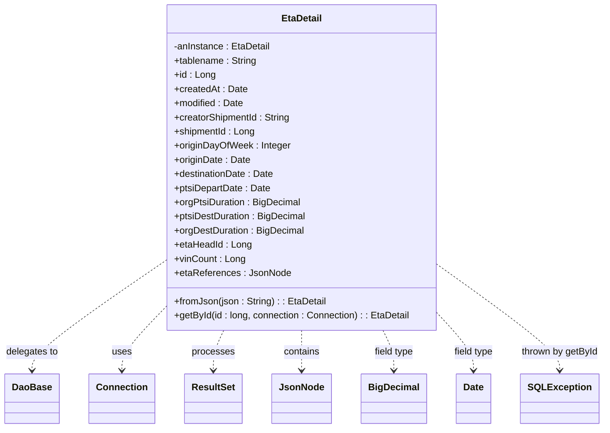

# Diagram: platform-java-lambdas/shipment/src/main/java/com/freightverify/shipment/datastore/postgresql/dao/EtaDetail.java


> Auto-generated by Obscura crawlers

## Diagram 1



### SVG

<svg id="container" width="989.765625" xmlns="http://www.w3.org/2000/svg" class="classDiagram" height="726" viewBox="0 0 989.765625 726" role="graphics-document document" aria-roledescription="class"><style>#container{font-family:"trebuchet ms",verdana,arial,sans-serif;font-size:16px;fill:#333;}@keyframes edge-animation-frame{from{stroke-dashoffset:0;}}@keyframes dash{to{stroke-dashoffset:0;}}#container .edge-animation-slow{stroke-dasharray:9,5!important;stroke-dashoffset:900;animation:dash 50s linear infinite;stroke-linecap:round;}#container .edge-animation-fast{stroke-dasharray:9,5!important;stroke-dashoffset:900;animation:dash 20s linear infinite;stroke-linecap:round;}#container .error-icon{fill:#552222;}#container .error-text{fill:#552222;stroke:#552222;}#container .edge-thickness-normal{stroke-width:1px;}#container .edge-thickness-thick{stroke-width:3.5px;}#container .edge-pattern-solid{stroke-dasharray:0;}#container .edge-thickness-invisible{stroke-width:0;fill:none;}#container .edge-pattern-dashed{stroke-dasharray:3;}#container .edge-pattern-dotted{stroke-dasharray:2;}#container .marker{fill:#333333;stroke:#333333;}#container .marker.cross{stroke:#333333;}#container svg{font-family:"trebuchet ms",verdana,arial,sans-serif;font-size:16px;}#container p{margin:0;}#container g.classGroup text{fill:#9370DB;stroke:none;font-family:"trebuchet ms",verdana,arial,sans-serif;font-size:10px;}#container g.classGroup text .title{font-weight:bolder;}#container .nodeLabel,#container .edgeLabel{color:#131300;}#container .edgeLabel .label rect{fill:#ECECFF;}#container .label text{fill:#131300;}#container .labelBkg{background:#ECECFF;}#container .edgeLabel .label span{background:#ECECFF;}#container .classTitle{font-weight:bolder;}#container .node rect,#container .node circle,#container .node ellipse,#container .node polygon,#container .node path{fill:#ECECFF;stroke:#9370DB;stroke-width:1px;}#container .divider{stroke:#9370DB;stroke-width:1;}#container g.clickable{cursor:pointer;}#container g.classGroup rect{fill:#ECECFF;stroke:#9370DB;}#container g.classGroup line{stroke:#9370DB;stroke-width:1;}#container .classLabel .box{stroke:none;stroke-width:0;fill:#ECECFF;opacity:0.5;}#container .classLabel .label{fill:#9370DB;font-size:10px;}#container .relation{stroke:#333333;stroke-width:1;fill:none;}#container .dashed-line{stroke-dasharray:3;}#container .dotted-line{stroke-dasharray:1 2;}#container #compositionStart,#container .composition{fill:#333333!important;stroke:#333333!important;stroke-width:1;}#container #compositionEnd,#container .composition{fill:#333333!important;stroke:#333333!important;stroke-width:1;}#container #dependencyStart,#container .dependency{fill:#333333!important;stroke:#333333!important;stroke-width:1;}#container #dependencyStart,#container .dependency{fill:#333333!important;stroke:#333333!important;stroke-width:1;}#container #extensionStart,#container .extension{fill:transparent!important;stroke:#333333!important;stroke-width:1;}#container #extensionEnd,#container .extension{fill:transparent!important;stroke:#333333!important;stroke-width:1;}#container #aggregationStart,#container .aggregation{fill:transparent!important;stroke:#333333!important;stroke-width:1;}#container #aggregationEnd,#container .aggregation{fill:transparent!important;stroke:#333333!important;stroke-width:1;}#container #lollipopStart,#container .lollipop{fill:#ECECFF!important;stroke:#333333!important;stroke-width:1;}#container #lollipopEnd,#container .lollipop{fill:#ECECFF!important;stroke:#333333!important;stroke-width:1;}#container .edgeTerminals{font-size:11px;line-height:initial;}#container .classTitleText{text-anchor:middle;font-size:18px;fill:#333;}#container .label-icon{display:inline-block;height:1em;overflow:visible;vertical-align:-0.125em;}#container .node .label-icon path{fill:currentColor;stroke:revert;stroke-width:revert;}#container :root{--mermaid-font-family:"trebuchet ms",verdana,arial,sans-serif;}</style><g><defs><marker id="container_class-aggregationStart" class="marker aggregation class" refX="18" refY="7" markerWidth="190" markerHeight="240" orient="auto"><path d="M 18,7 L9,13 L1,7 L9,1 Z"></path></marker></defs><defs><marker id="container_class-aggregationEnd" class="marker aggregation class" refX="1" refY="7" markerWidth="20" markerHeight="28" orient="auto"><path d="M 18,7 L9,13 L1,7 L9,1 Z"></path></marker></defs><defs><marker id="container_class-extensionStart" class="marker extension class" refX="18" refY="7" markerWidth="190" markerHeight="240" orient="auto"><path d="M 1,7 L18,13 V 1 Z"></path></marker></defs><defs><marker id="container_class-extensionEnd" class="marker extension class" refX="1" refY="7" markerWidth="20" markerHeight="28" orient="auto"><path d="M 1,1 V 13 L18,7 Z"></path></marker></defs><defs><marker id="container_class-compositionStart" class="marker composition class" refX="18" refY="7" markerWidth="190" markerHeight="240" orient="auto"><path d="M 18,7 L9,13 L1,7 L9,1 Z"></path></marker></defs><defs><marker id="container_class-compositionEnd" class="marker composition class" refX="1" refY="7" markerWidth="20" markerHeight="28" orient="auto"><path d="M 18,7 L9,13 L1,7 L9,1 Z"></path></marker></defs><defs><marker id="container_class-dependencyStart" class="marker dependency class" refX="6" refY="7" markerWidth="190" markerHeight="240" orient="auto"><path d="M 5,7 L9,13 L1,7 L9,1 Z"></path></marker></defs><defs><marker id="container_class-dependencyEnd" class="marker dependency class" refX="13" refY="7" markerWidth="20" markerHeight="28" orient="auto"><path d="M 18,7 L9,13 L14,7 L9,1 Z"></path></marker></defs><defs><marker id="container_class-lollipopStart" class="marker lollipop class" refX="13" refY="7" markerWidth="190" markerHeight="240" orient="auto"><circle stroke="black" fill="transparent" cx="7" cy="7" r="6"></circle></marker></defs><defs><marker id="container_class-lollipopEnd" class="marker lollipop class" refX="1" refY="7" markerWidth="190" markerHeight="240" orient="auto"><circle stroke="black" fill="transparent" cx="7" cy="7" r="6"></circle></marker></defs><g class="root"><g class="clusters"></g><g class="edgePaths"><path d="M265.609,445.978L230.107,471.148C194.604,496.319,123.599,546.659,88.096,576.996C52.594,607.333,52.594,617.667,52.594,622.833L52.594,628" id="id_EtaDetail_DaoBase_1" class="edge-thickness-normal edge-pattern-dashed relation" style=";;;" data-edge="true" data-et="edge" data-id="id_EtaDetail_DaoBase_1" data-points="W3sieCI6MjY1LjYwOTM3NSwieSI6NDQ1Ljk3NzkxNTQxMzIwMTIzfSx7IngiOjUyLjU5Mzc1LCJ5Ijo1OTd9LHsieCI6NTIuNTkzNzUsInkiOjYzNH1d" marker-end="url(#container_class-dependencyEnd)"></path><path d="M265.609,526.782L254.596,538.485C243.583,550.188,221.557,573.594,210.544,590.464C199.531,607.333,199.531,617.667,199.531,622.833L199.531,628" id="id_EtaDetail_Connection_2" class="edge-thickness-normal edge-pattern-dashed relation" style=";;;" data-edge="true" data-et="edge" data-id="id_EtaDetail_Connection_2" data-points="W3sieCI6MjY1LjYwOTM3NSwieSI6NTI2Ljc4MjEzMzU3MzgxNTd9LHsieCI6MTk5LjUzMTI1LCJ5Ijo1OTd9LHsieCI6MTk5LjUzMTI1LCJ5Ijo2MzR9XQ==" marker-end="url(#container_class-dependencyEnd)"></path><path d="M367.011,560L364.172,566.167C361.333,572.333,355.655,584.667,352.816,596C349.977,607.333,349.977,617.667,349.977,622.833L349.977,628" id="id_EtaDetail_ResultSet_3" class="edge-thickness-normal edge-pattern-dashed relation" style=";;;" data-edge="true" data-et="edge" data-id="id_EtaDetail_ResultSet_3" data-points="W3sieCI6MzY3LjAxMDkzMjUwNzk4NzIsInkiOjU2MH0seyJ4IjozNDkuOTc2NTYyNSwieSI6NTk3fSx7IngiOjM0OS45NzY1NjI1LCJ5Ijo2MzR9XQ==" marker-end="url(#container_class-dependencyEnd)"></path><path d="M494.078,560L494.078,566.167C494.078,572.333,494.078,584.667,494.078,596C494.078,607.333,494.078,617.667,494.078,622.833L494.078,628" id="id_EtaDetail_JsonNode_4" class="edge-thickness-normal edge-pattern-dashed relation" style=";;;" data-edge="true" data-et="edge" data-id="id_EtaDetail_JsonNode_4" data-points="W3sieCI6NDk0LjA3ODEyNSwieSI6NTYwfSx7IngiOjQ5NC4wNzgxMjUsInkiOjU5N30seyJ4Ijo0OTQuMDc4MTI1LCJ5Ijo2MzR9XQ==" marker-end="url(#container_class-dependencyEnd)"></path><path d="M626.03,560L628.978,566.167C631.926,572.333,637.822,584.667,640.771,596C643.719,607.333,643.719,617.667,643.719,622.833L643.719,628" id="id_EtaDetail_BigDecimal_5" class="edge-thickness-normal edge-pattern-dashed relation" style=";;;" data-edge="true" data-et="edge" data-id="id_EtaDetail_BigDecimal_5" data-points="W3sieCI6NjI2LjAyOTYwMjYzNTc4MjgsInkiOjU2MH0seyJ4Ijo2NDMuNzE4NzUsInkiOjU5N30seyJ4Ijo2NDMuNzE4NzUsInkiOjYzNH1d" marker-end="url(#container_class-dependencyEnd)"></path><path d="M722.547,538.239L731.348,548.033C740.148,557.826,757.75,577.413,766.551,592.373C775.352,607.333,775.352,617.667,775.352,622.833L775.352,628" id="id_EtaDetail_Date_6" class="edge-thickness-normal edge-pattern-dashed relation" style=";;;" data-edge="true" data-et="edge" data-id="id_EtaDetail_Date_6" data-points="W3sieCI6NzIyLjU0Njg3NSwieSI6NTM4LjIzOTE0NjczNzc3MTl9LHsieCI6Nzc1LjM1MTU2MjUsInkiOjU5N30seyJ4Ijo3NzUuMzUxNTYyNSwieSI6NjM0fV0=" marker-end="url(#container_class-dependencyEnd)"></path><path d="M722.547,453.438L754.81,477.365C787.073,501.292,851.599,549.146,883.862,578.24C916.125,607.333,916.125,617.667,916.125,622.833L916.125,628" id="id_EtaDetail_SQLException_7" class="edge-thickness-normal edge-pattern-dashed relation" style=";;;" data-edge="true" data-et="edge" data-id="id_EtaDetail_SQLException_7" data-points="W3sieCI6NzIyLjU0Njg3NSwieSI6NDUzLjQzNzg1ODY1MDE3OTZ9LHsieCI6OTE2LjEyNSwieSI6NTk3fSx7IngiOjkxNi4xMjUsInkiOjYzNH1d" marker-end="url(#container_class-dependencyEnd)"></path></g><g class="edgeLabels"><g class="edgeLabel" transform="translate(52.59375, 597)"><g class="label" data-id="id_EtaDetail_DaoBase_1" transform="translate(-44.59375, -12)"><foreignObject width="89.1875" height="24"><div xmlns="http://www.w3.org/1999/xhtml" class="labelBkg" style="display: table-cell; white-space: nowrap; line-height: 1.5; max-width: 200px; text-align: center;"><span class="edgeLabel"><p>delegates to</p></span></div></foreignObject></g></g><g class="edgeLabel" transform="translate(199.53125, 597)"><g class="label" data-id="id_EtaDetail_Connection_2" transform="translate(-16.4921875, -12)"><foreignObject width="32.984375" height="24"><div xmlns="http://www.w3.org/1999/xhtml" class="labelBkg" style="display: table-cell; white-space: nowrap; line-height: 1.5; max-width: 200px; text-align: center;"><span class="edgeLabel"><p>uses</p></span></div></foreignObject></g></g><g class="edgeLabel" transform="translate(349.9765625, 597)"><g class="label" data-id="id_EtaDetail_ResultSet_3" transform="translate(-35.7890625, -12)"><foreignObject width="71.578125" height="24"><div xmlns="http://www.w3.org/1999/xhtml" class="labelBkg" style="display: table-cell; white-space: nowrap; line-height: 1.5; max-width: 200px; text-align: center;"><span class="edgeLabel"><p>processes</p></span></div></foreignObject></g></g><g class="edgeLabel" transform="translate(494.078125, 597)"><g class="label" data-id="id_EtaDetail_JsonNode_4" transform="translate(-30.890625, -12)"><foreignObject width="61.78125" height="24"><div xmlns="http://www.w3.org/1999/xhtml" class="labelBkg" style="display: table-cell; white-space: nowrap; line-height: 1.5; max-width: 200px; text-align: center;"><span class="edgeLabel"><p>contains</p></span></div></foreignObject></g></g><g class="edgeLabel" transform="translate(643.71875, 597)"><g class="label" data-id="id_EtaDetail_BigDecimal_5" transform="translate(-34.0703125, -12)"><foreignObject width="68.140625" height="24"><div xmlns="http://www.w3.org/1999/xhtml" class="labelBkg" style="display: table-cell; white-space: nowrap; line-height: 1.5; max-width: 200px; text-align: center;"><span class="edgeLabel"><p>field type</p></span></div></foreignObject></g></g><g class="edgeLabel" transform="translate(775.3515625, 597)"><g class="label" data-id="id_EtaDetail_Date_6" transform="translate(-34.0703125, -12)"><foreignObject width="68.140625" height="24"><div xmlns="http://www.w3.org/1999/xhtml" class="labelBkg" style="display: table-cell; white-space: nowrap; line-height: 1.5; max-width: 200px; text-align: center;"><span class="edgeLabel"><p>field type</p></span></div></foreignObject></g></g><g class="edgeLabel" transform="translate(916.125, 597)"><g class="label" data-id="id_EtaDetail_SQLException_7" transform="translate(-65.640625, -12)"><foreignObject width="131.28125" height="24"><div xmlns="http://www.w3.org/1999/xhtml" class="labelBkg" style="display: table-cell; white-space: nowrap; line-height: 1.5; max-width: 200px; text-align: center;"><span class="edgeLabel"><p>thrown by getById</p></span></div></foreignObject></g></g></g><g class="nodes"><g class="node default" id="classId-EtaDetail-0" transform="translate(494.078125, 284)"><g class="basic label-container"><path d="M-228.46875 -276 L228.46875 -276 L228.46875 276 L-228.46875 276" stroke="none" stroke-width="0" fill="#ECECFF" style=""></path><path d="M-228.46875 -276 C-110.05162607727772 -276, 8.365497845444565 -276, 228.46875 -276 M-228.46875 -276 C-67.5882748134656 -276, 93.2922003730688 -276, 228.46875 -276 M228.46875 -276 C228.46875 -57.350097729399295, 228.46875 161.2998045412014, 228.46875 276 M228.46875 -276 C228.46875 -95.21844919212378, 228.46875 85.56310161575243, 228.46875 276 M228.46875 276 C63.121071438256195 276, -102.22660712348761 276, -228.46875 276 M228.46875 276 C130.66614305676913 276, 32.86353611353826 276, -228.46875 276 M-228.46875 276 C-228.46875 67.09574349476199, -228.46875 -141.80851301047602, -228.46875 -276 M-228.46875 276 C-228.46875 124.29877451834375, -228.46875 -27.402450963312504, -228.46875 -276" stroke="#9370DB" stroke-width="1.3" fill="none" stroke-dasharray="0 0" style=""></path></g><g class="annotation-group text" transform="translate(0, -252)"></g><g class="label-group text" transform="translate(-33.078125, -252)"><g class="label" style="font-weight: bolder" transform="translate(0,-12)"><foreignObject width="66.15625" height="24"><div xmlns="http://www.w3.org/1999/xhtml" style="display: table-cell; white-space: nowrap; line-height: 1.5; max-width: 116px; text-align: center;"><span class="nodeLabel markdown-node-label" style=""><p>EtaDetail</p></span></div></foreignObject></g></g><g class="members-group text" transform="translate(-216.46875, -204)"><g class="label" style="" transform="translate(0,-12)"><foreignObject width="163.265625" height="24"><div xmlns="http://www.w3.org/1999/xhtml" style="display: table-cell; white-space: nowrap; line-height: 1.5; max-width: 221px; text-align: center;"><span class="nodeLabel markdown-node-label" style=""><p>-anInstance : EtaDetail</p></span></div></foreignObject></g><g class="label" style="" transform="translate(0,12)"><foreignObject width="140.828125" height="24"><div xmlns="http://www.w3.org/1999/xhtml" style="display: table-cell; white-space: nowrap; line-height: 1.5; max-width: 199px; text-align: center;"><span class="nodeLabel markdown-node-label" style=""><p>+tablename : String</p></span></div></foreignObject></g><g class="label" style="" transform="translate(0,36)"><foreignObject width="69" height="24"><div xmlns="http://www.w3.org/1999/xhtml" style="display: table-cell; white-space: nowrap; line-height: 1.5; max-width: 127px; text-align: center;"><span class="nodeLabel markdown-node-label" style=""><p>+id : Long</p></span></div></foreignObject></g><g class="label" style="" transform="translate(0,60)"><foreignObject width="122.796875" height="24"><div xmlns="http://www.w3.org/1999/xhtml" style="display: table-cell; white-space: nowrap; line-height: 1.5; max-width: 180px; text-align: center;"><span class="nodeLabel markdown-node-label" style=""><p>+createdAt : Date</p></span></div></foreignObject></g><g class="label" style="" transform="translate(0,84)"><foreignObject width="118.046875" height="24"><div xmlns="http://www.w3.org/1999/xhtml" style="display: table-cell; white-space: nowrap; line-height: 1.5; max-width: 175px; text-align: center;"><span class="nodeLabel markdown-node-label" style=""><p>+modified : Date</p></span></div></foreignObject></g><g class="label" style="" transform="translate(0,108)"><foreignObject width="198.84375" height="24"><div xmlns="http://www.w3.org/1999/xhtml" style="display: table-cell; white-space: nowrap; line-height: 1.5; max-width: 257px; text-align: center;"><span class="nodeLabel markdown-node-label" style=""><p>+creatorShipmentId : String</p></span></div></foreignObject></g><g class="label" style="" transform="translate(0,132)"><foreignObject width="137.65625" height="24"><div xmlns="http://www.w3.org/1999/xhtml" style="display: table-cell; white-space: nowrap; line-height: 1.5; max-width: 196px; text-align: center;"><span class="nodeLabel markdown-node-label" style=""><p>+shipmentId : Long</p></span></div></foreignObject></g><g class="label" style="" transform="translate(0,156)"><foreignObject width="195.46875" height="24"><div xmlns="http://www.w3.org/1999/xhtml" style="display: table-cell; white-space: nowrap; line-height: 1.5; max-width: 254px; text-align: center;"><span class="nodeLabel markdown-node-label" style=""><p>+originDayOfWeek : Integer</p></span></div></foreignObject></g><g class="label" style="" transform="translate(0,180)"><foreignObject width="128.765625" height="24"><div xmlns="http://www.w3.org/1999/xhtml" style="display: table-cell; white-space: nowrap; line-height: 1.5; max-width: 186px; text-align: center;"><span class="nodeLabel markdown-node-label" style=""><p>+originDate : Date</p></span></div></foreignObject></g><g class="label" style="" transform="translate(0,204)"><foreignObject width="169.65625" height="24"><div xmlns="http://www.w3.org/1999/xhtml" style="display: table-cell; white-space: nowrap; line-height: 1.5; max-width: 227px; text-align: center;"><span class="nodeLabel markdown-node-label" style=""><p>+destinationDate : Date</p></span></div></foreignObject></g><g class="label" style="" transform="translate(0,228)"><foreignObject width="162.8125" height="24"><div xmlns="http://www.w3.org/1999/xhtml" style="display: table-cell; white-space: nowrap; line-height: 1.5; max-width: 220px; text-align: center;"><span class="nodeLabel markdown-node-label" style=""><p>+ptsiDepartDate : Date</p></span></div></foreignObject></g><g class="label" style="" transform="translate(0,252)"><foreignObject width="214.515625" height="24"><div xmlns="http://www.w3.org/1999/xhtml" style="display: table-cell; white-space: nowrap; line-height: 1.5; max-width: 272px; text-align: center;"><span class="nodeLabel markdown-node-label" style=""><p>+orgPtsiDuration : BigDecimal</p></span></div></foreignObject></g><g class="label" style="" transform="translate(0,276)"><foreignObject width="223.484375" height="24"><div xmlns="http://www.w3.org/1999/xhtml" style="display: table-cell; white-space: nowrap; line-height: 1.5; max-width: 281px; text-align: center;"><span class="nodeLabel markdown-node-label" style=""><p>+ptsiDestDuration : BigDecimal</p></span></div></foreignObject></g><g class="label" style="" transform="translate(0,300)"><foreignObject width="219.8125" height="24"><div xmlns="http://www.w3.org/1999/xhtml" style="display: table-cell; white-space: nowrap; line-height: 1.5; max-width: 277px; text-align: center;"><span class="nodeLabel markdown-node-label" style=""><p>+orgDestDuration : BigDecimal</p></span></div></foreignObject></g><g class="label" style="" transform="translate(0,324)"><foreignObject width="130.015625" height="24"><div xmlns="http://www.w3.org/1999/xhtml" style="display: table-cell; white-space: nowrap; line-height: 1.5; max-width: 188px; text-align: center;"><span class="nodeLabel markdown-node-label" style=""><p>+etaHeadId : Long</p></span></div></foreignObject></g><g class="label" style="" transform="translate(0,348)"><foreignObject width="118.96875" height="24"><div xmlns="http://www.w3.org/1999/xhtml" style="display: table-cell; white-space: nowrap; line-height: 1.5; max-width: 177px; text-align: center;"><span class="nodeLabel markdown-node-label" style=""><p>+vinCount : Long</p></span></div></foreignObject></g><g class="label" style="" transform="translate(0,372)"><foreignObject width="192.421875" height="24"><div xmlns="http://www.w3.org/1999/xhtml" style="display: table-cell; white-space: nowrap; line-height: 1.5; max-width: 250px; text-align: center;"><span class="nodeLabel markdown-node-label" style=""><p>+etaReferences : JsonNode</p></span></div></foreignObject></g></g><g class="methods-group text" transform="translate(-216.46875, 228)"><g class="label" style="" transform="translate(0,-12)"><foreignObject width="255.453125" height="24"><div xmlns="http://www.w3.org/1999/xhtml" style="display: table-cell; white-space: nowrap; line-height: 1.5; max-width: 313px; text-align: center;"><span class="nodeLabel markdown-node-label" style=""><p>+fromJson(json : String) : : EtaDetail</p></span></div></foreignObject></g><g class="label" style="" transform="translate(0,12)"><foreignObject width="399.859375" height="24"><div xmlns="http://www.w3.org/1999/xhtml" style="display: table-cell; white-space: nowrap; line-height: 1.5; max-width: 458px; text-align: center;"><span class="nodeLabel markdown-node-label" style=""><p>+getById(id : long, connection : Connection) : : EtaDetail</p></span></div></foreignObject></g></g><g class="divider" style=""><path d="M-228.46875 -228 C-75.40764056995471 -228, 77.65346886009058 -228, 228.46875 -228 M-228.46875 -228 C-79.15581264929361 -228, 70.15712470141278 -228, 228.46875 -228" stroke="#9370DB" stroke-width="1.3" fill="none" stroke-dasharray="0 0" style=""></path></g><g class="divider" style=""><path d="M-228.46875 204 C-93.06326694805207 204, 42.34221610389585 204, 228.46875 204 M-228.46875 204 C-53.24966251253275 204, 121.9694249749345 204, 228.46875 204" stroke="#9370DB" stroke-width="1.3" fill="none" stroke-dasharray="0 0" style=""></path></g></g><g class="node default" id="classId-DaoBase-1" transform="translate(52.59375, 676)"><g class="basic label-container"><path d="M-43.7109375 -42 L43.7109375 -42 L43.7109375 42 L-43.7109375 42" stroke="none" stroke-width="0" fill="#ECECFF" style=""></path><path d="M-43.7109375 -42 C-13.72989663463428 -42, 16.25114423073144 -42, 43.7109375 -42 M-43.7109375 -42 C-21.831129017250152 -42, 0.048679465499695596 -42, 43.7109375 -42 M43.7109375 -42 C43.7109375 -24.72558750946432, 43.7109375 -7.451175018928637, 43.7109375 42 M43.7109375 -42 C43.7109375 -21.08787006067536, 43.7109375 -0.1757401213507208, 43.7109375 42 M43.7109375 42 C25.664949328827 42, 7.618961157653999 42, -43.7109375 42 M43.7109375 42 C13.995700638333481 42, -15.719536223333037 42, -43.7109375 42 M-43.7109375 42 C-43.7109375 19.007477917924437, -43.7109375 -3.9850441641511267, -43.7109375 -42 M-43.7109375 42 C-43.7109375 17.523125493643484, -43.7109375 -6.953749012713033, -43.7109375 -42" stroke="#9370DB" stroke-width="1.3" fill="none" stroke-dasharray="0 0" style=""></path></g><g class="annotation-group text" transform="translate(0, -18)"></g><g class="label-group text" transform="translate(-31.7109375, -18)"><g class="label" style="font-weight: bolder" transform="translate(0,-12)"><foreignObject width="63.421875" height="24"><div xmlns="http://www.w3.org/1999/xhtml" style="display: table-cell; white-space: nowrap; line-height: 1.5; max-width: 113px; text-align: center;"><span class="nodeLabel markdown-node-label" style=""><p>DaoBase</p></span></div></foreignObject></g></g><g class="members-group text" transform="translate(-31.7109375, 30)"></g><g class="methods-group text" transform="translate(-31.7109375, 60)"></g><g class="divider" style=""><path d="M-43.7109375 6 C-13.653969543788584 6, 16.402998412422832 6, 43.7109375 6 M-43.7109375 6 C-13.515004617294714 6, 16.68092826541057 6, 43.7109375 6" stroke="#9370DB" stroke-width="1.3" fill="none" stroke-dasharray="0 0" style=""></path></g><g class="divider" style=""><path d="M-43.7109375 24 C-17.669108481912104 24, 8.372720536175791 24, 43.7109375 24 M-43.7109375 24 C-20.599764791428775 24, 2.5114079171424493 24, 43.7109375 24" stroke="#9370DB" stroke-width="1.3" fill="none" stroke-dasharray="0 0" style=""></path></g></g><g class="node default" id="classId-Connection-2" transform="translate(199.53125, 676)"><g class="basic label-container"><path d="M-53.2265625 -42 L53.2265625 -42 L53.2265625 42 L-53.2265625 42" stroke="none" stroke-width="0" fill="#ECECFF" style=""></path><path d="M-53.2265625 -42 C-26.847990793776205 -42, -0.46941908755241 -42, 53.2265625 -42 M-53.2265625 -42 C-21.693745760221535 -42, 9.83907097955693 -42, 53.2265625 -42 M53.2265625 -42 C53.2265625 -20.259173072057653, 53.2265625 1.4816538558846943, 53.2265625 42 M53.2265625 -42 C53.2265625 -8.583092680768758, 53.2265625 24.833814638462485, 53.2265625 42 M53.2265625 42 C31.725548650921148 42, 10.224534801842296 42, -53.2265625 42 M53.2265625 42 C22.01701332746772 42, -9.192535845064562 42, -53.2265625 42 M-53.2265625 42 C-53.2265625 16.454500658038185, -53.2265625 -9.09099868392363, -53.2265625 -42 M-53.2265625 42 C-53.2265625 23.034066073554786, -53.2265625 4.068132147109573, -53.2265625 -42" stroke="#9370DB" stroke-width="1.3" fill="none" stroke-dasharray="0 0" style=""></path></g><g class="annotation-group text" transform="translate(0, -18)"></g><g class="label-group text" transform="translate(-41.2265625, -18)"><g class="label" style="font-weight: bolder" transform="translate(0,-12)"><foreignObject width="82.453125" height="24"><div xmlns="http://www.w3.org/1999/xhtml" style="display: table-cell; white-space: nowrap; line-height: 1.5; max-width: 132px; text-align: center;"><span class="nodeLabel markdown-node-label" style=""><p>Connection</p></span></div></foreignObject></g></g><g class="members-group text" transform="translate(-41.2265625, 30)"></g><g class="methods-group text" transform="translate(-41.2265625, 60)"></g><g class="divider" style=""><path d="M-53.2265625 6 C-31.888109669460505 6, -10.54965683892101 6, 53.2265625 6 M-53.2265625 6 C-17.88285492369154 6, 17.46085265261692 6, 53.2265625 6" stroke="#9370DB" stroke-width="1.3" fill="none" stroke-dasharray="0 0" style=""></path></g><g class="divider" style=""><path d="M-53.2265625 24 C-29.986892655392122 24, -6.747222810784244 24, 53.2265625 24 M-53.2265625 24 C-13.302276527529209 24, 26.622009444941583 24, 53.2265625 24" stroke="#9370DB" stroke-width="1.3" fill="none" stroke-dasharray="0 0" style=""></path></g></g><g class="node default" id="classId-ResultSet-3" transform="translate(349.9765625, 676)"><g class="basic label-container"><path d="M-47.21875 -42 L47.21875 -42 L47.21875 42 L-47.21875 42" stroke="none" stroke-width="0" fill="#ECECFF" style=""></path><path d="M-47.21875 -42 C-21.55036002988687 -42, 4.118029940226258 -42, 47.21875 -42 M-47.21875 -42 C-27.803905860079812 -42, -8.389061720159624 -42, 47.21875 -42 M47.21875 -42 C47.21875 -19.978239459946742, 47.21875 2.0435210801065153, 47.21875 42 M47.21875 -42 C47.21875 -14.853051218082442, 47.21875 12.293897563835117, 47.21875 42 M47.21875 42 C24.96830564767982 42, 2.71786129535964 42, -47.21875 42 M47.21875 42 C21.094756249786744 42, -5.029237500426511 42, -47.21875 42 M-47.21875 42 C-47.21875 14.607506145368244, -47.21875 -12.784987709263511, -47.21875 -42 M-47.21875 42 C-47.21875 12.275617056797632, -47.21875 -17.448765886404736, -47.21875 -42" stroke="#9370DB" stroke-width="1.3" fill="none" stroke-dasharray="0 0" style=""></path></g><g class="annotation-group text" transform="translate(0, -18)"></g><g class="label-group text" transform="translate(-35.21875, -18)"><g class="label" style="font-weight: bolder" transform="translate(0,-12)"><foreignObject width="70.4375" height="24"><div xmlns="http://www.w3.org/1999/xhtml" style="display: table-cell; white-space: nowrap; line-height: 1.5; max-width: 119px; text-align: center;"><span class="nodeLabel markdown-node-label" style=""><p>ResultSet</p></span></div></foreignObject></g></g><g class="members-group text" transform="translate(-35.21875, 30)"></g><g class="methods-group text" transform="translate(-35.21875, 60)"></g><g class="divider" style=""><path d="M-47.21875 6 C-24.511502944018666 6, -1.804255888037332 6, 47.21875 6 M-47.21875 6 C-11.70628968965331 6, 23.80617062069338 6, 47.21875 6" stroke="#9370DB" stroke-width="1.3" fill="none" stroke-dasharray="0 0" style=""></path></g><g class="divider" style=""><path d="M-47.21875 24 C-23.836658087181128 24, -0.454566174362256 24, 47.21875 24 M-47.21875 24 C-27.197740546510964 24, -7.176731093021928 24, 47.21875 24" stroke="#9370DB" stroke-width="1.3" fill="none" stroke-dasharray="0 0" style=""></path></g></g><g class="node default" id="classId-JsonNode-4" transform="translate(494.078125, 676)"><g class="basic label-container"><path d="M-46.8828125 -42 L46.8828125 -42 L46.8828125 42 L-46.8828125 42" stroke="none" stroke-width="0" fill="#ECECFF" style=""></path><path d="M-46.8828125 -42 C-16.74239504772284 -42, 13.398022404554318 -42, 46.8828125 -42 M-46.8828125 -42 C-22.730192721428736 -42, 1.422427057142528 -42, 46.8828125 -42 M46.8828125 -42 C46.8828125 -23.8699947715651, 46.8828125 -5.7399895431302, 46.8828125 42 M46.8828125 -42 C46.8828125 -13.938419083463064, 46.8828125 14.123161833073873, 46.8828125 42 M46.8828125 42 C24.279206086300338 42, 1.6755996726006757 42, -46.8828125 42 M46.8828125 42 C15.06686756118728 42, -16.74907737762544 42, -46.8828125 42 M-46.8828125 42 C-46.8828125 13.040431438634524, -46.8828125 -15.919137122730952, -46.8828125 -42 M-46.8828125 42 C-46.8828125 13.686736213697607, -46.8828125 -14.626527572604786, -46.8828125 -42" stroke="#9370DB" stroke-width="1.3" fill="none" stroke-dasharray="0 0" style=""></path></g><g class="annotation-group text" transform="translate(0, -18)"></g><g class="label-group text" transform="translate(-34.8828125, -18)"><g class="label" style="font-weight: bolder" transform="translate(0,-12)"><foreignObject width="69.765625" height="24"><div xmlns="http://www.w3.org/1999/xhtml" style="display: table-cell; white-space: nowrap; line-height: 1.5; max-width: 120px; text-align: center;"><span class="nodeLabel markdown-node-label" style=""><p>JsonNode</p></span></div></foreignObject></g></g><g class="members-group text" transform="translate(-34.8828125, 30)"></g><g class="methods-group text" transform="translate(-34.8828125, 60)"></g><g class="divider" style=""><path d="M-46.8828125 6 C-22.69556711244112 6, 1.4916782751177635 6, 46.8828125 6 M-46.8828125 6 C-17.2151168910803 6, 12.452578717839401 6, 46.8828125 6" stroke="#9370DB" stroke-width="1.3" fill="none" stroke-dasharray="0 0" style=""></path></g><g class="divider" style=""><path d="M-46.8828125 24 C-25.614024816683834 24, -4.345237133367668 24, 46.8828125 24 M-46.8828125 24 C-14.749842113460815 24, 17.38312827307837 24, 46.8828125 24" stroke="#9370DB" stroke-width="1.3" fill="none" stroke-dasharray="0 0" style=""></path></g></g><g class="node default" id="classId-BigDecimal-5" transform="translate(643.71875, 676)"><g class="basic label-container"><path d="M-52.7578125 -42 L52.7578125 -42 L52.7578125 42 L-52.7578125 42" stroke="none" stroke-width="0" fill="#ECECFF" style=""></path><path d="M-52.7578125 -42 C-24.401346368213147 -42, 3.9551197635737054 -42, 52.7578125 -42 M-52.7578125 -42 C-25.34789624874194 -42, 2.062020002516121 -42, 52.7578125 -42 M52.7578125 -42 C52.7578125 -17.809901397620965, 52.7578125 6.380197204758069, 52.7578125 42 M52.7578125 -42 C52.7578125 -14.833456294651807, 52.7578125 12.333087410696386, 52.7578125 42 M52.7578125 42 C16.400977506532527 42, -19.955857486934946 42, -52.7578125 42 M52.7578125 42 C13.478989329001628 42, -25.799833841996744 42, -52.7578125 42 M-52.7578125 42 C-52.7578125 15.914465834924556, -52.7578125 -10.171068330150888, -52.7578125 -42 M-52.7578125 42 C-52.7578125 22.97796826696087, -52.7578125 3.9559365339217365, -52.7578125 -42" stroke="#9370DB" stroke-width="1.3" fill="none" stroke-dasharray="0 0" style=""></path></g><g class="annotation-group text" transform="translate(0, -18)"></g><g class="label-group text" transform="translate(-40.7578125, -18)"><g class="label" style="font-weight: bolder" transform="translate(0,-12)"><foreignObject width="81.515625" height="24"><div xmlns="http://www.w3.org/1999/xhtml" style="display: table-cell; white-space: nowrap; line-height: 1.5; max-width: 131px; text-align: center;"><span class="nodeLabel markdown-node-label" style=""><p>BigDecimal</p></span></div></foreignObject></g></g><g class="members-group text" transform="translate(-40.7578125, 30)"></g><g class="methods-group text" transform="translate(-40.7578125, 60)"></g><g class="divider" style=""><path d="M-52.7578125 6 C-17.729245092154486 6, 17.29932231569103 6, 52.7578125 6 M-52.7578125 6 C-14.929576405677018 6, 22.898659688645964 6, 52.7578125 6" stroke="#9370DB" stroke-width="1.3" fill="none" stroke-dasharray="0 0" style=""></path></g><g class="divider" style=""><path d="M-52.7578125 24 C-13.404262053887003 24, 25.949288392225995 24, 52.7578125 24 M-52.7578125 24 C-30.438635306739315 24, -8.119458113478629 24, 52.7578125 24" stroke="#9370DB" stroke-width="1.3" fill="none" stroke-dasharray="0 0" style=""></path></g></g><g class="node default" id="classId-Date-6" transform="translate(775.3515625, 676)"><g class="basic label-container"><path d="M-28.875 -42 L28.875 -42 L28.875 42 L-28.875 42" stroke="none" stroke-width="0" fill="#ECECFF" style=""></path><path d="M-28.875 -42 C-6.558877125121079 -42, 15.757245749757843 -42, 28.875 -42 M-28.875 -42 C-10.68767083066863 -42, 7.499658338662741 -42, 28.875 -42 M28.875 -42 C28.875 -10.596045881773879, 28.875 20.807908236452242, 28.875 42 M28.875 -42 C28.875 -15.365325777835455, 28.875 11.26934844432909, 28.875 42 M28.875 42 C16.886884149452698 42, 4.898768298905399 42, -28.875 42 M28.875 42 C16.129521737632366 42, 3.384043475264729 42, -28.875 42 M-28.875 42 C-28.875 15.8956630247616, -28.875 -10.2086739504768, -28.875 -42 M-28.875 42 C-28.875 9.761293377362463, -28.875 -22.477413245275073, -28.875 -42" stroke="#9370DB" stroke-width="1.3" fill="none" stroke-dasharray="0 0" style=""></path></g><g class="annotation-group text" transform="translate(0, -18)"></g><g class="label-group text" transform="translate(-16.875, -18)"><g class="label" style="font-weight: bolder" transform="translate(0,-12)"><foreignObject width="33.75" height="24"><div xmlns="http://www.w3.org/1999/xhtml" style="display: table-cell; white-space: nowrap; line-height: 1.5; max-width: 83px; text-align: center;"><span class="nodeLabel markdown-node-label" style=""><p>Date</p></span></div></foreignObject></g></g><g class="members-group text" transform="translate(-16.875, 30)"></g><g class="methods-group text" transform="translate(-16.875, 60)"></g><g class="divider" style=""><path d="M-28.875 6 C-12.284641745320574 6, 4.305716509358852 6, 28.875 6 M-28.875 6 C-11.195151881505652 6, 6.484696236988697 6, 28.875 6" stroke="#9370DB" stroke-width="1.3" fill="none" stroke-dasharray="0 0" style=""></path></g><g class="divider" style=""><path d="M-28.875 24 C-8.993954938747596 24, 10.887090122504809 24, 28.875 24 M-28.875 24 C-8.364584193567921 24, 12.145831612864157 24, 28.875 24" stroke="#9370DB" stroke-width="1.3" fill="none" stroke-dasharray="0 0" style=""></path></g></g><g class="node default" id="classId-SQLException-7" transform="translate(916.125, 676)"><g class="basic label-container"><path d="M-61.8984375 -42 L61.8984375 -42 L61.8984375 42 L-61.8984375 42" stroke="none" stroke-width="0" fill="#ECECFF" style=""></path><path d="M-61.8984375 -42 C-12.50846097961611 -42, 36.88151554076778 -42, 61.8984375 -42 M-61.8984375 -42 C-18.618176994001175 -42, 24.66208351199765 -42, 61.8984375 -42 M61.8984375 -42 C61.8984375 -17.288231011827694, 61.8984375 7.423537976344612, 61.8984375 42 M61.8984375 -42 C61.8984375 -18.22501053614575, 61.8984375 5.549978927708501, 61.8984375 42 M61.8984375 42 C14.703086052193797 42, -32.49226539561241 42, -61.8984375 42 M61.8984375 42 C25.691440631167765 42, -10.51555623766447 42, -61.8984375 42 M-61.8984375 42 C-61.8984375 23.980865361051404, -61.8984375 5.961730722102807, -61.8984375 -42 M-61.8984375 42 C-61.8984375 12.685378060892479, -61.8984375 -16.629243878215043, -61.8984375 -42" stroke="#9370DB" stroke-width="1.3" fill="none" stroke-dasharray="0 0" style=""></path></g><g class="annotation-group text" transform="translate(0, -18)"></g><g class="label-group text" transform="translate(-49.8984375, -18)"><g class="label" style="font-weight: bolder" transform="translate(0,-12)"><foreignObject width="99.796875" height="24"><div xmlns="http://www.w3.org/1999/xhtml" style="display: table-cell; white-space: nowrap; line-height: 1.5; max-width: 148px; text-align: center;"><span class="nodeLabel markdown-node-label" style=""><p>SQLException</p></span></div></foreignObject></g></g><g class="members-group text" transform="translate(-49.8984375, 30)"></g><g class="methods-group text" transform="translate(-49.8984375, 60)"></g><g class="divider" style=""><path d="M-61.8984375 6 C-14.272313568216262 6, 33.353810363567476 6, 61.8984375 6 M-61.8984375 6 C-16.99228544214445 6, 27.9138666157111 6, 61.8984375 6" stroke="#9370DB" stroke-width="1.3" fill="none" stroke-dasharray="0 0" style=""></path></g><g class="divider" style=""><path d="M-61.8984375 24 C-14.343681965577346 24, 33.21107356884531 24, 61.8984375 24 M-61.8984375 24 C-18.57494826531469 24, 24.748540969370623 24, 61.8984375 24" stroke="#9370DB" stroke-width="1.3" fill="none" stroke-dasharray="0 0" style=""></path></g></g></g></g></g></svg>

## Diagram 2

```mermaid
flowchart TD
    Caller[Caller] --> GetById[EtaDetail.getById(id, Connection)]
    GetById --> ExecQuery[Connection.executeQuery(sql)]
    ExecQuery --> RS{ResultSet.next()}
    RS -->|true| ReadJson[json = results.getString(1)]
    ReadJson --> FromJson[EtaDetail.fromJson(json)]
    FromJson --> ReturnObj[return EtaDetail]
    RS -->|false| ReturnNull[return null]
```

> SVG rendering failed for this diagram.
