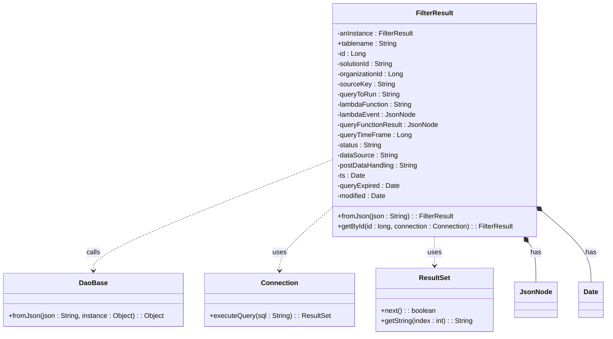
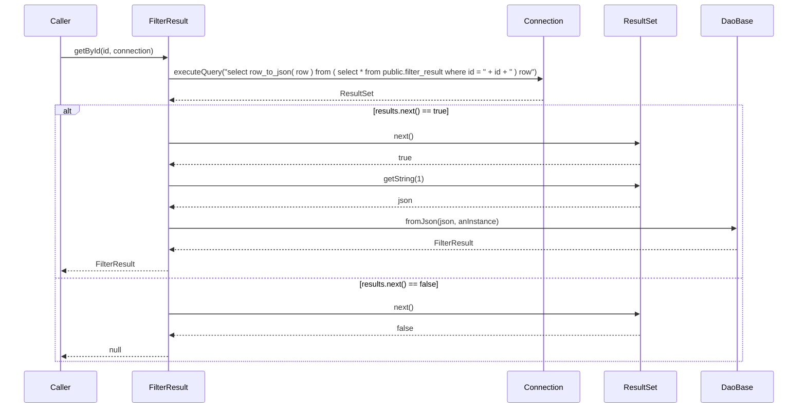

# Diagram: platform-java-lambdas/shipment/src/main/java/com/freightverify/shipment/datastore/postgresql/dao/FilterResult.java

> Auto-generated by Obscura crawlers

## Diagram 1

### SVG

<svg id="container" width="1416.0625" xmlns="http://www.w3.org/2000/svg" class="classDiagram" height="792" viewBox="0 0 1416.0625 792" role="graphics-document document" aria-roledescription="class"><g><defs><marker id="container_class-aggregationStart" class="marker aggregation class" refX="18" refY="7" markerWidth="190" markerHeight="240" orient="auto"><path d="M 18,7 L9,13 L1,7 L9,1 Z"></path></marker></defs><defs><marker id="container_class-aggregationEnd" class="marker aggregation class" refX="1" refY="7" markerWidth="20" markerHeight="28" orient="auto"><path d="M 18,7 L9,13 L1,7 L9,1 Z"></path></marker></defs><defs><marker id="container_class-extensionStart" class="marker extension class" refX="18" refY="7" markerWidth="190" markerHeight="240" orient="auto"><path d="M 1,7 L18,13 V 1 Z"></path></marker></defs><defs><marker id="container_class-extensionEnd" class="marker extension class" refX="1" refY="7" markerWidth="20" markerHeight="28" orient="auto"><path d="M 1,1 V 13 L18,7 Z"></path></marker></defs><defs><marker id="container_class-compositionStart" class="marker composition class" refX="18" refY="7" markerWidth="190" markerHeight="240" orient="auto"><path d="M 18,7 L9,13 L1,7 L9,1 Z"></path></marker></defs><defs><marker id="container_class-compositionEnd" class="marker composition class" refX="1" refY="7" markerWidth="20" markerHeight="28" orient="auto"><path d="M 18,7 L9,13 L1,7 L9,1 Z"></path></marker></defs><defs><marker id="container_class-dependencyStart" class="marker dependency class" refX="6" refY="7" markerWidth="190" markerHeight="240" orient="auto"><path d="M 5,7 L9,13 L1,7 L9,1 Z"></path></marker></defs><defs><marker id="container_class-dependencyEnd" class="marker dependency class" refX="13" refY="7" markerWidth="20" markerHeight="28" orient="auto"><path d="M 18,7 L9,13 L14,7 L9,1 Z"></path></marker></defs><defs><marker id="container_class-lollipopStart" class="marker lollipop class" refX="13" refY="7" markerWidth="190" markerHeight="240" orient="auto"><circle stroke="black" fill="transparent" cx="7" cy="7" r="6"></circle></marker></defs><defs><marker id="container_class-lollipopEnd" class="marker lollipop class" refX="1" refY="7" markerWidth="190" markerHeight="240" orient="auto"><circle stroke="black" fill="transparent" cx="7" cy="7" r="6"></circle></marker></defs><g class="root"><g class="clusters"></g><g class="edgePaths"><path d="M776.051,378.636L683.194,415.03C590.337,451.424,404.624,524.212,311.767,567.773C218.91,611.333,218.91,625.667,218.91,632.833L218.91,640" id="id_FilterResult_DaoBase_1" class="edge-thickness-normal edge-pattern-dashed relation" style=";;;" data-edge="true" data-et="edge" data-id="id_FilterResult_DaoBase_1" data-points="W3sieCI6Nzc2LjA1MDc4MTI1LCJ5IjozNzguNjM1OTUzNjQ5MjE5MX0seyJ4IjoyMTguOTEwMTU2MjUsInkiOjU5N30seyJ4IjoyMTguOTEwMTU2MjUsInkiOjY0Nn1d" marker-end="url(#container_class-dependencyEnd)"></path><path d="M776.051,491.99L755.733,509.492C735.415,526.994,694.78,561.997,674.462,586.665C654.145,611.333,654.145,625.667,654.145,632.833L654.145,640" id="id_FilterResult_Connection_2" class="edge-thickness-normal edge-pattern-dashed relation" style=";;;" data-edge="true" data-et="edge" data-id="id_FilterResult_Connection_2" data-points="W3sieCI6Nzc2LjA1MDc4MTI1LCJ5Ijo0OTEuOTkwMzM1NTE1NjM2M30seyJ4Ijo2NTQuMTQ0NTMxMjUsInkiOjU5N30seyJ4Ijo2NTQuMTQ0NTMxMjUsInkiOjY0Nn1d" marker-end="url(#container_class-dependencyEnd)"></path><path d="M1017.508,560L1017.508,566.167C1017.508,572.333,1017.508,584.667,1017.508,596C1017.508,607.333,1017.508,617.667,1017.508,622.833L1017.508,628" id="id_FilterResult_ResultSet_3" class="edge-thickness-normal edge-pattern-dashed relation" style=";;;" data-edge="true" data-et="edge" data-id="id_FilterResult_ResultSet_3" data-points="W3sieCI6MTAxNy41MDc4MTI1LCJ5Ijo1NjB9LHsieCI6MTAxNy41MDc4MTI1LCJ5Ijo1OTd9LHsieCI6MTAxNy41MDc4MTI1LCJ5Ijo2MzR9XQ==" marker-end="url(#container_class-dependencyEnd)"></path><path d="M1235.924,573.775L1238.842,577.646C1241.759,581.517,1247.595,589.258,1250.512,604.796C1253.43,620.333,1253.43,643.667,1253.43,655.333L1253.43,667" id="id_FilterResult_JsonNode_4" class="edge-thickness-normal edge-pattern-solid relation" style=";;;" data-edge="true" data-et="edge" data-id="id_FilterResult_JsonNode_4" data-points="W3sieCI6MTIyNS41NDExNTkxNDUzNjc0LCJ5Ijo1NjB9LHsieCI6MTI1My40Mjk2ODc1LCJ5Ijo1OTd9LHsieCI6MTI1My40Mjk2ODc1LCJ5Ijo2Njd9XQ==" marker-start="url(#container_class-compositionStart)"></path><path d="M1272.009,504.247L1289.872,519.706C1307.735,535.164,1343.461,566.082,1361.324,593.208C1379.188,620.333,1379.188,643.667,1379.188,655.333L1379.188,667" id="id_FilterResult_Date_5" class="edge-thickness-normal edge-pattern-solid relation" style=";;;" data-edge="true" data-et="edge" data-id="id_FilterResult_Date_5" data-points="W3sieCI6MTI1OC45NjQ4NDM3NSwieSI6NDkyLjk1ODUxNjAzODQ0OTF9LHsieCI6MTM3OS4xODc1LCJ5Ijo1OTd9LHsieCI6MTM3OS4xODc1LCJ5Ijo2Njd9XQ==" marker-start="url(#container_class-compositionStart)"></path></g><g class="edgeLabels"><g class="edgeLabel" transform="translate(218.91015625, 597)"><g class="label" data-id="id_FilterResult_DaoBase_1" transform="translate(-16.4453125, -12)"><foreignObject width="32.890625" height="24">

calls

</foreignObject></g></g><g class="edgeLabel" transform="translate(654.14453125, 597)"><g class="label" data-id="id_FilterResult_Connection_2" transform="translate(-16.4921875, -12)"><foreignObject width="32.984375" height="24">

uses

</foreignObject></g></g><g class="edgeLabel" transform="translate(1017.5078125, 597)"><g class="label" data-id="id_FilterResult_ResultSet_3" transform="translate(-16.4921875, -12)"><foreignObject width="32.984375" height="24">

uses

</foreignObject></g></g><g class="edgeLabel" transform="translate(1253.4296875, 597)"><g class="label" data-id="id_FilterResult_JsonNode_4" transform="translate(-12.703125, -12)"><foreignObject width="25.40625" height="24">

has

</foreignObject></g></g><g class="edgeLabel" transform="translate(1379.1875, 597)"><g class="label" data-id="id_FilterResult_Date_5" transform="translate(-12.703125, -12)"><foreignObject width="25.40625" height="24">

has

</foreignObject></g></g></g><g class="nodes"><g class="node default" id="classId-FilterResult-0" transform="translate(1017.5078125, 284)"><g class="basic label-container"><path d="M-241.45703125 -276 L241.45703125 -276 L241.45703125 276 L-241.45703125 276" stroke="none" stroke-width="0" fill="#ECECFF" style=""></path><path d="M-241.45703125 -276 C-55.192104436845284 -276, 131.07282237630943 -276, 241.45703125 -276 M-241.45703125 -276 C-103.07291482132922 -276, 35.31120160734156 -276, 241.45703125 -276 M241.45703125 -276 C241.45703125 -139.33301445707914, 241.45703125 -2.6660289141582894, 241.45703125 276 M241.45703125 -276 C241.45703125 -75.91048795844583, 241.45703125 124.17902408310835, 241.45703125 276 M241.45703125 276 C60.43863294462602 276, -120.57976536074796 276, -241.45703125 276 M241.45703125 276 C109.14196673299182 276, -23.173097784016363 276, -241.45703125 276 M-241.45703125 276 C-241.45703125 113.72341069142081, -241.45703125 -48.55317861715838, -241.45703125 -276 M-241.45703125 276 C-241.45703125 72.49625943288393, -241.45703125 -131.00748113423214, -241.45703125 -276" stroke="#9370DB" stroke-width="1.3" fill="none" stroke-dasharray="0 0" style=""></path></g><g class="annotation-group text" transform="translate(0, -252)"></g><g class="label-group text" transform="translate(-42.0078125, -252)"><g class="label" style="font-weight: bolder" transform="translate(0,-12)"><foreignObject width="84.015625" height="24">

FilterResult

</foreignObject></g></g><g class="members-group text" transform="translate(-229.45703125, -204)"><g class="label" style="" transform="translate(0,-12)"><foreignObject width="180.3125" height="24">

-anInstance : FilterResult

</foreignObject></g><g class="label" style="" transform="translate(0,12)"><foreignObject width="140.828125" height="24">

+tablename : String

</foreignObject></g><g class="label" style="" transform="translate(0,36)"><foreignObject width="67.46875" height="24">

-id : Long

</foreignObject></g><g class="label" style="" transform="translate(0,60)"><foreignObject width="135.765625" height="24">

-solutionId : String

</foreignObject></g><g class="label" style="" transform="translate(0,84)"><foreignObject width="158.03125" height="24">

-organizationId : Long

</foreignObject></g><g class="label" style="" transform="translate(0,108)"><foreignObject width="135.25" height="24">

-sourceKey : String

</foreignObject></g><g class="label" style="" transform="translate(0,132)"><foreignObject width="148.40625" height="24">

-queryToRun : String

</foreignObject></g><g class="label" style="" transform="translate(0,156)"><foreignObject width="179.0625" height="24">

-lambdaFunction : String

</foreignObject></g><g class="label" style="" transform="translate(0,180)"><foreignObject width="183.125" height="24">

-lambdaEvent : JsonNode

</foreignObject></g><g class="label" style="" transform="translate(0,204)"><foreignObject width="238.078125" height="24">

-queryFunctionResult : JsonNode

</foreignObject></g><g class="label" style="" transform="translate(0,228)"><foreignObject width="174.296875" height="24">

-queryTimeFrame : Long

</foreignObject></g><g class="label" style="" transform="translate(0,252)"><foreignObject width="106.0625" height="24">

-status : String

</foreignObject></g><g class="label" style="" transform="translate(0,276)"><foreignObject width="143.421875" height="24">

-dataSource : String

</foreignObject></g><g class="label" style="" transform="translate(0,300)"><foreignObject width="192.390625" height="24">

-postDataHandling : String

</foreignObject></g><g class="label" style="" transform="translate(0,324)"><foreignObject width="65.046875" height="24">

-ts : Date

</foreignObject></g><g class="label" style="" transform="translate(0,348)"><foreignObject width="147.84375" height="24">

-queryExpired : Date

</foreignObject></g><g class="label" style="" transform="translate(0,372)"><foreignObject width="116.5" height="24">

-modified : Date

</foreignObject></g></g><g class="methods-group text" transform="translate(-229.45703125, 228)"><g class="label" style="" transform="translate(0,-12)"><foreignObject width="272.484375" height="24">

+fromJson(json : String) : : FilterResult

</foreignObject></g><g class="label" style="" transform="translate(0,12)"><foreignObject width="416.90625" height="24">

+getById(id : long, connection : Connection) : : FilterResult

</foreignObject></g></g><g class="divider" style=""><path d="M-241.45703125 -228 C-94.24050455157735 -228, 52.97602214684531 -228, 241.45703125 -228 M-241.45703125 -228 C-125.6664161872848 -228, -9.875801124569591 -228, 241.45703125 -228" stroke="#9370DB" stroke-width="1.3" fill="none" stroke-dasharray="0 0" style=""></path></g><g class="divider" style=""><path d="M-241.45703125 204 C-110.79701120772742 204, 19.863008834545155 204, 241.45703125 204 M-241.45703125 204 C-132.27206643922648 204, -23.087101628452928 204, 241.45703125 204" stroke="#9370DB" stroke-width="1.3" fill="none" stroke-dasharray="0 0" style=""></path></g></g><g class="node default" id="classId-DaoBase-1" transform="translate(218.91015625, 709)"><g class="basic label-container"><path d="M-210.91015625 -63 L210.91015625 -63 L210.91015625 63 L-210.91015625 63" stroke="none" stroke-width="0" fill="#ECECFF" style=""></path><path d="M-210.91015625 -63 C-90.84136698662965 -63, 29.227422276740697 -63, 210.91015625 -63 M-210.91015625 -63 C-94.17296168575362 -63, 22.56423287849276 -63, 210.91015625 -63 M210.91015625 -63 C210.91015625 -15.577025935507436, 210.91015625 31.84594812898513, 210.91015625 63 M210.91015625 -63 C210.91015625 -14.181460957913103, 210.91015625 34.637078084173794, 210.91015625 63 M210.91015625 63 C96.74662521794312 63, -17.41690581411376 63, -210.91015625 63 M210.91015625 63 C67.77724138929219 63, -75.35567347141563 63, -210.91015625 63 M-210.91015625 63 C-210.91015625 23.09726017882172, -210.91015625 -16.80547964235656, -210.91015625 -63 M-210.91015625 63 C-210.91015625 34.76590682976561, -210.91015625 6.531813659531217, -210.91015625 -63" stroke="#9370DB" stroke-width="1.3" fill="none" stroke-dasharray="0 0" style=""></path></g><g class="annotation-group text" transform="translate(0, -39)"></g><g class="label-group text" transform="translate(-31.7109375, -39)"><g class="label" style="font-weight: bolder" transform="translate(0,-12)"><foreignObject width="63.421875" height="24">

DaoBase

</foreignObject></g></g><g class="members-group text" transform="translate(-198.91015625, 9)"></g><g class="methods-group text" transform="translate(-198.91015625, 39)"><g class="label" style="" transform="translate(0,-12)"><foreignObject width="366.109375" height="24">

+fromJson(json : String, instance : Object) : : Object

</foreignObject></g></g><g class="divider" style=""><path d="M-210.91015625 -15 C-65.13290186539123 -15, 80.64435251921753 -15, 210.91015625 -15 M-210.91015625 -15 C-66.01680970144488 -15, 78.87653684711023 -15, 210.91015625 -15" stroke="#9370DB" stroke-width="1.3" fill="none" stroke-dasharray="0 0" style=""></path></g><g class="divider" style=""><path d="M-210.91015625 9 C-97.03806188318949 9, 16.83403248362103 9, 210.91015625 9 M-210.91015625 9 C-59.43077489037617 9, 92.04860646924766 9, 210.91015625 9" stroke="#9370DB" stroke-width="1.3" fill="none" stroke-dasharray="0 0" style=""></path></g></g><g class="node default" id="classId-Connection-2" transform="translate(654.14453125, 709)"><g class="basic label-container"><path d="M-174.32421875 -63 L174.32421875 -63 L174.32421875 63 L-174.32421875 63" stroke="none" stroke-width="0" fill="#ECECFF" style=""></path><path d="M-174.32421875 -63 C-75.92055410363726 -63, 22.483110542725484 -63, 174.32421875 -63 M-174.32421875 -63 C-104.58905657321408 -63, -34.85389439642816 -63, 174.32421875 -63 M174.32421875 -63 C174.32421875 -33.16456487628665, 174.32421875 -3.3291297525733015, 174.32421875 63 M174.32421875 -63 C174.32421875 -17.84045165549479, 174.32421875 27.319096689010422, 174.32421875 63 M174.32421875 63 C45.4518938554406 63, -83.4204310391188 63, -174.32421875 63 M174.32421875 63 C49.51528216199132 63, -75.29365442601735 63, -174.32421875 63 M-174.32421875 63 C-174.32421875 30.025570183467273, -174.32421875 -2.948859633065453, -174.32421875 -63 M-174.32421875 63 C-174.32421875 23.702122874164004, -174.32421875 -15.595754251671991, -174.32421875 -63" stroke="#9370DB" stroke-width="1.3" fill="none" stroke-dasharray="0 0" style=""></path></g><g class="annotation-group text" transform="translate(0, -39)"></g><g class="label-group text" transform="translate(-41.2265625, -39)"><g class="label" style="font-weight: bolder" transform="translate(0,-12)"><foreignObject width="82.453125" height="24">

Connection

</foreignObject></g></g><g class="members-group text" transform="translate(-162.32421875, 9)"></g><g class="methods-group text" transform="translate(-162.32421875, 39)"><g class="label" style="" transform="translate(0,-12)"><foreignObject width="283.421875" height="24">

+executeQuery(sql : String) : : ResultSet

</foreignObject></g></g><g class="divider" style=""><path d="M-174.32421875 -15 C-41.814199705325194 -15, 90.69581933934961 -15, 174.32421875 -15 M-174.32421875 -15 C-93.11150770524037 -15, -11.898796660480741 -15, 174.32421875 -15" stroke="#9370DB" stroke-width="1.3" fill="none" stroke-dasharray="0 0" style=""></path></g><g class="divider" style=""><path d="M-174.32421875 9 C-87.68881783406161 9, -1.0534169181232187 9, 174.32421875 9 M-174.32421875 9 C-59.80931361228279 9, 54.705591525434414 9, 174.32421875 9" stroke="#9370DB" stroke-width="1.3" fill="none" stroke-dasharray="0 0" style=""></path></g></g><g class="node default" id="classId-ResultSet-3" transform="translate(1017.5078125, 709)"><g class="basic label-container"><path d="M-139.0390625 -75 L139.0390625 -75 L139.0390625 75 L-139.0390625 75" stroke="none" stroke-width="0" fill="#ECECFF" style=""></path><path d="M-139.0390625 -75 C-47.85824476825984 -75, 43.322572963480326 -75, 139.0390625 -75 M-139.0390625 -75 C-58.72390254195349 -75, 21.591257416093015 -75, 139.0390625 -75 M139.0390625 -75 C139.0390625 -22.472641033218594, 139.0390625 30.054717933562813, 139.0390625 75 M139.0390625 -75 C139.0390625 -41.84464310372574, 139.0390625 -8.689286207451474, 139.0390625 75 M139.0390625 75 C32.30139945527361 75, -74.43626358945278 75, -139.0390625 75 M139.0390625 75 C51.83440673839364 75, -35.37024902321272 75, -139.0390625 75 M-139.0390625 75 C-139.0390625 22.301090090307646, -139.0390625 -30.397819819384708, -139.0390625 -75 M-139.0390625 75 C-139.0390625 15.733239674758941, -139.0390625 -43.53352065048212, -139.0390625 -75" stroke="#9370DB" stroke-width="1.3" fill="none" stroke-dasharray="0 0" style=""></path></g><g class="annotation-group text" transform="translate(0, -51)"></g><g class="label-group text" transform="translate(-35.21875, -51)"><g class="label" style="font-weight: bolder" transform="translate(0,-12)"><foreignObject width="70.4375" height="24">

ResultSet

</foreignObject></g></g><g class="members-group text" transform="translate(-127.0390625, -3)"></g><g class="methods-group text" transform="translate(-127.0390625, 27)"><g class="label" style="" transform="translate(0,-12)"><foreignObject width="129.6875" height="24">

+next() : : boolean

</foreignObject></g><g class="label" style="" transform="translate(0,12)"><foreignObject width="218.859375" height="24">

+getString(index : int) : : String

</foreignObject></g></g><g class="divider" style=""><path d="M-139.0390625 -27 C-60.209741855191425 -27, 18.61957878961715 -27, 139.0390625 -27 M-139.0390625 -27 C-30.8984133890348 -27, 77.2422357219304 -27, 139.0390625 -27" stroke="#9370DB" stroke-width="1.3" fill="none" stroke-dasharray="0 0" style=""></path></g><g class="divider" style=""><path d="M-139.0390625 -3 C-32.936353519310686 -3, 73.16635546137863 -3, 139.0390625 -3 M-139.0390625 -3 C-48.562099840141215 -3, 41.91486281971757 -3, 139.0390625 -3" stroke="#9370DB" stroke-width="1.3" fill="none" stroke-dasharray="0 0" style=""></path></g></g><g class="node default" id="classId-JsonNode-4" transform="translate(1253.4296875, 709)"><g class="basic label-container"><path d="M-46.8828125 -42 L46.8828125 -42 L46.8828125 42 L-46.8828125 42" stroke="none" stroke-width="0" fill="#ECECFF" style=""></path><path d="M-46.8828125 -42 C-22.82837555561083 -42, 1.2260613887783407 -42, 46.8828125 -42 M-46.8828125 -42 C-22.354298793453495 -42, 2.17421491309301 -42, 46.8828125 -42 M46.8828125 -42 C46.8828125 -18.354186164666842, 46.8828125 5.2916276706663155, 46.8828125 42 M46.8828125 -42 C46.8828125 -24.07486224821205, 46.8828125 -6.149724496424099, 46.8828125 42 M46.8828125 42 C15.167988663871078 42, -16.546835172257843 42, -46.8828125 42 M46.8828125 42 C16.64484257332817 42, -13.593127353343661 42, -46.8828125 42 M-46.8828125 42 C-46.8828125 12.687134551922469, -46.8828125 -16.625730896155062, -46.8828125 -42 M-46.8828125 42 C-46.8828125 10.750060383340237, -46.8828125 -20.499879233319525, -46.8828125 -42" stroke="#9370DB" stroke-width="1.3" fill="none" stroke-dasharray="0 0" style=""></path></g><g class="annotation-group text" transform="translate(0, -18)"></g><g class="label-group text" transform="translate(-34.8828125, -18)"><g class="label" style="font-weight: bolder" transform="translate(0,-12)"><foreignObject width="69.765625" height="24">

JsonNode

</foreignObject></g></g><g class="members-group text" transform="translate(-34.8828125, 30)"></g><g class="methods-group text" transform="translate(-34.8828125, 60)"></g><g class="divider" style=""><path d="M-46.8828125 6 C-22.57215768587516 6, 1.7384971282496835 6, 46.8828125 6 M-46.8828125 6 C-20.449780624372764 6, 5.983251251254472 6, 46.8828125 6" stroke="#9370DB" stroke-width="1.3" fill="none" stroke-dasharray="0 0" style=""></path></g><g class="divider" style=""><path d="M-46.8828125 24 C-23.888053146712732 24, -0.8932937934254639 24, 46.8828125 24 M-46.8828125 24 C-17.37993566212309 24, 12.122941175753823 24, 46.8828125 24" stroke="#9370DB" stroke-width="1.3" fill="none" stroke-dasharray="0 0" style=""></path></g></g><g class="node default" id="classId-Date-5" transform="translate(1379.1875, 709)"><g class="basic label-container"><path d="M-28.875 -42 L28.875 -42 L28.875 42 L-28.875 42" stroke="none" stroke-width="0" fill="#ECECFF" style=""></path><path d="M-28.875 -42 C-6.518184843557965 -42, 15.83863031288407 -42, 28.875 -42 M-28.875 -42 C-7.1637883623875425 -42, 14.547423275224915 -42, 28.875 -42 M28.875 -42 C28.875 -17.23658149193989, 28.875 7.5268370161202185, 28.875 42 M28.875 -42 C28.875 -9.032115684472593, 28.875 23.935768631054813, 28.875 42 M28.875 42 C12.310954925571892 42, -4.2530901488562165 42, -28.875 42 M28.875 42 C10.448563517907186 42, -7.977872964185629 42, -28.875 42 M-28.875 42 C-28.875 19.076636363408458, -28.875 -3.8467272731830846, -28.875 -42 M-28.875 42 C-28.875 9.777552701149709, -28.875 -22.444894597700582, -28.875 -42" stroke="#9370DB" stroke-width="1.3" fill="none" stroke-dasharray="0 0" style=""></path></g><g class="annotation-group text" transform="translate(0, -18)"></g><g class="label-group text" transform="translate(-16.875, -18)"><g class="label" style="font-weight: bolder" transform="translate(0,-12)"><foreignObject width="33.75" height="24">

Date

</foreignObject></g></g><g class="members-group text" transform="translate(-16.875, 30)"></g><g class="methods-group text" transform="translate(-16.875, 60)"></g><g class="divider" style=""><path d="M-28.875 6 C-9.855154290721423 6, 9.164691418557155 6, 28.875 6 M-28.875 6 C-15.781452448705465 6, -2.687904897410931 6, 28.875 6" stroke="#9370DB" stroke-width="1.3" fill="none" stroke-dasharray="0 0" style=""></path></g><g class="divider" style=""><path d="M-28.875 24 C-7.281975911598796 24, 14.311048176802409 24, 28.875 24 M-28.875 24 C-16.415759938718786 24, -3.9565198774375716 24, 28.875 24" stroke="#9370DB" stroke-width="1.3" fill="none" stroke-dasharray="0 0" style=""></path></g></g></g></g></g></svg>

## Diagram 2

### SVG

<svg id="container" width="1725" xmlns="http://www.w3.org/2000/svg" height="895" viewBox="-50 -10 1725 895" role="graphics-document document" aria-roledescription="sequence"><g><rect x="1475" y="809" fill="#eaeaea" stroke="#666" width="150" height="65" name="DaoBase" rx="3" ry="3" class="actor actor-bottom"></rect><text x="1550" y="841.5" dominant-baseline="central" alignment-baseline="central" class="actor actor-box" style="text-anchor: middle; font-size: 16px; font-weight: 400;"><tspan x="1550" dy="0">DaoBase</tspan></text></g><g><rect x="1275" y="809" fill="#eaeaea" stroke="#666" width="150" height="65" name="ResultSet" rx="3" ry="3" class="actor actor-bottom"></rect><text x="1350" y="841.5" dominant-baseline="central" alignment-baseline="central" class="actor actor-box" style="text-anchor: middle; font-size: 16px; font-weight: 400;"><tspan x="1350" dy="0">ResultSet</tspan></text></g><g><rect x="1075" y="809" fill="#eaeaea" stroke="#666" width="150" height="65" name="Connection" rx="3" ry="3" class="actor actor-bottom"></rect><text x="1150" y="841.5" dominant-baseline="central" alignment-baseline="central" class="actor actor-box" style="text-anchor: middle; font-size: 16px; font-weight: 400;"><tspan x="1150" dy="0">Connection</tspan></text></g><g><rect x="238" y="809" fill="#eaeaea" stroke="#666" width="150" height="65" name="FilterResult" rx="3" ry="3" class="actor actor-bottom"></rect><text x="313" y="841.5" dominant-baseline="central" alignment-baseline="central" class="actor actor-box" style="text-anchor: middle; font-size: 16px; font-weight: 400;"><tspan x="313" dy="0">FilterResult</tspan></text></g><g><rect x="0" y="809" fill="#eaeaea" stroke="#666" width="150" height="65" name="Caller" rx="3" ry="3" class="actor actor-bottom"></rect><text x="75" y="841.5" dominant-baseline="central" alignment-baseline="central" class="actor actor-box" style="text-anchor: middle; font-size: 16px; font-weight: 400;"><tspan x="75" dy="0">Caller</tspan></text></g><g><line id="actor4" x1="1550" y1="65" x2="1550" y2="809" class="actor-line 200" stroke-width="0.5px" stroke="#999" name="DaoBase"></line><g id="root-4"><rect x="1475" y="0" fill="#eaeaea" stroke="#666" width="150" height="65" name="DaoBase" rx="3" ry="3" class="actor actor-top"></rect><text x="1550" y="32.5" dominant-baseline="central" alignment-baseline="central" class="actor actor-box" style="text-anchor: middle; font-size: 16px; font-weight: 400;"><tspan x="1550" dy="0">DaoBase</tspan></text></g></g><g><line id="actor3" x1="1350" y1="65" x2="1350" y2="809" class="actor-line 200" stroke-width="0.5px" stroke="#999" name="ResultSet"></line><g id="root-3"><rect x="1275" y="0" fill="#eaeaea" stroke="#666" width="150" height="65" name="ResultSet" rx="3" ry="3" class="actor actor-top"></rect><text x="1350" y="32.5" dominant-baseline="central" alignment-baseline="central" class="actor actor-box" style="text-anchor: middle; font-size: 16px; font-weight: 400;"><tspan x="1350" dy="0">ResultSet</tspan></text></g></g><g><line id="actor2" x1="1150" y1="65" x2="1150" y2="809" class="actor-line 200" stroke-width="0.5px" stroke="#999" name="Connection"></line><g id="root-2"><rect x="1075" y="0" fill="#eaeaea" stroke="#666" width="150" height="65" name="Connection" rx="3" ry="3" class="actor actor-top"></rect><text x="1150" y="32.5" dominant-baseline="central" alignment-baseline="central" class="actor actor-box" style="text-anchor: middle; font-size: 16px; font-weight: 400;"><tspan x="1150" dy="0">Connection</tspan></text></g></g><g><line id="actor1" x1="313" y1="65" x2="313" y2="809" class="actor-line 200" stroke-width="0.5px" stroke="#999" name="FilterResult"></line><g id="root-1"><rect x="238" y="0" fill="#eaeaea" stroke="#666" width="150" height="65" name="FilterResult" rx="3" ry="3" class="actor actor-top"></rect><text x="313" y="32.5" dominant-baseline="central" alignment-baseline="central" class="actor actor-box" style="text-anchor: middle; font-size: 16px; font-weight: 400;"><tspan x="313" dy="0">FilterResult</tspan></text></g></g><g><line id="actor0" x1="75" y1="65" x2="75" y2="809" class="actor-line 200" stroke-width="0.5px" stroke="#999" name="Caller"></line><g id="root-0"><rect x="0" y="0" fill="#eaeaea" stroke="#666" width="150" height="65" name="Caller" rx="3" ry="3" class="actor actor-top"></rect><text x="75" y="32.5" dominant-baseline="central" alignment-baseline="central" class="actor actor-box" style="text-anchor: middle; font-size: 16px; font-weight: 400;"><tspan x="75" dy="0">Caller</tspan></text></g></g><g></g><defs><symbol id="computer" width="24" height="24"><path transform="scale(.5)" d="M2 2v13h20v-13h-20zm18 11h-16v-9h16v9zm-10.228 6l.466-1h3.524l.467 1h-4.457zm14.228 3h-24l2-6h2.104l-1.33 4h18.45l-1.297-4h2.073l2 6zm-5-10h-14v-7h14v7z"></path></symbol></defs><defs><symbol id="database" fill-rule="evenodd" clip-rule="evenodd"><path transform="scale(.5)" d="M12.258.001l.256.004.255.005.253.008.251.01.249.012.247.015.246.016.242.019.241.02.239.023.236.024.233.027.231.028.229.031.225.032.223.034.22.036.217.038.214.04.211.041.208.043.205.045.201.046.198.048.194.05.191.051.187.053.183.054.18.056.175.057.172.059.168.06.163.061.16.063.155.064.15.066.074.033.073.033.071.034.07.034.069.035.068.035.067.035.066.035.064.036.064.036.062.036.06.036.06.037.058.037.058.037.055.038.055.038.053.038.052.038.051.039.05.039.048.039.047.039.045.04.044.04.043.04.041.04.04.041.039.041.037.041.036.041.034.041.033.042.032.042.03.042.029.042.027.042.026.043.024.043.023.043.021.043.02.043.018.044.017.043.015.044.013.044.012.044.011.045.009.044.007.045.006.045.004.045.002.045.001.045v17l-.001.045-.002.045-.004.045-.006.045-.007.045-.009.044-.011.045-.012.044-.013.044-.015.044-.017.043-.018.044-.02.043-.021.043-.023.043-.024.043-.026.043-.027.042-.029.042-.03.042-.032.042-.033.042-.034.041-.036.041-.037.041-.039.041-.04.041-.041.04-.043.04-.044.04-.045.04-.047.039-.048.039-.05.039-.051.039-.052.038-.053.038-.055.038-.055.038-.058.037-.058.037-.06.037-.06.036-.062.036-.064.036-.064.036-.066.035-.067.035-.068.035-.069.035-.07.034-.071.034-.073.033-.074.033-.15.066-.155.064-.16.063-.163.061-.168.06-.172.059-.175.057-.18.056-.183.054-.187.053-.191.051-.194.05-.198.048-.201.046-.205.045-.208.043-.211.041-.214.04-.217.038-.22.036-.223.034-.225.032-.229.031-.231.028-.233.027-.236.024-.239.023-.241.02-.242.019-.246.016-.247.015-.249.012-.251.01-.253.008-.255.005-.256.004-.258.001-.258-.001-.256-.004-.255-.005-.253-.008-.251-.01-.249-.012-.247-.015-.245-.016-.243-.019-.241-.02-.238-.023-.236-.024-.234-.027-.231-.028-.228-.031-.226-.032-.223-.034-.22-.036-.217-.038-.214-.04-.211-.041-.208-.043-.204-.045-.201-.046-.198-.048-.195-.05-.19-.051-.187-.053-.184-.054-.179-.056-.176-.057-.172-.059-.167-.06-.164-.061-.159-.063-.155-.064-.151-.066-.074-.033-.072-.033-.072-.034-.07-.034-.069-.035-.068-.035-.067-.035-.066-.035-.064-.036-.063-.036-.062-.036-.061-.036-.06-.037-.058-.037-.057-.037-.056-.038-.055-.038-.053-.038-.052-.038-.051-.039-.049-.039-.049-.039-.046-.039-.046-.04-.044-.04-.043-.04-.041-.04-.04-.041-.039-.041-.037-.041-.036-.041-.034-.041-.033-.042-.032-.042-.03-.042-.029-.042-.027-.042-.026-.043-.024-.043-.023-.043-.021-.043-.02-.043-.018-.044-.017-.043-.015-.044-.013-.044-.012-.044-.011-.045-.009-.044-.007-.045-.006-.045-.004-.045-.002-.045-.001-.045v-17l.001-.045.002-.045.004-.045.006-.045.007-.045.009-.044.011-.045.012-.044.013-.044.015-.044.017-.043.018-.044.02-.043.021-.043.023-.043.024-.043.026-.043.027-.042.029-.042.03-.042.032-.042.033-.042.034-.041.036-.041.037-.041.039-.041.04-.041.041-.04.043-.04.044-.04.046-.04.046-.039.049-.039.049-.039.051-.039.052-.038.053-.038.055-.038.056-.038.057-.037.058-.037.06-.037.061-.036.062-.036.063-.036.064-.036.066-.035.067-.035.068-.035.069-.035.07-.034.072-.034.072-.033.074-.033.151-.066.155-.064.159-.063.164-.061.167-.06.172-.059.176-.057.179-.056.184-.054.187-.053.19-.051.195-.05.198-.048.201-.046.204-.045.208-.043.211-.041.214-.04.217-.038.22-.036.223-.034.226-.032.228-.031.231-.028.234-.027.236-.024.238-.023.241-.02.243-.019.245-.016.247-.015.249-.012.251-.01.253-.008.255-.005.256-.004.258-.001.258.001zm-9.258 20.499v.01l.001.021.003.021.004.022.005.021.006.022.007.022.009.023.01.022.011.023.012.023.013.023.015.023.016.024.017.023.018.024.019.024.021.024.022.025.023.024.024.025.052.049.056.05.061.051.066.051.07.051.075.051.079.052.084.052.088.052.092.052.097.052.102.051.105.052.11.052.114.051.119.051.123.051.127.05.131.05.135.05.139.048.144.049.147.047.152.047.155.047.16.045.163.045.167.043.171.043.176.041.178.041.183.039.187.039.19.037.194.035.197.035.202.033.204.031.209.03.212.029.216.027.219.025.222.024.226.021.23.02.233.018.236.016.24.015.243.012.246.01.249.008.253.005.256.004.259.001.26-.001.257-.004.254-.005.25-.008.247-.011.244-.012.241-.014.237-.016.233-.018.231-.021.226-.021.224-.024.22-.026.216-.027.212-.028.21-.031.205-.031.202-.034.198-.034.194-.036.191-.037.187-.039.183-.04.179-.04.175-.042.172-.043.168-.044.163-.045.16-.046.155-.046.152-.047.148-.048.143-.049.139-.049.136-.05.131-.05.126-.05.123-.051.118-.052.114-.051.11-.052.106-.052.101-.052.096-.052.092-.052.088-.053.083-.051.079-.052.074-.052.07-.051.065-.051.06-.051.056-.05.051-.05.023-.024.023-.025.021-.024.02-.024.019-.024.018-.024.017-.024.015-.023.014-.024.013-.023.012-.023.01-.023.01-.022.008-.022.006-.022.006-.022.004-.022.004-.021.001-.021.001-.021v-4.127l-.077.055-.08.053-.083.054-.085.053-.087.052-.09.052-.093.051-.095.05-.097.05-.1.049-.102.049-.105.048-.106.047-.109.047-.111.046-.114.045-.115.045-.118.044-.12.043-.122.042-.124.042-.126.041-.128.04-.13.04-.132.038-.134.038-.135.037-.138.037-.139.035-.142.035-.143.034-.144.033-.147.032-.148.031-.15.03-.151.03-.153.029-.154.027-.156.027-.158.026-.159.025-.161.024-.162.023-.163.022-.165.021-.166.02-.167.019-.169.018-.169.017-.171.016-.173.015-.173.014-.175.013-.175.012-.177.011-.178.01-.179.008-.179.008-.181.006-.182.005-.182.004-.184.003-.184.002h-.37l-.184-.002-.184-.003-.182-.004-.182-.005-.181-.006-.179-.008-.179-.008-.178-.01-.176-.011-.176-.012-.175-.013-.173-.014-.172-.015-.171-.016-.17-.017-.169-.018-.167-.019-.166-.02-.165-.021-.163-.022-.162-.023-.161-.024-.159-.025-.157-.026-.156-.027-.155-.027-.153-.029-.151-.03-.15-.03-.148-.031-.146-.032-.145-.033-.143-.034-.141-.035-.14-.035-.137-.037-.136-.037-.134-.038-.132-.038-.13-.04-.128-.04-.126-.041-.124-.042-.122-.042-.12-.044-.117-.043-.116-.045-.113-.045-.112-.046-.109-.047-.106-.047-.105-.048-.102-.049-.1-.049-.097-.05-.095-.05-.093-.052-.09-.051-.087-.052-.085-.053-.083-.054-.08-.054-.077-.054v4.127zm0-5.654v.011l.001.021.003.021.004.021.005.022.006.022.007.022.009.022.01.022.011.023.012.023.013.023.015.024.016.023.017.024.018.024.019.024.021.024.022.024.023.025.024.024.052.05.056.05.061.05.066.051.07.051.075.052.079.051.084.052.088.052.092.052.097.052.102.052.105.052.11.051.114.051.119.052.123.05.127.051.131.05.135.049.139.049.144.048.147.048.152.047.155.046.16.045.163.045.167.044.171.042.176.042.178.04.183.04.187.038.19.037.194.036.197.034.202.033.204.032.209.03.212.028.216.027.219.025.222.024.226.022.23.02.233.018.236.016.24.014.243.012.246.01.249.008.253.006.256.003.259.001.26-.001.257-.003.254-.006.25-.008.247-.01.244-.012.241-.015.237-.016.233-.018.231-.02.226-.022.224-.024.22-.025.216-.027.212-.029.21-.03.205-.032.202-.033.198-.035.194-.036.191-.037.187-.039.183-.039.179-.041.175-.042.172-.043.168-.044.163-.045.16-.045.155-.047.152-.047.148-.048.143-.048.139-.05.136-.049.131-.05.126-.051.123-.051.118-.051.114-.052.11-.052.106-.052.101-.052.096-.052.092-.052.088-.052.083-.052.079-.052.074-.051.07-.052.065-.051.06-.05.056-.051.051-.049.023-.025.023-.024.021-.025.02-.024.019-.024.018-.024.017-.024.015-.023.014-.023.013-.024.012-.022.01-.023.01-.023.008-.022.006-.022.006-.022.004-.021.004-.022.001-.021.001-.021v-4.139l-.077.054-.08.054-.083.054-.085.052-.087.053-.09.051-.093.051-.095.051-.097.05-.1.049-.102.049-.105.048-.106.047-.109.047-.111.046-.114.045-.115.044-.118.044-.12.044-.122.042-.124.042-.126.041-.128.04-.13.039-.132.039-.134.038-.135.037-.138.036-.139.036-.142.035-.143.033-.144.033-.147.033-.148.031-.15.03-.151.03-.153.028-.154.028-.156.027-.158.026-.159.025-.161.024-.162.023-.163.022-.165.021-.166.02-.167.019-.169.018-.169.017-.171.016-.173.015-.173.014-.175.013-.175.012-.177.011-.178.009-.179.009-.179.007-.181.007-.182.005-.182.004-.184.003-.184.002h-.37l-.184-.002-.184-.003-.182-.004-.182-.005-.181-.007-.179-.007-.179-.009-.178-.009-.176-.011-.176-.012-.175-.013-.173-.014-.172-.015-.171-.016-.17-.017-.169-.018-.167-.019-.166-.02-.165-.021-.163-.022-.162-.023-.161-.024-.159-.025-.157-.026-.156-.027-.155-.028-.153-.028-.151-.03-.15-.03-.148-.031-.146-.033-.145-.033-.143-.033-.141-.035-.14-.036-.137-.036-.136-.037-.134-.038-.132-.039-.13-.039-.128-.04-.126-.041-.124-.042-.122-.043-.12-.043-.117-.044-.116-.044-.113-.046-.112-.046-.109-.046-.106-.047-.105-.048-.102-.049-.1-.049-.097-.05-.095-.051-.093-.051-.09-.051-.087-.053-.085-.052-.083-.054-.08-.054-.077-.054v4.139zm0-5.666v.011l.001.02.003.022.004.021.005.022.006.021.007.022.009.023.01.022.011.023.012.023.013.023.015.023.016.024.017.024.018.023.019.024.021.025.022.024.023.024.024.025.052.05.056.05.061.05.066.051.07.051.075.052.079.051.084.052.088.052.092.052.097.052.102.052.105.051.11.052.114.051.119.051.123.051.127.05.131.05.135.05.139.049.144.048.147.048.152.047.155.046.16.045.163.045.167.043.171.043.176.042.178.04.183.04.187.038.19.037.194.036.197.034.202.033.204.032.209.03.212.028.216.027.219.025.222.024.226.021.23.02.233.018.236.017.24.014.243.012.246.01.249.008.253.006.256.003.259.001.26-.001.257-.003.254-.006.25-.008.247-.01.244-.013.241-.014.237-.016.233-.018.231-.02.226-.022.224-.024.22-.025.216-.027.212-.029.21-.03.205-.032.202-.033.198-.035.194-.036.191-.037.187-.039.183-.039.179-.041.175-.042.172-.043.168-.044.163-.045.16-.045.155-.047.152-.047.148-.048.143-.049.139-.049.136-.049.131-.051.126-.05.123-.051.118-.052.114-.051.11-.052.106-.052.101-.052.096-.052.092-.052.088-.052.083-.052.079-.052.074-.052.07-.051.065-.051.06-.051.056-.05.051-.049.023-.025.023-.025.021-.024.02-.024.019-.024.018-.024.017-.024.015-.023.014-.024.013-.023.012-.023.01-.022.01-.023.008-.022.006-.022.006-.022.004-.022.004-.021.001-.021.001-.021v-4.153l-.077.054-.08.054-.083.053-.085.053-.087.053-.09.051-.093.051-.095.051-.097.05-.1.049-.102.048-.105.048-.106.048-.109.046-.111.046-.114.046-.115.044-.118.044-.12.043-.122.043-.124.042-.126.041-.128.04-.13.039-.132.039-.134.038-.135.037-.138.036-.139.036-.142.034-.143.034-.144.033-.147.032-.148.032-.15.03-.151.03-.153.028-.154.028-.156.027-.158.026-.159.024-.161.024-.162.023-.163.023-.165.021-.166.02-.167.019-.169.018-.169.017-.171.016-.173.015-.173.014-.175.013-.175.012-.177.01-.178.01-.179.009-.179.007-.181.006-.182.006-.182.004-.184.003-.184.001-.185.001-.185-.001-.184-.001-.184-.003-.182-.004-.182-.006-.181-.006-.179-.007-.179-.009-.178-.01-.176-.01-.176-.012-.175-.013-.173-.014-.172-.015-.171-.016-.17-.017-.169-.018-.167-.019-.166-.02-.165-.021-.163-.023-.162-.023-.161-.024-.159-.024-.157-.026-.156-.027-.155-.028-.153-.028-.151-.03-.15-.03-.148-.032-.146-.032-.145-.033-.143-.034-.141-.034-.14-.036-.137-.036-.136-.037-.134-.038-.132-.039-.13-.039-.128-.041-.126-.041-.124-.041-.122-.043-.12-.043-.117-.044-.116-.044-.113-.046-.112-.046-.109-.046-.106-.048-.105-.048-.102-.048-.1-.05-.097-.049-.095-.051-.093-.051-.09-.052-.087-.052-.085-.053-.083-.053-.08-.054-.077-.054v4.153zm8.74-8.179l-.257.004-.254.005-.25.008-.247.011-.244.012-.241.014-.237.016-.233.018-.231.021-.226.022-.224.023-.22.026-.216.027-.212.028-.21.031-.205.032-.202.033-.198.034-.194.036-.191.038-.187.038-.183.04-.179.041-.175.042-.172.043-.168.043-.163.045-.16.046-.155.046-.152.048-.148.048-.143.048-.139.049-.136.05-.131.05-.126.051-.123.051-.118.051-.114.052-.11.052-.106.052-.101.052-.096.052-.092.052-.088.052-.083.052-.079.052-.074.051-.07.052-.065.051-.06.05-.056.05-.051.05-.023.025-.023.024-.021.024-.02.025-.019.024-.018.024-.017.023-.015.024-.014.023-.013.023-.012.023-.01.023-.01.022-.008.022-.006.023-.006.021-.004.022-.004.021-.001.021-.001.021.001.021.001.021.004.021.004.022.006.021.006.023.008.022.01.022.01.023.012.023.013.023.014.023.015.024.017.023.018.024.019.024.02.025.021.024.023.024.023.025.051.05.056.05.06.05.065.051.07.052.074.051.079.052.083.052.088.052.092.052.096.052.101.052.106.052.11.052.114.052.118.051.123.051.126.051.131.05.136.05.139.049.143.048.148.048.152.048.155.046.16.046.163.045.168.043.172.043.175.042.179.041.183.04.187.038.191.038.194.036.198.034.202.033.205.032.21.031.212.028.216.027.22.026.224.023.226.022.231.021.233.018.237.016.241.014.244.012.247.011.25.008.254.005.257.004.26.001.26-.001.257-.004.254-.005.25-.008.247-.011.244-.012.241-.014.237-.016.233-.018.231-.021.226-.022.224-.023.22-.026.216-.027.212-.028.21-.031.205-.032.202-.033.198-.034.194-.036.191-.038.187-.038.183-.04.179-.041.175-.042.172-.043.168-.043.163-.045.16-.046.155-.046.152-.048.148-.048.143-.048.139-.049.136-.05.131-.05.126-.051.123-.051.118-.051.114-.052.11-.052.106-.052.101-.052.096-.052.092-.052.088-.052.083-.052.079-.052.074-.051.07-.052.065-.051.06-.05.056-.05.051-.05.023-.025.023-.024.021-.024.02-.025.019-.024.018-.024.017-.023.015-.024.014-.023.013-.023.012-.023.01-.023.01-.022.008-.022.006-.023.006-.021.004-.022.004-.021.001-.021.001-.021-.001-.021-.001-.021-.004-.021-.004-.022-.006-.021-.006-.023-.008-.022-.01-.022-.01-.023-.012-.023-.013-.023-.014-.023-.015-.024-.017-.023-.018-.024-.019-.024-.02-.025-.021-.024-.023-.024-.023-.025-.051-.05-.056-.05-.06-.05-.065-.051-.07-.052-.074-.051-.079-.052-.083-.052-.088-.052-.092-.052-.096-.052-.101-.052-.106-.052-.11-.052-.114-.052-.118-.051-.123-.051-.126-.051-.131-.05-.136-.05-.139-.049-.143-.048-.148-.048-.152-.048-.155-.046-.16-.046-.163-.045-.168-.043-.172-.043-.175-.042-.179-.041-.183-.04-.187-.038-.191-.038-.194-.036-.198-.034-.202-.033-.205-.032-.21-.031-.212-.028-.216-.027-.22-.026-.224-.023-.226-.022-.231-.021-.233-.018-.237-.016-.241-.014-.244-.012-.247-.011-.25-.008-.254-.005-.257-.004-.26-.001-.26.001z"></path></symbol></defs><defs><symbol id="clock" width="24" height="24"><path transform="scale(.5)" d="M12 2c5.514 0 10 4.486 10 10s-4.486 10-10 10-10-4.486-10-10 4.486-10 10-10zm0-2c-6.627 0-12 5.373-12 12s5.373 12 12 12 12-5.373 12-12-5.373-12-12-12zm5.848 12.459c.202.038.202.333.001.372-1.907.361-6.045 1.111-6.547 1.111-.719 0-1.301-.582-1.301-1.301 0-.512.77-5.447 1.125-7.445.034-.192.312-.181.343.014l.985 6.238 5.394 1.011z"></path></symbol></defs><defs><marker id="arrowhead" refX="7.9" refY="5" markerUnits="userSpaceOnUse" markerWidth="12" markerHeight="12" orient="auto-start-reverse"><path d="M -1 0 L 10 5 L 0 10 z"></path></marker></defs><defs><marker id="crosshead" markerWidth="15" markerHeight="8" orient="auto" refX="4" refY="4.5"><path fill="none" stroke="#000000" stroke-width="1pt" d="M 1,2 L 6,7 M 6,2 L 1,7" style="stroke-dasharray: 0, 0;"></path></marker></defs><defs><marker id="filled-head" refX="15.5" refY="7" markerWidth="20" markerHeight="28" orient="auto"><path d="M 18,7 L9,13 L14,7 L9,1 Z"></path></marker></defs><defs><marker id="sequencenumber" refX="15" refY="15" markerWidth="60" markerHeight="40" orient="auto"><circle cx="15" cy="15" r="6"></circle></marker></defs><g><line x1="64" y1="219" x2="1561" y2="219" class="loopLine"></line><line x1="1561" y1="219" x2="1561" y2="789" class="loopLine"></line><line x1="64" y1="789" x2="1561" y2="789" class="loopLine"></line><line x1="64" y1="219" x2="64" y2="789" class="loopLine"></line><line x1="64" y1="605" x2="1561" y2="605" class="loopLine" style="stroke-dasharray: 3, 3;"></line><polygon points="64,219 114,219 114,232 105.6,239 64,239" class="labelBox"></polygon><text x="89" y="232" text-anchor="middle" dominant-baseline="middle" alignment-baseline="middle" class="labelText" style="font-size: 16px; font-weight: 400;">alt</text><text x="837.5" y="237" text-anchor="middle" class="loopText" style="font-size: 16px; font-weight: 400;"><tspan x="837.5">[results.next() == true]</tspan></text><text x="812.5" y="623" text-anchor="middle" class="loopText" style="font-size: 16px; font-weight: 400;">[results.next() == false]</text></g><text x="193" y="80" text-anchor="middle" dominant-baseline="middle" alignment-baseline="middle" class="messageText" dy="1em" style="font-size: 16px; font-weight: 400;">getById(id, connection)</text><line x1="76" y1="113" x2="309" y2="113" class="messageLine0" stroke-width="2" stroke="none" marker-end="url(#arrowhead)" style="fill: none;"></line><text x="730" y="128" text-anchor="middle" dominant-baseline="middle" alignment-baseline="middle" class="messageText" dy="1em" style="font-size: 16px; font-weight: 400;">executeQuery("select row_to_json( row ) from ( select * from public.filter_result where id = " + id + " ) row")</text><line x1="314" y1="161" x2="1146" y2="161" class="messageLine0" stroke-width="2" stroke="none" marker-end="url(#arrowhead)" style="fill: none;"></line><text x="733" y="176" text-anchor="middle" dominant-baseline="middle" alignment-baseline="middle" class="messageText" dy="1em" style="font-size: 16px; font-weight: 400;">ResultSet</text><line x1="1149" y1="209" x2="317" y2="209" class="messageLine1" stroke-width="2" stroke="none" marker-end="url(#arrowhead)" style="stroke-dasharray: 3, 3; fill: none;"></line><text x="830" y="269" text-anchor="middle" dominant-baseline="middle" alignment-baseline="middle" class="messageText" dy="1em" style="font-size: 16px; font-weight: 400;">next()</text><line x1="314" y1="302" x2="1346" y2="302" class="messageLine0" stroke-width="2" stroke="none" marker-end="url(#arrowhead)" style="fill: none;"></line><text x="833" y="317" text-anchor="middle" dominant-baseline="middle" alignment-baseline="middle" class="messageText" dy="1em" style="font-size: 16px; font-weight: 400;">true</text><line x1="1349" y1="350" x2="317" y2="350" class="messageLine1" stroke-width="2" stroke="none" marker-end="url(#arrowhead)" style="stroke-dasharray: 3, 3; fill: none;"></line><text x="830" y="365" text-anchor="middle" dominant-baseline="middle" alignment-baseline="middle" class="messageText" dy="1em" style="font-size: 16px; font-weight: 400;">getString(1)</text><line x1="314" y1="398" x2="1346" y2="398" class="messageLine0" stroke-width="2" stroke="none" marker-end="url(#arrowhead)" style="fill: none;"></line><text x="833" y="413" text-anchor="middle" dominant-baseline="middle" alignment-baseline="middle" class="messageText" dy="1em" style="font-size: 16px; font-weight: 400;">json</text><line x1="1349" y1="446" x2="317" y2="446" class="messageLine1" stroke-width="2" stroke="none" marker-end="url(#arrowhead)" style="stroke-dasharray: 3, 3; fill: none;"></line><text x="930" y="461" text-anchor="middle" dominant-baseline="middle" alignment-baseline="middle" class="messageText" dy="1em" style="font-size: 16px; font-weight: 400;">fromJson(json, anInstance)</text><line x1="314" y1="494" x2="1546" y2="494" class="messageLine0" stroke-width="2" stroke="none" marker-end="url(#arrowhead)" style="fill: none;"></line><text x="933" y="509" text-anchor="middle" dominant-baseline="middle" alignment-baseline="middle" class="messageText" dy="1em" style="font-size: 16px; font-weight: 400;">FilterResult</text><line x1="1549" y1="542" x2="317" y2="542" class="messageLine1" stroke-width="2" stroke="none" marker-end="url(#arrowhead)" style="stroke-dasharray: 3, 3; fill: none;"></line><text x="196" y="557" text-anchor="middle" dominant-baseline="middle" alignment-baseline="middle" class="messageText" dy="1em" style="font-size: 16px; font-weight: 400;">FilterResult</text><line x1="312" y1="590" x2="79" y2="590" class="messageLine1" stroke-width="2" stroke="none" marker-end="url(#arrowhead)" style="stroke-dasharray: 3, 3; fill: none;"></line><text x="830" y="650" text-anchor="middle" dominant-baseline="middle" alignment-baseline="middle" class="messageText" dy="1em" style="font-size: 16px; font-weight: 400;">next()</text><line x1="314" y1="683" x2="1346" y2="683" class="messageLine0" stroke-width="2" stroke="none" marker-end="url(#arrowhead)" style="fill: none;"></line><text x="833" y="698" text-anchor="middle" dominant-baseline="middle" alignment-baseline="middle" class="messageText" dy="1em" style="font-size: 16px; font-weight: 400;">false</text><line x1="1349" y1="731" x2="317" y2="731" class="messageLine1" stroke-width="2" stroke="none" marker-end="url(#arrowhead)" style="stroke-dasharray: 3, 3; fill: none;"></line><text x="196" y="746" text-anchor="middle" dominant-baseline="middle" alignment-baseline="middle" class="messageText" dy="1em" style="font-size: 16px; font-weight: 400;">null</text><line x1="312" y1="779" x2="79" y2="779" class="messageLine1" stroke-width="2" stroke="none" marker-end="url(#arrowhead)" style="stroke-dasharray: 3, 3; fill: none;"></line></svg>
