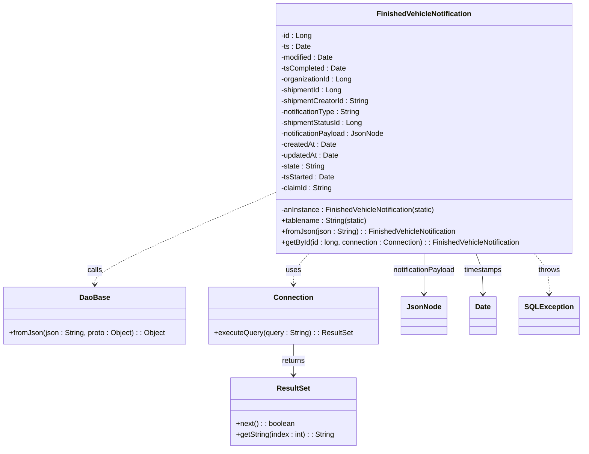
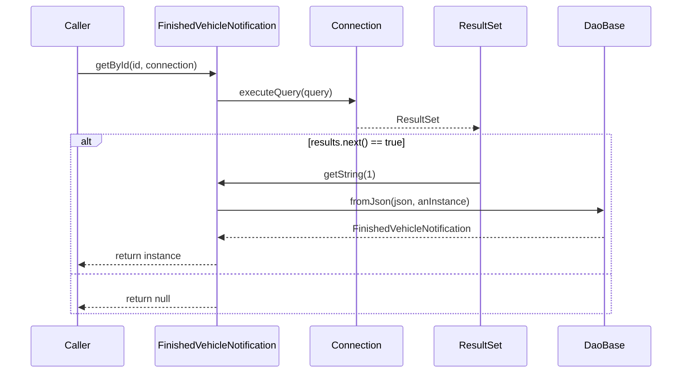

# Diagram: platform-java-lambdas/shipment/src/main/java/com/freightverify/shipment/datastore/postgresql/dao/FinishedVehicleNotification.java

> Auto-generated by Obscura crawlers

## Diagram 1

### SVG

<svg id="container" width="1266.953125" xmlns="http://www.w3.org/2000/svg" class="classDiagram" height="992" viewBox="0 0 1266.953125 992" role="graphics-document document" aria-roledescription="class"><g><defs><marker id="container_class-aggregationStart" class="marker aggregation class" refX="18" refY="7" markerWidth="190" markerHeight="240" orient="auto"><path d="M 18,7 L9,13 L1,7 L9,1 Z"></path></marker></defs><defs><marker id="container_class-aggregationEnd" class="marker aggregation class" refX="1" refY="7" markerWidth="20" markerHeight="28" orient="auto"><path d="M 18,7 L9,13 L1,7 L9,1 Z"></path></marker></defs><defs><marker id="container_class-extensionStart" class="marker extension class" refX="18" refY="7" markerWidth="190" markerHeight="240" orient="auto"><path d="M 1,7 L18,13 V 1 Z"></path></marker></defs><defs><marker id="container_class-extensionEnd" class="marker extension class" refX="1" refY="7" markerWidth="20" markerHeight="28" orient="auto"><path d="M 1,1 V 13 L18,7 Z"></path></marker></defs><defs><marker id="container_class-compositionStart" class="marker composition class" refX="18" refY="7" markerWidth="190" markerHeight="240" orient="auto"><path d="M 18,7 L9,13 L1,7 L9,1 Z"></path></marker></defs><defs><marker id="container_class-compositionEnd" class="marker composition class" refX="1" refY="7" markerWidth="20" markerHeight="28" orient="auto"><path d="M 18,7 L9,13 L1,7 L9,1 Z"></path></marker></defs><defs><marker id="container_class-dependencyStart" class="marker dependency class" refX="6" refY="7" markerWidth="190" markerHeight="240" orient="auto"><path d="M 5,7 L9,13 L1,7 L9,1 Z"></path></marker></defs><defs><marker id="container_class-dependencyEnd" class="marker dependency class" refX="13" refY="7" markerWidth="20" markerHeight="28" orient="auto"><path d="M 18,7 L9,13 L14,7 L9,1 Z"></path></marker></defs><defs><marker id="container_class-lollipopStart" class="marker lollipop class" refX="13" refY="7" markerWidth="190" markerHeight="240" orient="auto"><circle stroke="black" fill="transparent" cx="7" cy="7" r="6"></circle></marker></defs><defs><marker id="container_class-lollipopEnd" class="marker lollipop class" refX="1" refY="7" markerWidth="190" markerHeight="240" orient="auto"><circle stroke="black" fill="transparent" cx="7" cy="7" r="6"></circle></marker></defs><g class="root"><g class="clusters"></g><g class="edgePaths"><path d="M595.52,427.495L530.94,455.746C466.361,483.997,337.202,540.498,272.622,573.916C208.043,607.333,208.043,617.667,208.043,622.833L208.043,628" id="id_FinishedVehicleNotification_DaoBase_1" class="edge-thickness-normal edge-pattern-dashed relation" style=";;;" data-edge="true" data-et="edge" data-id="id_FinishedVehicleNotification_DaoBase_1" data-points="W3sieCI6NTk1LjUxOTUzMTI1LCJ5Ijo0MjcuNDk1MDAxODI4OTMyMDZ9LHsieCI6MjA4LjA0Mjk2ODc1LCJ5Ijo1OTd9LHsieCI6MjA4LjA0Mjk2ODc1LCJ5Ijo2MzR9XQ==" marker-end="url(#container_class-dependencyEnd)"></path><path d="M675.608,560L670.069,566.167C664.529,572.333,653.45,584.667,647.911,596C642.371,607.333,642.371,617.667,642.371,622.833L642.371,628" id="id_FinishedVehicleNotification_Connection_2" class="edge-thickness-normal edge-pattern-dashed relation" style=";;;" data-edge="true" data-et="edge" data-id="id_FinishedVehicleNotification_Connection_2" data-points="W3sieCI6Njc1LjYwODIwMTg3Njk5NjksInkiOjU2MH0seyJ4Ijo2NDIuMzcxMDkzNzUsInkiOjU5N30seyJ4Ijo2NDIuMzcxMDkzNzUsInkiOjYzNH1d" marker-end="url(#container_class-dependencyEnd)"></path><path d="M923.539,560L923.539,566.167C923.539,572.333,923.539,584.667,923.539,599.5C923.539,614.333,923.539,631.667,923.539,640.333L923.539,649" id="id_FinishedVehicleNotification_JsonNode_3" class="edge-thickness-normal edge-pattern-solid relation" style=";;;" data-edge="true" data-et="edge" data-id="id_FinishedVehicleNotification_JsonNode_3" data-points="W3sieCI6OTIzLjUzOTA2MjUsInkiOjU2MH0seyJ4Ijo5MjMuNTM5MDYyNSwieSI6NTk3fSx7IngiOjkyMy41MzkwNjI1LCJ5Ijo2NTV9XQ==" marker-end="url(#container_class-dependencyEnd)"></path><path d="M1040.59,560L1043.205,566.167C1045.82,572.333,1051.051,584.667,1053.666,599.5C1056.281,614.333,1056.281,631.667,1056.281,640.333L1056.281,649" id="id_FinishedVehicleNotification_Date_4" class="edge-thickness-normal edge-pattern-solid relation" style=";;;" data-edge="true" data-et="edge" data-id="id_FinishedVehicleNotification_Date_4" data-points="W3sieCI6MTA0MC41ODk2ODE1MDk1ODQ2LCJ5Ijo1NjB9LHsieCI6MTA1Ni4yODEyNSwieSI6NTk3fSx7IngiOjEwNTYuMjgxMjUsInkiOjY1NX1d" marker-end="url(#container_class-dependencyEnd)"></path><path d="M642.371,760L642.371,766.167C642.371,772.333,642.371,784.667,642.371,796C642.371,807.333,642.371,817.667,642.371,822.833L642.371,828" id="id_Connection_ResultSet_5" class="edge-thickness-normal edge-pattern-solid relation" style=";;;" data-edge="true" data-et="edge" data-id="id_Connection_ResultSet_5" data-points="W3sieCI6NjQyLjM3MTA5Mzc1LCJ5Ijo3NjB9LHsieCI6NjQyLjM3MTA5Mzc1LCJ5Ijo3OTd9LHsieCI6NjQyLjM3MTA5Mzc1LCJ5Ijo4MzR9XQ==" marker-end="url(#container_class-dependencyEnd)"></path><path d="M1164.722,560L1170.111,566.167C1175.5,572.333,1186.277,584.667,1191.666,599.5C1197.055,614.333,1197.055,631.667,1197.055,640.333L1197.055,649" id="id_FinishedVehicleNotification_SQLException_6" class="edge-thickness-normal edge-pattern-dashed relation" style=";;;" data-edge="true" data-et="edge" data-id="id_FinishedVehicleNotification_SQLException_6" data-points="W3sieCI6MTE2NC43MjIxNjk1Mjg3NTQsInkiOjU2MH0seyJ4IjoxMTk3LjA1NDY4NzUsInkiOjU5N30seyJ4IjoxMTk3LjA1NDY4NzUsInkiOjY1NX1d" marker-end="url(#container_class-dependencyEnd)"></path></g><g class="edgeLabels"><g class="edgeLabel" transform="translate(208.04296875, 597)"><g class="label" data-id="id_FinishedVehicleNotification_DaoBase_1" transform="translate(-16.4453125, -12)"><foreignObject width="32.890625" height="24">

calls

</foreignObject></g></g><g class="edgeLabel" transform="translate(642.37109375, 597)"><g class="label" data-id="id_FinishedVehicleNotification_Connection_2" transform="translate(-16.4921875, -12)"><foreignObject width="32.984375" height="24">

uses

</foreignObject></g></g><g class="edgeLabel" transform="translate(923.5390625, 597)"><g class="label" data-id="id_FinishedVehicleNotification_JsonNode_3" transform="translate(-70.1171875, -12)"><foreignObject width="140.234375" height="24">

notificationPayload

</foreignObject></g></g><g class="edgeLabel" transform="translate(1056.28125, 597)"><g class="label" data-id="id_FinishedVehicleNotification_Date_4" transform="translate(-42.625, -12)"><foreignObject width="85.25" height="24">

timestamps

</foreignObject></g></g><g class="edgeLabel" transform="translate(642.37109375, 797)"><g class="label" data-id="id_Connection_ResultSet_5" transform="translate(-26.265625, -12)"><foreignObject width="52.53125" height="24">

returns

</foreignObject></g></g><g class="edgeLabel" transform="translate(1197.0546875, 597)"><g class="label" data-id="id_FinishedVehicleNotification_SQLException_6" transform="translate(-24.5703125, -12)"><foreignObject width="49.140625" height="24">

throws

</foreignObject></g></g></g><g class="nodes"><g class="node default" id="classId-FinishedVehicleNotification-0" transform="translate(923.5390625, 284)"><g class="basic label-container"><path d="M-328.01953125 -276 L328.01953125 -276 L328.01953125 276 L-328.01953125 276" stroke="none" stroke-width="0" fill="#ECECFF" style=""></path><path d="M-328.01953125 -276 C-72.33161256074987 -276, 183.35630612850025 -276, 328.01953125 -276 M-328.01953125 -276 C-167.3115994800464 -276, -6.603667710092793 -276, 328.01953125 -276 M328.01953125 -276 C328.01953125 -134.42296351826326, 328.01953125 7.154072963473482, 328.01953125 276 M328.01953125 -276 C328.01953125 -146.16316937828722, 328.01953125 -16.326338756574444, 328.01953125 276 M328.01953125 276 C167.13105504440503 276, 6.242578838810061 276, -328.01953125 276 M328.01953125 276 C67.35860851240801 276, -193.30231422518398 276, -328.01953125 276 M-328.01953125 276 C-328.01953125 110.02886668842669, -328.01953125 -55.94226662314662, -328.01953125 -276 M-328.01953125 276 C-328.01953125 126.994694413041, -328.01953125 -22.010611173917994, -328.01953125 -276" stroke="#9370DB" stroke-width="1.3" fill="none" stroke-dasharray="0 0" style=""></path></g><g class="annotation-group text" transform="translate(0, -252)"></g><g class="label-group text" transform="translate(-99.6015625, -252)"><g class="label" style="font-weight: bolder" transform="translate(0,-12)"><foreignObject width="199.203125" height="24">

FinishedVehicleNotification

</foreignObject></g></g><g class="members-group text" transform="translate(-316.01953125, -204)"><g class="label" style="" transform="translate(0,-12)"><foreignObject width="67.46875" height="24">

-id : Long

</foreignObject></g><g class="label" style="" transform="translate(0,12)"><foreignObject width="65.046875" height="24">

-ts : Date

</foreignObject></g><g class="label" style="" transform="translate(0,36)"><foreignObject width="116.5" height="24">

-modified : Date

</foreignObject></g><g class="label" style="" transform="translate(0,60)"><foreignObject width="143.40625" height="24">

-tsCompleted : Date

</foreignObject></g><g class="label" style="" transform="translate(0,84)"><foreignObject width="158.03125" height="24">

-organizationId : Long

</foreignObject></g><g class="label" style="" transform="translate(0,108)"><foreignObject width="136.125" height="24">

-shipmentId : Long

</foreignObject></g><g class="label" style="" transform="translate(0,132)"><foreignObject width="197.125" height="24">

-shipmentCreatorId : String

</foreignObject></g><g class="label" style="" transform="translate(0,156)"><foreignObject width="178.796875" height="24">

-notificationType : String

</foreignObject></g><g class="label" style="" transform="translate(0,180)"><foreignObject width="181.765625" height="24">

-shipmentStatusId : Long

</foreignObject></g><g class="label" style="" transform="translate(0,204)"><foreignObject width="228.625" height="24">

-notificationPayload : JsonNode

</foreignObject></g><g class="label" style="" transform="translate(0,228)"><foreignObject width="121.25" height="24">

-createdAt : Date

</foreignObject></g><g class="label" style="" transform="translate(0,252)"><foreignObject width="127.734375" height="24">

-updatedAt : Date

</foreignObject></g><g class="label" style="" transform="translate(0,276)"><foreignObject width="97.75" height="24">

-state : String

</foreignObject></g><g class="label" style="" transform="translate(0,300)"><foreignObject width="118.140625" height="24">

-tsStarted : Date

</foreignObject></g><g class="label" style="" transform="translate(0,324)"><foreignObject width="115.125" height="24">

-claimId : String

</foreignObject></g></g><g class="methods-group text" transform="translate(-316.01953125, 180)"><g class="label" style="" transform="translate(0,-12)"><foreignObject width="346" height="24">

-anInstance : FinishedVehicleNotification(static)

</foreignObject></g><g class="label" style="" transform="translate(0,12)"><foreignObject width="190.96875" height="24">

+tablename : String(static)

</foreignObject></g><g class="label" style="" transform="translate(0,36)"><foreignObject width="388.03125" height="24">

+fromJson(json : String) : : FinishedVehicleNotification

</foreignObject></g><g class="label" style="" transform="translate(0,60)"><foreignObject width="532.4375" height="24">

+getById(id : long, connection : Connection) : : FinishedVehicleNotification

</foreignObject></g></g><g class="divider" style=""><path d="M-328.01953125 -228 C-147.18250451752672 -228, 33.65452221494655 -228, 328.01953125 -228 M-328.01953125 -228 C-120.79698315584349 -228, 86.42556493831302 -228, 328.01953125 -228" stroke="#9370DB" stroke-width="1.3" fill="none" stroke-dasharray="0 0" style=""></path></g><g class="divider" style=""><path d="M-328.01953125 156 C-95.75487320652965 156, 136.5097848369407 156, 328.01953125 156 M-328.01953125 156 C-163.36694412047171 156, 1.285643009056571 156, 328.01953125 156" stroke="#9370DB" stroke-width="1.3" fill="none" stroke-dasharray="0 0" style=""></path></g></g><g class="node default" id="classId-DaoBase-1" transform="translate(208.04296875, 697)"><g class="basic label-container"><path d="M-200.04296875 -63 L200.04296875 -63 L200.04296875 63 L-200.04296875 63" stroke="none" stroke-width="0" fill="#ECECFF" style=""></path><path d="M-200.04296875 -63 C-116.85343992893321 -63, -33.663911107866426 -63, 200.04296875 -63 M-200.04296875 -63 C-60.86545581258645 -63, 78.3120571248271 -63, 200.04296875 -63 M200.04296875 -63 C200.04296875 -36.05804502341651, 200.04296875 -9.116090046833015, 200.04296875 63 M200.04296875 -63 C200.04296875 -23.527188219226247, 200.04296875 15.945623561547507, 200.04296875 63 M200.04296875 63 C91.34979552243595 63, -17.34337770512809 63, -200.04296875 63 M200.04296875 63 C92.83129275701451 63, -14.380383235970982 63, -200.04296875 63 M-200.04296875 63 C-200.04296875 22.143974503627618, -200.04296875 -18.712050992744764, -200.04296875 -63 M-200.04296875 63 C-200.04296875 24.185941577387148, -200.04296875 -14.628116845225705, -200.04296875 -63" stroke="#9370DB" stroke-width="1.3" fill="none" stroke-dasharray="0 0" style=""></path></g><g class="annotation-group text" transform="translate(0, -39)"></g><g class="label-group text" transform="translate(-31.7109375, -39)"><g class="label" style="font-weight: bolder" transform="translate(0,-12)"><foreignObject width="63.421875" height="24">

DaoBase

</foreignObject></g></g><g class="members-group text" transform="translate(-188.04296875, 9)"></g><g class="methods-group text" transform="translate(-188.04296875, 39)"><g class="label" style="" transform="translate(0,-12)"><foreignObject width="344.375" height="24">

+fromJson(json : String, proto : Object) : : Object

</foreignObject></g></g><g class="divider" style=""><path d="M-200.04296875 -15 C-53.34880640128097 -15, 93.34535594743807 -15, 200.04296875 -15 M-200.04296875 -15 C-90.46320171524593 -15, 19.11656531950814 -15, 200.04296875 -15" stroke="#9370DB" stroke-width="1.3" fill="none" stroke-dasharray="0 0" style=""></path></g><g class="divider" style=""><path d="M-200.04296875 9 C-109.02888135337368 9, -18.014793956747354 9, 200.04296875 9 M-200.04296875 9 C-113.72147483521472 9, -27.399980920429442 9, 200.04296875 9" stroke="#9370DB" stroke-width="1.3" fill="none" stroke-dasharray="0 0" style=""></path></g></g><g class="node default" id="classId-Connection-2" transform="translate(642.37109375, 697)"><g class="basic label-container"><path d="M-184.28515625 -63 L184.28515625 -63 L184.28515625 63 L-184.28515625 63" stroke="none" stroke-width="0" fill="#ECECFF" style=""></path><path d="M-184.28515625 -63 C-110.53401696270869 -63, -36.78287767541738 -63, 184.28515625 -63 M-184.28515625 -63 C-42.55677279300593 -63, 99.17161066398813 -63, 184.28515625 -63 M184.28515625 -63 C184.28515625 -17.82620228583923, 184.28515625 27.34759542832154, 184.28515625 63 M184.28515625 -63 C184.28515625 -27.531918508696265, 184.28515625 7.93616298260747, 184.28515625 63 M184.28515625 63 C92.03844799596393 63, -0.20826025807213 63, -184.28515625 63 M184.28515625 63 C61.07471198133477 63, -62.135732287330455 63, -184.28515625 63 M-184.28515625 63 C-184.28515625 21.284363060022578, -184.28515625 -20.431273879954844, -184.28515625 -63 M-184.28515625 63 C-184.28515625 14.435671303421273, -184.28515625 -34.128657393157454, -184.28515625 -63" stroke="#9370DB" stroke-width="1.3" fill="none" stroke-dasharray="0 0" style=""></path></g><g class="annotation-group text" transform="translate(0, -39)"></g><g class="label-group text" transform="translate(-41.2265625, -39)"><g class="label" style="font-weight: bolder" transform="translate(0,-12)"><foreignObject width="82.453125" height="24">

Connection

</foreignObject></g></g><g class="members-group text" transform="translate(-172.28515625, 9)"></g><g class="methods-group text" transform="translate(-172.28515625, 39)"><g class="label" style="" transform="translate(0,-12)"><foreignObject width="303.34375" height="24">

+executeQuery(query : String) : : ResultSet

</foreignObject></g></g><g class="divider" style=""><path d="M-184.28515625 -15 C-45.117173131751855 -15, 94.05080998649629 -15, 184.28515625 -15 M-184.28515625 -15 C-41.4386595035719 -15, 101.4078372428562 -15, 184.28515625 -15" stroke="#9370DB" stroke-width="1.3" fill="none" stroke-dasharray="0 0" style=""></path></g><g class="divider" style=""><path d="M-184.28515625 9 C-44.295872182152806 9, 95.69341188569439 9, 184.28515625 9 M-184.28515625 9 C-65.60947584535025 9, 53.06620455929951 9, 184.28515625 9" stroke="#9370DB" stroke-width="1.3" fill="none" stroke-dasharray="0 0" style=""></path></g></g><g class="node default" id="classId-ResultSet-3" transform="translate(642.37109375, 909)"><g class="basic label-container"><path d="M-139.0390625 -75 L139.0390625 -75 L139.0390625 75 L-139.0390625 75" stroke="none" stroke-width="0" fill="#ECECFF" style=""></path><path d="M-139.0390625 -75 C-40.90417693011135 -75, 57.230708639777305 -75, 139.0390625 -75 M-139.0390625 -75 C-68.13195492329362 -75, 2.7751526534127606 -75, 139.0390625 -75 M139.0390625 -75 C139.0390625 -33.92514854088679, 139.0390625 7.149702918226424, 139.0390625 75 M139.0390625 -75 C139.0390625 -25.040335935310296, 139.0390625 24.91932812937941, 139.0390625 75 M139.0390625 75 C56.63547098259967 75, -25.76812053480066 75, -139.0390625 75 M139.0390625 75 C56.67530051774112 75, -25.688461464517758 75, -139.0390625 75 M-139.0390625 75 C-139.0390625 23.239881256839233, -139.0390625 -28.520237486321534, -139.0390625 -75 M-139.0390625 75 C-139.0390625 41.688474064897015, -139.0390625 8.37694812979403, -139.0390625 -75" stroke="#9370DB" stroke-width="1.3" fill="none" stroke-dasharray="0 0" style=""></path></g><g class="annotation-group text" transform="translate(0, -51)"></g><g class="label-group text" transform="translate(-35.21875, -51)"><g class="label" style="font-weight: bolder" transform="translate(0,-12)"><foreignObject width="70.4375" height="24">

ResultSet

</foreignObject></g></g><g class="members-group text" transform="translate(-127.0390625, -3)"></g><g class="methods-group text" transform="translate(-127.0390625, 27)"><g class="label" style="" transform="translate(0,-12)"><foreignObject width="129.6875" height="24">

+next() : : boolean

</foreignObject></g><g class="label" style="" transform="translate(0,12)"><foreignObject width="218.859375" height="24">

+getString(index : int) : : String

</foreignObject></g></g><g class="divider" style=""><path d="M-139.0390625 -27 C-63.534008871920676 -27, 11.971044756158648 -27, 139.0390625 -27 M-139.0390625 -27 C-48.0459239036491 -27, 42.947214692701806 -27, 139.0390625 -27" stroke="#9370DB" stroke-width="1.3" fill="none" stroke-dasharray="0 0" style=""></path></g><g class="divider" style=""><path d="M-139.0390625 -3 C-67.16431952206979 -3, 4.710423455860422 -3, 139.0390625 -3 M-139.0390625 -3 C-52.229398844700015 -3, 34.58026481059997 -3, 139.0390625 -3" stroke="#9370DB" stroke-width="1.3" fill="none" stroke-dasharray="0 0" style=""></path></g></g><g class="node default" id="classId-JsonNode-4" transform="translate(923.5390625, 697)"><g class="basic label-container"><path d="M-46.8828125 -42 L46.8828125 -42 L46.8828125 42 L-46.8828125 42" stroke="none" stroke-width="0" fill="#ECECFF" style=""></path><path d="M-46.8828125 -42 C-15.406913202369104 -42, 16.068986095261792 -42, 46.8828125 -42 M-46.8828125 -42 C-26.43154757919798 -42, -5.980282658395957 -42, 46.8828125 -42 M46.8828125 -42 C46.8828125 -18.83663265429471, 46.8828125 4.326734691410579, 46.8828125 42 M46.8828125 -42 C46.8828125 -20.218901586531704, 46.8828125 1.5621968269365922, 46.8828125 42 M46.8828125 42 C13.015943115986097 42, -20.850926268027806 42, -46.8828125 42 M46.8828125 42 C11.952705727457612 42, -22.977401045084775 42, -46.8828125 42 M-46.8828125 42 C-46.8828125 21.3196869719542, -46.8828125 0.639373943908403, -46.8828125 -42 M-46.8828125 42 C-46.8828125 22.040608682265486, -46.8828125 2.0812173645309713, -46.8828125 -42" stroke="#9370DB" stroke-width="1.3" fill="none" stroke-dasharray="0 0" style=""></path></g><g class="annotation-group text" transform="translate(0, -18)"></g><g class="label-group text" transform="translate(-34.8828125, -18)"><g class="label" style="font-weight: bolder" transform="translate(0,-12)"><foreignObject width="69.765625" height="24">

JsonNode

</foreignObject></g></g><g class="members-group text" transform="translate(-34.8828125, 30)"></g><g class="methods-group text" transform="translate(-34.8828125, 60)"></g><g class="divider" style=""><path d="M-46.8828125 6 C-25.08166942476734 6, -3.280526349534682 6, 46.8828125 6 M-46.8828125 6 C-15.693321965569279 6, 15.496168568861442 6, 46.8828125 6" stroke="#9370DB" stroke-width="1.3" fill="none" stroke-dasharray="0 0" style=""></path></g><g class="divider" style=""><path d="M-46.8828125 24 C-12.748282606843901 24, 21.386247286312198 24, 46.8828125 24 M-46.8828125 24 C-15.332416596109699 24, 16.217979307780602 24, 46.8828125 24" stroke="#9370DB" stroke-width="1.3" fill="none" stroke-dasharray="0 0" style=""></path></g></g><g class="node default" id="classId-Date-5" transform="translate(1056.28125, 697)"><g class="basic label-container"><path d="M-28.875 -42 L28.875 -42 L28.875 42 L-28.875 42" stroke="none" stroke-width="0" fill="#ECECFF" style=""></path><path d="M-28.875 -42 C-8.398770273434693 -42, 12.077459453130615 -42, 28.875 -42 M-28.875 -42 C-14.00408369629586 -42, 0.8668326074082806 -42, 28.875 -42 M28.875 -42 C28.875 -24.535967152529114, 28.875 -7.071934305058228, 28.875 42 M28.875 -42 C28.875 -18.48700166272025, 28.875 5.025996674559501, 28.875 42 M28.875 42 C16.028918591215653 42, 3.1828371824313066 42, -28.875 42 M28.875 42 C9.94189895493297 42, -8.99120209013406 42, -28.875 42 M-28.875 42 C-28.875 18.058640776274956, -28.875 -5.882718447450088, -28.875 -42 M-28.875 42 C-28.875 23.331326708570035, -28.875 4.662653417140071, -28.875 -42" stroke="#9370DB" stroke-width="1.3" fill="none" stroke-dasharray="0 0" style=""></path></g><g class="annotation-group text" transform="translate(0, -18)"></g><g class="label-group text" transform="translate(-16.875, -18)"><g class="label" style="font-weight: bolder" transform="translate(0,-12)"><foreignObject width="33.75" height="24">

Date

</foreignObject></g></g><g class="members-group text" transform="translate(-16.875, 30)"></g><g class="methods-group text" transform="translate(-16.875, 60)"></g><g class="divider" style=""><path d="M-28.875 6 C-15.250358537769406 6, -1.6257170755388124 6, 28.875 6 M-28.875 6 C-8.829132183222807 6, 11.216735633554386 6, 28.875 6" stroke="#9370DB" stroke-width="1.3" fill="none" stroke-dasharray="0 0" style=""></path></g><g class="divider" style=""><path d="M-28.875 24 C-5.97783226518613 24, 16.91933546962774 24, 28.875 24 M-28.875 24 C-12.411373450504954 24, 4.052253098990093 24, 28.875 24" stroke="#9370DB" stroke-width="1.3" fill="none" stroke-dasharray="0 0" style=""></path></g></g><g class="node default" id="classId-SQLException-6" transform="translate(1197.0546875, 697)"><g class="basic label-container"><path d="M-61.8984375 -42 L61.8984375 -42 L61.8984375 42 L-61.8984375 42" stroke="none" stroke-width="0" fill="#ECECFF" style=""></path><path d="M-61.8984375 -42 C-33.137969973407245 -42, -4.377502446814489 -42, 61.8984375 -42 M-61.8984375 -42 C-33.85324582242916 -42, -5.8080541448583105 -42, 61.8984375 -42 M61.8984375 -42 C61.8984375 -20.291322125059935, 61.8984375 1.4173557498801301, 61.8984375 42 M61.8984375 -42 C61.8984375 -20.813250338415052, 61.8984375 0.3734993231698951, 61.8984375 42 M61.8984375 42 C24.536592686225553 42, -12.825252127548893 42, -61.8984375 42 M61.8984375 42 C18.997589099565765 42, -23.90325930086847 42, -61.8984375 42 M-61.8984375 42 C-61.8984375 19.066318986897677, -61.8984375 -3.8673620262046455, -61.8984375 -42 M-61.8984375 42 C-61.8984375 24.476245368728257, -61.8984375 6.952490737456515, -61.8984375 -42" stroke="#9370DB" stroke-width="1.3" fill="none" stroke-dasharray="0 0" style=""></path></g><g class="annotation-group text" transform="translate(0, -18)"></g><g class="label-group text" transform="translate(-49.8984375, -18)"><g class="label" style="font-weight: bolder" transform="translate(0,-12)"><foreignObject width="99.796875" height="24">

SQLException

</foreignObject></g></g><g class="members-group text" transform="translate(-49.8984375, 30)"></g><g class="methods-group text" transform="translate(-49.8984375, 60)"></g><g class="divider" style=""><path d="M-61.8984375 6 C-35.53846708686032 6, -9.178496673720645 6, 61.8984375 6 M-61.8984375 6 C-20.518410036313973 6, 20.861617427372053 6, 61.8984375 6" stroke="#9370DB" stroke-width="1.3" fill="none" stroke-dasharray="0 0" style=""></path></g><g class="divider" style=""><path d="M-61.8984375 24 C-19.161379247234308 24, 23.575679005531384 24, 61.8984375 24 M-61.8984375 24 C-35.79387776681481 24, -9.689318033629618 24, 61.8984375 24" stroke="#9370DB" stroke-width="1.3" fill="none" stroke-dasharray="0 0" style=""></path></g></g></g></g></g></svg>

## Diagram 2

### SVG

<svg id="container" width="1122" xmlns="http://www.w3.org/2000/svg" height="635" viewBox="-50 -10 1122 635" role="graphics-document document" aria-roledescription="sequence"><g><rect x="872" y="549" fill="#eaeaea" stroke="#666" width="150" height="65" name="DB" rx="3" ry="3" class="actor actor-bottom"></rect><text x="947" y="581.5" dominant-baseline="central" alignment-baseline="central" class="actor actor-box" style="text-anchor: middle; font-size: 16px; font-weight: 400;"><tspan x="947" dy="0">DaoBase</tspan></text></g><g><rect x="672" y="549" fill="#eaeaea" stroke="#666" width="150" height="65" name="RS" rx="3" ry="3" class="actor actor-bottom"></rect><text x="747" y="581.5" dominant-baseline="central" alignment-baseline="central" class="actor actor-box" style="text-anchor: middle; font-size: 16px; font-weight: 400;"><tspan x="747" dy="0">ResultSet</tspan></text></g><g><rect x="472" y="549" fill="#eaeaea" stroke="#666" width="150" height="65" name="Conn" rx="3" ry="3" class="actor actor-bottom"></rect><text x="547" y="581.5" dominant-baseline="central" alignment-baseline="central" class="actor actor-box" style="text-anchor: middle; font-size: 16px; font-weight: 400;"><tspan x="547" dy="0">Connection</tspan></text></g><g><rect x="204" y="549" fill="#eaeaea" stroke="#666" width="218" height="65" name="FVN" rx="3" ry="3" class="actor actor-bottom"></rect><text x="313" y="581.5" dominant-baseline="central" alignment-baseline="central" class="actor actor-box" style="text-anchor: middle; font-size: 16px; font-weight: 400;"><tspan x="313" dy="0">FinishedVehicleNotification</tspan></text></g><g><rect x="0" y="549" fill="#eaeaea" stroke="#666" width="150" height="65" name="Caller" rx="3" ry="3" class="actor actor-bottom"></rect><text x="75" y="581.5" dominant-baseline="central" alignment-baseline="central" class="actor actor-box" style="text-anchor: middle; font-size: 16px; font-weight: 400;"><tspan x="75" dy="0">Caller</tspan></text></g><g><line id="actor4" x1="947" y1="65" x2="947" y2="549" class="actor-line 200" stroke-width="0.5px" stroke="#999" name="DB"></line><g id="root-4"><rect x="872" y="0" fill="#eaeaea" stroke="#666" width="150" height="65" name="DB" rx="3" ry="3" class="actor actor-top"></rect><text x="947" y="32.5" dominant-baseline="central" alignment-baseline="central" class="actor actor-box" style="text-anchor: middle; font-size: 16px; font-weight: 400;"><tspan x="947" dy="0">DaoBase</tspan></text></g></g><g><line id="actor3" x1="747" y1="65" x2="747" y2="549" class="actor-line 200" stroke-width="0.5px" stroke="#999" name="RS"></line><g id="root-3"><rect x="672" y="0" fill="#eaeaea" stroke="#666" width="150" height="65" name="RS" rx="3" ry="3" class="actor actor-top"></rect><text x="747" y="32.5" dominant-baseline="central" alignment-baseline="central" class="actor actor-box" style="text-anchor: middle; font-size: 16px; font-weight: 400;"><tspan x="747" dy="0">ResultSet</tspan></text></g></g><g><line id="actor2" x1="547" y1="65" x2="547" y2="549" class="actor-line 200" stroke-width="0.5px" stroke="#999" name="Conn"></line><g id="root-2"><rect x="472" y="0" fill="#eaeaea" stroke="#666" width="150" height="65" name="Conn" rx="3" ry="3" class="actor actor-top"></rect><text x="547" y="32.5" dominant-baseline="central" alignment-baseline="central" class="actor actor-box" style="text-anchor: middle; font-size: 16px; font-weight: 400;"><tspan x="547" dy="0">Connection</tspan></text></g></g><g><line id="actor1" x1="313" y1="65" x2="313" y2="549" class="actor-line 200" stroke-width="0.5px" stroke="#999" name="FVN"></line><g id="root-1"><rect x="204" y="0" fill="#eaeaea" stroke="#666" width="218" height="65" name="FVN" rx="3" ry="3" class="actor actor-top"></rect><text x="313" y="32.5" dominant-baseline="central" alignment-baseline="central" class="actor actor-box" style="text-anchor: middle; font-size: 16px; font-weight: 400;"><tspan x="313" dy="0">FinishedVehicleNotification</tspan></text></g></g><g><line id="actor0" x1="75" y1="65" x2="75" y2="549" class="actor-line 200" stroke-width="0.5px" stroke="#999" name="Caller"></line><g id="root-0"><rect x="0" y="0" fill="#eaeaea" stroke="#666" width="150" height="65" name="Caller" rx="3" ry="3" class="actor actor-top"></rect><text x="75" y="32.5" dominant-baseline="central" alignment-baseline="central" class="actor actor-box" style="text-anchor: middle; font-size: 16px; font-weight: 400;"><tspan x="75" dy="0">Caller</tspan></text></g></g><g></g><defs><symbol id="computer" width="24" height="24"><path transform="scale(.5)" d="M2 2v13h20v-13h-20zm18 11h-16v-9h16v9zm-10.228 6l.466-1h3.524l.467 1h-4.457zm14.228 3h-24l2-6h2.104l-1.33 4h18.45l-1.297-4h2.073l2 6zm-5-10h-14v-7h14v7z"></path></symbol></defs><defs><symbol id="database" fill-rule="evenodd" clip-rule="evenodd"><path transform="scale(.5)" d="M12.258.001l.256.004.255.005.253.008.251.01.249.012.247.015.246.016.242.019.241.02.239.023.236.024.233.027.231.028.229.031.225.032.223.034.22.036.217.038.214.04.211.041.208.043.205.045.201.046.198.048.194.05.191.051.187.053.183.054.18.056.175.057.172.059.168.06.163.061.16.063.155.064.15.066.074.033.073.033.071.034.07.034.069.035.068.035.067.035.066.035.064.036.064.036.062.036.06.036.06.037.058.037.058.037.055.038.055.038.053.038.052.038.051.039.05.039.048.039.047.039.045.04.044.04.043.04.041.04.04.041.039.041.037.041.036.041.034.041.033.042.032.042.03.042.029.042.027.042.026.043.024.043.023.043.021.043.02.043.018.044.017.043.015.044.013.044.012.044.011.045.009.044.007.045.006.045.004.045.002.045.001.045v17l-.001.045-.002.045-.004.045-.006.045-.007.045-.009.044-.011.045-.012.044-.013.044-.015.044-.017.043-.018.044-.02.043-.021.043-.023.043-.024.043-.026.043-.027.042-.029.042-.03.042-.032.042-.033.042-.034.041-.036.041-.037.041-.039.041-.04.041-.041.04-.043.04-.044.04-.045.04-.047.039-.048.039-.05.039-.051.039-.052.038-.053.038-.055.038-.055.038-.058.037-.058.037-.06.037-.06.036-.062.036-.064.036-.064.036-.066.035-.067.035-.068.035-.069.035-.07.034-.071.034-.073.033-.074.033-.15.066-.155.064-.16.063-.163.061-.168.06-.172.059-.175.057-.18.056-.183.054-.187.053-.191.051-.194.05-.198.048-.201.046-.205.045-.208.043-.211.041-.214.04-.217.038-.22.036-.223.034-.225.032-.229.031-.231.028-.233.027-.236.024-.239.023-.241.02-.242.019-.246.016-.247.015-.249.012-.251.01-.253.008-.255.005-.256.004-.258.001-.258-.001-.256-.004-.255-.005-.253-.008-.251-.01-.249-.012-.247-.015-.245-.016-.243-.019-.241-.02-.238-.023-.236-.024-.234-.027-.231-.028-.228-.031-.226-.032-.223-.034-.22-.036-.217-.038-.214-.04-.211-.041-.208-.043-.204-.045-.201-.046-.198-.048-.195-.05-.19-.051-.187-.053-.184-.054-.179-.056-.176-.057-.172-.059-.167-.06-.164-.061-.159-.063-.155-.064-.151-.066-.074-.033-.072-.033-.072-.034-.07-.034-.069-.035-.068-.035-.067-.035-.066-.035-.064-.036-.063-.036-.062-.036-.061-.036-.06-.037-.058-.037-.057-.037-.056-.038-.055-.038-.053-.038-.052-.038-.051-.039-.049-.039-.049-.039-.046-.039-.046-.04-.044-.04-.043-.04-.041-.04-.04-.041-.039-.041-.037-.041-.036-.041-.034-.041-.033-.042-.032-.042-.03-.042-.029-.042-.027-.042-.026-.043-.024-.043-.023-.043-.021-.043-.02-.043-.018-.044-.017-.043-.015-.044-.013-.044-.012-.044-.011-.045-.009-.044-.007-.045-.006-.045-.004-.045-.002-.045-.001-.045v-17l.001-.045.002-.045.004-.045.006-.045.007-.045.009-.044.011-.045.012-.044.013-.044.015-.044.017-.043.018-.044.02-.043.021-.043.023-.043.024-.043.026-.043.027-.042.029-.042.03-.042.032-.042.033-.042.034-.041.036-.041.037-.041.039-.041.04-.041.041-.04.043-.04.044-.04.046-.04.046-.039.049-.039.049-.039.051-.039.052-.038.053-.038.055-.038.056-.038.057-.037.058-.037.06-.037.061-.036.062-.036.063-.036.064-.036.066-.035.067-.035.068-.035.069-.035.07-.034.072-.034.072-.033.074-.033.151-.066.155-.064.159-.063.164-.061.167-.06.172-.059.176-.057.179-.056.184-.054.187-.053.19-.051.195-.05.198-.048.201-.046.204-.045.208-.043.211-.041.214-.04.217-.038.22-.036.223-.034.226-.032.228-.031.231-.028.234-.027.236-.024.238-.023.241-.02.243-.019.245-.016.247-.015.249-.012.251-.01.253-.008.255-.005.256-.004.258-.001.258.001zm-9.258 20.499v.01l.001.021.003.021.004.022.005.021.006.022.007.022.009.023.01.022.011.023.012.023.013.023.015.023.016.024.017.023.018.024.019.024.021.024.022.025.023.024.024.025.052.049.056.05.061.051.066.051.07.051.075.051.079.052.084.052.088.052.092.052.097.052.102.051.105.052.11.052.114.051.119.051.123.051.127.05.131.05.135.05.139.048.144.049.147.047.152.047.155.047.16.045.163.045.167.043.171.043.176.041.178.041.183.039.187.039.19.037.194.035.197.035.202.033.204.031.209.03.212.029.216.027.219.025.222.024.226.021.23.02.233.018.236.016.24.015.243.012.246.01.249.008.253.005.256.004.259.001.26-.001.257-.004.254-.005.25-.008.247-.011.244-.012.241-.014.237-.016.233-.018.231-.021.226-.021.224-.024.22-.026.216-.027.212-.028.21-.031.205-.031.202-.034.198-.034.194-.036.191-.037.187-.039.183-.04.179-.04.175-.042.172-.043.168-.044.163-.045.16-.046.155-.046.152-.047.148-.048.143-.049.139-.049.136-.05.131-.05.126-.05.123-.051.118-.052.114-.051.11-.052.106-.052.101-.052.096-.052.092-.052.088-.053.083-.051.079-.052.074-.052.07-.051.065-.051.06-.051.056-.05.051-.05.023-.024.023-.025.021-.024.02-.024.019-.024.018-.024.017-.024.015-.023.014-.024.013-.023.012-.023.01-.023.01-.022.008-.022.006-.022.006-.022.004-.022.004-.021.001-.021.001-.021v-4.127l-.077.055-.08.053-.083.054-.085.053-.087.052-.09.052-.093.051-.095.05-.097.05-.1.049-.102.049-.105.048-.106.047-.109.047-.111.046-.114.045-.115.045-.118.044-.12.043-.122.042-.124.042-.126.041-.128.04-.13.04-.132.038-.134.038-.135.037-.138.037-.139.035-.142.035-.143.034-.144.033-.147.032-.148.031-.15.03-.151.03-.153.029-.154.027-.156.027-.158.026-.159.025-.161.024-.162.023-.163.022-.165.021-.166.02-.167.019-.169.018-.169.017-.171.016-.173.015-.173.014-.175.013-.175.012-.177.011-.178.01-.179.008-.179.008-.181.006-.182.005-.182.004-.184.003-.184.002h-.37l-.184-.002-.184-.003-.182-.004-.182-.005-.181-.006-.179-.008-.179-.008-.178-.01-.176-.011-.176-.012-.175-.013-.173-.014-.172-.015-.171-.016-.17-.017-.169-.018-.167-.019-.166-.02-.165-.021-.163-.022-.162-.023-.161-.024-.159-.025-.157-.026-.156-.027-.155-.027-.153-.029-.151-.03-.15-.03-.148-.031-.146-.032-.145-.033-.143-.034-.141-.035-.14-.035-.137-.037-.136-.037-.134-.038-.132-.038-.13-.04-.128-.04-.126-.041-.124-.042-.122-.042-.12-.044-.117-.043-.116-.045-.113-.045-.112-.046-.109-.047-.106-.047-.105-.048-.102-.049-.1-.049-.097-.05-.095-.05-.093-.052-.09-.051-.087-.052-.085-.053-.083-.054-.08-.054-.077-.054v4.127zm0-5.654v.011l.001.021.003.021.004.021.005.022.006.022.007.022.009.022.01.022.011.023.012.023.013.023.015.024.016.023.017.024.018.024.019.024.021.024.022.024.023.025.024.024.052.05.056.05.061.05.066.051.07.051.075.052.079.051.084.052.088.052.092.052.097.052.102.052.105.052.11.051.114.051.119.052.123.05.127.051.131.05.135.049.139.049.144.048.147.048.152.047.155.046.16.045.163.045.167.044.171.042.176.042.178.04.183.04.187.038.19.037.194.036.197.034.202.033.204.032.209.03.212.028.216.027.219.025.222.024.226.022.23.02.233.018.236.016.24.014.243.012.246.01.249.008.253.006.256.003.259.001.26-.001.257-.003.254-.006.25-.008.247-.01.244-.012.241-.015.237-.016.233-.018.231-.02.226-.022.224-.024.22-.025.216-.027.212-.029.21-.03.205-.032.202-.033.198-.035.194-.036.191-.037.187-.039.183-.039.179-.041.175-.042.172-.043.168-.044.163-.045.16-.045.155-.047.152-.047.148-.048.143-.048.139-.05.136-.049.131-.05.126-.051.123-.051.118-.051.114-.052.11-.052.106-.052.101-.052.096-.052.092-.052.088-.052.083-.052.079-.052.074-.051.07-.052.065-.051.06-.05.056-.051.051-.049.023-.025.023-.024.021-.025.02-.024.019-.024.018-.024.017-.024.015-.023.014-.023.013-.024.012-.022.01-.023.01-.023.008-.022.006-.022.006-.022.004-.021.004-.022.001-.021.001-.021v-4.139l-.077.054-.08.054-.083.054-.085.052-.087.053-.09.051-.093.051-.095.051-.097.05-.1.049-.102.049-.105.048-.106.047-.109.047-.111.046-.114.045-.115.044-.118.044-.12.044-.122.042-.124.042-.126.041-.128.04-.13.039-.132.039-.134.038-.135.037-.138.036-.139.036-.142.035-.143.033-.144.033-.147.033-.148.031-.15.03-.151.03-.153.028-.154.028-.156.027-.158.026-.159.025-.161.024-.162.023-.163.022-.165.021-.166.02-.167.019-.169.018-.169.017-.171.016-.173.015-.173.014-.175.013-.175.012-.177.011-.178.009-.179.009-.179.007-.181.007-.182.005-.182.004-.184.003-.184.002h-.37l-.184-.002-.184-.003-.182-.004-.182-.005-.181-.007-.179-.007-.179-.009-.178-.009-.176-.011-.176-.012-.175-.013-.173-.014-.172-.015-.171-.016-.17-.017-.169-.018-.167-.019-.166-.02-.165-.021-.163-.022-.162-.023-.161-.024-.159-.025-.157-.026-.156-.027-.155-.028-.153-.028-.151-.03-.15-.03-.148-.031-.146-.033-.145-.033-.143-.033-.141-.035-.14-.036-.137-.036-.136-.037-.134-.038-.132-.039-.13-.039-.128-.04-.126-.041-.124-.042-.122-.043-.12-.043-.117-.044-.116-.044-.113-.046-.112-.046-.109-.046-.106-.047-.105-.048-.102-.049-.1-.049-.097-.05-.095-.051-.093-.051-.09-.051-.087-.053-.085-.052-.083-.054-.08-.054-.077-.054v4.139zm0-5.666v.011l.001.02.003.022.004.021.005.022.006.021.007.022.009.023.01.022.011.023.012.023.013.023.015.023.016.024.017.024.018.023.019.024.021.025.022.024.023.024.024.025.052.05.056.05.061.05.066.051.07.051.075.052.079.051.084.052.088.052.092.052.097.052.102.052.105.051.11.052.114.051.119.051.123.051.127.05.131.05.135.05.139.049.144.048.147.048.152.047.155.046.16.045.163.045.167.043.171.043.176.042.178.04.183.04.187.038.19.037.194.036.197.034.202.033.204.032.209.03.212.028.216.027.219.025.222.024.226.021.23.02.233.018.236.017.24.014.243.012.246.01.249.008.253.006.256.003.259.001.26-.001.257-.003.254-.006.25-.008.247-.01.244-.013.241-.014.237-.016.233-.018.231-.02.226-.022.224-.024.22-.025.216-.027.212-.029.21-.03.205-.032.202-.033.198-.035.194-.036.191-.037.187-.039.183-.039.179-.041.175-.042.172-.043.168-.044.163-.045.16-.045.155-.047.152-.047.148-.048.143-.049.139-.049.136-.049.131-.051.126-.05.123-.051.118-.052.114-.051.11-.052.106-.052.101-.052.096-.052.092-.052.088-.052.083-.052.079-.052.074-.052.07-.051.065-.051.06-.051.056-.05.051-.049.023-.025.023-.025.021-.024.02-.024.019-.024.018-.024.017-.024.015-.023.014-.024.013-.023.012-.023.01-.022.01-.023.008-.022.006-.022.006-.022.004-.022.004-.021.001-.021.001-.021v-4.153l-.077.054-.08.054-.083.053-.085.053-.087.053-.09.051-.093.051-.095.051-.097.05-.1.049-.102.048-.105.048-.106.048-.109.046-.111.046-.114.046-.115.044-.118.044-.12.043-.122.043-.124.042-.126.041-.128.04-.13.039-.132.039-.134.038-.135.037-.138.036-.139.036-.142.034-.143.034-.144.033-.147.032-.148.032-.15.03-.151.03-.153.028-.154.028-.156.027-.158.026-.159.024-.161.024-.162.023-.163.023-.165.021-.166.02-.167.019-.169.018-.169.017-.171.016-.173.015-.173.014-.175.013-.175.012-.177.01-.178.01-.179.009-.179.007-.181.006-.182.006-.182.004-.184.003-.184.001-.185.001-.185-.001-.184-.001-.184-.003-.182-.004-.182-.006-.181-.006-.179-.007-.179-.009-.178-.01-.176-.01-.176-.012-.175-.013-.173-.014-.172-.015-.171-.016-.17-.017-.169-.018-.167-.019-.166-.02-.165-.021-.163-.023-.162-.023-.161-.024-.159-.024-.157-.026-.156-.027-.155-.028-.153-.028-.151-.03-.15-.03-.148-.032-.146-.032-.145-.033-.143-.034-.141-.034-.14-.036-.137-.036-.136-.037-.134-.038-.132-.039-.13-.039-.128-.041-.126-.041-.124-.041-.122-.043-.12-.043-.117-.044-.116-.044-.113-.046-.112-.046-.109-.046-.106-.048-.105-.048-.102-.048-.1-.05-.097-.049-.095-.051-.093-.051-.09-.052-.087-.052-.085-.053-.083-.053-.08-.054-.077-.054v4.153zm8.74-8.179l-.257.004-.254.005-.25.008-.247.011-.244.012-.241.014-.237.016-.233.018-.231.021-.226.022-.224.023-.22.026-.216.027-.212.028-.21.031-.205.032-.202.033-.198.034-.194.036-.191.038-.187.038-.183.04-.179.041-.175.042-.172.043-.168.043-.163.045-.16.046-.155.046-.152.048-.148.048-.143.048-.139.049-.136.05-.131.05-.126.051-.123.051-.118.051-.114.052-.11.052-.106.052-.101.052-.096.052-.092.052-.088.052-.083.052-.079.052-.074.051-.07.052-.065.051-.06.05-.056.05-.051.05-.023.025-.023.024-.021.024-.02.025-.019.024-.018.024-.017.023-.015.024-.014.023-.013.023-.012.023-.01.023-.01.022-.008.022-.006.023-.006.021-.004.022-.004.021-.001.021-.001.021.001.021.001.021.004.021.004.022.006.021.006.023.008.022.01.022.01.023.012.023.013.023.014.023.015.024.017.023.018.024.019.024.02.025.021.024.023.024.023.025.051.05.056.05.06.05.065.051.07.052.074.051.079.052.083.052.088.052.092.052.096.052.101.052.106.052.11.052.114.052.118.051.123.051.126.051.131.05.136.05.139.049.143.048.148.048.152.048.155.046.16.046.163.045.168.043.172.043.175.042.179.041.183.04.187.038.191.038.194.036.198.034.202.033.205.032.21.031.212.028.216.027.22.026.224.023.226.022.231.021.233.018.237.016.241.014.244.012.247.011.25.008.254.005.257.004.26.001.26-.001.257-.004.254-.005.25-.008.247-.011.244-.012.241-.014.237-.016.233-.018.231-.021.226-.022.224-.023.22-.026.216-.027.212-.028.21-.031.205-.032.202-.033.198-.034.194-.036.191-.038.187-.038.183-.04.179-.041.175-.042.172-.043.168-.043.163-.045.16-.046.155-.046.152-.048.148-.048.143-.048.139-.049.136-.05.131-.05.126-.051.123-.051.118-.051.114-.052.11-.052.106-.052.101-.052.096-.052.092-.052.088-.052.083-.052.079-.052.074-.051.07-.052.065-.051.06-.05.056-.05.051-.05.023-.025.023-.024.021-.024.02-.025.019-.024.018-.024.017-.023.015-.024.014-.023.013-.023.012-.023.01-.023.01-.022.008-.022.006-.023.006-.021.004-.022.004-.021.001-.021.001-.021-.001-.021-.001-.021-.004-.021-.004-.022-.006-.021-.006-.023-.008-.022-.01-.022-.01-.023-.012-.023-.013-.023-.014-.023-.015-.024-.017-.023-.018-.024-.019-.024-.02-.025-.021-.024-.023-.024-.023-.025-.051-.05-.056-.05-.06-.05-.065-.051-.07-.052-.074-.051-.079-.052-.083-.052-.088-.052-.092-.052-.096-.052-.101-.052-.106-.052-.11-.052-.114-.052-.118-.051-.123-.051-.126-.051-.131-.05-.136-.05-.139-.049-.143-.048-.148-.048-.152-.048-.155-.046-.16-.046-.163-.045-.168-.043-.172-.043-.175-.042-.179-.041-.183-.04-.187-.038-.191-.038-.194-.036-.198-.034-.202-.033-.205-.032-.21-.031-.212-.028-.216-.027-.22-.026-.224-.023-.226-.022-.231-.021-.233-.018-.237-.016-.241-.014-.244-.012-.247-.011-.25-.008-.254-.005-.257-.004-.26-.001-.26.001z"></path></symbol></defs><defs><symbol id="clock" width="24" height="24"><path transform="scale(.5)" d="M12 2c5.514 0 10 4.486 10 10s-4.486 10-10 10-10-4.486-10-10 4.486-10 10-10zm0-2c-6.627 0-12 5.373-12 12s5.373 12 12 12 12-5.373 12-12-5.373-12-12-12zm5.848 12.459c.202.038.202.333.001.372-1.907.361-6.045 1.111-6.547 1.111-.719 0-1.301-.582-1.301-1.301 0-.512.77-5.447 1.125-7.445.034-.192.312-.181.343.014l.985 6.238 5.394 1.011z"></path></symbol></defs><defs><marker id="arrowhead" refX="7.9" refY="5" markerUnits="userSpaceOnUse" markerWidth="12" markerHeight="12" orient="auto-start-reverse"><path d="M -1 0 L 10 5 L 0 10 z"></path></marker></defs><defs><marker id="crosshead" markerWidth="15" markerHeight="8" orient="auto" refX="4" refY="4.5"><path fill="none" stroke="#000000" stroke-width="1pt" d="M 1,2 L 6,7 M 6,2 L 1,7" style="stroke-dasharray: 0, 0;"></path></marker></defs><defs><marker id="filled-head" refX="15.5" refY="7" markerWidth="20" markerHeight="28" orient="auto"><path d="M 18,7 L9,13 L14,7 L9,1 Z"></path></marker></defs><defs><marker id="sequencenumber" refX="15" refY="15" markerWidth="60" markerHeight="40" orient="auto"><circle cx="15" cy="15" r="6"></circle></marker></defs><g><line x1="64" y1="219" x2="958" y2="219" class="loopLine"></line><line x1="958" y1="219" x2="958" y2="529" class="loopLine"></line><line x1="64" y1="529" x2="958" y2="529" class="loopLine"></line><line x1="64" y1="219" x2="64" y2="529" class="loopLine"></line><line x1="64" y1="461" x2="958" y2="461" class="loopLine" style="stroke-dasharray: 3, 3;"></line><polygon points="64,219 114,219 114,232 105.6,239 64,239" class="labelBox"></polygon><text x="89" y="232" text-anchor="middle" dominant-baseline="middle" alignment-baseline="middle" class="labelText" style="font-size: 16px; font-weight: 400;">alt</text><text x="536" y="237" text-anchor="middle" class="loopText" style="font-size: 16px; font-weight: 400;"><tspan x="536">[results.next() == true]</tspan></text></g><text x="193" y="80" text-anchor="middle" dominant-baseline="middle" alignment-baseline="middle" class="messageText" dy="1em" style="font-size: 16px; font-weight: 400;">getById(id, connection)</text><line x1="76" y1="113" x2="309" y2="113" class="messageLine0" stroke-width="2" stroke="none" marker-end="url(#arrowhead)" style="fill: none;"></line><text x="429" y="128" text-anchor="middle" dominant-baseline="middle" alignment-baseline="middle" class="messageText" dy="1em" style="font-size: 16px; font-weight: 400;">executeQuery(query)</text><line x1="314" y1="161" x2="543" y2="161" class="messageLine0" stroke-width="2" stroke="none" marker-end="url(#arrowhead)" style="fill: none;"></line><text x="646" y="176" text-anchor="middle" dominant-baseline="middle" alignment-baseline="middle" class="messageText" dy="1em" style="font-size: 16px; font-weight: 400;">ResultSet</text><line x1="548" y1="209" x2="743" y2="209" class="messageLine1" stroke-width="2" stroke="none" marker-end="url(#arrowhead)" style="stroke-dasharray: 3, 3; fill: none;"></line><text x="532" y="269" text-anchor="middle" dominant-baseline="middle" alignment-baseline="middle" class="messageText" dy="1em" style="font-size: 16px; font-weight: 400;">getString(1)</text><line x1="746" y1="302" x2="317" y2="302" class="messageLine0" stroke-width="2" stroke="none" marker-end="url(#arrowhead)" style="fill: none;"></line><text x="629" y="317" text-anchor="middle" dominant-baseline="middle" alignment-baseline="middle" class="messageText" dy="1em" style="font-size: 16px; font-weight: 400;">fromJson(json, anInstance)</text><line x1="314" y1="350" x2="943" y2="350" class="messageLine0" stroke-width="2" stroke="none" marker-end="url(#arrowhead)" style="fill: none;"></line><text x="632" y="365" text-anchor="middle" dominant-baseline="middle" alignment-baseline="middle" class="messageText" dy="1em" style="font-size: 16px; font-weight: 400;">FinishedVehicleNotification</text><line x1="946" y1="398" x2="317" y2="398" class="messageLine1" stroke-width="2" stroke="none" marker-end="url(#arrowhead)" style="stroke-dasharray: 3, 3; fill: none;"></line><text x="196" y="413" text-anchor="middle" dominant-baseline="middle" alignment-baseline="middle" class="messageText" dy="1em" style="font-size: 16px; font-weight: 400;">return instance</text><line x1="312" y1="446" x2="79" y2="446" class="messageLine1" stroke-width="2" stroke="none" marker-end="url(#arrowhead)" style="stroke-dasharray: 3, 3; fill: none;"></line><text x="196" y="486" text-anchor="middle" dominant-baseline="middle" alignment-baseline="middle" class="messageText" dy="1em" style="font-size: 16px; font-weight: 400;">return null</text><line x1="312" y1="519" x2="79" y2="519" class="messageLine1" stroke-width="2" stroke="none" marker-end="url(#arrowhead)" style="stroke-dasharray: 3, 3; fill: none;"></line></svg>
