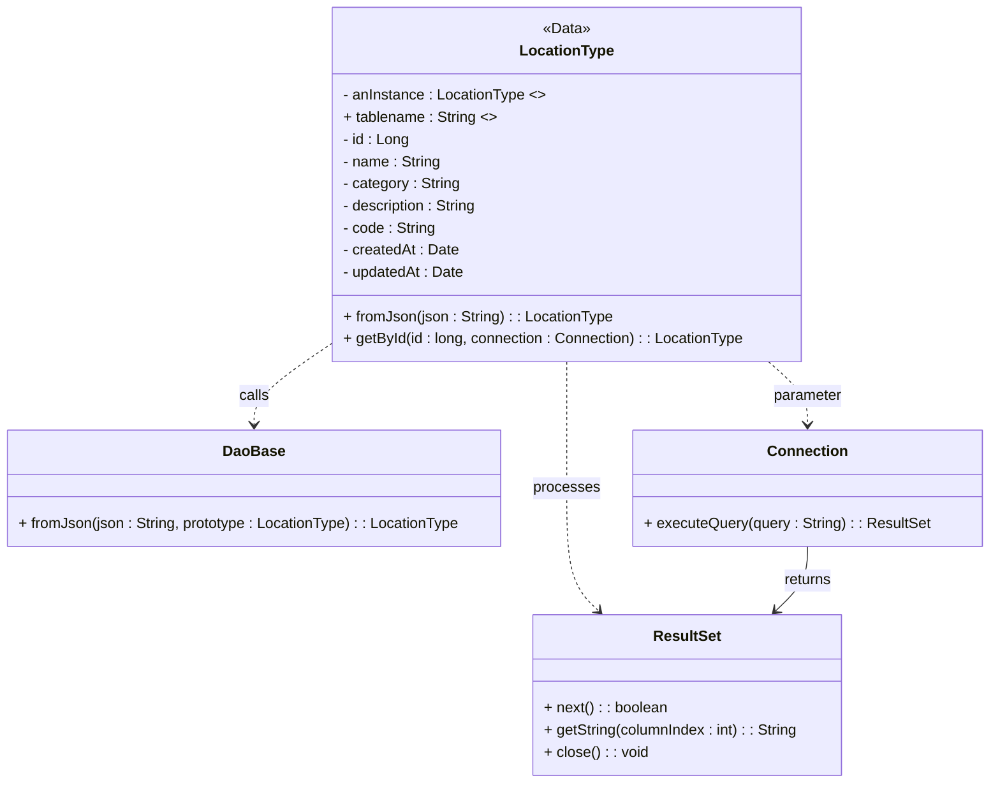

# Diagram: platform-java-lambdas/shipment/src/main/java/com/freightverify/shipment/datastore/postgresql/dao/LocationType.java

> Auto-generated by Obscura crawlers

## Mermaid

### SVG

<svg id="container" width="1064.015625" xmlns="http://www.w3.org/2000/svg" class="classDiagram" height="848" viewBox="0 0 1064.015625 848" role="graphics-document document" aria-roledescription="class"><g><defs><marker id="container_class-aggregationStart" class="marker aggregation class" refX="18" refY="7" markerWidth="190" markerHeight="240" orient="auto"><path d="M 18,7 L9,13 L1,7 L9,1 Z"></path></marker></defs><defs><marker id="container_class-aggregationEnd" class="marker aggregation class" refX="1" refY="7" markerWidth="20" markerHeight="28" orient="auto"><path d="M 18,7 L9,13 L1,7 L9,1 Z"></path></marker></defs><defs><marker id="container_class-extensionStart" class="marker extension class" refX="18" refY="7" markerWidth="190" markerHeight="240" orient="auto"><path d="M 1,7 L18,13 V 1 Z"></path></marker></defs><defs><marker id="container_class-extensionEnd" class="marker extension class" refX="1" refY="7" markerWidth="20" markerHeight="28" orient="auto"><path d="M 1,1 V 13 L18,7 Z"></path></marker></defs><defs><marker id="container_class-compositionStart" class="marker composition class" refX="18" refY="7" markerWidth="190" markerHeight="240" orient="auto"><path d="M 18,7 L9,13 L1,7 L9,1 Z"></path></marker></defs><defs><marker id="container_class-compositionEnd" class="marker composition class" refX="1" refY="7" markerWidth="20" markerHeight="28" orient="auto"><path d="M 18,7 L9,13 L1,7 L9,1 Z"></path></marker></defs><defs><marker id="container_class-dependencyStart" class="marker dependency class" refX="6" refY="7" markerWidth="190" markerHeight="240" orient="auto"><path d="M 5,7 L9,13 L1,7 L9,1 Z"></path></marker></defs><defs><marker id="container_class-dependencyEnd" class="marker dependency class" refX="13" refY="7" markerWidth="20" markerHeight="28" orient="auto"><path d="M 18,7 L9,13 L14,7 L9,1 Z"></path></marker></defs><defs><marker id="container_class-lollipopStart" class="marker lollipop class" refX="13" refY="7" markerWidth="190" markerHeight="240" orient="auto"><circle stroke="black" fill="transparent" cx="7" cy="7" r="6"></circle></marker></defs><defs><marker id="container_class-lollipopEnd" class="marker lollipop class" refX="1" refY="7" markerWidth="190" markerHeight="240" orient="auto"><circle stroke="black" fill="transparent" cx="7" cy="7" r="6"></circle></marker></defs><g class="root"><g class="clusters"></g><g class="edgePaths"><path d="M358.75,372.067L344.761,381.556C330.772,391.045,302.794,410.022,288.805,424.678C274.816,439.333,274.816,449.667,274.816,454.833L274.816,460" id="id_LocationType_DaoBase_1" class="edge-thickness-normal edge-pattern-dashed relation" style=";;;" data-edge="true" data-et="edge" data-id="id_LocationType_DaoBase_1" data-points="W3sieCI6MzU4Ljc1LCJ5IjozNzIuMDY3MjkzNzg1NTA2OX0seyJ4IjoyNzQuODE2NDA2MjUsInkiOjQyOX0seyJ4IjoyNzQuODE2NDA2MjUsInkiOjQ2Nn1d" marker-end="url(#container_class-dependencyEnd)"></path><path d="M828.058,392L834.984,398.167C841.91,404.333,855.762,416.667,862.687,428C869.613,439.333,869.613,449.667,869.613,454.833L869.613,460" id="id_LocationType_Connection_2" class="edge-thickness-normal edge-pattern-dashed relation" style=";;;" data-edge="true" data-et="edge" data-id="id_LocationType_Connection_2" data-points="W3sieCI6ODI4LjA1ODMzNzg4MjA5NjEsInkiOjM5Mn0seyJ4Ijo4NjkuNjEzMjgxMjUsInkiOjQyOX0seyJ4Ijo4NjkuNjEzMjgxMjUsInkiOjQ2Nn1d" marker-end="url(#container_class-dependencyEnd)"></path><path d="M612.422,392L612.422,398.167C612.422,404.333,612.422,416.667,612.422,439.5C612.422,462.333,612.422,495.667,612.422,529C612.422,562.333,612.422,595.667,618.097,617.806C623.773,639.945,635.123,650.89,640.799,656.363L646.474,661.835" id="id_LocationType_ResultSet_3" class="edge-thickness-normal edge-pattern-dashed relation" style=";;;" data-edge="true" data-et="edge" data-id="id_LocationType_ResultSet_3" data-points="W3sieCI6NjEyLjQyMTg3NSwieSI6MzkyfSx7IngiOjYxMi40MjE4NzUsInkiOjQyOX0seyJ4Ijo2MTIuNDIxODc1LCJ5Ijo1Mjl9LHsieCI6NjEyLjQyMTg3NSwieSI6NjI5fSx7IngiOjY1MC43OTMxNzM1MTMxMDQ5LCJ5Ijo2NjZ9XQ==" marker-end="url(#container_class-dependencyEnd)"></path><path d="M869.613,592L869.613,598.167C869.613,604.333,869.613,616.667,863.938,628.306C858.263,639.945,846.912,650.89,841.236,656.363L835.561,661.835" id="id_Connection_ResultSet_4" class="edge-thickness-normal edge-pattern-solid relation" style=";;;" data-edge="true" data-et="edge" data-id="id_Connection_ResultSet_4" data-points="W3sieCI6ODY5LjYxMzI4MTI1LCJ5Ijo1OTJ9LHsieCI6ODY5LjYxMzI4MTI1LCJ5Ijo2Mjl9LHsieCI6ODMxLjI0MTk4MjczNjg5NTEsInkiOjY2Nn1d" marker-end="url(#container_class-dependencyEnd)"></path></g><g class="edgeLabels"><g class="edgeLabel" transform="translate(274.81640625, 429)"><g class="label" data-id="id_LocationType_DaoBase_1" transform="translate(-16.4453125, -12)"><foreignObject width="32.890625" height="24">

calls

</foreignObject></g></g><g class="edgeLabel" transform="translate(869.61328125, 429)"><g class="label" data-id="id_LocationType_Connection_2" transform="translate(-37.6171875, -12)"><foreignObject width="75.234375" height="24">

parameter

</foreignObject></g></g><g class="edgeLabel" transform="translate(612.421875, 529)"><g class="label" data-id="id_LocationType_ResultSet_3" transform="translate(-35.7890625, -12)"><foreignObject width="71.578125" height="24">

processes

</foreignObject></g></g><g class="edgeLabel" transform="translate(869.61328125, 629)"><g class="label" data-id="id_Connection_ResultSet_4" transform="translate(-26.265625, -12)"><foreignObject width="52.53125" height="24">

returns

</foreignObject></g></g></g><g class="nodes"><g class="node default" id="classId-LocationType-0" transform="translate(612.421875, 200)"><g class="basic label-container"><path d="M-253.671875 -192 L253.671875 -192 L253.671875 192 L-253.671875 192" stroke="none" stroke-width="0" fill="#ECECFF" style=""></path><path d="M-253.671875 -192 C-57.49517739407935 -192, 138.6815202118413 -192, 253.671875 -192 M-253.671875 -192 C-66.93302241870455 -192, 119.8058301625909 -192, 253.671875 -192 M253.671875 -192 C253.671875 -54.034240939980066, 253.671875 83.93151812003987, 253.671875 192 M253.671875 -192 C253.671875 -41.697579662972856, 253.671875 108.60484067405429, 253.671875 192 M253.671875 192 C136.28072586966806 192, 18.88957673933615 192, -253.671875 192 M253.671875 192 C124.44749796950546 192, -4.776879060989074 192, -253.671875 192 M-253.671875 192 C-253.671875 57.6363576139841, -253.671875 -76.7272847720318, -253.671875 -192 M-253.671875 192 C-253.671875 100.72835809885355, -253.671875 9.456716197707095, -253.671875 -192" stroke="#9370DB" stroke-width="1.3" fill="none" stroke-dasharray="0 0" style=""></path></g><g class="annotation-group text" transform="translate(-25.7421875, -168)"><g class="label" style="" transform="translate(0,-12)"><foreignObject width="51.484375" height="24">

«Data»

</foreignObject></g></g><g class="label-group text" transform="translate(-48.6875, -144)"><g class="label" style="font-weight: bolder" transform="translate(0,-12)"><foreignObject width="97.375" height="24">

LocationType

</foreignObject></g></g><g class="members-group text" transform="translate(-241.671875, -96)"><g class="label" style="" transform="translate(0,-12)"><foreignObject width="218.53125" height="24">

- anInstance : LocationType &lt;&gt;

</foreignObject></g><g class="label" style="" transform="translate(0,12)"><foreignObject width="165.390625" height="24">

+ tablename : String &lt;&gt;

</foreignObject></g><g class="label" style="" transform="translate(0,36)"><foreignObject width="71.703125" height="24">

- id : Long

</foreignObject></g><g class="label" style="" transform="translate(0,60)"><foreignObject width="106.40625" height="24">

- name : String

</foreignObject></g><g class="label" style="" transform="translate(0,84)"><foreignObject width="127.796875" height="24">

- category : String

</foreignObject></g><g class="label" style="" transform="translate(0,108)"><foreignObject width="148.5" height="24">

- description : String

</foreignObject></g><g class="label" style="" transform="translate(0,132)"><foreignObject width="100.859375" height="24">

- code : String

</foreignObject></g><g class="label" style="" transform="translate(0,156)"><foreignObject width="125.5" height="24">

- createdAt : Date

</foreignObject></g><g class="label" style="" transform="translate(0,180)"><foreignObject width="131.96875" height="24">

- updatedAt : Date

</foreignObject></g></g><g class="methods-group text" transform="translate(-241.671875, 144)"><g class="label" style="" transform="translate(0,-12)"><foreignObject width="290.46875" height="24">

+ fromJson(json : String) : : LocationType

</foreignObject></g><g class="label" style="" transform="translate(0,12)"><foreignObject width="434.65625" height="24">

+ getById(id : long, connection : Connection) : : LocationType

</foreignObject></g></g><g class="divider" style=""><path d="M-253.671875 -120 C-149.486567085938 -120, -45.301259171875984 -120, 253.671875 -120 M-253.671875 -120 C-134.23221390130954 -120, -14.79255280261907 -120, 253.671875 -120" stroke="#9370DB" stroke-width="1.3" fill="none" stroke-dasharray="0 0" style=""></path></g><g class="divider" style=""><path d="M-253.671875 120 C-113.66577741960143 120, 26.340320160797148 120, 253.671875 120 M-253.671875 120 C-140.44229455697956 120, -27.212714113959095 120, 253.671875 120" stroke="#9370DB" stroke-width="1.3" fill="none" stroke-dasharray="0 0" style=""></path></g></g><g class="node default" id="classId-DaoBase-1" transform="translate(274.81640625, 529)"><g class="basic label-container"><path d="M-266.81640625 -63 L266.81640625 -63 L266.81640625 63 L-266.81640625 63" stroke="none" stroke-width="0" fill="#ECECFF" style=""></path><path d="M-266.81640625 -63 C-146.73765371230553 -63, -26.65890117461106 -63, 266.81640625 -63 M-266.81640625 -63 C-57.568684633811245 -63, 151.6790369823775 -63, 266.81640625 -63 M266.81640625 -63 C266.81640625 -24.850190028395787, 266.81640625 13.299619943208427, 266.81640625 63 M266.81640625 -63 C266.81640625 -15.994256795882187, 266.81640625 31.011486408235626, 266.81640625 63 M266.81640625 63 C90.77263305358278 63, -85.27114014283444 63, -266.81640625 63 M266.81640625 63 C58.397729276346666 63, -150.02094769730667 63, -266.81640625 63 M-266.81640625 63 C-266.81640625 12.983969972482072, -266.81640625 -37.032060055035856, -266.81640625 -63 M-266.81640625 63 C-266.81640625 33.16784391233221, -266.81640625 3.3356878246644186, -266.81640625 -63" stroke="#9370DB" stroke-width="1.3" fill="none" stroke-dasharray="0 0" style=""></path></g><g class="annotation-group text" transform="translate(0, -39)"></g><g class="label-group text" transform="translate(-31.7109375, -39)"><g class="label" style="font-weight: bolder" transform="translate(0,-12)"><foreignObject width="63.421875" height="24">

DaoBase

</foreignObject></g></g><g class="members-group text" transform="translate(-254.81640625, 9)"></g><g class="methods-group text" transform="translate(-254.81640625, 39)"><g class="label" style="" transform="translate(0,-12)"><foreignObject width="477.921875" height="24">

+ fromJson(json : String, prototype : LocationType) : : LocationType

</foreignObject></g></g><g class="divider" style=""><path d="M-266.81640625 -15 C-56.54086748311269 -15, 153.73467128377462 -15, 266.81640625 -15 M-266.81640625 -15 C-64.47428622357396 -15, 137.8678338028521 -15, 266.81640625 -15" stroke="#9370DB" stroke-width="1.3" fill="none" stroke-dasharray="0 0" style=""></path></g><g class="divider" style=""><path d="M-266.81640625 9 C-57.49290849092105 9, 151.8305892681579 9, 266.81640625 9 M-266.81640625 9 C-59.385580935711886 9, 148.04524437857623 9, 266.81640625 9" stroke="#9370DB" stroke-width="1.3" fill="none" stroke-dasharray="0 0" style=""></path></g></g><g class="node default" id="classId-Connection-2" transform="translate(869.61328125, 529)"><g class="basic label-container"><path d="M-186.40234375 -63 L186.40234375 -63 L186.40234375 63 L-186.40234375 63" stroke="none" stroke-width="0" fill="#ECECFF" style=""></path><path d="M-186.40234375 -63 C-75.19257855549536 -63, 36.01718663900928 -63, 186.40234375 -63 M-186.40234375 -63 C-64.5729660716942 -63, 57.25641160661161 -63, 186.40234375 -63 M186.40234375 -63 C186.40234375 -25.24864907988119, 186.40234375 12.50270184023762, 186.40234375 63 M186.40234375 -63 C186.40234375 -14.776600731213271, 186.40234375 33.44679853757346, 186.40234375 63 M186.40234375 63 C104.83810025944368 63, 23.273856768887356 63, -186.40234375 63 M186.40234375 63 C89.67313353717397 63, -7.056076675652065 63, -186.40234375 63 M-186.40234375 63 C-186.40234375 21.855283446148, -186.40234375 -19.289433107704, -186.40234375 -63 M-186.40234375 63 C-186.40234375 12.826603136651883, -186.40234375 -37.346793726696234, -186.40234375 -63" stroke="#9370DB" stroke-width="1.3" fill="none" stroke-dasharray="0 0" style=""></path></g><g class="annotation-group text" transform="translate(0, -39)"></g><g class="label-group text" transform="translate(-41.2265625, -39)"><g class="label" style="font-weight: bolder" transform="translate(0,-12)"><foreignObject width="82.453125" height="24">

Connection

</foreignObject></g></g><g class="members-group text" transform="translate(-174.40234375, 9)"></g><g class="methods-group text" transform="translate(-174.40234375, 39)"><g class="label" style="" transform="translate(0,-12)"><foreignObject width="307.578125" height="24">

+ executeQuery(query : String) : : ResultSet

</foreignObject></g></g><g class="divider" style=""><path d="M-186.40234375 -15 C-104.56688527749704 -15, -22.731426804994072 -15, 186.40234375 -15 M-186.40234375 -15 C-51.405068708577915 -15, 83.59220633284417 -15, 186.40234375 -15" stroke="#9370DB" stroke-width="1.3" fill="none" stroke-dasharray="0 0" style=""></path></g><g class="divider" style=""><path d="M-186.40234375 9 C-89.19148429689297 9, 8.019375156214068 9, 186.40234375 9 M-186.40234375 9 C-100.00997439055388 9, -13.617605031107757 9, 186.40234375 9" stroke="#9370DB" stroke-width="1.3" fill="none" stroke-dasharray="0 0" style=""></path></g></g><g class="node default" id="classId-ResultSet-3" transform="translate(741.017578125, 753)"><g class="basic label-container"><path d="M-168.140625 -87 L168.140625 -87 L168.140625 87 L-168.140625 87" stroke="none" stroke-width="0" fill="#ECECFF" style=""></path><path d="M-168.140625 -87 C-80.31510136901886 -87, 7.510422261962276 -87, 168.140625 -87 M-168.140625 -87 C-46.71192122104975 -87, 74.7167825579005 -87, 168.140625 -87 M168.140625 -87 C168.140625 -27.362057086506326, 168.140625 32.27588582698735, 168.140625 87 M168.140625 -87 C168.140625 -31.171148827202323, 168.140625 24.657702345595354, 168.140625 87 M168.140625 87 C90.86774578040416 87, 13.594866560808327 87, -168.140625 87 M168.140625 87 C88.42769477273468 87, 8.714764545469365 87, -168.140625 87 M-168.140625 87 C-168.140625 44.981093909652905, -168.140625 2.962187819305811, -168.140625 -87 M-168.140625 87 C-168.140625 33.43364080814625, -168.140625 -20.1327183837075, -168.140625 -87" stroke="#9370DB" stroke-width="1.3" fill="none" stroke-dasharray="0 0" style=""></path></g><g class="annotation-group text" transform="translate(0, -63)"></g><g class="label-group text" transform="translate(-35.21875, -63)"><g class="label" style="font-weight: bolder" transform="translate(0,-12)"><foreignObject width="70.4375" height="24">

ResultSet

</foreignObject></g></g><g class="members-group text" transform="translate(-156.140625, -15)"></g><g class="methods-group text" transform="translate(-156.140625, 15)"><g class="label" style="" transform="translate(0,-12)"><foreignObject width="133.921875" height="24">

+ next() : : boolean

</foreignObject></g><g class="label" style="" transform="translate(0,12)"><foreignObject width="277.0625" height="24">

+ getString(columnIndex : int) : : String

</foreignObject></g><g class="label" style="" transform="translate(0,36)"><foreignObject width="112.03125" height="24">

+ close() : : void

</foreignObject></g></g><g class="divider" style=""><path d="M-168.140625 -39 C-36.46715684612698 -39, 95.20631130774603 -39, 168.140625 -39 M-168.140625 -39 C-36.43022487257153 -39, 95.28017525485694 -39, 168.140625 -39" stroke="#9370DB" stroke-width="1.3" fill="none" stroke-dasharray="0 0" style=""></path></g><g class="divider" style=""><path d="M-168.140625 -15 C-76.04025226140918 -15, 16.06012047718164 -15, 168.140625 -15 M-168.140625 -15 C-61.17709882684511 -15, 45.78642734630978 -15, 168.140625 -15" stroke="#9370DB" stroke-width="1.3" fill="none" stroke-dasharray="0 0" style=""></path></g></g></g></g></g></svg>
