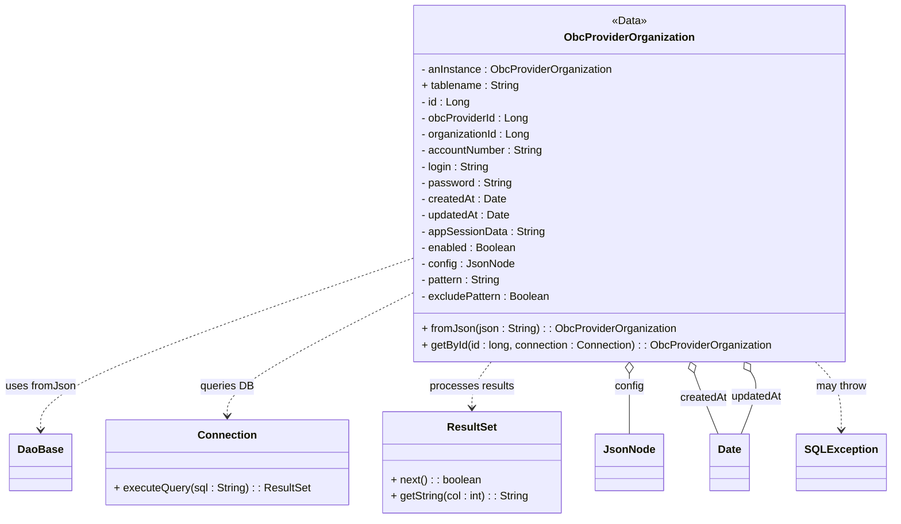
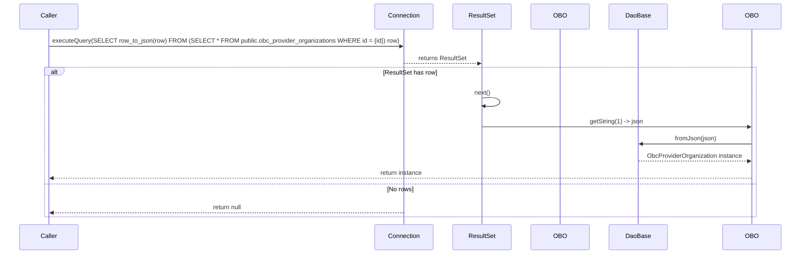

# Diagram: platform-java-lambdas/shipment/src/main/java/com/freightverify/shipment/datastore/postgresql/dao/ObcProviderOrganization.java

> Auto-generated by Obscura crawlers

## Diagram 1

### SVG

<svg id="container" width="1298.5546875" xmlns="http://www.w3.org/2000/svg" class="classDiagram" height="768" viewBox="0 0 1298.5546875 768" role="graphics-document document" aria-roledescription="class"><g><defs><marker id="container_class-aggregationStart" class="marker aggregation class" refX="18" refY="7" markerWidth="190" markerHeight="240" orient="auto"><path d="M 18,7 L9,13 L1,7 L9,1 Z"></path></marker></defs><defs><marker id="container_class-aggregationEnd" class="marker aggregation class" refX="1" refY="7" markerWidth="20" markerHeight="28" orient="auto"><path d="M 18,7 L9,13 L1,7 L9,1 Z"></path></marker></defs><defs><marker id="container_class-extensionStart" class="marker extension class" refX="18" refY="7" markerWidth="190" markerHeight="240" orient="auto"><path d="M 1,7 L18,13 V 1 Z"></path></marker></defs><defs><marker id="container_class-extensionEnd" class="marker extension class" refX="1" refY="7" markerWidth="20" markerHeight="28" orient="auto"><path d="M 1,1 V 13 L18,7 Z"></path></marker></defs><defs><marker id="container_class-compositionStart" class="marker composition class" refX="18" refY="7" markerWidth="190" markerHeight="240" orient="auto"><path d="M 18,7 L9,13 L1,7 L9,1 Z"></path></marker></defs><defs><marker id="container_class-compositionEnd" class="marker composition class" refX="1" refY="7" markerWidth="20" markerHeight="28" orient="auto"><path d="M 18,7 L9,13 L1,7 L9,1 Z"></path></marker></defs><defs><marker id="container_class-dependencyStart" class="marker dependency class" refX="6" refY="7" markerWidth="190" markerHeight="240" orient="auto"><path d="M 5,7 L9,13 L1,7 L9,1 Z"></path></marker></defs><defs><marker id="container_class-dependencyEnd" class="marker dependency class" refX="13" refY="7" markerWidth="20" markerHeight="28" orient="auto"><path d="M 18,7 L9,13 L14,7 L9,1 Z"></path></marker></defs><defs><marker id="container_class-lollipopStart" class="marker lollipop class" refX="13" refY="7" markerWidth="190" markerHeight="240" orient="auto"><circle stroke="black" fill="transparent" cx="7" cy="7" r="6"></circle></marker></defs><defs><marker id="container_class-lollipopEnd" class="marker lollipop class" refX="1" refY="7" markerWidth="190" markerHeight="240" orient="auto"><circle stroke="black" fill="transparent" cx="7" cy="7" r="6"></circle></marker></defs><g class="root"><g class="clusters"></g><g class="edgePaths"><path d="M598.703,383.595L508.786,415.163C418.87,446.73,239.036,509.865,149.12,552.099C59.203,594.333,59.203,615.667,59.203,626.333L59.203,637" id="id_ObcProviderOrganization_DaoBase_1" class="edge-thickness-normal edge-pattern-dashed relation" style=";;;" data-edge="true" data-et="edge" data-id="id_ObcProviderOrganization_DaoBase_1" data-points="W3sieCI6NTk4LjcwMzEyNSwieSI6MzgzLjU5NTE1NDEzMjgzNzY1fSx7IngiOjU5LjIwMzEyNSwieSI6NTczfSx7IngiOjU5LjIwMzEyNSwieSI6NjQzfV0=" marker-end="url(#container_class-dependencyEnd)"></path><path d="M598.703,434.935L553.812,457.946C508.921,480.957,419.138,526.978,374.247,557.156C329.355,587.333,329.355,601.667,329.355,608.833L329.355,616" id="id_ObcProviderOrganization_Connection_2" class="edge-thickness-normal edge-pattern-dashed relation" style=";;;" data-edge="true" data-et="edge" data-id="id_ObcProviderOrganization_Connection_2" data-points="W3sieCI6NTk4LjcwMzEyNSwieSI6NDM0LjkzNTI5NDM5MTU1OTc1fSx7IngiOjMyOS4zNTU0Njg3NSwieSI6NTczfSx7IngiOjMyOS4zNTU0Njg3NSwieSI6NjIyfV0=" marker-end="url(#container_class-dependencyEnd)"></path><path d="M715.871,536L711.182,542.167C706.494,548.333,697.118,560.667,692.43,572C687.742,583.333,687.742,593.667,687.742,598.833L687.742,604" id="id_ObcProviderOrganization_ResultSet_3" class="edge-thickness-normal edge-pattern-dashed relation" style=";;;" data-edge="true" data-et="edge" data-id="id_ObcProviderOrganization_ResultSet_3" data-points="W3sieCI6NzE1Ljg3MDU2MTY2OTQzNTIsInkiOjUzNn0seyJ4Ijo2ODcuNzQyMTg3NSwieSI6NTczfSx7IngiOjY4Ny43NDIxODc1LCJ5Ijo2MTB9XQ==" marker-end="url(#container_class-dependencyEnd)"></path><path d="M916.57,553.25L916.57,556.542C916.57,559.833,916.57,566.417,916.57,581.375C916.57,596.333,916.57,619.667,916.57,631.333L916.57,643" id="id_ObcProviderOrganization_JsonNode_4" class="edge-thickness-normal edge-pattern-solid relation" style=";;;" data-edge="true" data-et="edge" data-id="id_ObcProviderOrganization_JsonNode_4" data-points="W3sieCI6OTE2LjU3MDMxMjUsInkiOjUzNn0seyJ4Ijo5MTYuNTcwMzEyNSwieSI6NTczfSx7IngiOjkxNi41NzAzMTI1LCJ5Ijo2NDN9XQ==" marker-start="url(#container_class-aggregationStart)"></path><path d="M1010.755,552.352L1011.911,555.793C1013.067,559.235,1015.379,566.117,1021.36,581.225C1027.34,596.333,1036.988,619.667,1041.813,631.333L1046.637,643" id="id_ObcProviderOrganization_Date_5" class="edge-thickness-normal edge-pattern-solid relation" style=";;;" data-edge="true" data-et="edge" data-id="id_ObcProviderOrganization_Date_5" data-points="W3sieCI6MTAwNS4yNjEyMzg1Nzk3MzQzLCJ5Ijo1MzZ9LHsieCI6MTAxNy42OTE0MDYyNSwieSI6NTczfSx7IngiOjEwNDYuNjM2NzE4NzUsInkiOjY0M31d" marker-start="url(#container_class-aggregationStart)"></path><path d="M1095.837,550.505L1098.25,554.254C1100.663,558.003,1105.49,565.502,1103.079,580.917C1100.668,596.333,1091.02,619.667,1086.195,631.333L1081.371,643" id="id_ObcProviderOrganization_Date_6" class="edge-thickness-normal edge-pattern-solid relation" style=";;;" data-edge="true" data-et="edge" data-id="id_ObcProviderOrganization_Date_6" data-points="W3sieCI6MTA4Ni41MDA0NDEyMzc1NDE1LCJ5Ijo1MzZ9LHsieCI6MTExMC4zMTY0MDYyNSwieSI6NTczfSx7IngiOjEwODEuMzcxMDkzNzUsInkiOjY0M31d" marker-start="url(#container_class-aggregationStart)"></path><path d="M1190.294,536L1196.687,542.167C1203.081,548.333,1215.869,560.667,1222.262,577.5C1228.656,594.333,1228.656,615.667,1228.656,626.333L1228.656,637" id="id_ObcProviderOrganization_SQLException_7" class="edge-thickness-normal edge-pattern-dashed relation" style=";;;" data-edge="true" data-et="edge" data-id="id_ObcProviderOrganization_SQLException_7" data-points="W3sieCI6MTE5MC4yOTM1MjY3ODU3MTQyLCJ5Ijo1MzZ9LHsieCI6MTIyOC42NTYyNSwieSI6NTczfSx7IngiOjEyMjguNjU2MjUsInkiOjY0M31d" marker-end="url(#container_class-dependencyEnd)"></path></g><g class="edgeLabels"><g class="edgeLabel" transform="translate(59.203125, 573)"><g class="label" data-id="id_ObcProviderOrganization_DaoBase_1" transform="translate(-51.203125, -12)"><foreignObject width="102.40625" height="24">

uses fromJson

</foreignObject></g></g><g class="edgeLabel" transform="translate(329.35546875, 573)"><g class="label" data-id="id_ObcProviderOrganization_Connection_2" transform="translate(-39.3828125, -12)"><foreignObject width="78.765625" height="24">

queries DB

</foreignObject></g></g><g class="edgeLabel" transform="translate(687.7421875, 573)"><g class="label" data-id="id_ObcProviderOrganization_ResultSet_3" transform="translate(-62.4765625, -12)"><foreignObject width="124.953125" height="24">

processes results

</foreignObject></g></g><g class="edgeLabel" transform="translate(916.5703125, 573)"><g class="label" data-id="id_ObcProviderOrganization_JsonNode_4" transform="translate(-21.7890625, -12)"><foreignObject width="43.578125" height="24">

config

</foreignObject></g></g><g class="edgeLabel" transform="translate(1024.7065, 589.96498)"><g class="label" data-id="id_ObcProviderOrganization_Date_5" transform="translate(-34.6953125, -12)"><foreignObject width="69.390625" height="24">

createdAt

</foreignObject></g></g><g class="edgeLabel" transform="translate(1104.25091, 587.66851)"><g class="label" data-id="id_ObcProviderOrganization_Date_6" transform="translate(-37.9296875, -12)"><foreignObject width="75.859375" height="24">

updatedAt

</foreignObject></g></g><g class="edgeLabel" transform="translate(1228.65625, 573)"><g class="label" data-id="id_ObcProviderOrganization_SQLException_7" transform="translate(-37.9765625, -12)"><foreignObject width="75.953125" height="24">

may throw

</foreignObject></g></g></g><g class="nodes"><g class="node default" id="classId-ObcProviderOrganization-0" transform="translate(916.5703125, 272)"><g class="basic label-container"><path d="M-317.8671875 -264 L317.8671875 -264 L317.8671875 264 L-317.8671875 264" stroke="none" stroke-width="0" fill="#ECECFF" style=""></path><path d="M-317.8671875 -264 C-74.15104494870332 -264, 169.56509760259337 -264, 317.8671875 -264 M-317.8671875 -264 C-130.47719354235585 -264, 56.9128004152883 -264, 317.8671875 -264 M317.8671875 -264 C317.8671875 -78.94132229278313, 317.8671875 106.11735541443375, 317.8671875 264 M317.8671875 -264 C317.8671875 -143.16979400395851, 317.8671875 -22.33958800791703, 317.8671875 264 M317.8671875 264 C126.83854271791589 264, -64.19010206416823 264, -317.8671875 264 M317.8671875 264 C82.31089926096436 264, -153.24538897807128 264, -317.8671875 264 M-317.8671875 264 C-317.8671875 141.4528174242571, -317.8671875 18.90563484851421, -317.8671875 -264 M-317.8671875 264 C-317.8671875 63.31064815416573, -317.8671875 -137.37870369166853, -317.8671875 -264" stroke="#9370DB" stroke-width="1.3" fill="none" stroke-dasharray="0 0" style=""></path></g><g class="annotation-group text" transform="translate(-25.7421875, -240)"><g class="label" style="" transform="translate(0,-12)"><foreignObject width="51.484375" height="24">

«Data»

</foreignObject></g></g><g class="label-group text" transform="translate(-91.828125, -216)"><g class="label" style="font-weight: bolder" transform="translate(0,-12)"><foreignObject width="183.65625" height="24">

ObcProviderOrganization

</foreignObject></g></g><g class="members-group text" transform="translate(-305.8671875, -168)"><g class="label" style="" transform="translate(0,-12)"><foreignObject width="283.5625" height="24">

- anInstance : ObcProviderOrganization

</foreignObject></g><g class="label" style="" transform="translate(0,12)"><foreignObject width="145.140625" height="24">

+ tablename : String

</foreignObject></g><g class="label" style="" transform="translate(0,36)"><foreignObject width="71.703125" height="24">

- id : Long

</foreignObject></g><g class="label" style="" transform="translate(0,60)"><foreignObject width="159.203125" height="24">

- obcProviderId : Long

</foreignObject></g><g class="label" style="" transform="translate(0,84)"><foreignObject width="162.265625" height="24">

- organizationId : Long

</foreignObject></g><g class="label" style="" transform="translate(0,108)"><foreignObject width="181.421875" height="24">

- accountNumber : String

</foreignObject></g><g class="label" style="" transform="translate(0,132)"><foreignObject width="102.0625" height="24">

- login : String

</foreignObject></g><g class="label" style="" transform="translate(0,156)"><foreignObject width="134.53125" height="24">

- password : String

</foreignObject></g><g class="label" style="" transform="translate(0,180)"><foreignObject width="125.5" height="24">

- createdAt : Date

</foreignObject></g><g class="label" style="" transform="translate(0,204)"><foreignObject width="131.96875" height="24">

- updatedAt : Date

</foreignObject></g><g class="label" style="" transform="translate(0,228)"><foreignObject width="182.28125" height="24">

- appSessionData : String

</foreignObject></g><g class="label" style="" transform="translate(0,252)"><foreignObject width="141.875" height="24">

- enabled : Boolean

</foreignObject></g><g class="label" style="" transform="translate(0,276)"><foreignObject width="136.21875" height="24">

- config : JsonNode

</foreignObject></g><g class="label" style="" transform="translate(0,300)"><foreignObject width="119.53125" height="24">

- pattern : String

</foreignObject></g><g class="label" style="" transform="translate(0,324)"><foreignObject width="191.515625" height="24">

- excludePattern : Boolean

</foreignObject></g></g><g class="methods-group text" transform="translate(-305.8671875, 216)"><g class="label" style="" transform="translate(0,-12)"><foreignObject width="375.734375" height="24">

+ fromJson(json : String) : : ObcProviderOrganization

</foreignObject></g><g class="label" style="" transform="translate(0,12)"><foreignObject width="519.90625" height="24">

+ getById(id : long, connection : Connection) : : ObcProviderOrganization

</foreignObject></g></g><g class="divider" style=""><path d="M-317.8671875 -192 C-107.47274823793569 -192, 102.92169102412862 -192, 317.8671875 -192 M-317.8671875 -192 C-153.43462972412078 -192, 10.997928051758436 -192, 317.8671875 -192" stroke="#9370DB" stroke-width="1.3" fill="none" stroke-dasharray="0 0" style=""></path></g><g class="divider" style=""><path d="M-317.8671875 192 C-91.81048922853469 192, 134.24620904293062 192, 317.8671875 192 M-317.8671875 192 C-137.80358011476235 192, 42.26002727047529 192, 317.8671875 192" stroke="#9370DB" stroke-width="1.3" fill="none" stroke-dasharray="0 0" style=""></path></g></g><g class="node default" id="classId-DaoBase-1" transform="translate(59.203125, 685)"><g class="basic label-container"><path d="M-43.7109375 -42 L43.7109375 -42 L43.7109375 42 L-43.7109375 42" stroke="none" stroke-width="0" fill="#ECECFF" style=""></path><path d="M-43.7109375 -42 C-12.257394420808566 -42, 19.196148658382867 -42, 43.7109375 -42 M-43.7109375 -42 C-8.978742036112116 -42, 25.753453427775767 -42, 43.7109375 -42 M43.7109375 -42 C43.7109375 -11.644070743126164, 43.7109375 18.71185851374767, 43.7109375 42 M43.7109375 -42 C43.7109375 -21.322550896079235, 43.7109375 -0.6451017921584707, 43.7109375 42 M43.7109375 42 C16.593702154219503 42, -10.523533191560993 42, -43.7109375 42 M43.7109375 42 C20.335580796344466 42, -3.0397759073110677 42, -43.7109375 42 M-43.7109375 42 C-43.7109375 16.82339188265386, -43.7109375 -8.353216234692283, -43.7109375 -42 M-43.7109375 42 C-43.7109375 16.14003822360732, -43.7109375 -9.71992355278536, -43.7109375 -42" stroke="#9370DB" stroke-width="1.3" fill="none" stroke-dasharray="0 0" style=""></path></g><g class="annotation-group text" transform="translate(0, -18)"></g><g class="label-group text" transform="translate(-31.7109375, -18)"><g class="label" style="font-weight: bolder" transform="translate(0,-12)"><foreignObject width="63.421875" height="24">

DaoBase

</foreignObject></g></g><g class="members-group text" transform="translate(-31.7109375, 30)"></g><g class="methods-group text" transform="translate(-31.7109375, 60)"></g><g class="divider" style=""><path d="M-43.7109375 6 C-16.768446544597666 6, 10.174044410804669 6, 43.7109375 6 M-43.7109375 6 C-21.07787495367629 6, 1.555187592647421 6, 43.7109375 6" stroke="#9370DB" stroke-width="1.3" fill="none" stroke-dasharray="0 0" style=""></path></g><g class="divider" style=""><path d="M-43.7109375 24 C-14.18132189521548 24, 15.348293709569042 24, 43.7109375 24 M-43.7109375 24 C-15.221566142586763 24, 13.267805214826474 24, 43.7109375 24" stroke="#9370DB" stroke-width="1.3" fill="none" stroke-dasharray="0 0" style=""></path></g></g><g class="node default" id="classId-Connection-2" transform="translate(329.35546875, 685)"><g class="basic label-container"><path d="M-176.44140625 -63 L176.44140625 -63 L176.44140625 63 L-176.44140625 63" stroke="none" stroke-width="0" fill="#ECECFF" style=""></path><path d="M-176.44140625 -63 C-48.65919968390571 -63, 79.12300688218858 -63, 176.44140625 -63 M-176.44140625 -63 C-102.57716373314744 -63, -28.712921216294887 -63, 176.44140625 -63 M176.44140625 -63 C176.44140625 -17.38118697273599, 176.44140625 28.23762605452802, 176.44140625 63 M176.44140625 -63 C176.44140625 -16.926393326576033, 176.44140625 29.147213346847934, 176.44140625 63 M176.44140625 63 C97.60839138849354 63, 18.77537652698709 63, -176.44140625 63 M176.44140625 63 C79.39552685575676 63, -17.650352538486487 63, -176.44140625 63 M-176.44140625 63 C-176.44140625 35.596529626862434, -176.44140625 8.193059253724876, -176.44140625 -63 M-176.44140625 63 C-176.44140625 19.109079904021165, -176.44140625 -24.78184019195767, -176.44140625 -63" stroke="#9370DB" stroke-width="1.3" fill="none" stroke-dasharray="0 0" style=""></path></g><g class="annotation-group text" transform="translate(0, -39)"></g><g class="label-group text" transform="translate(-41.2265625, -39)"><g class="label" style="font-weight: bolder" transform="translate(0,-12)"><foreignObject width="82.453125" height="24">

Connection

</foreignObject></g></g><g class="members-group text" transform="translate(-164.44140625, 9)"></g><g class="methods-group text" transform="translate(-164.44140625, 39)"><g class="label" style="" transform="translate(0,-12)"><foreignObject width="287.65625" height="24">

+ executeQuery(sql : String) : : ResultSet

</foreignObject></g></g><g class="divider" style=""><path d="M-176.44140625 -15 C-83.02083844959115 -15, 10.399729350817694 -15, 176.44140625 -15 M-176.44140625 -15 C-39.84984534447838 -15, 96.74171556104324 -15, 176.44140625 -15" stroke="#9370DB" stroke-width="1.3" fill="none" stroke-dasharray="0 0" style=""></path></g><g class="divider" style=""><path d="M-176.44140625 9 C-48.3044562659158 9, 79.8324937181684 9, 176.44140625 9 M-176.44140625 9 C-54.65581877574074 9, 67.12976869851852 9, 176.44140625 9" stroke="#9370DB" stroke-width="1.3" fill="none" stroke-dasharray="0 0" style=""></path></g></g><g class="node default" id="classId-ResultSet-3" transform="translate(687.7421875, 685)"><g class="basic label-container"><path d="M-131.9453125 -75 L131.9453125 -75 L131.9453125 75 L-131.9453125 75" stroke="none" stroke-width="0" fill="#ECECFF" style=""></path><path d="M-131.9453125 -75 C-55.736020733794135 -75, 20.47327103241173 -75, 131.9453125 -75 M-131.9453125 -75 C-48.84076499339385 -75, 34.263782513212306 -75, 131.9453125 -75 M131.9453125 -75 C131.9453125 -28.814927413246565, 131.9453125 17.37014517350687, 131.9453125 75 M131.9453125 -75 C131.9453125 -31.945392313750695, 131.9453125 11.10921537249861, 131.9453125 75 M131.9453125 75 C32.362707677141984 75, -67.21989714571603 75, -131.9453125 75 M131.9453125 75 C45.902634179411976 75, -40.14004414117605 75, -131.9453125 75 M-131.9453125 75 C-131.9453125 19.24263829391994, -131.9453125 -36.51472341216012, -131.9453125 -75 M-131.9453125 75 C-131.9453125 38.24485270862922, -131.9453125 1.4897054172584347, -131.9453125 -75" stroke="#9370DB" stroke-width="1.3" fill="none" stroke-dasharray="0 0" style=""></path></g><g class="annotation-group text" transform="translate(0, -51)"></g><g class="label-group text" transform="translate(-35.21875, -51)"><g class="label" style="font-weight: bolder" transform="translate(0,-12)"><foreignObject width="70.4375" height="24">

ResultSet

</foreignObject></g></g><g class="members-group text" transform="translate(-119.9453125, -3)"></g><g class="methods-group text" transform="translate(-119.9453125, 27)"><g class="label" style="" transform="translate(0,-12)"><foreignObject width="133.921875" height="24">

+ next() : : boolean

</foreignObject></g><g class="label" style="" transform="translate(0,12)"><foreignObject width="204.671875" height="24">

+ getString(col : int) : : String

</foreignObject></g></g><g class="divider" style=""><path d="M-131.9453125 -27 C-50.86036492407061 -27, 30.224582651858782 -27, 131.9453125 -27 M-131.9453125 -27 C-36.034624229344104 -27, 59.87606404131179 -27, 131.9453125 -27" stroke="#9370DB" stroke-width="1.3" fill="none" stroke-dasharray="0 0" style=""></path></g><g class="divider" style=""><path d="M-131.9453125 -3 C-41.133752673219675 -3, 49.67780715356065 -3, 131.9453125 -3 M-131.9453125 -3 C-77.01563399645214 -3, -22.085955492904276 -3, 131.9453125 -3" stroke="#9370DB" stroke-width="1.3" fill="none" stroke-dasharray="0 0" style=""></path></g></g><g class="node default" id="classId-JsonNode-4" transform="translate(916.5703125, 685)"><g class="basic label-container"><path d="M-46.8828125 -42 L46.8828125 -42 L46.8828125 42 L-46.8828125 42" stroke="none" stroke-width="0" fill="#ECECFF" style=""></path><path d="M-46.8828125 -42 C-25.76984007822661 -42, -4.6568676564532225 -42, 46.8828125 -42 M-46.8828125 -42 C-17.57287874282148 -42, 11.73705501435704 -42, 46.8828125 -42 M46.8828125 -42 C46.8828125 -10.259421783340763, 46.8828125 21.481156433318475, 46.8828125 42 M46.8828125 -42 C46.8828125 -9.670946224399351, 46.8828125 22.658107551201297, 46.8828125 42 M46.8828125 42 C12.519315156447789 42, -21.844182187104423 42, -46.8828125 42 M46.8828125 42 C10.169317785392373 42, -26.544176929215254 42, -46.8828125 42 M-46.8828125 42 C-46.8828125 10.442015540328644, -46.8828125 -21.115968919342713, -46.8828125 -42 M-46.8828125 42 C-46.8828125 17.63108253603716, -46.8828125 -6.737834927925682, -46.8828125 -42" stroke="#9370DB" stroke-width="1.3" fill="none" stroke-dasharray="0 0" style=""></path></g><g class="annotation-group text" transform="translate(0, -18)"></g><g class="label-group text" transform="translate(-34.8828125, -18)"><g class="label" style="font-weight: bolder" transform="translate(0,-12)"><foreignObject width="69.765625" height="24">

JsonNode

</foreignObject></g></g><g class="members-group text" transform="translate(-34.8828125, 30)"></g><g class="methods-group text" transform="translate(-34.8828125, 60)"></g><g class="divider" style=""><path d="M-46.8828125 6 C-15.09219696708455 6, 16.6984185658309 6, 46.8828125 6 M-46.8828125 6 C-15.399491027739113 6, 16.083830444521773 6, 46.8828125 6" stroke="#9370DB" stroke-width="1.3" fill="none" stroke-dasharray="0 0" style=""></path></g><g class="divider" style=""><path d="M-46.8828125 24 C-13.516800127238135 24, 19.84921224552373 24, 46.8828125 24 M-46.8828125 24 C-12.882566184751681 24, 21.117680130496638 24, 46.8828125 24" stroke="#9370DB" stroke-width="1.3" fill="none" stroke-dasharray="0 0" style=""></path></g></g><g class="node default" id="classId-Date-5" transform="translate(1064.00390625, 685)"><g class="basic label-container"><path d="M-28.875 -42 L28.875 -42 L28.875 42 L-28.875 42" stroke="none" stroke-width="0" fill="#ECECFF" style=""></path><path d="M-28.875 -42 C-9.229682635205236 -42, 10.415634729589527 -42, 28.875 -42 M-28.875 -42 C-13.628310818519108 -42, 1.618378362961785 -42, 28.875 -42 M28.875 -42 C28.875 -23.237770975156078, 28.875 -4.475541950312156, 28.875 42 M28.875 -42 C28.875 -14.395850037318215, 28.875 13.20829992536357, 28.875 42 M28.875 42 C12.458959654570556 42, -3.957080690858888 42, -28.875 42 M28.875 42 C14.678813941754619 42, 0.48262788350923813 42, -28.875 42 M-28.875 42 C-28.875 22.432943021099483, -28.875 2.865886042198966, -28.875 -42 M-28.875 42 C-28.875 10.86385041013115, -28.875 -20.2722991797377, -28.875 -42" stroke="#9370DB" stroke-width="1.3" fill="none" stroke-dasharray="0 0" style=""></path></g><g class="annotation-group text" transform="translate(0, -18)"></g><g class="label-group text" transform="translate(-16.875, -18)"><g class="label" style="font-weight: bolder" transform="translate(0,-12)"><foreignObject width="33.75" height="24">

Date

</foreignObject></g></g><g class="members-group text" transform="translate(-16.875, 30)"></g><g class="methods-group text" transform="translate(-16.875, 60)"></g><g class="divider" style=""><path d="M-28.875 6 C-9.804281026094415 6, 9.26643794781117 6, 28.875 6 M-28.875 6 C-10.054367962691131 6, 8.766264074617737 6, 28.875 6" stroke="#9370DB" stroke-width="1.3" fill="none" stroke-dasharray="0 0" style=""></path></g><g class="divider" style=""><path d="M-28.875 24 C-6.848894341002218 24, 15.177211317995564 24, 28.875 24 M-28.875 24 C-14.424805145000752 24, 0.0253897099984961 24, 28.875 24" stroke="#9370DB" stroke-width="1.3" fill="none" stroke-dasharray="0 0" style=""></path></g></g><g class="node default" id="classId-SQLException-6" transform="translate(1228.65625, 685)"><g class="basic label-container"><path d="M-61.8984375 -42 L61.8984375 -42 L61.8984375 42 L-61.8984375 42" stroke="none" stroke-width="0" fill="#ECECFF" style=""></path><path d="M-61.8984375 -42 C-28.203224269615802 -42, 5.491988960768396 -42, 61.8984375 -42 M-61.8984375 -42 C-28.593895481912824 -42, 4.710646536174352 -42, 61.8984375 -42 M61.8984375 -42 C61.8984375 -13.280750167833755, 61.8984375 15.43849966433249, 61.8984375 42 M61.8984375 -42 C61.8984375 -14.029840502356848, 61.8984375 13.940318995286304, 61.8984375 42 M61.8984375 42 C26.65858581512208 42, -8.581265869755839 42, -61.8984375 42 M61.8984375 42 C17.298550162490585 42, -27.30133717501883 42, -61.8984375 42 M-61.8984375 42 C-61.8984375 21.274749405871393, -61.8984375 0.5494988117427866, -61.8984375 -42 M-61.8984375 42 C-61.8984375 14.88624596423259, -61.8984375 -12.227508071534821, -61.8984375 -42" stroke="#9370DB" stroke-width="1.3" fill="none" stroke-dasharray="0 0" style=""></path></g><g class="annotation-group text" transform="translate(0, -18)"></g><g class="label-group text" transform="translate(-49.8984375, -18)"><g class="label" style="font-weight: bolder" transform="translate(0,-12)"><foreignObject width="99.796875" height="24">

SQLException

</foreignObject></g></g><g class="members-group text" transform="translate(-49.8984375, 30)"></g><g class="methods-group text" transform="translate(-49.8984375, 60)"></g><g class="divider" style=""><path d="M-61.8984375 6 C-34.46310528852563 6, -7.027773077051265 6, 61.8984375 6 M-61.8984375 6 C-16.83013316092243 6, 28.23817117815514 6, 61.8984375 6" stroke="#9370DB" stroke-width="1.3" fill="none" stroke-dasharray="0 0" style=""></path></g><g class="divider" style=""><path d="M-61.8984375 24 C-32.692601876617324 24, -3.4867662532346486 24, 61.8984375 24 M-61.8984375 24 C-15.335665266849517 24, 31.227106966300965 24, 61.8984375 24" stroke="#9370DB" stroke-width="1.3" fill="none" stroke-dasharray="0 0" style=""></path></g></g></g></g></g></svg>

## Diagram 2

### SVG

<svg id="container" width="2092" xmlns="http://www.w3.org/2000/svg" height="685" viewBox="-50 -10 2092 685" role="graphics-document document" aria-roledescription="sequence"><g><rect x="1842" y="599" fill="#eaeaea" stroke="#666" width="150" height="65" name="OBO" rx="3" ry="3" class="actor actor-bottom"></rect><text x="1917" y="631.5" dominant-baseline="central" alignment-baseline="central" class="actor actor-box" style="text-anchor: middle; font-size: 16px; font-weight: 400;"><tspan x="1917" dy="0">OBO</tspan></text></g><g><rect x="1525" y="599" fill="#eaeaea" stroke="#666" width="150" height="65" name="DaoBase" rx="3" ry="3" class="actor actor-bottom"></rect><text x="1600" y="631.5" dominant-baseline="central" alignment-baseline="central" class="actor actor-box" style="text-anchor: middle; font-size: 16px; font-weight: 400;"><tspan x="1600" dy="0">DaoBase</tspan></text></g><g><rect x="1325" y="599" fill="#eaeaea" stroke="#666" width="150" height="65" name="ObcProviderOrganization" rx="3" ry="3" class="actor actor-bottom"></rect><text x="1400" y="631.5" dominant-baseline="central" alignment-baseline="central" class="actor actor-box" style="text-anchor: middle; font-size: 16px; font-weight: 400;"><tspan x="1400" dy="0">OBO</tspan></text></g><g><rect x="1125" y="599" fill="#eaeaea" stroke="#666" width="150" height="65" name="ResultSet" rx="3" ry="3" class="actor actor-bottom"></rect><text x="1200" y="631.5" dominant-baseline="central" alignment-baseline="central" class="actor actor-box" style="text-anchor: middle; font-size: 16px; font-weight: 400;"><tspan x="1200" dy="0">ResultSet</tspan></text></g><g><rect x="925" y="599" fill="#eaeaea" stroke="#666" width="150" height="65" name="Connection" rx="3" ry="3" class="actor actor-bottom"></rect><text x="1000" y="631.5" dominant-baseline="central" alignment-baseline="central" class="actor actor-box" style="text-anchor: middle; font-size: 16px; font-weight: 400;"><tspan x="1000" dy="0">Connection</tspan></text></g><g><rect x="0" y="599" fill="#eaeaea" stroke="#666" width="150" height="65" name="Caller" rx="3" ry="3" class="actor actor-bottom"></rect><text x="75" y="631.5" dominant-baseline="central" alignment-baseline="central" class="actor actor-box" style="text-anchor: middle; font-size: 16px; font-weight: 400;"><tspan x="75" dy="0">Caller</tspan></text></g><g><line id="actor5" x1="1917" y1="65" x2="1917" y2="599" class="actor-line 200" stroke-width="0.5px" stroke="#999" name="OBO"></line><g id="root-5"><rect x="1842" y="0" fill="#eaeaea" stroke="#666" width="150" height="65" name="OBO" rx="3" ry="3" class="actor actor-top"></rect><text x="1917" y="32.5" dominant-baseline="central" alignment-baseline="central" class="actor actor-box" style="text-anchor: middle; font-size: 16px; font-weight: 400;"><tspan x="1917" dy="0">OBO</tspan></text></g></g><g><line id="actor4" x1="1600" y1="65" x2="1600" y2="599" class="actor-line 200" stroke-width="0.5px" stroke="#999" name="DaoBase"></line><g id="root-4"><rect x="1525" y="0" fill="#eaeaea" stroke="#666" width="150" height="65" name="DaoBase" rx="3" ry="3" class="actor actor-top"></rect><text x="1600" y="32.5" dominant-baseline="central" alignment-baseline="central" class="actor actor-box" style="text-anchor: middle; font-size: 16px; font-weight: 400;"><tspan x="1600" dy="0">DaoBase</tspan></text></g></g><g><line id="actor3" x1="1400" y1="65" x2="1400" y2="599" class="actor-line 200" stroke-width="0.5px" stroke="#999" name="ObcProviderOrganization"></line><g id="root-3"><rect x="1325" y="0" fill="#eaeaea" stroke="#666" width="150" height="65" name="ObcProviderOrganization" rx="3" ry="3" class="actor actor-top"></rect><text x="1400" y="32.5" dominant-baseline="central" alignment-baseline="central" class="actor actor-box" style="text-anchor: middle; font-size: 16px; font-weight: 400;"><tspan x="1400" dy="0">OBO</tspan></text></g></g><g><line id="actor2" x1="1200" y1="65" x2="1200" y2="599" class="actor-line 200" stroke-width="0.5px" stroke="#999" name="ResultSet"></line><g id="root-2"><rect x="1125" y="0" fill="#eaeaea" stroke="#666" width="150" height="65" name="ResultSet" rx="3" ry="3" class="actor actor-top"></rect><text x="1200" y="32.5" dominant-baseline="central" alignment-baseline="central" class="actor actor-box" style="text-anchor: middle; font-size: 16px; font-weight: 400;"><tspan x="1200" dy="0">ResultSet</tspan></text></g></g><g><line id="actor1" x1="1000" y1="65" x2="1000" y2="599" class="actor-line 200" stroke-width="0.5px" stroke="#999" name="Connection"></line><g id="root-1"><rect x="925" y="0" fill="#eaeaea" stroke="#666" width="150" height="65" name="Connection" rx="3" ry="3" class="actor actor-top"></rect><text x="1000" y="32.5" dominant-baseline="central" alignment-baseline="central" class="actor actor-box" style="text-anchor: middle; font-size: 16px; font-weight: 400;"><tspan x="1000" dy="0">Connection</tspan></text></g></g><g><line id="actor0" x1="75" y1="65" x2="75" y2="599" class="actor-line 200" stroke-width="0.5px" stroke="#999" name="Caller"></line><g id="root-0"><rect x="0" y="0" fill="#eaeaea" stroke="#666" width="150" height="65" name="Caller" rx="3" ry="3" class="actor actor-top"></rect><text x="75" y="32.5" dominant-baseline="central" alignment-baseline="central" class="actor actor-box" style="text-anchor: middle; font-size: 16px; font-weight: 400;"><tspan x="75" dy="0">Caller</tspan></text></g></g><g></g><defs><symbol id="computer" width="24" height="24"><path transform="scale(.5)" d="M2 2v13h20v-13h-20zm18 11h-16v-9h16v9zm-10.228 6l.466-1h3.524l.467 1h-4.457zm14.228 3h-24l2-6h2.104l-1.33 4h18.45l-1.297-4h2.073l2 6zm-5-10h-14v-7h14v7z"></path></symbol></defs><defs><symbol id="database" fill-rule="evenodd" clip-rule="evenodd"><path transform="scale(.5)" d="M12.258.001l.256.004.255.005.253.008.251.01.249.012.247.015.246.016.242.019.241.02.239.023.236.024.233.027.231.028.229.031.225.032.223.034.22.036.217.038.214.04.211.041.208.043.205.045.201.046.198.048.194.05.191.051.187.053.183.054.18.056.175.057.172.059.168.06.163.061.16.063.155.064.15.066.074.033.073.033.071.034.07.034.069.035.068.035.067.035.066.035.064.036.064.036.062.036.06.036.06.037.058.037.058.037.055.038.055.038.053.038.052.038.051.039.05.039.048.039.047.039.045.04.044.04.043.04.041.04.04.041.039.041.037.041.036.041.034.041.033.042.032.042.03.042.029.042.027.042.026.043.024.043.023.043.021.043.02.043.018.044.017.043.015.044.013.044.012.044.011.045.009.044.007.045.006.045.004.045.002.045.001.045v17l-.001.045-.002.045-.004.045-.006.045-.007.045-.009.044-.011.045-.012.044-.013.044-.015.044-.017.043-.018.044-.02.043-.021.043-.023.043-.024.043-.026.043-.027.042-.029.042-.03.042-.032.042-.033.042-.034.041-.036.041-.037.041-.039.041-.04.041-.041.04-.043.04-.044.04-.045.04-.047.039-.048.039-.05.039-.051.039-.052.038-.053.038-.055.038-.055.038-.058.037-.058.037-.06.037-.06.036-.062.036-.064.036-.064.036-.066.035-.067.035-.068.035-.069.035-.07.034-.071.034-.073.033-.074.033-.15.066-.155.064-.16.063-.163.061-.168.06-.172.059-.175.057-.18.056-.183.054-.187.053-.191.051-.194.05-.198.048-.201.046-.205.045-.208.043-.211.041-.214.04-.217.038-.22.036-.223.034-.225.032-.229.031-.231.028-.233.027-.236.024-.239.023-.241.02-.242.019-.246.016-.247.015-.249.012-.251.01-.253.008-.255.005-.256.004-.258.001-.258-.001-.256-.004-.255-.005-.253-.008-.251-.01-.249-.012-.247-.015-.245-.016-.243-.019-.241-.02-.238-.023-.236-.024-.234-.027-.231-.028-.228-.031-.226-.032-.223-.034-.22-.036-.217-.038-.214-.04-.211-.041-.208-.043-.204-.045-.201-.046-.198-.048-.195-.05-.19-.051-.187-.053-.184-.054-.179-.056-.176-.057-.172-.059-.167-.06-.164-.061-.159-.063-.155-.064-.151-.066-.074-.033-.072-.033-.072-.034-.07-.034-.069-.035-.068-.035-.067-.035-.066-.035-.064-.036-.063-.036-.062-.036-.061-.036-.06-.037-.058-.037-.057-.037-.056-.038-.055-.038-.053-.038-.052-.038-.051-.039-.049-.039-.049-.039-.046-.039-.046-.04-.044-.04-.043-.04-.041-.04-.04-.041-.039-.041-.037-.041-.036-.041-.034-.041-.033-.042-.032-.042-.03-.042-.029-.042-.027-.042-.026-.043-.024-.043-.023-.043-.021-.043-.02-.043-.018-.044-.017-.043-.015-.044-.013-.044-.012-.044-.011-.045-.009-.044-.007-.045-.006-.045-.004-.045-.002-.045-.001-.045v-17l.001-.045.002-.045.004-.045.006-.045.007-.045.009-.044.011-.045.012-.044.013-.044.015-.044.017-.043.018-.044.02-.043.021-.043.023-.043.024-.043.026-.043.027-.042.029-.042.03-.042.032-.042.033-.042.034-.041.036-.041.037-.041.039-.041.04-.041.041-.04.043-.04.044-.04.046-.04.046-.039.049-.039.049-.039.051-.039.052-.038.053-.038.055-.038.056-.038.057-.037.058-.037.06-.037.061-.036.062-.036.063-.036.064-.036.066-.035.067-.035.068-.035.069-.035.07-.034.072-.034.072-.033.074-.033.151-.066.155-.064.159-.063.164-.061.167-.06.172-.059.176-.057.179-.056.184-.054.187-.053.19-.051.195-.05.198-.048.201-.046.204-.045.208-.043.211-.041.214-.04.217-.038.22-.036.223-.034.226-.032.228-.031.231-.028.234-.027.236-.024.238-.023.241-.02.243-.019.245-.016.247-.015.249-.012.251-.01.253-.008.255-.005.256-.004.258-.001.258.001zm-9.258 20.499v.01l.001.021.003.021.004.022.005.021.006.022.007.022.009.023.01.022.011.023.012.023.013.023.015.023.016.024.017.023.018.024.019.024.021.024.022.025.023.024.024.025.052.049.056.05.061.051.066.051.07.051.075.051.079.052.084.052.088.052.092.052.097.052.102.051.105.052.11.052.114.051.119.051.123.051.127.05.131.05.135.05.139.048.144.049.147.047.152.047.155.047.16.045.163.045.167.043.171.043.176.041.178.041.183.039.187.039.19.037.194.035.197.035.202.033.204.031.209.03.212.029.216.027.219.025.222.024.226.021.23.02.233.018.236.016.24.015.243.012.246.01.249.008.253.005.256.004.259.001.26-.001.257-.004.254-.005.25-.008.247-.011.244-.012.241-.014.237-.016.233-.018.231-.021.226-.021.224-.024.22-.026.216-.027.212-.028.21-.031.205-.031.202-.034.198-.034.194-.036.191-.037.187-.039.183-.04.179-.04.175-.042.172-.043.168-.044.163-.045.16-.046.155-.046.152-.047.148-.048.143-.049.139-.049.136-.05.131-.05.126-.05.123-.051.118-.052.114-.051.11-.052.106-.052.101-.052.096-.052.092-.052.088-.053.083-.051.079-.052.074-.052.07-.051.065-.051.06-.051.056-.05.051-.05.023-.024.023-.025.021-.024.02-.024.019-.024.018-.024.017-.024.015-.023.014-.024.013-.023.012-.023.01-.023.01-.022.008-.022.006-.022.006-.022.004-.022.004-.021.001-.021.001-.021v-4.127l-.077.055-.08.053-.083.054-.085.053-.087.052-.09.052-.093.051-.095.05-.097.05-.1.049-.102.049-.105.048-.106.047-.109.047-.111.046-.114.045-.115.045-.118.044-.12.043-.122.042-.124.042-.126.041-.128.04-.13.04-.132.038-.134.038-.135.037-.138.037-.139.035-.142.035-.143.034-.144.033-.147.032-.148.031-.15.03-.151.03-.153.029-.154.027-.156.027-.158.026-.159.025-.161.024-.162.023-.163.022-.165.021-.166.02-.167.019-.169.018-.169.017-.171.016-.173.015-.173.014-.175.013-.175.012-.177.011-.178.01-.179.008-.179.008-.181.006-.182.005-.182.004-.184.003-.184.002h-.37l-.184-.002-.184-.003-.182-.004-.182-.005-.181-.006-.179-.008-.179-.008-.178-.01-.176-.011-.176-.012-.175-.013-.173-.014-.172-.015-.171-.016-.17-.017-.169-.018-.167-.019-.166-.02-.165-.021-.163-.022-.162-.023-.161-.024-.159-.025-.157-.026-.156-.027-.155-.027-.153-.029-.151-.03-.15-.03-.148-.031-.146-.032-.145-.033-.143-.034-.141-.035-.14-.035-.137-.037-.136-.037-.134-.038-.132-.038-.13-.04-.128-.04-.126-.041-.124-.042-.122-.042-.12-.044-.117-.043-.116-.045-.113-.045-.112-.046-.109-.047-.106-.047-.105-.048-.102-.049-.1-.049-.097-.05-.095-.05-.093-.052-.09-.051-.087-.052-.085-.053-.083-.054-.08-.054-.077-.054v4.127zm0-5.654v.011l.001.021.003.021.004.021.005.022.006.022.007.022.009.022.01.022.011.023.012.023.013.023.015.024.016.023.017.024.018.024.019.024.021.024.022.024.023.025.024.024.052.05.056.05.061.05.066.051.07.051.075.052.079.051.084.052.088.052.092.052.097.052.102.052.105.052.11.051.114.051.119.052.123.05.127.051.131.05.135.049.139.049.144.048.147.048.152.047.155.046.16.045.163.045.167.044.171.042.176.042.178.04.183.04.187.038.19.037.194.036.197.034.202.033.204.032.209.03.212.028.216.027.219.025.222.024.226.022.23.02.233.018.236.016.24.014.243.012.246.01.249.008.253.006.256.003.259.001.26-.001.257-.003.254-.006.25-.008.247-.01.244-.012.241-.015.237-.016.233-.018.231-.02.226-.022.224-.024.22-.025.216-.027.212-.029.21-.03.205-.032.202-.033.198-.035.194-.036.191-.037.187-.039.183-.039.179-.041.175-.042.172-.043.168-.044.163-.045.16-.045.155-.047.152-.047.148-.048.143-.048.139-.05.136-.049.131-.05.126-.051.123-.051.118-.051.114-.052.11-.052.106-.052.101-.052.096-.052.092-.052.088-.052.083-.052.079-.052.074-.051.07-.052.065-.051.06-.05.056-.051.051-.049.023-.025.023-.024.021-.025.02-.024.019-.024.018-.024.017-.024.015-.023.014-.023.013-.024.012-.022.01-.023.01-.023.008-.022.006-.022.006-.022.004-.021.004-.022.001-.021.001-.021v-4.139l-.077.054-.08.054-.083.054-.085.052-.087.053-.09.051-.093.051-.095.051-.097.05-.1.049-.102.049-.105.048-.106.047-.109.047-.111.046-.114.045-.115.044-.118.044-.12.044-.122.042-.124.042-.126.041-.128.04-.13.039-.132.039-.134.038-.135.037-.138.036-.139.036-.142.035-.143.033-.144.033-.147.033-.148.031-.15.03-.151.03-.153.028-.154.028-.156.027-.158.026-.159.025-.161.024-.162.023-.163.022-.165.021-.166.02-.167.019-.169.018-.169.017-.171.016-.173.015-.173.014-.175.013-.175.012-.177.011-.178.009-.179.009-.179.007-.181.007-.182.005-.182.004-.184.003-.184.002h-.37l-.184-.002-.184-.003-.182-.004-.182-.005-.181-.007-.179-.007-.179-.009-.178-.009-.176-.011-.176-.012-.175-.013-.173-.014-.172-.015-.171-.016-.17-.017-.169-.018-.167-.019-.166-.02-.165-.021-.163-.022-.162-.023-.161-.024-.159-.025-.157-.026-.156-.027-.155-.028-.153-.028-.151-.03-.15-.03-.148-.031-.146-.033-.145-.033-.143-.033-.141-.035-.14-.036-.137-.036-.136-.037-.134-.038-.132-.039-.13-.039-.128-.04-.126-.041-.124-.042-.122-.043-.12-.043-.117-.044-.116-.044-.113-.046-.112-.046-.109-.046-.106-.047-.105-.048-.102-.049-.1-.049-.097-.05-.095-.051-.093-.051-.09-.051-.087-.053-.085-.052-.083-.054-.08-.054-.077-.054v4.139zm0-5.666v.011l.001.02.003.022.004.021.005.022.006.021.007.022.009.023.01.022.011.023.012.023.013.023.015.023.016.024.017.024.018.023.019.024.021.025.022.024.023.024.024.025.052.05.056.05.061.05.066.051.07.051.075.052.079.051.084.052.088.052.092.052.097.052.102.052.105.051.11.052.114.051.119.051.123.051.127.05.131.05.135.05.139.049.144.048.147.048.152.047.155.046.16.045.163.045.167.043.171.043.176.042.178.04.183.04.187.038.19.037.194.036.197.034.202.033.204.032.209.03.212.028.216.027.219.025.222.024.226.021.23.02.233.018.236.017.24.014.243.012.246.01.249.008.253.006.256.003.259.001.26-.001.257-.003.254-.006.25-.008.247-.01.244-.013.241-.014.237-.016.233-.018.231-.02.226-.022.224-.024.22-.025.216-.027.212-.029.21-.03.205-.032.202-.033.198-.035.194-.036.191-.037.187-.039.183-.039.179-.041.175-.042.172-.043.168-.044.163-.045.16-.045.155-.047.152-.047.148-.048.143-.049.139-.049.136-.049.131-.051.126-.05.123-.051.118-.052.114-.051.11-.052.106-.052.101-.052.096-.052.092-.052.088-.052.083-.052.079-.052.074-.052.07-.051.065-.051.06-.051.056-.05.051-.049.023-.025.023-.025.021-.024.02-.024.019-.024.018-.024.017-.024.015-.023.014-.024.013-.023.012-.023.01-.022.01-.023.008-.022.006-.022.006-.022.004-.022.004-.021.001-.021.001-.021v-4.153l-.077.054-.08.054-.083.053-.085.053-.087.053-.09.051-.093.051-.095.051-.097.05-.1.049-.102.048-.105.048-.106.048-.109.046-.111.046-.114.046-.115.044-.118.044-.12.043-.122.043-.124.042-.126.041-.128.04-.13.039-.132.039-.134.038-.135.037-.138.036-.139.036-.142.034-.143.034-.144.033-.147.032-.148.032-.15.03-.151.03-.153.028-.154.028-.156.027-.158.026-.159.024-.161.024-.162.023-.163.023-.165.021-.166.02-.167.019-.169.018-.169.017-.171.016-.173.015-.173.014-.175.013-.175.012-.177.01-.178.01-.179.009-.179.007-.181.006-.182.006-.182.004-.184.003-.184.001-.185.001-.185-.001-.184-.001-.184-.003-.182-.004-.182-.006-.181-.006-.179-.007-.179-.009-.178-.01-.176-.01-.176-.012-.175-.013-.173-.014-.172-.015-.171-.016-.17-.017-.169-.018-.167-.019-.166-.02-.165-.021-.163-.023-.162-.023-.161-.024-.159-.024-.157-.026-.156-.027-.155-.028-.153-.028-.151-.03-.15-.03-.148-.032-.146-.032-.145-.033-.143-.034-.141-.034-.14-.036-.137-.036-.136-.037-.134-.038-.132-.039-.13-.039-.128-.041-.126-.041-.124-.041-.122-.043-.12-.043-.117-.044-.116-.044-.113-.046-.112-.046-.109-.046-.106-.048-.105-.048-.102-.048-.1-.05-.097-.049-.095-.051-.093-.051-.09-.052-.087-.052-.085-.053-.083-.053-.08-.054-.077-.054v4.153zm8.74-8.179l-.257.004-.254.005-.25.008-.247.011-.244.012-.241.014-.237.016-.233.018-.231.021-.226.022-.224.023-.22.026-.216.027-.212.028-.21.031-.205.032-.202.033-.198.034-.194.036-.191.038-.187.038-.183.04-.179.041-.175.042-.172.043-.168.043-.163.045-.16.046-.155.046-.152.048-.148.048-.143.048-.139.049-.136.05-.131.05-.126.051-.123.051-.118.051-.114.052-.11.052-.106.052-.101.052-.096.052-.092.052-.088.052-.083.052-.079.052-.074.051-.07.052-.065.051-.06.05-.056.05-.051.05-.023.025-.023.024-.021.024-.02.025-.019.024-.018.024-.017.023-.015.024-.014.023-.013.023-.012.023-.01.023-.01.022-.008.022-.006.023-.006.021-.004.022-.004.021-.001.021-.001.021.001.021.001.021.004.021.004.022.006.021.006.023.008.022.01.022.01.023.012.023.013.023.014.023.015.024.017.023.018.024.019.024.02.025.021.024.023.024.023.025.051.05.056.05.06.05.065.051.07.052.074.051.079.052.083.052.088.052.092.052.096.052.101.052.106.052.11.052.114.052.118.051.123.051.126.051.131.05.136.05.139.049.143.048.148.048.152.048.155.046.16.046.163.045.168.043.172.043.175.042.179.041.183.04.187.038.191.038.194.036.198.034.202.033.205.032.21.031.212.028.216.027.22.026.224.023.226.022.231.021.233.018.237.016.241.014.244.012.247.011.25.008.254.005.257.004.26.001.26-.001.257-.004.254-.005.25-.008.247-.011.244-.012.241-.014.237-.016.233-.018.231-.021.226-.022.224-.023.22-.026.216-.027.212-.028.21-.031.205-.032.202-.033.198-.034.194-.036.191-.038.187-.038.183-.04.179-.041.175-.042.172-.043.168-.043.163-.045.16-.046.155-.046.152-.048.148-.048.143-.048.139-.049.136-.05.131-.05.126-.051.123-.051.118-.051.114-.052.11-.052.106-.052.101-.052.096-.052.092-.052.088-.052.083-.052.079-.052.074-.051.07-.052.065-.051.06-.05.056-.05.051-.05.023-.025.023-.024.021-.024.02-.025.019-.024.018-.024.017-.023.015-.024.014-.023.013-.023.012-.023.01-.023.01-.022.008-.022.006-.023.006-.021.004-.022.004-.021.001-.021.001-.021-.001-.021-.001-.021-.004-.021-.004-.022-.006-.021-.006-.023-.008-.022-.01-.022-.01-.023-.012-.023-.013-.023-.014-.023-.015-.024-.017-.023-.018-.024-.019-.024-.02-.025-.021-.024-.023-.024-.023-.025-.051-.05-.056-.05-.06-.05-.065-.051-.07-.052-.074-.051-.079-.052-.083-.052-.088-.052-.092-.052-.096-.052-.101-.052-.106-.052-.11-.052-.114-.052-.118-.051-.123-.051-.126-.051-.131-.05-.136-.05-.139-.049-.143-.048-.148-.048-.152-.048-.155-.046-.16-.046-.163-.045-.168-.043-.172-.043-.175-.042-.179-.041-.183-.04-.187-.038-.191-.038-.194-.036-.198-.034-.202-.033-.205-.032-.21-.031-.212-.028-.216-.027-.22-.026-.224-.023-.226-.022-.231-.021-.233-.018-.237-.016-.241-.014-.244-.012-.247-.011-.25-.008-.254-.005-.257-.004-.26-.001-.26.001z"></path></symbol></defs><defs><symbol id="clock" width="24" height="24"><path transform="scale(.5)" d="M12 2c5.514 0 10 4.486 10 10s-4.486 10-10 10-10-4.486-10-10 4.486-10 10-10zm0-2c-6.627 0-12 5.373-12 12s5.373 12 12 12 12-5.373 12-12-5.373-12-12-12zm5.848 12.459c.202.038.202.333.001.372-1.907.361-6.045 1.111-6.547 1.111-.719 0-1.301-.582-1.301-1.301 0-.512.77-5.447 1.125-7.445.034-.192.312-.181.343.014l.985 6.238 5.394 1.011z"></path></symbol></defs><defs><marker id="arrowhead" refX="7.9" refY="5" markerUnits="userSpaceOnUse" markerWidth="12" markerHeight="12" orient="auto-start-reverse"><path d="M -1 0 L 10 5 L 0 10 z"></path></marker></defs><defs><marker id="crosshead" markerWidth="15" markerHeight="8" orient="auto" refX="4" refY="4.5"><path fill="none" stroke="#000000" stroke-width="1pt" d="M 1,2 L 6,7 M 6,2 L 1,7" style="stroke-dasharray: 0, 0;"></path></marker></defs><defs><marker id="filled-head" refX="15.5" refY="7" markerWidth="20" markerHeight="28" orient="auto"><path d="M 18,7 L9,13 L14,7 L9,1 Z"></path></marker></defs><defs><marker id="sequencenumber" refX="15" refY="15" markerWidth="60" markerHeight="40" orient="auto"><circle cx="15" cy="15" r="6"></circle></marker></defs><g><line x1="64" y1="171" x2="1928" y2="171" class="loopLine"></line><line x1="1928" y1="171" x2="1928" y2="579" class="loopLine"></line><line x1="64" y1="579" x2="1928" y2="579" class="loopLine"></line><line x1="64" y1="171" x2="64" y2="579" class="loopLine"></line><line x1="64" y1="491" x2="1928" y2="491" class="loopLine" style="stroke-dasharray: 3, 3;"></line><polygon points="64,171 114,171 114,184 105.6,191 64,191" class="labelBox"></polygon><text x="89" y="184" text-anchor="middle" dominant-baseline="middle" alignment-baseline="middle" class="labelText" style="font-size: 16px; font-weight: 400;">alt</text><text x="1021" y="189" text-anchor="middle" class="loopText" style="font-size: 16px; font-weight: 400;"><tspan x="1021">[ResultSet has row]</tspan></text><text x="996" y="509" text-anchor="middle" class="loopText" style="font-size: 16px; font-weight: 400;">[No rows]</text></g><text x="536" y="80" text-anchor="middle" dominant-baseline="middle" alignment-baseline="middle" class="messageText" dy="1em" style="font-size: 16px; font-weight: 400;">executeQuery(SELECT row_to_json(row) FROM (SELECT * FROM public.obc_provider_organizations WHERE id = {id}) row)</text><line x1="76" y1="113" x2="996" y2="113" class="messageLine0" stroke-width="2" stroke="none" marker-end="url(#arrowhead)" style="fill: none;"></line><text x="1099" y="128" text-anchor="middle" dominant-baseline="middle" alignment-baseline="middle" class="messageText" dy="1em" style="font-size: 16px; font-weight: 400;">returns ResultSet</text><line x1="1001" y1="161" x2="1196" y2="161" class="messageLine1" stroke-width="2" stroke="none" marker-end="url(#arrowhead)" style="stroke-dasharray: 3, 3; fill: none;"></line><text x="1201" y="221" text-anchor="middle" dominant-baseline="middle" alignment-baseline="middle" class="messageText" dy="1em" style="font-size: 16px; font-weight: 400;">next()</text><path d="M 1201,254 C 1261,244 1261,284 1201,274" class="messageLine0" stroke-width="2" stroke="none" marker-end="url(#arrowhead)" style="fill: none;"></path><text x="1557" y="299" text-anchor="middle" dominant-baseline="middle" alignment-baseline="middle" class="messageText" dy="1em" style="font-size: 16px; font-weight: 400;">getString(1) -&gt; json</text><line x1="1201" y1="332" x2="1913" y2="332" class="messageLine0" stroke-width="2" stroke="none" marker-end="url(#arrowhead)" style="fill: none;"></line><text x="1760" y="347" text-anchor="middle" dominant-baseline="middle" alignment-baseline="middle" class="messageText" dy="1em" style="font-size: 16px; font-weight: 400;">fromJson(json)</text><line x1="1916" y1="380" x2="1604" y2="380" class="messageLine0" stroke-width="2" stroke="none" marker-end="url(#arrowhead)" style="fill: none;"></line><text x="1757" y="395" text-anchor="middle" dominant-baseline="middle" alignment-baseline="middle" class="messageText" dy="1em" style="font-size: 16px; font-weight: 400;">ObcProviderOrganization instance</text><line x1="1601" y1="428" x2="1913" y2="428" class="messageLine1" stroke-width="2" stroke="none" marker-end="url(#arrowhead)" style="stroke-dasharray: 3, 3; fill: none;"></line><text x="998" y="443" text-anchor="middle" dominant-baseline="middle" alignment-baseline="middle" class="messageText" dy="1em" style="font-size: 16px; font-weight: 400;">return instance</text><line x1="1916" y1="476" x2="79" y2="476" class="messageLine1" stroke-width="2" stroke="none" marker-end="url(#arrowhead)" style="stroke-dasharray: 3, 3; fill: none;"></line><text x="539" y="536" text-anchor="middle" dominant-baseline="middle" alignment-baseline="middle" class="messageText" dy="1em" style="font-size: 16px; font-weight: 400;">return null</text><line x1="999" y1="569" x2="79" y2="569" class="messageLine1" stroke-width="2" stroke="none" marker-end="url(#arrowhead)" style="stroke-dasharray: 3, 3; fill: none;"></line></svg>
