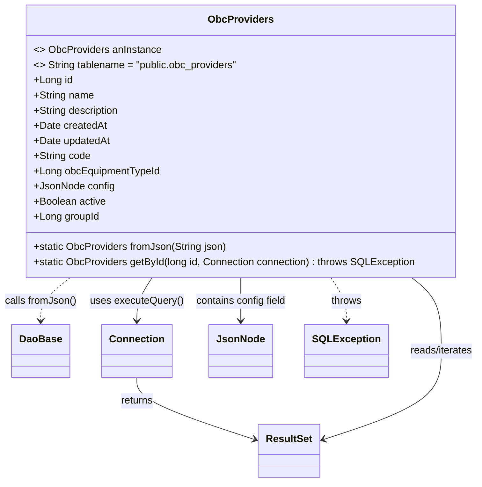
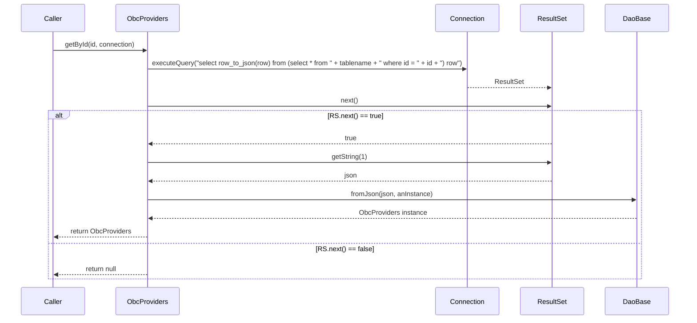

# Diagram: platform-java-lambdas/shipment/src/main/java/com/freightverify/shipment/datastore/postgresql/dao/ObcProviders.java

> Auto-generated by Obscura crawlers

## Diagram 1

### SVG

<svg id="container" width="747.171875" xmlns="http://www.w3.org/2000/svg" class="classDiagram" height="764" viewBox="0 0 747.171875 764" role="graphics-document document" aria-roledescription="class"><g><defs><marker id="container_class-aggregationStart" class="marker aggregation class" refX="18" refY="7" markerWidth="190" markerHeight="240" orient="auto"><path d="M 18,7 L9,13 L1,7 L9,1 Z"></path></marker></defs><defs><marker id="container_class-aggregationEnd" class="marker aggregation class" refX="1" refY="7" markerWidth="20" markerHeight="28" orient="auto"><path d="M 18,7 L9,13 L1,7 L9,1 Z"></path></marker></defs><defs><marker id="container_class-extensionStart" class="marker extension class" refX="18" refY="7" markerWidth="190" markerHeight="240" orient="auto"><path d="M 1,7 L18,13 V 1 Z"></path></marker></defs><defs><marker id="container_class-extensionEnd" class="marker extension class" refX="1" refY="7" markerWidth="20" markerHeight="28" orient="auto"><path d="M 1,1 V 13 L18,7 Z"></path></marker></defs><defs><marker id="container_class-compositionStart" class="marker composition class" refX="18" refY="7" markerWidth="190" markerHeight="240" orient="auto"><path d="M 18,7 L9,13 L1,7 L9,1 Z"></path></marker></defs><defs><marker id="container_class-compositionEnd" class="marker composition class" refX="1" refY="7" markerWidth="20" markerHeight="28" orient="auto"><path d="M 18,7 L9,13 L1,7 L9,1 Z"></path></marker></defs><defs><marker id="container_class-dependencyStart" class="marker dependency class" refX="6" refY="7" markerWidth="190" markerHeight="240" orient="auto"><path d="M 5,7 L9,13 L1,7 L9,1 Z"></path></marker></defs><defs><marker id="container_class-dependencyEnd" class="marker dependency class" refX="13" refY="7" markerWidth="20" markerHeight="28" orient="auto"><path d="M 18,7 L9,13 L14,7 L9,1 Z"></path></marker></defs><defs><marker id="container_class-lollipopStart" class="marker lollipop class" refX="13" refY="7" markerWidth="190" markerHeight="240" orient="auto"><circle stroke="black" fill="transparent" cx="7" cy="7" r="6"></circle></marker></defs><defs><marker id="container_class-lollipopEnd" class="marker lollipop class" refX="1" refY="7" markerWidth="190" markerHeight="240" orient="auto"><circle stroke="black" fill="transparent" cx="7" cy="7" r="6"></circle></marker></defs><g class="root"><g class="clusters"></g><g class="edgePaths"><path d="M110.558,440L102.856,446.167C95.153,452.333,79.749,464.667,72.046,476C64.344,487.333,64.344,497.667,64.344,502.833L64.344,508" id="id_ObcProviders_DaoBase_1" class="edge-thickness-normal edge-pattern-dashed relation" style=";;;" data-edge="true" data-et="edge" data-id="id_ObcProviders_DaoBase_1" data-points="W3sieCI6MTEwLjU1ODMzMTI3NDcwMzU2LCJ5Ijo0NDB9LHsieCI6NjQuMzQzNzUsInkiOjQ3N30seyJ4Ijo2NC4zNDM3NSwieSI6NTE0fV0=" marker-end="url(#container_class-dependencyEnd)"></path><path d="M238.361,440L234.308,446.167C230.254,452.333,222.147,464.667,218.093,476C214.039,487.333,214.039,497.667,214.039,502.833L214.039,508" id="id_ObcProviders_Connection_2" class="edge-thickness-normal edge-pattern-solid relation" style=";;;" data-edge="true" data-et="edge" data-id="id_ObcProviders_Connection_2" data-points="W3sieCI6MjM4LjM2MTQ0MzkyMjkyNDksInkiOjQ0MH0seyJ4IjoyMTQuMDM5MDYyNSwieSI6NDc3fSx7IngiOjIxNC4wMzkwNjI1LCJ5Ijo1MTR9XQ==" marker-end="url(#container_class-dependencyEnd)"></path><path d="M214.039,598L214.039,604.167C214.039,610.333,214.039,622.667,244.684,639.058C275.329,655.449,336.62,675.898,367.265,686.122L397.91,696.347" id="id_Connection_ResultSet_3" class="edge-thickness-normal edge-pattern-solid relation" style=";;;" data-edge="true" data-et="edge" data-id="id_Connection_ResultSet_3" data-points="W3sieCI6MjE0LjAzOTA2MjUsInkiOjU5OH0seyJ4IjoyMTQuMDM5MDYyNSwieSI6NjM1fSx7IngiOjQwMy42MDE1NjI1LCJ5Ijo2OTguMjQ1ODc1Njc2Mzg5MX1d" marker-end="url(#container_class-dependencyEnd)"></path><path d="M642.668,440L650.157,446.167C657.646,452.333,672.624,464.667,680.113,484C687.602,503.333,687.602,529.667,687.602,556C687.602,582.333,687.602,608.667,656.956,632.058C626.311,655.449,565.021,675.898,534.376,686.122L503.731,696.347" id="id_ObcProviders_ResultSet_4" class="edge-thickness-normal edge-pattern-solid relation" style=";;;" data-edge="true" data-et="edge" data-id="id_ObcProviders_ResultSet_4" data-points="W3sieCI6NjQyLjY2Nzc2ODAzMzU5NjgsInkiOjQ0MH0seyJ4Ijo2ODcuNjAxNTYyNSwieSI6NDc3fSx7IngiOjY4Ny42MDE1NjI1LCJ5Ijo1NTZ9LHsieCI6Njg3LjYwMTU2MjUsInkiOjYzNX0seyJ4Ijo0OTguMDM5MDYyNSwieSI6Njk4LjI0NTg3NTY3NjM4OTF9XQ==" marker-end="url(#container_class-dependencyEnd)"></path><path d="M380.352,440L380.352,446.167C380.352,452.333,380.352,464.667,380.352,476C380.352,487.333,380.352,497.667,380.352,502.833L380.352,508" id="id_ObcProviders_JsonNode_5" class="edge-thickness-normal edge-pattern-solid relation" style=";;;" data-edge="true" data-et="edge" data-id="id_ObcProviders_JsonNode_5" data-points="W3sieCI6MzgwLjM1MTU2MjUsInkiOjQ0MH0seyJ4IjozODAuMzUxNTYyNSwieSI6NDc3fSx7IngiOjM4MC4zNTE1NjI1LCJ5Ijo1MTR9XQ==" marker-end="url(#container_class-dependencyEnd)"></path><path d="M515.912,440L519.782,446.167C523.652,452.333,531.392,464.667,535.263,476C539.133,487.333,539.133,497.667,539.133,502.833L539.133,508" id="id_ObcProviders_SQLException_6" class="edge-thickness-normal edge-pattern-dashed relation" style=";;;" data-edge="true" data-et="edge" data-id="id_ObcProviders_SQLException_6" data-points="W3sieCI6NTE1LjkxMTgzOTE3OTg0MTksInkiOjQ0MH0seyJ4Ijo1MzkuMTMyODEyNSwieSI6NDc3fSx7IngiOjUzOS4xMzI4MTI1LCJ5Ijo1MTR9XQ==" marker-end="url(#container_class-dependencyEnd)"></path></g><g class="edgeLabels"><g class="edgeLabel" transform="translate(64.34375, 477)"><g class="label" data-id="id_ObcProviders_DaoBase_1" transform="translate(-56.34375, -12)"><foreignObject width="112.6875" height="24">

calls fromJson()

</foreignObject></g></g><g class="edgeLabel" transform="translate(214.0390625, 477)"><g class="label" data-id="id_ObcProviders_Connection_2" transform="translate(-73.3515625, -12)"><foreignObject width="146.703125" height="24">

uses executeQuery()

</foreignObject></g></g><g class="edgeLabel" transform="translate(214.0390625, 635)"><g class="label" data-id="id_Connection_ResultSet_3" transform="translate(-26.265625, -12)"><foreignObject width="52.53125" height="24">

returns

</foreignObject></g></g><g class="edgeLabel" transform="translate(687.6015625, 556)"><g class="label" data-id="id_ObcProviders_ResultSet_4" transform="translate(-51.5703125, -12)"><foreignObject width="103.140625" height="24">

reads/iterates

</foreignObject></g></g><g class="edgeLabel" transform="translate(380.3515625, 477)"><g class="label" data-id="id_ObcProviders_JsonNode_5" transform="translate(-72.9609375, -12)"><foreignObject width="145.921875" height="24">

contains config field

</foreignObject></g></g><g class="edgeLabel" transform="translate(539.1328125, 477)"><g class="label" data-id="id_ObcProviders_SQLException_6" transform="translate(-24.5703125, -12)"><foreignObject width="49.140625" height="24">

throws

</foreignObject></g></g></g><g class="nodes"><g class="node default" id="classId-ObcProviders-0" transform="translate(380.3515625, 224)"><g class="basic label-container"><path d="M-339.8046875 -216 L339.8046875 -216 L339.8046875 216 L-339.8046875 216" stroke="none" stroke-width="0" fill="#ECECFF" style=""></path><path d="M-339.8046875 -216 C-178.31457309879238 -216, -16.82445869758476 -216, 339.8046875 -216 M-339.8046875 -216 C-117.46233778040806 -216, 104.88001193918387 -216, 339.8046875 -216 M339.8046875 -216 C339.8046875 -66.63198048472415, 339.8046875 82.7360390305517, 339.8046875 216 M339.8046875 -216 C339.8046875 -118.50509043663374, 339.8046875 -21.010180873267473, 339.8046875 216 M339.8046875 216 C126.07761625854022 216, -87.64945498291956 216, -339.8046875 216 M339.8046875 216 C75.97181985989818 216, -187.86104778020365 216, -339.8046875 216 M-339.8046875 216 C-339.8046875 69.05892660694377, -339.8046875 -77.88214678611246, -339.8046875 -216 M-339.8046875 216 C-339.8046875 47.83479973500471, -339.8046875 -120.33040052999058, -339.8046875 -216" stroke="#9370DB" stroke-width="1.3" fill="none" stroke-dasharray="0 0" style=""></path></g><g class="annotation-group text" transform="translate(0, -192)"></g><g class="label-group text" transform="translate(-48.90625, -192)"><g class="label" style="font-weight: bolder" transform="translate(0,-12)"><foreignObject width="97.8125" height="24">

ObcProviders

</foreignObject></g></g><g class="members-group text" transform="translate(-327.8046875, -144)"><g class="label" style="" transform="translate(0,-12)"><foreignObject width="200.1875" height="24">

&lt;&gt; ObcProviders anInstance

</foreignObject></g><g class="label" style="" transform="translate(0,12)"><foreignObject width="326.46875" height="24">

&lt;&gt; String tablename = "public.obc_providers"

</foreignObject></g><g class="label" style="" transform="translate(0,36)"><foreignObject width="60.921875" height="24">

+Long id

</foreignObject></g><g class="label" style="" transform="translate(0,60)"><foreignObject width="94.984375" height="24">

+String name

</foreignObject></g><g class="label" style="" transform="translate(0,84)"><foreignObject width="137.078125" height="24">

+String description

</foreignObject></g><g class="label" style="" transform="translate(0,108)"><foreignObject width="114.71875" height="24">

+Date createdAt

</foreignObject></g><g class="label" style="" transform="translate(0,132)"><foreignObject width="121.1875" height="24">

+Date updatedAt

</foreignObject></g><g class="label" style="" transform="translate(0,156)"><foreignObject width="89.4375" height="24">

+String code

</foreignObject></g><g class="label" style="" transform="translate(0,180)"><foreignObject width="200.078125" height="24">

+Long obcEquipmentTypeId

</foreignObject></g><g class="label" style="" transform="translate(0,204)"><foreignObject width="125.28125" height="24">

+JsonNode config

</foreignObject></g><g class="label" style="" transform="translate(0,228)"><foreignObject width="115.0625" height="24">

+Boolean active

</foreignObject></g><g class="label" style="" transform="translate(0,252)"><foreignObject width="103.296875" height="24">

+Long groupId

</foreignObject></g></g><g class="methods-group text" transform="translate(-327.8046875, 168)"><g class="label" style="" transform="translate(0,-12)"><foreignObject width="305.84375" height="24">

+static ObcProviders fromJson(String json)

</foreignObject></g><g class="label" style="" transform="translate(0,12)"><foreignObject width="606.703125" height="24">

+static ObcProviders getById(long id, Connection connection) : throws SQLException

</foreignObject></g></g><g class="divider" style=""><path d="M-339.8046875 -168 C-104.42438561467449 -168, 130.95591627065102 -168, 339.8046875 -168 M-339.8046875 -168 C-136.705748894047 -168, 66.39318971190602 -168, 339.8046875 -168" stroke="#9370DB" stroke-width="1.3" fill="none" stroke-dasharray="0 0" style=""></path></g><g class="divider" style=""><path d="M-339.8046875 144 C-137.70312831672751 144, 64.39843086654497 144, 339.8046875 144 M-339.8046875 144 C-132.74224845391194 144, 74.32019059217612 144, 339.8046875 144" stroke="#9370DB" stroke-width="1.3" fill="none" stroke-dasharray="0 0" style=""></path></g></g><g class="node default" id="classId-DaoBase-1" transform="translate(64.34375, 556)"><g class="basic label-container"><path d="M-43.7109375 -42 L43.7109375 -42 L43.7109375 42 L-43.7109375 42" stroke="none" stroke-width="0" fill="#ECECFF" style=""></path><path d="M-43.7109375 -42 C-17.177790484360266 -42, 9.355356531279469 -42, 43.7109375 -42 M-43.7109375 -42 C-16.443536641666338 -42, 10.823864216667324 -42, 43.7109375 -42 M43.7109375 -42 C43.7109375 -11.627949131440111, 43.7109375 18.744101737119777, 43.7109375 42 M43.7109375 -42 C43.7109375 -16.00051032003382, 43.7109375 9.998979359932363, 43.7109375 42 M43.7109375 42 C22.971262698504194 42, 2.2315878970083887 42, -43.7109375 42 M43.7109375 42 C21.861950654682094 42, 0.012963809364187284 42, -43.7109375 42 M-43.7109375 42 C-43.7109375 15.170040588929584, -43.7109375 -11.659918822140831, -43.7109375 -42 M-43.7109375 42 C-43.7109375 12.867877805588925, -43.7109375 -16.26424438882215, -43.7109375 -42" stroke="#9370DB" stroke-width="1.3" fill="none" stroke-dasharray="0 0" style=""></path></g><g class="annotation-group text" transform="translate(0, -18)"></g><g class="label-group text" transform="translate(-31.7109375, -18)"><g class="label" style="font-weight: bolder" transform="translate(0,-12)"><foreignObject width="63.421875" height="24">

DaoBase

</foreignObject></g></g><g class="members-group text" transform="translate(-31.7109375, 30)"></g><g class="methods-group text" transform="translate(-31.7109375, 60)"></g><g class="divider" style=""><path d="M-43.7109375 6 C-10.218097414153831 6, 23.274742671692337 6, 43.7109375 6 M-43.7109375 6 C-15.946356034955109 6, 11.818225430089782 6, 43.7109375 6" stroke="#9370DB" stroke-width="1.3" fill="none" stroke-dasharray="0 0" style=""></path></g><g class="divider" style=""><path d="M-43.7109375 24 C-12.696527823410875 24, 18.31788185317825 24, 43.7109375 24 M-43.7109375 24 C-25.421395566156395 24, -7.13185363231279 24, 43.7109375 24" stroke="#9370DB" stroke-width="1.3" fill="none" stroke-dasharray="0 0" style=""></path></g></g><g class="node default" id="classId-Connection-2" transform="translate(214.0390625, 556)"><g class="basic label-container"><path d="M-53.2265625 -42 L53.2265625 -42 L53.2265625 42 L-53.2265625 42" stroke="none" stroke-width="0" fill="#ECECFF" style=""></path><path d="M-53.2265625 -42 C-15.734547741724157 -42, 21.757467016551686 -42, 53.2265625 -42 M-53.2265625 -42 C-28.881936687752873 -42, -4.537310875505746 -42, 53.2265625 -42 M53.2265625 -42 C53.2265625 -19.024770136438047, 53.2265625 3.9504597271239064, 53.2265625 42 M53.2265625 -42 C53.2265625 -23.56372220966695, 53.2265625 -5.127444419333898, 53.2265625 42 M53.2265625 42 C27.116633977999644 42, 1.0067054559992883 42, -53.2265625 42 M53.2265625 42 C20.381641025431094 42, -12.463280449137812 42, -53.2265625 42 M-53.2265625 42 C-53.2265625 11.499163854785703, -53.2265625 -19.001672290428594, -53.2265625 -42 M-53.2265625 42 C-53.2265625 9.136841655648666, -53.2265625 -23.726316688702667, -53.2265625 -42" stroke="#9370DB" stroke-width="1.3" fill="none" stroke-dasharray="0 0" style=""></path></g><g class="annotation-group text" transform="translate(0, -18)"></g><g class="label-group text" transform="translate(-41.2265625, -18)"><g class="label" style="font-weight: bolder" transform="translate(0,-12)"><foreignObject width="82.453125" height="24">

Connection

</foreignObject></g></g><g class="members-group text" transform="translate(-41.2265625, 30)"></g><g class="methods-group text" transform="translate(-41.2265625, 60)"></g><g class="divider" style=""><path d="M-53.2265625 6 C-12.479374308229993 6, 28.267813883540015 6, 53.2265625 6 M-53.2265625 6 C-16.153006938313275 6, 20.92054862337345 6, 53.2265625 6" stroke="#9370DB" stroke-width="1.3" fill="none" stroke-dasharray="0 0" style=""></path></g><g class="divider" style=""><path d="M-53.2265625 24 C-29.67158254780837 24, -6.11660259561674 24, 53.2265625 24 M-53.2265625 24 C-30.608770386973774 24, -7.9909782739475475 24, 53.2265625 24" stroke="#9370DB" stroke-width="1.3" fill="none" stroke-dasharray="0 0" style=""></path></g></g><g class="node default" id="classId-ResultSet-3" transform="translate(450.8203125, 714)"><g class="basic label-container"><path d="M-47.21875 -42 L47.21875 -42 L47.21875 42 L-47.21875 42" stroke="none" stroke-width="0" fill="#ECECFF" style=""></path><path d="M-47.21875 -42 C-15.830060169735752 -42, 15.558629660528496 -42, 47.21875 -42 M-47.21875 -42 C-16.89462041951011 -42, 13.429509160979777 -42, 47.21875 -42 M47.21875 -42 C47.21875 -17.783700118097464, 47.21875 6.432599763805072, 47.21875 42 M47.21875 -42 C47.21875 -10.177493339456674, 47.21875 21.64501332108665, 47.21875 42 M47.21875 42 C22.825176286411384 42, -1.5683974271772314 42, -47.21875 42 M47.21875 42 C22.034564655870167 42, -3.1496206882596667 42, -47.21875 42 M-47.21875 42 C-47.21875 22.64746979710432, -47.21875 3.2949395942086426, -47.21875 -42 M-47.21875 42 C-47.21875 21.026166644938357, -47.21875 0.05233328987671371, -47.21875 -42" stroke="#9370DB" stroke-width="1.3" fill="none" stroke-dasharray="0 0" style=""></path></g><g class="annotation-group text" transform="translate(0, -18)"></g><g class="label-group text" transform="translate(-35.21875, -18)"><g class="label" style="font-weight: bolder" transform="translate(0,-12)"><foreignObject width="70.4375" height="24">

ResultSet

</foreignObject></g></g><g class="members-group text" transform="translate(-35.21875, 30)"></g><g class="methods-group text" transform="translate(-35.21875, 60)"></g><g class="divider" style=""><path d="M-47.21875 6 C-27.929294300556343 6, -8.639838601112686 6, 47.21875 6 M-47.21875 6 C-18.721406654255244 6, 9.775936691489512 6, 47.21875 6" stroke="#9370DB" stroke-width="1.3" fill="none" stroke-dasharray="0 0" style=""></path></g><g class="divider" style=""><path d="M-47.21875 24 C-16.292006114514862 24, 14.634737770970276 24, 47.21875 24 M-47.21875 24 C-9.531007874994053 24, 28.156734250011894 24, 47.21875 24" stroke="#9370DB" stroke-width="1.3" fill="none" stroke-dasharray="0 0" style=""></path></g></g><g class="node default" id="classId-JsonNode-4" transform="translate(380.3515625, 556)"><g class="basic label-container"><path d="M-46.8828125 -42 L46.8828125 -42 L46.8828125 42 L-46.8828125 42" stroke="none" stroke-width="0" fill="#ECECFF" style=""></path><path d="M-46.8828125 -42 C-25.51714470791771 -42, -4.151476915835417 -42, 46.8828125 -42 M-46.8828125 -42 C-22.241748075554366 -42, 2.3993163488912685 -42, 46.8828125 -42 M46.8828125 -42 C46.8828125 -20.548587236977287, 46.8828125 0.9028255260454259, 46.8828125 42 M46.8828125 -42 C46.8828125 -16.165873039660706, 46.8828125 9.668253920678588, 46.8828125 42 M46.8828125 42 C26.731633888717543 42, 6.580455277435085 42, -46.8828125 42 M46.8828125 42 C17.90736005475036 42, -11.068092390499281 42, -46.8828125 42 M-46.8828125 42 C-46.8828125 15.409009247174481, -46.8828125 -11.181981505651038, -46.8828125 -42 M-46.8828125 42 C-46.8828125 16.32684424210798, -46.8828125 -9.346311515784038, -46.8828125 -42" stroke="#9370DB" stroke-width="1.3" fill="none" stroke-dasharray="0 0" style=""></path></g><g class="annotation-group text" transform="translate(0, -18)"></g><g class="label-group text" transform="translate(-34.8828125, -18)"><g class="label" style="font-weight: bolder" transform="translate(0,-12)"><foreignObject width="69.765625" height="24">

JsonNode

</foreignObject></g></g><g class="members-group text" transform="translate(-34.8828125, 30)"></g><g class="methods-group text" transform="translate(-34.8828125, 60)"></g><g class="divider" style=""><path d="M-46.8828125 6 C-26.884655254751696 6, -6.886498009503391 6, 46.8828125 6 M-46.8828125 6 C-12.768766587859481 6, 21.345279324281037 6, 46.8828125 6" stroke="#9370DB" stroke-width="1.3" fill="none" stroke-dasharray="0 0" style=""></path></g><g class="divider" style=""><path d="M-46.8828125 24 C-11.542221642617037 24, 23.798369214765927 24, 46.8828125 24 M-46.8828125 24 C-25.18727789237664 24, -3.4917432847532766 24, 46.8828125 24" stroke="#9370DB" stroke-width="1.3" fill="none" stroke-dasharray="0 0" style=""></path></g></g><g class="node default" id="classId-SQLException-5" transform="translate(539.1328125, 556)"><g class="basic label-container"><path d="M-61.8984375 -42 L61.8984375 -42 L61.8984375 42 L-61.8984375 42" stroke="none" stroke-width="0" fill="#ECECFF" style=""></path><path d="M-61.8984375 -42 C-23.446336156765796 -42, 15.005765186468409 -42, 61.8984375 -42 M-61.8984375 -42 C-19.784466244864632 -42, 22.329505010270736 -42, 61.8984375 -42 M61.8984375 -42 C61.8984375 -13.049882294365464, 61.8984375 15.900235411269072, 61.8984375 42 M61.8984375 -42 C61.8984375 -11.724493755070725, 61.8984375 18.55101248985855, 61.8984375 42 M61.8984375 42 C24.64525515952075 42, -12.607927180958498 42, -61.8984375 42 M61.8984375 42 C36.851182691700856 42, 11.803927883401705 42, -61.8984375 42 M-61.8984375 42 C-61.8984375 15.915497500240413, -61.8984375 -10.169004999519174, -61.8984375 -42 M-61.8984375 42 C-61.8984375 22.518477883484977, -61.8984375 3.036955766969953, -61.8984375 -42" stroke="#9370DB" stroke-width="1.3" fill="none" stroke-dasharray="0 0" style=""></path></g><g class="annotation-group text" transform="translate(0, -18)"></g><g class="label-group text" transform="translate(-49.8984375, -18)"><g class="label" style="font-weight: bolder" transform="translate(0,-12)"><foreignObject width="99.796875" height="24">

SQLException

</foreignObject></g></g><g class="members-group text" transform="translate(-49.8984375, 30)"></g><g class="methods-group text" transform="translate(-49.8984375, 60)"></g><g class="divider" style=""><path d="M-61.8984375 6 C-29.232030526752816 6, 3.434376446494369 6, 61.8984375 6 M-61.8984375 6 C-32.31535313819769 6, -2.7322687763953866 6, 61.8984375 6" stroke="#9370DB" stroke-width="1.3" fill="none" stroke-dasharray="0 0" style=""></path></g><g class="divider" style=""><path d="M-61.8984375 24 C-22.51153037457412 24, 16.875376750851757 24, 61.8984375 24 M-61.8984375 24 C-23.731545381367113 24, 14.435346737265775 24, 61.8984375 24" stroke="#9370DB" stroke-width="1.3" fill="none" stroke-dasharray="0 0" style=""></path></g></g></g></g></g></svg>

## Diagram 2

### SVG

<svg id="container" width="1699" xmlns="http://www.w3.org/2000/svg" height="799" viewBox="-50 -10 1699 799" role="graphics-document document" aria-roledescription="sequence"><g><rect x="1449" y="713" fill="#eaeaea" stroke="#666" width="150" height="65" name="DB" rx="3" ry="3" class="actor actor-bottom"></rect><text x="1524" y="745.5" dominant-baseline="central" alignment-baseline="central" class="actor actor-box" style="text-anchor: middle; font-size: 16px; font-weight: 400;"><tspan x="1524" dy="0">DaoBase</tspan></text></g><g><rect x="1249" y="713" fill="#eaeaea" stroke="#666" width="150" height="65" name="RS" rx="3" ry="3" class="actor actor-bottom"></rect><text x="1324" y="745.5" dominant-baseline="central" alignment-baseline="central" class="actor actor-box" style="text-anchor: middle; font-size: 16px; font-weight: 400;"><tspan x="1324" dy="0">ResultSet</tspan></text></g><g><rect x="1049" y="713" fill="#eaeaea" stroke="#666" width="150" height="65" name="Conn" rx="3" ry="3" class="actor actor-bottom"></rect><text x="1124" y="745.5" dominant-baseline="central" alignment-baseline="central" class="actor actor-box" style="text-anchor: middle; font-size: 16px; font-weight: 400;"><tspan x="1124" dy="0">Connection</tspan></text></g><g><rect x="238" y="713" fill="#eaeaea" stroke="#666" width="150" height="65" name="OP" rx="3" ry="3" class="actor actor-bottom"></rect><text x="313" y="745.5" dominant-baseline="central" alignment-baseline="central" class="actor actor-box" style="text-anchor: middle; font-size: 16px; font-weight: 400;"><tspan x="313" dy="0">ObcProviders</tspan></text></g><g><rect x="0" y="713" fill="#eaeaea" stroke="#666" width="150" height="65" name="C" rx="3" ry="3" class="actor actor-bottom"></rect><text x="75" y="745.5" dominant-baseline="central" alignment-baseline="central" class="actor actor-box" style="text-anchor: middle; font-size: 16px; font-weight: 400;"><tspan x="75" dy="0">Caller</tspan></text></g><g><line id="actor4" x1="1524" y1="65" x2="1524" y2="713" class="actor-line 200" stroke-width="0.5px" stroke="#999" name="DB"></line><g id="root-4"><rect x="1449" y="0" fill="#eaeaea" stroke="#666" width="150" height="65" name="DB" rx="3" ry="3" class="actor actor-top"></rect><text x="1524" y="32.5" dominant-baseline="central" alignment-baseline="central" class="actor actor-box" style="text-anchor: middle; font-size: 16px; font-weight: 400;"><tspan x="1524" dy="0">DaoBase</tspan></text></g></g><g><line id="actor3" x1="1324" y1="65" x2="1324" y2="713" class="actor-line 200" stroke-width="0.5px" stroke="#999" name="RS"></line><g id="root-3"><rect x="1249" y="0" fill="#eaeaea" stroke="#666" width="150" height="65" name="RS" rx="3" ry="3" class="actor actor-top"></rect><text x="1324" y="32.5" dominant-baseline="central" alignment-baseline="central" class="actor actor-box" style="text-anchor: middle; font-size: 16px; font-weight: 400;"><tspan x="1324" dy="0">ResultSet</tspan></text></g></g><g><line id="actor2" x1="1124" y1="65" x2="1124" y2="713" class="actor-line 200" stroke-width="0.5px" stroke="#999" name="Conn"></line><g id="root-2"><rect x="1049" y="0" fill="#eaeaea" stroke="#666" width="150" height="65" name="Conn" rx="3" ry="3" class="actor actor-top"></rect><text x="1124" y="32.5" dominant-baseline="central" alignment-baseline="central" class="actor actor-box" style="text-anchor: middle; font-size: 16px; font-weight: 400;"><tspan x="1124" dy="0">Connection</tspan></text></g></g><g><line id="actor1" x1="313" y1="65" x2="313" y2="713" class="actor-line 200" stroke-width="0.5px" stroke="#999" name="OP"></line><g id="root-1"><rect x="238" y="0" fill="#eaeaea" stroke="#666" width="150" height="65" name="OP" rx="3" ry="3" class="actor actor-top"></rect><text x="313" y="32.5" dominant-baseline="central" alignment-baseline="central" class="actor actor-box" style="text-anchor: middle; font-size: 16px; font-weight: 400;"><tspan x="313" dy="0">ObcProviders</tspan></text></g></g><g><line id="actor0" x1="75" y1="65" x2="75" y2="713" class="actor-line 200" stroke-width="0.5px" stroke="#999" name="C"></line><g id="root-0"><rect x="0" y="0" fill="#eaeaea" stroke="#666" width="150" height="65" name="C" rx="3" ry="3" class="actor actor-top"></rect><text x="75" y="32.5" dominant-baseline="central" alignment-baseline="central" class="actor actor-box" style="text-anchor: middle; font-size: 16px; font-weight: 400;"><tspan x="75" dy="0">Caller</tspan></text></g></g><g></g><defs><symbol id="computer" width="24" height="24"><path transform="scale(.5)" d="M2 2v13h20v-13h-20zm18 11h-16v-9h16v9zm-10.228 6l.466-1h3.524l.467 1h-4.457zm14.228 3h-24l2-6h2.104l-1.33 4h18.45l-1.297-4h2.073l2 6zm-5-10h-14v-7h14v7z"></path></symbol></defs><defs><symbol id="database" fill-rule="evenodd" clip-rule="evenodd"><path transform="scale(.5)" d="M12.258.001l.256.004.255.005.253.008.251.01.249.012.247.015.246.016.242.019.241.02.239.023.236.024.233.027.231.028.229.031.225.032.223.034.22.036.217.038.214.04.211.041.208.043.205.045.201.046.198.048.194.05.191.051.187.053.183.054.18.056.175.057.172.059.168.06.163.061.16.063.155.064.15.066.074.033.073.033.071.034.07.034.069.035.068.035.067.035.066.035.064.036.064.036.062.036.06.036.06.037.058.037.058.037.055.038.055.038.053.038.052.038.051.039.05.039.048.039.047.039.045.04.044.04.043.04.041.04.04.041.039.041.037.041.036.041.034.041.033.042.032.042.03.042.029.042.027.042.026.043.024.043.023.043.021.043.02.043.018.044.017.043.015.044.013.044.012.044.011.045.009.044.007.045.006.045.004.045.002.045.001.045v17l-.001.045-.002.045-.004.045-.006.045-.007.045-.009.044-.011.045-.012.044-.013.044-.015.044-.017.043-.018.044-.02.043-.021.043-.023.043-.024.043-.026.043-.027.042-.029.042-.03.042-.032.042-.033.042-.034.041-.036.041-.037.041-.039.041-.04.041-.041.04-.043.04-.044.04-.045.04-.047.039-.048.039-.05.039-.051.039-.052.038-.053.038-.055.038-.055.038-.058.037-.058.037-.06.037-.06.036-.062.036-.064.036-.064.036-.066.035-.067.035-.068.035-.069.035-.07.034-.071.034-.073.033-.074.033-.15.066-.155.064-.16.063-.163.061-.168.06-.172.059-.175.057-.18.056-.183.054-.187.053-.191.051-.194.05-.198.048-.201.046-.205.045-.208.043-.211.041-.214.04-.217.038-.22.036-.223.034-.225.032-.229.031-.231.028-.233.027-.236.024-.239.023-.241.02-.242.019-.246.016-.247.015-.249.012-.251.01-.253.008-.255.005-.256.004-.258.001-.258-.001-.256-.004-.255-.005-.253-.008-.251-.01-.249-.012-.247-.015-.245-.016-.243-.019-.241-.02-.238-.023-.236-.024-.234-.027-.231-.028-.228-.031-.226-.032-.223-.034-.22-.036-.217-.038-.214-.04-.211-.041-.208-.043-.204-.045-.201-.046-.198-.048-.195-.05-.19-.051-.187-.053-.184-.054-.179-.056-.176-.057-.172-.059-.167-.06-.164-.061-.159-.063-.155-.064-.151-.066-.074-.033-.072-.033-.072-.034-.07-.034-.069-.035-.068-.035-.067-.035-.066-.035-.064-.036-.063-.036-.062-.036-.061-.036-.06-.037-.058-.037-.057-.037-.056-.038-.055-.038-.053-.038-.052-.038-.051-.039-.049-.039-.049-.039-.046-.039-.046-.04-.044-.04-.043-.04-.041-.04-.04-.041-.039-.041-.037-.041-.036-.041-.034-.041-.033-.042-.032-.042-.03-.042-.029-.042-.027-.042-.026-.043-.024-.043-.023-.043-.021-.043-.02-.043-.018-.044-.017-.043-.015-.044-.013-.044-.012-.044-.011-.045-.009-.044-.007-.045-.006-.045-.004-.045-.002-.045-.001-.045v-17l.001-.045.002-.045.004-.045.006-.045.007-.045.009-.044.011-.045.012-.044.013-.044.015-.044.017-.043.018-.044.02-.043.021-.043.023-.043.024-.043.026-.043.027-.042.029-.042.03-.042.032-.042.033-.042.034-.041.036-.041.037-.041.039-.041.04-.041.041-.04.043-.04.044-.04.046-.04.046-.039.049-.039.049-.039.051-.039.052-.038.053-.038.055-.038.056-.038.057-.037.058-.037.06-.037.061-.036.062-.036.063-.036.064-.036.066-.035.067-.035.068-.035.069-.035.07-.034.072-.034.072-.033.074-.033.151-.066.155-.064.159-.063.164-.061.167-.06.172-.059.176-.057.179-.056.184-.054.187-.053.19-.051.195-.05.198-.048.201-.046.204-.045.208-.043.211-.041.214-.04.217-.038.22-.036.223-.034.226-.032.228-.031.231-.028.234-.027.236-.024.238-.023.241-.02.243-.019.245-.016.247-.015.249-.012.251-.01.253-.008.255-.005.256-.004.258-.001.258.001zm-9.258 20.499v.01l.001.021.003.021.004.022.005.021.006.022.007.022.009.023.01.022.011.023.012.023.013.023.015.023.016.024.017.023.018.024.019.024.021.024.022.025.023.024.024.025.052.049.056.05.061.051.066.051.07.051.075.051.079.052.084.052.088.052.092.052.097.052.102.051.105.052.11.052.114.051.119.051.123.051.127.05.131.05.135.05.139.048.144.049.147.047.152.047.155.047.16.045.163.045.167.043.171.043.176.041.178.041.183.039.187.039.19.037.194.035.197.035.202.033.204.031.209.03.212.029.216.027.219.025.222.024.226.021.23.02.233.018.236.016.24.015.243.012.246.01.249.008.253.005.256.004.259.001.26-.001.257-.004.254-.005.25-.008.247-.011.244-.012.241-.014.237-.016.233-.018.231-.021.226-.021.224-.024.22-.026.216-.027.212-.028.21-.031.205-.031.202-.034.198-.034.194-.036.191-.037.187-.039.183-.04.179-.04.175-.042.172-.043.168-.044.163-.045.16-.046.155-.046.152-.047.148-.048.143-.049.139-.049.136-.05.131-.05.126-.05.123-.051.118-.052.114-.051.11-.052.106-.052.101-.052.096-.052.092-.052.088-.053.083-.051.079-.052.074-.052.07-.051.065-.051.06-.051.056-.05.051-.05.023-.024.023-.025.021-.024.02-.024.019-.024.018-.024.017-.024.015-.023.014-.024.013-.023.012-.023.01-.023.01-.022.008-.022.006-.022.006-.022.004-.022.004-.021.001-.021.001-.021v-4.127l-.077.055-.08.053-.083.054-.085.053-.087.052-.09.052-.093.051-.095.05-.097.05-.1.049-.102.049-.105.048-.106.047-.109.047-.111.046-.114.045-.115.045-.118.044-.12.043-.122.042-.124.042-.126.041-.128.04-.13.04-.132.038-.134.038-.135.037-.138.037-.139.035-.142.035-.143.034-.144.033-.147.032-.148.031-.15.03-.151.03-.153.029-.154.027-.156.027-.158.026-.159.025-.161.024-.162.023-.163.022-.165.021-.166.02-.167.019-.169.018-.169.017-.171.016-.173.015-.173.014-.175.013-.175.012-.177.011-.178.01-.179.008-.179.008-.181.006-.182.005-.182.004-.184.003-.184.002h-.37l-.184-.002-.184-.003-.182-.004-.182-.005-.181-.006-.179-.008-.179-.008-.178-.01-.176-.011-.176-.012-.175-.013-.173-.014-.172-.015-.171-.016-.17-.017-.169-.018-.167-.019-.166-.02-.165-.021-.163-.022-.162-.023-.161-.024-.159-.025-.157-.026-.156-.027-.155-.027-.153-.029-.151-.03-.15-.03-.148-.031-.146-.032-.145-.033-.143-.034-.141-.035-.14-.035-.137-.037-.136-.037-.134-.038-.132-.038-.13-.04-.128-.04-.126-.041-.124-.042-.122-.042-.12-.044-.117-.043-.116-.045-.113-.045-.112-.046-.109-.047-.106-.047-.105-.048-.102-.049-.1-.049-.097-.05-.095-.05-.093-.052-.09-.051-.087-.052-.085-.053-.083-.054-.08-.054-.077-.054v4.127zm0-5.654v.011l.001.021.003.021.004.021.005.022.006.022.007.022.009.022.01.022.011.023.012.023.013.023.015.024.016.023.017.024.018.024.019.024.021.024.022.024.023.025.024.024.052.05.056.05.061.05.066.051.07.051.075.052.079.051.084.052.088.052.092.052.097.052.102.052.105.052.11.051.114.051.119.052.123.05.127.051.131.05.135.049.139.049.144.048.147.048.152.047.155.046.16.045.163.045.167.044.171.042.176.042.178.04.183.04.187.038.19.037.194.036.197.034.202.033.204.032.209.03.212.028.216.027.219.025.222.024.226.022.23.02.233.018.236.016.24.014.243.012.246.01.249.008.253.006.256.003.259.001.26-.001.257-.003.254-.006.25-.008.247-.01.244-.012.241-.015.237-.016.233-.018.231-.02.226-.022.224-.024.22-.025.216-.027.212-.029.21-.03.205-.032.202-.033.198-.035.194-.036.191-.037.187-.039.183-.039.179-.041.175-.042.172-.043.168-.044.163-.045.16-.045.155-.047.152-.047.148-.048.143-.048.139-.05.136-.049.131-.05.126-.051.123-.051.118-.051.114-.052.11-.052.106-.052.101-.052.096-.052.092-.052.088-.052.083-.052.079-.052.074-.051.07-.052.065-.051.06-.05.056-.051.051-.049.023-.025.023-.024.021-.025.02-.024.019-.024.018-.024.017-.024.015-.023.014-.023.013-.024.012-.022.01-.023.01-.023.008-.022.006-.022.006-.022.004-.021.004-.022.001-.021.001-.021v-4.139l-.077.054-.08.054-.083.054-.085.052-.087.053-.09.051-.093.051-.095.051-.097.05-.1.049-.102.049-.105.048-.106.047-.109.047-.111.046-.114.045-.115.044-.118.044-.12.044-.122.042-.124.042-.126.041-.128.04-.13.039-.132.039-.134.038-.135.037-.138.036-.139.036-.142.035-.143.033-.144.033-.147.033-.148.031-.15.03-.151.03-.153.028-.154.028-.156.027-.158.026-.159.025-.161.024-.162.023-.163.022-.165.021-.166.02-.167.019-.169.018-.169.017-.171.016-.173.015-.173.014-.175.013-.175.012-.177.011-.178.009-.179.009-.179.007-.181.007-.182.005-.182.004-.184.003-.184.002h-.37l-.184-.002-.184-.003-.182-.004-.182-.005-.181-.007-.179-.007-.179-.009-.178-.009-.176-.011-.176-.012-.175-.013-.173-.014-.172-.015-.171-.016-.17-.017-.169-.018-.167-.019-.166-.02-.165-.021-.163-.022-.162-.023-.161-.024-.159-.025-.157-.026-.156-.027-.155-.028-.153-.028-.151-.03-.15-.03-.148-.031-.146-.033-.145-.033-.143-.033-.141-.035-.14-.036-.137-.036-.136-.037-.134-.038-.132-.039-.13-.039-.128-.04-.126-.041-.124-.042-.122-.043-.12-.043-.117-.044-.116-.044-.113-.046-.112-.046-.109-.046-.106-.047-.105-.048-.102-.049-.1-.049-.097-.05-.095-.051-.093-.051-.09-.051-.087-.053-.085-.052-.083-.054-.08-.054-.077-.054v4.139zm0-5.666v.011l.001.02.003.022.004.021.005.022.006.021.007.022.009.023.01.022.011.023.012.023.013.023.015.023.016.024.017.024.018.023.019.024.021.025.022.024.023.024.024.025.052.05.056.05.061.05.066.051.07.051.075.052.079.051.084.052.088.052.092.052.097.052.102.052.105.051.11.052.114.051.119.051.123.051.127.05.131.05.135.05.139.049.144.048.147.048.152.047.155.046.16.045.163.045.167.043.171.043.176.042.178.04.183.04.187.038.19.037.194.036.197.034.202.033.204.032.209.03.212.028.216.027.219.025.222.024.226.021.23.02.233.018.236.017.24.014.243.012.246.01.249.008.253.006.256.003.259.001.26-.001.257-.003.254-.006.25-.008.247-.01.244-.013.241-.014.237-.016.233-.018.231-.02.226-.022.224-.024.22-.025.216-.027.212-.029.21-.03.205-.032.202-.033.198-.035.194-.036.191-.037.187-.039.183-.039.179-.041.175-.042.172-.043.168-.044.163-.045.16-.045.155-.047.152-.047.148-.048.143-.049.139-.049.136-.049.131-.051.126-.05.123-.051.118-.052.114-.051.11-.052.106-.052.101-.052.096-.052.092-.052.088-.052.083-.052.079-.052.074-.052.07-.051.065-.051.06-.051.056-.05.051-.049.023-.025.023-.025.021-.024.02-.024.019-.024.018-.024.017-.024.015-.023.014-.024.013-.023.012-.023.01-.022.01-.023.008-.022.006-.022.006-.022.004-.022.004-.021.001-.021.001-.021v-4.153l-.077.054-.08.054-.083.053-.085.053-.087.053-.09.051-.093.051-.095.051-.097.05-.1.049-.102.048-.105.048-.106.048-.109.046-.111.046-.114.046-.115.044-.118.044-.12.043-.122.043-.124.042-.126.041-.128.04-.13.039-.132.039-.134.038-.135.037-.138.036-.139.036-.142.034-.143.034-.144.033-.147.032-.148.032-.15.03-.151.03-.153.028-.154.028-.156.027-.158.026-.159.024-.161.024-.162.023-.163.023-.165.021-.166.02-.167.019-.169.018-.169.017-.171.016-.173.015-.173.014-.175.013-.175.012-.177.01-.178.01-.179.009-.179.007-.181.006-.182.006-.182.004-.184.003-.184.001-.185.001-.185-.001-.184-.001-.184-.003-.182-.004-.182-.006-.181-.006-.179-.007-.179-.009-.178-.01-.176-.01-.176-.012-.175-.013-.173-.014-.172-.015-.171-.016-.17-.017-.169-.018-.167-.019-.166-.02-.165-.021-.163-.023-.162-.023-.161-.024-.159-.024-.157-.026-.156-.027-.155-.028-.153-.028-.151-.03-.15-.03-.148-.032-.146-.032-.145-.033-.143-.034-.141-.034-.14-.036-.137-.036-.136-.037-.134-.038-.132-.039-.13-.039-.128-.041-.126-.041-.124-.041-.122-.043-.12-.043-.117-.044-.116-.044-.113-.046-.112-.046-.109-.046-.106-.048-.105-.048-.102-.048-.1-.05-.097-.049-.095-.051-.093-.051-.09-.052-.087-.052-.085-.053-.083-.053-.08-.054-.077-.054v4.153zm8.74-8.179l-.257.004-.254.005-.25.008-.247.011-.244.012-.241.014-.237.016-.233.018-.231.021-.226.022-.224.023-.22.026-.216.027-.212.028-.21.031-.205.032-.202.033-.198.034-.194.036-.191.038-.187.038-.183.04-.179.041-.175.042-.172.043-.168.043-.163.045-.16.046-.155.046-.152.048-.148.048-.143.048-.139.049-.136.05-.131.05-.126.051-.123.051-.118.051-.114.052-.11.052-.106.052-.101.052-.096.052-.092.052-.088.052-.083.052-.079.052-.074.051-.07.052-.065.051-.06.05-.056.05-.051.05-.023.025-.023.024-.021.024-.02.025-.019.024-.018.024-.017.023-.015.024-.014.023-.013.023-.012.023-.01.023-.01.022-.008.022-.006.023-.006.021-.004.022-.004.021-.001.021-.001.021.001.021.001.021.004.021.004.022.006.021.006.023.008.022.01.022.01.023.012.023.013.023.014.023.015.024.017.023.018.024.019.024.02.025.021.024.023.024.023.025.051.05.056.05.06.05.065.051.07.052.074.051.079.052.083.052.088.052.092.052.096.052.101.052.106.052.11.052.114.052.118.051.123.051.126.051.131.05.136.05.139.049.143.048.148.048.152.048.155.046.16.046.163.045.168.043.172.043.175.042.179.041.183.04.187.038.191.038.194.036.198.034.202.033.205.032.21.031.212.028.216.027.22.026.224.023.226.022.231.021.233.018.237.016.241.014.244.012.247.011.25.008.254.005.257.004.26.001.26-.001.257-.004.254-.005.25-.008.247-.011.244-.012.241-.014.237-.016.233-.018.231-.021.226-.022.224-.023.22-.026.216-.027.212-.028.21-.031.205-.032.202-.033.198-.034.194-.036.191-.038.187-.038.183-.04.179-.041.175-.042.172-.043.168-.043.163-.045.16-.046.155-.046.152-.048.148-.048.143-.048.139-.049.136-.05.131-.05.126-.051.123-.051.118-.051.114-.052.11-.052.106-.052.101-.052.096-.052.092-.052.088-.052.083-.052.079-.052.074-.051.07-.052.065-.051.06-.05.056-.05.051-.05.023-.025.023-.024.021-.024.02-.025.019-.024.018-.024.017-.023.015-.024.014-.023.013-.023.012-.023.01-.023.01-.022.008-.022.006-.023.006-.021.004-.022.004-.021.001-.021.001-.021-.001-.021-.001-.021-.004-.021-.004-.022-.006-.021-.006-.023-.008-.022-.01-.022-.01-.023-.012-.023-.013-.023-.014-.023-.015-.024-.017-.023-.018-.024-.019-.024-.02-.025-.021-.024-.023-.024-.023-.025-.051-.05-.056-.05-.06-.05-.065-.051-.07-.052-.074-.051-.079-.052-.083-.052-.088-.052-.092-.052-.096-.052-.101-.052-.106-.052-.11-.052-.114-.052-.118-.051-.123-.051-.126-.051-.131-.05-.136-.05-.139-.049-.143-.048-.148-.048-.152-.048-.155-.046-.16-.046-.163-.045-.168-.043-.172-.043-.175-.042-.179-.041-.183-.04-.187-.038-.191-.038-.194-.036-.198-.034-.202-.033-.205-.032-.21-.031-.212-.028-.216-.027-.22-.026-.224-.023-.226-.022-.231-.021-.233-.018-.237-.016-.241-.014-.244-.012-.247-.011-.25-.008-.254-.005-.257-.004-.26-.001-.26.001z"></path></symbol></defs><defs><symbol id="clock" width="24" height="24"><path transform="scale(.5)" d="M12 2c5.514 0 10 4.486 10 10s-4.486 10-10 10-10-4.486-10-10 4.486-10 10-10zm0-2c-6.627 0-12 5.373-12 12s5.373 12 12 12 12-5.373 12-12-5.373-12-12-12zm5.848 12.459c.202.038.202.333.001.372-1.907.361-6.045 1.111-6.547 1.111-.719 0-1.301-.582-1.301-1.301 0-.512.77-5.447 1.125-7.445.034-.192.312-.181.343.014l.985 6.238 5.394 1.011z"></path></symbol></defs><defs><marker id="arrowhead" refX="7.9" refY="5" markerUnits="userSpaceOnUse" markerWidth="12" markerHeight="12" orient="auto-start-reverse"><path d="M -1 0 L 10 5 L 0 10 z"></path></marker></defs><defs><marker id="crosshead" markerWidth="15" markerHeight="8" orient="auto" refX="4" refY="4.5"><path fill="none" stroke="#000000" stroke-width="1pt" d="M 1,2 L 6,7 M 6,2 L 1,7" style="stroke-dasharray: 0, 0;"></path></marker></defs><defs><marker id="filled-head" refX="15.5" refY="7" markerWidth="20" markerHeight="28" orient="auto"><path d="M 18,7 L9,13 L14,7 L9,1 Z"></path></marker></defs><defs><marker id="sequencenumber" refX="15" refY="15" markerWidth="60" markerHeight="40" orient="auto"><circle cx="15" cy="15" r="6"></circle></marker></defs><g><line x1="64" y1="267" x2="1535" y2="267" class="loopLine"></line><line x1="1535" y1="267" x2="1535" y2="693" class="loopLine"></line><line x1="64" y1="693" x2="1535" y2="693" class="loopLine"></line><line x1="64" y1="267" x2="64" y2="693" class="loopLine"></line><line x1="64" y1="605" x2="1535" y2="605" class="loopLine" style="stroke-dasharray: 3, 3;"></line><polygon points="64,267 114,267 114,280 105.6,287 64,287" class="labelBox"></polygon><text x="89" y="280" text-anchor="middle" dominant-baseline="middle" alignment-baseline="middle" class="labelText" style="font-size: 16px; font-weight: 400;">alt</text><text x="824.5" y="285" text-anchor="middle" class="loopText" style="font-size: 16px; font-weight: 400;"><tspan x="824.5">[RS.next() == true]</tspan></text><text x="799.5" y="623" text-anchor="middle" class="loopText" style="font-size: 16px; font-weight: 400;">[RS.next() == false]</text></g><text x="193" y="80" text-anchor="middle" dominant-baseline="middle" alignment-baseline="middle" class="messageText" dy="1em" style="font-size: 16px; font-weight: 400;">getById(id, connection)</text><line x1="76" y1="113" x2="309" y2="113" class="messageLine0" stroke-width="2" stroke="none" marker-end="url(#arrowhead)" style="fill: none;"></line><text x="717" y="128" text-anchor="middle" dominant-baseline="middle" alignment-baseline="middle" class="messageText" dy="1em" style="font-size: 16px; font-weight: 400;">executeQuery("select row_to_json(row) from (select * from " + tablename + " where id = " + id + ") row")</text><line x1="314" y1="161" x2="1120" y2="161" class="messageLine0" stroke-width="2" stroke="none" marker-end="url(#arrowhead)" style="fill: none;"></line><text x="1223" y="176" text-anchor="middle" dominant-baseline="middle" alignment-baseline="middle" class="messageText" dy="1em" style="font-size: 16px; font-weight: 400;">ResultSet</text><line x1="1125" y1="209" x2="1320" y2="209" class="messageLine1" stroke-width="2" stroke="none" marker-end="url(#arrowhead)" style="stroke-dasharray: 3, 3; fill: none;"></line><text x="817" y="224" text-anchor="middle" dominant-baseline="middle" alignment-baseline="middle" class="messageText" dy="1em" style="font-size: 16px; font-weight: 400;">next()</text><line x1="314" y1="257" x2="1320" y2="257" class="messageLine0" stroke-width="2" stroke="none" marker-end="url(#arrowhead)" style="fill: none;"></line><text x="820" y="317" text-anchor="middle" dominant-baseline="middle" alignment-baseline="middle" class="messageText" dy="1em" style="font-size: 16px; font-weight: 400;">true</text><line x1="1323" y1="350" x2="317" y2="350" class="messageLine1" stroke-width="2" stroke="none" marker-end="url(#arrowhead)" style="stroke-dasharray: 3, 3; fill: none;"></line><text x="817" y="365" text-anchor="middle" dominant-baseline="middle" alignment-baseline="middle" class="messageText" dy="1em" style="font-size: 16px; font-weight: 400;">getString(1)</text><line x1="314" y1="398" x2="1320" y2="398" class="messageLine0" stroke-width="2" stroke="none" marker-end="url(#arrowhead)" style="fill: none;"></line><text x="820" y="413" text-anchor="middle" dominant-baseline="middle" alignment-baseline="middle" class="messageText" dy="1em" style="font-size: 16px; font-weight: 400;">json</text><line x1="1323" y1="446" x2="317" y2="446" class="messageLine1" stroke-width="2" stroke="none" marker-end="url(#arrowhead)" style="stroke-dasharray: 3, 3; fill: none;"></line><text x="917" y="461" text-anchor="middle" dominant-baseline="middle" alignment-baseline="middle" class="messageText" dy="1em" style="font-size: 16px; font-weight: 400;">fromJson(json, anInstance)</text><line x1="314" y1="494" x2="1520" y2="494" class="messageLine0" stroke-width="2" stroke="none" marker-end="url(#arrowhead)" style="fill: none;"></line><text x="920" y="509" text-anchor="middle" dominant-baseline="middle" alignment-baseline="middle" class="messageText" dy="1em" style="font-size: 16px; font-weight: 400;">ObcProviders instance</text><line x1="1523" y1="542" x2="317" y2="542" class="messageLine1" stroke-width="2" stroke="none" marker-end="url(#arrowhead)" style="stroke-dasharray: 3, 3; fill: none;"></line><text x="196" y="557" text-anchor="middle" dominant-baseline="middle" alignment-baseline="middle" class="messageText" dy="1em" style="font-size: 16px; font-weight: 400;">return ObcProviders</text><line x1="312" y1="590" x2="79" y2="590" class="messageLine1" stroke-width="2" stroke="none" marker-end="url(#arrowhead)" style="stroke-dasharray: 3, 3; fill: none;"></line><text x="196" y="650" text-anchor="middle" dominant-baseline="middle" alignment-baseline="middle" class="messageText" dy="1em" style="font-size: 16px; font-weight: 400;">return null</text><line x1="312" y1="683" x2="79" y2="683" class="messageLine1" stroke-width="2" stroke="none" marker-end="url(#arrowhead)" style="stroke-dasharray: 3, 3; fill: none;"></line></svg>
