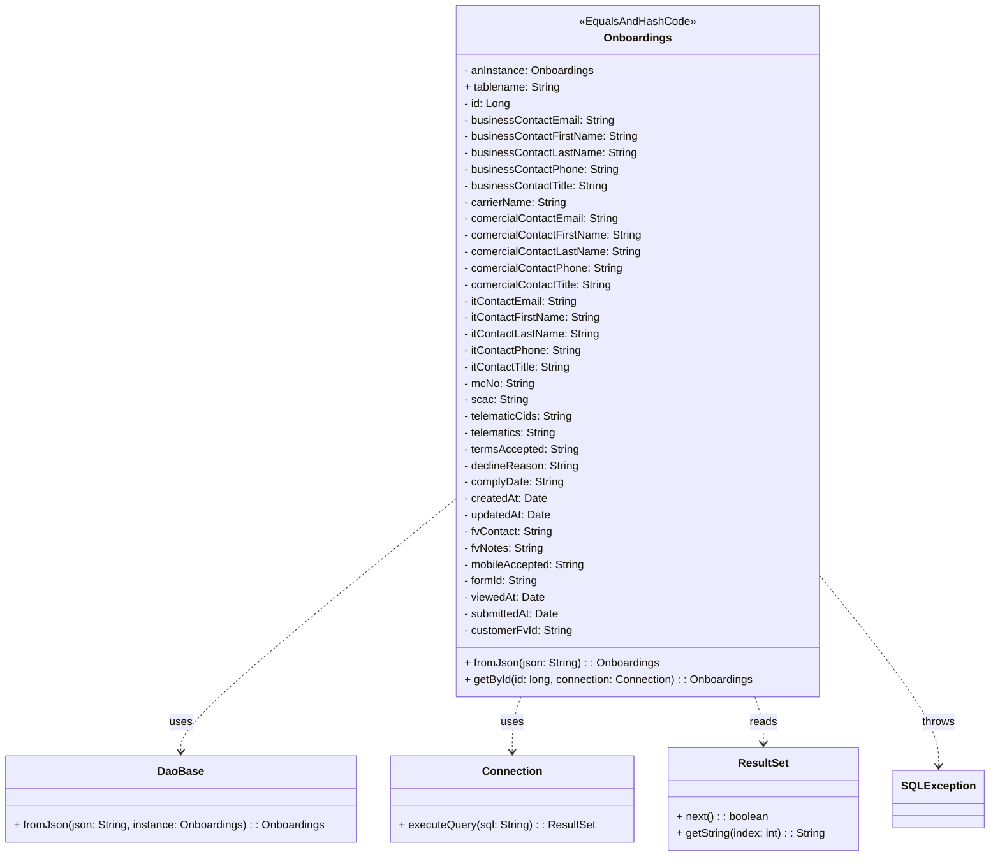

# Diagram: platform-java-lambdas/shipment/src/main/java/com/freightverify/shipment/datastore/postgresql/dao/Onboardings.java

> Auto-generated by Obscura crawlers

## Mermaid

### SVG

<svg id="container" width="1425.5" xmlns="http://www.w3.org/2000/svg" class="classDiagram" height="1248" viewBox="0 0 1425.5 1248" role="graphics-document document" aria-roledescription="class"><g><defs><marker id="container_class-aggregationStart" class="marker aggregation class" refX="18" refY="7" markerWidth="190" markerHeight="240" orient="auto"><path d="M 18,7 L9,13 L1,7 L9,1 Z"></path></marker></defs><defs><marker id="container_class-aggregationEnd" class="marker aggregation class" refX="1" refY="7" markerWidth="20" markerHeight="28" orient="auto"><path d="M 18,7 L9,13 L1,7 L9,1 Z"></path></marker></defs><defs><marker id="container_class-extensionStart" class="marker extension class" refX="18" refY="7" markerWidth="190" markerHeight="240" orient="auto"><path d="M 1,7 L18,13 V 1 Z"></path></marker></defs><defs><marker id="container_class-extensionEnd" class="marker extension class" refX="1" refY="7" markerWidth="20" markerHeight="28" orient="auto"><path d="M 1,1 V 13 L18,7 Z"></path></marker></defs><defs><marker id="container_class-compositionStart" class="marker composition class" refX="18" refY="7" markerWidth="190" markerHeight="240" orient="auto"><path d="M 18,7 L9,13 L1,7 L9,1 Z"></path></marker></defs><defs><marker id="container_class-compositionEnd" class="marker composition class" refX="1" refY="7" markerWidth="20" markerHeight="28" orient="auto"><path d="M 18,7 L9,13 L1,7 L9,1 Z"></path></marker></defs><defs><marker id="container_class-dependencyStart" class="marker dependency class" refX="6" refY="7" markerWidth="190" markerHeight="240" orient="auto"><path d="M 5,7 L9,13 L1,7 L9,1 Z"></path></marker></defs><defs><marker id="container_class-dependencyEnd" class="marker dependency class" refX="13" refY="7" markerWidth="20" markerHeight="28" orient="auto"><path d="M 18,7 L9,13 L14,7 L9,1 Z"></path></marker></defs><defs><marker id="container_class-lollipopStart" class="marker lollipop class" refX="13" refY="7" markerWidth="190" markerHeight="240" orient="auto"><circle stroke="black" fill="transparent" cx="7" cy="7" r="6"></circle></marker></defs><defs><marker id="container_class-lollipopEnd" class="marker lollipop class" refX="1" refY="7" markerWidth="190" markerHeight="240" orient="auto"><circle stroke="black" fill="transparent" cx="7" cy="7" r="6"></circle></marker></defs><g class="root"><g class="clusters"></g><g class="edgePaths"><path d="M657.791,729.136L591.889,783.113C525.987,837.091,394.183,945.045,328.281,1006.189C262.379,1067.333,262.379,1081.667,262.379,1088.833L262.379,1096" id="id_Onboardings_DaoBase_1" class="edge-thickness-normal edge-pattern-dashed relation" style=";;;" data-edge="true" data-et="edge" data-id="id_Onboardings_DaoBase_1" data-points="W3sieCI6NjU3Ljc5MTAxNTYyNSwieSI6NzI5LjEzNTg2OTQyMDU4MzR9LHsieCI6MjYyLjM3ODkwNjI1LCJ5IjoxMDUzfSx7IngiOjI2Mi4zNzg5MDYyNSwieSI6MTEwMn1d" marker-end="url(#container_class-dependencyEnd)"></path><path d="M753.589,1016L751.518,1022.167C749.446,1028.333,745.303,1040.667,743.232,1054C741.16,1067.333,741.16,1081.667,741.16,1088.833L741.16,1096" id="id_Onboardings_Connection_2" class="edge-thickness-normal edge-pattern-dashed relation" style=";;;" data-edge="true" data-et="edge" data-id="id_Onboardings_Connection_2" data-points="W3sieCI6NzUzLjU4OTQ0MzAxNjQwNDksInkiOjEwMTZ9LHsieCI6NzQxLjE2MDE1NjI1LCJ5IjoxMDUzfSx7IngiOjc0MS4xNjAxNTYyNSwieSI6MTEwMn1d" marker-end="url(#container_class-dependencyEnd)"></path><path d="M1092.204,1016L1094.275,1022.167C1096.347,1028.333,1100.49,1040.667,1102.561,1052C1104.633,1063.333,1104.633,1073.667,1104.633,1078.833L1104.633,1084" id="id_Onboardings_ResultSet_3" class="edge-thickness-normal edge-pattern-dashed relation" style=";;;" data-edge="true" data-et="edge" data-id="id_Onboardings_ResultSet_3" data-points="W3sieCI6MTA5Mi4yMDM1MjU3MzM1OTUxLCJ5IjoxMDE2fSx7IngiOjExMDQuNjMyODEyNSwieSI6MTA1M30seyJ4IjoxMTA0LjYzMjgxMjUsInkiOjEwOTB9XQ==" marker-end="url(#container_class-dependencyEnd)"></path><path d="M1188.002,843.455L1215.935,878.379C1243.868,913.303,1299.735,983.152,1327.668,1028.742C1355.602,1074.333,1355.602,1095.667,1355.602,1106.333L1355.602,1117" id="id_Onboardings_SQLException_4" class="edge-thickness-normal edge-pattern-dashed relation" style=";;;" data-edge="true" data-et="edge" data-id="id_Onboardings_SQLException_4" data-points="W3sieCI6MTE4OC4wMDE5NTMxMjUsInkiOjg0My40NTQ1MzA2ODIyNTQyfSx7IngiOjEzNTUuNjAxNTYyNSwieSI6MTA1M30seyJ4IjoxMzU1LjYwMTU2MjUsInkiOjExMjN9XQ==" marker-end="url(#container_class-dependencyEnd)"></path></g><g class="edgeLabels"><g class="edgeLabel" transform="translate(262.37890625, 1053)"><g class="label" data-id="id_Onboardings_DaoBase_1" transform="translate(-16.4921875, -12)"><foreignObject width="32.984375" height="24">

uses

</foreignObject></g></g><g class="edgeLabel" transform="translate(741.16015625, 1053)"><g class="label" data-id="id_Onboardings_Connection_2" transform="translate(-16.4921875, -12)"><foreignObject width="32.984375" height="24">

uses

</foreignObject></g></g><g class="edgeLabel" transform="translate(1104.6328125, 1053)"><g class="label" data-id="id_Onboardings_ResultSet_3" transform="translate(-20.0078125, -12)"><foreignObject width="40.015625" height="24">

reads

</foreignObject></g></g><g class="edgeLabel" transform="translate(1355.6015625, 1053)"><g class="label" data-id="id_Onboardings_SQLException_4" transform="translate(-24.5703125, -12)"><foreignObject width="49.140625" height="24">

throws

</foreignObject></g></g></g><g class="nodes"><g class="node default" id="classId-Onboardings-0" transform="translate(922.896484375, 512)"><g class="basic label-container"><path d="M-265.10546875 -504 L265.10546875 -504 L265.10546875 504 L-265.10546875 504" stroke="none" stroke-width="0" fill="#ECECFF" style=""></path><path d="M-265.10546875 -504 C-76.59950898112737 -504, 111.90645078774526 -504, 265.10546875 -504 M-265.10546875 -504 C-153.87996047873813 -504, -42.654452207476254 -504, 265.10546875 -504 M265.10546875 -504 C265.10546875 -292.41807743875484, 265.10546875 -80.83615487750973, 265.10546875 504 M265.10546875 -504 C265.10546875 -173.45256281071357, 265.10546875 157.09487437857285, 265.10546875 504 M265.10546875 504 C112.89695955270122 504, -39.31154964459756 504, -265.10546875 504 M265.10546875 504 C98.86455232446437 504, -67.37636410107126 504, -265.10546875 504 M-265.10546875 504 C-265.10546875 206.7527142603961, -265.10546875 -90.49457147920782, -265.10546875 -504 M-265.10546875 504 C-265.10546875 196.79387323480148, -265.10546875 -110.41225353039704, -265.10546875 -504" stroke="#9370DB" stroke-width="1.3" fill="none" stroke-dasharray="0 0" style=""></path></g><g class="annotation-group text" transform="translate(-83.2109375, -480)"><g class="label" style="" transform="translate(0,-12)"><foreignObject width="166.421875" height="24">

«EqualsAndHashCode»

</foreignObject></g></g><g class="label-group text" transform="translate(-46.7421875, -456)"><g class="label" style="font-weight: bolder" transform="translate(0,-12)"><foreignObject width="93.484375" height="24">

Onboardings

</foreignObject></g></g><g class="members-group text" transform="translate(-253.10546875, -408)"><g class="label" style="" transform="translate(0,-12)"><foreignObject width="190.890625" height="24">

- anInstance: Onboardings

</foreignObject></g><g class="label" style="" transform="translate(0,12)"><foreignObject width="140.90625" height="24">

+ tablename: String

</foreignObject></g><g class="label" style="" transform="translate(0,36)"><foreignObject width="67.46875" height="24">

- id: Long

</foreignObject></g><g class="label" style="" transform="translate(0,60)"><foreignObject width="220.671875" height="24">

- businessContactEmail: String

</foreignObject></g><g class="label" style="" transform="translate(0,84)"><foreignObject width="253.546875" height="24">

- businessContactFirstName: String

</foreignObject></g><g class="label" style="" transform="translate(0,108)"><foreignObject width="252.15625" height="24">

- businessContactLastName: String

</foreignObject></g><g class="label" style="" transform="translate(0,132)"><foreignObject width="226.28125" height="24">

- businessContactPhone: String

</foreignObject></g><g class="label" style="" transform="translate(0,156)"><foreignObject width="212.21875" height="24">

- businessContactTitle: String

</foreignObject></g><g class="label" style="" transform="translate(0,180)"><foreignObject width="151.671875" height="24">

- carrierName: String

</foreignObject></g><g class="label" style="" transform="translate(0,204)"><foreignObject width="227.171875" height="24">

- comercialContactEmail: String

</foreignObject></g><g class="label" style="" transform="translate(0,228)"><foreignObject width="260.0625" height="24">

- comercialContactFirstName: String

</foreignObject></g><g class="label" style="" transform="translate(0,252)"><foreignObject width="258.671875" height="24">

- comercialContactLastName: String

</foreignObject></g><g class="label" style="" transform="translate(0,276)"><foreignObject width="232.796875" height="24">

- comercialContactPhone: String

</foreignObject></g><g class="label" style="" transform="translate(0,300)"><foreignObject width="218.734375" height="24">

- comercialContactTitle: String

</foreignObject></g><g class="label" style="" transform="translate(0,324)"><foreignObject width="167.265625" height="24">

- itContactEmail: String

</foreignObject></g><g class="label" style="" transform="translate(0,348)"><foreignObject width="200.15625" height="24">

- itContactFirstName: String

</foreignObject></g><g class="label" style="" transform="translate(0,372)"><foreignObject width="198.765625" height="24">

- itContactLastName: String

</foreignObject></g><g class="label" style="" transform="translate(0,396)"><foreignObject width="172.890625" height="24">

- itContactPhone: String

</foreignObject></g><g class="label" style="" transform="translate(0,420)"><foreignObject width="158.828125" height="24">

- itContactTitle: String

</foreignObject></g><g class="label" style="" transform="translate(0,444)"><foreignObject width="103.28125" height="24">

- mcNo: String

</foreignObject></g><g class="label" style="" transform="translate(0,468)"><foreignObject width="93.03125" height="24">

- scac: String

</foreignObject></g><g class="label" style="" transform="translate(0,492)"><foreignObject width="160.109375" height="24">

- telematicCids: String

</foreignObject></g><g class="label" style="" transform="translate(0,516)"><foreignObject width="137.0625" height="24">

- telematics: String

</foreignObject></g><g class="label" style="" transform="translate(0,540)"><foreignObject width="169.140625" height="24">

- termsAccepted: String

</foreignObject></g><g class="label" style="" transform="translate(0,564)"><foreignObject width="167.625" height="24">

- declineReason: String

</foreignObject></g><g class="label" style="" transform="translate(0,588)"><foreignObject width="147.046875" height="24">

- complyDate: String

</foreignObject></g><g class="label" style="" transform="translate(0,612)"><foreignObject width="121.3125" height="24">

- createdAt: Date

</foreignObject></g><g class="label" style="" transform="translate(0,636)"><foreignObject width="127.796875" height="24">

- updatedAt: Date

</foreignObject></g><g class="label" style="" transform="translate(0,660)"><foreignObject width="130.109375" height="24">

- fvContact: String

</foreignObject></g><g class="label" style="" transform="translate(0,684)"><foreignObject width="116.890625" height="24">

- fvNotes: String

</foreignObject></g><g class="label" style="" transform="translate(0,708)"><foreignObject width="177.921875" height="24">

- mobileAccepted: String

</foreignObject></g><g class="label" style="" transform="translate(0,732)"><foreignObject width="110.375" height="24">

- formId: String

</foreignObject></g><g class="label" style="" transform="translate(0,756)"><foreignObject width="117.75" height="24">

- viewedAt: Date

</foreignObject></g><g class="label" style="" transform="translate(0,780)"><foreignObject width="141" height="24">

- submittedAt: Date

</foreignObject></g><g class="label" style="" transform="translate(0,804)"><foreignObject width="158.875" height="24">

- customerFvId: String

</foreignObject></g></g><g class="methods-group text" transform="translate(-253.10546875, 456)"><g class="label" style="" transform="translate(0,-12)"><foreignObject width="283.0625" height="24">

+ fromJson(json: String) : : Onboardings

</foreignObject></g><g class="label" style="" transform="translate(0,12)"><foreignObject width="423" height="24">

+ getById(id: long, connection: Connection) : : Onboardings

</foreignObject></g></g><g class="divider" style=""><path d="M-265.10546875 -432 C-115.92541406246184 -432, 33.25464062507632 -432, 265.10546875 -432 M-265.10546875 -432 C-54.484305266442135 -432, 156.13685821711573 -432, 265.10546875 -432" stroke="#9370DB" stroke-width="1.3" fill="none" stroke-dasharray="0 0" style=""></path></g><g class="divider" style=""><path d="M-265.10546875 432 C-67.71112932161788 432, 129.68321010676425 432, 265.10546875 432 M-265.10546875 432 C-99.6212859012214 432, 65.8628969475572 432, 265.10546875 432" stroke="#9370DB" stroke-width="1.3" fill="none" stroke-dasharray="0 0" style=""></path></g></g><g class="node default" id="classId-DaoBase-1" transform="translate(262.37890625, 1165)"><g class="basic label-container"><path d="M-254.37890625 -63 L254.37890625 -63 L254.37890625 63 L-254.37890625 63" stroke="none" stroke-width="0" fill="#ECECFF" style=""></path><path d="M-254.37890625 -63 C-89.04626405759132 -63, 76.28637813481737 -63, 254.37890625 -63 M-254.37890625 -63 C-83.14384261374917 -63, 88.09122102250166 -63, 254.37890625 -63 M254.37890625 -63 C254.37890625 -21.552443676976665, 254.37890625 19.89511264604667, 254.37890625 63 M254.37890625 -63 C254.37890625 -33.299129273935684, 254.37890625 -3.5982585478713673, 254.37890625 63 M254.37890625 63 C136.8841100051 63, 19.389313760199997 63, -254.37890625 63 M254.37890625 63 C62.111647398796265 63, -130.15561145240747 63, -254.37890625 63 M-254.37890625 63 C-254.37890625 31.527945520626773, -254.37890625 0.05589104125354538, -254.37890625 -63 M-254.37890625 63 C-254.37890625 19.752010518700395, -254.37890625 -23.49597896259921, -254.37890625 -63" stroke="#9370DB" stroke-width="1.3" fill="none" stroke-dasharray="0 0" style=""></path></g><g class="annotation-group text" transform="translate(0, -39)"></g><g class="label-group text" transform="translate(-31.7109375, -39)"><g class="label" style="font-weight: bolder" transform="translate(0,-12)"><foreignObject width="63.421875" height="24">

DaoBase

</foreignObject></g></g><g class="members-group text" transform="translate(-242.37890625, 9)"></g><g class="methods-group text" transform="translate(-242.37890625, 39)"><g class="label" style="" transform="translate(0,-12)"><foreignObject width="453.046875" height="24">

+ fromJson(json: String, instance: Onboardings) : : Onboardings

</foreignObject></g></g><g class="divider" style=""><path d="M-254.37890625 -15 C-85.52339029634894 -15, 83.33212565730213 -15, 254.37890625 -15 M-254.37890625 -15 C-88.23361017665411 -15, 77.91168589669178 -15, 254.37890625 -15" stroke="#9370DB" stroke-width="1.3" fill="none" stroke-dasharray="0 0" style=""></path></g><g class="divider" style=""><path d="M-254.37890625 9 C-92.39300629471254 9, 69.59289366057493 9, 254.37890625 9 M-254.37890625 9 C-143.6007382405686 9, -32.822570231137234 9, 254.37890625 9" stroke="#9370DB" stroke-width="1.3" fill="none" stroke-dasharray="0 0" style=""></path></g></g><g class="node default" id="classId-Connection-2" transform="translate(741.16015625, 1165)"><g class="basic label-container"><path d="M-174.40234375 -63 L174.40234375 -63 L174.40234375 63 L-174.40234375 63" stroke="none" stroke-width="0" fill="#ECECFF" style=""></path><path d="M-174.40234375 -63 C-77.64622463842632 -63, 19.109894473147364 -63, 174.40234375 -63 M-174.40234375 -63 C-103.42702779033222 -63, -32.451711830664436 -63, 174.40234375 -63 M174.40234375 -63 C174.40234375 -36.99569045405087, 174.40234375 -10.991380908101746, 174.40234375 63 M174.40234375 -63 C174.40234375 -35.602819924778615, 174.40234375 -8.20563984955723, 174.40234375 63 M174.40234375 63 C47.24183850515371 63, -79.91866673969258 63, -174.40234375 63 M174.40234375 63 C96.55204002088495 63, 18.70173629176989 63, -174.40234375 63 M-174.40234375 63 C-174.40234375 20.733252855976545, -174.40234375 -21.53349428804691, -174.40234375 -63 M-174.40234375 63 C-174.40234375 17.567650013209914, -174.40234375 -27.864699973580173, -174.40234375 -63" stroke="#9370DB" stroke-width="1.3" fill="none" stroke-dasharray="0 0" style=""></path></g><g class="annotation-group text" transform="translate(0, -39)"></g><g class="label-group text" transform="translate(-41.2265625, -39)"><g class="label" style="font-weight: bolder" transform="translate(0,-12)"><foreignObject width="82.453125" height="24">

Connection

</foreignObject></g></g><g class="members-group text" transform="translate(-162.40234375, 9)"></g><g class="methods-group text" transform="translate(-162.40234375, 39)"><g class="label" style="" transform="translate(0,-12)"><foreignObject width="283.578125" height="24">

+ executeQuery(sql: String) : : ResultSet

</foreignObject></g></g><g class="divider" style=""><path d="M-174.40234375 -15 C-38.370709541470774 -15, 97.66092466705845 -15, 174.40234375 -15 M-174.40234375 -15 C-65.75867787504103 -15, 42.88498799991794 -15, 174.40234375 -15" stroke="#9370DB" stroke-width="1.3" fill="none" stroke-dasharray="0 0" style=""></path></g><g class="divider" style=""><path d="M-174.40234375 9 C-60.413438334431405 9, 53.57546708113719 9, 174.40234375 9 M-174.40234375 9 C-56.722611525596676 9, 60.95712069880665 9, 174.40234375 9" stroke="#9370DB" stroke-width="1.3" fill="none" stroke-dasharray="0 0" style=""></path></g></g><g class="node default" id="classId-ResultSet-3" transform="translate(1104.6328125, 1165)"><g class="basic label-container"><path d="M-139.0703125 -75 L139.0703125 -75 L139.0703125 75 L-139.0703125 75" stroke="none" stroke-width="0" fill="#ECECFF" style=""></path><path d="M-139.0703125 -75 C-34.88225849574023 -75, 69.30579550851954 -75, 139.0703125 -75 M-139.0703125 -75 C-57.48041138538986 -75, 24.109489729220286 -75, 139.0703125 -75 M139.0703125 -75 C139.0703125 -27.401450928887684, 139.0703125 20.197098142224633, 139.0703125 75 M139.0703125 -75 C139.0703125 -28.062646227865173, 139.0703125 18.874707544269654, 139.0703125 75 M139.0703125 75 C67.95960383050132 75, -3.1511048389973553 75, -139.0703125 75 M139.0703125 75 C70.17335004449889 75, 1.2763875889977783 75, -139.0703125 75 M-139.0703125 75 C-139.0703125 23.620634694674045, -139.0703125 -27.75873061065191, -139.0703125 -75 M-139.0703125 75 C-139.0703125 26.70974716335212, -139.0703125 -21.58050567329576, -139.0703125 -75" stroke="#9370DB" stroke-width="1.3" fill="none" stroke-dasharray="0 0" style=""></path></g><g class="annotation-group text" transform="translate(0, -51)"></g><g class="label-group text" transform="translate(-35.21875, -51)"><g class="label" style="font-weight: bolder" transform="translate(0,-12)"><foreignObject width="70.4375" height="24">

ResultSet

</foreignObject></g></g><g class="members-group text" transform="translate(-127.0703125, -3)"></g><g class="methods-group text" transform="translate(-127.0703125, 27)"><g class="label" style="" transform="translate(0,-12)"><foreignObject width="133.921875" height="24">

+ next() : : boolean

</foreignObject></g><g class="label" style="" transform="translate(0,12)"><foreignObject width="218.921875" height="24">

+ getString(index: int) : : String

</foreignObject></g></g><g class="divider" style=""><path d="M-139.0703125 -27 C-49.06646050909326 -27, 40.93739148181348 -27, 139.0703125 -27 M-139.0703125 -27 C-79.23747525337585 -27, -19.404638006751696 -27, 139.0703125 -27" stroke="#9370DB" stroke-width="1.3" fill="none" stroke-dasharray="0 0" style=""></path></g><g class="divider" style=""><path d="M-139.0703125 -3 C-33.94479050796542 -3, 71.18073148406916 -3, 139.0703125 -3 M-139.0703125 -3 C-65.96920632276525 -3, 7.131899854469509 -3, 139.0703125 -3" stroke="#9370DB" stroke-width="1.3" fill="none" stroke-dasharray="0 0" style=""></path></g></g><g class="node default" id="classId-SQLException-4" transform="translate(1355.6015625, 1165)"><g class="basic label-container"><path d="M-61.8984375 -42 L61.8984375 -42 L61.8984375 42 L-61.8984375 42" stroke="none" stroke-width="0" fill="#ECECFF" style=""></path><path d="M-61.8984375 -42 C-28.26012513654903 -42, 5.378187226901943 -42, 61.8984375 -42 M-61.8984375 -42 C-27.52997573447881 -42, 6.838486031042379 -42, 61.8984375 -42 M61.8984375 -42 C61.8984375 -24.086510109341738, 61.8984375 -6.173020218683476, 61.8984375 42 M61.8984375 -42 C61.8984375 -22.192320717225915, 61.8984375 -2.3846414344518294, 61.8984375 42 M61.8984375 42 C15.522966141526986 42, -30.852505216946028 42, -61.8984375 42 M61.8984375 42 C20.25168684066874 42, -21.39506381866252 42, -61.8984375 42 M-61.8984375 42 C-61.8984375 24.648801161202577, -61.8984375 7.2976023224051545, -61.8984375 -42 M-61.8984375 42 C-61.8984375 11.200251018089332, -61.8984375 -19.599497963821335, -61.8984375 -42" stroke="#9370DB" stroke-width="1.3" fill="none" stroke-dasharray="0 0" style=""></path></g><g class="annotation-group text" transform="translate(0, -18)"></g><g class="label-group text" transform="translate(-49.8984375, -18)"><g class="label" style="font-weight: bolder" transform="translate(0,-12)"><foreignObject width="99.796875" height="24">

SQLException

</foreignObject></g></g><g class="members-group text" transform="translate(-49.8984375, 30)"></g><g class="methods-group text" transform="translate(-49.8984375, 60)"></g><g class="divider" style=""><path d="M-61.8984375 6 C-15.17028887166915 6, 31.5578597566617 6, 61.8984375 6 M-61.8984375 6 C-31.97391608434027 6, -2.0493946686805415 6, 61.8984375 6" stroke="#9370DB" stroke-width="1.3" fill="none" stroke-dasharray="0 0" style=""></path></g><g class="divider" style=""><path d="M-61.8984375 24 C-28.985369996203204 24, 3.9276975075935923 24, 61.8984375 24 M-61.8984375 24 C-31.509223043958716 24, -1.1200085879174324 24, 61.8984375 24" stroke="#9370DB" stroke-width="1.3" fill="none" stroke-dasharray="0 0" style=""></path></g></g></g></g></g></svg>
