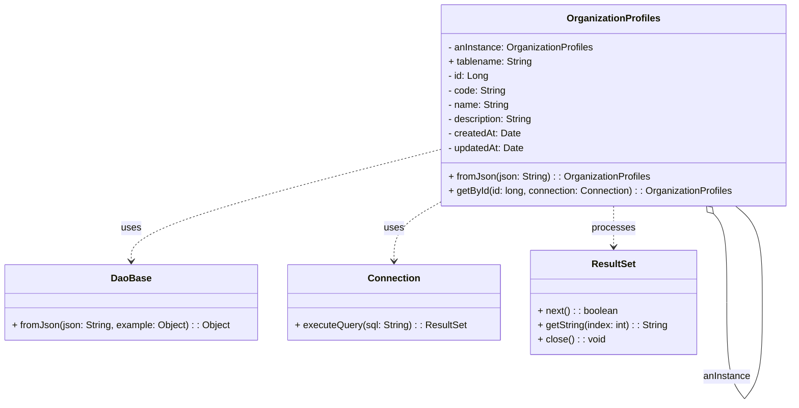
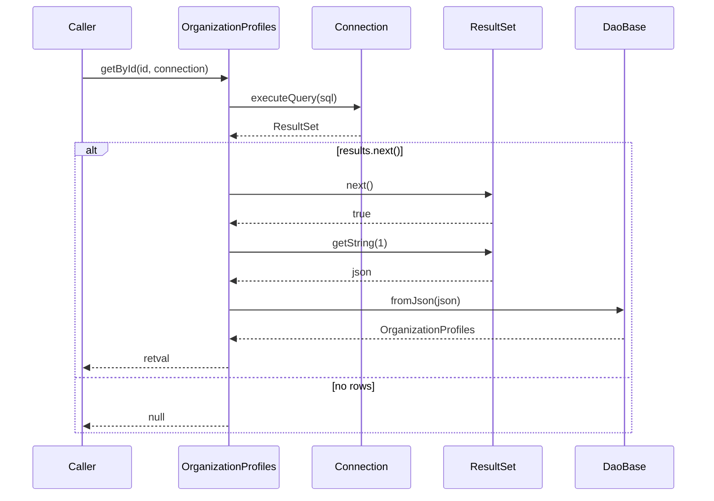

# Diagram: platform-java-lambdas/shipment/src/main/java/com/freightverify/shipment/datastore/postgresql/dao/OrganizationProfiles.java

> Auto-generated by Obscura crawlers

## Diagram 1

### SVG

<svg id="container" width="1309.28515625" xmlns="http://www.w3.org/2000/svg" class="classDiagram" height="674.1499633789062" viewBox="0 0 1309.28515625 674.1499633789062" role="graphics-document document" aria-roledescription="class"><g><defs><marker id="container_class-aggregationStart" class="marker aggregation class" refX="18" refY="7" markerWidth="190" markerHeight="240" orient="auto"><path d="M 18,7 L9,13 L1,7 L9,1 Z"></path></marker></defs><defs><marker id="container_class-aggregationEnd" class="marker aggregation class" refX="1" refY="7" markerWidth="20" markerHeight="28" orient="auto"><path d="M 18,7 L9,13 L1,7 L9,1 Z"></path></marker></defs><defs><marker id="container_class-extensionStart" class="marker extension class" refX="18" refY="7" markerWidth="190" markerHeight="240" orient="auto"><path d="M 1,7 L18,13 V 1 Z"></path></marker></defs><defs><marker id="container_class-extensionEnd" class="marker extension class" refX="1" refY="7" markerWidth="20" markerHeight="28" orient="auto"><path d="M 1,1 V 13 L18,7 Z"></path></marker></defs><defs><marker id="container_class-compositionStart" class="marker composition class" refX="18" refY="7" markerWidth="190" markerHeight="240" orient="auto"><path d="M 18,7 L9,13 L1,7 L9,1 Z"></path></marker></defs><defs><marker id="container_class-compositionEnd" class="marker composition class" refX="1" refY="7" markerWidth="20" markerHeight="28" orient="auto"><path d="M 18,7 L9,13 L1,7 L9,1 Z"></path></marker></defs><defs><marker id="container_class-dependencyStart" class="marker dependency class" refX="6" refY="7" markerWidth="190" markerHeight="240" orient="auto"><path d="M 5,7 L9,13 L1,7 L9,1 Z"></path></marker></defs><defs><marker id="container_class-dependencyEnd" class="marker dependency class" refX="13" refY="7" markerWidth="20" markerHeight="28" orient="auto"><path d="M 18,7 L9,13 L14,7 L9,1 Z"></path></marker></defs><defs><marker id="container_class-lollipopStart" class="marker lollipop class" refX="13" refY="7" markerWidth="190" markerHeight="240" orient="auto"><circle stroke="black" fill="transparent" cx="7" cy="7" r="6"></circle></marker></defs><defs><marker id="container_class-lollipopEnd" class="marker lollipop class" refX="1" refY="7" markerWidth="190" markerHeight="240" orient="auto"><circle stroke="black" fill="transparent" cx="7" cy="7" r="6"></circle></marker></defs><g class="root"><g class="clusters"></g><g class="edgePaths"><path d="M726.48,249.935L641.568,271.779C556.655,293.624,386.829,337.312,301.917,368.323C217.004,399.333,217.004,417.667,217.004,426.833L217.004,436" id="id_OrganizationProfiles_DaoBase_1" class="edge-thickness-normal edge-pattern-dashed relation" style=";;;" data-edge="true" data-et="edge" data-id="id_OrganizationProfiles_DaoBase_1" data-points="W3sieCI6NzI2LjQ4MDQ2ODc1LCJ5IjoyNDkuOTM1Mjk5MzM2NzY3OTd9LHsieCI6MjE3LjAwMzkwNjI1LCJ5IjozODF9LHsieCI6MjE3LjAwMzkwNjI1LCJ5Ijo0NDJ9XQ==" marker-end="url(#container_class-dependencyEnd)"></path><path d="M726.48,338.096L713.802,345.247C701.124,352.397,675.767,366.699,663.089,383.016C650.41,399.333,650.41,417.667,650.41,426.833L650.41,436" id="id_OrganizationProfiles_Connection_2" class="edge-thickness-normal edge-pattern-dashed relation" style=";;;" data-edge="true" data-et="edge" data-id="id_OrganizationProfiles_Connection_2" data-points="W3sieCI6NzI2LjQ4MDQ2ODc1LCJ5IjozMzguMDk2MDQ2MTY5MjIyNjN9LHsieCI6NjUwLjQxMDE1NjI1LCJ5IjozODF9LHsieCI6NjUwLjQxMDE1NjI1LCJ5Ijo0NDJ9XQ==" marker-end="url(#container_class-dependencyEnd)"></path><path d="M1013.883,344L1013.883,350.167C1013.883,356.333,1013.883,368.667,1013.883,380C1013.883,391.333,1013.883,401.667,1013.883,406.833L1013.883,412" id="id_OrganizationProfiles_ResultSet_3" class="edge-thickness-normal edge-pattern-dashed relation" style=";;;" data-edge="true" data-et="edge" data-id="id_OrganizationProfiles_ResultSet_3" data-points="W3sieCI6MTAxMy44ODI4MTI1LCJ5IjozNDR9LHsieCI6MTAxMy44ODI4MTI1LCJ5IjozODF9LHsieCI6MTAxMy44ODI4MTI1LCJ5Ijo0MTh9XQ==" marker-end="url(#container_class-dependencyEnd)"></path><path d="M1180.566,356.679L1184.305,360.732C1188.045,364.786,1195.524,372.893,1199.264,397.605C1203.003,422.317,1203.003,463.633,1203.003,484.292L1203.003,504.95" id="OrganizationProfiles-cyclic-special-1" class="edge-thickness-normal edge-pattern-solid relation" style=";;;" data-edge="true" data-et="edge" data-id="OrganizationProfiles-cyclic-special-1" data-points="W3sieCI6MTE2OC44NjkyMTQ5Mzk2MzUsInkiOjM0NH0seyJ4IjoxMjAzLjAwMzEyNTAwMDc0NSwieSI6MzgxfSx7IngiOjEyMDMuMDAzMTI1MDAwNzQ1LCJ5Ijo1MDQuOTQ5OTk5OTk5MjU0OTR9XQ==" marker-start="url(#container_class-aggregationStart)"></path><path d="M1203.003,505.05L1203.003,525.708C1203.003,546.367,1203.003,587.683,1207.974,614.508C1212.944,641.333,1222.885,653.667,1227.856,659.833L1232.826,666" id="OrganizationProfiles-cyclic-special-mid" class="edge-thickness-normal edge-pattern-solid relation" style=";;;" data-edge="true" data-et="edge" data-id="OrganizationProfiles-cyclic-special-mid" data-points="W3sieCI6MTIwMy4wMDMxMjUwMDA3NDUsInkiOjUwNS4wNTAwMDAwMDA3NDUwNn0seyJ4IjoxMjAzLjAwMzEyNTAwMDc0NSwieSI6NjI5fSx7IngiOjEyMzIuODI2MTA0OTI1OTIxMywieSI6NjY2fV0="></path><path d="M1232.907,666L1237.877,659.833C1242.848,653.667,1252.789,641.333,1257.759,614.5C1262.73,587.667,1262.73,546.333,1262.73,505C1262.73,463.667,1262.73,422.333,1255.244,395.5C1247.758,368.667,1232.787,356.333,1225.301,350.167L1217.816,344" id="OrganizationProfiles-cyclic-special-2" class="edge-thickness-normal edge-pattern-solid relation" style=";;;" data-edge="true" data-et="edge" data-id="OrganizationProfiles-cyclic-special-2" data-points="W3sieCI6MTIzMi45MDY3MDc1NzU1Njg4LCJ5Ijo2NjZ9LHsieCI6MTI2Mi43Mjk2ODc1MDA3NDUsInkiOjYyOX0seyJ4IjoxMjYyLjcyOTY4NzUwMDc0NSwieSI6NTA1fSx7IngiOjEyNjIuNzI5Njg3NTAwNzQ1LCJ5IjozODF9LHsieCI6MTIxNy44MTU4NjEyODEwOTg1LCJ5IjozNDR9XQ=="></path></g><g class="edgeLabels"><g class="edgeLabel" transform="translate(217.00390625, 381)"><g class="label" data-id="id_OrganizationProfiles_DaoBase_1" transform="translate(-16.4921875, -12)"><foreignObject width="32.984375" height="24">

uses

</foreignObject></g></g><g class="edgeLabel" transform="translate(650.41015625, 381)"><g class="label" data-id="id_OrganizationProfiles_Connection_2" transform="translate(-16.4921875, -12)"><foreignObject width="32.984375" height="24">

uses

</foreignObject></g></g><g class="edgeLabel" transform="translate(1013.8828125, 381)"><g class="label" data-id="id_OrganizationProfiles_ResultSet_3" transform="translate(-35.7890625, -12)"><foreignObject width="71.578125" height="24">

processes

</foreignObject></g></g><g class="edgeLabel"><g class="label" data-id="OrganizationProfiles-cyclic-special-1" transform="translate(0, 0)"><foreignObject width="0" height="0">

</foreignObject></g></g><g class="edgeLabel" transform="translate(1203.003125000745, 629)"><g class="label" data-id="OrganizationProfiles-cyclic-special-mid" transform="translate(-39.7265625, -12)"><foreignObject width="79.453125" height="24">

anInstance

</foreignObject></g></g><g class="edgeLabel"><g class="label" data-id="OrganizationProfiles-cyclic-special-2" transform="translate(0, 0)"><foreignObject width="0" height="0">

</foreignObject></g></g></g><g class="nodes"><g class="node default" id="classId-OrganizationProfiles-0" transform="translate(1013.8828125, 176)"><g class="basic label-container"><path d="M-287.40234375 -168 L287.40234375 -168 L287.40234375 168 L-287.40234375 168" stroke="none" stroke-width="0" fill="#ECECFF" style=""></path><path d="M-287.40234375 -168 C-77.21165086643185 -168, 132.9790420171363 -168, 287.40234375 -168 M-287.40234375 -168 C-75.53525774690362 -168, 136.33182825619275 -168, 287.40234375 -168 M287.40234375 -168 C287.40234375 -91.3126476646372, 287.40234375 -14.625295329274394, 287.40234375 168 M287.40234375 -168 C287.40234375 -75.08682166951112, 287.40234375 17.82635666097775, 287.40234375 168 M287.40234375 168 C88.50572500824802 168, -110.39089373350396 168, -287.40234375 168 M287.40234375 168 C76.88233856330206 168, -133.6376666233959 168, -287.40234375 168 M-287.40234375 168 C-287.40234375 49.632144775749666, -287.40234375 -68.73571044850067, -287.40234375 -168 M-287.40234375 168 C-287.40234375 82.79382589938125, -287.40234375 -2.4123482012375064, -287.40234375 -168" stroke="#9370DB" stroke-width="1.3" fill="none" stroke-dasharray="0 0" style=""></path></g><g class="annotation-group text" transform="translate(0, -144)"></g><g class="label-group text" transform="translate(-74.3828125, -144)"><g class="label" style="font-weight: bolder" transform="translate(0,-12)"><foreignObject width="148.765625" height="24">

OrganizationProfiles

</foreignObject></g></g><g class="members-group text" transform="translate(-275.40234375, -96)"><g class="label" style="" transform="translate(0,-12)"><foreignObject width="244.3125" height="24">

- anInstance: OrganizationProfiles

</foreignObject></g><g class="label" style="" transform="translate(0,12)"><foreignObject width="140.90625" height="24">

+ tablename: String

</foreignObject></g><g class="label" style="" transform="translate(0,36)"><foreignObject width="67.46875" height="24">

- id: Long

</foreignObject></g><g class="label" style="" transform="translate(0,60)"><foreignObject width="96.609375" height="24">

- code: String

</foreignObject></g><g class="label" style="" transform="translate(0,84)"><foreignObject width="102.171875" height="24">

- name: String

</foreignObject></g><g class="label" style="" transform="translate(0,108)"><foreignObject width="144.265625" height="24">

- description: String

</foreignObject></g><g class="label" style="" transform="translate(0,132)"><foreignObject width="121.3125" height="24">

- createdAt: Date

</foreignObject></g><g class="label" style="" transform="translate(0,156)"><foreignObject width="127.796875" height="24">

- updatedAt: Date

</foreignObject></g></g><g class="methods-group text" transform="translate(-275.40234375, 120)"><g class="label" style="" transform="translate(0,-12)"><foreignObject width="336.484375" height="24">

+ fromJson(json: String) : : OrganizationProfiles

</foreignObject></g><g class="label" style="" transform="translate(0,12)"><foreignObject width="476.421875" height="24">

+ getById(id: long, connection: Connection) : : OrganizationProfiles

</foreignObject></g></g><g class="divider" style=""><path d="M-287.40234375 -120 C-145.37346078658385 -120, -3.344577823167697 -120, 287.40234375 -120 M-287.40234375 -120 C-162.04435724949096 -120, -36.686370748981915 -120, 287.40234375 -120" stroke="#9370DB" stroke-width="1.3" fill="none" stroke-dasharray="0 0" style=""></path></g><g class="divider" style=""><path d="M-287.40234375 96 C-121.98280010955631 96, 43.436743530887384 96, 287.40234375 96 M-287.40234375 96 C-82.68266617483587 96, 122.03701140032825 96, 287.40234375 96" stroke="#9370DB" stroke-width="1.3" fill="none" stroke-dasharray="0 0" style=""></path></g></g><g class="node default" id="classId-DaoBase-1" transform="translate(217.00390625, 505)"><g class="basic label-container"><path d="M-209.00390625 -63 L209.00390625 -63 L209.00390625 63 L-209.00390625 63" stroke="none" stroke-width="0" fill="#ECECFF" style=""></path><path d="M-209.00390625 -63 C-57.9808814359817 -63, 93.0421433780366 -63, 209.00390625 -63 M-209.00390625 -63 C-52.47872094952584 -63, 104.04646435094833 -63, 209.00390625 -63 M209.00390625 -63 C209.00390625 -35.36280180171817, 209.00390625 -7.7256036034363404, 209.00390625 63 M209.00390625 -63 C209.00390625 -26.29299969464372, 209.00390625 10.414000610712563, 209.00390625 63 M209.00390625 63 C117.98911186952718 63, 26.974317489054357 63, -209.00390625 63 M209.00390625 63 C64.91007739528146 63, -79.18375145943708 63, -209.00390625 63 M-209.00390625 63 C-209.00390625 14.193528672115548, -209.00390625 -34.612942655768904, -209.00390625 -63 M-209.00390625 63 C-209.00390625 35.15267728150708, -209.00390625 7.30535456301417, -209.00390625 -63" stroke="#9370DB" stroke-width="1.3" fill="none" stroke-dasharray="0 0" style=""></path></g><g class="annotation-group text" transform="translate(0, -39)"></g><g class="label-group text" transform="translate(-31.7109375, -39)"><g class="label" style="font-weight: bolder" transform="translate(0,-12)"><foreignObject width="63.421875" height="24">

DaoBase

</foreignObject></g></g><g class="members-group text" transform="translate(-197.00390625, 9)"></g><g class="methods-group text" transform="translate(-197.00390625, 39)"><g class="label" style="" transform="translate(0,-12)"><foreignObject width="362.296875" height="24">

+ fromJson(json: String, example: Object) : : Object

</foreignObject></g></g><g class="divider" style=""><path d="M-209.00390625 -15 C-116.22415580401551 -15, -23.44440535803102 -15, 209.00390625 -15 M-209.00390625 -15 C-122.28002694151607 -15, -35.55614763303214 -15, 209.00390625 -15" stroke="#9370DB" stroke-width="1.3" fill="none" stroke-dasharray="0 0" style=""></path></g><g class="divider" style=""><path d="M-209.00390625 9 C-72.97024807133786 9, 63.06341010732427 9, 209.00390625 9 M-209.00390625 9 C-102.65235119730667 9, 3.6992038553866564 9, 209.00390625 9" stroke="#9370DB" stroke-width="1.3" fill="none" stroke-dasharray="0 0" style=""></path></g></g><g class="node default" id="classId-Connection-2" transform="translate(650.41015625, 505)"><g class="basic label-container"><path d="M-174.40234375 -63 L174.40234375 -63 L174.40234375 63 L-174.40234375 63" stroke="none" stroke-width="0" fill="#ECECFF" style=""></path><path d="M-174.40234375 -63 C-84.64433031139711 -63, 5.113683127205775 -63, 174.40234375 -63 M-174.40234375 -63 C-97.53600223384551 -63, -20.669660717691016 -63, 174.40234375 -63 M174.40234375 -63 C174.40234375 -25.5982231795834, 174.40234375 11.8035536408332, 174.40234375 63 M174.40234375 -63 C174.40234375 -12.877781087080827, 174.40234375 37.24443782583835, 174.40234375 63 M174.40234375 63 C47.35600471721206 63, -79.69033431557588 63, -174.40234375 63 M174.40234375 63 C100.51138945963864 63, 26.620435169277272 63, -174.40234375 63 M-174.40234375 63 C-174.40234375 33.559360859592566, -174.40234375 4.118721719185132, -174.40234375 -63 M-174.40234375 63 C-174.40234375 29.50911925244121, -174.40234375 -3.9817614951175813, -174.40234375 -63" stroke="#9370DB" stroke-width="1.3" fill="none" stroke-dasharray="0 0" style=""></path></g><g class="annotation-group text" transform="translate(0, -39)"></g><g class="label-group text" transform="translate(-41.2265625, -39)"><g class="label" style="font-weight: bolder" transform="translate(0,-12)"><foreignObject width="82.453125" height="24">

Connection

</foreignObject></g></g><g class="members-group text" transform="translate(-162.40234375, 9)"></g><g class="methods-group text" transform="translate(-162.40234375, 39)"><g class="label" style="" transform="translate(0,-12)"><foreignObject width="283.578125" height="24">

+ executeQuery(sql: String) : : ResultSet

</foreignObject></g></g><g class="divider" style=""><path d="M-174.40234375 -15 C-69.53202839279837 -15, 35.33828696440327 -15, 174.40234375 -15 M-174.40234375 -15 C-87.05626469885037 -15, 0.2898143522992598 -15, 174.40234375 -15" stroke="#9370DB" stroke-width="1.3" fill="none" stroke-dasharray="0 0" style=""></path></g><g class="divider" style=""><path d="M-174.40234375 9 C-58.218553163480564 9, 57.96523742303887 9, 174.40234375 9 M-174.40234375 9 C-80.86581012242901 9, 12.670723505141979 9, 174.40234375 9" stroke="#9370DB" stroke-width="1.3" fill="none" stroke-dasharray="0 0" style=""></path></g></g><g class="node default" id="classId-ResultSet-3" transform="translate(1013.8828125, 505)"><g class="basic label-container"><path d="M-139.0703125 -87 L139.0703125 -87 L139.0703125 87 L-139.0703125 87" stroke="none" stroke-width="0" fill="#ECECFF" style=""></path><path d="M-139.0703125 -87 C-76.12040913310364 -87, -13.17050576620727 -87, 139.0703125 -87 M-139.0703125 -87 C-78.32402709502395 -87, -17.577741690047887 -87, 139.0703125 -87 M139.0703125 -87 C139.0703125 -38.37995910079236, 139.0703125 10.240081798415275, 139.0703125 87 M139.0703125 -87 C139.0703125 -27.153317276373613, 139.0703125 32.69336544725277, 139.0703125 87 M139.0703125 87 C33.02909833997795 87, -73.0121158200441 87, -139.0703125 87 M139.0703125 87 C65.28988853288888 87, -8.490535434222238 87, -139.0703125 87 M-139.0703125 87 C-139.0703125 25.63537578248468, -139.0703125 -35.72924843503064, -139.0703125 -87 M-139.0703125 87 C-139.0703125 20.911370428325768, -139.0703125 -45.177259143348465, -139.0703125 -87" stroke="#9370DB" stroke-width="1.3" fill="none" stroke-dasharray="0 0" style=""></path></g><g class="annotation-group text" transform="translate(0, -63)"></g><g class="label-group text" transform="translate(-35.21875, -63)"><g class="label" style="font-weight: bolder" transform="translate(0,-12)"><foreignObject width="70.4375" height="24">

ResultSet

</foreignObject></g></g><g class="members-group text" transform="translate(-127.0703125, -15)"></g><g class="methods-group text" transform="translate(-127.0703125, 15)"><g class="label" style="" transform="translate(0,-12)"><foreignObject width="133.921875" height="24">

+ next() : : boolean

</foreignObject></g><g class="label" style="" transform="translate(0,12)"><foreignObject width="218.921875" height="24">

+ getString(index: int) : : String

</foreignObject></g><g class="label" style="" transform="translate(0,36)"><foreignObject width="112.03125" height="24">

+ close() : : void

</foreignObject></g></g><g class="divider" style=""><path d="M-139.0703125 -39 C-55.88846201515534 -39, 27.29338846968932 -39, 139.0703125 -39 M-139.0703125 -39 C-42.91248636962176 -39, 53.24533976075648 -39, 139.0703125 -39" stroke="#9370DB" stroke-width="1.3" fill="none" stroke-dasharray="0 0" style=""></path></g><g class="divider" style=""><path d="M-139.0703125 -15 C-52.192973699344876 -15, 34.68436510131025 -15, 139.0703125 -15 M-139.0703125 -15 C-51.560599798713 -15, 35.949112902574 -15, 139.0703125 -15" stroke="#9370DB" stroke-width="1.3" fill="none" stroke-dasharray="0 0" style=""></path></g></g><g class="label edgeLabel" id="OrganizationProfiles---OrganizationProfiles---1" transform="translate(1203.003125000745, 505)"><rect width="0.1" height="0.1"></rect><g class="label" style="" transform="translate(0, 0)"><rect></rect><foreignObject width="0" height="0">

</foreignObject></g></g><g class="label edgeLabel" id="OrganizationProfiles---OrganizationProfiles---2" transform="translate(1232.866406250745, 666.0500000007451)"><rect width="0.1" height="0.1"></rect><g class="label" style="" transform="translate(0, 0)"><rect></rect><foreignObject width="0" height="0">

</foreignObject></g></g></g></g></g></svg>

## Diagram 2

### SVG

<svg id="container" width="1096" xmlns="http://www.w3.org/2000/svg" height="799" viewBox="-50 -10 1096 799" role="graphics-document document" aria-roledescription="sequence"><g><rect x="846" y="713" fill="#eaeaea" stroke="#666" width="150" height="65" name="DaoBase" rx="3" ry="3" class="actor actor-bottom"></rect><text x="921" y="745.5" dominant-baseline="central" alignment-baseline="central" class="actor actor-box" style="text-anchor: middle; font-size: 16px; font-weight: 400;"><tspan x="921" dy="0">DaoBase</tspan></text></g><g><rect x="646" y="713" fill="#eaeaea" stroke="#666" width="150" height="65" name="ResultSet" rx="3" ry="3" class="actor actor-bottom"></rect><text x="721" y="745.5" dominant-baseline="central" alignment-baseline="central" class="actor actor-box" style="text-anchor: middle; font-size: 16px; font-weight: 400;"><tspan x="721" dy="0">ResultSet</tspan></text></g><g><rect x="446" y="713" fill="#eaeaea" stroke="#666" width="150" height="65" name="Connection" rx="3" ry="3" class="actor actor-bottom"></rect><text x="521" y="745.5" dominant-baseline="central" alignment-baseline="central" class="actor actor-box" style="text-anchor: middle; font-size: 16px; font-weight: 400;"><tspan x="521" dy="0">Connection</tspan></text></g><g><rect x="230" y="713" fill="#eaeaea" stroke="#666" width="166" height="65" name="OrganizationProfiles" rx="3" ry="3" class="actor actor-bottom"></rect><text x="313" y="745.5" dominant-baseline="central" alignment-baseline="central" class="actor actor-box" style="text-anchor: middle; font-size: 16px; font-weight: 400;"><tspan x="313" dy="0">OrganizationProfiles</tspan></text></g><g><rect x="0" y="713" fill="#eaeaea" stroke="#666" width="150" height="65" name="Caller" rx="3" ry="3" class="actor actor-bottom"></rect><text x="75" y="745.5" dominant-baseline="central" alignment-baseline="central" class="actor actor-box" style="text-anchor: middle; font-size: 16px; font-weight: 400;"><tspan x="75" dy="0">Caller</tspan></text></g><g><line id="actor4" x1="921" y1="65" x2="921" y2="713" class="actor-line 200" stroke-width="0.5px" stroke="#999" name="DaoBase"></line><g id="root-4"><rect x="846" y="0" fill="#eaeaea" stroke="#666" width="150" height="65" name="DaoBase" rx="3" ry="3" class="actor actor-top"></rect><text x="921" y="32.5" dominant-baseline="central" alignment-baseline="central" class="actor actor-box" style="text-anchor: middle; font-size: 16px; font-weight: 400;"><tspan x="921" dy="0">DaoBase</tspan></text></g></g><g><line id="actor3" x1="721" y1="65" x2="721" y2="713" class="actor-line 200" stroke-width="0.5px" stroke="#999" name="ResultSet"></line><g id="root-3"><rect x="646" y="0" fill="#eaeaea" stroke="#666" width="150" height="65" name="ResultSet" rx="3" ry="3" class="actor actor-top"></rect><text x="721" y="32.5" dominant-baseline="central" alignment-baseline="central" class="actor actor-box" style="text-anchor: middle; font-size: 16px; font-weight: 400;"><tspan x="721" dy="0">ResultSet</tspan></text></g></g><g><line id="actor2" x1="521" y1="65" x2="521" y2="713" class="actor-line 200" stroke-width="0.5px" stroke="#999" name="Connection"></line><g id="root-2"><rect x="446" y="0" fill="#eaeaea" stroke="#666" width="150" height="65" name="Connection" rx="3" ry="3" class="actor actor-top"></rect><text x="521" y="32.5" dominant-baseline="central" alignment-baseline="central" class="actor actor-box" style="text-anchor: middle; font-size: 16px; font-weight: 400;"><tspan x="521" dy="0">Connection</tspan></text></g></g><g><line id="actor1" x1="313" y1="65" x2="313" y2="713" class="actor-line 200" stroke-width="0.5px" stroke="#999" name="OrganizationProfiles"></line><g id="root-1"><rect x="230" y="0" fill="#eaeaea" stroke="#666" width="166" height="65" name="OrganizationProfiles" rx="3" ry="3" class="actor actor-top"></rect><text x="313" y="32.5" dominant-baseline="central" alignment-baseline="central" class="actor actor-box" style="text-anchor: middle; font-size: 16px; font-weight: 400;"><tspan x="313" dy="0">OrganizationProfiles</tspan></text></g></g><g><line id="actor0" x1="75" y1="65" x2="75" y2="713" class="actor-line 200" stroke-width="0.5px" stroke="#999" name="Caller"></line><g id="root-0"><rect x="0" y="0" fill="#eaeaea" stroke="#666" width="150" height="65" name="Caller" rx="3" ry="3" class="actor actor-top"></rect><text x="75" y="32.5" dominant-baseline="central" alignment-baseline="central" class="actor actor-box" style="text-anchor: middle; font-size: 16px; font-weight: 400;"><tspan x="75" dy="0">Caller</tspan></text></g></g><g></g><defs><symbol id="computer" width="24" height="24"><path transform="scale(.5)" d="M2 2v13h20v-13h-20zm18 11h-16v-9h16v9zm-10.228 6l.466-1h3.524l.467 1h-4.457zm14.228 3h-24l2-6h2.104l-1.33 4h18.45l-1.297-4h2.073l2 6zm-5-10h-14v-7h14v7z"></path></symbol></defs><defs><symbol id="database" fill-rule="evenodd" clip-rule="evenodd"><path transform="scale(.5)" d="M12.258.001l.256.004.255.005.253.008.251.01.249.012.247.015.246.016.242.019.241.02.239.023.236.024.233.027.231.028.229.031.225.032.223.034.22.036.217.038.214.04.211.041.208.043.205.045.201.046.198.048.194.05.191.051.187.053.183.054.18.056.175.057.172.059.168.06.163.061.16.063.155.064.15.066.074.033.073.033.071.034.07.034.069.035.068.035.067.035.066.035.064.036.064.036.062.036.06.036.06.037.058.037.058.037.055.038.055.038.053.038.052.038.051.039.05.039.048.039.047.039.045.04.044.04.043.04.041.04.04.041.039.041.037.041.036.041.034.041.033.042.032.042.03.042.029.042.027.042.026.043.024.043.023.043.021.043.02.043.018.044.017.043.015.044.013.044.012.044.011.045.009.044.007.045.006.045.004.045.002.045.001.045v17l-.001.045-.002.045-.004.045-.006.045-.007.045-.009.044-.011.045-.012.044-.013.044-.015.044-.017.043-.018.044-.02.043-.021.043-.023.043-.024.043-.026.043-.027.042-.029.042-.03.042-.032.042-.033.042-.034.041-.036.041-.037.041-.039.041-.04.041-.041.04-.043.04-.044.04-.045.04-.047.039-.048.039-.05.039-.051.039-.052.038-.053.038-.055.038-.055.038-.058.037-.058.037-.06.037-.06.036-.062.036-.064.036-.064.036-.066.035-.067.035-.068.035-.069.035-.07.034-.071.034-.073.033-.074.033-.15.066-.155.064-.16.063-.163.061-.168.06-.172.059-.175.057-.18.056-.183.054-.187.053-.191.051-.194.05-.198.048-.201.046-.205.045-.208.043-.211.041-.214.04-.217.038-.22.036-.223.034-.225.032-.229.031-.231.028-.233.027-.236.024-.239.023-.241.02-.242.019-.246.016-.247.015-.249.012-.251.01-.253.008-.255.005-.256.004-.258.001-.258-.001-.256-.004-.255-.005-.253-.008-.251-.01-.249-.012-.247-.015-.245-.016-.243-.019-.241-.02-.238-.023-.236-.024-.234-.027-.231-.028-.228-.031-.226-.032-.223-.034-.22-.036-.217-.038-.214-.04-.211-.041-.208-.043-.204-.045-.201-.046-.198-.048-.195-.05-.19-.051-.187-.053-.184-.054-.179-.056-.176-.057-.172-.059-.167-.06-.164-.061-.159-.063-.155-.064-.151-.066-.074-.033-.072-.033-.072-.034-.07-.034-.069-.035-.068-.035-.067-.035-.066-.035-.064-.036-.063-.036-.062-.036-.061-.036-.06-.037-.058-.037-.057-.037-.056-.038-.055-.038-.053-.038-.052-.038-.051-.039-.049-.039-.049-.039-.046-.039-.046-.04-.044-.04-.043-.04-.041-.04-.04-.041-.039-.041-.037-.041-.036-.041-.034-.041-.033-.042-.032-.042-.03-.042-.029-.042-.027-.042-.026-.043-.024-.043-.023-.043-.021-.043-.02-.043-.018-.044-.017-.043-.015-.044-.013-.044-.012-.044-.011-.045-.009-.044-.007-.045-.006-.045-.004-.045-.002-.045-.001-.045v-17l.001-.045.002-.045.004-.045.006-.045.007-.045.009-.044.011-.045.012-.044.013-.044.015-.044.017-.043.018-.044.02-.043.021-.043.023-.043.024-.043.026-.043.027-.042.029-.042.03-.042.032-.042.033-.042.034-.041.036-.041.037-.041.039-.041.04-.041.041-.04.043-.04.044-.04.046-.04.046-.039.049-.039.049-.039.051-.039.052-.038.053-.038.055-.038.056-.038.057-.037.058-.037.06-.037.061-.036.062-.036.063-.036.064-.036.066-.035.067-.035.068-.035.069-.035.07-.034.072-.034.072-.033.074-.033.151-.066.155-.064.159-.063.164-.061.167-.06.172-.059.176-.057.179-.056.184-.054.187-.053.19-.051.195-.05.198-.048.201-.046.204-.045.208-.043.211-.041.214-.04.217-.038.22-.036.223-.034.226-.032.228-.031.231-.028.234-.027.236-.024.238-.023.241-.02.243-.019.245-.016.247-.015.249-.012.251-.01.253-.008.255-.005.256-.004.258-.001.258.001zm-9.258 20.499v.01l.001.021.003.021.004.022.005.021.006.022.007.022.009.023.01.022.011.023.012.023.013.023.015.023.016.024.017.023.018.024.019.024.021.024.022.025.023.024.024.025.052.049.056.05.061.051.066.051.07.051.075.051.079.052.084.052.088.052.092.052.097.052.102.051.105.052.11.052.114.051.119.051.123.051.127.05.131.05.135.05.139.048.144.049.147.047.152.047.155.047.16.045.163.045.167.043.171.043.176.041.178.041.183.039.187.039.19.037.194.035.197.035.202.033.204.031.209.03.212.029.216.027.219.025.222.024.226.021.23.02.233.018.236.016.24.015.243.012.246.01.249.008.253.005.256.004.259.001.26-.001.257-.004.254-.005.25-.008.247-.011.244-.012.241-.014.237-.016.233-.018.231-.021.226-.021.224-.024.22-.026.216-.027.212-.028.21-.031.205-.031.202-.034.198-.034.194-.036.191-.037.187-.039.183-.04.179-.04.175-.042.172-.043.168-.044.163-.045.16-.046.155-.046.152-.047.148-.048.143-.049.139-.049.136-.05.131-.05.126-.05.123-.051.118-.052.114-.051.11-.052.106-.052.101-.052.096-.052.092-.052.088-.053.083-.051.079-.052.074-.052.07-.051.065-.051.06-.051.056-.05.051-.05.023-.024.023-.025.021-.024.02-.024.019-.024.018-.024.017-.024.015-.023.014-.024.013-.023.012-.023.01-.023.01-.022.008-.022.006-.022.006-.022.004-.022.004-.021.001-.021.001-.021v-4.127l-.077.055-.08.053-.083.054-.085.053-.087.052-.09.052-.093.051-.095.05-.097.05-.1.049-.102.049-.105.048-.106.047-.109.047-.111.046-.114.045-.115.045-.118.044-.12.043-.122.042-.124.042-.126.041-.128.04-.13.04-.132.038-.134.038-.135.037-.138.037-.139.035-.142.035-.143.034-.144.033-.147.032-.148.031-.15.03-.151.03-.153.029-.154.027-.156.027-.158.026-.159.025-.161.024-.162.023-.163.022-.165.021-.166.02-.167.019-.169.018-.169.017-.171.016-.173.015-.173.014-.175.013-.175.012-.177.011-.178.01-.179.008-.179.008-.181.006-.182.005-.182.004-.184.003-.184.002h-.37l-.184-.002-.184-.003-.182-.004-.182-.005-.181-.006-.179-.008-.179-.008-.178-.01-.176-.011-.176-.012-.175-.013-.173-.014-.172-.015-.171-.016-.17-.017-.169-.018-.167-.019-.166-.02-.165-.021-.163-.022-.162-.023-.161-.024-.159-.025-.157-.026-.156-.027-.155-.027-.153-.029-.151-.03-.15-.03-.148-.031-.146-.032-.145-.033-.143-.034-.141-.035-.14-.035-.137-.037-.136-.037-.134-.038-.132-.038-.13-.04-.128-.04-.126-.041-.124-.042-.122-.042-.12-.044-.117-.043-.116-.045-.113-.045-.112-.046-.109-.047-.106-.047-.105-.048-.102-.049-.1-.049-.097-.05-.095-.05-.093-.052-.09-.051-.087-.052-.085-.053-.083-.054-.08-.054-.077-.054v4.127zm0-5.654v.011l.001.021.003.021.004.021.005.022.006.022.007.022.009.022.01.022.011.023.012.023.013.023.015.024.016.023.017.024.018.024.019.024.021.024.022.024.023.025.024.024.052.05.056.05.061.05.066.051.07.051.075.052.079.051.084.052.088.052.092.052.097.052.102.052.105.052.11.051.114.051.119.052.123.05.127.051.131.05.135.049.139.049.144.048.147.048.152.047.155.046.16.045.163.045.167.044.171.042.176.042.178.04.183.04.187.038.19.037.194.036.197.034.202.033.204.032.209.03.212.028.216.027.219.025.222.024.226.022.23.02.233.018.236.016.24.014.243.012.246.01.249.008.253.006.256.003.259.001.26-.001.257-.003.254-.006.25-.008.247-.01.244-.012.241-.015.237-.016.233-.018.231-.02.226-.022.224-.024.22-.025.216-.027.212-.029.21-.03.205-.032.202-.033.198-.035.194-.036.191-.037.187-.039.183-.039.179-.041.175-.042.172-.043.168-.044.163-.045.16-.045.155-.047.152-.047.148-.048.143-.048.139-.05.136-.049.131-.05.126-.051.123-.051.118-.051.114-.052.11-.052.106-.052.101-.052.096-.052.092-.052.088-.052.083-.052.079-.052.074-.051.07-.052.065-.051.06-.05.056-.051.051-.049.023-.025.023-.024.021-.025.02-.024.019-.024.018-.024.017-.024.015-.023.014-.023.013-.024.012-.022.01-.023.01-.023.008-.022.006-.022.006-.022.004-.021.004-.022.001-.021.001-.021v-4.139l-.077.054-.08.054-.083.054-.085.052-.087.053-.09.051-.093.051-.095.051-.097.05-.1.049-.102.049-.105.048-.106.047-.109.047-.111.046-.114.045-.115.044-.118.044-.12.044-.122.042-.124.042-.126.041-.128.04-.13.039-.132.039-.134.038-.135.037-.138.036-.139.036-.142.035-.143.033-.144.033-.147.033-.148.031-.15.03-.151.03-.153.028-.154.028-.156.027-.158.026-.159.025-.161.024-.162.023-.163.022-.165.021-.166.02-.167.019-.169.018-.169.017-.171.016-.173.015-.173.014-.175.013-.175.012-.177.011-.178.009-.179.009-.179.007-.181.007-.182.005-.182.004-.184.003-.184.002h-.37l-.184-.002-.184-.003-.182-.004-.182-.005-.181-.007-.179-.007-.179-.009-.178-.009-.176-.011-.176-.012-.175-.013-.173-.014-.172-.015-.171-.016-.17-.017-.169-.018-.167-.019-.166-.02-.165-.021-.163-.022-.162-.023-.161-.024-.159-.025-.157-.026-.156-.027-.155-.028-.153-.028-.151-.03-.15-.03-.148-.031-.146-.033-.145-.033-.143-.033-.141-.035-.14-.036-.137-.036-.136-.037-.134-.038-.132-.039-.13-.039-.128-.04-.126-.041-.124-.042-.122-.043-.12-.043-.117-.044-.116-.044-.113-.046-.112-.046-.109-.046-.106-.047-.105-.048-.102-.049-.1-.049-.097-.05-.095-.051-.093-.051-.09-.051-.087-.053-.085-.052-.083-.054-.08-.054-.077-.054v4.139zm0-5.666v.011l.001.02.003.022.004.021.005.022.006.021.007.022.009.023.01.022.011.023.012.023.013.023.015.023.016.024.017.024.018.023.019.024.021.025.022.024.023.024.024.025.052.05.056.05.061.05.066.051.07.051.075.052.079.051.084.052.088.052.092.052.097.052.102.052.105.051.11.052.114.051.119.051.123.051.127.05.131.05.135.05.139.049.144.048.147.048.152.047.155.046.16.045.163.045.167.043.171.043.176.042.178.04.183.04.187.038.19.037.194.036.197.034.202.033.204.032.209.03.212.028.216.027.219.025.222.024.226.021.23.02.233.018.236.017.24.014.243.012.246.01.249.008.253.006.256.003.259.001.26-.001.257-.003.254-.006.25-.008.247-.01.244-.013.241-.014.237-.016.233-.018.231-.02.226-.022.224-.024.22-.025.216-.027.212-.029.21-.03.205-.032.202-.033.198-.035.194-.036.191-.037.187-.039.183-.039.179-.041.175-.042.172-.043.168-.044.163-.045.16-.045.155-.047.152-.047.148-.048.143-.049.139-.049.136-.049.131-.051.126-.05.123-.051.118-.052.114-.051.11-.052.106-.052.101-.052.096-.052.092-.052.088-.052.083-.052.079-.052.074-.052.07-.051.065-.051.06-.051.056-.05.051-.049.023-.025.023-.025.021-.024.02-.024.019-.024.018-.024.017-.024.015-.023.014-.024.013-.023.012-.023.01-.022.01-.023.008-.022.006-.022.006-.022.004-.022.004-.021.001-.021.001-.021v-4.153l-.077.054-.08.054-.083.053-.085.053-.087.053-.09.051-.093.051-.095.051-.097.05-.1.049-.102.048-.105.048-.106.048-.109.046-.111.046-.114.046-.115.044-.118.044-.12.043-.122.043-.124.042-.126.041-.128.04-.13.039-.132.039-.134.038-.135.037-.138.036-.139.036-.142.034-.143.034-.144.033-.147.032-.148.032-.15.03-.151.03-.153.028-.154.028-.156.027-.158.026-.159.024-.161.024-.162.023-.163.023-.165.021-.166.02-.167.019-.169.018-.169.017-.171.016-.173.015-.173.014-.175.013-.175.012-.177.01-.178.01-.179.009-.179.007-.181.006-.182.006-.182.004-.184.003-.184.001-.185.001-.185-.001-.184-.001-.184-.003-.182-.004-.182-.006-.181-.006-.179-.007-.179-.009-.178-.01-.176-.01-.176-.012-.175-.013-.173-.014-.172-.015-.171-.016-.17-.017-.169-.018-.167-.019-.166-.02-.165-.021-.163-.023-.162-.023-.161-.024-.159-.024-.157-.026-.156-.027-.155-.028-.153-.028-.151-.03-.15-.03-.148-.032-.146-.032-.145-.033-.143-.034-.141-.034-.14-.036-.137-.036-.136-.037-.134-.038-.132-.039-.13-.039-.128-.041-.126-.041-.124-.041-.122-.043-.12-.043-.117-.044-.116-.044-.113-.046-.112-.046-.109-.046-.106-.048-.105-.048-.102-.048-.1-.05-.097-.049-.095-.051-.093-.051-.09-.052-.087-.052-.085-.053-.083-.053-.08-.054-.077-.054v4.153zm8.74-8.179l-.257.004-.254.005-.25.008-.247.011-.244.012-.241.014-.237.016-.233.018-.231.021-.226.022-.224.023-.22.026-.216.027-.212.028-.21.031-.205.032-.202.033-.198.034-.194.036-.191.038-.187.038-.183.04-.179.041-.175.042-.172.043-.168.043-.163.045-.16.046-.155.046-.152.048-.148.048-.143.048-.139.049-.136.05-.131.05-.126.051-.123.051-.118.051-.114.052-.11.052-.106.052-.101.052-.096.052-.092.052-.088.052-.083.052-.079.052-.074.051-.07.052-.065.051-.06.05-.056.05-.051.05-.023.025-.023.024-.021.024-.02.025-.019.024-.018.024-.017.023-.015.024-.014.023-.013.023-.012.023-.01.023-.01.022-.008.022-.006.023-.006.021-.004.022-.004.021-.001.021-.001.021.001.021.001.021.004.021.004.022.006.021.006.023.008.022.01.022.01.023.012.023.013.023.014.023.015.024.017.023.018.024.019.024.02.025.021.024.023.024.023.025.051.05.056.05.06.05.065.051.07.052.074.051.079.052.083.052.088.052.092.052.096.052.101.052.106.052.11.052.114.052.118.051.123.051.126.051.131.05.136.05.139.049.143.048.148.048.152.048.155.046.16.046.163.045.168.043.172.043.175.042.179.041.183.04.187.038.191.038.194.036.198.034.202.033.205.032.21.031.212.028.216.027.22.026.224.023.226.022.231.021.233.018.237.016.241.014.244.012.247.011.25.008.254.005.257.004.26.001.26-.001.257-.004.254-.005.25-.008.247-.011.244-.012.241-.014.237-.016.233-.018.231-.021.226-.022.224-.023.22-.026.216-.027.212-.028.21-.031.205-.032.202-.033.198-.034.194-.036.191-.038.187-.038.183-.04.179-.041.175-.042.172-.043.168-.043.163-.045.16-.046.155-.046.152-.048.148-.048.143-.048.139-.049.136-.05.131-.05.126-.051.123-.051.118-.051.114-.052.11-.052.106-.052.101-.052.096-.052.092-.052.088-.052.083-.052.079-.052.074-.051.07-.052.065-.051.06-.05.056-.05.051-.05.023-.025.023-.024.021-.024.02-.025.019-.024.018-.024.017-.023.015-.024.014-.023.013-.023.012-.023.01-.023.01-.022.008-.022.006-.023.006-.021.004-.022.004-.021.001-.021.001-.021-.001-.021-.001-.021-.004-.021-.004-.022-.006-.021-.006-.023-.008-.022-.01-.022-.01-.023-.012-.023-.013-.023-.014-.023-.015-.024-.017-.023-.018-.024-.019-.024-.02-.025-.021-.024-.023-.024-.023-.025-.051-.05-.056-.05-.06-.05-.065-.051-.07-.052-.074-.051-.079-.052-.083-.052-.088-.052-.092-.052-.096-.052-.101-.052-.106-.052-.11-.052-.114-.052-.118-.051-.123-.051-.126-.051-.131-.05-.136-.05-.139-.049-.143-.048-.148-.048-.152-.048-.155-.046-.16-.046-.163-.045-.168-.043-.172-.043-.175-.042-.179-.041-.183-.04-.187-.038-.191-.038-.194-.036-.198-.034-.202-.033-.205-.032-.21-.031-.212-.028-.216-.027-.22-.026-.224-.023-.226-.022-.231-.021-.233-.018-.237-.016-.241-.014-.244-.012-.247-.011-.25-.008-.254-.005-.257-.004-.26-.001-.26.001z"></path></symbol></defs><defs><symbol id="clock" width="24" height="24"><path transform="scale(.5)" d="M12 2c5.514 0 10 4.486 10 10s-4.486 10-10 10-10-4.486-10-10 4.486-10 10-10zm0-2c-6.627 0-12 5.373-12 12s5.373 12 12 12 12-5.373 12-12-5.373-12-12-12zm5.848 12.459c.202.038.202.333.001.372-1.907.361-6.045 1.111-6.547 1.111-.719 0-1.301-.582-1.301-1.301 0-.512.77-5.447 1.125-7.445.034-.192.312-.181.343.014l.985 6.238 5.394 1.011z"></path></symbol></defs><defs><marker id="arrowhead" refX="7.9" refY="5" markerUnits="userSpaceOnUse" markerWidth="12" markerHeight="12" orient="auto-start-reverse"><path d="M -1 0 L 10 5 L 0 10 z"></path></marker></defs><defs><marker id="crosshead" markerWidth="15" markerHeight="8" orient="auto" refX="4" refY="4.5"><path fill="none" stroke="#000000" stroke-width="1pt" d="M 1,2 L 6,7 M 6,2 L 1,7" style="stroke-dasharray: 0, 0;"></path></marker></defs><defs><marker id="filled-head" refX="15.5" refY="7" markerWidth="20" markerHeight="28" orient="auto"><path d="M 18,7 L9,13 L14,7 L9,1 Z"></path></marker></defs><defs><marker id="sequencenumber" refX="15" refY="15" markerWidth="60" markerHeight="40" orient="auto"><circle cx="15" cy="15" r="6"></circle></marker></defs><g><line x1="64" y1="219" x2="932" y2="219" class="loopLine"></line><line x1="932" y1="219" x2="932" y2="693" class="loopLine"></line><line x1="64" y1="693" x2="932" y2="693" class="loopLine"></line><line x1="64" y1="219" x2="64" y2="693" class="loopLine"></line><line x1="64" y1="605" x2="932" y2="605" class="loopLine" style="stroke-dasharray: 3, 3;"></line><polygon points="64,219 114,219 114,232 105.6,239 64,239" class="labelBox"></polygon><text x="89" y="232" text-anchor="middle" dominant-baseline="middle" alignment-baseline="middle" class="labelText" style="font-size: 16px; font-weight: 400;">alt</text><text x="523" y="237" text-anchor="middle" class="loopText" style="font-size: 16px; font-weight: 400;"><tspan x="523">[results.next()]</tspan></text><text x="498" y="623" text-anchor="middle" class="loopText" style="font-size: 16px; font-weight: 400;">[no rows]</text></g><text x="193" y="80" text-anchor="middle" dominant-baseline="middle" alignment-baseline="middle" class="messageText" dy="1em" style="font-size: 16px; font-weight: 400;">getById(id, connection)</text><line x1="76" y1="113" x2="309" y2="113" class="messageLine0" stroke-width="2" stroke="none" marker-end="url(#arrowhead)" style="fill: none;"></line><text x="416" y="128" text-anchor="middle" dominant-baseline="middle" alignment-baseline="middle" class="messageText" dy="1em" style="font-size: 16px; font-weight: 400;">executeQuery(sql)</text><line x1="314" y1="161" x2="517" y2="161" class="messageLine0" stroke-width="2" stroke="none" marker-end="url(#arrowhead)" style="fill: none;"></line><text x="419" y="176" text-anchor="middle" dominant-baseline="middle" alignment-baseline="middle" class="messageText" dy="1em" style="font-size: 16px; font-weight: 400;">ResultSet</text><line x1="520" y1="209" x2="317" y2="209" class="messageLine1" stroke-width="2" stroke="none" marker-end="url(#arrowhead)" style="stroke-dasharray: 3, 3; fill: none;"></line><text x="516" y="269" text-anchor="middle" dominant-baseline="middle" alignment-baseline="middle" class="messageText" dy="1em" style="font-size: 16px; font-weight: 400;">next()</text><line x1="314" y1="302" x2="717" y2="302" class="messageLine0" stroke-width="2" stroke="none" marker-end="url(#arrowhead)" style="fill: none;"></line><text x="519" y="317" text-anchor="middle" dominant-baseline="middle" alignment-baseline="middle" class="messageText" dy="1em" style="font-size: 16px; font-weight: 400;">true</text><line x1="720" y1="350" x2="317" y2="350" class="messageLine1" stroke-width="2" stroke="none" marker-end="url(#arrowhead)" style="stroke-dasharray: 3, 3; fill: none;"></line><text x="516" y="365" text-anchor="middle" dominant-baseline="middle" alignment-baseline="middle" class="messageText" dy="1em" style="font-size: 16px; font-weight: 400;">getString(1)</text><line x1="314" y1="398" x2="717" y2="398" class="messageLine0" stroke-width="2" stroke="none" marker-end="url(#arrowhead)" style="fill: none;"></line><text x="519" y="413" text-anchor="middle" dominant-baseline="middle" alignment-baseline="middle" class="messageText" dy="1em" style="font-size: 16px; font-weight: 400;">json</text><line x1="720" y1="446" x2="317" y2="446" class="messageLine1" stroke-width="2" stroke="none" marker-end="url(#arrowhead)" style="stroke-dasharray: 3, 3; fill: none;"></line><text x="616" y="461" text-anchor="middle" dominant-baseline="middle" alignment-baseline="middle" class="messageText" dy="1em" style="font-size: 16px; font-weight: 400;">fromJson(json)</text><line x1="314" y1="494" x2="917" y2="494" class="messageLine0" stroke-width="2" stroke="none" marker-end="url(#arrowhead)" style="fill: none;"></line><text x="619" y="509" text-anchor="middle" dominant-baseline="middle" alignment-baseline="middle" class="messageText" dy="1em" style="font-size: 16px; font-weight: 400;">OrganizationProfiles</text><line x1="920" y1="542" x2="317" y2="542" class="messageLine1" stroke-width="2" stroke="none" marker-end="url(#arrowhead)" style="stroke-dasharray: 3, 3; fill: none;"></line><text x="196" y="557" text-anchor="middle" dominant-baseline="middle" alignment-baseline="middle" class="messageText" dy="1em" style="font-size: 16px; font-weight: 400;">retval</text><line x1="312" y1="590" x2="79" y2="590" class="messageLine1" stroke-width="2" stroke="none" marker-end="url(#arrowhead)" style="stroke-dasharray: 3, 3; fill: none;"></line><text x="196" y="650" text-anchor="middle" dominant-baseline="middle" alignment-baseline="middle" class="messageText" dy="1em" style="font-size: 16px; font-weight: 400;">null</text><line x1="312" y1="683" x2="79" y2="683" class="messageLine1" stroke-width="2" stroke="none" marker-end="url(#arrowhead)" style="stroke-dasharray: 3, 3; fill: none;"></line></svg>
