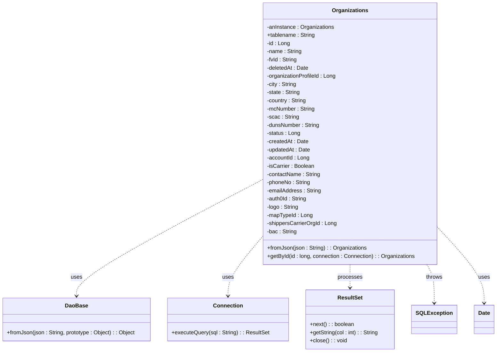
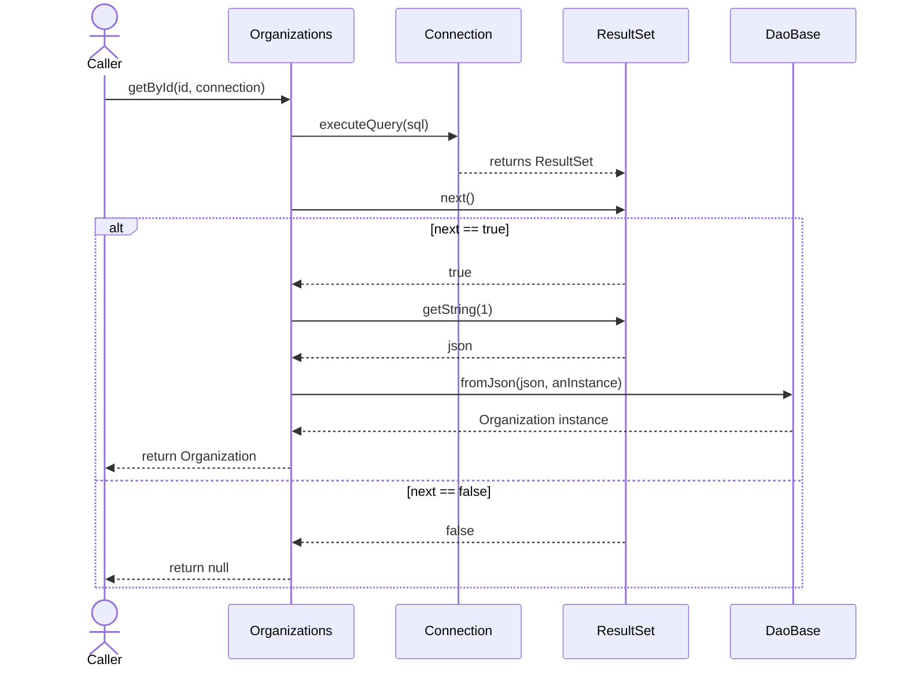

# Diagram: platform-java-lambdas/shipment/src/main/java/com/freightverify/shipment/datastore/postgresql/dao/Organizations.java

> Auto-generated by Obscura crawlers

## Diagram 1

### SVG

<svg id="container" width="1437.71875" xmlns="http://www.w3.org/2000/svg" class="classDiagram" height="1032" viewBox="0 0 1437.71875 1032" role="graphics-document document" aria-roledescription="class"><g><defs><marker id="container_class-aggregationStart" class="marker aggregation class" refX="18" refY="7" markerWidth="190" markerHeight="240" orient="auto"><path d="M 18,7 L9,13 L1,7 L9,1 Z"></path></marker></defs><defs><marker id="container_class-aggregationEnd" class="marker aggregation class" refX="1" refY="7" markerWidth="20" markerHeight="28" orient="auto"><path d="M 18,7 L9,13 L1,7 L9,1 Z"></path></marker></defs><defs><marker id="container_class-extensionStart" class="marker extension class" refX="18" refY="7" markerWidth="190" markerHeight="240" orient="auto"><path d="M 1,7 L18,13 V 1 Z"></path></marker></defs><defs><marker id="container_class-extensionEnd" class="marker extension class" refX="1" refY="7" markerWidth="20" markerHeight="28" orient="auto"><path d="M 1,1 V 13 L18,7 Z"></path></marker></defs><defs><marker id="container_class-compositionStart" class="marker composition class" refX="18" refY="7" markerWidth="190" markerHeight="240" orient="auto"><path d="M 18,7 L9,13 L1,7 L9,1 Z"></path></marker></defs><defs><marker id="container_class-compositionEnd" class="marker composition class" refX="1" refY="7" markerWidth="20" markerHeight="28" orient="auto"><path d="M 18,7 L9,13 L1,7 L9,1 Z"></path></marker></defs><defs><marker id="container_class-dependencyStart" class="marker dependency class" refX="6" refY="7" markerWidth="190" markerHeight="240" orient="auto"><path d="M 5,7 L9,13 L1,7 L9,1 Z"></path></marker></defs><defs><marker id="container_class-dependencyEnd" class="marker dependency class" refX="13" refY="7" markerWidth="20" markerHeight="28" orient="auto"><path d="M 18,7 L9,13 L14,7 L9,1 Z"></path></marker></defs><defs><marker id="container_class-lollipopStart" class="marker lollipop class" refX="13" refY="7" markerWidth="190" markerHeight="240" orient="auto"><circle stroke="black" fill="transparent" cx="7" cy="7" r="6"></circle></marker></defs><defs><marker id="container_class-lollipopEnd" class="marker lollipop class" refX="1" refY="7" markerWidth="190" markerHeight="240" orient="auto"><circle stroke="black" fill="transparent" cx="7" cy="7" r="6"></circle></marker></defs><g class="root"><g class="clusters"></g><g class="edgePaths"><path d="M764.012,526.788L674,574.49C583.988,622.192,403.965,717.596,313.953,774.465C223.941,831.333,223.941,849.667,223.941,858.833L223.941,868" id="id_Organizations_DaoBase_1" class="edge-thickness-normal edge-pattern-dashed relation" style=";;;" data-edge="true" data-et="edge" data-id="id_Organizations_DaoBase_1" data-points="W3sieCI6NzY0LjAxMTcxODc1LCJ5Ijo1MjYuNzg4MTQ4NjM2MjIyOH0seyJ4IjoyMjMuOTQxNDA2MjUsInkiOjgxM30seyJ4IjoyMjMuOTQxNDA2MjUsInkiOjg3NH1d" marker-end="url(#container_class-dependencyEnd)"></path><path d="M764.012,694.354L747.378,714.128C730.743,733.903,697.475,773.451,680.841,802.392C664.207,831.333,664.207,849.667,664.207,858.833L664.207,868" id="id_Organizations_Connection_2" class="edge-thickness-normal edge-pattern-dashed relation" style=";;;" data-edge="true" data-et="edge" data-id="id_Organizations_Connection_2" data-points="W3sieCI6NzY0LjAxMTcxODc1LCJ5Ijo2OTQuMzU0MTY1NTE3Njk3OH0seyJ4Ijo2NjQuMjA3MDMxMjUsInkiOjgxM30seyJ4Ijo2NjQuMjA3MDMxMjUsInkiOjg3NH1d" marker-end="url(#container_class-dependencyEnd)"></path><path d="M1018.352,776L1018.352,782.167C1018.352,788.333,1018.352,800.667,1018.352,812C1018.352,823.333,1018.352,833.667,1018.352,838.833L1018.352,844" id="id_Organizations_ResultSet_3" class="edge-thickness-normal edge-pattern-dashed relation" style=";;;" data-edge="true" data-et="edge" data-id="id_Organizations_ResultSet_3" data-points="W3sieCI6MTAxOC4zNTE1NjI1LCJ5Ijo3NzZ9LHsieCI6MTAxOC4zNTE1NjI1LCJ5Ijo4MTN9LHsieCI6MTAxOC4zNTE1NjI1LCJ5Ijo4NTB9XQ==" marker-end="url(#container_class-dependencyEnd)"></path><path d="M1238.827,776L1242.367,782.167C1245.908,788.333,1252.989,800.667,1256.53,819.5C1260.07,838.333,1260.07,863.667,1260.07,876.333L1260.07,889" id="id_Organizations_SQLException_4" class="edge-thickness-normal edge-pattern-dashed relation" style=";;;" data-edge="true" data-et="edge" data-id="id_Organizations_SQLException_4" data-points="W3sieCI6MTIzOC44MjY2MjE4ODI0MjI4LCJ5Ijo3NzZ9LHsieCI6MTI2MC4wNzAzMTI1LCJ5Ijo4MTN9LHsieCI6MTI2MC4wNzAzMTI1LCJ5Ijo4OTV9XQ==" marker-end="url(#container_class-dependencyEnd)"></path><path d="M1272.691,671.946L1294.05,695.455C1315.409,718.964,1358.126,765.982,1379.485,802.158C1400.844,838.333,1400.844,863.667,1400.844,876.333L1400.844,889" id="id_Organizations_Date_5" class="edge-thickness-normal edge-pattern-dashed relation" style=";;;" data-edge="true" data-et="edge" data-id="id_Organizations_Date_5" data-points="W3sieCI6MTI3Mi42OTE0MDYyNSwieSI6NjcxLjk0NTc4MTE2MzgzMX0seyJ4IjoxNDAwLjg0Mzc1LCJ5Ijo4MTN9LHsieCI6MTQwMC44NDM3NSwieSI6ODk1fV0=" marker-end="url(#container_class-dependencyEnd)"></path></g><g class="edgeLabels"><g class="edgeLabel" transform="translate(223.94140625, 813)"><g class="label" data-id="id_Organizations_DaoBase_1" transform="translate(-16.4921875, -12)"><foreignObject width="32.984375" height="24">

uses

</foreignObject></g></g><g class="edgeLabel" transform="translate(664.20703125, 813)"><g class="label" data-id="id_Organizations_Connection_2" transform="translate(-16.4921875, -12)"><foreignObject width="32.984375" height="24">

uses

</foreignObject></g></g><g class="edgeLabel" transform="translate(1018.3515625, 813)"><g class="label" data-id="id_Organizations_ResultSet_3" transform="translate(-35.7890625, -12)"><foreignObject width="71.578125" height="24">

processes

</foreignObject></g></g><g class="edgeLabel" transform="translate(1260.0703125, 813)"><g class="label" data-id="id_Organizations_SQLException_4" transform="translate(-24.5703125, -12)"><foreignObject width="49.140625" height="24">

throws

</foreignObject></g></g><g class="edgeLabel" transform="translate(1400.84375, 813)"><g class="label" data-id="id_Organizations_Date_5" transform="translate(-16.4921875, -12)"><foreignObject width="32.984375" height="24">

uses

</foreignObject></g></g></g><g class="nodes"><g class="node default" id="classId-Organizations-0" transform="translate(1018.3515625, 392)"><g class="basic label-container"><path d="M-254.33984375 -384 L254.33984375 -384 L254.33984375 384 L-254.33984375 384" stroke="none" stroke-width="0" fill="#ECECFF" style=""></path><path d="M-254.33984375 -384 C-71.76474637227375 -384, 110.8103510054525 -384, 254.33984375 -384 M-254.33984375 -384 C-77.99187008560736 -384, 98.35610357878528 -384, 254.33984375 -384 M254.33984375 -384 C254.33984375 -93.67403635338411, 254.33984375 196.65192729323178, 254.33984375 384 M254.33984375 -384 C254.33984375 -117.61166319805437, 254.33984375 148.77667360389125, 254.33984375 384 M254.33984375 384 C107.7411243429463 384, -38.857595064107386 384, -254.33984375 384 M254.33984375 384 C60.81027297835536 384, -132.7192977932893 384, -254.33984375 384 M-254.33984375 384 C-254.33984375 190.63305476593638, -254.33984375 -2.7338904681272425, -254.33984375 -384 M-254.33984375 384 C-254.33984375 147.32484287640858, -254.33984375 -89.35031424718284, -254.33984375 -384" stroke="#9370DB" stroke-width="1.3" fill="none" stroke-dasharray="0 0" style=""></path></g><g class="annotation-group text" transform="translate(0, -360)"></g><g class="label-group text" transform="translate(-50.5546875, -360)"><g class="label" style="font-weight: bolder" transform="translate(0,-12)"><foreignObject width="101.109375" height="24">

Organizations

</foreignObject></g></g><g class="members-group text" transform="translate(-242.33984375, -312)"><g class="label" style="" transform="translate(0,-12)"><foreignObject width="197.53125" height="24">

-anInstance : Organizations

</foreignObject></g><g class="label" style="" transform="translate(0,12)"><foreignObject width="140.828125" height="24">

+tablename : String

</foreignObject></g><g class="label" style="" transform="translate(0,36)"><foreignObject width="67.46875" height="24">

-id : Long

</foreignObject></g><g class="label" style="" transform="translate(0,60)"><foreignObject width="102.171875" height="24">

-name : String

</foreignObject></g><g class="label" style="" transform="translate(0,84)"><foreignObject width="88.9375" height="24">

-fvId : String

</foreignObject></g><g class="label" style="" transform="translate(0,108)"><foreignObject width="122.265625" height="24">

-deletedAt : Date

</foreignObject></g><g class="label" style="" transform="translate(0,132)"><foreignObject width="204.5625" height="24">

-organizationProfileId : Long

</foreignObject></g><g class="label" style="" transform="translate(0,156)"><foreignObject width="87.390625" height="24">

-city : String

</foreignObject></g><g class="label" style="" transform="translate(0,180)"><foreignObject width="97.75" height="24">

-state : String

</foreignObject></g><g class="label" style="" transform="translate(0,204)"><foreignObject width="116.84375" height="24">

-country : String

</foreignObject></g><g class="label" style="" transform="translate(0,228)"><foreignObject width="141.375" height="24">

-mcNumber : String

</foreignObject></g><g class="label" style="" transform="translate(0,252)"><foreignObject width="92.96875" height="24">

-scac : String

</foreignObject></g><g class="label" style="" transform="translate(0,276)"><foreignObject width="155.734375" height="24">

-dunsNumber : String

</foreignObject></g><g class="label" style="" transform="translate(0,300)"><foreignObject width="97.78125" height="24">

-status : Long

</foreignObject></g><g class="label" style="" transform="translate(0,324)"><foreignObject width="121.25" height="24">

-createdAt : Date

</foreignObject></g><g class="label" style="" transform="translate(0,348)"><foreignObject width="127.734375" height="24">

-updatedAt : Date

</foreignObject></g><g class="label" style="" transform="translate(0,372)"><foreignObject width="124.59375" height="24">

-accountId : Long

</foreignObject></g><g class="label" style="" transform="translate(0,396)"><foreignObject width="139.6875" height="24">

-isCarrier : Boolean

</foreignObject></g><g class="label" style="" transform="translate(0,420)"><foreignObject width="157.5625" height="24">

-contactName : String

</foreignObject></g><g class="label" style="" transform="translate(0,444)"><foreignObject width="128.25" height="24">

-phoneNo : String

</foreignObject></g><g class="label" style="" transform="translate(0,468)"><foreignObject width="159.5" height="24">

-emailAddress : String

</foreignObject></g><g class="label" style="" transform="translate(0,492)"><foreignObject width="117.796875" height="24">

-auth0Id : String

</foreignObject></g><g class="label" style="" transform="translate(0,516)"><foreignObject width="93.015625" height="24">

-logo : String

</foreignObject></g><g class="label" style="" transform="translate(0,540)"><foreignObject width="133.3125" height="24">

-mapTypeId : Long

</foreignObject></g><g class="label" style="" transform="translate(0,564)"><foreignObject width="204.765625" height="24">

-shippersCarrierOrgId : Long

</foreignObject></g><g class="label" style="" transform="translate(0,588)"><foreignObject width="87.359375" height="24">

-bac : String

</foreignObject></g></g><g class="methods-group text" transform="translate(-242.33984375, 336)"><g class="label" style="" transform="translate(0,-12)"><foreignObject width="289.703125" height="24">

+fromJson(json : String) : : Organizations

</foreignObject></g><g class="label" style="" transform="translate(0,12)"><foreignObject width="434.125" height="24">

+getById(id : long, connection : Connection) : : Organizations

</foreignObject></g></g><g class="divider" style=""><path d="M-254.33984375 -336 C-97.42758668964103 -336, 59.484670370717936 -336, 254.33984375 -336 M-254.33984375 -336 C-66.97095512413114 -336, 120.39793350173773 -336, 254.33984375 -336" stroke="#9370DB" stroke-width="1.3" fill="none" stroke-dasharray="0 0" style=""></path></g><g class="divider" style=""><path d="M-254.33984375 312 C-112.06370190067133 312, 30.212439948657334 312, 254.33984375 312 M-254.33984375 312 C-107.20718268519622 312, 39.92547837960757 312, 254.33984375 312" stroke="#9370DB" stroke-width="1.3" fill="none" stroke-dasharray="0 0" style=""></path></g></g><g class="node default" id="classId-DaoBase-1" transform="translate(223.94140625, 937)"><g class="basic label-container"><path d="M-215.94140625 -63 L215.94140625 -63 L215.94140625 63 L-215.94140625 63" stroke="none" stroke-width="0" fill="#ECECFF" style=""></path><path d="M-215.94140625 -63 C-104.93916587108858 -63, 6.063074507822847 -63, 215.94140625 -63 M-215.94140625 -63 C-72.27835313811099 -63, 71.38469997377803 -63, 215.94140625 -63 M215.94140625 -63 C215.94140625 -17.00069907345234, 215.94140625 28.998601853095323, 215.94140625 63 M215.94140625 -63 C215.94140625 -14.350334128826752, 215.94140625 34.299331742346496, 215.94140625 63 M215.94140625 63 C81.98814366447479 63, -51.96511892105042 63, -215.94140625 63 M215.94140625 63 C120.69861782419679 63, 25.455829398393576 63, -215.94140625 63 M-215.94140625 63 C-215.94140625 20.52760017191308, -215.94140625 -21.944799656173842, -215.94140625 -63 M-215.94140625 63 C-215.94140625 34.35261030558193, -215.94140625 5.705220611163867, -215.94140625 -63" stroke="#9370DB" stroke-width="1.3" fill="none" stroke-dasharray="0 0" style=""></path></g><g class="annotation-group text" transform="translate(0, -39)"></g><g class="label-group text" transform="translate(-31.7109375, -39)"><g class="label" style="font-weight: bolder" transform="translate(0,-12)"><foreignObject width="63.421875" height="24">

DaoBase

</foreignObject></g></g><g class="members-group text" transform="translate(-203.94140625, 9)"></g><g class="methods-group text" transform="translate(-203.94140625, 39)"><g class="label" style="" transform="translate(0,-12)"><foreignObject width="376.171875" height="24">

+fromJson(json : String, prototype : Object) : : Object

</foreignObject></g></g><g class="divider" style=""><path d="M-215.94140625 -15 C-76.74495351718178 -15, 62.45149921563643 -15, 215.94140625 -15 M-215.94140625 -15 C-91.43330053337962 -15, 33.074805183240755 -15, 215.94140625 -15" stroke="#9370DB" stroke-width="1.3" fill="none" stroke-dasharray="0 0" style=""></path></g><g class="divider" style=""><path d="M-215.94140625 9 C-105.94414157427293 9, 4.053123101454133 9, 215.94140625 9 M-215.94140625 9 C-54.553292799199625 9, 106.83482065160075 9, 215.94140625 9" stroke="#9370DB" stroke-width="1.3" fill="none" stroke-dasharray="0 0" style=""></path></g></g><g class="node default" id="classId-Connection-2" transform="translate(664.20703125, 937)"><g class="basic label-container"><path d="M-174.32421875 -63 L174.32421875 -63 L174.32421875 63 L-174.32421875 63" stroke="none" stroke-width="0" fill="#ECECFF" style=""></path><path d="M-174.32421875 -63 C-70.47114524645342 -63, 33.381928257093165 -63, 174.32421875 -63 M-174.32421875 -63 C-93.13429854653594 -63, -11.94437834307189 -63, 174.32421875 -63 M174.32421875 -63 C174.32421875 -19.805282415918278, 174.32421875 23.389435168163445, 174.32421875 63 M174.32421875 -63 C174.32421875 -22.450856954208092, 174.32421875 18.098286091583816, 174.32421875 63 M174.32421875 63 C46.56987698221714 63, -81.18446478556572 63, -174.32421875 63 M174.32421875 63 C50.41230859243316 63, -73.49960156513367 63, -174.32421875 63 M-174.32421875 63 C-174.32421875 23.50986722848083, -174.32421875 -15.980265543038342, -174.32421875 -63 M-174.32421875 63 C-174.32421875 32.516276821408184, -174.32421875 2.0325536428163673, -174.32421875 -63" stroke="#9370DB" stroke-width="1.3" fill="none" stroke-dasharray="0 0" style=""></path></g><g class="annotation-group text" transform="translate(0, -39)"></g><g class="label-group text" transform="translate(-41.2265625, -39)"><g class="label" style="font-weight: bolder" transform="translate(0,-12)"><foreignObject width="82.453125" height="24">

Connection

</foreignObject></g></g><g class="members-group text" transform="translate(-162.32421875, 9)"></g><g class="methods-group text" transform="translate(-162.32421875, 39)"><g class="label" style="" transform="translate(0,-12)"><foreignObject width="283.421875" height="24">

+executeQuery(sql : String) : : ResultSet

</foreignObject></g></g><g class="divider" style=""><path d="M-174.32421875 -15 C-47.777985347338586 -15, 78.76824805532283 -15, 174.32421875 -15 M-174.32421875 -15 C-69.73542598689787 -15, 34.85336677620427 -15, 174.32421875 -15" stroke="#9370DB" stroke-width="1.3" fill="none" stroke-dasharray="0 0" style=""></path></g><g class="divider" style=""><path d="M-174.32421875 9 C-62.95554312103461 9, 48.41313250793078 9, 174.32421875 9 M-174.32421875 9 C-74.22548646441753 9, 25.873245821164943 9, 174.32421875 9" stroke="#9370DB" stroke-width="1.3" fill="none" stroke-dasharray="0 0" style=""></path></g></g><g class="node default" id="classId-ResultSet-3" transform="translate(1018.3515625, 937)"><g class="basic label-container"><path d="M-129.8203125 -87 L129.8203125 -87 L129.8203125 87 L-129.8203125 87" stroke="none" stroke-width="0" fill="#ECECFF" style=""></path><path d="M-129.8203125 -87 C-63.932203268041505 -87, 1.9559059639169902 -87, 129.8203125 -87 M-129.8203125 -87 C-44.37843622251775 -87, 41.0634400549645 -87, 129.8203125 -87 M129.8203125 -87 C129.8203125 -39.836507128838235, 129.8203125 7.326985742323529, 129.8203125 87 M129.8203125 -87 C129.8203125 -29.177995063737164, 129.8203125 28.64400987252567, 129.8203125 87 M129.8203125 87 C31.719731728324334 87, -66.38084904335133 87, -129.8203125 87 M129.8203125 87 C42.18349061291207 87, -45.453331274175866 87, -129.8203125 87 M-129.8203125 87 C-129.8203125 39.57159163307676, -129.8203125 -7.856816733846486, -129.8203125 -87 M-129.8203125 87 C-129.8203125 29.00666353024353, -129.8203125 -28.986672939512943, -129.8203125 -87" stroke="#9370DB" stroke-width="1.3" fill="none" stroke-dasharray="0 0" style=""></path></g><g class="annotation-group text" transform="translate(0, -63)"></g><g class="label-group text" transform="translate(-35.21875, -63)"><g class="label" style="font-weight: bolder" transform="translate(0,-12)"><foreignObject width="70.4375" height="24">

ResultSet

</foreignObject></g></g><g class="members-group text" transform="translate(-117.8203125, -15)"></g><g class="methods-group text" transform="translate(-117.8203125, 15)"><g class="label" style="" transform="translate(0,-12)"><foreignObject width="129.6875" height="24">

+next() : : boolean

</foreignObject></g><g class="label" style="" transform="translate(0,12)"><foreignObject width="200.421875" height="24">

+getString(col : int) : : String

</foreignObject></g><g class="label" style="" transform="translate(0,36)"><foreignObject width="107.78125" height="24">

+close() : : void

</foreignObject></g></g><g class="divider" style=""><path d="M-129.8203125 -39 C-50.207518273473625 -39, 29.40527595305275 -39, 129.8203125 -39 M-129.8203125 -39 C-35.33685911711214 -39, 59.14659426577572 -39, 129.8203125 -39" stroke="#9370DB" stroke-width="1.3" fill="none" stroke-dasharray="0 0" style=""></path></g><g class="divider" style=""><path d="M-129.8203125 -15 C-64.98272172380702 -15, -0.14513094761403522 -15, 129.8203125 -15 M-129.8203125 -15 C-47.63682073449638 -15, 34.546671031007236 -15, 129.8203125 -15" stroke="#9370DB" stroke-width="1.3" fill="none" stroke-dasharray="0 0" style=""></path></g></g><g class="node default" id="classId-SQLException-4" transform="translate(1260.0703125, 937)"><g class="basic label-container"><path d="M-61.8984375 -42 L61.8984375 -42 L61.8984375 42 L-61.8984375 42" stroke="none" stroke-width="0" fill="#ECECFF" style=""></path><path d="M-61.8984375 -42 C-31.75837900302537 -42, -1.6183205060507433 -42, 61.8984375 -42 M-61.8984375 -42 C-15.646412649458412 -42, 30.605612201083176 -42, 61.8984375 -42 M61.8984375 -42 C61.8984375 -11.160942135901102, 61.8984375 19.678115728197795, 61.8984375 42 M61.8984375 -42 C61.8984375 -25.12722158302936, 61.8984375 -8.25444316605872, 61.8984375 42 M61.8984375 42 C18.4209567808444 42, -25.0565239383112 42, -61.8984375 42 M61.8984375 42 C30.275349053969514 42, -1.3477393920609728 42, -61.8984375 42 M-61.8984375 42 C-61.8984375 21.13867274467215, -61.8984375 0.2773454893442988, -61.8984375 -42 M-61.8984375 42 C-61.8984375 9.664087760340585, -61.8984375 -22.67182447931883, -61.8984375 -42" stroke="#9370DB" stroke-width="1.3" fill="none" stroke-dasharray="0 0" style=""></path></g><g class="annotation-group text" transform="translate(0, -18)"></g><g class="label-group text" transform="translate(-49.8984375, -18)"><g class="label" style="font-weight: bolder" transform="translate(0,-12)"><foreignObject width="99.796875" height="24">

SQLException

</foreignObject></g></g><g class="members-group text" transform="translate(-49.8984375, 30)"></g><g class="methods-group text" transform="translate(-49.8984375, 60)"></g><g class="divider" style=""><path d="M-61.8984375 6 C-24.387022458817036 6, 13.124392582365928 6, 61.8984375 6 M-61.8984375 6 C-14.543257155983909 6, 32.81192318803218 6, 61.8984375 6" stroke="#9370DB" stroke-width="1.3" fill="none" stroke-dasharray="0 0" style=""></path></g><g class="divider" style=""><path d="M-61.8984375 24 C-17.153343922329015 24, 27.59174965534197 24, 61.8984375 24 M-61.8984375 24 C-24.59427294947703 24, 12.709891601045939 24, 61.8984375 24" stroke="#9370DB" stroke-width="1.3" fill="none" stroke-dasharray="0 0" style=""></path></g></g><g class="node default" id="classId-Date-5" transform="translate(1400.84375, 937)"><g class="basic label-container"><path d="M-28.875 -42 L28.875 -42 L28.875 42 L-28.875 42" stroke="none" stroke-width="0" fill="#ECECFF" style=""></path><path d="M-28.875 -42 C-7.419087451037136 -42, 14.036825097925728 -42, 28.875 -42 M-28.875 -42 C-12.821600054217214 -42, 3.231799891565572 -42, 28.875 -42 M28.875 -42 C28.875 -10.850810131401786, 28.875 20.298379737196427, 28.875 42 M28.875 -42 C28.875 -11.050760486252937, 28.875 19.898479027494126, 28.875 42 M28.875 42 C17.028476323518777 42, 5.181952647037555 42, -28.875 42 M28.875 42 C6.327901725622947 42, -16.219196548754105 42, -28.875 42 M-28.875 42 C-28.875 17.880353805913956, -28.875 -6.239292388172089, -28.875 -42 M-28.875 42 C-28.875 12.146771440036591, -28.875 -17.706457119926817, -28.875 -42" stroke="#9370DB" stroke-width="1.3" fill="none" stroke-dasharray="0 0" style=""></path></g><g class="annotation-group text" transform="translate(0, -18)"></g><g class="label-group text" transform="translate(-16.875, -18)"><g class="label" style="font-weight: bolder" transform="translate(0,-12)"><foreignObject width="33.75" height="24">

Date

</foreignObject></g></g><g class="members-group text" transform="translate(-16.875, 30)"></g><g class="methods-group text" transform="translate(-16.875, 60)"></g><g class="divider" style=""><path d="M-28.875 6 C-10.153119151492024 6, 8.568761697015951 6, 28.875 6 M-28.875 6 C-16.62466159342589 6, -4.374323186851786 6, 28.875 6" stroke="#9370DB" stroke-width="1.3" fill="none" stroke-dasharray="0 0" style=""></path></g><g class="divider" style=""><path d="M-28.875 24 C-13.967396115398119 24, 0.9402077692037629 24, 28.875 24 M-28.875 24 C-13.352350328272683 24, 2.1702993434546336 24, 28.875 24" stroke="#9370DB" stroke-width="1.3" fill="none" stroke-dasharray="0 0" style=""></path></g></g></g></g></g></svg>

## Diagram 2

### SVG

<svg id="container" width="1089" xmlns="http://www.w3.org/2000/svg" height="847" viewBox="-50 -10 1089 847" role="graphics-document document" aria-roledescription="sequence"><g><rect x="839" y="761" fill="#eaeaea" stroke="#666" width="150" height="65" name="DaoBase" rx="3" ry="3" class="actor actor-bottom"></rect><text x="914" y="793.5" dominant-baseline="central" alignment-baseline="central" class="actor actor-box" style="text-anchor: middle; font-size: 16px; font-weight: 400;"><tspan x="914" dy="0">DaoBase</tspan></text></g><g><rect x="639" y="761" fill="#eaeaea" stroke="#666" width="150" height="65" name="ResultSet" rx="3" ry="3" class="actor actor-bottom"></rect><text x="714" y="793.5" dominant-baseline="central" alignment-baseline="central" class="actor actor-box" style="text-anchor: middle; font-size: 16px; font-weight: 400;"><tspan x="714" dy="0">ResultSet</tspan></text></g><g><rect x="439" y="761" fill="#eaeaea" stroke="#666" width="150" height="65" name="Connection" rx="3" ry="3" class="actor actor-bottom"></rect><text x="514" y="793.5" dominant-baseline="central" alignment-baseline="central" class="actor actor-box" style="text-anchor: middle; font-size: 16px; font-weight: 400;"><tspan x="514" dy="0">Connection</tspan></text></g><g><rect x="238" y="761" fill="#eaeaea" stroke="#666" width="150" height="65" name="Organizations" rx="3" ry="3" class="actor actor-bottom"></rect><text x="313" y="793.5" dominant-baseline="central" alignment-baseline="central" class="actor actor-box" style="text-anchor: middle; font-size: 16px; font-weight: 400;"><tspan x="313" dy="0">Organizations</tspan></text></g><g></g><g><line id="actor4" x1="914" y1="65" x2="914" y2="761" class="actor-line 200" stroke-width="0.5px" stroke="#999" name="DaoBase"></line><g id="root-4"><rect x="839" y="0" fill="#eaeaea" stroke="#666" width="150" height="65" name="DaoBase" rx="3" ry="3" class="actor actor-top"></rect><text x="914" y="32.5" dominant-baseline="central" alignment-baseline="central" class="actor actor-box" style="text-anchor: middle; font-size: 16px; font-weight: 400;"><tspan x="914" dy="0">DaoBase</tspan></text></g></g><g><line id="actor3" x1="714" y1="65" x2="714" y2="761" class="actor-line 200" stroke-width="0.5px" stroke="#999" name="ResultSet"></line><g id="root-3"><rect x="639" y="0" fill="#eaeaea" stroke="#666" width="150" height="65" name="ResultSet" rx="3" ry="3" class="actor actor-top"></rect><text x="714" y="32.5" dominant-baseline="central" alignment-baseline="central" class="actor actor-box" style="text-anchor: middle; font-size: 16px; font-weight: 400;"><tspan x="714" dy="0">ResultSet</tspan></text></g></g><g><line id="actor2" x1="514" y1="65" x2="514" y2="761" class="actor-line 200" stroke-width="0.5px" stroke="#999" name="Connection"></line><g id="root-2"><rect x="439" y="0" fill="#eaeaea" stroke="#666" width="150" height="65" name="Connection" rx="3" ry="3" class="actor actor-top"></rect><text x="514" y="32.5" dominant-baseline="central" alignment-baseline="central" class="actor actor-box" style="text-anchor: middle; font-size: 16px; font-weight: 400;"><tspan x="514" dy="0">Connection</tspan></text></g></g><g><line id="actor1" x1="313" y1="65" x2="313" y2="761" class="actor-line 200" stroke-width="0.5px" stroke="#999" name="Organizations"></line><g id="root-1"><rect x="238" y="0" fill="#eaeaea" stroke="#666" width="150" height="65" name="Organizations" rx="3" ry="3" class="actor actor-top"></rect><text x="313" y="32.5" dominant-baseline="central" alignment-baseline="central" class="actor actor-box" style="text-anchor: middle; font-size: 16px; font-weight: 400;"><tspan x="313" dy="0">Organizations</tspan></text></g></g><g><line id="actor0" x1="75" y1="80" x2="75" y2="761" class="actor-line 200" stroke-width="0.5px" stroke="#999" name="Caller"></line></g><g></g><defs><symbol id="computer" width="24" height="24"><path transform="scale(.5)" d="M2 2v13h20v-13h-20zm18 11h-16v-9h16v9zm-10.228 6l.466-1h3.524l.467 1h-4.457zm14.228 3h-24l2-6h2.104l-1.33 4h18.45l-1.297-4h2.073l2 6zm-5-10h-14v-7h14v7z"></path></symbol></defs><defs><symbol id="database" fill-rule="evenodd" clip-rule="evenodd"><path transform="scale(.5)" d="M12.258.001l.256.004.255.005.253.008.251.01.249.012.247.015.246.016.242.019.241.02.239.023.236.024.233.027.231.028.229.031.225.032.223.034.22.036.217.038.214.04.211.041.208.043.205.045.201.046.198.048.194.05.191.051.187.053.183.054.18.056.175.057.172.059.168.06.163.061.16.063.155.064.15.066.074.033.073.033.071.034.07.034.069.035.068.035.067.035.066.035.064.036.064.036.062.036.06.036.06.037.058.037.058.037.055.038.055.038.053.038.052.038.051.039.05.039.048.039.047.039.045.04.044.04.043.04.041.04.04.041.039.041.037.041.036.041.034.041.033.042.032.042.03.042.029.042.027.042.026.043.024.043.023.043.021.043.02.043.018.044.017.043.015.044.013.044.012.044.011.045.009.044.007.045.006.045.004.045.002.045.001.045v17l-.001.045-.002.045-.004.045-.006.045-.007.045-.009.044-.011.045-.012.044-.013.044-.015.044-.017.043-.018.044-.02.043-.021.043-.023.043-.024.043-.026.043-.027.042-.029.042-.03.042-.032.042-.033.042-.034.041-.036.041-.037.041-.039.041-.04.041-.041.04-.043.04-.044.04-.045.04-.047.039-.048.039-.05.039-.051.039-.052.038-.053.038-.055.038-.055.038-.058.037-.058.037-.06.037-.06.036-.062.036-.064.036-.064.036-.066.035-.067.035-.068.035-.069.035-.07.034-.071.034-.073.033-.074.033-.15.066-.155.064-.16.063-.163.061-.168.06-.172.059-.175.057-.18.056-.183.054-.187.053-.191.051-.194.05-.198.048-.201.046-.205.045-.208.043-.211.041-.214.04-.217.038-.22.036-.223.034-.225.032-.229.031-.231.028-.233.027-.236.024-.239.023-.241.02-.242.019-.246.016-.247.015-.249.012-.251.01-.253.008-.255.005-.256.004-.258.001-.258-.001-.256-.004-.255-.005-.253-.008-.251-.01-.249-.012-.247-.015-.245-.016-.243-.019-.241-.02-.238-.023-.236-.024-.234-.027-.231-.028-.228-.031-.226-.032-.223-.034-.22-.036-.217-.038-.214-.04-.211-.041-.208-.043-.204-.045-.201-.046-.198-.048-.195-.05-.19-.051-.187-.053-.184-.054-.179-.056-.176-.057-.172-.059-.167-.06-.164-.061-.159-.063-.155-.064-.151-.066-.074-.033-.072-.033-.072-.034-.07-.034-.069-.035-.068-.035-.067-.035-.066-.035-.064-.036-.063-.036-.062-.036-.061-.036-.06-.037-.058-.037-.057-.037-.056-.038-.055-.038-.053-.038-.052-.038-.051-.039-.049-.039-.049-.039-.046-.039-.046-.04-.044-.04-.043-.04-.041-.04-.04-.041-.039-.041-.037-.041-.036-.041-.034-.041-.033-.042-.032-.042-.03-.042-.029-.042-.027-.042-.026-.043-.024-.043-.023-.043-.021-.043-.02-.043-.018-.044-.017-.043-.015-.044-.013-.044-.012-.044-.011-.045-.009-.044-.007-.045-.006-.045-.004-.045-.002-.045-.001-.045v-17l.001-.045.002-.045.004-.045.006-.045.007-.045.009-.044.011-.045.012-.044.013-.044.015-.044.017-.043.018-.044.02-.043.021-.043.023-.043.024-.043.026-.043.027-.042.029-.042.03-.042.032-.042.033-.042.034-.041.036-.041.037-.041.039-.041.04-.041.041-.04.043-.04.044-.04.046-.04.046-.039.049-.039.049-.039.051-.039.052-.038.053-.038.055-.038.056-.038.057-.037.058-.037.06-.037.061-.036.062-.036.063-.036.064-.036.066-.035.067-.035.068-.035.069-.035.07-.034.072-.034.072-.033.074-.033.151-.066.155-.064.159-.063.164-.061.167-.06.172-.059.176-.057.179-.056.184-.054.187-.053.19-.051.195-.05.198-.048.201-.046.204-.045.208-.043.211-.041.214-.04.217-.038.22-.036.223-.034.226-.032.228-.031.231-.028.234-.027.236-.024.238-.023.241-.02.243-.019.245-.016.247-.015.249-.012.251-.01.253-.008.255-.005.256-.004.258-.001.258.001zm-9.258 20.499v.01l.001.021.003.021.004.022.005.021.006.022.007.022.009.023.01.022.011.023.012.023.013.023.015.023.016.024.017.023.018.024.019.024.021.024.022.025.023.024.024.025.052.049.056.05.061.051.066.051.07.051.075.051.079.052.084.052.088.052.092.052.097.052.102.051.105.052.11.052.114.051.119.051.123.051.127.05.131.05.135.05.139.048.144.049.147.047.152.047.155.047.16.045.163.045.167.043.171.043.176.041.178.041.183.039.187.039.19.037.194.035.197.035.202.033.204.031.209.03.212.029.216.027.219.025.222.024.226.021.23.02.233.018.236.016.24.015.243.012.246.01.249.008.253.005.256.004.259.001.26-.001.257-.004.254-.005.25-.008.247-.011.244-.012.241-.014.237-.016.233-.018.231-.021.226-.021.224-.024.22-.026.216-.027.212-.028.21-.031.205-.031.202-.034.198-.034.194-.036.191-.037.187-.039.183-.04.179-.04.175-.042.172-.043.168-.044.163-.045.16-.046.155-.046.152-.047.148-.048.143-.049.139-.049.136-.05.131-.05.126-.05.123-.051.118-.052.114-.051.11-.052.106-.052.101-.052.096-.052.092-.052.088-.053.083-.051.079-.052.074-.052.07-.051.065-.051.06-.051.056-.05.051-.05.023-.024.023-.025.021-.024.02-.024.019-.024.018-.024.017-.024.015-.023.014-.024.013-.023.012-.023.01-.023.01-.022.008-.022.006-.022.006-.022.004-.022.004-.021.001-.021.001-.021v-4.127l-.077.055-.08.053-.083.054-.085.053-.087.052-.09.052-.093.051-.095.05-.097.05-.1.049-.102.049-.105.048-.106.047-.109.047-.111.046-.114.045-.115.045-.118.044-.12.043-.122.042-.124.042-.126.041-.128.04-.13.04-.132.038-.134.038-.135.037-.138.037-.139.035-.142.035-.143.034-.144.033-.147.032-.148.031-.15.03-.151.03-.153.029-.154.027-.156.027-.158.026-.159.025-.161.024-.162.023-.163.022-.165.021-.166.02-.167.019-.169.018-.169.017-.171.016-.173.015-.173.014-.175.013-.175.012-.177.011-.178.01-.179.008-.179.008-.181.006-.182.005-.182.004-.184.003-.184.002h-.37l-.184-.002-.184-.003-.182-.004-.182-.005-.181-.006-.179-.008-.179-.008-.178-.01-.176-.011-.176-.012-.175-.013-.173-.014-.172-.015-.171-.016-.17-.017-.169-.018-.167-.019-.166-.02-.165-.021-.163-.022-.162-.023-.161-.024-.159-.025-.157-.026-.156-.027-.155-.027-.153-.029-.151-.03-.15-.03-.148-.031-.146-.032-.145-.033-.143-.034-.141-.035-.14-.035-.137-.037-.136-.037-.134-.038-.132-.038-.13-.04-.128-.04-.126-.041-.124-.042-.122-.042-.12-.044-.117-.043-.116-.045-.113-.045-.112-.046-.109-.047-.106-.047-.105-.048-.102-.049-.1-.049-.097-.05-.095-.05-.093-.052-.09-.051-.087-.052-.085-.053-.083-.054-.08-.054-.077-.054v4.127zm0-5.654v.011l.001.021.003.021.004.021.005.022.006.022.007.022.009.022.01.022.011.023.012.023.013.023.015.024.016.023.017.024.018.024.019.024.021.024.022.024.023.025.024.024.052.05.056.05.061.05.066.051.07.051.075.052.079.051.084.052.088.052.092.052.097.052.102.052.105.052.11.051.114.051.119.052.123.05.127.051.131.05.135.049.139.049.144.048.147.048.152.047.155.046.16.045.163.045.167.044.171.042.176.042.178.04.183.04.187.038.19.037.194.036.197.034.202.033.204.032.209.03.212.028.216.027.219.025.222.024.226.022.23.02.233.018.236.016.24.014.243.012.246.01.249.008.253.006.256.003.259.001.26-.001.257-.003.254-.006.25-.008.247-.01.244-.012.241-.015.237-.016.233-.018.231-.02.226-.022.224-.024.22-.025.216-.027.212-.029.21-.03.205-.032.202-.033.198-.035.194-.036.191-.037.187-.039.183-.039.179-.041.175-.042.172-.043.168-.044.163-.045.16-.045.155-.047.152-.047.148-.048.143-.048.139-.05.136-.049.131-.05.126-.051.123-.051.118-.051.114-.052.11-.052.106-.052.101-.052.096-.052.092-.052.088-.052.083-.052.079-.052.074-.051.07-.052.065-.051.06-.05.056-.051.051-.049.023-.025.023-.024.021-.025.02-.024.019-.024.018-.024.017-.024.015-.023.014-.023.013-.024.012-.022.01-.023.01-.023.008-.022.006-.022.006-.022.004-.021.004-.022.001-.021.001-.021v-4.139l-.077.054-.08.054-.083.054-.085.052-.087.053-.09.051-.093.051-.095.051-.097.05-.1.049-.102.049-.105.048-.106.047-.109.047-.111.046-.114.045-.115.044-.118.044-.12.044-.122.042-.124.042-.126.041-.128.04-.13.039-.132.039-.134.038-.135.037-.138.036-.139.036-.142.035-.143.033-.144.033-.147.033-.148.031-.15.03-.151.03-.153.028-.154.028-.156.027-.158.026-.159.025-.161.024-.162.023-.163.022-.165.021-.166.02-.167.019-.169.018-.169.017-.171.016-.173.015-.173.014-.175.013-.175.012-.177.011-.178.009-.179.009-.179.007-.181.007-.182.005-.182.004-.184.003-.184.002h-.37l-.184-.002-.184-.003-.182-.004-.182-.005-.181-.007-.179-.007-.179-.009-.178-.009-.176-.011-.176-.012-.175-.013-.173-.014-.172-.015-.171-.016-.17-.017-.169-.018-.167-.019-.166-.02-.165-.021-.163-.022-.162-.023-.161-.024-.159-.025-.157-.026-.156-.027-.155-.028-.153-.028-.151-.03-.15-.03-.148-.031-.146-.033-.145-.033-.143-.033-.141-.035-.14-.036-.137-.036-.136-.037-.134-.038-.132-.039-.13-.039-.128-.04-.126-.041-.124-.042-.122-.043-.12-.043-.117-.044-.116-.044-.113-.046-.112-.046-.109-.046-.106-.047-.105-.048-.102-.049-.1-.049-.097-.05-.095-.051-.093-.051-.09-.051-.087-.053-.085-.052-.083-.054-.08-.054-.077-.054v4.139zm0-5.666v.011l.001.02.003.022.004.021.005.022.006.021.007.022.009.023.01.022.011.023.012.023.013.023.015.023.016.024.017.024.018.023.019.024.021.025.022.024.023.024.024.025.052.05.056.05.061.05.066.051.07.051.075.052.079.051.084.052.088.052.092.052.097.052.102.052.105.051.11.052.114.051.119.051.123.051.127.05.131.05.135.05.139.049.144.048.147.048.152.047.155.046.16.045.163.045.167.043.171.043.176.042.178.04.183.04.187.038.19.037.194.036.197.034.202.033.204.032.209.03.212.028.216.027.219.025.222.024.226.021.23.02.233.018.236.017.24.014.243.012.246.01.249.008.253.006.256.003.259.001.26-.001.257-.003.254-.006.25-.008.247-.01.244-.013.241-.014.237-.016.233-.018.231-.02.226-.022.224-.024.22-.025.216-.027.212-.029.21-.03.205-.032.202-.033.198-.035.194-.036.191-.037.187-.039.183-.039.179-.041.175-.042.172-.043.168-.044.163-.045.16-.045.155-.047.152-.047.148-.048.143-.049.139-.049.136-.049.131-.051.126-.05.123-.051.118-.052.114-.051.11-.052.106-.052.101-.052.096-.052.092-.052.088-.052.083-.052.079-.052.074-.052.07-.051.065-.051.06-.051.056-.05.051-.049.023-.025.023-.025.021-.024.02-.024.019-.024.018-.024.017-.024.015-.023.014-.024.013-.023.012-.023.01-.022.01-.023.008-.022.006-.022.006-.022.004-.022.004-.021.001-.021.001-.021v-4.153l-.077.054-.08.054-.083.053-.085.053-.087.053-.09.051-.093.051-.095.051-.097.05-.1.049-.102.048-.105.048-.106.048-.109.046-.111.046-.114.046-.115.044-.118.044-.12.043-.122.043-.124.042-.126.041-.128.04-.13.039-.132.039-.134.038-.135.037-.138.036-.139.036-.142.034-.143.034-.144.033-.147.032-.148.032-.15.03-.151.03-.153.028-.154.028-.156.027-.158.026-.159.024-.161.024-.162.023-.163.023-.165.021-.166.02-.167.019-.169.018-.169.017-.171.016-.173.015-.173.014-.175.013-.175.012-.177.01-.178.01-.179.009-.179.007-.181.006-.182.006-.182.004-.184.003-.184.001-.185.001-.185-.001-.184-.001-.184-.003-.182-.004-.182-.006-.181-.006-.179-.007-.179-.009-.178-.01-.176-.01-.176-.012-.175-.013-.173-.014-.172-.015-.171-.016-.17-.017-.169-.018-.167-.019-.166-.02-.165-.021-.163-.023-.162-.023-.161-.024-.159-.024-.157-.026-.156-.027-.155-.028-.153-.028-.151-.03-.15-.03-.148-.032-.146-.032-.145-.033-.143-.034-.141-.034-.14-.036-.137-.036-.136-.037-.134-.038-.132-.039-.13-.039-.128-.041-.126-.041-.124-.041-.122-.043-.12-.043-.117-.044-.116-.044-.113-.046-.112-.046-.109-.046-.106-.048-.105-.048-.102-.048-.1-.05-.097-.049-.095-.051-.093-.051-.09-.052-.087-.052-.085-.053-.083-.053-.08-.054-.077-.054v4.153zm8.74-8.179l-.257.004-.254.005-.25.008-.247.011-.244.012-.241.014-.237.016-.233.018-.231.021-.226.022-.224.023-.22.026-.216.027-.212.028-.21.031-.205.032-.202.033-.198.034-.194.036-.191.038-.187.038-.183.04-.179.041-.175.042-.172.043-.168.043-.163.045-.16.046-.155.046-.152.048-.148.048-.143.048-.139.049-.136.05-.131.05-.126.051-.123.051-.118.051-.114.052-.11.052-.106.052-.101.052-.096.052-.092.052-.088.052-.083.052-.079.052-.074.051-.07.052-.065.051-.06.05-.056.05-.051.05-.023.025-.023.024-.021.024-.02.025-.019.024-.018.024-.017.023-.015.024-.014.023-.013.023-.012.023-.01.023-.01.022-.008.022-.006.023-.006.021-.004.022-.004.021-.001.021-.001.021.001.021.001.021.004.021.004.022.006.021.006.023.008.022.01.022.01.023.012.023.013.023.014.023.015.024.017.023.018.024.019.024.02.025.021.024.023.024.023.025.051.05.056.05.06.05.065.051.07.052.074.051.079.052.083.052.088.052.092.052.096.052.101.052.106.052.11.052.114.052.118.051.123.051.126.051.131.05.136.05.139.049.143.048.148.048.152.048.155.046.16.046.163.045.168.043.172.043.175.042.179.041.183.04.187.038.191.038.194.036.198.034.202.033.205.032.21.031.212.028.216.027.22.026.224.023.226.022.231.021.233.018.237.016.241.014.244.012.247.011.25.008.254.005.257.004.26.001.26-.001.257-.004.254-.005.25-.008.247-.011.244-.012.241-.014.237-.016.233-.018.231-.021.226-.022.224-.023.22-.026.216-.027.212-.028.21-.031.205-.032.202-.033.198-.034.194-.036.191-.038.187-.038.183-.04.179-.041.175-.042.172-.043.168-.043.163-.045.16-.046.155-.046.152-.048.148-.048.143-.048.139-.049.136-.05.131-.05.126-.051.123-.051.118-.051.114-.052.11-.052.106-.052.101-.052.096-.052.092-.052.088-.052.083-.052.079-.052.074-.051.07-.052.065-.051.06-.05.056-.05.051-.05.023-.025.023-.024.021-.024.02-.025.019-.024.018-.024.017-.023.015-.024.014-.023.013-.023.012-.023.01-.023.01-.022.008-.022.006-.023.006-.021.004-.022.004-.021.001-.021.001-.021-.001-.021-.001-.021-.004-.021-.004-.022-.006-.021-.006-.023-.008-.022-.01-.022-.01-.023-.012-.023-.013-.023-.014-.023-.015-.024-.017-.023-.018-.024-.019-.024-.02-.025-.021-.024-.023-.024-.023-.025-.051-.05-.056-.05-.06-.05-.065-.051-.07-.052-.074-.051-.079-.052-.083-.052-.088-.052-.092-.052-.096-.052-.101-.052-.106-.052-.11-.052-.114-.052-.118-.051-.123-.051-.126-.051-.131-.05-.136-.05-.139-.049-.143-.048-.148-.048-.152-.048-.155-.046-.16-.046-.163-.045-.168-.043-.172-.043-.175-.042-.179-.041-.183-.04-.187-.038-.191-.038-.194-.036-.198-.034-.202-.033-.205-.032-.21-.031-.212-.028-.216-.027-.22-.026-.224-.023-.226-.022-.231-.021-.233-.018-.237-.016-.241-.014-.244-.012-.247-.011-.25-.008-.254-.005-.257-.004-.26-.001-.26.001z"></path></symbol></defs><defs><symbol id="clock" width="24" height="24"><path transform="scale(.5)" d="M12 2c5.514 0 10 4.486 10 10s-4.486 10-10 10-10-4.486-10-10 4.486-10 10-10zm0-2c-6.627 0-12 5.373-12 12s5.373 12 12 12 12-5.373 12-12-5.373-12-12-12zm5.848 12.459c.202.038.202.333.001.372-1.907.361-6.045 1.111-6.547 1.111-.719 0-1.301-.582-1.301-1.301 0-.512.77-5.447 1.125-7.445.034-.192.312-.181.343.014l.985 6.238 5.394 1.011z"></path></symbol></defs><defs><marker id="arrowhead" refX="7.9" refY="5" markerUnits="userSpaceOnUse" markerWidth="12" markerHeight="12" orient="auto-start-reverse"><path d="M -1 0 L 10 5 L 0 10 z"></path></marker></defs><defs><marker id="crosshead" markerWidth="15" markerHeight="8" orient="auto" refX="4" refY="4.5"><path fill="none" stroke="#000000" stroke-width="1pt" d="M 1,2 L 6,7 M 6,2 L 1,7" style="stroke-dasharray: 0, 0;"></path></marker></defs><defs><marker id="filled-head" refX="15.5" refY="7" markerWidth="20" markerHeight="28" orient="auto"><path d="M 18,7 L9,13 L14,7 L9,1 Z"></path></marker></defs><defs><marker id="sequencenumber" refX="15" refY="15" markerWidth="60" markerHeight="40" orient="auto"><circle cx="15" cy="15" r="6"></circle></marker></defs><g><line x1="64" y1="267" x2="925" y2="267" class="loopLine"></line><line x1="925" y1="267" x2="925" y2="741" class="loopLine"></line><line x1="64" y1="741" x2="925" y2="741" class="loopLine"></line><line x1="64" y1="267" x2="64" y2="741" class="loopLine"></line><line x1="64" y1="605" x2="925" y2="605" class="loopLine" style="stroke-dasharray: 3, 3;"></line><polygon points="64,267 114,267 114,280 105.6,287 64,287" class="labelBox"></polygon><text x="89" y="280" text-anchor="middle" dominant-baseline="middle" alignment-baseline="middle" class="labelText" style="font-size: 16px; font-weight: 400;">alt</text><text x="519.5" y="285" text-anchor="middle" class="loopText" style="font-size: 16px; font-weight: 400;"><tspan x="519.5">[next == true]</tspan></text><text x="494.5" y="623" text-anchor="middle" class="loopText" style="font-size: 16px; font-weight: 400;">[next == false]</text></g><g class="actor-man actor-top" name="Caller"><line id="actor-man-torso0" x1="75" y1="25" x2="75" y2="45"></line><line id="actor-man-arms0" x1="57" y1="33" x2="93" y2="33"></line><line x1="57" y1="60" x2="75" y2="45"></line><line x1="75" y1="45" x2="91" y2="60"></line><circle cx="75" cy="10" r="15" width="150" height="65"></circle><text x="75" y="67.5" dominant-baseline="central" alignment-baseline="central" class="actor actor-man" style="text-anchor: middle; font-size: 16px; font-weight: 400;"><tspan x="75" dy="0">Caller</tspan></text></g><text x="193" y="80" text-anchor="middle" dominant-baseline="middle" alignment-baseline="middle" class="messageText" dy="1em" style="font-size: 16px; font-weight: 400;">getById(id, connection)</text><line x1="76" y1="113" x2="309" y2="113" class="messageLine0" stroke-width="2" stroke="none" marker-end="url(#arrowhead)" style="fill: none;"></line><text x="412" y="128" text-anchor="middle" dominant-baseline="middle" alignment-baseline="middle" class="messageText" dy="1em" style="font-size: 16px; font-weight: 400;">executeQuery(sql)</text><line x1="314" y1="161" x2="510" y2="161" class="messageLine0" stroke-width="2" stroke="none" marker-end="url(#arrowhead)" style="fill: none;"></line><text x="613" y="176" text-anchor="middle" dominant-baseline="middle" alignment-baseline="middle" class="messageText" dy="1em" style="font-size: 16px; font-weight: 400;">returns ResultSet</text><line x1="515" y1="209" x2="710" y2="209" class="messageLine1" stroke-width="2" stroke="none" marker-end="url(#arrowhead)" style="stroke-dasharray: 3, 3; fill: none;"></line><text x="512" y="224" text-anchor="middle" dominant-baseline="middle" alignment-baseline="middle" class="messageText" dy="1em" style="font-size: 16px; font-weight: 400;">next()</text><line x1="314" y1="257" x2="710" y2="257" class="messageLine0" stroke-width="2" stroke="none" marker-end="url(#arrowhead)" style="fill: none;"></line><text x="515" y="317" text-anchor="middle" dominant-baseline="middle" alignment-baseline="middle" class="messageText" dy="1em" style="font-size: 16px; font-weight: 400;">true</text><line x1="713" y1="350" x2="317" y2="350" class="messageLine1" stroke-width="2" stroke="none" marker-end="url(#arrowhead)" style="stroke-dasharray: 3, 3; fill: none;"></line><text x="512" y="365" text-anchor="middle" dominant-baseline="middle" alignment-baseline="middle" class="messageText" dy="1em" style="font-size: 16px; font-weight: 400;">getString(1)</text><line x1="314" y1="398" x2="710" y2="398" class="messageLine0" stroke-width="2" stroke="none" marker-end="url(#arrowhead)" style="fill: none;"></line><text x="515" y="413" text-anchor="middle" dominant-baseline="middle" alignment-baseline="middle" class="messageText" dy="1em" style="font-size: 16px; font-weight: 400;">json</text><line x1="713" y1="446" x2="317" y2="446" class="messageLine1" stroke-width="2" stroke="none" marker-end="url(#arrowhead)" style="stroke-dasharray: 3, 3; fill: none;"></line><text x="612" y="461" text-anchor="middle" dominant-baseline="middle" alignment-baseline="middle" class="messageText" dy="1em" style="font-size: 16px; font-weight: 400;">fromJson(json, anInstance)</text><line x1="314" y1="494" x2="910" y2="494" class="messageLine0" stroke-width="2" stroke="none" marker-end="url(#arrowhead)" style="fill: none;"></line><text x="615" y="509" text-anchor="middle" dominant-baseline="middle" alignment-baseline="middle" class="messageText" dy="1em" style="font-size: 16px; font-weight: 400;">Organization instance</text><line x1="913" y1="542" x2="317" y2="542" class="messageLine1" stroke-width="2" stroke="none" marker-end="url(#arrowhead)" style="stroke-dasharray: 3, 3; fill: none;"></line><text x="196" y="557" text-anchor="middle" dominant-baseline="middle" alignment-baseline="middle" class="messageText" dy="1em" style="font-size: 16px; font-weight: 400;">return Organization</text><line x1="312" y1="590" x2="79" y2="590" class="messageLine1" stroke-width="2" stroke="none" marker-end="url(#arrowhead)" style="stroke-dasharray: 3, 3; fill: none;"></line><text x="515" y="650" text-anchor="middle" dominant-baseline="middle" alignment-baseline="middle" class="messageText" dy="1em" style="font-size: 16px; font-weight: 400;">false</text><line x1="713" y1="683" x2="317" y2="683" class="messageLine1" stroke-width="2" stroke="none" marker-end="url(#arrowhead)" style="stroke-dasharray: 3, 3; fill: none;"></line><text x="196" y="698" text-anchor="middle" dominant-baseline="middle" alignment-baseline="middle" class="messageText" dy="1em" style="font-size: 16px; font-weight: 400;">return null</text><line x1="312" y1="731" x2="79" y2="731" class="messageLine1" stroke-width="2" stroke="none" marker-end="url(#arrowhead)" style="stroke-dasharray: 3, 3; fill: none;"></line><g class="actor-man actor-bottom" name="Caller"><line id="actor-man-torso4" x1="75" y1="786" x2="75" y2="806"></line><line id="actor-man-arms4" x1="57" y1="794" x2="93" y2="794"></line><line x1="57" y1="821" x2="75" y2="806"></line><line x1="75" y1="806" x2="91" y2="821"></line><circle cx="75" cy="771" r="15" width="150" height="65"></circle><text x="75" y="828.5" dominant-baseline="central" alignment-baseline="central" class="actor actor-man" style="text-anchor: middle; font-size: 16px; font-weight: 400;"><tspan x="75" dy="0">Caller</tspan></text></g></svg>
