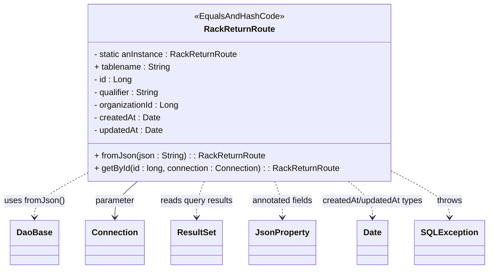

# Diagram: platform-java-lambdas/shipment/src/main/java/com/freightverify/shipment/datastore/postgresql/dao/RackReturnRoute.java


> Auto-generated by Obscura crawlers

## Diagram 1



### SVG

<svg id="container" width="909.0078125" xmlns="http://www.w3.org/2000/svg" class="classDiagram" height="510" viewBox="0 0 909.0078125 510" role="graphics-document document" aria-roledescription="class"><style>#container{font-family:"trebuchet ms",verdana,arial,sans-serif;font-size:16px;fill:#333;}@keyframes edge-animation-frame{from{stroke-dashoffset:0;}}@keyframes dash{to{stroke-dashoffset:0;}}#container .edge-animation-slow{stroke-dasharray:9,5!important;stroke-dashoffset:900;animation:dash 50s linear infinite;stroke-linecap:round;}#container .edge-animation-fast{stroke-dasharray:9,5!important;stroke-dashoffset:900;animation:dash 20s linear infinite;stroke-linecap:round;}#container .error-icon{fill:#552222;}#container .error-text{fill:#552222;stroke:#552222;}#container .edge-thickness-normal{stroke-width:1px;}#container .edge-thickness-thick{stroke-width:3.5px;}#container .edge-pattern-solid{stroke-dasharray:0;}#container .edge-thickness-invisible{stroke-width:0;fill:none;}#container .edge-pattern-dashed{stroke-dasharray:3;}#container .edge-pattern-dotted{stroke-dasharray:2;}#container .marker{fill:#333333;stroke:#333333;}#container .marker.cross{stroke:#333333;}#container svg{font-family:"trebuchet ms",verdana,arial,sans-serif;font-size:16px;}#container p{margin:0;}#container g.classGroup text{fill:#9370DB;stroke:none;font-family:"trebuchet ms",verdana,arial,sans-serif;font-size:10px;}#container g.classGroup text .title{font-weight:bolder;}#container .nodeLabel,#container .edgeLabel{color:#131300;}#container .edgeLabel .label rect{fill:#ECECFF;}#container .label text{fill:#131300;}#container .labelBkg{background:#ECECFF;}#container .edgeLabel .label span{background:#ECECFF;}#container .classTitle{font-weight:bolder;}#container .node rect,#container .node circle,#container .node ellipse,#container .node polygon,#container .node path{fill:#ECECFF;stroke:#9370DB;stroke-width:1px;}#container .divider{stroke:#9370DB;stroke-width:1;}#container g.clickable{cursor:pointer;}#container g.classGroup rect{fill:#ECECFF;stroke:#9370DB;}#container g.classGroup line{stroke:#9370DB;stroke-width:1;}#container .classLabel .box{stroke:none;stroke-width:0;fill:#ECECFF;opacity:0.5;}#container .classLabel .label{fill:#9370DB;font-size:10px;}#container .relation{stroke:#333333;stroke-width:1;fill:none;}#container .dashed-line{stroke-dasharray:3;}#container .dotted-line{stroke-dasharray:1 2;}#container #compositionStart,#container .composition{fill:#333333!important;stroke:#333333!important;stroke-width:1;}#container #compositionEnd,#container .composition{fill:#333333!important;stroke:#333333!important;stroke-width:1;}#container #dependencyStart,#container .dependency{fill:#333333!important;stroke:#333333!important;stroke-width:1;}#container #dependencyStart,#container .dependency{fill:#333333!important;stroke:#333333!important;stroke-width:1;}#container #extensionStart,#container .extension{fill:transparent!important;stroke:#333333!important;stroke-width:1;}#container #extensionEnd,#container .extension{fill:transparent!important;stroke:#333333!important;stroke-width:1;}#container #aggregationStart,#container .aggregation{fill:transparent!important;stroke:#333333!important;stroke-width:1;}#container #aggregationEnd,#container .aggregation{fill:transparent!important;stroke:#333333!important;stroke-width:1;}#container #lollipopStart,#container .lollipop{fill:#ECECFF!important;stroke:#333333!important;stroke-width:1;}#container #lollipopEnd,#container .lollipop{fill:#ECECFF!important;stroke:#333333!important;stroke-width:1;}#container .edgeTerminals{font-size:11px;line-height:initial;}#container .classTitleText{text-anchor:middle;font-size:18px;fill:#333;}#container .label-icon{display:inline-block;height:1em;overflow:visible;vertical-align:-0.125em;}#container .node .label-icon path{fill:currentColor;stroke:revert;stroke-width:revert;}#container :root{--mermaid-font-family:"trebuchet ms",verdana,arial,sans-serif;}</style><g><defs><marker id="container_class-aggregationStart" class="marker aggregation class" refX="18" refY="7" markerWidth="190" markerHeight="240" orient="auto"><path d="M 18,7 L9,13 L1,7 L9,1 Z"></path></marker></defs><defs><marker id="container_class-aggregationEnd" class="marker aggregation class" refX="1" refY="7" markerWidth="20" markerHeight="28" orient="auto"><path d="M 18,7 L9,13 L1,7 L9,1 Z"></path></marker></defs><defs><marker id="container_class-extensionStart" class="marker extension class" refX="18" refY="7" markerWidth="190" markerHeight="240" orient="auto"><path d="M 1,7 L18,13 V 1 Z"></path></marker></defs><defs><marker id="container_class-extensionEnd" class="marker extension class" refX="1" refY="7" markerWidth="20" markerHeight="28" orient="auto"><path d="M 1,1 V 13 L18,7 Z"></path></marker></defs><defs><marker id="container_class-compositionStart" class="marker composition class" refX="18" refY="7" markerWidth="190" markerHeight="240" orient="auto"><path d="M 18,7 L9,13 L1,7 L9,1 Z"></path></marker></defs><defs><marker id="container_class-compositionEnd" class="marker composition class" refX="1" refY="7" markerWidth="20" markerHeight="28" orient="auto"><path d="M 18,7 L9,13 L1,7 L9,1 Z"></path></marker></defs><defs><marker id="container_class-dependencyStart" class="marker dependency class" refX="6" refY="7" markerWidth="190" markerHeight="240" orient="auto"><path d="M 5,7 L9,13 L1,7 L9,1 Z"></path></marker></defs><defs><marker id="container_class-dependencyEnd" class="marker dependency class" refX="13" refY="7" markerWidth="20" markerHeight="28" orient="auto"><path d="M 18,7 L9,13 L14,7 L9,1 Z"></path></marker></defs><defs><marker id="container_class-lollipopStart" class="marker lollipop class" refX="13" refY="7" markerWidth="190" markerHeight="240" orient="auto"><circle stroke="black" fill="transparent" cx="7" cy="7" r="6"></circle></marker></defs><defs><marker id="container_class-lollipopEnd" class="marker lollipop class" refX="1" refY="7" markerWidth="190" markerHeight="240" orient="auto"><circle stroke="black" fill="transparent" cx="7" cy="7" r="6"></circle></marker></defs><g class="root"><g class="clusters"></g><g class="edgePaths"><path d="M154.543,331.818L139.518,340.015C124.492,348.212,94.441,364.606,79.416,377.97C64.391,391.333,64.391,401.667,64.391,406.833L64.391,412" id="id_RackReturnRoute_DaoBase_1" class="edge-thickness-normal edge-pattern-dashed relation" style=";;;" data-edge="true" data-et="edge" data-id="id_RackReturnRoute_DaoBase_1" data-points="W3sieCI6MTU0LjU0Mjk2ODc1LCJ5IjozMzEuODE4MTU2MzAyNjI1OH0seyJ4Ijo2NC4zOTA2MjUsInkiOjM4MX0seyJ4Ijo2NC4zOTA2MjUsInkiOjQxOH1d" marker-end="url(#container_class-dependencyEnd)"></path><path d="M252.63,344L245.747,350.167C238.863,356.333,225.095,368.667,218.212,380C211.328,391.333,211.328,401.667,211.328,406.833L211.328,412" id="id_RackReturnRoute_Connection_2" class="edge-thickness-normal edge-pattern-solid relation" style=";;;" data-edge="true" data-et="edge" data-id="id_RackReturnRoute_Connection_2" data-points="W3sieCI6MjUyLjYzMDIyMTAzNjU4NTM3LCJ5IjozNDR9LHsieCI6MjExLjMyODEyNSwieSI6MzgxfSx7IngiOjIxMS4zMjgxMjUsInkiOjQxOH1d" marker-end="url(#container_class-dependencyEnd)"></path><path d="M375.922,344L373.564,350.167C371.206,356.333,366.49,368.667,364.132,380C361.773,391.333,361.773,401.667,361.773,406.833L361.773,412" id="id_RackReturnRoute_ResultSet_3" class="edge-thickness-normal edge-pattern-dashed relation" style=";;;" data-edge="true" data-et="edge" data-id="id_RackReturnRoute_ResultSet_3" data-points="W3sieCI6Mzc1LjkyMTk4OTMyOTI2ODMsInkiOjM0NH0seyJ4IjozNjEuNzczNDM3NSwieSI6MzgxfSx7IngiOjM2MS43NzM0Mzc1LCJ5Ijo0MTh9XQ==" marker-end="url(#container_class-dependencyEnd)"></path><path d="M504.406,344L506.764,350.167C509.122,356.333,513.839,368.667,516.197,380C518.555,391.333,518.555,401.667,518.555,406.833L518.555,412" id="id_RackReturnRoute_JsonProperty_4" class="edge-thickness-normal edge-pattern-dashed relation" style=";;;" data-edge="true" data-et="edge" data-id="id_RackReturnRoute_JsonProperty_4" data-points="W3sieCI6NTA0LjQwNjEzNTY3MDczMTcsInkiOjM0NH0seyJ4Ijo1MTguNTU0Njg3NSwieSI6MzgxfSx7IngiOjUxOC41NTQ2ODc1LCJ5Ijo0MTh9XQ==" marker-end="url(#container_class-dependencyEnd)"></path><path d="M650.03,344L657.733,350.167C665.436,356.333,680.843,368.667,688.547,380C696.25,391.333,696.25,401.667,696.25,406.833L696.25,412" id="id_RackReturnRoute_Date_5" class="edge-thickness-normal edge-pattern-dashed relation" style=";;;" data-edge="true" data-et="edge" data-id="id_RackReturnRoute_Date_5" data-points="W3sieCI6NjUwLjAyOTYxMTI4MDQ4NzksInkiOjM0NH0seyJ4Ijo2OTYuMjUsInkiOjM4MX0seyJ4Ijo2OTYuMjUsInkiOjQxOH1d" marker-end="url(#container_class-dependencyEnd)"></path><path d="M725.785,322.768L744.673,332.473C763.56,342.179,801.335,361.589,820.222,376.461C839.109,391.333,839.109,401.667,839.109,406.833L839.109,412" id="id_RackReturnRoute_SQLException_6" class="edge-thickness-normal edge-pattern-dashed relation" style=";;;" data-edge="true" data-et="edge" data-id="id_RackReturnRoute_SQLException_6" data-points="W3sieCI6NzI1Ljc4NTE1NjI1LCJ5IjozMjIuNzY3Nzk1OTQ2MzQyODZ9LHsieCI6ODM5LjEwOTM3NSwieSI6MzgxfSx7IngiOjgzOS4xMDkzNzUsInkiOjQxOH1d" marker-end="url(#container_class-dependencyEnd)"></path></g><g class="edgeLabels"><g class="edgeLabel" transform="translate(64.390625, 381)"><g class="label" data-id="id_RackReturnRoute_DaoBase_1" transform="translate(-56.390625, -12)"><foreignObject width="112.78125" height="24"><div xmlns="http://www.w3.org/1999/xhtml" class="labelBkg" style="display: table-cell; white-space: nowrap; line-height: 1.5; max-width: 200px; text-align: center;"><span class="edgeLabel"><p>uses fromJson()</p></span></div></foreignObject></g></g><g class="edgeLabel" transform="translate(211.328125, 381)"><g class="label" data-id="id_RackReturnRoute_Connection_2" transform="translate(-37.6171875, -12)"><foreignObject width="75.234375" height="24"><div xmlns="http://www.w3.org/1999/xhtml" class="labelBkg" style="display: table-cell; white-space: nowrap; line-height: 1.5; max-width: 200px; text-align: center;"><span class="edgeLabel"><p>parameter</p></span></div></foreignObject></g></g><g class="edgeLabel" transform="translate(361.7734375, 381)"><g class="label" data-id="id_RackReturnRoute_ResultSet_3" transform="translate(-69.6328125, -12)"><foreignObject width="139.265625" height="24"><div xmlns="http://www.w3.org/1999/xhtml" class="labelBkg" style="display: table-cell; white-space: nowrap; line-height: 1.5; max-width: 200px; text-align: center;"><span class="edgeLabel"><p>reads query results</p></span></div></foreignObject></g></g><g class="edgeLabel" transform="translate(518.5546875, 381)"><g class="label" data-id="id_RackReturnRoute_JsonProperty_4" transform="translate(-59.40625, -12)"><foreignObject width="118.8125" height="24"><div xmlns="http://www.w3.org/1999/xhtml" class="labelBkg" style="display: table-cell; white-space: nowrap; line-height: 1.5; max-width: 200px; text-align: center;"><span class="edgeLabel"><p>annotated fields</p></span></div></foreignObject></g></g><g class="edgeLabel" transform="translate(696.25, 381)"><g class="label" data-id="id_RackReturnRoute_Date_5" transform="translate(-98.2890625, -12)"><foreignObject width="196.578125" height="24"><div xmlns="http://www.w3.org/1999/xhtml" class="labelBkg" style="display: table-cell; white-space: nowrap; line-height: 1.5; max-width: 200px; text-align: center;"><span class="edgeLabel"><p>createdAt/updatedAt types</p></span></div></foreignObject></g></g><g class="edgeLabel" transform="translate(839.109375, 381)"><g class="label" data-id="id_RackReturnRoute_SQLException_6" transform="translate(-24.5703125, -12)"><foreignObject width="49.140625" height="24"><div xmlns="http://www.w3.org/1999/xhtml" class="labelBkg" style="display: table-cell; white-space: nowrap; line-height: 1.5; max-width: 200px; text-align: center;"><span class="edgeLabel"><p>throws</p></span></div></foreignObject></g></g></g><g class="nodes"><g class="node default" id="classId-RackReturnRoute-0" transform="translate(440.1640625, 176)"><g class="basic label-container"><path d="M-285.62109375 -168 L285.62109375 -168 L285.62109375 168 L-285.62109375 168" stroke="none" stroke-width="0" fill="#ECECFF" style=""></path><path d="M-285.62109375 -168 C-167.8676725271668 -168, -50.11425130433358 -168, 285.62109375 -168 M-285.62109375 -168 C-147.17852577976907 -168, -8.73595780953815 -168, 285.62109375 -168 M285.62109375 -168 C285.62109375 -91.35711269913804, 285.62109375 -14.714225398276085, 285.62109375 168 M285.62109375 -168 C285.62109375 -86.70788747919798, 285.62109375 -5.415774958395957, 285.62109375 168 M285.62109375 168 C63.111377354315636 168, -159.39833904136873 168, -285.62109375 168 M285.62109375 168 C138.8837187703037 168, -7.853656209392625 168, -285.62109375 168 M-285.62109375 168 C-285.62109375 88.78963618474175, -285.62109375 9.579272369483505, -285.62109375 -168 M-285.62109375 168 C-285.62109375 57.262474550293106, -285.62109375 -53.47505089941379, -285.62109375 -168" stroke="#9370DB" stroke-width="1.3" fill="none" stroke-dasharray="0 0" style=""></path></g><g class="annotation-group text" transform="translate(-83.2109375, -144)"><g class="label" style="" transform="translate(0,-12)"><foreignObject width="166.421875" height="24"><div xmlns="http://www.w3.org/1999/xhtml" style="display: table-cell; white-space: nowrap; line-height: 1.5; max-width: 216px; text-align: center;"><span class="nodeLabel markdown-node-label" style=""><p>«EqualsAndHashCode»</p></span></div></foreignObject></g></g><g class="label-group text" transform="translate(-63.6328125, -120)"><g class="label" style="font-weight: bolder" transform="translate(0,-12)"><foreignObject width="127.265625" height="24"><div xmlns="http://www.w3.org/1999/xhtml" style="display: table-cell; white-space: nowrap; line-height: 1.5; max-width: 175px; text-align: center;"><span class="nodeLabel markdown-node-label" style=""><p>RackReturnRoute</p></span></div></foreignObject></g></g><g class="members-group text" transform="translate(-273.62109375, -72)"><g class="label" style="" transform="translate(0,-12)"><foreignObject width="271.6875" height="24"><div xmlns="http://www.w3.org/1999/xhtml" style="display: table-cell; white-space: nowrap; line-height: 1.5; max-width: 329px; text-align: center;"><span class="nodeLabel markdown-node-label" style=""><p>- static anInstance : RackReturnRoute</p></span></div></foreignObject></g><g class="label" style="" transform="translate(0,12)"><foreignObject width="145.140625" height="24"><div xmlns="http://www.w3.org/1999/xhtml" style="display: table-cell; white-space: nowrap; line-height: 1.5; max-width: 203px; text-align: center;"><span class="nodeLabel markdown-node-label" style=""><p>+ tablename : String</p></span></div></foreignObject></g><g class="label" style="" transform="translate(0,36)"><foreignObject width="71.703125" height="24"><div xmlns="http://www.w3.org/1999/xhtml" style="display: table-cell; white-space: nowrap; line-height: 1.5; max-width: 130px; text-align: center;"><span class="nodeLabel markdown-node-label" style=""><p>- id : Long</p></span></div></foreignObject></g><g class="label" style="" transform="translate(0,60)"><foreignObject width="126.609375" height="24"><div xmlns="http://www.w3.org/1999/xhtml" style="display: table-cell; white-space: nowrap; line-height: 1.5; max-width: 185px; text-align: center;"><span class="nodeLabel markdown-node-label" style=""><p>- qualifier : String</p></span></div></foreignObject></g><g class="label" style="" transform="translate(0,84)"><foreignObject width="162.265625" height="24"><div xmlns="http://www.w3.org/1999/xhtml" style="display: table-cell; white-space: nowrap; line-height: 1.5; max-width: 220px; text-align: center;"><span class="nodeLabel markdown-node-label" style=""><p>- organizationId : Long</p></span></div></foreignObject></g><g class="label" style="" transform="translate(0,108)"><foreignObject width="125.5" height="24"><div xmlns="http://www.w3.org/1999/xhtml" style="display: table-cell; white-space: nowrap; line-height: 1.5; max-width: 183px; text-align: center;"><span class="nodeLabel markdown-node-label" style=""><p>- createdAt : Date</p></span></div></foreignObject></g><g class="label" style="" transform="translate(0,132)"><foreignObject width="131.96875" height="24"><div xmlns="http://www.w3.org/1999/xhtml" style="display: table-cell; white-space: nowrap; line-height: 1.5; max-width: 189px; text-align: center;"><span class="nodeLabel markdown-node-label" style=""><p>- updatedAt : Date</p></span></div></foreignObject></g></g><g class="methods-group text" transform="translate(-273.62109375, 120)"><g class="label" style="" transform="translate(0,-12)"><foreignObject width="319.84375" height="24"><div xmlns="http://www.w3.org/1999/xhtml" style="display: table-cell; white-space: nowrap; line-height: 1.5; max-width: 377px; text-align: center;"><span class="nodeLabel markdown-node-label" style=""><p>+ fromJson(json : String) : : RackReturnRoute</p></span></div></foreignObject></g><g class="label" style="" transform="translate(0,12)"><foreignObject width="464.03125" height="24"><div xmlns="http://www.w3.org/1999/xhtml" style="display: table-cell; white-space: nowrap; line-height: 1.5; max-width: 521px; text-align: center;"><span class="nodeLabel markdown-node-label" style=""><p>+ getById(id : long, connection : Connection) : : RackReturnRoute</p></span></div></foreignObject></g></g><g class="divider" style=""><path d="M-285.62109375 -96 C-111.0851613863143 -96, 63.450770977371405 -96, 285.62109375 -96 M-285.62109375 -96 C-100.44477048325453 -96, 84.73155278349094 -96, 285.62109375 -96" stroke="#9370DB" stroke-width="1.3" fill="none" stroke-dasharray="0 0" style=""></path></g><g class="divider" style=""><path d="M-285.62109375 96 C-131.50926091281303 96, 22.602571924373933 96, 285.62109375 96 M-285.62109375 96 C-148.06391462511573 96, -10.506735500231457 96, 285.62109375 96" stroke="#9370DB" stroke-width="1.3" fill="none" stroke-dasharray="0 0" style=""></path></g></g><g class="node default" id="classId-DaoBase-1" transform="translate(64.390625, 460)"><g class="basic label-container"><path d="M-43.7109375 -42 L43.7109375 -42 L43.7109375 42 L-43.7109375 42" stroke="none" stroke-width="0" fill="#ECECFF" style=""></path><path d="M-43.7109375 -42 C-9.112789359680761 -42, 25.485358780638478 -42, 43.7109375 -42 M-43.7109375 -42 C-22.169277817698568 -42, -0.6276181353971353 -42, 43.7109375 -42 M43.7109375 -42 C43.7109375 -19.631410123649832, 43.7109375 2.737179752700335, 43.7109375 42 M43.7109375 -42 C43.7109375 -18.85533092022342, 43.7109375 4.289338159553161, 43.7109375 42 M43.7109375 42 C24.98666485593946 42, 6.262392211878918 42, -43.7109375 42 M43.7109375 42 C16.091418483907667 42, -11.528100532184666 42, -43.7109375 42 M-43.7109375 42 C-43.7109375 24.25694473929489, -43.7109375 6.513889478589782, -43.7109375 -42 M-43.7109375 42 C-43.7109375 22.14621279774526, -43.7109375 2.2924255954905206, -43.7109375 -42" stroke="#9370DB" stroke-width="1.3" fill="none" stroke-dasharray="0 0" style=""></path></g><g class="annotation-group text" transform="translate(0, -18)"></g><g class="label-group text" transform="translate(-31.7109375, -18)"><g class="label" style="font-weight: bolder" transform="translate(0,-12)"><foreignObject width="63.421875" height="24"><div xmlns="http://www.w3.org/1999/xhtml" style="display: table-cell; white-space: nowrap; line-height: 1.5; max-width: 113px; text-align: center;"><span class="nodeLabel markdown-node-label" style=""><p>DaoBase</p></span></div></foreignObject></g></g><g class="members-group text" transform="translate(-31.7109375, 30)"></g><g class="methods-group text" transform="translate(-31.7109375, 60)"></g><g class="divider" style=""><path d="M-43.7109375 6 C-20.981131756830546 6, 1.7486739863389076 6, 43.7109375 6 M-43.7109375 6 C-24.262494076515438 6, -4.8140506530308755 6, 43.7109375 6" stroke="#9370DB" stroke-width="1.3" fill="none" stroke-dasharray="0 0" style=""></path></g><g class="divider" style=""><path d="M-43.7109375 24 C-13.085151185520079 24, 17.540635128959842 24, 43.7109375 24 M-43.7109375 24 C-11.52075109828806 24, 20.66943530342388 24, 43.7109375 24" stroke="#9370DB" stroke-width="1.3" fill="none" stroke-dasharray="0 0" style=""></path></g></g><g class="node default" id="classId-Connection-2" transform="translate(211.328125, 460)"><g class="basic label-container"><path d="M-53.2265625 -42 L53.2265625 -42 L53.2265625 42 L-53.2265625 42" stroke="none" stroke-width="0" fill="#ECECFF" style=""></path><path d="M-53.2265625 -42 C-13.760269259744518 -42, 25.706023980510963 -42, 53.2265625 -42 M-53.2265625 -42 C-29.09109055838502 -42, -4.955618616770039 -42, 53.2265625 -42 M53.2265625 -42 C53.2265625 -8.579401265172393, 53.2265625 24.841197469655214, 53.2265625 42 M53.2265625 -42 C53.2265625 -12.914233140963795, 53.2265625 16.17153371807241, 53.2265625 42 M53.2265625 42 C12.568038754033132 42, -28.090484991933735 42, -53.2265625 42 M53.2265625 42 C22.68780314164959 42, -7.850956216700823 42, -53.2265625 42 M-53.2265625 42 C-53.2265625 13.158471845033507, -53.2265625 -15.683056309932986, -53.2265625 -42 M-53.2265625 42 C-53.2265625 16.655365206136317, -53.2265625 -8.689269587727367, -53.2265625 -42" stroke="#9370DB" stroke-width="1.3" fill="none" stroke-dasharray="0 0" style=""></path></g><g class="annotation-group text" transform="translate(0, -18)"></g><g class="label-group text" transform="translate(-41.2265625, -18)"><g class="label" style="font-weight: bolder" transform="translate(0,-12)"><foreignObject width="82.453125" height="24"><div xmlns="http://www.w3.org/1999/xhtml" style="display: table-cell; white-space: nowrap; line-height: 1.5; max-width: 132px; text-align: center;"><span class="nodeLabel markdown-node-label" style=""><p>Connection</p></span></div></foreignObject></g></g><g class="members-group text" transform="translate(-41.2265625, 30)"></g><g class="methods-group text" transform="translate(-41.2265625, 60)"></g><g class="divider" style=""><path d="M-53.2265625 6 C-26.47124811744981 6, 0.28406626510037825 6, 53.2265625 6 M-53.2265625 6 C-11.95036803493938 6, 29.32582643012124 6, 53.2265625 6" stroke="#9370DB" stroke-width="1.3" fill="none" stroke-dasharray="0 0" style=""></path></g><g class="divider" style=""><path d="M-53.2265625 24 C-24.291230989679164 24, 4.644100520641672 24, 53.2265625 24 M-53.2265625 24 C-20.004683565005905 24, 13.21719536998819 24, 53.2265625 24" stroke="#9370DB" stroke-width="1.3" fill="none" stroke-dasharray="0 0" style=""></path></g></g><g class="node default" id="classId-ResultSet-3" transform="translate(361.7734375, 460)"><g class="basic label-container"><path d="M-47.21875 -42 L47.21875 -42 L47.21875 42 L-47.21875 42" stroke="none" stroke-width="0" fill="#ECECFF" style=""></path><path d="M-47.21875 -42 C-12.530829851061043 -42, 22.157090297877915 -42, 47.21875 -42 M-47.21875 -42 C-12.513439451521691 -42, 22.191871096956618 -42, 47.21875 -42 M47.21875 -42 C47.21875 -21.71901460770628, 47.21875 -1.4380292154125627, 47.21875 42 M47.21875 -42 C47.21875 -19.925432687770837, 47.21875 2.149134624458327, 47.21875 42 M47.21875 42 C13.800126420815907 42, -19.618497158368186 42, -47.21875 42 M47.21875 42 C27.252779093160854 42, 7.286808186321707 42, -47.21875 42 M-47.21875 42 C-47.21875 14.141801041866568, -47.21875 -13.716397916266864, -47.21875 -42 M-47.21875 42 C-47.21875 20.025268460897518, -47.21875 -1.949463078204964, -47.21875 -42" stroke="#9370DB" stroke-width="1.3" fill="none" stroke-dasharray="0 0" style=""></path></g><g class="annotation-group text" transform="translate(0, -18)"></g><g class="label-group text" transform="translate(-35.21875, -18)"><g class="label" style="font-weight: bolder" transform="translate(0,-12)"><foreignObject width="70.4375" height="24"><div xmlns="http://www.w3.org/1999/xhtml" style="display: table-cell; white-space: nowrap; line-height: 1.5; max-width: 119px; text-align: center;"><span class="nodeLabel markdown-node-label" style=""><p>ResultSet</p></span></div></foreignObject></g></g><g class="members-group text" transform="translate(-35.21875, 30)"></g><g class="methods-group text" transform="translate(-35.21875, 60)"></g><g class="divider" style=""><path d="M-47.21875 6 C-13.51752682356421 6, 20.18369635287158 6, 47.21875 6 M-47.21875 6 C-21.591686132770104 6, 4.035377734459793 6, 47.21875 6" stroke="#9370DB" stroke-width="1.3" fill="none" stroke-dasharray="0 0" style=""></path></g><g class="divider" style=""><path d="M-47.21875 24 C-14.142718847942938 24, 18.933312304114125 24, 47.21875 24 M-47.21875 24 C-22.66491867234582 24, 1.88891265530836 24, 47.21875 24" stroke="#9370DB" stroke-width="1.3" fill="none" stroke-dasharray="0 0" style=""></path></g></g><g class="node default" id="classId-JsonProperty-4" transform="translate(518.5546875, 460)"><g class="basic label-container"><path d="M-59.5625 -42 L59.5625 -42 L59.5625 42 L-59.5625 42" stroke="none" stroke-width="0" fill="#ECECFF" style=""></path><path d="M-59.5625 -42 C-13.661556370100143 -42, 32.23938725979971 -42, 59.5625 -42 M-59.5625 -42 C-25.918855610323135 -42, 7.72478877935373 -42, 59.5625 -42 M59.5625 -42 C59.5625 -21.561778628114297, 59.5625 -1.1235572562285938, 59.5625 42 M59.5625 -42 C59.5625 -9.473252618211056, 59.5625 23.053494763577888, 59.5625 42 M59.5625 42 C12.627729565657027 42, -34.307040868685945 42, -59.5625 42 M59.5625 42 C21.738963107424297 42, -16.084573785151406 42, -59.5625 42 M-59.5625 42 C-59.5625 23.374135114105023, -59.5625 4.748270228210046, -59.5625 -42 M-59.5625 42 C-59.5625 12.112692813300526, -59.5625 -17.774614373398947, -59.5625 -42" stroke="#9370DB" stroke-width="1.3" fill="none" stroke-dasharray="0 0" style=""></path></g><g class="annotation-group text" transform="translate(0, -18)"></g><g class="label-group text" transform="translate(-47.5625, -18)"><g class="label" style="font-weight: bolder" transform="translate(0,-12)"><foreignObject width="95.125" height="24"><div xmlns="http://www.w3.org/1999/xhtml" style="display: table-cell; white-space: nowrap; line-height: 1.5; max-width: 143px; text-align: center;"><span class="nodeLabel markdown-node-label" style=""><p>JsonProperty</p></span></div></foreignObject></g></g><g class="members-group text" transform="translate(-47.5625, 30)"></g><g class="methods-group text" transform="translate(-47.5625, 60)"></g><g class="divider" style=""><path d="M-59.5625 6 C-19.74924657621643 6, 20.064006847567143 6, 59.5625 6 M-59.5625 6 C-19.043445172156268 6, 21.475609655687464 6, 59.5625 6" stroke="#9370DB" stroke-width="1.3" fill="none" stroke-dasharray="0 0" style=""></path></g><g class="divider" style=""><path d="M-59.5625 24 C-12.926682214605492 24, 33.709135570789016 24, 59.5625 24 M-59.5625 24 C-28.226785630829802 24, 3.1089287383403956 24, 59.5625 24" stroke="#9370DB" stroke-width="1.3" fill="none" stroke-dasharray="0 0" style=""></path></g></g><g class="node default" id="classId-Date-5" transform="translate(696.25, 460)"><g class="basic label-container"><path d="M-28.875 -42 L28.875 -42 L28.875 42 L-28.875 42" stroke="none" stroke-width="0" fill="#ECECFF" style=""></path><path d="M-28.875 -42 C-13.68071197349289 -42, 1.5135760530142193 -42, 28.875 -42 M-28.875 -42 C-12.696134706674211 -42, 3.482730586651577 -42, 28.875 -42 M28.875 -42 C28.875 -11.603796293116162, 28.875 18.792407413767677, 28.875 42 M28.875 -42 C28.875 -13.765091886527998, 28.875 14.469816226944005, 28.875 42 M28.875 42 C6.078489063165872 42, -16.718021873668256 42, -28.875 42 M28.875 42 C14.502588122355448 42, 0.13017624471089562 42, -28.875 42 M-28.875 42 C-28.875 12.154522702921785, -28.875 -17.69095459415643, -28.875 -42 M-28.875 42 C-28.875 20.388204169432505, -28.875 -1.2235916611349893, -28.875 -42" stroke="#9370DB" stroke-width="1.3" fill="none" stroke-dasharray="0 0" style=""></path></g><g class="annotation-group text" transform="translate(0, -18)"></g><g class="label-group text" transform="translate(-16.875, -18)"><g class="label" style="font-weight: bolder" transform="translate(0,-12)"><foreignObject width="33.75" height="24"><div xmlns="http://www.w3.org/1999/xhtml" style="display: table-cell; white-space: nowrap; line-height: 1.5; max-width: 83px; text-align: center;"><span class="nodeLabel markdown-node-label" style=""><p>Date</p></span></div></foreignObject></g></g><g class="members-group text" transform="translate(-16.875, 30)"></g><g class="methods-group text" transform="translate(-16.875, 60)"></g><g class="divider" style=""><path d="M-28.875 6 C-9.913972275444795 6, 9.04705544911041 6, 28.875 6 M-28.875 6 C-11.8570254209524 6, 5.1609491580952 6, 28.875 6" stroke="#9370DB" stroke-width="1.3" fill="none" stroke-dasharray="0 0" style=""></path></g><g class="divider" style=""><path d="M-28.875 24 C-12.754472665132017 24, 3.3660546697359663 24, 28.875 24 M-28.875 24 C-11.555445423992143 24, 5.764109152015713 24, 28.875 24" stroke="#9370DB" stroke-width="1.3" fill="none" stroke-dasharray="0 0" style=""></path></g></g><g class="node default" id="classId-SQLException-6" transform="translate(839.109375, 460)"><g class="basic label-container"><path d="M-61.8984375 -42 L61.8984375 -42 L61.8984375 42 L-61.8984375 42" stroke="none" stroke-width="0" fill="#ECECFF" style=""></path><path d="M-61.8984375 -42 C-20.57651428889912 -42, 20.74540892220176 -42, 61.8984375 -42 M-61.8984375 -42 C-28.798752912925757 -42, 4.300931674148487 -42, 61.8984375 -42 M61.8984375 -42 C61.8984375 -22.16986889534505, 61.8984375 -2.3397377906901013, 61.8984375 42 M61.8984375 -42 C61.8984375 -22.865262935833396, 61.8984375 -3.730525871666792, 61.8984375 42 M61.8984375 42 C12.865427658308107 42, -36.167582183383786 42, -61.8984375 42 M61.8984375 42 C24.755285527695968 42, -12.387866444608065 42, -61.8984375 42 M-61.8984375 42 C-61.8984375 18.241910862582195, -61.8984375 -5.51617827483561, -61.8984375 -42 M-61.8984375 42 C-61.8984375 24.048673611330454, -61.8984375 6.097347222660908, -61.8984375 -42" stroke="#9370DB" stroke-width="1.3" fill="none" stroke-dasharray="0 0" style=""></path></g><g class="annotation-group text" transform="translate(0, -18)"></g><g class="label-group text" transform="translate(-49.8984375, -18)"><g class="label" style="font-weight: bolder" transform="translate(0,-12)"><foreignObject width="99.796875" height="24"><div xmlns="http://www.w3.org/1999/xhtml" style="display: table-cell; white-space: nowrap; line-height: 1.5; max-width: 148px; text-align: center;"><span class="nodeLabel markdown-node-label" style=""><p>SQLException</p></span></div></foreignObject></g></g><g class="members-group text" transform="translate(-49.8984375, 30)"></g><g class="methods-group text" transform="translate(-49.8984375, 60)"></g><g class="divider" style=""><path d="M-61.8984375 6 C-31.4614244091591 6, -1.0244113183182009 6, 61.8984375 6 M-61.8984375 6 C-31.555218222084694 6, -1.2119989441693875 6, 61.8984375 6" stroke="#9370DB" stroke-width="1.3" fill="none" stroke-dasharray="0 0" style=""></path></g><g class="divider" style=""><path d="M-61.8984375 24 C-17.786412374485217 24, 26.325612751029567 24, 61.8984375 24 M-61.8984375 24 C-31.2051371370156 24, -0.5118367740312024 24, 61.8984375 24" stroke="#9370DB" stroke-width="1.3" fill="none" stroke-dasharray="0 0" style=""></path></g></g></g></g></g></svg>

## Diagram 2

```mermaid
flowchart TD
    A[getById(id, connection)] --> B[executeQuery: select row_to_json(row) from (select * from public.rack_return_route where id = <id>) row]
    B --> C{results.next()}
    C -- Yes --> D[json = results.getString(1)]
    D --> E[retval = RackReturnRoute.fromJson(json)]
    E --> F[return retval]
    C -- No --> G[return null]
```

> SVG rendering failed for this diagram.
