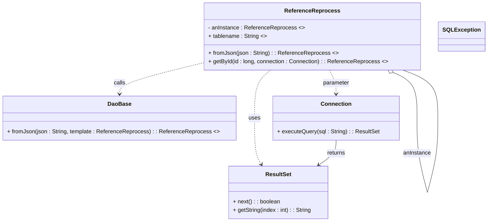
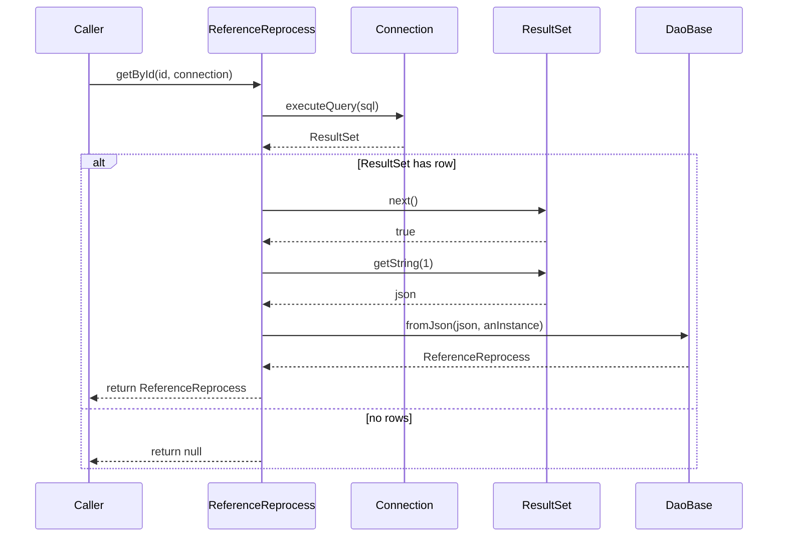

# Diagram: platform-java-lambdas/shipment/src/main/java/com/freightverify/shipment/datastore/postgresql/dao/ReferenceReprocess.java

> Auto-generated by Obscura crawlers

## Diagram 1

### SVG

<svg id="container" width="1353.9156494140625" xmlns="http://www.w3.org/2000/svg" class="classDiagram" height="632" viewBox="0 0 1353.9156494140625 632" role="graphics-document document" aria-roledescription="class"><g><defs><marker id="container_class-aggregationStart" class="marker aggregation class" refX="18" refY="7" markerWidth="190" markerHeight="240" orient="auto"><path d="M 18,7 L9,13 L1,7 L9,1 Z"></path></marker></defs><defs><marker id="container_class-aggregationEnd" class="marker aggregation class" refX="1" refY="7" markerWidth="20" markerHeight="28" orient="auto"><path d="M 18,7 L9,13 L1,7 L9,1 Z"></path></marker></defs><defs><marker id="container_class-extensionStart" class="marker extension class" refX="18" refY="7" markerWidth="190" markerHeight="240" orient="auto"><path d="M 1,7 L18,13 V 1 Z"></path></marker></defs><defs><marker id="container_class-extensionEnd" class="marker extension class" refX="1" refY="7" markerWidth="20" markerHeight="28" orient="auto"><path d="M 1,1 V 13 L18,7 Z"></path></marker></defs><defs><marker id="container_class-compositionStart" class="marker composition class" refX="18" refY="7" markerWidth="190" markerHeight="240" orient="auto"><path d="M 18,7 L9,13 L1,7 L9,1 Z"></path></marker></defs><defs><marker id="container_class-compositionEnd" class="marker composition class" refX="1" refY="7" markerWidth="20" markerHeight="28" orient="auto"><path d="M 18,7 L9,13 L1,7 L9,1 Z"></path></marker></defs><defs><marker id="container_class-dependencyStart" class="marker dependency class" refX="6" refY="7" markerWidth="190" markerHeight="240" orient="auto"><path d="M 5,7 L9,13 L1,7 L9,1 Z"></path></marker></defs><defs><marker id="container_class-dependencyEnd" class="marker dependency class" refX="13" refY="7" markerWidth="20" markerHeight="28" orient="auto"><path d="M 18,7 L9,13 L14,7 L9,1 Z"></path></marker></defs><defs><marker id="container_class-lollipopStart" class="marker lollipop class" refX="13" refY="7" markerWidth="190" markerHeight="240" orient="auto"><circle stroke="black" fill="transparent" cx="7" cy="7" r="6"></circle></marker></defs><defs><marker id="container_class-lollipopEnd" class="marker lollipop class" refX="1" refY="7" markerWidth="190" markerHeight="240" orient="auto"><circle stroke="black" fill="transparent" cx="7" cy="7" r="6"></circle></marker></defs><g class="root"><g class="clusters"></g><g class="edgePaths"><path d="M569.705,178.262L529.998,188.052C490.291,197.841,410.878,217.421,371.171,232.377C331.465,247.333,331.465,257.667,331.465,262.833L331.465,268" id="id_ReferenceReprocess_DaoBase_1" class="edge-thickness-normal edge-pattern-dashed relation" style=";;;" data-edge="true" data-et="edge" data-id="id_ReferenceReprocess_DaoBase_1" data-points="W3sieCI6NTY5LjcwNDY4NzUwMDM3MjUsInkiOjE3OC4yNjIyNDM0NDM3NTQwMn0seyJ4IjozMzEuNDY0ODQzNzUsInkiOjIzN30seyJ4IjozMzEuNDY0ODQzNzUsInkiOjI3NH1d" marker-end="url(#container_class-dependencyEnd)"></path><path d="M916.706,200L919.647,206.167C922.589,212.333,928.472,224.667,931.414,236C934.355,247.333,934.355,257.667,934.355,262.833L934.355,268" id="id_ReferenceReprocess_Connection_2" class="edge-thickness-normal edge-pattern-dashed relation" style=";;;" data-edge="true" data-et="edge" data-id="id_ReferenceReprocess_Connection_2" data-points="W3sieCI6OTE2LjcwNTcwMzcxMjUwOTYsInkiOjIwMH0seyJ4Ijo5MzQuMzU1NDY4NzUsInkiOjIzN30seyJ4Ijo5MzQuMzU1NDY4NzUsInkiOjI3NH1d" marker-end="url(#container_class-dependencyEnd)"></path><path d="M752.182,200L744.555,206.167C736.929,212.333,721.675,224.667,714.049,247.5C706.422,270.333,706.422,303.667,706.422,337C706.422,370.333,706.422,403.667,709.422,425.63C712.422,447.593,718.423,458.186,721.423,463.483L724.424,468.779" id="id_ReferenceReprocess_ResultSet_3" class="edge-thickness-normal edge-pattern-dashed relation" style=";;;" data-edge="true" data-et="edge" data-id="id_ReferenceReprocess_ResultSet_3" data-points="W3sieCI6NzUyLjE4MjIwNzQ3MTkwODEsInkiOjIwMH0seyJ4Ijo3MDYuNDIxODc1LCJ5IjoyMzd9LHsieCI6NzA2LjQyMTg3NSwieSI6MzM3fSx7IngiOjcwNi40MjE4NzUsInkiOjQzN30seyJ4Ijo3MjcuMzgwOTcwOTgyMDE5OCwieSI6NDc0fV0=" marker-end="url(#container_class-dependencyEnd)"></path><path d="M934.355,400L934.355,406.167C934.355,412.333,934.355,424.667,926.125,436.437C917.895,448.208,901.435,459.415,893.205,465.019L884.975,470.623" id="id_Connection_ResultSet_4" class="edge-thickness-normal edge-pattern-solid relation" style=";;;" data-edge="true" data-et="edge" data-id="id_Connection_ResultSet_4" data-points="W3sieCI6OTM0LjM1NTQ2ODc1LCJ5Ijo0MDB9LHsieCI6OTM0LjM1NTQ2ODc1LCJ5Ijo0Mzd9LHsieCI6ODgwLjAxNTA3MzkzOTYwOTEsInkiOjQ3NH1d" marker-end="url(#container_class-dependencyEnd)"></path><path d="M1095.867,207.192L1106.697,212.16C1117.527,217.128,1139.187,227.064,1150.017,248.69C1160.847,270.317,1160.847,303.633,1160.847,320.292L1160.847,336.95" id="ReferenceReprocess-cyclic-special-1" class="edge-thickness-normal edge-pattern-solid relation" style=";;;" data-edge="true" data-et="edge" data-id="ReferenceReprocess-cyclic-special-1" data-points="W3sieCI6MTA4MC4xODgyMjI1MTAwMzk5LCJ5IjoyMDB9LHsieCI6MTE2MC44NDY4NzUwMDA3NDUsInkiOjIzN30seyJ4IjoxMTYwLjg0Njg3NTAwMDc0NSwieSI6MzM2Ljk0OTk5OTk5OTI1NDk0fV0=" marker-start="url(#container_class-aggregationStart)"></path><path d="M1160.847,337.05L1160.847,353.708C1160.847,370.367,1160.847,403.683,1165.822,439C1170.797,474.317,1180.747,511.633,1185.722,530.292L1190.697,548.95" id="ReferenceReprocess-cyclic-special-mid" class="edge-thickness-normal edge-pattern-solid relation" style=";;;" data-edge="true" data-et="edge" data-id="ReferenceReprocess-cyclic-special-mid" data-points="W3sieCI6MTE2MC44NDY4NzUwMDA3NDUsInkiOjMzNy4wNTAwMDAwMDA3NDUwNn0seyJ4IjoxMTYwLjg0Njg3NTAwMDc0NSwieSI6NDM3fSx7IngiOjExOTAuNjk2ODI0NDI4NTU5NywieSI6NTQ4Ljk0OTk5OTk5OTI1NDl9XQ=="></path><path d="M1190.723,548.95L1195.698,530.292C1200.673,511.633,1210.623,474.317,1215.598,438.992C1220.573,403.667,1220.573,370.333,1220.573,337C1220.573,303.667,1220.573,270.333,1204.361,247.5C1188.149,224.667,1155.724,212.333,1139.512,206.167L1123.299,200" id="ReferenceReprocess-cyclic-special-2" class="edge-thickness-normal edge-pattern-solid relation" style=";;;" data-edge="true" data-et="edge" data-id="ReferenceReprocess-cyclic-special-2" data-points="W3sieCI6MTE5MC43MjM0ODgwNzI5MzA0LCJ5Ijo1NDguOTQ5OTk5OTk5MjU0OX0seyJ4IjoxMjIwLjU3MzQzNzUwMDc0NSwieSI6NDM3fSx7IngiOjEyMjAuNTczNDM3NTAwNzQ1LCJ5IjozMzd9LHsieCI6MTIyMC41NzM0Mzc1MDA3NDUsInkiOjIzN30seyJ4IjoxMTIzLjI5OTEyNDc2NTY3OSwieSI6MjAwfV0="></path></g><g class="edgeLabels"><g class="edgeLabel" transform="translate(331.46484375, 237)"><g class="label" data-id="id_ReferenceReprocess_DaoBase_1" transform="translate(-16.4453125, -12)"><foreignObject width="32.890625" height="24">

calls

</foreignObject></g></g><g class="edgeLabel" transform="translate(934.35546875, 237)"><g class="label" data-id="id_ReferenceReprocess_Connection_2" transform="translate(-37.6171875, -12)"><foreignObject width="75.234375" height="24">

parameter

</foreignObject></g></g><g class="edgeLabel" transform="translate(706.421875, 337)"><g class="label" data-id="id_ReferenceReprocess_ResultSet_3" transform="translate(-16.4921875, -12)"><foreignObject width="32.984375" height="24">

uses

</foreignObject></g></g><g class="edgeLabel" transform="translate(934.35546875, 437)"><g class="label" data-id="id_Connection_ResultSet_4" transform="translate(-26.265625, -12)"><foreignObject width="52.53125" height="24">

returns

</foreignObject></g></g><g class="edgeLabel"><g class="label" data-id="ReferenceReprocess-cyclic-special-1" transform="translate(0, 0)"><foreignObject width="0" height="0">

</foreignObject></g></g><g class="edgeLabel" transform="translate(1160.846875000745, 437)"><g class="label" data-id="ReferenceReprocess-cyclic-special-mid" transform="translate(-39.7265625, -12)"><foreignObject width="79.453125" height="24">

anInstance

</foreignObject></g></g><g class="edgeLabel"><g class="label" data-id="ReferenceReprocess-cyclic-special-2" transform="translate(0, 0)"><foreignObject width="0" height="0">

</foreignObject></g></g></g><g class="nodes"><g class="node default" id="classId-ReferenceReprocess-0" transform="translate(870.9117187503725, 104)"><g class="basic label-container"><path d="M-301.20703125 -96 L301.20703125 -96 L301.20703125 96 L-301.20703125 96" stroke="none" stroke-width="0" fill="#ECECFF" style=""></path><path d="M-301.20703125 -96 C-82.00041354725806 -96, 137.20620415548387 -96, 301.20703125 -96 M-301.20703125 -96 C-64.22580437720299 -96, 172.75542249559402 -96, 301.20703125 -96 M301.20703125 -96 C301.20703125 -30.679196026853333, 301.20703125 34.641607946293334, 301.20703125 96 M301.20703125 -96 C301.20703125 -20.758190994623646, 301.20703125 54.48361801075271, 301.20703125 96 M301.20703125 96 C106.12731950244827 96, -88.95239224510345 96, -301.20703125 96 M301.20703125 96 C164.37942307296805 96, 27.551814895936104 96, -301.20703125 96 M-301.20703125 96 C-301.20703125 24.437160273937764, -301.20703125 -47.12567945212447, -301.20703125 -96 M-301.20703125 96 C-301.20703125 37.236463054776806, -301.20703125 -21.52707389044639, -301.20703125 -96" stroke="#9370DB" stroke-width="1.3" fill="none" stroke-dasharray="0 0" style=""></path></g><g class="annotation-group text" transform="translate(0, -72)"></g><g class="label-group text" transform="translate(-73.9140625, -72)"><g class="label" style="font-weight: bolder" transform="translate(0,-12)"><foreignObject width="147.828125" height="24">

ReferenceReprocess

</foreignObject></g></g><g class="members-group text" transform="translate(-289.20703125, -24)"><g class="label" style="" transform="translate(0,-12)"><foreignObject width="268.15625" height="24">

- anInstance : ReferenceReprocess &lt;&gt;

</foreignObject></g><g class="label" style="" transform="translate(0,12)"><foreignObject width="165.390625" height="24">

+ tablename : String &lt;&gt;

</foreignObject></g></g><g class="methods-group text" transform="translate(-289.20703125, 48)"><g class="label" style="" transform="translate(0,-12)"><foreignObject width="360.328125" height="24">

+ fromJson(json : String) : : ReferenceReprocess &lt;&gt;

</foreignObject></g><g class="label" style="" transform="translate(0,12)"><foreignObject width="504.5" height="24">

+ getById(id : long, connection : Connection) : : ReferenceReprocess &lt;&gt;

</foreignObject></g></g><g class="divider" style=""><path d="M-301.20703125 -48 C-86.16156063139593 -48, 128.88390998720814 -48, 301.20703125 -48 M-301.20703125 -48 C-157.0713819360636 -48, -12.935732622127205 -48, 301.20703125 -48" stroke="#9370DB" stroke-width="1.3" fill="none" stroke-dasharray="0 0" style=""></path></g><g class="divider" style=""><path d="M-301.20703125 24 C-178.2568662365154 24, -55.306701223030785 24, 301.20703125 24 M-301.20703125 24 C-91.83825698069631 24, 117.53051728860737 24, 301.20703125 24" stroke="#9370DB" stroke-width="1.3" fill="none" stroke-dasharray="0 0" style=""></path></g></g><g class="node default" id="classId-DaoBase-1" transform="translate(331.46484375, 337)"><g class="basic label-container"><path d="M-323.46484375 -63 L323.46484375 -63 L323.46484375 63 L-323.46484375 63" stroke="none" stroke-width="0" fill="#ECECFF" style=""></path><path d="M-323.46484375 -63 C-98.04814835940496 -63, 127.36854703119008 -63, 323.46484375 -63 M-323.46484375 -63 C-153.63558452460978 -63, 16.193674700780434 -63, 323.46484375 -63 M323.46484375 -63 C323.46484375 -17.67921053775231, 323.46484375 27.641578924495377, 323.46484375 63 M323.46484375 -63 C323.46484375 -21.741912815267042, 323.46484375 19.516174369465915, 323.46484375 63 M323.46484375 63 C180.72988213098327 63, 37.99492051196654 63, -323.46484375 63 M323.46484375 63 C169.33052970623277 63, 15.196215662465534 63, -323.46484375 63 M-323.46484375 63 C-323.46484375 17.82117975382139, -323.46484375 -27.35764049235722, -323.46484375 -63 M-323.46484375 63 C-323.46484375 15.819782783977764, -323.46484375 -31.36043443204447, -323.46484375 -63" stroke="#9370DB" stroke-width="1.3" fill="none" stroke-dasharray="0 0" style=""></path></g><g class="annotation-group text" transform="translate(0, -39)"></g><g class="label-group text" transform="translate(-31.7109375, -39)"><g class="label" style="font-weight: bolder" transform="translate(0,-12)"><foreignObject width="63.421875" height="24">

DaoBase

</foreignObject></g></g><g class="members-group text" transform="translate(-311.46484375, 9)"></g><g class="methods-group text" transform="translate(-311.46484375, 39)"><g class="label" style="" transform="translate(0,-12)"><foreignObject width="591.21875" height="24">

+ fromJson(json : String, template : ReferenceReprocess) : : ReferenceReprocess &lt;&gt;

</foreignObject></g></g><g class="divider" style=""><path d="M-323.46484375 -15 C-94.17393850455142 -15, 135.11696674089717 -15, 323.46484375 -15 M-323.46484375 -15 C-95.9557951819038 -15, 131.5532533861924 -15, 323.46484375 -15" stroke="#9370DB" stroke-width="1.3" fill="none" stroke-dasharray="0 0" style=""></path></g><g class="divider" style=""><path d="M-323.46484375 9 C-182.67143662359834 9, -41.87802949719668 9, 323.46484375 9 M-323.46484375 9 C-169.47745847873705 9, -15.490073207474097 9, 323.46484375 9" stroke="#9370DB" stroke-width="1.3" fill="none" stroke-dasharray="0 0" style=""></path></g></g><g class="node default" id="classId-Connection-2" transform="translate(934.35546875, 337)"><g class="basic label-container"><path d="M-176.44140625 -63 L176.44140625 -63 L176.44140625 63 L-176.44140625 63" stroke="none" stroke-width="0" fill="#ECECFF" style=""></path><path d="M-176.44140625 -63 C-92.3527206791175 -63, -8.264035108234992 -63, 176.44140625 -63 M-176.44140625 -63 C-53.74176234327804 -63, 68.95788156344392 -63, 176.44140625 -63 M176.44140625 -63 C176.44140625 -20.84816355745002, 176.44140625 21.303672885099957, 176.44140625 63 M176.44140625 -63 C176.44140625 -33.87616226637006, 176.44140625 -4.7523245327401185, 176.44140625 63 M176.44140625 63 C52.79409179553497 63, -70.85322265893006 63, -176.44140625 63 M176.44140625 63 C35.818383277485424 63, -104.80463969502915 63, -176.44140625 63 M-176.44140625 63 C-176.44140625 12.973852908525963, -176.44140625 -37.052294182948074, -176.44140625 -63 M-176.44140625 63 C-176.44140625 21.256959260861628, -176.44140625 -20.486081478276745, -176.44140625 -63" stroke="#9370DB" stroke-width="1.3" fill="none" stroke-dasharray="0 0" style=""></path></g><g class="annotation-group text" transform="translate(0, -39)"></g><g class="label-group text" transform="translate(-41.2265625, -39)"><g class="label" style="font-weight: bolder" transform="translate(0,-12)"><foreignObject width="82.453125" height="24">

Connection

</foreignObject></g></g><g class="members-group text" transform="translate(-164.44140625, 9)"></g><g class="methods-group text" transform="translate(-164.44140625, 39)"><g class="label" style="" transform="translate(0,-12)"><foreignObject width="287.65625" height="24">

+ executeQuery(sql : String) : : ResultSet

</foreignObject></g></g><g class="divider" style=""><path d="M-176.44140625 -15 C-76.54167549470914 -15, 23.35805526058172 -15, 176.44140625 -15 M-176.44140625 -15 C-81.10159111577511 -15, 14.238224018449785 -15, 176.44140625 -15" stroke="#9370DB" stroke-width="1.3" fill="none" stroke-dasharray="0 0" style=""></path></g><g class="divider" style=""><path d="M-176.44140625 9 C-49.96660592947505 9, 76.5081943910499 9, 176.44140625 9 M-176.44140625 9 C-71.10844322258674 9, 34.224519804826514 9, 176.44140625 9" stroke="#9370DB" stroke-width="1.3" fill="none" stroke-dasharray="0 0" style=""></path></g></g><g class="node default" id="classId-ResultSet-3" transform="translate(769.8656249996275, 549)"><g class="basic label-container"><path d="M-141.15625 -75 L141.15625 -75 L141.15625 75 L-141.15625 75" stroke="none" stroke-width="0" fill="#ECECFF" style=""></path><path d="M-141.15625 -75 C-84.00451458700344 -75, -26.852779174006884 -75, 141.15625 -75 M-141.15625 -75 C-51.30416318402315 -75, 38.547923631953694 -75, 141.15625 -75 M141.15625 -75 C141.15625 -21.23562447346736, 141.15625 32.52875105306528, 141.15625 75 M141.15625 -75 C141.15625 -17.573481866939716, 141.15625 39.85303626612057, 141.15625 75 M141.15625 75 C34.02381782377421 75, -73.10861435245158 75, -141.15625 75 M141.15625 75 C77.21044311805787 75, 13.26463623611572 75, -141.15625 75 M-141.15625 75 C-141.15625 41.55513188103088, -141.15625 8.110263762061763, -141.15625 -75 M-141.15625 75 C-141.15625 24.397844577208225, -141.15625 -26.20431084558355, -141.15625 -75" stroke="#9370DB" stroke-width="1.3" fill="none" stroke-dasharray="0 0" style=""></path></g><g class="annotation-group text" transform="translate(0, -51)"></g><g class="label-group text" transform="translate(-35.21875, -51)"><g class="label" style="font-weight: bolder" transform="translate(0,-12)"><foreignObject width="70.4375" height="24">

ResultSet

</foreignObject></g></g><g class="members-group text" transform="translate(-129.15625, -3)"></g><g class="methods-group text" transform="translate(-129.15625, 27)"><g class="label" style="" transform="translate(0,-12)"><foreignObject width="133.921875" height="24">

+ next() : : boolean

</foreignObject></g><g class="label" style="" transform="translate(0,12)"><foreignObject width="223.09375" height="24">

+ getString(index : int) : : String

</foreignObject></g></g><g class="divider" style=""><path d="M-141.15625 -27 C-70.23885019013588 -27, 0.6785496197282441 -27, 141.15625 -27 M-141.15625 -27 C-67.33678300072414 -27, 6.482683998551721 -27, 141.15625 -27" stroke="#9370DB" stroke-width="1.3" fill="none" stroke-dasharray="0 0" style=""></path></g><g class="divider" style=""><path d="M-141.15625 -3 C-47.22201479676659 -3, 46.71222040646683 -3, 141.15625 -3 M-141.15625 -3 C-42.59253697521129 -3, 55.97117604957742 -3, 141.15625 -3" stroke="#9370DB" stroke-width="1.3" fill="none" stroke-dasharray="0 0" style=""></path></g></g><g class="node default" id="classId-SQLException-4" transform="translate(1284.0171875003725, 104)"><g class="basic label-container"><path d="M-61.8984375 -42 L61.8984375 -42 L61.8984375 42 L-61.8984375 42" stroke="none" stroke-width="0" fill="#ECECFF" style=""></path><path d="M-61.8984375 -42 C-32.87869854944294 -42, -3.8589595988858747 -42, 61.8984375 -42 M-61.8984375 -42 C-33.00626936589127 -42, -4.114101231782534 -42, 61.8984375 -42 M61.8984375 -42 C61.8984375 -10.294476120437409, 61.8984375 21.411047759125182, 61.8984375 42 M61.8984375 -42 C61.8984375 -12.197114254336629, 61.8984375 17.605771491326742, 61.8984375 42 M61.8984375 42 C34.86406124644026 42, 7.829684992880523 42, -61.8984375 42 M61.8984375 42 C27.39001056222459 42, -7.118416375550822 42, -61.8984375 42 M-61.8984375 42 C-61.8984375 12.048537569502681, -61.8984375 -17.902924860994638, -61.8984375 -42 M-61.8984375 42 C-61.8984375 14.850526752817103, -61.8984375 -12.298946494365794, -61.8984375 -42" stroke="#9370DB" stroke-width="1.3" fill="none" stroke-dasharray="0 0" style=""></path></g><g class="annotation-group text" transform="translate(0, -18)"></g><g class="label-group text" transform="translate(-49.8984375, -18)"><g class="label" style="font-weight: bolder" transform="translate(0,-12)"><foreignObject width="99.796875" height="24">

SQLException

</foreignObject></g></g><g class="members-group text" transform="translate(-49.8984375, 30)"></g><g class="methods-group text" transform="translate(-49.8984375, 60)"></g><g class="divider" style=""><path d="M-61.8984375 6 C-22.580491334224547 6, 16.737454831550906 6, 61.8984375 6 M-61.8984375 6 C-36.24250992174609 6, -10.58658234349219 6, 61.8984375 6" stroke="#9370DB" stroke-width="1.3" fill="none" stroke-dasharray="0 0" style=""></path></g><g class="divider" style=""><path d="M-61.8984375 24 C-17.295170537495565 24, 27.30809642500887 24, 61.8984375 24 M-61.8984375 24 C-19.752566879132402 24, 22.393303741735195 24, 61.8984375 24" stroke="#9370DB" stroke-width="1.3" fill="none" stroke-dasharray="0 0" style=""></path></g></g><g class="label edgeLabel" id="ReferenceReprocess---ReferenceReprocess---1" transform="translate(1160.846875000745, 337)"><rect width="0.1" height="0.1"></rect><g class="label" style="" transform="translate(0, 0)"><rect></rect><foreignObject width="0" height="0">

</foreignObject></g></g><g class="label edgeLabel" id="ReferenceReprocess---ReferenceReprocess---2" transform="translate(1190.710156250745, 549)"><rect width="0.1" height="0.1"></rect><g class="label" style="" transform="translate(0, 0)"><rect></rect><foreignObject width="0" height="0">

</foreignObject></g></g></g></g></g></svg>

## Diagram 2

### SVG

<svg id="container" width="1122.5" xmlns="http://www.w3.org/2000/svg" height="799" viewBox="-50 -10 1122.5 799" role="graphics-document document" aria-roledescription="sequence"><g><rect x="872.5" y="713" fill="#eaeaea" stroke="#666" width="150" height="65" name="DaoBase" rx="3" ry="3" class="actor actor-bottom"></rect><text x="947.5" y="745.5" dominant-baseline="central" alignment-baseline="central" class="actor actor-box" style="text-anchor: middle; font-size: 16px; font-weight: 400;"><tspan x="947.5" dy="0">DaoBase</tspan></text></g><g><rect x="672.5" y="713" fill="#eaeaea" stroke="#666" width="150" height="65" name="ResultSet" rx="3" ry="3" class="actor actor-bottom"></rect><text x="747.5" y="745.5" dominant-baseline="central" alignment-baseline="central" class="actor actor-box" style="text-anchor: middle; font-size: 16px; font-weight: 400;"><tspan x="747.5" dy="0">ResultSet</tspan></text></g><g><rect x="472.5" y="713" fill="#eaeaea" stroke="#666" width="150" height="65" name="Connection" rx="3" ry="3" class="actor actor-bottom"></rect><text x="547.5" y="745.5" dominant-baseline="central" alignment-baseline="central" class="actor actor-box" style="text-anchor: middle; font-size: 16px; font-weight: 400;"><tspan x="547.5" dy="0">Connection</tspan></text></g><g><rect x="257.5" y="713" fill="#eaeaea" stroke="#666" width="165" height="65" name="ReferenceReprocess" rx="3" ry="3" class="actor actor-bottom"></rect><text x="340" y="745.5" dominant-baseline="central" alignment-baseline="central" class="actor actor-box" style="text-anchor: middle; font-size: 16px; font-weight: 400;"><tspan x="340" dy="0">ReferenceReprocess</tspan></text></g><g><rect x="0" y="713" fill="#eaeaea" stroke="#666" width="150" height="65" name="Caller" rx="3" ry="3" class="actor actor-bottom"></rect><text x="75" y="745.5" dominant-baseline="central" alignment-baseline="central" class="actor actor-box" style="text-anchor: middle; font-size: 16px; font-weight: 400;"><tspan x="75" dy="0">Caller</tspan></text></g><g><line id="actor4" x1="947.5" y1="65" x2="947.5" y2="713" class="actor-line 200" stroke-width="0.5px" stroke="#999" name="DaoBase"></line><g id="root-4"><rect x="872.5" y="0" fill="#eaeaea" stroke="#666" width="150" height="65" name="DaoBase" rx="3" ry="3" class="actor actor-top"></rect><text x="947.5" y="32.5" dominant-baseline="central" alignment-baseline="central" class="actor actor-box" style="text-anchor: middle; font-size: 16px; font-weight: 400;"><tspan x="947.5" dy="0">DaoBase</tspan></text></g></g><g><line id="actor3" x1="747.5" y1="65" x2="747.5" y2="713" class="actor-line 200" stroke-width="0.5px" stroke="#999" name="ResultSet"></line><g id="root-3"><rect x="672.5" y="0" fill="#eaeaea" stroke="#666" width="150" height="65" name="ResultSet" rx="3" ry="3" class="actor actor-top"></rect><text x="747.5" y="32.5" dominant-baseline="central" alignment-baseline="central" class="actor actor-box" style="text-anchor: middle; font-size: 16px; font-weight: 400;"><tspan x="747.5" dy="0">ResultSet</tspan></text></g></g><g><line id="actor2" x1="547.5" y1="65" x2="547.5" y2="713" class="actor-line 200" stroke-width="0.5px" stroke="#999" name="Connection"></line><g id="root-2"><rect x="472.5" y="0" fill="#eaeaea" stroke="#666" width="150" height="65" name="Connection" rx="3" ry="3" class="actor actor-top"></rect><text x="547.5" y="32.5" dominant-baseline="central" alignment-baseline="central" class="actor actor-box" style="text-anchor: middle; font-size: 16px; font-weight: 400;"><tspan x="547.5" dy="0">Connection</tspan></text></g></g><g><line id="actor1" x1="340" y1="65" x2="340" y2="713" class="actor-line 200" stroke-width="0.5px" stroke="#999" name="ReferenceReprocess"></line><g id="root-1"><rect x="257.5" y="0" fill="#eaeaea" stroke="#666" width="165" height="65" name="ReferenceReprocess" rx="3" ry="3" class="actor actor-top"></rect><text x="340" y="32.5" dominant-baseline="central" alignment-baseline="central" class="actor actor-box" style="text-anchor: middle; font-size: 16px; font-weight: 400;"><tspan x="340" dy="0">ReferenceReprocess</tspan></text></g></g><g><line id="actor0" x1="75" y1="65" x2="75" y2="713" class="actor-line 200" stroke-width="0.5px" stroke="#999" name="Caller"></line><g id="root-0"><rect x="0" y="0" fill="#eaeaea" stroke="#666" width="150" height="65" name="Caller" rx="3" ry="3" class="actor actor-top"></rect><text x="75" y="32.5" dominant-baseline="central" alignment-baseline="central" class="actor actor-box" style="text-anchor: middle; font-size: 16px; font-weight: 400;"><tspan x="75" dy="0">Caller</tspan></text></g></g><g></g><defs><symbol id="computer" width="24" height="24"><path transform="scale(.5)" d="M2 2v13h20v-13h-20zm18 11h-16v-9h16v9zm-10.228 6l.466-1h3.524l.467 1h-4.457zm14.228 3h-24l2-6h2.104l-1.33 4h18.45l-1.297-4h2.073l2 6zm-5-10h-14v-7h14v7z"></path></symbol></defs><defs><symbol id="database" fill-rule="evenodd" clip-rule="evenodd"><path transform="scale(.5)" d="M12.258.001l.256.004.255.005.253.008.251.01.249.012.247.015.246.016.242.019.241.02.239.023.236.024.233.027.231.028.229.031.225.032.223.034.22.036.217.038.214.04.211.041.208.043.205.045.201.046.198.048.194.05.191.051.187.053.183.054.18.056.175.057.172.059.168.06.163.061.16.063.155.064.15.066.074.033.073.033.071.034.07.034.069.035.068.035.067.035.066.035.064.036.064.036.062.036.06.036.06.037.058.037.058.037.055.038.055.038.053.038.052.038.051.039.05.039.048.039.047.039.045.04.044.04.043.04.041.04.04.041.039.041.037.041.036.041.034.041.033.042.032.042.03.042.029.042.027.042.026.043.024.043.023.043.021.043.02.043.018.044.017.043.015.044.013.044.012.044.011.045.009.044.007.045.006.045.004.045.002.045.001.045v17l-.001.045-.002.045-.004.045-.006.045-.007.045-.009.044-.011.045-.012.044-.013.044-.015.044-.017.043-.018.044-.02.043-.021.043-.023.043-.024.043-.026.043-.027.042-.029.042-.03.042-.032.042-.033.042-.034.041-.036.041-.037.041-.039.041-.04.041-.041.04-.043.04-.044.04-.045.04-.047.039-.048.039-.05.039-.051.039-.052.038-.053.038-.055.038-.055.038-.058.037-.058.037-.06.037-.06.036-.062.036-.064.036-.064.036-.066.035-.067.035-.068.035-.069.035-.07.034-.071.034-.073.033-.074.033-.15.066-.155.064-.16.063-.163.061-.168.06-.172.059-.175.057-.18.056-.183.054-.187.053-.191.051-.194.05-.198.048-.201.046-.205.045-.208.043-.211.041-.214.04-.217.038-.22.036-.223.034-.225.032-.229.031-.231.028-.233.027-.236.024-.239.023-.241.02-.242.019-.246.016-.247.015-.249.012-.251.01-.253.008-.255.005-.256.004-.258.001-.258-.001-.256-.004-.255-.005-.253-.008-.251-.01-.249-.012-.247-.015-.245-.016-.243-.019-.241-.02-.238-.023-.236-.024-.234-.027-.231-.028-.228-.031-.226-.032-.223-.034-.22-.036-.217-.038-.214-.04-.211-.041-.208-.043-.204-.045-.201-.046-.198-.048-.195-.05-.19-.051-.187-.053-.184-.054-.179-.056-.176-.057-.172-.059-.167-.06-.164-.061-.159-.063-.155-.064-.151-.066-.074-.033-.072-.033-.072-.034-.07-.034-.069-.035-.068-.035-.067-.035-.066-.035-.064-.036-.063-.036-.062-.036-.061-.036-.06-.037-.058-.037-.057-.037-.056-.038-.055-.038-.053-.038-.052-.038-.051-.039-.049-.039-.049-.039-.046-.039-.046-.04-.044-.04-.043-.04-.041-.04-.04-.041-.039-.041-.037-.041-.036-.041-.034-.041-.033-.042-.032-.042-.03-.042-.029-.042-.027-.042-.026-.043-.024-.043-.023-.043-.021-.043-.02-.043-.018-.044-.017-.043-.015-.044-.013-.044-.012-.044-.011-.045-.009-.044-.007-.045-.006-.045-.004-.045-.002-.045-.001-.045v-17l.001-.045.002-.045.004-.045.006-.045.007-.045.009-.044.011-.045.012-.044.013-.044.015-.044.017-.043.018-.044.02-.043.021-.043.023-.043.024-.043.026-.043.027-.042.029-.042.03-.042.032-.042.033-.042.034-.041.036-.041.037-.041.039-.041.04-.041.041-.04.043-.04.044-.04.046-.04.046-.039.049-.039.049-.039.051-.039.052-.038.053-.038.055-.038.056-.038.057-.037.058-.037.06-.037.061-.036.062-.036.063-.036.064-.036.066-.035.067-.035.068-.035.069-.035.07-.034.072-.034.072-.033.074-.033.151-.066.155-.064.159-.063.164-.061.167-.06.172-.059.176-.057.179-.056.184-.054.187-.053.19-.051.195-.05.198-.048.201-.046.204-.045.208-.043.211-.041.214-.04.217-.038.22-.036.223-.034.226-.032.228-.031.231-.028.234-.027.236-.024.238-.023.241-.02.243-.019.245-.016.247-.015.249-.012.251-.01.253-.008.255-.005.256-.004.258-.001.258.001zm-9.258 20.499v.01l.001.021.003.021.004.022.005.021.006.022.007.022.009.023.01.022.011.023.012.023.013.023.015.023.016.024.017.023.018.024.019.024.021.024.022.025.023.024.024.025.052.049.056.05.061.051.066.051.07.051.075.051.079.052.084.052.088.052.092.052.097.052.102.051.105.052.11.052.114.051.119.051.123.051.127.05.131.05.135.05.139.048.144.049.147.047.152.047.155.047.16.045.163.045.167.043.171.043.176.041.178.041.183.039.187.039.19.037.194.035.197.035.202.033.204.031.209.03.212.029.216.027.219.025.222.024.226.021.23.02.233.018.236.016.24.015.243.012.246.01.249.008.253.005.256.004.259.001.26-.001.257-.004.254-.005.25-.008.247-.011.244-.012.241-.014.237-.016.233-.018.231-.021.226-.021.224-.024.22-.026.216-.027.212-.028.21-.031.205-.031.202-.034.198-.034.194-.036.191-.037.187-.039.183-.04.179-.04.175-.042.172-.043.168-.044.163-.045.16-.046.155-.046.152-.047.148-.048.143-.049.139-.049.136-.05.131-.05.126-.05.123-.051.118-.052.114-.051.11-.052.106-.052.101-.052.096-.052.092-.052.088-.053.083-.051.079-.052.074-.052.07-.051.065-.051.06-.051.056-.05.051-.05.023-.024.023-.025.021-.024.02-.024.019-.024.018-.024.017-.024.015-.023.014-.024.013-.023.012-.023.01-.023.01-.022.008-.022.006-.022.006-.022.004-.022.004-.021.001-.021.001-.021v-4.127l-.077.055-.08.053-.083.054-.085.053-.087.052-.09.052-.093.051-.095.05-.097.05-.1.049-.102.049-.105.048-.106.047-.109.047-.111.046-.114.045-.115.045-.118.044-.12.043-.122.042-.124.042-.126.041-.128.04-.13.04-.132.038-.134.038-.135.037-.138.037-.139.035-.142.035-.143.034-.144.033-.147.032-.148.031-.15.03-.151.03-.153.029-.154.027-.156.027-.158.026-.159.025-.161.024-.162.023-.163.022-.165.021-.166.02-.167.019-.169.018-.169.017-.171.016-.173.015-.173.014-.175.013-.175.012-.177.011-.178.01-.179.008-.179.008-.181.006-.182.005-.182.004-.184.003-.184.002h-.37l-.184-.002-.184-.003-.182-.004-.182-.005-.181-.006-.179-.008-.179-.008-.178-.01-.176-.011-.176-.012-.175-.013-.173-.014-.172-.015-.171-.016-.17-.017-.169-.018-.167-.019-.166-.02-.165-.021-.163-.022-.162-.023-.161-.024-.159-.025-.157-.026-.156-.027-.155-.027-.153-.029-.151-.03-.15-.03-.148-.031-.146-.032-.145-.033-.143-.034-.141-.035-.14-.035-.137-.037-.136-.037-.134-.038-.132-.038-.13-.04-.128-.04-.126-.041-.124-.042-.122-.042-.12-.044-.117-.043-.116-.045-.113-.045-.112-.046-.109-.047-.106-.047-.105-.048-.102-.049-.1-.049-.097-.05-.095-.05-.093-.052-.09-.051-.087-.052-.085-.053-.083-.054-.08-.054-.077-.054v4.127zm0-5.654v.011l.001.021.003.021.004.021.005.022.006.022.007.022.009.022.01.022.011.023.012.023.013.023.015.024.016.023.017.024.018.024.019.024.021.024.022.024.023.025.024.024.052.05.056.05.061.05.066.051.07.051.075.052.079.051.084.052.088.052.092.052.097.052.102.052.105.052.11.051.114.051.119.052.123.05.127.051.131.05.135.049.139.049.144.048.147.048.152.047.155.046.16.045.163.045.167.044.171.042.176.042.178.04.183.04.187.038.19.037.194.036.197.034.202.033.204.032.209.03.212.028.216.027.219.025.222.024.226.022.23.02.233.018.236.016.24.014.243.012.246.01.249.008.253.006.256.003.259.001.26-.001.257-.003.254-.006.25-.008.247-.01.244-.012.241-.015.237-.016.233-.018.231-.02.226-.022.224-.024.22-.025.216-.027.212-.029.21-.03.205-.032.202-.033.198-.035.194-.036.191-.037.187-.039.183-.039.179-.041.175-.042.172-.043.168-.044.163-.045.16-.045.155-.047.152-.047.148-.048.143-.048.139-.05.136-.049.131-.05.126-.051.123-.051.118-.051.114-.052.11-.052.106-.052.101-.052.096-.052.092-.052.088-.052.083-.052.079-.052.074-.051.07-.052.065-.051.06-.05.056-.051.051-.049.023-.025.023-.024.021-.025.02-.024.019-.024.018-.024.017-.024.015-.023.014-.023.013-.024.012-.022.01-.023.01-.023.008-.022.006-.022.006-.022.004-.021.004-.022.001-.021.001-.021v-4.139l-.077.054-.08.054-.083.054-.085.052-.087.053-.09.051-.093.051-.095.051-.097.05-.1.049-.102.049-.105.048-.106.047-.109.047-.111.046-.114.045-.115.044-.118.044-.12.044-.122.042-.124.042-.126.041-.128.04-.13.039-.132.039-.134.038-.135.037-.138.036-.139.036-.142.035-.143.033-.144.033-.147.033-.148.031-.15.03-.151.03-.153.028-.154.028-.156.027-.158.026-.159.025-.161.024-.162.023-.163.022-.165.021-.166.02-.167.019-.169.018-.169.017-.171.016-.173.015-.173.014-.175.013-.175.012-.177.011-.178.009-.179.009-.179.007-.181.007-.182.005-.182.004-.184.003-.184.002h-.37l-.184-.002-.184-.003-.182-.004-.182-.005-.181-.007-.179-.007-.179-.009-.178-.009-.176-.011-.176-.012-.175-.013-.173-.014-.172-.015-.171-.016-.17-.017-.169-.018-.167-.019-.166-.02-.165-.021-.163-.022-.162-.023-.161-.024-.159-.025-.157-.026-.156-.027-.155-.028-.153-.028-.151-.03-.15-.03-.148-.031-.146-.033-.145-.033-.143-.033-.141-.035-.14-.036-.137-.036-.136-.037-.134-.038-.132-.039-.13-.039-.128-.04-.126-.041-.124-.042-.122-.043-.12-.043-.117-.044-.116-.044-.113-.046-.112-.046-.109-.046-.106-.047-.105-.048-.102-.049-.1-.049-.097-.05-.095-.051-.093-.051-.09-.051-.087-.053-.085-.052-.083-.054-.08-.054-.077-.054v4.139zm0-5.666v.011l.001.02.003.022.004.021.005.022.006.021.007.022.009.023.01.022.011.023.012.023.013.023.015.023.016.024.017.024.018.023.019.024.021.025.022.024.023.024.024.025.052.05.056.05.061.05.066.051.07.051.075.052.079.051.084.052.088.052.092.052.097.052.102.052.105.051.11.052.114.051.119.051.123.051.127.05.131.05.135.05.139.049.144.048.147.048.152.047.155.046.16.045.163.045.167.043.171.043.176.042.178.04.183.04.187.038.19.037.194.036.197.034.202.033.204.032.209.03.212.028.216.027.219.025.222.024.226.021.23.02.233.018.236.017.24.014.243.012.246.01.249.008.253.006.256.003.259.001.26-.001.257-.003.254-.006.25-.008.247-.01.244-.013.241-.014.237-.016.233-.018.231-.02.226-.022.224-.024.22-.025.216-.027.212-.029.21-.03.205-.032.202-.033.198-.035.194-.036.191-.037.187-.039.183-.039.179-.041.175-.042.172-.043.168-.044.163-.045.16-.045.155-.047.152-.047.148-.048.143-.049.139-.049.136-.049.131-.051.126-.05.123-.051.118-.052.114-.051.11-.052.106-.052.101-.052.096-.052.092-.052.088-.052.083-.052.079-.052.074-.052.07-.051.065-.051.06-.051.056-.05.051-.049.023-.025.023-.025.021-.024.02-.024.019-.024.018-.024.017-.024.015-.023.014-.024.013-.023.012-.023.01-.022.01-.023.008-.022.006-.022.006-.022.004-.022.004-.021.001-.021.001-.021v-4.153l-.077.054-.08.054-.083.053-.085.053-.087.053-.09.051-.093.051-.095.051-.097.05-.1.049-.102.048-.105.048-.106.048-.109.046-.111.046-.114.046-.115.044-.118.044-.12.043-.122.043-.124.042-.126.041-.128.04-.13.039-.132.039-.134.038-.135.037-.138.036-.139.036-.142.034-.143.034-.144.033-.147.032-.148.032-.15.03-.151.03-.153.028-.154.028-.156.027-.158.026-.159.024-.161.024-.162.023-.163.023-.165.021-.166.02-.167.019-.169.018-.169.017-.171.016-.173.015-.173.014-.175.013-.175.012-.177.01-.178.01-.179.009-.179.007-.181.006-.182.006-.182.004-.184.003-.184.001-.185.001-.185-.001-.184-.001-.184-.003-.182-.004-.182-.006-.181-.006-.179-.007-.179-.009-.178-.01-.176-.01-.176-.012-.175-.013-.173-.014-.172-.015-.171-.016-.17-.017-.169-.018-.167-.019-.166-.02-.165-.021-.163-.023-.162-.023-.161-.024-.159-.024-.157-.026-.156-.027-.155-.028-.153-.028-.151-.03-.15-.03-.148-.032-.146-.032-.145-.033-.143-.034-.141-.034-.14-.036-.137-.036-.136-.037-.134-.038-.132-.039-.13-.039-.128-.041-.126-.041-.124-.041-.122-.043-.12-.043-.117-.044-.116-.044-.113-.046-.112-.046-.109-.046-.106-.048-.105-.048-.102-.048-.1-.05-.097-.049-.095-.051-.093-.051-.09-.052-.087-.052-.085-.053-.083-.053-.08-.054-.077-.054v4.153zm8.74-8.179l-.257.004-.254.005-.25.008-.247.011-.244.012-.241.014-.237.016-.233.018-.231.021-.226.022-.224.023-.22.026-.216.027-.212.028-.21.031-.205.032-.202.033-.198.034-.194.036-.191.038-.187.038-.183.04-.179.041-.175.042-.172.043-.168.043-.163.045-.16.046-.155.046-.152.048-.148.048-.143.048-.139.049-.136.05-.131.05-.126.051-.123.051-.118.051-.114.052-.11.052-.106.052-.101.052-.096.052-.092.052-.088.052-.083.052-.079.052-.074.051-.07.052-.065.051-.06.05-.056.05-.051.05-.023.025-.023.024-.021.024-.02.025-.019.024-.018.024-.017.023-.015.024-.014.023-.013.023-.012.023-.01.023-.01.022-.008.022-.006.023-.006.021-.004.022-.004.021-.001.021-.001.021.001.021.001.021.004.021.004.022.006.021.006.023.008.022.01.022.01.023.012.023.013.023.014.023.015.024.017.023.018.024.019.024.02.025.021.024.023.024.023.025.051.05.056.05.06.05.065.051.07.052.074.051.079.052.083.052.088.052.092.052.096.052.101.052.106.052.11.052.114.052.118.051.123.051.126.051.131.05.136.05.139.049.143.048.148.048.152.048.155.046.16.046.163.045.168.043.172.043.175.042.179.041.183.04.187.038.191.038.194.036.198.034.202.033.205.032.21.031.212.028.216.027.22.026.224.023.226.022.231.021.233.018.237.016.241.014.244.012.247.011.25.008.254.005.257.004.26.001.26-.001.257-.004.254-.005.25-.008.247-.011.244-.012.241-.014.237-.016.233-.018.231-.021.226-.022.224-.023.22-.026.216-.027.212-.028.21-.031.205-.032.202-.033.198-.034.194-.036.191-.038.187-.038.183-.04.179-.041.175-.042.172-.043.168-.043.163-.045.16-.046.155-.046.152-.048.148-.048.143-.048.139-.049.136-.05.131-.05.126-.051.123-.051.118-.051.114-.052.11-.052.106-.052.101-.052.096-.052.092-.052.088-.052.083-.052.079-.052.074-.051.07-.052.065-.051.06-.05.056-.05.051-.05.023-.025.023-.024.021-.024.02-.025.019-.024.018-.024.017-.023.015-.024.014-.023.013-.023.012-.023.01-.023.01-.022.008-.022.006-.023.006-.021.004-.022.004-.021.001-.021.001-.021-.001-.021-.001-.021-.004-.021-.004-.022-.006-.021-.006-.023-.008-.022-.01-.022-.01-.023-.012-.023-.013-.023-.014-.023-.015-.024-.017-.023-.018-.024-.019-.024-.02-.025-.021-.024-.023-.024-.023-.025-.051-.05-.056-.05-.06-.05-.065-.051-.07-.052-.074-.051-.079-.052-.083-.052-.088-.052-.092-.052-.096-.052-.101-.052-.106-.052-.11-.052-.114-.052-.118-.051-.123-.051-.126-.051-.131-.05-.136-.05-.139-.049-.143-.048-.148-.048-.152-.048-.155-.046-.16-.046-.163-.045-.168-.043-.172-.043-.175-.042-.179-.041-.183-.04-.187-.038-.191-.038-.194-.036-.198-.034-.202-.033-.205-.032-.21-.031-.212-.028-.216-.027-.22-.026-.224-.023-.226-.022-.231-.021-.233-.018-.237-.016-.241-.014-.244-.012-.247-.011-.25-.008-.254-.005-.257-.004-.26-.001-.26.001z"></path></symbol></defs><defs><symbol id="clock" width="24" height="24"><path transform="scale(.5)" d="M12 2c5.514 0 10 4.486 10 10s-4.486 10-10 10-10-4.486-10-10 4.486-10 10-10zm0-2c-6.627 0-12 5.373-12 12s5.373 12 12 12 12-5.373 12-12-5.373-12-12-12zm5.848 12.459c.202.038.202.333.001.372-1.907.361-6.045 1.111-6.547 1.111-.719 0-1.301-.582-1.301-1.301 0-.512.77-5.447 1.125-7.445.034-.192.312-.181.343.014l.985 6.238 5.394 1.011z"></path></symbol></defs><defs><marker id="arrowhead" refX="7.9" refY="5" markerUnits="userSpaceOnUse" markerWidth="12" markerHeight="12" orient="auto-start-reverse"><path d="M -1 0 L 10 5 L 0 10 z"></path></marker></defs><defs><marker id="crosshead" markerWidth="15" markerHeight="8" orient="auto" refX="4" refY="4.5"><path fill="none" stroke="#000000" stroke-width="1pt" d="M 1,2 L 6,7 M 6,2 L 1,7" style="stroke-dasharray: 0, 0;"></path></marker></defs><defs><marker id="filled-head" refX="15.5" refY="7" markerWidth="20" markerHeight="28" orient="auto"><path d="M 18,7 L9,13 L14,7 L9,1 Z"></path></marker></defs><defs><marker id="sequencenumber" refX="15" refY="15" markerWidth="60" markerHeight="40" orient="auto"><circle cx="15" cy="15" r="6"></circle></marker></defs><g><line x1="64" y1="219" x2="958.5" y2="219" class="loopLine"></line><line x1="958.5" y1="219" x2="958.5" y2="693" class="loopLine"></line><line x1="64" y1="693" x2="958.5" y2="693" class="loopLine"></line><line x1="64" y1="219" x2="64" y2="693" class="loopLine"></line><line x1="64" y1="605" x2="958.5" y2="605" class="loopLine" style="stroke-dasharray: 3, 3;"></line><polygon points="64,219 114,219 114,232 105.6,239 64,239" class="labelBox"></polygon><text x="89" y="232" text-anchor="middle" dominant-baseline="middle" alignment-baseline="middle" class="labelText" style="font-size: 16px; font-weight: 400;">alt</text><text x="536.25" y="237" text-anchor="middle" class="loopText" style="font-size: 16px; font-weight: 400;"><tspan x="536.25">[ResultSet has row]</tspan></text><text x="511.25" y="623" text-anchor="middle" class="loopText" style="font-size: 16px; font-weight: 400;">[no rows]</text></g><text x="206" y="80" text-anchor="middle" dominant-baseline="middle" alignment-baseline="middle" class="messageText" dy="1em" style="font-size: 16px; font-weight: 400;">getById(id, connection)</text><line x1="76" y1="113" x2="336" y2="113" class="messageLine0" stroke-width="2" stroke="none" marker-end="url(#arrowhead)" style="fill: none;"></line><text x="442" y="128" text-anchor="middle" dominant-baseline="middle" alignment-baseline="middle" class="messageText" dy="1em" style="font-size: 16px; font-weight: 400;">executeQuery(sql)</text><line x1="341" y1="161" x2="543.5" y2="161" class="messageLine0" stroke-width="2" stroke="none" marker-end="url(#arrowhead)" style="fill: none;"></line><text x="445" y="176" text-anchor="middle" dominant-baseline="middle" alignment-baseline="middle" class="messageText" dy="1em" style="font-size: 16px; font-weight: 400;">ResultSet</text><line x1="546.5" y1="209" x2="344" y2="209" class="messageLine1" stroke-width="2" stroke="none" marker-end="url(#arrowhead)" style="stroke-dasharray: 3, 3; fill: none;"></line><text x="542" y="269" text-anchor="middle" dominant-baseline="middle" alignment-baseline="middle" class="messageText" dy="1em" style="font-size: 16px; font-weight: 400;">next()</text><line x1="341" y1="302" x2="743.5" y2="302" class="messageLine0" stroke-width="2" stroke="none" marker-end="url(#arrowhead)" style="fill: none;"></line><text x="545" y="317" text-anchor="middle" dominant-baseline="middle" alignment-baseline="middle" class="messageText" dy="1em" style="font-size: 16px; font-weight: 400;">true</text><line x1="746.5" y1="350" x2="344" y2="350" class="messageLine1" stroke-width="2" stroke="none" marker-end="url(#arrowhead)" style="stroke-dasharray: 3, 3; fill: none;"></line><text x="542" y="365" text-anchor="middle" dominant-baseline="middle" alignment-baseline="middle" class="messageText" dy="1em" style="font-size: 16px; font-weight: 400;">getString(1)</text><line x1="341" y1="398" x2="743.5" y2="398" class="messageLine0" stroke-width="2" stroke="none" marker-end="url(#arrowhead)" style="fill: none;"></line><text x="545" y="413" text-anchor="middle" dominant-baseline="middle" alignment-baseline="middle" class="messageText" dy="1em" style="font-size: 16px; font-weight: 400;">json</text><line x1="746.5" y1="446" x2="344" y2="446" class="messageLine1" stroke-width="2" stroke="none" marker-end="url(#arrowhead)" style="stroke-dasharray: 3, 3; fill: none;"></line><text x="642" y="461" text-anchor="middle" dominant-baseline="middle" alignment-baseline="middle" class="messageText" dy="1em" style="font-size: 16px; font-weight: 400;">fromJson(json, anInstance)</text><line x1="341" y1="494" x2="943.5" y2="494" class="messageLine0" stroke-width="2" stroke="none" marker-end="url(#arrowhead)" style="fill: none;"></line><text x="645" y="509" text-anchor="middle" dominant-baseline="middle" alignment-baseline="middle" class="messageText" dy="1em" style="font-size: 16px; font-weight: 400;">ReferenceReprocess</text><line x1="946.5" y1="542" x2="344" y2="542" class="messageLine1" stroke-width="2" stroke="none" marker-end="url(#arrowhead)" style="stroke-dasharray: 3, 3; fill: none;"></line><text x="209" y="557" text-anchor="middle" dominant-baseline="middle" alignment-baseline="middle" class="messageText" dy="1em" style="font-size: 16px; font-weight: 400;">return ReferenceReprocess</text><line x1="339" y1="590" x2="79" y2="590" class="messageLine1" stroke-width="2" stroke="none" marker-end="url(#arrowhead)" style="stroke-dasharray: 3, 3; fill: none;"></line><text x="209" y="650" text-anchor="middle" dominant-baseline="middle" alignment-baseline="middle" class="messageText" dy="1em" style="font-size: 16px; font-weight: 400;">return null</text><line x1="339" y1="683" x2="79" y2="683" class="messageLine1" stroke-width="2" stroke="none" marker-end="url(#arrowhead)" style="stroke-dasharray: 3, 3; fill: none;"></line></svg>
