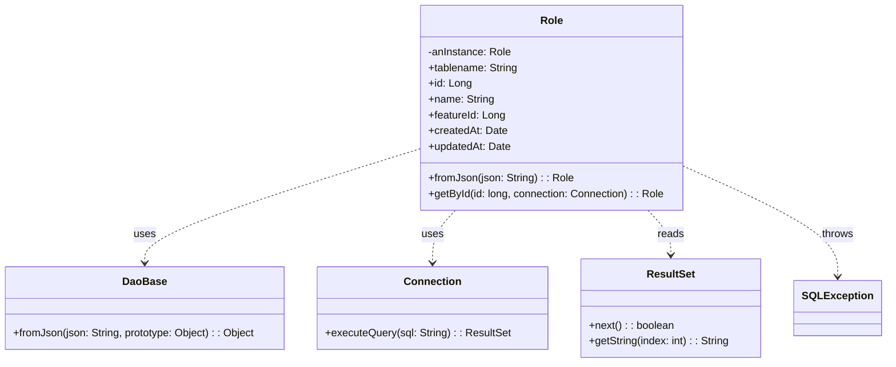

# Diagram: platform-java-lambdas/shipment/src/main/java/com/freightverify/shipment/datastore/postgresql/dao/Role.java


> Auto-generated by Obscura crawlers

## Diagram 1



### SVG

<svg id="container" width="1331.671875" xmlns="http://www.w3.org/2000/svg" class="classDiagram" height="552" viewBox="0 0 1331.671875 552" role="graphics-document document" aria-roledescription="class"><style>#container{font-family:"trebuchet ms",verdana,arial,sans-serif;font-size:16px;fill:#333;}@keyframes edge-animation-frame{from{stroke-dashoffset:0;}}@keyframes dash{to{stroke-dashoffset:0;}}#container .edge-animation-slow{stroke-dasharray:9,5!important;stroke-dashoffset:900;animation:dash 50s linear infinite;stroke-linecap:round;}#container .edge-animation-fast{stroke-dasharray:9,5!important;stroke-dashoffset:900;animation:dash 20s linear infinite;stroke-linecap:round;}#container .error-icon{fill:#552222;}#container .error-text{fill:#552222;stroke:#552222;}#container .edge-thickness-normal{stroke-width:1px;}#container .edge-thickness-thick{stroke-width:3.5px;}#container .edge-pattern-solid{stroke-dasharray:0;}#container .edge-thickness-invisible{stroke-width:0;fill:none;}#container .edge-pattern-dashed{stroke-dasharray:3;}#container .edge-pattern-dotted{stroke-dasharray:2;}#container .marker{fill:#333333;stroke:#333333;}#container .marker.cross{stroke:#333333;}#container svg{font-family:"trebuchet ms",verdana,arial,sans-serif;font-size:16px;}#container p{margin:0;}#container g.classGroup text{fill:#9370DB;stroke:none;font-family:"trebuchet ms",verdana,arial,sans-serif;font-size:10px;}#container g.classGroup text .title{font-weight:bolder;}#container .nodeLabel,#container .edgeLabel{color:#131300;}#container .edgeLabel .label rect{fill:#ECECFF;}#container .label text{fill:#131300;}#container .labelBkg{background:#ECECFF;}#container .edgeLabel .label span{background:#ECECFF;}#container .classTitle{font-weight:bolder;}#container .node rect,#container .node circle,#container .node ellipse,#container .node polygon,#container .node path{fill:#ECECFF;stroke:#9370DB;stroke-width:1px;}#container .divider{stroke:#9370DB;stroke-width:1;}#container g.clickable{cursor:pointer;}#container g.classGroup rect{fill:#ECECFF;stroke:#9370DB;}#container g.classGroup line{stroke:#9370DB;stroke-width:1;}#container .classLabel .box{stroke:none;stroke-width:0;fill:#ECECFF;opacity:0.5;}#container .classLabel .label{fill:#9370DB;font-size:10px;}#container .relation{stroke:#333333;stroke-width:1;fill:none;}#container .dashed-line{stroke-dasharray:3;}#container .dotted-line{stroke-dasharray:1 2;}#container #compositionStart,#container .composition{fill:#333333!important;stroke:#333333!important;stroke-width:1;}#container #compositionEnd,#container .composition{fill:#333333!important;stroke:#333333!important;stroke-width:1;}#container #dependencyStart,#container .dependency{fill:#333333!important;stroke:#333333!important;stroke-width:1;}#container #dependencyStart,#container .dependency{fill:#333333!important;stroke:#333333!important;stroke-width:1;}#container #extensionStart,#container .extension{fill:transparent!important;stroke:#333333!important;stroke-width:1;}#container #extensionEnd,#container .extension{fill:transparent!important;stroke:#333333!important;stroke-width:1;}#container #aggregationStart,#container .aggregation{fill:transparent!important;stroke:#333333!important;stroke-width:1;}#container #aggregationEnd,#container .aggregation{fill:transparent!important;stroke:#333333!important;stroke-width:1;}#container #lollipopStart,#container .lollipop{fill:#ECECFF!important;stroke:#333333!important;stroke-width:1;}#container #lollipopEnd,#container .lollipop{fill:#ECECFF!important;stroke:#333333!important;stroke-width:1;}#container .edgeTerminals{font-size:11px;line-height:initial;}#container .classTitleText{text-anchor:middle;font-size:18px;fill:#333;}#container .label-icon{display:inline-block;height:1em;overflow:visible;vertical-align:-0.125em;}#container .node .label-icon path{fill:currentColor;stroke:revert;stroke-width:revert;}#container :root{--mermaid-font-family:"trebuchet ms",verdana,arial,sans-serif;}</style><g><defs><marker id="container_class-aggregationStart" class="marker aggregation class" refX="18" refY="7" markerWidth="190" markerHeight="240" orient="auto"><path d="M 18,7 L9,13 L1,7 L9,1 Z"></path></marker></defs><defs><marker id="container_class-aggregationEnd" class="marker aggregation class" refX="1" refY="7" markerWidth="20" markerHeight="28" orient="auto"><path d="M 18,7 L9,13 L1,7 L9,1 Z"></path></marker></defs><defs><marker id="container_class-extensionStart" class="marker extension class" refX="18" refY="7" markerWidth="190" markerHeight="240" orient="auto"><path d="M 1,7 L18,13 V 1 Z"></path></marker></defs><defs><marker id="container_class-extensionEnd" class="marker extension class" refX="1" refY="7" markerWidth="20" markerHeight="28" orient="auto"><path d="M 1,1 V 13 L18,7 Z"></path></marker></defs><defs><marker id="container_class-compositionStart" class="marker composition class" refX="18" refY="7" markerWidth="190" markerHeight="240" orient="auto"><path d="M 18,7 L9,13 L1,7 L9,1 Z"></path></marker></defs><defs><marker id="container_class-compositionEnd" class="marker composition class" refX="1" refY="7" markerWidth="20" markerHeight="28" orient="auto"><path d="M 18,7 L9,13 L1,7 L9,1 Z"></path></marker></defs><defs><marker id="container_class-dependencyStart" class="marker dependency class" refX="6" refY="7" markerWidth="190" markerHeight="240" orient="auto"><path d="M 5,7 L9,13 L1,7 L9,1 Z"></path></marker></defs><defs><marker id="container_class-dependencyEnd" class="marker dependency class" refX="13" refY="7" markerWidth="20" markerHeight="28" orient="auto"><path d="M 18,7 L9,13 L14,7 L9,1 Z"></path></marker></defs><defs><marker id="container_class-lollipopStart" class="marker lollipop class" refX="13" refY="7" markerWidth="190" markerHeight="240" orient="auto"><circle stroke="black" fill="transparent" cx="7" cy="7" r="6"></circle></marker></defs><defs><marker id="container_class-lollipopEnd" class="marker lollipop class" refX="1" refY="7" markerWidth="190" markerHeight="240" orient="auto"><circle stroke="black" fill="transparent" cx="7" cy="7" r="6"></circle></marker></defs><g class="root"><g class="clusters"></g><g class="edgePaths"><path d="M634.08,226.663L565.017,248.385C495.953,270.108,357.826,313.554,288.763,342.444C219.699,371.333,219.699,385.667,219.699,392.833L219.699,400" id="id_Role_DaoBase_1" class="edge-thickness-normal edge-pattern-dashed relation" style=";;;" data-edge="true" data-et="edge" data-id="id_Role_DaoBase_1" data-points="W3sieCI6NjM0LjA4MDA3ODEyNSwieSI6MjI2LjY2MjU2OTAzMjE5NjQ3fSx7IngiOjIxOS42OTkyMTg3NSwieSI6MzU3fSx7IngiOjIxOS42OTkyMTg3NSwieSI6NDA2fV0=" marker-end="url(#container_class-dependencyEnd)"></path><path d="M688.118,320L682.379,326.167C676.64,332.333,665.162,344.667,659.423,358C653.684,371.333,653.684,385.667,653.684,392.833L653.684,400" id="id_Role_Connection_2" class="edge-thickness-normal edge-pattern-dashed relation" style=";;;" data-edge="true" data-et="edge" data-id="id_Role_Connection_2" data-points="W3sieCI6Njg4LjExODM1MTI3OTE0NTEsInkiOjMyMH0seyJ4Ijo2NTMuNjgzNTkzNzUsInkiOjM1N30seyJ4Ijo2NTMuNjgzNTkzNzUsInkiOjQwNn1d" marker-end="url(#container_class-dependencyEnd)"></path><path d="M978.487,320L984.226,326.167C989.965,332.333,1001.444,344.667,1007.183,356C1012.922,367.333,1012.922,377.667,1012.922,382.833L1012.922,388" id="id_Role_ResultSet_3" class="edge-thickness-normal edge-pattern-dashed relation" style=";;;" data-edge="true" data-et="edge" data-id="id_Role_ResultSet_3" data-points="W3sieCI6OTc4LjQ4NzExNzQ3MDg1NDksInkiOjMyMH0seyJ4IjoxMDEyLjkyMTg3NSwieSI6MzU3fSx7IngiOjEwMTIuOTIxODc1LCJ5IjozOTR9XQ==" marker-end="url(#container_class-dependencyEnd)"></path><path d="M1032.525,253.738L1070.733,270.948C1108.941,288.158,1185.357,322.579,1223.565,350.456C1261.773,378.333,1261.773,399.667,1261.773,410.333L1261.773,421" id="id_Role_SQLException_4" class="edge-thickness-normal edge-pattern-dashed relation" style=";;;" data-edge="true" data-et="edge" data-id="id_Role_SQLException_4" data-points="W3sieCI6MTAzMi41MjUzOTA2MjUsInkiOjI1My43Mzc2OTM1NTk0ODg5Mn0seyJ4IjoxMjYxLjc3MzQzNzUsInkiOjM1N30seyJ4IjoxMjYxLjc3MzQzNzUsInkiOjQyN31d" marker-end="url(#container_class-dependencyEnd)"></path></g><g class="edgeLabels"><g class="edgeLabel" transform="translate(219.69921875, 357)"><g class="label" data-id="id_Role_DaoBase_1" transform="translate(-16.4921875, -12)"><foreignObject width="32.984375" height="24"><div xmlns="http://www.w3.org/1999/xhtml" class="labelBkg" style="display: table-cell; white-space: nowrap; line-height: 1.5; max-width: 200px; text-align: center;"><span class="edgeLabel"><p>uses</p></span></div></foreignObject></g></g><g class="edgeLabel" transform="translate(653.68359375, 357)"><g class="label" data-id="id_Role_Connection_2" transform="translate(-16.4921875, -12)"><foreignObject width="32.984375" height="24"><div xmlns="http://www.w3.org/1999/xhtml" class="labelBkg" style="display: table-cell; white-space: nowrap; line-height: 1.5; max-width: 200px; text-align: center;"><span class="edgeLabel"><p>uses</p></span></div></foreignObject></g></g><g class="edgeLabel" transform="translate(1012.921875, 357)"><g class="label" data-id="id_Role_ResultSet_3" transform="translate(-20.0078125, -12)"><foreignObject width="40.015625" height="24"><div xmlns="http://www.w3.org/1999/xhtml" class="labelBkg" style="display: table-cell; white-space: nowrap; line-height: 1.5; max-width: 200px; text-align: center;"><span class="edgeLabel"><p>reads</p></span></div></foreignObject></g></g><g class="edgeLabel" transform="translate(1261.7734375, 357)"><g class="label" data-id="id_Role_SQLException_4" transform="translate(-24.5703125, -12)"><foreignObject width="49.140625" height="24"><div xmlns="http://www.w3.org/1999/xhtml" class="labelBkg" style="display: table-cell; white-space: nowrap; line-height: 1.5; max-width: 200px; text-align: center;"><span class="edgeLabel"><p>throws</p></span></div></foreignObject></g></g></g><g class="nodes"><g class="node default" id="classId-Role-0" transform="translate(833.302734375, 164)"><g class="basic label-container"><path d="M-199.22265625 -156 L199.22265625 -156 L199.22265625 156 L-199.22265625 156" stroke="none" stroke-width="0" fill="#ECECFF" style=""></path><path d="M-199.22265625 -156 C-63.498377452364 -156, 72.225901345272 -156, 199.22265625 -156 M-199.22265625 -156 C-52.2922686631627 -156, 94.6381189236746 -156, 199.22265625 -156 M199.22265625 -156 C199.22265625 -74.82445615752253, 199.22265625 6.351087684954933, 199.22265625 156 M199.22265625 -156 C199.22265625 -68.66215851929995, 199.22265625 18.6756829614001, 199.22265625 156 M199.22265625 156 C115.69763245142052 156, 32.172608652841035 156, -199.22265625 156 M199.22265625 156 C41.35707193334463 156, -116.50851238331074 156, -199.22265625 156 M-199.22265625 156 C-199.22265625 62.646130258369396, -199.22265625 -30.707739483261207, -199.22265625 -156 M-199.22265625 156 C-199.22265625 79.84597580022277, -199.22265625 3.691951600445549, -199.22265625 -156" stroke="#9370DB" stroke-width="1.3" fill="none" stroke-dasharray="0 0" style=""></path></g><g class="annotation-group text" transform="translate(0, -132)"></g><g class="label-group text" transform="translate(-16.2421875, -132)"><g class="label" style="font-weight: bolder" transform="translate(0,-12)"><foreignObject width="32.484375" height="24"><div xmlns="http://www.w3.org/1999/xhtml" style="display: table-cell; white-space: nowrap; line-height: 1.5; max-width: 82px; text-align: center;"><span class="nodeLabel markdown-node-label" style=""><p>Role</p></span></div></foreignObject></g></g><g class="members-group text" transform="translate(-187.22265625, -84)"><g class="label" style="" transform="translate(0,-12)"><foreignObject width="125.84375" height="24"><div xmlns="http://www.w3.org/1999/xhtml" style="display: table-cell; white-space: nowrap; line-height: 1.5; max-width: 183px; text-align: center;"><span class="nodeLabel markdown-node-label" style=""><p>-anInstance: Role</p></span></div></foreignObject></g><g class="label" style="" transform="translate(0,12)"><foreignObject width="136.578125" height="24"><div xmlns="http://www.w3.org/1999/xhtml" style="display: table-cell; white-space: nowrap; line-height: 1.5; max-width: 195px; text-align: center;"><span class="nodeLabel markdown-node-label" style=""><p>+tablename: String</p></span></div></foreignObject></g><g class="label" style="" transform="translate(0,36)"><foreignObject width="64.765625" height="24"><div xmlns="http://www.w3.org/1999/xhtml" style="display: table-cell; white-space: nowrap; line-height: 1.5; max-width: 123px; text-align: center;"><span class="nodeLabel markdown-node-label" style=""><p>+id: Long</p></span></div></foreignObject></g><g class="label" style="" transform="translate(0,60)"><foreignObject width="99.46875" height="24"><div xmlns="http://www.w3.org/1999/xhtml" style="display: table-cell; white-space: nowrap; line-height: 1.5; max-width: 157px; text-align: center;"><span class="nodeLabel markdown-node-label" style=""><p>+name: String</p></span></div></foreignObject></g><g class="label" style="" transform="translate(0,84)"><foreignObject width="116.703125" height="24"><div xmlns="http://www.w3.org/1999/xhtml" style="display: table-cell; white-space: nowrap; line-height: 1.5; max-width: 175px; text-align: center;"><span class="nodeLabel markdown-node-label" style=""><p>+featureId: Long</p></span></div></foreignObject></g><g class="label" style="" transform="translate(0,108)"><foreignObject width="118.609375" height="24"><div xmlns="http://www.w3.org/1999/xhtml" style="display: table-cell; white-space: nowrap; line-height: 1.5; max-width: 176px; text-align: center;"><span class="nodeLabel markdown-node-label" style=""><p>+createdAt: Date</p></span></div></foreignObject></g><g class="label" style="" transform="translate(0,132)"><foreignObject width="125.09375" height="24"><div xmlns="http://www.w3.org/1999/xhtml" style="display: table-cell; white-space: nowrap; line-height: 1.5; max-width: 182px; text-align: center;"><span class="nodeLabel markdown-node-label" style=""><p>+updatedAt: Date</p></span></div></foreignObject></g></g><g class="methods-group text" transform="translate(-187.22265625, 108)"><g class="label" style="" transform="translate(0,-12)"><foreignObject width="218.03125" height="24"><div xmlns="http://www.w3.org/1999/xhtml" style="display: table-cell; white-space: nowrap; line-height: 1.5; max-width: 275px; text-align: center;"><span class="nodeLabel markdown-node-label" style=""><p>+fromJson(json: String) : : Role</p></span></div></foreignObject></g><g class="label" style="" transform="translate(0,12)"><foreignObject width="358.203125" height="24"><div xmlns="http://www.w3.org/1999/xhtml" style="display: table-cell; white-space: nowrap; line-height: 1.5; max-width: 416px; text-align: center;"><span class="nodeLabel markdown-node-label" style=""><p>+getById(id: long, connection: Connection) : : Role</p></span></div></foreignObject></g></g><g class="divider" style=""><path d="M-199.22265625 -108 C-78.6436168809461 -108, 41.935422488107804 -108, 199.22265625 -108 M-199.22265625 -108 C-105.98841586823866 -108, -12.754175486477322 -108, 199.22265625 -108" stroke="#9370DB" stroke-width="1.3" fill="none" stroke-dasharray="0 0" style=""></path></g><g class="divider" style=""><path d="M-199.22265625 84 C-111.41364677368993 84, -23.604637297379867 84, 199.22265625 84 M-199.22265625 84 C-105.00098453848888 84, -10.779312826977758 84, 199.22265625 84" stroke="#9370DB" stroke-width="1.3" fill="none" stroke-dasharray="0 0" style=""></path></g></g><g class="node default" id="classId-DaoBase-1" transform="translate(219.69921875, 469)"><g class="basic label-container"><path d="M-211.69921875 -63 L211.69921875 -63 L211.69921875 63 L-211.69921875 63" stroke="none" stroke-width="0" fill="#ECECFF" style=""></path><path d="M-211.69921875 -63 C-89.94107620079183 -63, 31.817066348416347 -63, 211.69921875 -63 M-211.69921875 -63 C-120.83397292458815 -63, -29.968727099176306 -63, 211.69921875 -63 M211.69921875 -63 C211.69921875 -26.569498981463106, 211.69921875 9.861002037073789, 211.69921875 63 M211.69921875 -63 C211.69921875 -13.048173439261554, 211.69921875 36.90365312147689, 211.69921875 63 M211.69921875 63 C49.58113305876111 63, -112.53695263247778 63, -211.69921875 63 M211.69921875 63 C109.36541804624808 63, 7.031617342496162 63, -211.69921875 63 M-211.69921875 63 C-211.69921875 16.19486625789945, -211.69921875 -30.610267484201103, -211.69921875 -63 M-211.69921875 63 C-211.69921875 15.55444743758585, -211.69921875 -31.8911051248283, -211.69921875 -63" stroke="#9370DB" stroke-width="1.3" fill="none" stroke-dasharray="0 0" style=""></path></g><g class="annotation-group text" transform="translate(0, -39)"></g><g class="label-group text" transform="translate(-31.7109375, -39)"><g class="label" style="font-weight: bolder" transform="translate(0,-12)"><foreignObject width="63.421875" height="24"><div xmlns="http://www.w3.org/1999/xhtml" style="display: table-cell; white-space: nowrap; line-height: 1.5; max-width: 113px; text-align: center;"><span class="nodeLabel markdown-node-label" style=""><p>DaoBase</p></span></div></foreignObject></g></g><g class="members-group text" transform="translate(-199.69921875, 9)"></g><g class="methods-group text" transform="translate(-199.69921875, 39)"><g class="label" style="" transform="translate(0,-12)"><foreignObject width="367.6875" height="24"><div xmlns="http://www.w3.org/1999/xhtml" style="display: table-cell; white-space: nowrap; line-height: 1.5; max-width: 425px; text-align: center;"><span class="nodeLabel markdown-node-label" style=""><p>+fromJson(json: String, prototype: Object) : : Object</p></span></div></foreignObject></g></g><g class="divider" style=""><path d="M-211.69921875 -15 C-51.09830850507868 -15, 109.50260173984265 -15, 211.69921875 -15 M-211.69921875 -15 C-58.210718547481974 -15, 95.27778165503605 -15, 211.69921875 -15" stroke="#9370DB" stroke-width="1.3" fill="none" stroke-dasharray="0 0" style=""></path></g><g class="divider" style=""><path d="M-211.69921875 9 C-93.2581517936584 9, 25.1829151626832 9, 211.69921875 9 M-211.69921875 9 C-43.91329406844932 9, 123.87263061310136 9, 211.69921875 9" stroke="#9370DB" stroke-width="1.3" fill="none" stroke-dasharray="0 0" style=""></path></g></g><g class="node default" id="classId-Connection-2" transform="translate(653.68359375, 469)"><g class="basic label-container"><path d="M-172.28515625 -63 L172.28515625 -63 L172.28515625 63 L-172.28515625 63" stroke="none" stroke-width="0" fill="#ECECFF" style=""></path><path d="M-172.28515625 -63 C-58.02798610677441 -63, 56.22918403645119 -63, 172.28515625 -63 M-172.28515625 -63 C-84.30944398316576 -63, 3.6662682836684723 -63, 172.28515625 -63 M172.28515625 -63 C172.28515625 -34.998651318198355, 172.28515625 -6.997302636396711, 172.28515625 63 M172.28515625 -63 C172.28515625 -25.522862149320524, 172.28515625 11.954275701358952, 172.28515625 63 M172.28515625 63 C47.04824569459326 63, -78.18866486081347 63, -172.28515625 63 M172.28515625 63 C60.05044284520386 63, -52.18427055959228 63, -172.28515625 63 M-172.28515625 63 C-172.28515625 29.05060992947398, -172.28515625 -4.898780141052043, -172.28515625 -63 M-172.28515625 63 C-172.28515625 37.31505514545684, -172.28515625 11.630110290913684, -172.28515625 -63" stroke="#9370DB" stroke-width="1.3" fill="none" stroke-dasharray="0 0" style=""></path></g><g class="annotation-group text" transform="translate(0, -39)"></g><g class="label-group text" transform="translate(-41.2265625, -39)"><g class="label" style="font-weight: bolder" transform="translate(0,-12)"><foreignObject width="82.453125" height="24"><div xmlns="http://www.w3.org/1999/xhtml" style="display: table-cell; white-space: nowrap; line-height: 1.5; max-width: 132px; text-align: center;"><span class="nodeLabel markdown-node-label" style=""><p>Connection</p></span></div></foreignObject></g></g><g class="members-group text" transform="translate(-160.28515625, 9)"></g><g class="methods-group text" transform="translate(-160.28515625, 39)"><g class="label" style="" transform="translate(0,-12)"><foreignObject width="279.34375" height="24"><div xmlns="http://www.w3.org/1999/xhtml" style="display: table-cell; white-space: nowrap; line-height: 1.5; max-width: 337px; text-align: center;"><span class="nodeLabel markdown-node-label" style=""><p>+executeQuery(sql: String) : : ResultSet</p></span></div></foreignObject></g></g><g class="divider" style=""><path d="M-172.28515625 -15 C-79.87374717969152 -15, 12.53766189061696 -15, 172.28515625 -15 M-172.28515625 -15 C-39.8742749569071 -15, 92.5366063361858 -15, 172.28515625 -15" stroke="#9370DB" stroke-width="1.3" fill="none" stroke-dasharray="0 0" style=""></path></g><g class="divider" style=""><path d="M-172.28515625 9 C-42.97148518230972 9, 86.34218588538056 9, 172.28515625 9 M-172.28515625 9 C-69.31425939391707 9, 33.65663746216586 9, 172.28515625 9" stroke="#9370DB" stroke-width="1.3" fill="none" stroke-dasharray="0 0" style=""></path></g></g><g class="node default" id="classId-ResultSet-3" transform="translate(1012.921875, 469)"><g class="basic label-container"><path d="M-136.953125 -75 L136.953125 -75 L136.953125 75 L-136.953125 75" stroke="none" stroke-width="0" fill="#ECECFF" style=""></path><path d="M-136.953125 -75 C-47.93684367359582 -75, 41.079437652808366 -75, 136.953125 -75 M-136.953125 -75 C-59.75721417196182 -75, 17.43869665607636 -75, 136.953125 -75 M136.953125 -75 C136.953125 -34.55397994888919, 136.953125 5.892040102221614, 136.953125 75 M136.953125 -75 C136.953125 -29.445631766384864, 136.953125 16.108736467230273, 136.953125 75 M136.953125 75 C57.43000543714945 75, -22.093114125701106 75, -136.953125 75 M136.953125 75 C41.483719701819524 75, -53.98568559636095 75, -136.953125 75 M-136.953125 75 C-136.953125 23.3649522983593, -136.953125 -28.270095403281402, -136.953125 -75 M-136.953125 75 C-136.953125 26.737287114059875, -136.953125 -21.52542577188025, -136.953125 -75" stroke="#9370DB" stroke-width="1.3" fill="none" stroke-dasharray="0 0" style=""></path></g><g class="annotation-group text" transform="translate(0, -51)"></g><g class="label-group text" transform="translate(-35.21875, -51)"><g class="label" style="font-weight: bolder" transform="translate(0,-12)"><foreignObject width="70.4375" height="24"><div xmlns="http://www.w3.org/1999/xhtml" style="display: table-cell; white-space: nowrap; line-height: 1.5; max-width: 119px; text-align: center;"><span class="nodeLabel markdown-node-label" style=""><p>ResultSet</p></span></div></foreignObject></g></g><g class="members-group text" transform="translate(-124.953125, -3)"></g><g class="methods-group text" transform="translate(-124.953125, 27)"><g class="label" style="" transform="translate(0,-12)"><foreignObject width="129.6875" height="24"><div xmlns="http://www.w3.org/1999/xhtml" style="display: table-cell; white-space: nowrap; line-height: 1.5; max-width: 187px; text-align: center;"><span class="nodeLabel markdown-node-label" style=""><p>+next() : : boolean</p></span></div></foreignObject></g><g class="label" style="" transform="translate(0,12)"><foreignObject width="214.6875" height="24"><div xmlns="http://www.w3.org/1999/xhtml" style="display: table-cell; white-space: nowrap; line-height: 1.5; max-width: 273px; text-align: center;"><span class="nodeLabel markdown-node-label" style=""><p>+getString(index: int) : : String</p></span></div></foreignObject></g></g><g class="divider" style=""><path d="M-136.953125 -27 C-52.058036839611404 -27, 32.83705132077719 -27, 136.953125 -27 M-136.953125 -27 C-60.81929954725584 -27, 15.314525905488324 -27, 136.953125 -27" stroke="#9370DB" stroke-width="1.3" fill="none" stroke-dasharray="0 0" style=""></path></g><g class="divider" style=""><path d="M-136.953125 -3 C-60.77387937513403 -3, 15.40536624973194 -3, 136.953125 -3 M-136.953125 -3 C-70.43299152770709 -3, -3.9128580554141763 -3, 136.953125 -3" stroke="#9370DB" stroke-width="1.3" fill="none" stroke-dasharray="0 0" style=""></path></g></g><g class="node default" id="classId-SQLException-4" transform="translate(1261.7734375, 469)"><g class="basic label-container"><path d="M-61.8984375 -42 L61.8984375 -42 L61.8984375 42 L-61.8984375 42" stroke="none" stroke-width="0" fill="#ECECFF" style=""></path><path d="M-61.8984375 -42 C-15.797839705528396 -42, 30.302758088943207 -42, 61.8984375 -42 M-61.8984375 -42 C-23.231124038414983 -42, 15.436189423170035 -42, 61.8984375 -42 M61.8984375 -42 C61.8984375 -13.811834010004326, 61.8984375 14.376331979991349, 61.8984375 42 M61.8984375 -42 C61.8984375 -14.357843873847425, 61.8984375 13.28431225230515, 61.8984375 42 M61.8984375 42 C30.96075322200679 42, 0.023068944013580506 42, -61.8984375 42 M61.8984375 42 C18.90652959006661 42, -24.085378319866777 42, -61.8984375 42 M-61.8984375 42 C-61.8984375 9.786372502097535, -61.8984375 -22.42725499580493, -61.8984375 -42 M-61.8984375 42 C-61.8984375 14.31610424937649, -61.8984375 -13.36779150124702, -61.8984375 -42" stroke="#9370DB" stroke-width="1.3" fill="none" stroke-dasharray="0 0" style=""></path></g><g class="annotation-group text" transform="translate(0, -18)"></g><g class="label-group text" transform="translate(-49.8984375, -18)"><g class="label" style="font-weight: bolder" transform="translate(0,-12)"><foreignObject width="99.796875" height="24"><div xmlns="http://www.w3.org/1999/xhtml" style="display: table-cell; white-space: nowrap; line-height: 1.5; max-width: 148px; text-align: center;"><span class="nodeLabel markdown-node-label" style=""><p>SQLException</p></span></div></foreignObject></g></g><g class="members-group text" transform="translate(-49.8984375, 30)"></g><g class="methods-group text" transform="translate(-49.8984375, 60)"></g><g class="divider" style=""><path d="M-61.8984375 6 C-16.643325442949724 6, 28.611786614100552 6, 61.8984375 6 M-61.8984375 6 C-22.042525609540725 6, 17.81338628091855 6, 61.8984375 6" stroke="#9370DB" stroke-width="1.3" fill="none" stroke-dasharray="0 0" style=""></path></g><g class="divider" style=""><path d="M-61.8984375 24 C-17.0551419996468 24, 27.7881535007064 24, 61.8984375 24 M-61.8984375 24 C-36.93665050096915 24, -11.974863501938309 24, 61.8984375 24" stroke="#9370DB" stroke-width="1.3" fill="none" stroke-dasharray="0 0" style=""></path></g></g></g></g></g></svg>

## Diagram 2

```mermaid
flowchart TD
Start[getById(id, connection)]
Query[connection.executeQuery("select row_to_json(row) from (select * from public.role where id = <id>) row")]
Decision{results.next()?}
GetJson[json = results.getString(1)]
Parse[role = Role.fromJson(json)]
ReturnRole[return role]
ReturnNull[return null]
Start --> Query --> Decision
Decision -- yes --> GetJson --> Parse --> ReturnRole
Decision -- no --> ReturnNull
```

> SVG rendering failed for this diagram.
