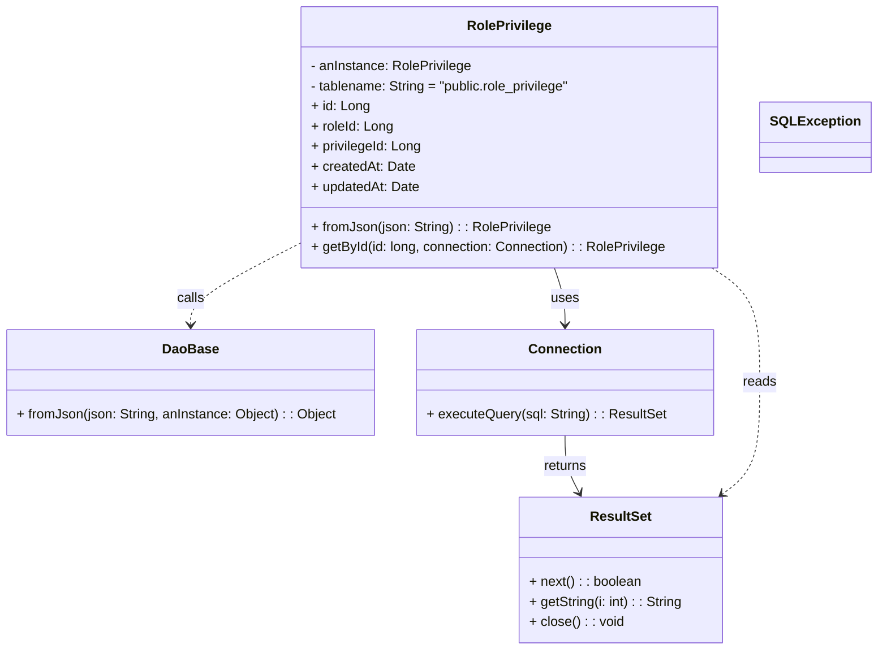

# Diagram: platform-java-lambdas/shipment/src/main/java/com/freightverify/shipment/datastore/postgresql/dao/RolePrivilege.java


> Auto-generated by Obscura crawlers

## Diagram 1



### SVG

<svg id="container" width="1033.232421875" xmlns="http://www.w3.org/2000/svg" class="classDiagram" height="776" viewBox="0 0 1033.232421875 776" role="graphics-document document" aria-roledescription="class"><style>#container{font-family:"trebuchet ms",verdana,arial,sans-serif;font-size:16px;fill:#333;}@keyframes edge-animation-frame{from{stroke-dashoffset:0;}}@keyframes dash{to{stroke-dashoffset:0;}}#container .edge-animation-slow{stroke-dasharray:9,5!important;stroke-dashoffset:900;animation:dash 50s linear infinite;stroke-linecap:round;}#container .edge-animation-fast{stroke-dasharray:9,5!important;stroke-dashoffset:900;animation:dash 20s linear infinite;stroke-linecap:round;}#container .error-icon{fill:#552222;}#container .error-text{fill:#552222;stroke:#552222;}#container .edge-thickness-normal{stroke-width:1px;}#container .edge-thickness-thick{stroke-width:3.5px;}#container .edge-pattern-solid{stroke-dasharray:0;}#container .edge-thickness-invisible{stroke-width:0;fill:none;}#container .edge-pattern-dashed{stroke-dasharray:3;}#container .edge-pattern-dotted{stroke-dasharray:2;}#container .marker{fill:#333333;stroke:#333333;}#container .marker.cross{stroke:#333333;}#container svg{font-family:"trebuchet ms",verdana,arial,sans-serif;font-size:16px;}#container p{margin:0;}#container g.classGroup text{fill:#9370DB;stroke:none;font-family:"trebuchet ms",verdana,arial,sans-serif;font-size:10px;}#container g.classGroup text .title{font-weight:bolder;}#container .nodeLabel,#container .edgeLabel{color:#131300;}#container .edgeLabel .label rect{fill:#ECECFF;}#container .label text{fill:#131300;}#container .labelBkg{background:#ECECFF;}#container .edgeLabel .label span{background:#ECECFF;}#container .classTitle{font-weight:bolder;}#container .node rect,#container .node circle,#container .node ellipse,#container .node polygon,#container .node path{fill:#ECECFF;stroke:#9370DB;stroke-width:1px;}#container .divider{stroke:#9370DB;stroke-width:1;}#container g.clickable{cursor:pointer;}#container g.classGroup rect{fill:#ECECFF;stroke:#9370DB;}#container g.classGroup line{stroke:#9370DB;stroke-width:1;}#container .classLabel .box{stroke:none;stroke-width:0;fill:#ECECFF;opacity:0.5;}#container .classLabel .label{fill:#9370DB;font-size:10px;}#container .relation{stroke:#333333;stroke-width:1;fill:none;}#container .dashed-line{stroke-dasharray:3;}#container .dotted-line{stroke-dasharray:1 2;}#container #compositionStart,#container .composition{fill:#333333!important;stroke:#333333!important;stroke-width:1;}#container #compositionEnd,#container .composition{fill:#333333!important;stroke:#333333!important;stroke-width:1;}#container #dependencyStart,#container .dependency{fill:#333333!important;stroke:#333333!important;stroke-width:1;}#container #dependencyStart,#container .dependency{fill:#333333!important;stroke:#333333!important;stroke-width:1;}#container #extensionStart,#container .extension{fill:transparent!important;stroke:#333333!important;stroke-width:1;}#container #extensionEnd,#container .extension{fill:transparent!important;stroke:#333333!important;stroke-width:1;}#container #aggregationStart,#container .aggregation{fill:transparent!important;stroke:#333333!important;stroke-width:1;}#container #aggregationEnd,#container .aggregation{fill:transparent!important;stroke:#333333!important;stroke-width:1;}#container #lollipopStart,#container .lollipop{fill:#ECECFF!important;stroke:#333333!important;stroke-width:1;}#container #lollipopEnd,#container .lollipop{fill:#ECECFF!important;stroke:#333333!important;stroke-width:1;}#container .edgeTerminals{font-size:11px;line-height:initial;}#container .classTitleText{text-anchor:middle;font-size:18px;fill:#333;}#container .label-icon{display:inline-block;height:1em;overflow:visible;vertical-align:-0.125em;}#container .node .label-icon path{fill:currentColor;stroke:revert;stroke-width:revert;}#container :root{--mermaid-font-family:"trebuchet ms",verdana,arial,sans-serif;}</style><g><defs><marker id="container_class-aggregationStart" class="marker aggregation class" refX="18" refY="7" markerWidth="190" markerHeight="240" orient="auto"><path d="M 18,7 L9,13 L1,7 L9,1 Z"></path></marker></defs><defs><marker id="container_class-aggregationEnd" class="marker aggregation class" refX="1" refY="7" markerWidth="20" markerHeight="28" orient="auto"><path d="M 18,7 L9,13 L1,7 L9,1 Z"></path></marker></defs><defs><marker id="container_class-extensionStart" class="marker extension class" refX="18" refY="7" markerWidth="190" markerHeight="240" orient="auto"><path d="M 1,7 L18,13 V 1 Z"></path></marker></defs><defs><marker id="container_class-extensionEnd" class="marker extension class" refX="1" refY="7" markerWidth="20" markerHeight="28" orient="auto"><path d="M 1,1 V 13 L18,7 Z"></path></marker></defs><defs><marker id="container_class-compositionStart" class="marker composition class" refX="18" refY="7" markerWidth="190" markerHeight="240" orient="auto"><path d="M 18,7 L9,13 L1,7 L9,1 Z"></path></marker></defs><defs><marker id="container_class-compositionEnd" class="marker composition class" refX="1" refY="7" markerWidth="20" markerHeight="28" orient="auto"><path d="M 18,7 L9,13 L1,7 L9,1 Z"></path></marker></defs><defs><marker id="container_class-dependencyStart" class="marker dependency class" refX="6" refY="7" markerWidth="190" markerHeight="240" orient="auto"><path d="M 5,7 L9,13 L1,7 L9,1 Z"></path></marker></defs><defs><marker id="container_class-dependencyEnd" class="marker dependency class" refX="13" refY="7" markerWidth="20" markerHeight="28" orient="auto"><path d="M 18,7 L9,13 L14,7 L9,1 Z"></path></marker></defs><defs><marker id="container_class-lollipopStart" class="marker lollipop class" refX="13" refY="7" markerWidth="190" markerHeight="240" orient="auto"><circle stroke="black" fill="transparent" cx="7" cy="7" r="6"></circle></marker></defs><defs><marker id="container_class-lollipopEnd" class="marker lollipop class" refX="1" refY="7" markerWidth="190" markerHeight="240" orient="auto"><circle stroke="black" fill="transparent" cx="7" cy="7" r="6"></circle></marker></defs><g class="root"><g class="clusters"></g><g class="edgePaths"><path d="M354.732,291.129L333.285,302.107C311.839,313.086,268.945,335.043,247.498,351.188C226.051,367.333,226.051,377.667,226.051,382.833L226.051,388" id="id_RolePrivilege_DaoBase_1" class="edge-thickness-normal edge-pattern-dashed relation" style=";;;" data-edge="true" data-et="edge" data-id="id_RolePrivilege_DaoBase_1" data-points="W3sieCI6MzU0LjczMjQyMTg3NSwieSI6MjkxLjEyODk5MzMyMjY2MjA0fSx7IngiOjIyNi4wNTA3ODEyNSwieSI6MzU3fSx7IngiOjIyNi4wNTA3ODEyNSwieSI6Mzk0fV0=" marker-end="url(#container_class-dependencyEnd)"></path><path d="M655.962,320L658.053,326.167C660.143,332.333,664.323,344.667,666.414,356C668.504,367.333,668.504,377.667,668.504,382.833L668.504,388" id="id_RolePrivilege_Connection_2" class="edge-thickness-normal edge-pattern-solid relation" style=";;;" data-edge="true" data-et="edge" data-id="id_RolePrivilege_Connection_2" data-points="W3sieCI6NjU1Ljk2MjI2MzE5NjI0MzUsInkiOjMyMH0seyJ4Ijo2NjguNTAzOTA2MjUsInkiOjM1N30seyJ4Ijo2NjguNTAzOTA2MjUsInkiOjM5NH1d" marker-end="url(#container_class-dependencyEnd)"></path><path d="M668.504,520L668.504,526.167C668.504,532.333,668.504,544.667,671.291,556.116C674.077,567.564,679.651,578.129,682.438,583.411L685.225,588.693" id="id_Connection_ResultSet_3" class="edge-thickness-normal edge-pattern-solid relation" style=";;;" data-edge="true" data-et="edge" data-id="id_Connection_ResultSet_3" data-points="W3sieCI6NjY4LjUwMzkwNjI1LCJ5Ijo1MjB9LHsieCI6NjY4LjUwMzkwNjI1LCJ5Ijo1NTd9LHsieCI6Njg4LjAyNDM2NjgwOTQ3NTksInkiOjU5NH1d" marker-end="url(#container_class-dependencyEnd)"></path><path d="M841.392,320L850.813,326.167C860.233,332.333,879.073,344.667,888.494,367.5C897.914,390.333,897.914,423.667,897.914,457C897.914,490.333,897.914,523.667,890.556,545.897C883.198,568.127,868.483,579.254,861.125,584.818L853.767,590.381" id="id_RolePrivilege_ResultSet_4" class="edge-thickness-normal edge-pattern-dashed relation" style=";;;" data-edge="true" data-et="edge" data-id="id_RolePrivilege_ResultSet_4" data-points="W3sieCI6ODQxLjM5MjIzNDA1MTE2NTgsInkiOjMyMH0seyJ4Ijo4OTcuOTE0MDYyNSwieSI6MzU3fSx7IngiOjg5Ny45MTQwNjI1LCJ5Ijo0NTd9LHsieCI6ODk3LjkxNDA2MjUsInkiOjU1N30seyJ4Ijo4NDguOTgxNDkyNTY1NTI0MSwieSI6NTk0fV0=" marker-end="url(#container_class-dependencyEnd)"></path></g><g class="edgeLabels"><g class="edgeLabel" transform="translate(226.05078125, 357)"><g class="label" data-id="id_RolePrivilege_DaoBase_1" transform="translate(-16.4453125, -12)"><foreignObject width="32.890625" height="24"><div xmlns="http://www.w3.org/1999/xhtml" class="labelBkg" style="display: table-cell; white-space: nowrap; line-height: 1.5; max-width: 200px; text-align: center;"><span class="edgeLabel"><p>calls</p></span></div></foreignObject></g></g><g class="edgeLabel" transform="translate(668.50390625, 357)"><g class="label" data-id="id_RolePrivilege_Connection_2" transform="translate(-16.4921875, -12)"><foreignObject width="32.984375" height="24"><div xmlns="http://www.w3.org/1999/xhtml" class="labelBkg" style="display: table-cell; white-space: nowrap; line-height: 1.5; max-width: 200px; text-align: center;"><span class="edgeLabel"><p>uses</p></span></div></foreignObject></g></g><g class="edgeLabel" transform="translate(668.50390625, 557)"><g class="label" data-id="id_Connection_ResultSet_3" transform="translate(-26.265625, -12)"><foreignObject width="52.53125" height="24"><div xmlns="http://www.w3.org/1999/xhtml" class="labelBkg" style="display: table-cell; white-space: nowrap; line-height: 1.5; max-width: 200px; text-align: center;"><span class="edgeLabel"><p>returns</p></span></div></foreignObject></g></g><g class="edgeLabel" transform="translate(897.9140625, 457)"><g class="label" data-id="id_RolePrivilege_ResultSet_4" transform="translate(-20.0078125, -12)"><foreignObject width="40.015625" height="24"><div xmlns="http://www.w3.org/1999/xhtml" class="labelBkg" style="display: table-cell; white-space: nowrap; line-height: 1.5; max-width: 200px; text-align: center;"><span class="edgeLabel"><p>reads</p></span></div></foreignObject></g></g></g><g class="nodes"><g class="node default" id="classId-RolePrivilege-0" transform="translate(603.083984375, 164)"><g class="basic label-container"><path d="M-248.3515625 -156 L248.3515625 -156 L248.3515625 156 L-248.3515625 156" stroke="none" stroke-width="0" fill="#ECECFF" style=""></path><path d="M-248.3515625 -156 C-50.6714709395213 -156, 147.0086206209574 -156, 248.3515625 -156 M-248.3515625 -156 C-51.93925482170195 -156, 144.4730528565961 -156, 248.3515625 -156 M248.3515625 -156 C248.3515625 -85.67295638772835, 248.3515625 -15.345912775456696, 248.3515625 156 M248.3515625 -156 C248.3515625 -33.27345882076206, 248.3515625 89.45308235847588, 248.3515625 156 M248.3515625 156 C134.46258005545133 156, 20.573597610902624 156, -248.3515625 156 M248.3515625 156 C81.18599199644484 156, -85.97957850711032 156, -248.3515625 156 M-248.3515625 156 C-248.3515625 80.04889889223986, -248.3515625 4.097797784479724, -248.3515625 -156 M-248.3515625 156 C-248.3515625 48.38372672922661, -248.3515625 -59.23254654154678, -248.3515625 -156" stroke="#9370DB" stroke-width="1.3" fill="none" stroke-dasharray="0 0" style=""></path></g><g class="annotation-group text" transform="translate(0, -132)"></g><g class="label-group text" transform="translate(-48.109375, -132)"><g class="label" style="font-weight: bolder" transform="translate(0,-12)"><foreignObject width="96.21875" height="24"><div xmlns="http://www.w3.org/1999/xhtml" style="display: table-cell; white-space: nowrap; line-height: 1.5; max-width: 144px; text-align: center;"><span class="nodeLabel markdown-node-label" style=""><p>RolePrivilege</p></span></div></foreignObject></g></g><g class="members-group text" transform="translate(-236.3515625, -84)"><g class="label" style="" transform="translate(0,-12)"><foreignObject width="192.484375" height="24"><div xmlns="http://www.w3.org/1999/xhtml" style="display: table-cell; white-space: nowrap; line-height: 1.5; max-width: 250px; text-align: center;"><span class="nodeLabel markdown-node-label" style=""><p>- anInstance: RolePrivilege</p></span></div></foreignObject></g><g class="label" style="" transform="translate(0,12)"><foreignObject width="316.6875" height="24"><div xmlns="http://www.w3.org/1999/xhtml" style="display: table-cell; white-space: nowrap; line-height: 1.5; max-width: 374px; text-align: center;"><span class="nodeLabel markdown-node-label" style=""><p>- tablename: String = "public.role_privilege"</p></span></div></foreignObject></g><g class="label" style="" transform="translate(0,36)"><foreignObject width="69" height="24"><div xmlns="http://www.w3.org/1999/xhtml" style="display: table-cell; white-space: nowrap; line-height: 1.5; max-width: 127px; text-align: center;"><span class="nodeLabel markdown-node-label" style=""><p>+ id: Long</p></span></div></foreignObject></g><g class="label" style="" transform="translate(0,60)"><foreignObject width="97.578125" height="24"><div xmlns="http://www.w3.org/1999/xhtml" style="display: table-cell; white-space: nowrap; line-height: 1.5; max-width: 156px; text-align: center;"><span class="nodeLabel markdown-node-label" style=""><p>+ roleId: Long</p></span></div></foreignObject></g><g class="label" style="" transform="translate(0,84)"><foreignObject width="131.890625" height="24"><div xmlns="http://www.w3.org/1999/xhtml" style="display: table-cell; white-space: nowrap; line-height: 1.5; max-width: 190px; text-align: center;"><span class="nodeLabel markdown-node-label" style=""><p>+ privilegeId: Long</p></span></div></foreignObject></g><g class="label" style="" transform="translate(0,108)"><foreignObject width="122.859375" height="24"><div xmlns="http://www.w3.org/1999/xhtml" style="display: table-cell; white-space: nowrap; line-height: 1.5; max-width: 180px; text-align: center;"><span class="nodeLabel markdown-node-label" style=""><p>+ createdAt: Date</p></span></div></foreignObject></g><g class="label" style="" transform="translate(0,132)"><foreignObject width="129.34375" height="24"><div xmlns="http://www.w3.org/1999/xhtml" style="display: table-cell; white-space: nowrap; line-height: 1.5; max-width: 187px; text-align: center;"><span class="nodeLabel markdown-node-label" style=""><p>+ updatedAt: Date</p></span></div></foreignObject></g></g><g class="methods-group text" transform="translate(-236.3515625, 108)"><g class="label" style="" transform="translate(0,-12)"><foreignObject width="284.671875" height="24"><div xmlns="http://www.w3.org/1999/xhtml" style="display: table-cell; white-space: nowrap; line-height: 1.5; max-width: 342px; text-align: center;"><span class="nodeLabel markdown-node-label" style=""><p>+ fromJson(json: String) : : RolePrivilege</p></span></div></foreignObject></g><g class="label" style="" transform="translate(0,12)"><foreignObject width="424.59375" height="24"><div xmlns="http://www.w3.org/1999/xhtml" style="display: table-cell; white-space: nowrap; line-height: 1.5; max-width: 482px; text-align: center;"><span class="nodeLabel markdown-node-label" style=""><p>+ getById(id: long, connection: Connection) : : RolePrivilege</p></span></div></foreignObject></g></g><g class="divider" style=""><path d="M-248.3515625 -108 C-114.35762653162928 -108, 19.636309436741442 -108, 248.3515625 -108 M-248.3515625 -108 C-113.8589146512941 -108, 20.6337331974118 -108, 248.3515625 -108" stroke="#9370DB" stroke-width="1.3" fill="none" stroke-dasharray="0 0" style=""></path></g><g class="divider" style=""><path d="M-248.3515625 84 C-78.78367622383641 84, 90.78421005232718 84, 248.3515625 84 M-248.3515625 84 C-144.755069353299 84, -41.15857620659801 84, 248.3515625 84" stroke="#9370DB" stroke-width="1.3" fill="none" stroke-dasharray="0 0" style=""></path></g></g><g class="node default" id="classId-DaoBase-1" transform="translate(226.05078125, 457)"><g class="basic label-container"><path d="M-218.05078125 -63 L218.05078125 -63 L218.05078125 63 L-218.05078125 63" stroke="none" stroke-width="0" fill="#ECECFF" style=""></path><path d="M-218.05078125 -63 C-59.97285390719313 -63, 98.10507343561375 -63, 218.05078125 -63 M-218.05078125 -63 C-66.02157308438271 -63, 86.00763508123458 -63, 218.05078125 -63 M218.05078125 -63 C218.05078125 -28.56568949416137, 218.05078125 5.868621011677263, 218.05078125 63 M218.05078125 -63 C218.05078125 -12.77346332245014, 218.05078125 37.45307335509972, 218.05078125 63 M218.05078125 63 C52.65289006729947 63, -112.74500111540107 63, -218.05078125 63 M218.05078125 63 C128.74124644273428 63, 39.43171163546856 63, -218.05078125 63 M-218.05078125 63 C-218.05078125 17.126959137297185, -218.05078125 -28.74608172540563, -218.05078125 -63 M-218.05078125 63 C-218.05078125 25.673171616348505, -218.05078125 -11.65365676730299, -218.05078125 -63" stroke="#9370DB" stroke-width="1.3" fill="none" stroke-dasharray="0 0" style=""></path></g><g class="annotation-group text" transform="translate(0, -39)"></g><g class="label-group text" transform="translate(-31.7109375, -39)"><g class="label" style="font-weight: bolder" transform="translate(0,-12)"><foreignObject width="63.421875" height="24"><div xmlns="http://www.w3.org/1999/xhtml" style="display: table-cell; white-space: nowrap; line-height: 1.5; max-width: 113px; text-align: center;"><span class="nodeLabel markdown-node-label" style=""><p>DaoBase</p></span></div></foreignObject></g></g><g class="members-group text" transform="translate(-206.05078125, 9)"></g><g class="methods-group text" transform="translate(-206.05078125, 39)"><g class="label" style="" transform="translate(0,-12)"><foreignObject width="380.390625" height="24"><div xmlns="http://www.w3.org/1999/xhtml" style="display: table-cell; white-space: nowrap; line-height: 1.5; max-width: 438px; text-align: center;"><span class="nodeLabel markdown-node-label" style=""><p>+ fromJson(json: String, anInstance: Object) : : Object</p></span></div></foreignObject></g></g><g class="divider" style=""><path d="M-218.05078125 -15 C-74.83305983781523 -15, 68.38466157436955 -15, 218.05078125 -15 M-218.05078125 -15 C-63.10874688509324 -15, 91.83328747981352 -15, 218.05078125 -15" stroke="#9370DB" stroke-width="1.3" fill="none" stroke-dasharray="0 0" style=""></path></g><g class="divider" style=""><path d="M-218.05078125 9 C-124.9822262037652 9, -31.913671157530388 9, 218.05078125 9 M-218.05078125 9 C-60.761369357710976 9, 96.52804253457805 9, 218.05078125 9" stroke="#9370DB" stroke-width="1.3" fill="none" stroke-dasharray="0 0" style=""></path></g></g><g class="node default" id="classId-Connection-2" transform="translate(668.50390625, 457)"><g class="basic label-container"><path d="M-174.40234375 -63 L174.40234375 -63 L174.40234375 63 L-174.40234375 63" stroke="none" stroke-width="0" fill="#ECECFF" style=""></path><path d="M-174.40234375 -63 C-83.25548802279454 -63, 7.891367704410925 -63, 174.40234375 -63 M-174.40234375 -63 C-59.78640203779493 -63, 54.82953967441014 -63, 174.40234375 -63 M174.40234375 -63 C174.40234375 -25.435352507396864, 174.40234375 12.129294985206272, 174.40234375 63 M174.40234375 -63 C174.40234375 -12.989461403586951, 174.40234375 37.0210771928261, 174.40234375 63 M174.40234375 63 C72.35944103167682 63, -29.683461686646353 63, -174.40234375 63 M174.40234375 63 C44.50505843659093 63, -85.39222687681814 63, -174.40234375 63 M-174.40234375 63 C-174.40234375 28.951933134337906, -174.40234375 -5.096133731324187, -174.40234375 -63 M-174.40234375 63 C-174.40234375 22.521199043083215, -174.40234375 -17.95760191383357, -174.40234375 -63" stroke="#9370DB" stroke-width="1.3" fill="none" stroke-dasharray="0 0" style=""></path></g><g class="annotation-group text" transform="translate(0, -39)"></g><g class="label-group text" transform="translate(-41.2265625, -39)"><g class="label" style="font-weight: bolder" transform="translate(0,-12)"><foreignObject width="82.453125" height="24"><div xmlns="http://www.w3.org/1999/xhtml" style="display: table-cell; white-space: nowrap; line-height: 1.5; max-width: 132px; text-align: center;"><span class="nodeLabel markdown-node-label" style=""><p>Connection</p></span></div></foreignObject></g></g><g class="members-group text" transform="translate(-162.40234375, 9)"></g><g class="methods-group text" transform="translate(-162.40234375, 39)"><g class="label" style="" transform="translate(0,-12)"><foreignObject width="283.578125" height="24"><div xmlns="http://www.w3.org/1999/xhtml" style="display: table-cell; white-space: nowrap; line-height: 1.5; max-width: 341px; text-align: center;"><span class="nodeLabel markdown-node-label" style=""><p>+ executeQuery(sql: String) : : ResultSet</p></span></div></foreignObject></g></g><g class="divider" style=""><path d="M-174.40234375 -15 C-53.164437063262156 -15, 68.07346962347569 -15, 174.40234375 -15 M-174.40234375 -15 C-62.49277388382191 -15, 49.41679598235618 -15, 174.40234375 -15" stroke="#9370DB" stroke-width="1.3" fill="none" stroke-dasharray="0 0" style=""></path></g><g class="divider" style=""><path d="M-174.40234375 9 C-89.52636142633578 9, -4.650379102671565 9, 174.40234375 9 M-174.40234375 9 C-76.45634544256328 9, 21.48965286487345 9, 174.40234375 9" stroke="#9370DB" stroke-width="1.3" fill="none" stroke-dasharray="0 0" style=""></path></g></g><g class="node default" id="classId-ResultSet-3" transform="translate(733.923828125, 681)"><g class="basic label-container"><path d="M-121.3984375 -87 L121.3984375 -87 L121.3984375 87 L-121.3984375 87" stroke="none" stroke-width="0" fill="#ECECFF" style=""></path><path d="M-121.3984375 -87 C-43.30544616622616 -87, 34.78754516754768 -87, 121.3984375 -87 M-121.3984375 -87 C-53.18481786991673 -87, 15.028801760166544 -87, 121.3984375 -87 M121.3984375 -87 C121.3984375 -51.42734482651118, 121.3984375 -15.854689653022362, 121.3984375 87 M121.3984375 -87 C121.3984375 -25.73331480895842, 121.3984375 35.53337038208316, 121.3984375 87 M121.3984375 87 C34.918357251065004 87, -51.56172299786999 87, -121.3984375 87 M121.3984375 87 C61.95038614679583 87, 2.5023347935916576 87, -121.3984375 87 M-121.3984375 87 C-121.3984375 29.669837376914266, -121.3984375 -27.660325246171467, -121.3984375 -87 M-121.3984375 87 C-121.3984375 20.79434410084849, -121.3984375 -45.41131179830302, -121.3984375 -87" stroke="#9370DB" stroke-width="1.3" fill="none" stroke-dasharray="0 0" style=""></path></g><g class="annotation-group text" transform="translate(0, -63)"></g><g class="label-group text" transform="translate(-35.21875, -63)"><g class="label" style="font-weight: bolder" transform="translate(0,-12)"><foreignObject width="70.4375" height="24"><div xmlns="http://www.w3.org/1999/xhtml" style="display: table-cell; white-space: nowrap; line-height: 1.5; max-width: 119px; text-align: center;"><span class="nodeLabel markdown-node-label" style=""><p>ResultSet</p></span></div></foreignObject></g></g><g class="members-group text" transform="translate(-109.3984375, -15)"></g><g class="methods-group text" transform="translate(-109.3984375, 15)"><g class="label" style="" transform="translate(0,-12)"><foreignObject width="133.921875" height="24"><div xmlns="http://www.w3.org/1999/xhtml" style="display: table-cell; white-space: nowrap; line-height: 1.5; max-width: 191px; text-align: center;"><span class="nodeLabel markdown-node-label" style=""><p>+ next() : : boolean</p></span></div></foreignObject></g><g class="label" style="" transform="translate(0,12)"><foreignObject width="183.578125" height="24"><div xmlns="http://www.w3.org/1999/xhtml" style="display: table-cell; white-space: nowrap; line-height: 1.5; max-width: 242px; text-align: center;"><span class="nodeLabel markdown-node-label" style=""><p>+ getString(i: int) : : String</p></span></div></foreignObject></g><g class="label" style="" transform="translate(0,36)"><foreignObject width="112.03125" height="24"><div xmlns="http://www.w3.org/1999/xhtml" style="display: table-cell; white-space: nowrap; line-height: 1.5; max-width: 169px; text-align: center;"><span class="nodeLabel markdown-node-label" style=""><p>+ close() : : void</p></span></div></foreignObject></g></g><g class="divider" style=""><path d="M-121.3984375 -39 C-59.45873071442193 -39, 2.4809760711561353 -39, 121.3984375 -39 M-121.3984375 -39 C-63.5805345753338 -39, -5.7626316506676005 -39, 121.3984375 -39" stroke="#9370DB" stroke-width="1.3" fill="none" stroke-dasharray="0 0" style=""></path></g><g class="divider" style=""><path d="M-121.3984375 -15 C-56.093688548872194 -15, 9.211060402255612 -15, 121.3984375 -15 M-121.3984375 -15 C-39.70882215579856 -15, 41.980793188402885 -15, 121.3984375 -15" stroke="#9370DB" stroke-width="1.3" fill="none" stroke-dasharray="0 0" style=""></path></g></g><g class="node default" id="classId-SQLException-4" transform="translate(963.333984375, 164)"><g class="basic label-container"><path d="M-61.8984375 -42 L61.8984375 -42 L61.8984375 42 L-61.8984375 42" stroke="none" stroke-width="0" fill="#ECECFF" style=""></path><path d="M-61.8984375 -42 C-15.217289863280094 -42, 31.463857773439813 -42, 61.8984375 -42 M-61.8984375 -42 C-21.880292102092177 -42, 18.137853295815646 -42, 61.8984375 -42 M61.8984375 -42 C61.8984375 -8.596301910466366, 61.8984375 24.80739617906727, 61.8984375 42 M61.8984375 -42 C61.8984375 -18.46447795130653, 61.8984375 5.071044097386938, 61.8984375 42 M61.8984375 42 C23.892330108228677 42, -14.113777283542646 42, -61.8984375 42 M61.8984375 42 C13.329946517617998 42, -35.238544464764004 42, -61.8984375 42 M-61.8984375 42 C-61.8984375 16.23448341222285, -61.8984375 -9.531033175554299, -61.8984375 -42 M-61.8984375 42 C-61.8984375 18.495815332528977, -61.8984375 -5.008369334942046, -61.8984375 -42" stroke="#9370DB" stroke-width="1.3" fill="none" stroke-dasharray="0 0" style=""></path></g><g class="annotation-group text" transform="translate(0, -18)"></g><g class="label-group text" transform="translate(-49.8984375, -18)"><g class="label" style="font-weight: bolder" transform="translate(0,-12)"><foreignObject width="99.796875" height="24"><div xmlns="http://www.w3.org/1999/xhtml" style="display: table-cell; white-space: nowrap; line-height: 1.5; max-width: 148px; text-align: center;"><span class="nodeLabel markdown-node-label" style=""><p>SQLException</p></span></div></foreignObject></g></g><g class="members-group text" transform="translate(-49.8984375, 30)"></g><g class="methods-group text" transform="translate(-49.8984375, 60)"></g><g class="divider" style=""><path d="M-61.8984375 6 C-24.64094979614113 6, 12.616537907717742 6, 61.8984375 6 M-61.8984375 6 C-32.18354080956308 6, -2.4686441191261537 6, 61.8984375 6" stroke="#9370DB" stroke-width="1.3" fill="none" stroke-dasharray="0 0" style=""></path></g><g class="divider" style=""><path d="M-61.8984375 24 C-27.19409689856738 24, 7.510243702865239 24, 61.8984375 24 M-61.8984375 24 C-17.17151075514885 24, 27.555415989702297 24, 61.8984375 24" stroke="#9370DB" stroke-width="1.3" fill="none" stroke-dasharray="0 0" style=""></path></g></g></g></g></g></svg>

## Diagram 2

```mermaid
flowchart TD
Start([Start]) --> CallGet[getById(id, connection)]
CallGet --> ExecQuery[Execute SQL query via connection.executeQuery(SQL)]
ExecQuery --> RS((ResultSet))
RS --> HasRow{results.next()?}
HasRow -->|yes| ReadJson[json = results.getString(1)]
ReadJson --> Parse[retval = RolePrivilege.fromJson(json)]
Parse --> CloseRS[ResultSet closed (try-with-resources)]
CloseRS --> ReturnObj[return retval]
HasRow -->|no| CloseRS2[ResultSet closed (try-with-resources)]
CloseRS2 --> ReturnNull[return null]
ReturnObj --> End([End])
ReturnNull --> End([End])
```

> SVG rendering failed for this diagram.
