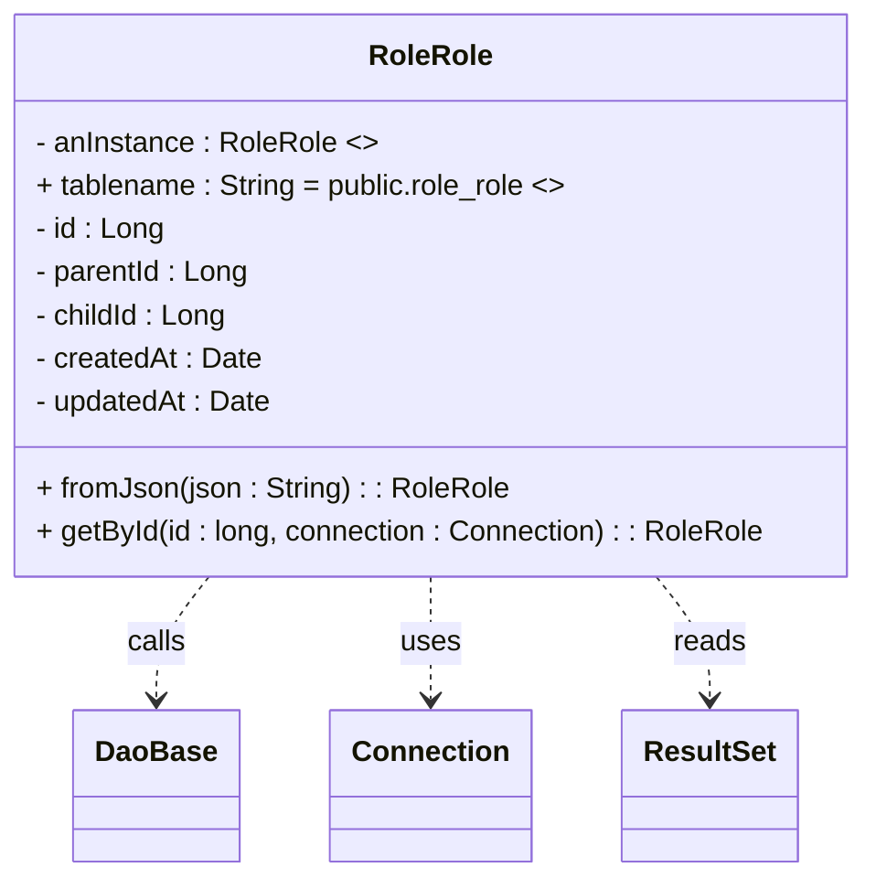

# Diagram: platform-java-lambdas/shipment/src/main/java/com/freightverify/shipment/datastore/postgresql/dao/RoleRole.java


> Auto-generated by Obscura crawlers

## Diagram 1



### SVG

<svg id="container" width="475.515625" xmlns="http://www.w3.org/2000/svg" class="classDiagram" height="486" viewBox="0 0 475.515625 486" role="graphics-document document" aria-roledescription="class"><style>#container{font-family:"trebuchet ms",verdana,arial,sans-serif;font-size:16px;fill:#333;}@keyframes edge-animation-frame{from{stroke-dashoffset:0;}}@keyframes dash{to{stroke-dashoffset:0;}}#container .edge-animation-slow{stroke-dasharray:9,5!important;stroke-dashoffset:900;animation:dash 50s linear infinite;stroke-linecap:round;}#container .edge-animation-fast{stroke-dasharray:9,5!important;stroke-dashoffset:900;animation:dash 20s linear infinite;stroke-linecap:round;}#container .error-icon{fill:#552222;}#container .error-text{fill:#552222;stroke:#552222;}#container .edge-thickness-normal{stroke-width:1px;}#container .edge-thickness-thick{stroke-width:3.5px;}#container .edge-pattern-solid{stroke-dasharray:0;}#container .edge-thickness-invisible{stroke-width:0;fill:none;}#container .edge-pattern-dashed{stroke-dasharray:3;}#container .edge-pattern-dotted{stroke-dasharray:2;}#container .marker{fill:#333333;stroke:#333333;}#container .marker.cross{stroke:#333333;}#container svg{font-family:"trebuchet ms",verdana,arial,sans-serif;font-size:16px;}#container p{margin:0;}#container g.classGroup text{fill:#9370DB;stroke:none;font-family:"trebuchet ms",verdana,arial,sans-serif;font-size:10px;}#container g.classGroup text .title{font-weight:bolder;}#container .nodeLabel,#container .edgeLabel{color:#131300;}#container .edgeLabel .label rect{fill:#ECECFF;}#container .label text{fill:#131300;}#container .labelBkg{background:#ECECFF;}#container .edgeLabel .label span{background:#ECECFF;}#container .classTitle{font-weight:bolder;}#container .node rect,#container .node circle,#container .node ellipse,#container .node polygon,#container .node path{fill:#ECECFF;stroke:#9370DB;stroke-width:1px;}#container .divider{stroke:#9370DB;stroke-width:1;}#container g.clickable{cursor:pointer;}#container g.classGroup rect{fill:#ECECFF;stroke:#9370DB;}#container g.classGroup line{stroke:#9370DB;stroke-width:1;}#container .classLabel .box{stroke:none;stroke-width:0;fill:#ECECFF;opacity:0.5;}#container .classLabel .label{fill:#9370DB;font-size:10px;}#container .relation{stroke:#333333;stroke-width:1;fill:none;}#container .dashed-line{stroke-dasharray:3;}#container .dotted-line{stroke-dasharray:1 2;}#container #compositionStart,#container .composition{fill:#333333!important;stroke:#333333!important;stroke-width:1;}#container #compositionEnd,#container .composition{fill:#333333!important;stroke:#333333!important;stroke-width:1;}#container #dependencyStart,#container .dependency{fill:#333333!important;stroke:#333333!important;stroke-width:1;}#container #dependencyStart,#container .dependency{fill:#333333!important;stroke:#333333!important;stroke-width:1;}#container #extensionStart,#container .extension{fill:transparent!important;stroke:#333333!important;stroke-width:1;}#container #extensionEnd,#container .extension{fill:transparent!important;stroke:#333333!important;stroke-width:1;}#container #aggregationStart,#container .aggregation{fill:transparent!important;stroke:#333333!important;stroke-width:1;}#container #aggregationEnd,#container .aggregation{fill:transparent!important;stroke:#333333!important;stroke-width:1;}#container #lollipopStart,#container .lollipop{fill:#ECECFF!important;stroke:#333333!important;stroke-width:1;}#container #lollipopEnd,#container .lollipop{fill:#ECECFF!important;stroke:#333333!important;stroke-width:1;}#container .edgeTerminals{font-size:11px;line-height:initial;}#container .classTitleText{text-anchor:middle;font-size:18px;fill:#333;}#container .label-icon{display:inline-block;height:1em;overflow:visible;vertical-align:-0.125em;}#container .node .label-icon path{fill:currentColor;stroke:revert;stroke-width:revert;}#container :root{--mermaid-font-family:"trebuchet ms",verdana,arial,sans-serif;}</style><g><defs><marker id="container_class-aggregationStart" class="marker aggregation class" refX="18" refY="7" markerWidth="190" markerHeight="240" orient="auto"><path d="M 18,7 L9,13 L1,7 L9,1 Z"></path></marker></defs><defs><marker id="container_class-aggregationEnd" class="marker aggregation class" refX="1" refY="7" markerWidth="20" markerHeight="28" orient="auto"><path d="M 18,7 L9,13 L1,7 L9,1 Z"></path></marker></defs><defs><marker id="container_class-extensionStart" class="marker extension class" refX="18" refY="7" markerWidth="190" markerHeight="240" orient="auto"><path d="M 1,7 L18,13 V 1 Z"></path></marker></defs><defs><marker id="container_class-extensionEnd" class="marker extension class" refX="1" refY="7" markerWidth="20" markerHeight="28" orient="auto"><path d="M 1,1 V 13 L18,7 Z"></path></marker></defs><defs><marker id="container_class-compositionStart" class="marker composition class" refX="18" refY="7" markerWidth="190" markerHeight="240" orient="auto"><path d="M 18,7 L9,13 L1,7 L9,1 Z"></path></marker></defs><defs><marker id="container_class-compositionEnd" class="marker composition class" refX="1" refY="7" markerWidth="20" markerHeight="28" orient="auto"><path d="M 18,7 L9,13 L1,7 L9,1 Z"></path></marker></defs><defs><marker id="container_class-dependencyStart" class="marker dependency class" refX="6" refY="7" markerWidth="190" markerHeight="240" orient="auto"><path d="M 5,7 L9,13 L1,7 L9,1 Z"></path></marker></defs><defs><marker id="container_class-dependencyEnd" class="marker dependency class" refX="13" refY="7" markerWidth="20" markerHeight="28" orient="auto"><path d="M 18,7 L9,13 L14,7 L9,1 Z"></path></marker></defs><defs><marker id="container_class-lollipopStart" class="marker lollipop class" refX="13" refY="7" markerWidth="190" markerHeight="240" orient="auto"><circle stroke="black" fill="transparent" cx="7" cy="7" r="6"></circle></marker></defs><defs><marker id="container_class-lollipopEnd" class="marker lollipop class" refX="1" refY="7" markerWidth="190" markerHeight="240" orient="auto"><circle stroke="black" fill="transparent" cx="7" cy="7" r="6"></circle></marker></defs><g class="root"><g class="clusters"></g><g class="edgePaths"><path d="M118.99,320L114.295,326.167C109.6,332.333,100.21,344.667,95.515,356C90.82,367.333,90.82,377.667,90.82,382.833L90.82,388" id="id_RoleRole_DaoBase_1" class="edge-thickness-normal edge-pattern-dashed relation" style=";;;" data-edge="true" data-et="edge" data-id="id_RoleRole_DaoBase_1" data-points="W3sieCI6MTE4Ljk4OTY3Nzc4NDk3NDA5LCJ5IjozMjB9LHsieCI6OTAuODIwMzEyNSwieSI6MzU3fSx7IngiOjkwLjgyMDMxMjUsInkiOjM5NH1d" marker-end="url(#container_class-dependencyEnd)"></path><path d="M237.758,320L237.758,326.167C237.758,332.333,237.758,344.667,237.758,356C237.758,367.333,237.758,377.667,237.758,382.833L237.758,388" id="id_RoleRole_Connection_2" class="edge-thickness-normal edge-pattern-dashed relation" style=";;;" data-edge="true" data-et="edge" data-id="id_RoleRole_Connection_2" data-points="W3sieCI6MjM3Ljc1NzgxMjUsInkiOjMyMH0seyJ4IjoyMzcuNzU3ODEyNSwieSI6MzU3fSx7IngiOjIzNy43NTc4MTI1LCJ5IjozOTR9XQ==" marker-end="url(#container_class-dependencyEnd)"></path><path d="M359.361,320L364.168,326.167C368.975,332.333,378.589,344.667,383.396,356C388.203,367.333,388.203,377.667,388.203,382.833L388.203,388" id="id_RoleRole_ResultSet_3" class="edge-thickness-normal edge-pattern-dashed relation" style=";;;" data-edge="true" data-et="edge" data-id="id_RoleRole_ResultSet_3" data-points="W3sieCI6MzU5LjM2MTI3NzUyNTkwNjc2LCJ5IjozMjB9LHsieCI6Mzg4LjIwMzEyNSwieSI6MzU3fSx7IngiOjM4OC4yMDMxMjUsInkiOjM5NH1d" marker-end="url(#container_class-dependencyEnd)"></path></g><g class="edgeLabels"><g class="edgeLabel" transform="translate(90.8203125, 357)"><g class="label" data-id="id_RoleRole_DaoBase_1" transform="translate(-16.4453125, -12)"><foreignObject width="32.890625" height="24"><div xmlns="http://www.w3.org/1999/xhtml" class="labelBkg" style="display: table-cell; white-space: nowrap; line-height: 1.5; max-width: 200px; text-align: center;"><span class="edgeLabel"><p>calls</p></span></div></foreignObject></g></g><g class="edgeLabel" transform="translate(237.7578125, 357)"><g class="label" data-id="id_RoleRole_Connection_2" transform="translate(-16.4921875, -12)"><foreignObject width="32.984375" height="24"><div xmlns="http://www.w3.org/1999/xhtml" class="labelBkg" style="display: table-cell; white-space: nowrap; line-height: 1.5; max-width: 200px; text-align: center;"><span class="edgeLabel"><p>uses</p></span></div></foreignObject></g></g><g class="edgeLabel" transform="translate(388.203125, 357)"><g class="label" data-id="id_RoleRole_ResultSet_3" transform="translate(-20.0078125, -12)"><foreignObject width="40.015625" height="24"><div xmlns="http://www.w3.org/1999/xhtml" class="labelBkg" style="display: table-cell; white-space: nowrap; line-height: 1.5; max-width: 200px; text-align: center;"><span class="edgeLabel"><p>reads</p></span></div></foreignObject></g></g></g><g class="nodes"><g class="node default" id="classId-RoleRole-0" transform="translate(237.7578125, 164)"><g class="basic label-container"><path d="M-229.7578125 -156 L229.7578125 -156 L229.7578125 156 L-229.7578125 156" stroke="none" stroke-width="0" fill="#ECECFF" style=""></path><path d="M-229.7578125 -156 C-89.44530248141982 -156, 50.86720753716037 -156, 229.7578125 -156 M-229.7578125 -156 C-63.72637452712675 -156, 102.3050634457465 -156, 229.7578125 -156 M229.7578125 -156 C229.7578125 -47.429930038455524, 229.7578125 61.14013992308895, 229.7578125 156 M229.7578125 -156 C229.7578125 -67.43106173233156, 229.7578125 21.137876535336886, 229.7578125 156 M229.7578125 156 C110.49910538943716 156, -8.759601721125676 156, -229.7578125 156 M229.7578125 156 C49.246457608675655 156, -131.2648972826487 156, -229.7578125 156 M-229.7578125 156 C-229.7578125 92.9524882531816, -229.7578125 29.904976506363212, -229.7578125 -156 M-229.7578125 156 C-229.7578125 82.69033546070493, -229.7578125 9.380670921409859, -229.7578125 -156" stroke="#9370DB" stroke-width="1.3" fill="none" stroke-dasharray="0 0" style=""></path></g><g class="annotation-group text" transform="translate(0, -132)"></g><g class="label-group text" transform="translate(-32.484375, -132)"><g class="label" style="font-weight: bolder" transform="translate(0,-12)"><foreignObject width="64.96875" height="24"><div xmlns="http://www.w3.org/1999/xhtml" style="display: table-cell; white-space: nowrap; line-height: 1.5; max-width: 114px; text-align: center;"><span class="nodeLabel markdown-node-label" style=""><p>RoleRole</p></span></div></foreignObject></g></g><g class="members-group text" transform="translate(-217.7578125, -84)"><g class="label" style="" transform="translate(0,-12)"><foreignObject width="186.921875" height="24"><div xmlns="http://www.w3.org/1999/xhtml" style="display: table-cell; white-space: nowrap; line-height: 1.5; max-width: 284px; text-align: center;"><span class="nodeLabel markdown-node-label" style=""><p>- anInstance : RoleRole &lt;&gt;</p></span></div></foreignObject></g><g class="label" style="" transform="translate(0,12)"><foreignObject width="295.765625" height="24"><div xmlns="http://www.w3.org/1999/xhtml" style="display: table-cell; white-space: nowrap; line-height: 1.5; max-width: 393px; text-align: center;"><span class="nodeLabel markdown-node-label" style=""><p>+ tablename : String = public.role_role &lt;&gt;</p></span></div></foreignObject></g><g class="label" style="" transform="translate(0,36)"><foreignObject width="71.703125" height="24"><div xmlns="http://www.w3.org/1999/xhtml" style="display: table-cell; white-space: nowrap; line-height: 1.5; max-width: 130px; text-align: center;"><span class="nodeLabel markdown-node-label" style=""><p>- id : Long</p></span></div></foreignObject></g><g class="label" style="" transform="translate(0,60)"><foreignObject width="119.53125" height="24"><div xmlns="http://www.w3.org/1999/xhtml" style="display: table-cell; white-space: nowrap; line-height: 1.5; max-width: 178px; text-align: center;"><span class="nodeLabel markdown-node-label" style=""><p>- parentId : Long</p></span></div></foreignObject></g><g class="label" style="" transform="translate(0,84)"><foreignObject width="107.625" height="24"><div xmlns="http://www.w3.org/1999/xhtml" style="display: table-cell; white-space: nowrap; line-height: 1.5; max-width: 166px; text-align: center;"><span class="nodeLabel markdown-node-label" style=""><p>- childId : Long</p></span></div></foreignObject></g><g class="label" style="" transform="translate(0,108)"><foreignObject width="125.5" height="24"><div xmlns="http://www.w3.org/1999/xhtml" style="display: table-cell; white-space: nowrap; line-height: 1.5; max-width: 183px; text-align: center;"><span class="nodeLabel markdown-node-label" style=""><p>- createdAt : Date</p></span></div></foreignObject></g><g class="label" style="" transform="translate(0,132)"><foreignObject width="131.96875" height="24"><div xmlns="http://www.w3.org/1999/xhtml" style="display: table-cell; white-space: nowrap; line-height: 1.5; max-width: 189px; text-align: center;"><span class="nodeLabel markdown-node-label" style=""><p>- updatedAt : Date</p></span></div></foreignObject></g></g><g class="methods-group text" transform="translate(-217.7578125, 108)"><g class="label" style="" transform="translate(0,-12)"><foreignObject width="258.859375" height="24"><div xmlns="http://www.w3.org/1999/xhtml" style="display: table-cell; white-space: nowrap; line-height: 1.5; max-width: 316px; text-align: center;"><span class="nodeLabel markdown-node-label" style=""><p>+ fromJson(json : String) : : RoleRole</p></span></div></foreignObject></g><g class="label" style="" transform="translate(0,12)"><foreignObject width="403.03125" height="24"><div xmlns="http://www.w3.org/1999/xhtml" style="display: table-cell; white-space: nowrap; line-height: 1.5; max-width: 460px; text-align: center;"><span class="nodeLabel markdown-node-label" style=""><p>+ getById(id : long, connection : Connection) : : RoleRole</p></span></div></foreignObject></g></g><g class="divider" style=""><path d="M-229.7578125 -108 C-51.221689179564635 -108, 127.31443414087073 -108, 229.7578125 -108 M-229.7578125 -108 C-128.81725968657452 -108, -27.87670687314906 -108, 229.7578125 -108" stroke="#9370DB" stroke-width="1.3" fill="none" stroke-dasharray="0 0" style=""></path></g><g class="divider" style=""><path d="M-229.7578125 84 C-66.87565252128704 84, 96.00650745742593 84, 229.7578125 84 M-229.7578125 84 C-113.10953665883616 84, 3.5387391823276744 84, 229.7578125 84" stroke="#9370DB" stroke-width="1.3" fill="none" stroke-dasharray="0 0" style=""></path></g></g><g class="node default" id="classId-DaoBase-1" transform="translate(90.8203125, 436)"><g class="basic label-container"><path d="M-43.7109375 -42 L43.7109375 -42 L43.7109375 42 L-43.7109375 42" stroke="none" stroke-width="0" fill="#ECECFF" style=""></path><path d="M-43.7109375 -42 C-14.586883016431088 -42, 14.537171467137824 -42, 43.7109375 -42 M-43.7109375 -42 C-14.650327244690555 -42, 14.41028301061889 -42, 43.7109375 -42 M43.7109375 -42 C43.7109375 -11.55694965959054, 43.7109375 18.88610068081892, 43.7109375 42 M43.7109375 -42 C43.7109375 -20.131480964371402, 43.7109375 1.7370380712571958, 43.7109375 42 M43.7109375 42 C11.962543542458363 42, -19.785850415083274 42, -43.7109375 42 M43.7109375 42 C9.67060559268198 42, -24.36972631463604 42, -43.7109375 42 M-43.7109375 42 C-43.7109375 14.712032410046053, -43.7109375 -12.575935179907894, -43.7109375 -42 M-43.7109375 42 C-43.7109375 18.923802120497825, -43.7109375 -4.152395759004349, -43.7109375 -42" stroke="#9370DB" stroke-width="1.3" fill="none" stroke-dasharray="0 0" style=""></path></g><g class="annotation-group text" transform="translate(0, -18)"></g><g class="label-group text" transform="translate(-31.7109375, -18)"><g class="label" style="font-weight: bolder" transform="translate(0,-12)"><foreignObject width="63.421875" height="24"><div xmlns="http://www.w3.org/1999/xhtml" style="display: table-cell; white-space: nowrap; line-height: 1.5; max-width: 113px; text-align: center;"><span class="nodeLabel markdown-node-label" style=""><p>DaoBase</p></span></div></foreignObject></g></g><g class="members-group text" transform="translate(-31.7109375, 30)"></g><g class="methods-group text" transform="translate(-31.7109375, 60)"></g><g class="divider" style=""><path d="M-43.7109375 6 C-24.48179172496533 6, -5.25264594993066 6, 43.7109375 6 M-43.7109375 6 C-15.246768409624746 6, 13.217400680750508 6, 43.7109375 6" stroke="#9370DB" stroke-width="1.3" fill="none" stroke-dasharray="0 0" style=""></path></g><g class="divider" style=""><path d="M-43.7109375 24 C-8.933220825473676 24, 25.84449584905265 24, 43.7109375 24 M-43.7109375 24 C-15.635993601705657 24, 12.438950296588686 24, 43.7109375 24" stroke="#9370DB" stroke-width="1.3" fill="none" stroke-dasharray="0 0" style=""></path></g></g><g class="node default" id="classId-Connection-2" transform="translate(237.7578125, 436)"><g class="basic label-container"><path d="M-53.2265625 -42 L53.2265625 -42 L53.2265625 42 L-53.2265625 42" stroke="none" stroke-width="0" fill="#ECECFF" style=""></path><path d="M-53.2265625 -42 C-30.928057141971184 -42, -8.629551783942368 -42, 53.2265625 -42 M-53.2265625 -42 C-20.202846658463834 -42, 12.820869183072332 -42, 53.2265625 -42 M53.2265625 -42 C53.2265625 -23.446514936368196, 53.2265625 -4.893029872736392, 53.2265625 42 M53.2265625 -42 C53.2265625 -19.89773482506165, 53.2265625 2.2045303498766984, 53.2265625 42 M53.2265625 42 C19.651808046285886 42, -13.922946407428228 42, -53.2265625 42 M53.2265625 42 C13.20469718103169 42, -26.81716813793662 42, -53.2265625 42 M-53.2265625 42 C-53.2265625 11.11671174548335, -53.2265625 -19.7665765090333, -53.2265625 -42 M-53.2265625 42 C-53.2265625 15.907971448489533, -53.2265625 -10.184057103020933, -53.2265625 -42" stroke="#9370DB" stroke-width="1.3" fill="none" stroke-dasharray="0 0" style=""></path></g><g class="annotation-group text" transform="translate(0, -18)"></g><g class="label-group text" transform="translate(-41.2265625, -18)"><g class="label" style="font-weight: bolder" transform="translate(0,-12)"><foreignObject width="82.453125" height="24"><div xmlns="http://www.w3.org/1999/xhtml" style="display: table-cell; white-space: nowrap; line-height: 1.5; max-width: 132px; text-align: center;"><span class="nodeLabel markdown-node-label" style=""><p>Connection</p></span></div></foreignObject></g></g><g class="members-group text" transform="translate(-41.2265625, 30)"></g><g class="methods-group text" transform="translate(-41.2265625, 60)"></g><g class="divider" style=""><path d="M-53.2265625 6 C-17.351759718205763 6, 18.523043063588474 6, 53.2265625 6 M-53.2265625 6 C-12.163169625059219 6, 28.900223249881563 6, 53.2265625 6" stroke="#9370DB" stroke-width="1.3" fill="none" stroke-dasharray="0 0" style=""></path></g><g class="divider" style=""><path d="M-53.2265625 24 C-21.57542521502463 24, 10.07571206995074 24, 53.2265625 24 M-53.2265625 24 C-11.22090964573394 24, 30.78474320853212 24, 53.2265625 24" stroke="#9370DB" stroke-width="1.3" fill="none" stroke-dasharray="0 0" style=""></path></g></g><g class="node default" id="classId-ResultSet-3" transform="translate(388.203125, 436)"><g class="basic label-container"><path d="M-47.21875 -42 L47.21875 -42 L47.21875 42 L-47.21875 42" stroke="none" stroke-width="0" fill="#ECECFF" style=""></path><path d="M-47.21875 -42 C-12.763323967336014 -42, 21.692102065327973 -42, 47.21875 -42 M-47.21875 -42 C-20.9756190048994 -42, 5.2675119902012 -42, 47.21875 -42 M47.21875 -42 C47.21875 -24.026571378797886, 47.21875 -6.053142757595772, 47.21875 42 M47.21875 -42 C47.21875 -13.403217701899802, 47.21875 15.193564596200396, 47.21875 42 M47.21875 42 C13.645560507455443 42, -19.927628985089115 42, -47.21875 42 M47.21875 42 C24.834810544788656 42, 2.450871089577312 42, -47.21875 42 M-47.21875 42 C-47.21875 17.585348082815507, -47.21875 -6.829303834368986, -47.21875 -42 M-47.21875 42 C-47.21875 22.331600336336063, -47.21875 2.663200672672126, -47.21875 -42" stroke="#9370DB" stroke-width="1.3" fill="none" stroke-dasharray="0 0" style=""></path></g><g class="annotation-group text" transform="translate(0, -18)"></g><g class="label-group text" transform="translate(-35.21875, -18)"><g class="label" style="font-weight: bolder" transform="translate(0,-12)"><foreignObject width="70.4375" height="24"><div xmlns="http://www.w3.org/1999/xhtml" style="display: table-cell; white-space: nowrap; line-height: 1.5; max-width: 119px; text-align: center;"><span class="nodeLabel markdown-node-label" style=""><p>ResultSet</p></span></div></foreignObject></g></g><g class="members-group text" transform="translate(-35.21875, 30)"></g><g class="methods-group text" transform="translate(-35.21875, 60)"></g><g class="divider" style=""><path d="M-47.21875 6 C-13.532139463747782 6, 20.154471072504435 6, 47.21875 6 M-47.21875 6 C-15.948132381248989 6, 15.322485237502022 6, 47.21875 6" stroke="#9370DB" stroke-width="1.3" fill="none" stroke-dasharray="0 0" style=""></path></g><g class="divider" style=""><path d="M-47.21875 24 C-26.609325149971703 24, -5.9999002999434055 24, 47.21875 24 M-47.21875 24 C-26.48855363675062 24, -5.75835727350124 24, 47.21875 24" stroke="#9370DB" stroke-width="1.3" fill="none" stroke-dasharray="0 0" style=""></path></g></g></g></g></g></svg>

## Diagram 2

```mermaid
flowchart TD
  Start([getById(id)]) --> Query[Execute SQL query on connection]
  Query --> Check{results.next() ?}
  Check -- Yes --> GetJson[json = results.getString(1)]
  GetJson --> FromJson[retval = RoleRole.fromJson(json)]
  FromJson --> Return[return retval]
  Check -- No --> ReturnNull[return null]
  Return --> End([End])
  ReturnNull --> End
```

> SVG rendering failed for this diagram.
