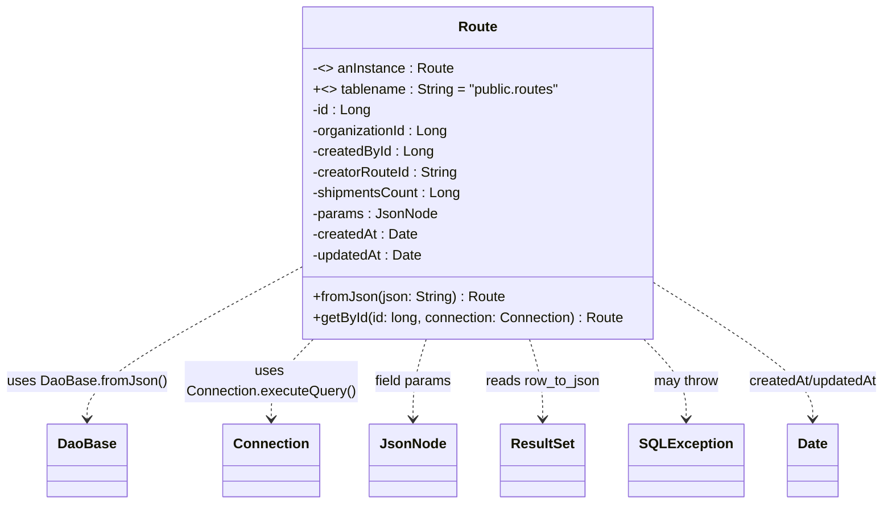

# Diagram: platform-java-lambdas/shipment/src/main/java/com/freightverify/shipment/datastore/postgresql/dao/Route.java

> Auto-generated by Obscura crawlers

## Mermaid

### SVG

<svg id="container" width="1000.3671875" xmlns="http://www.w3.org/2000/svg" class="classDiagram" height="582" viewBox="0 0 1000.3671875 582" role="graphics-document document" aria-roledescription="class"><g><defs><marker id="container_class-aggregationStart" class="marker aggregation class" refX="18" refY="7" markerWidth="190" markerHeight="240" orient="auto"><path d="M 18,7 L9,13 L1,7 L9,1 Z"></path></marker></defs><defs><marker id="container_class-aggregationEnd" class="marker aggregation class" refX="1" refY="7" markerWidth="20" markerHeight="28" orient="auto"><path d="M 18,7 L9,13 L1,7 L9,1 Z"></path></marker></defs><defs><marker id="container_class-extensionStart" class="marker extension class" refX="18" refY="7" markerWidth="190" markerHeight="240" orient="auto"><path d="M 1,7 L18,13 V 1 Z"></path></marker></defs><defs><marker id="container_class-extensionEnd" class="marker extension class" refX="1" refY="7" markerWidth="20" markerHeight="28" orient="auto"><path d="M 1,1 V 13 L18,7 Z"></path></marker></defs><defs><marker id="container_class-compositionStart" class="marker composition class" refX="18" refY="7" markerWidth="190" markerHeight="240" orient="auto"><path d="M 18,7 L9,13 L1,7 L9,1 Z"></path></marker></defs><defs><marker id="container_class-compositionEnd" class="marker composition class" refX="1" refY="7" markerWidth="20" markerHeight="28" orient="auto"><path d="M 18,7 L9,13 L1,7 L9,1 Z"></path></marker></defs><defs><marker id="container_class-dependencyStart" class="marker dependency class" refX="6" refY="7" markerWidth="190" markerHeight="240" orient="auto"><path d="M 5,7 L9,13 L1,7 L9,1 Z"></path></marker></defs><defs><marker id="container_class-dependencyEnd" class="marker dependency class" refX="13" refY="7" markerWidth="20" markerHeight="28" orient="auto"><path d="M 18,7 L9,13 L14,7 L9,1 Z"></path></marker></defs><defs><marker id="container_class-lollipopStart" class="marker lollipop class" refX="13" refY="7" markerWidth="190" markerHeight="240" orient="auto"><circle stroke="black" fill="transparent" cx="7" cy="7" r="6"></circle></marker></defs><defs><marker id="container_class-lollipopEnd" class="marker lollipop class" refX="1" refY="7" markerWidth="190" markerHeight="240" orient="auto"><circle stroke="black" fill="transparent" cx="7" cy="7" r="6"></circle></marker></defs><g class="root"><g class="clusters"></g><g class="edgePaths"><path d="M340.992,309.527L300.401,331.44C259.81,353.352,178.628,397.176,138.036,426.255C97.445,455.333,97.445,469.667,97.445,476.833L97.445,484" id="id_Route_DaoBase_1" class="edge-thickness-normal edge-pattern-dashed relation" style=";;;" data-edge="true" data-et="edge" data-id="id_Route_DaoBase_1" data-points="W3sieCI6MzQwLjk5MjE4NzUsInkiOjMwOS41Mjc0MzQ4MzYyNDg0Nn0seyJ4Ijo5Ny40NDUzMTI1LCJ5Ijo0NDF9LHsieCI6OTcuNDQ1MzEyNSwieSI6NDkwfV0=" marker-end="url(#container_class-dependencyEnd)"></path><path d="M355.077,392L347.046,400.167C339.015,408.333,322.953,424.667,314.922,440C306.891,455.333,306.891,469.667,306.891,476.833L306.891,484" id="id_Route_Connection_2" class="edge-thickness-normal edge-pattern-dashed relation" style=";;;" data-edge="true" data-et="edge" data-id="id_Route_Connection_2" data-points="W3sieCI6MzU1LjA3NjU1Mjc3NDg5NjMsInkiOjM5Mn0seyJ4IjozMDYuODkwNjI1LCJ5Ijo0NDF9LHsieCI6MzA2Ljg5MDYyNSwieSI6NDkwfV0=" marker-end="url(#container_class-dependencyEnd)"></path><path d="M486.485,392L484.044,400.167C481.602,408.333,476.719,424.667,474.277,440C471.836,455.333,471.836,469.667,471.836,476.833L471.836,484" id="id_Route_JsonNode_3" class="edge-thickness-normal edge-pattern-dashed relation" style=";;;" data-edge="true" data-et="edge" data-id="id_Route_JsonNode_3" data-points="W3sieCI6NDg2LjQ4NTI2NjQ2Nzg0MjM0LCJ5IjozOTJ9LHsieCI6NDcxLjgzNTkzNzUsInkiOjQ0MX0seyJ4Ijo0NzEuODM1OTM3NSwieSI6NDkwfV0=" marker-end="url(#container_class-dependencyEnd)"></path><path d="M601.288,392L603.73,400.167C606.171,408.333,611.054,424.667,613.496,440C615.938,455.333,615.938,469.667,615.938,476.833L615.938,484" id="id_Route_ResultSet_4" class="edge-thickness-normal edge-pattern-dashed relation" style=";;;" data-edge="true" data-et="edge" data-id="id_Route_ResultSet_4" data-points="W3sieCI6NjAxLjI4ODE3MTAzMjE1NzcsInkiOjM5Mn0seyJ4Ijo2MTUuOTM3NSwieSI6NDQxfSx7IngiOjYxNS45Mzc1LCJ5Ijo0OTB9XQ==" marker-end="url(#container_class-dependencyEnd)"></path><path d="M728.054,392L735.887,400.167C743.721,408.333,759.388,424.667,767.221,440C775.055,455.333,775.055,469.667,775.055,476.833L775.055,484" id="id_Route_SQLException_5" class="edge-thickness-normal edge-pattern-dashed relation" style=";;;" data-edge="true" data-et="edge" data-id="id_Route_SQLException_5" data-points="W3sieCI6NzI4LjA1MzczMTE5ODEzMjcsInkiOjM5Mn0seyJ4Ijo3NzUuMDU0Njg3NSwieSI6NDQxfSx7IngiOjc3NS4wNTQ2ODc1LCJ5Ijo0OTB9XQ==" marker-end="url(#container_class-dependencyEnd)"></path><path d="M746.781,331.466L774.956,349.722C803.13,367.977,859.479,404.489,887.654,429.911C915.828,455.333,915.828,469.667,915.828,476.833L915.828,484" id="id_Route_Date_6" class="edge-thickness-normal edge-pattern-dashed relation" style=";;;" data-edge="true" data-et="edge" data-id="id_Route_Date_6" data-points="W3sieCI6NzQ2Ljc4MTI1LCJ5IjozMzEuNDY1ODIwMTc5MTY5Njd9LHsieCI6OTE1LjgyODEyNSwieSI6NDQxfSx7IngiOjkxNS44MjgxMjUsInkiOjQ5MH1d" marker-end="url(#container_class-dependencyEnd)"></path></g><g class="edgeLabels"><g class="edgeLabel" transform="translate(97.4453125, 441)"><g class="label" data-id="id_Route_DaoBase_1" transform="translate(-89.4453125, -12)"><foreignObject width="178.890625" height="24">

uses DaoBase.fromJson()

</foreignObject></g></g><g class="edgeLabel" transform="translate(306.890625, 441)"><g class="label" data-id="id_Route_Connection_2" transform="translate(-100, -24)"><foreignObject width="200" height="48">

uses Connection.executeQuery()

</foreignObject></g></g><g class="edgeLabel" transform="translate(471.8359375, 441)"><g class="label" data-id="id_Route_JsonNode_3" transform="translate(-44.9453125, -12)"><foreignObject width="89.890625" height="24">

field params

</foreignObject></g></g><g class="edgeLabel" transform="translate(615.9375, 441)"><g class="label" data-id="id_Route_ResultSet_4" transform="translate(-66.28125, -12)"><foreignObject width="132.5625" height="24">

reads row_to_json

</foreignObject></g></g><g class="edgeLabel" transform="translate(775.0546875, 441)"><g class="label" data-id="id_Route_SQLException_5" transform="translate(-37.9765625, -12)"><foreignObject width="75.953125" height="24">

may throw

</foreignObject></g></g><g class="edgeLabel" transform="translate(915.828125, 441)"><g class="label" data-id="id_Route_Date_6" transform="translate(-76.5390625, -12)"><foreignObject width="153.078125" height="24">

createdAt/updatedAt

</foreignObject></g></g></g><g class="nodes"><g class="node default" id="classId-Route-0" transform="translate(543.88671875, 200)"><g class="basic label-container"><path d="M-202.89453125 -192 L202.89453125 -192 L202.89453125 192 L-202.89453125 192" stroke="none" stroke-width="0" fill="#ECECFF" style=""></path><path d="M-202.89453125 -192 C-92.65193403755558 -192, 17.590663174888846 -192, 202.89453125 -192 M-202.89453125 -192 C-52.51349183600732 -192, 97.86754757798536 -192, 202.89453125 -192 M202.89453125 -192 C202.89453125 -96.20686487952916, 202.89453125 -0.4137297590583273, 202.89453125 192 M202.89453125 -192 C202.89453125 -113.5662548395421, 202.89453125 -35.132509679084194, 202.89453125 192 M202.89453125 192 C96.64565472429548 192, -9.603221801409035 192, -202.89453125 192 M202.89453125 192 C83.17549036981211 192, -36.54355051037578 192, -202.89453125 192 M-202.89453125 192 C-202.89453125 65.572118271667, -202.89453125 -60.85576345666601, -202.89453125 -192 M-202.89453125 192 C-202.89453125 111.5729815683987, -202.89453125 31.145963136797405, -202.89453125 -192" stroke="#9370DB" stroke-width="1.3" fill="none" stroke-dasharray="0 0" style=""></path></g><g class="annotation-group text" transform="translate(0, -168)"></g><g class="label-group text" transform="translate(-21.4296875, -168)"><g class="label" style="font-weight: bolder" transform="translate(0,-12)"><foreignObject width="42.859375" height="24">

Route

</foreignObject></g></g><g class="members-group text" transform="translate(-190.89453125, -120)"><g class="label" style="" transform="translate(0,-12)"><foreignObject width="160.8125" height="24">

-&lt;&gt; anInstance : Route

</foreignObject></g><g class="label" style="" transform="translate(0,12)"><foreignObject width="285.40625" height="24">

+&lt;&gt; tablename : String = "public.routes"

</foreignObject></g><g class="label" style="" transform="translate(0,36)"><foreignObject width="67.46875" height="24">

-id : Long

</foreignObject></g><g class="label" style="" transform="translate(0,60)"><foreignObject width="158.03125" height="24">

-organizationId : Long

</foreignObject></g><g class="label" style="" transform="translate(0,84)"><foreignObject width="139.703125" height="24">

-createdById : Long

</foreignObject></g><g class="label" style="" transform="translate(0,108)"><foreignObject width="169.953125" height="24">

-creatorRouteId : String

</foreignObject></g><g class="label" style="" transform="translate(0,132)"><foreignObject width="171.75" height="24">

-shipmentsCount : Long

</foreignObject></g><g class="label" style="" transform="translate(0,156)"><foreignObject width="141.953125" height="24">

-params : JsonNode

</foreignObject></g><g class="label" style="" transform="translate(0,180)"><foreignObject width="121.25" height="24">

-createdAt : Date

</foreignObject></g><g class="label" style="" transform="translate(0,204)"><foreignObject width="127.734375" height="24">

-updatedAt : Date

</foreignObject></g></g><g class="methods-group text" transform="translate(-190.89453125, 144)"><g class="label" style="" transform="translate(0,-12)"><foreignObject width="220.1875" height="24">

+fromJson(json: String) : Route

</foreignObject></g><g class="label" style="" transform="translate(0,12)"><foreignObject width="360.359375" height="24">

+getById(id: long, connection: Connection) : Route

</foreignObject></g></g><g class="divider" style=""><path d="M-202.89453125 -144 C-56.78800577109487 -144, 89.31851970781025 -144, 202.89453125 -144 M-202.89453125 -144 C-81.66435082073811 -144, 39.565829608523785 -144, 202.89453125 -144" stroke="#9370DB" stroke-width="1.3" fill="none" stroke-dasharray="0 0" style=""></path></g><g class="divider" style=""><path d="M-202.89453125 120 C-66.25743402038825 120, 70.37966320922351 120, 202.89453125 120 M-202.89453125 120 C-68.40880951931416 120, 66.07691221137168 120, 202.89453125 120" stroke="#9370DB" stroke-width="1.3" fill="none" stroke-dasharray="0 0" style=""></path></g></g><g class="node default" id="classId-DaoBase-1" transform="translate(97.4453125, 532)"><g class="basic label-container"><path d="M-43.7109375 -42 L43.7109375 -42 L43.7109375 42 L-43.7109375 42" stroke="none" stroke-width="0" fill="#ECECFF" style=""></path><path d="M-43.7109375 -42 C-13.933027442195268 -42, 15.844882615609464 -42, 43.7109375 -42 M-43.7109375 -42 C-26.02148518014556 -42, -8.332032860291122 -42, 43.7109375 -42 M43.7109375 -42 C43.7109375 -23.429356194077535, 43.7109375 -4.85871238815507, 43.7109375 42 M43.7109375 -42 C43.7109375 -14.150003026340361, 43.7109375 13.699993947319278, 43.7109375 42 M43.7109375 42 C19.06029063241625 42, -5.590356235167498 42, -43.7109375 42 M43.7109375 42 C9.052098221410908 42, -25.606741057178183 42, -43.7109375 42 M-43.7109375 42 C-43.7109375 15.982545169142057, -43.7109375 -10.034909661715886, -43.7109375 -42 M-43.7109375 42 C-43.7109375 15.937397413740285, -43.7109375 -10.12520517251943, -43.7109375 -42" stroke="#9370DB" stroke-width="1.3" fill="none" stroke-dasharray="0 0" style=""></path></g><g class="annotation-group text" transform="translate(0, -18)"></g><g class="label-group text" transform="translate(-31.7109375, -18)"><g class="label" style="font-weight: bolder" transform="translate(0,-12)"><foreignObject width="63.421875" height="24">

DaoBase

</foreignObject></g></g><g class="members-group text" transform="translate(-31.7109375, 30)"></g><g class="methods-group text" transform="translate(-31.7109375, 60)"></g><g class="divider" style=""><path d="M-43.7109375 6 C-15.734293712652313 6, 12.242350074695374 6, 43.7109375 6 M-43.7109375 6 C-9.497157912370326 6, 24.716621675259347 6, 43.7109375 6" stroke="#9370DB" stroke-width="1.3" fill="none" stroke-dasharray="0 0" style=""></path></g><g class="divider" style=""><path d="M-43.7109375 24 C-15.107184246943525 24, 13.49656900611295 24, 43.7109375 24 M-43.7109375 24 C-25.292535417358362 24, -6.874133334716724 24, 43.7109375 24" stroke="#9370DB" stroke-width="1.3" fill="none" stroke-dasharray="0 0" style=""></path></g></g><g class="node default" id="classId-Connection-2" transform="translate(306.890625, 532)"><g class="basic label-container"><path d="M-53.2265625 -42 L53.2265625 -42 L53.2265625 42 L-53.2265625 42" stroke="none" stroke-width="0" fill="#ECECFF" style=""></path><path d="M-53.2265625 -42 C-18.964594113244488 -42, 15.297374273511025 -42, 53.2265625 -42 M-53.2265625 -42 C-29.474611695349434 -42, -5.722660890698869 -42, 53.2265625 -42 M53.2265625 -42 C53.2265625 -21.79538421180731, 53.2265625 -1.5907684236146196, 53.2265625 42 M53.2265625 -42 C53.2265625 -23.88262504160679, 53.2265625 -5.76525008321358, 53.2265625 42 M53.2265625 42 C29.124703137621726 42, 5.022843775243452 42, -53.2265625 42 M53.2265625 42 C12.3303698363529 42, -28.5658228272942 42, -53.2265625 42 M-53.2265625 42 C-53.2265625 20.71918893062412, -53.2265625 -0.5616221387517584, -53.2265625 -42 M-53.2265625 42 C-53.2265625 21.29056183016086, -53.2265625 0.5811236603217225, -53.2265625 -42" stroke="#9370DB" stroke-width="1.3" fill="none" stroke-dasharray="0 0" style=""></path></g><g class="annotation-group text" transform="translate(0, -18)"></g><g class="label-group text" transform="translate(-41.2265625, -18)"><g class="label" style="font-weight: bolder" transform="translate(0,-12)"><foreignObject width="82.453125" height="24">

Connection

</foreignObject></g></g><g class="members-group text" transform="translate(-41.2265625, 30)"></g><g class="methods-group text" transform="translate(-41.2265625, 60)"></g><g class="divider" style=""><path d="M-53.2265625 6 C-18.799897472424455 6, 15.62676755515109 6, 53.2265625 6 M-53.2265625 6 C-26.48341721275922 6, 0.25972807448155777 6, 53.2265625 6" stroke="#9370DB" stroke-width="1.3" fill="none" stroke-dasharray="0 0" style=""></path></g><g class="divider" style=""><path d="M-53.2265625 24 C-15.015759899194926 24, 23.19504270161015 24, 53.2265625 24 M-53.2265625 24 C-24.21358570563817 24, 4.7993910887236595 24, 53.2265625 24" stroke="#9370DB" stroke-width="1.3" fill="none" stroke-dasharray="0 0" style=""></path></g></g><g class="node default" id="classId-JsonNode-3" transform="translate(471.8359375, 532)"><g class="basic label-container"><path d="M-46.8828125 -42 L46.8828125 -42 L46.8828125 42 L-46.8828125 42" stroke="none" stroke-width="0" fill="#ECECFF" style=""></path><path d="M-46.8828125 -42 C-19.723519112364087 -42, 7.435774275271825 -42, 46.8828125 -42 M-46.8828125 -42 C-24.60267216850976 -42, -2.3225318370195183 -42, 46.8828125 -42 M46.8828125 -42 C46.8828125 -8.709948945402047, 46.8828125 24.580102109195906, 46.8828125 42 M46.8828125 -42 C46.8828125 -24.565996733221517, 46.8828125 -7.131993466443035, 46.8828125 42 M46.8828125 42 C21.870370657622065 42, -3.1420711847558707 42, -46.8828125 42 M46.8828125 42 C24.236831113032686 42, 1.5908497260653718 42, -46.8828125 42 M-46.8828125 42 C-46.8828125 17.030790138672412, -46.8828125 -7.938419722655176, -46.8828125 -42 M-46.8828125 42 C-46.8828125 22.08691078323084, -46.8828125 2.173821566461683, -46.8828125 -42" stroke="#9370DB" stroke-width="1.3" fill="none" stroke-dasharray="0 0" style=""></path></g><g class="annotation-group text" transform="translate(0, -18)"></g><g class="label-group text" transform="translate(-34.8828125, -18)"><g class="label" style="font-weight: bolder" transform="translate(0,-12)"><foreignObject width="69.765625" height="24">

JsonNode

</foreignObject></g></g><g class="members-group text" transform="translate(-34.8828125, 30)"></g><g class="methods-group text" transform="translate(-34.8828125, 60)"></g><g class="divider" style=""><path d="M-46.8828125 6 C-19.69448188768295 6, 7.493848724634098 6, 46.8828125 6 M-46.8828125 6 C-22.003050391963818 6, 2.8767117160723643 6, 46.8828125 6" stroke="#9370DB" stroke-width="1.3" fill="none" stroke-dasharray="0 0" style=""></path></g><g class="divider" style=""><path d="M-46.8828125 24 C-13.145316656399494 24, 20.592179187201012 24, 46.8828125 24 M-46.8828125 24 C-14.078056419456637 24, 18.726699661086727 24, 46.8828125 24" stroke="#9370DB" stroke-width="1.3" fill="none" stroke-dasharray="0 0" style=""></path></g></g><g class="node default" id="classId-ResultSet-4" transform="translate(615.9375, 532)"><g class="basic label-container"><path d="M-47.21875 -42 L47.21875 -42 L47.21875 42 L-47.21875 42" stroke="none" stroke-width="0" fill="#ECECFF" style=""></path><path d="M-47.21875 -42 C-17.03206036359358 -42, 13.15462927281284 -42, 47.21875 -42 M-47.21875 -42 C-26.682787788903447 -42, -6.146825577806894 -42, 47.21875 -42 M47.21875 -42 C47.21875 -16.62040111270384, 47.21875 8.759197774592323, 47.21875 42 M47.21875 -42 C47.21875 -16.47814918286996, 47.21875 9.043701634260081, 47.21875 42 M47.21875 42 C10.754946070990655 42, -25.70885785801869 42, -47.21875 42 M47.21875 42 C21.84834178547531 42, -3.5220664290493815 42, -47.21875 42 M-47.21875 42 C-47.21875 19.95679060772432, -47.21875 -2.0864187845513626, -47.21875 -42 M-47.21875 42 C-47.21875 23.19155446501391, -47.21875 4.3831089300278165, -47.21875 -42" stroke="#9370DB" stroke-width="1.3" fill="none" stroke-dasharray="0 0" style=""></path></g><g class="annotation-group text" transform="translate(0, -18)"></g><g class="label-group text" transform="translate(-35.21875, -18)"><g class="label" style="font-weight: bolder" transform="translate(0,-12)"><foreignObject width="70.4375" height="24">

ResultSet

</foreignObject></g></g><g class="members-group text" transform="translate(-35.21875, 30)"></g><g class="methods-group text" transform="translate(-35.21875, 60)"></g><g class="divider" style=""><path d="M-47.21875 6 C-14.517313929562306 6, 18.184122140875388 6, 47.21875 6 M-47.21875 6 C-13.690491881720362 6, 19.837766236559276 6, 47.21875 6" stroke="#9370DB" stroke-width="1.3" fill="none" stroke-dasharray="0 0" style=""></path></g><g class="divider" style=""><path d="M-47.21875 24 C-21.849848269950947 24, 3.5190534600981067 24, 47.21875 24 M-47.21875 24 C-28.09187262291353 24, -8.964995245827062 24, 47.21875 24" stroke="#9370DB" stroke-width="1.3" fill="none" stroke-dasharray="0 0" style=""></path></g></g><g class="node default" id="classId-SQLException-5" transform="translate(775.0546875, 532)"><g class="basic label-container"><path d="M-61.8984375 -42 L61.8984375 -42 L61.8984375 42 L-61.8984375 42" stroke="none" stroke-width="0" fill="#ECECFF" style=""></path><path d="M-61.8984375 -42 C-29.205397542396994 -42, 3.487642415206011 -42, 61.8984375 -42 M-61.8984375 -42 C-18.326123602126664 -42, 25.246190295746672 -42, 61.8984375 -42 M61.8984375 -42 C61.8984375 -19.086336013705164, 61.8984375 3.8273279725896714, 61.8984375 42 M61.8984375 -42 C61.8984375 -20.978357133259703, 61.8984375 0.0432857334805945, 61.8984375 42 M61.8984375 42 C21.669228167874643 42, -18.559981164250715 42, -61.8984375 42 M61.8984375 42 C25.417709575335152 42, -11.063018349329695 42, -61.8984375 42 M-61.8984375 42 C-61.8984375 11.508755102252223, -61.8984375 -18.982489795495553, -61.8984375 -42 M-61.8984375 42 C-61.8984375 12.272371733230656, -61.8984375 -17.455256533538687, -61.8984375 -42" stroke="#9370DB" stroke-width="1.3" fill="none" stroke-dasharray="0 0" style=""></path></g><g class="annotation-group text" transform="translate(0, -18)"></g><g class="label-group text" transform="translate(-49.8984375, -18)"><g class="label" style="font-weight: bolder" transform="translate(0,-12)"><foreignObject width="99.796875" height="24">

SQLException

</foreignObject></g></g><g class="members-group text" transform="translate(-49.8984375, 30)"></g><g class="methods-group text" transform="translate(-49.8984375, 60)"></g><g class="divider" style=""><path d="M-61.8984375 6 C-23.823958497656086 6, 14.250520504687827 6, 61.8984375 6 M-61.8984375 6 C-23.34529104685192 6, 15.207855406296162 6, 61.8984375 6" stroke="#9370DB" stroke-width="1.3" fill="none" stroke-dasharray="0 0" style=""></path></g><g class="divider" style=""><path d="M-61.8984375 24 C-29.46924857778908 24, 2.959940344421838 24, 61.8984375 24 M-61.8984375 24 C-25.30214812966286 24, 11.294141240674278 24, 61.8984375 24" stroke="#9370DB" stroke-width="1.3" fill="none" stroke-dasharray="0 0" style=""></path></g></g><g class="node default" id="classId-Date-6" transform="translate(915.828125, 532)"><g class="basic label-container"><path d="M-28.875 -42 L28.875 -42 L28.875 42 L-28.875 42" stroke="none" stroke-width="0" fill="#ECECFF" style=""></path><path d="M-28.875 -42 C-16.364761101983675 -42, -3.854522203967349 -42, 28.875 -42 M-28.875 -42 C-6.898107230884371 -42, 15.078785538231259 -42, 28.875 -42 M28.875 -42 C28.875 -13.434529578450967, 28.875 15.130940843098067, 28.875 42 M28.875 -42 C28.875 -11.015527452776162, 28.875 19.968945094447676, 28.875 42 M28.875 42 C17.250166344077265 42, 5.625332688154526 42, -28.875 42 M28.875 42 C6.677486863333712 42, -15.520026273332576 42, -28.875 42 M-28.875 42 C-28.875 23.49887789464864, -28.875 4.99775578929728, -28.875 -42 M-28.875 42 C-28.875 19.379604684464535, -28.875 -3.2407906310709294, -28.875 -42" stroke="#9370DB" stroke-width="1.3" fill="none" stroke-dasharray="0 0" style=""></path></g><g class="annotation-group text" transform="translate(0, -18)"></g><g class="label-group text" transform="translate(-16.875, -18)"><g class="label" style="font-weight: bolder" transform="translate(0,-12)"><foreignObject width="33.75" height="24">

Date

</foreignObject></g></g><g class="members-group text" transform="translate(-16.875, 30)"></g><g class="methods-group text" transform="translate(-16.875, 60)"></g><g class="divider" style=""><path d="M-28.875 6 C-12.031272457149079 6, 4.812455085701842 6, 28.875 6 M-28.875 6 C-8.535592907498003 6, 11.803814185003993 6, 28.875 6" stroke="#9370DB" stroke-width="1.3" fill="none" stroke-dasharray="0 0" style=""></path></g><g class="divider" style=""><path d="M-28.875 24 C-10.13544466148473 24, 8.60411067703054 24, 28.875 24 M-28.875 24 C-10.279113726112374 24, 8.316772547775251 24, 28.875 24" stroke="#9370DB" stroke-width="1.3" fill="none" stroke-dasharray="0 0" style=""></path></g></g></g></g></g></svg>
