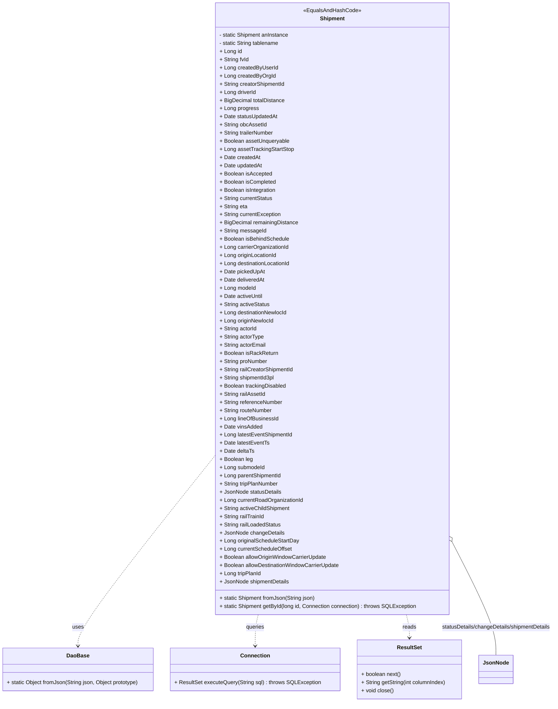

# Diagram: platform-java-lambdas/shipment/src/main/java/com/freightverify/shipment/datastore/postgresql/dao/Shipment.java

> Auto-generated by Obscura crawlers

## Mermaid

### SVG

<svg id="container" width="1630.375" xmlns="http://www.w3.org/2000/svg" class="classDiagram" height="2064" viewBox="0 0 1630.375 2064" role="graphics-document document" aria-roledescription="class"><g><defs><marker id="container_class-aggregationStart" class="marker aggregation class" refX="18" refY="7" markerWidth="190" markerHeight="240" orient="auto"><path d="M 18,7 L9,13 L1,7 L9,1 Z"></path></marker></defs><defs><marker id="container_class-aggregationEnd" class="marker aggregation class" refX="1" refY="7" markerWidth="20" markerHeight="28" orient="auto"><path d="M 18,7 L9,13 L1,7 L9,1 Z"></path></marker></defs><defs><marker id="container_class-extensionStart" class="marker extension class" refX="18" refY="7" markerWidth="190" markerHeight="240" orient="auto"><path d="M 1,7 L18,13 V 1 Z"></path></marker></defs><defs><marker id="container_class-extensionEnd" class="marker extension class" refX="1" refY="7" markerWidth="20" markerHeight="28" orient="auto"><path d="M 1,1 V 13 L18,7 Z"></path></marker></defs><defs><marker id="container_class-compositionStart" class="marker composition class" refX="18" refY="7" markerWidth="190" markerHeight="240" orient="auto"><path d="M 18,7 L9,13 L1,7 L9,1 Z"></path></marker></defs><defs><marker id="container_class-compositionEnd" class="marker composition class" refX="1" refY="7" markerWidth="20" markerHeight="28" orient="auto"><path d="M 18,7 L9,13 L1,7 L9,1 Z"></path></marker></defs><defs><marker id="container_class-dependencyStart" class="marker dependency class" refX="6" refY="7" markerWidth="190" markerHeight="240" orient="auto"><path d="M 5,7 L9,13 L1,7 L9,1 Z"></path></marker></defs><defs><marker id="container_class-dependencyEnd" class="marker dependency class" refX="13" refY="7" markerWidth="20" markerHeight="28" orient="auto"><path d="M 18,7 L9,13 L14,7 L9,1 Z"></path></marker></defs><defs><marker id="container_class-lollipopStart" class="marker lollipop class" refX="13" refY="7" markerWidth="190" markerHeight="240" orient="auto"><circle stroke="black" fill="transparent" cx="7" cy="7" r="6"></circle></marker></defs><defs><marker id="container_class-lollipopEnd" class="marker lollipop class" refX="1" refY="7" markerWidth="190" markerHeight="240" orient="auto"><circle stroke="black" fill="transparent" cx="7" cy="7" r="6"></circle></marker></defs><g class="root"><g class="clusters"></g><g class="edgePaths"><path d="M632.311,1342.115L565.549,1425.929C498.786,1509.743,365.262,1677.372,298.5,1770.352C231.738,1863.333,231.738,1881.667,231.738,1890.833L231.738,1900" id="id_Shipment_DaoBase_1" class="edge-thickness-normal edge-pattern-dashed relation" style=";;;" data-edge="true" data-et="edge" data-id="id_Shipment_DaoBase_1" data-points="W3sieCI6NjMyLjMxMDU0Njg3NSwieSI6MTM0Mi4xMTQ1NTUxNzQ5NDk0fSx7IngiOjIzMS43MzgyODEyNSwieSI6MTg0NX0seyJ4IjoyMzEuNzM4MjgxMjUsInkiOjE5MDZ9XQ==" marker-end="url(#container_class-dependencyEnd)"></path><path d="M760.82,1808L759.331,1814.167C757.842,1820.333,754.864,1832.667,753.376,1848C751.887,1863.333,751.887,1881.667,751.887,1890.833L751.887,1900" id="id_Shipment_Connection_2" class="edge-thickness-normal edge-pattern-dashed relation" style=";;;" data-edge="true" data-et="edge" data-id="id_Shipment_Connection_2" data-points="W3sieCI6NzYwLjgxOTUwNTgxOTc3MDUsInkiOjE4MDh9LHsieCI6NzUxLjg4NjcxODc1LCJ5IjoxODQ1fSx7IngiOjc1MS44ODY3MTg3NSwieSI6MTkwNn1d" marker-end="url(#container_class-dependencyEnd)"></path><path d="M1195.388,1808L1196.876,1814.167C1198.365,1820.333,1201.343,1832.667,1202.832,1844C1204.32,1855.333,1204.32,1865.667,1204.32,1870.833L1204.32,1876" id="id_Shipment_ResultSet_3" class="edge-thickness-normal edge-pattern-dashed relation" style=";;;" data-edge="true" data-et="edge" data-id="id_Shipment_ResultSet_3" data-points="W3sieCI6MTE5NS4zODc1MjU0MzAyMjk1LCJ5IjoxODA4fSx7IngiOjEyMDQuMzIwMzEyNSwieSI6MTg0NX0seyJ4IjoxMjA0LjMyMDMxMjUsInkiOjE4ODJ9XQ==" marker-end="url(#container_class-dependencyEnd)"></path><path d="M1331.75,1599.611L1352.663,1640.509C1373.575,1681.407,1415.401,1763.204,1436.314,1817.768C1457.227,1872.333,1457.227,1899.667,1457.227,1913.333L1457.227,1927" id="id_Shipment_JsonNode_4" class="edge-thickness-normal edge-pattern-solid relation" style=";;;" data-edge="true" data-et="edge" data-id="id_Shipment_JsonNode_4" data-points="W3sieCI6MTMyMy44OTY0ODQzNzUsInkiOjE1ODQuMjUyMTk0MTUzNTQzOH0seyJ4IjoxNDU3LjIyNjU2MjUsInkiOjE4NDV9LHsieCI6MTQ1Ny4yMjY1NjI1LCJ5IjoxOTI3fV0=" marker-start="url(#container_class-aggregationStart)"></path></g><g class="edgeLabels"><g class="edgeLabel" transform="translate(231.73828125, 1845)"><g class="label" data-id="id_Shipment_DaoBase_1" transform="translate(-16.4921875, -12)"><foreignObject width="32.984375" height="24">

uses

</foreignObject></g></g><g class="edgeLabel" transform="translate(751.88671875, 1845)"><g class="label" data-id="id_Shipment_Connection_2" transform="translate(-27.2421875, -12)"><foreignObject width="54.484375" height="24">

queries

</foreignObject></g></g><g class="edgeLabel" transform="translate(1204.3203125, 1845)"><g class="label" data-id="id_Shipment_ResultSet_3" transform="translate(-20.0078125, -12)"><foreignObject width="40.015625" height="24">

reads

</foreignObject></g></g><g class="edgeLabel" transform="translate(1457.2265625, 1845)"><g class="label" data-id="id_Shipment_JsonNode_4" transform="translate(-165.1484375, -12)"><foreignObject width="330.296875" height="24">

statusDetails/changeDetails/shipmentDetails

</foreignObject></g></g></g><g class="nodes"><g class="node default" id="classId-Shipment-0" transform="translate(978.103515625, 908)"><g class="basic label-container"><path d="M-345.79296875 -900 L345.79296875 -900 L345.79296875 900 L-345.79296875 900" stroke="none" stroke-width="0" fill="#ECECFF" style=""></path><path d="M-345.79296875 -900 C-153.85876094061246 -900, 38.07544686877509 -900, 345.79296875 -900 M-345.79296875 -900 C-116.61928751176043 -900, 112.55439372647913 -900, 345.79296875 -900 M345.79296875 -900 C345.79296875 -525.0478621868572, 345.79296875 -150.09572437371435, 345.79296875 900 M345.79296875 -900 C345.79296875 -218.5622994201699, 345.79296875 462.8754011596602, 345.79296875 900 M345.79296875 900 C106.22075491843074 900, -133.35145891313852 900, -345.79296875 900 M345.79296875 900 C160.50708248715773 900, -24.778803775684537 900, -345.79296875 900 M-345.79296875 900 C-345.79296875 451.65257314083595, -345.79296875 3.3051462816719095, -345.79296875 -900 M-345.79296875 900 C-345.79296875 389.40502302990757, -345.79296875 -121.18995394018486, -345.79296875 -900" stroke="#9370DB" stroke-width="1.3" fill="none" stroke-dasharray="0 0" style=""></path></g><g class="annotation-group text" transform="translate(-83.2109375, -876)"><g class="label" style="" transform="translate(0,-12)"><foreignObject width="166.421875" height="24">

«EqualsAndHashCode»

</foreignObject></g></g><g class="label-group text" transform="translate(-35.109375, -852)"><g class="label" style="font-weight: bolder" transform="translate(0,-12)"><foreignObject width="70.21875" height="24">

Shipment

</foreignObject></g></g><g class="members-group text" transform="translate(-333.79296875, -804)"><g class="label" style="" transform="translate(0,-12)"><foreignObject width="208.09375" height="24">

- static Shipment anInstance

</foreignObject></g><g class="label" style="" transform="translate(0,12)"><foreignObject width="179.546875" height="24">

- static String tablename

</foreignObject></g><g class="label" style="" transform="translate(0,36)"><foreignObject width="65.15625" height="24">

+ Long id

</foreignObject></g><g class="label" style="" transform="translate(0,60)"><foreignObject width="86.875" height="24">

+ String fvId

</foreignObject></g><g class="label" style="" transform="translate(0,84)"><foreignObject width="170.28125" height="24">

+ Long createdByUserId

</foreignObject></g><g class="label" style="" transform="translate(0,108)"><foreignObject width="162.734375" height="24">

+ Long createdByOrgId

</foreignObject></g><g class="label" style="" transform="translate(0,132)"><foreignObject width="195" height="24">

+ String creatorShipmentId

</foreignObject></g><g class="label" style="" transform="translate(0,156)"><foreignObject width="108.328125" height="24">

+ Long driverId

</foreignObject></g><g class="label" style="" transform="translate(0,180)"><foreignObject width="193.015625" height="24">

+ BigDecimal totalDistance

</foreignObject></g><g class="label" style="" transform="translate(0,204)"><foreignObject width="113.140625" height="24">

+ Long progress

</foreignObject></g><g class="label" style="" transform="translate(0,228)"><foreignObject width="171.109375" height="24">

+ Date statusUpdatedAt

</foreignObject></g><g class="label" style="" transform="translate(0,252)"><foreignObject width="138.578125" height="24">

+ String obcAssetId

</foreignObject></g><g class="label" style="" transform="translate(0,276)"><foreignObject width="161.8125" height="24">

+ String trailerNumber

</foreignObject></g><g class="label" style="" transform="translate(0,300)"><foreignObject width="206.859375" height="24">

+ Boolean assetUnqueryable

</foreignObject></g><g class="label" style="" transform="translate(0,324)"><foreignObject width="217.203125" height="24">

+ Long assetTrackingStartStop

</foreignObject></g><g class="label" style="" transform="translate(0,348)"><foreignObject width="118.953125" height="24">

+ Date createdAt

</foreignObject></g><g class="label" style="" transform="translate(0,372)"><foreignObject width="125.4375" height="24">

+ Date updatedAt

</foreignObject></g><g class="label" style="" transform="translate(0,396)"><foreignObject width="153.984375" height="24">

+ Boolean isAccepted

</foreignObject></g><g class="label" style="" transform="translate(0,420)"><foreignObject width="166.46875" height="24">

+ Boolean isCompleted

</foreignObject></g><g class="label" style="" transform="translate(0,444)"><foreignObject width="168.125" height="24">

+ Boolean isIntegration

</foreignObject></g><g class="label" style="" transform="translate(0,468)"><foreignObject width="157.546875" height="24">

+ String currentStatus

</foreignObject></g><g class="label" style="" transform="translate(0,492)"><foreignObject width="82.4375" height="24">

+ String eta

</foreignObject></g><g class="label" style="" transform="translate(0,516)"><foreignObject width="182.625" height="24">

+ String currentException

</foreignObject></g><g class="label" style="" transform="translate(0,540)"><foreignObject width="232.171875" height="24">

+ BigDecimal remainingDistance

</foreignObject></g><g class="label" style="" transform="translate(0,564)"><foreignObject width="136.03125" height="24">

+ String messageId

</foreignObject></g><g class="label" style="" transform="translate(0,588)"><foreignObject width="206.078125" height="24">

+ Boolean isBehindSchedule

</foreignObject></g><g class="label" style="" transform="translate(0,612)"><foreignObject width="205.40625" height="24">

+ Long carrierOrganizationId

</foreignObject></g><g class="label" style="" transform="translate(0,636)"><foreignObject width="169.71875" height="24">

+ Long originLocationId

</foreignObject></g><g class="label" style="" transform="translate(0,660)"><foreignObject width="210.609375" height="24">

+ Long destinationLocationId

</foreignObject></g><g class="label" style="" transform="translate(0,684)"><foreignObject width="132.609375" height="24">

+ Date pickedUpAt

</foreignObject></g><g class="label" style="" transform="translate(0,708)"><foreignObject width="132.515625" height="24">

+ Date deliveredAt

</foreignObject></g><g class="label" style="" transform="translate(0,732)"><foreignObject width="106.71875" height="24">

+ Long modeId

</foreignObject></g><g class="label" style="" transform="translate(0,756)"><foreignObject width="127.6875" height="24">

+ Date activeUntil

</foreignObject></g><g class="label" style="" transform="translate(0,780)"><foreignObject width="148.171875" height="24">

+ String activeStatus

</foreignObject></g><g class="label" style="" transform="translate(0,804)"><foreignObject width="201.21875" height="24">

+ Long destinationNewlocId

</foreignObject></g><g class="label" style="" transform="translate(0,828)"><foreignObject width="160.328125" height="24">

+ Long originNewlocId

</foreignObject></g><g class="label" style="" transform="translate(0,852)"><foreignObject width="111.046875" height="24">

+ String actorId

</foreignObject></g><g class="label" style="" transform="translate(0,876)"><foreignObject width="130.484375" height="24">

+ String actorType

</foreignObject></g><g class="label" style="" transform="translate(0,900)"><foreignObject width="136.78125" height="24">

+ String actorEmail

</foreignObject></g><g class="label" style="" transform="translate(0,924)"><foreignObject width="170.984375" height="24">

+ Boolean isRackReturn

</foreignObject></g><g class="label" style="" transform="translate(0,948)"><foreignObject width="142.25" height="24">

+ String proNumber

</foreignObject></g><g class="label" style="" transform="translate(0,972)"><foreignObject width="219.59375" height="24">

+ String railCreatorShipmentId

</foreignObject></g><g class="label" style="" transform="translate(0,996)"><foreignObject width="164.265625" height="24">

+ String shipmentId3pl

</foreignObject></g><g class="label" style="" transform="translate(0,1020)"><foreignObject width="197.515625" height="24">

+ Boolean trackingDisabled

</foreignObject></g><g class="label" style="" transform="translate(0,1044)"><foreignObject width="135.609375" height="24">

+ String railAssetId

</foreignObject></g><g class="label" style="" transform="translate(0,1068)"><foreignObject width="185.875" height="24">

+ String referenceNumber

</foreignObject></g><g class="label" style="" transform="translate(0,1092)"><foreignObject width="156.3125" height="24">

+ String routeNumber

</foreignObject></g><g class="label" style="" transform="translate(0,1116)"><foreignObject width="173" height="24">

+ Long lineOfBusinessId

</foreignObject></g><g class="label" style="" transform="translate(0,1140)"><foreignObject width="125.40625" height="24">

+ Date vinsAdded

</foreignObject></g><g class="label" style="" transform="translate(0,1164)"><foreignObject width="215.796875" height="24">

+ Long latestEventShipmentId

</foreignObject></g><g class="label" style="" transform="translate(0,1188)"><foreignObject width="145.25" height="24">

+ Date latestEventTs

</foreignObject></g><g class="label" style="" transform="translate(0,1212)"><foreignObject width="101.859375" height="24">

+ Date deltaTs

</foreignObject></g><g class="label" style="" transform="translate(0,1236)"><foreignObject width="97.78125" height="24">

+ Boolean leg

</foreignObject></g><g class="label" style="" transform="translate(0,1260)"><foreignObject width="133" height="24">

+ Long submodeId

</foreignObject></g><g class="label" style="" transform="translate(0,1284)"><foreignObject width="182.6875" height="24">

+ Long parentShipmentId

</foreignObject></g><g class="label" style="" transform="translate(0,1308)"><foreignObject width="175.5" height="24">

+ String tripPlanNumber

</foreignObject></g><g class="label" style="" transform="translate(0,1332)"><foreignObject width="180.5625" height="24">

+ JsonNode statusDetails

</foreignObject></g><g class="label" style="" transform="translate(0,1356)"><foreignObject width="246.890625" height="24">

+ Long currentRoadOrganizationId

</foreignObject></g><g class="label" style="" transform="translate(0,1380)"><foreignObject width="209.078125" height="24">

+ String activeChildShipment

</foreignObject></g><g class="label" style="" transform="translate(0,1404)"><foreignObject width="133.15625" height="24">

+ String railTrainId

</foreignObject></g><g class="label" style="" transform="translate(0,1428)"><foreignObject width="181.828125" height="24">

+ String railLoadedStatus

</foreignObject></g><g class="label" style="" transform="translate(0,1452)"><foreignObject width="188.0625" height="24">

+ JsonNode changeDetails

</foreignObject></g><g class="label" style="" transform="translate(0,1476)"><foreignObject width="234.75" height="24">

+ Long originalScheduleStartDay

</foreignObject></g><g class="label" style="" transform="translate(0,1500)"><foreignObject width="213.96875" height="24">

+ Long currentScheduleOffset

</foreignObject></g><g class="label" style="" transform="translate(0,1524)"><foreignObject width="318.140625" height="24">

+ Boolean allowOriginWindowCarrierUpdate

</foreignObject></g><g class="label" style="" transform="translate(0,1548)"><foreignObject width="358.046875" height="24">

+ Boolean allowDestinationWindowCarrierUpdate

</foreignObject></g><g class="label" style="" transform="translate(0,1572)"><foreignObject width="123.15625" height="24">

+ Long tripPlanId

</foreignObject></g><g class="label" style="" transform="translate(0,1596)"><foreignObject width="204.609375" height="24">

+ JsonNode shipmentDetails

</foreignObject></g></g><g class="methods-group text" transform="translate(-333.79296875, 852)"><g class="label" style="" transform="translate(0,-12)"><foreignObject width="283.53125" height="24">

+ static Shipment fromJson(String json)

</foreignObject></g><g class="label" style="" transform="translate(0,12)"><foreignObject width="584.375" height="24">

+ static Shipment getById(long id, Connection connection) : throws SQLException

</foreignObject></g></g><g class="divider" style=""><path d="M-345.79296875 -828 C-160.90281952180615 -828, 23.987329706387698 -828, 345.79296875 -828 M-345.79296875 -828 C-158.61939707471544 -828, 28.554174600569127 -828, 345.79296875 -828" stroke="#9370DB" stroke-width="1.3" fill="none" stroke-dasharray="0 0" style=""></path></g><g class="divider" style=""><path d="M-345.79296875 828 C-86.97395810623391 828, 171.84505253753218 828, 345.79296875 828 M-345.79296875 828 C-113.16831789210977 828, 119.45633296578046 828, 345.79296875 828" stroke="#9370DB" stroke-width="1.3" fill="none" stroke-dasharray="0 0" style=""></path></g></g><g class="node default" id="classId-DaoBase-1" transform="translate(231.73828125, 1969)"><g class="basic label-container"><path d="M-223.73828125 -63 L223.73828125 -63 L223.73828125 63 L-223.73828125 63" stroke="none" stroke-width="0" fill="#ECECFF" style=""></path><path d="M-223.73828125 -63 C-134.11271389090717 -63, -44.487146531814346 -63, 223.73828125 -63 M-223.73828125 -63 C-107.96741055397978 -63, 7.80346014204045 -63, 223.73828125 -63 M223.73828125 -63 C223.73828125 -37.36292577578939, 223.73828125 -11.725851551578792, 223.73828125 63 M223.73828125 -63 C223.73828125 -25.785820389736728, 223.73828125 11.428359220526545, 223.73828125 63 M223.73828125 63 C98.73554946859913 63, -26.267182312801737 63, -223.73828125 63 M223.73828125 63 C58.85483377298118 63, -106.02861370403764 63, -223.73828125 63 M-223.73828125 63 C-223.73828125 24.570341318394057, -223.73828125 -13.859317363211886, -223.73828125 -63 M-223.73828125 63 C-223.73828125 21.83880730418948, -223.73828125 -19.32238539162104, -223.73828125 -63" stroke="#9370DB" stroke-width="1.3" fill="none" stroke-dasharray="0 0" style=""></path></g><g class="annotation-group text" transform="translate(0, -39)"></g><g class="label-group text" transform="translate(-31.7109375, -39)"><g class="label" style="font-weight: bolder" transform="translate(0,-12)"><foreignObject width="63.421875" height="24">

DaoBase

</foreignObject></g></g><g class="members-group text" transform="translate(-211.73828125, 9)"></g><g class="methods-group text" transform="translate(-211.73828125, 39)"><g class="label" style="" transform="translate(0,-12)"><foreignObject width="391.765625" height="24">

+ static Object fromJson(String json, Object prototype)

</foreignObject></g></g><g class="divider" style=""><path d="M-223.73828125 -15 C-75.49617205600958 -15, 72.74593713798083 -15, 223.73828125 -15 M-223.73828125 -15 C-81.95714225979239 -15, 59.82399673041522 -15, 223.73828125 -15" stroke="#9370DB" stroke-width="1.3" fill="none" stroke-dasharray="0 0" style=""></path></g><g class="divider" style=""><path d="M-223.73828125 9 C-90.7947867125092 9, 42.148707824981614 9, 223.73828125 9 M-223.73828125 9 C-103.13384169872725 9, 17.470597852545495 9, 223.73828125 9" stroke="#9370DB" stroke-width="1.3" fill="none" stroke-dasharray="0 0" style=""></path></g></g><g class="node default" id="classId-Connection-2" transform="translate(751.88671875, 1969)"><g class="basic label-container"><path d="M-246.41015625 -63 L246.41015625 -63 L246.41015625 63 L-246.41015625 63" stroke="none" stroke-width="0" fill="#ECECFF" style=""></path><path d="M-246.41015625 -63 C-140.50025020242688 -63, -34.59034415485377 -63, 246.41015625 -63 M-246.41015625 -63 C-119.74003941375587 -63, 6.930077422488267 -63, 246.41015625 -63 M246.41015625 -63 C246.41015625 -25.815906808287487, 246.41015625 11.368186383425027, 246.41015625 63 M246.41015625 -63 C246.41015625 -36.71606220941977, 246.41015625 -10.432124418839535, 246.41015625 63 M246.41015625 63 C88.51203571817044 63, -69.38608481365912 63, -246.41015625 63 M246.41015625 63 C71.80956768177876 63, -102.79102088644248 63, -246.41015625 63 M-246.41015625 63 C-246.41015625 25.71026662789061, -246.41015625 -11.579466744218777, -246.41015625 -63 M-246.41015625 63 C-246.41015625 18.183431996600966, -246.41015625 -26.63313600679807, -246.41015625 -63" stroke="#9370DB" stroke-width="1.3" fill="none" stroke-dasharray="0 0" style=""></path></g><g class="annotation-group text" transform="translate(0, -39)"></g><g class="label-group text" transform="translate(-41.2265625, -39)"><g class="label" style="font-weight: bolder" transform="translate(0,-12)"><foreignObject width="82.453125" height="24">

Connection

</foreignObject></g></g><g class="members-group text" transform="translate(-234.41015625, 9)"></g><g class="methods-group text" transform="translate(-234.41015625, 39)"><g class="label" style="" transform="translate(0,-12)"><foreignObject width="427.59375" height="24">

+ ResultSet executeQuery(String sql) : throws SQLException

</foreignObject></g></g><g class="divider" style=""><path d="M-246.41015625 -15 C-88.9073789675304 -15, 68.59539831493919 -15, 246.41015625 -15 M-246.41015625 -15 C-131.23763789319622 -15, -16.065119536392473 -15, 246.41015625 -15" stroke="#9370DB" stroke-width="1.3" fill="none" stroke-dasharray="0 0" style=""></path></g><g class="divider" style=""><path d="M-246.41015625 9 C-135.10906168951107 9, -23.80796712902216 9, 246.41015625 9 M-246.41015625 9 C-74.8646370751145 9, 96.680882099771 9, 246.41015625 9" stroke="#9370DB" stroke-width="1.3" fill="none" stroke-dasharray="0 0" style=""></path></g></g><g class="node default" id="classId-ResultSet-3" transform="translate(1204.3203125, 1969)"><g class="basic label-container"><path d="M-156.0234375 -87 L156.0234375 -87 L156.0234375 87 L-156.0234375 87" stroke="none" stroke-width="0" fill="#ECECFF" style=""></path><path d="M-156.0234375 -87 C-64.173955342125 -87, 27.675526815750004 -87, 156.0234375 -87 M-156.0234375 -87 C-52.30779071531414 -87, 51.40785606937172 -87, 156.0234375 -87 M156.0234375 -87 C156.0234375 -41.07366839278115, 156.0234375 4.8526632144376975, 156.0234375 87 M156.0234375 -87 C156.0234375 -51.52151390781798, 156.0234375 -16.043027815635966, 156.0234375 87 M156.0234375 87 C62.217241611810024 87, -31.58895427637995 87, -156.0234375 87 M156.0234375 87 C61.27085744091174 87, -33.48172261817652 87, -156.0234375 87 M-156.0234375 87 C-156.0234375 51.55719825895726, -156.0234375 16.114396517914514, -156.0234375 -87 M-156.0234375 87 C-156.0234375 49.84611907305101, -156.0234375 12.692238146102014, -156.0234375 -87" stroke="#9370DB" stroke-width="1.3" fill="none" stroke-dasharray="0 0" style=""></path></g><g class="annotation-group text" transform="translate(0, -63)"></g><g class="label-group text" transform="translate(-35.21875, -63)"><g class="label" style="font-weight: bolder" transform="translate(0,-12)"><foreignObject width="70.4375" height="24">

ResultSet

</foreignObject></g></g><g class="members-group text" transform="translate(-144.0234375, -15)"></g><g class="methods-group text" transform="translate(-144.0234375, 15)"><g class="label" style="" transform="translate(0,-12)"><foreignObject width="117.765625" height="24">

+ boolean next()

</foreignObject></g><g class="label" style="" transform="translate(0,12)"><foreignObject width="252.828125" height="24">

+ String getString(int columnIndex)

</foreignObject></g><g class="label" style="" transform="translate(0,36)"><foreignObject width="95.859375" height="24">

+ void close()

</foreignObject></g></g><g class="divider" style=""><path d="M-156.0234375 -39 C-66.41249549030658 -39, 23.198446519386835 -39, 156.0234375 -39 M-156.0234375 -39 C-83.99277372555152 -39, -11.96210995110303 -39, 156.0234375 -39" stroke="#9370DB" stroke-width="1.3" fill="none" stroke-dasharray="0 0" style=""></path></g><g class="divider" style=""><path d="M-156.0234375 -15 C-90.04773316749552 -15, -24.072028834991045 -15, 156.0234375 -15 M-156.0234375 -15 C-87.38216995902597 -15, -18.740902418051945 -15, 156.0234375 -15" stroke="#9370DB" stroke-width="1.3" fill="none" stroke-dasharray="0 0" style=""></path></g></g><g class="node default" id="classId-JsonNode-4" transform="translate(1457.2265625, 1969)"><g class="basic label-container"><path d="M-46.8828125 -42 L46.8828125 -42 L46.8828125 42 L-46.8828125 42" stroke="none" stroke-width="0" fill="#ECECFF" style=""></path><path d="M-46.8828125 -42 C-20.697520167675194 -42, 5.487772164649613 -42, 46.8828125 -42 M-46.8828125 -42 C-22.59259075047902 -42, 1.6976309990419622 -42, 46.8828125 -42 M46.8828125 -42 C46.8828125 -15.820446650640207, 46.8828125 10.359106698719586, 46.8828125 42 M46.8828125 -42 C46.8828125 -24.365642374614275, 46.8828125 -6.73128474922855, 46.8828125 42 M46.8828125 42 C15.396570860554842 42, -16.089670778890316 42, -46.8828125 42 M46.8828125 42 C15.820167461265626 42, -15.242477577468748 42, -46.8828125 42 M-46.8828125 42 C-46.8828125 9.495144738504749, -46.8828125 -23.009710522990503, -46.8828125 -42 M-46.8828125 42 C-46.8828125 24.473163375062395, -46.8828125 6.94632675012479, -46.8828125 -42" stroke="#9370DB" stroke-width="1.3" fill="none" stroke-dasharray="0 0" style=""></path></g><g class="annotation-group text" transform="translate(0, -18)"></g><g class="label-group text" transform="translate(-34.8828125, -18)"><g class="label" style="font-weight: bolder" transform="translate(0,-12)"><foreignObject width="69.765625" height="24">

JsonNode

</foreignObject></g></g><g class="members-group text" transform="translate(-34.8828125, 30)"></g><g class="methods-group text" transform="translate(-34.8828125, 60)"></g><g class="divider" style=""><path d="M-46.8828125 6 C-24.26995343950382 6, -1.6570943790076385 6, 46.8828125 6 M-46.8828125 6 C-23.90324256208644 6, -0.9236726241728803 6, 46.8828125 6" stroke="#9370DB" stroke-width="1.3" fill="none" stroke-dasharray="0 0" style=""></path></g><g class="divider" style=""><path d="M-46.8828125 24 C-12.201538630673298 24, 22.479735238653404 24, 46.8828125 24 M-46.8828125 24 C-23.506877428458857 24, -0.13094235691771416 24, 46.8828125 24" stroke="#9370DB" stroke-width="1.3" fill="none" stroke-dasharray="0 0" style=""></path></g></g></g></g></g></svg>
