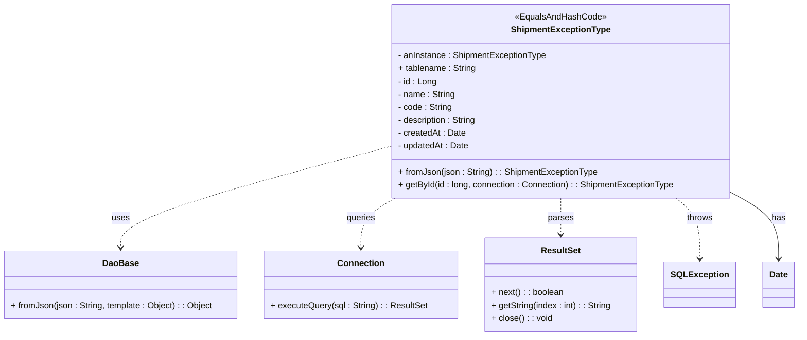
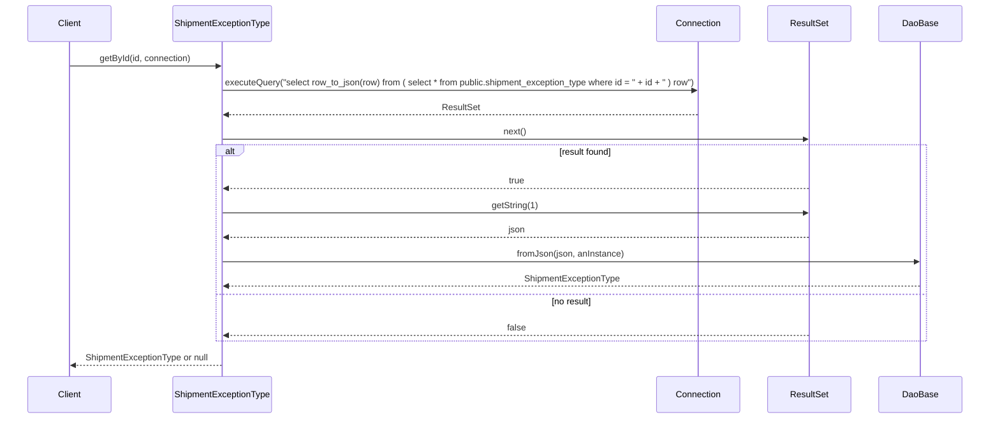

# Diagram: platform-java-lambdas/shipment/src/main/java/com/freightverify/shipment/datastore/postgresql/dao/ShipmentExceptionType.java

> Auto-generated by Obscura crawlers

## Diagram 1

### SVG

<svg id="container" width="1462.921875" xmlns="http://www.w3.org/2000/svg" class="classDiagram" height="624" viewBox="0 0 1462.921875 624" role="graphics-document document" aria-roledescription="class"><g><defs><marker id="container_class-aggregationStart" class="marker aggregation class" refX="18" refY="7" markerWidth="190" markerHeight="240" orient="auto"><path d="M 18,7 L9,13 L1,7 L9,1 Z"></path></marker></defs><defs><marker id="container_class-aggregationEnd" class="marker aggregation class" refX="1" refY="7" markerWidth="20" markerHeight="28" orient="auto"><path d="M 18,7 L9,13 L1,7 L9,1 Z"></path></marker></defs><defs><marker id="container_class-extensionStart" class="marker extension class" refX="18" refY="7" markerWidth="190" markerHeight="240" orient="auto"><path d="M 1,7 L18,13 V 1 Z"></path></marker></defs><defs><marker id="container_class-extensionEnd" class="marker extension class" refX="1" refY="7" markerWidth="20" markerHeight="28" orient="auto"><path d="M 1,1 V 13 L18,7 Z"></path></marker></defs><defs><marker id="container_class-compositionStart" class="marker composition class" refX="18" refY="7" markerWidth="190" markerHeight="240" orient="auto"><path d="M 18,7 L9,13 L1,7 L9,1 Z"></path></marker></defs><defs><marker id="container_class-compositionEnd" class="marker composition class" refX="1" refY="7" markerWidth="20" markerHeight="28" orient="auto"><path d="M 18,7 L9,13 L1,7 L9,1 Z"></path></marker></defs><defs><marker id="container_class-dependencyStart" class="marker dependency class" refX="6" refY="7" markerWidth="190" markerHeight="240" orient="auto"><path d="M 5,7 L9,13 L1,7 L9,1 Z"></path></marker></defs><defs><marker id="container_class-dependencyEnd" class="marker dependency class" refX="13" refY="7" markerWidth="20" markerHeight="28" orient="auto"><path d="M 18,7 L9,13 L14,7 L9,1 Z"></path></marker></defs><defs><marker id="container_class-lollipopStart" class="marker lollipop class" refX="13" refY="7" markerWidth="190" markerHeight="240" orient="auto"><circle stroke="black" fill="transparent" cx="7" cy="7" r="6"></circle></marker></defs><defs><marker id="container_class-lollipopEnd" class="marker lollipop class" refX="1" refY="7" markerWidth="190" markerHeight="240" orient="auto"><circle stroke="black" fill="transparent" cx="7" cy="7" r="6"></circle></marker></defs><g class="root"><g class="clusters"></g><g class="edgePaths"><path d="M719.664,271.824L636.902,294.02C554.139,316.216,388.615,360.608,305.852,391.971C223.09,423.333,223.09,441.667,223.09,450.833L223.09,460" id="id_ShipmentExceptionType_DaoBase_1" class="edge-thickness-normal edge-pattern-dashed relation" style=";;;" data-edge="true" data-et="edge" data-id="id_ShipmentExceptionType_DaoBase_1" data-points="W3sieCI6NzE5LjY2NDA2MjUsInkiOjI3MS44MjM5MzI5NTI1ODY5fSx7IngiOjIyMy4wODk4NDM3NSwieSI6NDA1fSx7IngiOjIyMy4wODk4NDM3NSwieSI6NDY2fV0=" marker-end="url(#container_class-dependencyEnd)"></path><path d="M727.299,368L716.853,374.167C706.406,380.333,685.514,392.667,675.067,408C664.621,423.333,664.621,441.667,664.621,450.833L664.621,460" id="id_ShipmentExceptionType_Connection_2" class="edge-thickness-normal edge-pattern-dashed relation" style=";;;" data-edge="true" data-et="edge" data-id="id_ShipmentExceptionType_Connection_2" data-points="W3sieCI6NzI3LjI5OTAzNTEzODI0ODksInkiOjM2OH0seyJ4Ijo2NjQuNjIxMDkzNzUsInkiOjQwNX0seyJ4Ijo2NjQuNjIxMDkzNzUsInkiOjQ2Nn1d" marker-end="url(#container_class-dependencyEnd)"></path><path d="M1032.219,368L1032.219,374.167C1032.219,380.333,1032.219,392.667,1032.219,404C1032.219,415.333,1032.219,425.667,1032.219,430.833L1032.219,436" id="id_ShipmentExceptionType_ResultSet_3" class="edge-thickness-normal edge-pattern-dashed relation" style=";;;" data-edge="true" data-et="edge" data-id="id_ShipmentExceptionType_ResultSet_3" data-points="W3sieCI6MTAzMi4yMTg3NSwieSI6MzY4fSx7IngiOjEwMzIuMjE4NzUsInkiOjQwNX0seyJ4IjoxMDMyLjIxODc1LCJ5Ijo0NDJ9XQ==" marker-end="url(#container_class-dependencyEnd)"></path><path d="M1242.126,368L1249.317,374.167C1256.508,380.333,1270.891,392.667,1278.082,411.5C1285.273,430.333,1285.273,455.667,1285.273,468.333L1285.273,481" id="id_ShipmentExceptionType_SQLException_4" class="edge-thickness-normal edge-pattern-dashed relation" style=";;;" data-edge="true" data-et="edge" data-id="id_ShipmentExceptionType_SQLException_4" data-points="W3sieCI6MTI0Mi4xMjU4NjQwNTUyOTk2LCJ5IjozNjh9LHsieCI6MTI4NS4yNzM0Mzc1LCJ5Ijo0MDV9LHsieCI6MTI4NS4yNzM0Mzc1LCJ5Ijo0ODd9XQ==" marker-end="url(#container_class-dependencyEnd)"></path><path d="M1344.773,360.218L1358.319,367.682C1371.865,375.145,1398.956,390.073,1412.501,410.203C1426.047,430.333,1426.047,455.667,1426.047,468.333L1426.047,481" id="id_ShipmentExceptionType_Date_5" class="edge-thickness-normal edge-pattern-solid relation" style=";;;" data-edge="true" data-et="edge" data-id="id_ShipmentExceptionType_Date_5" data-points="W3sieCI6MTM0NC43NzM0Mzc1LCJ5IjozNjAuMjE4MTkwODM1MTUxNzR9LHsieCI6MTQyNi4wNDY4NzUsInkiOjQwNX0seyJ4IjoxNDI2LjA0Njg3NSwieSI6NDg3fV0=" marker-end="url(#container_class-dependencyEnd)"></path></g><g class="edgeLabels"><g class="edgeLabel" transform="translate(223.08984375, 405)"><g class="label" data-id="id_ShipmentExceptionType_DaoBase_1" transform="translate(-16.4921875, -12)"><foreignObject width="32.984375" height="24">

uses

</foreignObject></g></g><g class="edgeLabel" transform="translate(664.62109375, 405)"><g class="label" data-id="id_ShipmentExceptionType_Connection_2" transform="translate(-27.2421875, -12)"><foreignObject width="54.484375" height="24">

queries

</foreignObject></g></g><g class="edgeLabel" transform="translate(1032.21875, 405)"><g class="label" data-id="id_ShipmentExceptionType_ResultSet_3" transform="translate(-23.828125, -12)"><foreignObject width="47.65625" height="24">

parses

</foreignObject></g></g><g class="edgeLabel" transform="translate(1285.2734375, 405)"><g class="label" data-id="id_ShipmentExceptionType_SQLException_4" transform="translate(-24.5703125, -12)"><foreignObject width="49.140625" height="24">

throws

</foreignObject></g></g><g class="edgeLabel" transform="translate(1426.046875, 405)"><g class="label" data-id="id_ShipmentExceptionType_Date_5" transform="translate(-12.703125, -12)"><foreignObject width="25.40625" height="24">

has

</foreignObject></g></g></g><g class="nodes"><g class="node default" id="classId-ShipmentExceptionType-0" transform="translate(1032.21875, 188)"><g class="basic label-container"><path d="M-312.5546875 -180 L312.5546875 -180 L312.5546875 180 L-312.5546875 180" stroke="none" stroke-width="0" fill="#ECECFF" style=""></path><path d="M-312.5546875 -180 C-134.6077122326253 -180, 43.33926303474942 -180, 312.5546875 -180 M-312.5546875 -180 C-128.6741033371781 -180, 55.20648082564378 -180, 312.5546875 -180 M312.5546875 -180 C312.5546875 -100.59330682350527, 312.5546875 -21.186613647010546, 312.5546875 180 M312.5546875 -180 C312.5546875 -57.6368392801503, 312.5546875 64.7263214396994, 312.5546875 180 M312.5546875 180 C96.02901123377538 180, -120.49666503244924 180, -312.5546875 180 M312.5546875 180 C149.4630877590391 180, -13.628511981921804 180, -312.5546875 180 M-312.5546875 180 C-312.5546875 54.10345422469402, -312.5546875 -71.79309155061196, -312.5546875 -180 M-312.5546875 180 C-312.5546875 107.95617781049252, -312.5546875 35.91235562098504, -312.5546875 -180" stroke="#9370DB" stroke-width="1.3" fill="none" stroke-dasharray="0 0" style=""></path></g><g class="annotation-group text" transform="translate(-83.2109375, -156)"><g class="label" style="" transform="translate(0,-12)"><foreignObject width="166.421875" height="24">

«EqualsAndHashCode»

</foreignObject></g></g><g class="label-group text" transform="translate(-88.140625, -132)"><g class="label" style="font-weight: bolder" transform="translate(0,-12)"><foreignObject width="176.28125" height="24">

ShipmentExceptionType

</foreignObject></g></g><g class="members-group text" transform="translate(-300.5546875, -84)"><g class="label" style="" transform="translate(0,-12)"><foreignObject width="276.609375" height="24">

- anInstance : ShipmentExceptionType

</foreignObject></g><g class="label" style="" transform="translate(0,12)"><foreignObject width="145.140625" height="24">

+ tablename : String

</foreignObject></g><g class="label" style="" transform="translate(0,36)"><foreignObject width="71.703125" height="24">

- id : Long

</foreignObject></g><g class="label" style="" transform="translate(0,60)"><foreignObject width="106.40625" height="24">

- name : String

</foreignObject></g><g class="label" style="" transform="translate(0,84)"><foreignObject width="100.859375" height="24">

- code : String

</foreignObject></g><g class="label" style="" transform="translate(0,108)"><foreignObject width="148.5" height="24">

- description : String

</foreignObject></g><g class="label" style="" transform="translate(0,132)"><foreignObject width="125.5" height="24">

- createdAt : Date

</foreignObject></g><g class="label" style="" transform="translate(0,156)"><foreignObject width="131.96875" height="24">

- updatedAt : Date

</foreignObject></g></g><g class="methods-group text" transform="translate(-300.5546875, 132)"><g class="label" style="" transform="translate(0,-12)"><foreignObject width="368.796875" height="24">

+ fromJson(json : String) : : ShipmentExceptionType

</foreignObject></g><g class="label" style="" transform="translate(0,12)"><foreignObject width="512.96875" height="24">

+ getById(id : long, connection : Connection) : : ShipmentExceptionType

</foreignObject></g></g><g class="divider" style=""><path d="M-312.5546875 -108 C-112.57314364714557 -108, 87.40840020570886 -108, 312.5546875 -108 M-312.5546875 -108 C-87.7843729563499 -108, 136.9859415873002 -108, 312.5546875 -108" stroke="#9370DB" stroke-width="1.3" fill="none" stroke-dasharray="0 0" style=""></path></g><g class="divider" style=""><path d="M-312.5546875 108 C-117.00484189684306 108, 78.54500370631388 108, 312.5546875 108 M-312.5546875 108 C-87.1689594777695 108, 138.216768544461 108, 312.5546875 108" stroke="#9370DB" stroke-width="1.3" fill="none" stroke-dasharray="0 0" style=""></path></g></g><g class="node default" id="classId-DaoBase-1" transform="translate(223.08984375, 529)"><g class="basic label-container"><path d="M-215.08984375 -63 L215.08984375 -63 L215.08984375 63 L-215.08984375 63" stroke="none" stroke-width="0" fill="#ECECFF" style=""></path><path d="M-215.08984375 -63 C-72.80488001434719 -63, 69.48008372130562 -63, 215.08984375 -63 M-215.08984375 -63 C-68.74660466764641 -63, 77.59663441470718 -63, 215.08984375 -63 M215.08984375 -63 C215.08984375 -22.621489023499343, 215.08984375 17.757021953001313, 215.08984375 63 M215.08984375 -63 C215.08984375 -35.272842633949566, 215.08984375 -7.545685267899138, 215.08984375 63 M215.08984375 63 C46.68873437240947 63, -121.71237500518106 63, -215.08984375 63 M215.08984375 63 C122.50248338514204 63, 29.915123020284085 63, -215.08984375 63 M-215.08984375 63 C-215.08984375 34.992090801524114, -215.08984375 6.984181603048221, -215.08984375 -63 M-215.08984375 63 C-215.08984375 14.761404794729025, -215.08984375 -33.47719041054195, -215.08984375 -63" stroke="#9370DB" stroke-width="1.3" fill="none" stroke-dasharray="0 0" style=""></path></g><g class="annotation-group text" transform="translate(0, -39)"></g><g class="label-group text" transform="translate(-31.7109375, -39)"><g class="label" style="font-weight: bolder" transform="translate(0,-12)"><foreignObject width="63.421875" height="24">

DaoBase

</foreignObject></g></g><g class="members-group text" transform="translate(-203.08984375, 9)"></g><g class="methods-group text" transform="translate(-203.08984375, 39)"><g class="label" style="" transform="translate(0,-12)"><foreignObject width="374.46875" height="24">

+ fromJson(json : String, template : Object) : : Object

</foreignObject></g></g><g class="divider" style=""><path d="M-215.08984375 -15 C-100.27014772361608 -15, 14.549548302767846 -15, 215.08984375 -15 M-215.08984375 -15 C-52.60384658993317 -15, 109.88215057013366 -15, 215.08984375 -15" stroke="#9370DB" stroke-width="1.3" fill="none" stroke-dasharray="0 0" style=""></path></g><g class="divider" style=""><path d="M-215.08984375 9 C-111.04983063211307 9, -7.0098175142261425 9, 215.08984375 9 M-215.08984375 9 C-107.33535575427886 9, 0.41913224144227 9, 215.08984375 9" stroke="#9370DB" stroke-width="1.3" fill="none" stroke-dasharray="0 0" style=""></path></g></g><g class="node default" id="classId-Connection-2" transform="translate(664.62109375, 529)"><g class="basic label-container"><path d="M-176.44140625 -63 L176.44140625 -63 L176.44140625 63 L-176.44140625 63" stroke="none" stroke-width="0" fill="#ECECFF" style=""></path><path d="M-176.44140625 -63 C-72.82675296233582 -63, 30.787900325328366 -63, 176.44140625 -63 M-176.44140625 -63 C-105.76593061485924 -63, -35.09045497971849 -63, 176.44140625 -63 M176.44140625 -63 C176.44140625 -29.72568189146581, 176.44140625 3.5486362170683776, 176.44140625 63 M176.44140625 -63 C176.44140625 -14.407182416469887, 176.44140625 34.18563516706023, 176.44140625 63 M176.44140625 63 C60.53314296892165 63, -55.375120312156696 63, -176.44140625 63 M176.44140625 63 C99.0240117595281 63, 21.606617269056187 63, -176.44140625 63 M-176.44140625 63 C-176.44140625 23.130299031978495, -176.44140625 -16.73940193604301, -176.44140625 -63 M-176.44140625 63 C-176.44140625 34.53918774405936, -176.44140625 6.0783754881187235, -176.44140625 -63" stroke="#9370DB" stroke-width="1.3" fill="none" stroke-dasharray="0 0" style=""></path></g><g class="annotation-group text" transform="translate(0, -39)"></g><g class="label-group text" transform="translate(-41.2265625, -39)"><g class="label" style="font-weight: bolder" transform="translate(0,-12)"><foreignObject width="82.453125" height="24">

Connection

</foreignObject></g></g><g class="members-group text" transform="translate(-164.44140625, 9)"></g><g class="methods-group text" transform="translate(-164.44140625, 39)"><g class="label" style="" transform="translate(0,-12)"><foreignObject width="287.65625" height="24">

+ executeQuery(sql : String) : : ResultSet

</foreignObject></g></g><g class="divider" style=""><path d="M-176.44140625 -15 C-98.01365389489253 -15, -19.585901539785056 -15, 176.44140625 -15 M-176.44140625 -15 C-71.10089289041223 -15, 34.23962046917555 -15, 176.44140625 -15" stroke="#9370DB" stroke-width="1.3" fill="none" stroke-dasharray="0 0" style=""></path></g><g class="divider" style=""><path d="M-176.44140625 9 C-84.7396288160796 9, 6.962148617840796 9, 176.44140625 9 M-176.44140625 9 C-89.77729655843189 9, -3.1131868668637708 9, 176.44140625 9" stroke="#9370DB" stroke-width="1.3" fill="none" stroke-dasharray="0 0" style=""></path></g></g><g class="node default" id="classId-ResultSet-3" transform="translate(1032.21875, 529)"><g class="basic label-container"><path d="M-141.15625 -87 L141.15625 -87 L141.15625 87 L-141.15625 87" stroke="none" stroke-width="0" fill="#ECECFF" style=""></path><path d="M-141.15625 -87 C-71.05410399083263 -87, -0.9519579816652595 -87, 141.15625 -87 M-141.15625 -87 C-35.14767696888049 -87, 70.86089606223902 -87, 141.15625 -87 M141.15625 -87 C141.15625 -30.306761895990498, 141.15625 26.386476208019005, 141.15625 87 M141.15625 -87 C141.15625 -21.094654700830944, 141.15625 44.81069059833811, 141.15625 87 M141.15625 87 C43.773286334365935 87, -53.60967733126813 87, -141.15625 87 M141.15625 87 C82.65690380041269 87, 24.15755760082537 87, -141.15625 87 M-141.15625 87 C-141.15625 42.35214476159326, -141.15625 -2.2957104768134826, -141.15625 -87 M-141.15625 87 C-141.15625 46.843742686079516, -141.15625 6.687485372159031, -141.15625 -87" stroke="#9370DB" stroke-width="1.3" fill="none" stroke-dasharray="0 0" style=""></path></g><g class="annotation-group text" transform="translate(0, -63)"></g><g class="label-group text" transform="translate(-35.21875, -63)"><g class="label" style="font-weight: bolder" transform="translate(0,-12)"><foreignObject width="70.4375" height="24">

ResultSet

</foreignObject></g></g><g class="members-group text" transform="translate(-129.15625, -15)"></g><g class="methods-group text" transform="translate(-129.15625, 15)"><g class="label" style="" transform="translate(0,-12)"><foreignObject width="133.921875" height="24">

+ next() : : boolean

</foreignObject></g><g class="label" style="" transform="translate(0,12)"><foreignObject width="223.09375" height="24">

+ getString(index : int) : : String

</foreignObject></g><g class="label" style="" transform="translate(0,36)"><foreignObject width="112.03125" height="24">

+ close() : : void

</foreignObject></g></g><g class="divider" style=""><path d="M-141.15625 -39 C-82.49573746200033 -39, -23.83522492400067 -39, 141.15625 -39 M-141.15625 -39 C-38.61567049517194 -39, 63.92490900965612 -39, 141.15625 -39" stroke="#9370DB" stroke-width="1.3" fill="none" stroke-dasharray="0 0" style=""></path></g><g class="divider" style=""><path d="M-141.15625 -15 C-78.14407910613636 -15, -15.131908212272705 -15, 141.15625 -15 M-141.15625 -15 C-35.93309084984902 -15, 69.29006830030195 -15, 141.15625 -15" stroke="#9370DB" stroke-width="1.3" fill="none" stroke-dasharray="0 0" style=""></path></g></g><g class="node default" id="classId-SQLException-4" transform="translate(1285.2734375, 529)"><g class="basic label-container"><path d="M-61.8984375 -42 L61.8984375 -42 L61.8984375 42 L-61.8984375 42" stroke="none" stroke-width="0" fill="#ECECFF" style=""></path><path d="M-61.8984375 -42 C-33.13167138145951 -42, -4.364905262919017 -42, 61.8984375 -42 M-61.8984375 -42 C-35.493732237821646 -42, -9.0890269756433 -42, 61.8984375 -42 M61.8984375 -42 C61.8984375 -13.933078083367011, 61.8984375 14.133843833265978, 61.8984375 42 M61.8984375 -42 C61.8984375 -9.96926982190839, 61.8984375 22.06146035618322, 61.8984375 42 M61.8984375 42 C12.553234409964283 42, -36.791968680071435 42, -61.8984375 42 M61.8984375 42 C31.02668158140859 42, 0.15492566281717757 42, -61.8984375 42 M-61.8984375 42 C-61.8984375 18.46792625357162, -61.8984375 -5.064147492856762, -61.8984375 -42 M-61.8984375 42 C-61.8984375 23.262174842409355, -61.8984375 4.524349684818709, -61.8984375 -42" stroke="#9370DB" stroke-width="1.3" fill="none" stroke-dasharray="0 0" style=""></path></g><g class="annotation-group text" transform="translate(0, -18)"></g><g class="label-group text" transform="translate(-49.8984375, -18)"><g class="label" style="font-weight: bolder" transform="translate(0,-12)"><foreignObject width="99.796875" height="24">

SQLException

</foreignObject></g></g><g class="members-group text" transform="translate(-49.8984375, 30)"></g><g class="methods-group text" transform="translate(-49.8984375, 60)"></g><g class="divider" style=""><path d="M-61.8984375 6 C-21.483665485581852 6, 18.931106528836295 6, 61.8984375 6 M-61.8984375 6 C-32.91683151792327 6, -3.9352255358465413 6, 61.8984375 6" stroke="#9370DB" stroke-width="1.3" fill="none" stroke-dasharray="0 0" style=""></path></g><g class="divider" style=""><path d="M-61.8984375 24 C-18.649383448620334 24, 24.599670602759332 24, 61.8984375 24 M-61.8984375 24 C-20.096492547346045 24, 21.70545240530791 24, 61.8984375 24" stroke="#9370DB" stroke-width="1.3" fill="none" stroke-dasharray="0 0" style=""></path></g></g><g class="node default" id="classId-Date-5" transform="translate(1426.046875, 529)"><g class="basic label-container"><path d="M-28.875 -42 L28.875 -42 L28.875 42 L-28.875 42" stroke="none" stroke-width="0" fill="#ECECFF" style=""></path><path d="M-28.875 -42 C-15.635775789920952 -42, -2.396551579841905 -42, 28.875 -42 M-28.875 -42 C-9.279245256227476 -42, 10.316509487545048 -42, 28.875 -42 M28.875 -42 C28.875 -14.623717951682742, 28.875 12.752564096634515, 28.875 42 M28.875 -42 C28.875 -17.258599935773415, 28.875 7.482800128453171, 28.875 42 M28.875 42 C13.452154542113266 42, -1.9706909157734671 42, -28.875 42 M28.875 42 C7.3678478010721875 42, -14.139304397855625 42, -28.875 42 M-28.875 42 C-28.875 9.15550875721194, -28.875 -23.68898248557612, -28.875 -42 M-28.875 42 C-28.875 12.54510717326141, -28.875 -16.90978565347718, -28.875 -42" stroke="#9370DB" stroke-width="1.3" fill="none" stroke-dasharray="0 0" style=""></path></g><g class="annotation-group text" transform="translate(0, -18)"></g><g class="label-group text" transform="translate(-16.875, -18)"><g class="label" style="font-weight: bolder" transform="translate(0,-12)"><foreignObject width="33.75" height="24">

Date

</foreignObject></g></g><g class="members-group text" transform="translate(-16.875, 30)"></g><g class="methods-group text" transform="translate(-16.875, 60)"></g><g class="divider" style=""><path d="M-28.875 6 C-5.896734255475259 6, 17.081531489049482 6, 28.875 6 M-28.875 6 C-7.241963034870643 6, 14.391073930258713 6, 28.875 6" stroke="#9370DB" stroke-width="1.3" fill="none" stroke-dasharray="0 0" style=""></path></g><g class="divider" style=""><path d="M-28.875 24 C-14.142852280209722 24, 0.5892954395805567 24, 28.875 24 M-28.875 24 C-7.922384377194646 24, 13.030231245610707 24, 28.875 24" stroke="#9370DB" stroke-width="1.3" fill="none" stroke-dasharray="0 0" style=""></path></g></g></g></g></g></svg>

## Diagram 2

### SVG

<svg id="container" width="1879" xmlns="http://www.w3.org/2000/svg" height="799" viewBox="-50 -10 1879 799" role="graphics-document document" aria-roledescription="sequence"><g><rect x="1629" y="713" fill="#eaeaea" stroke="#666" width="150" height="65" name="DaoBase" rx="3" ry="3" class="actor actor-bottom"></rect><text x="1704" y="745.5" dominant-baseline="central" alignment-baseline="central" class="actor actor-box" style="text-anchor: middle; font-size: 16px; font-weight: 400;"><tspan x="1704" dy="0">DaoBase</tspan></text></g><g><rect x="1429" y="713" fill="#eaeaea" stroke="#666" width="150" height="65" name="ResultSet" rx="3" ry="3" class="actor actor-bottom"></rect><text x="1504" y="745.5" dominant-baseline="central" alignment-baseline="central" class="actor actor-box" style="text-anchor: middle; font-size: 16px; font-weight: 400;"><tspan x="1504" dy="0">ResultSet</tspan></text></g><g><rect x="1229" y="713" fill="#eaeaea" stroke="#666" width="150" height="65" name="Connection" rx="3" ry="3" class="actor actor-bottom"></rect><text x="1304" y="745.5" dominant-baseline="central" alignment-baseline="central" class="actor actor-box" style="text-anchor: middle; font-size: 16px; font-weight: 400;"><tspan x="1304" dy="0">Connection</tspan></text></g><g><rect x="275" y="713" fill="#eaeaea" stroke="#666" width="194" height="65" name="ShipmentExceptionType" rx="3" ry="3" class="actor actor-bottom"></rect><text x="372" y="745.5" dominant-baseline="central" alignment-baseline="central" class="actor actor-box" style="text-anchor: middle; font-size: 16px; font-weight: 400;"><tspan x="372" dy="0">ShipmentExceptionType</tspan></text></g><g><rect x="0" y="713" fill="#eaeaea" stroke="#666" width="150" height="65" name="Client" rx="3" ry="3" class="actor actor-bottom"></rect><text x="75" y="745.5" dominant-baseline="central" alignment-baseline="central" class="actor actor-box" style="text-anchor: middle; font-size: 16px; font-weight: 400;"><tspan x="75" dy="0">Client</tspan></text></g><g><line id="actor4" x1="1704" y1="65" x2="1704" y2="713" class="actor-line 200" stroke-width="0.5px" stroke="#999" name="DaoBase"></line><g id="root-4"><rect x="1629" y="0" fill="#eaeaea" stroke="#666" width="150" height="65" name="DaoBase" rx="3" ry="3" class="actor actor-top"></rect><text x="1704" y="32.5" dominant-baseline="central" alignment-baseline="central" class="actor actor-box" style="text-anchor: middle; font-size: 16px; font-weight: 400;"><tspan x="1704" dy="0">DaoBase</tspan></text></g></g><g><line id="actor3" x1="1504" y1="65" x2="1504" y2="713" class="actor-line 200" stroke-width="0.5px" stroke="#999" name="ResultSet"></line><g id="root-3"><rect x="1429" y="0" fill="#eaeaea" stroke="#666" width="150" height="65" name="ResultSet" rx="3" ry="3" class="actor actor-top"></rect><text x="1504" y="32.5" dominant-baseline="central" alignment-baseline="central" class="actor actor-box" style="text-anchor: middle; font-size: 16px; font-weight: 400;"><tspan x="1504" dy="0">ResultSet</tspan></text></g></g><g><line id="actor2" x1="1304" y1="65" x2="1304" y2="713" class="actor-line 200" stroke-width="0.5px" stroke="#999" name="Connection"></line><g id="root-2"><rect x="1229" y="0" fill="#eaeaea" stroke="#666" width="150" height="65" name="Connection" rx="3" ry="3" class="actor actor-top"></rect><text x="1304" y="32.5" dominant-baseline="central" alignment-baseline="central" class="actor actor-box" style="text-anchor: middle; font-size: 16px; font-weight: 400;"><tspan x="1304" dy="0">Connection</tspan></text></g></g><g><line id="actor1" x1="372" y1="65" x2="372" y2="713" class="actor-line 200" stroke-width="0.5px" stroke="#999" name="ShipmentExceptionType"></line><g id="root-1"><rect x="275" y="0" fill="#eaeaea" stroke="#666" width="194" height="65" name="ShipmentExceptionType" rx="3" ry="3" class="actor actor-top"></rect><text x="372" y="32.5" dominant-baseline="central" alignment-baseline="central" class="actor actor-box" style="text-anchor: middle; font-size: 16px; font-weight: 400;"><tspan x="372" dy="0">ShipmentExceptionType</tspan></text></g></g><g><line id="actor0" x1="75" y1="65" x2="75" y2="713" class="actor-line 200" stroke-width="0.5px" stroke="#999" name="Client"></line><g id="root-0"><rect x="0" y="0" fill="#eaeaea" stroke="#666" width="150" height="65" name="Client" rx="3" ry="3" class="actor actor-top"></rect><text x="75" y="32.5" dominant-baseline="central" alignment-baseline="central" class="actor actor-box" style="text-anchor: middle; font-size: 16px; font-weight: 400;"><tspan x="75" dy="0">Client</tspan></text></g></g><g></g><defs><symbol id="computer" width="24" height="24"><path transform="scale(.5)" d="M2 2v13h20v-13h-20zm18 11h-16v-9h16v9zm-10.228 6l.466-1h3.524l.467 1h-4.457zm14.228 3h-24l2-6h2.104l-1.33 4h18.45l-1.297-4h2.073l2 6zm-5-10h-14v-7h14v7z"></path></symbol></defs><defs><symbol id="database" fill-rule="evenodd" clip-rule="evenodd"><path transform="scale(.5)" d="M12.258.001l.256.004.255.005.253.008.251.01.249.012.247.015.246.016.242.019.241.02.239.023.236.024.233.027.231.028.229.031.225.032.223.034.22.036.217.038.214.04.211.041.208.043.205.045.201.046.198.048.194.05.191.051.187.053.183.054.18.056.175.057.172.059.168.06.163.061.16.063.155.064.15.066.074.033.073.033.071.034.07.034.069.035.068.035.067.035.066.035.064.036.064.036.062.036.06.036.06.037.058.037.058.037.055.038.055.038.053.038.052.038.051.039.05.039.048.039.047.039.045.04.044.04.043.04.041.04.04.041.039.041.037.041.036.041.034.041.033.042.032.042.03.042.029.042.027.042.026.043.024.043.023.043.021.043.02.043.018.044.017.043.015.044.013.044.012.044.011.045.009.044.007.045.006.045.004.045.002.045.001.045v17l-.001.045-.002.045-.004.045-.006.045-.007.045-.009.044-.011.045-.012.044-.013.044-.015.044-.017.043-.018.044-.02.043-.021.043-.023.043-.024.043-.026.043-.027.042-.029.042-.03.042-.032.042-.033.042-.034.041-.036.041-.037.041-.039.041-.04.041-.041.04-.043.04-.044.04-.045.04-.047.039-.048.039-.05.039-.051.039-.052.038-.053.038-.055.038-.055.038-.058.037-.058.037-.06.037-.06.036-.062.036-.064.036-.064.036-.066.035-.067.035-.068.035-.069.035-.07.034-.071.034-.073.033-.074.033-.15.066-.155.064-.16.063-.163.061-.168.06-.172.059-.175.057-.18.056-.183.054-.187.053-.191.051-.194.05-.198.048-.201.046-.205.045-.208.043-.211.041-.214.04-.217.038-.22.036-.223.034-.225.032-.229.031-.231.028-.233.027-.236.024-.239.023-.241.02-.242.019-.246.016-.247.015-.249.012-.251.01-.253.008-.255.005-.256.004-.258.001-.258-.001-.256-.004-.255-.005-.253-.008-.251-.01-.249-.012-.247-.015-.245-.016-.243-.019-.241-.02-.238-.023-.236-.024-.234-.027-.231-.028-.228-.031-.226-.032-.223-.034-.22-.036-.217-.038-.214-.04-.211-.041-.208-.043-.204-.045-.201-.046-.198-.048-.195-.05-.19-.051-.187-.053-.184-.054-.179-.056-.176-.057-.172-.059-.167-.06-.164-.061-.159-.063-.155-.064-.151-.066-.074-.033-.072-.033-.072-.034-.07-.034-.069-.035-.068-.035-.067-.035-.066-.035-.064-.036-.063-.036-.062-.036-.061-.036-.06-.037-.058-.037-.057-.037-.056-.038-.055-.038-.053-.038-.052-.038-.051-.039-.049-.039-.049-.039-.046-.039-.046-.04-.044-.04-.043-.04-.041-.04-.04-.041-.039-.041-.037-.041-.036-.041-.034-.041-.033-.042-.032-.042-.03-.042-.029-.042-.027-.042-.026-.043-.024-.043-.023-.043-.021-.043-.02-.043-.018-.044-.017-.043-.015-.044-.013-.044-.012-.044-.011-.045-.009-.044-.007-.045-.006-.045-.004-.045-.002-.045-.001-.045v-17l.001-.045.002-.045.004-.045.006-.045.007-.045.009-.044.011-.045.012-.044.013-.044.015-.044.017-.043.018-.044.02-.043.021-.043.023-.043.024-.043.026-.043.027-.042.029-.042.03-.042.032-.042.033-.042.034-.041.036-.041.037-.041.039-.041.04-.041.041-.04.043-.04.044-.04.046-.04.046-.039.049-.039.049-.039.051-.039.052-.038.053-.038.055-.038.056-.038.057-.037.058-.037.06-.037.061-.036.062-.036.063-.036.064-.036.066-.035.067-.035.068-.035.069-.035.07-.034.072-.034.072-.033.074-.033.151-.066.155-.064.159-.063.164-.061.167-.06.172-.059.176-.057.179-.056.184-.054.187-.053.19-.051.195-.05.198-.048.201-.046.204-.045.208-.043.211-.041.214-.04.217-.038.22-.036.223-.034.226-.032.228-.031.231-.028.234-.027.236-.024.238-.023.241-.02.243-.019.245-.016.247-.015.249-.012.251-.01.253-.008.255-.005.256-.004.258-.001.258.001zm-9.258 20.499v.01l.001.021.003.021.004.022.005.021.006.022.007.022.009.023.01.022.011.023.012.023.013.023.015.023.016.024.017.023.018.024.019.024.021.024.022.025.023.024.024.025.052.049.056.05.061.051.066.051.07.051.075.051.079.052.084.052.088.052.092.052.097.052.102.051.105.052.11.052.114.051.119.051.123.051.127.05.131.05.135.05.139.048.144.049.147.047.152.047.155.047.16.045.163.045.167.043.171.043.176.041.178.041.183.039.187.039.19.037.194.035.197.035.202.033.204.031.209.03.212.029.216.027.219.025.222.024.226.021.23.02.233.018.236.016.24.015.243.012.246.01.249.008.253.005.256.004.259.001.26-.001.257-.004.254-.005.25-.008.247-.011.244-.012.241-.014.237-.016.233-.018.231-.021.226-.021.224-.024.22-.026.216-.027.212-.028.21-.031.205-.031.202-.034.198-.034.194-.036.191-.037.187-.039.183-.04.179-.04.175-.042.172-.043.168-.044.163-.045.16-.046.155-.046.152-.047.148-.048.143-.049.139-.049.136-.05.131-.05.126-.05.123-.051.118-.052.114-.051.11-.052.106-.052.101-.052.096-.052.092-.052.088-.053.083-.051.079-.052.074-.052.07-.051.065-.051.06-.051.056-.05.051-.05.023-.024.023-.025.021-.024.02-.024.019-.024.018-.024.017-.024.015-.023.014-.024.013-.023.012-.023.01-.023.01-.022.008-.022.006-.022.006-.022.004-.022.004-.021.001-.021.001-.021v-4.127l-.077.055-.08.053-.083.054-.085.053-.087.052-.09.052-.093.051-.095.05-.097.05-.1.049-.102.049-.105.048-.106.047-.109.047-.111.046-.114.045-.115.045-.118.044-.12.043-.122.042-.124.042-.126.041-.128.04-.13.04-.132.038-.134.038-.135.037-.138.037-.139.035-.142.035-.143.034-.144.033-.147.032-.148.031-.15.03-.151.03-.153.029-.154.027-.156.027-.158.026-.159.025-.161.024-.162.023-.163.022-.165.021-.166.02-.167.019-.169.018-.169.017-.171.016-.173.015-.173.014-.175.013-.175.012-.177.011-.178.01-.179.008-.179.008-.181.006-.182.005-.182.004-.184.003-.184.002h-.37l-.184-.002-.184-.003-.182-.004-.182-.005-.181-.006-.179-.008-.179-.008-.178-.01-.176-.011-.176-.012-.175-.013-.173-.014-.172-.015-.171-.016-.17-.017-.169-.018-.167-.019-.166-.02-.165-.021-.163-.022-.162-.023-.161-.024-.159-.025-.157-.026-.156-.027-.155-.027-.153-.029-.151-.03-.15-.03-.148-.031-.146-.032-.145-.033-.143-.034-.141-.035-.14-.035-.137-.037-.136-.037-.134-.038-.132-.038-.13-.04-.128-.04-.126-.041-.124-.042-.122-.042-.12-.044-.117-.043-.116-.045-.113-.045-.112-.046-.109-.047-.106-.047-.105-.048-.102-.049-.1-.049-.097-.05-.095-.05-.093-.052-.09-.051-.087-.052-.085-.053-.083-.054-.08-.054-.077-.054v4.127zm0-5.654v.011l.001.021.003.021.004.021.005.022.006.022.007.022.009.022.01.022.011.023.012.023.013.023.015.024.016.023.017.024.018.024.019.024.021.024.022.024.023.025.024.024.052.05.056.05.061.05.066.051.07.051.075.052.079.051.084.052.088.052.092.052.097.052.102.052.105.052.11.051.114.051.119.052.123.05.127.051.131.05.135.049.139.049.144.048.147.048.152.047.155.046.16.045.163.045.167.044.171.042.176.042.178.04.183.04.187.038.19.037.194.036.197.034.202.033.204.032.209.03.212.028.216.027.219.025.222.024.226.022.23.02.233.018.236.016.24.014.243.012.246.01.249.008.253.006.256.003.259.001.26-.001.257-.003.254-.006.25-.008.247-.01.244-.012.241-.015.237-.016.233-.018.231-.02.226-.022.224-.024.22-.025.216-.027.212-.029.21-.03.205-.032.202-.033.198-.035.194-.036.191-.037.187-.039.183-.039.179-.041.175-.042.172-.043.168-.044.163-.045.16-.045.155-.047.152-.047.148-.048.143-.048.139-.05.136-.049.131-.05.126-.051.123-.051.118-.051.114-.052.11-.052.106-.052.101-.052.096-.052.092-.052.088-.052.083-.052.079-.052.074-.051.07-.052.065-.051.06-.05.056-.051.051-.049.023-.025.023-.024.021-.025.02-.024.019-.024.018-.024.017-.024.015-.023.014-.023.013-.024.012-.022.01-.023.01-.023.008-.022.006-.022.006-.022.004-.021.004-.022.001-.021.001-.021v-4.139l-.077.054-.08.054-.083.054-.085.052-.087.053-.09.051-.093.051-.095.051-.097.05-.1.049-.102.049-.105.048-.106.047-.109.047-.111.046-.114.045-.115.044-.118.044-.12.044-.122.042-.124.042-.126.041-.128.04-.13.039-.132.039-.134.038-.135.037-.138.036-.139.036-.142.035-.143.033-.144.033-.147.033-.148.031-.15.03-.151.03-.153.028-.154.028-.156.027-.158.026-.159.025-.161.024-.162.023-.163.022-.165.021-.166.02-.167.019-.169.018-.169.017-.171.016-.173.015-.173.014-.175.013-.175.012-.177.011-.178.009-.179.009-.179.007-.181.007-.182.005-.182.004-.184.003-.184.002h-.37l-.184-.002-.184-.003-.182-.004-.182-.005-.181-.007-.179-.007-.179-.009-.178-.009-.176-.011-.176-.012-.175-.013-.173-.014-.172-.015-.171-.016-.17-.017-.169-.018-.167-.019-.166-.02-.165-.021-.163-.022-.162-.023-.161-.024-.159-.025-.157-.026-.156-.027-.155-.028-.153-.028-.151-.03-.15-.03-.148-.031-.146-.033-.145-.033-.143-.033-.141-.035-.14-.036-.137-.036-.136-.037-.134-.038-.132-.039-.13-.039-.128-.04-.126-.041-.124-.042-.122-.043-.12-.043-.117-.044-.116-.044-.113-.046-.112-.046-.109-.046-.106-.047-.105-.048-.102-.049-.1-.049-.097-.05-.095-.051-.093-.051-.09-.051-.087-.053-.085-.052-.083-.054-.08-.054-.077-.054v4.139zm0-5.666v.011l.001.02.003.022.004.021.005.022.006.021.007.022.009.023.01.022.011.023.012.023.013.023.015.023.016.024.017.024.018.023.019.024.021.025.022.024.023.024.024.025.052.05.056.05.061.05.066.051.07.051.075.052.079.051.084.052.088.052.092.052.097.052.102.052.105.051.11.052.114.051.119.051.123.051.127.05.131.05.135.05.139.049.144.048.147.048.152.047.155.046.16.045.163.045.167.043.171.043.176.042.178.04.183.04.187.038.19.037.194.036.197.034.202.033.204.032.209.03.212.028.216.027.219.025.222.024.226.021.23.02.233.018.236.017.24.014.243.012.246.01.249.008.253.006.256.003.259.001.26-.001.257-.003.254-.006.25-.008.247-.01.244-.013.241-.014.237-.016.233-.018.231-.02.226-.022.224-.024.22-.025.216-.027.212-.029.21-.03.205-.032.202-.033.198-.035.194-.036.191-.037.187-.039.183-.039.179-.041.175-.042.172-.043.168-.044.163-.045.16-.045.155-.047.152-.047.148-.048.143-.049.139-.049.136-.049.131-.051.126-.05.123-.051.118-.052.114-.051.11-.052.106-.052.101-.052.096-.052.092-.052.088-.052.083-.052.079-.052.074-.052.07-.051.065-.051.06-.051.056-.05.051-.049.023-.025.023-.025.021-.024.02-.024.019-.024.018-.024.017-.024.015-.023.014-.024.013-.023.012-.023.01-.022.01-.023.008-.022.006-.022.006-.022.004-.022.004-.021.001-.021.001-.021v-4.153l-.077.054-.08.054-.083.053-.085.053-.087.053-.09.051-.093.051-.095.051-.097.05-.1.049-.102.048-.105.048-.106.048-.109.046-.111.046-.114.046-.115.044-.118.044-.12.043-.122.043-.124.042-.126.041-.128.04-.13.039-.132.039-.134.038-.135.037-.138.036-.139.036-.142.034-.143.034-.144.033-.147.032-.148.032-.15.03-.151.03-.153.028-.154.028-.156.027-.158.026-.159.024-.161.024-.162.023-.163.023-.165.021-.166.02-.167.019-.169.018-.169.017-.171.016-.173.015-.173.014-.175.013-.175.012-.177.01-.178.01-.179.009-.179.007-.181.006-.182.006-.182.004-.184.003-.184.001-.185.001-.185-.001-.184-.001-.184-.003-.182-.004-.182-.006-.181-.006-.179-.007-.179-.009-.178-.01-.176-.01-.176-.012-.175-.013-.173-.014-.172-.015-.171-.016-.17-.017-.169-.018-.167-.019-.166-.02-.165-.021-.163-.023-.162-.023-.161-.024-.159-.024-.157-.026-.156-.027-.155-.028-.153-.028-.151-.03-.15-.03-.148-.032-.146-.032-.145-.033-.143-.034-.141-.034-.14-.036-.137-.036-.136-.037-.134-.038-.132-.039-.13-.039-.128-.041-.126-.041-.124-.041-.122-.043-.12-.043-.117-.044-.116-.044-.113-.046-.112-.046-.109-.046-.106-.048-.105-.048-.102-.048-.1-.05-.097-.049-.095-.051-.093-.051-.09-.052-.087-.052-.085-.053-.083-.053-.08-.054-.077-.054v4.153zm8.74-8.179l-.257.004-.254.005-.25.008-.247.011-.244.012-.241.014-.237.016-.233.018-.231.021-.226.022-.224.023-.22.026-.216.027-.212.028-.21.031-.205.032-.202.033-.198.034-.194.036-.191.038-.187.038-.183.04-.179.041-.175.042-.172.043-.168.043-.163.045-.16.046-.155.046-.152.048-.148.048-.143.048-.139.049-.136.05-.131.05-.126.051-.123.051-.118.051-.114.052-.11.052-.106.052-.101.052-.096.052-.092.052-.088.052-.083.052-.079.052-.074.051-.07.052-.065.051-.06.05-.056.05-.051.05-.023.025-.023.024-.021.024-.02.025-.019.024-.018.024-.017.023-.015.024-.014.023-.013.023-.012.023-.01.023-.01.022-.008.022-.006.023-.006.021-.004.022-.004.021-.001.021-.001.021.001.021.001.021.004.021.004.022.006.021.006.023.008.022.01.022.01.023.012.023.013.023.014.023.015.024.017.023.018.024.019.024.02.025.021.024.023.024.023.025.051.05.056.05.06.05.065.051.07.052.074.051.079.052.083.052.088.052.092.052.096.052.101.052.106.052.11.052.114.052.118.051.123.051.126.051.131.05.136.05.139.049.143.048.148.048.152.048.155.046.16.046.163.045.168.043.172.043.175.042.179.041.183.04.187.038.191.038.194.036.198.034.202.033.205.032.21.031.212.028.216.027.22.026.224.023.226.022.231.021.233.018.237.016.241.014.244.012.247.011.25.008.254.005.257.004.26.001.26-.001.257-.004.254-.005.25-.008.247-.011.244-.012.241-.014.237-.016.233-.018.231-.021.226-.022.224-.023.22-.026.216-.027.212-.028.21-.031.205-.032.202-.033.198-.034.194-.036.191-.038.187-.038.183-.04.179-.041.175-.042.172-.043.168-.043.163-.045.16-.046.155-.046.152-.048.148-.048.143-.048.139-.049.136-.05.131-.05.126-.051.123-.051.118-.051.114-.052.11-.052.106-.052.101-.052.096-.052.092-.052.088-.052.083-.052.079-.052.074-.051.07-.052.065-.051.06-.05.056-.05.051-.05.023-.025.023-.024.021-.024.02-.025.019-.024.018-.024.017-.023.015-.024.014-.023.013-.023.012-.023.01-.023.01-.022.008-.022.006-.023.006-.021.004-.022.004-.021.001-.021.001-.021-.001-.021-.001-.021-.004-.021-.004-.022-.006-.021-.006-.023-.008-.022-.01-.022-.01-.023-.012-.023-.013-.023-.014-.023-.015-.024-.017-.023-.018-.024-.019-.024-.02-.025-.021-.024-.023-.024-.023-.025-.051-.05-.056-.05-.06-.05-.065-.051-.07-.052-.074-.051-.079-.052-.083-.052-.088-.052-.092-.052-.096-.052-.101-.052-.106-.052-.11-.052-.114-.052-.118-.051-.123-.051-.126-.051-.131-.05-.136-.05-.139-.049-.143-.048-.148-.048-.152-.048-.155-.046-.16-.046-.163-.045-.168-.043-.172-.043-.175-.042-.179-.041-.183-.04-.187-.038-.191-.038-.194-.036-.198-.034-.202-.033-.205-.032-.21-.031-.212-.028-.216-.027-.22-.026-.224-.023-.226-.022-.231-.021-.233-.018-.237-.016-.241-.014-.244-.012-.247-.011-.25-.008-.254-.005-.257-.004-.26-.001-.26.001z"></path></symbol></defs><defs><symbol id="clock" width="24" height="24"><path transform="scale(.5)" d="M12 2c5.514 0 10 4.486 10 10s-4.486 10-10 10-10-4.486-10-10 4.486-10 10-10zm0-2c-6.627 0-12 5.373-12 12s5.373 12 12 12 12-5.373 12-12-5.373-12-12-12zm5.848 12.459c.202.038.202.333.001.372-1.907.361-6.045 1.111-6.547 1.111-.719 0-1.301-.582-1.301-1.301 0-.512.77-5.447 1.125-7.445.034-.192.312-.181.343.014l.985 6.238 5.394 1.011z"></path></symbol></defs><defs><marker id="arrowhead" refX="7.9" refY="5" markerUnits="userSpaceOnUse" markerWidth="12" markerHeight="12" orient="auto-start-reverse"><path d="M -1 0 L 10 5 L 0 10 z"></path></marker></defs><defs><marker id="crosshead" markerWidth="15" markerHeight="8" orient="auto" refX="4" refY="4.5"><path fill="none" stroke="#000000" stroke-width="1pt" d="M 1,2 L 6,7 M 6,2 L 1,7" style="stroke-dasharray: 0, 0;"></path></marker></defs><defs><marker id="filled-head" refX="15.5" refY="7" markerWidth="20" markerHeight="28" orient="auto"><path d="M 18,7 L9,13 L14,7 L9,1 Z"></path></marker></defs><defs><marker id="sequencenumber" refX="15" refY="15" markerWidth="60" markerHeight="40" orient="auto"><circle cx="15" cy="15" r="6"></circle></marker></defs><g><line x1="361" y1="267" x2="1715" y2="267" class="loopLine"></line><line x1="1715" y1="267" x2="1715" y2="645" class="loopLine"></line><line x1="361" y1="645" x2="1715" y2="645" class="loopLine"></line><line x1="361" y1="267" x2="361" y2="645" class="loopLine"></line><line x1="361" y1="557" x2="1715" y2="557" class="loopLine" style="stroke-dasharray: 3, 3;"></line><polygon points="361,267 411,267 411,280 402.6,287 361,287" class="labelBox"></polygon><text x="386" y="280" text-anchor="middle" dominant-baseline="middle" alignment-baseline="middle" class="labelText" style="font-size: 16px; font-weight: 400;">alt</text><text x="1063" y="285" text-anchor="middle" class="loopText" style="font-size: 16px; font-weight: 400;"><tspan x="1063">[result found]</tspan></text><text x="1038" y="575" text-anchor="middle" class="loopText" style="font-size: 16px; font-weight: 400;">[no result]</text></g><text x="222" y="80" text-anchor="middle" dominant-baseline="middle" alignment-baseline="middle" class="messageText" dy="1em" style="font-size: 16px; font-weight: 400;">getById(id, connection)</text><line x1="76" y1="113" x2="368" y2="113" class="messageLine0" stroke-width="2" stroke="none" marker-end="url(#arrowhead)" style="fill: none;"></line><text x="837" y="128" text-anchor="middle" dominant-baseline="middle" alignment-baseline="middle" class="messageText" dy="1em" style="font-size: 16px; font-weight: 400;">executeQuery("select row_to_json(row) from ( select * from public.shipment_exception_type where id = " + id + " ) row")</text><line x1="373" y1="161" x2="1300" y2="161" class="messageLine0" stroke-width="2" stroke="none" marker-end="url(#arrowhead)" style="fill: none;"></line><text x="840" y="176" text-anchor="middle" dominant-baseline="middle" alignment-baseline="middle" class="messageText" dy="1em" style="font-size: 16px; font-weight: 400;">ResultSet</text><line x1="1303" y1="209" x2="376" y2="209" class="messageLine1" stroke-width="2" stroke="none" marker-end="url(#arrowhead)" style="stroke-dasharray: 3, 3; fill: none;"></line><text x="937" y="224" text-anchor="middle" dominant-baseline="middle" alignment-baseline="middle" class="messageText" dy="1em" style="font-size: 16px; font-weight: 400;">next()</text><line x1="373" y1="257" x2="1500" y2="257" class="messageLine0" stroke-width="2" stroke="none" marker-end="url(#arrowhead)" style="fill: none;"></line><text x="940" y="317" text-anchor="middle" dominant-baseline="middle" alignment-baseline="middle" class="messageText" dy="1em" style="font-size: 16px; font-weight: 400;">true</text><line x1="1503" y1="350" x2="376" y2="350" class="messageLine1" stroke-width="2" stroke="none" marker-end="url(#arrowhead)" style="stroke-dasharray: 3, 3; fill: none;"></line><text x="937" y="365" text-anchor="middle" dominant-baseline="middle" alignment-baseline="middle" class="messageText" dy="1em" style="font-size: 16px; font-weight: 400;">getString(1)</text><line x1="373" y1="398" x2="1500" y2="398" class="messageLine0" stroke-width="2" stroke="none" marker-end="url(#arrowhead)" style="fill: none;"></line><text x="940" y="413" text-anchor="middle" dominant-baseline="middle" alignment-baseline="middle" class="messageText" dy="1em" style="font-size: 16px; font-weight: 400;">json</text><line x1="1503" y1="446" x2="376" y2="446" class="messageLine1" stroke-width="2" stroke="none" marker-end="url(#arrowhead)" style="stroke-dasharray: 3, 3; fill: none;"></line><text x="1037" y="461" text-anchor="middle" dominant-baseline="middle" alignment-baseline="middle" class="messageText" dy="1em" style="font-size: 16px; font-weight: 400;">fromJson(json, anInstance)</text><line x1="373" y1="494" x2="1700" y2="494" class="messageLine0" stroke-width="2" stroke="none" marker-end="url(#arrowhead)" style="fill: none;"></line><text x="1040" y="509" text-anchor="middle" dominant-baseline="middle" alignment-baseline="middle" class="messageText" dy="1em" style="font-size: 16px; font-weight: 400;">ShipmentExceptionType</text><line x1="1703" y1="542" x2="376" y2="542" class="messageLine1" stroke-width="2" stroke="none" marker-end="url(#arrowhead)" style="stroke-dasharray: 3, 3; fill: none;"></line><text x="940" y="602" text-anchor="middle" dominant-baseline="middle" alignment-baseline="middle" class="messageText" dy="1em" style="font-size: 16px; font-weight: 400;">false</text><line x1="1503" y1="635" x2="376" y2="635" class="messageLine1" stroke-width="2" stroke="none" marker-end="url(#arrowhead)" style="stroke-dasharray: 3, 3; fill: none;"></line><text x="225" y="660" text-anchor="middle" dominant-baseline="middle" alignment-baseline="middle" class="messageText" dy="1em" style="font-size: 16px; font-weight: 400;">ShipmentExceptionType or null</text><line x1="371" y1="693" x2="79" y2="693" class="messageLine1" stroke-width="2" stroke="none" marker-end="url(#arrowhead)" style="stroke-dasharray: 3, 3; fill: none;"></line></svg>
