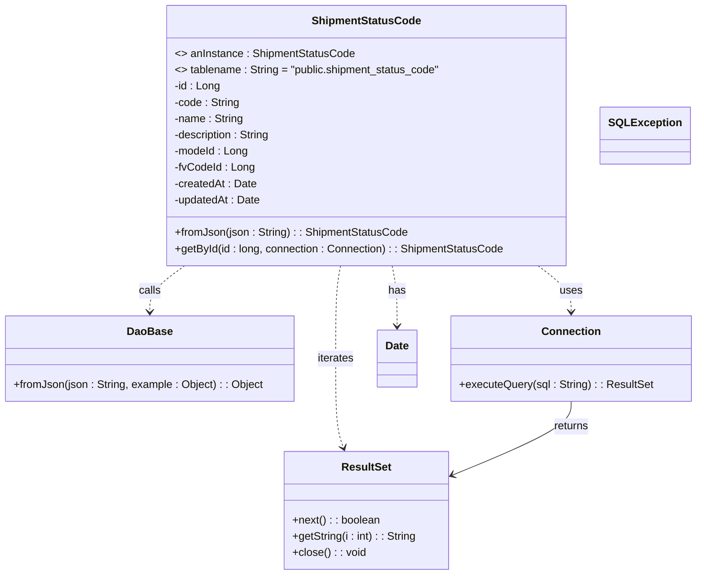
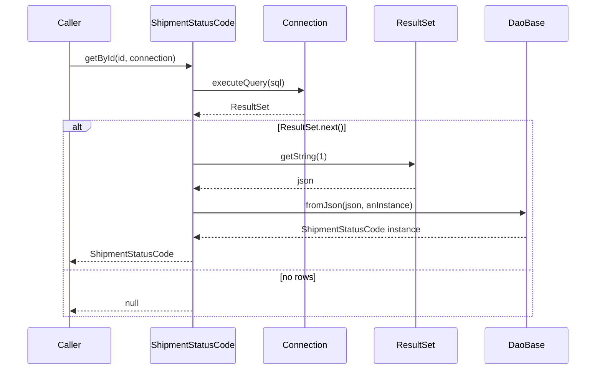

# Diagram: platform-java-lambdas/shipment/src/main/java/com/freightverify/shipment/datastore/postgresql/dao/ShipmentStatusCode.java

> Auto-generated by Obscura crawlers

## Diagram 1

### SVG

<svg id="container" width="1019.234375" xmlns="http://www.w3.org/2000/svg" class="classDiagram" height="848" viewBox="0 0 1019.234375 848" role="graphics-document document" aria-roledescription="class"><g><defs><marker id="container_class-aggregationStart" class="marker aggregation class" refX="18" refY="7" markerWidth="190" markerHeight="240" orient="auto"><path d="M 18,7 L9,13 L1,7 L9,1 Z"></path></marker></defs><defs><marker id="container_class-aggregationEnd" class="marker aggregation class" refX="1" refY="7" markerWidth="20" markerHeight="28" orient="auto"><path d="M 18,7 L9,13 L1,7 L9,1 Z"></path></marker></defs><defs><marker id="container_class-extensionStart" class="marker extension class" refX="18" refY="7" markerWidth="190" markerHeight="240" orient="auto"><path d="M 1,7 L18,13 V 1 Z"></path></marker></defs><defs><marker id="container_class-extensionEnd" class="marker extension class" refX="1" refY="7" markerWidth="20" markerHeight="28" orient="auto"><path d="M 1,1 V 13 L18,7 Z"></path></marker></defs><defs><marker id="container_class-compositionStart" class="marker composition class" refX="18" refY="7" markerWidth="190" markerHeight="240" orient="auto"><path d="M 18,7 L9,13 L1,7 L9,1 Z"></path></marker></defs><defs><marker id="container_class-compositionEnd" class="marker composition class" refX="1" refY="7" markerWidth="20" markerHeight="28" orient="auto"><path d="M 18,7 L9,13 L1,7 L9,1 Z"></path></marker></defs><defs><marker id="container_class-dependencyStart" class="marker dependency class" refX="6" refY="7" markerWidth="190" markerHeight="240" orient="auto"><path d="M 5,7 L9,13 L1,7 L9,1 Z"></path></marker></defs><defs><marker id="container_class-dependencyEnd" class="marker dependency class" refX="13" refY="7" markerWidth="20" markerHeight="28" orient="auto"><path d="M 18,7 L9,13 L14,7 L9,1 Z"></path></marker></defs><defs><marker id="container_class-lollipopStart" class="marker lollipop class" refX="13" refY="7" markerWidth="190" markerHeight="240" orient="auto"><circle stroke="black" fill="transparent" cx="7" cy="7" r="6"></circle></marker></defs><defs><marker id="container_class-lollipopEnd" class="marker lollipop class" refX="1" refY="7" markerWidth="190" markerHeight="240" orient="auto"><circle stroke="black" fill="transparent" cx="7" cy="7" r="6"></circle></marker></defs><g class="root"><g class="clusters"></g><g class="edgePaths"><path d="M270.555,392L261.964,398.167C253.372,404.333,236.188,416.667,227.596,428C219.004,439.333,219.004,449.667,219.004,454.833L219.004,460" id="id_ShipmentStatusCode_DaoBase_1" class="edge-thickness-normal edge-pattern-dashed relation" style=";;;" data-edge="true" data-et="edge" data-id="id_ShipmentStatusCode_DaoBase_1" data-points="W3sieCI6MjcwLjU1NTQ4OTIxOTQzMjMzLCJ5IjozOTJ9LHsieCI6MjE5LjAwMzkwNjI1LCJ5Ijo0Mjl9LHsieCI6MjE5LjAwMzkwNjI1LCJ5Ijo0NjZ9XQ==" marker-end="url(#container_class-dependencyEnd)"></path><path d="M788.625,392L796.673,398.167C804.72,404.333,820.815,416.667,828.863,428C836.91,439.333,836.91,449.667,836.91,454.833L836.91,460" id="id_ShipmentStatusCode_Connection_2" class="edge-thickness-normal edge-pattern-dashed relation" style=";;;" data-edge="true" data-et="edge" data-id="id_ShipmentStatusCode_Connection_2" data-points="W3sieCI6Nzg4LjYyNTM1ODIxNTA2NTUsInkiOjM5Mn0seyJ4Ijo4MzYuOTEwMTU2MjUsInkiOjQyOX0seyJ4Ijo4MzYuOTEwMTU2MjUsInkiOjQ2Nn1d" marker-end="url(#container_class-dependencyEnd)"></path><path d="M499.797,392L498.568,398.167C497.338,404.333,494.88,416.667,493.651,439.5C492.422,462.333,492.422,495.667,492.422,529C492.422,562.333,492.422,595.667,494.346,617.562C496.271,639.456,500.12,649.913,502.044,655.141L503.969,660.369" id="id_ShipmentStatusCode_ResultSet_3" class="edge-thickness-normal edge-pattern-dashed relation" style=";;;" data-edge="true" data-et="edge" data-id="id_ShipmentStatusCode_ResultSet_3" data-points="W3sieCI6NDk5Ljc5Njc1NTU5NDk3ODE1LCJ5IjozOTJ9LHsieCI6NDkyLjQyMTg3NSwieSI6NDI5fSx7IngiOjQ5Mi40MjE4NzUsInkiOjUyOX0seyJ4Ijo0OTIuNDIxODc1LCJ5Ijo2Mjl9LHsieCI6NTA2LjA0MTYxNDE2MzMwNjQ2LCJ5Ijo2NjZ9XQ==" marker-end="url(#container_class-dependencyEnd)"></path><path d="M576.336,392L577.565,398.167C578.794,404.333,581.253,416.667,582.482,431.5C583.711,446.333,583.711,463.667,583.711,472.333L583.711,481" id="id_ShipmentStatusCode_Date_4" class="edge-thickness-normal edge-pattern-dashed relation" style=";;;" data-edge="true" data-et="edge" data-id="id_ShipmentStatusCode_Date_4" data-points="W3sieCI6NTc2LjMzNjA1NjkwNTAyMTgsInkiOjM5Mn0seyJ4Ijo1ODMuNzEwOTM3NSwieSI6NDI5fSx7IngiOjU4My43MTA5Mzc1LCJ5Ijo0ODd9XQ==" marker-end="url(#container_class-dependencyEnd)"></path><path d="M836.91,592L836.91,598.167C836.91,604.333,836.91,616.667,808.26,634.721C779.609,652.776,722.308,676.552,693.657,688.44L665.007,700.328" id="id_Connection_ResultSet_5" class="edge-thickness-normal edge-pattern-solid relation" style=";;;" data-edge="true" data-et="edge" data-id="id_Connection_ResultSet_5" data-points="W3sieCI6ODM2LjkxMDE1NjI1LCJ5Ijo1OTJ9LHsieCI6ODM2LjkxMDE1NjI1LCJ5Ijo2Mjl9LHsieCI6NjU5LjQ2NDg0Mzc1LCJ5Ijo3MDIuNjI3ODM2NDUyOTk1OX1d" marker-end="url(#container_class-dependencyEnd)"></path></g><g class="edgeLabels"><g class="edgeLabel" transform="translate(219.00390625, 429)"><g class="label" data-id="id_ShipmentStatusCode_DaoBase_1" transform="translate(-16.4453125, -12)"><foreignObject width="32.890625" height="24">

calls

</foreignObject></g></g><g class="edgeLabel" transform="translate(836.91015625, 429)"><g class="label" data-id="id_ShipmentStatusCode_Connection_2" transform="translate(-16.4921875, -12)"><foreignObject width="32.984375" height="24">

uses

</foreignObject></g></g><g class="edgeLabel" transform="translate(492.421875, 529)"><g class="label" data-id="id_ShipmentStatusCode_ResultSet_3" transform="translate(-27.4140625, -12)"><foreignObject width="54.828125" height="24">

iterates

</foreignObject></g></g><g class="edgeLabel" transform="translate(583.7109375, 429)"><g class="label" data-id="id_ShipmentStatusCode_Date_4" transform="translate(-12.703125, -12)"><foreignObject width="25.40625" height="24">

has

</foreignObject></g></g><g class="edgeLabel" transform="translate(836.91015625, 629)"><g class="label" data-id="id_Connection_ResultSet_5" transform="translate(-26.265625, -12)"><foreignObject width="52.53125" height="24">

returns

</foreignObject></g></g></g><g class="nodes"><g class="node default" id="classId-ShipmentStatusCode-0" transform="translate(538.06640625, 200)"><g class="basic label-container"><path d="M-293.55078125 -192 L293.55078125 -192 L293.55078125 192 L-293.55078125 192" stroke="none" stroke-width="0" fill="#ECECFF" style=""></path><path d="M-293.55078125 -192 C-152.0646246970867 -192, -10.578468144173428 -192, 293.55078125 -192 M-293.55078125 -192 C-161.4062600852917 -192, -29.26173892058341 -192, 293.55078125 -192 M293.55078125 -192 C293.55078125 -111.11271026505717, 293.55078125 -30.22542053011435, 293.55078125 192 M293.55078125 -192 C293.55078125 -76.64633306654497, 293.55078125 38.70733386691006, 293.55078125 192 M293.55078125 192 C87.30851351678879 192, -118.93375421642241 192, -293.55078125 192 M293.55078125 192 C136.20772536029511 192, -21.13533052940977 192, -293.55078125 192 M-293.55078125 192 C-293.55078125 97.83851099047303, -293.55078125 3.6770219809460514, -293.55078125 -192 M-293.55078125 192 C-293.55078125 64.86145263029591, -293.55078125 -62.27709473940817, -293.55078125 -192" stroke="#9370DB" stroke-width="1.3" fill="none" stroke-dasharray="0 0" style=""></path></g><g class="annotation-group text" transform="translate(0, -168)"></g><g class="label-group text" transform="translate(-76.9140625, -168)"><g class="label" style="font-weight: bolder" transform="translate(0,-12)"><foreignObject width="153.828125" height="24">

ShipmentStatusCode

</foreignObject></g></g><g class="members-group text" transform="translate(-281.55078125, -120)"><g class="label" style="" transform="translate(0,-12)"><foreignObject width="263.625" height="24">

&lt;&gt; anInstance : ShipmentStatusCode

</foreignObject></g><g class="label" style="" transform="translate(0,12)"><foreignObject width="395.28125" height="24">

&lt;&gt; tablename : String = "public.shipment_status_code"

</foreignObject></g><g class="label" style="" transform="translate(0,36)"><foreignObject width="67.46875" height="24">

-id : Long

</foreignObject></g><g class="label" style="" transform="translate(0,60)"><foreignObject width="96.609375" height="24">

-code : String

</foreignObject></g><g class="label" style="" transform="translate(0,84)"><foreignObject width="102.171875" height="24">

-name : String

</foreignObject></g><g class="label" style="" transform="translate(0,108)"><foreignObject width="144.265625" height="24">

-description : String

</foreignObject></g><g class="label" style="" transform="translate(0,132)"><foreignObject width="109.015625" height="24">

-modeId : Long

</foreignObject></g><g class="label" style="" transform="translate(0,156)"><foreignObject width="116.9375" height="24">

-fvCodeId : Long

</foreignObject></g><g class="label" style="" transform="translate(0,180)"><foreignObject width="121.25" height="24">

-createdAt : Date

</foreignObject></g><g class="label" style="" transform="translate(0,204)"><foreignObject width="127.734375" height="24">

-updatedAt : Date

</foreignObject></g></g><g class="methods-group text" transform="translate(-281.55078125, 144)"><g class="label" style="" transform="translate(0,-12)"><foreignObject width="341.765625" height="24">

+fromJson(json : String) : : ShipmentStatusCode

</foreignObject></g><g class="label" style="" transform="translate(0,12)"><foreignObject width="486.1875" height="24">

+getById(id : long, connection : Connection) : : ShipmentStatusCode

</foreignObject></g></g><g class="divider" style=""><path d="M-293.55078125 -144 C-153.02540023551737 -144, -12.500019221034734 -144, 293.55078125 -144 M-293.55078125 -144 C-75.87913954231561 -144, 141.79250216536877 -144, 293.55078125 -144" stroke="#9370DB" stroke-width="1.3" fill="none" stroke-dasharray="0 0" style=""></path></g><g class="divider" style=""><path d="M-293.55078125 120 C-153.90986737738754 120, -14.268953504775084 120, 293.55078125 120 M-293.55078125 120 C-168.53917826101994 120, -43.52757527203988 120, 293.55078125 120" stroke="#9370DB" stroke-width="1.3" fill="none" stroke-dasharray="0 0" style=""></path></g></g><g class="node default" id="classId-DaoBase-1" transform="translate(219.00390625, 529)"><g class="basic label-container"><path d="M-211.00390625 -63 L211.00390625 -63 L211.00390625 63 L-211.00390625 63" stroke="none" stroke-width="0" fill="#ECECFF" style=""></path><path d="M-211.00390625 -63 C-57.96396453163544 -63, 95.07597718672912 -63, 211.00390625 -63 M-211.00390625 -63 C-51.039359503515925 -63, 108.92518724296815 -63, 211.00390625 -63 M211.00390625 -63 C211.00390625 -30.264972866333395, 211.00390625 2.470054267333211, 211.00390625 63 M211.00390625 -63 C211.00390625 -27.692107654674444, 211.00390625 7.615784690651111, 211.00390625 63 M211.00390625 63 C76.56669672670077 63, -57.87051279659846 63, -211.00390625 63 M211.00390625 63 C91.32120150864391 63, -28.36150323271218 63, -211.00390625 63 M-211.00390625 63 C-211.00390625 37.18922455727203, -211.00390625 11.378449114544061, -211.00390625 -63 M-211.00390625 63 C-211.00390625 25.72974130852306, -211.00390625 -11.54051738295388, -211.00390625 -63" stroke="#9370DB" stroke-width="1.3" fill="none" stroke-dasharray="0 0" style=""></path></g><g class="annotation-group text" transform="translate(0, -39)"></g><g class="label-group text" transform="translate(-31.7109375, -39)"><g class="label" style="font-weight: bolder" transform="translate(0,-12)"><foreignObject width="63.421875" height="24">

DaoBase

</foreignObject></g></g><g class="members-group text" transform="translate(-199.00390625, 9)"></g><g class="methods-group text" transform="translate(-199.00390625, 39)"><g class="label" style="" transform="translate(0,-12)"><foreignObject width="366.296875" height="24">

+fromJson(json : String, example : Object) : : Object

</foreignObject></g></g><g class="divider" style=""><path d="M-211.00390625 -15 C-64.37961966320125 -15, 82.24466692359749 -15, 211.00390625 -15 M-211.00390625 -15 C-88.320337089492 -15, 34.363232071016 -15, 211.00390625 -15" stroke="#9370DB" stroke-width="1.3" fill="none" stroke-dasharray="0 0" style=""></path></g><g class="divider" style=""><path d="M-211.00390625 9 C-124.39315880278257 9, -37.78241135556513 9, 211.00390625 9 M-211.00390625 9 C-117.03120339870787 9, -23.058500547415747 9, 211.00390625 9" stroke="#9370DB" stroke-width="1.3" fill="none" stroke-dasharray="0 0" style=""></path></g></g><g class="node default" id="classId-Connection-2" transform="translate(836.91015625, 529)"><g class="basic label-container"><path d="M-174.32421875 -63 L174.32421875 -63 L174.32421875 63 L-174.32421875 63" stroke="none" stroke-width="0" fill="#ECECFF" style=""></path><path d="M-174.32421875 -63 C-86.37133948435142 -63, 1.5815397812971526 -63, 174.32421875 -63 M-174.32421875 -63 C-79.11091708795793 -63, 16.10238457408414 -63, 174.32421875 -63 M174.32421875 -63 C174.32421875 -28.690366662418164, 174.32421875 5.619266675163672, 174.32421875 63 M174.32421875 -63 C174.32421875 -33.036023419394624, 174.32421875 -3.072046838789248, 174.32421875 63 M174.32421875 63 C46.59928371844806 63, -81.12565131310387 63, -174.32421875 63 M174.32421875 63 C44.999528116211536 63, -84.32516251757693 63, -174.32421875 63 M-174.32421875 63 C-174.32421875 19.818483415217052, -174.32421875 -23.363033169565895, -174.32421875 -63 M-174.32421875 63 C-174.32421875 16.582847696401828, -174.32421875 -29.834304607196344, -174.32421875 -63" stroke="#9370DB" stroke-width="1.3" fill="none" stroke-dasharray="0 0" style=""></path></g><g class="annotation-group text" transform="translate(0, -39)"></g><g class="label-group text" transform="translate(-41.2265625, -39)"><g class="label" style="font-weight: bolder" transform="translate(0,-12)"><foreignObject width="82.453125" height="24">

Connection

</foreignObject></g></g><g class="members-group text" transform="translate(-162.32421875, 9)"></g><g class="methods-group text" transform="translate(-162.32421875, 39)"><g class="label" style="" transform="translate(0,-12)"><foreignObject width="283.421875" height="24">

+executeQuery(sql : String) : : ResultSet

</foreignObject></g></g><g class="divider" style=""><path d="M-174.32421875 -15 C-79.96971328270821 -15, 14.384792184583574 -15, 174.32421875 -15 M-174.32421875 -15 C-69.31257419535996 -15, 35.699070359280086 -15, 174.32421875 -15" stroke="#9370DB" stroke-width="1.3" fill="none" stroke-dasharray="0 0" style=""></path></g><g class="divider" style=""><path d="M-174.32421875 9 C-40.16629476581559 9, 93.99162921836881 9, 174.32421875 9 M-174.32421875 9 C-56.41436737821935 9, 61.495483993561294 9, 174.32421875 9" stroke="#9370DB" stroke-width="1.3" fill="none" stroke-dasharray="0 0" style=""></path></g></g><g class="node default" id="classId-ResultSet-3" transform="translate(538.06640625, 753)"><g class="basic label-container"><path d="M-121.3984375 -87 L121.3984375 -87 L121.3984375 87 L-121.3984375 87" stroke="none" stroke-width="0" fill="#ECECFF" style=""></path><path d="M-121.3984375 -87 C-38.25600814243447 -87, 44.886421215131065 -87, 121.3984375 -87 M-121.3984375 -87 C-44.61792757806923 -87, 32.162582343861544 -87, 121.3984375 -87 M121.3984375 -87 C121.3984375 -23.890563675675523, 121.3984375 39.218872648648954, 121.3984375 87 M121.3984375 -87 C121.3984375 -25.666251179750972, 121.3984375 35.667497640498055, 121.3984375 87 M121.3984375 87 C25.842690694373772 87, -69.71305611125246 87, -121.3984375 87 M121.3984375 87 C44.12655867083183 87, -33.14532015833635 87, -121.3984375 87 M-121.3984375 87 C-121.3984375 44.621839510617306, -121.3984375 2.2436790212346125, -121.3984375 -87 M-121.3984375 87 C-121.3984375 17.546149822357535, -121.3984375 -51.90770035528493, -121.3984375 -87" stroke="#9370DB" stroke-width="1.3" fill="none" stroke-dasharray="0 0" style=""></path></g><g class="annotation-group text" transform="translate(0, -63)"></g><g class="label-group text" transform="translate(-35.21875, -63)"><g class="label" style="font-weight: bolder" transform="translate(0,-12)"><foreignObject width="70.4375" height="24">

ResultSet

</foreignObject></g></g><g class="members-group text" transform="translate(-109.3984375, -15)"></g><g class="methods-group text" transform="translate(-109.3984375, 15)"><g class="label" style="" transform="translate(0,-12)"><foreignObject width="129.6875" height="24">

+next() : : boolean

</foreignObject></g><g class="label" style="" transform="translate(0,12)"><foreignObject width="183.578125" height="24">

+getString(i : int) : : String

</foreignObject></g><g class="label" style="" transform="translate(0,36)"><foreignObject width="107.78125" height="24">

+close() : : void

</foreignObject></g></g><g class="divider" style=""><path d="M-121.3984375 -39 C-41.679483846036405 -39, 38.03946980792719 -39, 121.3984375 -39 M-121.3984375 -39 C-39.09401164501632 -39, 43.210414209967354 -39, 121.3984375 -39" stroke="#9370DB" stroke-width="1.3" fill="none" stroke-dasharray="0 0" style=""></path></g><g class="divider" style=""><path d="M-121.3984375 -15 C-27.444613455903408 -15, 66.50921058819318 -15, 121.3984375 -15 M-121.3984375 -15 C-60.59486837705342 -15, 0.2087007458931538 -15, 121.3984375 -15" stroke="#9370DB" stroke-width="1.3" fill="none" stroke-dasharray="0 0" style=""></path></g></g><g class="node default" id="classId-Date-4" transform="translate(583.7109375, 529)"><g class="basic label-container"><path d="M-28.875 -42 L28.875 -42 L28.875 42 L-28.875 42" stroke="none" stroke-width="0" fill="#ECECFF" style=""></path><path d="M-28.875 -42 C-7.4749495708746885 -42, 13.925100858250623 -42, 28.875 -42 M-28.875 -42 C-8.263316525632113 -42, 12.348366948735773 -42, 28.875 -42 M28.875 -42 C28.875 -22.6221556719489, 28.875 -3.244311343897799, 28.875 42 M28.875 -42 C28.875 -24.07062792373845, 28.875 -6.141255847476899, 28.875 42 M28.875 42 C13.303833100195545 42, -2.2673337996089096 42, -28.875 42 M28.875 42 C9.914622632117098 42, -9.045754735765804 42, -28.875 42 M-28.875 42 C-28.875 19.76096046532331, -28.875 -2.4780790693533774, -28.875 -42 M-28.875 42 C-28.875 16.707953845806767, -28.875 -8.584092308386467, -28.875 -42" stroke="#9370DB" stroke-width="1.3" fill="none" stroke-dasharray="0 0" style=""></path></g><g class="annotation-group text" transform="translate(0, -18)"></g><g class="label-group text" transform="translate(-16.875, -18)"><g class="label" style="font-weight: bolder" transform="translate(0,-12)"><foreignObject width="33.75" height="24">

Date

</foreignObject></g></g><g class="members-group text" transform="translate(-16.875, 30)"></g><g class="methods-group text" transform="translate(-16.875, 60)"></g><g class="divider" style=""><path d="M-28.875 6 C-7.526836025959142 6, 13.821327948081716 6, 28.875 6 M-28.875 6 C-11.964510260330222 6, 4.945979479339556 6, 28.875 6" stroke="#9370DB" stroke-width="1.3" fill="none" stroke-dasharray="0 0" style=""></path></g><g class="divider" style=""><path d="M-28.875 24 C-17.29695397275606 24, -5.718907945512122 24, 28.875 24 M-28.875 24 C-10.414565959215906 24, 8.045868081568187 24, 28.875 24" stroke="#9370DB" stroke-width="1.3" fill="none" stroke-dasharray="0 0" style=""></path></g></g><g class="node default" id="classId-SQLException-5" transform="translate(943.515625, 200)"><g class="basic label-container"><path d="M-61.8984375 -42 L61.8984375 -42 L61.8984375 42 L-61.8984375 42" stroke="none" stroke-width="0" fill="#ECECFF" style=""></path><path d="M-61.8984375 -42 C-13.403920707896084 -42, 35.09059608420783 -42, 61.8984375 -42 M-61.8984375 -42 C-25.32450020912558 -42, 11.249437081748837 -42, 61.8984375 -42 M61.8984375 -42 C61.8984375 -20.89785015418687, 61.8984375 0.20429969162626094, 61.8984375 42 M61.8984375 -42 C61.8984375 -22.48041943336255, 61.8984375 -2.9608388667250978, 61.8984375 42 M61.8984375 42 C26.188436080353185 42, -9.52156533929363 42, -61.8984375 42 M61.8984375 42 C27.21561910483934 42, -7.467199290321318 42, -61.8984375 42 M-61.8984375 42 C-61.8984375 10.691314039733577, -61.8984375 -20.617371920532847, -61.8984375 -42 M-61.8984375 42 C-61.8984375 20.196962652637982, -61.8984375 -1.606074694724036, -61.8984375 -42" stroke="#9370DB" stroke-width="1.3" fill="none" stroke-dasharray="0 0" style=""></path></g><g class="annotation-group text" transform="translate(0, -18)"></g><g class="label-group text" transform="translate(-49.8984375, -18)"><g class="label" style="font-weight: bolder" transform="translate(0,-12)"><foreignObject width="99.796875" height="24">

SQLException

</foreignObject></g></g><g class="members-group text" transform="translate(-49.8984375, 30)"></g><g class="methods-group text" transform="translate(-49.8984375, 60)"></g><g class="divider" style=""><path d="M-61.8984375 6 C-13.552024554905806 6, 34.79438839018839 6, 61.8984375 6 M-61.8984375 6 C-36.776478609684524 6, -11.654519719369048 6, 61.8984375 6" stroke="#9370DB" stroke-width="1.3" fill="none" stroke-dasharray="0 0" style=""></path></g><g class="divider" style=""><path d="M-61.8984375 24 C-24.621912423933487 24, 12.654612652133025 24, 61.8984375 24 M-61.8984375 24 C-12.666939586566045 24, 36.56455832686791 24, 61.8984375 24" stroke="#9370DB" stroke-width="1.3" fill="none" stroke-dasharray="0 0" style=""></path></g></g></g></g></g></svg>

## Diagram 2

### SVG

<svg id="container" width="1099" xmlns="http://www.w3.org/2000/svg" height="703" viewBox="-50 -10 1099 703" role="graphics-document document" aria-roledescription="sequence"><g><rect x="849" y="617" fill="#eaeaea" stroke="#666" width="150" height="65" name="DaoBase" rx="3" ry="3" class="actor actor-bottom"></rect><text x="924" y="649.5" dominant-baseline="central" alignment-baseline="central" class="actor actor-box" style="text-anchor: middle; font-size: 16px; font-weight: 400;"><tspan x="924" dy="0">DaoBase</tspan></text></g><g><rect x="649" y="617" fill="#eaeaea" stroke="#666" width="150" height="65" name="ResultSet" rx="3" ry="3" class="actor actor-bottom"></rect><text x="724" y="649.5" dominant-baseline="central" alignment-baseline="central" class="actor actor-box" style="text-anchor: middle; font-size: 16px; font-weight: 400;"><tspan x="724" dy="0">ResultSet</tspan></text></g><g><rect x="449" y="617" fill="#eaeaea" stroke="#666" width="150" height="65" name="Connection" rx="3" ry="3" class="actor actor-bottom"></rect><text x="524" y="649.5" dominant-baseline="central" alignment-baseline="central" class="actor actor-box" style="text-anchor: middle; font-size: 16px; font-weight: 400;"><tspan x="524" dy="0">Connection</tspan></text></g><g><rect x="227" y="617" fill="#eaeaea" stroke="#666" width="172" height="65" name="ShipmentStatusCode" rx="3" ry="3" class="actor actor-bottom"></rect><text x="313" y="649.5" dominant-baseline="central" alignment-baseline="central" class="actor actor-box" style="text-anchor: middle; font-size: 16px; font-weight: 400;"><tspan x="313" dy="0">ShipmentStatusCode</tspan></text></g><g><rect x="0" y="617" fill="#eaeaea" stroke="#666" width="150" height="65" name="Caller" rx="3" ry="3" class="actor actor-bottom"></rect><text x="75" y="649.5" dominant-baseline="central" alignment-baseline="central" class="actor actor-box" style="text-anchor: middle; font-size: 16px; font-weight: 400;"><tspan x="75" dy="0">Caller</tspan></text></g><g><line id="actor4" x1="924" y1="65" x2="924" y2="617" class="actor-line 200" stroke-width="0.5px" stroke="#999" name="DaoBase"></line><g id="root-4"><rect x="849" y="0" fill="#eaeaea" stroke="#666" width="150" height="65" name="DaoBase" rx="3" ry="3" class="actor actor-top"></rect><text x="924" y="32.5" dominant-baseline="central" alignment-baseline="central" class="actor actor-box" style="text-anchor: middle; font-size: 16px; font-weight: 400;"><tspan x="924" dy="0">DaoBase</tspan></text></g></g><g><line id="actor3" x1="724" y1="65" x2="724" y2="617" class="actor-line 200" stroke-width="0.5px" stroke="#999" name="ResultSet"></line><g id="root-3"><rect x="649" y="0" fill="#eaeaea" stroke="#666" width="150" height="65" name="ResultSet" rx="3" ry="3" class="actor actor-top"></rect><text x="724" y="32.5" dominant-baseline="central" alignment-baseline="central" class="actor actor-box" style="text-anchor: middle; font-size: 16px; font-weight: 400;"><tspan x="724" dy="0">ResultSet</tspan></text></g></g><g><line id="actor2" x1="524" y1="65" x2="524" y2="617" class="actor-line 200" stroke-width="0.5px" stroke="#999" name="Connection"></line><g id="root-2"><rect x="449" y="0" fill="#eaeaea" stroke="#666" width="150" height="65" name="Connection" rx="3" ry="3" class="actor actor-top"></rect><text x="524" y="32.5" dominant-baseline="central" alignment-baseline="central" class="actor actor-box" style="text-anchor: middle; font-size: 16px; font-weight: 400;"><tspan x="524" dy="0">Connection</tspan></text></g></g><g><line id="actor1" x1="313" y1="65" x2="313" y2="617" class="actor-line 200" stroke-width="0.5px" stroke="#999" name="ShipmentStatusCode"></line><g id="root-1"><rect x="227" y="0" fill="#eaeaea" stroke="#666" width="172" height="65" name="ShipmentStatusCode" rx="3" ry="3" class="actor actor-top"></rect><text x="313" y="32.5" dominant-baseline="central" alignment-baseline="central" class="actor actor-box" style="text-anchor: middle; font-size: 16px; font-weight: 400;"><tspan x="313" dy="0">ShipmentStatusCode</tspan></text></g></g><g><line id="actor0" x1="75" y1="65" x2="75" y2="617" class="actor-line 200" stroke-width="0.5px" stroke="#999" name="Caller"></line><g id="root-0"><rect x="0" y="0" fill="#eaeaea" stroke="#666" width="150" height="65" name="Caller" rx="3" ry="3" class="actor actor-top"></rect><text x="75" y="32.5" dominant-baseline="central" alignment-baseline="central" class="actor actor-box" style="text-anchor: middle; font-size: 16px; font-weight: 400;"><tspan x="75" dy="0">Caller</tspan></text></g></g><g></g><defs><symbol id="computer" width="24" height="24"><path transform="scale(.5)" d="M2 2v13h20v-13h-20zm18 11h-16v-9h16v9zm-10.228 6l.466-1h3.524l.467 1h-4.457zm14.228 3h-24l2-6h2.104l-1.33 4h18.45l-1.297-4h2.073l2 6zm-5-10h-14v-7h14v7z"></path></symbol></defs><defs><symbol id="database" fill-rule="evenodd" clip-rule="evenodd"><path transform="scale(.5)" d="M12.258.001l.256.004.255.005.253.008.251.01.249.012.247.015.246.016.242.019.241.02.239.023.236.024.233.027.231.028.229.031.225.032.223.034.22.036.217.038.214.04.211.041.208.043.205.045.201.046.198.048.194.05.191.051.187.053.183.054.18.056.175.057.172.059.168.06.163.061.16.063.155.064.15.066.074.033.073.033.071.034.07.034.069.035.068.035.067.035.066.035.064.036.064.036.062.036.06.036.06.037.058.037.058.037.055.038.055.038.053.038.052.038.051.039.05.039.048.039.047.039.045.04.044.04.043.04.041.04.04.041.039.041.037.041.036.041.034.041.033.042.032.042.03.042.029.042.027.042.026.043.024.043.023.043.021.043.02.043.018.044.017.043.015.044.013.044.012.044.011.045.009.044.007.045.006.045.004.045.002.045.001.045v17l-.001.045-.002.045-.004.045-.006.045-.007.045-.009.044-.011.045-.012.044-.013.044-.015.044-.017.043-.018.044-.02.043-.021.043-.023.043-.024.043-.026.043-.027.042-.029.042-.03.042-.032.042-.033.042-.034.041-.036.041-.037.041-.039.041-.04.041-.041.04-.043.04-.044.04-.045.04-.047.039-.048.039-.05.039-.051.039-.052.038-.053.038-.055.038-.055.038-.058.037-.058.037-.06.037-.06.036-.062.036-.064.036-.064.036-.066.035-.067.035-.068.035-.069.035-.07.034-.071.034-.073.033-.074.033-.15.066-.155.064-.16.063-.163.061-.168.06-.172.059-.175.057-.18.056-.183.054-.187.053-.191.051-.194.05-.198.048-.201.046-.205.045-.208.043-.211.041-.214.04-.217.038-.22.036-.223.034-.225.032-.229.031-.231.028-.233.027-.236.024-.239.023-.241.02-.242.019-.246.016-.247.015-.249.012-.251.01-.253.008-.255.005-.256.004-.258.001-.258-.001-.256-.004-.255-.005-.253-.008-.251-.01-.249-.012-.247-.015-.245-.016-.243-.019-.241-.02-.238-.023-.236-.024-.234-.027-.231-.028-.228-.031-.226-.032-.223-.034-.22-.036-.217-.038-.214-.04-.211-.041-.208-.043-.204-.045-.201-.046-.198-.048-.195-.05-.19-.051-.187-.053-.184-.054-.179-.056-.176-.057-.172-.059-.167-.06-.164-.061-.159-.063-.155-.064-.151-.066-.074-.033-.072-.033-.072-.034-.07-.034-.069-.035-.068-.035-.067-.035-.066-.035-.064-.036-.063-.036-.062-.036-.061-.036-.06-.037-.058-.037-.057-.037-.056-.038-.055-.038-.053-.038-.052-.038-.051-.039-.049-.039-.049-.039-.046-.039-.046-.04-.044-.04-.043-.04-.041-.04-.04-.041-.039-.041-.037-.041-.036-.041-.034-.041-.033-.042-.032-.042-.03-.042-.029-.042-.027-.042-.026-.043-.024-.043-.023-.043-.021-.043-.02-.043-.018-.044-.017-.043-.015-.044-.013-.044-.012-.044-.011-.045-.009-.044-.007-.045-.006-.045-.004-.045-.002-.045-.001-.045v-17l.001-.045.002-.045.004-.045.006-.045.007-.045.009-.044.011-.045.012-.044.013-.044.015-.044.017-.043.018-.044.02-.043.021-.043.023-.043.024-.043.026-.043.027-.042.029-.042.03-.042.032-.042.033-.042.034-.041.036-.041.037-.041.039-.041.04-.041.041-.04.043-.04.044-.04.046-.04.046-.039.049-.039.049-.039.051-.039.052-.038.053-.038.055-.038.056-.038.057-.037.058-.037.06-.037.061-.036.062-.036.063-.036.064-.036.066-.035.067-.035.068-.035.069-.035.07-.034.072-.034.072-.033.074-.033.151-.066.155-.064.159-.063.164-.061.167-.06.172-.059.176-.057.179-.056.184-.054.187-.053.19-.051.195-.05.198-.048.201-.046.204-.045.208-.043.211-.041.214-.04.217-.038.22-.036.223-.034.226-.032.228-.031.231-.028.234-.027.236-.024.238-.023.241-.02.243-.019.245-.016.247-.015.249-.012.251-.01.253-.008.255-.005.256-.004.258-.001.258.001zm-9.258 20.499v.01l.001.021.003.021.004.022.005.021.006.022.007.022.009.023.01.022.011.023.012.023.013.023.015.023.016.024.017.023.018.024.019.024.021.024.022.025.023.024.024.025.052.049.056.05.061.051.066.051.07.051.075.051.079.052.084.052.088.052.092.052.097.052.102.051.105.052.11.052.114.051.119.051.123.051.127.05.131.05.135.05.139.048.144.049.147.047.152.047.155.047.16.045.163.045.167.043.171.043.176.041.178.041.183.039.187.039.19.037.194.035.197.035.202.033.204.031.209.03.212.029.216.027.219.025.222.024.226.021.23.02.233.018.236.016.24.015.243.012.246.01.249.008.253.005.256.004.259.001.26-.001.257-.004.254-.005.25-.008.247-.011.244-.012.241-.014.237-.016.233-.018.231-.021.226-.021.224-.024.22-.026.216-.027.212-.028.21-.031.205-.031.202-.034.198-.034.194-.036.191-.037.187-.039.183-.04.179-.04.175-.042.172-.043.168-.044.163-.045.16-.046.155-.046.152-.047.148-.048.143-.049.139-.049.136-.05.131-.05.126-.05.123-.051.118-.052.114-.051.11-.052.106-.052.101-.052.096-.052.092-.052.088-.053.083-.051.079-.052.074-.052.07-.051.065-.051.06-.051.056-.05.051-.05.023-.024.023-.025.021-.024.02-.024.019-.024.018-.024.017-.024.015-.023.014-.024.013-.023.012-.023.01-.023.01-.022.008-.022.006-.022.006-.022.004-.022.004-.021.001-.021.001-.021v-4.127l-.077.055-.08.053-.083.054-.085.053-.087.052-.09.052-.093.051-.095.05-.097.05-.1.049-.102.049-.105.048-.106.047-.109.047-.111.046-.114.045-.115.045-.118.044-.12.043-.122.042-.124.042-.126.041-.128.04-.13.04-.132.038-.134.038-.135.037-.138.037-.139.035-.142.035-.143.034-.144.033-.147.032-.148.031-.15.03-.151.03-.153.029-.154.027-.156.027-.158.026-.159.025-.161.024-.162.023-.163.022-.165.021-.166.02-.167.019-.169.018-.169.017-.171.016-.173.015-.173.014-.175.013-.175.012-.177.011-.178.01-.179.008-.179.008-.181.006-.182.005-.182.004-.184.003-.184.002h-.37l-.184-.002-.184-.003-.182-.004-.182-.005-.181-.006-.179-.008-.179-.008-.178-.01-.176-.011-.176-.012-.175-.013-.173-.014-.172-.015-.171-.016-.17-.017-.169-.018-.167-.019-.166-.02-.165-.021-.163-.022-.162-.023-.161-.024-.159-.025-.157-.026-.156-.027-.155-.027-.153-.029-.151-.03-.15-.03-.148-.031-.146-.032-.145-.033-.143-.034-.141-.035-.14-.035-.137-.037-.136-.037-.134-.038-.132-.038-.13-.04-.128-.04-.126-.041-.124-.042-.122-.042-.12-.044-.117-.043-.116-.045-.113-.045-.112-.046-.109-.047-.106-.047-.105-.048-.102-.049-.1-.049-.097-.05-.095-.05-.093-.052-.09-.051-.087-.052-.085-.053-.083-.054-.08-.054-.077-.054v4.127zm0-5.654v.011l.001.021.003.021.004.021.005.022.006.022.007.022.009.022.01.022.011.023.012.023.013.023.015.024.016.023.017.024.018.024.019.024.021.024.022.024.023.025.024.024.052.05.056.05.061.05.066.051.07.051.075.052.079.051.084.052.088.052.092.052.097.052.102.052.105.052.11.051.114.051.119.052.123.05.127.051.131.05.135.049.139.049.144.048.147.048.152.047.155.046.16.045.163.045.167.044.171.042.176.042.178.04.183.04.187.038.19.037.194.036.197.034.202.033.204.032.209.03.212.028.216.027.219.025.222.024.226.022.23.02.233.018.236.016.24.014.243.012.246.01.249.008.253.006.256.003.259.001.26-.001.257-.003.254-.006.25-.008.247-.01.244-.012.241-.015.237-.016.233-.018.231-.02.226-.022.224-.024.22-.025.216-.027.212-.029.21-.03.205-.032.202-.033.198-.035.194-.036.191-.037.187-.039.183-.039.179-.041.175-.042.172-.043.168-.044.163-.045.16-.045.155-.047.152-.047.148-.048.143-.048.139-.05.136-.049.131-.05.126-.051.123-.051.118-.051.114-.052.11-.052.106-.052.101-.052.096-.052.092-.052.088-.052.083-.052.079-.052.074-.051.07-.052.065-.051.06-.05.056-.051.051-.049.023-.025.023-.024.021-.025.02-.024.019-.024.018-.024.017-.024.015-.023.014-.023.013-.024.012-.022.01-.023.01-.023.008-.022.006-.022.006-.022.004-.021.004-.022.001-.021.001-.021v-4.139l-.077.054-.08.054-.083.054-.085.052-.087.053-.09.051-.093.051-.095.051-.097.05-.1.049-.102.049-.105.048-.106.047-.109.047-.111.046-.114.045-.115.044-.118.044-.12.044-.122.042-.124.042-.126.041-.128.04-.13.039-.132.039-.134.038-.135.037-.138.036-.139.036-.142.035-.143.033-.144.033-.147.033-.148.031-.15.03-.151.03-.153.028-.154.028-.156.027-.158.026-.159.025-.161.024-.162.023-.163.022-.165.021-.166.02-.167.019-.169.018-.169.017-.171.016-.173.015-.173.014-.175.013-.175.012-.177.011-.178.009-.179.009-.179.007-.181.007-.182.005-.182.004-.184.003-.184.002h-.37l-.184-.002-.184-.003-.182-.004-.182-.005-.181-.007-.179-.007-.179-.009-.178-.009-.176-.011-.176-.012-.175-.013-.173-.014-.172-.015-.171-.016-.17-.017-.169-.018-.167-.019-.166-.02-.165-.021-.163-.022-.162-.023-.161-.024-.159-.025-.157-.026-.156-.027-.155-.028-.153-.028-.151-.03-.15-.03-.148-.031-.146-.033-.145-.033-.143-.033-.141-.035-.14-.036-.137-.036-.136-.037-.134-.038-.132-.039-.13-.039-.128-.04-.126-.041-.124-.042-.122-.043-.12-.043-.117-.044-.116-.044-.113-.046-.112-.046-.109-.046-.106-.047-.105-.048-.102-.049-.1-.049-.097-.05-.095-.051-.093-.051-.09-.051-.087-.053-.085-.052-.083-.054-.08-.054-.077-.054v4.139zm0-5.666v.011l.001.02.003.022.004.021.005.022.006.021.007.022.009.023.01.022.011.023.012.023.013.023.015.023.016.024.017.024.018.023.019.024.021.025.022.024.023.024.024.025.052.05.056.05.061.05.066.051.07.051.075.052.079.051.084.052.088.052.092.052.097.052.102.052.105.051.11.052.114.051.119.051.123.051.127.05.131.05.135.05.139.049.144.048.147.048.152.047.155.046.16.045.163.045.167.043.171.043.176.042.178.04.183.04.187.038.19.037.194.036.197.034.202.033.204.032.209.03.212.028.216.027.219.025.222.024.226.021.23.02.233.018.236.017.24.014.243.012.246.01.249.008.253.006.256.003.259.001.26-.001.257-.003.254-.006.25-.008.247-.01.244-.013.241-.014.237-.016.233-.018.231-.02.226-.022.224-.024.22-.025.216-.027.212-.029.21-.03.205-.032.202-.033.198-.035.194-.036.191-.037.187-.039.183-.039.179-.041.175-.042.172-.043.168-.044.163-.045.16-.045.155-.047.152-.047.148-.048.143-.049.139-.049.136-.049.131-.051.126-.05.123-.051.118-.052.114-.051.11-.052.106-.052.101-.052.096-.052.092-.052.088-.052.083-.052.079-.052.074-.052.07-.051.065-.051.06-.051.056-.05.051-.049.023-.025.023-.025.021-.024.02-.024.019-.024.018-.024.017-.024.015-.023.014-.024.013-.023.012-.023.01-.022.01-.023.008-.022.006-.022.006-.022.004-.022.004-.021.001-.021.001-.021v-4.153l-.077.054-.08.054-.083.053-.085.053-.087.053-.09.051-.093.051-.095.051-.097.05-.1.049-.102.048-.105.048-.106.048-.109.046-.111.046-.114.046-.115.044-.118.044-.12.043-.122.043-.124.042-.126.041-.128.04-.13.039-.132.039-.134.038-.135.037-.138.036-.139.036-.142.034-.143.034-.144.033-.147.032-.148.032-.15.03-.151.03-.153.028-.154.028-.156.027-.158.026-.159.024-.161.024-.162.023-.163.023-.165.021-.166.02-.167.019-.169.018-.169.017-.171.016-.173.015-.173.014-.175.013-.175.012-.177.01-.178.01-.179.009-.179.007-.181.006-.182.006-.182.004-.184.003-.184.001-.185.001-.185-.001-.184-.001-.184-.003-.182-.004-.182-.006-.181-.006-.179-.007-.179-.009-.178-.01-.176-.01-.176-.012-.175-.013-.173-.014-.172-.015-.171-.016-.17-.017-.169-.018-.167-.019-.166-.02-.165-.021-.163-.023-.162-.023-.161-.024-.159-.024-.157-.026-.156-.027-.155-.028-.153-.028-.151-.03-.15-.03-.148-.032-.146-.032-.145-.033-.143-.034-.141-.034-.14-.036-.137-.036-.136-.037-.134-.038-.132-.039-.13-.039-.128-.041-.126-.041-.124-.041-.122-.043-.12-.043-.117-.044-.116-.044-.113-.046-.112-.046-.109-.046-.106-.048-.105-.048-.102-.048-.1-.05-.097-.049-.095-.051-.093-.051-.09-.052-.087-.052-.085-.053-.083-.053-.08-.054-.077-.054v4.153zm8.74-8.179l-.257.004-.254.005-.25.008-.247.011-.244.012-.241.014-.237.016-.233.018-.231.021-.226.022-.224.023-.22.026-.216.027-.212.028-.21.031-.205.032-.202.033-.198.034-.194.036-.191.038-.187.038-.183.04-.179.041-.175.042-.172.043-.168.043-.163.045-.16.046-.155.046-.152.048-.148.048-.143.048-.139.049-.136.05-.131.05-.126.051-.123.051-.118.051-.114.052-.11.052-.106.052-.101.052-.096.052-.092.052-.088.052-.083.052-.079.052-.074.051-.07.052-.065.051-.06.05-.056.05-.051.05-.023.025-.023.024-.021.024-.02.025-.019.024-.018.024-.017.023-.015.024-.014.023-.013.023-.012.023-.01.023-.01.022-.008.022-.006.023-.006.021-.004.022-.004.021-.001.021-.001.021.001.021.001.021.004.021.004.022.006.021.006.023.008.022.01.022.01.023.012.023.013.023.014.023.015.024.017.023.018.024.019.024.02.025.021.024.023.024.023.025.051.05.056.05.06.05.065.051.07.052.074.051.079.052.083.052.088.052.092.052.096.052.101.052.106.052.11.052.114.052.118.051.123.051.126.051.131.05.136.05.139.049.143.048.148.048.152.048.155.046.16.046.163.045.168.043.172.043.175.042.179.041.183.04.187.038.191.038.194.036.198.034.202.033.205.032.21.031.212.028.216.027.22.026.224.023.226.022.231.021.233.018.237.016.241.014.244.012.247.011.25.008.254.005.257.004.26.001.26-.001.257-.004.254-.005.25-.008.247-.011.244-.012.241-.014.237-.016.233-.018.231-.021.226-.022.224-.023.22-.026.216-.027.212-.028.21-.031.205-.032.202-.033.198-.034.194-.036.191-.038.187-.038.183-.04.179-.041.175-.042.172-.043.168-.043.163-.045.16-.046.155-.046.152-.048.148-.048.143-.048.139-.049.136-.05.131-.05.126-.051.123-.051.118-.051.114-.052.11-.052.106-.052.101-.052.096-.052.092-.052.088-.052.083-.052.079-.052.074-.051.07-.052.065-.051.06-.05.056-.05.051-.05.023-.025.023-.024.021-.024.02-.025.019-.024.018-.024.017-.023.015-.024.014-.023.013-.023.012-.023.01-.023.01-.022.008-.022.006-.023.006-.021.004-.022.004-.021.001-.021.001-.021-.001-.021-.001-.021-.004-.021-.004-.022-.006-.021-.006-.023-.008-.022-.01-.022-.01-.023-.012-.023-.013-.023-.014-.023-.015-.024-.017-.023-.018-.024-.019-.024-.02-.025-.021-.024-.023-.024-.023-.025-.051-.05-.056-.05-.06-.05-.065-.051-.07-.052-.074-.051-.079-.052-.083-.052-.088-.052-.092-.052-.096-.052-.101-.052-.106-.052-.11-.052-.114-.052-.118-.051-.123-.051-.126-.051-.131-.05-.136-.05-.139-.049-.143-.048-.148-.048-.152-.048-.155-.046-.16-.046-.163-.045-.168-.043-.172-.043-.175-.042-.179-.041-.183-.04-.187-.038-.191-.038-.194-.036-.198-.034-.202-.033-.205-.032-.21-.031-.212-.028-.216-.027-.22-.026-.224-.023-.226-.022-.231-.021-.233-.018-.237-.016-.241-.014-.244-.012-.247-.011-.25-.008-.254-.005-.257-.004-.26-.001-.26.001z"></path></symbol></defs><defs><symbol id="clock" width="24" height="24"><path transform="scale(.5)" d="M12 2c5.514 0 10 4.486 10 10s-4.486 10-10 10-10-4.486-10-10 4.486-10 10-10zm0-2c-6.627 0-12 5.373-12 12s5.373 12 12 12 12-5.373 12-12-5.373-12-12-12zm5.848 12.459c.202.038.202.333.001.372-1.907.361-6.045 1.111-6.547 1.111-.719 0-1.301-.582-1.301-1.301 0-.512.77-5.447 1.125-7.445.034-.192.312-.181.343.014l.985 6.238 5.394 1.011z"></path></symbol></defs><defs><marker id="arrowhead" refX="7.9" refY="5" markerUnits="userSpaceOnUse" markerWidth="12" markerHeight="12" orient="auto-start-reverse"><path d="M -1 0 L 10 5 L 0 10 z"></path></marker></defs><defs><marker id="crosshead" markerWidth="15" markerHeight="8" orient="auto" refX="4" refY="4.5"><path fill="none" stroke="#000000" stroke-width="1pt" d="M 1,2 L 6,7 M 6,2 L 1,7" style="stroke-dasharray: 0, 0;"></path></marker></defs><defs><marker id="filled-head" refX="15.5" refY="7" markerWidth="20" markerHeight="28" orient="auto"><path d="M 18,7 L9,13 L14,7 L9,1 Z"></path></marker></defs><defs><marker id="sequencenumber" refX="15" refY="15" markerWidth="60" markerHeight="40" orient="auto"><circle cx="15" cy="15" r="6"></circle></marker></defs><g><line x1="64" y1="219" x2="935" y2="219" class="loopLine"></line><line x1="935" y1="219" x2="935" y2="597" class="loopLine"></line><line x1="64" y1="597" x2="935" y2="597" class="loopLine"></line><line x1="64" y1="219" x2="64" y2="597" class="loopLine"></line><line x1="64" y1="509" x2="935" y2="509" class="loopLine" style="stroke-dasharray: 3, 3;"></line><polygon points="64,219 114,219 114,232 105.6,239 64,239" class="labelBox"></polygon><text x="89" y="232" text-anchor="middle" dominant-baseline="middle" alignment-baseline="middle" class="labelText" style="font-size: 16px; font-weight: 400;">alt</text><text x="524.5" y="237" text-anchor="middle" class="loopText" style="font-size: 16px; font-weight: 400;"><tspan x="524.5">[ResultSet.next()]</tspan></text><text x="499.5" y="527" text-anchor="middle" class="loopText" style="font-size: 16px; font-weight: 400;">[no rows]</text></g><text x="193" y="80" text-anchor="middle" dominant-baseline="middle" alignment-baseline="middle" class="messageText" dy="1em" style="font-size: 16px; font-weight: 400;">getById(id, connection)</text><line x1="76" y1="113" x2="309" y2="113" class="messageLine0" stroke-width="2" stroke="none" marker-end="url(#arrowhead)" style="fill: none;"></line><text x="417" y="128" text-anchor="middle" dominant-baseline="middle" alignment-baseline="middle" class="messageText" dy="1em" style="font-size: 16px; font-weight: 400;">executeQuery(sql)</text><line x1="314" y1="161" x2="520" y2="161" class="messageLine0" stroke-width="2" stroke="none" marker-end="url(#arrowhead)" style="fill: none;"></line><text x="420" y="176" text-anchor="middle" dominant-baseline="middle" alignment-baseline="middle" class="messageText" dy="1em" style="font-size: 16px; font-weight: 400;">ResultSet</text><line x1="523" y1="209" x2="317" y2="209" class="messageLine1" stroke-width="2" stroke="none" marker-end="url(#arrowhead)" style="stroke-dasharray: 3, 3; fill: none;"></line><text x="517" y="269" text-anchor="middle" dominant-baseline="middle" alignment-baseline="middle" class="messageText" dy="1em" style="font-size: 16px; font-weight: 400;">getString(1)</text><line x1="314" y1="302" x2="720" y2="302" class="messageLine0" stroke-width="2" stroke="none" marker-end="url(#arrowhead)" style="fill: none;"></line><text x="520" y="317" text-anchor="middle" dominant-baseline="middle" alignment-baseline="middle" class="messageText" dy="1em" style="font-size: 16px; font-weight: 400;">json</text><line x1="723" y1="350" x2="317" y2="350" class="messageLine1" stroke-width="2" stroke="none" marker-end="url(#arrowhead)" style="stroke-dasharray: 3, 3; fill: none;"></line><text x="617" y="365" text-anchor="middle" dominant-baseline="middle" alignment-baseline="middle" class="messageText" dy="1em" style="font-size: 16px; font-weight: 400;">fromJson(json, anInstance)</text><line x1="314" y1="398" x2="920" y2="398" class="messageLine0" stroke-width="2" stroke="none" marker-end="url(#arrowhead)" style="fill: none;"></line><text x="620" y="413" text-anchor="middle" dominant-baseline="middle" alignment-baseline="middle" class="messageText" dy="1em" style="font-size: 16px; font-weight: 400;">ShipmentStatusCode instance</text><line x1="923" y1="446" x2="317" y2="446" class="messageLine1" stroke-width="2" stroke="none" marker-end="url(#arrowhead)" style="stroke-dasharray: 3, 3; fill: none;"></line><text x="196" y="461" text-anchor="middle" dominant-baseline="middle" alignment-baseline="middle" class="messageText" dy="1em" style="font-size: 16px; font-weight: 400;">ShipmentStatusCode</text><line x1="312" y1="494" x2="79" y2="494" class="messageLine1" stroke-width="2" stroke="none" marker-end="url(#arrowhead)" style="stroke-dasharray: 3, 3; fill: none;"></line><text x="196" y="554" text-anchor="middle" dominant-baseline="middle" alignment-baseline="middle" class="messageText" dy="1em" style="font-size: 16px; font-weight: 400;">null</text><line x1="312" y1="587" x2="79" y2="587" class="messageLine1" stroke-width="2" stroke="none" marker-end="url(#arrowhead)" style="stroke-dasharray: 3, 3; fill: none;"></line></svg>
