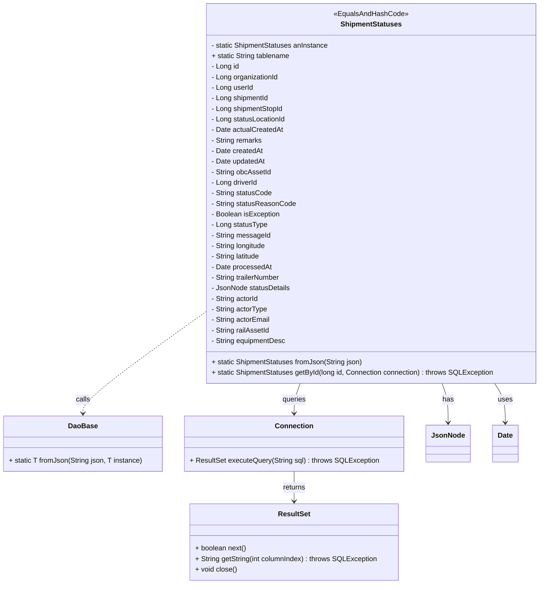
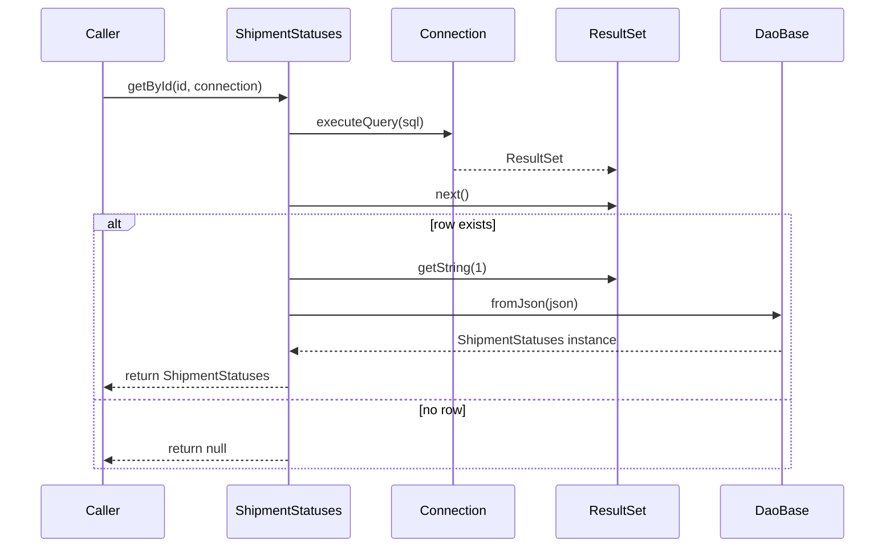

# Diagram: platform-java-lambdas/shipment/src/main/java/com/freightverify/shipment/datastore/postgresql/dao/ShipmentStatuses.java

> Auto-generated by Obscura crawlers

## Diagram 1

### SVG

<svg id="container" width="1220.326171875" xmlns="http://www.w3.org/2000/svg" class="classDiagram" height="1328" viewBox="0 0 1220.326171875 1328" role="graphics-document document" aria-roledescription="class"><g><defs><marker id="container_class-aggregationStart" class="marker aggregation class" refX="18" refY="7" markerWidth="190" markerHeight="240" orient="auto"><path d="M 18,7 L9,13 L1,7 L9,1 Z"></path></marker></defs><defs><marker id="container_class-aggregationEnd" class="marker aggregation class" refX="1" refY="7" markerWidth="20" markerHeight="28" orient="auto"><path d="M 18,7 L9,13 L1,7 L9,1 Z"></path></marker></defs><defs><marker id="container_class-extensionStart" class="marker extension class" refX="18" refY="7" markerWidth="190" markerHeight="240" orient="auto"><path d="M 1,7 L18,13 V 1 Z"></path></marker></defs><defs><marker id="container_class-extensionEnd" class="marker extension class" refX="1" refY="7" markerWidth="20" markerHeight="28" orient="auto"><path d="M 1,1 V 13 L18,7 Z"></path></marker></defs><defs><marker id="container_class-compositionStart" class="marker composition class" refX="18" refY="7" markerWidth="190" markerHeight="240" orient="auto"><path d="M 18,7 L9,13 L1,7 L9,1 Z"></path></marker></defs><defs><marker id="container_class-compositionEnd" class="marker composition class" refX="1" refY="7" markerWidth="20" markerHeight="28" orient="auto"><path d="M 18,7 L9,13 L1,7 L9,1 Z"></path></marker></defs><defs><marker id="container_class-dependencyStart" class="marker dependency class" refX="6" refY="7" markerWidth="190" markerHeight="240" orient="auto"><path d="M 5,7 L9,13 L1,7 L9,1 Z"></path></marker></defs><defs><marker id="container_class-dependencyEnd" class="marker dependency class" refX="13" refY="7" markerWidth="20" markerHeight="28" orient="auto"><path d="M 18,7 L9,13 L14,7 L9,1 Z"></path></marker></defs><defs><marker id="container_class-lollipopStart" class="marker lollipop class" refX="13" refY="7" markerWidth="190" markerHeight="240" orient="auto"><circle stroke="black" fill="transparent" cx="7" cy="7" r="6"></circle></marker></defs><defs><marker id="container_class-lollipopEnd" class="marker lollipop class" refX="1" refY="7" markerWidth="190" markerHeight="240" orient="auto"><circle stroke="black" fill="transparent" cx="7" cy="7" r="6"></circle></marker></defs><g class="root"><g class="clusters"></g><g class="edgePaths"><path d="M458.896,712.723L413.71,745.436C368.523,778.149,278.15,843.574,232.964,881.454C187.777,919.333,187.777,929.667,187.777,934.833L187.777,940" id="id_ShipmentStatuses_DaoBase_1" class="edge-thickness-normal edge-pattern-dashed relation" style=";;;" data-edge="true" data-et="edge" data-id="id_ShipmentStatuses_DaoBase_1" data-points="W3sieCI6NDU4Ljg5NjQ4NDM3NSwieSI6NzEyLjcyMzA1MjQ3OTU2Njh9LHsieCI6MTg3Ljc3NzM0Mzc1LCJ5Ijo5MDl9LHsieCI6MTg3Ljc3NzM0Mzc1LCJ5Ijo5NDZ9XQ==" marker-end="url(#container_class-dependencyEnd)"></path><path d="M677.506,872L675.249,878.167C672.992,884.333,668.479,896.667,666.222,908C663.965,919.333,663.965,929.667,663.965,934.833L663.965,940" id="id_ShipmentStatuses_Connection_2" class="edge-thickness-normal edge-pattern-solid relation" style=";;;" data-edge="true" data-et="edge" data-id="id_ShipmentStatuses_Connection_2" data-points="W3sieCI6Njc3LjUwNjI1MDgzMjg4OTEsInkiOjg3Mn0seyJ4Ijo2NjMuOTY0ODQzNzUsInkiOjkwOX0seyJ4Ijo2NjMuOTY0ODQzNzUsInkiOjk0Nn1d" marker-end="url(#container_class-dependencyEnd)"></path><path d="M663.965,1072L663.965,1078.167C663.965,1084.333,663.965,1096.667,663.965,1108C663.965,1119.333,663.965,1129.667,663.965,1134.833L663.965,1140" id="id_Connection_ResultSet_3" class="edge-thickness-normal edge-pattern-solid relation" style=";;;" data-edge="true" data-et="edge" data-id="id_Connection_ResultSet_3" data-points="W3sieCI6NjYzLjk2NDg0Mzc1LCJ5IjoxMDcyfSx7IngiOjY2My45NjQ4NDM3NSwieSI6MTEwOX0seyJ4Ijo2NjMuOTY0ODQzNzUsInkiOjExNDZ9XQ==" marker-end="url(#container_class-dependencyEnd)"></path><path d="M993.716,872L995.973,878.167C998.23,884.333,1002.744,896.667,1005.001,911.5C1007.258,926.333,1007.258,943.667,1007.258,952.333L1007.258,961" id="id_ShipmentStatuses_JsonNode_4" class="edge-thickness-normal edge-pattern-solid relation" style=";;;" data-edge="true" data-et="edge" data-id="id_ShipmentStatuses_JsonNode_4" data-points="W3sieCI6OTkzLjcxNjQwNTQxNzExMDksInkiOjg3Mn0seyJ4IjoxMDA3LjI1NzgxMjUsInkiOjkwOX0seyJ4IjoxMDA3LjI1NzgxMjUsInkiOjk2N31d" marker-end="url(#container_class-dependencyEnd)"></path><path d="M1109.553,872L1113.463,878.167C1117.374,884.333,1125.195,896.667,1129.105,911.5C1133.016,926.333,1133.016,943.667,1133.016,952.333L1133.016,961" id="id_ShipmentStatuses_Date_5" class="edge-thickness-normal edge-pattern-solid relation" style=";;;" data-edge="true" data-et="edge" data-id="id_ShipmentStatuses_Date_5" data-points="W3sieCI6MTEwOS41NTMwMjU4ODYxOTQsInkiOjg3Mn0seyJ4IjoxMTMzLjAxNTYyNSwieSI6OTA5fSx7IngiOjExMzMuMDE1NjI1LCJ5Ijo5Njd9XQ==" marker-end="url(#container_class-dependencyEnd)"></path></g><g class="edgeLabels"><g class="edgeLabel" transform="translate(187.77734375, 909)"><g class="label" data-id="id_ShipmentStatuses_DaoBase_1" transform="translate(-16.4453125, -12)"><foreignObject width="32.890625" height="24">

calls

</foreignObject></g></g><g class="edgeLabel" transform="translate(663.96484375, 909)"><g class="label" data-id="id_ShipmentStatuses_Connection_2" transform="translate(-27.2421875, -12)"><foreignObject width="54.484375" height="24">

queries

</foreignObject></g></g><g class="edgeLabel" transform="translate(663.96484375, 1109)"><g class="label" data-id="id_Connection_ResultSet_3" transform="translate(-26.265625, -12)"><foreignObject width="52.53125" height="24">

returns

</foreignObject></g></g><g class="edgeLabel" transform="translate(1007.2578125, 909)"><g class="label" data-id="id_ShipmentStatuses_JsonNode_4" transform="translate(-12.703125, -12)"><foreignObject width="25.40625" height="24">

has

</foreignObject></g></g><g class="edgeLabel" transform="translate(1133.015625, 909)"><g class="label" data-id="id_ShipmentStatuses_Date_5" transform="translate(-16.4921875, -12)"><foreignObject width="32.984375" height="24">

uses

</foreignObject></g></g></g><g class="nodes"><g class="node default" id="classId-ShipmentStatuses-0" transform="translate(835.611328125, 440)"><g class="basic label-container"><path d="M-376.71484375 -432 L376.71484375 -432 L376.71484375 432 L-376.71484375 432" stroke="none" stroke-width="0" fill="#ECECFF" style=""></path><path d="M-376.71484375 -432 C-84.29480530106798 -432, 208.12523314786404 -432, 376.71484375 -432 M-376.71484375 -432 C-85.8721535454136 -432, 204.9705366591728 -432, 376.71484375 -432 M376.71484375 -432 C376.71484375 -220.1507732870317, 376.71484375 -8.301546574063423, 376.71484375 432 M376.71484375 -432 C376.71484375 -211.32783359128604, 376.71484375 9.344332817427926, 376.71484375 432 M376.71484375 432 C116.60243725003403 432, -143.50996924993194 432, -376.71484375 432 M376.71484375 432 C134.27991387257498 432, -108.15501600485004 432, -376.71484375 432 M-376.71484375 432 C-376.71484375 168.42484511051117, -376.71484375 -95.15030977897766, -376.71484375 -432 M-376.71484375 432 C-376.71484375 161.42245653923487, -376.71484375 -109.15508692153026, -376.71484375 -432" stroke="#9370DB" stroke-width="1.3" fill="none" stroke-dasharray="0 0" style=""></path></g><g class="annotation-group text" transform="translate(-83.2109375, -408)"><g class="label" style="" transform="translate(0,-12)"><foreignObject width="166.421875" height="24">

«EqualsAndHashCode»

</foreignObject></g></g><g class="label-group text" transform="translate(-66.8671875, -384)"><g class="label" style="font-weight: bolder" transform="translate(0,-12)"><foreignObject width="133.734375" height="24">

ShipmentStatuses

</foreignObject></g></g><g class="members-group text" transform="translate(-364.71484375, -336)"><g class="label" style="" transform="translate(0,-12)"><foreignObject width="269.921875" height="24">

- static ShipmentStatuses anInstance

</foreignObject></g><g class="label" style="" transform="translate(0,12)"><foreignObject width="181.078125" height="24">

+ static String tablename

</foreignObject></g><g class="label" style="" transform="translate(0,36)"><foreignObject width="63.625" height="24">

- Long id

</foreignObject></g><g class="label" style="" transform="translate(0,60)"><foreignObject width="154.1875" height="24">

- Long organizationId

</foreignObject></g><g class="label" style="" transform="translate(0,84)"><foreignObject width="95.515625" height="24">

- Long userId

</foreignObject></g><g class="label" style="" transform="translate(0,108)"><foreignObject width="132.28125" height="24">

- Long shipmentId

</foreignObject></g><g class="label" style="" transform="translate(0,132)"><foreignObject width="165.390625" height="24">

- Long shipmentStopId

</foreignObject></g><g class="label" style="" transform="translate(0,156)"><foreignObject width="170.34375" height="24">

- Long statusLocationId

</foreignObject></g><g class="label" style="" transform="translate(0,180)"><foreignObject width="163.15625" height="24">

- Date actualCreatedAt

</foreignObject></g><g class="label" style="" transform="translate(0,204)"><foreignObject width="116.40625" height="24">

- String remarks

</foreignObject></g><g class="label" style="" transform="translate(0,228)"><foreignObject width="117.421875" height="24">

- Date createdAt

</foreignObject></g><g class="label" style="" transform="translate(0,252)"><foreignObject width="123.890625" height="24">

- Date updatedAt

</foreignObject></g><g class="label" style="" transform="translate(0,276)"><foreignObject width="137.046875" height="24">

- String obcAssetId

</foreignObject></g><g class="label" style="" transform="translate(0,300)"><foreignObject width="106.796875" height="24">

- Long driverId

</foreignObject></g><g class="label" style="" transform="translate(0,324)"><foreignObject width="138.484375" height="24">

- String statusCode

</foreignObject></g><g class="label" style="" transform="translate(0,348)"><foreignObject width="191.21875" height="24">

- String statusReasonCode

</foreignObject></g><g class="label" style="" transform="translate(0,372)"><foreignObject width="157.3125" height="24">

- Boolean isException

</foreignObject></g><g class="label" style="" transform="translate(0,396)"><foreignObject width="127.671875" height="24">

- Long statusType

</foreignObject></g><g class="label" style="" transform="translate(0,420)"><foreignObject width="134.484375" height="24">

- String messageId

</foreignObject></g><g class="label" style="" transform="translate(0,444)"><foreignObject width="127.359375" height="24">

- String longitude

</foreignObject></g><g class="label" style="" transform="translate(0,468)"><foreignObject width="114.796875" height="24">

- String latitude

</foreignObject></g><g class="label" style="" transform="translate(0,492)"><foreignObject width="136.640625" height="24">

- Date processedAt

</foreignObject></g><g class="label" style="" transform="translate(0,516)"><foreignObject width="160.28125" height="24">

- String trailerNumber

</foreignObject></g><g class="label" style="" transform="translate(0,540)"><foreignObject width="179.03125" height="24">

- JsonNode statusDetails

</foreignObject></g><g class="label" style="" transform="translate(0,564)"><foreignObject width="109.515625" height="24">

- String actorId

</foreignObject></g><g class="label" style="" transform="translate(0,588)"><foreignObject width="128.953125" height="24">

- String actorType

</foreignObject></g><g class="label" style="" transform="translate(0,612)"><foreignObject width="135.234375" height="24">

- String actorEmail

</foreignObject></g><g class="label" style="" transform="translate(0,636)"><foreignObject width="134.078125" height="24">

- String railAssetId

</foreignObject></g><g class="label" style="" transform="translate(0,660)"><foreignObject width="171.15625" height="24">

- String equipmentDesc

</foreignObject></g></g><g class="methods-group text" transform="translate(-364.71484375, 384)"><g class="label" style="" transform="translate(0,-12)"><foreignObject width="345.375" height="24">

+ static ShipmentStatuses fromJson(String json)

</foreignObject></g><g class="label" style="" transform="translate(0,12)"><foreignObject width="646.21875" height="24">

+ static ShipmentStatuses getById(long id, Connection connection) : throws SQLException

</foreignObject></g></g><g class="divider" style=""><path d="M-376.71484375 -360 C-83.8313076947648 -360, 209.0522283604704 -360, 376.71484375 -360 M-376.71484375 -360 C-141.4629796894409 -360, 93.78888437111817 -360, 376.71484375 -360" stroke="#9370DB" stroke-width="1.3" fill="none" stroke-dasharray="0 0" style=""></path></g><g class="divider" style=""><path d="M-376.71484375 360 C-183.19445916698047 360, 10.32592541603907 360, 376.71484375 360 M-376.71484375 360 C-154.04178737668767 360, 68.63126899662467 360, 376.71484375 360" stroke="#9370DB" stroke-width="1.3" fill="none" stroke-dasharray="0 0" style=""></path></g></g><g class="node default" id="classId-DaoBase-1" transform="translate(187.77734375, 1009)"><g class="basic label-container"><path d="M-179.77734375 -63 L179.77734375 -63 L179.77734375 63 L-179.77734375 63" stroke="none" stroke-width="0" fill="#ECECFF" style=""></path><path d="M-179.77734375 -63 C-54.26353069774818 -63, 71.25028235450364 -63, 179.77734375 -63 M-179.77734375 -63 C-100.2671986356452 -63, -20.757053521290402 -63, 179.77734375 -63 M179.77734375 -63 C179.77734375 -13.144712583226848, 179.77734375 36.7105748335463, 179.77734375 63 M179.77734375 -63 C179.77734375 -16.41783738840021, 179.77734375 30.164325223199583, 179.77734375 63 M179.77734375 63 C106.78370911416434 63, 33.79007447832868 63, -179.77734375 63 M179.77734375 63 C38.63809659462325 63, -102.5011505607535 63, -179.77734375 63 M-179.77734375 63 C-179.77734375 37.627161032731294, -179.77734375 12.254322065462581, -179.77734375 -63 M-179.77734375 63 C-179.77734375 13.939565639552775, -179.77734375 -35.12086872089445, -179.77734375 -63" stroke="#9370DB" stroke-width="1.3" fill="none" stroke-dasharray="0 0" style=""></path></g><g class="annotation-group text" transform="translate(0, -39)"></g><g class="label-group text" transform="translate(-31.7109375, -39)"><g class="label" style="font-weight: bolder" transform="translate(0,-12)"><foreignObject width="63.421875" height="24">

DaoBase

</foreignObject></g></g><g class="members-group text" transform="translate(-167.77734375, 9)"></g><g class="methods-group text" transform="translate(-167.77734375, 39)"><g class="label" style="" transform="translate(0,-12)"><foreignObject width="303.84375" height="24">

+ static  T fromJson(String json, T instance)

</foreignObject></g></g><g class="divider" style=""><path d="M-179.77734375 -15 C-77.8128461666766 -15, 24.151651416646814 -15, 179.77734375 -15 M-179.77734375 -15 C-73.89914642482441 -15, 31.979050900351183 -15, 179.77734375 -15" stroke="#9370DB" stroke-width="1.3" fill="none" stroke-dasharray="0 0" style=""></path></g><g class="divider" style=""><path d="M-179.77734375 9 C-102.30785139626131 9, -24.838359042522626 9, 179.77734375 9 M-179.77734375 9 C-40.841380029962096 9, 98.09458369007581 9, 179.77734375 9" stroke="#9370DB" stroke-width="1.3" fill="none" stroke-dasharray="0 0" style=""></path></g></g><g class="node default" id="classId-Connection-2" transform="translate(663.96484375, 1009)"><g class="basic label-container"><path d="M-246.41015625 -63 L246.41015625 -63 L246.41015625 63 L-246.41015625 63" stroke="none" stroke-width="0" fill="#ECECFF" style=""></path><path d="M-246.41015625 -63 C-132.34059085643247 -63, -18.27102546286494 -63, 246.41015625 -63 M-246.41015625 -63 C-89.10021801179712 -63, 68.20972022640575 -63, 246.41015625 -63 M246.41015625 -63 C246.41015625 -29.98462184333941, 246.41015625 3.0307563133211772, 246.41015625 63 M246.41015625 -63 C246.41015625 -29.333030218507538, 246.41015625 4.3339395629849236, 246.41015625 63 M246.41015625 63 C75.35788354644825 63, -95.6943891571035 63, -246.41015625 63 M246.41015625 63 C86.49707507829612 63, -73.41600609340776 63, -246.41015625 63 M-246.41015625 63 C-246.41015625 27.095402105756456, -246.41015625 -8.809195788487088, -246.41015625 -63 M-246.41015625 63 C-246.41015625 35.01960602736165, -246.41015625 7.039212054723286, -246.41015625 -63" stroke="#9370DB" stroke-width="1.3" fill="none" stroke-dasharray="0 0" style=""></path></g><g class="annotation-group text" transform="translate(0, -39)"></g><g class="label-group text" transform="translate(-41.2265625, -39)"><g class="label" style="font-weight: bolder" transform="translate(0,-12)"><foreignObject width="82.453125" height="24">

Connection

</foreignObject></g></g><g class="members-group text" transform="translate(-234.41015625, 9)"></g><g class="methods-group text" transform="translate(-234.41015625, 39)"><g class="label" style="" transform="translate(0,-12)"><foreignObject width="427.59375" height="24">

+ ResultSet executeQuery(String sql) : throws SQLException

</foreignObject></g></g><g class="divider" style=""><path d="M-246.41015625 -15 C-117.62981525589404 -15, 11.150525738211911 -15, 246.41015625 -15 M-246.41015625 -15 C-86.27588400689353 -15, 73.85838823621293 -15, 246.41015625 -15" stroke="#9370DB" stroke-width="1.3" fill="none" stroke-dasharray="0 0" style=""></path></g><g class="divider" style=""><path d="M-246.41015625 9 C-71.40542493550754 9, 103.59930637898492 9, 246.41015625 9 M-246.41015625 9 C-141.74805066426217 9, -37.08594507852436 9, 246.41015625 9" stroke="#9370DB" stroke-width="1.3" fill="none" stroke-dasharray="0 0" style=""></path></g></g><g class="node default" id="classId-ResultSet-3" transform="translate(663.96484375, 1233)"><g class="basic label-container"><path d="M-238.109375 -87 L238.109375 -87 L238.109375 87 L-238.109375 87" stroke="none" stroke-width="0" fill="#ECECFF" style=""></path><path d="M-238.109375 -87 C-78.25120899285719 -87, 81.60695701428563 -87, 238.109375 -87 M-238.109375 -87 C-79.31293011808575 -87, 79.48351476382851 -87, 238.109375 -87 M238.109375 -87 C238.109375 -47.82530156269286, 238.109375 -8.650603125385715, 238.109375 87 M238.109375 -87 C238.109375 -37.255151461974656, 238.109375 12.489697076050689, 238.109375 87 M238.109375 87 C62.188946481987415 87, -113.73148203602517 87, -238.109375 87 M238.109375 87 C127.78804125664814 87, 17.466707513296285 87, -238.109375 87 M-238.109375 87 C-238.109375 26.924939005925417, -238.109375 -33.150121988149166, -238.109375 -87 M-238.109375 87 C-238.109375 49.741587489997634, -238.109375 12.483174979995269, -238.109375 -87" stroke="#9370DB" stroke-width="1.3" fill="none" stroke-dasharray="0 0" style=""></path></g><g class="annotation-group text" transform="translate(0, -63)"></g><g class="label-group text" transform="translate(-35.21875, -63)"><g class="label" style="font-weight: bolder" transform="translate(0,-12)"><foreignObject width="70.4375" height="24">

ResultSet

</foreignObject></g></g><g class="members-group text" transform="translate(-226.109375, -15)"></g><g class="methods-group text" transform="translate(-226.109375, 15)"><g class="label" style="" transform="translate(0,-12)"><foreignObject width="117.765625" height="24">

+ boolean next()

</foreignObject></g><g class="label" style="" transform="translate(0,12)"><foreignObject width="417" height="24">

+ String getString(int columnIndex) : throws SQLException

</foreignObject></g><g class="label" style="" transform="translate(0,36)"><foreignObject width="95.859375" height="24">

+ void close()

</foreignObject></g></g><g class="divider" style=""><path d="M-238.109375 -39 C-138.57235521733168 -39, -39.03533543466335 -39, 238.109375 -39 M-238.109375 -39 C-97.63177111223749 -39, 42.845832775525025 -39, 238.109375 -39" stroke="#9370DB" stroke-width="1.3" fill="none" stroke-dasharray="0 0" style=""></path></g><g class="divider" style=""><path d="M-238.109375 -15 C-142.6591874798026 -15, -47.208999959605194 -15, 238.109375 -15 M-238.109375 -15 C-112.00866829381572 -15, 14.092038412368566 -15, 238.109375 -15" stroke="#9370DB" stroke-width="1.3" fill="none" stroke-dasharray="0 0" style=""></path></g></g><g class="node default" id="classId-JsonNode-4" transform="translate(1007.2578125, 1009)"><g class="basic label-container"><path d="M-46.8828125 -42 L46.8828125 -42 L46.8828125 42 L-46.8828125 42" stroke="none" stroke-width="0" fill="#ECECFF" style=""></path><path d="M-46.8828125 -42 C-27.08357950339066 -42, -7.2843465067813185 -42, 46.8828125 -42 M-46.8828125 -42 C-26.219988207836792 -42, -5.557163915673584 -42, 46.8828125 -42 M46.8828125 -42 C46.8828125 -16.400089873123253, 46.8828125 9.199820253753494, 46.8828125 42 M46.8828125 -42 C46.8828125 -24.28429439330533, 46.8828125 -6.568588786610661, 46.8828125 42 M46.8828125 42 C24.363091009832143 42, 1.8433695196642859 42, -46.8828125 42 M46.8828125 42 C16.11680825443811 42, -14.649195991123783 42, -46.8828125 42 M-46.8828125 42 C-46.8828125 18.177343900391698, -46.8828125 -5.645312199216605, -46.8828125 -42 M-46.8828125 42 C-46.8828125 15.501404572246198, -46.8828125 -10.997190855507604, -46.8828125 -42" stroke="#9370DB" stroke-width="1.3" fill="none" stroke-dasharray="0 0" style=""></path></g><g class="annotation-group text" transform="translate(0, -18)"></g><g class="label-group text" transform="translate(-34.8828125, -18)"><g class="label" style="font-weight: bolder" transform="translate(0,-12)"><foreignObject width="69.765625" height="24">

JsonNode

</foreignObject></g></g><g class="members-group text" transform="translate(-34.8828125, 30)"></g><g class="methods-group text" transform="translate(-34.8828125, 60)"></g><g class="divider" style=""><path d="M-46.8828125 6 C-17.141079587958632 6, 12.600653324082735 6, 46.8828125 6 M-46.8828125 6 C-12.25717034295289 6, 22.36847181409422 6, 46.8828125 6" stroke="#9370DB" stroke-width="1.3" fill="none" stroke-dasharray="0 0" style=""></path></g><g class="divider" style=""><path d="M-46.8828125 24 C-20.16636415906898 24, 6.55008418186204 24, 46.8828125 24 M-46.8828125 24 C-11.984310865084886 24, 22.914190769830228 24, 46.8828125 24" stroke="#9370DB" stroke-width="1.3" fill="none" stroke-dasharray="0 0" style=""></path></g></g><g class="node default" id="classId-Date-5" transform="translate(1133.015625, 1009)"><g class="basic label-container"><path d="M-28.875 -42 L28.875 -42 L28.875 42 L-28.875 42" stroke="none" stroke-width="0" fill="#ECECFF" style=""></path><path d="M-28.875 -42 C-14.0847356640996 -42, 0.7055286718007991 -42, 28.875 -42 M-28.875 -42 C-12.188057231355746 -42, 4.498885537288508 -42, 28.875 -42 M28.875 -42 C28.875 -24.050802119129077, 28.875 -6.101604238258155, 28.875 42 M28.875 -42 C28.875 -14.031220389583872, 28.875 13.937559220832256, 28.875 42 M28.875 42 C9.43834964539564 42, -9.99830070920872 42, -28.875 42 M28.875 42 C7.474155370439668 42, -13.926689259120664 42, -28.875 42 M-28.875 42 C-28.875 8.593569756345765, -28.875 -24.81286048730847, -28.875 -42 M-28.875 42 C-28.875 18.64900223608861, -28.875 -4.701995527822781, -28.875 -42" stroke="#9370DB" stroke-width="1.3" fill="none" stroke-dasharray="0 0" style=""></path></g><g class="annotation-group text" transform="translate(0, -18)"></g><g class="label-group text" transform="translate(-16.875, -18)"><g class="label" style="font-weight: bolder" transform="translate(0,-12)"><foreignObject width="33.75" height="24">

Date

</foreignObject></g></g><g class="members-group text" transform="translate(-16.875, 30)"></g><g class="methods-group text" transform="translate(-16.875, 60)"></g><g class="divider" style=""><path d="M-28.875 6 C-12.003625319362019 6, 4.867749361275962 6, 28.875 6 M-28.875 6 C-9.835291039801277 6, 9.204417920397447 6, 28.875 6" stroke="#9370DB" stroke-width="1.3" fill="none" stroke-dasharray="0 0" style=""></path></g><g class="divider" style=""><path d="M-28.875 24 C-8.25421984653811 24, 12.36656030692378 24, 28.875 24 M-28.875 24 C-14.399845407352263 24, 0.07530918529547392 24, 28.875 24" stroke="#9370DB" stroke-width="1.3" fill="none" stroke-dasharray="0 0" style=""></path></g></g></g></g></g></svg>

## Diagram 2

### SVG

<svg id="container" width="1102" xmlns="http://www.w3.org/2000/svg" height="703" viewBox="-50 -10 1102 703" role="graphics-document document" aria-roledescription="sequence"><g><rect x="852" y="617" fill="#eaeaea" stroke="#666" width="150" height="65" name="DaoBase" rx="3" ry="3" class="actor actor-bottom"></rect><text x="927" y="649.5" dominant-baseline="central" alignment-baseline="central" class="actor actor-box" style="text-anchor: middle; font-size: 16px; font-weight: 400;"><tspan x="927" dy="0">DaoBase</tspan></text></g><g><rect x="652" y="617" fill="#eaeaea" stroke="#666" width="150" height="65" name="ResultSet" rx="3" ry="3" class="actor actor-bottom"></rect><text x="727" y="649.5" dominant-baseline="central" alignment-baseline="central" class="actor actor-box" style="text-anchor: middle; font-size: 16px; font-weight: 400;"><tspan x="727" dy="0">ResultSet</tspan></text></g><g><rect x="452" y="617" fill="#eaeaea" stroke="#666" width="150" height="65" name="Connection" rx="3" ry="3" class="actor actor-bottom"></rect><text x="527" y="649.5" dominant-baseline="central" alignment-baseline="central" class="actor actor-box" style="text-anchor: middle; font-size: 16px; font-weight: 400;"><tspan x="527" dy="0">Connection</tspan></text></g><g><rect x="250" y="617" fill="#eaeaea" stroke="#666" width="152" height="65" name="ShipmentStatuses" rx="3" ry="3" class="actor actor-bottom"></rect><text x="326" y="649.5" dominant-baseline="central" alignment-baseline="central" class="actor actor-box" style="text-anchor: middle; font-size: 16px; font-weight: 400;"><tspan x="326" dy="0">ShipmentStatuses</tspan></text></g><g><rect x="0" y="617" fill="#eaeaea" stroke="#666" width="150" height="65" name="Caller" rx="3" ry="3" class="actor actor-bottom"></rect><text x="75" y="649.5" dominant-baseline="central" alignment-baseline="central" class="actor actor-box" style="text-anchor: middle; font-size: 16px; font-weight: 400;"><tspan x="75" dy="0">Caller</tspan></text></g><g><line id="actor4" x1="927" y1="65" x2="927" y2="617" class="actor-line 200" stroke-width="0.5px" stroke="#999" name="DaoBase"></line><g id="root-4"><rect x="852" y="0" fill="#eaeaea" stroke="#666" width="150" height="65" name="DaoBase" rx="3" ry="3" class="actor actor-top"></rect><text x="927" y="32.5" dominant-baseline="central" alignment-baseline="central" class="actor actor-box" style="text-anchor: middle; font-size: 16px; font-weight: 400;"><tspan x="927" dy="0">DaoBase</tspan></text></g></g><g><line id="actor3" x1="727" y1="65" x2="727" y2="617" class="actor-line 200" stroke-width="0.5px" stroke="#999" name="ResultSet"></line><g id="root-3"><rect x="652" y="0" fill="#eaeaea" stroke="#666" width="150" height="65" name="ResultSet" rx="3" ry="3" class="actor actor-top"></rect><text x="727" y="32.5" dominant-baseline="central" alignment-baseline="central" class="actor actor-box" style="text-anchor: middle; font-size: 16px; font-weight: 400;"><tspan x="727" dy="0">ResultSet</tspan></text></g></g><g><line id="actor2" x1="527" y1="65" x2="527" y2="617" class="actor-line 200" stroke-width="0.5px" stroke="#999" name="Connection"></line><g id="root-2"><rect x="452" y="0" fill="#eaeaea" stroke="#666" width="150" height="65" name="Connection" rx="3" ry="3" class="actor actor-top"></rect><text x="527" y="32.5" dominant-baseline="central" alignment-baseline="central" class="actor actor-box" style="text-anchor: middle; font-size: 16px; font-weight: 400;"><tspan x="527" dy="0">Connection</tspan></text></g></g><g><line id="actor1" x1="326" y1="65" x2="326" y2="617" class="actor-line 200" stroke-width="0.5px" stroke="#999" name="ShipmentStatuses"></line><g id="root-1"><rect x="250" y="0" fill="#eaeaea" stroke="#666" width="152" height="65" name="ShipmentStatuses" rx="3" ry="3" class="actor actor-top"></rect><text x="326" y="32.5" dominant-baseline="central" alignment-baseline="central" class="actor actor-box" style="text-anchor: middle; font-size: 16px; font-weight: 400;"><tspan x="326" dy="0">ShipmentStatuses</tspan></text></g></g><g><line id="actor0" x1="75" y1="65" x2="75" y2="617" class="actor-line 200" stroke-width="0.5px" stroke="#999" name="Caller"></line><g id="root-0"><rect x="0" y="0" fill="#eaeaea" stroke="#666" width="150" height="65" name="Caller" rx="3" ry="3" class="actor actor-top"></rect><text x="75" y="32.5" dominant-baseline="central" alignment-baseline="central" class="actor actor-box" style="text-anchor: middle; font-size: 16px; font-weight: 400;"><tspan x="75" dy="0">Caller</tspan></text></g></g><g></g><defs><symbol id="computer" width="24" height="24"><path transform="scale(.5)" d="M2 2v13h20v-13h-20zm18 11h-16v-9h16v9zm-10.228 6l.466-1h3.524l.467 1h-4.457zm14.228 3h-24l2-6h2.104l-1.33 4h18.45l-1.297-4h2.073l2 6zm-5-10h-14v-7h14v7z"></path></symbol></defs><defs><symbol id="database" fill-rule="evenodd" clip-rule="evenodd"><path transform="scale(.5)" d="M12.258.001l.256.004.255.005.253.008.251.01.249.012.247.015.246.016.242.019.241.02.239.023.236.024.233.027.231.028.229.031.225.032.223.034.22.036.217.038.214.04.211.041.208.043.205.045.201.046.198.048.194.05.191.051.187.053.183.054.18.056.175.057.172.059.168.06.163.061.16.063.155.064.15.066.074.033.073.033.071.034.07.034.069.035.068.035.067.035.066.035.064.036.064.036.062.036.06.036.06.037.058.037.058.037.055.038.055.038.053.038.052.038.051.039.05.039.048.039.047.039.045.04.044.04.043.04.041.04.04.041.039.041.037.041.036.041.034.041.033.042.032.042.03.042.029.042.027.042.026.043.024.043.023.043.021.043.02.043.018.044.017.043.015.044.013.044.012.044.011.045.009.044.007.045.006.045.004.045.002.045.001.045v17l-.001.045-.002.045-.004.045-.006.045-.007.045-.009.044-.011.045-.012.044-.013.044-.015.044-.017.043-.018.044-.02.043-.021.043-.023.043-.024.043-.026.043-.027.042-.029.042-.03.042-.032.042-.033.042-.034.041-.036.041-.037.041-.039.041-.04.041-.041.04-.043.04-.044.04-.045.04-.047.039-.048.039-.05.039-.051.039-.052.038-.053.038-.055.038-.055.038-.058.037-.058.037-.06.037-.06.036-.062.036-.064.036-.064.036-.066.035-.067.035-.068.035-.069.035-.07.034-.071.034-.073.033-.074.033-.15.066-.155.064-.16.063-.163.061-.168.06-.172.059-.175.057-.18.056-.183.054-.187.053-.191.051-.194.05-.198.048-.201.046-.205.045-.208.043-.211.041-.214.04-.217.038-.22.036-.223.034-.225.032-.229.031-.231.028-.233.027-.236.024-.239.023-.241.02-.242.019-.246.016-.247.015-.249.012-.251.01-.253.008-.255.005-.256.004-.258.001-.258-.001-.256-.004-.255-.005-.253-.008-.251-.01-.249-.012-.247-.015-.245-.016-.243-.019-.241-.02-.238-.023-.236-.024-.234-.027-.231-.028-.228-.031-.226-.032-.223-.034-.22-.036-.217-.038-.214-.04-.211-.041-.208-.043-.204-.045-.201-.046-.198-.048-.195-.05-.19-.051-.187-.053-.184-.054-.179-.056-.176-.057-.172-.059-.167-.06-.164-.061-.159-.063-.155-.064-.151-.066-.074-.033-.072-.033-.072-.034-.07-.034-.069-.035-.068-.035-.067-.035-.066-.035-.064-.036-.063-.036-.062-.036-.061-.036-.06-.037-.058-.037-.057-.037-.056-.038-.055-.038-.053-.038-.052-.038-.051-.039-.049-.039-.049-.039-.046-.039-.046-.04-.044-.04-.043-.04-.041-.04-.04-.041-.039-.041-.037-.041-.036-.041-.034-.041-.033-.042-.032-.042-.03-.042-.029-.042-.027-.042-.026-.043-.024-.043-.023-.043-.021-.043-.02-.043-.018-.044-.017-.043-.015-.044-.013-.044-.012-.044-.011-.045-.009-.044-.007-.045-.006-.045-.004-.045-.002-.045-.001-.045v-17l.001-.045.002-.045.004-.045.006-.045.007-.045.009-.044.011-.045.012-.044.013-.044.015-.044.017-.043.018-.044.02-.043.021-.043.023-.043.024-.043.026-.043.027-.042.029-.042.03-.042.032-.042.033-.042.034-.041.036-.041.037-.041.039-.041.04-.041.041-.04.043-.04.044-.04.046-.04.046-.039.049-.039.049-.039.051-.039.052-.038.053-.038.055-.038.056-.038.057-.037.058-.037.06-.037.061-.036.062-.036.063-.036.064-.036.066-.035.067-.035.068-.035.069-.035.07-.034.072-.034.072-.033.074-.033.151-.066.155-.064.159-.063.164-.061.167-.06.172-.059.176-.057.179-.056.184-.054.187-.053.19-.051.195-.05.198-.048.201-.046.204-.045.208-.043.211-.041.214-.04.217-.038.22-.036.223-.034.226-.032.228-.031.231-.028.234-.027.236-.024.238-.023.241-.02.243-.019.245-.016.247-.015.249-.012.251-.01.253-.008.255-.005.256-.004.258-.001.258.001zm-9.258 20.499v.01l.001.021.003.021.004.022.005.021.006.022.007.022.009.023.01.022.011.023.012.023.013.023.015.023.016.024.017.023.018.024.019.024.021.024.022.025.023.024.024.025.052.049.056.05.061.051.066.051.07.051.075.051.079.052.084.052.088.052.092.052.097.052.102.051.105.052.11.052.114.051.119.051.123.051.127.05.131.05.135.05.139.048.144.049.147.047.152.047.155.047.16.045.163.045.167.043.171.043.176.041.178.041.183.039.187.039.19.037.194.035.197.035.202.033.204.031.209.03.212.029.216.027.219.025.222.024.226.021.23.02.233.018.236.016.24.015.243.012.246.01.249.008.253.005.256.004.259.001.26-.001.257-.004.254-.005.25-.008.247-.011.244-.012.241-.014.237-.016.233-.018.231-.021.226-.021.224-.024.22-.026.216-.027.212-.028.21-.031.205-.031.202-.034.198-.034.194-.036.191-.037.187-.039.183-.04.179-.04.175-.042.172-.043.168-.044.163-.045.16-.046.155-.046.152-.047.148-.048.143-.049.139-.049.136-.05.131-.05.126-.05.123-.051.118-.052.114-.051.11-.052.106-.052.101-.052.096-.052.092-.052.088-.053.083-.051.079-.052.074-.052.07-.051.065-.051.06-.051.056-.05.051-.05.023-.024.023-.025.021-.024.02-.024.019-.024.018-.024.017-.024.015-.023.014-.024.013-.023.012-.023.01-.023.01-.022.008-.022.006-.022.006-.022.004-.022.004-.021.001-.021.001-.021v-4.127l-.077.055-.08.053-.083.054-.085.053-.087.052-.09.052-.093.051-.095.05-.097.05-.1.049-.102.049-.105.048-.106.047-.109.047-.111.046-.114.045-.115.045-.118.044-.12.043-.122.042-.124.042-.126.041-.128.04-.13.04-.132.038-.134.038-.135.037-.138.037-.139.035-.142.035-.143.034-.144.033-.147.032-.148.031-.15.03-.151.03-.153.029-.154.027-.156.027-.158.026-.159.025-.161.024-.162.023-.163.022-.165.021-.166.02-.167.019-.169.018-.169.017-.171.016-.173.015-.173.014-.175.013-.175.012-.177.011-.178.01-.179.008-.179.008-.181.006-.182.005-.182.004-.184.003-.184.002h-.37l-.184-.002-.184-.003-.182-.004-.182-.005-.181-.006-.179-.008-.179-.008-.178-.01-.176-.011-.176-.012-.175-.013-.173-.014-.172-.015-.171-.016-.17-.017-.169-.018-.167-.019-.166-.02-.165-.021-.163-.022-.162-.023-.161-.024-.159-.025-.157-.026-.156-.027-.155-.027-.153-.029-.151-.03-.15-.03-.148-.031-.146-.032-.145-.033-.143-.034-.141-.035-.14-.035-.137-.037-.136-.037-.134-.038-.132-.038-.13-.04-.128-.04-.126-.041-.124-.042-.122-.042-.12-.044-.117-.043-.116-.045-.113-.045-.112-.046-.109-.047-.106-.047-.105-.048-.102-.049-.1-.049-.097-.05-.095-.05-.093-.052-.09-.051-.087-.052-.085-.053-.083-.054-.08-.054-.077-.054v4.127zm0-5.654v.011l.001.021.003.021.004.021.005.022.006.022.007.022.009.022.01.022.011.023.012.023.013.023.015.024.016.023.017.024.018.024.019.024.021.024.022.024.023.025.024.024.052.05.056.05.061.05.066.051.07.051.075.052.079.051.084.052.088.052.092.052.097.052.102.052.105.052.11.051.114.051.119.052.123.05.127.051.131.05.135.049.139.049.144.048.147.048.152.047.155.046.16.045.163.045.167.044.171.042.176.042.178.04.183.04.187.038.19.037.194.036.197.034.202.033.204.032.209.03.212.028.216.027.219.025.222.024.226.022.23.02.233.018.236.016.24.014.243.012.246.01.249.008.253.006.256.003.259.001.26-.001.257-.003.254-.006.25-.008.247-.01.244-.012.241-.015.237-.016.233-.018.231-.02.226-.022.224-.024.22-.025.216-.027.212-.029.21-.03.205-.032.202-.033.198-.035.194-.036.191-.037.187-.039.183-.039.179-.041.175-.042.172-.043.168-.044.163-.045.16-.045.155-.047.152-.047.148-.048.143-.048.139-.05.136-.049.131-.05.126-.051.123-.051.118-.051.114-.052.11-.052.106-.052.101-.052.096-.052.092-.052.088-.052.083-.052.079-.052.074-.051.07-.052.065-.051.06-.05.056-.051.051-.049.023-.025.023-.024.021-.025.02-.024.019-.024.018-.024.017-.024.015-.023.014-.023.013-.024.012-.022.01-.023.01-.023.008-.022.006-.022.006-.022.004-.021.004-.022.001-.021.001-.021v-4.139l-.077.054-.08.054-.083.054-.085.052-.087.053-.09.051-.093.051-.095.051-.097.05-.1.049-.102.049-.105.048-.106.047-.109.047-.111.046-.114.045-.115.044-.118.044-.12.044-.122.042-.124.042-.126.041-.128.04-.13.039-.132.039-.134.038-.135.037-.138.036-.139.036-.142.035-.143.033-.144.033-.147.033-.148.031-.15.03-.151.03-.153.028-.154.028-.156.027-.158.026-.159.025-.161.024-.162.023-.163.022-.165.021-.166.02-.167.019-.169.018-.169.017-.171.016-.173.015-.173.014-.175.013-.175.012-.177.011-.178.009-.179.009-.179.007-.181.007-.182.005-.182.004-.184.003-.184.002h-.37l-.184-.002-.184-.003-.182-.004-.182-.005-.181-.007-.179-.007-.179-.009-.178-.009-.176-.011-.176-.012-.175-.013-.173-.014-.172-.015-.171-.016-.17-.017-.169-.018-.167-.019-.166-.02-.165-.021-.163-.022-.162-.023-.161-.024-.159-.025-.157-.026-.156-.027-.155-.028-.153-.028-.151-.03-.15-.03-.148-.031-.146-.033-.145-.033-.143-.033-.141-.035-.14-.036-.137-.036-.136-.037-.134-.038-.132-.039-.13-.039-.128-.04-.126-.041-.124-.042-.122-.043-.12-.043-.117-.044-.116-.044-.113-.046-.112-.046-.109-.046-.106-.047-.105-.048-.102-.049-.1-.049-.097-.05-.095-.051-.093-.051-.09-.051-.087-.053-.085-.052-.083-.054-.08-.054-.077-.054v4.139zm0-5.666v.011l.001.02.003.022.004.021.005.022.006.021.007.022.009.023.01.022.011.023.012.023.013.023.015.023.016.024.017.024.018.023.019.024.021.025.022.024.023.024.024.025.052.05.056.05.061.05.066.051.07.051.075.052.079.051.084.052.088.052.092.052.097.052.102.052.105.051.11.052.114.051.119.051.123.051.127.05.131.05.135.05.139.049.144.048.147.048.152.047.155.046.16.045.163.045.167.043.171.043.176.042.178.04.183.04.187.038.19.037.194.036.197.034.202.033.204.032.209.03.212.028.216.027.219.025.222.024.226.021.23.02.233.018.236.017.24.014.243.012.246.01.249.008.253.006.256.003.259.001.26-.001.257-.003.254-.006.25-.008.247-.01.244-.013.241-.014.237-.016.233-.018.231-.02.226-.022.224-.024.22-.025.216-.027.212-.029.21-.03.205-.032.202-.033.198-.035.194-.036.191-.037.187-.039.183-.039.179-.041.175-.042.172-.043.168-.044.163-.045.16-.045.155-.047.152-.047.148-.048.143-.049.139-.049.136-.049.131-.051.126-.05.123-.051.118-.052.114-.051.11-.052.106-.052.101-.052.096-.052.092-.052.088-.052.083-.052.079-.052.074-.052.07-.051.065-.051.06-.051.056-.05.051-.049.023-.025.023-.025.021-.024.02-.024.019-.024.018-.024.017-.024.015-.023.014-.024.013-.023.012-.023.01-.022.01-.023.008-.022.006-.022.006-.022.004-.022.004-.021.001-.021.001-.021v-4.153l-.077.054-.08.054-.083.053-.085.053-.087.053-.09.051-.093.051-.095.051-.097.05-.1.049-.102.048-.105.048-.106.048-.109.046-.111.046-.114.046-.115.044-.118.044-.12.043-.122.043-.124.042-.126.041-.128.04-.13.039-.132.039-.134.038-.135.037-.138.036-.139.036-.142.034-.143.034-.144.033-.147.032-.148.032-.15.03-.151.03-.153.028-.154.028-.156.027-.158.026-.159.024-.161.024-.162.023-.163.023-.165.021-.166.02-.167.019-.169.018-.169.017-.171.016-.173.015-.173.014-.175.013-.175.012-.177.01-.178.01-.179.009-.179.007-.181.006-.182.006-.182.004-.184.003-.184.001-.185.001-.185-.001-.184-.001-.184-.003-.182-.004-.182-.006-.181-.006-.179-.007-.179-.009-.178-.01-.176-.01-.176-.012-.175-.013-.173-.014-.172-.015-.171-.016-.17-.017-.169-.018-.167-.019-.166-.02-.165-.021-.163-.023-.162-.023-.161-.024-.159-.024-.157-.026-.156-.027-.155-.028-.153-.028-.151-.03-.15-.03-.148-.032-.146-.032-.145-.033-.143-.034-.141-.034-.14-.036-.137-.036-.136-.037-.134-.038-.132-.039-.13-.039-.128-.041-.126-.041-.124-.041-.122-.043-.12-.043-.117-.044-.116-.044-.113-.046-.112-.046-.109-.046-.106-.048-.105-.048-.102-.048-.1-.05-.097-.049-.095-.051-.093-.051-.09-.052-.087-.052-.085-.053-.083-.053-.08-.054-.077-.054v4.153zm8.74-8.179l-.257.004-.254.005-.25.008-.247.011-.244.012-.241.014-.237.016-.233.018-.231.021-.226.022-.224.023-.22.026-.216.027-.212.028-.21.031-.205.032-.202.033-.198.034-.194.036-.191.038-.187.038-.183.04-.179.041-.175.042-.172.043-.168.043-.163.045-.16.046-.155.046-.152.048-.148.048-.143.048-.139.049-.136.05-.131.05-.126.051-.123.051-.118.051-.114.052-.11.052-.106.052-.101.052-.096.052-.092.052-.088.052-.083.052-.079.052-.074.051-.07.052-.065.051-.06.05-.056.05-.051.05-.023.025-.023.024-.021.024-.02.025-.019.024-.018.024-.017.023-.015.024-.014.023-.013.023-.012.023-.01.023-.01.022-.008.022-.006.023-.006.021-.004.022-.004.021-.001.021-.001.021.001.021.001.021.004.021.004.022.006.021.006.023.008.022.01.022.01.023.012.023.013.023.014.023.015.024.017.023.018.024.019.024.02.025.021.024.023.024.023.025.051.05.056.05.06.05.065.051.07.052.074.051.079.052.083.052.088.052.092.052.096.052.101.052.106.052.11.052.114.052.118.051.123.051.126.051.131.05.136.05.139.049.143.048.148.048.152.048.155.046.16.046.163.045.168.043.172.043.175.042.179.041.183.04.187.038.191.038.194.036.198.034.202.033.205.032.21.031.212.028.216.027.22.026.224.023.226.022.231.021.233.018.237.016.241.014.244.012.247.011.25.008.254.005.257.004.26.001.26-.001.257-.004.254-.005.25-.008.247-.011.244-.012.241-.014.237-.016.233-.018.231-.021.226-.022.224-.023.22-.026.216-.027.212-.028.21-.031.205-.032.202-.033.198-.034.194-.036.191-.038.187-.038.183-.04.179-.041.175-.042.172-.043.168-.043.163-.045.16-.046.155-.046.152-.048.148-.048.143-.048.139-.049.136-.05.131-.05.126-.051.123-.051.118-.051.114-.052.11-.052.106-.052.101-.052.096-.052.092-.052.088-.052.083-.052.079-.052.074-.051.07-.052.065-.051.06-.05.056-.05.051-.05.023-.025.023-.024.021-.024.02-.025.019-.024.018-.024.017-.023.015-.024.014-.023.013-.023.012-.023.01-.023.01-.022.008-.022.006-.023.006-.021.004-.022.004-.021.001-.021.001-.021-.001-.021-.001-.021-.004-.021-.004-.022-.006-.021-.006-.023-.008-.022-.01-.022-.01-.023-.012-.023-.013-.023-.014-.023-.015-.024-.017-.023-.018-.024-.019-.024-.02-.025-.021-.024-.023-.024-.023-.025-.051-.05-.056-.05-.06-.05-.065-.051-.07-.052-.074-.051-.079-.052-.083-.052-.088-.052-.092-.052-.096-.052-.101-.052-.106-.052-.11-.052-.114-.052-.118-.051-.123-.051-.126-.051-.131-.05-.136-.05-.139-.049-.143-.048-.148-.048-.152-.048-.155-.046-.16-.046-.163-.045-.168-.043-.172-.043-.175-.042-.179-.041-.183-.04-.187-.038-.191-.038-.194-.036-.198-.034-.202-.033-.205-.032-.21-.031-.212-.028-.216-.027-.22-.026-.224-.023-.226-.022-.231-.021-.233-.018-.237-.016-.241-.014-.244-.012-.247-.011-.25-.008-.254-.005-.257-.004-.26-.001-.26.001z"></path></symbol></defs><defs><symbol id="clock" width="24" height="24"><path transform="scale(.5)" d="M12 2c5.514 0 10 4.486 10 10s-4.486 10-10 10-10-4.486-10-10 4.486-10 10-10zm0-2c-6.627 0-12 5.373-12 12s5.373 12 12 12 12-5.373 12-12-5.373-12-12-12zm5.848 12.459c.202.038.202.333.001.372-1.907.361-6.045 1.111-6.547 1.111-.719 0-1.301-.582-1.301-1.301 0-.512.77-5.447 1.125-7.445.034-.192.312-.181.343.014l.985 6.238 5.394 1.011z"></path></symbol></defs><defs><marker id="arrowhead" refX="7.9" refY="5" markerUnits="userSpaceOnUse" markerWidth="12" markerHeight="12" orient="auto-start-reverse"><path d="M -1 0 L 10 5 L 0 10 z"></path></marker></defs><defs><marker id="crosshead" markerWidth="15" markerHeight="8" orient="auto" refX="4" refY="4.5"><path fill="none" stroke="#000000" stroke-width="1pt" d="M 1,2 L 6,7 M 6,2 L 1,7" style="stroke-dasharray: 0, 0;"></path></marker></defs><defs><marker id="filled-head" refX="15.5" refY="7" markerWidth="20" markerHeight="28" orient="auto"><path d="M 18,7 L9,13 L14,7 L9,1 Z"></path></marker></defs><defs><marker id="sequencenumber" refX="15" refY="15" markerWidth="60" markerHeight="40" orient="auto"><circle cx="15" cy="15" r="6"></circle></marker></defs><g><line x1="64" y1="267" x2="938" y2="267" class="loopLine"></line><line x1="938" y1="267" x2="938" y2="597" class="loopLine"></line><line x1="64" y1="597" x2="938" y2="597" class="loopLine"></line><line x1="64" y1="267" x2="64" y2="597" class="loopLine"></line><line x1="64" y1="509" x2="938" y2="509" class="loopLine" style="stroke-dasharray: 3, 3;"></line><polygon points="64,267 114,267 114,280 105.6,287 64,287" class="labelBox"></polygon><text x="89" y="280" text-anchor="middle" dominant-baseline="middle" alignment-baseline="middle" class="labelText" style="font-size: 16px; font-weight: 400;">alt</text><text x="526" y="285" text-anchor="middle" class="loopText" style="font-size: 16px; font-weight: 400;"><tspan x="526">[row exists]</tspan></text><text x="501" y="527" text-anchor="middle" class="loopText" style="font-size: 16px; font-weight: 400;">[no row]</text></g><text x="199" y="80" text-anchor="middle" dominant-baseline="middle" alignment-baseline="middle" class="messageText" dy="1em" style="font-size: 16px; font-weight: 400;">getById(id, connection)</text><line x1="76" y1="113" x2="322" y2="113" class="messageLine0" stroke-width="2" stroke="none" marker-end="url(#arrowhead)" style="fill: none;"></line><text x="425" y="128" text-anchor="middle" dominant-baseline="middle" alignment-baseline="middle" class="messageText" dy="1em" style="font-size: 16px; font-weight: 400;">executeQuery(sql)</text><line x1="327" y1="161" x2="523" y2="161" class="messageLine0" stroke-width="2" stroke="none" marker-end="url(#arrowhead)" style="fill: none;"></line><text x="626" y="176" text-anchor="middle" dominant-baseline="middle" alignment-baseline="middle" class="messageText" dy="1em" style="font-size: 16px; font-weight: 400;">ResultSet</text><line x1="528" y1="209" x2="723" y2="209" class="messageLine1" stroke-width="2" stroke="none" marker-end="url(#arrowhead)" style="stroke-dasharray: 3, 3; fill: none;"></line><text x="525" y="224" text-anchor="middle" dominant-baseline="middle" alignment-baseline="middle" class="messageText" dy="1em" style="font-size: 16px; font-weight: 400;">next()</text><line x1="327" y1="257" x2="723" y2="257" class="messageLine0" stroke-width="2" stroke="none" marker-end="url(#arrowhead)" style="fill: none;"></line><text x="525" y="317" text-anchor="middle" dominant-baseline="middle" alignment-baseline="middle" class="messageText" dy="1em" style="font-size: 16px; font-weight: 400;">getString(1)</text><line x1="327" y1="350" x2="723" y2="350" class="messageLine0" stroke-width="2" stroke="none" marker-end="url(#arrowhead)" style="fill: none;"></line><text x="625" y="365" text-anchor="middle" dominant-baseline="middle" alignment-baseline="middle" class="messageText" dy="1em" style="font-size: 16px; font-weight: 400;">fromJson(json)</text><line x1="327" y1="398" x2="923" y2="398" class="messageLine0" stroke-width="2" stroke="none" marker-end="url(#arrowhead)" style="fill: none;"></line><text x="628" y="413" text-anchor="middle" dominant-baseline="middle" alignment-baseline="middle" class="messageText" dy="1em" style="font-size: 16px; font-weight: 400;">ShipmentStatuses instance</text><line x1="926" y1="446" x2="330" y2="446" class="messageLine1" stroke-width="2" stroke="none" marker-end="url(#arrowhead)" style="stroke-dasharray: 3, 3; fill: none;"></line><text x="202" y="461" text-anchor="middle" dominant-baseline="middle" alignment-baseline="middle" class="messageText" dy="1em" style="font-size: 16px; font-weight: 400;">return ShipmentStatuses</text><line x1="325" y1="494" x2="79" y2="494" class="messageLine1" stroke-width="2" stroke="none" marker-end="url(#arrowhead)" style="stroke-dasharray: 3, 3; fill: none;"></line><text x="202" y="554" text-anchor="middle" dominant-baseline="middle" alignment-baseline="middle" class="messageText" dy="1em" style="font-size: 16px; font-weight: 400;">return null</text><line x1="325" y1="587" x2="79" y2="587" class="messageLine1" stroke-width="2" stroke="none" marker-end="url(#arrowhead)" style="stroke-dasharray: 3, 3; fill: none;"></line></svg>
