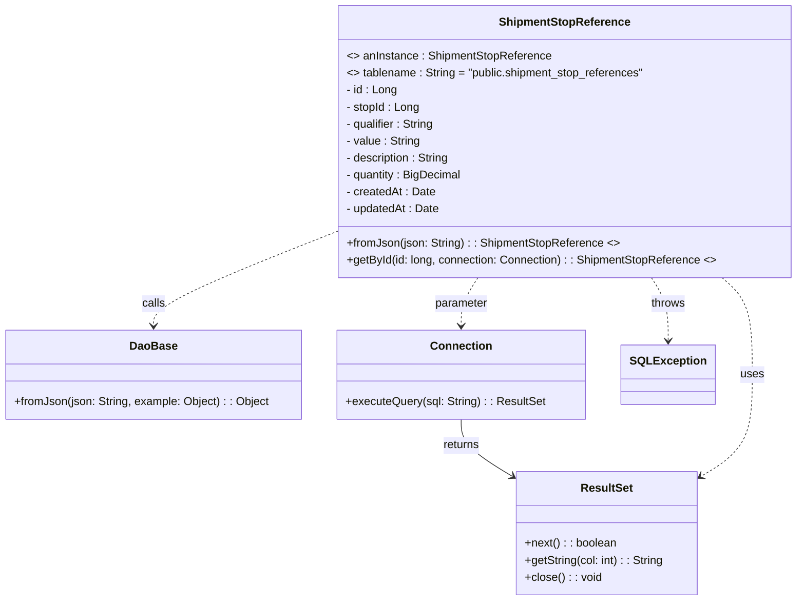

# Diagram: platform-java-lambdas/shipment/src/main/java/com/freightverify/shipment/datastore/postgresql/dao/ShipmentStopReference.java

> Auto-generated by Obscura crawlers

## Mermaid

### SVG

<svg id="container" width="1110.712890625" xmlns="http://www.w3.org/2000/svg" class="classDiagram" height="848" viewBox="0 0 1110.712890625 848" role="graphics-document document" aria-roledescription="class"><g><defs><marker id="container_class-aggregationStart" class="marker aggregation class" refX="18" refY="7" markerWidth="190" markerHeight="240" orient="auto"><path d="M 18,7 L9,13 L1,7 L9,1 Z"></path></marker></defs><defs><marker id="container_class-aggregationEnd" class="marker aggregation class" refX="1" refY="7" markerWidth="20" markerHeight="28" orient="auto"><path d="M 18,7 L9,13 L1,7 L9,1 Z"></path></marker></defs><defs><marker id="container_class-extensionStart" class="marker extension class" refX="18" refY="7" markerWidth="190" markerHeight="240" orient="auto"><path d="M 1,7 L18,13 V 1 Z"></path></marker></defs><defs><marker id="container_class-extensionEnd" class="marker extension class" refX="1" refY="7" markerWidth="20" markerHeight="28" orient="auto"><path d="M 1,1 V 13 L18,7 Z"></path></marker></defs><defs><marker id="container_class-compositionStart" class="marker composition class" refX="18" refY="7" markerWidth="190" markerHeight="240" orient="auto"><path d="M 18,7 L9,13 L1,7 L9,1 Z"></path></marker></defs><defs><marker id="container_class-compositionEnd" class="marker composition class" refX="1" refY="7" markerWidth="20" markerHeight="28" orient="auto"><path d="M 18,7 L9,13 L1,7 L9,1 Z"></path></marker></defs><defs><marker id="container_class-dependencyStart" class="marker dependency class" refX="6" refY="7" markerWidth="190" markerHeight="240" orient="auto"><path d="M 5,7 L9,13 L1,7 L9,1 Z"></path></marker></defs><defs><marker id="container_class-dependencyEnd" class="marker dependency class" refX="13" refY="7" markerWidth="20" markerHeight="28" orient="auto"><path d="M 18,7 L9,13 L14,7 L9,1 Z"></path></marker></defs><defs><marker id="container_class-lollipopStart" class="marker lollipop class" refX="13" refY="7" markerWidth="190" markerHeight="240" orient="auto"><circle stroke="black" fill="transparent" cx="7" cy="7" r="6"></circle></marker></defs><defs><marker id="container_class-lollipopEnd" class="marker lollipop class" refX="1" refY="7" markerWidth="190" markerHeight="240" orient="auto"><circle stroke="black" fill="transparent" cx="7" cy="7" r="6"></circle></marker></defs><g class="root"><g class="clusters"></g><g class="edgePaths"><path d="M469.088,327.027L426.7,344.023C384.313,361.018,299.537,395.009,257.149,417.171C214.762,439.333,214.762,449.667,214.762,454.833L214.762,460" id="id_ShipmentStopReference_DaoBase_1" class="edge-thickness-normal edge-pattern-dashed relation" style=";;;" data-edge="true" data-et="edge" data-id="id_ShipmentStopReference_DaoBase_1" data-points="W3sieCI6NDY5LjA4Nzg5MDYyNSwieSI6MzI3LjAyNzA1MzI3NTU2MzE2fSx7IngiOjIxNC43NjE3MTg3NSwieSI6NDI5fSx7IngiOjIxNC43NjE3MTg3NSwieSI6NDY2fV0=" marker-end="url(#container_class-dependencyEnd)"></path><path d="M666.767,392L662.94,398.167C659.114,404.333,651.461,416.667,647.635,428C643.809,439.333,643.809,449.667,643.809,454.833L643.809,460" id="id_ShipmentStopReference_Connection_2" class="edge-thickness-normal edge-pattern-dashed relation" style=";;;" data-edge="true" data-et="edge" data-id="id_ShipmentStopReference_Connection_2" data-points="W3sieCI6NjY2Ljc2NjY1NzAwMDU0NTgsInkiOjM5Mn0seyJ4Ijo2NDMuODA4NTkzNzUsInkiOjQyOX0seyJ4Ijo2NDMuODA4NTkzNzUsInkiOjQ2Nn1d" marker-end="url(#container_class-dependencyEnd)"></path><path d="M643.809,592L643.809,598.167C643.809,604.333,643.809,616.667,654.794,629.686C665.78,642.706,687.752,656.411,698.738,663.264L709.724,670.117" id="id_Connection_ResultSet_3" class="edge-thickness-normal edge-pattern-solid relation" style=";;;" data-edge="true" data-et="edge" data-id="id_Connection_ResultSet_3" data-points="W3sieCI6NjQzLjgwODU5Mzc1LCJ5Ijo1OTJ9LHsieCI6NjQzLjgwODU5Mzc1LCJ5Ijo2Mjl9LHsieCI6NzE0LjgxNDQ1MzEyNSwieSI6NjczLjI5MjI0MTAzMjA0fV0=" marker-end="url(#container_class-dependencyEnd)"></path><path d="M1000.104,392L1006.984,398.167C1013.864,404.333,1027.623,416.667,1034.503,439.5C1041.383,462.333,1041.383,495.667,1041.383,529C1041.383,562.333,1041.383,595.667,1030.397,619.186C1019.411,642.706,997.439,656.411,986.454,663.264L975.468,670.117" id="id_ShipmentStopReference_ResultSet_4" class="edge-thickness-normal edge-pattern-dashed relation" style=";;;" data-edge="true" data-et="edge" data-id="id_ShipmentStopReference_ResultSet_4" data-points="W3sieCI6MTAwMC4xMDM5OTMyNDUwODc0LCJ5IjozOTJ9LHsieCI6MTA0MS4zODI4MTI1LCJ5Ijo0Mjl9LHsieCI6MTA0MS4zODI4MTI1LCJ5Ijo1Mjl9LHsieCI6MTA0MS4zODI4MTI1LCJ5Ijo2Mjl9LHsieCI6OTcwLjM3Njk1MzEyNSwieSI6NjczLjI5MjI0MTAzMjA0fV0=" marker-end="url(#container_class-dependencyEnd)"></path><path d="M905.034,392L908.86,398.167C912.687,404.333,920.339,416.667,924.166,431.5C927.992,446.333,927.992,463.667,927.992,472.333L927.992,481" id="id_ShipmentStopReference_SQLException_5" class="edge-thickness-normal edge-pattern-dashed relation" style=";;;" data-edge="true" data-et="edge" data-id="id_ShipmentStopReference_SQLException_5" data-points="W3sieCI6OTA1LjAzNDEyNDI0OTQ1NDIsInkiOjM5Mn0seyJ4Ijo5MjcuOTkyMTg3NSwieSI6NDI5fSx7IngiOjkyNy45OTIxODc1LCJ5Ijo0ODd9XQ==" marker-end="url(#container_class-dependencyEnd)"></path></g><g class="edgeLabels"><g class="edgeLabel" transform="translate(214.76171875, 429)"><g class="label" data-id="id_ShipmentStopReference_DaoBase_1" transform="translate(-16.4453125, -12)"><foreignObject width="32.890625" height="24">

calls

</foreignObject></g></g><g class="edgeLabel" transform="translate(643.80859375, 429)"><g class="label" data-id="id_ShipmentStopReference_Connection_2" transform="translate(-37.6171875, -12)"><foreignObject width="75.234375" height="24">

parameter

</foreignObject></g></g><g class="edgeLabel" transform="translate(643.80859375, 629)"><g class="label" data-id="id_Connection_ResultSet_3" transform="translate(-26.265625, -12)"><foreignObject width="52.53125" height="24">

returns

</foreignObject></g></g><g class="edgeLabel" transform="translate(1041.3828125, 529)"><g class="label" data-id="id_ShipmentStopReference_ResultSet_4" transform="translate(-16.4921875, -12)"><foreignObject width="32.984375" height="24">

uses

</foreignObject></g></g><g class="edgeLabel" transform="translate(927.9921875, 429)"><g class="label" data-id="id_ShipmentStopReference_SQLException_5" transform="translate(-24.5703125, -12)"><foreignObject width="49.140625" height="24">

throws

</foreignObject></g></g></g><g class="nodes"><g class="node default" id="classId-ShipmentStopReference-0" transform="translate(785.900390625, 200)"><g class="basic label-container"><path d="M-316.8125 -192 L316.8125 -192 L316.8125 192 L-316.8125 192" stroke="none" stroke-width="0" fill="#ECECFF" style=""></path><path d="M-316.8125 -192 C-142.07737169662178 -192, 32.657756606756436 -192, 316.8125 -192 M-316.8125 -192 C-176.1514746659789 -192, -35.49044933195779 -192, 316.8125 -192 M316.8125 -192 C316.8125 -91.09082254929339, 316.8125 9.818354901413215, 316.8125 192 M316.8125 -192 C316.8125 -91.07163296352093, 316.8125 9.856734072958147, 316.8125 192 M316.8125 192 C169.5942417210654 192, 22.375983442130803 192, -316.8125 192 M316.8125 192 C98.38663873560054 192, -120.03922252879892 192, -316.8125 192 M-316.8125 192 C-316.8125 55.927493968129625, -316.8125 -80.14501206374075, -316.8125 -192 M-316.8125 192 C-316.8125 62.589433022977744, -316.8125 -66.82113395404451, -316.8125 -192" stroke="#9370DB" stroke-width="1.3" fill="none" stroke-dasharray="0 0" style=""></path></g><g class="annotation-group text" transform="translate(0, -168)"></g><g class="label-group text" transform="translate(-88.578125, -168)"><g class="label" style="font-weight: bolder" transform="translate(0,-12)"><foreignObject width="177.15625" height="24">

ShipmentStopReference

</foreignObject></g></g><g class="members-group text" transform="translate(-304.8125, -120)"><g class="label" style="" transform="translate(0,-12)"><foreignObject width="286.734375" height="24">

&lt;&gt; anInstance : ShipmentStopReference

</foreignObject></g><g class="label" style="" transform="translate(0,12)"><foreignObject width="423.671875" height="24">

&lt;&gt; tablename : String = "public.shipment_stop_references"

</foreignObject></g><g class="label" style="" transform="translate(0,36)"><foreignObject width="71.703125" height="24">

- id : Long

</foreignObject></g><g class="label" style="" transform="translate(0,60)"><foreignObject width="103.765625" height="24">

- stopId : Long

</foreignObject></g><g class="label" style="" transform="translate(0,84)"><foreignObject width="126.609375" height="24">

- qualifier : String

</foreignObject></g><g class="label" style="" transform="translate(0,108)"><foreignObject width="104.78125" height="24">

- value : String

</foreignObject></g><g class="label" style="" transform="translate(0,132)"><foreignObject width="148.5" height="24">

- description : String

</foreignObject></g><g class="label" style="" transform="translate(0,156)"><foreignObject width="164.515625" height="24">

- quantity : BigDecimal

</foreignObject></g><g class="label" style="" transform="translate(0,180)"><foreignObject width="125.5" height="24">

- createdAt : Date

</foreignObject></g><g class="label" style="" transform="translate(0,204)"><foreignObject width="131.96875" height="24">

- updatedAt : Date

</foreignObject></g></g><g class="methods-group text" transform="translate(-304.8125, 144)"><g class="label" style="" transform="translate(0,-12)"><foreignObject width="380.875" height="24">

+fromJson(json: String) : : ShipmentStopReference &lt;&gt;

</foreignObject></g><g class="label" style="" transform="translate(0,12)"><foreignObject width="521.046875" height="24">

+getById(id: long, connection: Connection) : : ShipmentStopReference &lt;&gt;

</foreignObject></g></g><g class="divider" style=""><path d="M-316.8125 -144 C-159.11480287387155 -144, -1.4171057477431077 -144, 316.8125 -144 M-316.8125 -144 C-88.17709639419726 -144, 140.45830721160547 -144, 316.8125 -144" stroke="#9370DB" stroke-width="1.3" fill="none" stroke-dasharray="0 0" style=""></path></g><g class="divider" style=""><path d="M-316.8125 120 C-81.35997347510437 120, 154.09255304979126 120, 316.8125 120 M-316.8125 120 C-163.0154104410255 120, -9.218320882050989 120, 316.8125 120" stroke="#9370DB" stroke-width="1.3" fill="none" stroke-dasharray="0 0" style=""></path></g></g><g class="node default" id="classId-DaoBase-1" transform="translate(214.76171875, 529)"><g class="basic label-container"><path d="M-206.76171875 -63 L206.76171875 -63 L206.76171875 63 L-206.76171875 63" stroke="none" stroke-width="0" fill="#ECECFF" style=""></path><path d="M-206.76171875 -63 C-78.27840154449265 -63, 50.204915661014695 -63, 206.76171875 -63 M-206.76171875 -63 C-70.71004564081528 -63, 65.34162746836944 -63, 206.76171875 -63 M206.76171875 -63 C206.76171875 -14.092634271401309, 206.76171875 34.81473145719738, 206.76171875 63 M206.76171875 -63 C206.76171875 -27.538522216618908, 206.76171875 7.922955566762184, 206.76171875 63 M206.76171875 63 C87.37347771113298 63, -32.014763327734045 63, -206.76171875 63 M206.76171875 63 C79.62733331199252 63, -47.50705212601497 63, -206.76171875 63 M-206.76171875 63 C-206.76171875 19.130330849579963, -206.76171875 -24.739338300840075, -206.76171875 -63 M-206.76171875 63 C-206.76171875 16.68334805966382, -206.76171875 -29.633303880672358, -206.76171875 -63" stroke="#9370DB" stroke-width="1.3" fill="none" stroke-dasharray="0 0" style=""></path></g><g class="annotation-group text" transform="translate(0, -39)"></g><g class="label-group text" transform="translate(-31.7109375, -39)"><g class="label" style="font-weight: bolder" transform="translate(0,-12)"><foreignObject width="63.421875" height="24">

DaoBase

</foreignObject></g></g><g class="members-group text" transform="translate(-194.76171875, 9)"></g><g class="methods-group text" transform="translate(-194.76171875, 39)"><g class="label" style="" transform="translate(0,-12)"><foreignObject width="357.8125" height="24">

+fromJson(json: String, example: Object) : : Object

</foreignObject></g></g><g class="divider" style=""><path d="M-206.76171875 -15 C-85.02367689977609 -15, 36.714364950447816 -15, 206.76171875 -15 M-206.76171875 -15 C-90.42918189350145 -15, 25.9033549629971 -15, 206.76171875 -15" stroke="#9370DB" stroke-width="1.3" fill="none" stroke-dasharray="0 0" style=""></path></g><g class="divider" style=""><path d="M-206.76171875 9 C-105.62617484825543 9, -4.490630946510862 9, 206.76171875 9 M-206.76171875 9 C-57.30108139807237 9, 92.15955595385526 9, 206.76171875 9" stroke="#9370DB" stroke-width="1.3" fill="none" stroke-dasharray="0 0" style=""></path></g></g><g class="node default" id="classId-Connection-2" transform="translate(643.80859375, 529)"><g class="basic label-container"><path d="M-172.28515625 -63 L172.28515625 -63 L172.28515625 63 L-172.28515625 63" stroke="none" stroke-width="0" fill="#ECECFF" style=""></path><path d="M-172.28515625 -63 C-93.62061064682696 -63, -14.956065043653922 -63, 172.28515625 -63 M-172.28515625 -63 C-74.19192668389158 -63, 23.90130288221684 -63, 172.28515625 -63 M172.28515625 -63 C172.28515625 -16.108051375677142, 172.28515625 30.783897248645715, 172.28515625 63 M172.28515625 -63 C172.28515625 -21.86654241597509, 172.28515625 19.26691516804982, 172.28515625 63 M172.28515625 63 C100.70320501995705 63, 29.121253789914107 63, -172.28515625 63 M172.28515625 63 C102.17395161898152 63, 32.06274698796304 63, -172.28515625 63 M-172.28515625 63 C-172.28515625 28.80110816129148, -172.28515625 -5.3977836774170385, -172.28515625 -63 M-172.28515625 63 C-172.28515625 28.186611499716875, -172.28515625 -6.62677700056625, -172.28515625 -63" stroke="#9370DB" stroke-width="1.3" fill="none" stroke-dasharray="0 0" style=""></path></g><g class="annotation-group text" transform="translate(0, -39)"></g><g class="label-group text" transform="translate(-41.2265625, -39)"><g class="label" style="font-weight: bolder" transform="translate(0,-12)"><foreignObject width="82.453125" height="24">

Connection

</foreignObject></g></g><g class="members-group text" transform="translate(-160.28515625, 9)"></g><g class="methods-group text" transform="translate(-160.28515625, 39)"><g class="label" style="" transform="translate(0,-12)"><foreignObject width="279.34375" height="24">

+executeQuery(sql: String) : : ResultSet

</foreignObject></g></g><g class="divider" style=""><path d="M-172.28515625 -15 C-93.0581063377725 -15, -13.831056425545 -15, 172.28515625 -15 M-172.28515625 -15 C-68.31668025620353 -15, 35.65179573759295 -15, 172.28515625 -15" stroke="#9370DB" stroke-width="1.3" fill="none" stroke-dasharray="0 0" style=""></path></g><g class="divider" style=""><path d="M-172.28515625 9 C-66.64573663746174 9, 38.993682975076524 9, 172.28515625 9 M-172.28515625 9 C-49.34409537197564 9, 73.59696550604872 9, 172.28515625 9" stroke="#9370DB" stroke-width="1.3" fill="none" stroke-dasharray="0 0" style=""></path></g></g><g class="node default" id="classId-ResultSet-3" transform="translate(842.595703125, 753)"><g class="basic label-container"><path d="M-127.78125 -87 L127.78125 -87 L127.78125 87 L-127.78125 87" stroke="none" stroke-width="0" fill="#ECECFF" style=""></path><path d="M-127.78125 -87 C-68.96441114939819 -87, -10.147572298796376 -87, 127.78125 -87 M-127.78125 -87 C-67.69187214229554 -87, -7.602494284591074 -87, 127.78125 -87 M127.78125 -87 C127.78125 -49.42510888203329, 127.78125 -11.850217764066585, 127.78125 87 M127.78125 -87 C127.78125 -51.053517192932624, 127.78125 -15.107034385865248, 127.78125 87 M127.78125 87 C72.44336282327251 87, 17.10547564654503 87, -127.78125 87 M127.78125 87 C39.729725638879785 87, -48.32179872224043 87, -127.78125 87 M-127.78125 87 C-127.78125 49.017799034576754, -127.78125 11.035598069153508, -127.78125 -87 M-127.78125 87 C-127.78125 44.22622645512413, -127.78125 1.4524529102482546, -127.78125 -87" stroke="#9370DB" stroke-width="1.3" fill="none" stroke-dasharray="0 0" style=""></path></g><g class="annotation-group text" transform="translate(0, -63)"></g><g class="label-group text" transform="translate(-35.21875, -63)"><g class="label" style="font-weight: bolder" transform="translate(0,-12)"><foreignObject width="70.4375" height="24">

ResultSet

</foreignObject></g></g><g class="members-group text" transform="translate(-115.78125, -15)"></g><g class="methods-group text" transform="translate(-115.78125, 15)"><g class="label" style="" transform="translate(0,-12)"><foreignObject width="129.6875" height="24">

+next() : : boolean

</foreignObject></g><g class="label" style="" transform="translate(0,12)"><foreignObject width="196.34375" height="24">

+getString(col: int) : : String

</foreignObject></g><g class="label" style="" transform="translate(0,36)"><foreignObject width="107.78125" height="24">

+close() : : void

</foreignObject></g></g><g class="divider" style=""><path d="M-127.78125 -39 C-71.66287172654495 -39, -15.544493453089899 -39, 127.78125 -39 M-127.78125 -39 C-54.843157564292426 -39, 18.09493487141515 -39, 127.78125 -39" stroke="#9370DB" stroke-width="1.3" fill="none" stroke-dasharray="0 0" style=""></path></g><g class="divider" style=""><path d="M-127.78125 -15 C-35.54618486112048 -15, 56.68888027775904 -15, 127.78125 -15 M-127.78125 -15 C-61.66452162076273 -15, 4.452206758474546 -15, 127.78125 -15" stroke="#9370DB" stroke-width="1.3" fill="none" stroke-dasharray="0 0" style=""></path></g></g><g class="node default" id="classId-SQLException-4" transform="translate(927.9921875, 529)"><g class="basic label-container"><path d="M-61.8984375 -42 L61.8984375 -42 L61.8984375 42 L-61.8984375 42" stroke="none" stroke-width="0" fill="#ECECFF" style=""></path><path d="M-61.8984375 -42 C-12.645988458561234 -42, 36.60646058287753 -42, 61.8984375 -42 M-61.8984375 -42 C-21.691141625710706 -42, 18.516154248578587 -42, 61.8984375 -42 M61.8984375 -42 C61.8984375 -21.596205279113555, 61.8984375 -1.1924105582271096, 61.8984375 42 M61.8984375 -42 C61.8984375 -19.095581163812394, 61.8984375 3.808837672375212, 61.8984375 42 M61.8984375 42 C16.282747443926965 42, -29.33294261214607 42, -61.8984375 42 M61.8984375 42 C35.77520600332058 42, 9.651974506641153 42, -61.8984375 42 M-61.8984375 42 C-61.8984375 11.149740268061834, -61.8984375 -19.700519463876333, -61.8984375 -42 M-61.8984375 42 C-61.8984375 22.32325694365991, -61.8984375 2.64651388731982, -61.8984375 -42" stroke="#9370DB" stroke-width="1.3" fill="none" stroke-dasharray="0 0" style=""></path></g><g class="annotation-group text" transform="translate(0, -18)"></g><g class="label-group text" transform="translate(-49.8984375, -18)"><g class="label" style="font-weight: bolder" transform="translate(0,-12)"><foreignObject width="99.796875" height="24">

SQLException

</foreignObject></g></g><g class="members-group text" transform="translate(-49.8984375, 30)"></g><g class="methods-group text" transform="translate(-49.8984375, 60)"></g><g class="divider" style=""><path d="M-61.8984375 6 C-15.074688810826984 6, 31.74905987834603 6, 61.8984375 6 M-61.8984375 6 C-32.3730179691202 6, -2.8475984382403894 6, 61.8984375 6" stroke="#9370DB" stroke-width="1.3" fill="none" stroke-dasharray="0 0" style=""></path></g><g class="divider" style=""><path d="M-61.8984375 24 C-21.05581914847039 24, 19.786799203059218 24, 61.8984375 24 M-61.8984375 24 C-30.40236153493192 24, 1.0937144301361599 24, 61.8984375 24" stroke="#9370DB" stroke-width="1.3" fill="none" stroke-dasharray="0 0" style=""></path></g></g></g></g></g></svg>
