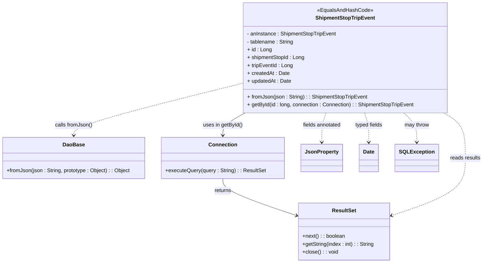
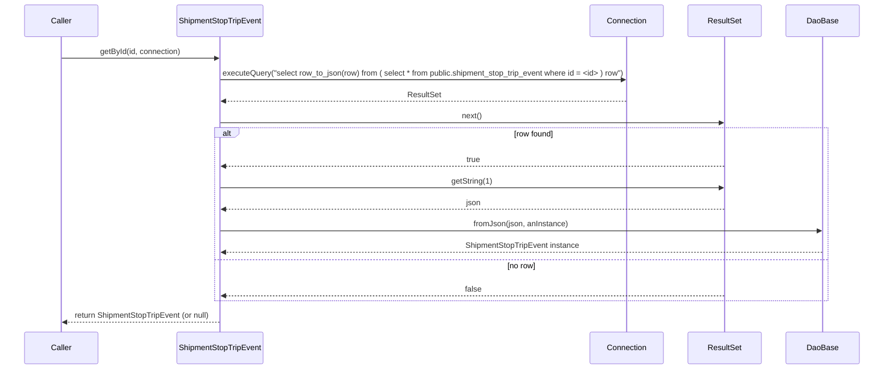

# Diagram: platform-java-lambdas/shipment/src/main/java/com/freightverify/shipment/datastore/postgresql/dao/ShipmentStopTripEvent.java

> Auto-generated by Obscura crawlers

## Diagram 1

### SVG

<svg id="container" width="1445.515625" xmlns="http://www.w3.org/2000/svg" class="classDiagram" height="800" viewBox="0 0 1445.515625 800" role="graphics-document document" aria-roledescription="class"><g><defs><marker id="container_class-aggregationStart" class="marker aggregation class" refX="18" refY="7" markerWidth="190" markerHeight="240" orient="auto"><path d="M 18,7 L9,13 L1,7 L9,1 Z"></path></marker></defs><defs><marker id="container_class-aggregationEnd" class="marker aggregation class" refX="1" refY="7" markerWidth="20" markerHeight="28" orient="auto"><path d="M 18,7 L9,13 L1,7 L9,1 Z"></path></marker></defs><defs><marker id="container_class-extensionStart" class="marker extension class" refX="18" refY="7" markerWidth="190" markerHeight="240" orient="auto"><path d="M 1,7 L18,13 V 1 Z"></path></marker></defs><defs><marker id="container_class-extensionEnd" class="marker extension class" refX="1" refY="7" markerWidth="20" markerHeight="28" orient="auto"><path d="M 1,1 V 13 L18,7 Z"></path></marker></defs><defs><marker id="container_class-compositionStart" class="marker composition class" refX="18" refY="7" markerWidth="190" markerHeight="240" orient="auto"><path d="M 18,7 L9,13 L1,7 L9,1 Z"></path></marker></defs><defs><marker id="container_class-compositionEnd" class="marker composition class" refX="1" refY="7" markerWidth="20" markerHeight="28" orient="auto"><path d="M 18,7 L9,13 L1,7 L9,1 Z"></path></marker></defs><defs><marker id="container_class-dependencyStart" class="marker dependency class" refX="6" refY="7" markerWidth="190" markerHeight="240" orient="auto"><path d="M 5,7 L9,13 L1,7 L9,1 Z"></path></marker></defs><defs><marker id="container_class-dependencyEnd" class="marker dependency class" refX="13" refY="7" markerWidth="20" markerHeight="28" orient="auto"><path d="M 18,7 L9,13 L14,7 L9,1 Z"></path></marker></defs><defs><marker id="container_class-lollipopStart" class="marker lollipop class" refX="13" refY="7" markerWidth="190" markerHeight="240" orient="auto"><circle stroke="black" fill="transparent" cx="7" cy="7" r="6"></circle></marker></defs><defs><marker id="container_class-lollipopEnd" class="marker lollipop class" refX="1" refY="7" markerWidth="190" markerHeight="240" orient="auto"><circle stroke="black" fill="transparent" cx="7" cy="7" r="6"></circle></marker></defs><g class="root"><g class="clusters"></g><g class="edgePaths"><path d="M727.176,254.154L643.303,275.295C559.431,296.436,391.686,338.718,307.814,365.026C223.941,391.333,223.941,401.667,223.941,406.833L223.941,412" id="id_ShipmentStopTripEvent_DaoBase_1" class="edge-thickness-normal edge-pattern-dashed relation" style=";;;" data-edge="true" data-et="edge" data-id="id_ShipmentStopTripEvent_DaoBase_1" data-points="W3sieCI6NzI3LjE3NTc4MTI1LCJ5IjoyNTQuMTUzODkzMDc1NTA4MDV9LHsieCI6MjIzLjk0MTQwNjI1LCJ5IjozODF9LHsieCI6MjIzLjk0MTQwNjI1LCJ5Ijo0MTh9XQ==" marker-end="url(#container_class-dependencyEnd)"></path><path d="M739.697,344L728.776,350.167C717.854,356.333,696.011,368.667,685.089,380C674.168,391.333,674.168,401.667,674.168,406.833L674.168,412" id="id_ShipmentStopTripEvent_Connection_2" class="edge-thickness-normal edge-pattern-solid relation" style=";;;" data-edge="true" data-et="edge" data-id="id_ShipmentStopTripEvent_Connection_2" data-points="W3sieCI6NzM5LjY5NzAyNzQzOTAyNDQsInkiOjM0NH0seyJ4Ijo2NzQuMTY3OTY4NzUsInkiOjM4MX0seyJ4Ijo2NzQuMTY3OTY4NzUsInkiOjQxOH1d" marker-end="url(#container_class-dependencyEnd)"></path><path d="M674.168,544L674.168,550.167C674.168,556.333,674.168,568.667,709.771,587.154C745.374,605.641,816.579,630.282,852.182,642.602L887.785,654.923" id="id_Connection_ResultSet_3" class="edge-thickness-normal edge-pattern-solid relation" style=";;;" data-edge="true" data-et="edge" data-id="id_Connection_ResultSet_3" data-points="W3sieCI6Njc0LjE2Nzk2ODc1LCJ5Ijo1NDR9LHsieCI6Njc0LjE2Nzk2ODc1LCJ5Ijo1ODF9LHsieCI6ODkzLjQ1NTA3ODEyNSwieSI6NjU2Ljg4NTA1NTg0MjMyMjV9XQ==" marker-end="url(#container_class-dependencyEnd)"></path><path d="M1327.002,344L1337.639,350.167C1348.275,356.333,1369.548,368.667,1380.184,391.5C1390.82,414.333,1390.82,447.667,1390.82,481C1390.82,514.333,1390.82,547.667,1355.217,576.654C1319.615,605.641,1248.409,630.282,1212.806,642.602L1177.203,654.923" id="id_ShipmentStopTripEvent_ResultSet_4" class="edge-thickness-normal edge-pattern-dashed relation" style=";;;" data-edge="true" data-et="edge" data-id="id_ShipmentStopTripEvent_ResultSet_4" data-points="W3sieCI6MTMyNy4wMDIzNjI4MDQ4NzgsInkiOjM0NH0seyJ4IjoxMzkwLjgyMDMxMjUsInkiOjM4MX0seyJ4IjoxMzkwLjgyMDMxMjUsInkiOjQ4MX0seyJ4IjoxMzkwLjgyMDMxMjUsInkiOjU4MX0seyJ4IjoxMTcxLjUzMzIwMzEyNSwieSI6NjU2Ljg4NTA1NTg0MjMyMjV9XQ==" marker-end="url(#container_class-dependencyEnd)"></path><path d="M980.509,344L978.427,350.167C976.344,356.333,972.18,368.667,970.098,383.5C968.016,398.333,968.016,415.667,968.016,424.333L968.016,433" id="id_ShipmentStopTripEvent_JsonProperty_5" class="edge-thickness-normal edge-pattern-dashed relation" style=";;;" data-edge="true" data-et="edge" data-id="id_ShipmentStopTripEvent_JsonProperty_5" data-points="W3sieCI6OTgwLjUwODc2NTI0MzkwMjQsInkiOjM0NH0seyJ4Ijo5NjguMDE1NjI1LCJ5IjozODF9LHsieCI6OTY4LjAxNTYyNSwieSI6NDM5fV0=" marker-end="url(#container_class-dependencyEnd)"></path><path d="M1093.96,344L1096.042,350.167C1098.124,356.333,1102.289,368.667,1104.371,383.5C1106.453,398.333,1106.453,415.667,1106.453,424.333L1106.453,433" id="id_ShipmentStopTripEvent_Date_6" class="edge-thickness-normal edge-pattern-dashed relation" style=";;;" data-edge="true" data-et="edge" data-id="id_ShipmentStopTripEvent_Date_6" data-points="W3sieCI6MTA5My45NTk5ODQ3NTYwOTc2LCJ5IjozNDR9LHsieCI6MTEwNi40NTMxMjUsInkiOjM4MX0seyJ4IjoxMTA2LjQ1MzEyNSwieSI6NDM5fV0=" marker-end="url(#container_class-dependencyEnd)"></path><path d="M1209.326,344L1215.642,350.167C1221.959,356.333,1234.593,368.667,1240.91,383.5C1247.227,398.333,1247.227,415.667,1247.227,424.333L1247.227,433" id="id_ShipmentStopTripEvent_SQLException_7" class="edge-thickness-normal edge-pattern-dashed relation" style=";;;" data-edge="true" data-et="edge" data-id="id_ShipmentStopTripEvent_SQLException_7" data-points="W3sieCI6MTIwOS4zMjU1MzM1MzY1ODU1LCJ5IjozNDR9LHsieCI6MTI0Ny4yMjY1NjI1LCJ5IjozODF9LHsieCI6MTI0Ny4yMjY1NjI1LCJ5Ijo0Mzl9XQ==" marker-end="url(#container_class-dependencyEnd)"></path></g><g class="edgeLabels"><g class="edgeLabel" transform="translate(223.94140625, 381)"><g class="label" data-id="id_ShipmentStopTripEvent_DaoBase_1" transform="translate(-56.34375, -12)"><foreignObject width="112.6875" height="24">

calls fromJson()

</foreignObject></g></g><g class="edgeLabel" transform="translate(674.16796875, 381)"><g class="label" data-id="id_ShipmentStopTripEvent_Connection_2" transform="translate(-60.0859375, -12)"><foreignObject width="120.171875" height="24">

uses in getById()

</foreignObject></g></g><g class="edgeLabel" transform="translate(674.16796875, 581)"><g class="label" data-id="id_Connection_ResultSet_3" transform="translate(-26.265625, -12)"><foreignObject width="52.53125" height="24">

returns

</foreignObject></g></g><g class="edgeLabel" transform="translate(1390.8203125, 481)"><g class="label" data-id="id_ShipmentStopTripEvent_ResultSet_4" transform="translate(-46.6953125, -12)"><foreignObject width="93.390625" height="24">

reads results

</foreignObject></g></g><g class="edgeLabel" transform="translate(968.015625, 381)"><g class="label" data-id="id_ShipmentStopTripEvent_JsonProperty_5" transform="translate(-59.40625, -12)"><foreignObject width="118.8125" height="24">

fields annotated

</foreignObject></g></g><g class="edgeLabel" transform="translate(1106.453125, 381)"><g class="label" data-id="id_ShipmentStopTripEvent_Date_6" transform="translate(-42.5859375, -12)"><foreignObject width="85.171875" height="24">

typed fields

</foreignObject></g></g><g class="edgeLabel" transform="translate(1247.2265625, 381)"><g class="label" data-id="id_ShipmentStopTripEvent_SQLException_7" transform="translate(-37.9765625, -12)"><foreignObject width="75.953125" height="24">

may throw

</foreignObject></g></g></g><g class="nodes"><g class="node default" id="classId-ShipmentStopTripEvent-0" transform="translate(1037.234375, 176)"><g class="basic label-container"><path d="M-310.05859375 -168 L310.05859375 -168 L310.05859375 168 L-310.05859375 168" stroke="none" stroke-width="0" fill="#ECECFF" style=""></path><path d="M-310.05859375 -168 C-116.2128705827138 -168, 77.63285258457239 -168, 310.05859375 -168 M-310.05859375 -168 C-161.1707241220732 -168, -12.28285449414642 -168, 310.05859375 -168 M310.05859375 -168 C310.05859375 -44.741378228649424, 310.05859375 78.51724354270115, 310.05859375 168 M310.05859375 -168 C310.05859375 -34.17374850004754, 310.05859375 99.65250299990493, 310.05859375 168 M310.05859375 168 C125.80417392021991 168, -58.45024590956018 168, -310.05859375 168 M310.05859375 168 C67.03190123748641 168, -175.99479127502718 168, -310.05859375 168 M-310.05859375 168 C-310.05859375 64.42657095466471, -310.05859375 -39.14685809067058, -310.05859375 -168 M-310.05859375 168 C-310.05859375 76.93382834694695, -310.05859375 -14.132343306106094, -310.05859375 -168" stroke="#9370DB" stroke-width="1.3" fill="none" stroke-dasharray="0 0" style=""></path></g><g class="annotation-group text" transform="translate(-83.2109375, -144)"><g class="label" style="" transform="translate(0,-12)"><foreignObject width="166.421875" height="24">

«EqualsAndHashCode»

</foreignObject></g></g><g class="label-group text" transform="translate(-86.6015625, -120)"><g class="label" style="font-weight: bolder" transform="translate(0,-12)"><foreignObject width="173.203125" height="24">

ShipmentStopTripEvent

</foreignObject></g></g><g class="members-group text" transform="translate(-298.05859375, -72)"><g class="label" style="" transform="translate(0,-12)"><foreignObject width="273.15625" height="24">

- anInstance : ShipmentStopTripEvent

</foreignObject></g><g class="label" style="" transform="translate(0,12)"><foreignObject width="143.609375" height="24">

- tablename : String

</foreignObject></g><g class="label" style="" transform="translate(0,36)"><foreignObject width="73.234375" height="24">

+ id : Long

</foreignObject></g><g class="label" style="" transform="translate(0,60)"><foreignObject width="175" height="24">

+ shipmentStopId : Long

</foreignObject></g><g class="label" style="" transform="translate(0,84)"><foreignObject width="139.34375" height="24">

+ tripEventId : Long

</foreignObject></g><g class="label" style="" transform="translate(0,108)"><foreignObject width="127.03125" height="24">

+ createdAt : Date

</foreignObject></g><g class="label" style="" transform="translate(0,132)"><foreignObject width="133.515625" height="24">

+ updatedAt : Date

</foreignObject></g></g><g class="methods-group text" transform="translate(-298.05859375, 120)"><g class="label" style="" transform="translate(0,-12)"><foreignObject width="365.34375" height="24">

+ fromJson(json : String) : : ShipmentStopTripEvent

</foreignObject></g><g class="label" style="" transform="translate(0,12)"><foreignObject width="509.515625" height="24">

+ getById(id : long, connection : Connection) : : ShipmentStopTripEvent

</foreignObject></g></g><g class="divider" style=""><path d="M-310.05859375 -96 C-113.12379058331092 -96, 83.81101258337816 -96, 310.05859375 -96 M-310.05859375 -96 C-103.80312970895162 -96, 102.45233433209677 -96, 310.05859375 -96" stroke="#9370DB" stroke-width="1.3" fill="none" stroke-dasharray="0 0" style=""></path></g><g class="divider" style=""><path d="M-310.05859375 96 C-126.65002934247633 96, 56.75853506504734 96, 310.05859375 96 M-310.05859375 96 C-94.91488479747656 96, 120.22882415504688 96, 310.05859375 96" stroke="#9370DB" stroke-width="1.3" fill="none" stroke-dasharray="0 0" style=""></path></g></g><g class="node default" id="classId-DaoBase-1" transform="translate(223.94140625, 481)"><g class="basic label-container"><path d="M-215.94140625 -63 L215.94140625 -63 L215.94140625 63 L-215.94140625 63" stroke="none" stroke-width="0" fill="#ECECFF" style=""></path><path d="M-215.94140625 -63 C-53.840489172013235 -63, 108.26042790597353 -63, 215.94140625 -63 M-215.94140625 -63 C-100.75377908034396 -63, 14.433848089312079 -63, 215.94140625 -63 M215.94140625 -63 C215.94140625 -31.020849100025693, 215.94140625 0.9583017999486145, 215.94140625 63 M215.94140625 -63 C215.94140625 -16.43252285272426, 215.94140625 30.134954294551477, 215.94140625 63 M215.94140625 63 C95.03540091113847 63, -25.870604427723066 63, -215.94140625 63 M215.94140625 63 C61.00765776310183 63, -93.92609072379634 63, -215.94140625 63 M-215.94140625 63 C-215.94140625 18.122606724865975, -215.94140625 -26.75478655026805, -215.94140625 -63 M-215.94140625 63 C-215.94140625 17.441586015412085, -215.94140625 -28.11682796917583, -215.94140625 -63" stroke="#9370DB" stroke-width="1.3" fill="none" stroke-dasharray="0 0" style=""></path></g><g class="annotation-group text" transform="translate(0, -39)"></g><g class="label-group text" transform="translate(-31.7109375, -39)"><g class="label" style="font-weight: bolder" transform="translate(0,-12)"><foreignObject width="63.421875" height="24">

DaoBase

</foreignObject></g></g><g class="members-group text" transform="translate(-203.94140625, 9)"></g><g class="methods-group text" transform="translate(-203.94140625, 39)"><g class="label" style="" transform="translate(0,-12)"><foreignObject width="376.171875" height="24">

+fromJson(json : String, prototype : Object) : : Object

</foreignObject></g></g><g class="divider" style=""><path d="M-215.94140625 -15 C-96.05773251002063 -15, 23.825941229958744 -15, 215.94140625 -15 M-215.94140625 -15 C-128.9798171799656 -15, -42.01822810993124 -15, 215.94140625 -15" stroke="#9370DB" stroke-width="1.3" fill="none" stroke-dasharray="0 0" style=""></path></g><g class="divider" style=""><path d="M-215.94140625 9 C-79.77471816965769 9, 56.39196991068462 9, 215.94140625 9 M-215.94140625 9 C-116.79083163519607 9, -17.64025702039214 9, 215.94140625 9" stroke="#9370DB" stroke-width="1.3" fill="none" stroke-dasharray="0 0" style=""></path></g></g><g class="node default" id="classId-Connection-2" transform="translate(674.16796875, 481)"><g class="basic label-container"><path d="M-184.28515625 -63 L184.28515625 -63 L184.28515625 63 L-184.28515625 63" stroke="none" stroke-width="0" fill="#ECECFF" style=""></path><path d="M-184.28515625 -63 C-62.882061982835765 -63, 58.52103228432847 -63, 184.28515625 -63 M-184.28515625 -63 C-71.73810296707892 -63, 40.80895031584217 -63, 184.28515625 -63 M184.28515625 -63 C184.28515625 -32.78932316613552, 184.28515625 -2.578646332271042, 184.28515625 63 M184.28515625 -63 C184.28515625 -29.332688862250606, 184.28515625 4.334622275498788, 184.28515625 63 M184.28515625 63 C109.68296533579621 63, 35.08077442159242 63, -184.28515625 63 M184.28515625 63 C83.9575447999983 63, -16.370066650003395 63, -184.28515625 63 M-184.28515625 63 C-184.28515625 24.952315507048183, -184.28515625 -13.095368985903633, -184.28515625 -63 M-184.28515625 63 C-184.28515625 24.693288340539738, -184.28515625 -13.613423318920525, -184.28515625 -63" stroke="#9370DB" stroke-width="1.3" fill="none" stroke-dasharray="0 0" style=""></path></g><g class="annotation-group text" transform="translate(0, -39)"></g><g class="label-group text" transform="translate(-41.2265625, -39)"><g class="label" style="font-weight: bolder" transform="translate(0,-12)"><foreignObject width="82.453125" height="24">

Connection

</foreignObject></g></g><g class="members-group text" transform="translate(-172.28515625, 9)"></g><g class="methods-group text" transform="translate(-172.28515625, 39)"><g class="label" style="" transform="translate(0,-12)"><foreignObject width="303.34375" height="24">

+executeQuery(query : String) : : ResultSet

</foreignObject></g></g><g class="divider" style=""><path d="M-184.28515625 -15 C-86.47416891735644 -15, 11.336818415287127 -15, 184.28515625 -15 M-184.28515625 -15 C-94.45733423365382 -15, -4.629512217307649 -15, 184.28515625 -15" stroke="#9370DB" stroke-width="1.3" fill="none" stroke-dasharray="0 0" style=""></path></g><g class="divider" style=""><path d="M-184.28515625 9 C-92.65190380172436 9, -1.0186513534487176 9, 184.28515625 9 M-184.28515625 9 C-89.3533374697723 9, 5.578481310455402 9, 184.28515625 9" stroke="#9370DB" stroke-width="1.3" fill="none" stroke-dasharray="0 0" style=""></path></g></g><g class="node default" id="classId-ResultSet-3" transform="translate(1032.494140625, 705)"><g class="basic label-container"><path d="M-139.0390625 -87 L139.0390625 -87 L139.0390625 87 L-139.0390625 87" stroke="none" stroke-width="0" fill="#ECECFF" style=""></path><path d="M-139.0390625 -87 C-29.776950142864692 -87, 79.48516221427062 -87, 139.0390625 -87 M-139.0390625 -87 C-62.26351118241297 -87, 14.512040135174061 -87, 139.0390625 -87 M139.0390625 -87 C139.0390625 -19.032168792956583, 139.0390625 48.935662414086835, 139.0390625 87 M139.0390625 -87 C139.0390625 -23.280595204945598, 139.0390625 40.438809590108804, 139.0390625 87 M139.0390625 87 C83.32429176649455 87, 27.609521032989107 87, -139.0390625 87 M139.0390625 87 C73.25931110238702 87, 7.479559704774033 87, -139.0390625 87 M-139.0390625 87 C-139.0390625 39.232223119046864, -139.0390625 -8.535553761906272, -139.0390625 -87 M-139.0390625 87 C-139.0390625 36.230473781290776, -139.0390625 -14.539052437418448, -139.0390625 -87" stroke="#9370DB" stroke-width="1.3" fill="none" stroke-dasharray="0 0" style=""></path></g><g class="annotation-group text" transform="translate(0, -63)"></g><g class="label-group text" transform="translate(-35.21875, -63)"><g class="label" style="font-weight: bolder" transform="translate(0,-12)"><foreignObject width="70.4375" height="24">

ResultSet

</foreignObject></g></g><g class="members-group text" transform="translate(-127.0390625, -15)"></g><g class="methods-group text" transform="translate(-127.0390625, 15)"><g class="label" style="" transform="translate(0,-12)"><foreignObject width="129.6875" height="24">

+next() : : boolean

</foreignObject></g><g class="label" style="" transform="translate(0,12)"><foreignObject width="218.859375" height="24">

+getString(index : int) : : String

</foreignObject></g><g class="label" style="" transform="translate(0,36)"><foreignObject width="107.78125" height="24">

+close() : : void

</foreignObject></g></g><g class="divider" style=""><path d="M-139.0390625 -39 C-80.63658753127365 -39, -22.23411256254728 -39, 139.0390625 -39 M-139.0390625 -39 C-81.9174700886669 -39, -24.795877677333806 -39, 139.0390625 -39" stroke="#9370DB" stroke-width="1.3" fill="none" stroke-dasharray="0 0" style=""></path></g><g class="divider" style=""><path d="M-139.0390625 -15 C-47.67415675325471 -15, 43.69074899349059 -15, 139.0390625 -15 M-139.0390625 -15 C-78.89940391930782 -15, -18.759745338615645 -15, 139.0390625 -15" stroke="#9370DB" stroke-width="1.3" fill="none" stroke-dasharray="0 0" style=""></path></g></g><g class="node default" id="classId-JsonProperty-4" transform="translate(968.015625, 481)"><g class="basic label-container"><path d="M-59.5625 -42 L59.5625 -42 L59.5625 42 L-59.5625 42" stroke="none" stroke-width="0" fill="#ECECFF" style=""></path><path d="M-59.5625 -42 C-18.003144243109325 -42, 23.55621151378135 -42, 59.5625 -42 M-59.5625 -42 C-12.53595977325216 -42, 34.49058045349568 -42, 59.5625 -42 M59.5625 -42 C59.5625 -17.677218184408375, 59.5625 6.645563631183251, 59.5625 42 M59.5625 -42 C59.5625 -13.741077227198364, 59.5625 14.517845545603272, 59.5625 42 M59.5625 42 C24.476220764068934 42, -10.610058471862132 42, -59.5625 42 M59.5625 42 C30.7792728078899 42, 1.9960456157797992 42, -59.5625 42 M-59.5625 42 C-59.5625 13.37646648932008, -59.5625 -15.24706702135984, -59.5625 -42 M-59.5625 42 C-59.5625 19.11324788700837, -59.5625 -3.7735042259832596, -59.5625 -42" stroke="#9370DB" stroke-width="1.3" fill="none" stroke-dasharray="0 0" style=""></path></g><g class="annotation-group text" transform="translate(0, -18)"></g><g class="label-group text" transform="translate(-47.5625, -18)"><g class="label" style="font-weight: bolder" transform="translate(0,-12)"><foreignObject width="95.125" height="24">

JsonProperty

</foreignObject></g></g><g class="members-group text" transform="translate(-47.5625, 30)"></g><g class="methods-group text" transform="translate(-47.5625, 60)"></g><g class="divider" style=""><path d="M-59.5625 6 C-31.214434656412724 6, -2.866369312825448 6, 59.5625 6 M-59.5625 6 C-35.33353766453804 6, -11.104575329076077 6, 59.5625 6" stroke="#9370DB" stroke-width="1.3" fill="none" stroke-dasharray="0 0" style=""></path></g><g class="divider" style=""><path d="M-59.5625 24 C-31.13298431830606 24, -2.703468636612122 24, 59.5625 24 M-59.5625 24 C-14.991285645786519 24, 29.579928708426962 24, 59.5625 24" stroke="#9370DB" stroke-width="1.3" fill="none" stroke-dasharray="0 0" style=""></path></g></g><g class="node default" id="classId-Date-5" transform="translate(1106.453125, 481)"><g class="basic label-container"><path d="M-28.875 -42 L28.875 -42 L28.875 42 L-28.875 42" stroke="none" stroke-width="0" fill="#ECECFF" style=""></path><path d="M-28.875 -42 C-11.879394118192021 -42, 5.116211763615958 -42, 28.875 -42 M-28.875 -42 C-8.01784538129522 -42, 12.839309237409559 -42, 28.875 -42 M28.875 -42 C28.875 -18.778835863811047, 28.875 4.442328272377907, 28.875 42 M28.875 -42 C28.875 -18.72970473777982, 28.875 4.540590524440361, 28.875 42 M28.875 42 C13.653351478050531 42, -1.5682970438989372 42, -28.875 42 M28.875 42 C7.027505043699708 42, -14.819989912600583 42, -28.875 42 M-28.875 42 C-28.875 15.81413420542539, -28.875 -10.37173158914922, -28.875 -42 M-28.875 42 C-28.875 20.33808538163111, -28.875 -1.3238292367377795, -28.875 -42" stroke="#9370DB" stroke-width="1.3" fill="none" stroke-dasharray="0 0" style=""></path></g><g class="annotation-group text" transform="translate(0, -18)"></g><g class="label-group text" transform="translate(-16.875, -18)"><g class="label" style="font-weight: bolder" transform="translate(0,-12)"><foreignObject width="33.75" height="24">

Date

</foreignObject></g></g><g class="members-group text" transform="translate(-16.875, 30)"></g><g class="methods-group text" transform="translate(-16.875, 60)"></g><g class="divider" style=""><path d="M-28.875 6 C-16.116652629078935 6, -3.35830525815787 6, 28.875 6 M-28.875 6 C-8.670050799154012 6, 11.534898401691976 6, 28.875 6" stroke="#9370DB" stroke-width="1.3" fill="none" stroke-dasharray="0 0" style=""></path></g><g class="divider" style=""><path d="M-28.875 24 C-15.071886852870295 24, -1.268773705740589 24, 28.875 24 M-28.875 24 C-14.136870488518763 24, 0.6012590229624735 24, 28.875 24" stroke="#9370DB" stroke-width="1.3" fill="none" stroke-dasharray="0 0" style=""></path></g></g><g class="node default" id="classId-SQLException-6" transform="translate(1247.2265625, 481)"><g class="basic label-container"><path d="M-61.8984375 -42 L61.8984375 -42 L61.8984375 42 L-61.8984375 42" stroke="none" stroke-width="0" fill="#ECECFF" style=""></path><path d="M-61.8984375 -42 C-28.543981546153816 -42, 4.810474407692368 -42, 61.8984375 -42 M-61.8984375 -42 C-30.65697598360728 -42, 0.5844855327854432 -42, 61.8984375 -42 M61.8984375 -42 C61.8984375 -8.666536085344632, 61.8984375 24.666927829310737, 61.8984375 42 M61.8984375 -42 C61.8984375 -22.5966815090064, 61.8984375 -3.1933630180128034, 61.8984375 42 M61.8984375 42 C24.511722019774624 42, -12.874993460450753 42, -61.8984375 42 M61.8984375 42 C34.51152650498428 42, 7.124615509968564 42, -61.8984375 42 M-61.8984375 42 C-61.8984375 24.29725975749933, -61.8984375 6.594519514998659, -61.8984375 -42 M-61.8984375 42 C-61.8984375 19.551474803263257, -61.8984375 -2.897050393473485, -61.8984375 -42" stroke="#9370DB" stroke-width="1.3" fill="none" stroke-dasharray="0 0" style=""></path></g><g class="annotation-group text" transform="translate(0, -18)"></g><g class="label-group text" transform="translate(-49.8984375, -18)"><g class="label" style="font-weight: bolder" transform="translate(0,-12)"><foreignObject width="99.796875" height="24">

SQLException

</foreignObject></g></g><g class="members-group text" transform="translate(-49.8984375, 30)"></g><g class="methods-group text" transform="translate(-49.8984375, 60)"></g><g class="divider" style=""><path d="M-61.8984375 6 C-32.43137816555873 6, -2.964318831117467 6, 61.8984375 6 M-61.8984375 6 C-36.58045311483684 6, -11.262468729673678 6, 61.8984375 6" stroke="#9370DB" stroke-width="1.3" fill="none" stroke-dasharray="0 0" style=""></path></g><g class="divider" style=""><path d="M-61.8984375 24 C-34.52531477622179 24, -7.152192052443574 24, 61.8984375 24 M-61.8984375 24 C-35.37243869870178 24, -8.846439897403556 24, 61.8984375 24" stroke="#9370DB" stroke-width="1.3" fill="none" stroke-dasharray="0 0" style=""></path></g></g></g></g></g></svg>

## Diagram 2

### SVG

<svg id="container" width="1908" xmlns="http://www.w3.org/2000/svg" height="799" viewBox="-50 -10 1908 799" role="graphics-document document" aria-roledescription="sequence"><g><rect x="1658" y="713" fill="#eaeaea" stroke="#666" width="150" height="65" name="DaoBase" rx="3" ry="3" class="actor actor-bottom"></rect><text x="1733" y="745.5" dominant-baseline="central" alignment-baseline="central" class="actor actor-box" style="text-anchor: middle; font-size: 16px; font-weight: 400;"><tspan x="1733" dy="0">DaoBase</tspan></text></g><g><rect x="1458" y="713" fill="#eaeaea" stroke="#666" width="150" height="65" name="ResultSet" rx="3" ry="3" class="actor actor-bottom"></rect><text x="1533" y="745.5" dominant-baseline="central" alignment-baseline="central" class="actor actor-box" style="text-anchor: middle; font-size: 16px; font-weight: 400;"><tspan x="1533" dy="0">ResultSet</tspan></text></g><g><rect x="1258" y="713" fill="#eaeaea" stroke="#666" width="150" height="65" name="Connection" rx="3" ry="3" class="actor actor-bottom"></rect><text x="1333" y="745.5" dominant-baseline="central" alignment-baseline="central" class="actor actor-box" style="text-anchor: middle; font-size: 16px; font-weight: 400;"><tspan x="1333" dy="0">Connection</tspan></text></g><g><rect x="331.5" y="713" fill="#eaeaea" stroke="#666" width="191" height="65" name="ShipmentStopTripEvent" rx="3" ry="3" class="actor actor-bottom"></rect><text x="427" y="745.5" dominant-baseline="central" alignment-baseline="central" class="actor actor-box" style="text-anchor: middle; font-size: 16px; font-weight: 400;"><tspan x="427" dy="0">ShipmentStopTripEvent</tspan></text></g><g><rect x="0" y="713" fill="#eaeaea" stroke="#666" width="150" height="65" name="Caller" rx="3" ry="3" class="actor actor-bottom"></rect><text x="75" y="745.5" dominant-baseline="central" alignment-baseline="central" class="actor actor-box" style="text-anchor: middle; font-size: 16px; font-weight: 400;"><tspan x="75" dy="0">Caller</tspan></text></g><g><line id="actor4" x1="1733" y1="65" x2="1733" y2="713" class="actor-line 200" stroke-width="0.5px" stroke="#999" name="DaoBase"></line><g id="root-4"><rect x="1658" y="0" fill="#eaeaea" stroke="#666" width="150" height="65" name="DaoBase" rx="3" ry="3" class="actor actor-top"></rect><text x="1733" y="32.5" dominant-baseline="central" alignment-baseline="central" class="actor actor-box" style="text-anchor: middle; font-size: 16px; font-weight: 400;"><tspan x="1733" dy="0">DaoBase</tspan></text></g></g><g><line id="actor3" x1="1533" y1="65" x2="1533" y2="713" class="actor-line 200" stroke-width="0.5px" stroke="#999" name="ResultSet"></line><g id="root-3"><rect x="1458" y="0" fill="#eaeaea" stroke="#666" width="150" height="65" name="ResultSet" rx="3" ry="3" class="actor actor-top"></rect><text x="1533" y="32.5" dominant-baseline="central" alignment-baseline="central" class="actor actor-box" style="text-anchor: middle; font-size: 16px; font-weight: 400;"><tspan x="1533" dy="0">ResultSet</tspan></text></g></g><g><line id="actor2" x1="1333" y1="65" x2="1333" y2="713" class="actor-line 200" stroke-width="0.5px" stroke="#999" name="Connection"></line><g id="root-2"><rect x="1258" y="0" fill="#eaeaea" stroke="#666" width="150" height="65" name="Connection" rx="3" ry="3" class="actor actor-top"></rect><text x="1333" y="32.5" dominant-baseline="central" alignment-baseline="central" class="actor actor-box" style="text-anchor: middle; font-size: 16px; font-weight: 400;"><tspan x="1333" dy="0">Connection</tspan></text></g></g><g><line id="actor1" x1="427" y1="65" x2="427" y2="713" class="actor-line 200" stroke-width="0.5px" stroke="#999" name="ShipmentStopTripEvent"></line><g id="root-1"><rect x="331.5" y="0" fill="#eaeaea" stroke="#666" width="191" height="65" name="ShipmentStopTripEvent" rx="3" ry="3" class="actor actor-top"></rect><text x="427" y="32.5" dominant-baseline="central" alignment-baseline="central" class="actor actor-box" style="text-anchor: middle; font-size: 16px; font-weight: 400;"><tspan x="427" dy="0">ShipmentStopTripEvent</tspan></text></g></g><g><line id="actor0" x1="75" y1="65" x2="75" y2="713" class="actor-line 200" stroke-width="0.5px" stroke="#999" name="Caller"></line><g id="root-0"><rect x="0" y="0" fill="#eaeaea" stroke="#666" width="150" height="65" name="Caller" rx="3" ry="3" class="actor actor-top"></rect><text x="75" y="32.5" dominant-baseline="central" alignment-baseline="central" class="actor actor-box" style="text-anchor: middle; font-size: 16px; font-weight: 400;"><tspan x="75" dy="0">Caller</tspan></text></g></g><g></g><defs><symbol id="computer" width="24" height="24"><path transform="scale(.5)" d="M2 2v13h20v-13h-20zm18 11h-16v-9h16v9zm-10.228 6l.466-1h3.524l.467 1h-4.457zm14.228 3h-24l2-6h2.104l-1.33 4h18.45l-1.297-4h2.073l2 6zm-5-10h-14v-7h14v7z"></path></symbol></defs><defs><symbol id="database" fill-rule="evenodd" clip-rule="evenodd"><path transform="scale(.5)" d="M12.258.001l.256.004.255.005.253.008.251.01.249.012.247.015.246.016.242.019.241.02.239.023.236.024.233.027.231.028.229.031.225.032.223.034.22.036.217.038.214.04.211.041.208.043.205.045.201.046.198.048.194.05.191.051.187.053.183.054.18.056.175.057.172.059.168.06.163.061.16.063.155.064.15.066.074.033.073.033.071.034.07.034.069.035.068.035.067.035.066.035.064.036.064.036.062.036.06.036.06.037.058.037.058.037.055.038.055.038.053.038.052.038.051.039.05.039.048.039.047.039.045.04.044.04.043.04.041.04.04.041.039.041.037.041.036.041.034.041.033.042.032.042.03.042.029.042.027.042.026.043.024.043.023.043.021.043.02.043.018.044.017.043.015.044.013.044.012.044.011.045.009.044.007.045.006.045.004.045.002.045.001.045v17l-.001.045-.002.045-.004.045-.006.045-.007.045-.009.044-.011.045-.012.044-.013.044-.015.044-.017.043-.018.044-.02.043-.021.043-.023.043-.024.043-.026.043-.027.042-.029.042-.03.042-.032.042-.033.042-.034.041-.036.041-.037.041-.039.041-.04.041-.041.04-.043.04-.044.04-.045.04-.047.039-.048.039-.05.039-.051.039-.052.038-.053.038-.055.038-.055.038-.058.037-.058.037-.06.037-.06.036-.062.036-.064.036-.064.036-.066.035-.067.035-.068.035-.069.035-.07.034-.071.034-.073.033-.074.033-.15.066-.155.064-.16.063-.163.061-.168.06-.172.059-.175.057-.18.056-.183.054-.187.053-.191.051-.194.05-.198.048-.201.046-.205.045-.208.043-.211.041-.214.04-.217.038-.22.036-.223.034-.225.032-.229.031-.231.028-.233.027-.236.024-.239.023-.241.02-.242.019-.246.016-.247.015-.249.012-.251.01-.253.008-.255.005-.256.004-.258.001-.258-.001-.256-.004-.255-.005-.253-.008-.251-.01-.249-.012-.247-.015-.245-.016-.243-.019-.241-.02-.238-.023-.236-.024-.234-.027-.231-.028-.228-.031-.226-.032-.223-.034-.22-.036-.217-.038-.214-.04-.211-.041-.208-.043-.204-.045-.201-.046-.198-.048-.195-.05-.19-.051-.187-.053-.184-.054-.179-.056-.176-.057-.172-.059-.167-.06-.164-.061-.159-.063-.155-.064-.151-.066-.074-.033-.072-.033-.072-.034-.07-.034-.069-.035-.068-.035-.067-.035-.066-.035-.064-.036-.063-.036-.062-.036-.061-.036-.06-.037-.058-.037-.057-.037-.056-.038-.055-.038-.053-.038-.052-.038-.051-.039-.049-.039-.049-.039-.046-.039-.046-.04-.044-.04-.043-.04-.041-.04-.04-.041-.039-.041-.037-.041-.036-.041-.034-.041-.033-.042-.032-.042-.03-.042-.029-.042-.027-.042-.026-.043-.024-.043-.023-.043-.021-.043-.02-.043-.018-.044-.017-.043-.015-.044-.013-.044-.012-.044-.011-.045-.009-.044-.007-.045-.006-.045-.004-.045-.002-.045-.001-.045v-17l.001-.045.002-.045.004-.045.006-.045.007-.045.009-.044.011-.045.012-.044.013-.044.015-.044.017-.043.018-.044.02-.043.021-.043.023-.043.024-.043.026-.043.027-.042.029-.042.03-.042.032-.042.033-.042.034-.041.036-.041.037-.041.039-.041.04-.041.041-.04.043-.04.044-.04.046-.04.046-.039.049-.039.049-.039.051-.039.052-.038.053-.038.055-.038.056-.038.057-.037.058-.037.06-.037.061-.036.062-.036.063-.036.064-.036.066-.035.067-.035.068-.035.069-.035.07-.034.072-.034.072-.033.074-.033.151-.066.155-.064.159-.063.164-.061.167-.06.172-.059.176-.057.179-.056.184-.054.187-.053.19-.051.195-.05.198-.048.201-.046.204-.045.208-.043.211-.041.214-.04.217-.038.22-.036.223-.034.226-.032.228-.031.231-.028.234-.027.236-.024.238-.023.241-.02.243-.019.245-.016.247-.015.249-.012.251-.01.253-.008.255-.005.256-.004.258-.001.258.001zm-9.258 20.499v.01l.001.021.003.021.004.022.005.021.006.022.007.022.009.023.01.022.011.023.012.023.013.023.015.023.016.024.017.023.018.024.019.024.021.024.022.025.023.024.024.025.052.049.056.05.061.051.066.051.07.051.075.051.079.052.084.052.088.052.092.052.097.052.102.051.105.052.11.052.114.051.119.051.123.051.127.05.131.05.135.05.139.048.144.049.147.047.152.047.155.047.16.045.163.045.167.043.171.043.176.041.178.041.183.039.187.039.19.037.194.035.197.035.202.033.204.031.209.03.212.029.216.027.219.025.222.024.226.021.23.02.233.018.236.016.24.015.243.012.246.01.249.008.253.005.256.004.259.001.26-.001.257-.004.254-.005.25-.008.247-.011.244-.012.241-.014.237-.016.233-.018.231-.021.226-.021.224-.024.22-.026.216-.027.212-.028.21-.031.205-.031.202-.034.198-.034.194-.036.191-.037.187-.039.183-.04.179-.04.175-.042.172-.043.168-.044.163-.045.16-.046.155-.046.152-.047.148-.048.143-.049.139-.049.136-.05.131-.05.126-.05.123-.051.118-.052.114-.051.11-.052.106-.052.101-.052.096-.052.092-.052.088-.053.083-.051.079-.052.074-.052.07-.051.065-.051.06-.051.056-.05.051-.05.023-.024.023-.025.021-.024.02-.024.019-.024.018-.024.017-.024.015-.023.014-.024.013-.023.012-.023.01-.023.01-.022.008-.022.006-.022.006-.022.004-.022.004-.021.001-.021.001-.021v-4.127l-.077.055-.08.053-.083.054-.085.053-.087.052-.09.052-.093.051-.095.05-.097.05-.1.049-.102.049-.105.048-.106.047-.109.047-.111.046-.114.045-.115.045-.118.044-.12.043-.122.042-.124.042-.126.041-.128.04-.13.04-.132.038-.134.038-.135.037-.138.037-.139.035-.142.035-.143.034-.144.033-.147.032-.148.031-.15.03-.151.03-.153.029-.154.027-.156.027-.158.026-.159.025-.161.024-.162.023-.163.022-.165.021-.166.02-.167.019-.169.018-.169.017-.171.016-.173.015-.173.014-.175.013-.175.012-.177.011-.178.01-.179.008-.179.008-.181.006-.182.005-.182.004-.184.003-.184.002h-.37l-.184-.002-.184-.003-.182-.004-.182-.005-.181-.006-.179-.008-.179-.008-.178-.01-.176-.011-.176-.012-.175-.013-.173-.014-.172-.015-.171-.016-.17-.017-.169-.018-.167-.019-.166-.02-.165-.021-.163-.022-.162-.023-.161-.024-.159-.025-.157-.026-.156-.027-.155-.027-.153-.029-.151-.03-.15-.03-.148-.031-.146-.032-.145-.033-.143-.034-.141-.035-.14-.035-.137-.037-.136-.037-.134-.038-.132-.038-.13-.04-.128-.04-.126-.041-.124-.042-.122-.042-.12-.044-.117-.043-.116-.045-.113-.045-.112-.046-.109-.047-.106-.047-.105-.048-.102-.049-.1-.049-.097-.05-.095-.05-.093-.052-.09-.051-.087-.052-.085-.053-.083-.054-.08-.054-.077-.054v4.127zm0-5.654v.011l.001.021.003.021.004.021.005.022.006.022.007.022.009.022.01.022.011.023.012.023.013.023.015.024.016.023.017.024.018.024.019.024.021.024.022.024.023.025.024.024.052.05.056.05.061.05.066.051.07.051.075.052.079.051.084.052.088.052.092.052.097.052.102.052.105.052.11.051.114.051.119.052.123.05.127.051.131.05.135.049.139.049.144.048.147.048.152.047.155.046.16.045.163.045.167.044.171.042.176.042.178.04.183.04.187.038.19.037.194.036.197.034.202.033.204.032.209.03.212.028.216.027.219.025.222.024.226.022.23.02.233.018.236.016.24.014.243.012.246.01.249.008.253.006.256.003.259.001.26-.001.257-.003.254-.006.25-.008.247-.01.244-.012.241-.015.237-.016.233-.018.231-.02.226-.022.224-.024.22-.025.216-.027.212-.029.21-.03.205-.032.202-.033.198-.035.194-.036.191-.037.187-.039.183-.039.179-.041.175-.042.172-.043.168-.044.163-.045.16-.045.155-.047.152-.047.148-.048.143-.048.139-.05.136-.049.131-.05.126-.051.123-.051.118-.051.114-.052.11-.052.106-.052.101-.052.096-.052.092-.052.088-.052.083-.052.079-.052.074-.051.07-.052.065-.051.06-.05.056-.051.051-.049.023-.025.023-.024.021-.025.02-.024.019-.024.018-.024.017-.024.015-.023.014-.023.013-.024.012-.022.01-.023.01-.023.008-.022.006-.022.006-.022.004-.021.004-.022.001-.021.001-.021v-4.139l-.077.054-.08.054-.083.054-.085.052-.087.053-.09.051-.093.051-.095.051-.097.05-.1.049-.102.049-.105.048-.106.047-.109.047-.111.046-.114.045-.115.044-.118.044-.12.044-.122.042-.124.042-.126.041-.128.04-.13.039-.132.039-.134.038-.135.037-.138.036-.139.036-.142.035-.143.033-.144.033-.147.033-.148.031-.15.03-.151.03-.153.028-.154.028-.156.027-.158.026-.159.025-.161.024-.162.023-.163.022-.165.021-.166.02-.167.019-.169.018-.169.017-.171.016-.173.015-.173.014-.175.013-.175.012-.177.011-.178.009-.179.009-.179.007-.181.007-.182.005-.182.004-.184.003-.184.002h-.37l-.184-.002-.184-.003-.182-.004-.182-.005-.181-.007-.179-.007-.179-.009-.178-.009-.176-.011-.176-.012-.175-.013-.173-.014-.172-.015-.171-.016-.17-.017-.169-.018-.167-.019-.166-.02-.165-.021-.163-.022-.162-.023-.161-.024-.159-.025-.157-.026-.156-.027-.155-.028-.153-.028-.151-.03-.15-.03-.148-.031-.146-.033-.145-.033-.143-.033-.141-.035-.14-.036-.137-.036-.136-.037-.134-.038-.132-.039-.13-.039-.128-.04-.126-.041-.124-.042-.122-.043-.12-.043-.117-.044-.116-.044-.113-.046-.112-.046-.109-.046-.106-.047-.105-.048-.102-.049-.1-.049-.097-.05-.095-.051-.093-.051-.09-.051-.087-.053-.085-.052-.083-.054-.08-.054-.077-.054v4.139zm0-5.666v.011l.001.02.003.022.004.021.005.022.006.021.007.022.009.023.01.022.011.023.012.023.013.023.015.023.016.024.017.024.018.023.019.024.021.025.022.024.023.024.024.025.052.05.056.05.061.05.066.051.07.051.075.052.079.051.084.052.088.052.092.052.097.052.102.052.105.051.11.052.114.051.119.051.123.051.127.05.131.05.135.05.139.049.144.048.147.048.152.047.155.046.16.045.163.045.167.043.171.043.176.042.178.04.183.04.187.038.19.037.194.036.197.034.202.033.204.032.209.03.212.028.216.027.219.025.222.024.226.021.23.02.233.018.236.017.24.014.243.012.246.01.249.008.253.006.256.003.259.001.26-.001.257-.003.254-.006.25-.008.247-.01.244-.013.241-.014.237-.016.233-.018.231-.02.226-.022.224-.024.22-.025.216-.027.212-.029.21-.03.205-.032.202-.033.198-.035.194-.036.191-.037.187-.039.183-.039.179-.041.175-.042.172-.043.168-.044.163-.045.16-.045.155-.047.152-.047.148-.048.143-.049.139-.049.136-.049.131-.051.126-.05.123-.051.118-.052.114-.051.11-.052.106-.052.101-.052.096-.052.092-.052.088-.052.083-.052.079-.052.074-.052.07-.051.065-.051.06-.051.056-.05.051-.049.023-.025.023-.025.021-.024.02-.024.019-.024.018-.024.017-.024.015-.023.014-.024.013-.023.012-.023.01-.022.01-.023.008-.022.006-.022.006-.022.004-.022.004-.021.001-.021.001-.021v-4.153l-.077.054-.08.054-.083.053-.085.053-.087.053-.09.051-.093.051-.095.051-.097.05-.1.049-.102.048-.105.048-.106.048-.109.046-.111.046-.114.046-.115.044-.118.044-.12.043-.122.043-.124.042-.126.041-.128.04-.13.039-.132.039-.134.038-.135.037-.138.036-.139.036-.142.034-.143.034-.144.033-.147.032-.148.032-.15.03-.151.03-.153.028-.154.028-.156.027-.158.026-.159.024-.161.024-.162.023-.163.023-.165.021-.166.02-.167.019-.169.018-.169.017-.171.016-.173.015-.173.014-.175.013-.175.012-.177.01-.178.01-.179.009-.179.007-.181.006-.182.006-.182.004-.184.003-.184.001-.185.001-.185-.001-.184-.001-.184-.003-.182-.004-.182-.006-.181-.006-.179-.007-.179-.009-.178-.01-.176-.01-.176-.012-.175-.013-.173-.014-.172-.015-.171-.016-.17-.017-.169-.018-.167-.019-.166-.02-.165-.021-.163-.023-.162-.023-.161-.024-.159-.024-.157-.026-.156-.027-.155-.028-.153-.028-.151-.03-.15-.03-.148-.032-.146-.032-.145-.033-.143-.034-.141-.034-.14-.036-.137-.036-.136-.037-.134-.038-.132-.039-.13-.039-.128-.041-.126-.041-.124-.041-.122-.043-.12-.043-.117-.044-.116-.044-.113-.046-.112-.046-.109-.046-.106-.048-.105-.048-.102-.048-.1-.05-.097-.049-.095-.051-.093-.051-.09-.052-.087-.052-.085-.053-.083-.053-.08-.054-.077-.054v4.153zm8.74-8.179l-.257.004-.254.005-.25.008-.247.011-.244.012-.241.014-.237.016-.233.018-.231.021-.226.022-.224.023-.22.026-.216.027-.212.028-.21.031-.205.032-.202.033-.198.034-.194.036-.191.038-.187.038-.183.04-.179.041-.175.042-.172.043-.168.043-.163.045-.16.046-.155.046-.152.048-.148.048-.143.048-.139.049-.136.05-.131.05-.126.051-.123.051-.118.051-.114.052-.11.052-.106.052-.101.052-.096.052-.092.052-.088.052-.083.052-.079.052-.074.051-.07.052-.065.051-.06.05-.056.05-.051.05-.023.025-.023.024-.021.024-.02.025-.019.024-.018.024-.017.023-.015.024-.014.023-.013.023-.012.023-.01.023-.01.022-.008.022-.006.023-.006.021-.004.022-.004.021-.001.021-.001.021.001.021.001.021.004.021.004.022.006.021.006.023.008.022.01.022.01.023.012.023.013.023.014.023.015.024.017.023.018.024.019.024.02.025.021.024.023.024.023.025.051.05.056.05.06.05.065.051.07.052.074.051.079.052.083.052.088.052.092.052.096.052.101.052.106.052.11.052.114.052.118.051.123.051.126.051.131.05.136.05.139.049.143.048.148.048.152.048.155.046.16.046.163.045.168.043.172.043.175.042.179.041.183.04.187.038.191.038.194.036.198.034.202.033.205.032.21.031.212.028.216.027.22.026.224.023.226.022.231.021.233.018.237.016.241.014.244.012.247.011.25.008.254.005.257.004.26.001.26-.001.257-.004.254-.005.25-.008.247-.011.244-.012.241-.014.237-.016.233-.018.231-.021.226-.022.224-.023.22-.026.216-.027.212-.028.21-.031.205-.032.202-.033.198-.034.194-.036.191-.038.187-.038.183-.04.179-.041.175-.042.172-.043.168-.043.163-.045.16-.046.155-.046.152-.048.148-.048.143-.048.139-.049.136-.05.131-.05.126-.051.123-.051.118-.051.114-.052.11-.052.106-.052.101-.052.096-.052.092-.052.088-.052.083-.052.079-.052.074-.051.07-.052.065-.051.06-.05.056-.05.051-.05.023-.025.023-.024.021-.024.02-.025.019-.024.018-.024.017-.023.015-.024.014-.023.013-.023.012-.023.01-.023.01-.022.008-.022.006-.023.006-.021.004-.022.004-.021.001-.021.001-.021-.001-.021-.001-.021-.004-.021-.004-.022-.006-.021-.006-.023-.008-.022-.01-.022-.01-.023-.012-.023-.013-.023-.014-.023-.015-.024-.017-.023-.018-.024-.019-.024-.02-.025-.021-.024-.023-.024-.023-.025-.051-.05-.056-.05-.06-.05-.065-.051-.07-.052-.074-.051-.079-.052-.083-.052-.088-.052-.092-.052-.096-.052-.101-.052-.106-.052-.11-.052-.114-.052-.118-.051-.123-.051-.126-.051-.131-.05-.136-.05-.139-.049-.143-.048-.148-.048-.152-.048-.155-.046-.16-.046-.163-.045-.168-.043-.172-.043-.175-.042-.179-.041-.183-.04-.187-.038-.191-.038-.194-.036-.198-.034-.202-.033-.205-.032-.21-.031-.212-.028-.216-.027-.22-.026-.224-.023-.226-.022-.231-.021-.233-.018-.237-.016-.241-.014-.244-.012-.247-.011-.25-.008-.254-.005-.257-.004-.26-.001-.26.001z"></path></symbol></defs><defs><symbol id="clock" width="24" height="24"><path transform="scale(.5)" d="M12 2c5.514 0 10 4.486 10 10s-4.486 10-10 10-10-4.486-10-10 4.486-10 10-10zm0-2c-6.627 0-12 5.373-12 12s5.373 12 12 12 12-5.373 12-12-5.373-12-12-12zm5.848 12.459c.202.038.202.333.001.372-1.907.361-6.045 1.111-6.547 1.111-.719 0-1.301-.582-1.301-1.301 0-.512.77-5.447 1.125-7.445.034-.192.312-.181.343.014l.985 6.238 5.394 1.011z"></path></symbol></defs><defs><marker id="arrowhead" refX="7.9" refY="5" markerUnits="userSpaceOnUse" markerWidth="12" markerHeight="12" orient="auto-start-reverse"><path d="M -1 0 L 10 5 L 0 10 z"></path></marker></defs><defs><marker id="crosshead" markerWidth="15" markerHeight="8" orient="auto" refX="4" refY="4.5"><path fill="none" stroke="#000000" stroke-width="1pt" d="M 1,2 L 6,7 M 6,2 L 1,7" style="stroke-dasharray: 0, 0;"></path></marker></defs><defs><marker id="filled-head" refX="15.5" refY="7" markerWidth="20" markerHeight="28" orient="auto"><path d="M 18,7 L9,13 L14,7 L9,1 Z"></path></marker></defs><defs><marker id="sequencenumber" refX="15" refY="15" markerWidth="60" markerHeight="40" orient="auto"><circle cx="15" cy="15" r="6"></circle></marker></defs><g><line x1="416" y1="267" x2="1744" y2="267" class="loopLine"></line><line x1="1744" y1="267" x2="1744" y2="645" class="loopLine"></line><line x1="416" y1="645" x2="1744" y2="645" class="loopLine"></line><line x1="416" y1="267" x2="416" y2="645" class="loopLine"></line><line x1="416" y1="557" x2="1744" y2="557" class="loopLine" style="stroke-dasharray: 3, 3;"></line><polygon points="416,267 466,267 466,280 457.6,287 416,287" class="labelBox"></polygon><text x="441" y="280" text-anchor="middle" dominant-baseline="middle" alignment-baseline="middle" class="labelText" style="font-size: 16px; font-weight: 400;">alt</text><text x="1105" y="285" text-anchor="middle" class="loopText" style="font-size: 16px; font-weight: 400;"><tspan x="1105">[row found]</tspan></text><text x="1080" y="575" text-anchor="middle" class="loopText" style="font-size: 16px; font-weight: 400;">[no row]</text></g><text x="250" y="80" text-anchor="middle" dominant-baseline="middle" alignment-baseline="middle" class="messageText" dy="1em" style="font-size: 16px; font-weight: 400;">getById(id, connection)</text><line x1="76" y1="113" x2="423" y2="113" class="messageLine0" stroke-width="2" stroke="none" marker-end="url(#arrowhead)" style="fill: none;"></line><text x="879" y="128" text-anchor="middle" dominant-baseline="middle" alignment-baseline="middle" class="messageText" dy="1em" style="font-size: 16px; font-weight: 400;">executeQuery("select row_to_json(row) from ( select * from public.shipment_stop_trip_event where id = &lt;id&gt; ) row")</text><line x1="428" y1="161" x2="1329" y2="161" class="messageLine0" stroke-width="2" stroke="none" marker-end="url(#arrowhead)" style="fill: none;"></line><text x="882" y="176" text-anchor="middle" dominant-baseline="middle" alignment-baseline="middle" class="messageText" dy="1em" style="font-size: 16px; font-weight: 400;">ResultSet</text><line x1="1332" y1="209" x2="431" y2="209" class="messageLine1" stroke-width="2" stroke="none" marker-end="url(#arrowhead)" style="stroke-dasharray: 3, 3; fill: none;"></line><text x="979" y="224" text-anchor="middle" dominant-baseline="middle" alignment-baseline="middle" class="messageText" dy="1em" style="font-size: 16px; font-weight: 400;">next()</text><line x1="428" y1="257" x2="1529" y2="257" class="messageLine0" stroke-width="2" stroke="none" marker-end="url(#arrowhead)" style="fill: none;"></line><text x="982" y="317" text-anchor="middle" dominant-baseline="middle" alignment-baseline="middle" class="messageText" dy="1em" style="font-size: 16px; font-weight: 400;">true</text><line x1="1532" y1="350" x2="431" y2="350" class="messageLine1" stroke-width="2" stroke="none" marker-end="url(#arrowhead)" style="stroke-dasharray: 3, 3; fill: none;"></line><text x="979" y="365" text-anchor="middle" dominant-baseline="middle" alignment-baseline="middle" class="messageText" dy="1em" style="font-size: 16px; font-weight: 400;">getString(1)</text><line x1="428" y1="398" x2="1529" y2="398" class="messageLine0" stroke-width="2" stroke="none" marker-end="url(#arrowhead)" style="fill: none;"></line><text x="982" y="413" text-anchor="middle" dominant-baseline="middle" alignment-baseline="middle" class="messageText" dy="1em" style="font-size: 16px; font-weight: 400;">json</text><line x1="1532" y1="446" x2="431" y2="446" class="messageLine1" stroke-width="2" stroke="none" marker-end="url(#arrowhead)" style="stroke-dasharray: 3, 3; fill: none;"></line><text x="1079" y="461" text-anchor="middle" dominant-baseline="middle" alignment-baseline="middle" class="messageText" dy="1em" style="font-size: 16px; font-weight: 400;">fromJson(json, anInstance)</text><line x1="428" y1="494" x2="1729" y2="494" class="messageLine0" stroke-width="2" stroke="none" marker-end="url(#arrowhead)" style="fill: none;"></line><text x="1082" y="509" text-anchor="middle" dominant-baseline="middle" alignment-baseline="middle" class="messageText" dy="1em" style="font-size: 16px; font-weight: 400;">ShipmentStopTripEvent instance</text><line x1="1732" y1="542" x2="431" y2="542" class="messageLine1" stroke-width="2" stroke="none" marker-end="url(#arrowhead)" style="stroke-dasharray: 3, 3; fill: none;"></line><text x="982" y="602" text-anchor="middle" dominant-baseline="middle" alignment-baseline="middle" class="messageText" dy="1em" style="font-size: 16px; font-weight: 400;">false</text><line x1="1532" y1="635" x2="431" y2="635" class="messageLine1" stroke-width="2" stroke="none" marker-end="url(#arrowhead)" style="stroke-dasharray: 3, 3; fill: none;"></line><text x="253" y="660" text-anchor="middle" dominant-baseline="middle" alignment-baseline="middle" class="messageText" dy="1em" style="font-size: 16px; font-weight: 400;">return ShipmentStopTripEvent (or null)</text><line x1="426" y1="693" x2="79" y2="693" class="messageLine1" stroke-width="2" stroke="none" marker-end="url(#arrowhead)" style="stroke-dasharray: 3, 3; fill: none;"></line></svg>
