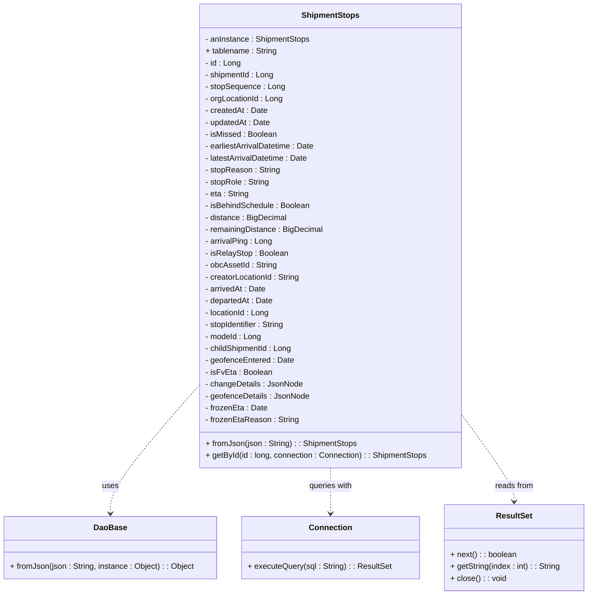

# Diagram: platform-java-lambdas/shipment/src/main/java/com/freightverify/shipment/datastore/postgresql/dao/ShipmentStops.java

> Auto-generated by Obscura crawlers

## Mermaid

### SVG

<svg id="container" width="1177.484375" xmlns="http://www.w3.org/2000/svg" class="classDiagram" height="1200" viewBox="0 0 1177.484375 1200" role="graphics-document document" aria-roledescription="class"><g><defs><marker id="container_class-aggregationStart" class="marker aggregation class" refX="18" refY="7" markerWidth="190" markerHeight="240" orient="auto"><path d="M 18,7 L9,13 L1,7 L9,1 Z"></path></marker></defs><defs><marker id="container_class-aggregationEnd" class="marker aggregation class" refX="1" refY="7" markerWidth="20" markerHeight="28" orient="auto"><path d="M 18,7 L9,13 L1,7 L9,1 Z"></path></marker></defs><defs><marker id="container_class-extensionStart" class="marker extension class" refX="18" refY="7" markerWidth="190" markerHeight="240" orient="auto"><path d="M 1,7 L18,13 V 1 Z"></path></marker></defs><defs><marker id="container_class-extensionEnd" class="marker extension class" refX="1" refY="7" markerWidth="20" markerHeight="28" orient="auto"><path d="M 1,1 V 13 L18,7 Z"></path></marker></defs><defs><marker id="container_class-compositionStart" class="marker composition class" refX="18" refY="7" markerWidth="190" markerHeight="240" orient="auto"><path d="M 18,7 L9,13 L1,7 L9,1 Z"></path></marker></defs><defs><marker id="container_class-compositionEnd" class="marker composition class" refX="1" refY="7" markerWidth="20" markerHeight="28" orient="auto"><path d="M 18,7 L9,13 L1,7 L9,1 Z"></path></marker></defs><defs><marker id="container_class-dependencyStart" class="marker dependency class" refX="6" refY="7" markerWidth="190" markerHeight="240" orient="auto"><path d="M 5,7 L9,13 L1,7 L9,1 Z"></path></marker></defs><defs><marker id="container_class-dependencyEnd" class="marker dependency class" refX="13" refY="7" markerWidth="20" markerHeight="28" orient="auto"><path d="M 18,7 L9,13 L14,7 L9,1 Z"></path></marker></defs><defs><marker id="container_class-lollipopStart" class="marker lollipop class" refX="13" refY="7" markerWidth="190" markerHeight="240" orient="auto"><circle stroke="black" fill="transparent" cx="7" cy="7" r="6"></circle></marker></defs><defs><marker id="container_class-lollipopEnd" class="marker lollipop class" refX="1" refY="7" markerWidth="190" markerHeight="240" orient="auto"><circle stroke="black" fill="transparent" cx="7" cy="7" r="6"></circle></marker></defs><g class="root"><g class="clusters"></g><g class="edgePaths"><path d="M396.223,779.869L367.043,813.391C337.863,846.913,279.504,913.956,250.324,956.645C221.145,999.333,221.145,1017.667,221.145,1026.833L221.145,1036" id="id_ShipmentStops_DaoBase_1" class="edge-thickness-normal edge-pattern-dashed relation" style=";;;" data-edge="true" data-et="edge" data-id="id_ShipmentStops_DaoBase_1" data-points="W3sieCI6Mzk2LjIyMjY1NjI1LCJ5Ijo3NzkuODY4Nzg2MzIyMzU1OH0seyJ4IjoyMjEuMTQ0NTMxMjUsInkiOjk4MX0seyJ4IjoyMjEuMTQ0NTMxMjUsInkiOjEwNDJ9XQ==" marker-end="url(#container_class-dependencyEnd)"></path><path d="M660.73,944L660.73,950.167C660.73,956.333,660.73,968.667,660.73,984C660.73,999.333,660.73,1017.667,660.73,1026.833L660.73,1036" id="id_ShipmentStops_Connection_2" class="edge-thickness-normal edge-pattern-dashed relation" style=";;;" data-edge="true" data-et="edge" data-id="id_ShipmentStops_Connection_2" data-points="W3sieCI6NjYwLjczMDQ2ODc1LCJ5Ijo5NDR9LHsieCI6NjYwLjczMDQ2ODc1LCJ5Ijo5ODF9LHsieCI6NjYwLjczMDQ2ODc1LCJ5IjoxMDQyfV0=" marker-end="url(#container_class-dependencyEnd)"></path><path d="M925.238,839.377L942.42,862.981C959.602,886.585,993.965,933.792,1011.146,962.563C1028.328,991.333,1028.328,1001.667,1028.328,1006.833L1028.328,1012" id="id_ShipmentStops_ResultSet_3" class="edge-thickness-normal edge-pattern-dashed relation" style=";;;" data-edge="true" data-et="edge" data-id="id_ShipmentStops_ResultSet_3" data-points="W3sieCI6OTI1LjIzODI4MTI1LCJ5Ijo4MzkuMzc2NzYwMDAyMTI1NH0seyJ4IjoxMDI4LjMyODEyNSwieSI6OTgxfSx7IngiOjEwMjguMzI4MTI1LCJ5IjoxMDE4fV0=" marker-end="url(#container_class-dependencyEnd)"></path></g><g class="edgeLabels"><g class="edgeLabel" transform="translate(221.14453125, 981)"><g class="label" data-id="id_ShipmentStops_DaoBase_1" transform="translate(-16.4921875, -12)"><foreignObject width="32.984375" height="24">

uses

</foreignObject></g></g><g class="edgeLabel" transform="translate(660.73046875, 981)"><g class="label" data-id="id_ShipmentStops_Connection_2" transform="translate(-44.9296875, -12)"><foreignObject width="89.859375" height="24">

queries with

</foreignObject></g></g><g class="edgeLabel" transform="translate(1028.328125, 981)"><g class="label" data-id="id_ShipmentStops_ResultSet_3" transform="translate(-39.1796875, -12)"><foreignObject width="78.359375" height="24">

reads from

</foreignObject></g></g></g><g class="nodes"><g class="node default" id="classId-ShipmentStops-0" transform="translate(660.73046875, 476)"><g class="basic label-container"><path d="M-264.5078125 -468 L264.5078125 -468 L264.5078125 468 L-264.5078125 468" stroke="none" stroke-width="0" fill="#ECECFF" style=""></path><path d="M-264.5078125 -468 C-153.1897397435098 -468, -41.87166698701955 -468, 264.5078125 -468 M-264.5078125 -468 C-100.61600298000835 -468, 63.27580653998331 -468, 264.5078125 -468 M264.5078125 -468 C264.5078125 -271.69782905549755, 264.5078125 -75.39565811099504, 264.5078125 468 M264.5078125 -468 C264.5078125 -98.01167806250646, 264.5078125 271.9766438749871, 264.5078125 468 M264.5078125 468 C112.10384521626176 468, -40.30012206747648 468, -264.5078125 468 M264.5078125 468 C110.62510250896915 468, -43.2576074820617 468, -264.5078125 468 M-264.5078125 468 C-264.5078125 118.53973114005487, -264.5078125 -230.92053771989026, -264.5078125 -468 M-264.5078125 468 C-264.5078125 227.36289445610177, -264.5078125 -13.27421108779646, -264.5078125 -468" stroke="#9370DB" stroke-width="1.3" fill="none" stroke-dasharray="0 0" style=""></path></g><g class="annotation-group text" transform="translate(0, -444)"></g><g class="label-group text" transform="translate(-55.9375, -444)"><g class="label" style="font-weight: bolder" transform="translate(0,-12)"><foreignObject width="111.875" height="24">

ShipmentStops

</foreignObject></g></g><g class="members-group text" transform="translate(-252.5078125, -396)"><g class="label" style="" transform="translate(0,-12)"><foreignObject width="212.734375" height="24">

- anInstance : ShipmentStops

</foreignObject></g><g class="label" style="" transform="translate(0,12)"><foreignObject width="145.140625" height="24">

+ tablename : String

</foreignObject></g><g class="label" style="" transform="translate(0,36)"><foreignObject width="71.703125" height="24">

- id : Long

</foreignObject></g><g class="label" style="" transform="translate(0,60)"><foreignObject width="140.359375" height="24">

- shipmentId : Long

</foreignObject></g><g class="label" style="" transform="translate(0,84)"><foreignObject width="159.9375" height="24">

- stopSequence : Long

</foreignObject></g><g class="label" style="" transform="translate(0,108)"><foreignObject width="157.625" height="24">

- orgLocationId : Long

</foreignObject></g><g class="label" style="" transform="translate(0,132)"><foreignObject width="125.5" height="24">

- createdAt : Date

</foreignObject></g><g class="label" style="" transform="translate(0,156)"><foreignObject width="131.96875" height="24">

- updatedAt : Date

</foreignObject></g><g class="label" style="" transform="translate(0,180)"><foreignObject width="144.703125" height="24">

- isMissed : Boolean

</foreignObject></g><g class="label" style="" transform="translate(0,204)"><foreignObject width="223.4375" height="24">

- earliestArrivalDatetime : Date

</foreignObject></g><g class="label" style="" transform="translate(0,228)"><foreignObject width="209.640625" height="24">

- latestArrivalDatetime : Date

</foreignObject></g><g class="label" style="" transform="translate(0,252)"><foreignObject width="150.484375" height="24">

- stopReason : String

</foreignObject></g><g class="label" style="" transform="translate(0,276)"><foreignObject width="129.859375" height="24">

- stopRole : String

</foreignObject></g><g class="label" style="" transform="translate(0,300)"><foreignObject width="88.984375" height="24">

- eta : String

</foreignObject></g><g class="label" style="" transform="translate(0,324)"><foreignObject width="212.609375" height="24">

- isBehindSchedule : Boolean

</foreignObject></g><g class="label" style="" transform="translate(0,348)"><foreignObject width="165.046875" height="24">

- distance : BigDecimal

</foreignObject></g><g class="label" style="" transform="translate(0,372)"><foreignObject width="238.71875" height="24">

- remainingDistance : BigDecimal

</foreignObject></g><g class="label" style="" transform="translate(0,396)"><foreignObject width="135.546875" height="24">

- arrivalPing : Long

</foreignObject></g><g class="label" style="" transform="translate(0,420)"><foreignObject width="166.875" height="24">

- isRelayStop : Boolean

</foreignObject></g><g class="label" style="" transform="translate(0,444)"><foreignObject width="145.125" height="24">

- obcAssetId : String

</foreignObject></g><g class="label" style="" transform="translate(0,468)"><foreignObject width="193.953125" height="24">

- creatorLocationId : String

</foreignObject></g><g class="label" style="" transform="translate(0,492)"><foreignObject width="122.734375" height="24">

- arrivedAt : Date

</foreignObject></g><g class="label" style="" transform="translate(0,516)"><foreignObject width="137.40625" height="24">

- departedAt : Date

</foreignObject></g><g class="label" style="" transform="translate(0,540)"><foreignObject width="131.0625" height="24">

- locationId : Long

</foreignObject></g><g class="label" style="" transform="translate(0,564)"><foreignObject width="164.515625" height="24">

- stopIdentifier : String

</foreignObject></g><g class="label" style="" transform="translate(0,588)"><foreignObject width="113.25" height="24">

- modeId : Long

</foreignObject></g><g class="label" style="" transform="translate(0,612)"><foreignObject width="177.3125" height="24">

- childShipmentId : Long

</foreignObject></g><g class="label" style="" transform="translate(0,636)"><foreignObject width="177.609375" height="24">

- geofenceEntered : Date

</foreignObject></g><g class="label" style="" transform="translate(0,660)"><foreignObject width="132.53125" height="24">

- isFvEta : Boolean

</foreignObject></g><g class="label" style="" transform="translate(0,684)"><foreignObject width="194.59375" height="24">

- changeDetails : JsonNode

</foreignObject></g><g class="label" style="" transform="translate(0,708)"><foreignObject width="208.1875" height="24">

- geofenceDetails : JsonNode

</foreignObject></g><g class="label" style="" transform="translate(0,732)"><foreignObject width="124.09375" height="24">

- frozenEta : Date

</foreignObject></g><g class="label" style="" transform="translate(0,756)"><foreignObject width="186.59375" height="24">

- frozenEtaReason : String

</foreignObject></g></g><g class="methods-group text" transform="translate(-252.5078125, 420)"><g class="label" style="" transform="translate(0,-12)"><foreignObject width="304.90625" height="24">

+ fromJson(json : String) : : ShipmentStops

</foreignObject></g><g class="label" style="" transform="translate(0,12)"><foreignObject width="449.078125" height="24">

+ getById(id : long, connection : Connection) : : ShipmentStops

</foreignObject></g></g><g class="divider" style=""><path d="M-264.5078125 -420 C-129.8461208585487 -420, 4.8155707829026255 -420, 264.5078125 -420 M-264.5078125 -420 C-61.59317559708205 -420, 141.3214613058359 -420, 264.5078125 -420" stroke="#9370DB" stroke-width="1.3" fill="none" stroke-dasharray="0 0" style=""></path></g><g class="divider" style=""><path d="M-264.5078125 396 C-111.67019078707872 396, 41.16743092584255 396, 264.5078125 396 M-264.5078125 396 C-55.2393019700624 396, 154.0292085598752 396, 264.5078125 396" stroke="#9370DB" stroke-width="1.3" fill="none" stroke-dasharray="0 0" style=""></path></g></g><g class="node default" id="classId-DaoBase-1" transform="translate(221.14453125, 1105)"><g class="basic label-container"><path d="M-213.14453125 -63 L213.14453125 -63 L213.14453125 63 L-213.14453125 63" stroke="none" stroke-width="0" fill="#ECECFF" style=""></path><path d="M-213.14453125 -63 C-49.74501800601007 -63, 113.65449523797986 -63, 213.14453125 -63 M-213.14453125 -63 C-51.6353001789806 -63, 109.8739308920388 -63, 213.14453125 -63 M213.14453125 -63 C213.14453125 -13.175783331310747, 213.14453125 36.648433337378506, 213.14453125 63 M213.14453125 -63 C213.14453125 -19.13695776122571, 213.14453125 24.726084477548582, 213.14453125 63 M213.14453125 63 C61.00153029640171 63, -91.14147065719658 63, -213.14453125 63 M213.14453125 63 C89.54013180368574 63, -34.06426764262852 63, -213.14453125 63 M-213.14453125 63 C-213.14453125 36.11470997710643, -213.14453125 9.229419954212858, -213.14453125 -63 M-213.14453125 63 C-213.14453125 28.901737436510842, -213.14453125 -5.196525126978315, -213.14453125 -63" stroke="#9370DB" stroke-width="1.3" fill="none" stroke-dasharray="0 0" style=""></path></g><g class="annotation-group text" transform="translate(0, -39)"></g><g class="label-group text" transform="translate(-31.7109375, -39)"><g class="label" style="font-weight: bolder" transform="translate(0,-12)"><foreignObject width="63.421875" height="24">

DaoBase

</foreignObject></g></g><g class="members-group text" transform="translate(-201.14453125, 9)"></g><g class="methods-group text" transform="translate(-201.14453125, 39)"><g class="label" style="" transform="translate(0,-12)"><foreignObject width="370.578125" height="24">

+ fromJson(json : String, instance : Object) : : Object

</foreignObject></g></g><g class="divider" style=""><path d="M-213.14453125 -15 C-117.01605374411298 -15, -20.88757623822596 -15, 213.14453125 -15 M-213.14453125 -15 C-83.68949539691502 -15, 45.76554045616996 -15, 213.14453125 -15" stroke="#9370DB" stroke-width="1.3" fill="none" stroke-dasharray="0 0" style=""></path></g><g class="divider" style=""><path d="M-213.14453125 9 C-70.79964031559538 9, 71.54525061880923 9, 213.14453125 9 M-213.14453125 9 C-53.50969075068306 9, 106.12514974863387 9, 213.14453125 9" stroke="#9370DB" stroke-width="1.3" fill="none" stroke-dasharray="0 0" style=""></path></g></g><g class="node default" id="classId-Connection-2" transform="translate(660.73046875, 1105)"><g class="basic label-container"><path d="M-176.44140625 -63 L176.44140625 -63 L176.44140625 63 L-176.44140625 63" stroke="none" stroke-width="0" fill="#ECECFF" style=""></path><path d="M-176.44140625 -63 C-60.00431282186686 -63, 56.43278060626628 -63, 176.44140625 -63 M-176.44140625 -63 C-35.84270531337063 -63, 104.75599562325874 -63, 176.44140625 -63 M176.44140625 -63 C176.44140625 -30.226436639099205, 176.44140625 2.5471267218015896, 176.44140625 63 M176.44140625 -63 C176.44140625 -28.691950110323603, 176.44140625 5.616099779352794, 176.44140625 63 M176.44140625 63 C61.25613435311095 63, -53.9291375437781 63, -176.44140625 63 M176.44140625 63 C93.41248048288064 63, 10.383554715761278 63, -176.44140625 63 M-176.44140625 63 C-176.44140625 22.81799403658168, -176.44140625 -17.36401192683664, -176.44140625 -63 M-176.44140625 63 C-176.44140625 36.441712759565604, -176.44140625 9.883425519131215, -176.44140625 -63" stroke="#9370DB" stroke-width="1.3" fill="none" stroke-dasharray="0 0" style=""></path></g><g class="annotation-group text" transform="translate(0, -39)"></g><g class="label-group text" transform="translate(-41.2265625, -39)"><g class="label" style="font-weight: bolder" transform="translate(0,-12)"><foreignObject width="82.453125" height="24">

Connection

</foreignObject></g></g><g class="members-group text" transform="translate(-164.44140625, 9)"></g><g class="methods-group text" transform="translate(-164.44140625, 39)"><g class="label" style="" transform="translate(0,-12)"><foreignObject width="287.65625" height="24">

+ executeQuery(sql : String) : : ResultSet

</foreignObject></g></g><g class="divider" style=""><path d="M-176.44140625 -15 C-65.07525315183716 -15, 46.29089994632568 -15, 176.44140625 -15 M-176.44140625 -15 C-81.017087267517 -15, 14.407231714966002 -15, 176.44140625 -15" stroke="#9370DB" stroke-width="1.3" fill="none" stroke-dasharray="0 0" style=""></path></g><g class="divider" style=""><path d="M-176.44140625 9 C-68.00587217965882 9, 40.429661890682354 9, 176.44140625 9 M-176.44140625 9 C-99.44596309758894 9, -22.450519945177888 9, 176.44140625 9" stroke="#9370DB" stroke-width="1.3" fill="none" stroke-dasharray="0 0" style=""></path></g></g><g class="node default" id="classId-ResultSet-3" transform="translate(1028.328125, 1105)"><g class="basic label-container"><path d="M-141.15625 -87 L141.15625 -87 L141.15625 87 L-141.15625 87" stroke="none" stroke-width="0" fill="#ECECFF" style=""></path><path d="M-141.15625 -87 C-32.74960348990729 -87, 75.65704302018543 -87, 141.15625 -87 M-141.15625 -87 C-78.31862179212064 -87, -15.48099358424129 -87, 141.15625 -87 M141.15625 -87 C141.15625 -31.050618808298097, 141.15625 24.898762383403806, 141.15625 87 M141.15625 -87 C141.15625 -46.73061724666791, 141.15625 -6.461234493335823, 141.15625 87 M141.15625 87 C60.46042426820546 87, -20.235401463589085 87, -141.15625 87 M141.15625 87 C47.2894585582322 87, -46.577332883535604 87, -141.15625 87 M-141.15625 87 C-141.15625 27.120683046675737, -141.15625 -32.75863390664853, -141.15625 -87 M-141.15625 87 C-141.15625 43.981482885268356, -141.15625 0.9629657705367123, -141.15625 -87" stroke="#9370DB" stroke-width="1.3" fill="none" stroke-dasharray="0 0" style=""></path></g><g class="annotation-group text" transform="translate(0, -63)"></g><g class="label-group text" transform="translate(-35.21875, -63)"><g class="label" style="font-weight: bolder" transform="translate(0,-12)"><foreignObject width="70.4375" height="24">

ResultSet

</foreignObject></g></g><g class="members-group text" transform="translate(-129.15625, -15)"></g><g class="methods-group text" transform="translate(-129.15625, 15)"><g class="label" style="" transform="translate(0,-12)"><foreignObject width="133.921875" height="24">

+ next() : : boolean

</foreignObject></g><g class="label" style="" transform="translate(0,12)"><foreignObject width="223.09375" height="24">

+ getString(index : int) : : String

</foreignObject></g><g class="label" style="" transform="translate(0,36)"><foreignObject width="112.03125" height="24">

+ close() : : void

</foreignObject></g></g><g class="divider" style=""><path d="M-141.15625 -39 C-45.83659808695704 -39, 49.48305382608592 -39, 141.15625 -39 M-141.15625 -39 C-34.08409889043584 -39, 72.98805221912832 -39, 141.15625 -39" stroke="#9370DB" stroke-width="1.3" fill="none" stroke-dasharray="0 0" style=""></path></g><g class="divider" style=""><path d="M-141.15625 -15 C-77.61194488733385 -15, -14.067639774667697 -15, 141.15625 -15 M-141.15625 -15 C-56.73846801534182 -15, 27.679313969316354 -15, 141.15625 -15" stroke="#9370DB" stroke-width="1.3" fill="none" stroke-dasharray="0 0" style=""></path></g></g></g></g></g></svg>
