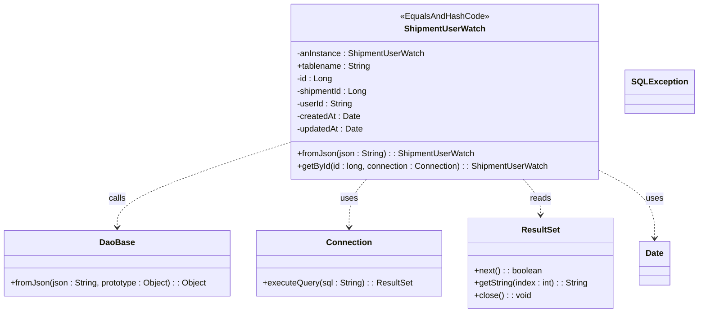

# Diagram: platform-java-lambdas/shipment/src/main/java/com/freightverify/shipment/datastore/postgresql/dao/ShipmentUserWatch.java

> Auto-generated by Obscura crawlers

## Mermaid

### SVG

<svg id="container" width="1321.861328125" xmlns="http://www.w3.org/2000/svg" class="classDiagram" height="600" viewBox="0 0 1321.861328125 600" role="graphics-document document" aria-roledescription="class"><g><defs><marker id="container_class-aggregationStart" class="marker aggregation class" refX="18" refY="7" markerWidth="190" markerHeight="240" orient="auto"><path d="M 18,7 L9,13 L1,7 L9,1 Z"></path></marker></defs><defs><marker id="container_class-aggregationEnd" class="marker aggregation class" refX="1" refY="7" markerWidth="20" markerHeight="28" orient="auto"><path d="M 18,7 L9,13 L1,7 L9,1 Z"></path></marker></defs><defs><marker id="container_class-extensionStart" class="marker extension class" refX="18" refY="7" markerWidth="190" markerHeight="240" orient="auto"><path d="M 1,7 L18,13 V 1 Z"></path></marker></defs><defs><marker id="container_class-extensionEnd" class="marker extension class" refX="1" refY="7" markerWidth="20" markerHeight="28" orient="auto"><path d="M 1,1 V 13 L18,7 Z"></path></marker></defs><defs><marker id="container_class-compositionStart" class="marker composition class" refX="18" refY="7" markerWidth="190" markerHeight="240" orient="auto"><path d="M 18,7 L9,13 L1,7 L9,1 Z"></path></marker></defs><defs><marker id="container_class-compositionEnd" class="marker composition class" refX="1" refY="7" markerWidth="20" markerHeight="28" orient="auto"><path d="M 18,7 L9,13 L1,7 L9,1 Z"></path></marker></defs><defs><marker id="container_class-dependencyStart" class="marker dependency class" refX="6" refY="7" markerWidth="190" markerHeight="240" orient="auto"><path d="M 5,7 L9,13 L1,7 L9,1 Z"></path></marker></defs><defs><marker id="container_class-dependencyEnd" class="marker dependency class" refX="13" refY="7" markerWidth="20" markerHeight="28" orient="auto"><path d="M 18,7 L9,13 L14,7 L9,1 Z"></path></marker></defs><defs><marker id="container_class-lollipopStart" class="marker lollipop class" refX="13" refY="7" markerWidth="190" markerHeight="240" orient="auto"><circle stroke="black" fill="transparent" cx="7" cy="7" r="6"></circle></marker></defs><defs><marker id="container_class-lollipopEnd" class="marker lollipop class" refX="1" refY="7" markerWidth="190" markerHeight="240" orient="auto"><circle stroke="black" fill="transparent" cx="7" cy="7" r="6"></circle></marker></defs><g class="root"><g class="clusters"></g><g class="edgePaths"><path d="M551.713,272.963L497.084,290.969C442.456,308.976,333.199,344.988,278.57,372.161C223.941,399.333,223.941,417.667,223.941,426.833L223.941,436" id="id_ShipmentUserWatch_DaoBase_1" class="edge-thickness-normal edge-pattern-dashed relation" style=";;;" data-edge="true" data-et="edge" data-id="id_ShipmentUserWatch_DaoBase_1" data-points="W3sieCI6NTUxLjcxMjg5MDYyNSwieSI6MjcyLjk2MzI2MTE3ODgyMDN9LHsieCI6MjIzLjk0MTQwNjI1LCJ5IjozODF9LHsieCI6MjIzLjk0MTQwNjI1LCJ5Ijo0NDJ9XQ==" marker-end="url(#container_class-dependencyEnd)"></path><path d="M696.998,344L691.533,350.167C686.068,356.333,675.137,368.667,669.672,384C664.207,399.333,664.207,417.667,664.207,426.833L664.207,436" id="id_ShipmentUserWatch_Connection_2" class="edge-thickness-normal edge-pattern-dashed relation" style=";;;" data-edge="true" data-et="edge" data-id="id_ShipmentUserWatch_Connection_2" data-points="W3sieCI6Njk2Ljk5ODM1MTc1MzA0ODgsInkiOjM0NH0seyJ4Ijo2NjQuMjA3MDMxMjUsInkiOjM4MX0seyJ4Ijo2NjQuMjA3MDMxMjUsInkiOjQ0Mn1d" marker-end="url(#container_class-dependencyEnd)"></path><path d="M994.779,344L1000.244,350.167C1005.709,356.333,1016.64,368.667,1022.105,380C1027.57,391.333,1027.57,401.667,1027.57,406.833L1027.57,412" id="id_ShipmentUserWatch_ResultSet_3" class="edge-thickness-normal edge-pattern-dashed relation" style=";;;" data-edge="true" data-et="edge" data-id="id_ShipmentUserWatch_ResultSet_3" data-points="W3sieCI6OTk0Ljc3ODk5MTk5Njk1MTIsInkiOjM0NH0seyJ4IjoxMDI3LjU3MDMxMjUsInkiOjM4MX0seyJ4IjoxMDI3LjU3MDMxMjUsInkiOjQxOH1d" marker-end="url(#container_class-dependencyEnd)"></path><path d="M1140.064,326.918L1157.634,335.931C1175.204,344.945,1210.344,362.973,1227.914,384.653C1245.484,406.333,1245.484,431.667,1245.484,444.333L1245.484,457" id="id_ShipmentUserWatch_Date_4" class="edge-thickness-normal edge-pattern-dashed relation" style=";;;" data-edge="true" data-et="edge" data-id="id_ShipmentUserWatch_Date_4" data-points="W3sieCI6MTE0MC4wNjQ0NTMxMjUsInkiOjMyNi45MTc2MjY3MDI3NzA4Nn0seyJ4IjoxMjQ1LjQ4NDM3NSwieSI6MzgxfSx7IngiOjEyNDUuNDg0Mzc1LCJ5Ijo0NjN9XQ==" marker-end="url(#container_class-dependencyEnd)"></path></g><g class="edgeLabels"><g class="edgeLabel" transform="translate(223.94140625, 381)"><g class="label" data-id="id_ShipmentUserWatch_DaoBase_1" transform="translate(-16.4453125, -12)"><foreignObject width="32.890625" height="24">

calls

</foreignObject></g></g><g class="edgeLabel" transform="translate(664.20703125, 381)"><g class="label" data-id="id_ShipmentUserWatch_Connection_2" transform="translate(-16.4921875, -12)"><foreignObject width="32.984375" height="24">

uses

</foreignObject></g></g><g class="edgeLabel" transform="translate(1027.5703125, 381)"><g class="label" data-id="id_ShipmentUserWatch_ResultSet_3" transform="translate(-20.0078125, -12)"><foreignObject width="40.015625" height="24">

reads

</foreignObject></g></g><g class="edgeLabel" transform="translate(1245.484375, 381)"><g class="label" data-id="id_ShipmentUserWatch_Date_4" transform="translate(-16.4921875, -12)"><foreignObject width="32.984375" height="24">

uses

</foreignObject></g></g></g><g class="nodes"><g class="node default" id="classId-ShipmentUserWatch-0" transform="translate(845.888671875, 176)"><g class="basic label-container"><path d="M-294.17578125 -168 L294.17578125 -168 L294.17578125 168 L-294.17578125 168" stroke="none" stroke-width="0" fill="#ECECFF" style=""></path><path d="M-294.17578125 -168 C-125.685372808941 -168, 42.805035632118006 -168, 294.17578125 -168 M-294.17578125 -168 C-170.6918668187013 -168, -47.2079523874026 -168, 294.17578125 -168 M294.17578125 -168 C294.17578125 -54.799426753630115, 294.17578125 58.40114649273977, 294.17578125 168 M294.17578125 -168 C294.17578125 -80.53121316353038, 294.17578125 6.937573672939237, 294.17578125 168 M294.17578125 168 C121.42735337300022 168, -51.32107450399957 168, -294.17578125 168 M294.17578125 168 C166.51840295249838 168, 38.861024654996754 168, -294.17578125 168 M-294.17578125 168 C-294.17578125 94.70705170910001, -294.17578125 21.41410341820003, -294.17578125 -168 M-294.17578125 168 C-294.17578125 73.9929054871414, -294.17578125 -20.0141890257172, -294.17578125 -168" stroke="#9370DB" stroke-width="1.3" fill="none" stroke-dasharray="0 0" style=""></path></g><g class="annotation-group text" transform="translate(-83.2109375, -144)"><g class="label" style="" transform="translate(0,-12)"><foreignObject width="166.421875" height="24">

«EqualsAndHashCode»

</foreignObject></g></g><g class="label-group text" transform="translate(-74.078125, -120)"><g class="label" style="font-weight: bolder" transform="translate(0,-12)"><foreignObject width="148.15625" height="24">

ShipmentUserWatch

</foreignObject></g></g><g class="members-group text" transform="translate(-282.17578125, -72)"><g class="label" style="" transform="translate(0,-12)"><foreignObject width="244.546875" height="24">

-anInstance : ShipmentUserWatch

</foreignObject></g><g class="label" style="" transform="translate(0,12)"><foreignObject width="140.828125" height="24">

+tablename : String

</foreignObject></g><g class="label" style="" transform="translate(0,36)"><foreignObject width="67.46875" height="24">

-id : Long

</foreignObject></g><g class="label" style="" transform="translate(0,60)"><foreignObject width="136.125" height="24">

-shipmentId : Long

</foreignObject></g><g class="label" style="" transform="translate(0,84)"><foreignObject width="107.625" height="24">

-userId : String

</foreignObject></g><g class="label" style="" transform="translate(0,108)"><foreignObject width="121.25" height="24">

-createdAt : Date

</foreignObject></g><g class="label" style="" transform="translate(0,132)"><foreignObject width="127.734375" height="24">

-updatedAt : Date

</foreignObject></g></g><g class="methods-group text" transform="translate(-282.17578125, 120)"><g class="label" style="" transform="translate(0,-12)"><foreignObject width="336.734375" height="24">

+fromJson(json : String) : : ShipmentUserWatch

</foreignObject></g><g class="label" style="" transform="translate(0,12)"><foreignObject width="481.140625" height="24">

+getById(id : long, connection : Connection) : : ShipmentUserWatch

</foreignObject></g></g><g class="divider" style=""><path d="M-294.17578125 -96 C-164.2180925426267 -96, -34.260403835253385 -96, 294.17578125 -96 M-294.17578125 -96 C-152.58559227422128 -96, -10.995403298442568 -96, 294.17578125 -96" stroke="#9370DB" stroke-width="1.3" fill="none" stroke-dasharray="0 0" style=""></path></g><g class="divider" style=""><path d="M-294.17578125 96 C-138.16350619647082 96, 17.84876885705836 96, 294.17578125 96 M-294.17578125 96 C-130.13321995551146 96, 33.90934133897707 96, 294.17578125 96" stroke="#9370DB" stroke-width="1.3" fill="none" stroke-dasharray="0 0" style=""></path></g></g><g class="node default" id="classId-DaoBase-1" transform="translate(223.94140625, 505)"><g class="basic label-container"><path d="M-215.94140625 -63 L215.94140625 -63 L215.94140625 63 L-215.94140625 63" stroke="none" stroke-width="0" fill="#ECECFF" style=""></path><path d="M-215.94140625 -63 C-123.68297037360036 -63, -31.42453449720071 -63, 215.94140625 -63 M-215.94140625 -63 C-101.7791311348769 -63, 12.383143980246189 -63, 215.94140625 -63 M215.94140625 -63 C215.94140625 -31.222327690529873, 215.94140625 0.5553446189402536, 215.94140625 63 M215.94140625 -63 C215.94140625 -14.28543069499878, 215.94140625 34.42913861000244, 215.94140625 63 M215.94140625 63 C82.74793896488299 63, -50.44552832023402 63, -215.94140625 63 M215.94140625 63 C60.62005887655579 63, -94.70128849688842 63, -215.94140625 63 M-215.94140625 63 C-215.94140625 23.918584037025035, -215.94140625 -15.16283192594993, -215.94140625 -63 M-215.94140625 63 C-215.94140625 36.476043769791296, -215.94140625 9.952087539582593, -215.94140625 -63" stroke="#9370DB" stroke-width="1.3" fill="none" stroke-dasharray="0 0" style=""></path></g><g class="annotation-group text" transform="translate(0, -39)"></g><g class="label-group text" transform="translate(-31.7109375, -39)"><g class="label" style="font-weight: bolder" transform="translate(0,-12)"><foreignObject width="63.421875" height="24">

DaoBase

</foreignObject></g></g><g class="members-group text" transform="translate(-203.94140625, 9)"></g><g class="methods-group text" transform="translate(-203.94140625, 39)"><g class="label" style="" transform="translate(0,-12)"><foreignObject width="376.171875" height="24">

+fromJson(json : String, prototype : Object) : : Object

</foreignObject></g></g><g class="divider" style=""><path d="M-215.94140625 -15 C-46.917307094720314 -15, 122.10679206055937 -15, 215.94140625 -15 M-215.94140625 -15 C-74.42471354920488 -15, 67.09197915159024 -15, 215.94140625 -15" stroke="#9370DB" stroke-width="1.3" fill="none" stroke-dasharray="0 0" style=""></path></g><g class="divider" style=""><path d="M-215.94140625 9 C-50.18028305478197 9, 115.58084014043607 9, 215.94140625 9 M-215.94140625 9 C-121.34581075517613 9, -26.750215260352263 9, 215.94140625 9" stroke="#9370DB" stroke-width="1.3" fill="none" stroke-dasharray="0 0" style=""></path></g></g><g class="node default" id="classId-Connection-2" transform="translate(664.20703125, 505)"><g class="basic label-container"><path d="M-174.32421875 -63 L174.32421875 -63 L174.32421875 63 L-174.32421875 63" stroke="none" stroke-width="0" fill="#ECECFF" style=""></path><path d="M-174.32421875 -63 C-85.67224039739591 -63, 2.9797379552081793 -63, 174.32421875 -63 M-174.32421875 -63 C-79.14933888124257 -63, 16.02554098751486 -63, 174.32421875 -63 M174.32421875 -63 C174.32421875 -20.926436089321506, 174.32421875 21.14712782135699, 174.32421875 63 M174.32421875 -63 C174.32421875 -31.190232394732064, 174.32421875 0.6195352105358722, 174.32421875 63 M174.32421875 63 C91.31086872410172 63, 8.297518698203447 63, -174.32421875 63 M174.32421875 63 C95.74496887105528 63, 17.165718992110556 63, -174.32421875 63 M-174.32421875 63 C-174.32421875 15.45662885797313, -174.32421875 -32.08674228405374, -174.32421875 -63 M-174.32421875 63 C-174.32421875 24.251283529313362, -174.32421875 -14.497432941373276, -174.32421875 -63" stroke="#9370DB" stroke-width="1.3" fill="none" stroke-dasharray="0 0" style=""></path></g><g class="annotation-group text" transform="translate(0, -39)"></g><g class="label-group text" transform="translate(-41.2265625, -39)"><g class="label" style="font-weight: bolder" transform="translate(0,-12)"><foreignObject width="82.453125" height="24">

Connection

</foreignObject></g></g><g class="members-group text" transform="translate(-162.32421875, 9)"></g><g class="methods-group text" transform="translate(-162.32421875, 39)"><g class="label" style="" transform="translate(0,-12)"><foreignObject width="283.421875" height="24">

+executeQuery(sql : String) : : ResultSet

</foreignObject></g></g><g class="divider" style=""><path d="M-174.32421875 -15 C-103.71880363524774 -15, -33.11338852049548 -15, 174.32421875 -15 M-174.32421875 -15 C-98.41965166799233 -15, -22.515084585984653 -15, 174.32421875 -15" stroke="#9370DB" stroke-width="1.3" fill="none" stroke-dasharray="0 0" style=""></path></g><g class="divider" style=""><path d="M-174.32421875 9 C-67.16919737429605 9, 39.985824001407906 9, 174.32421875 9 M-174.32421875 9 C-43.22032939194463 9, 87.88355996611074 9, 174.32421875 9" stroke="#9370DB" stroke-width="1.3" fill="none" stroke-dasharray="0 0" style=""></path></g></g><g class="node default" id="classId-ResultSet-3" transform="translate(1027.5703125, 505)"><g class="basic label-container"><path d="M-139.0390625 -87 L139.0390625 -87 L139.0390625 87 L-139.0390625 87" stroke="none" stroke-width="0" fill="#ECECFF" style=""></path><path d="M-139.0390625 -87 C-70.87476591597257 -87, -2.7104693319451485 -87, 139.0390625 -87 M-139.0390625 -87 C-47.788306277367056 -87, 43.46244994526589 -87, 139.0390625 -87 M139.0390625 -87 C139.0390625 -29.354312331083477, 139.0390625 28.291375337833045, 139.0390625 87 M139.0390625 -87 C139.0390625 -27.177043997745542, 139.0390625 32.645912004508915, 139.0390625 87 M139.0390625 87 C61.80238708687364 87, -15.434288326252727 87, -139.0390625 87 M139.0390625 87 C55.03855850135581 87, -28.961945497288383 87, -139.0390625 87 M-139.0390625 87 C-139.0390625 22.60089354354639, -139.0390625 -41.79821291290722, -139.0390625 -87 M-139.0390625 87 C-139.0390625 24.888126461381553, -139.0390625 -37.223747077236894, -139.0390625 -87" stroke="#9370DB" stroke-width="1.3" fill="none" stroke-dasharray="0 0" style=""></path></g><g class="annotation-group text" transform="translate(0, -63)"></g><g class="label-group text" transform="translate(-35.21875, -63)"><g class="label" style="font-weight: bolder" transform="translate(0,-12)"><foreignObject width="70.4375" height="24">

ResultSet

</foreignObject></g></g><g class="members-group text" transform="translate(-127.0390625, -15)"></g><g class="methods-group text" transform="translate(-127.0390625, 15)"><g class="label" style="" transform="translate(0,-12)"><foreignObject width="129.6875" height="24">

+next() : : boolean

</foreignObject></g><g class="label" style="" transform="translate(0,12)"><foreignObject width="218.859375" height="24">

+getString(index : int) : : String

</foreignObject></g><g class="label" style="" transform="translate(0,36)"><foreignObject width="107.78125" height="24">

+close() : : void

</foreignObject></g></g><g class="divider" style=""><path d="M-139.0390625 -39 C-59.49273737646999 -39, 20.05358774706002 -39, 139.0390625 -39 M-139.0390625 -39 C-63.60520482432261 -39, 11.828652851354775 -39, 139.0390625 -39" stroke="#9370DB" stroke-width="1.3" fill="none" stroke-dasharray="0 0" style=""></path></g><g class="divider" style=""><path d="M-139.0390625 -15 C-66.39073109880343 -15, 6.2576003023931435 -15, 139.0390625 -15 M-139.0390625 -15 C-42.311165046484206 -15, 54.41673240703159 -15, 139.0390625 -15" stroke="#9370DB" stroke-width="1.3" fill="none" stroke-dasharray="0 0" style=""></path></g></g><g class="node default" id="classId-SQLException-4" transform="translate(1251.962890625, 176)"><g class="basic label-container"><path d="M-61.8984375 -42 L61.8984375 -42 L61.8984375 42 L-61.8984375 42" stroke="none" stroke-width="0" fill="#ECECFF" style=""></path><path d="M-61.8984375 -42 C-22.8859714450401 -42, 16.126494609919803 -42, 61.8984375 -42 M-61.8984375 -42 C-20.05439337860019 -42, 21.789650742799623 -42, 61.8984375 -42 M61.8984375 -42 C61.8984375 -8.910652560403477, 61.8984375 24.178694879193046, 61.8984375 42 M61.8984375 -42 C61.8984375 -19.872724464696258, 61.8984375 2.2545510706074836, 61.8984375 42 M61.8984375 42 C15.410126333643767 42, -31.078184832712466 42, -61.8984375 42 M61.8984375 42 C22.355980994014466 42, -17.186475511971068 42, -61.8984375 42 M-61.8984375 42 C-61.8984375 17.72497771212651, -61.8984375 -6.5500445757469805, -61.8984375 -42 M-61.8984375 42 C-61.8984375 13.0082312964707, -61.8984375 -15.983537407058598, -61.8984375 -42" stroke="#9370DB" stroke-width="1.3" fill="none" stroke-dasharray="0 0" style=""></path></g><g class="annotation-group text" transform="translate(0, -18)"></g><g class="label-group text" transform="translate(-49.8984375, -18)"><g class="label" style="font-weight: bolder" transform="translate(0,-12)"><foreignObject width="99.796875" height="24">

SQLException

</foreignObject></g></g><g class="members-group text" transform="translate(-49.8984375, 30)"></g><g class="methods-group text" transform="translate(-49.8984375, 60)"></g><g class="divider" style=""><path d="M-61.8984375 6 C-21.419957006825378 6, 19.058523486349245 6, 61.8984375 6 M-61.8984375 6 C-19.081143505555993 6, 23.736150488888015 6, 61.8984375 6" stroke="#9370DB" stroke-width="1.3" fill="none" stroke-dasharray="0 0" style=""></path></g><g class="divider" style=""><path d="M-61.8984375 24 C-32.33196749307873 24, -2.7654974861574573 24, 61.8984375 24 M-61.8984375 24 C-34.578023716494094 24, -7.2576099329881885 24, 61.8984375 24" stroke="#9370DB" stroke-width="1.3" fill="none" stroke-dasharray="0 0" style=""></path></g></g><g class="node default" id="classId-Date-5" transform="translate(1245.484375, 505)"><g class="basic label-container"><path d="M-28.875 -42 L28.875 -42 L28.875 42 L-28.875 42" stroke="none" stroke-width="0" fill="#ECECFF" style=""></path><path d="M-28.875 -42 C-7.924685111881406 -42, 13.025629776237189 -42, 28.875 -42 M-28.875 -42 C-16.615896980910563 -42, -4.3567939618211255 -42, 28.875 -42 M28.875 -42 C28.875 -18.570423107862783, 28.875 4.859153784274433, 28.875 42 M28.875 -42 C28.875 -18.74736108169687, 28.875 4.505277836606261, 28.875 42 M28.875 42 C14.55790550170872 42, 0.24081100341744133 42, -28.875 42 M28.875 42 C14.428058773501096 42, -0.018882452997807775 42, -28.875 42 M-28.875 42 C-28.875 15.890746964185151, -28.875 -10.218506071629697, -28.875 -42 M-28.875 42 C-28.875 16.09408765780524, -28.875 -9.81182468438952, -28.875 -42" stroke="#9370DB" stroke-width="1.3" fill="none" stroke-dasharray="0 0" style=""></path></g><g class="annotation-group text" transform="translate(0, -18)"></g><g class="label-group text" transform="translate(-16.875, -18)"><g class="label" style="font-weight: bolder" transform="translate(0,-12)"><foreignObject width="33.75" height="24">

Date

</foreignObject></g></g><g class="members-group text" transform="translate(-16.875, 30)"></g><g class="methods-group text" transform="translate(-16.875, 60)"></g><g class="divider" style=""><path d="M-28.875 6 C-13.481056033401659 6, 1.9128879331966822 6, 28.875 6 M-28.875 6 C-9.742023162946435 6, 9.39095367410713 6, 28.875 6" stroke="#9370DB" stroke-width="1.3" fill="none" stroke-dasharray="0 0" style=""></path></g><g class="divider" style=""><path d="M-28.875 24 C-6.157832498624533 24, 16.559335002750935 24, 28.875 24 M-28.875 24 C-12.941179500192591 24, 2.9926409996148173 24, 28.875 24" stroke="#9370DB" stroke-width="1.3" fill="none" stroke-dasharray="0 0" style=""></path></g></g></g></g></g></svg>
