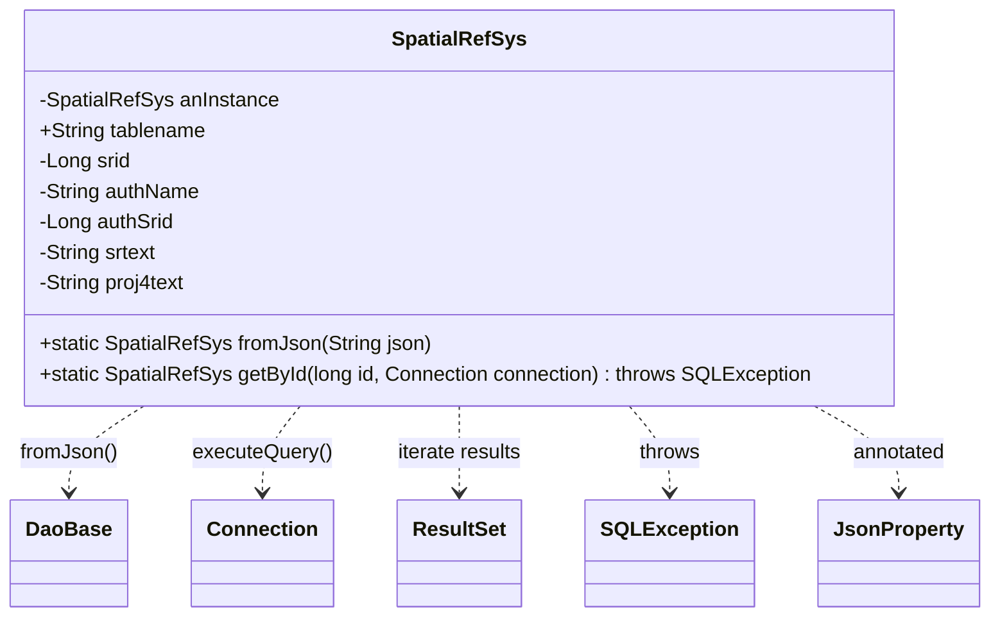

# Diagram: platform-java-lambdas/shipment/src/main/java/com/freightverify/shipment/datastore/postgresql/dao/SpatialRefSys.java


> Auto-generated by Obscura crawlers

## Diagram 1



### SVG

<svg id="container" width="747.26171875" xmlns="http://www.w3.org/2000/svg" class="classDiagram" height="486" viewBox="0 0 747.26171875 486" role="graphics-document document" aria-roledescription="class"><style>#container{font-family:"trebuchet ms",verdana,arial,sans-serif;font-size:16px;fill:#333;}@keyframes edge-animation-frame{from{stroke-dashoffset:0;}}@keyframes dash{to{stroke-dashoffset:0;}}#container .edge-animation-slow{stroke-dasharray:9,5!important;stroke-dashoffset:900;animation:dash 50s linear infinite;stroke-linecap:round;}#container .edge-animation-fast{stroke-dasharray:9,5!important;stroke-dashoffset:900;animation:dash 20s linear infinite;stroke-linecap:round;}#container .error-icon{fill:#552222;}#container .error-text{fill:#552222;stroke:#552222;}#container .edge-thickness-normal{stroke-width:1px;}#container .edge-thickness-thick{stroke-width:3.5px;}#container .edge-pattern-solid{stroke-dasharray:0;}#container .edge-thickness-invisible{stroke-width:0;fill:none;}#container .edge-pattern-dashed{stroke-dasharray:3;}#container .edge-pattern-dotted{stroke-dasharray:2;}#container .marker{fill:#333333;stroke:#333333;}#container .marker.cross{stroke:#333333;}#container svg{font-family:"trebuchet ms",verdana,arial,sans-serif;font-size:16px;}#container p{margin:0;}#container g.classGroup text{fill:#9370DB;stroke:none;font-family:"trebuchet ms",verdana,arial,sans-serif;font-size:10px;}#container g.classGroup text .title{font-weight:bolder;}#container .nodeLabel,#container .edgeLabel{color:#131300;}#container .edgeLabel .label rect{fill:#ECECFF;}#container .label text{fill:#131300;}#container .labelBkg{background:#ECECFF;}#container .edgeLabel .label span{background:#ECECFF;}#container .classTitle{font-weight:bolder;}#container .node rect,#container .node circle,#container .node ellipse,#container .node polygon,#container .node path{fill:#ECECFF;stroke:#9370DB;stroke-width:1px;}#container .divider{stroke:#9370DB;stroke-width:1;}#container g.clickable{cursor:pointer;}#container g.classGroup rect{fill:#ECECFF;stroke:#9370DB;}#container g.classGroup line{stroke:#9370DB;stroke-width:1;}#container .classLabel .box{stroke:none;stroke-width:0;fill:#ECECFF;opacity:0.5;}#container .classLabel .label{fill:#9370DB;font-size:10px;}#container .relation{stroke:#333333;stroke-width:1;fill:none;}#container .dashed-line{stroke-dasharray:3;}#container .dotted-line{stroke-dasharray:1 2;}#container #compositionStart,#container .composition{fill:#333333!important;stroke:#333333!important;stroke-width:1;}#container #compositionEnd,#container .composition{fill:#333333!important;stroke:#333333!important;stroke-width:1;}#container #dependencyStart,#container .dependency{fill:#333333!important;stroke:#333333!important;stroke-width:1;}#container #dependencyStart,#container .dependency{fill:#333333!important;stroke:#333333!important;stroke-width:1;}#container #extensionStart,#container .extension{fill:transparent!important;stroke:#333333!important;stroke-width:1;}#container #extensionEnd,#container .extension{fill:transparent!important;stroke:#333333!important;stroke-width:1;}#container #aggregationStart,#container .aggregation{fill:transparent!important;stroke:#333333!important;stroke-width:1;}#container #aggregationEnd,#container .aggregation{fill:transparent!important;stroke:#333333!important;stroke-width:1;}#container #lollipopStart,#container .lollipop{fill:#ECECFF!important;stroke:#333333!important;stroke-width:1;}#container #lollipopEnd,#container .lollipop{fill:#ECECFF!important;stroke:#333333!important;stroke-width:1;}#container .edgeTerminals{font-size:11px;line-height:initial;}#container .classTitleText{text-anchor:middle;font-size:18px;fill:#333;}#container .label-icon{display:inline-block;height:1em;overflow:visible;vertical-align:-0.125em;}#container .node .label-icon path{fill:currentColor;stroke:revert;stroke-width:revert;}#container :root{--mermaid-font-family:"trebuchet ms",verdana,arial,sans-serif;}</style><g><defs><marker id="container_class-aggregationStart" class="marker aggregation class" refX="18" refY="7" markerWidth="190" markerHeight="240" orient="auto"><path d="M 18,7 L9,13 L1,7 L9,1 Z"></path></marker></defs><defs><marker id="container_class-aggregationEnd" class="marker aggregation class" refX="1" refY="7" markerWidth="20" markerHeight="28" orient="auto"><path d="M 18,7 L9,13 L1,7 L9,1 Z"></path></marker></defs><defs><marker id="container_class-extensionStart" class="marker extension class" refX="18" refY="7" markerWidth="190" markerHeight="240" orient="auto"><path d="M 1,7 L18,13 V 1 Z"></path></marker></defs><defs><marker id="container_class-extensionEnd" class="marker extension class" refX="1" refY="7" markerWidth="20" markerHeight="28" orient="auto"><path d="M 1,1 V 13 L18,7 Z"></path></marker></defs><defs><marker id="container_class-compositionStart" class="marker composition class" refX="18" refY="7" markerWidth="190" markerHeight="240" orient="auto"><path d="M 18,7 L9,13 L1,7 L9,1 Z"></path></marker></defs><defs><marker id="container_class-compositionEnd" class="marker composition class" refX="1" refY="7" markerWidth="20" markerHeight="28" orient="auto"><path d="M 18,7 L9,13 L1,7 L9,1 Z"></path></marker></defs><defs><marker id="container_class-dependencyStart" class="marker dependency class" refX="6" refY="7" markerWidth="190" markerHeight="240" orient="auto"><path d="M 5,7 L9,13 L1,7 L9,1 Z"></path></marker></defs><defs><marker id="container_class-dependencyEnd" class="marker dependency class" refX="13" refY="7" markerWidth="20" markerHeight="28" orient="auto"><path d="M 18,7 L9,13 L14,7 L9,1 Z"></path></marker></defs><defs><marker id="container_class-lollipopStart" class="marker lollipop class" refX="13" refY="7" markerWidth="190" markerHeight="240" orient="auto"><circle stroke="black" fill="transparent" cx="7" cy="7" r="6"></circle></marker></defs><defs><marker id="container_class-lollipopEnd" class="marker lollipop class" refX="1" refY="7" markerWidth="190" markerHeight="240" orient="auto"><circle stroke="black" fill="transparent" cx="7" cy="7" r="6"></circle></marker></defs><g class="root"><g class="clusters"></g><g class="edgePaths"><path d="M108.749,320L99.248,326.167C89.746,332.333,70.742,344.667,61.24,356C51.738,367.333,51.738,377.667,51.738,382.833L51.738,388" id="id_SpatialRefSys_DaoBase_1" class="edge-thickness-normal edge-pattern-dashed relation" style=";;;" data-edge="true" data-et="edge" data-id="id_SpatialRefSys_DaoBase_1" data-points="W3sieCI6MTA4Ljc0OTQ5NDAwOTA2NzM1LCJ5IjozMjB9LHsieCI6NTEuNzM4MjgxMjUsInkiOjM1N30seyJ4Ijo1MS43MzgyODEyNSwieSI6Mzk0fV0=" marker-end="url(#container_class-dependencyEnd)"></path><path d="M227.518,320L222.711,326.167C217.904,332.333,208.29,344.667,203.483,356C198.676,367.333,198.676,377.667,198.676,382.833L198.676,388" id="id_SpatialRefSys_Connection_2" class="edge-thickness-normal edge-pattern-dashed relation" style=";;;" data-edge="true" data-et="edge" data-id="id_SpatialRefSys_Connection_2" data-points="W3sieCI6MjI3LjUxNzYyODcyNDA5MzI3LCJ5IjozMjB9LHsieCI6MTk4LjY3NTc4MTI1LCJ5IjozNTd9LHsieCI6MTk4LjY3NTc4MTI1LCJ5IjozOTR9XQ==" marker-end="url(#container_class-dependencyEnd)"></path><path d="M349.121,320L349.121,326.167C349.121,332.333,349.121,344.667,349.121,356C349.121,367.333,349.121,377.667,349.121,382.833L349.121,388" id="id_SpatialRefSys_ResultSet_3" class="edge-thickness-normal edge-pattern-dashed relation" style=";;;" data-edge="true" data-et="edge" data-id="id_SpatialRefSys_ResultSet_3" data-points="W3sieCI6MzQ5LjEyMTA5Mzc1LCJ5IjozMjB9LHsieCI6MzQ5LjEyMTA5Mzc1LCJ5IjozNTd9LHsieCI6MzQ5LjEyMTA5Mzc1LCJ5IjozOTR9XQ==" marker-end="url(#container_class-dependencyEnd)"></path><path d="M477.734,320L482.818,326.167C487.902,332.333,498.07,344.667,503.154,356C508.238,367.333,508.238,377.667,508.238,382.833L508.238,388" id="id_SpatialRefSys_SQLException_4" class="edge-thickness-normal edge-pattern-dashed relation" style=";;;" data-edge="true" data-et="edge" data-id="id_SpatialRefSys_SQLException_4" data-points="W3sieCI6NDc3LjczMzk0OTk2NzYxNjYsInkiOjMyMH0seyJ4Ijo1MDguMjM4MjgxMjUsInkiOjM1N30seyJ4Ijo1MDguMjM4MjgxMjUsInkiOjM5NH1d" marker-end="url(#container_class-dependencyEnd)"></path><path d="M616.324,320L626.887,326.167C637.449,332.333,658.574,344.667,669.137,356C679.699,367.333,679.699,377.667,679.699,382.833L679.699,388" id="id_SpatialRefSys_JsonProperty_5" class="edge-thickness-normal edge-pattern-dashed relation" style=";;;" data-edge="true" data-et="edge" data-id="id_SpatialRefSys_JsonProperty_5" data-points="W3sieCI6NjE2LjMyNDEzNzc5MTQ1MDgsInkiOjMyMH0seyJ4Ijo2NzkuNjk5MjE4NzUsInkiOjM1N30seyJ4Ijo2NzkuNjk5MjE4NzUsInkiOjM5NH1d" marker-end="url(#container_class-dependencyEnd)"></path></g><g class="edgeLabels"><g class="edgeLabel" transform="translate(51.73828125, 357)"><g class="label" data-id="id_SpatialRefSys_DaoBase_1" transform="translate(-37.78125, -12)"><foreignObject width="75.5625" height="24"><div xmlns="http://www.w3.org/1999/xhtml" class="labelBkg" style="display: table-cell; white-space: nowrap; line-height: 1.5; max-width: 200px; text-align: center;"><span class="edgeLabel"><p>fromJson()</p></span></div></foreignObject></g></g><g class="edgeLabel" transform="translate(198.67578125, 357)"><g class="label" data-id="id_SpatialRefSys_Connection_2" transform="translate(-54.7421875, -12)"><foreignObject width="109.484375" height="24"><div xmlns="http://www.w3.org/1999/xhtml" class="labelBkg" style="display: table-cell; white-space: nowrap; line-height: 1.5; max-width: 200px; text-align: center;"><span class="edgeLabel"><p>executeQuery()</p></span></div></foreignObject></g></g><g class="edgeLabel" transform="translate(349.12109375, 357)"><g class="label" data-id="id_SpatialRefSys_ResultSet_3" transform="translate(-50.3671875, -12)"><foreignObject width="100.734375" height="24"><div xmlns="http://www.w3.org/1999/xhtml" class="labelBkg" style="display: table-cell; white-space: nowrap; line-height: 1.5; max-width: 200px; text-align: center;"><span class="edgeLabel"><p>iterate results</p></span></div></foreignObject></g></g><g class="edgeLabel" transform="translate(508.23828125, 357)"><g class="label" data-id="id_SpatialRefSys_SQLException_4" transform="translate(-24.5703125, -12)"><foreignObject width="49.140625" height="24"><div xmlns="http://www.w3.org/1999/xhtml" class="labelBkg" style="display: table-cell; white-space: nowrap; line-height: 1.5; max-width: 200px; text-align: center;"><span class="edgeLabel"><p>throws</p></span></div></foreignObject></g></g><g class="edgeLabel" transform="translate(679.69921875, 357)"><g class="label" data-id="id_SpatialRefSys_JsonProperty_5" transform="translate(-37.5, -12)"><foreignObject width="75" height="24"><div xmlns="http://www.w3.org/1999/xhtml" class="labelBkg" style="display: table-cell; white-space: nowrap; line-height: 1.5; max-width: 200px; text-align: center;"><span class="edgeLabel"><p>annotated</p></span></div></foreignObject></g></g></g><g class="nodes"><g class="node default" id="classId-SpatialRefSys-0" transform="translate(349.12109375, 164)"><g class="basic label-container"><path d="M-341.12109375 -156 L341.12109375 -156 L341.12109375 156 L-341.12109375 156" stroke="none" stroke-width="0" fill="#ECECFF" style=""></path><path d="M-341.12109375 -156 C-130.7118927315638 -156, 79.69730828687238 -156, 341.12109375 -156 M-341.12109375 -156 C-104.90847976142351 -156, 131.30413422715299 -156, 341.12109375 -156 M341.12109375 -156 C341.12109375 -80.51129727059454, 341.12109375 -5.022594541189079, 341.12109375 156 M341.12109375 -156 C341.12109375 -83.55255381351988, 341.12109375 -11.105107627039757, 341.12109375 156 M341.12109375 156 C101.32434893888578 156, -138.47239587222845 156, -341.12109375 156 M341.12109375 156 C139.71509379034387 156, -61.69090616931226 156, -341.12109375 156 M-341.12109375 156 C-341.12109375 34.61747688170679, -341.12109375 -86.76504623658641, -341.12109375 -156 M-341.12109375 156 C-341.12109375 36.40112754507956, -341.12109375 -83.19774490984088, -341.12109375 -156" stroke="#9370DB" stroke-width="1.3" fill="none" stroke-dasharray="0 0" style=""></path></g><g class="annotation-group text" transform="translate(0, -132)"></g><g class="label-group text" transform="translate(-50.1953125, -132)"><g class="label" style="font-weight: bolder" transform="translate(0,-12)"><foreignObject width="100.390625" height="24"><div xmlns="http://www.w3.org/1999/xhtml" style="display: table-cell; white-space: nowrap; line-height: 1.5; max-width: 148px; text-align: center;"><span class="nodeLabel markdown-node-label" style=""><p>SpatialRefSys</p></span></div></foreignObject></g></g><g class="members-group text" transform="translate(-329.12109375, -84)"><g class="label" style="" transform="translate(0,-12)"><foreignObject width="187.09375" height="24"><div xmlns="http://www.w3.org/1999/xhtml" style="display: table-cell; white-space: nowrap; line-height: 1.5; max-width: 244px; text-align: center;"><span class="nodeLabel markdown-node-label" style=""><p>-SpatialRefSys anInstance</p></span></div></foreignObject></g><g class="label" style="" transform="translate(0,12)"><foreignObject width="132.1875" height="24"><div xmlns="http://www.w3.org/1999/xhtml" style="display: table-cell; white-space: nowrap; line-height: 1.5; max-width: 190px; text-align: center;"><span class="nodeLabel markdown-node-label" style=""><p>+String tablename</p></span></div></foreignObject></g><g class="label" style="" transform="translate(0,36)"><foreignObject width="73.03125" height="24"><div xmlns="http://www.w3.org/1999/xhtml" style="display: table-cell; white-space: nowrap; line-height: 1.5; max-width: 130px; text-align: center;"><span class="nodeLabel markdown-node-label" style=""><p>-Long srid</p></span></div></foreignObject></g><g class="label" style="" transform="translate(0,60)"><foreignObject width="128.171875" height="24"><div xmlns="http://www.w3.org/1999/xhtml" style="display: table-cell; white-space: nowrap; line-height: 1.5; max-width: 186px; text-align: center;"><span class="nodeLabel markdown-node-label" style=""><p>-String authName</p></span></div></foreignObject></g><g class="label" style="" transform="translate(0,84)"><foreignObject width="107.453125" height="24"><div xmlns="http://www.w3.org/1999/xhtml" style="display: table-cell; white-space: nowrap; line-height: 1.5; max-width: 165px; text-align: center;"><span class="nodeLabel markdown-node-label" style=""><p>-Long authSrid</p></span></div></foreignObject></g><g class="label" style="" transform="translate(0,108)"><foreignObject width="94.234375" height="24"><div xmlns="http://www.w3.org/1999/xhtml" style="display: table-cell; white-space: nowrap; line-height: 1.5; max-width: 152px; text-align: center;"><span class="nodeLabel markdown-node-label" style=""><p>-String srtext</p></span></div></foreignObject></g><g class="label" style="" transform="translate(0,132)"><foreignObject width="118.125" height="24"><div xmlns="http://www.w3.org/1999/xhtml" style="display: table-cell; white-space: nowrap; line-height: 1.5; max-width: 176px; text-align: center;"><span class="nodeLabel markdown-node-label" style=""><p>-String proj4text</p></span></div></foreignObject></g></g><g class="methods-group text" transform="translate(-329.12109375, 108)"><g class="label" style="" transform="translate(0,-12)"><foreignObject width="307.1875" height="24"><div xmlns="http://www.w3.org/1999/xhtml" style="display: table-cell; white-space: nowrap; line-height: 1.5; max-width: 365px; text-align: center;"><span class="nodeLabel markdown-node-label" style=""><p>+static SpatialRefSys fromJson(String json)</p></span></div></foreignObject></g><g class="label" style="" transform="translate(0,12)"><foreignObject width="608.046875" height="24"><div xmlns="http://www.w3.org/1999/xhtml" style="display: table-cell; white-space: nowrap; line-height: 1.5; max-width: 665px; text-align: center;"><span class="nodeLabel markdown-node-label" style=""><p>+static SpatialRefSys getById(long id, Connection connection) : throws SQLException</p></span></div></foreignObject></g></g><g class="divider" style=""><path d="M-341.12109375 -108 C-150.07025477429534 -108, 40.98058420140933 -108, 341.12109375 -108 M-341.12109375 -108 C-187.10757090737937 -108, -33.09404806475874 -108, 341.12109375 -108" stroke="#9370DB" stroke-width="1.3" fill="none" stroke-dasharray="0 0" style=""></path></g><g class="divider" style=""><path d="M-341.12109375 84 C-172.41330025217724 84, -3.7055067543544737 84, 341.12109375 84 M-341.12109375 84 C-112.52759189964374 84, 116.06590995071252 84, 341.12109375 84" stroke="#9370DB" stroke-width="1.3" fill="none" stroke-dasharray="0 0" style=""></path></g></g><g class="node default" id="classId-DaoBase-1" transform="translate(51.73828125, 436)"><g class="basic label-container"><path d="M-43.7109375 -42 L43.7109375 -42 L43.7109375 42 L-43.7109375 42" stroke="none" stroke-width="0" fill="#ECECFF" style=""></path><path d="M-43.7109375 -42 C-18.300651264941312 -42, 7.109634970117376 -42, 43.7109375 -42 M-43.7109375 -42 C-15.53209042878074 -42, 12.646756642438518 -42, 43.7109375 -42 M43.7109375 -42 C43.7109375 -10.482145737735316, 43.7109375 21.03570852452937, 43.7109375 42 M43.7109375 -42 C43.7109375 -9.235539715127608, 43.7109375 23.528920569744784, 43.7109375 42 M43.7109375 42 C19.638775485083706 42, -4.433386529832589 42, -43.7109375 42 M43.7109375 42 C17.970220286737476 42, -7.770496926525048 42, -43.7109375 42 M-43.7109375 42 C-43.7109375 17.332178383782384, -43.7109375 -7.335643232435231, -43.7109375 -42 M-43.7109375 42 C-43.7109375 9.019145035341914, -43.7109375 -23.96170992931617, -43.7109375 -42" stroke="#9370DB" stroke-width="1.3" fill="none" stroke-dasharray="0 0" style=""></path></g><g class="annotation-group text" transform="translate(0, -18)"></g><g class="label-group text" transform="translate(-31.7109375, -18)"><g class="label" style="font-weight: bolder" transform="translate(0,-12)"><foreignObject width="63.421875" height="24"><div xmlns="http://www.w3.org/1999/xhtml" style="display: table-cell; white-space: nowrap; line-height: 1.5; max-width: 113px; text-align: center;"><span class="nodeLabel markdown-node-label" style=""><p>DaoBase</p></span></div></foreignObject></g></g><g class="members-group text" transform="translate(-31.7109375, 30)"></g><g class="methods-group text" transform="translate(-31.7109375, 60)"></g><g class="divider" style=""><path d="M-43.7109375 6 C-12.645026656634382 6, 18.420884186731236 6, 43.7109375 6 M-43.7109375 6 C-26.222081210201583 6, -8.733224920403167 6, 43.7109375 6" stroke="#9370DB" stroke-width="1.3" fill="none" stroke-dasharray="0 0" style=""></path></g><g class="divider" style=""><path d="M-43.7109375 24 C-14.108363964377187 24, 15.494209571245626 24, 43.7109375 24 M-43.7109375 24 C-22.3902777900642 24, -1.0696180801284 24, 43.7109375 24" stroke="#9370DB" stroke-width="1.3" fill="none" stroke-dasharray="0 0" style=""></path></g></g><g class="node default" id="classId-Connection-2" transform="translate(198.67578125, 436)"><g class="basic label-container"><path d="M-53.2265625 -42 L53.2265625 -42 L53.2265625 42 L-53.2265625 42" stroke="none" stroke-width="0" fill="#ECECFF" style=""></path><path d="M-53.2265625 -42 C-12.066152602673455 -42, 29.09425729465309 -42, 53.2265625 -42 M-53.2265625 -42 C-29.216683961993727 -42, -5.206805423987454 -42, 53.2265625 -42 M53.2265625 -42 C53.2265625 -12.828467347430283, 53.2265625 16.343065305139433, 53.2265625 42 M53.2265625 -42 C53.2265625 -10.979353749549972, 53.2265625 20.041292500900056, 53.2265625 42 M53.2265625 42 C14.024231141253388 42, -25.178100217493224 42, -53.2265625 42 M53.2265625 42 C19.50960249009072 42, -14.207357519818558 42, -53.2265625 42 M-53.2265625 42 C-53.2265625 21.363399241407734, -53.2265625 0.7267984828154681, -53.2265625 -42 M-53.2265625 42 C-53.2265625 14.582118145577013, -53.2265625 -12.835763708845974, -53.2265625 -42" stroke="#9370DB" stroke-width="1.3" fill="none" stroke-dasharray="0 0" style=""></path></g><g class="annotation-group text" transform="translate(0, -18)"></g><g class="label-group text" transform="translate(-41.2265625, -18)"><g class="label" style="font-weight: bolder" transform="translate(0,-12)"><foreignObject width="82.453125" height="24"><div xmlns="http://www.w3.org/1999/xhtml" style="display: table-cell; white-space: nowrap; line-height: 1.5; max-width: 132px; text-align: center;"><span class="nodeLabel markdown-node-label" style=""><p>Connection</p></span></div></foreignObject></g></g><g class="members-group text" transform="translate(-41.2265625, 30)"></g><g class="methods-group text" transform="translate(-41.2265625, 60)"></g><g class="divider" style=""><path d="M-53.2265625 6 C-21.175927771413605 6, 10.87470695717279 6, 53.2265625 6 M-53.2265625 6 C-28.01136635745097 6, -2.7961702149019416 6, 53.2265625 6" stroke="#9370DB" stroke-width="1.3" fill="none" stroke-dasharray="0 0" style=""></path></g><g class="divider" style=""><path d="M-53.2265625 24 C-18.011758975241378 24, 17.203044549517244 24, 53.2265625 24 M-53.2265625 24 C-18.403526676627465 24, 16.41950914674507 24, 53.2265625 24" stroke="#9370DB" stroke-width="1.3" fill="none" stroke-dasharray="0 0" style=""></path></g></g><g class="node default" id="classId-ResultSet-3" transform="translate(349.12109375, 436)"><g class="basic label-container"><path d="M-47.21875 -42 L47.21875 -42 L47.21875 42 L-47.21875 42" stroke="none" stroke-width="0" fill="#ECECFF" style=""></path><path d="M-47.21875 -42 C-22.24891473687515 -42, 2.7209205262496994 -42, 47.21875 -42 M-47.21875 -42 C-22.772684369938652 -42, 1.6733812601226958 -42, 47.21875 -42 M47.21875 -42 C47.21875 -19.80822407549112, 47.21875 2.3835518490177634, 47.21875 42 M47.21875 -42 C47.21875 -13.354973969230915, 47.21875 15.29005206153817, 47.21875 42 M47.21875 42 C18.399469239435884 42, -10.419811521128231 42, -47.21875 42 M47.21875 42 C10.504948075572855 42, -26.20885384885429 42, -47.21875 42 M-47.21875 42 C-47.21875 14.359372295474536, -47.21875 -13.281255409050928, -47.21875 -42 M-47.21875 42 C-47.21875 23.01570314421399, -47.21875 4.031406288427981, -47.21875 -42" stroke="#9370DB" stroke-width="1.3" fill="none" stroke-dasharray="0 0" style=""></path></g><g class="annotation-group text" transform="translate(0, -18)"></g><g class="label-group text" transform="translate(-35.21875, -18)"><g class="label" style="font-weight: bolder" transform="translate(0,-12)"><foreignObject width="70.4375" height="24"><div xmlns="http://www.w3.org/1999/xhtml" style="display: table-cell; white-space: nowrap; line-height: 1.5; max-width: 119px; text-align: center;"><span class="nodeLabel markdown-node-label" style=""><p>ResultSet</p></span></div></foreignObject></g></g><g class="members-group text" transform="translate(-35.21875, 30)"></g><g class="methods-group text" transform="translate(-35.21875, 60)"></g><g class="divider" style=""><path d="M-47.21875 6 C-17.01992463197607 6, 13.178900736047858 6, 47.21875 6 M-47.21875 6 C-11.734793057828576 6, 23.74916388434285 6, 47.21875 6" stroke="#9370DB" stroke-width="1.3" fill="none" stroke-dasharray="0 0" style=""></path></g><g class="divider" style=""><path d="M-47.21875 24 C-16.12507360400507 24, 14.96860279198986 24, 47.21875 24 M-47.21875 24 C-24.179552405041893 24, -1.1403548100837853 24, 47.21875 24" stroke="#9370DB" stroke-width="1.3" fill="none" stroke-dasharray="0 0" style=""></path></g></g><g class="node default" id="classId-SQLException-4" transform="translate(508.23828125, 436)"><g class="basic label-container"><path d="M-61.8984375 -42 L61.8984375 -42 L61.8984375 42 L-61.8984375 42" stroke="none" stroke-width="0" fill="#ECECFF" style=""></path><path d="M-61.8984375 -42 C-19.231167735889848 -42, 23.436102028220304 -42, 61.8984375 -42 M-61.8984375 -42 C-23.714294070853555 -42, 14.46984935829289 -42, 61.8984375 -42 M61.8984375 -42 C61.8984375 -15.076103761641534, 61.8984375 11.847792476716933, 61.8984375 42 M61.8984375 -42 C61.8984375 -10.179730991138587, 61.8984375 21.640538017722825, 61.8984375 42 M61.8984375 42 C15.056393051265616 42, -31.78565139746877 42, -61.8984375 42 M61.8984375 42 C31.453159702478896 42, 1.0078819049577916 42, -61.8984375 42 M-61.8984375 42 C-61.8984375 20.21160741088127, -61.8984375 -1.5767851782374578, -61.8984375 -42 M-61.8984375 42 C-61.8984375 11.99262459140649, -61.8984375 -18.01475081718702, -61.8984375 -42" stroke="#9370DB" stroke-width="1.3" fill="none" stroke-dasharray="0 0" style=""></path></g><g class="annotation-group text" transform="translate(0, -18)"></g><g class="label-group text" transform="translate(-49.8984375, -18)"><g class="label" style="font-weight: bolder" transform="translate(0,-12)"><foreignObject width="99.796875" height="24"><div xmlns="http://www.w3.org/1999/xhtml" style="display: table-cell; white-space: nowrap; line-height: 1.5; max-width: 148px; text-align: center;"><span class="nodeLabel markdown-node-label" style=""><p>SQLException</p></span></div></foreignObject></g></g><g class="members-group text" transform="translate(-49.8984375, 30)"></g><g class="methods-group text" transform="translate(-49.8984375, 60)"></g><g class="divider" style=""><path d="M-61.8984375 6 C-32.270613404566035 6, -2.6427893091320698 6, 61.8984375 6 M-61.8984375 6 C-12.935244840168515 6, 36.02794781966297 6, 61.8984375 6" stroke="#9370DB" stroke-width="1.3" fill="none" stroke-dasharray="0 0" style=""></path></g><g class="divider" style=""><path d="M-61.8984375 24 C-24.623558886394243 24, 12.651319727211515 24, 61.8984375 24 M-61.8984375 24 C-31.83587849534115 24, -1.7733194906822973 24, 61.8984375 24" stroke="#9370DB" stroke-width="1.3" fill="none" stroke-dasharray="0 0" style=""></path></g></g><g class="node default" id="classId-JsonProperty-5" transform="translate(679.69921875, 436)"><g class="basic label-container"><path d="M-59.5625 -42 L59.5625 -42 L59.5625 42 L-59.5625 42" stroke="none" stroke-width="0" fill="#ECECFF" style=""></path><path d="M-59.5625 -42 C-35.292739764046786 -42, -11.022979528093572 -42, 59.5625 -42 M-59.5625 -42 C-20.10572913810737 -42, 19.351041723785258 -42, 59.5625 -42 M59.5625 -42 C59.5625 -23.78674629940259, 59.5625 -5.573492598805181, 59.5625 42 M59.5625 -42 C59.5625 -9.822949266468903, 59.5625 22.354101467062193, 59.5625 42 M59.5625 42 C26.069395138049074 42, -7.423709723901851 42, -59.5625 42 M59.5625 42 C21.116931268964876 42, -17.328637462070247 42, -59.5625 42 M-59.5625 42 C-59.5625 15.822932166910302, -59.5625 -10.354135666179396, -59.5625 -42 M-59.5625 42 C-59.5625 23.101526110229692, -59.5625 4.203052220459384, -59.5625 -42" stroke="#9370DB" stroke-width="1.3" fill="none" stroke-dasharray="0 0" style=""></path></g><g class="annotation-group text" transform="translate(0, -18)"></g><g class="label-group text" transform="translate(-47.5625, -18)"><g class="label" style="font-weight: bolder" transform="translate(0,-12)"><foreignObject width="95.125" height="24"><div xmlns="http://www.w3.org/1999/xhtml" style="display: table-cell; white-space: nowrap; line-height: 1.5; max-width: 143px; text-align: center;"><span class="nodeLabel markdown-node-label" style=""><p>JsonProperty</p></span></div></foreignObject></g></g><g class="members-group text" transform="translate(-47.5625, 30)"></g><g class="methods-group text" transform="translate(-47.5625, 60)"></g><g class="divider" style=""><path d="M-59.5625 6 C-25.58133392139115 6, 8.399832157217702 6, 59.5625 6 M-59.5625 6 C-24.896825196908743 6, 9.768849606182513 6, 59.5625 6" stroke="#9370DB" stroke-width="1.3" fill="none" stroke-dasharray="0 0" style=""></path></g><g class="divider" style=""><path d="M-59.5625 24 C-20.462999408333893 24, 18.636501183332214 24, 59.5625 24 M-59.5625 24 C-27.92475835146314 24, 3.7129832970737198 24, 59.5625 24" stroke="#9370DB" stroke-width="1.3" fill="none" stroke-dasharray="0 0" style=""></path></g></g></g></g></g></svg>

## Diagram 2

```mermaid
flowchart TD
Start --> Exec[connection.executeQuery(select row_to_json(row) from ( select * from public.spatial_ref_sys where id = <id> ) row)]
Exec --> HasNext{results.next()?}
HasNext -- Yes --> GetJson[json = results.getString(1)]
GetJson --> Parse[retval = SpatialRefSys.fromJson(json)]
Parse --> CloseRs[ResultSet closed (try-with-resources)]
HasNext -- No --> CloseRs
CloseRs --> Return[return retval]
Return --> End
```

> SVG rendering failed for this diagram.
