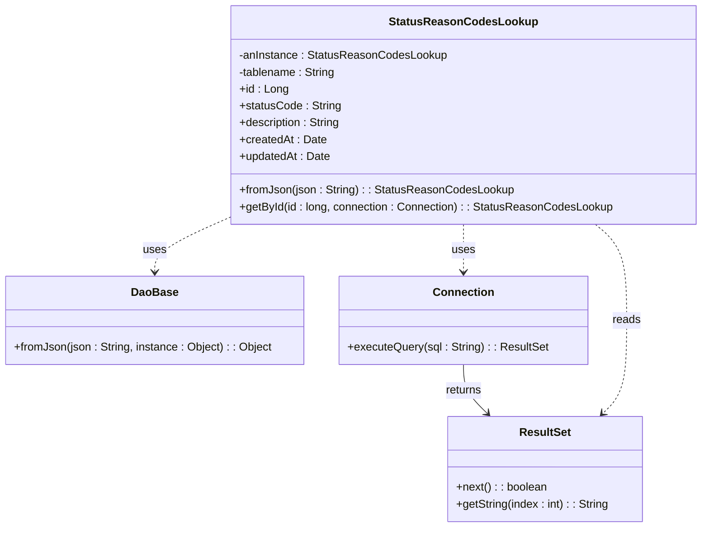
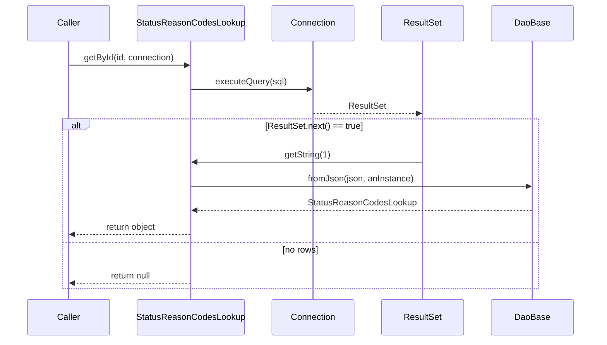
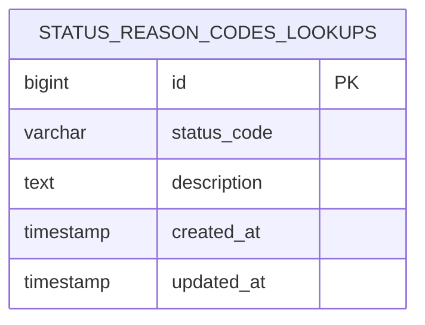

# Diagram: platform-java-lambdas/shipment/src/main/java/com/freightverify/shipment/datastore/postgresql/dao/StatusReasonCodesLookup.java

> Auto-generated by Obscura crawlers

## Diagram 1

### SVG

<svg id="container" width="988.6796875" xmlns="http://www.w3.org/2000/svg" class="classDiagram" height="752" viewBox="0 0 988.6796875 752" role="graphics-document document" aria-roledescription="class"><g><defs><marker id="container_class-aggregationStart" class="marker aggregation class" refX="18" refY="7" markerWidth="190" markerHeight="240" orient="auto"><path d="M 18,7 L9,13 L1,7 L9,1 Z"></path></marker></defs><defs><marker id="container_class-aggregationEnd" class="marker aggregation class" refX="1" refY="7" markerWidth="20" markerHeight="28" orient="auto"><path d="M 18,7 L9,13 L1,7 L9,1 Z"></path></marker></defs><defs><marker id="container_class-extensionStart" class="marker extension class" refX="18" refY="7" markerWidth="190" markerHeight="240" orient="auto"><path d="M 1,7 L18,13 V 1 Z"></path></marker></defs><defs><marker id="container_class-extensionEnd" class="marker extension class" refX="1" refY="7" markerWidth="20" markerHeight="28" orient="auto"><path d="M 1,1 V 13 L18,7 Z"></path></marker></defs><defs><marker id="container_class-compositionStart" class="marker composition class" refX="18" refY="7" markerWidth="190" markerHeight="240" orient="auto"><path d="M 18,7 L9,13 L1,7 L9,1 Z"></path></marker></defs><defs><marker id="container_class-compositionEnd" class="marker composition class" refX="1" refY="7" markerWidth="20" markerHeight="28" orient="auto"><path d="M 18,7 L9,13 L1,7 L9,1 Z"></path></marker></defs><defs><marker id="container_class-dependencyStart" class="marker dependency class" refX="6" refY="7" markerWidth="190" markerHeight="240" orient="auto"><path d="M 5,7 L9,13 L1,7 L9,1 Z"></path></marker></defs><defs><marker id="container_class-dependencyEnd" class="marker dependency class" refX="13" refY="7" markerWidth="20" markerHeight="28" orient="auto"><path d="M 18,7 L9,13 L14,7 L9,1 Z"></path></marker></defs><defs><marker id="container_class-lollipopStart" class="marker lollipop class" refX="13" refY="7" markerWidth="190" markerHeight="240" orient="auto"><circle stroke="black" fill="transparent" cx="7" cy="7" r="6"></circle></marker></defs><defs><marker id="container_class-lollipopEnd" class="marker lollipop class" refX="1" refY="7" markerWidth="190" markerHeight="240" orient="auto"><circle stroke="black" fill="transparent" cx="7" cy="7" r="6"></circle></marker></defs><g class="root"><g class="clusters"></g><g class="edgePaths"><path d="M327.609,308.799L309.493,316.832C291.376,324.866,255.143,340.933,237.027,354.133C218.91,367.333,218.91,377.667,218.91,382.833L218.91,388" id="id_StatusReasonCodesLookup_DaoBase_1" class="edge-thickness-normal edge-pattern-dashed relation" style=";;;" data-edge="true" data-et="edge" data-id="id_StatusReasonCodesLookup_DaoBase_1" data-points="W3sieCI6MzI3LjYwOTM3NSwieSI6MzA4Ljc5ODUwMTE2Njc1NjR9LHsieCI6MjE4LjkxMDE1NjI1LCJ5IjozNTd9LHsieCI6MjE4LjkxMDE1NjI1LCJ5IjozOTR9XQ==" marker-end="url(#container_class-dependencyEnd)"></path><path d="M654.145,320L654.145,326.167C654.145,332.333,654.145,344.667,654.145,356C654.145,367.333,654.145,377.667,654.145,382.833L654.145,388" id="id_StatusReasonCodesLookup_Connection_2" class="edge-thickness-normal edge-pattern-dashed relation" style=";;;" data-edge="true" data-et="edge" data-id="id_StatusReasonCodesLookup_Connection_2" data-points="W3sieCI6NjU0LjE0NDUzMTI1LCJ5IjozMjB9LHsieCI6NjU0LjE0NDUzMTI1LCJ5IjozNTd9LHsieCI6NjU0LjE0NDUzMTI1LCJ5IjozOTR9XQ==" marker-end="url(#container_class-dependencyEnd)"></path><path d="M654.145,520L654.145,526.167C654.145,532.333,654.145,544.667,659.743,556.301C665.341,567.936,676.537,578.872,682.135,584.34L687.733,589.808" id="id_Connection_ResultSet_3" class="edge-thickness-normal edge-pattern-solid relation" style=";;;" data-edge="true" data-et="edge" data-id="id_Connection_ResultSet_3" data-points="W3sieCI6NjU0LjE0NDUzMTI1LCJ5Ijo1MjB9LHsieCI6NjU0LjE0NDUzMTI1LCJ5Ijo1NTd9LHsieCI6NjkyLjAyNTI2ODU1NDY4NzUsInkiOjU5NH1d" marker-end="url(#container_class-dependencyEnd)"></path><path d="M839.511,320L846.839,326.167C854.166,332.333,868.821,344.667,876.149,367.5C883.477,390.333,883.477,423.667,883.477,457C883.477,490.333,883.477,523.667,877.878,545.801C872.28,567.936,861.084,578.872,855.486,584.34L849.888,589.808" id="id_StatusReasonCodesLookup_ResultSet_4" class="edge-thickness-normal edge-pattern-dashed relation" style=";;;" data-edge="true" data-et="edge" data-id="id_StatusReasonCodesLookup_ResultSet_4" data-points="W3sieCI6ODM5LjUxMTM1NDQzNjUyODYsInkiOjMyMH0seyJ4Ijo4ODMuNDc2NTYyNSwieSI6MzU3fSx7IngiOjg4My40NzY1NjI1LCJ5Ijo0NTd9LHsieCI6ODgzLjQ3NjU2MjUsInkiOjU1N30seyJ4Ijo4NDUuNTk1ODI1MTk1MzEyNSwieSI6NTk0fV0=" marker-end="url(#container_class-dependencyEnd)"></path></g><g class="edgeLabels"><g class="edgeLabel" transform="translate(218.91015625, 357)"><g class="label" data-id="id_StatusReasonCodesLookup_DaoBase_1" transform="translate(-16.4921875, -12)"><foreignObject width="32.984375" height="24">

uses

</foreignObject></g></g><g class="edgeLabel" transform="translate(654.14453125, 357)"><g class="label" data-id="id_StatusReasonCodesLookup_Connection_2" transform="translate(-16.4921875, -12)"><foreignObject width="32.984375" height="24">

uses

</foreignObject></g></g><g class="edgeLabel" transform="translate(654.14453125, 557)"><g class="label" data-id="id_Connection_ResultSet_3" transform="translate(-26.265625, -12)"><foreignObject width="52.53125" height="24">

returns

</foreignObject></g></g><g class="edgeLabel" transform="translate(883.4765625, 457)"><g class="label" data-id="id_StatusReasonCodesLookup_ResultSet_4" transform="translate(-20.0078125, -12)"><foreignObject width="40.015625" height="24">

reads

</foreignObject></g></g></g><g class="nodes"><g class="node default" id="classId-StatusReasonCodesLookup-0" transform="translate(654.14453125, 164)"><g class="basic label-container"><path d="M-326.53515625 -156 L326.53515625 -156 L326.53515625 156 L-326.53515625 156" stroke="none" stroke-width="0" fill="#ECECFF" style=""></path><path d="M-326.53515625 -156 C-105.90238196841702 -156, 114.73039231316596 -156, 326.53515625 -156 M-326.53515625 -156 C-98.01036214503807 -156, 130.51443195992385 -156, 326.53515625 -156 M326.53515625 -156 C326.53515625 -76.45104153079026, 326.53515625 3.0979169384194734, 326.53515625 156 M326.53515625 -156 C326.53515625 -69.66427133155884, 326.53515625 16.671457336882327, 326.53515625 156 M326.53515625 156 C159.17473700841066 156, -8.185682233178682 156, -326.53515625 156 M326.53515625 156 C116.11787043905775 156, -94.29941537188449 156, -326.53515625 156 M-326.53515625 156 C-326.53515625 56.151368089849484, -326.53515625 -43.69726382030103, -326.53515625 -156 M-326.53515625 156 C-326.53515625 86.93651179454308, -326.53515625 17.87302358908616, -326.53515625 -156" stroke="#9370DB" stroke-width="1.3" fill="none" stroke-dasharray="0 0" style=""></path></g><g class="annotation-group text" transform="translate(0, -132)"></g><g class="label-group text" transform="translate(-99.2265625, -132)"><g class="label" style="font-weight: bolder" transform="translate(0,-12)"><foreignObject width="198.453125" height="24">

StatusReasonCodesLookup

</foreignObject></g></g><g class="members-group text" transform="translate(-314.53515625, -84)"><g class="label" style="" transform="translate(0,-12)"><foreignObject width="293.25" height="24">

-anInstance : StatusReasonCodesLookup

</foreignObject></g><g class="label" style="" transform="translate(0,12)"><foreignObject width="139.28125" height="24">

-tablename : String

</foreignObject></g><g class="label" style="" transform="translate(0,36)"><foreignObject width="69" height="24">

+id : Long

</foreignObject></g><g class="label" style="" transform="translate(0,60)"><foreignObject width="143.859375" height="24">

+statusCode : String

</foreignObject></g><g class="label" style="" transform="translate(0,84)"><foreignObject width="145.796875" height="24">

+description : String

</foreignObject></g><g class="label" style="" transform="translate(0,108)"><foreignObject width="122.796875" height="24">

+createdAt : Date

</foreignObject></g><g class="label" style="" transform="translate(0,132)"><foreignObject width="129.265625" height="24">

+updatedAt : Date

</foreignObject></g></g><g class="methods-group text" transform="translate(-314.53515625, 108)"><g class="label" style="" transform="translate(0,-12)"><foreignObject width="385.4375" height="24">

+fromJson(json : String) : : StatusReasonCodesLookup

</foreignObject></g><g class="label" style="" transform="translate(0,12)"><foreignObject width="529.84375" height="24">

+getById(id : long, connection : Connection) : : StatusReasonCodesLookup

</foreignObject></g></g><g class="divider" style=""><path d="M-326.53515625 -108 C-137.96298808225484 -108, 50.60918008549032 -108, 326.53515625 -108 M-326.53515625 -108 C-195.69738633065674 -108, -64.85961641131348 -108, 326.53515625 -108" stroke="#9370DB" stroke-width="1.3" fill="none" stroke-dasharray="0 0" style=""></path></g><g class="divider" style=""><path d="M-326.53515625 84 C-186.2469123251955 84, -45.95866840039099 84, 326.53515625 84 M-326.53515625 84 C-176.208528801156 84, -25.881901352312013 84, 326.53515625 84" stroke="#9370DB" stroke-width="1.3" fill="none" stroke-dasharray="0 0" style=""></path></g></g><g class="node default" id="classId-DaoBase-1" transform="translate(218.91015625, 457)"><g class="basic label-container"><path d="M-210.91015625 -63 L210.91015625 -63 L210.91015625 63 L-210.91015625 63" stroke="none" stroke-width="0" fill="#ECECFF" style=""></path><path d="M-210.91015625 -63 C-72.28070551614235 -63, 66.3487452177153 -63, 210.91015625 -63 M-210.91015625 -63 C-52.3568039745187 -63, 106.1965483009626 -63, 210.91015625 -63 M210.91015625 -63 C210.91015625 -27.73063284569254, 210.91015625 7.53873430861492, 210.91015625 63 M210.91015625 -63 C210.91015625 -33.60017431880782, 210.91015625 -4.200348637615633, 210.91015625 63 M210.91015625 63 C51.3934693867576 63, -108.1232174764848 63, -210.91015625 63 M210.91015625 63 C63.53273369262408 63, -83.84468886475184 63, -210.91015625 63 M-210.91015625 63 C-210.91015625 35.05936654588093, -210.91015625 7.118733091761854, -210.91015625 -63 M-210.91015625 63 C-210.91015625 16.17577274648086, -210.91015625 -30.64845450703828, -210.91015625 -63" stroke="#9370DB" stroke-width="1.3" fill="none" stroke-dasharray="0 0" style=""></path></g><g class="annotation-group text" transform="translate(0, -39)"></g><g class="label-group text" transform="translate(-31.7109375, -39)"><g class="label" style="font-weight: bolder" transform="translate(0,-12)"><foreignObject width="63.421875" height="24">

DaoBase

</foreignObject></g></g><g class="members-group text" transform="translate(-198.91015625, 9)"></g><g class="methods-group text" transform="translate(-198.91015625, 39)"><g class="label" style="" transform="translate(0,-12)"><foreignObject width="366.109375" height="24">

+fromJson(json : String, instance : Object) : : Object

</foreignObject></g></g><g class="divider" style=""><path d="M-210.91015625 -15 C-120.79495014581524 -15, -30.67974404163047 -15, 210.91015625 -15 M-210.91015625 -15 C-105.17097128530905 -15, 0.5682136793818984 -15, 210.91015625 -15" stroke="#9370DB" stroke-width="1.3" fill="none" stroke-dasharray="0 0" style=""></path></g><g class="divider" style=""><path d="M-210.91015625 9 C-48.20912157103922 9, 114.49191310792156 9, 210.91015625 9 M-210.91015625 9 C-76.45204797075885 9, 58.00606030848229 9, 210.91015625 9" stroke="#9370DB" stroke-width="1.3" fill="none" stroke-dasharray="0 0" style=""></path></g></g><g class="node default" id="classId-Connection-2" transform="translate(654.14453125, 457)"><g class="basic label-container"><path d="M-174.32421875 -63 L174.32421875 -63 L174.32421875 63 L-174.32421875 63" stroke="none" stroke-width="0" fill="#ECECFF" style=""></path><path d="M-174.32421875 -63 C-60.99854478599519 -63, 52.32712917800961 -63, 174.32421875 -63 M-174.32421875 -63 C-98.76054783686179 -63, -23.19687692372358 -63, 174.32421875 -63 M174.32421875 -63 C174.32421875 -26.96107655287708, 174.32421875 9.077846894245837, 174.32421875 63 M174.32421875 -63 C174.32421875 -16.077693344768498, 174.32421875 30.844613310463004, 174.32421875 63 M174.32421875 63 C93.66639102510875 63, 13.008563300217503 63, -174.32421875 63 M174.32421875 63 C59.10430979311073 63, -56.11559916377854 63, -174.32421875 63 M-174.32421875 63 C-174.32421875 16.076050618493923, -174.32421875 -30.847898763012154, -174.32421875 -63 M-174.32421875 63 C-174.32421875 17.39690498729376, -174.32421875 -28.206190025412482, -174.32421875 -63" stroke="#9370DB" stroke-width="1.3" fill="none" stroke-dasharray="0 0" style=""></path></g><g class="annotation-group text" transform="translate(0, -39)"></g><g class="label-group text" transform="translate(-41.2265625, -39)"><g class="label" style="font-weight: bolder" transform="translate(0,-12)"><foreignObject width="82.453125" height="24">

Connection

</foreignObject></g></g><g class="members-group text" transform="translate(-162.32421875, 9)"></g><g class="methods-group text" transform="translate(-162.32421875, 39)"><g class="label" style="" transform="translate(0,-12)"><foreignObject width="283.421875" height="24">

+executeQuery(sql : String) : : ResultSet

</foreignObject></g></g><g class="divider" style=""><path d="M-174.32421875 -15 C-88.8906646711549 -15, -3.457110592309789 -15, 174.32421875 -15 M-174.32421875 -15 C-46.973112951766566 -15, 80.37799284646687 -15, 174.32421875 -15" stroke="#9370DB" stroke-width="1.3" fill="none" stroke-dasharray="0 0" style=""></path></g><g class="divider" style=""><path d="M-174.32421875 9 C-102.68951988713431 9, -31.05482102426862 9, 174.32421875 9 M-174.32421875 9 C-67.40769093507045 9, 39.5088368798591 9, 174.32421875 9" stroke="#9370DB" stroke-width="1.3" fill="none" stroke-dasharray="0 0" style=""></path></g></g><g class="node default" id="classId-ResultSet-3" transform="translate(768.810546875, 669)"><g class="basic label-container"><path d="M-139.0390625 -75 L139.0390625 -75 L139.0390625 75 L-139.0390625 75" stroke="none" stroke-width="0" fill="#ECECFF" style=""></path><path d="M-139.0390625 -75 C-52.08756728803712 -75, 34.86392792392576 -75, 139.0390625 -75 M-139.0390625 -75 C-36.8404810532425 -75, 65.358100393515 -75, 139.0390625 -75 M139.0390625 -75 C139.0390625 -39.87953794426295, 139.0390625 -4.759075888525899, 139.0390625 75 M139.0390625 -75 C139.0390625 -42.5192888857927, 139.0390625 -10.038577771585395, 139.0390625 75 M139.0390625 75 C63.46925093391884 75, -12.100560632162313 75, -139.0390625 75 M139.0390625 75 C67.86020919152172 75, -3.3186441169565626 75, -139.0390625 75 M-139.0390625 75 C-139.0390625 42.16048116731233, -139.0390625 9.320962334624653, -139.0390625 -75 M-139.0390625 75 C-139.0390625 30.468332065755973, -139.0390625 -14.063335868488053, -139.0390625 -75" stroke="#9370DB" stroke-width="1.3" fill="none" stroke-dasharray="0 0" style=""></path></g><g class="annotation-group text" transform="translate(0, -51)"></g><g class="label-group text" transform="translate(-35.21875, -51)"><g class="label" style="font-weight: bolder" transform="translate(0,-12)"><foreignObject width="70.4375" height="24">

ResultSet

</foreignObject></g></g><g class="members-group text" transform="translate(-127.0390625, -3)"></g><g class="methods-group text" transform="translate(-127.0390625, 27)"><g class="label" style="" transform="translate(0,-12)"><foreignObject width="129.6875" height="24">

+next() : : boolean

</foreignObject></g><g class="label" style="" transform="translate(0,12)"><foreignObject width="218.859375" height="24">

+getString(index : int) : : String

</foreignObject></g></g><g class="divider" style=""><path d="M-139.0390625 -27 C-65.65062238090354 -27, 7.737817738192916 -27, 139.0390625 -27 M-139.0390625 -27 C-55.416108537363456 -27, 28.206845425273087 -27, 139.0390625 -27" stroke="#9370DB" stroke-width="1.3" fill="none" stroke-dasharray="0 0" style=""></path></g><g class="divider" style=""><path d="M-139.0390625 -3 C-44.79288695134916 -3, 49.45328859730168 -3, 139.0390625 -3 M-139.0390625 -3 C-58.30247072468484 -3, 22.434121050630324 -3, 139.0390625 -3" stroke="#9370DB" stroke-width="1.3" fill="none" stroke-dasharray="0 0" style=""></path></g></g></g></g></g></svg>

## Diagram 2

### SVG

<svg id="container" width="1120.5" xmlns="http://www.w3.org/2000/svg" height="655" viewBox="-50 -10 1120.5 655" role="graphics-document document" aria-roledescription="sequence"><g><rect x="870.5" y="569" fill="#eaeaea" stroke="#666" width="150" height="65" name="DaoBase" rx="3" ry="3" class="actor actor-bottom"></rect><text x="945.5" y="601.5" dominant-baseline="central" alignment-baseline="central" class="actor actor-box" style="text-anchor: middle; font-size: 16px; font-weight: 400;"><tspan x="945.5" dy="0">DaoBase</tspan></text></g><g><rect x="670.5" y="569" fill="#eaeaea" stroke="#666" width="150" height="65" name="ResultSet" rx="3" ry="3" class="actor actor-bottom"></rect><text x="745.5" y="601.5" dominant-baseline="central" alignment-baseline="central" class="actor actor-box" style="text-anchor: middle; font-size: 16px; font-weight: 400;"><tspan x="745.5" dy="0">ResultSet</tspan></text></g><g><rect x="470.5" y="569" fill="#eaeaea" stroke="#666" width="150" height="65" name="Connection" rx="3" ry="3" class="actor actor-bottom"></rect><text x="545.5" y="601.5" dominant-baseline="central" alignment-baseline="central" class="actor actor-box" style="text-anchor: middle; font-size: 16px; font-weight: 400;"><tspan x="545.5" dy="0">Connection</tspan></text></g><g><rect x="205.5" y="569" fill="#eaeaea" stroke="#666" width="215" height="65" name="StatusReasonCodesLookup" rx="3" ry="3" class="actor actor-bottom"></rect><text x="313" y="601.5" dominant-baseline="central" alignment-baseline="central" class="actor actor-box" style="text-anchor: middle; font-size: 16px; font-weight: 400;"><tspan x="313" dy="0">StatusReasonCodesLookup</tspan></text></g><g><rect x="0" y="569" fill="#eaeaea" stroke="#666" width="150" height="65" name="Caller" rx="3" ry="3" class="actor actor-bottom"></rect><text x="75" y="601.5" dominant-baseline="central" alignment-baseline="central" class="actor actor-box" style="text-anchor: middle; font-size: 16px; font-weight: 400;"><tspan x="75" dy="0">Caller</tspan></text></g><g><line id="actor4" x1="945.5" y1="65" x2="945.5" y2="569" class="actor-line 200" stroke-width="0.5px" stroke="#999" name="DaoBase"></line><g id="root-4"><rect x="870.5" y="0" fill="#eaeaea" stroke="#666" width="150" height="65" name="DaoBase" rx="3" ry="3" class="actor actor-top"></rect><text x="945.5" y="32.5" dominant-baseline="central" alignment-baseline="central" class="actor actor-box" style="text-anchor: middle; font-size: 16px; font-weight: 400;"><tspan x="945.5" dy="0">DaoBase</tspan></text></g></g><g><line id="actor3" x1="745.5" y1="65" x2="745.5" y2="569" class="actor-line 200" stroke-width="0.5px" stroke="#999" name="ResultSet"></line><g id="root-3"><rect x="670.5" y="0" fill="#eaeaea" stroke="#666" width="150" height="65" name="ResultSet" rx="3" ry="3" class="actor actor-top"></rect><text x="745.5" y="32.5" dominant-baseline="central" alignment-baseline="central" class="actor actor-box" style="text-anchor: middle; font-size: 16px; font-weight: 400;"><tspan x="745.5" dy="0">ResultSet</tspan></text></g></g><g><line id="actor2" x1="545.5" y1="65" x2="545.5" y2="569" class="actor-line 200" stroke-width="0.5px" stroke="#999" name="Connection"></line><g id="root-2"><rect x="470.5" y="0" fill="#eaeaea" stroke="#666" width="150" height="65" name="Connection" rx="3" ry="3" class="actor actor-top"></rect><text x="545.5" y="32.5" dominant-baseline="central" alignment-baseline="central" class="actor actor-box" style="text-anchor: middle; font-size: 16px; font-weight: 400;"><tspan x="545.5" dy="0">Connection</tspan></text></g></g><g><line id="actor1" x1="313" y1="65" x2="313" y2="569" class="actor-line 200" stroke-width="0.5px" stroke="#999" name="StatusReasonCodesLookup"></line><g id="root-1"><rect x="205.5" y="0" fill="#eaeaea" stroke="#666" width="215" height="65" name="StatusReasonCodesLookup" rx="3" ry="3" class="actor actor-top"></rect><text x="313" y="32.5" dominant-baseline="central" alignment-baseline="central" class="actor actor-box" style="text-anchor: middle; font-size: 16px; font-weight: 400;"><tspan x="313" dy="0">StatusReasonCodesLookup</tspan></text></g></g><g><line id="actor0" x1="75" y1="65" x2="75" y2="569" class="actor-line 200" stroke-width="0.5px" stroke="#999" name="Caller"></line><g id="root-0"><rect x="0" y="0" fill="#eaeaea" stroke="#666" width="150" height="65" name="Caller" rx="3" ry="3" class="actor actor-top"></rect><text x="75" y="32.5" dominant-baseline="central" alignment-baseline="central" class="actor actor-box" style="text-anchor: middle; font-size: 16px; font-weight: 400;"><tspan x="75" dy="0">Caller</tspan></text></g></g><g></g><defs><symbol id="computer" width="24" height="24"><path transform="scale(.5)" d="M2 2v13h20v-13h-20zm18 11h-16v-9h16v9zm-10.228 6l.466-1h3.524l.467 1h-4.457zm14.228 3h-24l2-6h2.104l-1.33 4h18.45l-1.297-4h2.073l2 6zm-5-10h-14v-7h14v7z"></path></symbol></defs><defs><symbol id="database" fill-rule="evenodd" clip-rule="evenodd"><path transform="scale(.5)" d="M12.258.001l.256.004.255.005.253.008.251.01.249.012.247.015.246.016.242.019.241.02.239.023.236.024.233.027.231.028.229.031.225.032.223.034.22.036.217.038.214.04.211.041.208.043.205.045.201.046.198.048.194.05.191.051.187.053.183.054.18.056.175.057.172.059.168.06.163.061.16.063.155.064.15.066.074.033.073.033.071.034.07.034.069.035.068.035.067.035.066.035.064.036.064.036.062.036.06.036.06.037.058.037.058.037.055.038.055.038.053.038.052.038.051.039.05.039.048.039.047.039.045.04.044.04.043.04.041.04.04.041.039.041.037.041.036.041.034.041.033.042.032.042.03.042.029.042.027.042.026.043.024.043.023.043.021.043.02.043.018.044.017.043.015.044.013.044.012.044.011.045.009.044.007.045.006.045.004.045.002.045.001.045v17l-.001.045-.002.045-.004.045-.006.045-.007.045-.009.044-.011.045-.012.044-.013.044-.015.044-.017.043-.018.044-.02.043-.021.043-.023.043-.024.043-.026.043-.027.042-.029.042-.03.042-.032.042-.033.042-.034.041-.036.041-.037.041-.039.041-.04.041-.041.04-.043.04-.044.04-.045.04-.047.039-.048.039-.05.039-.051.039-.052.038-.053.038-.055.038-.055.038-.058.037-.058.037-.06.037-.06.036-.062.036-.064.036-.064.036-.066.035-.067.035-.068.035-.069.035-.07.034-.071.034-.073.033-.074.033-.15.066-.155.064-.16.063-.163.061-.168.06-.172.059-.175.057-.18.056-.183.054-.187.053-.191.051-.194.05-.198.048-.201.046-.205.045-.208.043-.211.041-.214.04-.217.038-.22.036-.223.034-.225.032-.229.031-.231.028-.233.027-.236.024-.239.023-.241.02-.242.019-.246.016-.247.015-.249.012-.251.01-.253.008-.255.005-.256.004-.258.001-.258-.001-.256-.004-.255-.005-.253-.008-.251-.01-.249-.012-.247-.015-.245-.016-.243-.019-.241-.02-.238-.023-.236-.024-.234-.027-.231-.028-.228-.031-.226-.032-.223-.034-.22-.036-.217-.038-.214-.04-.211-.041-.208-.043-.204-.045-.201-.046-.198-.048-.195-.05-.19-.051-.187-.053-.184-.054-.179-.056-.176-.057-.172-.059-.167-.06-.164-.061-.159-.063-.155-.064-.151-.066-.074-.033-.072-.033-.072-.034-.07-.034-.069-.035-.068-.035-.067-.035-.066-.035-.064-.036-.063-.036-.062-.036-.061-.036-.06-.037-.058-.037-.057-.037-.056-.038-.055-.038-.053-.038-.052-.038-.051-.039-.049-.039-.049-.039-.046-.039-.046-.04-.044-.04-.043-.04-.041-.04-.04-.041-.039-.041-.037-.041-.036-.041-.034-.041-.033-.042-.032-.042-.03-.042-.029-.042-.027-.042-.026-.043-.024-.043-.023-.043-.021-.043-.02-.043-.018-.044-.017-.043-.015-.044-.013-.044-.012-.044-.011-.045-.009-.044-.007-.045-.006-.045-.004-.045-.002-.045-.001-.045v-17l.001-.045.002-.045.004-.045.006-.045.007-.045.009-.044.011-.045.012-.044.013-.044.015-.044.017-.043.018-.044.02-.043.021-.043.023-.043.024-.043.026-.043.027-.042.029-.042.03-.042.032-.042.033-.042.034-.041.036-.041.037-.041.039-.041.04-.041.041-.04.043-.04.044-.04.046-.04.046-.039.049-.039.049-.039.051-.039.052-.038.053-.038.055-.038.056-.038.057-.037.058-.037.06-.037.061-.036.062-.036.063-.036.064-.036.066-.035.067-.035.068-.035.069-.035.07-.034.072-.034.072-.033.074-.033.151-.066.155-.064.159-.063.164-.061.167-.06.172-.059.176-.057.179-.056.184-.054.187-.053.19-.051.195-.05.198-.048.201-.046.204-.045.208-.043.211-.041.214-.04.217-.038.22-.036.223-.034.226-.032.228-.031.231-.028.234-.027.236-.024.238-.023.241-.02.243-.019.245-.016.247-.015.249-.012.251-.01.253-.008.255-.005.256-.004.258-.001.258.001zm-9.258 20.499v.01l.001.021.003.021.004.022.005.021.006.022.007.022.009.023.01.022.011.023.012.023.013.023.015.023.016.024.017.023.018.024.019.024.021.024.022.025.023.024.024.025.052.049.056.05.061.051.066.051.07.051.075.051.079.052.084.052.088.052.092.052.097.052.102.051.105.052.11.052.114.051.119.051.123.051.127.05.131.05.135.05.139.048.144.049.147.047.152.047.155.047.16.045.163.045.167.043.171.043.176.041.178.041.183.039.187.039.19.037.194.035.197.035.202.033.204.031.209.03.212.029.216.027.219.025.222.024.226.021.23.02.233.018.236.016.24.015.243.012.246.01.249.008.253.005.256.004.259.001.26-.001.257-.004.254-.005.25-.008.247-.011.244-.012.241-.014.237-.016.233-.018.231-.021.226-.021.224-.024.22-.026.216-.027.212-.028.21-.031.205-.031.202-.034.198-.034.194-.036.191-.037.187-.039.183-.04.179-.04.175-.042.172-.043.168-.044.163-.045.16-.046.155-.046.152-.047.148-.048.143-.049.139-.049.136-.05.131-.05.126-.05.123-.051.118-.052.114-.051.11-.052.106-.052.101-.052.096-.052.092-.052.088-.053.083-.051.079-.052.074-.052.07-.051.065-.051.06-.051.056-.05.051-.05.023-.024.023-.025.021-.024.02-.024.019-.024.018-.024.017-.024.015-.023.014-.024.013-.023.012-.023.01-.023.01-.022.008-.022.006-.022.006-.022.004-.022.004-.021.001-.021.001-.021v-4.127l-.077.055-.08.053-.083.054-.085.053-.087.052-.09.052-.093.051-.095.05-.097.05-.1.049-.102.049-.105.048-.106.047-.109.047-.111.046-.114.045-.115.045-.118.044-.12.043-.122.042-.124.042-.126.041-.128.04-.13.04-.132.038-.134.038-.135.037-.138.037-.139.035-.142.035-.143.034-.144.033-.147.032-.148.031-.15.03-.151.03-.153.029-.154.027-.156.027-.158.026-.159.025-.161.024-.162.023-.163.022-.165.021-.166.02-.167.019-.169.018-.169.017-.171.016-.173.015-.173.014-.175.013-.175.012-.177.011-.178.01-.179.008-.179.008-.181.006-.182.005-.182.004-.184.003-.184.002h-.37l-.184-.002-.184-.003-.182-.004-.182-.005-.181-.006-.179-.008-.179-.008-.178-.01-.176-.011-.176-.012-.175-.013-.173-.014-.172-.015-.171-.016-.17-.017-.169-.018-.167-.019-.166-.02-.165-.021-.163-.022-.162-.023-.161-.024-.159-.025-.157-.026-.156-.027-.155-.027-.153-.029-.151-.03-.15-.03-.148-.031-.146-.032-.145-.033-.143-.034-.141-.035-.14-.035-.137-.037-.136-.037-.134-.038-.132-.038-.13-.04-.128-.04-.126-.041-.124-.042-.122-.042-.12-.044-.117-.043-.116-.045-.113-.045-.112-.046-.109-.047-.106-.047-.105-.048-.102-.049-.1-.049-.097-.05-.095-.05-.093-.052-.09-.051-.087-.052-.085-.053-.083-.054-.08-.054-.077-.054v4.127zm0-5.654v.011l.001.021.003.021.004.021.005.022.006.022.007.022.009.022.01.022.011.023.012.023.013.023.015.024.016.023.017.024.018.024.019.024.021.024.022.024.023.025.024.024.052.05.056.05.061.05.066.051.07.051.075.052.079.051.084.052.088.052.092.052.097.052.102.052.105.052.11.051.114.051.119.052.123.05.127.051.131.05.135.049.139.049.144.048.147.048.152.047.155.046.16.045.163.045.167.044.171.042.176.042.178.04.183.04.187.038.19.037.194.036.197.034.202.033.204.032.209.03.212.028.216.027.219.025.222.024.226.022.23.02.233.018.236.016.24.014.243.012.246.01.249.008.253.006.256.003.259.001.26-.001.257-.003.254-.006.25-.008.247-.01.244-.012.241-.015.237-.016.233-.018.231-.02.226-.022.224-.024.22-.025.216-.027.212-.029.21-.03.205-.032.202-.033.198-.035.194-.036.191-.037.187-.039.183-.039.179-.041.175-.042.172-.043.168-.044.163-.045.16-.045.155-.047.152-.047.148-.048.143-.048.139-.05.136-.049.131-.05.126-.051.123-.051.118-.051.114-.052.11-.052.106-.052.101-.052.096-.052.092-.052.088-.052.083-.052.079-.052.074-.051.07-.052.065-.051.06-.05.056-.051.051-.049.023-.025.023-.024.021-.025.02-.024.019-.024.018-.024.017-.024.015-.023.014-.023.013-.024.012-.022.01-.023.01-.023.008-.022.006-.022.006-.022.004-.021.004-.022.001-.021.001-.021v-4.139l-.077.054-.08.054-.083.054-.085.052-.087.053-.09.051-.093.051-.095.051-.097.05-.1.049-.102.049-.105.048-.106.047-.109.047-.111.046-.114.045-.115.044-.118.044-.12.044-.122.042-.124.042-.126.041-.128.04-.13.039-.132.039-.134.038-.135.037-.138.036-.139.036-.142.035-.143.033-.144.033-.147.033-.148.031-.15.03-.151.03-.153.028-.154.028-.156.027-.158.026-.159.025-.161.024-.162.023-.163.022-.165.021-.166.02-.167.019-.169.018-.169.017-.171.016-.173.015-.173.014-.175.013-.175.012-.177.011-.178.009-.179.009-.179.007-.181.007-.182.005-.182.004-.184.003-.184.002h-.37l-.184-.002-.184-.003-.182-.004-.182-.005-.181-.007-.179-.007-.179-.009-.178-.009-.176-.011-.176-.012-.175-.013-.173-.014-.172-.015-.171-.016-.17-.017-.169-.018-.167-.019-.166-.02-.165-.021-.163-.022-.162-.023-.161-.024-.159-.025-.157-.026-.156-.027-.155-.028-.153-.028-.151-.03-.15-.03-.148-.031-.146-.033-.145-.033-.143-.033-.141-.035-.14-.036-.137-.036-.136-.037-.134-.038-.132-.039-.13-.039-.128-.04-.126-.041-.124-.042-.122-.043-.12-.043-.117-.044-.116-.044-.113-.046-.112-.046-.109-.046-.106-.047-.105-.048-.102-.049-.1-.049-.097-.05-.095-.051-.093-.051-.09-.051-.087-.053-.085-.052-.083-.054-.08-.054-.077-.054v4.139zm0-5.666v.011l.001.02.003.022.004.021.005.022.006.021.007.022.009.023.01.022.011.023.012.023.013.023.015.023.016.024.017.024.018.023.019.024.021.025.022.024.023.024.024.025.052.05.056.05.061.05.066.051.07.051.075.052.079.051.084.052.088.052.092.052.097.052.102.052.105.051.11.052.114.051.119.051.123.051.127.05.131.05.135.05.139.049.144.048.147.048.152.047.155.046.16.045.163.045.167.043.171.043.176.042.178.04.183.04.187.038.19.037.194.036.197.034.202.033.204.032.209.03.212.028.216.027.219.025.222.024.226.021.23.02.233.018.236.017.24.014.243.012.246.01.249.008.253.006.256.003.259.001.26-.001.257-.003.254-.006.25-.008.247-.01.244-.013.241-.014.237-.016.233-.018.231-.02.226-.022.224-.024.22-.025.216-.027.212-.029.21-.03.205-.032.202-.033.198-.035.194-.036.191-.037.187-.039.183-.039.179-.041.175-.042.172-.043.168-.044.163-.045.16-.045.155-.047.152-.047.148-.048.143-.049.139-.049.136-.049.131-.051.126-.05.123-.051.118-.052.114-.051.11-.052.106-.052.101-.052.096-.052.092-.052.088-.052.083-.052.079-.052.074-.052.07-.051.065-.051.06-.051.056-.05.051-.049.023-.025.023-.025.021-.024.02-.024.019-.024.018-.024.017-.024.015-.023.014-.024.013-.023.012-.023.01-.022.01-.023.008-.022.006-.022.006-.022.004-.022.004-.021.001-.021.001-.021v-4.153l-.077.054-.08.054-.083.053-.085.053-.087.053-.09.051-.093.051-.095.051-.097.05-.1.049-.102.048-.105.048-.106.048-.109.046-.111.046-.114.046-.115.044-.118.044-.12.043-.122.043-.124.042-.126.041-.128.04-.13.039-.132.039-.134.038-.135.037-.138.036-.139.036-.142.034-.143.034-.144.033-.147.032-.148.032-.15.03-.151.03-.153.028-.154.028-.156.027-.158.026-.159.024-.161.024-.162.023-.163.023-.165.021-.166.02-.167.019-.169.018-.169.017-.171.016-.173.015-.173.014-.175.013-.175.012-.177.01-.178.01-.179.009-.179.007-.181.006-.182.006-.182.004-.184.003-.184.001-.185.001-.185-.001-.184-.001-.184-.003-.182-.004-.182-.006-.181-.006-.179-.007-.179-.009-.178-.01-.176-.01-.176-.012-.175-.013-.173-.014-.172-.015-.171-.016-.17-.017-.169-.018-.167-.019-.166-.02-.165-.021-.163-.023-.162-.023-.161-.024-.159-.024-.157-.026-.156-.027-.155-.028-.153-.028-.151-.03-.15-.03-.148-.032-.146-.032-.145-.033-.143-.034-.141-.034-.14-.036-.137-.036-.136-.037-.134-.038-.132-.039-.13-.039-.128-.041-.126-.041-.124-.041-.122-.043-.12-.043-.117-.044-.116-.044-.113-.046-.112-.046-.109-.046-.106-.048-.105-.048-.102-.048-.1-.05-.097-.049-.095-.051-.093-.051-.09-.052-.087-.052-.085-.053-.083-.053-.08-.054-.077-.054v4.153zm8.74-8.179l-.257.004-.254.005-.25.008-.247.011-.244.012-.241.014-.237.016-.233.018-.231.021-.226.022-.224.023-.22.026-.216.027-.212.028-.21.031-.205.032-.202.033-.198.034-.194.036-.191.038-.187.038-.183.04-.179.041-.175.042-.172.043-.168.043-.163.045-.16.046-.155.046-.152.048-.148.048-.143.048-.139.049-.136.05-.131.05-.126.051-.123.051-.118.051-.114.052-.11.052-.106.052-.101.052-.096.052-.092.052-.088.052-.083.052-.079.052-.074.051-.07.052-.065.051-.06.05-.056.05-.051.05-.023.025-.023.024-.021.024-.02.025-.019.024-.018.024-.017.023-.015.024-.014.023-.013.023-.012.023-.01.023-.01.022-.008.022-.006.023-.006.021-.004.022-.004.021-.001.021-.001.021.001.021.001.021.004.021.004.022.006.021.006.023.008.022.01.022.01.023.012.023.013.023.014.023.015.024.017.023.018.024.019.024.02.025.021.024.023.024.023.025.051.05.056.05.06.05.065.051.07.052.074.051.079.052.083.052.088.052.092.052.096.052.101.052.106.052.11.052.114.052.118.051.123.051.126.051.131.05.136.05.139.049.143.048.148.048.152.048.155.046.16.046.163.045.168.043.172.043.175.042.179.041.183.04.187.038.191.038.194.036.198.034.202.033.205.032.21.031.212.028.216.027.22.026.224.023.226.022.231.021.233.018.237.016.241.014.244.012.247.011.25.008.254.005.257.004.26.001.26-.001.257-.004.254-.005.25-.008.247-.011.244-.012.241-.014.237-.016.233-.018.231-.021.226-.022.224-.023.22-.026.216-.027.212-.028.21-.031.205-.032.202-.033.198-.034.194-.036.191-.038.187-.038.183-.04.179-.041.175-.042.172-.043.168-.043.163-.045.16-.046.155-.046.152-.048.148-.048.143-.048.139-.049.136-.05.131-.05.126-.051.123-.051.118-.051.114-.052.11-.052.106-.052.101-.052.096-.052.092-.052.088-.052.083-.052.079-.052.074-.051.07-.052.065-.051.06-.05.056-.05.051-.05.023-.025.023-.024.021-.024.02-.025.019-.024.018-.024.017-.023.015-.024.014-.023.013-.023.012-.023.01-.023.01-.022.008-.022.006-.023.006-.021.004-.022.004-.021.001-.021.001-.021-.001-.021-.001-.021-.004-.021-.004-.022-.006-.021-.006-.023-.008-.022-.01-.022-.01-.023-.012-.023-.013-.023-.014-.023-.015-.024-.017-.023-.018-.024-.019-.024-.02-.025-.021-.024-.023-.024-.023-.025-.051-.05-.056-.05-.06-.05-.065-.051-.07-.052-.074-.051-.079-.052-.083-.052-.088-.052-.092-.052-.096-.052-.101-.052-.106-.052-.11-.052-.114-.052-.118-.051-.123-.051-.126-.051-.131-.05-.136-.05-.139-.049-.143-.048-.148-.048-.152-.048-.155-.046-.16-.046-.163-.045-.168-.043-.172-.043-.175-.042-.179-.041-.183-.04-.187-.038-.191-.038-.194-.036-.198-.034-.202-.033-.205-.032-.21-.031-.212-.028-.216-.027-.22-.026-.224-.023-.226-.022-.231-.021-.233-.018-.237-.016-.241-.014-.244-.012-.247-.011-.25-.008-.254-.005-.257-.004-.26-.001-.26.001z"></path></symbol></defs><defs><symbol id="clock" width="24" height="24"><path transform="scale(.5)" d="M12 2c5.514 0 10 4.486 10 10s-4.486 10-10 10-10-4.486-10-10 4.486-10 10-10zm0-2c-6.627 0-12 5.373-12 12s5.373 12 12 12 12-5.373 12-12-5.373-12-12-12zm5.848 12.459c.202.038.202.333.001.372-1.907.361-6.045 1.111-6.547 1.111-.719 0-1.301-.582-1.301-1.301 0-.512.77-5.447 1.125-7.445.034-.192.312-.181.343.014l.985 6.238 5.394 1.011z"></path></symbol></defs><defs><marker id="arrowhead" refX="7.9" refY="5" markerUnits="userSpaceOnUse" markerWidth="12" markerHeight="12" orient="auto-start-reverse"><path d="M -1 0 L 10 5 L 0 10 z"></path></marker></defs><defs><marker id="crosshead" markerWidth="15" markerHeight="8" orient="auto" refX="4" refY="4.5"><path fill="none" stroke="#000000" stroke-width="1pt" d="M 1,2 L 6,7 M 6,2 L 1,7" style="stroke-dasharray: 0, 0;"></path></marker></defs><defs><marker id="filled-head" refX="15.5" refY="7" markerWidth="20" markerHeight="28" orient="auto"><path d="M 18,7 L9,13 L14,7 L9,1 Z"></path></marker></defs><defs><marker id="sequencenumber" refX="15" refY="15" markerWidth="60" markerHeight="40" orient="auto"><circle cx="15" cy="15" r="6"></circle></marker></defs><g><line x1="64" y1="219" x2="956.5" y2="219" class="loopLine"></line><line x1="956.5" y1="219" x2="956.5" y2="549" class="loopLine"></line><line x1="64" y1="549" x2="956.5" y2="549" class="loopLine"></line><line x1="64" y1="219" x2="64" y2="549" class="loopLine"></line><line x1="64" y1="461" x2="956.5" y2="461" class="loopLine" style="stroke-dasharray: 3, 3;"></line><polygon points="64,219 114,219 114,232 105.6,239 64,239" class="labelBox"></polygon><text x="89" y="232" text-anchor="middle" dominant-baseline="middle" alignment-baseline="middle" class="labelText" style="font-size: 16px; font-weight: 400;">alt</text><text x="535.25" y="237" text-anchor="middle" class="loopText" style="font-size: 16px; font-weight: 400;"><tspan x="535.25">[ResultSet.next() == true]</tspan></text><text x="510.25" y="479" text-anchor="middle" class="loopText" style="font-size: 16px; font-weight: 400;">[no rows]</text></g><text x="193" y="80" text-anchor="middle" dominant-baseline="middle" alignment-baseline="middle" class="messageText" dy="1em" style="font-size: 16px; font-weight: 400;">getById(id, connection)</text><line x1="76" y1="113" x2="309" y2="113" class="messageLine0" stroke-width="2" stroke="none" marker-end="url(#arrowhead)" style="fill: none;"></line><text x="428" y="128" text-anchor="middle" dominant-baseline="middle" alignment-baseline="middle" class="messageText" dy="1em" style="font-size: 16px; font-weight: 400;">executeQuery(sql)</text><line x1="314" y1="161" x2="541.5" y2="161" class="messageLine0" stroke-width="2" stroke="none" marker-end="url(#arrowhead)" style="fill: none;"></line><text x="644" y="176" text-anchor="middle" dominant-baseline="middle" alignment-baseline="middle" class="messageText" dy="1em" style="font-size: 16px; font-weight: 400;">ResultSet</text><line x1="546.5" y1="209" x2="741.5" y2="209" class="messageLine1" stroke-width="2" stroke="none" marker-end="url(#arrowhead)" style="stroke-dasharray: 3, 3; fill: none;"></line><text x="531" y="269" text-anchor="middle" dominant-baseline="middle" alignment-baseline="middle" class="messageText" dy="1em" style="font-size: 16px; font-weight: 400;">getString(1)</text><line x1="744.5" y1="302" x2="317" y2="302" class="messageLine0" stroke-width="2" stroke="none" marker-end="url(#arrowhead)" style="fill: none;"></line><text x="628" y="317" text-anchor="middle" dominant-baseline="middle" alignment-baseline="middle" class="messageText" dy="1em" style="font-size: 16px; font-weight: 400;">fromJson(json, anInstance)</text><line x1="314" y1="350" x2="941.5" y2="350" class="messageLine0" stroke-width="2" stroke="none" marker-end="url(#arrowhead)" style="fill: none;"></line><text x="631" y="365" text-anchor="middle" dominant-baseline="middle" alignment-baseline="middle" class="messageText" dy="1em" style="font-size: 16px; font-weight: 400;">StatusReasonCodesLookup</text><line x1="944.5" y1="398" x2="317" y2="398" class="messageLine1" stroke-width="2" stroke="none" marker-end="url(#arrowhead)" style="stroke-dasharray: 3, 3; fill: none;"></line><text x="196" y="413" text-anchor="middle" dominant-baseline="middle" alignment-baseline="middle" class="messageText" dy="1em" style="font-size: 16px; font-weight: 400;">return object</text><line x1="312" y1="446" x2="79" y2="446" class="messageLine1" stroke-width="2" stroke="none" marker-end="url(#arrowhead)" style="stroke-dasharray: 3, 3; fill: none;"></line><text x="196" y="506" text-anchor="middle" dominant-baseline="middle" alignment-baseline="middle" class="messageText" dy="1em" style="font-size: 16px; font-weight: 400;">return null</text><line x1="312" y1="539" x2="79" y2="539" class="messageLine1" stroke-width="2" stroke="none" marker-end="url(#arrowhead)" style="stroke-dasharray: 3, 3; fill: none;"></line></svg>

## Diagram 3

### SVG

<svg id="container" width="313.296875" xmlns="http://www.w3.org/2000/svg" class="erDiagram" height="272.5" viewBox="0 0 313.296875 272.5" role="graphics-document document" aria-roledescription="er"><g><defs><marker id="container_er-onlyOneStart" class="marker onlyOne er" refX="0" refY="9" markerWidth="18" markerHeight="18" orient="auto"><path d="M9,0 L9,18 M15,0 L15,18"></path></marker></defs><defs><marker id="container_er-onlyOneEnd" class="marker onlyOne er" refX="18" refY="9" markerWidth="18" markerHeight="18" orient="auto"><path d="M3,0 L3,18 M9,0 L9,18"></path></marker></defs><defs><marker id="container_er-zeroOrOneStart" class="marker zeroOrOne er" refX="0" refY="9" markerWidth="30" markerHeight="18" orient="auto"><circle fill="white" cx="21" cy="9" r="6"></circle><path d="M9,0 L9,18"></path></marker></defs><defs><marker id="container_er-zeroOrOneEnd" class="marker zeroOrOne er" refX="30" refY="9" markerWidth="30" markerHeight="18" orient="auto"><circle fill="white" cx="9" cy="9" r="6"></circle><path d="M21,0 L21,18"></path></marker></defs><defs><marker id="container_er-oneOrMoreStart" class="marker oneOrMore er" refX="18" refY="18" markerWidth="45" markerHeight="36" orient="auto"><path d="M0,18 Q 18,0 36,18 Q 18,36 0,18 M42,9 L42,27"></path></marker></defs><defs><marker id="container_er-oneOrMoreEnd" class="marker oneOrMore er" refX="27" refY="18" markerWidth="45" markerHeight="36" orient="auto"><path d="M3,9 L3,27 M9,18 Q27,0 45,18 Q27,36 9,18"></path></marker></defs><defs><marker id="container_er-zeroOrMoreStart" class="marker zeroOrMore er" refX="18" refY="18" markerWidth="57" markerHeight="36" orient="auto"><circle fill="white" cx="48" cy="18" r="6"></circle><path d="M0,18 Q18,0 36,18 Q18,36 0,18"></path></marker></defs><defs><marker id="container_er-zeroOrMoreEnd" class="marker zeroOrMore er" refX="39" refY="18" markerWidth="57" markerHeight="36" orient="auto"><circle fill="white" cx="9" cy="18" r="6"></circle><path d="M21,18 Q39,0 57,18 Q39,36 21,18"></path></marker></defs><g class="root"><g class="clusters"></g><g class="edgePaths"></g><g class="edgeLabels"></g><g class="nodes"><g class="node default" id="entity-STATUS_REASON_CODES_LOOKUPS-0" transform="translate(156.6484375, 136.25)"><g style=""><path d="M-148.6484375 -128.25 L148.6484375 -128.25 L148.6484375 128.25 L-148.6484375 128.25" stroke="none" stroke-width="0" fill="#ECECFF"></path><path d="M-148.6484375 -128.25 C-36.542875607796574 -128.25, 75.56268628440685 -128.25, 148.6484375 -128.25 M-148.6484375 -128.25 C-62.376595853668945 -128.25, 23.89524579266211 -128.25, 148.6484375 -128.25 M148.6484375 -128.25 C148.6484375 -34.047980848551944, 148.6484375 60.15403830289611, 148.6484375 128.25 M148.6484375 -128.25 C148.6484375 -44.41219986302484, 148.6484375 39.42560027395032, 148.6484375 128.25 M148.6484375 128.25 C79.74730291699079 128.25, 10.84616833398158 128.25, -148.6484375 128.25 M148.6484375 128.25 C80.89797366923003 128.25, 13.147509838460053 128.25, -148.6484375 128.25 M-148.6484375 128.25 C-148.6484375 41.29877390892527, -148.6484375 -45.65245218214946, -148.6484375 -128.25 M-148.6484375 128.25 C-148.6484375 32.644875581871815, -148.6484375 -62.96024883625637, -148.6484375 -128.25" stroke="#9370DB" stroke-width="1.3" fill="none" stroke-dasharray="0 0"></path></g><g style="" class="row-rect-odd"><path d="M-148.6484375 -85.5 L148.6484375 -85.5 L148.6484375 -42.75 L-148.6484375 -42.75" stroke="none" stroke-width="0" fill="hsl(240, 100%, 100%)"></path><path d="M-148.6484375 -85.5 C-78.11844266981811 -85.5, -7.588447839636217 -85.5, 148.6484375 -85.5 M-148.6484375 -85.5 C-50.9213890325059 -85.5, 46.8056594349882 -85.5, 148.6484375 -85.5 M148.6484375 -85.5 C148.6484375 -74.35732719024396, 148.6484375 -63.21465438048793, 148.6484375 -42.75 M148.6484375 -85.5 C148.6484375 -76.45170228880481, 148.6484375 -67.40340457760962, 148.6484375 -42.75 M148.6484375 -42.75 C63.92755539902676 -42.75, -20.793326701946484 -42.75, -148.6484375 -42.75 M148.6484375 -42.75 C65.85410899671496 -42.75, -16.940219506570088 -42.75, -148.6484375 -42.75 M-148.6484375 -42.75 C-148.6484375 -55.228665110292305, -148.6484375 -67.70733022058461, -148.6484375 -85.5 M-148.6484375 -42.75 C-148.6484375 -53.50865277022923, -148.6484375 -64.26730554045847, -148.6484375 -85.5" stroke="#9370DB" stroke-width="1.3" fill="none" stroke-dasharray="0 0"></path></g><g style="" class="row-rect-even"><path d="M-148.6484375 -42.75 L148.6484375 -42.75 L148.6484375 0 L-148.6484375 0" stroke="none" stroke-width="0" fill="hsl(240, 100%, 97.2745098039%)"></path><path d="M-148.6484375 -42.75 C-38.89624689658453 -42.75, 70.85594370683094 -42.75, 148.6484375 -42.75 M-148.6484375 -42.75 C-44.62221337807816 -42.75, 59.404010743843685 -42.75, 148.6484375 -42.75 M148.6484375 -42.75 C148.6484375 -30.240964066581533, 148.6484375 -17.731928133163063, 148.6484375 0 M148.6484375 -42.75 C148.6484375 -31.23905446837062, 148.6484375 -19.728108936741243, 148.6484375 0 M148.6484375 0 C59.96964660389784 0, -28.709144292204314 0, -148.6484375 0 M148.6484375 0 C43.36994804251846 0, -61.90854141496308 0, -148.6484375 0 M-148.6484375 0 C-148.6484375 -10.66237962165902, -148.6484375 -21.32475924331804, -148.6484375 -42.75 M-148.6484375 0 C-148.6484375 -13.270073647667628, -148.6484375 -26.540147295335256, -148.6484375 -42.75" stroke="#9370DB" stroke-width="1.3" fill="none" stroke-dasharray="0 0"></path></g><g style="" class="row-rect-odd"><path d="M-148.6484375 0 L148.6484375 0 L148.6484375 42.75 L-148.6484375 42.75" stroke="none" stroke-width="0" fill="hsl(240, 100%, 100%)"></path><path d="M-148.6484375 0 C-38.2059149884461 0, 72.2366075231078 0, 148.6484375 0 M-148.6484375 0 C-41.95612088789919 0, 64.73619572420162 0, 148.6484375 0 M148.6484375 0 C148.6484375 12.04162346768982, 148.6484375 24.08324693537964, 148.6484375 42.75 M148.6484375 0 C148.6484375 9.152284861148585, 148.6484375 18.30456972229717, 148.6484375 42.75 M148.6484375 42.75 C83.40383743814006 42.75, 18.159237376280117 42.75, -148.6484375 42.75 M148.6484375 42.75 C75.66917902348459 42.75, 2.6899205469691765 42.75, -148.6484375 42.75 M-148.6484375 42.75 C-148.6484375 33.64941831140149, -148.6484375 24.548836622802984, -148.6484375 0 M-148.6484375 42.75 C-148.6484375 33.045695882980986, -148.6484375 23.34139176596197, -148.6484375 0" stroke="#9370DB" stroke-width="1.3" fill="none" stroke-dasharray="0 0"></path></g><g style="" class="row-rect-even"><path d="M-148.6484375 42.75 L148.6484375 42.75 L148.6484375 85.5 L-148.6484375 85.5" stroke="none" stroke-width="0" fill="hsl(240, 100%, 97.2745098039%)"></path><path d="M-148.6484375 42.75 C-52.61886872643136 42.75, 43.41070004713728 42.75, 148.6484375 42.75 M-148.6484375 42.75 C-31.203870476884262 42.75, 86.24069654623148 42.75, 148.6484375 42.75 M148.6484375 42.75 C148.6484375 56.32685363793564, 148.6484375 69.90370727587128, 148.6484375 85.5 M148.6484375 42.75 C148.6484375 53.55618268769953, 148.6484375 64.36236537539907, 148.6484375 85.5 M148.6484375 85.5 C74.52312748116739 85.5, 0.39781746233478543 85.5, -148.6484375 85.5 M148.6484375 85.5 C69.60701821429885 85.5, -9.434401071402306 85.5, -148.6484375 85.5 M-148.6484375 85.5 C-148.6484375 74.89327578787099, -148.6484375 64.28655157574198, -148.6484375 42.75 M-148.6484375 85.5 C-148.6484375 70.04336789683, -148.6484375 54.58673579366, -148.6484375 42.75" stroke="#9370DB" stroke-width="1.3" fill="none" stroke-dasharray="0 0"></path></g><g style="" class="row-rect-odd"><path d="M-148.6484375 85.5 L148.6484375 85.5 L148.6484375 128.25 L-148.6484375 128.25" stroke="none" stroke-width="0" fill="hsl(240, 100%, 100%)"></path><path d="M-148.6484375 85.5 C-79.68356735099067 85.5, -10.718697201981342 85.5, 148.6484375 85.5 M-148.6484375 85.5 C-42.22129758716068 85.5, 64.20584232567865 85.5, 148.6484375 85.5 M148.6484375 85.5 C148.6484375 101.11914914179167, 148.6484375 116.73829828358333, 148.6484375 128.25 M148.6484375 85.5 C148.6484375 99.8646126289258, 148.6484375 114.2292252578516, 148.6484375 128.25 M148.6484375 128.25 C46.556155275247676 128.25, -55.53612694950465 128.25, -148.6484375 128.25 M148.6484375 128.25 C34.44241069272368 128.25, -79.76361611455263 128.25, -148.6484375 128.25 M-148.6484375 128.25 C-148.6484375 115.64697961110383, -148.6484375 103.04395922220766, -148.6484375 85.5 M-148.6484375 128.25 C-148.6484375 111.91199518928516, -148.6484375 95.57399037857033, -148.6484375 85.5" stroke="#9370DB" stroke-width="1.3" fill="none" stroke-dasharray="0 0"></path></g><g class="label name" transform="translate(-123.6484375, -118.875)" style=""><foreignObject width="247.296875" height="24">

STATUS_REASON_CODES_LOOKUPS

</foreignObject></g><g class="label attribute-type" transform="translate(-136.1484375, -76.125)" style=""><foreignObject width="42.015625" height="24">

bigint

</foreignObject></g><g class="label attribute-name" transform="translate(-20.45572916666667, -76.125)" style=""><foreignObject width="14.09375" height="24">

id

</foreignObject></g><g class="label attribute-keys" transform="translate(104.50260416666666, -76.125)" style=""><foreignObject width="18.734375" height="24">

PK

</foreignObject></g><g class="label attribute-comment" transform="translate(161.1484375, -76.125)" style=""><foreignObject width="0" height="0">

</foreignObject></g><g class="label attribute-type" transform="translate(-136.1484375, -33.375)" style=""><foreignObject width="53.921875" height="24">

varchar

</foreignObject></g><g class="label attribute-name" transform="translate(-20.45572916666667, -33.375)" style=""><foreignObject width="87.046875" height="24">

status_code

</foreignObject></g><g class="label attribute-keys" transform="translate(104.50260416666666, -33.375)" style=""><foreignObject width="0" height="0">

</foreignObject></g><g class="label attribute-comment" transform="translate(161.1484375, -33.375)" style=""><foreignObject width="0" height="0">

</foreignObject></g><g class="label attribute-type" transform="translate(-136.1484375, 9.375)" style=""><foreignObject width="27.65625" height="24">

text

</foreignObject></g><g class="label attribute-name" transform="translate(-20.45572916666667, 9.375)" style=""><foreignObject width="82.609375" height="24">

description

</foreignObject></g><g class="label attribute-keys" transform="translate(104.50260416666666, 9.375)" style=""><foreignObject width="0" height="0">

</foreignObject></g><g class="label attribute-comment" transform="translate(161.1484375, 9.375)" style=""><foreignObject width="0" height="0">

</foreignObject></g><g class="label attribute-type" transform="translate(-136.1484375, 52.125)" style=""><foreignObject width="77.78125" height="24">

timestamp

</foreignObject></g><g class="label attribute-name" transform="translate(-20.45572916666667, 52.125)" style=""><foreignObject width="76.921875" height="24">

created_at

</foreignObject></g><g class="label attribute-keys" transform="translate(104.50260416666666, 52.125)" style=""><foreignObject width="0" height="0">

</foreignObject></g><g class="label attribute-comment" transform="translate(161.1484375, 52.125)" style=""><foreignObject width="0" height="0">

</foreignObject></g><g class="label attribute-type" transform="translate(-136.1484375, 94.875)" style=""><foreignObject width="77.78125" height="24">

timestamp

</foreignObject></g><g class="label attribute-name" transform="translate(-20.45572916666667, 94.875)" style=""><foreignObject width="83.40625" height="24">

updated_at

</foreignObject></g><g class="label attribute-keys" transform="translate(104.50260416666666, 94.875)" style=""><foreignObject width="0" height="0">

</foreignObject></g><g class="label attribute-comment" transform="translate(161.1484375, 94.875)" style=""><foreignObject width="0" height="0">

</foreignObject></g><g class="divider"><path d="M-148.6484375 -85.5 C-83.94601642845551 -85.5, -19.243595356911015 -85.5, 148.6484375 -85.5 M-148.6484375 -85.5 C-36.50111264951231 -85.5, 75.64621220097538 -85.5, 148.6484375 -85.5" stroke="#9370DB" stroke-width="1.3" fill="none" stroke-dasharray="0 0"></path></g><g class="divider"><path d="M-32.95572916666667 -85.5 C-32.95572916666667 -24.180731639754526, -32.95572916666667 37.13853672049095, -32.95572916666667 128.25 M-32.95572916666667 -85.5 C-32.95572916666667 -22.828622802230647, -32.95572916666667 39.842754395538705, -32.95572916666667 128.25" stroke="#9370DB" stroke-width="1.3" fill="none" stroke-dasharray="0 0"></path></g><g class="divider"><path d="M92.00260416666666 -85.5 C92.00260416666666 -27.155295175704133, 92.00260416666666 31.189409648591734, 92.00260416666666 128.25 M92.00260416666666 -85.5 C92.00260416666666 -18.525084723020484, 92.00260416666666 48.44983055395903, 92.00260416666666 128.25" stroke="#9370DB" stroke-width="1.3" fill="none" stroke-dasharray="0 0"></path></g><g class="divider"><path d="M-148.6484375 -85.5 C-85.85707675068355 -85.5, -23.065716001367093 -85.5, 148.6484375 -85.5 M-148.6484375 -85.5 C-38.256525088819046 -85.5, 72.13538732236191 -85.5, 148.6484375 -85.5" stroke="#9370DB" stroke-width="1.3" fill="none" stroke-dasharray="0 0"></path></g></g></g></g></g></svg>
