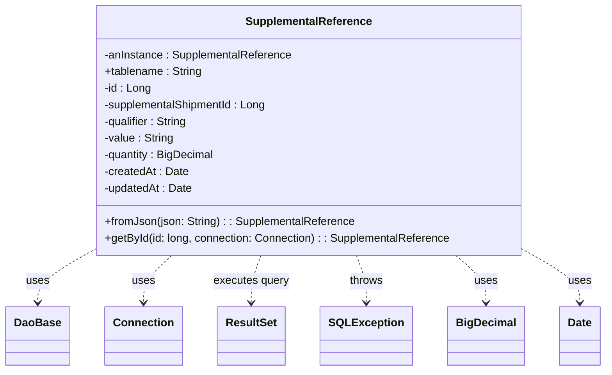

# Diagram: platform-java-lambdas/shipment/src/main/java/com/freightverify/shipment/datastore/postgresql/dao/SupplementalReference.java

> Auto-generated by Obscura crawlers

## Mermaid

### SVG

<svg id="container" width="841.375" xmlns="http://www.w3.org/2000/svg" class="classDiagram" height="534" viewBox="0 0 841.375 534" role="graphics-document document" aria-roledescription="class"><g><defs><marker id="container_class-aggregationStart" class="marker aggregation class" refX="18" refY="7" markerWidth="190" markerHeight="240" orient="auto"><path d="M 18,7 L9,13 L1,7 L9,1 Z"></path></marker></defs><defs><marker id="container_class-aggregationEnd" class="marker aggregation class" refX="1" refY="7" markerWidth="20" markerHeight="28" orient="auto"><path d="M 18,7 L9,13 L1,7 L9,1 Z"></path></marker></defs><defs><marker id="container_class-extensionStart" class="marker extension class" refX="18" refY="7" markerWidth="190" markerHeight="240" orient="auto"><path d="M 1,7 L18,13 V 1 Z"></path></marker></defs><defs><marker id="container_class-extensionEnd" class="marker extension class" refX="1" refY="7" markerWidth="20" markerHeight="28" orient="auto"><path d="M 1,1 V 13 L18,7 Z"></path></marker></defs><defs><marker id="container_class-compositionStart" class="marker composition class" refX="18" refY="7" markerWidth="190" markerHeight="240" orient="auto"><path d="M 18,7 L9,13 L1,7 L9,1 Z"></path></marker></defs><defs><marker id="container_class-compositionEnd" class="marker composition class" refX="1" refY="7" markerWidth="20" markerHeight="28" orient="auto"><path d="M 18,7 L9,13 L1,7 L9,1 Z"></path></marker></defs><defs><marker id="container_class-dependencyStart" class="marker dependency class" refX="6" refY="7" markerWidth="190" markerHeight="240" orient="auto"><path d="M 5,7 L9,13 L1,7 L9,1 Z"></path></marker></defs><defs><marker id="container_class-dependencyEnd" class="marker dependency class" refX="13" refY="7" markerWidth="20" markerHeight="28" orient="auto"><path d="M 18,7 L9,13 L14,7 L9,1 Z"></path></marker></defs><defs><marker id="container_class-lollipopStart" class="marker lollipop class" refX="13" refY="7" markerWidth="190" markerHeight="240" orient="auto"><circle stroke="black" fill="transparent" cx="7" cy="7" r="6"></circle></marker></defs><defs><marker id="container_class-lollipopEnd" class="marker lollipop class" refX="1" refY="7" markerWidth="190" markerHeight="240" orient="auto"><circle stroke="black" fill="transparent" cx="7" cy="7" r="6"></circle></marker></defs><g class="root"><g class="clusters"></g><g class="edgePaths"><path d="M123.398,363.73L111.451,370.609C99.503,377.487,75.607,391.243,63.659,403.288C51.711,415.333,51.711,425.667,51.711,430.833L51.711,436" id="id_SupplementalReference_DaoBase_1" class="edge-thickness-normal edge-pattern-dashed relation" style=";;;" data-edge="true" data-et="edge" data-id="id_SupplementalReference_DaoBase_1" data-points="W3sieCI6MTIzLjM5ODQzNzUsInkiOjM2My43MzA0ODkwMzA3NDcxfSx7IngiOjUxLjcxMDkzNzUsInkiOjQwNX0seyJ4Ijo1MS43MTA5Mzc1LCJ5Ijo0NDJ9XQ==" marker-end="url(#container_class-dependencyEnd)"></path><path d="M237.866,368L231.329,374.167C224.793,380.333,211.721,392.667,205.185,404C198.648,415.333,198.648,425.667,198.648,430.833L198.648,436" id="id_SupplementalReference_Connection_2" class="edge-thickness-normal edge-pattern-dashed relation" style=";;;" data-edge="true" data-et="edge" data-id="id_SupplementalReference_Connection_2" data-points="W3sieCI6MjM3Ljg2NTY5MzQwNDM3Nzg4LCJ5IjozNjh9LHsieCI6MTk4LjY0ODQzNzUsInkiOjQwNX0seyJ4IjoxOTguNjQ4NDM3NSwieSI6NDQyfV0=" marker-end="url(#container_class-dependencyEnd)"></path><path d="M362.659,368L360.398,374.167C358.137,380.333,353.616,392.667,351.355,404C349.094,415.333,349.094,425.667,349.094,430.833L349.094,436" id="id_SupplementalReference_ResultSet_3" class="edge-thickness-normal edge-pattern-dashed relation" style=";;;" data-edge="true" data-et="edge" data-id="id_SupplementalReference_ResultSet_3" data-points="W3sieCI6MzYyLjY1OTA0MDE3ODU3MTQ0LCJ5IjozNjh9LHsieCI6MzQ5LjA5Mzc1LCJ5Ijo0MDV9LHsieCI6MzQ5LjA5Mzc1LCJ5Ijo0NDJ9XQ==" marker-end="url(#container_class-dependencyEnd)"></path><path d="M494.646,368L496.907,374.167C499.167,380.333,503.689,392.667,505.95,404C508.211,415.333,508.211,425.667,508.211,430.833L508.211,436" id="id_SupplementalReference_SQLException_4" class="edge-thickness-normal edge-pattern-dashed relation" style=";;;" data-edge="true" data-et="edge" data-id="id_SupplementalReference_SQLException_4" data-points="W3sieCI6NDk0LjY0NTY0NzMyMTQyODU2LCJ5IjozNjh9LHsieCI6NTA4LjIxMDkzNzUsInkiOjQwNX0seyJ4Ijo1MDguMjEwOTM3NSwieSI6NDQyfV0=" marker-end="url(#container_class-dependencyEnd)"></path><path d="M631.227,368L638.167,374.167C645.107,380.333,658.987,392.667,665.927,404C672.867,415.333,672.867,425.667,672.867,430.833L672.867,436" id="id_SupplementalReference_BigDecimal_5" class="edge-thickness-normal edge-pattern-dashed relation" style=";;;" data-edge="true" data-et="edge" data-id="id_SupplementalReference_BigDecimal_5" data-points="W3sieCI6NjMxLjIyNjg2ODUxOTU4NTIsInkiOjM2OH0seyJ4Ijo2NzIuODY3MTg3NSwieSI6NDA1fSx7IngiOjY3Mi44NjcxODc1LCJ5Ijo0NDJ9XQ==" marker-end="url(#container_class-dependencyEnd)"></path><path d="M733.906,364.242L745.672,371.035C757.438,377.828,780.969,391.414,792.734,403.374C804.5,415.333,804.5,425.667,804.5,430.833L804.5,436" id="id_SupplementalReference_Date_6" class="edge-thickness-normal edge-pattern-dashed relation" style=";;;" data-edge="true" data-et="edge" data-id="id_SupplementalReference_Date_6" data-points="W3sieCI6NzMzLjkwNjI1LCJ5IjozNjQuMjQxODgwMzMyOTk3M30seyJ4Ijo4MDQuNSwieSI6NDA1fSx7IngiOjgwNC41LCJ5Ijo0NDJ9XQ==" marker-end="url(#container_class-dependencyEnd)"></path></g><g class="edgeLabels"><g class="edgeLabel" transform="translate(51.7109375, 405)"><g class="label" data-id="id_SupplementalReference_DaoBase_1" transform="translate(-16.4921875, -12)"><foreignObject width="32.984375" height="24">

uses

</foreignObject></g></g><g class="edgeLabel" transform="translate(198.6484375, 405)"><g class="label" data-id="id_SupplementalReference_Connection_2" transform="translate(-16.4921875, -12)"><foreignObject width="32.984375" height="24">

uses

</foreignObject></g></g><g class="edgeLabel" transform="translate(349.09375, 405)"><g class="label" data-id="id_SupplementalReference_ResultSet_3" transform="translate(-54.671875, -12)"><foreignObject width="109.34375" height="24">

executes query

</foreignObject></g></g><g class="edgeLabel" transform="translate(508.2109375, 405)"><g class="label" data-id="id_SupplementalReference_SQLException_4" transform="translate(-24.5703125, -12)"><foreignObject width="49.140625" height="24">

throws

</foreignObject></g></g><g class="edgeLabel" transform="translate(672.8671875, 405)"><g class="label" data-id="id_SupplementalReference_BigDecimal_5" transform="translate(-16.4921875, -12)"><foreignObject width="32.984375" height="24">

uses

</foreignObject></g></g><g class="edgeLabel" transform="translate(804.5, 405)"><g class="label" data-id="id_SupplementalReference_Date_6" transform="translate(-16.4921875, -12)"><foreignObject width="32.984375" height="24">

uses

</foreignObject></g></g></g><g class="nodes"><g class="node default" id="classId-SupplementalReference-0" transform="translate(428.65234375, 188)"><g class="basic label-container"><path d="M-305.25390625 -180 L305.25390625 -180 L305.25390625 180 L-305.25390625 180" stroke="none" stroke-width="0" fill="#ECECFF" style=""></path><path d="M-305.25390625 -180 C-172.99558196164043 -180, -40.73725767328085 -180, 305.25390625 -180 M-305.25390625 -180 C-163.29040251338998 -180, -21.326898776779956 -180, 305.25390625 -180 M305.25390625 -180 C305.25390625 -60.411104268597995, 305.25390625 59.17779146280401, 305.25390625 180 M305.25390625 -180 C305.25390625 -82.12408624820732, 305.25390625 15.75182750358536, 305.25390625 180 M305.25390625 180 C102.60553254335383 180, -100.04284116329234 180, -305.25390625 180 M305.25390625 180 C76.85836157562926 180, -151.53718309874148 180, -305.25390625 180 M-305.25390625 180 C-305.25390625 91.15659684091447, -305.25390625 2.313193681828949, -305.25390625 -180 M-305.25390625 180 C-305.25390625 68.51968409952701, -305.25390625 -42.960631800945976, -305.25390625 -180" stroke="#9370DB" stroke-width="1.3" fill="none" stroke-dasharray="0 0" style=""></path></g><g class="annotation-group text" transform="translate(0, -156)"></g><g class="label-group text" transform="translate(-87.4296875, -156)"><g class="label" style="font-weight: bolder" transform="translate(0,-12)"><foreignObject width="174.859375" height="24">

SupplementalReference

</foreignObject></g></g><g class="members-group text" transform="translate(-293.25390625, -108)"><g class="label" style="" transform="translate(0,-12)"><foreignObject width="270.96875" height="24">

-anInstance : SupplementalReference

</foreignObject></g><g class="label" style="" transform="translate(0,12)"><foreignObject width="140.828125" height="24">

+tablename : String

</foreignObject></g><g class="label" style="" transform="translate(0,36)"><foreignObject width="67.46875" height="24">

-id : Long

</foreignObject></g><g class="label" style="" transform="translate(0,60)"><foreignObject width="237.1875" height="24">

-supplementalShipmentId : Long

</foreignObject></g><g class="label" style="" transform="translate(0,84)"><foreignObject width="122.375" height="24">

-qualifier : String

</foreignObject></g><g class="label" style="" transform="translate(0,108)"><foreignObject width="100.375" height="24">

-value : String

</foreignObject></g><g class="label" style="" transform="translate(0,132)"><foreignObject width="160.28125" height="24">

-quantity : BigDecimal

</foreignObject></g><g class="label" style="" transform="translate(0,156)"><foreignObject width="121.25" height="24">

-createdAt : Date

</foreignObject></g><g class="label" style="" transform="translate(0,180)"><foreignObject width="127.734375" height="24">

-updatedAt : Date

</foreignObject></g></g><g class="methods-group text" transform="translate(-293.25390625, 132)"><g class="label" style="" transform="translate(0,-12)"><foreignObject width="358.90625" height="24">

+fromJson(json: String) : : SupplementalReference

</foreignObject></g><g class="label" style="" transform="translate(0,12)"><foreignObject width="499.078125" height="24">

+getById(id: long, connection: Connection) : : SupplementalReference

</foreignObject></g></g><g class="divider" style=""><path d="M-305.25390625 -132 C-149.7076333841824 -132, 5.838639481635198 -132, 305.25390625 -132 M-305.25390625 -132 C-72.75094387421092 -132, 159.75201850157816 -132, 305.25390625 -132" stroke="#9370DB" stroke-width="1.3" fill="none" stroke-dasharray="0 0" style=""></path></g><g class="divider" style=""><path d="M-305.25390625 108 C-135.24162346161498 108, 34.770659326770044 108, 305.25390625 108 M-305.25390625 108 C-90.44969113220003 108, 124.35452398559994 108, 305.25390625 108" stroke="#9370DB" stroke-width="1.3" fill="none" stroke-dasharray="0 0" style=""></path></g></g><g class="node default" id="classId-DaoBase-1" transform="translate(51.7109375, 484)"><g class="basic label-container"><path d="M-43.7109375 -42 L43.7109375 -42 L43.7109375 42 L-43.7109375 42" stroke="none" stroke-width="0" fill="#ECECFF" style=""></path><path d="M-43.7109375 -42 C-18.574709759306465 -42, 6.56151798138707 -42, 43.7109375 -42 M-43.7109375 -42 C-11.487109677489947 -42, 20.736718145020106 -42, 43.7109375 -42 M43.7109375 -42 C43.7109375 -8.655639598160391, 43.7109375 24.688720803679217, 43.7109375 42 M43.7109375 -42 C43.7109375 -13.668482312199725, 43.7109375 14.66303537560055, 43.7109375 42 M43.7109375 42 C19.269596177124647 42, -5.171745145750705 42, -43.7109375 42 M43.7109375 42 C10.574582191232516 42, -22.56177311753497 42, -43.7109375 42 M-43.7109375 42 C-43.7109375 11.74594350232891, -43.7109375 -18.50811299534218, -43.7109375 -42 M-43.7109375 42 C-43.7109375 18.953634887655554, -43.7109375 -4.092730224688893, -43.7109375 -42" stroke="#9370DB" stroke-width="1.3" fill="none" stroke-dasharray="0 0" style=""></path></g><g class="annotation-group text" transform="translate(0, -18)"></g><g class="label-group text" transform="translate(-31.7109375, -18)"><g class="label" style="font-weight: bolder" transform="translate(0,-12)"><foreignObject width="63.421875" height="24">

DaoBase

</foreignObject></g></g><g class="members-group text" transform="translate(-31.7109375, 30)"></g><g class="methods-group text" transform="translate(-31.7109375, 60)"></g><g class="divider" style=""><path d="M-43.7109375 6 C-12.760186850445887 6, 18.190563799108226 6, 43.7109375 6 M-43.7109375 6 C-25.638671726064004 6, -7.566405952128008 6, 43.7109375 6" stroke="#9370DB" stroke-width="1.3" fill="none" stroke-dasharray="0 0" style=""></path></g><g class="divider" style=""><path d="M-43.7109375 24 C-22.00744077477134 24, -0.30394404954267884 24, 43.7109375 24 M-43.7109375 24 C-25.715017904835747 24, -7.7190983096714945 24, 43.7109375 24" stroke="#9370DB" stroke-width="1.3" fill="none" stroke-dasharray="0 0" style=""></path></g></g><g class="node default" id="classId-Connection-2" transform="translate(198.6484375, 484)"><g class="basic label-container"><path d="M-53.2265625 -42 L53.2265625 -42 L53.2265625 42 L-53.2265625 42" stroke="none" stroke-width="0" fill="#ECECFF" style=""></path><path d="M-53.2265625 -42 C-13.59882703112676 -42, 26.02890843774648 -42, 53.2265625 -42 M-53.2265625 -42 C-14.114637616165325 -42, 24.99728726766935 -42, 53.2265625 -42 M53.2265625 -42 C53.2265625 -25.196652820162903, 53.2265625 -8.393305640325806, 53.2265625 42 M53.2265625 -42 C53.2265625 -19.222444532485003, 53.2265625 3.555110935029994, 53.2265625 42 M53.2265625 42 C29.258271863224795 42, 5.289981226449591 42, -53.2265625 42 M53.2265625 42 C18.371051746881776 42, -16.48445900623645 42, -53.2265625 42 M-53.2265625 42 C-53.2265625 19.762991454624874, -53.2265625 -2.4740170907502517, -53.2265625 -42 M-53.2265625 42 C-53.2265625 14.042327569393212, -53.2265625 -13.915344861213576, -53.2265625 -42" stroke="#9370DB" stroke-width="1.3" fill="none" stroke-dasharray="0 0" style=""></path></g><g class="annotation-group text" transform="translate(0, -18)"></g><g class="label-group text" transform="translate(-41.2265625, -18)"><g class="label" style="font-weight: bolder" transform="translate(0,-12)"><foreignObject width="82.453125" height="24">

Connection

</foreignObject></g></g><g class="members-group text" transform="translate(-41.2265625, 30)"></g><g class="methods-group text" transform="translate(-41.2265625, 60)"></g><g class="divider" style=""><path d="M-53.2265625 6 C-13.314601006163883 6, 26.597360487672233 6, 53.2265625 6 M-53.2265625 6 C-18.1427159083413 6, 16.941130683317397 6, 53.2265625 6" stroke="#9370DB" stroke-width="1.3" fill="none" stroke-dasharray="0 0" style=""></path></g><g class="divider" style=""><path d="M-53.2265625 24 C-22.31368886126151 24, 8.599184777476978 24, 53.2265625 24 M-53.2265625 24 C-31.897001123077803 24, -10.567439746155607 24, 53.2265625 24" stroke="#9370DB" stroke-width="1.3" fill="none" stroke-dasharray="0 0" style=""></path></g></g><g class="node default" id="classId-ResultSet-3" transform="translate(349.09375, 484)"><g class="basic label-container"><path d="M-47.21875 -42 L47.21875 -42 L47.21875 42 L-47.21875 42" stroke="none" stroke-width="0" fill="#ECECFF" style=""></path><path d="M-47.21875 -42 C-25.201191277124597 -42, -3.1836325542491934 -42, 47.21875 -42 M-47.21875 -42 C-18.52397161289108 -42, 10.170806774217837 -42, 47.21875 -42 M47.21875 -42 C47.21875 -20.133789433688257, 47.21875 1.732421132623486, 47.21875 42 M47.21875 -42 C47.21875 -17.017718658278557, 47.21875 7.964562683442885, 47.21875 42 M47.21875 42 C15.050216022756103 42, -17.118317954487793 42, -47.21875 42 M47.21875 42 C20.811699665531453 42, -5.595350668937094 42, -47.21875 42 M-47.21875 42 C-47.21875 14.120444359130271, -47.21875 -13.759111281739457, -47.21875 -42 M-47.21875 42 C-47.21875 15.275351305353851, -47.21875 -11.449297389292298, -47.21875 -42" stroke="#9370DB" stroke-width="1.3" fill="none" stroke-dasharray="0 0" style=""></path></g><g class="annotation-group text" transform="translate(0, -18)"></g><g class="label-group text" transform="translate(-35.21875, -18)"><g class="label" style="font-weight: bolder" transform="translate(0,-12)"><foreignObject width="70.4375" height="24">

ResultSet

</foreignObject></g></g><g class="members-group text" transform="translate(-35.21875, 30)"></g><g class="methods-group text" transform="translate(-35.21875, 60)"></g><g class="divider" style=""><path d="M-47.21875 6 C-15.849139442642088 6, 15.520471114715825 6, 47.21875 6 M-47.21875 6 C-15.07229171206425 6, 17.0741665758715 6, 47.21875 6" stroke="#9370DB" stroke-width="1.3" fill="none" stroke-dasharray="0 0" style=""></path></g><g class="divider" style=""><path d="M-47.21875 24 C-12.561127044534139 24, 22.096495910931722 24, 47.21875 24 M-47.21875 24 C-23.93318307944994 24, -0.6476161588998792 24, 47.21875 24" stroke="#9370DB" stroke-width="1.3" fill="none" stroke-dasharray="0 0" style=""></path></g></g><g class="node default" id="classId-SQLException-4" transform="translate(508.2109375, 484)"><g class="basic label-container"><path d="M-61.8984375 -42 L61.8984375 -42 L61.8984375 42 L-61.8984375 42" stroke="none" stroke-width="0" fill="#ECECFF" style=""></path><path d="M-61.8984375 -42 C-28.98002361693448 -42, 3.9383902661310373 -42, 61.8984375 -42 M-61.8984375 -42 C-34.51807885759386 -42, -7.137720215187727 -42, 61.8984375 -42 M61.8984375 -42 C61.8984375 -19.004436462850332, 61.8984375 3.991127074299335, 61.8984375 42 M61.8984375 -42 C61.8984375 -19.663914732540256, 61.8984375 2.6721705349194877, 61.8984375 42 M61.8984375 42 C27.792151382556973 42, -6.3141347348860535 42, -61.8984375 42 M61.8984375 42 C24.593835200111513 42, -12.710767099776973 42, -61.8984375 42 M-61.8984375 42 C-61.8984375 19.394392223375736, -61.8984375 -3.211215553248529, -61.8984375 -42 M-61.8984375 42 C-61.8984375 23.859862289572572, -61.8984375 5.719724579145144, -61.8984375 -42" stroke="#9370DB" stroke-width="1.3" fill="none" stroke-dasharray="0 0" style=""></path></g><g class="annotation-group text" transform="translate(0, -18)"></g><g class="label-group text" transform="translate(-49.8984375, -18)"><g class="label" style="font-weight: bolder" transform="translate(0,-12)"><foreignObject width="99.796875" height="24">

SQLException

</foreignObject></g></g><g class="members-group text" transform="translate(-49.8984375, 30)"></g><g class="methods-group text" transform="translate(-49.8984375, 60)"></g><g class="divider" style=""><path d="M-61.8984375 6 C-23.276825936889843 6, 15.344785626220315 6, 61.8984375 6 M-61.8984375 6 C-14.492780301227988 6, 32.912876897544024 6, 61.8984375 6" stroke="#9370DB" stroke-width="1.3" fill="none" stroke-dasharray="0 0" style=""></path></g><g class="divider" style=""><path d="M-61.8984375 24 C-24.05589653776277 24, 13.78664442447446 24, 61.8984375 24 M-61.8984375 24 C-12.782219205375249 24, 36.3339990892495 24, 61.8984375 24" stroke="#9370DB" stroke-width="1.3" fill="none" stroke-dasharray="0 0" style=""></path></g></g><g class="node default" id="classId-BigDecimal-5" transform="translate(672.8671875, 484)"><g class="basic label-container"><path d="M-52.7578125 -42 L52.7578125 -42 L52.7578125 42 L-52.7578125 42" stroke="none" stroke-width="0" fill="#ECECFF" style=""></path><path d="M-52.7578125 -42 C-21.67487893076108 -42, 9.408054638477843 -42, 52.7578125 -42 M-52.7578125 -42 C-14.396466165191576 -42, 23.964880169616848 -42, 52.7578125 -42 M52.7578125 -42 C52.7578125 -19.10175642385165, 52.7578125 3.7964871522966988, 52.7578125 42 M52.7578125 -42 C52.7578125 -15.338827601583993, 52.7578125 11.322344796832013, 52.7578125 42 M52.7578125 42 C14.61700483213113 42, -23.52380283573774 42, -52.7578125 42 M52.7578125 42 C24.712415811757865 42, -3.332980876484271 42, -52.7578125 42 M-52.7578125 42 C-52.7578125 15.522786663019644, -52.7578125 -10.954426673960711, -52.7578125 -42 M-52.7578125 42 C-52.7578125 20.8984461473738, -52.7578125 -0.20310770525239974, -52.7578125 -42" stroke="#9370DB" stroke-width="1.3" fill="none" stroke-dasharray="0 0" style=""></path></g><g class="annotation-group text" transform="translate(0, -18)"></g><g class="label-group text" transform="translate(-40.7578125, -18)"><g class="label" style="font-weight: bolder" transform="translate(0,-12)"><foreignObject width="81.515625" height="24">

BigDecimal

</foreignObject></g></g><g class="members-group text" transform="translate(-40.7578125, 30)"></g><g class="methods-group text" transform="translate(-40.7578125, 60)"></g><g class="divider" style=""><path d="M-52.7578125 6 C-17.70670302963633 6, 17.34440644072734 6, 52.7578125 6 M-52.7578125 6 C-31.026155336645477 6, -9.294498173290954 6, 52.7578125 6" stroke="#9370DB" stroke-width="1.3" fill="none" stroke-dasharray="0 0" style=""></path></g><g class="divider" style=""><path d="M-52.7578125 24 C-16.48008291226074 24, 19.797646675478518 24, 52.7578125 24 M-52.7578125 24 C-31.169843234313735 24, -9.58187396862747 24, 52.7578125 24" stroke="#9370DB" stroke-width="1.3" fill="none" stroke-dasharray="0 0" style=""></path></g></g><g class="node default" id="classId-Date-6" transform="translate(804.5, 484)"><g class="basic label-container"><path d="M-28.875 -42 L28.875 -42 L28.875 42 L-28.875 42" stroke="none" stroke-width="0" fill="#ECECFF" style=""></path><path d="M-28.875 -42 C-8.17726357799717 -42, 12.52047284400566 -42, 28.875 -42 M-28.875 -42 C-6.096538081265635 -42, 16.68192383746873 -42, 28.875 -42 M28.875 -42 C28.875 -17.626295909298488, 28.875 6.747408181403024, 28.875 42 M28.875 -42 C28.875 -17.23981350851195, 28.875 7.520372982976099, 28.875 42 M28.875 42 C8.248996190647564 42, -12.377007618704873 42, -28.875 42 M28.875 42 C12.793967837200146 42, -3.287064325599708 42, -28.875 42 M-28.875 42 C-28.875 20.298913773279214, -28.875 -1.4021724534415725, -28.875 -42 M-28.875 42 C-28.875 12.506326093309703, -28.875 -16.987347813380595, -28.875 -42" stroke="#9370DB" stroke-width="1.3" fill="none" stroke-dasharray="0 0" style=""></path></g><g class="annotation-group text" transform="translate(0, -18)"></g><g class="label-group text" transform="translate(-16.875, -18)"><g class="label" style="font-weight: bolder" transform="translate(0,-12)"><foreignObject width="33.75" height="24">

Date

</foreignObject></g></g><g class="members-group text" transform="translate(-16.875, 30)"></g><g class="methods-group text" transform="translate(-16.875, 60)"></g><g class="divider" style=""><path d="M-28.875 6 C-14.657842127603454 6, -0.44068425520690724 6, 28.875 6 M-28.875 6 C-7.717196914383507 6, 13.440606171232986 6, 28.875 6" stroke="#9370DB" stroke-width="1.3" fill="none" stroke-dasharray="0 0" style=""></path></g><g class="divider" style=""><path d="M-28.875 24 C-8.608543960818515 24, 11.657912078362969 24, 28.875 24 M-28.875 24 C-11.913271460100109 24, 5.048457079799782 24, 28.875 24" stroke="#9370DB" stroke-width="1.3" fill="none" stroke-dasharray="0 0" style=""></path></g></g></g></g></g></svg>
