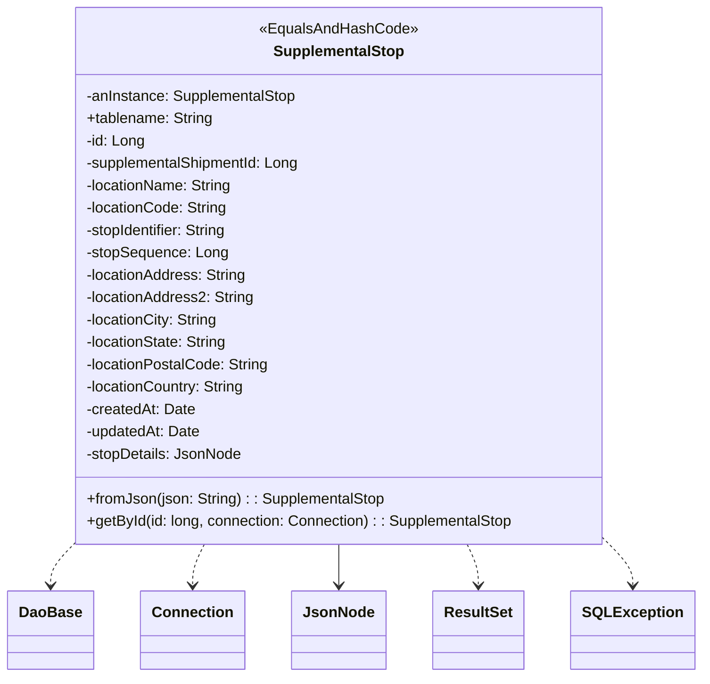

# Diagram: platform-java-lambdas/shipment/src/main/java/com/freightverify/shipment/datastore/postgresql/dao/SupplementalStop.java

> Auto-generated by Obscura crawlers

## Mermaid

### SVG

<svg id="container" width="721.875" xmlns="http://www.w3.org/2000/svg" class="classDiagram" height="726" viewBox="0 0 721.875 726" role="graphics-document document" aria-roledescription="class"><g><defs><marker id="container_class-aggregationStart" class="marker aggregation class" refX="18" refY="7" markerWidth="190" markerHeight="240" orient="auto"><path d="M 18,7 L9,13 L1,7 L9,1 Z"></path></marker></defs><defs><marker id="container_class-aggregationEnd" class="marker aggregation class" refX="1" refY="7" markerWidth="20" markerHeight="28" orient="auto"><path d="M 18,7 L9,13 L1,7 L9,1 Z"></path></marker></defs><defs><marker id="container_class-extensionStart" class="marker extension class" refX="18" refY="7" markerWidth="190" markerHeight="240" orient="auto"><path d="M 1,7 L18,13 V 1 Z"></path></marker></defs><defs><marker id="container_class-extensionEnd" class="marker extension class" refX="1" refY="7" markerWidth="20" markerHeight="28" orient="auto"><path d="M 1,1 V 13 L18,7 Z"></path></marker></defs><defs><marker id="container_class-compositionStart" class="marker composition class" refX="18" refY="7" markerWidth="190" markerHeight="240" orient="auto"><path d="M 18,7 L9,13 L1,7 L9,1 Z"></path></marker></defs><defs><marker id="container_class-compositionEnd" class="marker composition class" refX="1" refY="7" markerWidth="20" markerHeight="28" orient="auto"><path d="M 18,7 L9,13 L1,7 L9,1 Z"></path></marker></defs><defs><marker id="container_class-dependencyStart" class="marker dependency class" refX="6" refY="7" markerWidth="190" markerHeight="240" orient="auto"><path d="M 5,7 L9,13 L1,7 L9,1 Z"></path></marker></defs><defs><marker id="container_class-dependencyEnd" class="marker dependency class" refX="13" refY="7" markerWidth="20" markerHeight="28" orient="auto"><path d="M 18,7 L9,13 L14,7 L9,1 Z"></path></marker></defs><defs><marker id="container_class-lollipopStart" class="marker lollipop class" refX="13" refY="7" markerWidth="190" markerHeight="240" orient="auto"><circle stroke="black" fill="transparent" cx="7" cy="7" r="6"></circle></marker></defs><defs><marker id="container_class-lollipopEnd" class="marker lollipop class" refX="1" refY="7" markerWidth="190" markerHeight="240" orient="auto"><circle stroke="black" fill="transparent" cx="7" cy="7" r="6"></circle></marker></defs><g class="root"><g class="clusters"></g><g class="edgePaths"><path d="M75.437,584L71.482,588.167C67.528,592.333,59.62,600.667,55.665,608C51.711,615.333,51.711,621.667,51.711,624.833L51.711,628" id="id_SupplementalStop_DaoBase_1" class="edge-thickness-normal edge-pattern-dashed relation" style=";;;" data-edge="true" data-et="edge" data-id="id_SupplementalStop_DaoBase_1" data-points="W3sieCI6NzUuNDM2NzI2MjM4MDE5MTYsInkiOjU4NH0seyJ4Ijo1MS43MTA5Mzc1LCJ5Ijo2MDl9LHsieCI6NTEuNzEwOTM3NSwieSI6NjM0fV0=" marker-end="url(#container_class-dependencyEnd)"></path><path d="M210.638,584L208.64,588.167C206.641,592.333,202.645,600.667,200.647,608C198.648,615.333,198.648,621.667,198.648,624.833L198.648,628" id="id_SupplementalStop_Connection_2" class="edge-thickness-normal edge-pattern-dashed relation" style=";;;" data-edge="true" data-et="edge" data-id="id_SupplementalStop_Connection_2" data-points="W3sieCI6MjEwLjYzODAwNDE5MzI5MDczLCJ5Ijo1ODR9LHsieCI6MTk4LjY0ODQzNzUsInkiOjYwOX0seyJ4IjoxOTguNjQ4NDM3NSwieSI6NjM0fV0=" marker-end="url(#container_class-dependencyEnd)"></path><path d="M348.758,584L348.758,588.167C348.758,592.333,348.758,600.667,348.758,608C348.758,615.333,348.758,621.667,348.758,624.833L348.758,628" id="id_SupplementalStop_JsonNode_3" class="edge-thickness-normal edge-pattern-solid relation" style=";;;" data-edge="true" data-et="edge" data-id="id_SupplementalStop_JsonNode_3" data-points="W3sieCI6MzQ4Ljc1NzgxMjUsInkiOjU4NH0seyJ4IjozNDguNzU3ODEyNSwieSI6NjA5fSx7IngiOjM0OC43NTc4MTI1LCJ5Ijo2MzR9XQ==" marker-end="url(#container_class-dependencyEnd)"></path><path d="M481.35,584L483.268,588.167C485.186,592.333,489.023,600.667,490.941,608C492.859,615.333,492.859,621.667,492.859,624.833L492.859,628" id="id_SupplementalStop_ResultSet_4" class="edge-thickness-normal edge-pattern-dashed relation" style=";;;" data-edge="true" data-et="edge" data-id="id_SupplementalStop_ResultSet_4" data-points="W3sieCI6NDgxLjM0OTY2NTUzNTE0MzgsInkiOjU4NH0seyJ4Ijo0OTIuODU5Mzc1LCJ5Ijo2MDl9LHsieCI6NDkyLjg1OTM3NSwieSI6NjM0fV0=" marker-end="url(#container_class-dependencyEnd)"></path><path d="M627.758,584L631.794,588.167C635.831,592.333,643.904,600.667,647.94,608C651.977,615.333,651.977,621.667,651.977,624.833L651.977,628" id="id_SupplementalStop_SQLException_5" class="edge-thickness-normal edge-pattern-dashed relation" style=";;;" data-edge="true" data-et="edge" data-id="id_SupplementalStop_SQLException_5" data-points="W3sieCI6NjI3Ljc1NzgxMjUsInkiOjU4NH0seyJ4Ijo2NTEuOTc2NTYyNSwieSI6NjA5fSx7IngiOjY1MS45NzY1NjI1LCJ5Ijo2MzR9XQ==" marker-end="url(#container_class-dependencyEnd)"></path></g><g class="edgeLabels"><g class="edgeLabel"><g class="label" data-id="id_SupplementalStop_DaoBase_1" transform="translate(0, 0)"><foreignObject width="0" height="0">

</foreignObject></g></g><g class="edgeLabel"><g class="label" data-id="id_SupplementalStop_Connection_2" transform="translate(0, 0)"><foreignObject width="0" height="0">

</foreignObject></g></g><g class="edgeLabel"><g class="label" data-id="id_SupplementalStop_JsonNode_3" transform="translate(0, 0)"><foreignObject width="0" height="0">

</foreignObject></g></g><g class="edgeLabel"><g class="label" data-id="id_SupplementalStop_ResultSet_4" transform="translate(0, 0)"><foreignObject width="0" height="0">

</foreignObject></g></g><g class="edgeLabel"><g class="label" data-id="id_SupplementalStop_SQLException_5" transform="translate(0, 0)"><foreignObject width="0" height="0">

</foreignObject></g></g></g><g class="nodes"><g class="node default" id="classId-SupplementalStop-0" transform="translate(348.7578125, 296)"><g class="basic label-container"><path d="M-283.73828125 -288 L283.73828125 -288 L283.73828125 288 L-283.73828125 288" stroke="none" stroke-width="0" fill="#ECECFF" style=""></path><path d="M-283.73828125 -288 C-147.66253705924439 -288, -11.586792868488772 -288, 283.73828125 -288 M-283.73828125 -288 C-85.40019961557695 -288, 112.9378820188461 -288, 283.73828125 -288 M283.73828125 -288 C283.73828125 -61.757595059982464, 283.73828125 164.48480988003507, 283.73828125 288 M283.73828125 -288 C283.73828125 -70.48180706453869, 283.73828125 147.03638587092263, 283.73828125 288 M283.73828125 288 C75.86198788043794 288, -132.01430548912413 288, -283.73828125 288 M283.73828125 288 C140.35006795934592 288, -3.038145331308158 288, -283.73828125 288 M-283.73828125 288 C-283.73828125 129.33780231078876, -283.73828125 -29.32439537842248, -283.73828125 -288 M-283.73828125 288 C-283.73828125 109.21088040055898, -283.73828125 -69.57823919888205, -283.73828125 -288" stroke="#9370DB" stroke-width="1.3" fill="none" stroke-dasharray="0 0" style=""></path></g><g class="annotation-group text" transform="translate(-83.2109375, -264)"><g class="label" style="" transform="translate(0,-12)"><foreignObject width="166.421875" height="24">

«EqualsAndHashCode»

</foreignObject></g></g><g class="label-group text" transform="translate(-67.890625, -240)"><g class="label" style="font-weight: bolder" transform="translate(0,-12)"><foreignObject width="135.78125" height="24">

SupplementalStop

</foreignObject></g></g><g class="members-group text" transform="translate(-271.73828125, -192)"><g class="label" style="" transform="translate(0,-12)"><foreignObject width="227.90625" height="24">

-anInstance: SupplementalStop

</foreignObject></g><g class="label" style="" transform="translate(0,12)"><foreignObject width="136.578125" height="24">

+tablename: String

</foreignObject></g><g class="label" style="" transform="translate(0,36)"><foreignObject width="63.21875" height="24">

-id: Long

</foreignObject></g><g class="label" style="" transform="translate(0,60)"><foreignObject width="232.953125" height="24">

-supplementalShipmentId: Long

</foreignObject></g><g class="label" style="" transform="translate(0,84)"><foreignObject width="158.625" height="24">

-locationName: String

</foreignObject></g><g class="label" style="" transform="translate(0,108)"><foreignObject width="152.84375" height="24">

-locationCode: String

</foreignObject></g><g class="label" style="" transform="translate(0,132)"><foreignObject width="156.203125" height="24">

-stopIdentifier: String

</foreignObject></g><g class="label" style="" transform="translate(0,156)"><foreignObject width="151.46875" height="24">

-stopSequence: Long

</foreignObject></g><g class="label" style="" transform="translate(0,180)"><foreignObject width="174.078125" height="24">

-locationAddress: String

</foreignObject></g><g class="label" style="" transform="translate(0,204)"><foreignObject width="181.828125" height="24">

-locationAddress2: String

</foreignObject></g><g class="label" style="" transform="translate(0,228)"><foreignObject width="143.671875" height="24">

-locationCity: String

</foreignObject></g><g class="label" style="" transform="translate(0,252)"><foreignObject width="153.90625" height="24">

-locationState: String

</foreignObject></g><g class="label" style="" transform="translate(0,276)"><foreignObject width="197.375" height="24">

-locationPostalCode: String

</foreignObject></g><g class="label" style="" transform="translate(0,300)"><foreignObject width="173.125" height="24">

-locationCountry: String

</foreignObject></g><g class="label" style="" transform="translate(0,324)"><foreignObject width="117.078125" height="24">

-createdAt: Date

</foreignObject></g><g class="label" style="" transform="translate(0,348)"><foreignObject width="123.5625" height="24">

-updatedAt: Date

</foreignObject></g><g class="label" style="" transform="translate(0,372)"><foreignObject width="166.09375" height="24">

-stopDetails: JsonNode

</foreignObject></g></g><g class="methods-group text" transform="translate(-271.73828125, 240)"><g class="label" style="" transform="translate(0,-12)"><foreignObject width="320.09375" height="24">

+fromJson(json: String) : : SupplementalStop

</foreignObject></g><g class="label" style="" transform="translate(0,12)"><foreignObject width="460.265625" height="24">

+getById(id: long, connection: Connection) : : SupplementalStop

</foreignObject></g></g><g class="divider" style=""><path d="M-283.73828125 -216 C-163.42773415413643 -216, -43.11718705827289 -216, 283.73828125 -216 M-283.73828125 -216 C-111.93456419106894 -216, 59.86915286786211 -216, 283.73828125 -216" stroke="#9370DB" stroke-width="1.3" fill="none" stroke-dasharray="0 0" style=""></path></g><g class="divider" style=""><path d="M-283.73828125 216 C-61.905343212805775 216, 159.92759482438845 216, 283.73828125 216 M-283.73828125 216 C-60.42617198899043 216, 162.88593727201913 216, 283.73828125 216" stroke="#9370DB" stroke-width="1.3" fill="none" stroke-dasharray="0 0" style=""></path></g></g><g class="node default" id="classId-DaoBase-1" transform="translate(51.7109375, 676)"><g class="basic label-container"><path d="M-43.7109375 -42 L43.7109375 -42 L43.7109375 42 L-43.7109375 42" stroke="none" stroke-width="0" fill="#ECECFF" style=""></path><path d="M-43.7109375 -42 C-12.093621968611355 -42, 19.52369356277729 -42, 43.7109375 -42 M-43.7109375 -42 C-20.362489996572293 -42, 2.9859575068554136 -42, 43.7109375 -42 M43.7109375 -42 C43.7109375 -18.843008286177998, 43.7109375 4.313983427644004, 43.7109375 42 M43.7109375 -42 C43.7109375 -17.4879918058758, 43.7109375 7.024016388248398, 43.7109375 42 M43.7109375 42 C13.250606388077216 42, -17.209724723845568 42, -43.7109375 42 M43.7109375 42 C14.261147754032603 42, -15.188641991934794 42, -43.7109375 42 M-43.7109375 42 C-43.7109375 14.699228041715351, -43.7109375 -12.601543916569298, -43.7109375 -42 M-43.7109375 42 C-43.7109375 21.245906875543103, -43.7109375 0.4918137510862053, -43.7109375 -42" stroke="#9370DB" stroke-width="1.3" fill="none" stroke-dasharray="0 0" style=""></path></g><g class="annotation-group text" transform="translate(0, -18)"></g><g class="label-group text" transform="translate(-31.7109375, -18)"><g class="label" style="font-weight: bolder" transform="translate(0,-12)"><foreignObject width="63.421875" height="24">

DaoBase

</foreignObject></g></g><g class="members-group text" transform="translate(-31.7109375, 30)"></g><g class="methods-group text" transform="translate(-31.7109375, 60)"></g><g class="divider" style=""><path d="M-43.7109375 6 C-20.92742492464022 6, 1.8560876507195587 6, 43.7109375 6 M-43.7109375 6 C-20.592018448824632 6, 2.526900602350736 6, 43.7109375 6" stroke="#9370DB" stroke-width="1.3" fill="none" stroke-dasharray="0 0" style=""></path></g><g class="divider" style=""><path d="M-43.7109375 24 C-20.788460334567826 24, 2.134016830864347 24, 43.7109375 24 M-43.7109375 24 C-19.81740020610864 24, 4.076137087782719 24, 43.7109375 24" stroke="#9370DB" stroke-width="1.3" fill="none" stroke-dasharray="0 0" style=""></path></g></g><g class="node default" id="classId-Connection-2" transform="translate(198.6484375, 676)"><g class="basic label-container"><path d="M-53.2265625 -42 L53.2265625 -42 L53.2265625 42 L-53.2265625 42" stroke="none" stroke-width="0" fill="#ECECFF" style=""></path><path d="M-53.2265625 -42 C-18.300851979866565 -42, 16.62485854026687 -42, 53.2265625 -42 M-53.2265625 -42 C-27.26532618734433 -42, -1.304089874688657 -42, 53.2265625 -42 M53.2265625 -42 C53.2265625 -25.03885609508407, 53.2265625 -8.077712190168143, 53.2265625 42 M53.2265625 -42 C53.2265625 -17.99295584205951, 53.2265625 6.014088315880983, 53.2265625 42 M53.2265625 42 C13.211706981998084 42, -26.80314853600383 42, -53.2265625 42 M53.2265625 42 C17.819637884805736 42, -17.587286730388527 42, -53.2265625 42 M-53.2265625 42 C-53.2265625 11.905818229882499, -53.2265625 -18.188363540235002, -53.2265625 -42 M-53.2265625 42 C-53.2265625 8.788607902222772, -53.2265625 -24.422784195554456, -53.2265625 -42" stroke="#9370DB" stroke-width="1.3" fill="none" stroke-dasharray="0 0" style=""></path></g><g class="annotation-group text" transform="translate(0, -18)"></g><g class="label-group text" transform="translate(-41.2265625, -18)"><g class="label" style="font-weight: bolder" transform="translate(0,-12)"><foreignObject width="82.453125" height="24">

Connection

</foreignObject></g></g><g class="members-group text" transform="translate(-41.2265625, 30)"></g><g class="methods-group text" transform="translate(-41.2265625, 60)"></g><g class="divider" style=""><path d="M-53.2265625 6 C-14.335107495795931 6, 24.556347508408138 6, 53.2265625 6 M-53.2265625 6 C-18.404884951959815 6, 16.41679259608037 6, 53.2265625 6" stroke="#9370DB" stroke-width="1.3" fill="none" stroke-dasharray="0 0" style=""></path></g><g class="divider" style=""><path d="M-53.2265625 24 C-31.664646704276716 24, -10.102730908553433 24, 53.2265625 24 M-53.2265625 24 C-14.495281807082918 24, 24.235998885834164 24, 53.2265625 24" stroke="#9370DB" stroke-width="1.3" fill="none" stroke-dasharray="0 0" style=""></path></g></g><g class="node default" id="classId-JsonNode-3" transform="translate(348.7578125, 676)"><g class="basic label-container"><path d="M-46.8828125 -42 L46.8828125 -42 L46.8828125 42 L-46.8828125 42" stroke="none" stroke-width="0" fill="#ECECFF" style=""></path><path d="M-46.8828125 -42 C-20.389110262088707 -42, 6.104591975822586 -42, 46.8828125 -42 M-46.8828125 -42 C-23.302283448895015 -42, 0.27824560220997085 -42, 46.8828125 -42 M46.8828125 -42 C46.8828125 -24.068064566823324, 46.8828125 -6.136129133646648, 46.8828125 42 M46.8828125 -42 C46.8828125 -14.663037554467426, 46.8828125 12.673924891065148, 46.8828125 42 M46.8828125 42 C21.727466534428203 42, -3.4278794311435945 42, -46.8828125 42 M46.8828125 42 C28.096112442178036 42, 9.309412384356072 42, -46.8828125 42 M-46.8828125 42 C-46.8828125 13.965412827757902, -46.8828125 -14.069174344484196, -46.8828125 -42 M-46.8828125 42 C-46.8828125 24.325705297937596, -46.8828125 6.651410595875191, -46.8828125 -42" stroke="#9370DB" stroke-width="1.3" fill="none" stroke-dasharray="0 0" style=""></path></g><g class="annotation-group text" transform="translate(0, -18)"></g><g class="label-group text" transform="translate(-34.8828125, -18)"><g class="label" style="font-weight: bolder" transform="translate(0,-12)"><foreignObject width="69.765625" height="24">

JsonNode

</foreignObject></g></g><g class="members-group text" transform="translate(-34.8828125, 30)"></g><g class="methods-group text" transform="translate(-34.8828125, 60)"></g><g class="divider" style=""><path d="M-46.8828125 6 C-27.267350757342733 6, -7.651889014685466 6, 46.8828125 6 M-46.8828125 6 C-27.404909625940075 6, -7.92700675188015 6, 46.8828125 6" stroke="#9370DB" stroke-width="1.3" fill="none" stroke-dasharray="0 0" style=""></path></g><g class="divider" style=""><path d="M-46.8828125 24 C-17.7084958556546 24, 11.465820788690799 24, 46.8828125 24 M-46.8828125 24 C-21.5869268670355 24, 3.7089587659289975 24, 46.8828125 24" stroke="#9370DB" stroke-width="1.3" fill="none" stroke-dasharray="0 0" style=""></path></g></g><g class="node default" id="classId-ResultSet-4" transform="translate(492.859375, 676)"><g class="basic label-container"><path d="M-47.21875 -42 L47.21875 -42 L47.21875 42 L-47.21875 42" stroke="none" stroke-width="0" fill="#ECECFF" style=""></path><path d="M-47.21875 -42 C-13.881248302202515 -42, 19.45625339559497 -42, 47.21875 -42 M-47.21875 -42 C-16.94063927641204 -42, 13.337471447175922 -42, 47.21875 -42 M47.21875 -42 C47.21875 -17.313721088573775, 47.21875 7.37255782285245, 47.21875 42 M47.21875 -42 C47.21875 -14.996457510325946, 47.21875 12.007084979348107, 47.21875 42 M47.21875 42 C19.881031936604877 42, -7.456686126790245 42, -47.21875 42 M47.21875 42 C22.23970063766395 42, -2.739348724672098 42, -47.21875 42 M-47.21875 42 C-47.21875 9.175920731699591, -47.21875 -23.648158536600818, -47.21875 -42 M-47.21875 42 C-47.21875 10.588825745558932, -47.21875 -20.822348508882136, -47.21875 -42" stroke="#9370DB" stroke-width="1.3" fill="none" stroke-dasharray="0 0" style=""></path></g><g class="annotation-group text" transform="translate(0, -18)"></g><g class="label-group text" transform="translate(-35.21875, -18)"><g class="label" style="font-weight: bolder" transform="translate(0,-12)"><foreignObject width="70.4375" height="24">

ResultSet

</foreignObject></g></g><g class="members-group text" transform="translate(-35.21875, 30)"></g><g class="methods-group text" transform="translate(-35.21875, 60)"></g><g class="divider" style=""><path d="M-47.21875 6 C-18.336742706727982 6, 10.545264586544036 6, 47.21875 6 M-47.21875 6 C-25.98405761383877 6, -4.7493652276775435 6, 47.21875 6" stroke="#9370DB" stroke-width="1.3" fill="none" stroke-dasharray="0 0" style=""></path></g><g class="divider" style=""><path d="M-47.21875 24 C-17.115151195949448 24, 12.988447608101104 24, 47.21875 24 M-47.21875 24 C-12.117272041178296 24, 22.984205917643408 24, 47.21875 24" stroke="#9370DB" stroke-width="1.3" fill="none" stroke-dasharray="0 0" style=""></path></g></g><g class="node default" id="classId-SQLException-5" transform="translate(651.9765625, 676)"><g class="basic label-container"><path d="M-61.8984375 -42 L61.8984375 -42 L61.8984375 42 L-61.8984375 42" stroke="none" stroke-width="0" fill="#ECECFF" style=""></path><path d="M-61.8984375 -42 C-24.304772610684843 -42, 13.288892278630314 -42, 61.8984375 -42 M-61.8984375 -42 C-33.622058962325326 -42, -5.345680424650659 -42, 61.8984375 -42 M61.8984375 -42 C61.8984375 -22.84867943647211, 61.8984375 -3.6973588729442213, 61.8984375 42 M61.8984375 -42 C61.8984375 -13.160057110865846, 61.8984375 15.679885778268307, 61.8984375 42 M61.8984375 42 C22.519846479378707 42, -16.858744541242586 42, -61.8984375 42 M61.8984375 42 C31.04197086737589 42, 0.18550423475178235 42, -61.8984375 42 M-61.8984375 42 C-61.8984375 21.591640466795248, -61.8984375 1.1832809335904955, -61.8984375 -42 M-61.8984375 42 C-61.8984375 10.819629973185663, -61.8984375 -20.360740053628675, -61.8984375 -42" stroke="#9370DB" stroke-width="1.3" fill="none" stroke-dasharray="0 0" style=""></path></g><g class="annotation-group text" transform="translate(0, -18)"></g><g class="label-group text" transform="translate(-49.8984375, -18)"><g class="label" style="font-weight: bolder" transform="translate(0,-12)"><foreignObject width="99.796875" height="24">

SQLException

</foreignObject></g></g><g class="members-group text" transform="translate(-49.8984375, 30)"></g><g class="methods-group text" transform="translate(-49.8984375, 60)"></g><g class="divider" style=""><path d="M-61.8984375 6 C-28.453544209509595 6, 4.991349080980811 6, 61.8984375 6 M-61.8984375 6 C-20.95011400257271 6, 19.998209494854578 6, 61.8984375 6" stroke="#9370DB" stroke-width="1.3" fill="none" stroke-dasharray="0 0" style=""></path></g><g class="divider" style=""><path d="M-61.8984375 24 C-28.11283809370226 24, 5.672761312595483 24, 61.8984375 24 M-61.8984375 24 C-32.01521023984519 24, -2.1319829796903846 24, 61.8984375 24" stroke="#9370DB" stroke-width="1.3" fill="none" stroke-dasharray="0 0" style=""></path></g></g></g></g></g></svg>
