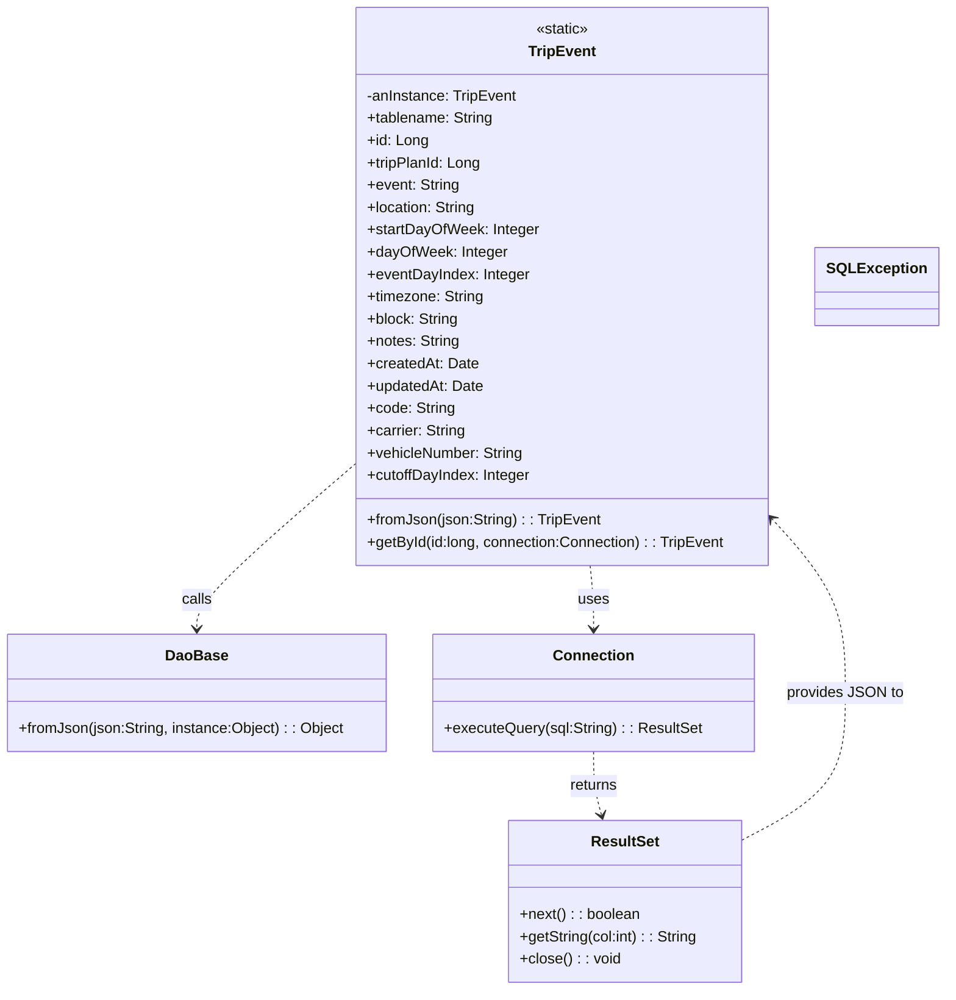
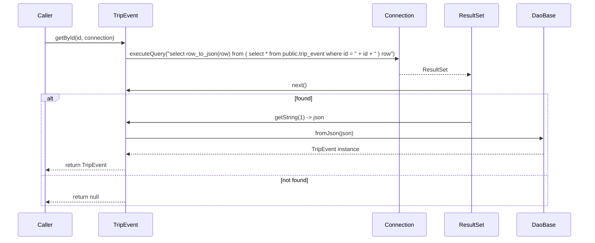
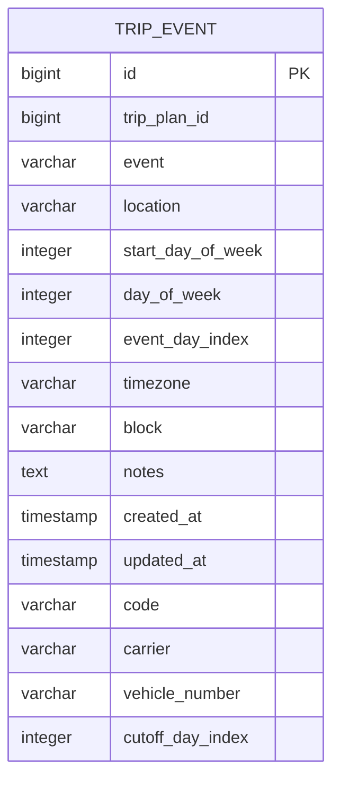

# Diagram: platform-java-lambdas/shipment/src/main/java/com/freightverify/shipment/datastore/postgresql/dao/TripEvent.java

> Auto-generated by Obscura crawlers

## Diagram 1

### SVG

<svg id="container" width="1002.849609375" xmlns="http://www.w3.org/2000/svg" class="classDiagram" height="1064" viewBox="0 0 1002.849609375 1064" role="graphics-document document" aria-roledescription="class"><g><defs><marker id="container_class-aggregationStart" class="marker aggregation class" refX="18" refY="7" markerWidth="190" markerHeight="240" orient="auto"><path d="M 18,7 L9,13 L1,7 L9,1 Z"></path></marker></defs><defs><marker id="container_class-aggregationEnd" class="marker aggregation class" refX="1" refY="7" markerWidth="20" markerHeight="28" orient="auto"><path d="M 18,7 L9,13 L1,7 L9,1 Z"></path></marker></defs><defs><marker id="container_class-extensionStart" class="marker extension class" refX="18" refY="7" markerWidth="190" markerHeight="240" orient="auto"><path d="M 1,7 L18,13 V 1 Z"></path></marker></defs><defs><marker id="container_class-extensionEnd" class="marker extension class" refX="1" refY="7" markerWidth="20" markerHeight="28" orient="auto"><path d="M 1,1 V 13 L18,7 Z"></path></marker></defs><defs><marker id="container_class-compositionStart" class="marker composition class" refX="18" refY="7" markerWidth="190" markerHeight="240" orient="auto"><path d="M 18,7 L9,13 L1,7 L9,1 Z"></path></marker></defs><defs><marker id="container_class-compositionEnd" class="marker composition class" refX="1" refY="7" markerWidth="20" markerHeight="28" orient="auto"><path d="M 18,7 L9,13 L1,7 L9,1 Z"></path></marker></defs><defs><marker id="container_class-dependencyStart" class="marker dependency class" refX="6" refY="7" markerWidth="190" markerHeight="240" orient="auto"><path d="M 5,7 L9,13 L1,7 L9,1 Z"></path></marker></defs><defs><marker id="container_class-dependencyEnd" class="marker dependency class" refX="13" refY="7" markerWidth="20" markerHeight="28" orient="auto"><path d="M 18,7 L9,13 L14,7 L9,1 Z"></path></marker></defs><defs><marker id="container_class-lollipopStart" class="marker lollipop class" refX="13" refY="7" markerWidth="190" markerHeight="240" orient="auto"><circle stroke="black" fill="transparent" cx="7" cy="7" r="6"></circle></marker></defs><defs><marker id="container_class-lollipopEnd" class="marker lollipop class" refX="1" refY="7" markerWidth="190" markerHeight="240" orient="auto"><circle stroke="black" fill="transparent" cx="7" cy="7" r="6"></circle></marker></defs><g class="root"><g class="clusters"></g><g class="edgePaths"><path d="M377.006,500.54L349.243,524.617C321.479,548.694,265.952,596.847,238.189,626.09C210.426,655.333,210.426,665.667,210.426,670.833L210.426,676" id="id_TripEvent_DaoBase_1" class="edge-thickness-normal edge-pattern-dashed relation" style=";;;" data-edge="true" data-et="edge" data-id="id_TripEvent_DaoBase_1" data-points="W3sieCI6Mzc3LjAwNTg1OTM3NSwieSI6NTAwLjU0MDQ1Njg2NDI3MjY0fSx7IngiOjIxMC40MjU3ODEyNSwieSI6NjQ1fSx7IngiOjIxMC40MjU3ODEyNSwieSI6NjgyfV0=" marker-end="url(#container_class-dependencyEnd)"></path><path d="M629.281,608L629.903,614.167C630.524,620.333,631.768,632.667,632.39,644C633.012,655.333,633.012,665.667,633.012,670.833L633.012,676" id="id_TripEvent_Connection_2" class="edge-thickness-normal edge-pattern-dashed relation" style=";;;" data-edge="true" data-et="edge" data-id="id_TripEvent_Connection_2" data-points="W3sieCI6NjI5LjI4MDcxMTAwNzA0NzQsInkiOjYwOH0seyJ4Ijo2MzMuMDExNzE4NzUsInkiOjY0NX0seyJ4Ijo2MzMuMDExNzE4NzUsInkiOjY4Mn1d" marker-end="url(#container_class-dependencyEnd)"></path><path d="M633.012,808L633.012,814.167C633.012,820.333,633.012,832.667,634.437,844.036C635.863,855.404,638.714,865.809,640.14,871.011L641.566,876.213" id="id_Connection_ResultSet_3" class="edge-thickness-normal edge-pattern-dashed relation" style=";;;" data-edge="true" data-et="edge" data-id="id_Connection_ResultSet_3" data-points="W3sieCI6NjMzLjAxMTcxODc1LCJ5Ijo4MDh9LHsieCI6NjMzLjAxMTcxODc1LCJ5Ijo4NDV9LHsieCI6NjQzLjE1MTYzNDk1NDYzNzEsInkiOjg4Mn1d" marker-end="url(#container_class-dependencyEnd)"></path><path d="M792.658,901.827L810.377,892.356C828.095,882.885,863.532,863.942,881.25,837.805C898.969,811.667,898.969,778.333,898.969,745C898.969,711.667,898.969,678.333,886.648,647.823C874.326,617.313,849.684,589.626,837.363,575.782L825.042,561.939" id="id_ResultSet_TripEvent_4" class="edge-thickness-normal edge-pattern-dashed relation" style=";;;" data-edge="true" data-et="edge" data-id="id_ResultSet_TripEvent_4" data-points="W3sieCI6NzkyLjY1ODIwMzEyNSwieSI6OTAxLjgyNzM3MzY4NTQ5NTZ9LHsieCI6ODk4Ljk2ODc1LCJ5Ijo4NDV9LHsieCI6ODk4Ljk2ODc1LCJ5Ijo3NDV9LHsieCI6ODk4Ljk2ODc1LCJ5Ijo2NDV9LHsieCI6ODIxLjA1MjczNDM3NSwieSI6NTU3LjQ1NjY3NDE5ODU2ODd9XQ==" marker-end="url(#container_class-dependencyEnd)"></path></g><g class="edgeLabels"><g class="edgeLabel" transform="translate(210.42578125, 645)"><g class="label" data-id="id_TripEvent_DaoBase_1" transform="translate(-16.4453125, -12)"><foreignObject width="32.890625" height="24">

calls

</foreignObject></g></g><g class="edgeLabel" transform="translate(633.01171875, 645)"><g class="label" data-id="id_TripEvent_Connection_2" transform="translate(-16.4921875, -12)"><foreignObject width="32.984375" height="24">

uses

</foreignObject></g></g><g class="edgeLabel" transform="translate(633.01171875, 845)"><g class="label" data-id="id_Connection_ResultSet_3" transform="translate(-26.265625, -12)"><foreignObject width="52.53125" height="24">

returns

</foreignObject></g></g><g class="edgeLabel" transform="translate(898.96875, 745)"><g class="label" data-id="id_ResultSet_TripEvent_4" transform="translate(-60.796875, -12)"><foreignObject width="121.59375" height="24">

provides JSON to

</foreignObject></g></g></g><g class="nodes"><g class="node default" id="classId-TripEvent-0" transform="translate(599.029296875, 308)"><g class="basic label-container"><path d="M-222.0234375 -300 L222.0234375 -300 L222.0234375 300 L-222.0234375 300" stroke="none" stroke-width="0" fill="#ECECFF" style=""></path><path d="M-222.0234375 -300 C-90.16253462690435 -300, 41.69836824619131 -300, 222.0234375 -300 M-222.0234375 -300 C-70.8002182025918 -300, 80.42300109481641 -300, 222.0234375 -300 M222.0234375 -300 C222.0234375 -78.58802661102447, 222.0234375 142.82394677795105, 222.0234375 300 M222.0234375 -300 C222.0234375 -175.77692140765743, 222.0234375 -51.55384281531482, 222.0234375 300 M222.0234375 300 C71.02094585530361 300, -79.98154578939278 300, -222.0234375 300 M222.0234375 300 C130.7544653988454 300, 39.48549329769082 300, -222.0234375 300 M-222.0234375 300 C-222.0234375 126.92149725252244, -222.0234375 -46.157005494955115, -222.0234375 -300 M-222.0234375 300 C-222.0234375 100.73886526323582, -222.0234375 -98.52226947352835, -222.0234375 -300" stroke="#9370DB" stroke-width="1.3" fill="none" stroke-dasharray="0 0" style=""></path></g><g class="annotation-group text" transform="translate(-29.0234375, -276)"><g class="label" style="" transform="translate(0,-12)"><foreignObject width="58.046875" height="24">

«static»

</foreignObject></g></g><g class="label-group text" transform="translate(-34.53125, -252)"><g class="label" style="font-weight: bolder" transform="translate(0,-12)"><foreignObject width="69.0625" height="24">

TripEvent

</foreignObject></g></g><g class="members-group text" transform="translate(-210.0234375, -204)"><g class="label" style="" transform="translate(0,-12)"><foreignObject width="161.640625" height="24">

-anInstance: TripEvent

</foreignObject></g><g class="label" style="" transform="translate(0,12)"><foreignObject width="136.578125" height="24">

+tablename: String

</foreignObject></g><g class="label" style="" transform="translate(0,36)"><foreignObject width="64.765625" height="24">

+id: Long

</foreignObject></g><g class="label" style="" transform="translate(0,60)"><foreignObject width="122.6875" height="24">

+tripPlanId: Long

</foreignObject></g><g class="label" style="" transform="translate(0,84)"><foreignObject width="99.359375" height="24">

+event: String

</foreignObject></g><g class="label" style="" transform="translate(0,108)"><foreignObject width="118.109375" height="24">

+location: String

</foreignObject></g><g class="label" style="" transform="translate(0,132)"><foreignObject width="182.84375" height="24">

+startDayOfWeek: Integer

</foreignObject></g><g class="label" style="" transform="translate(0,156)"><foreignObject width="148.46875" height="24">

+dayOfWeek: Integer

</foreignObject></g><g class="label" style="" transform="translate(0,180)"><foreignObject width="174.265625" height="24">

+eventDayIndex: Integer

</foreignObject></g><g class="label" style="" transform="translate(0,204)"><foreignObject width="125.796875" height="24">

+timezone: String

</foreignObject></g><g class="label" style="" transform="translate(0,228)"><foreignObject width="98.3125" height="24">

+block: String

</foreignObject></g><g class="label" style="" transform="translate(0,252)"><foreignObject width="99.40625" height="24">

+notes: String

</foreignObject></g><g class="label" style="" transform="translate(0,276)"><foreignObject width="118.609375" height="24">

+createdAt: Date

</foreignObject></g><g class="label" style="" transform="translate(0,300)"><foreignObject width="125.09375" height="24">

+updatedAt: Date

</foreignObject></g><g class="label" style="" transform="translate(0,324)"><foreignObject width="93.90625" height="24">

+code: String

</foreignObject></g><g class="label" style="" transform="translate(0,348)"><foreignObject width="107.0625" height="24">

+carrier: String

</foreignObject></g><g class="label" style="" transform="translate(0,372)"><foreignObject width="168.703125" height="24">

+vehicleNumber: String

</foreignObject></g><g class="label" style="" transform="translate(0,396)"><foreignObject width="176.328125" height="24">

+cutoffDayIndex: Integer

</foreignObject></g></g><g class="methods-group text" transform="translate(-210.0234375, 252)"><g class="label" style="" transform="translate(0,-12)"><foreignObject width="249.578125" height="24">

+fromJson(json:String) : : TripEvent

</foreignObject></g><g class="label" style="" transform="translate(0,12)"><foreignObject width="385.515625" height="24">

+getById(id:long, connection:Connection) : : TripEvent

</foreignObject></g></g><g class="divider" style=""><path d="M-222.0234375 -228 C-111.23308559782613 -228, -0.44273369565226517 -228, 222.0234375 -228 M-222.0234375 -228 C-59.518346890218226 -228, 102.98674371956355 -228, 222.0234375 -228" stroke="#9370DB" stroke-width="1.3" fill="none" stroke-dasharray="0 0" style=""></path></g><g class="divider" style=""><path d="M-222.0234375 228 C-123.4382882716714 228, -24.853139043342793 228, 222.0234375 228 M-222.0234375 228 C-52.303829756514375 228, 117.41577798697125 228, 222.0234375 228" stroke="#9370DB" stroke-width="1.3" fill="none" stroke-dasharray="0 0" style=""></path></g></g><g class="node default" id="classId-DaoBase-1" transform="translate(210.42578125, 745)"><g class="basic label-container"><path d="M-202.42578125 -63 L202.42578125 -63 L202.42578125 63 L-202.42578125 63" stroke="none" stroke-width="0" fill="#ECECFF" style=""></path><path d="M-202.42578125 -63 C-116.66715901747797 -63, -30.908536784955942 -63, 202.42578125 -63 M-202.42578125 -63 C-46.40530211595981 -63, 109.61517701808037 -63, 202.42578125 -63 M202.42578125 -63 C202.42578125 -26.830015375369626, 202.42578125 9.339969249260747, 202.42578125 63 M202.42578125 -63 C202.42578125 -16.85025538466894, 202.42578125 29.299489230662118, 202.42578125 63 M202.42578125 63 C80.44903944139197 63, -41.52770236721605 63, -202.42578125 63 M202.42578125 63 C108.36084848178379 63, 14.295915713567581 63, -202.42578125 63 M-202.42578125 63 C-202.42578125 25.947836098788066, -202.42578125 -11.104327802423867, -202.42578125 -63 M-202.42578125 63 C-202.42578125 14.09689822546575, -202.42578125 -34.8062035490685, -202.42578125 -63" stroke="#9370DB" stroke-width="1.3" fill="none" stroke-dasharray="0 0" style=""></path></g><g class="annotation-group text" transform="translate(0, -39)"></g><g class="label-group text" transform="translate(-31.7109375, -39)"><g class="label" style="font-weight: bolder" transform="translate(0,-12)"><foreignObject width="63.421875" height="24">

DaoBase

</foreignObject></g></g><g class="members-group text" transform="translate(-190.42578125, 9)"></g><g class="methods-group text" transform="translate(-190.42578125, 39)"><g class="label" style="" transform="translate(0,-12)"><foreignObject width="349.140625" height="24">

+fromJson(json:String, instance:Object) : : Object

</foreignObject></g></g><g class="divider" style=""><path d="M-202.42578125 -15 C-78.2344744158093 -15, 45.956832418381396 -15, 202.42578125 -15 M-202.42578125 -15 C-106.55420343513218 -15, -10.68262562026436 -15, 202.42578125 -15" stroke="#9370DB" stroke-width="1.3" fill="none" stroke-dasharray="0 0" style=""></path></g><g class="divider" style=""><path d="M-202.42578125 9 C-58.542113551684565 9, 85.34155414663087 9, 202.42578125 9 M-202.42578125 9 C-62.08850099425766 9, 78.24877926148469 9, 202.42578125 9" stroke="#9370DB" stroke-width="1.3" fill="none" stroke-dasharray="0 0" style=""></path></g></g><g class="node default" id="classId-Connection-2" transform="translate(633.01171875, 745)"><g class="basic label-container"><path d="M-170.16015625 -63 L170.16015625 -63 L170.16015625 63 L-170.16015625 63" stroke="none" stroke-width="0" fill="#ECECFF" style=""></path><path d="M-170.16015625 -63 C-100.39964048065839 -63, -30.639124711316782 -63, 170.16015625 -63 M-170.16015625 -63 C-60.266207687363305 -63, 49.62774087527339 -63, 170.16015625 -63 M170.16015625 -63 C170.16015625 -26.552813662886592, 170.16015625 9.894372674226815, 170.16015625 63 M170.16015625 -63 C170.16015625 -23.3980347095763, 170.16015625 16.2039305808474, 170.16015625 63 M170.16015625 63 C46.23331931577691 63, -77.69351761844618 63, -170.16015625 63 M170.16015625 63 C90.32967863916392 63, 10.499201028327832 63, -170.16015625 63 M-170.16015625 63 C-170.16015625 37.655221639011735, -170.16015625 12.31044327802347, -170.16015625 -63 M-170.16015625 63 C-170.16015625 35.04297867429072, -170.16015625 7.085957348581452, -170.16015625 -63" stroke="#9370DB" stroke-width="1.3" fill="none" stroke-dasharray="0 0" style=""></path></g><g class="annotation-group text" transform="translate(0, -39)"></g><g class="label-group text" transform="translate(-41.2265625, -39)"><g class="label" style="font-weight: bolder" transform="translate(0,-12)"><foreignObject width="82.453125" height="24">

Connection

</foreignObject></g></g><g class="members-group text" transform="translate(-158.16015625, 9)"></g><g class="methods-group text" transform="translate(-158.16015625, 39)"><g class="label" style="" transform="translate(0,-12)"><foreignObject width="275.09375" height="24">

+executeQuery(sql:String) : : ResultSet

</foreignObject></g></g><g class="divider" style=""><path d="M-170.16015625 -15 C-85.82005732456594 -15, -1.479958399131874 -15, 170.16015625 -15 M-170.16015625 -15 C-47.512169122679126 -15, 75.13581800464175 -15, 170.16015625 -15" stroke="#9370DB" stroke-width="1.3" fill="none" stroke-dasharray="0 0" style=""></path></g><g class="divider" style=""><path d="M-170.16015625 9 C-42.453650823785225 9, 85.25285460242955 9, 170.16015625 9 M-170.16015625 9 C-46.61125177131707 9, 76.93765270736586 9, 170.16015625 9" stroke="#9370DB" stroke-width="1.3" fill="none" stroke-dasharray="0 0" style=""></path></g></g><g class="node default" id="classId-ResultSet-3" transform="translate(666.994140625, 969)"><g class="basic label-container"><path d="M-125.6640625 -87 L125.6640625 -87 L125.6640625 87 L-125.6640625 87" stroke="none" stroke-width="0" fill="#ECECFF" style=""></path><path d="M-125.6640625 -87 C-39.384302377519205 -87, 46.89545774496159 -87, 125.6640625 -87 M-125.6640625 -87 C-34.47442762728521 -87, 56.71520724542958 -87, 125.6640625 -87 M125.6640625 -87 C125.6640625 -32.791056412209954, 125.6640625 21.41788717558009, 125.6640625 87 M125.6640625 -87 C125.6640625 -20.248675499879354, 125.6640625 46.50264900024129, 125.6640625 87 M125.6640625 87 C56.9128826950741 87, -11.838297109851794 87, -125.6640625 87 M125.6640625 87 C56.89163289854754 87, -11.880796702904917 87, -125.6640625 87 M-125.6640625 87 C-125.6640625 25.450758262486985, -125.6640625 -36.09848347502603, -125.6640625 -87 M-125.6640625 87 C-125.6640625 31.70922597560172, -125.6640625 -23.581548048796563, -125.6640625 -87" stroke="#9370DB" stroke-width="1.3" fill="none" stroke-dasharray="0 0" style=""></path></g><g class="annotation-group text" transform="translate(0, -63)"></g><g class="label-group text" transform="translate(-35.21875, -63)"><g class="label" style="font-weight: bolder" transform="translate(0,-12)"><foreignObject width="70.4375" height="24">

ResultSet

</foreignObject></g></g><g class="members-group text" transform="translate(-113.6640625, -15)"></g><g class="methods-group text" transform="translate(-113.6640625, 15)"><g class="label" style="" transform="translate(0,-12)"><foreignObject width="129.6875" height="24">

+next() : : boolean

</foreignObject></g><g class="label" style="" transform="translate(0,12)"><foreignObject width="192.109375" height="24">

+getString(col:int) : : String

</foreignObject></g><g class="label" style="" transform="translate(0,36)"><foreignObject width="107.78125" height="24">

+close() : : void

</foreignObject></g></g><g class="divider" style=""><path d="M-125.6640625 -39 C-31.481556627840774 -39, 62.70094924431845 -39, 125.6640625 -39 M-125.6640625 -39 C-56.08821619891384 -39, 13.487630102172318 -39, 125.6640625 -39" stroke="#9370DB" stroke-width="1.3" fill="none" stroke-dasharray="0 0" style=""></path></g><g class="divider" style=""><path d="M-125.6640625 -15 C-70.99062408276203 -15, -16.317185665524065 -15, 125.6640625 -15 M-125.6640625 -15 C-73.16286105438544 -15, -20.661659608770904 -15, 125.6640625 -15" stroke="#9370DB" stroke-width="1.3" fill="none" stroke-dasharray="0 0" style=""></path></g></g><g class="node default" id="classId-SQLException-4" transform="translate(932.951171875, 308)"><g class="basic label-container"><path d="M-61.8984375 -42 L61.8984375 -42 L61.8984375 42 L-61.8984375 42" stroke="none" stroke-width="0" fill="#ECECFF" style=""></path><path d="M-61.8984375 -42 C-28.582321346474693 -42, 4.733794807050614 -42, 61.8984375 -42 M-61.8984375 -42 C-35.22014186226557 -42, -8.541846224531142 -42, 61.8984375 -42 M61.8984375 -42 C61.8984375 -10.211498375894063, 61.8984375 21.577003248211874, 61.8984375 42 M61.8984375 -42 C61.8984375 -11.706927849079975, 61.8984375 18.58614430184005, 61.8984375 42 M61.8984375 42 C35.88003350868422 42, 9.86162951736845 42, -61.8984375 42 M61.8984375 42 C35.59430206251142 42, 9.290166625022827 42, -61.8984375 42 M-61.8984375 42 C-61.8984375 12.721749621854986, -61.8984375 -16.556500756290028, -61.8984375 -42 M-61.8984375 42 C-61.8984375 17.471858727019647, -61.8984375 -7.0562825459607055, -61.8984375 -42" stroke="#9370DB" stroke-width="1.3" fill="none" stroke-dasharray="0 0" style=""></path></g><g class="annotation-group text" transform="translate(0, -18)"></g><g class="label-group text" transform="translate(-49.8984375, -18)"><g class="label" style="font-weight: bolder" transform="translate(0,-12)"><foreignObject width="99.796875" height="24">

SQLException

</foreignObject></g></g><g class="members-group text" transform="translate(-49.8984375, 30)"></g><g class="methods-group text" transform="translate(-49.8984375, 60)"></g><g class="divider" style=""><path d="M-61.8984375 6 C-30.297455710391382 6, 1.3035260792172352 6, 61.8984375 6 M-61.8984375 6 C-26.523927008458237 6, 8.850583483083525 6, 61.8984375 6" stroke="#9370DB" stroke-width="1.3" fill="none" stroke-dasharray="0 0" style=""></path></g><g class="divider" style=""><path d="M-61.8984375 24 C-17.764698843520456 24, 26.369039812959087 24, 61.8984375 24 M-61.8984375 24 C-16.538863505387873 24, 28.820710489224254 24, 61.8984375 24" stroke="#9370DB" stroke-width="1.3" fill="none" stroke-dasharray="0 0" style=""></path></g></g></g></g></g></svg>

## Diagram 2

### SVG

<svg id="container" width="1707" xmlns="http://www.w3.org/2000/svg" height="703" viewBox="-50 -10 1707 703" role="graphics-document document" aria-roledescription="sequence"><g><rect x="1457" y="617" fill="#eaeaea" stroke="#666" width="150" height="65" name="DaoBase" rx="3" ry="3" class="actor actor-bottom"></rect><text x="1532" y="649.5" dominant-baseline="central" alignment-baseline="central" class="actor actor-box" style="text-anchor: middle; font-size: 16px; font-weight: 400;"><tspan x="1532" dy="0">DaoBase</tspan></text></g><g><rect x="1257" y="617" fill="#eaeaea" stroke="#666" width="150" height="65" name="ResultSet" rx="3" ry="3" class="actor actor-bottom"></rect><text x="1332" y="649.5" dominant-baseline="central" alignment-baseline="central" class="actor actor-box" style="text-anchor: middle; font-size: 16px; font-weight: 400;"><tspan x="1332" dy="0">ResultSet</tspan></text></g><g><rect x="1057" y="617" fill="#eaeaea" stroke="#666" width="150" height="65" name="Connection" rx="3" ry="3" class="actor actor-bottom"></rect><text x="1132" y="649.5" dominant-baseline="central" alignment-baseline="central" class="actor actor-box" style="text-anchor: middle; font-size: 16px; font-weight: 400;"><tspan x="1132" dy="0">Connection</tspan></text></g><g><rect x="238" y="617" fill="#eaeaea" stroke="#666" width="150" height="65" name="TripEvent" rx="3" ry="3" class="actor actor-bottom"></rect><text x="313" y="649.5" dominant-baseline="central" alignment-baseline="central" class="actor actor-box" style="text-anchor: middle; font-size: 16px; font-weight: 400;"><tspan x="313" dy="0">TripEvent</tspan></text></g><g><rect x="0" y="617" fill="#eaeaea" stroke="#666" width="150" height="65" name="Caller" rx="3" ry="3" class="actor actor-bottom"></rect><text x="75" y="649.5" dominant-baseline="central" alignment-baseline="central" class="actor actor-box" style="text-anchor: middle; font-size: 16px; font-weight: 400;"><tspan x="75" dy="0">Caller</tspan></text></g><g><line id="actor4" x1="1532" y1="65" x2="1532" y2="617" class="actor-line 200" stroke-width="0.5px" stroke="#999" name="DaoBase"></line><g id="root-4"><rect x="1457" y="0" fill="#eaeaea" stroke="#666" width="150" height="65" name="DaoBase" rx="3" ry="3" class="actor actor-top"></rect><text x="1532" y="32.5" dominant-baseline="central" alignment-baseline="central" class="actor actor-box" style="text-anchor: middle; font-size: 16px; font-weight: 400;"><tspan x="1532" dy="0">DaoBase</tspan></text></g></g><g><line id="actor3" x1="1332" y1="65" x2="1332" y2="617" class="actor-line 200" stroke-width="0.5px" stroke="#999" name="ResultSet"></line><g id="root-3"><rect x="1257" y="0" fill="#eaeaea" stroke="#666" width="150" height="65" name="ResultSet" rx="3" ry="3" class="actor actor-top"></rect><text x="1332" y="32.5" dominant-baseline="central" alignment-baseline="central" class="actor actor-box" style="text-anchor: middle; font-size: 16px; font-weight: 400;"><tspan x="1332" dy="0">ResultSet</tspan></text></g></g><g><line id="actor2" x1="1132" y1="65" x2="1132" y2="617" class="actor-line 200" stroke-width="0.5px" stroke="#999" name="Connection"></line><g id="root-2"><rect x="1057" y="0" fill="#eaeaea" stroke="#666" width="150" height="65" name="Connection" rx="3" ry="3" class="actor actor-top"></rect><text x="1132" y="32.5" dominant-baseline="central" alignment-baseline="central" class="actor actor-box" style="text-anchor: middle; font-size: 16px; font-weight: 400;"><tspan x="1132" dy="0">Connection</tspan></text></g></g><g><line id="actor1" x1="313" y1="65" x2="313" y2="617" class="actor-line 200" stroke-width="0.5px" stroke="#999" name="TripEvent"></line><g id="root-1"><rect x="238" y="0" fill="#eaeaea" stroke="#666" width="150" height="65" name="TripEvent" rx="3" ry="3" class="actor actor-top"></rect><text x="313" y="32.5" dominant-baseline="central" alignment-baseline="central" class="actor actor-box" style="text-anchor: middle; font-size: 16px; font-weight: 400;"><tspan x="313" dy="0">TripEvent</tspan></text></g></g><g><line id="actor0" x1="75" y1="65" x2="75" y2="617" class="actor-line 200" stroke-width="0.5px" stroke="#999" name="Caller"></line><g id="root-0"><rect x="0" y="0" fill="#eaeaea" stroke="#666" width="150" height="65" name="Caller" rx="3" ry="3" class="actor actor-top"></rect><text x="75" y="32.5" dominant-baseline="central" alignment-baseline="central" class="actor actor-box" style="text-anchor: middle; font-size: 16px; font-weight: 400;"><tspan x="75" dy="0">Caller</tspan></text></g></g><g></g><defs><symbol id="computer" width="24" height="24"><path transform="scale(.5)" d="M2 2v13h20v-13h-20zm18 11h-16v-9h16v9zm-10.228 6l.466-1h3.524l.467 1h-4.457zm14.228 3h-24l2-6h2.104l-1.33 4h18.45l-1.297-4h2.073l2 6zm-5-10h-14v-7h14v7z"></path></symbol></defs><defs><symbol id="database" fill-rule="evenodd" clip-rule="evenodd"><path transform="scale(.5)" d="M12.258.001l.256.004.255.005.253.008.251.01.249.012.247.015.246.016.242.019.241.02.239.023.236.024.233.027.231.028.229.031.225.032.223.034.22.036.217.038.214.04.211.041.208.043.205.045.201.046.198.048.194.05.191.051.187.053.183.054.18.056.175.057.172.059.168.06.163.061.16.063.155.064.15.066.074.033.073.033.071.034.07.034.069.035.068.035.067.035.066.035.064.036.064.036.062.036.06.036.06.037.058.037.058.037.055.038.055.038.053.038.052.038.051.039.05.039.048.039.047.039.045.04.044.04.043.04.041.04.04.041.039.041.037.041.036.041.034.041.033.042.032.042.03.042.029.042.027.042.026.043.024.043.023.043.021.043.02.043.018.044.017.043.015.044.013.044.012.044.011.045.009.044.007.045.006.045.004.045.002.045.001.045v17l-.001.045-.002.045-.004.045-.006.045-.007.045-.009.044-.011.045-.012.044-.013.044-.015.044-.017.043-.018.044-.02.043-.021.043-.023.043-.024.043-.026.043-.027.042-.029.042-.03.042-.032.042-.033.042-.034.041-.036.041-.037.041-.039.041-.04.041-.041.04-.043.04-.044.04-.045.04-.047.039-.048.039-.05.039-.051.039-.052.038-.053.038-.055.038-.055.038-.058.037-.058.037-.06.037-.06.036-.062.036-.064.036-.064.036-.066.035-.067.035-.068.035-.069.035-.07.034-.071.034-.073.033-.074.033-.15.066-.155.064-.16.063-.163.061-.168.06-.172.059-.175.057-.18.056-.183.054-.187.053-.191.051-.194.05-.198.048-.201.046-.205.045-.208.043-.211.041-.214.04-.217.038-.22.036-.223.034-.225.032-.229.031-.231.028-.233.027-.236.024-.239.023-.241.02-.242.019-.246.016-.247.015-.249.012-.251.01-.253.008-.255.005-.256.004-.258.001-.258-.001-.256-.004-.255-.005-.253-.008-.251-.01-.249-.012-.247-.015-.245-.016-.243-.019-.241-.02-.238-.023-.236-.024-.234-.027-.231-.028-.228-.031-.226-.032-.223-.034-.22-.036-.217-.038-.214-.04-.211-.041-.208-.043-.204-.045-.201-.046-.198-.048-.195-.05-.19-.051-.187-.053-.184-.054-.179-.056-.176-.057-.172-.059-.167-.06-.164-.061-.159-.063-.155-.064-.151-.066-.074-.033-.072-.033-.072-.034-.07-.034-.069-.035-.068-.035-.067-.035-.066-.035-.064-.036-.063-.036-.062-.036-.061-.036-.06-.037-.058-.037-.057-.037-.056-.038-.055-.038-.053-.038-.052-.038-.051-.039-.049-.039-.049-.039-.046-.039-.046-.04-.044-.04-.043-.04-.041-.04-.04-.041-.039-.041-.037-.041-.036-.041-.034-.041-.033-.042-.032-.042-.03-.042-.029-.042-.027-.042-.026-.043-.024-.043-.023-.043-.021-.043-.02-.043-.018-.044-.017-.043-.015-.044-.013-.044-.012-.044-.011-.045-.009-.044-.007-.045-.006-.045-.004-.045-.002-.045-.001-.045v-17l.001-.045.002-.045.004-.045.006-.045.007-.045.009-.044.011-.045.012-.044.013-.044.015-.044.017-.043.018-.044.02-.043.021-.043.023-.043.024-.043.026-.043.027-.042.029-.042.03-.042.032-.042.033-.042.034-.041.036-.041.037-.041.039-.041.04-.041.041-.04.043-.04.044-.04.046-.04.046-.039.049-.039.049-.039.051-.039.052-.038.053-.038.055-.038.056-.038.057-.037.058-.037.06-.037.061-.036.062-.036.063-.036.064-.036.066-.035.067-.035.068-.035.069-.035.07-.034.072-.034.072-.033.074-.033.151-.066.155-.064.159-.063.164-.061.167-.06.172-.059.176-.057.179-.056.184-.054.187-.053.19-.051.195-.05.198-.048.201-.046.204-.045.208-.043.211-.041.214-.04.217-.038.22-.036.223-.034.226-.032.228-.031.231-.028.234-.027.236-.024.238-.023.241-.02.243-.019.245-.016.247-.015.249-.012.251-.01.253-.008.255-.005.256-.004.258-.001.258.001zm-9.258 20.499v.01l.001.021.003.021.004.022.005.021.006.022.007.022.009.023.01.022.011.023.012.023.013.023.015.023.016.024.017.023.018.024.019.024.021.024.022.025.023.024.024.025.052.049.056.05.061.051.066.051.07.051.075.051.079.052.084.052.088.052.092.052.097.052.102.051.105.052.11.052.114.051.119.051.123.051.127.05.131.05.135.05.139.048.144.049.147.047.152.047.155.047.16.045.163.045.167.043.171.043.176.041.178.041.183.039.187.039.19.037.194.035.197.035.202.033.204.031.209.03.212.029.216.027.219.025.222.024.226.021.23.02.233.018.236.016.24.015.243.012.246.01.249.008.253.005.256.004.259.001.26-.001.257-.004.254-.005.25-.008.247-.011.244-.012.241-.014.237-.016.233-.018.231-.021.226-.021.224-.024.22-.026.216-.027.212-.028.21-.031.205-.031.202-.034.198-.034.194-.036.191-.037.187-.039.183-.04.179-.04.175-.042.172-.043.168-.044.163-.045.16-.046.155-.046.152-.047.148-.048.143-.049.139-.049.136-.05.131-.05.126-.05.123-.051.118-.052.114-.051.11-.052.106-.052.101-.052.096-.052.092-.052.088-.053.083-.051.079-.052.074-.052.07-.051.065-.051.06-.051.056-.05.051-.05.023-.024.023-.025.021-.024.02-.024.019-.024.018-.024.017-.024.015-.023.014-.024.013-.023.012-.023.01-.023.01-.022.008-.022.006-.022.006-.022.004-.022.004-.021.001-.021.001-.021v-4.127l-.077.055-.08.053-.083.054-.085.053-.087.052-.09.052-.093.051-.095.05-.097.05-.1.049-.102.049-.105.048-.106.047-.109.047-.111.046-.114.045-.115.045-.118.044-.12.043-.122.042-.124.042-.126.041-.128.04-.13.04-.132.038-.134.038-.135.037-.138.037-.139.035-.142.035-.143.034-.144.033-.147.032-.148.031-.15.03-.151.03-.153.029-.154.027-.156.027-.158.026-.159.025-.161.024-.162.023-.163.022-.165.021-.166.02-.167.019-.169.018-.169.017-.171.016-.173.015-.173.014-.175.013-.175.012-.177.011-.178.01-.179.008-.179.008-.181.006-.182.005-.182.004-.184.003-.184.002h-.37l-.184-.002-.184-.003-.182-.004-.182-.005-.181-.006-.179-.008-.179-.008-.178-.01-.176-.011-.176-.012-.175-.013-.173-.014-.172-.015-.171-.016-.17-.017-.169-.018-.167-.019-.166-.02-.165-.021-.163-.022-.162-.023-.161-.024-.159-.025-.157-.026-.156-.027-.155-.027-.153-.029-.151-.03-.15-.03-.148-.031-.146-.032-.145-.033-.143-.034-.141-.035-.14-.035-.137-.037-.136-.037-.134-.038-.132-.038-.13-.04-.128-.04-.126-.041-.124-.042-.122-.042-.12-.044-.117-.043-.116-.045-.113-.045-.112-.046-.109-.047-.106-.047-.105-.048-.102-.049-.1-.049-.097-.05-.095-.05-.093-.052-.09-.051-.087-.052-.085-.053-.083-.054-.08-.054-.077-.054v4.127zm0-5.654v.011l.001.021.003.021.004.021.005.022.006.022.007.022.009.022.01.022.011.023.012.023.013.023.015.024.016.023.017.024.018.024.019.024.021.024.022.024.023.025.024.024.052.05.056.05.061.05.066.051.07.051.075.052.079.051.084.052.088.052.092.052.097.052.102.052.105.052.11.051.114.051.119.052.123.05.127.051.131.05.135.049.139.049.144.048.147.048.152.047.155.046.16.045.163.045.167.044.171.042.176.042.178.04.183.04.187.038.19.037.194.036.197.034.202.033.204.032.209.03.212.028.216.027.219.025.222.024.226.022.23.02.233.018.236.016.24.014.243.012.246.01.249.008.253.006.256.003.259.001.26-.001.257-.003.254-.006.25-.008.247-.01.244-.012.241-.015.237-.016.233-.018.231-.02.226-.022.224-.024.22-.025.216-.027.212-.029.21-.03.205-.032.202-.033.198-.035.194-.036.191-.037.187-.039.183-.039.179-.041.175-.042.172-.043.168-.044.163-.045.16-.045.155-.047.152-.047.148-.048.143-.048.139-.05.136-.049.131-.05.126-.051.123-.051.118-.051.114-.052.11-.052.106-.052.101-.052.096-.052.092-.052.088-.052.083-.052.079-.052.074-.051.07-.052.065-.051.06-.05.056-.051.051-.049.023-.025.023-.024.021-.025.02-.024.019-.024.018-.024.017-.024.015-.023.014-.023.013-.024.012-.022.01-.023.01-.023.008-.022.006-.022.006-.022.004-.021.004-.022.001-.021.001-.021v-4.139l-.077.054-.08.054-.083.054-.085.052-.087.053-.09.051-.093.051-.095.051-.097.05-.1.049-.102.049-.105.048-.106.047-.109.047-.111.046-.114.045-.115.044-.118.044-.12.044-.122.042-.124.042-.126.041-.128.04-.13.039-.132.039-.134.038-.135.037-.138.036-.139.036-.142.035-.143.033-.144.033-.147.033-.148.031-.15.03-.151.03-.153.028-.154.028-.156.027-.158.026-.159.025-.161.024-.162.023-.163.022-.165.021-.166.02-.167.019-.169.018-.169.017-.171.016-.173.015-.173.014-.175.013-.175.012-.177.011-.178.009-.179.009-.179.007-.181.007-.182.005-.182.004-.184.003-.184.002h-.37l-.184-.002-.184-.003-.182-.004-.182-.005-.181-.007-.179-.007-.179-.009-.178-.009-.176-.011-.176-.012-.175-.013-.173-.014-.172-.015-.171-.016-.17-.017-.169-.018-.167-.019-.166-.02-.165-.021-.163-.022-.162-.023-.161-.024-.159-.025-.157-.026-.156-.027-.155-.028-.153-.028-.151-.03-.15-.03-.148-.031-.146-.033-.145-.033-.143-.033-.141-.035-.14-.036-.137-.036-.136-.037-.134-.038-.132-.039-.13-.039-.128-.04-.126-.041-.124-.042-.122-.043-.12-.043-.117-.044-.116-.044-.113-.046-.112-.046-.109-.046-.106-.047-.105-.048-.102-.049-.1-.049-.097-.05-.095-.051-.093-.051-.09-.051-.087-.053-.085-.052-.083-.054-.08-.054-.077-.054v4.139zm0-5.666v.011l.001.02.003.022.004.021.005.022.006.021.007.022.009.023.01.022.011.023.012.023.013.023.015.023.016.024.017.024.018.023.019.024.021.025.022.024.023.024.024.025.052.05.056.05.061.05.066.051.07.051.075.052.079.051.084.052.088.052.092.052.097.052.102.052.105.051.11.052.114.051.119.051.123.051.127.05.131.05.135.05.139.049.144.048.147.048.152.047.155.046.16.045.163.045.167.043.171.043.176.042.178.04.183.04.187.038.19.037.194.036.197.034.202.033.204.032.209.03.212.028.216.027.219.025.222.024.226.021.23.02.233.018.236.017.24.014.243.012.246.01.249.008.253.006.256.003.259.001.26-.001.257-.003.254-.006.25-.008.247-.01.244-.013.241-.014.237-.016.233-.018.231-.02.226-.022.224-.024.22-.025.216-.027.212-.029.21-.03.205-.032.202-.033.198-.035.194-.036.191-.037.187-.039.183-.039.179-.041.175-.042.172-.043.168-.044.163-.045.16-.045.155-.047.152-.047.148-.048.143-.049.139-.049.136-.049.131-.051.126-.05.123-.051.118-.052.114-.051.11-.052.106-.052.101-.052.096-.052.092-.052.088-.052.083-.052.079-.052.074-.052.07-.051.065-.051.06-.051.056-.05.051-.049.023-.025.023-.025.021-.024.02-.024.019-.024.018-.024.017-.024.015-.023.014-.024.013-.023.012-.023.01-.022.01-.023.008-.022.006-.022.006-.022.004-.022.004-.021.001-.021.001-.021v-4.153l-.077.054-.08.054-.083.053-.085.053-.087.053-.09.051-.093.051-.095.051-.097.05-.1.049-.102.048-.105.048-.106.048-.109.046-.111.046-.114.046-.115.044-.118.044-.12.043-.122.043-.124.042-.126.041-.128.04-.13.039-.132.039-.134.038-.135.037-.138.036-.139.036-.142.034-.143.034-.144.033-.147.032-.148.032-.15.03-.151.03-.153.028-.154.028-.156.027-.158.026-.159.024-.161.024-.162.023-.163.023-.165.021-.166.02-.167.019-.169.018-.169.017-.171.016-.173.015-.173.014-.175.013-.175.012-.177.01-.178.01-.179.009-.179.007-.181.006-.182.006-.182.004-.184.003-.184.001-.185.001-.185-.001-.184-.001-.184-.003-.182-.004-.182-.006-.181-.006-.179-.007-.179-.009-.178-.01-.176-.01-.176-.012-.175-.013-.173-.014-.172-.015-.171-.016-.17-.017-.169-.018-.167-.019-.166-.02-.165-.021-.163-.023-.162-.023-.161-.024-.159-.024-.157-.026-.156-.027-.155-.028-.153-.028-.151-.03-.15-.03-.148-.032-.146-.032-.145-.033-.143-.034-.141-.034-.14-.036-.137-.036-.136-.037-.134-.038-.132-.039-.13-.039-.128-.041-.126-.041-.124-.041-.122-.043-.12-.043-.117-.044-.116-.044-.113-.046-.112-.046-.109-.046-.106-.048-.105-.048-.102-.048-.1-.05-.097-.049-.095-.051-.093-.051-.09-.052-.087-.052-.085-.053-.083-.053-.08-.054-.077-.054v4.153zm8.74-8.179l-.257.004-.254.005-.25.008-.247.011-.244.012-.241.014-.237.016-.233.018-.231.021-.226.022-.224.023-.22.026-.216.027-.212.028-.21.031-.205.032-.202.033-.198.034-.194.036-.191.038-.187.038-.183.04-.179.041-.175.042-.172.043-.168.043-.163.045-.16.046-.155.046-.152.048-.148.048-.143.048-.139.049-.136.05-.131.05-.126.051-.123.051-.118.051-.114.052-.11.052-.106.052-.101.052-.096.052-.092.052-.088.052-.083.052-.079.052-.074.051-.07.052-.065.051-.06.05-.056.05-.051.05-.023.025-.023.024-.021.024-.02.025-.019.024-.018.024-.017.023-.015.024-.014.023-.013.023-.012.023-.01.023-.01.022-.008.022-.006.023-.006.021-.004.022-.004.021-.001.021-.001.021.001.021.001.021.004.021.004.022.006.021.006.023.008.022.01.022.01.023.012.023.013.023.014.023.015.024.017.023.018.024.019.024.02.025.021.024.023.024.023.025.051.05.056.05.06.05.065.051.07.052.074.051.079.052.083.052.088.052.092.052.096.052.101.052.106.052.11.052.114.052.118.051.123.051.126.051.131.05.136.05.139.049.143.048.148.048.152.048.155.046.16.046.163.045.168.043.172.043.175.042.179.041.183.04.187.038.191.038.194.036.198.034.202.033.205.032.21.031.212.028.216.027.22.026.224.023.226.022.231.021.233.018.237.016.241.014.244.012.247.011.25.008.254.005.257.004.26.001.26-.001.257-.004.254-.005.25-.008.247-.011.244-.012.241-.014.237-.016.233-.018.231-.021.226-.022.224-.023.22-.026.216-.027.212-.028.21-.031.205-.032.202-.033.198-.034.194-.036.191-.038.187-.038.183-.04.179-.041.175-.042.172-.043.168-.043.163-.045.16-.046.155-.046.152-.048.148-.048.143-.048.139-.049.136-.05.131-.05.126-.051.123-.051.118-.051.114-.052.11-.052.106-.052.101-.052.096-.052.092-.052.088-.052.083-.052.079-.052.074-.051.07-.052.065-.051.06-.05.056-.05.051-.05.023-.025.023-.024.021-.024.02-.025.019-.024.018-.024.017-.023.015-.024.014-.023.013-.023.012-.023.01-.023.01-.022.008-.022.006-.023.006-.021.004-.022.004-.021.001-.021.001-.021-.001-.021-.001-.021-.004-.021-.004-.022-.006-.021-.006-.023-.008-.022-.01-.022-.01-.023-.012-.023-.013-.023-.014-.023-.015-.024-.017-.023-.018-.024-.019-.024-.02-.025-.021-.024-.023-.024-.023-.025-.051-.05-.056-.05-.06-.05-.065-.051-.07-.052-.074-.051-.079-.052-.083-.052-.088-.052-.092-.052-.096-.052-.101-.052-.106-.052-.11-.052-.114-.052-.118-.051-.123-.051-.126-.051-.131-.05-.136-.05-.139-.049-.143-.048-.148-.048-.152-.048-.155-.046-.16-.046-.163-.045-.168-.043-.172-.043-.175-.042-.179-.041-.183-.04-.187-.038-.191-.038-.194-.036-.198-.034-.202-.033-.205-.032-.21-.031-.212-.028-.216-.027-.22-.026-.224-.023-.226-.022-.231-.021-.233-.018-.237-.016-.241-.014-.244-.012-.247-.011-.25-.008-.254-.005-.257-.004-.26-.001-.26.001z"></path></symbol></defs><defs><symbol id="clock" width="24" height="24"><path transform="scale(.5)" d="M12 2c5.514 0 10 4.486 10 10s-4.486 10-10 10-10-4.486-10-10 4.486-10 10-10zm0-2c-6.627 0-12 5.373-12 12s5.373 12 12 12 12-5.373 12-12-5.373-12-12-12zm5.848 12.459c.202.038.202.333.001.372-1.907.361-6.045 1.111-6.547 1.111-.719 0-1.301-.582-1.301-1.301 0-.512.77-5.447 1.125-7.445.034-.192.312-.181.343.014l.985 6.238 5.394 1.011z"></path></symbol></defs><defs><marker id="arrowhead" refX="7.9" refY="5" markerUnits="userSpaceOnUse" markerWidth="12" markerHeight="12" orient="auto-start-reverse"><path d="M -1 0 L 10 5 L 0 10 z"></path></marker></defs><defs><marker id="crosshead" markerWidth="15" markerHeight="8" orient="auto" refX="4" refY="4.5"><path fill="none" stroke="#000000" stroke-width="1pt" d="M 1,2 L 6,7 M 6,2 L 1,7" style="stroke-dasharray: 0, 0;"></path></marker></defs><defs><marker id="filled-head" refX="15.5" refY="7" markerWidth="20" markerHeight="28" orient="auto"><path d="M 18,7 L9,13 L14,7 L9,1 Z"></path></marker></defs><defs><marker id="sequencenumber" refX="15" refY="15" markerWidth="60" markerHeight="40" orient="auto"><circle cx="15" cy="15" r="6"></circle></marker></defs><g><line x1="64" y1="267" x2="1543" y2="267" class="loopLine"></line><line x1="1543" y1="267" x2="1543" y2="597" class="loopLine"></line><line x1="64" y1="597" x2="1543" y2="597" class="loopLine"></line><line x1="64" y1="267" x2="64" y2="597" class="loopLine"></line><line x1="64" y1="509" x2="1543" y2="509" class="loopLine" style="stroke-dasharray: 3, 3;"></line><polygon points="64,267 114,267 114,280 105.6,287 64,287" class="labelBox"></polygon><text x="89" y="280" text-anchor="middle" dominant-baseline="middle" alignment-baseline="middle" class="labelText" style="font-size: 16px; font-weight: 400;">alt</text><text x="828.5" y="285" text-anchor="middle" class="loopText" style="font-size: 16px; font-weight: 400;"><tspan x="828.5">[found]</tspan></text><text x="803.5" y="527" text-anchor="middle" class="loopText" style="font-size: 16px; font-weight: 400;">[not found]</text></g><text x="193" y="80" text-anchor="middle" dominant-baseline="middle" alignment-baseline="middle" class="messageText" dy="1em" style="font-size: 16px; font-weight: 400;">getById(id, connection)</text><line x1="76" y1="113" x2="309" y2="113" class="messageLine0" stroke-width="2" stroke="none" marker-end="url(#arrowhead)" style="fill: none;"></line><text x="721" y="128" text-anchor="middle" dominant-baseline="middle" alignment-baseline="middle" class="messageText" dy="1em" style="font-size: 16px; font-weight: 400;">executeQuery("select row_to_json(row) from ( select * from public.trip_event where id = " + id + " ) row")</text><line x1="314" y1="161" x2="1128" y2="161" class="messageLine0" stroke-width="2" stroke="none" marker-end="url(#arrowhead)" style="fill: none;"></line><text x="1231" y="176" text-anchor="middle" dominant-baseline="middle" alignment-baseline="middle" class="messageText" dy="1em" style="font-size: 16px; font-weight: 400;">ResultSet</text><line x1="1133" y1="209" x2="1328" y2="209" class="messageLine1" stroke-width="2" stroke="none" marker-end="url(#arrowhead)" style="stroke-dasharray: 3, 3; fill: none;"></line><text x="824" y="224" text-anchor="middle" dominant-baseline="middle" alignment-baseline="middle" class="messageText" dy="1em" style="font-size: 16px; font-weight: 400;">next()</text><line x1="1331" y1="257" x2="317" y2="257" class="messageLine0" stroke-width="2" stroke="none" marker-end="url(#arrowhead)" style="fill: none;"></line><text x="824" y="317" text-anchor="middle" dominant-baseline="middle" alignment-baseline="middle" class="messageText" dy="1em" style="font-size: 16px; font-weight: 400;">getString(1) -&gt; json</text><line x1="1331" y1="350" x2="317" y2="350" class="messageLine0" stroke-width="2" stroke="none" marker-end="url(#arrowhead)" style="fill: none;"></line><text x="921" y="365" text-anchor="middle" dominant-baseline="middle" alignment-baseline="middle" class="messageText" dy="1em" style="font-size: 16px; font-weight: 400;">fromJson(json)</text><line x1="314" y1="398" x2="1528" y2="398" class="messageLine0" stroke-width="2" stroke="none" marker-end="url(#arrowhead)" style="fill: none;"></line><text x="924" y="413" text-anchor="middle" dominant-baseline="middle" alignment-baseline="middle" class="messageText" dy="1em" style="font-size: 16px; font-weight: 400;">TripEvent instance</text><line x1="1531" y1="446" x2="317" y2="446" class="messageLine1" stroke-width="2" stroke="none" marker-end="url(#arrowhead)" style="stroke-dasharray: 3, 3; fill: none;"></line><text x="196" y="461" text-anchor="middle" dominant-baseline="middle" alignment-baseline="middle" class="messageText" dy="1em" style="font-size: 16px; font-weight: 400;">return TripEvent</text><line x1="312" y1="494" x2="79" y2="494" class="messageLine1" stroke-width="2" stroke="none" marker-end="url(#arrowhead)" style="stroke-dasharray: 3, 3; fill: none;"></line><text x="196" y="554" text-anchor="middle" dominant-baseline="middle" alignment-baseline="middle" class="messageText" dy="1em" style="font-size: 16px; font-weight: 400;">return null</text><line x1="312" y1="587" x2="79" y2="587" class="messageLine1" stroke-width="2" stroke="none" marker-end="url(#arrowhead)" style="stroke-dasharray: 3, 3; fill: none;"></line></svg>

## Diagram 3

### SVG

<svg id="container" width="322.0625" xmlns="http://www.w3.org/2000/svg" class="erDiagram" height="742.75" viewBox="0 0 322.0625 742.75" role="graphics-document document" aria-roledescription="er"><g><defs><marker id="container_er-onlyOneStart" class="marker onlyOne er" refX="0" refY="9" markerWidth="18" markerHeight="18" orient="auto"><path d="M9,0 L9,18 M15,0 L15,18"></path></marker></defs><defs><marker id="container_er-onlyOneEnd" class="marker onlyOne er" refX="18" refY="9" markerWidth="18" markerHeight="18" orient="auto"><path d="M3,0 L3,18 M9,0 L9,18"></path></marker></defs><defs><marker id="container_er-zeroOrOneStart" class="marker zeroOrOne er" refX="0" refY="9" markerWidth="30" markerHeight="18" orient="auto"><circle fill="white" cx="21" cy="9" r="6"></circle><path d="M9,0 L9,18"></path></marker></defs><defs><marker id="container_er-zeroOrOneEnd" class="marker zeroOrOne er" refX="30" refY="9" markerWidth="30" markerHeight="18" orient="auto"><circle fill="white" cx="9" cy="9" r="6"></circle><path d="M21,0 L21,18"></path></marker></defs><defs><marker id="container_er-oneOrMoreStart" class="marker oneOrMore er" refX="18" refY="18" markerWidth="45" markerHeight="36" orient="auto"><path d="M0,18 Q 18,0 36,18 Q 18,36 0,18 M42,9 L42,27"></path></marker></defs><defs><marker id="container_er-oneOrMoreEnd" class="marker oneOrMore er" refX="27" refY="18" markerWidth="45" markerHeight="36" orient="auto"><path d="M3,9 L3,27 M9,18 Q27,0 45,18 Q27,36 9,18"></path></marker></defs><defs><marker id="container_er-zeroOrMoreStart" class="marker zeroOrMore er" refX="18" refY="18" markerWidth="57" markerHeight="36" orient="auto"><circle fill="white" cx="48" cy="18" r="6"></circle><path d="M0,18 Q18,0 36,18 Q18,36 0,18"></path></marker></defs><defs><marker id="container_er-zeroOrMoreEnd" class="marker zeroOrMore er" refX="39" refY="18" markerWidth="57" markerHeight="36" orient="auto"><circle fill="white" cx="9" cy="18" r="6"></circle><path d="M21,18 Q39,0 57,18 Q39,36 21,18"></path></marker></defs><g class="root"><g class="clusters"></g><g class="edgePaths"></g><g class="edgeLabels"></g><g class="nodes"><g class="node default" id="entity-TRIP_EVENT-0" transform="translate(161.03125, 371.375)"><g style=""><path d="M-153.03125 -363.375 L153.03125 -363.375 L153.03125 363.375 L-153.03125 363.375" stroke="none" stroke-width="0" fill="#ECECFF"></path><path d="M-153.03125 -363.375 C-81.91896929616945 -363.375, -10.806688592338901 -363.375, 153.03125 -363.375 M-153.03125 -363.375 C-46.04110626983157 -363.375, 60.949037460336854 -363.375, 153.03125 -363.375 M153.03125 -363.375 C153.03125 -134.6052201557712, 153.03125 94.16455968845759, 153.03125 363.375 M153.03125 -363.375 C153.03125 -86.33033011843753, 153.03125 190.71433976312494, 153.03125 363.375 M153.03125 363.375 C85.1993264146186 363.375, 17.367402829237193 363.375, -153.03125 363.375 M153.03125 363.375 C88.76871364217803 363.375, 24.506177284356056 363.375, -153.03125 363.375 M-153.03125 363.375 C-153.03125 160.6791081229972, -153.03125 -42.01678375400559, -153.03125 -363.375 M-153.03125 363.375 C-153.03125 191.06480303299503, -153.03125 18.75460606599006, -153.03125 -363.375" stroke="#9370DB" stroke-width="1.3" fill="none" stroke-dasharray="0 0"></path></g><g style="" class="row-rect-odd"><path d="M-153.03125 -320.625 L153.03125 -320.625 L153.03125 -277.875 L-153.03125 -277.875" stroke="none" stroke-width="0" fill="hsl(240, 100%, 100%)"></path><path d="M-153.03125 -320.625 C-71.61117437046794 -320.625, 9.808901259064129 -320.625, 153.03125 -320.625 M-153.03125 -320.625 C-71.88904624308245 -320.625, 9.253157513835106 -320.625, 153.03125 -320.625 M153.03125 -320.625 C153.03125 -303.91424577409595, 153.03125 -287.2034915481919, 153.03125 -277.875 M153.03125 -320.625 C153.03125 -312.0052850517013, 153.03125 -303.3855701034027, 153.03125 -277.875 M153.03125 -277.875 C40.81910007119748 -277.875, -71.39304985760504 -277.875, -153.03125 -277.875 M153.03125 -277.875 C69.9710584566811 -277.875, -13.089133086637787 -277.875, -153.03125 -277.875 M-153.03125 -277.875 C-153.03125 -290.0895702598447, -153.03125 -302.30414051968944, -153.03125 -320.625 M-153.03125 -277.875 C-153.03125 -286.6332497876298, -153.03125 -295.3914995752596, -153.03125 -320.625" stroke="#9370DB" stroke-width="1.3" fill="none" stroke-dasharray="0 0"></path></g><g style="" class="row-rect-even"><path d="M-153.03125 -277.875 L153.03125 -277.875 L153.03125 -235.125 L-153.03125 -235.125" stroke="none" stroke-width="0" fill="hsl(240, 100%, 97.2745098039%)"></path><path d="M-153.03125 -277.875 C-77.6108173667942 -277.875, -2.190384733588388 -277.875, 153.03125 -277.875 M-153.03125 -277.875 C-73.85423689687727 -277.875, 5.322776206245464 -277.875, 153.03125 -277.875 M153.03125 -277.875 C153.03125 -261.7524969104028, 153.03125 -245.62999382080554, 153.03125 -235.125 M153.03125 -277.875 C153.03125 -266.81623477635765, 153.03125 -255.75746955271532, 153.03125 -235.125 M153.03125 -235.125 C87.73663202381209 -235.125, 22.442014047624184 -235.125, -153.03125 -235.125 M153.03125 -235.125 C38.898450740344956 -235.125, -75.23434851931009 -235.125, -153.03125 -235.125 M-153.03125 -235.125 C-153.03125 -246.99262015228203, -153.03125 -258.86024030456406, -153.03125 -277.875 M-153.03125 -235.125 C-153.03125 -247.62579356160165, -153.03125 -260.1265871232033, -153.03125 -277.875" stroke="#9370DB" stroke-width="1.3" fill="none" stroke-dasharray="0 0"></path></g><g style="" class="row-rect-odd"><path d="M-153.03125 -235.125 L153.03125 -235.125 L153.03125 -192.375 L-153.03125 -192.375" stroke="none" stroke-width="0" fill="hsl(240, 100%, 100%)"></path><path d="M-153.03125 -235.125 C-81.04318819406372 -235.125, -9.055126388127434 -235.125, 153.03125 -235.125 M-153.03125 -235.125 C-46.78266991103226 -235.125, 59.465910177935484 -235.125, 153.03125 -235.125 M153.03125 -235.125 C153.03125 -225.79472075851788, 153.03125 -216.46444151703577, 153.03125 -192.375 M153.03125 -235.125 C153.03125 -220.76708988768996, 153.03125 -206.4091797753799, 153.03125 -192.375 M153.03125 -192.375 C59.87880831220883 -192.375, -33.273633375582335 -192.375, -153.03125 -192.375 M153.03125 -192.375 C77.41282403356882 -192.375, 1.7943980671376494 -192.375, -153.03125 -192.375 M-153.03125 -192.375 C-153.03125 -209.33719588151922, -153.03125 -226.29939176303844, -153.03125 -235.125 M-153.03125 -192.375 C-153.03125 -208.984553967409, -153.03125 -225.594107934818, -153.03125 -235.125" stroke="#9370DB" stroke-width="1.3" fill="none" stroke-dasharray="0 0"></path></g><g style="" class="row-rect-even"><path d="M-153.03125 -192.375 L153.03125 -192.375 L153.03125 -149.625 L-153.03125 -149.625" stroke="none" stroke-width="0" fill="hsl(240, 100%, 97.2745098039%)"></path><path d="M-153.03125 -192.375 C-45.1497106891147 -192.375, 62.7318286217706 -192.375, 153.03125 -192.375 M-153.03125 -192.375 C-76.72555649883915 -192.375, -0.41986299767830815 -192.375, 153.03125 -192.375 M153.03125 -192.375 C153.03125 -178.9214857604761, 153.03125 -165.46797152095215, 153.03125 -149.625 M153.03125 -192.375 C153.03125 -181.29776551079786, 153.03125 -170.2205310215957, 153.03125 -149.625 M153.03125 -149.625 C76.07104815376839 -149.625, -0.8891536924632248 -149.625, -153.03125 -149.625 M153.03125 -149.625 C78.194941612973 -149.625, 3.3586332259459937 -149.625, -153.03125 -149.625 M-153.03125 -149.625 C-153.03125 -163.23192312685237, -153.03125 -176.83884625370473, -153.03125 -192.375 M-153.03125 -149.625 C-153.03125 -159.34314400445106, -153.03125 -169.0612880089021, -153.03125 -192.375" stroke="#9370DB" stroke-width="1.3" fill="none" stroke-dasharray="0 0"></path></g><g style="" class="row-rect-odd"><path d="M-153.03125 -149.625 L153.03125 -149.625 L153.03125 -106.875 L-153.03125 -106.875" stroke="none" stroke-width="0" fill="hsl(240, 100%, 100%)"></path><path d="M-153.03125 -149.625 C-68.4661547851738 -149.625, 16.0989404296524 -149.625, 153.03125 -149.625 M-153.03125 -149.625 C-66.36279037149428 -149.625, 20.30566925701143 -149.625, 153.03125 -149.625 M153.03125 -149.625 C153.03125 -140.29578335622273, 153.03125 -130.96656671244548, 153.03125 -106.875 M153.03125 -149.625 C153.03125 -140.87802096413537, 153.03125 -132.13104192827072, 153.03125 -106.875 M153.03125 -106.875 C44.68731370906188 -106.875, -63.656622581876235 -106.875, -153.03125 -106.875 M153.03125 -106.875 C77.6798027720303 -106.875, 2.3283555440605994 -106.875, -153.03125 -106.875 M-153.03125 -106.875 C-153.03125 -123.48362344161187, -153.03125 -140.09224688322374, -153.03125 -149.625 M-153.03125 -106.875 C-153.03125 -116.02562576759699, -153.03125 -125.17625153519398, -153.03125 -149.625" stroke="#9370DB" stroke-width="1.3" fill="none" stroke-dasharray="0 0"></path></g><g style="" class="row-rect-even"><path d="M-153.03125 -106.875 L153.03125 -106.875 L153.03125 -64.125 L-153.03125 -64.125" stroke="none" stroke-width="0" fill="hsl(240, 100%, 97.2745098039%)"></path><path d="M-153.03125 -106.875 C-84.25205704232627 -106.875, -15.472864084652542 -106.875, 153.03125 -106.875 M-153.03125 -106.875 C-79.82541027637856 -106.875, -6.619570552757125 -106.875, 153.03125 -106.875 M153.03125 -106.875 C153.03125 -93.43650623663483, 153.03125 -79.99801247326964, 153.03125 -64.125 M153.03125 -106.875 C153.03125 -93.97355312159429, 153.03125 -81.07210624318859, 153.03125 -64.125 M153.03125 -64.125 C58.28364491022296 -64.125, -36.46396017955408 -64.125, -153.03125 -64.125 M153.03125 -64.125 C40.93205996917163 -64.125, -71.16713006165674 -64.125, -153.03125 -64.125 M-153.03125 -64.125 C-153.03125 -74.095196277443, -153.03125 -84.06539255488599, -153.03125 -106.875 M-153.03125 -64.125 C-153.03125 -74.25174927087923, -153.03125 -84.37849854175847, -153.03125 -106.875" stroke="#9370DB" stroke-width="1.3" fill="none" stroke-dasharray="0 0"></path></g><g style="" class="row-rect-odd"><path d="M-153.03125 -64.125 L153.03125 -64.125 L153.03125 -21.375 L-153.03125 -21.375" stroke="none" stroke-width="0" fill="hsl(240, 100%, 100%)"></path><path d="M-153.03125 -64.125 C-41.118562213463704 -64.125, 70.79412557307259 -64.125, 153.03125 -64.125 M-153.03125 -64.125 C-86.79542855235768 -64.125, -20.559607104715354 -64.125, 153.03125 -64.125 M153.03125 -64.125 C153.03125 -55.14355461403653, 153.03125 -46.16210922807307, 153.03125 -21.375 M153.03125 -64.125 C153.03125 -47.78450985067582, 153.03125 -31.444019701351642, 153.03125 -21.375 M153.03125 -21.375 C81.80064626551106 -21.375, 10.570042531022125 -21.375, -153.03125 -21.375 M153.03125 -21.375 C46.41849846160194 -21.375, -60.194253076796116 -21.375, -153.03125 -21.375 M-153.03125 -21.375 C-153.03125 -37.86354509709845, -153.03125 -54.35209019419691, -153.03125 -64.125 M-153.03125 -21.375 C-153.03125 -33.016505271227814, -153.03125 -44.65801054245563, -153.03125 -64.125" stroke="#9370DB" stroke-width="1.3" fill="none" stroke-dasharray="0 0"></path></g><g style="" class="row-rect-even"><path d="M-153.03125 -21.375 L153.03125 -21.375 L153.03125 21.375 L-153.03125 21.375" stroke="none" stroke-width="0" fill="hsl(240, 100%, 97.2745098039%)"></path><path d="M-153.03125 -21.375 C-48.89768843043771 -21.375, 55.23587313912458 -21.375, 153.03125 -21.375 M-153.03125 -21.375 C-44.7660965769052 -21.375, 63.4990568461896 -21.375, 153.03125 -21.375 M153.03125 -21.375 C153.03125 -9.495130929133731, 153.03125 2.3847381417325373, 153.03125 21.375 M153.03125 -21.375 C153.03125 -7.490331792264788, 153.03125 6.394336415470423, 153.03125 21.375 M153.03125 21.375 C45.19160771944959 21.375, -62.648034561100815 21.375, -153.03125 21.375 M153.03125 21.375 C44.79316494702047 21.375, -63.444920105959056 21.375, -153.03125 21.375 M-153.03125 21.375 C-153.03125 11.352325962613868, -153.03125 1.3296519252277363, -153.03125 -21.375 M-153.03125 21.375 C-153.03125 7.051392080097152, -153.03125 -7.272215839805696, -153.03125 -21.375" stroke="#9370DB" stroke-width="1.3" fill="none" stroke-dasharray="0 0"></path></g><g style="" class="row-rect-odd"><path d="M-153.03125 21.375 L153.03125 21.375 L153.03125 64.125 L-153.03125 64.125" stroke="none" stroke-width="0" fill="hsl(240, 100%, 100%)"></path><path d="M-153.03125 21.375 C-76.64021914943405 21.375, -0.24918829886809135 21.375, 153.03125 21.375 M-153.03125 21.375 C-43.744625649241826 21.375, 65.54199870151635 21.375, 153.03125 21.375 M153.03125 21.375 C153.03125 35.32431868342012, 153.03125 49.27363736684024, 153.03125 64.125 M153.03125 21.375 C153.03125 30.086636865637203, 153.03125 38.798273731274406, 153.03125 64.125 M153.03125 64.125 C37.22017332198446 64.125, -78.59090335603108 64.125, -153.03125 64.125 M153.03125 64.125 C50.03942312095772 64.125, -52.95240375808456 64.125, -153.03125 64.125 M-153.03125 64.125 C-153.03125 48.663211415349494, -153.03125 33.20142283069898, -153.03125 21.375 M-153.03125 64.125 C-153.03125 52.97610445327976, -153.03125 41.82720890655952, -153.03125 21.375" stroke="#9370DB" stroke-width="1.3" fill="none" stroke-dasharray="0 0"></path></g><g style="" class="row-rect-even"><path d="M-153.03125 64.125 L153.03125 64.125 L153.03125 106.875 L-153.03125 106.875" stroke="none" stroke-width="0" fill="hsl(240, 100%, 97.2745098039%)"></path><path d="M-153.03125 64.125 C-47.0978119863088 64.125, 58.8356260273824 64.125, 153.03125 64.125 M-153.03125 64.125 C-66.84442003488378 64.125, 19.342409930232435 64.125, 153.03125 64.125 M153.03125 64.125 C153.03125 80.78843892810396, 153.03125 97.45187785620791, 153.03125 106.875 M153.03125 64.125 C153.03125 76.26212398737049, 153.03125 88.39924797474097, 153.03125 106.875 M153.03125 106.875 C36.77431239902063 106.875, -79.48262520195874 106.875, -153.03125 106.875 M153.03125 106.875 C56.02048635490861 106.875, -40.990277290182775 106.875, -153.03125 106.875 M-153.03125 106.875 C-153.03125 91.57450356579577, -153.03125 76.27400713159153, -153.03125 64.125 M-153.03125 106.875 C-153.03125 90.8652998426734, -153.03125 74.85559968534679, -153.03125 64.125" stroke="#9370DB" stroke-width="1.3" fill="none" stroke-dasharray="0 0"></path></g><g style="" class="row-rect-odd"><path d="M-153.03125 106.875 L153.03125 106.875 L153.03125 149.625 L-153.03125 149.625" stroke="none" stroke-width="0" fill="hsl(240, 100%, 100%)"></path><path d="M-153.03125 106.875 C-42.83808976984868 106.875, 67.35507046030264 106.875, 153.03125 106.875 M-153.03125 106.875 C-57.482158877243236 106.875, 38.06693224551353 106.875, 153.03125 106.875 M153.03125 106.875 C153.03125 119.80184404010369, 153.03125 132.72868808020738, 153.03125 149.625 M153.03125 106.875 C153.03125 115.91099062796401, 153.03125 124.94698125592804, 153.03125 149.625 M153.03125 149.625 C58.259438719863695 149.625, -36.51237256027261 149.625, -153.03125 149.625 M153.03125 149.625 C35.16849795464836 149.625, -82.69425409070328 149.625, -153.03125 149.625 M-153.03125 149.625 C-153.03125 138.3429332857343, -153.03125 127.06086657146861, -153.03125 106.875 M-153.03125 149.625 C-153.03125 138.85208673885916, -153.03125 128.07917347771834, -153.03125 106.875" stroke="#9370DB" stroke-width="1.3" fill="none" stroke-dasharray="0 0"></path></g><g style="" class="row-rect-even"><path d="M-153.03125 149.625 L153.03125 149.625 L153.03125 192.375 L-153.03125 192.375" stroke="none" stroke-width="0" fill="hsl(240, 100%, 97.2745098039%)"></path><path d="M-153.03125 149.625 C-51.25409016361577 149.625, 50.52306967276846 149.625, 153.03125 149.625 M-153.03125 149.625 C-48.47819841247069 149.625, 56.07485317505862 149.625, 153.03125 149.625 M153.03125 149.625 C153.03125 159.86690374779315, 153.03125 170.1088074955863, 153.03125 192.375 M153.03125 149.625 C153.03125 166.15121849701623, 153.03125 182.6774369940325, 153.03125 192.375 M153.03125 192.375 C81.28394947445486 192.375, 9.536648948909715 192.375, -153.03125 192.375 M153.03125 192.375 C68.4739451285845 192.375, -16.083359742830993 192.375, -153.03125 192.375 M-153.03125 192.375 C-153.03125 183.06967471370146, -153.03125 173.7643494274029, -153.03125 149.625 M-153.03125 192.375 C-153.03125 180.97068643028774, -153.03125 169.56637286057548, -153.03125 149.625" stroke="#9370DB" stroke-width="1.3" fill="none" stroke-dasharray="0 0"></path></g><g style="" class="row-rect-odd"><path d="M-153.03125 192.375 L153.03125 192.375 L153.03125 235.125 L-153.03125 235.125" stroke="none" stroke-width="0" fill="hsl(240, 100%, 100%)"></path><path d="M-153.03125 192.375 C-77.06672602149283 192.375, -1.1022020429856525 192.375, 153.03125 192.375 M-153.03125 192.375 C-54.9259700784139 192.375, 43.179309843172206 192.375, 153.03125 192.375 M153.03125 192.375 C153.03125 201.05436240093945, 153.03125 209.7337248018789, 153.03125 235.125 M153.03125 192.375 C153.03125 203.34071963558296, 153.03125 214.3064392711659, 153.03125 235.125 M153.03125 235.125 C80.92699283427359 235.125, 8.822735668547182 235.125, -153.03125 235.125 M153.03125 235.125 C68.67505632955047 235.125, -15.681137340899056 235.125, -153.03125 235.125 M-153.03125 235.125 C-153.03125 222.50827410080325, -153.03125 209.8915482016065, -153.03125 192.375 M-153.03125 235.125 C-153.03125 219.89220643810808, -153.03125 204.65941287621612, -153.03125 192.375" stroke="#9370DB" stroke-width="1.3" fill="none" stroke-dasharray="0 0"></path></g><g style="" class="row-rect-even"><path d="M-153.03125 235.125 L153.03125 235.125 L153.03125 277.875 L-153.03125 277.875" stroke="none" stroke-width="0" fill="hsl(240, 100%, 97.2745098039%)"></path><path d="M-153.03125 235.125 C-45.986835698303 235.125, 61.057578603394006 235.125, 153.03125 235.125 M-153.03125 235.125 C-89.32196390429603 235.125, -25.612677808592053 235.125, 153.03125 235.125 M153.03125 235.125 C153.03125 250.63246774082685, 153.03125 266.1399354816537, 153.03125 277.875 M153.03125 235.125 C153.03125 251.88064733032024, 153.03125 268.6362946606405, 153.03125 277.875 M153.03125 277.875 C82.87646060467479 277.875, 12.72167120934958 277.875, -153.03125 277.875 M153.03125 277.875 C84.45435741034342 277.875, 15.87746482068684 277.875, -153.03125 277.875 M-153.03125 277.875 C-153.03125 267.03549909365177, -153.03125 256.1959981873035, -153.03125 235.125 M-153.03125 277.875 C-153.03125 264.03770443999355, -153.03125 250.20040887998715, -153.03125 235.125" stroke="#9370DB" stroke-width="1.3" fill="none" stroke-dasharray="0 0"></path></g><g style="" class="row-rect-odd"><path d="M-153.03125 277.875 L153.03125 277.875 L153.03125 320.625 L-153.03125 320.625" stroke="none" stroke-width="0" fill="hsl(240, 100%, 100%)"></path><path d="M-153.03125 277.875 C-64.87906595235492 277.875, 23.273118095290158 277.875, 153.03125 277.875 M-153.03125 277.875 C-76.4016501093299 277.875, 0.22794978134018606 277.875, 153.03125 277.875 M153.03125 277.875 C153.03125 288.4858918406714, 153.03125 299.0967836813428, 153.03125 320.625 M153.03125 277.875 C153.03125 287.2283540764182, 153.03125 296.5817081528364, 153.03125 320.625 M153.03125 320.625 C66.10707258054983 320.625, -20.81710483890035 320.625, -153.03125 320.625 M153.03125 320.625 C76.9059218784159 320.625, 0.7805937568317916 320.625, -153.03125 320.625 M-153.03125 320.625 C-153.03125 311.78066406662987, -153.03125 302.9363281332598, -153.03125 277.875 M-153.03125 320.625 C-153.03125 306.15668107368026, -153.03125 291.6883621473606, -153.03125 277.875" stroke="#9370DB" stroke-width="1.3" fill="none" stroke-dasharray="0 0"></path></g><g style="" class="row-rect-even"><path d="M-153.03125 320.625 L153.03125 320.625 L153.03125 363.375 L-153.03125 363.375" stroke="none" stroke-width="0" fill="hsl(240, 100%, 97.2745098039%)"></path><path d="M-153.03125 320.625 C-46.21893231426891 320.625, 60.593385371462176 320.625, 153.03125 320.625 M-153.03125 320.625 C-48.54842739668081 320.625, 55.934395206638385 320.625, 153.03125 320.625 M153.03125 320.625 C153.03125 335.4352695752801, 153.03125 350.24553915056015, 153.03125 363.375 M153.03125 320.625 C153.03125 334.6854295687, 153.03125 348.7458591374, 153.03125 363.375 M153.03125 363.375 C76.40705415952385 363.375, -0.21714168095229525 363.375, -153.03125 363.375 M153.03125 363.375 C82.09689525696945 363.375, 11.162540513938893 363.375, -153.03125 363.375 M-153.03125 363.375 C-153.03125 349.3138521667862, -153.03125 335.2527043335724, -153.03125 320.625 M-153.03125 363.375 C-153.03125 353.53945485157806, -153.03125 343.70390970315617, -153.03125 320.625" stroke="#9370DB" stroke-width="1.3" fill="none" stroke-dasharray="0 0"></path></g><g class="label name" transform="translate(-41.953125, -354)" style=""><foreignObject width="83.90625" height="24">

TRIP_EVENT

</foreignObject></g><g class="label attribute-type" transform="translate(-140.53125, -311.25)" style=""><foreignObject width="42.015625" height="24">

bigint

</foreignObject></g><g class="label attribute-name" transform="translate(-37.75, -311.25)" style=""><foreignObject width="14.09375" height="24">

id

</foreignObject></g><g class="label attribute-keys" transform="translate(121.796875, -311.25)" style=""><foreignObject width="18.734375" height="24">

PK

</foreignObject></g><g class="label attribute-comment" transform="translate(165.53125, -311.25)" style=""><foreignObject width="0" height="0">

</foreignObject></g><g class="label attribute-type" transform="translate(-140.53125, -268.5)" style=""><foreignObject width="42.015625" height="24">

bigint

</foreignObject></g><g class="label attribute-name" transform="translate(-37.75, -268.5)" style=""><foreignObject width="88.5625" height="24">

trip_plan_id

</foreignObject></g><g class="label attribute-keys" transform="translate(121.796875, -268.5)" style=""><foreignObject width="0" height="0">

</foreignObject></g><g class="label attribute-comment" transform="translate(165.53125, -268.5)" style=""><foreignObject width="0" height="0">

</foreignObject></g><g class="label attribute-type" transform="translate(-140.53125, -225.75)" style=""><foreignObject width="53.921875" height="24">

varchar

</foreignObject></g><g class="label attribute-name" transform="translate(-37.75, -225.75)" style=""><foreignObject width="40.34375" height="24">

event

</foreignObject></g><g class="label attribute-keys" transform="translate(121.796875, -225.75)" style=""><foreignObject width="0" height="0">

</foreignObject></g><g class="label attribute-comment" transform="translate(165.53125, -225.75)" style=""><foreignObject width="0" height="0">

</foreignObject></g><g class="label attribute-type" transform="translate(-140.53125, -183)" style=""><foreignObject width="53.921875" height="24">

varchar

</foreignObject></g><g class="label attribute-name" transform="translate(-37.75, -183)" style=""><foreignObject width="59.15625" height="24">

location

</foreignObject></g><g class="label attribute-keys" transform="translate(121.796875, -183)" style=""><foreignObject width="0" height="0">

</foreignObject></g><g class="label attribute-comment" transform="translate(165.53125, -183)" style=""><foreignObject width="0" height="0">

</foreignObject></g><g class="label attribute-type" transform="translate(-140.53125, -140.25)" style=""><foreignObject width="51.109375" height="24">

integer

</foreignObject></g><g class="label attribute-name" transform="translate(-37.75, -140.25)" style=""><foreignObject width="134.546875" height="24">

start_day_of_week

</foreignObject></g><g class="label attribute-keys" transform="translate(121.796875, -140.25)" style=""><foreignObject width="0" height="0">

</foreignObject></g><g class="label attribute-comment" transform="translate(165.53125, -140.25)" style=""><foreignObject width="0" height="0">

</foreignObject></g><g class="label attribute-type" transform="translate(-140.53125, -97.5)" style=""><foreignObject width="51.109375" height="24">

integer

</foreignObject></g><g class="label attribute-name" transform="translate(-37.75, -97.5)" style=""><foreignObject width="92.765625" height="24">

day_of_week

</foreignObject></g><g class="label attribute-keys" transform="translate(121.796875, -97.5)" style=""><foreignObject width="0" height="0">

</foreignObject></g><g class="label attribute-comment" transform="translate(165.53125, -97.5)" style=""><foreignObject width="0" height="0">

</foreignObject></g><g class="label attribute-type" transform="translate(-140.53125, -54.75)" style=""><foreignObject width="51.109375" height="24">

integer

</foreignObject></g><g class="label attribute-name" transform="translate(-37.75, -54.75)" style=""><foreignObject width="121.875" height="24">

event_day_index

</foreignObject></g><g class="label attribute-keys" transform="translate(121.796875, -54.75)" style=""><foreignObject width="0" height="0">

</foreignObject></g><g class="label attribute-comment" transform="translate(165.53125, -54.75)" style=""><foreignObject width="0" height="0">

</foreignObject></g><g class="label attribute-type" transform="translate(-140.53125, -12)" style=""><foreignObject width="53.921875" height="24">

varchar

</foreignObject></g><g class="label attribute-name" transform="translate(-37.75, -12)" style=""><foreignObject width="66.9375" height="24">

timezone

</foreignObject></g><g class="label attribute-keys" transform="translate(121.796875, -12)" style=""><foreignObject width="0" height="0">

</foreignObject></g><g class="label attribute-comment" transform="translate(165.53125, -12)" style=""><foreignObject width="0" height="0">

</foreignObject></g><g class="label attribute-type" transform="translate(-140.53125, 30.75)" style=""><foreignObject width="53.921875" height="24">

varchar

</foreignObject></g><g class="label attribute-name" transform="translate(-37.75, 30.75)" style=""><foreignObject width="39.296875" height="24">

block

</foreignObject></g><g class="label attribute-keys" transform="translate(121.796875, 30.75)" style=""><foreignObject width="0" height="0">

</foreignObject></g><g class="label attribute-comment" transform="translate(165.53125, 30.75)" style=""><foreignObject width="0" height="0">

</foreignObject></g><g class="label attribute-type" transform="translate(-140.53125, 73.5)" style=""><foreignObject width="27.65625" height="24">

text

</foreignObject></g><g class="label attribute-name" transform="translate(-37.75, 73.5)" style=""><foreignObject width="40.453125" height="24">

notes

</foreignObject></g><g class="label attribute-keys" transform="translate(121.796875, 73.5)" style=""><foreignObject width="0" height="0">

</foreignObject></g><g class="label attribute-comment" transform="translate(165.53125, 73.5)" style=""><foreignObject width="0" height="0">

</foreignObject></g><g class="label attribute-type" transform="translate(-140.53125, 116.25)" style=""><foreignObject width="77.78125" height="24">

timestamp

</foreignObject></g><g class="label attribute-name" transform="translate(-37.75, 116.25)" style=""><foreignObject width="76.921875" height="24">

created_at

</foreignObject></g><g class="label attribute-keys" transform="translate(121.796875, 116.25)" style=""><foreignObject width="0" height="0">

</foreignObject></g><g class="label attribute-comment" transform="translate(165.53125, 116.25)" style=""><foreignObject width="0" height="0">

</foreignObject></g><g class="label attribute-type" transform="translate(-140.53125, 159)" style=""><foreignObject width="77.78125" height="24">

timestamp

</foreignObject></g><g class="label attribute-name" transform="translate(-37.75, 159)" style=""><foreignObject width="83.40625" height="24">

updated_at

</foreignObject></g><g class="label attribute-keys" transform="translate(121.796875, 159)" style=""><foreignObject width="0" height="0">

</foreignObject></g><g class="label attribute-comment" transform="translate(165.53125, 159)" style=""><foreignObject width="0" height="0">

</foreignObject></g><g class="label attribute-type" transform="translate(-140.53125, 201.75)" style=""><foreignObject width="53.921875" height="24">

varchar

</foreignObject></g><g class="label attribute-name" transform="translate(-37.75, 201.75)" style=""><foreignObject width="34.96875" height="24">

code

</foreignObject></g><g class="label attribute-keys" transform="translate(121.796875, 201.75)" style=""><foreignObject width="0" height="0">

</foreignObject></g><g class="label attribute-comment" transform="translate(165.53125, 201.75)" style=""><foreignObject width="0" height="0">

</foreignObject></g><g class="label attribute-type" transform="translate(-140.53125, 244.5)" style=""><foreignObject width="53.921875" height="24">

varchar

</foreignObject></g><g class="label attribute-name" transform="translate(-37.75, 244.5)" style=""><foreignObject width="47.953125" height="24">

carrier

</foreignObject></g><g class="label attribute-keys" transform="translate(121.796875, 244.5)" style=""><foreignObject width="0" height="0">

</foreignObject></g><g class="label attribute-comment" transform="translate(165.53125, 244.5)" style=""><foreignObject width="0" height="0">

</foreignObject></g><g class="label attribute-type" transform="translate(-140.53125, 287.25)" style=""><foreignObject width="53.921875" height="24">

varchar

</foreignObject></g><g class="label attribute-name" transform="translate(-37.75, 287.25)" style=""><foreignObject width="116.203125" height="24">

vehicle_number

</foreignObject></g><g class="label attribute-keys" transform="translate(121.796875, 287.25)" style=""><foreignObject width="0" height="0">

</foreignObject></g><g class="label attribute-comment" transform="translate(165.53125, 287.25)" style=""><foreignObject width="0" height="0">

</foreignObject></g><g class="label attribute-type" transform="translate(-140.53125, 330)" style=""><foreignObject width="51.109375" height="24">

integer

</foreignObject></g><g class="label attribute-name" transform="translate(-37.75, 330)" style=""><foreignObject width="123.46875" height="24">

cutoff_day_index

</foreignObject></g><g class="label attribute-keys" transform="translate(121.796875, 330)" style=""><foreignObject width="0" height="0">

</foreignObject></g><g class="label attribute-comment" transform="translate(165.53125, 330)" style=""><foreignObject width="0" height="0">

</foreignObject></g><g class="divider"><path d="M-153.03125 -320.625 C-78.36827953510958 -320.625, -3.7053090702191582 -320.625, 153.03125 -320.625 M-153.03125 -320.625 C-32.030643017889176 -320.625, 88.96996396422165 -320.625, 153.03125 -320.625" stroke="#9370DB" stroke-width="1.3" fill="none" stroke-dasharray="0 0"></path></g><g class="divider"><path d="M-50.25 -320.625 C-50.25 -122.78847800086152, -50.25 75.04804399827697, -50.25 363.375 M-50.25 -320.625 C-50.25 -92.28681929712275, -50.25 136.0513614057545, -50.25 363.375" stroke="#9370DB" stroke-width="1.3" fill="none" stroke-dasharray="0 0"></path></g><g class="divider"><path d="M109.296875 -320.625 C109.296875 -150.19235015202108, 109.296875 20.240299695957845, 109.296875 363.375 M109.296875 -320.625 C109.296875 -101.88707310548085, 109.296875 116.8508537890383, 109.296875 363.375" stroke="#9370DB" stroke-width="1.3" fill="none" stroke-dasharray="0 0"></path></g><g class="divider"><path d="M-153.03125 -320.625 C-64.01348840617693 -320.625, 25.004273187646135 -320.625, 153.03125 -320.625 M-153.03125 -320.625 C-72.99401144650938 -320.625, 7.043227106981249 -320.625, 153.03125 -320.625" stroke="#9370DB" stroke-width="1.3" fill="none" stroke-dasharray="0 0"></path></g></g></g></g></g></svg>
