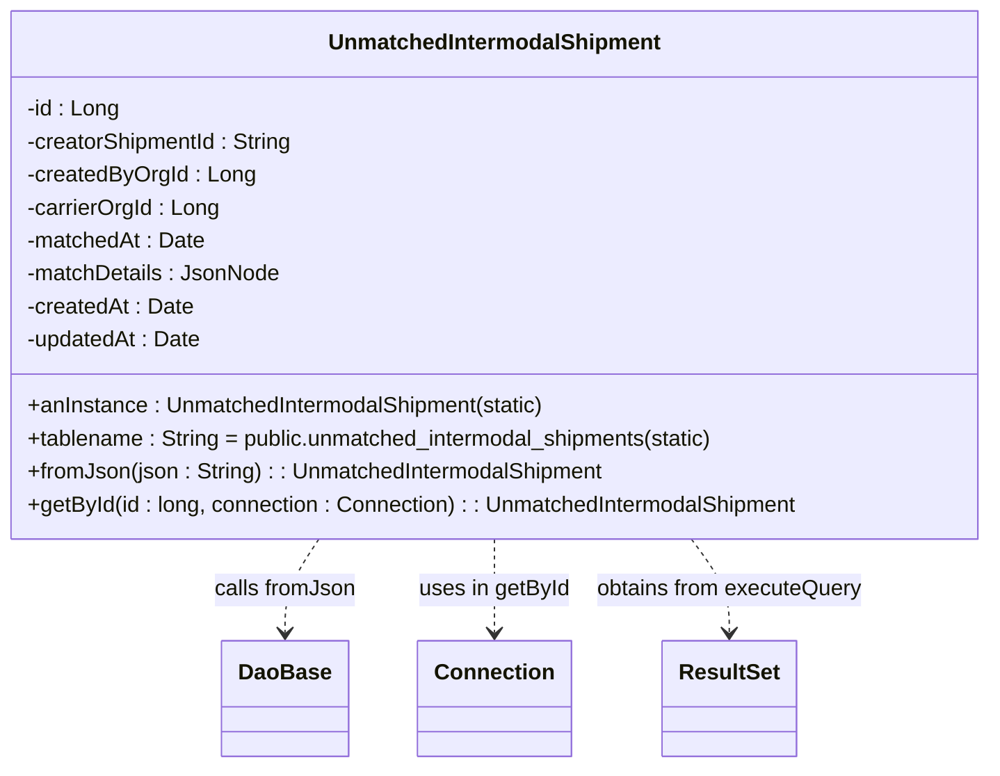

# Diagram: platform-java-lambdas/shipment/src/main/java/com/freightverify/shipment/datastore/postgresql/dao/UnmatchedIntermodalShipment.java


> Auto-generated by Obscura crawlers

## Diagram 1



### SVG

<svg id="container" width="725" xmlns="http://www.w3.org/2000/svg" class="classDiagram" height="558" viewBox="0 0 725 558" role="graphics-document document" aria-roledescription="class"><style>#container{font-family:"trebuchet ms",verdana,arial,sans-serif;font-size:16px;fill:#333;}@keyframes edge-animation-frame{from{stroke-dashoffset:0;}}@keyframes dash{to{stroke-dashoffset:0;}}#container .edge-animation-slow{stroke-dasharray:9,5!important;stroke-dashoffset:900;animation:dash 50s linear infinite;stroke-linecap:round;}#container .edge-animation-fast{stroke-dasharray:9,5!important;stroke-dashoffset:900;animation:dash 20s linear infinite;stroke-linecap:round;}#container .error-icon{fill:#552222;}#container .error-text{fill:#552222;stroke:#552222;}#container .edge-thickness-normal{stroke-width:1px;}#container .edge-thickness-thick{stroke-width:3.5px;}#container .edge-pattern-solid{stroke-dasharray:0;}#container .edge-thickness-invisible{stroke-width:0;fill:none;}#container .edge-pattern-dashed{stroke-dasharray:3;}#container .edge-pattern-dotted{stroke-dasharray:2;}#container .marker{fill:#333333;stroke:#333333;}#container .marker.cross{stroke:#333333;}#container svg{font-family:"trebuchet ms",verdana,arial,sans-serif;font-size:16px;}#container p{margin:0;}#container g.classGroup text{fill:#9370DB;stroke:none;font-family:"trebuchet ms",verdana,arial,sans-serif;font-size:10px;}#container g.classGroup text .title{font-weight:bolder;}#container .nodeLabel,#container .edgeLabel{color:#131300;}#container .edgeLabel .label rect{fill:#ECECFF;}#container .label text{fill:#131300;}#container .labelBkg{background:#ECECFF;}#container .edgeLabel .label span{background:#ECECFF;}#container .classTitle{font-weight:bolder;}#container .node rect,#container .node circle,#container .node ellipse,#container .node polygon,#container .node path{fill:#ECECFF;stroke:#9370DB;stroke-width:1px;}#container .divider{stroke:#9370DB;stroke-width:1;}#container g.clickable{cursor:pointer;}#container g.classGroup rect{fill:#ECECFF;stroke:#9370DB;}#container g.classGroup line{stroke:#9370DB;stroke-width:1;}#container .classLabel .box{stroke:none;stroke-width:0;fill:#ECECFF;opacity:0.5;}#container .classLabel .label{fill:#9370DB;font-size:10px;}#container .relation{stroke:#333333;stroke-width:1;fill:none;}#container .dashed-line{stroke-dasharray:3;}#container .dotted-line{stroke-dasharray:1 2;}#container #compositionStart,#container .composition{fill:#333333!important;stroke:#333333!important;stroke-width:1;}#container #compositionEnd,#container .composition{fill:#333333!important;stroke:#333333!important;stroke-width:1;}#container #dependencyStart,#container .dependency{fill:#333333!important;stroke:#333333!important;stroke-width:1;}#container #dependencyStart,#container .dependency{fill:#333333!important;stroke:#333333!important;stroke-width:1;}#container #extensionStart,#container .extension{fill:transparent!important;stroke:#333333!important;stroke-width:1;}#container #extensionEnd,#container .extension{fill:transparent!important;stroke:#333333!important;stroke-width:1;}#container #aggregationStart,#container .aggregation{fill:transparent!important;stroke:#333333!important;stroke-width:1;}#container #aggregationEnd,#container .aggregation{fill:transparent!important;stroke:#333333!important;stroke-width:1;}#container #lollipopStart,#container .lollipop{fill:#ECECFF!important;stroke:#333333!important;stroke-width:1;}#container #lollipopEnd,#container .lollipop{fill:#ECECFF!important;stroke:#333333!important;stroke-width:1;}#container .edgeTerminals{font-size:11px;line-height:initial;}#container .classTitleText{text-anchor:middle;font-size:18px;fill:#333;}#container .label-icon{display:inline-block;height:1em;overflow:visible;vertical-align:-0.125em;}#container .node .label-icon path{fill:currentColor;stroke:revert;stroke-width:revert;}#container :root{--mermaid-font-family:"trebuchet ms",verdana,arial,sans-serif;}</style><g><defs><marker id="container_class-aggregationStart" class="marker aggregation class" refX="18" refY="7" markerWidth="190" markerHeight="240" orient="auto"><path d="M 18,7 L9,13 L1,7 L9,1 Z"></path></marker></defs><defs><marker id="container_class-aggregationEnd" class="marker aggregation class" refX="1" refY="7" markerWidth="20" markerHeight="28" orient="auto"><path d="M 18,7 L9,13 L1,7 L9,1 Z"></path></marker></defs><defs><marker id="container_class-extensionStart" class="marker extension class" refX="18" refY="7" markerWidth="190" markerHeight="240" orient="auto"><path d="M 1,7 L18,13 V 1 Z"></path></marker></defs><defs><marker id="container_class-extensionEnd" class="marker extension class" refX="1" refY="7" markerWidth="20" markerHeight="28" orient="auto"><path d="M 1,1 V 13 L18,7 Z"></path></marker></defs><defs><marker id="container_class-compositionStart" class="marker composition class" refX="18" refY="7" markerWidth="190" markerHeight="240" orient="auto"><path d="M 18,7 L9,13 L1,7 L9,1 Z"></path></marker></defs><defs><marker id="container_class-compositionEnd" class="marker composition class" refX="1" refY="7" markerWidth="20" markerHeight="28" orient="auto"><path d="M 18,7 L9,13 L1,7 L9,1 Z"></path></marker></defs><defs><marker id="container_class-dependencyStart" class="marker dependency class" refX="6" refY="7" markerWidth="190" markerHeight="240" orient="auto"><path d="M 5,7 L9,13 L1,7 L9,1 Z"></path></marker></defs><defs><marker id="container_class-dependencyEnd" class="marker dependency class" refX="13" refY="7" markerWidth="20" markerHeight="28" orient="auto"><path d="M 18,7 L9,13 L14,7 L9,1 Z"></path></marker></defs><defs><marker id="container_class-lollipopStart" class="marker lollipop class" refX="13" refY="7" markerWidth="190" markerHeight="240" orient="auto"><circle stroke="black" fill="transparent" cx="7" cy="7" r="6"></circle></marker></defs><defs><marker id="container_class-lollipopEnd" class="marker lollipop class" refX="1" refY="7" markerWidth="190" markerHeight="240" orient="auto"><circle stroke="black" fill="transparent" cx="7" cy="7" r="6"></circle></marker></defs><g class="root"><g class="clusters"></g><g class="edgePaths"><path d="M239.303,392L235.347,398.167C231.39,404.333,223.476,416.667,219.519,428C215.563,439.333,215.563,449.667,215.563,454.833L215.563,460" id="id_UnmatchedIntermodalShipment_DaoBase_1" class="edge-thickness-normal edge-pattern-dashed relation" style=";;;" data-edge="true" data-et="edge" data-id="id_UnmatchedIntermodalShipment_DaoBase_1" data-points="W3sieCI6MjM5LjMwMzQ5MzQ0OTc4MTY2LCJ5IjozOTJ9LHsieCI6MjE1LjU2MjUsInkiOjQyOX0seyJ4IjoyMTUuNTYyNSwieSI6NDY2fV0=" marker-end="url(#container_class-dependencyEnd)"></path><path d="M362.5,392L362.5,398.167C362.5,404.333,362.5,416.667,362.5,428C362.5,439.333,362.5,449.667,362.5,454.833L362.5,460" id="id_UnmatchedIntermodalShipment_Connection_2" class="edge-thickness-normal edge-pattern-dashed relation" style=";;;" data-edge="true" data-et="edge" data-id="id_UnmatchedIntermodalShipment_Connection_2" data-points="W3sieCI6MzYyLjUsInkiOjM5Mn0seyJ4IjozNjIuNSwieSI6NDI5fSx7IngiOjM2Mi41LCJ5Ijo0NjZ9XQ==" marker-end="url(#container_class-dependencyEnd)"></path><path d="M507.581,392L512.24,398.167C516.9,404.333,526.22,416.667,530.879,428C535.539,439.333,535.539,449.667,535.539,454.833L535.539,460" id="id_UnmatchedIntermodalShipment_ResultSet_3" class="edge-thickness-normal edge-pattern-dashed relation" style=";;;" data-edge="true" data-et="edge" data-id="id_UnmatchedIntermodalShipment_ResultSet_3" data-points="W3sieCI6NTA3LjU4MDc4NjAyNjIwMDksInkiOjM5Mn0seyJ4Ijo1MzUuNTM5MDYyNSwieSI6NDI5fSx7IngiOjUzNS41MzkwNjI1LCJ5Ijo0NjZ9XQ==" marker-end="url(#container_class-dependencyEnd)"></path></g><g class="edgeLabels"><g class="edgeLabel" transform="translate(215.5625, 429)"><g class="label" data-id="id_UnmatchedIntermodalShipment_DaoBase_1" transform="translate(-51.15625, -12)"><foreignObject width="102.3125" height="24"><div xmlns="http://www.w3.org/1999/xhtml" class="labelBkg" style="display: table-cell; white-space: nowrap; line-height: 1.5; max-width: 200px; text-align: center;"><span class="edgeLabel"><p>calls fromJson</p></span></div></foreignObject></g></g><g class="edgeLabel" transform="translate(362.5, 429)"><g class="label" data-id="id_UnmatchedIntermodalShipment_Connection_2" transform="translate(-54.8984375, -12)"><foreignObject width="109.796875" height="24"><div xmlns="http://www.w3.org/1999/xhtml" class="labelBkg" style="display: table-cell; white-space: nowrap; line-height: 1.5; max-width: 200px; text-align: center;"><span class="edgeLabel"><p>uses in getById</p></span></div></foreignObject></g></g><g class="edgeLabel" transform="translate(535.5390625, 429)"><g class="label" data-id="id_UnmatchedIntermodalShipment_ResultSet_3" transform="translate(-98.140625, -12)"><foreignObject width="196.28125" height="24"><div xmlns="http://www.w3.org/1999/xhtml" class="labelBkg" style="display: table-cell; white-space: nowrap; line-height: 1.5; max-width: 200px; text-align: center;"><span class="edgeLabel"><p>obtains from executeQuery</p></span></div></foreignObject></g></g></g><g class="nodes"><g class="node default" id="classId-UnmatchedIntermodalShipment-0" transform="translate(362.5, 200)"><g class="basic label-container"><path d="M-354.5 -192 L354.5 -192 L354.5 192 L-354.5 192" stroke="none" stroke-width="0" fill="#ECECFF" style=""></path><path d="M-354.5 -192 C-134.55963286377158 -192, 85.38073427245683 -192, 354.5 -192 M-354.5 -192 C-96.72939777309227 -192, 161.04120445381545 -192, 354.5 -192 M354.5 -192 C354.5 -54.50066747326062, 354.5 82.99866505347876, 354.5 192 M354.5 -192 C354.5 -46.45342141539743, 354.5 99.09315716920514, 354.5 192 M354.5 192 C116.78961281620064 192, -120.92077436759871 192, -354.5 192 M354.5 192 C113.73885609195912 192, -127.02228781608176 192, -354.5 192 M-354.5 192 C-354.5 82.8672744117375, -354.5 -26.265451176525005, -354.5 -192 M-354.5 192 C-354.5 92.50981017695261, -354.5 -6.980379646094775, -354.5 -192" stroke="#9370DB" stroke-width="1.3" fill="none" stroke-dasharray="0 0" style=""></path></g><g class="annotation-group text" transform="translate(0, -168)"></g><g class="label-group text" transform="translate(-117.125, -168)"><g class="label" style="font-weight: bolder" transform="translate(0,-12)"><foreignObject width="234.25" height="24"><div xmlns="http://www.w3.org/1999/xhtml" style="display: table-cell; white-space: nowrap; line-height: 1.5; max-width: 284px; text-align: center;"><span class="nodeLabel markdown-node-label" style=""><p>UnmatchedIntermodalShipment</p></span></div></foreignObject></g></g><g class="members-group text" transform="translate(-342.5, -120)"><g class="label" style="" transform="translate(0,-12)"><foreignObject width="67.46875" height="24"><div xmlns="http://www.w3.org/1999/xhtml" style="display: table-cell; white-space: nowrap; line-height: 1.5; max-width: 125px; text-align: center;"><span class="nodeLabel markdown-node-label" style=""><p>-id : Long</p></span></div></foreignObject></g><g class="label" style="" transform="translate(0,12)"><foreignObject width="197.296875" height="24"><div xmlns="http://www.w3.org/1999/xhtml" style="display: table-cell; white-space: nowrap; line-height: 1.5; max-width: 255px; text-align: center;"><span class="nodeLabel markdown-node-label" style=""><p>-creatorShipmentId : String</p></span></div></foreignObject></g><g class="label" style="" transform="translate(0,36)"><foreignObject width="165.03125" height="24"><div xmlns="http://www.w3.org/1999/xhtml" style="display: table-cell; white-space: nowrap; line-height: 1.5; max-width: 223px; text-align: center;"><span class="nodeLabel markdown-node-label" style=""><p>-createdByOrgId : Long</p></span></div></foreignObject></g><g class="label" style="" transform="translate(0,60)"><foreignObject width="140.953125" height="24"><div xmlns="http://www.w3.org/1999/xhtml" style="display: table-cell; white-space: nowrap; line-height: 1.5; max-width: 199px; text-align: center;"><span class="nodeLabel markdown-node-label" style=""><p>-carrierOrgId : Long</p></span></div></foreignObject></g><g class="label" style="" transform="translate(0,84)"><foreignObject width="130.09375" height="24"><div xmlns="http://www.w3.org/1999/xhtml" style="display: table-cell; white-space: nowrap; line-height: 1.5; max-width: 187px; text-align: center;"><span class="nodeLabel markdown-node-label" style=""><p>-matchedAt : Date</p></span></div></foreignObject></g><g class="label" style="" transform="translate(0,108)"><foreignObject width="183.453125" height="24"><div xmlns="http://www.w3.org/1999/xhtml" style="display: table-cell; white-space: nowrap; line-height: 1.5; max-width: 241px; text-align: center;"><span class="nodeLabel markdown-node-label" style=""><p>-matchDetails : JsonNode</p></span></div></foreignObject></g><g class="label" style="" transform="translate(0,132)"><foreignObject width="121.25" height="24"><div xmlns="http://www.w3.org/1999/xhtml" style="display: table-cell; white-space: nowrap; line-height: 1.5; max-width: 179px; text-align: center;"><span class="nodeLabel markdown-node-label" style=""><p>-createdAt : Date</p></span></div></foreignObject></g><g class="label" style="" transform="translate(0,156)"><foreignObject width="127.734375" height="24"><div xmlns="http://www.w3.org/1999/xhtml" style="display: table-cell; white-space: nowrap; line-height: 1.5; max-width: 185px; text-align: center;"><span class="nodeLabel markdown-node-label" style=""><p>-updatedAt : Date</p></span></div></foreignObject></g></g><g class="methods-group text" transform="translate(-342.5, 96)"><g class="label" style="" transform="translate(0,-12)"><foreignObject width="382.96875" height="24"><div xmlns="http://www.w3.org/1999/xhtml" style="display: table-cell; white-space: nowrap; line-height: 1.5; max-width: 440px; text-align: center;"><span class="nodeLabel markdown-node-label" style=""><p>+anInstance : UnmatchedIntermodalShipment(static)</p></span></div></foreignObject></g><g class="label" style="" transform="translate(0,12)"><foreignObject width="511.140625" height="24"><div xmlns="http://www.w3.org/1999/xhtml" style="display: table-cell; white-space: nowrap; line-height: 1.5; max-width: 569px; text-align: center;"><span class="nodeLabel markdown-node-label" style=""><p>+tablename : String = public.unmatched_intermodal_shipments(static)</p></span></div></foreignObject></g><g class="label" style="" transform="translate(0,36)"><foreignObject width="423.46875" height="24"><div xmlns="http://www.w3.org/1999/xhtml" style="display: table-cell; white-space: nowrap; line-height: 1.5; max-width: 481px; text-align: center;"><span class="nodeLabel markdown-node-label" style=""><p>+fromJson(json : String) : : UnmatchedIntermodalShipment</p></span></div></foreignObject></g><g class="label" style="" transform="translate(0,60)"><foreignObject width="567.875" height="24"><div xmlns="http://www.w3.org/1999/xhtml" style="display: table-cell; white-space: nowrap; line-height: 1.5; max-width: 625px; text-align: center;"><span class="nodeLabel markdown-node-label" style=""><p>+getById(id : long, connection : Connection) : : UnmatchedIntermodalShipment</p></span></div></foreignObject></g></g><g class="divider" style=""><path d="M-354.5 -144 C-122.62977609195619 -144, 109.24044781608762 -144, 354.5 -144 M-354.5 -144 C-210.08000742200255 -144, -65.6600148440051 -144, 354.5 -144" stroke="#9370DB" stroke-width="1.3" fill="none" stroke-dasharray="0 0" style=""></path></g><g class="divider" style=""><path d="M-354.5 72 C-183.44377371428078 72, -12.387547428561561 72, 354.5 72 M-354.5 72 C-91.16442207090233 72, 172.17115585819533 72, 354.5 72" stroke="#9370DB" stroke-width="1.3" fill="none" stroke-dasharray="0 0" style=""></path></g></g><g class="node default" id="classId-DaoBase-1" transform="translate(215.5625, 508)"><g class="basic label-container"><path d="M-43.7109375 -42 L43.7109375 -42 L43.7109375 42 L-43.7109375 42" stroke="none" stroke-width="0" fill="#ECECFF" style=""></path><path d="M-43.7109375 -42 C-23.84725012914652 -42, -3.98356275829304 -42, 43.7109375 -42 M-43.7109375 -42 C-20.99308450719526 -42, 1.7247684856094807 -42, 43.7109375 -42 M43.7109375 -42 C43.7109375 -11.690406118656057, 43.7109375 18.619187762687886, 43.7109375 42 M43.7109375 -42 C43.7109375 -15.994852838968828, 43.7109375 10.010294322062343, 43.7109375 42 M43.7109375 42 C22.863637143752182 42, 2.0163367875043647 42, -43.7109375 42 M43.7109375 42 C25.192694824851905 42, 6.674452149703811 42, -43.7109375 42 M-43.7109375 42 C-43.7109375 13.484075114742488, -43.7109375 -15.031849770515024, -43.7109375 -42 M-43.7109375 42 C-43.7109375 16.870408937959873, -43.7109375 -8.259182124080255, -43.7109375 -42" stroke="#9370DB" stroke-width="1.3" fill="none" stroke-dasharray="0 0" style=""></path></g><g class="annotation-group text" transform="translate(0, -18)"></g><g class="label-group text" transform="translate(-31.7109375, -18)"><g class="label" style="font-weight: bolder" transform="translate(0,-12)"><foreignObject width="63.421875" height="24"><div xmlns="http://www.w3.org/1999/xhtml" style="display: table-cell; white-space: nowrap; line-height: 1.5; max-width: 113px; text-align: center;"><span class="nodeLabel markdown-node-label" style=""><p>DaoBase</p></span></div></foreignObject></g></g><g class="members-group text" transform="translate(-31.7109375, 30)"></g><g class="methods-group text" transform="translate(-31.7109375, 60)"></g><g class="divider" style=""><path d="M-43.7109375 6 C-24.026140088638705 6, -4.34134267727741 6, 43.7109375 6 M-43.7109375 6 C-11.019554102016357 6, 21.671829295967285 6, 43.7109375 6" stroke="#9370DB" stroke-width="1.3" fill="none" stroke-dasharray="0 0" style=""></path></g><g class="divider" style=""><path d="M-43.7109375 24 C-11.068712700351753 24, 21.573512099296494 24, 43.7109375 24 M-43.7109375 24 C-11.67280719188615 24, 20.3653231162277 24, 43.7109375 24" stroke="#9370DB" stroke-width="1.3" fill="none" stroke-dasharray="0 0" style=""></path></g></g><g class="node default" id="classId-Connection-2" transform="translate(362.5, 508)"><g class="basic label-container"><path d="M-53.2265625 -42 L53.2265625 -42 L53.2265625 42 L-53.2265625 42" stroke="none" stroke-width="0" fill="#ECECFF" style=""></path><path d="M-53.2265625 -42 C-22.838701062346814 -42, 7.549160375306371 -42, 53.2265625 -42 M-53.2265625 -42 C-19.320151644852594 -42, 14.586259210294813 -42, 53.2265625 -42 M53.2265625 -42 C53.2265625 -21.697357326879978, 53.2265625 -1.394714653759955, 53.2265625 42 M53.2265625 -42 C53.2265625 -24.56541007195198, 53.2265625 -7.130820143903961, 53.2265625 42 M53.2265625 42 C30.037507159359162 42, 6.848451818718324 42, -53.2265625 42 M53.2265625 42 C27.741267263984813 42, 2.2559720279696265 42, -53.2265625 42 M-53.2265625 42 C-53.2265625 17.449820668688886, -53.2265625 -7.100358662622227, -53.2265625 -42 M-53.2265625 42 C-53.2265625 13.6121026195923, -53.2265625 -14.775794760815401, -53.2265625 -42" stroke="#9370DB" stroke-width="1.3" fill="none" stroke-dasharray="0 0" style=""></path></g><g class="annotation-group text" transform="translate(0, -18)"></g><g class="label-group text" transform="translate(-41.2265625, -18)"><g class="label" style="font-weight: bolder" transform="translate(0,-12)"><foreignObject width="82.453125" height="24"><div xmlns="http://www.w3.org/1999/xhtml" style="display: table-cell; white-space: nowrap; line-height: 1.5; max-width: 132px; text-align: center;"><span class="nodeLabel markdown-node-label" style=""><p>Connection</p></span></div></foreignObject></g></g><g class="members-group text" transform="translate(-41.2265625, 30)"></g><g class="methods-group text" transform="translate(-41.2265625, 60)"></g><g class="divider" style=""><path d="M-53.2265625 6 C-23.550195204212866 6, 6.126172091574269 6, 53.2265625 6 M-53.2265625 6 C-20.294021506238494 6, 12.638519487523013 6, 53.2265625 6" stroke="#9370DB" stroke-width="1.3" fill="none" stroke-dasharray="0 0" style=""></path></g><g class="divider" style=""><path d="M-53.2265625 24 C-14.148130246306486 24, 24.930302007387027 24, 53.2265625 24 M-53.2265625 24 C-31.89594898536012 24, -10.565335470720242 24, 53.2265625 24" stroke="#9370DB" stroke-width="1.3" fill="none" stroke-dasharray="0 0" style=""></path></g></g><g class="node default" id="classId-ResultSet-3" transform="translate(535.5390625, 508)"><g class="basic label-container"><path d="M-47.21875 -42 L47.21875 -42 L47.21875 42 L-47.21875 42" stroke="none" stroke-width="0" fill="#ECECFF" style=""></path><path d="M-47.21875 -42 C-24.299200348525588 -42, -1.3796506970511757 -42, 47.21875 -42 M-47.21875 -42 C-13.275142243102955 -42, 20.66846551379409 -42, 47.21875 -42 M47.21875 -42 C47.21875 -8.552808600248362, 47.21875 24.894382799503276, 47.21875 42 M47.21875 -42 C47.21875 -13.601262787642575, 47.21875 14.79747442471485, 47.21875 42 M47.21875 42 C19.40395057701258 42, -8.41084884597484 42, -47.21875 42 M47.21875 42 C17.074725797953512 42, -13.069298404092976 42, -47.21875 42 M-47.21875 42 C-47.21875 8.733024313500948, -47.21875 -24.533951372998104, -47.21875 -42 M-47.21875 42 C-47.21875 13.69253824790674, -47.21875 -14.614923504186521, -47.21875 -42" stroke="#9370DB" stroke-width="1.3" fill="none" stroke-dasharray="0 0" style=""></path></g><g class="annotation-group text" transform="translate(0, -18)"></g><g class="label-group text" transform="translate(-35.21875, -18)"><g class="label" style="font-weight: bolder" transform="translate(0,-12)"><foreignObject width="70.4375" height="24"><div xmlns="http://www.w3.org/1999/xhtml" style="display: table-cell; white-space: nowrap; line-height: 1.5; max-width: 119px; text-align: center;"><span class="nodeLabel markdown-node-label" style=""><p>ResultSet</p></span></div></foreignObject></g></g><g class="members-group text" transform="translate(-35.21875, 30)"></g><g class="methods-group text" transform="translate(-35.21875, 60)"></g><g class="divider" style=""><path d="M-47.21875 6 C-27.82863135257518 6, -8.438512705150359 6, 47.21875 6 M-47.21875 6 C-20.09028502446512 6, 7.038179951069758 6, 47.21875 6" stroke="#9370DB" stroke-width="1.3" fill="none" stroke-dasharray="0 0" style=""></path></g><g class="divider" style=""><path d="M-47.21875 24 C-14.553078887884801 24, 18.112592224230397 24, 47.21875 24 M-47.21875 24 C-17.32933748152288 24, 12.560075036954238 24, 47.21875 24" stroke="#9370DB" stroke-width="1.3" fill="none" stroke-dasharray="0 0" style=""></path></g></g></g></g></g></svg>

## Diagram 2

```mermaid
flowchart TD
    A([getById(id, connection)])
    A --> B[executeQuery(select row_to_json(row) from public.unmatched_intermodal_shipments where id = id)]
    B --> C{results.next()}
    C -- Yes --> D[json = results.getString(1)]
    D --> E[retval = UnmatchedIntermodalShipment.fromJson(json)]
    E --> F[ResultSet closed (try-with-resources)]
    F --> G[/return retval/]
    C -- No --> H[ResultSet closed (try-with-resources)]
    H --> I[/return null/]
```

> SVG rendering failed for this diagram.
