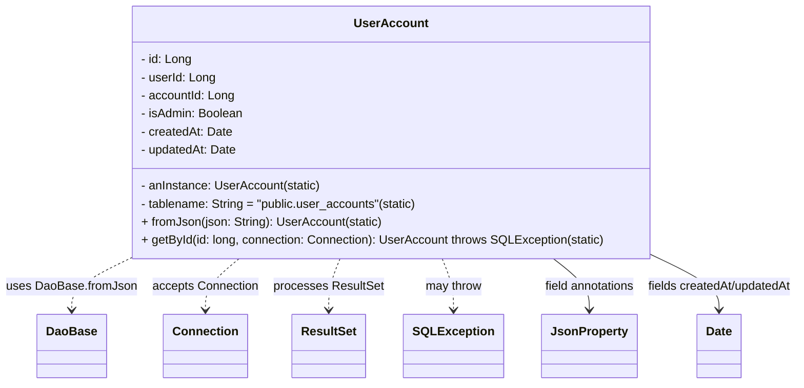
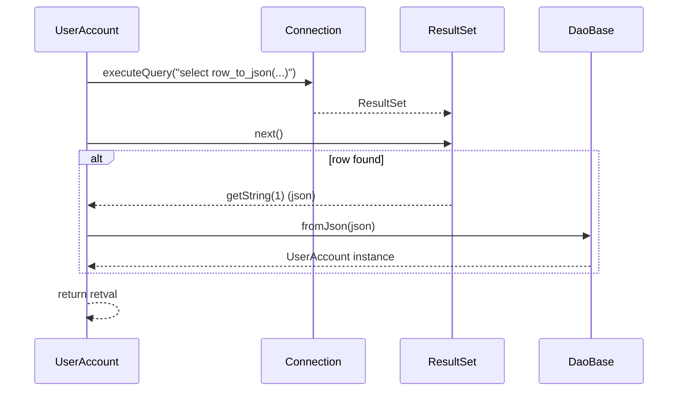

# Diagram: platform-java-lambdas/shipment/src/main/java/com/freightverify/shipment/datastore/postgresql/dao/UserAccount.java

> Auto-generated by Obscura crawlers

## Diagram 1

### SVG

<svg id="container" width="1047.3828125" xmlns="http://www.w3.org/2000/svg" class="classDiagram" height="510" viewBox="0 0 1047.3828125 510" role="graphics-document document" aria-roledescription="class"><g><defs><marker id="container_class-aggregationStart" class="marker aggregation class" refX="18" refY="7" markerWidth="190" markerHeight="240" orient="auto"><path d="M 18,7 L9,13 L1,7 L9,1 Z"></path></marker></defs><defs><marker id="container_class-aggregationEnd" class="marker aggregation class" refX="1" refY="7" markerWidth="20" markerHeight="28" orient="auto"><path d="M 18,7 L9,13 L1,7 L9,1 Z"></path></marker></defs><defs><marker id="container_class-extensionStart" class="marker extension class" refX="18" refY="7" markerWidth="190" markerHeight="240" orient="auto"><path d="M 1,7 L18,13 V 1 Z"></path></marker></defs><defs><marker id="container_class-extensionEnd" class="marker extension class" refX="1" refY="7" markerWidth="20" markerHeight="28" orient="auto"><path d="M 1,1 V 13 L18,7 Z"></path></marker></defs><defs><marker id="container_class-compositionStart" class="marker composition class" refX="18" refY="7" markerWidth="190" markerHeight="240" orient="auto"><path d="M 18,7 L9,13 L1,7 L9,1 Z"></path></marker></defs><defs><marker id="container_class-compositionEnd" class="marker composition class" refX="1" refY="7" markerWidth="20" markerHeight="28" orient="auto"><path d="M 18,7 L9,13 L1,7 L9,1 Z"></path></marker></defs><defs><marker id="container_class-dependencyStart" class="marker dependency class" refX="6" refY="7" markerWidth="190" markerHeight="240" orient="auto"><path d="M 5,7 L9,13 L1,7 L9,1 Z"></path></marker></defs><defs><marker id="container_class-dependencyEnd" class="marker dependency class" refX="13" refY="7" markerWidth="20" markerHeight="28" orient="auto"><path d="M 18,7 L9,13 L14,7 L9,1 Z"></path></marker></defs><defs><marker id="container_class-lollipopStart" class="marker lollipop class" refX="13" refY="7" markerWidth="190" markerHeight="240" orient="auto"><circle stroke="black" fill="transparent" cx="7" cy="7" r="6"></circle></marker></defs><defs><marker id="container_class-lollipopEnd" class="marker lollipop class" refX="1" refY="7" markerWidth="190" markerHeight="240" orient="auto"><circle stroke="black" fill="transparent" cx="7" cy="7" r="6"></circle></marker></defs><g class="root"><g class="clusters"></g><g class="edgePaths"><path d="M167.561,344L155.011,350.167C142.46,356.333,117.359,368.667,104.808,380C92.258,391.333,92.258,401.667,92.258,406.833L92.258,412" id="id_UserAccount_DaoBase_1" class="edge-thickness-normal edge-pattern-dashed relation" style=";;;" data-edge="true" data-et="edge" data-id="id_UserAccount_DaoBase_1" data-points="W3sieCI6MTY3LjU2MTQxMzg3MTk1MTIzLCJ5IjozNDR9LHsieCI6OTIuMjU3ODEyNSwieSI6MzgxfSx7IngiOjkyLjI1NzgxMjUsInkiOjQxOH1d" marker-end="url(#container_class-dependencyEnd)"></path><path d="M310.854,344L303.564,350.167C296.273,356.333,281.691,368.667,274.4,380C267.109,391.333,267.109,401.667,267.109,406.833L267.109,412" id="id_UserAccount_Connection_2" class="edge-thickness-normal edge-pattern-dashed relation" style=";;;" data-edge="true" data-et="edge" data-id="id_UserAccount_Connection_2" data-points="W3sieCI6MzEwLjg1NDQwMTY3NjgyOTMsInkiOjM0NH0seyJ4IjoyNjcuMTA5Mzc1LCJ5IjozODF9LHsieCI6MjY3LjEwOTM3NSwieSI6NDE4fV0=" marker-end="url(#container_class-dependencyEnd)"></path><path d="M444.281,344L441.888,350.167C439.495,356.333,434.708,368.667,432.315,380C429.922,391.333,429.922,401.667,429.922,406.833L429.922,412" id="id_UserAccount_ResultSet_3" class="edge-thickness-normal edge-pattern-dashed relation" style=";;;" data-edge="true" data-et="edge" data-id="id_UserAccount_ResultSet_3" data-points="W3sieCI6NDQ0LjI4MTIzMDk0NTEyMTkzLCJ5IjozNDR9LHsieCI6NDI5LjkyMTg3NSwieSI6MzgxfSx7IngiOjQyOS45MjE4NzUsInkiOjQxOH1d" marker-end="url(#container_class-dependencyEnd)"></path><path d="M574.68,344L577.073,350.167C579.466,356.333,584.253,368.667,586.646,380C589.039,391.333,589.039,401.667,589.039,406.833L589.039,412" id="id_UserAccount_SQLException_4" class="edge-thickness-normal edge-pattern-dashed relation" style=";;;" data-edge="true" data-et="edge" data-id="id_UserAccount_SQLException_4" data-points="W3sieCI6NTc0LjY3OTcwNjU1NDg3ODEsInkiOjM0NH0seyJ4Ijo1ODkuMDM5MDYyNSwieSI6MzgxfSx7IngiOjU4OS4wMzkwNjI1LCJ5Ijo0MTh9XQ==" marker-end="url(#container_class-dependencyEnd)"></path><path d="M715.194,344L722.745,350.167C730.296,356.333,745.398,368.667,752.949,380C760.5,391.333,760.5,401.667,760.5,406.833L760.5,412" id="id_UserAccount_JsonProperty_5" class="edge-thickness-normal edge-pattern-solid relation" style=";;;" data-edge="true" data-et="edge" data-id="id_UserAccount_JsonProperty_5" data-points="W3sieCI6NzE1LjE5NDAzNTgyMzE3MDcsInkiOjM0NH0seyJ4Ijo3NjAuNSwieSI6MzgxfSx7IngiOjc2MC41LCJ5Ijo0MTh9XQ==" marker-end="url(#container_class-dependencyEnd)"></path><path d="M851.703,338.602L866.576,345.668C881.448,352.734,911.193,366.867,926.065,379.1C940.938,391.333,940.938,401.667,940.938,406.833L940.938,412" id="id_UserAccount_Date_6" class="edge-thickness-normal edge-pattern-solid relation" style=";;;" data-edge="true" data-et="edge" data-id="id_UserAccount_Date_6" data-points="W3sieCI6ODUxLjcwMzEyNSwieSI6MzM4LjYwMTY5NDgzODUyODZ9LHsieCI6OTQwLjkzNzUsInkiOjM4MX0seyJ4Ijo5NDAuOTM3NSwieSI6NDE4fV0=" marker-end="url(#container_class-dependencyEnd)"></path></g><g class="edgeLabels"><g class="edgeLabel" transform="translate(92.2578125, 381)"><g class="label" data-id="id_UserAccount_DaoBase_1" transform="translate(-84.2578125, -12)"><foreignObject width="168.515625" height="24">

uses DaoBase.fromJson

</foreignObject></g></g><g class="edgeLabel" transform="translate(267.109375, 381)"><g class="label" data-id="id_UserAccount_Connection_2" transform="translate(-70.59375, -12)"><foreignObject width="141.1875" height="24">

accepts Connection

</foreignObject></g></g><g class="edgeLabel" transform="translate(429.921875, 381)"><g class="label" data-id="id_UserAccount_ResultSet_3" transform="translate(-72.21875, -12)"><foreignObject width="144.4375" height="24">

processes ResultSet

</foreignObject></g></g><g class="edgeLabel" transform="translate(589.0390625, 381)"><g class="label" data-id="id_UserAccount_SQLException_4" transform="translate(-37.9765625, -12)"><foreignObject width="75.953125" height="24">

may throw

</foreignObject></g></g><g class="edgeLabel" transform="translate(760.5, 381)"><g class="label" data-id="id_UserAccount_JsonProperty_5" transform="translate(-61.9921875, -12)"><foreignObject width="123.984375" height="24">

field annotations

</foreignObject></g></g><g class="edgeLabel" transform="translate(940.9375, 381)"><g class="label" data-id="id_UserAccount_Date_6" transform="translate(-98.4453125, -12)"><foreignObject width="196.890625" height="24">

fields createdAt/updatedAt

</foreignObject></g></g></g><g class="nodes"><g class="node default" id="classId-UserAccount-0" transform="translate(509.48046875, 176)"><g class="basic label-container"><path d="M-342.22265625 -168 L342.22265625 -168 L342.22265625 168 L-342.22265625 168" stroke="none" stroke-width="0" fill="#ECECFF" style=""></path><path d="M-342.22265625 -168 C-125.97170114814446 -168, 90.27925395371108 -168, 342.22265625 -168 M-342.22265625 -168 C-115.33847322211363 -168, 111.54570980577273 -168, 342.22265625 -168 M342.22265625 -168 C342.22265625 -90.20433519685594, 342.22265625 -12.408670393711873, 342.22265625 168 M342.22265625 -168 C342.22265625 -60.5175946992063, 342.22265625 46.9648106015874, 342.22265625 168 M342.22265625 168 C152.30799428018742 168, -37.60666768962517 168, -342.22265625 168 M342.22265625 168 C136.4845281817335 168, -69.25359988653298 168, -342.22265625 168 M-342.22265625 168 C-342.22265625 68.53804577600397, -342.22265625 -30.923908447992062, -342.22265625 -168 M-342.22265625 168 C-342.22265625 99.48255824116004, -342.22265625 30.96511648232007, -342.22265625 -168" stroke="#9370DB" stroke-width="1.3" fill="none" stroke-dasharray="0 0" style=""></path></g><g class="annotation-group text" transform="translate(0, -144)"></g><g class="label-group text" transform="translate(-45.6796875, -144)"><g class="label" style="font-weight: bolder" transform="translate(0,-12)"><foreignObject width="91.359375" height="24">

UserAccount

</foreignObject></g></g><g class="members-group text" transform="translate(-330.22265625, -96)"><g class="label" style="" transform="translate(0,-12)"><foreignObject width="67.46875" height="24">

- id: Long

</foreignObject></g><g class="label" style="" transform="translate(0,12)"><foreignObject width="99.359375" height="24">

- userId: Long

</foreignObject></g><g class="label" style="" transform="translate(0,36)"><foreignObject width="124.84375" height="24">

- accountId: Long

</foreignObject></g><g class="label" style="" transform="translate(0,60)"><foreignObject width="136.765625" height="24">

- isAdmin: Boolean

</foreignObject></g><g class="label" style="" transform="translate(0,84)"><foreignObject width="121.3125" height="24">

- createdAt: Date

</foreignObject></g><g class="label" style="" transform="translate(0,108)"><foreignObject width="127.796875" height="24">

- updatedAt: Date

</foreignObject></g></g><g class="methods-group text" transform="translate(-330.22265625, 72)"><g class="label" style="" transform="translate(0,-12)"><foreignObject width="238.875" height="24">

- anInstance: UserAccount(static)

</foreignObject></g><g class="label" style="" transform="translate(0,12)"><foreignObject width="370.5625" height="24">

- tablename: String = "public.user_accounts"(static)

</foreignObject></g><g class="label" style="" transform="translate(0,36)"><foreignObject width="318.734375" height="24">

+ fromJson(json: String): UserAccount(static)

</foreignObject></g><g class="label" style="" transform="translate(0,60)"><foreignObject width="614.765625" height="24">

+ getById(id: long, connection: Connection): UserAccount throws SQLException(static)

</foreignObject></g></g><g class="divider" style=""><path d="M-342.22265625 -120 C-133.6024143329677 -120, 75.0178275840646 -120, 342.22265625 -120 M-342.22265625 -120 C-73.1487932944109 -120, 195.9250696611782 -120, 342.22265625 -120" stroke="#9370DB" stroke-width="1.3" fill="none" stroke-dasharray="0 0" style=""></path></g><g class="divider" style=""><path d="M-342.22265625 48 C-137.29032259816302 48, 67.64201105367397 48, 342.22265625 48 M-342.22265625 48 C-124.01793093231038 48, 94.18679438537924 48, 342.22265625 48" stroke="#9370DB" stroke-width="1.3" fill="none" stroke-dasharray="0 0" style=""></path></g></g><g class="node default" id="classId-DaoBase-1" transform="translate(92.2578125, 460)"><g class="basic label-container"><path d="M-43.7109375 -42 L43.7109375 -42 L43.7109375 42 L-43.7109375 42" stroke="none" stroke-width="0" fill="#ECECFF" style=""></path><path d="M-43.7109375 -42 C-22.307902563933474 -42, -0.904867627866949 -42, 43.7109375 -42 M-43.7109375 -42 C-17.201184124276534 -42, 9.308569251446933 -42, 43.7109375 -42 M43.7109375 -42 C43.7109375 -14.097949202102363, 43.7109375 13.804101595795274, 43.7109375 42 M43.7109375 -42 C43.7109375 -13.536041348389578, 43.7109375 14.927917303220845, 43.7109375 42 M43.7109375 42 C14.066581709615011 42, -15.577774080769977 42, -43.7109375 42 M43.7109375 42 C11.435040480588285 42, -20.84085653882343 42, -43.7109375 42 M-43.7109375 42 C-43.7109375 12.212828102597733, -43.7109375 -17.574343794804534, -43.7109375 -42 M-43.7109375 42 C-43.7109375 9.26543119851894, -43.7109375 -23.46913760296212, -43.7109375 -42" stroke="#9370DB" stroke-width="1.3" fill="none" stroke-dasharray="0 0" style=""></path></g><g class="annotation-group text" transform="translate(0, -18)"></g><g class="label-group text" transform="translate(-31.7109375, -18)"><g class="label" style="font-weight: bolder" transform="translate(0,-12)"><foreignObject width="63.421875" height="24">

DaoBase

</foreignObject></g></g><g class="members-group text" transform="translate(-31.7109375, 30)"></g><g class="methods-group text" transform="translate(-31.7109375, 60)"></g><g class="divider" style=""><path d="M-43.7109375 6 C-21.13034543816172 6, 1.4502466236765628 6, 43.7109375 6 M-43.7109375 6 C-19.16452723209208 6, 5.381883035815839 6, 43.7109375 6" stroke="#9370DB" stroke-width="1.3" fill="none" stroke-dasharray="0 0" style=""></path></g><g class="divider" style=""><path d="M-43.7109375 24 C-25.821889533844924 24, -7.932841567689849 24, 43.7109375 24 M-43.7109375 24 C-9.964052353922312 24, 23.782832792155375 24, 43.7109375 24" stroke="#9370DB" stroke-width="1.3" fill="none" stroke-dasharray="0 0" style=""></path></g></g><g class="node default" id="classId-Connection-2" transform="translate(267.109375, 460)"><g class="basic label-container"><path d="M-53.2265625 -42 L53.2265625 -42 L53.2265625 42 L-53.2265625 42" stroke="none" stroke-width="0" fill="#ECECFF" style=""></path><path d="M-53.2265625 -42 C-28.544202827916806 -42, -3.8618431558336113 -42, 53.2265625 -42 M-53.2265625 -42 C-16.075763146638273 -42, 21.075036206723453 -42, 53.2265625 -42 M53.2265625 -42 C53.2265625 -10.71282660510715, 53.2265625 20.5743467897857, 53.2265625 42 M53.2265625 -42 C53.2265625 -20.285146780252603, 53.2265625 1.4297064394947938, 53.2265625 42 M53.2265625 42 C12.834162313751172 42, -27.558237872497656 42, -53.2265625 42 M53.2265625 42 C26.97351046038901 42, 0.7204584207780229 42, -53.2265625 42 M-53.2265625 42 C-53.2265625 17.179841765935976, -53.2265625 -7.640316468128049, -53.2265625 -42 M-53.2265625 42 C-53.2265625 19.504169053580426, -53.2265625 -2.991661892839147, -53.2265625 -42" stroke="#9370DB" stroke-width="1.3" fill="none" stroke-dasharray="0 0" style=""></path></g><g class="annotation-group text" transform="translate(0, -18)"></g><g class="label-group text" transform="translate(-41.2265625, -18)"><g class="label" style="font-weight: bolder" transform="translate(0,-12)"><foreignObject width="82.453125" height="24">

Connection

</foreignObject></g></g><g class="members-group text" transform="translate(-41.2265625, 30)"></g><g class="methods-group text" transform="translate(-41.2265625, 60)"></g><g class="divider" style=""><path d="M-53.2265625 6 C-20.351083814065554 6, 12.524394871868893 6, 53.2265625 6 M-53.2265625 6 C-17.473403078597208 6, 18.279756342805584 6, 53.2265625 6" stroke="#9370DB" stroke-width="1.3" fill="none" stroke-dasharray="0 0" style=""></path></g><g class="divider" style=""><path d="M-53.2265625 24 C-14.932559872117295 24, 23.36144275576541 24, 53.2265625 24 M-53.2265625 24 C-21.333422945843967 24, 10.559716608312065 24, 53.2265625 24" stroke="#9370DB" stroke-width="1.3" fill="none" stroke-dasharray="0 0" style=""></path></g></g><g class="node default" id="classId-ResultSet-3" transform="translate(429.921875, 460)"><g class="basic label-container"><path d="M-47.21875 -42 L47.21875 -42 L47.21875 42 L-47.21875 42" stroke="none" stroke-width="0" fill="#ECECFF" style=""></path><path d="M-47.21875 -42 C-11.051232102378613 -42, 25.116285795242774 -42, 47.21875 -42 M-47.21875 -42 C-27.612592415053896 -42, -8.006434830107793 -42, 47.21875 -42 M47.21875 -42 C47.21875 -9.340281326994422, 47.21875 23.319437346011156, 47.21875 42 M47.21875 -42 C47.21875 -8.42675608758973, 47.21875 25.14648782482054, 47.21875 42 M47.21875 42 C27.168622159529576 42, 7.1184943190591525 42, -47.21875 42 M47.21875 42 C16.17288793642773 42, -14.872974127144538 42, -47.21875 42 M-47.21875 42 C-47.21875 22.676119835775246, -47.21875 3.3522396715504925, -47.21875 -42 M-47.21875 42 C-47.21875 21.728367989550893, -47.21875 1.4567359791017864, -47.21875 -42" stroke="#9370DB" stroke-width="1.3" fill="none" stroke-dasharray="0 0" style=""></path></g><g class="annotation-group text" transform="translate(0, -18)"></g><g class="label-group text" transform="translate(-35.21875, -18)"><g class="label" style="font-weight: bolder" transform="translate(0,-12)"><foreignObject width="70.4375" height="24">

ResultSet

</foreignObject></g></g><g class="members-group text" transform="translate(-35.21875, 30)"></g><g class="methods-group text" transform="translate(-35.21875, 60)"></g><g class="divider" style=""><path d="M-47.21875 6 C-16.00478093204183 6, 15.209188135916342 6, 47.21875 6 M-47.21875 6 C-27.75629466008584 6, -8.293839320171678 6, 47.21875 6" stroke="#9370DB" stroke-width="1.3" fill="none" stroke-dasharray="0 0" style=""></path></g><g class="divider" style=""><path d="M-47.21875 24 C-23.336027319623593 24, 0.546695360752814 24, 47.21875 24 M-47.21875 24 C-21.852632201907873 24, 3.5134855961842533 24, 47.21875 24" stroke="#9370DB" stroke-width="1.3" fill="none" stroke-dasharray="0 0" style=""></path></g></g><g class="node default" id="classId-SQLException-4" transform="translate(589.0390625, 460)"><g class="basic label-container"><path d="M-61.8984375 -42 L61.8984375 -42 L61.8984375 42 L-61.8984375 42" stroke="none" stroke-width="0" fill="#ECECFF" style=""></path><path d="M-61.8984375 -42 C-30.414030729940958 -42, 1.0703760401180844 -42, 61.8984375 -42 M-61.8984375 -42 C-26.78422844770907 -42, 8.329980604581863 -42, 61.8984375 -42 M61.8984375 -42 C61.8984375 -23.076362231742245, 61.8984375 -4.152724463484489, 61.8984375 42 M61.8984375 -42 C61.8984375 -19.0416455702979, 61.8984375 3.9167088594042028, 61.8984375 42 M61.8984375 42 C35.83513236304591 42, 9.771827226091816 42, -61.8984375 42 M61.8984375 42 C25.766996752132222 42, -10.364443995735556 42, -61.8984375 42 M-61.8984375 42 C-61.8984375 17.53358452277768, -61.8984375 -6.93283095444464, -61.8984375 -42 M-61.8984375 42 C-61.8984375 16.310089112923485, -61.8984375 -9.37982177415303, -61.8984375 -42" stroke="#9370DB" stroke-width="1.3" fill="none" stroke-dasharray="0 0" style=""></path></g><g class="annotation-group text" transform="translate(0, -18)"></g><g class="label-group text" transform="translate(-49.8984375, -18)"><g class="label" style="font-weight: bolder" transform="translate(0,-12)"><foreignObject width="99.796875" height="24">

SQLException

</foreignObject></g></g><g class="members-group text" transform="translate(-49.8984375, 30)"></g><g class="methods-group text" transform="translate(-49.8984375, 60)"></g><g class="divider" style=""><path d="M-61.8984375 6 C-33.98153710456876 6, -6.06463670913751 6, 61.8984375 6 M-61.8984375 6 C-19.645503475464565 6, 22.60743054907087 6, 61.8984375 6" stroke="#9370DB" stroke-width="1.3" fill="none" stroke-dasharray="0 0" style=""></path></g><g class="divider" style=""><path d="M-61.8984375 24 C-15.414510471619998 24, 31.069416556760004 24, 61.8984375 24 M-61.8984375 24 C-32.283302276922214 24, -2.668167053844421 24, 61.8984375 24" stroke="#9370DB" stroke-width="1.3" fill="none" stroke-dasharray="0 0" style=""></path></g></g><g class="node default" id="classId-JsonProperty-5" transform="translate(760.5, 460)"><g class="basic label-container"><path d="M-59.5625 -42 L59.5625 -42 L59.5625 42 L-59.5625 42" stroke="none" stroke-width="0" fill="#ECECFF" style=""></path><path d="M-59.5625 -42 C-21.464900858350497 -42, 16.632698283299007 -42, 59.5625 -42 M-59.5625 -42 C-32.5418300978735 -42, -5.521160195747008 -42, 59.5625 -42 M59.5625 -42 C59.5625 -12.702656878829409, 59.5625 16.594686242341183, 59.5625 42 M59.5625 -42 C59.5625 -22.875609680600157, 59.5625 -3.751219361200313, 59.5625 42 M59.5625 42 C18.486756220699 42, -22.588987558602 42, -59.5625 42 M59.5625 42 C29.69499811208045 42, -0.17250377583909682 42, -59.5625 42 M-59.5625 42 C-59.5625 16.317837146832346, -59.5625 -9.364325706335308, -59.5625 -42 M-59.5625 42 C-59.5625 16.87542377309493, -59.5625 -8.24915245381014, -59.5625 -42" stroke="#9370DB" stroke-width="1.3" fill="none" stroke-dasharray="0 0" style=""></path></g><g class="annotation-group text" transform="translate(0, -18)"></g><g class="label-group text" transform="translate(-47.5625, -18)"><g class="label" style="font-weight: bolder" transform="translate(0,-12)"><foreignObject width="95.125" height="24">

JsonProperty

</foreignObject></g></g><g class="members-group text" transform="translate(-47.5625, 30)"></g><g class="methods-group text" transform="translate(-47.5625, 60)"></g><g class="divider" style=""><path d="M-59.5625 6 C-18.234907894121527 6, 23.092684211756946 6, 59.5625 6 M-59.5625 6 C-12.817510965507815 6, 33.92747806898437 6, 59.5625 6" stroke="#9370DB" stroke-width="1.3" fill="none" stroke-dasharray="0 0" style=""></path></g><g class="divider" style=""><path d="M-59.5625 24 C-31.00128083116953 24, -2.440061662339062 24, 59.5625 24 M-59.5625 24 C-19.53937446851495 24, 20.4837510629701 24, 59.5625 24" stroke="#9370DB" stroke-width="1.3" fill="none" stroke-dasharray="0 0" style=""></path></g></g><g class="node default" id="classId-Date-6" transform="translate(940.9375, 460)"><g class="basic label-container"><path d="M-28.875 -42 L28.875 -42 L28.875 42 L-28.875 42" stroke="none" stroke-width="0" fill="#ECECFF" style=""></path><path d="M-28.875 -42 C-6.757832074903 -42, 15.359335850194 -42, 28.875 -42 M-28.875 -42 C-12.593350300132325 -42, 3.6882993997353495 -42, 28.875 -42 M28.875 -42 C28.875 -22.70976460525767, 28.875 -3.4195292105153428, 28.875 42 M28.875 -42 C28.875 -10.776595909310338, 28.875 20.446808181379325, 28.875 42 M28.875 42 C10.096566845495964 42, -8.681866309008072 42, -28.875 42 M28.875 42 C13.343526087694956 42, -2.187947824610088 42, -28.875 42 M-28.875 42 C-28.875 20.3014228884311, -28.875 -1.3971542231377967, -28.875 -42 M-28.875 42 C-28.875 18.659327988271713, -28.875 -4.681344023456575, -28.875 -42" stroke="#9370DB" stroke-width="1.3" fill="none" stroke-dasharray="0 0" style=""></path></g><g class="annotation-group text" transform="translate(0, -18)"></g><g class="label-group text" transform="translate(-16.875, -18)"><g class="label" style="font-weight: bolder" transform="translate(0,-12)"><foreignObject width="33.75" height="24">

Date

</foreignObject></g></g><g class="members-group text" transform="translate(-16.875, 30)"></g><g class="methods-group text" transform="translate(-16.875, 60)"></g><g class="divider" style=""><path d="M-28.875 6 C-11.540904272195888 6, 5.793191455608223 6, 28.875 6 M-28.875 6 C-14.83654717762752 6, -0.7980943552550386 6, 28.875 6" stroke="#9370DB" stroke-width="1.3" fill="none" stroke-dasharray="0 0" style=""></path></g><g class="divider" style=""><path d="M-28.875 24 C-12.313038413510583 24, 4.248923172978834 24, 28.875 24 M-28.875 24 C-12.204096271922769 24, 4.466807456154463 24, 28.875 24" stroke="#9370DB" stroke-width="1.3" fill="none" stroke-dasharray="0 0" style=""></path></g></g></g></g></g></svg>

## Diagram 2

### SVG

<svg id="container" width="999" xmlns="http://www.w3.org/2000/svg" height="592" viewBox="-50 -10 999 592" role="graphics-document document" aria-roledescription="sequence"><g><rect x="749" y="506" fill="#eaeaea" stroke="#666" width="150" height="65" name="DaoBase" rx="3" ry="3" class="actor actor-bottom"></rect><text x="824" y="538.5" dominant-baseline="central" alignment-baseline="central" class="actor actor-box" style="text-anchor: middle; font-size: 16px; font-weight: 400;"><tspan x="824" dy="0">DaoBase</tspan></text></g><g><rect x="549" y="506" fill="#eaeaea" stroke="#666" width="150" height="65" name="ResultSet" rx="3" ry="3" class="actor actor-bottom"></rect><text x="624" y="538.5" dominant-baseline="central" alignment-baseline="central" class="actor actor-box" style="text-anchor: middle; font-size: 16px; font-weight: 400;"><tspan x="624" dy="0">ResultSet</tspan></text></g><g><rect x="349" y="506" fill="#eaeaea" stroke="#666" width="150" height="65" name="Connection" rx="3" ry="3" class="actor actor-bottom"></rect><text x="424" y="538.5" dominant-baseline="central" alignment-baseline="central" class="actor actor-box" style="text-anchor: middle; font-size: 16px; font-weight: 400;"><tspan x="424" dy="0">Connection</tspan></text></g><g><rect x="0" y="506" fill="#eaeaea" stroke="#666" width="150" height="65" name="UserAccount" rx="3" ry="3" class="actor actor-bottom"></rect><text x="75" y="538.5" dominant-baseline="central" alignment-baseline="central" class="actor actor-box" style="text-anchor: middle; font-size: 16px; font-weight: 400;"><tspan x="75" dy="0">UserAccount</tspan></text></g><g><line id="actor3" x1="824" y1="65" x2="824" y2="506" class="actor-line 200" stroke-width="0.5px" stroke="#999" name="DaoBase"></line><g id="root-3"><rect x="749" y="0" fill="#eaeaea" stroke="#666" width="150" height="65" name="DaoBase" rx="3" ry="3" class="actor actor-top"></rect><text x="824" y="32.5" dominant-baseline="central" alignment-baseline="central" class="actor actor-box" style="text-anchor: middle; font-size: 16px; font-weight: 400;"><tspan x="824" dy="0">DaoBase</tspan></text></g></g><g><line id="actor2" x1="624" y1="65" x2="624" y2="506" class="actor-line 200" stroke-width="0.5px" stroke="#999" name="ResultSet"></line><g id="root-2"><rect x="549" y="0" fill="#eaeaea" stroke="#666" width="150" height="65" name="ResultSet" rx="3" ry="3" class="actor actor-top"></rect><text x="624" y="32.5" dominant-baseline="central" alignment-baseline="central" class="actor actor-box" style="text-anchor: middle; font-size: 16px; font-weight: 400;"><tspan x="624" dy="0">ResultSet</tspan></text></g></g><g><line id="actor1" x1="424" y1="65" x2="424" y2="506" class="actor-line 200" stroke-width="0.5px" stroke="#999" name="Connection"></line><g id="root-1"><rect x="349" y="0" fill="#eaeaea" stroke="#666" width="150" height="65" name="Connection" rx="3" ry="3" class="actor actor-top"></rect><text x="424" y="32.5" dominant-baseline="central" alignment-baseline="central" class="actor actor-box" style="text-anchor: middle; font-size: 16px; font-weight: 400;"><tspan x="424" dy="0">Connection</tspan></text></g></g><g><line id="actor0" x1="75" y1="65" x2="75" y2="506" class="actor-line 200" stroke-width="0.5px" stroke="#999" name="UserAccount"></line><g id="root-0"><rect x="0" y="0" fill="#eaeaea" stroke="#666" width="150" height="65" name="UserAccount" rx="3" ry="3" class="actor actor-top"></rect><text x="75" y="32.5" dominant-baseline="central" alignment-baseline="central" class="actor actor-box" style="text-anchor: middle; font-size: 16px; font-weight: 400;"><tspan x="75" dy="0">UserAccount</tspan></text></g></g><g></g><defs><symbol id="computer" width="24" height="24"><path transform="scale(.5)" d="M2 2v13h20v-13h-20zm18 11h-16v-9h16v9zm-10.228 6l.466-1h3.524l.467 1h-4.457zm14.228 3h-24l2-6h2.104l-1.33 4h18.45l-1.297-4h2.073l2 6zm-5-10h-14v-7h14v7z"></path></symbol></defs><defs><symbol id="database" fill-rule="evenodd" clip-rule="evenodd"><path transform="scale(.5)" d="M12.258.001l.256.004.255.005.253.008.251.01.249.012.247.015.246.016.242.019.241.02.239.023.236.024.233.027.231.028.229.031.225.032.223.034.22.036.217.038.214.04.211.041.208.043.205.045.201.046.198.048.194.05.191.051.187.053.183.054.18.056.175.057.172.059.168.06.163.061.16.063.155.064.15.066.074.033.073.033.071.034.07.034.069.035.068.035.067.035.066.035.064.036.064.036.062.036.06.036.06.037.058.037.058.037.055.038.055.038.053.038.052.038.051.039.05.039.048.039.047.039.045.04.044.04.043.04.041.04.04.041.039.041.037.041.036.041.034.041.033.042.032.042.03.042.029.042.027.042.026.043.024.043.023.043.021.043.02.043.018.044.017.043.015.044.013.044.012.044.011.045.009.044.007.045.006.045.004.045.002.045.001.045v17l-.001.045-.002.045-.004.045-.006.045-.007.045-.009.044-.011.045-.012.044-.013.044-.015.044-.017.043-.018.044-.02.043-.021.043-.023.043-.024.043-.026.043-.027.042-.029.042-.03.042-.032.042-.033.042-.034.041-.036.041-.037.041-.039.041-.04.041-.041.04-.043.04-.044.04-.045.04-.047.039-.048.039-.05.039-.051.039-.052.038-.053.038-.055.038-.055.038-.058.037-.058.037-.06.037-.06.036-.062.036-.064.036-.064.036-.066.035-.067.035-.068.035-.069.035-.07.034-.071.034-.073.033-.074.033-.15.066-.155.064-.16.063-.163.061-.168.06-.172.059-.175.057-.18.056-.183.054-.187.053-.191.051-.194.05-.198.048-.201.046-.205.045-.208.043-.211.041-.214.04-.217.038-.22.036-.223.034-.225.032-.229.031-.231.028-.233.027-.236.024-.239.023-.241.02-.242.019-.246.016-.247.015-.249.012-.251.01-.253.008-.255.005-.256.004-.258.001-.258-.001-.256-.004-.255-.005-.253-.008-.251-.01-.249-.012-.247-.015-.245-.016-.243-.019-.241-.02-.238-.023-.236-.024-.234-.027-.231-.028-.228-.031-.226-.032-.223-.034-.22-.036-.217-.038-.214-.04-.211-.041-.208-.043-.204-.045-.201-.046-.198-.048-.195-.05-.19-.051-.187-.053-.184-.054-.179-.056-.176-.057-.172-.059-.167-.06-.164-.061-.159-.063-.155-.064-.151-.066-.074-.033-.072-.033-.072-.034-.07-.034-.069-.035-.068-.035-.067-.035-.066-.035-.064-.036-.063-.036-.062-.036-.061-.036-.06-.037-.058-.037-.057-.037-.056-.038-.055-.038-.053-.038-.052-.038-.051-.039-.049-.039-.049-.039-.046-.039-.046-.04-.044-.04-.043-.04-.041-.04-.04-.041-.039-.041-.037-.041-.036-.041-.034-.041-.033-.042-.032-.042-.03-.042-.029-.042-.027-.042-.026-.043-.024-.043-.023-.043-.021-.043-.02-.043-.018-.044-.017-.043-.015-.044-.013-.044-.012-.044-.011-.045-.009-.044-.007-.045-.006-.045-.004-.045-.002-.045-.001-.045v-17l.001-.045.002-.045.004-.045.006-.045.007-.045.009-.044.011-.045.012-.044.013-.044.015-.044.017-.043.018-.044.02-.043.021-.043.023-.043.024-.043.026-.043.027-.042.029-.042.03-.042.032-.042.033-.042.034-.041.036-.041.037-.041.039-.041.04-.041.041-.04.043-.04.044-.04.046-.04.046-.039.049-.039.049-.039.051-.039.052-.038.053-.038.055-.038.056-.038.057-.037.058-.037.06-.037.061-.036.062-.036.063-.036.064-.036.066-.035.067-.035.068-.035.069-.035.07-.034.072-.034.072-.033.074-.033.151-.066.155-.064.159-.063.164-.061.167-.06.172-.059.176-.057.179-.056.184-.054.187-.053.19-.051.195-.05.198-.048.201-.046.204-.045.208-.043.211-.041.214-.04.217-.038.22-.036.223-.034.226-.032.228-.031.231-.028.234-.027.236-.024.238-.023.241-.02.243-.019.245-.016.247-.015.249-.012.251-.01.253-.008.255-.005.256-.004.258-.001.258.001zm-9.258 20.499v.01l.001.021.003.021.004.022.005.021.006.022.007.022.009.023.01.022.011.023.012.023.013.023.015.023.016.024.017.023.018.024.019.024.021.024.022.025.023.024.024.025.052.049.056.05.061.051.066.051.07.051.075.051.079.052.084.052.088.052.092.052.097.052.102.051.105.052.11.052.114.051.119.051.123.051.127.05.131.05.135.05.139.048.144.049.147.047.152.047.155.047.16.045.163.045.167.043.171.043.176.041.178.041.183.039.187.039.19.037.194.035.197.035.202.033.204.031.209.03.212.029.216.027.219.025.222.024.226.021.23.02.233.018.236.016.24.015.243.012.246.01.249.008.253.005.256.004.259.001.26-.001.257-.004.254-.005.25-.008.247-.011.244-.012.241-.014.237-.016.233-.018.231-.021.226-.021.224-.024.22-.026.216-.027.212-.028.21-.031.205-.031.202-.034.198-.034.194-.036.191-.037.187-.039.183-.04.179-.04.175-.042.172-.043.168-.044.163-.045.16-.046.155-.046.152-.047.148-.048.143-.049.139-.049.136-.05.131-.05.126-.05.123-.051.118-.052.114-.051.11-.052.106-.052.101-.052.096-.052.092-.052.088-.053.083-.051.079-.052.074-.052.07-.051.065-.051.06-.051.056-.05.051-.05.023-.024.023-.025.021-.024.02-.024.019-.024.018-.024.017-.024.015-.023.014-.024.013-.023.012-.023.01-.023.01-.022.008-.022.006-.022.006-.022.004-.022.004-.021.001-.021.001-.021v-4.127l-.077.055-.08.053-.083.054-.085.053-.087.052-.09.052-.093.051-.095.05-.097.05-.1.049-.102.049-.105.048-.106.047-.109.047-.111.046-.114.045-.115.045-.118.044-.12.043-.122.042-.124.042-.126.041-.128.04-.13.04-.132.038-.134.038-.135.037-.138.037-.139.035-.142.035-.143.034-.144.033-.147.032-.148.031-.15.03-.151.03-.153.029-.154.027-.156.027-.158.026-.159.025-.161.024-.162.023-.163.022-.165.021-.166.02-.167.019-.169.018-.169.017-.171.016-.173.015-.173.014-.175.013-.175.012-.177.011-.178.01-.179.008-.179.008-.181.006-.182.005-.182.004-.184.003-.184.002h-.37l-.184-.002-.184-.003-.182-.004-.182-.005-.181-.006-.179-.008-.179-.008-.178-.01-.176-.011-.176-.012-.175-.013-.173-.014-.172-.015-.171-.016-.17-.017-.169-.018-.167-.019-.166-.02-.165-.021-.163-.022-.162-.023-.161-.024-.159-.025-.157-.026-.156-.027-.155-.027-.153-.029-.151-.03-.15-.03-.148-.031-.146-.032-.145-.033-.143-.034-.141-.035-.14-.035-.137-.037-.136-.037-.134-.038-.132-.038-.13-.04-.128-.04-.126-.041-.124-.042-.122-.042-.12-.044-.117-.043-.116-.045-.113-.045-.112-.046-.109-.047-.106-.047-.105-.048-.102-.049-.1-.049-.097-.05-.095-.05-.093-.052-.09-.051-.087-.052-.085-.053-.083-.054-.08-.054-.077-.054v4.127zm0-5.654v.011l.001.021.003.021.004.021.005.022.006.022.007.022.009.022.01.022.011.023.012.023.013.023.015.024.016.023.017.024.018.024.019.024.021.024.022.024.023.025.024.024.052.05.056.05.061.05.066.051.07.051.075.052.079.051.084.052.088.052.092.052.097.052.102.052.105.052.11.051.114.051.119.052.123.05.127.051.131.05.135.049.139.049.144.048.147.048.152.047.155.046.16.045.163.045.167.044.171.042.176.042.178.04.183.04.187.038.19.037.194.036.197.034.202.033.204.032.209.03.212.028.216.027.219.025.222.024.226.022.23.02.233.018.236.016.24.014.243.012.246.01.249.008.253.006.256.003.259.001.26-.001.257-.003.254-.006.25-.008.247-.01.244-.012.241-.015.237-.016.233-.018.231-.02.226-.022.224-.024.22-.025.216-.027.212-.029.21-.03.205-.032.202-.033.198-.035.194-.036.191-.037.187-.039.183-.039.179-.041.175-.042.172-.043.168-.044.163-.045.16-.045.155-.047.152-.047.148-.048.143-.048.139-.05.136-.049.131-.05.126-.051.123-.051.118-.051.114-.052.11-.052.106-.052.101-.052.096-.052.092-.052.088-.052.083-.052.079-.052.074-.051.07-.052.065-.051.06-.05.056-.051.051-.049.023-.025.023-.024.021-.025.02-.024.019-.024.018-.024.017-.024.015-.023.014-.023.013-.024.012-.022.01-.023.01-.023.008-.022.006-.022.006-.022.004-.021.004-.022.001-.021.001-.021v-4.139l-.077.054-.08.054-.083.054-.085.052-.087.053-.09.051-.093.051-.095.051-.097.05-.1.049-.102.049-.105.048-.106.047-.109.047-.111.046-.114.045-.115.044-.118.044-.12.044-.122.042-.124.042-.126.041-.128.04-.13.039-.132.039-.134.038-.135.037-.138.036-.139.036-.142.035-.143.033-.144.033-.147.033-.148.031-.15.03-.151.03-.153.028-.154.028-.156.027-.158.026-.159.025-.161.024-.162.023-.163.022-.165.021-.166.02-.167.019-.169.018-.169.017-.171.016-.173.015-.173.014-.175.013-.175.012-.177.011-.178.009-.179.009-.179.007-.181.007-.182.005-.182.004-.184.003-.184.002h-.37l-.184-.002-.184-.003-.182-.004-.182-.005-.181-.007-.179-.007-.179-.009-.178-.009-.176-.011-.176-.012-.175-.013-.173-.014-.172-.015-.171-.016-.17-.017-.169-.018-.167-.019-.166-.02-.165-.021-.163-.022-.162-.023-.161-.024-.159-.025-.157-.026-.156-.027-.155-.028-.153-.028-.151-.03-.15-.03-.148-.031-.146-.033-.145-.033-.143-.033-.141-.035-.14-.036-.137-.036-.136-.037-.134-.038-.132-.039-.13-.039-.128-.04-.126-.041-.124-.042-.122-.043-.12-.043-.117-.044-.116-.044-.113-.046-.112-.046-.109-.046-.106-.047-.105-.048-.102-.049-.1-.049-.097-.05-.095-.051-.093-.051-.09-.051-.087-.053-.085-.052-.083-.054-.08-.054-.077-.054v4.139zm0-5.666v.011l.001.02.003.022.004.021.005.022.006.021.007.022.009.023.01.022.011.023.012.023.013.023.015.023.016.024.017.024.018.023.019.024.021.025.022.024.023.024.024.025.052.05.056.05.061.05.066.051.07.051.075.052.079.051.084.052.088.052.092.052.097.052.102.052.105.051.11.052.114.051.119.051.123.051.127.05.131.05.135.05.139.049.144.048.147.048.152.047.155.046.16.045.163.045.167.043.171.043.176.042.178.04.183.04.187.038.19.037.194.036.197.034.202.033.204.032.209.03.212.028.216.027.219.025.222.024.226.021.23.02.233.018.236.017.24.014.243.012.246.01.249.008.253.006.256.003.259.001.26-.001.257-.003.254-.006.25-.008.247-.01.244-.013.241-.014.237-.016.233-.018.231-.02.226-.022.224-.024.22-.025.216-.027.212-.029.21-.03.205-.032.202-.033.198-.035.194-.036.191-.037.187-.039.183-.039.179-.041.175-.042.172-.043.168-.044.163-.045.16-.045.155-.047.152-.047.148-.048.143-.049.139-.049.136-.049.131-.051.126-.05.123-.051.118-.052.114-.051.11-.052.106-.052.101-.052.096-.052.092-.052.088-.052.083-.052.079-.052.074-.052.07-.051.065-.051.06-.051.056-.05.051-.049.023-.025.023-.025.021-.024.02-.024.019-.024.018-.024.017-.024.015-.023.014-.024.013-.023.012-.023.01-.022.01-.023.008-.022.006-.022.006-.022.004-.022.004-.021.001-.021.001-.021v-4.153l-.077.054-.08.054-.083.053-.085.053-.087.053-.09.051-.093.051-.095.051-.097.05-.1.049-.102.048-.105.048-.106.048-.109.046-.111.046-.114.046-.115.044-.118.044-.12.043-.122.043-.124.042-.126.041-.128.04-.13.039-.132.039-.134.038-.135.037-.138.036-.139.036-.142.034-.143.034-.144.033-.147.032-.148.032-.15.03-.151.03-.153.028-.154.028-.156.027-.158.026-.159.024-.161.024-.162.023-.163.023-.165.021-.166.02-.167.019-.169.018-.169.017-.171.016-.173.015-.173.014-.175.013-.175.012-.177.01-.178.01-.179.009-.179.007-.181.006-.182.006-.182.004-.184.003-.184.001-.185.001-.185-.001-.184-.001-.184-.003-.182-.004-.182-.006-.181-.006-.179-.007-.179-.009-.178-.01-.176-.01-.176-.012-.175-.013-.173-.014-.172-.015-.171-.016-.17-.017-.169-.018-.167-.019-.166-.02-.165-.021-.163-.023-.162-.023-.161-.024-.159-.024-.157-.026-.156-.027-.155-.028-.153-.028-.151-.03-.15-.03-.148-.032-.146-.032-.145-.033-.143-.034-.141-.034-.14-.036-.137-.036-.136-.037-.134-.038-.132-.039-.13-.039-.128-.041-.126-.041-.124-.041-.122-.043-.12-.043-.117-.044-.116-.044-.113-.046-.112-.046-.109-.046-.106-.048-.105-.048-.102-.048-.1-.05-.097-.049-.095-.051-.093-.051-.09-.052-.087-.052-.085-.053-.083-.053-.08-.054-.077-.054v4.153zm8.74-8.179l-.257.004-.254.005-.25.008-.247.011-.244.012-.241.014-.237.016-.233.018-.231.021-.226.022-.224.023-.22.026-.216.027-.212.028-.21.031-.205.032-.202.033-.198.034-.194.036-.191.038-.187.038-.183.04-.179.041-.175.042-.172.043-.168.043-.163.045-.16.046-.155.046-.152.048-.148.048-.143.048-.139.049-.136.05-.131.05-.126.051-.123.051-.118.051-.114.052-.11.052-.106.052-.101.052-.096.052-.092.052-.088.052-.083.052-.079.052-.074.051-.07.052-.065.051-.06.05-.056.05-.051.05-.023.025-.023.024-.021.024-.02.025-.019.024-.018.024-.017.023-.015.024-.014.023-.013.023-.012.023-.01.023-.01.022-.008.022-.006.023-.006.021-.004.022-.004.021-.001.021-.001.021.001.021.001.021.004.021.004.022.006.021.006.023.008.022.01.022.01.023.012.023.013.023.014.023.015.024.017.023.018.024.019.024.02.025.021.024.023.024.023.025.051.05.056.05.06.05.065.051.07.052.074.051.079.052.083.052.088.052.092.052.096.052.101.052.106.052.11.052.114.052.118.051.123.051.126.051.131.05.136.05.139.049.143.048.148.048.152.048.155.046.16.046.163.045.168.043.172.043.175.042.179.041.183.04.187.038.191.038.194.036.198.034.202.033.205.032.21.031.212.028.216.027.22.026.224.023.226.022.231.021.233.018.237.016.241.014.244.012.247.011.25.008.254.005.257.004.26.001.26-.001.257-.004.254-.005.25-.008.247-.011.244-.012.241-.014.237-.016.233-.018.231-.021.226-.022.224-.023.22-.026.216-.027.212-.028.21-.031.205-.032.202-.033.198-.034.194-.036.191-.038.187-.038.183-.04.179-.041.175-.042.172-.043.168-.043.163-.045.16-.046.155-.046.152-.048.148-.048.143-.048.139-.049.136-.05.131-.05.126-.051.123-.051.118-.051.114-.052.11-.052.106-.052.101-.052.096-.052.092-.052.088-.052.083-.052.079-.052.074-.051.07-.052.065-.051.06-.05.056-.05.051-.05.023-.025.023-.024.021-.024.02-.025.019-.024.018-.024.017-.023.015-.024.014-.023.013-.023.012-.023.01-.023.01-.022.008-.022.006-.023.006-.021.004-.022.004-.021.001-.021.001-.021-.001-.021-.001-.021-.004-.021-.004-.022-.006-.021-.006-.023-.008-.022-.01-.022-.01-.023-.012-.023-.013-.023-.014-.023-.015-.024-.017-.023-.018-.024-.019-.024-.02-.025-.021-.024-.023-.024-.023-.025-.051-.05-.056-.05-.06-.05-.065-.051-.07-.052-.074-.051-.079-.052-.083-.052-.088-.052-.092-.052-.096-.052-.101-.052-.106-.052-.11-.052-.114-.052-.118-.051-.123-.051-.126-.051-.131-.05-.136-.05-.139-.049-.143-.048-.148-.048-.152-.048-.155-.046-.16-.046-.163-.045-.168-.043-.172-.043-.175-.042-.179-.041-.183-.04-.187-.038-.191-.038-.194-.036-.198-.034-.202-.033-.205-.032-.21-.031-.212-.028-.216-.027-.22-.026-.224-.023-.226-.022-.231-.021-.233-.018-.237-.016-.241-.014-.244-.012-.247-.011-.25-.008-.254-.005-.257-.004-.26-.001-.26.001z"></path></symbol></defs><defs><symbol id="clock" width="24" height="24"><path transform="scale(.5)" d="M12 2c5.514 0 10 4.486 10 10s-4.486 10-10 10-10-4.486-10-10 4.486-10 10-10zm0-2c-6.627 0-12 5.373-12 12s5.373 12 12 12 12-5.373 12-12-5.373-12-12-12zm5.848 12.459c.202.038.202.333.001.372-1.907.361-6.045 1.111-6.547 1.111-.719 0-1.301-.582-1.301-1.301 0-.512.77-5.447 1.125-7.445.034-.192.312-.181.343.014l.985 6.238 5.394 1.011z"></path></symbol></defs><defs><marker id="arrowhead" refX="7.9" refY="5" markerUnits="userSpaceOnUse" markerWidth="12" markerHeight="12" orient="auto-start-reverse"><path d="M -1 0 L 10 5 L 0 10 z"></path></marker></defs><defs><marker id="crosshead" markerWidth="15" markerHeight="8" orient="auto" refX="4" refY="4.5"><path fill="none" stroke="#000000" stroke-width="1pt" d="M 1,2 L 6,7 M 6,2 L 1,7" style="stroke-dasharray: 0, 0;"></path></marker></defs><defs><marker id="filled-head" refX="15.5" refY="7" markerWidth="20" markerHeight="28" orient="auto"><path d="M 18,7 L9,13 L14,7 L9,1 Z"></path></marker></defs><defs><marker id="sequencenumber" refX="15" refY="15" markerWidth="60" markerHeight="40" orient="auto"><circle cx="15" cy="15" r="6"></circle></marker></defs><g><line x1="64" y1="219" x2="835" y2="219" class="loopLine"></line><line x1="835" y1="219" x2="835" y2="408" class="loopLine"></line><line x1="64" y1="408" x2="835" y2="408" class="loopLine"></line><line x1="64" y1="219" x2="64" y2="408" class="loopLine"></line><polygon points="64,219 114,219 114,232 105.6,239 64,239" class="labelBox"></polygon><text x="89" y="232" text-anchor="middle" dominant-baseline="middle" alignment-baseline="middle" class="labelText" style="font-size: 16px; font-weight: 400;">alt</text><text x="474.5" y="237" text-anchor="middle" class="loopText" style="font-size: 16px; font-weight: 400;"><tspan x="474.5">[row found]</tspan></text></g><text x="248" y="80" text-anchor="middle" dominant-baseline="middle" alignment-baseline="middle" class="messageText" dy="1em" style="font-size: 16px; font-weight: 400;">executeQuery("select row_to_json(...)")</text><line x1="76" y1="113" x2="420" y2="113" class="messageLine0" stroke-width="2" stroke="none" marker-end="url(#arrowhead)" style="fill: none;"></line><text x="523" y="128" text-anchor="middle" dominant-baseline="middle" alignment-baseline="middle" class="messageText" dy="1em" style="font-size: 16px; font-weight: 400;">ResultSet</text><line x1="425" y1="161" x2="620" y2="161" class="messageLine1" stroke-width="2" stroke="none" marker-end="url(#arrowhead)" style="stroke-dasharray: 3, 3; fill: none;"></line><text x="348" y="176" text-anchor="middle" dominant-baseline="middle" alignment-baseline="middle" class="messageText" dy="1em" style="font-size: 16px; font-weight: 400;">next()</text><line x1="76" y1="209" x2="620" y2="209" class="messageLine0" stroke-width="2" stroke="none" marker-end="url(#arrowhead)" style="fill: none;"></line><text x="351" y="269" text-anchor="middle" dominant-baseline="middle" alignment-baseline="middle" class="messageText" dy="1em" style="font-size: 16px; font-weight: 400;">getString(1) (json)</text><line x1="623" y1="302" x2="79" y2="302" class="messageLine1" stroke-width="2" stroke="none" marker-end="url(#arrowhead)" style="stroke-dasharray: 3, 3; fill: none;"></line><text x="448" y="317" text-anchor="middle" dominant-baseline="middle" alignment-baseline="middle" class="messageText" dy="1em" style="font-size: 16px; font-weight: 400;">fromJson(json)</text><line x1="76" y1="350" x2="820" y2="350" class="messageLine0" stroke-width="2" stroke="none" marker-end="url(#arrowhead)" style="fill: none;"></line><text x="451" y="365" text-anchor="middle" dominant-baseline="middle" alignment-baseline="middle" class="messageText" dy="1em" style="font-size: 16px; font-weight: 400;">UserAccount instance</text><line x1="823" y1="398" x2="79" y2="398" class="messageLine1" stroke-width="2" stroke="none" marker-end="url(#arrowhead)" style="stroke-dasharray: 3, 3; fill: none;"></line><text x="76" y="423" text-anchor="middle" dominant-baseline="middle" alignment-baseline="middle" class="messageText" dy="1em" style="font-size: 16px; font-weight: 400;">return retval</text><path d="M 76,456 C 136,446 136,486 76,476" class="messageLine1" stroke-width="2" stroke="none" marker-end="url(#arrowhead)" style="stroke-dasharray: 3, 3; fill: none;"></path></svg>
