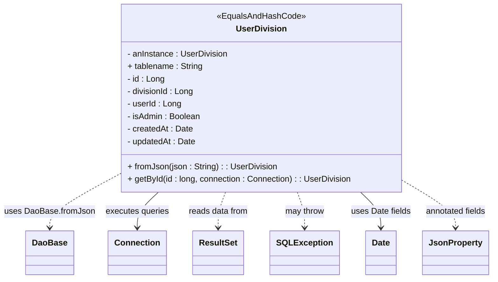

# Diagram: platform-java-lambdas/shipment/src/main/java/com/freightverify/shipment/datastore/postgresql/dao/UserDivision.java


> Auto-generated by Obscura crawlers

## Diagram 1



### SVG

<svg id="container" width="913.9375" xmlns="http://www.w3.org/2000/svg" class="classDiagram" height="534" viewBox="0 0 913.9375 534" role="graphics-document document" aria-roledescription="class"><style>#container{font-family:"trebuchet ms",verdana,arial,sans-serif;font-size:16px;fill:#333;}@keyframes edge-animation-frame{from{stroke-dashoffset:0;}}@keyframes dash{to{stroke-dashoffset:0;}}#container .edge-animation-slow{stroke-dasharray:9,5!important;stroke-dashoffset:900;animation:dash 50s linear infinite;stroke-linecap:round;}#container .edge-animation-fast{stroke-dasharray:9,5!important;stroke-dashoffset:900;animation:dash 20s linear infinite;stroke-linecap:round;}#container .error-icon{fill:#552222;}#container .error-text{fill:#552222;stroke:#552222;}#container .edge-thickness-normal{stroke-width:1px;}#container .edge-thickness-thick{stroke-width:3.5px;}#container .edge-pattern-solid{stroke-dasharray:0;}#container .edge-thickness-invisible{stroke-width:0;fill:none;}#container .edge-pattern-dashed{stroke-dasharray:3;}#container .edge-pattern-dotted{stroke-dasharray:2;}#container .marker{fill:#333333;stroke:#333333;}#container .marker.cross{stroke:#333333;}#container svg{font-family:"trebuchet ms",verdana,arial,sans-serif;font-size:16px;}#container p{margin:0;}#container g.classGroup text{fill:#9370DB;stroke:none;font-family:"trebuchet ms",verdana,arial,sans-serif;font-size:10px;}#container g.classGroup text .title{font-weight:bolder;}#container .nodeLabel,#container .edgeLabel{color:#131300;}#container .edgeLabel .label rect{fill:#ECECFF;}#container .label text{fill:#131300;}#container .labelBkg{background:#ECECFF;}#container .edgeLabel .label span{background:#ECECFF;}#container .classTitle{font-weight:bolder;}#container .node rect,#container .node circle,#container .node ellipse,#container .node polygon,#container .node path{fill:#ECECFF;stroke:#9370DB;stroke-width:1px;}#container .divider{stroke:#9370DB;stroke-width:1;}#container g.clickable{cursor:pointer;}#container g.classGroup rect{fill:#ECECFF;stroke:#9370DB;}#container g.classGroup line{stroke:#9370DB;stroke-width:1;}#container .classLabel .box{stroke:none;stroke-width:0;fill:#ECECFF;opacity:0.5;}#container .classLabel .label{fill:#9370DB;font-size:10px;}#container .relation{stroke:#333333;stroke-width:1;fill:none;}#container .dashed-line{stroke-dasharray:3;}#container .dotted-line{stroke-dasharray:1 2;}#container #compositionStart,#container .composition{fill:#333333!important;stroke:#333333!important;stroke-width:1;}#container #compositionEnd,#container .composition{fill:#333333!important;stroke:#333333!important;stroke-width:1;}#container #dependencyStart,#container .dependency{fill:#333333!important;stroke:#333333!important;stroke-width:1;}#container #dependencyStart,#container .dependency{fill:#333333!important;stroke:#333333!important;stroke-width:1;}#container #extensionStart,#container .extension{fill:transparent!important;stroke:#333333!important;stroke-width:1;}#container #extensionEnd,#container .extension{fill:transparent!important;stroke:#333333!important;stroke-width:1;}#container #aggregationStart,#container .aggregation{fill:transparent!important;stroke:#333333!important;stroke-width:1;}#container #aggregationEnd,#container .aggregation{fill:transparent!important;stroke:#333333!important;stroke-width:1;}#container #lollipopStart,#container .lollipop{fill:#ECECFF!important;stroke:#333333!important;stroke-width:1;}#container #lollipopEnd,#container .lollipop{fill:#ECECFF!important;stroke:#333333!important;stroke-width:1;}#container .edgeTerminals{font-size:11px;line-height:initial;}#container .classTitleText{text-anchor:middle;font-size:18px;fill:#333;}#container .label-icon{display:inline-block;height:1em;overflow:visible;vertical-align:-0.125em;}#container .node .label-icon path{fill:currentColor;stroke:revert;stroke-width:revert;}#container :root{--mermaid-font-family:"trebuchet ms",verdana,arial,sans-serif;}</style><g><defs><marker id="container_class-aggregationStart" class="marker aggregation class" refX="18" refY="7" markerWidth="190" markerHeight="240" orient="auto"><path d="M 18,7 L9,13 L1,7 L9,1 Z"></path></marker></defs><defs><marker id="container_class-aggregationEnd" class="marker aggregation class" refX="1" refY="7" markerWidth="20" markerHeight="28" orient="auto"><path d="M 18,7 L9,13 L1,7 L9,1 Z"></path></marker></defs><defs><marker id="container_class-extensionStart" class="marker extension class" refX="18" refY="7" markerWidth="190" markerHeight="240" orient="auto"><path d="M 1,7 L18,13 V 1 Z"></path></marker></defs><defs><marker id="container_class-extensionEnd" class="marker extension class" refX="1" refY="7" markerWidth="20" markerHeight="28" orient="auto"><path d="M 1,1 V 13 L18,7 Z"></path></marker></defs><defs><marker id="container_class-compositionStart" class="marker composition class" refX="18" refY="7" markerWidth="190" markerHeight="240" orient="auto"><path d="M 18,7 L9,13 L1,7 L9,1 Z"></path></marker></defs><defs><marker id="container_class-compositionEnd" class="marker composition class" refX="1" refY="7" markerWidth="20" markerHeight="28" orient="auto"><path d="M 18,7 L9,13 L1,7 L9,1 Z"></path></marker></defs><defs><marker id="container_class-dependencyStart" class="marker dependency class" refX="6" refY="7" markerWidth="190" markerHeight="240" orient="auto"><path d="M 5,7 L9,13 L1,7 L9,1 Z"></path></marker></defs><defs><marker id="container_class-dependencyEnd" class="marker dependency class" refX="13" refY="7" markerWidth="20" markerHeight="28" orient="auto"><path d="M 18,7 L9,13 L14,7 L9,1 Z"></path></marker></defs><defs><marker id="container_class-lollipopStart" class="marker lollipop class" refX="13" refY="7" markerWidth="190" markerHeight="240" orient="auto"><circle stroke="black" fill="transparent" cx="7" cy="7" r="6"></circle></marker></defs><defs><marker id="container_class-lollipopEnd" class="marker lollipop class" refX="1" refY="7" markerWidth="190" markerHeight="240" orient="auto"><circle stroke="black" fill="transparent" cx="7" cy="7" r="6"></circle></marker></defs><g class="root"><g class="clusters"></g><g class="edgePaths"><path d="M219.203,335.322L198.046,346.935C176.888,358.548,134.573,381.774,113.415,398.554C92.258,415.333,92.258,425.667,92.258,430.833L92.258,436" id="id_UserDivision_DaoBase_1" class="edge-thickness-normal edge-pattern-dashed relation" style=";;;" data-edge="true" data-et="edge" data-id="id_UserDivision_DaoBase_1" data-points="W3sieCI6MjE5LjIwMzEyNSwieSI6MzM1LjMyMTc1MDA0MTk5MjM1fSx7IngiOjkyLjI1NzgxMjUsInkiOjQwNX0seyJ4Ijo5Mi4yNTc4MTI1LCJ5Ijo0NDJ9XQ==" marker-end="url(#container_class-dependencyEnd)"></path><path d="M296.819,368L290.283,374.167C283.746,380.333,270.674,392.667,264.138,404C257.602,415.333,257.602,425.667,257.602,430.833L257.602,436" id="id_UserDivision_Connection_2" class="edge-thickness-normal edge-pattern-solid relation" style=";;;" data-edge="true" data-et="edge" data-id="id_UserDivision_Connection_2" data-points="W3sieCI6Mjk2LjgxODgxODQwNDM3NzksInkiOjM2OH0seyJ4IjoyNTcuNjAxNTYyNSwieSI6NDA1fSx7IngiOjI1Ny42MDE1NjI1LCJ5Ijo0NDJ9XQ==" marker-end="url(#container_class-dependencyEnd)"></path><path d="M421.612,368L419.351,374.167C417.09,380.333,412.569,392.667,410.308,404C408.047,415.333,408.047,425.667,408.047,430.833L408.047,436" id="id_UserDivision_ResultSet_3" class="edge-thickness-normal edge-pattern-dashed relation" style=";;;" data-edge="true" data-et="edge" data-id="id_UserDivision_ResultSet_3" data-points="W3sieCI6NDIxLjYxMjE2NTE3ODU3MTQ0LCJ5IjozNjh9LHsieCI6NDA4LjA0Njg3NSwieSI6NDA1fSx7IngiOjQwOC4wNDY4NzUsInkiOjQ0Mn1d" marker-end="url(#container_class-dependencyEnd)"></path><path d="M553.599,368L555.86,374.167C558.121,380.333,562.642,392.667,564.903,404C567.164,415.333,567.164,425.667,567.164,430.833L567.164,436" id="id_UserDivision_SQLException_4" class="edge-thickness-normal edge-pattern-dashed relation" style=";;;" data-edge="true" data-et="edge" data-id="id_UserDivision_SQLException_4" data-points="W3sieCI6NTUzLjU5ODc3MjMyMTQyODYsInkiOjM2OH0seyJ4Ijo1NjcuMTY0MDYyNSwieSI6NDA1fSx7IngiOjU2Ny4xNjQwNjI1LCJ5Ijo0NDJ9XQ==" marker-end="url(#container_class-dependencyEnd)"></path><path d="M670.369,368L676.631,374.167C682.892,380.333,695.415,392.667,701.676,404C707.938,415.333,707.938,425.667,707.938,430.833L707.938,436" id="id_UserDivision_Date_5" class="edge-thickness-normal edge-pattern-solid relation" style=";;;" data-edge="true" data-et="edge" data-id="id_UserDivision_Date_5" data-points="W3sieCI6NjcwLjM2OTM2NTYzOTQwMDksInkiOjM2OH0seyJ4Ijo3MDcuOTM3NSwieSI6NDA1fSx7IngiOjcwNy45Mzc1LCJ5Ijo0NDJ9XQ==" marker-end="url(#container_class-dependencyEnd)"></path><path d="M756.008,350.342L771.069,359.452C786.13,368.561,816.253,386.781,831.314,401.057C846.375,415.333,846.375,425.667,846.375,430.833L846.375,436" id="id_UserDivision_JsonProperty_6" class="edge-thickness-normal edge-pattern-dashed relation" style=";;;" data-edge="true" data-et="edge" data-id="id_UserDivision_JsonProperty_6" data-points="W3sieCI6NzU2LjAwNzgxMjUsInkiOjM1MC4zNDE4NDc2NzgxNTM0fSx7IngiOjg0Ni4zNzUsInkiOjQwNX0seyJ4Ijo4NDYuMzc1LCJ5Ijo0NDJ9XQ==" marker-end="url(#container_class-dependencyEnd)"></path></g><g class="edgeLabels"><g class="edgeLabel" transform="translate(92.2578125, 405)"><g class="label" data-id="id_UserDivision_DaoBase_1" transform="translate(-84.2578125, -12)"><foreignObject width="168.515625" height="24"><div xmlns="http://www.w3.org/1999/xhtml" class="labelBkg" style="display: table-cell; white-space: nowrap; line-height: 1.5; max-width: 200px; text-align: center;"><span class="edgeLabel"><p>uses DaoBase.fromJson</p></span></div></foreignObject></g></g><g class="edgeLabel" transform="translate(257.6015625, 405)"><g class="label" data-id="id_UserDivision_Connection_2" transform="translate(-61.0859375, -12)"><foreignObject width="122.171875" height="24"><div xmlns="http://www.w3.org/1999/xhtml" class="labelBkg" style="display: table-cell; white-space: nowrap; line-height: 1.5; max-width: 200px; text-align: center;"><span class="edgeLabel"><p>executes queries</p></span></div></foreignObject></g></g><g class="edgeLabel" transform="translate(408.046875, 405)"><g class="label" data-id="id_UserDivision_ResultSet_3" transform="translate(-57.6171875, -12)"><foreignObject width="115.234375" height="24"><div xmlns="http://www.w3.org/1999/xhtml" class="labelBkg" style="display: table-cell; white-space: nowrap; line-height: 1.5; max-width: 200px; text-align: center;"><span class="edgeLabel"><p>reads data from</p></span></div></foreignObject></g></g><g class="edgeLabel" transform="translate(567.1640625, 405)"><g class="label" data-id="id_UserDivision_SQLException_4" transform="translate(-37.9765625, -12)"><foreignObject width="75.953125" height="24"><div xmlns="http://www.w3.org/1999/xhtml" class="labelBkg" style="display: table-cell; white-space: nowrap; line-height: 1.5; max-width: 200px; text-align: center;"><span class="edgeLabel"><p>may throw</p></span></div></foreignObject></g></g><g class="edgeLabel" transform="translate(707.9375, 405)"><g class="label" data-id="id_UserDivision_Date_5" transform="translate(-57.0703125, -12)"><foreignObject width="114.140625" height="24"><div xmlns="http://www.w3.org/1999/xhtml" class="labelBkg" style="display: table-cell; white-space: nowrap; line-height: 1.5; max-width: 200px; text-align: center;"><span class="edgeLabel"><p>uses Date fields</p></span></div></foreignObject></g></g><g class="edgeLabel" transform="translate(846.375, 405)"><g class="label" data-id="id_UserDivision_JsonProperty_6" transform="translate(-59.40625, -12)"><foreignObject width="118.8125" height="24"><div xmlns="http://www.w3.org/1999/xhtml" class="labelBkg" style="display: table-cell; white-space: nowrap; line-height: 1.5; max-width: 200px; text-align: center;"><span class="edgeLabel"><p>annotated fields</p></span></div></foreignObject></g></g></g><g class="nodes"><g class="node default" id="classId-UserDivision-0" transform="translate(487.60546875, 188)"><g class="basic label-container"><path d="M-268.40234375 -180 L268.40234375 -180 L268.40234375 180 L-268.40234375 180" stroke="none" stroke-width="0" fill="#ECECFF" style=""></path><path d="M-268.40234375 -180 C-106.82266319743849 -180, 54.757017355123025 -180, 268.40234375 -180 M-268.40234375 -180 C-81.6691029575532 -180, 105.06413783489359 -180, 268.40234375 -180 M268.40234375 -180 C268.40234375 -42.987823813944516, 268.40234375 94.02435237211097, 268.40234375 180 M268.40234375 -180 C268.40234375 -76.88456858394393, 268.40234375 26.230862832112138, 268.40234375 180 M268.40234375 180 C78.94270845865995 180, -110.5169268326801 180, -268.40234375 180 M268.40234375 180 C94.91585094632276 180, -78.57064185735447 180, -268.40234375 180 M-268.40234375 180 C-268.40234375 46.115555182509866, -268.40234375 -87.76888963498027, -268.40234375 -180 M-268.40234375 180 C-268.40234375 39.10710833534216, -268.40234375 -101.78578332931568, -268.40234375 -180" stroke="#9370DB" stroke-width="1.3" fill="none" stroke-dasharray="0 0" style=""></path></g><g class="annotation-group text" transform="translate(-83.2109375, -156)"><g class="label" style="" transform="translate(0,-12)"><foreignObject width="166.421875" height="24"><div xmlns="http://www.w3.org/1999/xhtml" style="display: table-cell; white-space: nowrap; line-height: 1.5; max-width: 216px; text-align: center;"><span class="nodeLabel markdown-node-label" style=""><p>«EqualsAndHashCode»</p></span></div></foreignObject></g></g><g class="label-group text" transform="translate(-45.890625, -132)"><g class="label" style="font-weight: bolder" transform="translate(0,-12)"><foreignObject width="91.78125" height="24"><div xmlns="http://www.w3.org/1999/xhtml" style="display: table-cell; white-space: nowrap; line-height: 1.5; max-width: 141px; text-align: center;"><span class="nodeLabel markdown-node-label" style=""><p>UserDivision</p></span></div></foreignObject></g></g><g class="members-group text" transform="translate(-256.40234375, -84)"><g class="label" style="" transform="translate(0,-12)"><foreignObject width="193.234375" height="24"><div xmlns="http://www.w3.org/1999/xhtml" style="display: table-cell; white-space: nowrap; line-height: 1.5; max-width: 251px; text-align: center;"><span class="nodeLabel markdown-node-label" style=""><p>- anInstance : UserDivision</p></span></div></foreignObject></g><g class="label" style="" transform="translate(0,12)"><foreignObject width="145.140625" height="24"><div xmlns="http://www.w3.org/1999/xhtml" style="display: table-cell; white-space: nowrap; line-height: 1.5; max-width: 203px; text-align: center;"><span class="nodeLabel markdown-node-label" style=""><p>+ tablename : String</p></span></div></foreignObject></g><g class="label" style="" transform="translate(0,36)"><foreignObject width="71.703125" height="24"><div xmlns="http://www.w3.org/1999/xhtml" style="display: table-cell; white-space: nowrap; line-height: 1.5; max-width: 130px; text-align: center;"><span class="nodeLabel markdown-node-label" style=""><p>- id : Long</p></span></div></foreignObject></g><g class="label" style="" transform="translate(0,60)"><foreignObject width="129.078125" height="24"><div xmlns="http://www.w3.org/1999/xhtml" style="display: table-cell; white-space: nowrap; line-height: 1.5; max-width: 187px; text-align: center;"><span class="nodeLabel markdown-node-label" style=""><p>- divisionId : Long</p></span></div></foreignObject></g><g class="label" style="" transform="translate(0,84)"><foreignObject width="103.59375" height="24"><div xmlns="http://www.w3.org/1999/xhtml" style="display: table-cell; white-space: nowrap; line-height: 1.5; max-width: 162px; text-align: center;"><span class="nodeLabel markdown-node-label" style=""><p>- userId : Long</p></span></div></foreignObject></g><g class="label" style="" transform="translate(0,108)"><foreignObject width="141" height="24"><div xmlns="http://www.w3.org/1999/xhtml" style="display: table-cell; white-space: nowrap; line-height: 1.5; max-width: 198px; text-align: center;"><span class="nodeLabel markdown-node-label" style=""><p>- isAdmin : Boolean</p></span></div></foreignObject></g><g class="label" style="" transform="translate(0,132)"><foreignObject width="125.5" height="24"><div xmlns="http://www.w3.org/1999/xhtml" style="display: table-cell; white-space: nowrap; line-height: 1.5; max-width: 183px; text-align: center;"><span class="nodeLabel markdown-node-label" style=""><p>- createdAt : Date</p></span></div></foreignObject></g><g class="label" style="" transform="translate(0,156)"><foreignObject width="131.96875" height="24"><div xmlns="http://www.w3.org/1999/xhtml" style="display: table-cell; white-space: nowrap; line-height: 1.5; max-width: 189px; text-align: center;"><span class="nodeLabel markdown-node-label" style=""><p>- updatedAt : Date</p></span></div></foreignObject></g></g><g class="methods-group text" transform="translate(-256.40234375, 132)"><g class="label" style="" transform="translate(0,-12)"><foreignObject width="285.421875" height="24"><div xmlns="http://www.w3.org/1999/xhtml" style="display: table-cell; white-space: nowrap; line-height: 1.5; max-width: 343px; text-align: center;"><span class="nodeLabel markdown-node-label" style=""><p>+ fromJson(json : String) : : UserDivision</p></span></div></foreignObject></g><g class="label" style="" transform="translate(0,12)"><foreignObject width="429.59375" height="24"><div xmlns="http://www.w3.org/1999/xhtml" style="display: table-cell; white-space: nowrap; line-height: 1.5; max-width: 487px; text-align: center;"><span class="nodeLabel markdown-node-label" style=""><p>+ getById(id : long, connection : Connection) : : UserDivision</p></span></div></foreignObject></g></g><g class="divider" style=""><path d="M-268.40234375 -108 C-104.88367746972546 -108, 58.63498881054909 -108, 268.40234375 -108 M-268.40234375 -108 C-99.3663547797712 -108, 69.6696341904576 -108, 268.40234375 -108" stroke="#9370DB" stroke-width="1.3" fill="none" stroke-dasharray="0 0" style=""></path></g><g class="divider" style=""><path d="M-268.40234375 108 C-109.25244597671636 108, 49.89745179656728 108, 268.40234375 108 M-268.40234375 108 C-93.26984258905003 108, 81.86265857189994 108, 268.40234375 108" stroke="#9370DB" stroke-width="1.3" fill="none" stroke-dasharray="0 0" style=""></path></g></g><g class="node default" id="classId-DaoBase-1" transform="translate(92.2578125, 484)"><g class="basic label-container"><path d="M-43.7109375 -42 L43.7109375 -42 L43.7109375 42 L-43.7109375 42" stroke="none" stroke-width="0" fill="#ECECFF" style=""></path><path d="M-43.7109375 -42 C-24.356822435080886 -42, -5.002707370161772 -42, 43.7109375 -42 M-43.7109375 -42 C-10.368605342159988 -42, 22.973726815680024 -42, 43.7109375 -42 M43.7109375 -42 C43.7109375 -18.191116631064297, 43.7109375 5.617766737871406, 43.7109375 42 M43.7109375 -42 C43.7109375 -16.751194952018537, 43.7109375 8.497610095962926, 43.7109375 42 M43.7109375 42 C19.480684057111965 42, -4.74956938577607 42, -43.7109375 42 M43.7109375 42 C11.409356101396263 42, -20.892225297207474 42, -43.7109375 42 M-43.7109375 42 C-43.7109375 16.45806685440047, -43.7109375 -9.083866291199058, -43.7109375 -42 M-43.7109375 42 C-43.7109375 23.176229316411604, -43.7109375 4.3524586328232076, -43.7109375 -42" stroke="#9370DB" stroke-width="1.3" fill="none" stroke-dasharray="0 0" style=""></path></g><g class="annotation-group text" transform="translate(0, -18)"></g><g class="label-group text" transform="translate(-31.7109375, -18)"><g class="label" style="font-weight: bolder" transform="translate(0,-12)"><foreignObject width="63.421875" height="24"><div xmlns="http://www.w3.org/1999/xhtml" style="display: table-cell; white-space: nowrap; line-height: 1.5; max-width: 113px; text-align: center;"><span class="nodeLabel markdown-node-label" style=""><p>DaoBase</p></span></div></foreignObject></g></g><g class="members-group text" transform="translate(-31.7109375, 30)"></g><g class="methods-group text" transform="translate(-31.7109375, 60)"></g><g class="divider" style=""><path d="M-43.7109375 6 C-18.53812735516025 6, 6.634682789679502 6, 43.7109375 6 M-43.7109375 6 C-16.6789283331296 6, 10.353080833740798 6, 43.7109375 6" stroke="#9370DB" stroke-width="1.3" fill="none" stroke-dasharray="0 0" style=""></path></g><g class="divider" style=""><path d="M-43.7109375 24 C-24.66389565298283 24, -5.616853805965661 24, 43.7109375 24 M-43.7109375 24 C-22.965499236581863 24, -2.2200609731637257 24, 43.7109375 24" stroke="#9370DB" stroke-width="1.3" fill="none" stroke-dasharray="0 0" style=""></path></g></g><g class="node default" id="classId-Connection-2" transform="translate(257.6015625, 484)"><g class="basic label-container"><path d="M-53.2265625 -42 L53.2265625 -42 L53.2265625 42 L-53.2265625 42" stroke="none" stroke-width="0" fill="#ECECFF" style=""></path><path d="M-53.2265625 -42 C-13.09712890385341 -42, 27.03230469229318 -42, 53.2265625 -42 M-53.2265625 -42 C-29.121260900630737 -42, -5.015959301261475 -42, 53.2265625 -42 M53.2265625 -42 C53.2265625 -9.213951250547446, 53.2265625 23.57209749890511, 53.2265625 42 M53.2265625 -42 C53.2265625 -17.27056537019074, 53.2265625 7.458869259618517, 53.2265625 42 M53.2265625 42 C13.457886393739024 42, -26.310789712521952 42, -53.2265625 42 M53.2265625 42 C26.29974913110449 42, -0.6270642377910178 42, -53.2265625 42 M-53.2265625 42 C-53.2265625 21.0917338384167, -53.2265625 0.18346767683340204, -53.2265625 -42 M-53.2265625 42 C-53.2265625 17.21730278923273, -53.2265625 -7.565394421534542, -53.2265625 -42" stroke="#9370DB" stroke-width="1.3" fill="none" stroke-dasharray="0 0" style=""></path></g><g class="annotation-group text" transform="translate(0, -18)"></g><g class="label-group text" transform="translate(-41.2265625, -18)"><g class="label" style="font-weight: bolder" transform="translate(0,-12)"><foreignObject width="82.453125" height="24"><div xmlns="http://www.w3.org/1999/xhtml" style="display: table-cell; white-space: nowrap; line-height: 1.5; max-width: 132px; text-align: center;"><span class="nodeLabel markdown-node-label" style=""><p>Connection</p></span></div></foreignObject></g></g><g class="members-group text" transform="translate(-41.2265625, 30)"></g><g class="methods-group text" transform="translate(-41.2265625, 60)"></g><g class="divider" style=""><path d="M-53.2265625 6 C-21.090676756718004 6, 11.045208986563992 6, 53.2265625 6 M-53.2265625 6 C-21.51072643659668 6, 10.205109626806639 6, 53.2265625 6" stroke="#9370DB" stroke-width="1.3" fill="none" stroke-dasharray="0 0" style=""></path></g><g class="divider" style=""><path d="M-53.2265625 24 C-13.328503137862576 24, 26.569556224274848 24, 53.2265625 24 M-53.2265625 24 C-13.041482426178 24, 27.143597647644 24, 53.2265625 24" stroke="#9370DB" stroke-width="1.3" fill="none" stroke-dasharray="0 0" style=""></path></g></g><g class="node default" id="classId-ResultSet-3" transform="translate(408.046875, 484)"><g class="basic label-container"><path d="M-47.21875 -42 L47.21875 -42 L47.21875 42 L-47.21875 42" stroke="none" stroke-width="0" fill="#ECECFF" style=""></path><path d="M-47.21875 -42 C-13.412425898292192 -42, 20.393898203415617 -42, 47.21875 -42 M-47.21875 -42 C-19.631188209475674 -42, 7.956373581048652 -42, 47.21875 -42 M47.21875 -42 C47.21875 -20.7054857460572, 47.21875 0.589028507885601, 47.21875 42 M47.21875 -42 C47.21875 -22.187802506517386, 47.21875 -2.3756050130347717, 47.21875 42 M47.21875 42 C11.089076653082259 42, -25.040596693835482 42, -47.21875 42 M47.21875 42 C16.737370142016132 42, -13.744009715967735 42, -47.21875 42 M-47.21875 42 C-47.21875 18.456155736700076, -47.21875 -5.087688526599848, -47.21875 -42 M-47.21875 42 C-47.21875 19.59286989677933, -47.21875 -2.8142602064413396, -47.21875 -42" stroke="#9370DB" stroke-width="1.3" fill="none" stroke-dasharray="0 0" style=""></path></g><g class="annotation-group text" transform="translate(0, -18)"></g><g class="label-group text" transform="translate(-35.21875, -18)"><g class="label" style="font-weight: bolder" transform="translate(0,-12)"><foreignObject width="70.4375" height="24"><div xmlns="http://www.w3.org/1999/xhtml" style="display: table-cell; white-space: nowrap; line-height: 1.5; max-width: 119px; text-align: center;"><span class="nodeLabel markdown-node-label" style=""><p>ResultSet</p></span></div></foreignObject></g></g><g class="members-group text" transform="translate(-35.21875, 30)"></g><g class="methods-group text" transform="translate(-35.21875, 60)"></g><g class="divider" style=""><path d="M-47.21875 6 C-23.93236788882552 6, -0.6459857776510418 6, 47.21875 6 M-47.21875 6 C-16.170943807069527 6, 14.876862385860946 6, 47.21875 6" stroke="#9370DB" stroke-width="1.3" fill="none" stroke-dasharray="0 0" style=""></path></g><g class="divider" style=""><path d="M-47.21875 24 C-25.10367988390328 24, -2.988609767806558 24, 47.21875 24 M-47.21875 24 C-15.10684524923142 24, 17.00505950153716 24, 47.21875 24" stroke="#9370DB" stroke-width="1.3" fill="none" stroke-dasharray="0 0" style=""></path></g></g><g class="node default" id="classId-SQLException-4" transform="translate(567.1640625, 484)"><g class="basic label-container"><path d="M-61.8984375 -42 L61.8984375 -42 L61.8984375 42 L-61.8984375 42" stroke="none" stroke-width="0" fill="#ECECFF" style=""></path><path d="M-61.8984375 -42 C-21.7681855302614 -42, 18.362066439477204 -42, 61.8984375 -42 M-61.8984375 -42 C-27.96323609205968 -42, 5.971965315880638 -42, 61.8984375 -42 M61.8984375 -42 C61.8984375 -17.561779128787244, 61.8984375 6.876441742425513, 61.8984375 42 M61.8984375 -42 C61.8984375 -21.943114876900918, 61.8984375 -1.8862297538018353, 61.8984375 42 M61.8984375 42 C32.36978185278982 42, 2.8411262055796414 42, -61.8984375 42 M61.8984375 42 C34.27113662040628 42, 6.64383574081257 42, -61.8984375 42 M-61.8984375 42 C-61.8984375 16.23095085691503, -61.8984375 -9.53809828616994, -61.8984375 -42 M-61.8984375 42 C-61.8984375 23.969630565617503, -61.8984375 5.939261131235007, -61.8984375 -42" stroke="#9370DB" stroke-width="1.3" fill="none" stroke-dasharray="0 0" style=""></path></g><g class="annotation-group text" transform="translate(0, -18)"></g><g class="label-group text" transform="translate(-49.8984375, -18)"><g class="label" style="font-weight: bolder" transform="translate(0,-12)"><foreignObject width="99.796875" height="24"><div xmlns="http://www.w3.org/1999/xhtml" style="display: table-cell; white-space: nowrap; line-height: 1.5; max-width: 148px; text-align: center;"><span class="nodeLabel markdown-node-label" style=""><p>SQLException</p></span></div></foreignObject></g></g><g class="members-group text" transform="translate(-49.8984375, 30)"></g><g class="methods-group text" transform="translate(-49.8984375, 60)"></g><g class="divider" style=""><path d="M-61.8984375 6 C-29.534634813023708 6, 2.829167873952585 6, 61.8984375 6 M-61.8984375 6 C-24.105065679102992 6, 13.688306141794016 6, 61.8984375 6" stroke="#9370DB" stroke-width="1.3" fill="none" stroke-dasharray="0 0" style=""></path></g><g class="divider" style=""><path d="M-61.8984375 24 C-16.5631873024821 24, 28.772062895035802 24, 61.8984375 24 M-61.8984375 24 C-30.590289711964015 24, 0.7178580760719697 24, 61.8984375 24" stroke="#9370DB" stroke-width="1.3" fill="none" stroke-dasharray="0 0" style=""></path></g></g><g class="node default" id="classId-Date-5" transform="translate(707.9375, 484)"><g class="basic label-container"><path d="M-28.875 -42 L28.875 -42 L28.875 42 L-28.875 42" stroke="none" stroke-width="0" fill="#ECECFF" style=""></path><path d="M-28.875 -42 C-10.631925608881588 -42, 7.611148782236825 -42, 28.875 -42 M-28.875 -42 C-12.069194705780319 -42, 4.736610588439362 -42, 28.875 -42 M28.875 -42 C28.875 -17.232094300429857, 28.875 7.535811399140286, 28.875 42 M28.875 -42 C28.875 -21.81637959769582, 28.875 -1.6327591953916425, 28.875 42 M28.875 42 C16.28494793928724 42, 3.694895878574478 42, -28.875 42 M28.875 42 C16.49127225558196 42, 4.107544511163919 42, -28.875 42 M-28.875 42 C-28.875 20.971492363015376, -28.875 -0.05701527396924888, -28.875 -42 M-28.875 42 C-28.875 16.70372605129841, -28.875 -8.592547897403179, -28.875 -42" stroke="#9370DB" stroke-width="1.3" fill="none" stroke-dasharray="0 0" style=""></path></g><g class="annotation-group text" transform="translate(0, -18)"></g><g class="label-group text" transform="translate(-16.875, -18)"><g class="label" style="font-weight: bolder" transform="translate(0,-12)"><foreignObject width="33.75" height="24"><div xmlns="http://www.w3.org/1999/xhtml" style="display: table-cell; white-space: nowrap; line-height: 1.5; max-width: 83px; text-align: center;"><span class="nodeLabel markdown-node-label" style=""><p>Date</p></span></div></foreignObject></g></g><g class="members-group text" transform="translate(-16.875, 30)"></g><g class="methods-group text" transform="translate(-16.875, 60)"></g><g class="divider" style=""><path d="M-28.875 6 C-12.242162063880897 6, 4.390675872238205 6, 28.875 6 M-28.875 6 C-8.212356305776265 6, 12.450287388447471 6, 28.875 6" stroke="#9370DB" stroke-width="1.3" fill="none" stroke-dasharray="0 0" style=""></path></g><g class="divider" style=""><path d="M-28.875 24 C-13.75051523843759 24, 1.3739695231248206 24, 28.875 24 M-28.875 24 C-14.925004269592716 24, -0.9750085391854313 24, 28.875 24" stroke="#9370DB" stroke-width="1.3" fill="none" stroke-dasharray="0 0" style=""></path></g></g><g class="node default" id="classId-JsonProperty-6" transform="translate(846.375, 484)"><g class="basic label-container"><path d="M-59.5625 -42 L59.5625 -42 L59.5625 42 L-59.5625 42" stroke="none" stroke-width="0" fill="#ECECFF" style=""></path><path d="M-59.5625 -42 C-15.14935933776674 -42, 29.26378132446652 -42, 59.5625 -42 M-59.5625 -42 C-14.509814110969884 -42, 30.54287177806023 -42, 59.5625 -42 M59.5625 -42 C59.5625 -23.688650413198665, 59.5625 -5.377300826397331, 59.5625 42 M59.5625 -42 C59.5625 -15.31269858691249, 59.5625 11.374602826175021, 59.5625 42 M59.5625 42 C33.56229833015885 42, 7.562096660317714 42, -59.5625 42 M59.5625 42 C28.635101738199467 42, -2.292296523601067 42, -59.5625 42 M-59.5625 42 C-59.5625 10.857986816224177, -59.5625 -20.284026367551647, -59.5625 -42 M-59.5625 42 C-59.5625 15.18832697126679, -59.5625 -11.62334605746642, -59.5625 -42" stroke="#9370DB" stroke-width="1.3" fill="none" stroke-dasharray="0 0" style=""></path></g><g class="annotation-group text" transform="translate(0, -18)"></g><g class="label-group text" transform="translate(-47.5625, -18)"><g class="label" style="font-weight: bolder" transform="translate(0,-12)"><foreignObject width="95.125" height="24"><div xmlns="http://www.w3.org/1999/xhtml" style="display: table-cell; white-space: nowrap; line-height: 1.5; max-width: 143px; text-align: center;"><span class="nodeLabel markdown-node-label" style=""><p>JsonProperty</p></span></div></foreignObject></g></g><g class="members-group text" transform="translate(-47.5625, 30)"></g><g class="methods-group text" transform="translate(-47.5625, 60)"></g><g class="divider" style=""><path d="M-59.5625 6 C-28.563751251158994 6, 2.434997497682012 6, 59.5625 6 M-59.5625 6 C-20.894214360650125 6, 17.77407127869975 6, 59.5625 6" stroke="#9370DB" stroke-width="1.3" fill="none" stroke-dasharray="0 0" style=""></path></g><g class="divider" style=""><path d="M-59.5625 24 C-31.464117083243593 24, -3.3657341664871865 24, 59.5625 24 M-59.5625 24 C-35.115114450729564 24, -10.667728901459121 24, 59.5625 24" stroke="#9370DB" stroke-width="1.3" fill="none" stroke-dasharray="0 0" style=""></path></g></g></g></g></g></svg>

## Diagram 2

```mermaid
flowchart TD
    A[getById(id, connection)] --> B[Execute SQL on Connection]
    B --> C[ResultSet results]
    C --> D{results.next()}
    D -- yes --> E[json = results.getString(1)]
    E --> F[UserDivision.fromJson(json)]
    F --> G[retval = UserDivision]
    G --> H[Return retval]
    D -- no --> H
```

> SVG rendering failed for this diagram.
