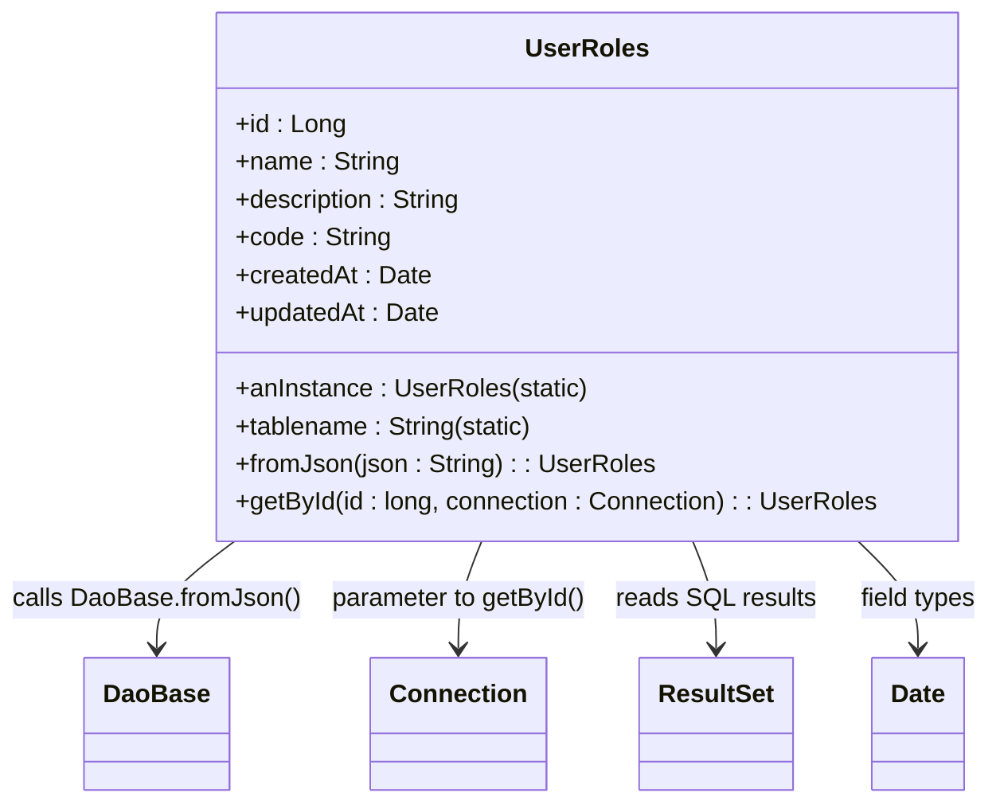

# Diagram: platform-java-lambdas/shipment/src/main/java/com/freightverify/shipment/datastore/postgresql/dao/UserRoles.java

> Auto-generated by Obscura crawlers

## Mermaid

### SVG

<svg id="container" width="624.8046875" xmlns="http://www.w3.org/2000/svg" class="classDiagram" height="510" viewBox="0 0 624.8046875 510" role="graphics-document document" aria-roledescription="class"><g><defs><marker id="container_class-aggregationStart" class="marker aggregation class" refX="18" refY="7" markerWidth="190" markerHeight="240" orient="auto"><path d="M 18,7 L9,13 L1,7 L9,1 Z"></path></marker></defs><defs><marker id="container_class-aggregationEnd" class="marker aggregation class" refX="1" refY="7" markerWidth="20" markerHeight="28" orient="auto"><path d="M 18,7 L9,13 L1,7 L9,1 Z"></path></marker></defs><defs><marker id="container_class-extensionStart" class="marker extension class" refX="18" refY="7" markerWidth="190" markerHeight="240" orient="auto"><path d="M 1,7 L18,13 V 1 Z"></path></marker></defs><defs><marker id="container_class-extensionEnd" class="marker extension class" refX="1" refY="7" markerWidth="20" markerHeight="28" orient="auto"><path d="M 1,1 V 13 L18,7 Z"></path></marker></defs><defs><marker id="container_class-compositionStart" class="marker composition class" refX="18" refY="7" markerWidth="190" markerHeight="240" orient="auto"><path d="M 18,7 L9,13 L1,7 L9,1 Z"></path></marker></defs><defs><marker id="container_class-compositionEnd" class="marker composition class" refX="1" refY="7" markerWidth="20" markerHeight="28" orient="auto"><path d="M 18,7 L9,13 L1,7 L9,1 Z"></path></marker></defs><defs><marker id="container_class-dependencyStart" class="marker dependency class" refX="6" refY="7" markerWidth="190" markerHeight="240" orient="auto"><path d="M 5,7 L9,13 L1,7 L9,1 Z"></path></marker></defs><defs><marker id="container_class-dependencyEnd" class="marker dependency class" refX="13" refY="7" markerWidth="20" markerHeight="28" orient="auto"><path d="M 18,7 L9,13 L14,7 L9,1 Z"></path></marker></defs><defs><marker id="container_class-lollipopStart" class="marker lollipop class" refX="13" refY="7" markerWidth="190" markerHeight="240" orient="auto"><circle stroke="black" fill="transparent" cx="7" cy="7" r="6"></circle></marker></defs><defs><marker id="container_class-lollipopEnd" class="marker lollipop class" refX="1" refY="7" markerWidth="190" markerHeight="240" orient="auto"><circle stroke="black" fill="transparent" cx="7" cy="7" r="6"></circle></marker></defs><g class="root"><g class="clusters"></g><g class="edgePaths"><path d="M146.727,344L138.506,350.167C130.284,356.333,113.841,368.667,105.62,380C97.398,391.333,97.398,401.667,97.398,406.833L97.398,412" id="id_UserRoles_DaoBase_1" class="edge-thickness-normal edge-pattern-solid relation" style=";;;" data-edge="true" data-et="edge" data-id="id_UserRoles_DaoBase_1" data-points="W3sieCI6MTQ2LjcyNzMwNTY0MDI0MzksInkiOjM0NH0seyJ4Ijo5Ny4zOTg0Mzc1LCJ5IjozODF9LHsieCI6OTcuMzk4NDM3NSwieSI6NDE4fV0=" marker-end="url(#container_class-dependencyEnd)"></path><path d="M303.344,344L300.871,350.167C298.398,356.333,293.453,368.667,290.98,380C288.508,391.333,288.508,401.667,288.508,406.833L288.508,412" id="id_UserRoles_Connection_2" class="edge-thickness-normal edge-pattern-solid relation" style=";;;" data-edge="true" data-et="edge" data-id="id_UserRoles_Connection_2" data-points="W3sieCI6MzAzLjM0Mzc2OTA1NDg3ODA3LCJ5IjozNDR9LHsieCI6Mjg4LjUwNzgxMjUsInkiOjM4MX0seyJ4IjoyODguNTA3ODEyNSwieSI6NDE4fV0=" marker-end="url(#container_class-dependencyEnd)"></path><path d="M438.07,344L440.543,350.167C443.016,356.333,447.961,368.667,450.434,380C452.906,391.333,452.906,401.667,452.906,406.833L452.906,412" id="id_UserRoles_ResultSet_3" class="edge-thickness-normal edge-pattern-solid relation" style=";;;" data-edge="true" data-et="edge" data-id="id_UserRoles_ResultSet_3" data-points="W3sieCI6NDM4LjA3MDI5MzQ0NTEyMTkzLCJ5IjozNDR9LHsieCI6NDUyLjkwNjI1LCJ5IjozODF9LHsieCI6NDUyLjkwNjI1LCJ5Ijo0MTh9XQ==" marker-end="url(#container_class-dependencyEnd)"></path><path d="M541.406,344L547.671,350.167C553.937,356.333,566.469,368.667,572.734,380C579,391.333,579,401.667,579,406.833L579,412" id="id_UserRoles_Date_4" class="edge-thickness-normal edge-pattern-solid relation" style=";;;" data-edge="true" data-et="edge" data-id="id_UserRoles_Date_4" data-points="W3sieCI6NTQxLjQwNTY1OTI5ODc4MDUsInkiOjM0NH0seyJ4Ijo1NzksInkiOjM4MX0seyJ4Ijo1NzksInkiOjQxOH1d" marker-end="url(#container_class-dependencyEnd)"></path></g><g class="edgeLabels"><g class="edgeLabel" transform="translate(97.3984375, 381)"><g class="label" data-id="id_UserRoles_DaoBase_1" transform="translate(-89.3984375, -12)"><foreignObject width="178.796875" height="24">

calls DaoBase.fromJson()

</foreignObject></g></g><g class="edgeLabel" transform="translate(288.5078125, 381)"><g class="label" data-id="id_UserRoles_Connection_2" transform="translate(-81.7109375, -12)"><foreignObject width="163.421875" height="24">

parameter to getById()

</foreignObject></g></g><g class="edgeLabel" transform="translate(452.90625, 381)"><g class="label" data-id="id_UserRoles_ResultSet_3" transform="translate(-62.6875, -12)"><foreignObject width="125.375" height="24">

reads SQL results

</foreignObject></g></g><g class="edgeLabel" transform="translate(579, 381)"><g class="label" data-id="id_UserRoles_Date_4" transform="translate(-37.8046875, -12)"><foreignObject width="75.609375" height="24">

field types

</foreignObject></g></g></g><g class="nodes"><g class="node default" id="classId-UserRoles-0" transform="translate(370.70703125, 176)"><g class="basic label-container"><path d="M-233.8984375 -168 L233.8984375 -168 L233.8984375 168 L-233.8984375 168" stroke="none" stroke-width="0" fill="#ECECFF" style=""></path><path d="M-233.8984375 -168 C-86.23395635588494 -168, 61.430524788230116 -168, 233.8984375 -168 M-233.8984375 -168 C-63.503768158375465 -168, 106.89090118324907 -168, 233.8984375 -168 M233.8984375 -168 C233.8984375 -44.596066633646615, 233.8984375 78.80786673270677, 233.8984375 168 M233.8984375 -168 C233.8984375 -60.943744299912, 233.8984375 46.112511400176004, 233.8984375 168 M233.8984375 168 C137.1466501476561 168, 40.39486279531218 168, -233.8984375 168 M233.8984375 168 C107.10884669083443 168, -19.68074411833115 168, -233.8984375 168 M-233.8984375 168 C-233.8984375 76.397768530367, -233.8984375 -15.204462939265994, -233.8984375 -168 M-233.8984375 168 C-233.8984375 76.12214682992405, -233.8984375 -15.755706340151903, -233.8984375 -168" stroke="#9370DB" stroke-width="1.3" fill="none" stroke-dasharray="0 0" style=""></path></g><g class="annotation-group text" transform="translate(0, -144)"></g><g class="label-group text" transform="translate(-36.765625, -144)"><g class="label" style="font-weight: bolder" transform="translate(0,-12)"><foreignObject width="73.53125" height="24">

UserRoles

</foreignObject></g></g><g class="members-group text" transform="translate(-221.8984375, -96)"><g class="label" style="" transform="translate(0,-12)"><foreignObject width="69" height="24">

+id : Long

</foreignObject></g><g class="label" style="" transform="translate(0,12)"><foreignObject width="103.703125" height="24">

+name : String

</foreignObject></g><g class="label" style="" transform="translate(0,36)"><foreignObject width="145.796875" height="24">

+description : String

</foreignObject></g><g class="label" style="" transform="translate(0,60)"><foreignObject width="98.15625" height="24">

+code : String

</foreignObject></g><g class="label" style="" transform="translate(0,84)"><foreignObject width="122.796875" height="24">

+createdAt : Date

</foreignObject></g><g class="label" style="" transform="translate(0,108)"><foreignObject width="129.265625" height="24">

+updatedAt : Date

</foreignObject></g></g><g class="methods-group text" transform="translate(-221.8984375, 72)"><g class="label" style="" transform="translate(0,-12)"><foreignObject width="222.125" height="24">

+anInstance : UserRoles(static)

</foreignObject></g><g class="label" style="" transform="translate(0,12)"><foreignObject width="190.96875" height="24">

+tablename : String(static)

</foreignObject></g><g class="label" style="" transform="translate(0,36)"><foreignObject width="262.609375" height="24">

+fromJson(json : String) : : UserRoles

</foreignObject></g><g class="label" style="" transform="translate(0,60)"><foreignObject width="407.03125" height="24">

+getById(id : long, connection : Connection) : : UserRoles

</foreignObject></g></g><g class="divider" style=""><path d="M-233.8984375 -120 C-128.2272606019971 -120, -22.556083703994233 -120, 233.8984375 -120 M-233.8984375 -120 C-103.85723543358273 -120, 26.18396663283454 -120, 233.8984375 -120" stroke="#9370DB" stroke-width="1.3" fill="none" stroke-dasharray="0 0" style=""></path></g><g class="divider" style=""><path d="M-233.8984375 48 C-122.59658123878293 48, -11.294724977565863 48, 233.8984375 48 M-233.8984375 48 C-76.62278258772133 48, 80.65287232455734 48, 233.8984375 48" stroke="#9370DB" stroke-width="1.3" fill="none" stroke-dasharray="0 0" style=""></path></g></g><g class="node default" id="classId-DaoBase-1" transform="translate(97.3984375, 460)"><g class="basic label-container"><path d="M-43.7109375 -42 L43.7109375 -42 L43.7109375 42 L-43.7109375 42" stroke="none" stroke-width="0" fill="#ECECFF" style=""></path><path d="M-43.7109375 -42 C-23.22600519489305 -42, -2.7410728897861034 -42, 43.7109375 -42 M-43.7109375 -42 C-11.969666443000136 -42, 19.771604613999727 -42, 43.7109375 -42 M43.7109375 -42 C43.7109375 -22.04403947628102, 43.7109375 -2.088078952562043, 43.7109375 42 M43.7109375 -42 C43.7109375 -12.108599949243978, 43.7109375 17.782800101512045, 43.7109375 42 M43.7109375 42 C20.04395888711359 42, -3.6230197257728207 42, -43.7109375 42 M43.7109375 42 C23.874485389673435 42, 4.03803327934687 42, -43.7109375 42 M-43.7109375 42 C-43.7109375 13.695734001574184, -43.7109375 -14.608531996851632, -43.7109375 -42 M-43.7109375 42 C-43.7109375 18.93524222988618, -43.7109375 -4.1295155402276364, -43.7109375 -42" stroke="#9370DB" stroke-width="1.3" fill="none" stroke-dasharray="0 0" style=""></path></g><g class="annotation-group text" transform="translate(0, -18)"></g><g class="label-group text" transform="translate(-31.7109375, -18)"><g class="label" style="font-weight: bolder" transform="translate(0,-12)"><foreignObject width="63.421875" height="24">

DaoBase

</foreignObject></g></g><g class="members-group text" transform="translate(-31.7109375, 30)"></g><g class="methods-group text" transform="translate(-31.7109375, 60)"></g><g class="divider" style=""><path d="M-43.7109375 6 C-26.13303385428867 6, -8.555130208577339 6, 43.7109375 6 M-43.7109375 6 C-13.488444612537421 6, 16.734048274925158 6, 43.7109375 6" stroke="#9370DB" stroke-width="1.3" fill="none" stroke-dasharray="0 0" style=""></path></g><g class="divider" style=""><path d="M-43.7109375 24 C-12.564577713104232 24, 18.581782073791537 24, 43.7109375 24 M-43.7109375 24 C-13.783074408175953 24, 16.144788683648095 24, 43.7109375 24" stroke="#9370DB" stroke-width="1.3" fill="none" stroke-dasharray="0 0" style=""></path></g></g><g class="node default" id="classId-Connection-2" transform="translate(288.5078125, 460)"><g class="basic label-container"><path d="M-53.2265625 -42 L53.2265625 -42 L53.2265625 42 L-53.2265625 42" stroke="none" stroke-width="0" fill="#ECECFF" style=""></path><path d="M-53.2265625 -42 C-13.93492530484739 -42, 25.35671189030522 -42, 53.2265625 -42 M-53.2265625 -42 C-31.047064535236085 -42, -8.867566570472171 -42, 53.2265625 -42 M53.2265625 -42 C53.2265625 -10.141275690549413, 53.2265625 21.717448618901173, 53.2265625 42 M53.2265625 -42 C53.2265625 -23.01411651917792, 53.2265625 -4.028233038355843, 53.2265625 42 M53.2265625 42 C27.70694056194084 42, 2.18731862388168 42, -53.2265625 42 M53.2265625 42 C12.701626824303837 42, -27.823308851392326 42, -53.2265625 42 M-53.2265625 42 C-53.2265625 10.193986447483493, -53.2265625 -21.612027105033015, -53.2265625 -42 M-53.2265625 42 C-53.2265625 10.366040928999372, -53.2265625 -21.267918142001257, -53.2265625 -42" stroke="#9370DB" stroke-width="1.3" fill="none" stroke-dasharray="0 0" style=""></path></g><g class="annotation-group text" transform="translate(0, -18)"></g><g class="label-group text" transform="translate(-41.2265625, -18)"><g class="label" style="font-weight: bolder" transform="translate(0,-12)"><foreignObject width="82.453125" height="24">

Connection

</foreignObject></g></g><g class="members-group text" transform="translate(-41.2265625, 30)"></g><g class="methods-group text" transform="translate(-41.2265625, 60)"></g><g class="divider" style=""><path d="M-53.2265625 6 C-22.192170935672504 6, 8.842220628654992 6, 53.2265625 6 M-53.2265625 6 C-27.701117928755746 6, -2.175673357511492 6, 53.2265625 6" stroke="#9370DB" stroke-width="1.3" fill="none" stroke-dasharray="0 0" style=""></path></g><g class="divider" style=""><path d="M-53.2265625 24 C-27.405055487982594 24, -1.5835484759651877 24, 53.2265625 24 M-53.2265625 24 C-20.419351861115132 24, 12.387858777769736 24, 53.2265625 24" stroke="#9370DB" stroke-width="1.3" fill="none" stroke-dasharray="0 0" style=""></path></g></g><g class="node default" id="classId-ResultSet-3" transform="translate(452.90625, 460)"><g class="basic label-container"><path d="M-47.21875 -42 L47.21875 -42 L47.21875 42 L-47.21875 42" stroke="none" stroke-width="0" fill="#ECECFF" style=""></path><path d="M-47.21875 -42 C-11.724310817091897 -42, 23.770128365816205 -42, 47.21875 -42 M-47.21875 -42 C-22.126258656434732 -42, 2.9662326871305353 -42, 47.21875 -42 M47.21875 -42 C47.21875 -17.344458215070983, 47.21875 7.3110835698580345, 47.21875 42 M47.21875 -42 C47.21875 -24.181505260286304, 47.21875 -6.363010520572608, 47.21875 42 M47.21875 42 C15.535173215719407 42, -16.148403568561186 42, -47.21875 42 M47.21875 42 C20.095834674668072 42, -7.027080650663855 42, -47.21875 42 M-47.21875 42 C-47.21875 18.60160777687425, -47.21875 -4.7967844462515, -47.21875 -42 M-47.21875 42 C-47.21875 24.22815235790544, -47.21875 6.45630471581088, -47.21875 -42" stroke="#9370DB" stroke-width="1.3" fill="none" stroke-dasharray="0 0" style=""></path></g><g class="annotation-group text" transform="translate(0, -18)"></g><g class="label-group text" transform="translate(-35.21875, -18)"><g class="label" style="font-weight: bolder" transform="translate(0,-12)"><foreignObject width="70.4375" height="24">

ResultSet

</foreignObject></g></g><g class="members-group text" transform="translate(-35.21875, 30)"></g><g class="methods-group text" transform="translate(-35.21875, 60)"></g><g class="divider" style=""><path d="M-47.21875 6 C-20.34172987123826 6, 6.535290257523478 6, 47.21875 6 M-47.21875 6 C-15.998220820857568 6, 15.222308358284863 6, 47.21875 6" stroke="#9370DB" stroke-width="1.3" fill="none" stroke-dasharray="0 0" style=""></path></g><g class="divider" style=""><path d="M-47.21875 24 C-10.343682379956675 24, 26.53138524008665 24, 47.21875 24 M-47.21875 24 C-26.681936906365568 24, -6.145123812731136 24, 47.21875 24" stroke="#9370DB" stroke-width="1.3" fill="none" stroke-dasharray="0 0" style=""></path></g></g><g class="node default" id="classId-Date-4" transform="translate(579, 460)"><g class="basic label-container"><path d="M-28.875 -42 L28.875 -42 L28.875 42 L-28.875 42" stroke="none" stroke-width="0" fill="#ECECFF" style=""></path><path d="M-28.875 -42 C-10.65263858285552 -42, 7.56972283428896 -42, 28.875 -42 M-28.875 -42 C-15.317788796145011 -42, -1.7605775922900229 -42, 28.875 -42 M28.875 -42 C28.875 -14.068909471653463, 28.875 13.862181056693075, 28.875 42 M28.875 -42 C28.875 -13.412807310673507, 28.875 15.174385378652985, 28.875 42 M28.875 42 C10.171225422337994 42, -8.532549155324013 42, -28.875 42 M28.875 42 C7.369638403699632 42, -14.135723192600736 42, -28.875 42 M-28.875 42 C-28.875 9.156672910141388, -28.875 -23.686654179717223, -28.875 -42 M-28.875 42 C-28.875 18.58432521515762, -28.875 -4.831349569684761, -28.875 -42" stroke="#9370DB" stroke-width="1.3" fill="none" stroke-dasharray="0 0" style=""></path></g><g class="annotation-group text" transform="translate(0, -18)"></g><g class="label-group text" transform="translate(-16.875, -18)"><g class="label" style="font-weight: bolder" transform="translate(0,-12)"><foreignObject width="33.75" height="24">

Date

</foreignObject></g></g><g class="members-group text" transform="translate(-16.875, 30)"></g><g class="methods-group text" transform="translate(-16.875, 60)"></g><g class="divider" style=""><path d="M-28.875 6 C-9.878489888585506 6, 9.118020222828989 6, 28.875 6 M-28.875 6 C-14.633971523738191 6, -0.39294304747638265 6, 28.875 6" stroke="#9370DB" stroke-width="1.3" fill="none" stroke-dasharray="0 0" style=""></path></g><g class="divider" style=""><path d="M-28.875 24 C-8.587783104115502 24, 11.699433791768996 24, 28.875 24 M-28.875 24 C-13.341456267934431 24, 2.192087464131138 24, 28.875 24" stroke="#9370DB" stroke-width="1.3" fill="none" stroke-dasharray="0 0" style=""></path></g></g></g></g></g></svg>
