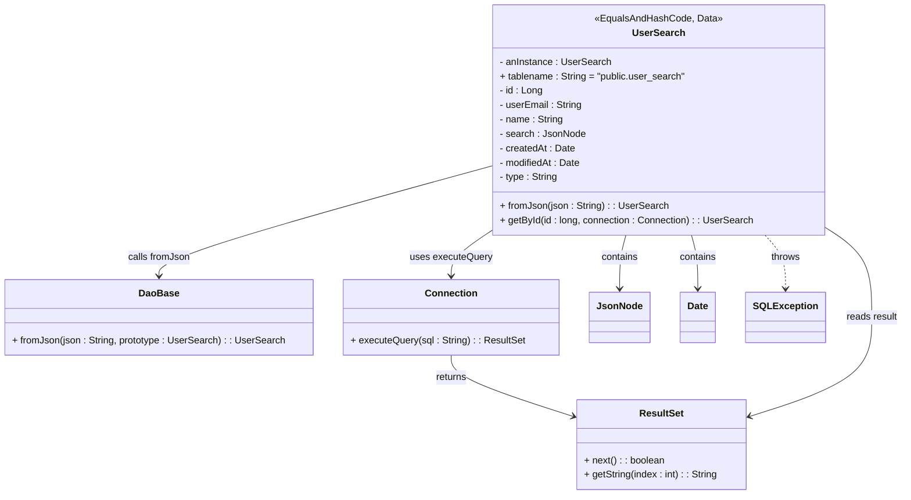

# Diagram: platform-java-lambdas/shipment/src/main/java/com/freightverify/shipment/datastore/postgresql/dao/UserSearch.java

> Auto-generated by Obscura crawlers

## Mermaid

### SVG

<svg id="container" width="1470.234375" xmlns="http://www.w3.org/2000/svg" class="classDiagram" height="824" viewBox="0 0 1470.234375 824" role="graphics-document document" aria-roledescription="class"><g><defs><marker id="container_class-aggregationStart" class="marker aggregation class" refX="18" refY="7" markerWidth="190" markerHeight="240" orient="auto"><path d="M 18,7 L9,13 L1,7 L9,1 Z"></path></marker></defs><defs><marker id="container_class-aggregationEnd" class="marker aggregation class" refX="1" refY="7" markerWidth="20" markerHeight="28" orient="auto"><path d="M 18,7 L9,13 L1,7 L9,1 Z"></path></marker></defs><defs><marker id="container_class-extensionStart" class="marker extension class" refX="18" refY="7" markerWidth="190" markerHeight="240" orient="auto"><path d="M 1,7 L18,13 V 1 Z"></path></marker></defs><defs><marker id="container_class-extensionEnd" class="marker extension class" refX="1" refY="7" markerWidth="20" markerHeight="28" orient="auto"><path d="M 1,1 V 13 L18,7 Z"></path></marker></defs><defs><marker id="container_class-compositionStart" class="marker composition class" refX="18" refY="7" markerWidth="190" markerHeight="240" orient="auto"><path d="M 18,7 L9,13 L1,7 L9,1 Z"></path></marker></defs><defs><marker id="container_class-compositionEnd" class="marker composition class" refX="1" refY="7" markerWidth="20" markerHeight="28" orient="auto"><path d="M 18,7 L9,13 L1,7 L9,1 Z"></path></marker></defs><defs><marker id="container_class-dependencyStart" class="marker dependency class" refX="6" refY="7" markerWidth="190" markerHeight="240" orient="auto"><path d="M 5,7 L9,13 L1,7 L9,1 Z"></path></marker></defs><defs><marker id="container_class-dependencyEnd" class="marker dependency class" refX="13" refY="7" markerWidth="20" markerHeight="28" orient="auto"><path d="M 18,7 L9,13 L14,7 L9,1 Z"></path></marker></defs><defs><marker id="container_class-lollipopStart" class="marker lollipop class" refX="13" refY="7" markerWidth="190" markerHeight="240" orient="auto"><circle stroke="black" fill="transparent" cx="7" cy="7" r="6"></circle></marker></defs><defs><marker id="container_class-lollipopEnd" class="marker lollipop class" refX="1" refY="7" markerWidth="190" markerHeight="240" orient="auto"><circle stroke="black" fill="transparent" cx="7" cy="7" r="6"></circle></marker></defs><g class="root"><g class="clusters"></g><g class="edgePaths"><path d="M801.613,277.015L711.439,302.346C621.264,327.677,440.915,378.338,350.741,408.836C260.566,439.333,260.566,449.667,260.566,454.833L260.566,460" id="id_UserSearch_DaoBase_1" class="edge-thickness-normal edge-pattern-solid relation" style=";;;" data-edge="true" data-et="edge" data-id="id_UserSearch_DaoBase_1" data-points="W3sieCI6ODAxLjYxMzI4MTI1LCJ5IjoyNzcuMDE1MTIyNjE5NzIwN30seyJ4IjoyNjAuNTY2NDA2MjUsInkiOjQyOX0seyJ4IjoyNjAuNTY2NDA2MjUsInkiOjQ2Nn1d" marker-end="url(#container_class-dependencyEnd)"></path><path d="M801.613,386.743L791.273,393.786C780.934,400.829,760.254,414.914,749.914,427.124C739.574,439.333,739.574,449.667,739.574,454.833L739.574,460" id="id_UserSearch_Connection_2" class="edge-thickness-normal edge-pattern-solid relation" style=";;;" data-edge="true" data-et="edge" data-id="id_UserSearch_Connection_2" data-points="W3sieCI6ODAxLjYxMzI4MTI1LCJ5IjozODYuNzQyOTcwNjc0MzUwNTR9LHsieCI6NzM5LjU3NDIxODc1LCJ5Ijo0Mjl9LHsieCI6NzM5LjU3NDIxODc1LCJ5Ijo0NjZ9XQ==" marker-end="url(#container_class-dependencyEnd)"></path><path d="M739.574,592L739.574,598.167C739.574,604.333,739.574,616.667,771.741,633.434C803.907,650.201,868.24,671.402,900.406,682.003L932.573,692.603" id="id_Connection_ResultSet_3" class="edge-thickness-normal edge-pattern-solid relation" style=";;;" data-edge="true" data-et="edge" data-id="id_Connection_ResultSet_3" data-points="W3sieCI6NzM5LjU3NDIxODc1LCJ5Ijo1OTJ9LHsieCI6NzM5LjU3NDIxODc1LCJ5Ijo2Mjl9LHsieCI6OTM4LjI3MTQ4NDM3NSwieSI6Njk0LjQ4MTQyODY5NDU3Nzd9XQ==" marker-end="url(#container_class-dependencyEnd)"></path><path d="M1349.941,382.774L1361.498,390.478C1373.055,398.183,1396.168,413.591,1407.725,437.962C1419.281,462.333,1419.281,495.667,1419.281,529C1419.281,562.333,1419.281,595.667,1387.115,622.934C1354.948,650.201,1290.615,671.402,1258.449,682.003L1226.283,692.603" id="id_UserSearch_ResultSet_4" class="edge-thickness-normal edge-pattern-solid relation" style=";;;" data-edge="true" data-et="edge" data-id="id_UserSearch_ResultSet_4" data-points="W3sieCI6MTM0OS45NDE0MDYyNSwieSI6MzgyLjc3Mzk2MzE3ODE4NDR9LHsieCI6MTQxOS4yODEyNSwieSI6NDI5fSx7IngiOjE0MTkuMjgxMjUsInkiOjUyOX0seyJ4IjoxNDE5LjI4MTI1LCJ5Ijo2Mjl9LHsieCI6MTIyMC41ODM5ODQzNzUsInkiOjY5NC40ODE0Mjg2OTQ1Nzc3fV0=" marker-end="url(#container_class-dependencyEnd)"></path><path d="M1023.058,392L1021.365,398.167C1019.671,404.333,1016.285,416.667,1014.592,431.5C1012.898,446.333,1012.898,463.667,1012.898,472.333L1012.898,481" id="id_UserSearch_JsonNode_5" class="edge-thickness-normal edge-pattern-solid relation" style=";;;" data-edge="true" data-et="edge" data-id="id_UserSearch_JsonNode_5" data-points="W3sieCI6MTAyMy4wNTc5MTE0MzU1ODk1LCJ5IjozOTJ9LHsieCI6MTAxMi44OTg0Mzc1LCJ5Ijo0Mjl9LHsieCI6MTAxMi44OTg0Mzc1LCJ5Ijo0ODd9XQ==" marker-end="url(#container_class-dependencyEnd)"></path><path d="M1128.497,392L1130.19,398.167C1131.883,404.333,1135.27,416.667,1136.963,431.5C1138.656,446.333,1138.656,463.667,1138.656,472.333L1138.656,481" id="id_UserSearch_Date_6" class="edge-thickness-normal edge-pattern-solid relation" style=";;;" data-edge="true" data-et="edge" data-id="id_UserSearch_Date_6" data-points="W3sieCI6MTEyOC40OTY3NzYwNjQ0MTA0LCJ5IjozOTJ9LHsieCI6MTEzOC42NTYyNSwieSI6NDI5fSx7IngiOjExMzguNjU2MjUsInkiOjQ4N31d" marker-end="url(#container_class-dependencyEnd)"></path><path d="M1246.525,392L1252.009,398.167C1257.493,404.333,1268.462,416.667,1273.946,431.5C1279.43,446.333,1279.43,463.667,1279.43,472.333L1279.43,481" id="id_UserSearch_SQLException_7" class="edge-thickness-normal edge-pattern-dashed relation" style=";;;" data-edge="true" data-et="edge" data-id="id_UserSearch_SQLException_7" data-points="W3sieCI6MTI0Ni41MjUxNjAzNDM4ODY1LCJ5IjozOTJ9LHsieCI6MTI3OS40Mjk2ODc1LCJ5Ijo0Mjl9LHsieCI6MTI3OS40Mjk2ODc1LCJ5Ijo0ODd9XQ==" marker-end="url(#container_class-dependencyEnd)"></path></g><g class="edgeLabels"><g class="edgeLabel" transform="translate(260.56640625, 429)"><g class="label" data-id="id_UserSearch_DaoBase_1" transform="translate(-51.15625, -12)"><foreignObject width="102.3125" height="24">

calls fromJson

</foreignObject></g></g><g class="edgeLabel" transform="translate(739.57421875, 429)"><g class="label" data-id="id_UserSearch_Connection_2" transform="translate(-68.1640625, -12)"><foreignObject width="136.328125" height="24">

uses executeQuery

</foreignObject></g></g><g class="edgeLabel" transform="translate(739.57421875, 629)"><g class="label" data-id="id_Connection_ResultSet_3" transform="translate(-26.265625, -12)"><foreignObject width="52.53125" height="24">

returns

</foreignObject></g></g><g class="edgeLabel" transform="translate(1419.28125, 529)"><g class="label" data-id="id_UserSearch_ResultSet_4" transform="translate(-42.953125, -12)"><foreignObject width="85.90625" height="24">

reads result

</foreignObject></g></g><g class="edgeLabel" transform="translate(1012.8984375, 429)"><g class="label" data-id="id_UserSearch_JsonNode_5" transform="translate(-30.890625, -12)"><foreignObject width="61.78125" height="24">

contains

</foreignObject></g></g><g class="edgeLabel" transform="translate(1138.65625, 429)"><g class="label" data-id="id_UserSearch_Date_6" transform="translate(-30.890625, -12)"><foreignObject width="61.78125" height="24">

contains

</foreignObject></g></g><g class="edgeLabel" transform="translate(1279.4296875, 429)"><g class="label" data-id="id_UserSearch_SQLException_7" transform="translate(-24.5703125, -12)"><foreignObject width="49.140625" height="24">

throws

</foreignObject></g></g></g><g class="nodes"><g class="node default" id="classId-UserSearch-0" transform="translate(1075.77734375, 200)"><g class="basic label-container"><path d="M-274.1640625 -192 L274.1640625 -192 L274.1640625 192 L-274.1640625 192" stroke="none" stroke-width="0" fill="#ECECFF" style=""></path><path d="M-274.1640625 -192 C-139.03104602991726 -192, -3.8980295598345265 -192, 274.1640625 -192 M-274.1640625 -192 C-148.6642954207996 -192, -23.16452834159918 -192, 274.1640625 -192 M274.1640625 -192 C274.1640625 -93.4911242411797, 274.1640625 5.0177515176405905, 274.1640625 192 M274.1640625 -192 C274.1640625 -114.36106738824087, 274.1640625 -36.72213477648174, 274.1640625 192 M274.1640625 192 C136.67425942114542 192, -0.8155436577091564 192, -274.1640625 192 M274.1640625 192 C81.93133312211023 192, -110.30139625577954 192, -274.1640625 192 M-274.1640625 192 C-274.1640625 62.25825342799661, -274.1640625 -67.48349314400679, -274.1640625 -192 M-274.1640625 192 C-274.1640625 62.934452677969546, -274.1640625 -66.13109464406091, -274.1640625 -192" stroke="#9370DB" stroke-width="1.3" fill="none" stroke-dasharray="0 0" style=""></path></g><g class="annotation-group text" transform="translate(-103.9375, -168)"><g class="label" style="" transform="translate(0,-12)"><foreignObject width="207.875" height="24">

«EqualsAndHashCode, Data»

</foreignObject></g></g><g class="label-group text" transform="translate(-41.375, -144)"><g class="label" style="font-weight: bolder" transform="translate(0,-12)"><foreignObject width="82.75" height="24">

UserSearch

</foreignObject></g></g><g class="members-group text" transform="translate(-262.1640625, -96)"><g class="label" style="" transform="translate(0,-12)"><foreignObject width="184.046875" height="24">

- anInstance : UserSearch

</foreignObject></g><g class="label" style="" transform="translate(0,12)"><foreignObject width="309.421875" height="24">

+ tablename : String = "public.user_search"

</foreignObject></g><g class="label" style="" transform="translate(0,36)"><foreignObject width="71.703125" height="24">

- id : Long

</foreignObject></g><g class="label" style="" transform="translate(0,60)"><foreignObject width="137.59375" height="24">

- userEmail : String

</foreignObject></g><g class="label" style="" transform="translate(0,84)"><foreignObject width="106.40625" height="24">

- name : String

</foreignObject></g><g class="label" style="" transform="translate(0,108)"><foreignObject width="140.109375" height="24">

- search : JsonNode

</foreignObject></g><g class="label" style="" transform="translate(0,132)"><foreignObject width="125.5" height="24">

- createdAt : Date

</foreignObject></g><g class="label" style="" transform="translate(0,156)"><foreignObject width="135.6875" height="24">

- modifiedAt : Date

</foreignObject></g><g class="label" style="" transform="translate(0,180)"><foreignObject width="97.6875" height="24">

- type : String

</foreignObject></g></g><g class="methods-group text" transform="translate(-262.1640625, 144)"><g class="label" style="" transform="translate(0,-12)"><foreignObject width="276.21875" height="24">

+ fromJson(json : String) : : UserSearch

</foreignObject></g><g class="label" style="" transform="translate(0,12)"><foreignObject width="420.390625" height="24">

+ getById(id : long, connection : Connection) : : UserSearch

</foreignObject></g></g><g class="divider" style=""><path d="M-274.1640625 -120 C-148.601822893161 -120, -23.039583286322 -120, 274.1640625 -120 M-274.1640625 -120 C-100.81300285783544 -120, 72.53805678432911 -120, 274.1640625 -120" stroke="#9370DB" stroke-width="1.3" fill="none" stroke-dasharray="0 0" style=""></path></g><g class="divider" style=""><path d="M-274.1640625 120 C-97.63463297205809 120, 78.89479655588383 120, 274.1640625 120 M-274.1640625 120 C-125.21064346174614 120, 23.74277557650771 120, 274.1640625 120" stroke="#9370DB" stroke-width="1.3" fill="none" stroke-dasharray="0 0" style=""></path></g></g><g class="node default" id="classId-DaoBase-1" transform="translate(260.56640625, 529)"><g class="basic label-container"><path d="M-252.56640625 -63 L252.56640625 -63 L252.56640625 63 L-252.56640625 63" stroke="none" stroke-width="0" fill="#ECECFF" style=""></path><path d="M-252.56640625 -63 C-61.89438772943558 -63, 128.77763079112884 -63, 252.56640625 -63 M-252.56640625 -63 C-126.14603745886278 -63, 0.27433133227444273 -63, 252.56640625 -63 M252.56640625 -63 C252.56640625 -34.35971542972499, 252.56640625 -5.719430859449986, 252.56640625 63 M252.56640625 -63 C252.56640625 -21.339051019029277, 252.56640625 20.321897961941445, 252.56640625 63 M252.56640625 63 C71.73319577896461 63, -109.10001469207077 63, -252.56640625 63 M252.56640625 63 C97.69653117849833 63, -57.173343893003334 63, -252.56640625 63 M-252.56640625 63 C-252.56640625 33.15420390690555, -252.56640625 3.308407813811101, -252.56640625 -63 M-252.56640625 63 C-252.56640625 30.262631657672408, -252.56640625 -2.474736684655184, -252.56640625 -63" stroke="#9370DB" stroke-width="1.3" fill="none" stroke-dasharray="0 0" style=""></path></g><g class="annotation-group text" transform="translate(0, -39)"></g><g class="label-group text" transform="translate(-31.7109375, -39)"><g class="label" style="font-weight: bolder" transform="translate(0,-12)"><foreignObject width="63.421875" height="24">

DaoBase

</foreignObject></g></g><g class="members-group text" transform="translate(-240.56640625, 9)"></g><g class="methods-group text" transform="translate(-240.56640625, 39)"><g class="label" style="" transform="translate(0,-12)"><foreignObject width="449.421875" height="24">

+ fromJson(json : String, prototype : UserSearch) : : UserSearch

</foreignObject></g></g><g class="divider" style=""><path d="M-252.56640625 -15 C-92.74455891027222 -15, 67.07728842945556 -15, 252.56640625 -15 M-252.56640625 -15 C-143.53872441824183 -15, -34.51104258648368 -15, 252.56640625 -15" stroke="#9370DB" stroke-width="1.3" fill="none" stroke-dasharray="0 0" style=""></path></g><g class="divider" style=""><path d="M-252.56640625 9 C-143.4707331422861 9, -34.375060034572186 9, 252.56640625 9 M-252.56640625 9 C-127.98855707945187 9, -3.4107079089037313 9, 252.56640625 9" stroke="#9370DB" stroke-width="1.3" fill="none" stroke-dasharray="0 0" style=""></path></g></g><g class="node default" id="classId-Connection-2" transform="translate(739.57421875, 529)"><g class="basic label-container"><path d="M-176.44140625 -63 L176.44140625 -63 L176.44140625 63 L-176.44140625 63" stroke="none" stroke-width="0" fill="#ECECFF" style=""></path><path d="M-176.44140625 -63 C-67.06007937009792 -63, 42.32124750980415 -63, 176.44140625 -63 M-176.44140625 -63 C-59.52862919997382 -63, 57.38414785005236 -63, 176.44140625 -63 M176.44140625 -63 C176.44140625 -21.973654715386516, 176.44140625 19.052690569226968, 176.44140625 63 M176.44140625 -63 C176.44140625 -16.103933834052427, 176.44140625 30.792132331895147, 176.44140625 63 M176.44140625 63 C90.93284574943613 63, 5.424285248872252 63, -176.44140625 63 M176.44140625 63 C90.34262192468637 63, 4.243837599372739 63, -176.44140625 63 M-176.44140625 63 C-176.44140625 28.470164970753743, -176.44140625 -6.0596700584925145, -176.44140625 -63 M-176.44140625 63 C-176.44140625 31.04084202377997, -176.44140625 -0.9183159524400608, -176.44140625 -63" stroke="#9370DB" stroke-width="1.3" fill="none" stroke-dasharray="0 0" style=""></path></g><g class="annotation-group text" transform="translate(0, -39)"></g><g class="label-group text" transform="translate(-41.2265625, -39)"><g class="label" style="font-weight: bolder" transform="translate(0,-12)"><foreignObject width="82.453125" height="24">

Connection

</foreignObject></g></g><g class="members-group text" transform="translate(-164.44140625, 9)"></g><g class="methods-group text" transform="translate(-164.44140625, 39)"><g class="label" style="" transform="translate(0,-12)"><foreignObject width="287.65625" height="24">

+ executeQuery(sql : String) : : ResultSet

</foreignObject></g></g><g class="divider" style=""><path d="M-176.44140625 -15 C-62.15167530493568 -15, 52.13805564012864 -15, 176.44140625 -15 M-176.44140625 -15 C-104.88263158711358 -15, -33.32385692422716 -15, 176.44140625 -15" stroke="#9370DB" stroke-width="1.3" fill="none" stroke-dasharray="0 0" style=""></path></g><g class="divider" style=""><path d="M-176.44140625 9 C-85.12466325204852 9, 6.192079745902959 9, 176.44140625 9 M-176.44140625 9 C-80.76419158416759 9, 14.913023081664818 9, 176.44140625 9" stroke="#9370DB" stroke-width="1.3" fill="none" stroke-dasharray="0 0" style=""></path></g></g><g class="node default" id="classId-ResultSet-3" transform="translate(1079.427734375, 741)"><g class="basic label-container"><path d="M-141.15625 -75 L141.15625 -75 L141.15625 75 L-141.15625 75" stroke="none" stroke-width="0" fill="#ECECFF" style=""></path><path d="M-141.15625 -75 C-40.09698281976445 -75, 60.9622843604711 -75, 141.15625 -75 M-141.15625 -75 C-43.059117068783394 -75, 55.03801586243321 -75, 141.15625 -75 M141.15625 -75 C141.15625 -42.9769344173564, 141.15625 -10.953868834712793, 141.15625 75 M141.15625 -75 C141.15625 -21.65536298331731, 141.15625 31.68927403336538, 141.15625 75 M141.15625 75 C53.141576397981524 75, -34.87309720403695 75, -141.15625 75 M141.15625 75 C39.083747721140185 75, -62.98875455771963 75, -141.15625 75 M-141.15625 75 C-141.15625 21.426368023015705, -141.15625 -32.14726395396859, -141.15625 -75 M-141.15625 75 C-141.15625 24.809620887653445, -141.15625 -25.38075822469311, -141.15625 -75" stroke="#9370DB" stroke-width="1.3" fill="none" stroke-dasharray="0 0" style=""></path></g><g class="annotation-group text" transform="translate(0, -51)"></g><g class="label-group text" transform="translate(-35.21875, -51)"><g class="label" style="font-weight: bolder" transform="translate(0,-12)"><foreignObject width="70.4375" height="24">

ResultSet

</foreignObject></g></g><g class="members-group text" transform="translate(-129.15625, -3)"></g><g class="methods-group text" transform="translate(-129.15625, 27)"><g class="label" style="" transform="translate(0,-12)"><foreignObject width="133.921875" height="24">

+ next() : : boolean

</foreignObject></g><g class="label" style="" transform="translate(0,12)"><foreignObject width="223.09375" height="24">

+ getString(index : int) : : String

</foreignObject></g></g><g class="divider" style=""><path d="M-141.15625 -27 C-30.1476295544644 -27, 80.8609908910712 -27, 141.15625 -27 M-141.15625 -27 C-65.04110646164021 -27, 11.074037076719577 -27, 141.15625 -27" stroke="#9370DB" stroke-width="1.3" fill="none" stroke-dasharray="0 0" style=""></path></g><g class="divider" style=""><path d="M-141.15625 -3 C-79.97985317581113 -3, -18.80345635162226 -3, 141.15625 -3 M-141.15625 -3 C-82.15833675976708 -3, -23.160423519534163 -3, 141.15625 -3" stroke="#9370DB" stroke-width="1.3" fill="none" stroke-dasharray="0 0" style=""></path></g></g><g class="node default" id="classId-JsonNode-4" transform="translate(1012.8984375, 529)"><g class="basic label-container"><path d="M-46.8828125 -42 L46.8828125 -42 L46.8828125 42 L-46.8828125 42" stroke="none" stroke-width="0" fill="#ECECFF" style=""></path><path d="M-46.8828125 -42 C-12.227154895635778 -42, 22.428502708728445 -42, 46.8828125 -42 M-46.8828125 -42 C-19.00597119882856 -42, 8.870870102342877 -42, 46.8828125 -42 M46.8828125 -42 C46.8828125 -17.677505485832306, 46.8828125 6.644989028335388, 46.8828125 42 M46.8828125 -42 C46.8828125 -22.252998546148604, 46.8828125 -2.505997092297207, 46.8828125 42 M46.8828125 42 C13.363548203686143 42, -20.155716092627713 42, -46.8828125 42 M46.8828125 42 C9.470577844519703 42, -27.941656810960595 42, -46.8828125 42 M-46.8828125 42 C-46.8828125 10.22561948523007, -46.8828125 -21.54876102953986, -46.8828125 -42 M-46.8828125 42 C-46.8828125 16.325999953503025, -46.8828125 -9.34800009299395, -46.8828125 -42" stroke="#9370DB" stroke-width="1.3" fill="none" stroke-dasharray="0 0" style=""></path></g><g class="annotation-group text" transform="translate(0, -18)"></g><g class="label-group text" transform="translate(-34.8828125, -18)"><g class="label" style="font-weight: bolder" transform="translate(0,-12)"><foreignObject width="69.765625" height="24">

JsonNode

</foreignObject></g></g><g class="members-group text" transform="translate(-34.8828125, 30)"></g><g class="methods-group text" transform="translate(-34.8828125, 60)"></g><g class="divider" style=""><path d="M-46.8828125 6 C-23.97413642010453 6, -1.0654603402090572 6, 46.8828125 6 M-46.8828125 6 C-21.00964959891234 6, 4.8635133021753205 6, 46.8828125 6" stroke="#9370DB" stroke-width="1.3" fill="none" stroke-dasharray="0 0" style=""></path></g><g class="divider" style=""><path d="M-46.8828125 24 C-17.99559726953682 24, 10.89161796092636 24, 46.8828125 24 M-46.8828125 24 C-24.238810589980282 24, -1.5948086799605647 24, 46.8828125 24" stroke="#9370DB" stroke-width="1.3" fill="none" stroke-dasharray="0 0" style=""></path></g></g><g class="node default" id="classId-Date-5" transform="translate(1138.65625, 529)"><g class="basic label-container"><path d="M-28.875 -42 L28.875 -42 L28.875 42 L-28.875 42" stroke="none" stroke-width="0" fill="#ECECFF" style=""></path><path d="M-28.875 -42 C-13.474647881100497 -42, 1.9257042377990068 -42, 28.875 -42 M-28.875 -42 C-15.776911490799433 -42, -2.6788229815988664 -42, 28.875 -42 M28.875 -42 C28.875 -13.764639807303386, 28.875 14.470720385393228, 28.875 42 M28.875 -42 C28.875 -18.48615262158519, 28.875 5.027694756829618, 28.875 42 M28.875 42 C14.088089750286814 42, -0.6988204994263718 42, -28.875 42 M28.875 42 C5.91310150605354 42, -17.04879698789292 42, -28.875 42 M-28.875 42 C-28.875 15.990015074755632, -28.875 -10.019969850488735, -28.875 -42 M-28.875 42 C-28.875 24.267774172416306, -28.875 6.535548344832613, -28.875 -42" stroke="#9370DB" stroke-width="1.3" fill="none" stroke-dasharray="0 0" style=""></path></g><g class="annotation-group text" transform="translate(0, -18)"></g><g class="label-group text" transform="translate(-16.875, -18)"><g class="label" style="font-weight: bolder" transform="translate(0,-12)"><foreignObject width="33.75" height="24">

Date

</foreignObject></g></g><g class="members-group text" transform="translate(-16.875, 30)"></g><g class="methods-group text" transform="translate(-16.875, 60)"></g><g class="divider" style=""><path d="M-28.875 6 C-9.568014548187662 6, 9.738970903624676 6, 28.875 6 M-28.875 6 C-7.8512066440214525 6, 13.172586711957095 6, 28.875 6" stroke="#9370DB" stroke-width="1.3" fill="none" stroke-dasharray="0 0" style=""></path></g><g class="divider" style=""><path d="M-28.875 24 C-13.70937694973189 24, 1.4562461005362195 24, 28.875 24 M-28.875 24 C-7.054065354238777 24, 14.766869291522447 24, 28.875 24" stroke="#9370DB" stroke-width="1.3" fill="none" stroke-dasharray="0 0" style=""></path></g></g><g class="node default" id="classId-SQLException-6" transform="translate(1279.4296875, 529)"><g class="basic label-container"><path d="M-61.8984375 -42 L61.8984375 -42 L61.8984375 42 L-61.8984375 42" stroke="none" stroke-width="0" fill="#ECECFF" style=""></path><path d="M-61.8984375 -42 C-36.96722335406531 -42, -12.03600920813063 -42, 61.8984375 -42 M-61.8984375 -42 C-17.638665772543767 -42, 26.621105954912466 -42, 61.8984375 -42 M61.8984375 -42 C61.8984375 -19.745705502532086, 61.8984375 2.5085889949358275, 61.8984375 42 M61.8984375 -42 C61.8984375 -20.785207405399213, 61.8984375 0.42958518920157474, 61.8984375 42 M61.8984375 42 C35.79592064621322 42, 9.693403792426444 42, -61.8984375 42 M61.8984375 42 C21.43006205777266 42, -19.038313384454682 42, -61.8984375 42 M-61.8984375 42 C-61.8984375 22.790643319554093, -61.8984375 3.5812866391081855, -61.8984375 -42 M-61.8984375 42 C-61.8984375 16.052659738216352, -61.8984375 -9.894680523567295, -61.8984375 -42" stroke="#9370DB" stroke-width="1.3" fill="none" stroke-dasharray="0 0" style=""></path></g><g class="annotation-group text" transform="translate(0, -18)"></g><g class="label-group text" transform="translate(-49.8984375, -18)"><g class="label" style="font-weight: bolder" transform="translate(0,-12)"><foreignObject width="99.796875" height="24">

SQLException

</foreignObject></g></g><g class="members-group text" transform="translate(-49.8984375, 30)"></g><g class="methods-group text" transform="translate(-49.8984375, 60)"></g><g class="divider" style=""><path d="M-61.8984375 6 C-34.295874167917695 6, -6.6933108358353905 6, 61.8984375 6 M-61.8984375 6 C-23.077578478614548 6, 15.743280542770904 6, 61.8984375 6" stroke="#9370DB" stroke-width="1.3" fill="none" stroke-dasharray="0 0" style=""></path></g><g class="divider" style=""><path d="M-61.8984375 24 C-33.08199604237073 24, -4.265554584741459 24, 61.8984375 24 M-61.8984375 24 C-18.277635724909302 24, 25.343166050181395 24, 61.8984375 24" stroke="#9370DB" stroke-width="1.3" fill="none" stroke-dasharray="0 0" style=""></path></g></g></g></g></g></svg>
