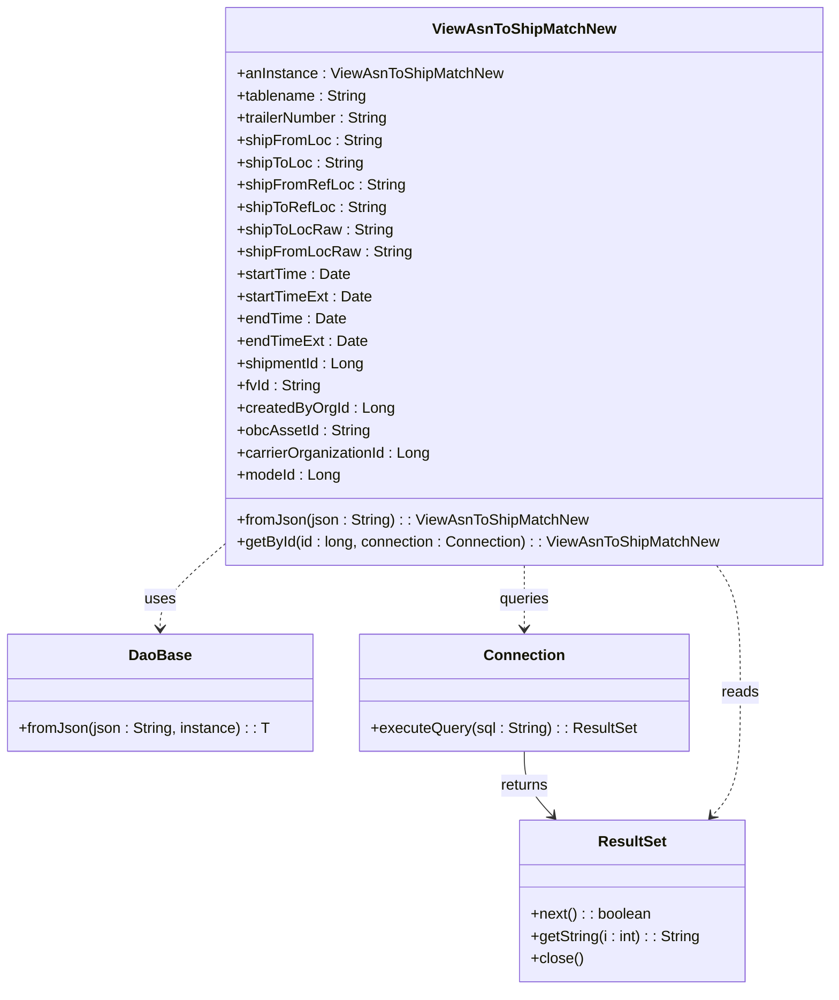

# Diagram: platform-java-lambdas/shipment/src/main/java/com/freightverify/shipment/datastore/postgresql/dao/ViewAsnToShipMatchNew.java


> Auto-generated by Obscura crawlers

## Diagram 1



### SVG

<svg id="container" width="881.109375" xmlns="http://www.w3.org/2000/svg" class="classDiagram" height="1064" viewBox="0 0 881.109375 1064" role="graphics-document document" aria-roledescription="class"><style>#container{font-family:"trebuchet ms",verdana,arial,sans-serif;font-size:16px;fill:#333;}@keyframes edge-animation-frame{from{stroke-dashoffset:0;}}@keyframes dash{to{stroke-dashoffset:0;}}#container .edge-animation-slow{stroke-dasharray:9,5!important;stroke-dashoffset:900;animation:dash 50s linear infinite;stroke-linecap:round;}#container .edge-animation-fast{stroke-dasharray:9,5!important;stroke-dashoffset:900;animation:dash 20s linear infinite;stroke-linecap:round;}#container .error-icon{fill:#552222;}#container .error-text{fill:#552222;stroke:#552222;}#container .edge-thickness-normal{stroke-width:1px;}#container .edge-thickness-thick{stroke-width:3.5px;}#container .edge-pattern-solid{stroke-dasharray:0;}#container .edge-thickness-invisible{stroke-width:0;fill:none;}#container .edge-pattern-dashed{stroke-dasharray:3;}#container .edge-pattern-dotted{stroke-dasharray:2;}#container .marker{fill:#333333;stroke:#333333;}#container .marker.cross{stroke:#333333;}#container svg{font-family:"trebuchet ms",verdana,arial,sans-serif;font-size:16px;}#container p{margin:0;}#container g.classGroup text{fill:#9370DB;stroke:none;font-family:"trebuchet ms",verdana,arial,sans-serif;font-size:10px;}#container g.classGroup text .title{font-weight:bolder;}#container .nodeLabel,#container .edgeLabel{color:#131300;}#container .edgeLabel .label rect{fill:#ECECFF;}#container .label text{fill:#131300;}#container .labelBkg{background:#ECECFF;}#container .edgeLabel .label span{background:#ECECFF;}#container .classTitle{font-weight:bolder;}#container .node rect,#container .node circle,#container .node ellipse,#container .node polygon,#container .node path{fill:#ECECFF;stroke:#9370DB;stroke-width:1px;}#container .divider{stroke:#9370DB;stroke-width:1;}#container g.clickable{cursor:pointer;}#container g.classGroup rect{fill:#ECECFF;stroke:#9370DB;}#container g.classGroup line{stroke:#9370DB;stroke-width:1;}#container .classLabel .box{stroke:none;stroke-width:0;fill:#ECECFF;opacity:0.5;}#container .classLabel .label{fill:#9370DB;font-size:10px;}#container .relation{stroke:#333333;stroke-width:1;fill:none;}#container .dashed-line{stroke-dasharray:3;}#container .dotted-line{stroke-dasharray:1 2;}#container #compositionStart,#container .composition{fill:#333333!important;stroke:#333333!important;stroke-width:1;}#container #compositionEnd,#container .composition{fill:#333333!important;stroke:#333333!important;stroke-width:1;}#container #dependencyStart,#container .dependency{fill:#333333!important;stroke:#333333!important;stroke-width:1;}#container #dependencyStart,#container .dependency{fill:#333333!important;stroke:#333333!important;stroke-width:1;}#container #extensionStart,#container .extension{fill:transparent!important;stroke:#333333!important;stroke-width:1;}#container #extensionEnd,#container .extension{fill:transparent!important;stroke:#333333!important;stroke-width:1;}#container #aggregationStart,#container .aggregation{fill:transparent!important;stroke:#333333!important;stroke-width:1;}#container #aggregationEnd,#container .aggregation{fill:transparent!important;stroke:#333333!important;stroke-width:1;}#container #lollipopStart,#container .lollipop{fill:#ECECFF!important;stroke:#333333!important;stroke-width:1;}#container #lollipopEnd,#container .lollipop{fill:#ECECFF!important;stroke:#333333!important;stroke-width:1;}#container .edgeTerminals{font-size:11px;line-height:initial;}#container .classTitleText{text-anchor:middle;font-size:18px;fill:#333;}#container .label-icon{display:inline-block;height:1em;overflow:visible;vertical-align:-0.125em;}#container .node .label-icon path{fill:currentColor;stroke:revert;stroke-width:revert;}#container :root{--mermaid-font-family:"trebuchet ms",verdana,arial,sans-serif;}</style><g><defs><marker id="container_class-aggregationStart" class="marker aggregation class" refX="18" refY="7" markerWidth="190" markerHeight="240" orient="auto"><path d="M 18,7 L9,13 L1,7 L9,1 Z"></path></marker></defs><defs><marker id="container_class-aggregationEnd" class="marker aggregation class" refX="1" refY="7" markerWidth="20" markerHeight="28" orient="auto"><path d="M 18,7 L9,13 L1,7 L9,1 Z"></path></marker></defs><defs><marker id="container_class-extensionStart" class="marker extension class" refX="18" refY="7" markerWidth="190" markerHeight="240" orient="auto"><path d="M 1,7 L18,13 V 1 Z"></path></marker></defs><defs><marker id="container_class-extensionEnd" class="marker extension class" refX="1" refY="7" markerWidth="20" markerHeight="28" orient="auto"><path d="M 1,1 V 13 L18,7 Z"></path></marker></defs><defs><marker id="container_class-compositionStart" class="marker composition class" refX="18" refY="7" markerWidth="190" markerHeight="240" orient="auto"><path d="M 18,7 L9,13 L1,7 L9,1 Z"></path></marker></defs><defs><marker id="container_class-compositionEnd" class="marker composition class" refX="1" refY="7" markerWidth="20" markerHeight="28" orient="auto"><path d="M 18,7 L9,13 L1,7 L9,1 Z"></path></marker></defs><defs><marker id="container_class-dependencyStart" class="marker dependency class" refX="6" refY="7" markerWidth="190" markerHeight="240" orient="auto"><path d="M 5,7 L9,13 L1,7 L9,1 Z"></path></marker></defs><defs><marker id="container_class-dependencyEnd" class="marker dependency class" refX="13" refY="7" markerWidth="20" markerHeight="28" orient="auto"><path d="M 18,7 L9,13 L14,7 L9,1 Z"></path></marker></defs><defs><marker id="container_class-lollipopStart" class="marker lollipop class" refX="13" refY="7" markerWidth="190" markerHeight="240" orient="auto"><circle stroke="black" fill="transparent" cx="7" cy="7" r="6"></circle></marker></defs><defs><marker id="container_class-lollipopEnd" class="marker lollipop class" refX="1" refY="7" markerWidth="190" markerHeight="240" orient="auto"><circle stroke="black" fill="transparent" cx="7" cy="7" r="6"></circle></marker></defs><g class="root"><g class="clusters"></g><g class="edgePaths"><path d="M238.273,585.118L226.842,595.099C215.41,605.079,192.547,625.039,181.115,640.186C169.684,655.333,169.684,665.667,169.684,670.833L169.684,676" id="id_ViewAsnToShipMatchNew_DaoBase_1" class="edge-thickness-normal edge-pattern-dashed relation" style=";;;" data-edge="true" data-et="edge" data-id="id_ViewAsnToShipMatchNew_DaoBase_1" data-points="W3sieCI6MjM4LjI3MzQzNzUsInkiOjU4NS4xMTgzNjkxMjMwMzQyfSx7IngiOjE2OS42ODM1OTM3NSwieSI6NjQ1fSx7IngiOjE2OS42ODM1OTM3NSwieSI6NjgyfV0=" marker-end="url(#container_class-dependencyEnd)"></path><path d="M555.691,608L555.691,614.167C555.691,620.333,555.691,632.667,555.691,644C555.691,655.333,555.691,665.667,555.691,670.833L555.691,676" id="id_ViewAsnToShipMatchNew_Connection_2" class="edge-thickness-normal edge-pattern-dashed relation" style=";;;" data-edge="true" data-et="edge" data-id="id_ViewAsnToShipMatchNew_Connection_2" data-points="W3sieCI6NTU1LjY5MTQwNjI1LCJ5Ijo2MDh9LHsieCI6NTU1LjY5MTQwNjI1LCJ5Ijo2NDV9LHsieCI6NTU1LjY5MTQwNjI1LCJ5Ijo2ODJ9XQ==" marker-end="url(#container_class-dependencyEnd)"></path><path d="M555.691,808L555.691,814.167C555.691,820.333,555.691,832.667,560.715,844.266C565.738,855.865,575.786,866.73,580.809,872.162L585.833,877.595" id="id_Connection_ResultSet_3" class="edge-thickness-normal edge-pattern-solid relation" style=";;;" data-edge="true" data-et="edge" data-id="id_Connection_ResultSet_3" data-points="W3sieCI6NTU1LjY5MTQwNjI1LCJ5Ijo4MDh9LHsieCI6NTU1LjY5MTQwNjI1LCJ5Ijo4NDV9LHsieCI6NTg5LjkwNjI2NTc1MTAwOCwieSI6ODgyfV0=" marker-end="url(#container_class-dependencyEnd)"></path><path d="M759.845,608L764.041,614.167C768.238,620.333,776.63,632.667,780.827,655.5C785.023,678.333,785.023,711.667,785.023,745C785.023,778.333,785.023,811.667,780,833.766C774.976,855.865,764.929,866.73,759.906,872.162L754.882,877.595" id="id_ViewAsnToShipMatchNew_ResultSet_4" class="edge-thickness-normal edge-pattern-dashed relation" style=";;;" data-edge="true" data-et="edge" data-id="id_ViewAsnToShipMatchNew_ResultSet_4" data-points="W3sieCI6NzU5Ljg0NDU0OTc5NTk5NCwieSI6NjA4fSx7IngiOjc4NS4wMjM0Mzc1LCJ5Ijo2NDV9LHsieCI6Nzg1LjAyMzQzNzUsInkiOjc0NX0seyJ4Ijo3ODUuMDIzNDM3NSwieSI6ODQ1fSx7IngiOjc1MC44MDg1Nzc5OTg5OTIsInkiOjg4Mn1d" marker-end="url(#container_class-dependencyEnd)"></path></g><g class="edgeLabels"><g class="edgeLabel" transform="translate(169.68359375, 645)"><g class="label" data-id="id_ViewAsnToShipMatchNew_DaoBase_1" transform="translate(-16.4921875, -12)"><foreignObject width="32.984375" height="24"><div xmlns="http://www.w3.org/1999/xhtml" class="labelBkg" style="display: table-cell; white-space: nowrap; line-height: 1.5; max-width: 200px; text-align: center;"><span class="edgeLabel"><p>uses</p></span></div></foreignObject></g></g><g class="edgeLabel" transform="translate(555.69140625, 645)"><g class="label" data-id="id_ViewAsnToShipMatchNew_Connection_2" transform="translate(-27.2421875, -12)"><foreignObject width="54.484375" height="24"><div xmlns="http://www.w3.org/1999/xhtml" class="labelBkg" style="display: table-cell; white-space: nowrap; line-height: 1.5; max-width: 200px; text-align: center;"><span class="edgeLabel"><p>queries</p></span></div></foreignObject></g></g><g class="edgeLabel" transform="translate(555.69140625, 845)"><g class="label" data-id="id_Connection_ResultSet_3" transform="translate(-26.265625, -12)"><foreignObject width="52.53125" height="24"><div xmlns="http://www.w3.org/1999/xhtml" class="labelBkg" style="display: table-cell; white-space: nowrap; line-height: 1.5; max-width: 200px; text-align: center;"><span class="edgeLabel"><p>returns</p></span></div></foreignObject></g></g><g class="edgeLabel" transform="translate(785.0234375, 745)"><g class="label" data-id="id_ViewAsnToShipMatchNew_ResultSet_4" transform="translate(-20.0078125, -12)"><foreignObject width="40.015625" height="24"><div xmlns="http://www.w3.org/1999/xhtml" class="labelBkg" style="display: table-cell; white-space: nowrap; line-height: 1.5; max-width: 200px; text-align: center;"><span class="edgeLabel"><p>reads</p></span></div></foreignObject></g></g></g><g class="nodes"><g class="node default" id="classId-ViewAsnToShipMatchNew-0" transform="translate(555.69140625, 308)"><g class="basic label-container"><path d="M-317.41796875 -300 L317.41796875 -300 L317.41796875 300 L-317.41796875 300" stroke="none" stroke-width="0" fill="#ECECFF" style=""></path><path d="M-317.41796875 -300 C-181.79558788032216 -300, -46.17320701064432 -300, 317.41796875 -300 M-317.41796875 -300 C-148.26992739563323 -300, 20.878113958733536 -300, 317.41796875 -300 M317.41796875 -300 C317.41796875 -85.01058902781881, 317.41796875 129.97882194436238, 317.41796875 300 M317.41796875 -300 C317.41796875 -72.50596682324087, 317.41796875 154.98806635351826, 317.41796875 300 M317.41796875 300 C141.44275931935653 300, -34.53245011128695 300, -317.41796875 300 M317.41796875 300 C138.86961906236345 300, -39.67873062527309 300, -317.41796875 300 M-317.41796875 300 C-317.41796875 87.05591582203073, -317.41796875 -125.88816835593855, -317.41796875 -300 M-317.41796875 300 C-317.41796875 165.36520050465975, -317.41796875 30.730401009319507, -317.41796875 -300" stroke="#9370DB" stroke-width="1.3" fill="none" stroke-dasharray="0 0" style=""></path></g><g class="annotation-group text" transform="translate(0, -276)"></g><g class="label-group text" transform="translate(-92.9765625, -276)"><g class="label" style="font-weight: bolder" transform="translate(0,-12)"><foreignObject width="185.953125" height="24"><div xmlns="http://www.w3.org/1999/xhtml" style="display: table-cell; white-space: nowrap; line-height: 1.5; max-width: 234px; text-align: center;"><span class="nodeLabel markdown-node-label" style=""><p>ViewAsnToShipMatchNew</p></span></div></foreignObject></g></g><g class="members-group text" transform="translate(-305.41796875, -228)"><g class="label" style="" transform="translate(0,-12)"><foreignObject width="282.8125" height="24"><div xmlns="http://www.w3.org/1999/xhtml" style="display: table-cell; white-space: nowrap; line-height: 1.5; max-width: 341px; text-align: center;"><span class="nodeLabel markdown-node-label" style=""><p>+anInstance : ViewAsnToShipMatchNew</p></span></div></foreignObject></g><g class="label" style="" transform="translate(0,12)"><foreignObject width="140.828125" height="24"><div xmlns="http://www.w3.org/1999/xhtml" style="display: table-cell; white-space: nowrap; line-height: 1.5; max-width: 199px; text-align: center;"><span class="nodeLabel markdown-node-label" style=""><p>+tablename : String</p></span></div></foreignObject></g><g class="label" style="" transform="translate(0,36)"><foreignObject width="165.578125" height="24"><div xmlns="http://www.w3.org/1999/xhtml" style="display: table-cell; white-space: nowrap; line-height: 1.5; max-width: 224px; text-align: center;"><span class="nodeLabel markdown-node-label" style=""><p>+trailerNumber : String</p></span></div></foreignObject></g><g class="label" style="" transform="translate(0,60)"><foreignObject width="154.671875" height="24"><div xmlns="http://www.w3.org/1999/xhtml" style="display: table-cell; white-space: nowrap; line-height: 1.5; max-width: 213px; text-align: center;"><span class="nodeLabel markdown-node-label" style=""><p>+shipFromLoc : String</p></span></div></foreignObject></g><g class="label" style="" transform="translate(0,84)"><foreignObject width="135.359375" height="24"><div xmlns="http://www.w3.org/1999/xhtml" style="display: table-cell; white-space: nowrap; line-height: 1.5; max-width: 193px; text-align: center;"><span class="nodeLabel markdown-node-label" style=""><p>+shipToLoc : String</p></span></div></foreignObject></g><g class="label" style="" transform="translate(0,108)"><foreignObject width="178.1875" height="24"><div xmlns="http://www.w3.org/1999/xhtml" style="display: table-cell; white-space: nowrap; line-height: 1.5; max-width: 236px; text-align: center;"><span class="nodeLabel markdown-node-label" style=""><p>+shipFromRefLoc : String</p></span></div></foreignObject></g><g class="label" style="" transform="translate(0,132)"><foreignObject width="158.875" height="24"><div xmlns="http://www.w3.org/1999/xhtml" style="display: table-cell; white-space: nowrap; line-height: 1.5; max-width: 217px; text-align: center;"><span class="nodeLabel markdown-node-label" style=""><p>+shipToRefLoc : String</p></span></div></foreignObject></g><g class="label" style="" transform="translate(0,156)"><foreignObject width="164.96875" height="24"><div xmlns="http://www.w3.org/1999/xhtml" style="display: table-cell; white-space: nowrap; line-height: 1.5; max-width: 223px; text-align: center;"><span class="nodeLabel markdown-node-label" style=""><p>+shipToLocRaw : String</p></span></div></foreignObject></g><g class="label" style="" transform="translate(0,180)"><foreignObject width="184.28125" height="24"><div xmlns="http://www.w3.org/1999/xhtml" style="display: table-cell; white-space: nowrap; line-height: 1.5; max-width: 242px; text-align: center;"><span class="nodeLabel markdown-node-label" style=""><p>+shipFromLocRaw : String</p></span></div></foreignObject></g><g class="label" style="" transform="translate(0,204)"><foreignObject width="122.421875" height="24"><div xmlns="http://www.w3.org/1999/xhtml" style="display: table-cell; white-space: nowrap; line-height: 1.5; max-width: 180px; text-align: center;"><span class="nodeLabel markdown-node-label" style=""><p>+startTime : Date</p></span></div></foreignObject></g><g class="label" style="" transform="translate(0,228)"><foreignObject width="144.515625" height="24"><div xmlns="http://www.w3.org/1999/xhtml" style="display: table-cell; white-space: nowrap; line-height: 1.5; max-width: 202px; text-align: center;"><span class="nodeLabel markdown-node-label" style=""><p>+startTimeExt : Date</p></span></div></foreignObject></g><g class="label" style="" transform="translate(0,252)"><foreignObject width="116.296875" height="24"><div xmlns="http://www.w3.org/1999/xhtml" style="display: table-cell; white-space: nowrap; line-height: 1.5; max-width: 174px; text-align: center;"><span class="nodeLabel markdown-node-label" style=""><p>+endTime : Date</p></span></div></foreignObject></g><g class="label" style="" transform="translate(0,276)"><foreignObject width="138.390625" height="24"><div xmlns="http://www.w3.org/1999/xhtml" style="display: table-cell; white-space: nowrap; line-height: 1.5; max-width: 196px; text-align: center;"><span class="nodeLabel markdown-node-label" style=""><p>+endTimeExt : Date</p></span></div></foreignObject></g><g class="label" style="" transform="translate(0,300)"><foreignObject width="137.65625" height="24"><div xmlns="http://www.w3.org/1999/xhtml" style="display: table-cell; white-space: nowrap; line-height: 1.5; max-width: 196px; text-align: center;"><span class="nodeLabel markdown-node-label" style=""><p>+shipmentId : Long</p></span></div></foreignObject></g><g class="label" style="" transform="translate(0,324)"><foreignObject width="90.46875" height="24"><div xmlns="http://www.w3.org/1999/xhtml" style="display: table-cell; white-space: nowrap; line-height: 1.5; max-width: 149px; text-align: center;"><span class="nodeLabel markdown-node-label" style=""><p>+fvId : String</p></span></div></foreignObject></g><g class="label" style="" transform="translate(0,348)"><foreignObject width="166.5625" height="24"><div xmlns="http://www.w3.org/1999/xhtml" style="display: table-cell; white-space: nowrap; line-height: 1.5; max-width: 225px; text-align: center;"><span class="nodeLabel markdown-node-label" style=""><p>+createdByOrgId : Long</p></span></div></foreignObject></g><g class="label" style="" transform="translate(0,372)"><foreignObject width="142.421875" height="24"><div xmlns="http://www.w3.org/1999/xhtml" style="display: table-cell; white-space: nowrap; line-height: 1.5; max-width: 200px; text-align: center;"><span class="nodeLabel markdown-node-label" style=""><p>+obcAssetId : String</p></span></div></foreignObject></g><g class="label" style="" transform="translate(0,396)"><foreignObject width="209.234375" height="24"><div xmlns="http://www.w3.org/1999/xhtml" style="display: table-cell; white-space: nowrap; line-height: 1.5; max-width: 267px; text-align: center;"><span class="nodeLabel markdown-node-label" style=""><p>+carrierOrganizationId : Long</p></span></div></foreignObject></g><g class="label" style="" transform="translate(0,420)"><foreignObject width="110.546875" height="24"><div xmlns="http://www.w3.org/1999/xhtml" style="display: table-cell; white-space: nowrap; line-height: 1.5; max-width: 169px; text-align: center;"><span class="nodeLabel markdown-node-label" style=""><p>+modeId : Long</p></span></div></foreignObject></g></g><g class="methods-group text" transform="translate(-305.41796875, 252)"><g class="label" style="" transform="translate(0,-12)"><foreignObject width="373.453125" height="24"><div xmlns="http://www.w3.org/1999/xhtml" style="display: table-cell; white-space: nowrap; line-height: 1.5; max-width: 431px; text-align: center;"><span class="nodeLabel markdown-node-label" style=""><p>+fromJson(json : String) : : ViewAsnToShipMatchNew</p></span></div></foreignObject></g><g class="label" style="" transform="translate(0,12)"><foreignObject width="517.859375" height="24"><div xmlns="http://www.w3.org/1999/xhtml" style="display: table-cell; white-space: nowrap; line-height: 1.5; max-width: 576px; text-align: center;"><span class="nodeLabel markdown-node-label" style=""><p>+getById(id : long, connection : Connection) : : ViewAsnToShipMatchNew</p></span></div></foreignObject></g></g><g class="divider" style=""><path d="M-317.41796875 -252 C-145.76178986220813 -252, 25.894389025583735 -252, 317.41796875 -252 M-317.41796875 -252 C-108.63496229998998 -252, 100.14804415002004 -252, 317.41796875 -252" stroke="#9370DB" stroke-width="1.3" fill="none" stroke-dasharray="0 0" style=""></path></g><g class="divider" style=""><path d="M-317.41796875 228 C-67.95847660734069 228, 181.50101553531863 228, 317.41796875 228 M-317.41796875 228 C-143.790969425039 228, 29.836029899921982 228, 317.41796875 228" stroke="#9370DB" stroke-width="1.3" fill="none" stroke-dasharray="0 0" style=""></path></g></g><g class="node default" id="classId-DaoBase-1" transform="translate(169.68359375, 745)"><g class="basic label-container"><path d="M-161.68359375 -63 L161.68359375 -63 L161.68359375 63 L-161.68359375 63" stroke="none" stroke-width="0" fill="#ECECFF" style=""></path><path d="M-161.68359375 -63 C-96.44507249492244 -63, -31.206551239844885 -63, 161.68359375 -63 M-161.68359375 -63 C-64.41394454581294 -63, 32.85570465837412 -63, 161.68359375 -63 M161.68359375 -63 C161.68359375 -34.29435111241628, 161.68359375 -5.588702224832559, 161.68359375 63 M161.68359375 -63 C161.68359375 -37.61229312458879, 161.68359375 -12.224586249177584, 161.68359375 63 M161.68359375 63 C44.11194673376822 63, -73.45970028246356 63, -161.68359375 63 M161.68359375 63 C94.59396365580767 63, 27.50433356161534 63, -161.68359375 63 M-161.68359375 63 C-161.68359375 30.32739193494283, -161.68359375 -2.3452161301143377, -161.68359375 -63 M-161.68359375 63 C-161.68359375 26.414018910948883, -161.68359375 -10.171962178102234, -161.68359375 -63" stroke="#9370DB" stroke-width="1.3" fill="none" stroke-dasharray="0 0" style=""></path></g><g class="annotation-group text" transform="translate(0, -39)"></g><g class="label-group text" transform="translate(-31.7109375, -39)"><g class="label" style="font-weight: bolder" transform="translate(0,-12)"><foreignObject width="63.421875" height="24"><div xmlns="http://www.w3.org/1999/xhtml" style="display: table-cell; white-space: nowrap; line-height: 1.5; max-width: 113px; text-align: center;"><span class="nodeLabel markdown-node-label" style=""><p>DaoBase</p></span></div></foreignObject></g></g><g class="members-group text" transform="translate(-149.68359375, 9)"></g><g class="methods-group text" transform="translate(-149.68359375, 39)"><g class="label" style="" transform="translate(0,-12)"><foreignObject width="267.65625" height="24"><div xmlns="http://www.w3.org/1999/xhtml" style="display: table-cell; white-space: nowrap; line-height: 1.5; max-width: 326px; text-align: center;"><span class="nodeLabel markdown-node-label" style=""><p>+fromJson(json : String, instance) : : T</p></span></div></foreignObject></g></g><g class="divider" style=""><path d="M-161.68359375 -15 C-91.11862133291378 -15, -20.55364891582755 -15, 161.68359375 -15 M-161.68359375 -15 C-36.500075111949116 -15, 88.68344352610177 -15, 161.68359375 -15" stroke="#9370DB" stroke-width="1.3" fill="none" stroke-dasharray="0 0" style=""></path></g><g class="divider" style=""><path d="M-161.68359375 9 C-85.46963294048982 9, -9.255672130979633 9, 161.68359375 9 M-161.68359375 9 C-58.60084696505119 9, 44.48189981989762 9, 161.68359375 9" stroke="#9370DB" stroke-width="1.3" fill="none" stroke-dasharray="0 0" style=""></path></g></g><g class="node default" id="classId-Connection-2" transform="translate(555.69140625, 745)"><g class="basic label-container"><path d="M-174.32421875 -63 L174.32421875 -63 L174.32421875 63 L-174.32421875 63" stroke="none" stroke-width="0" fill="#ECECFF" style=""></path><path d="M-174.32421875 -63 C-100.09771493907998 -63, -25.871211128159956 -63, 174.32421875 -63 M-174.32421875 -63 C-85.42137672923484 -63, 3.481465291530327 -63, 174.32421875 -63 M174.32421875 -63 C174.32421875 -29.406819285883422, 174.32421875 4.186361428233155, 174.32421875 63 M174.32421875 -63 C174.32421875 -29.131350683757354, 174.32421875 4.737298632485292, 174.32421875 63 M174.32421875 63 C98.24736481619546 63, 22.170510882390914 63, -174.32421875 63 M174.32421875 63 C64.59453278592916 63, -45.13515317814168 63, -174.32421875 63 M-174.32421875 63 C-174.32421875 18.79704621450766, -174.32421875 -25.40590757098468, -174.32421875 -63 M-174.32421875 63 C-174.32421875 36.766861035392814, -174.32421875 10.533722070785629, -174.32421875 -63" stroke="#9370DB" stroke-width="1.3" fill="none" stroke-dasharray="0 0" style=""></path></g><g class="annotation-group text" transform="translate(0, -39)"></g><g class="label-group text" transform="translate(-41.2265625, -39)"><g class="label" style="font-weight: bolder" transform="translate(0,-12)"><foreignObject width="82.453125" height="24"><div xmlns="http://www.w3.org/1999/xhtml" style="display: table-cell; white-space: nowrap; line-height: 1.5; max-width: 132px; text-align: center;"><span class="nodeLabel markdown-node-label" style=""><p>Connection</p></span></div></foreignObject></g></g><g class="members-group text" transform="translate(-162.32421875, 9)"></g><g class="methods-group text" transform="translate(-162.32421875, 39)"><g class="label" style="" transform="translate(0,-12)"><foreignObject width="283.421875" height="24"><div xmlns="http://www.w3.org/1999/xhtml" style="display: table-cell; white-space: nowrap; line-height: 1.5; max-width: 341px; text-align: center;"><span class="nodeLabel markdown-node-label" style=""><p>+executeQuery(sql : String) : : ResultSet</p></span></div></foreignObject></g></g><g class="divider" style=""><path d="M-174.32421875 -15 C-91.93662529346146 -15, -9.549031836922921 -15, 174.32421875 -15 M-174.32421875 -15 C-102.90785835636147 -15, -31.491497962722946 -15, 174.32421875 -15" stroke="#9370DB" stroke-width="1.3" fill="none" stroke-dasharray="0 0" style=""></path></g><g class="divider" style=""><path d="M-174.32421875 9 C-60.27005362087384 9, 53.78411150825232 9, 174.32421875 9 M-174.32421875 9 C-45.887835711016066 9, 82.54854732796787 9, 174.32421875 9" stroke="#9370DB" stroke-width="1.3" fill="none" stroke-dasharray="0 0" style=""></path></g></g><g class="node default" id="classId-ResultSet-3" transform="translate(670.357421875, 969)"><g class="basic label-container"><path d="M-121.3984375 -87 L121.3984375 -87 L121.3984375 87 L-121.3984375 87" stroke="none" stroke-width="0" fill="#ECECFF" style=""></path><path d="M-121.3984375 -87 C-51.51628898790035 -87, 18.365859524199294 -87, 121.3984375 -87 M-121.3984375 -87 C-24.402247865878252 -87, 72.5939417682435 -87, 121.3984375 -87 M121.3984375 -87 C121.3984375 -35.071660156804796, 121.3984375 16.856679686390407, 121.3984375 87 M121.3984375 -87 C121.3984375 -47.01581721122876, 121.3984375 -7.031634422457515, 121.3984375 87 M121.3984375 87 C51.661409724767765 87, -18.07561805046447 87, -121.3984375 87 M121.3984375 87 C65.95732519225643 87, 10.516212884512868 87, -121.3984375 87 M-121.3984375 87 C-121.3984375 29.59161127335662, -121.3984375 -27.81677745328676, -121.3984375 -87 M-121.3984375 87 C-121.3984375 33.76751690646232, -121.3984375 -19.464966187075362, -121.3984375 -87" stroke="#9370DB" stroke-width="1.3" fill="none" stroke-dasharray="0 0" style=""></path></g><g class="annotation-group text" transform="translate(0, -63)"></g><g class="label-group text" transform="translate(-35.21875, -63)"><g class="label" style="font-weight: bolder" transform="translate(0,-12)"><foreignObject width="70.4375" height="24"><div xmlns="http://www.w3.org/1999/xhtml" style="display: table-cell; white-space: nowrap; line-height: 1.5; max-width: 119px; text-align: center;"><span class="nodeLabel markdown-node-label" style=""><p>ResultSet</p></span></div></foreignObject></g></g><g class="members-group text" transform="translate(-109.3984375, -15)"></g><g class="methods-group text" transform="translate(-109.3984375, 15)"><g class="label" style="" transform="translate(0,-12)"><foreignObject width="129.6875" height="24"><div xmlns="http://www.w3.org/1999/xhtml" style="display: table-cell; white-space: nowrap; line-height: 1.5; max-width: 187px; text-align: center;"><span class="nodeLabel markdown-node-label" style=""><p>+next() : : boolean</p></span></div></foreignObject></g><g class="label" style="" transform="translate(0,12)"><foreignObject width="183.578125" height="24"><div xmlns="http://www.w3.org/1999/xhtml" style="display: table-cell; white-space: nowrap; line-height: 1.5; max-width: 242px; text-align: center;"><span class="nodeLabel markdown-node-label" style=""><p>+getString(i : int) : : String</p></span></div></foreignObject></g><g class="label" style="" transform="translate(0,36)"><foreignObject width="56.15625" height="24"><div xmlns="http://www.w3.org/1999/xhtml" style="display: table-cell; white-space: nowrap; line-height: 1.5; max-width: 114px; text-align: center;"><span class="nodeLabel markdown-node-label" style=""><p>+close()</p></span></div></foreignObject></g></g><g class="divider" style=""><path d="M-121.3984375 -39 C-60.07887486289347 -39, 1.2406877742130575 -39, 121.3984375 -39 M-121.3984375 -39 C-68.42281532163005 -39, -15.447193143260108 -39, 121.3984375 -39" stroke="#9370DB" stroke-width="1.3" fill="none" stroke-dasharray="0 0" style=""></path></g><g class="divider" style=""><path d="M-121.3984375 -15 C-51.9047586276334 -15, 17.588920244733202 -15, 121.3984375 -15 M-121.3984375 -15 C-28.457459571352473 -15, 64.48351835729505 -15, 121.3984375 -15" stroke="#9370DB" stroke-width="1.3" fill="none" stroke-dasharray="0 0" style=""></path></g></g></g></g></g></svg>

## Diagram 2

```mermaid
flowchart TD
Start([Start]) --> QueryDB[/"Execute query: select row_to_json(row) from (select * from public.vw_asn_to_ship_match_new where id = {id}) row"/]
QueryDB --> CheckResult{results.next()?}
CheckResult -->|yes| ReadJson["json = results.getString(1)"]
ReadJson --> FromJson["ViewAsnToShipMatchNew.fromJson(json)"]
FromJson --> ReturnObj([Return object])
CheckResult -->|no| ReturnNull([Return null])
ReturnObj --> End([End])
ReturnNull --> End
```

> SVG rendering failed for this diagram.
