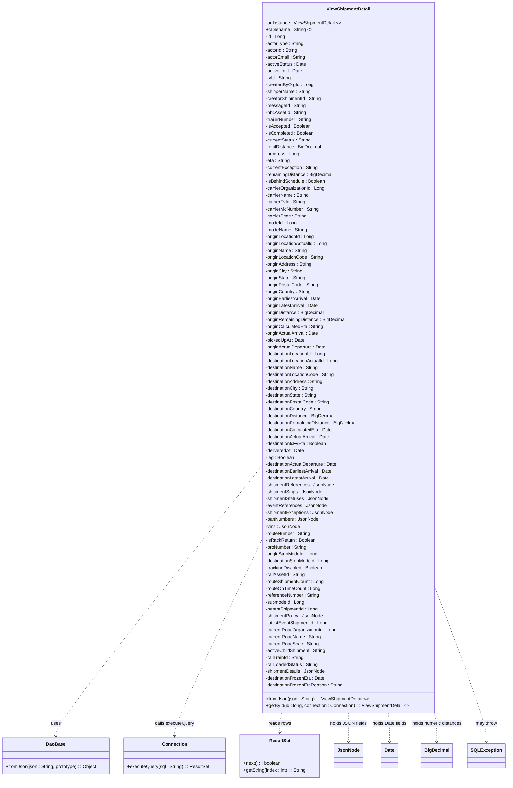
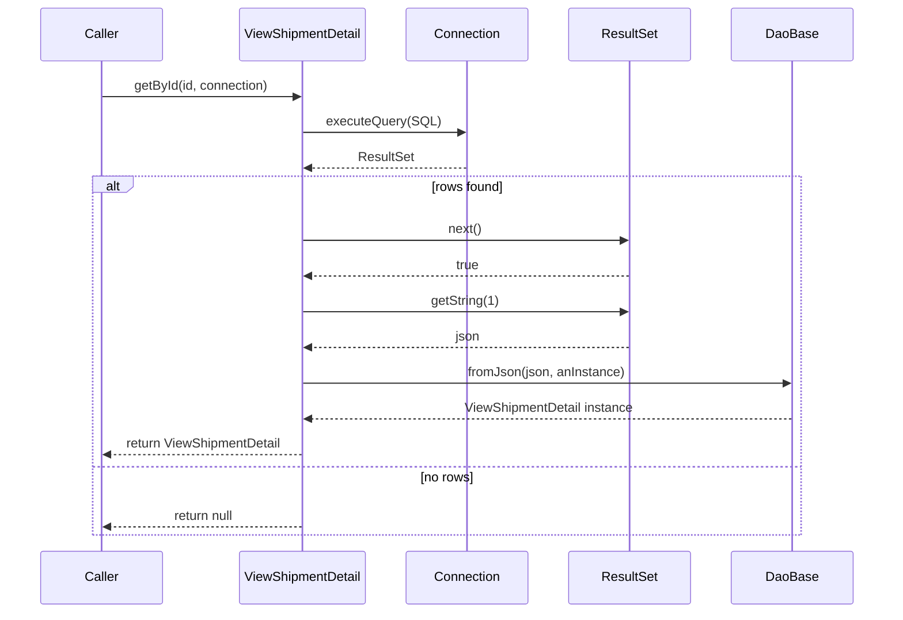

# Diagram: platform-java-lambdas/shipment/src/main/java/com/freightverify/shipment/datastore/postgresql/dao/ViewShipmentDetail.java

> Auto-generated by Obscura crawlers

## Diagram 1

### SVG

<svg id="container" width="1750.625" xmlns="http://www.w3.org/2000/svg" class="classDiagram" height="2712" viewBox="0 0 1750.625 2712" role="graphics-document document" aria-roledescription="class"><g><defs><marker id="container_class-aggregationStart" class="marker aggregation class" refX="18" refY="7" markerWidth="190" markerHeight="240" orient="auto"><path d="M 18,7 L9,13 L1,7 L9,1 Z"></path></marker></defs><defs><marker id="container_class-aggregationEnd" class="marker aggregation class" refX="1" refY="7" markerWidth="20" markerHeight="28" orient="auto"><path d="M 18,7 L9,13 L1,7 L9,1 Z"></path></marker></defs><defs><marker id="container_class-extensionStart" class="marker extension class" refX="18" refY="7" markerWidth="190" markerHeight="240" orient="auto"><path d="M 1,7 L18,13 V 1 Z"></path></marker></defs><defs><marker id="container_class-extensionEnd" class="marker extension class" refX="1" refY="7" markerWidth="20" markerHeight="28" orient="auto"><path d="M 1,1 V 13 L18,7 Z"></path></marker></defs><defs><marker id="container_class-compositionStart" class="marker composition class" refX="18" refY="7" markerWidth="190" markerHeight="240" orient="auto"><path d="M 18,7 L9,13 L1,7 L9,1 Z"></path></marker></defs><defs><marker id="container_class-compositionEnd" class="marker composition class" refX="1" refY="7" markerWidth="20" markerHeight="28" orient="auto"><path d="M 18,7 L9,13 L1,7 L9,1 Z"></path></marker></defs><defs><marker id="container_class-dependencyStart" class="marker dependency class" refX="6" refY="7" markerWidth="190" markerHeight="240" orient="auto"><path d="M 5,7 L9,13 L1,7 L9,1 Z"></path></marker></defs><defs><marker id="container_class-dependencyEnd" class="marker dependency class" refX="13" refY="7" markerWidth="20" markerHeight="28" orient="auto"><path d="M 18,7 L9,13 L14,7 L9,1 Z"></path></marker></defs><defs><marker id="container_class-lollipopStart" class="marker lollipop class" refX="13" refY="7" markerWidth="190" markerHeight="240" orient="auto"><circle stroke="black" fill="transparent" cx="7" cy="7" r="6"></circle></marker></defs><defs><marker id="container_class-lollipopEnd" class="marker lollipop class" refX="1" refY="7" markerWidth="190" markerHeight="240" orient="auto"><circle stroke="black" fill="transparent" cx="7" cy="7" r="6"></circle></marker></defs><g class="root"><g class="clusters"></g><g class="edgePaths"><path d="M904.629,1621.357L786.22,1770.631C667.811,1919.905,430.993,2218.452,312.585,2374.893C194.176,2531.333,194.176,2545.667,194.176,2552.833L194.176,2560" id="id_ViewShipmentDetail_DaoBase_1" class="edge-thickness-normal edge-pattern-dashed relation" style=";;;" data-edge="true" data-et="edge" data-id="id_ViewShipmentDetail_DaoBase_1" data-points="W3sieCI6OTA0LjYyODkwNjI1LCJ5IjoxNjIxLjM1NzE3Njg0Mzc3NDh9LHsieCI6MTk0LjE3NTc4MTI1LCJ5IjoyNTE3fSx7IngiOjE5NC4xNzU3ODEyNSwieSI6MjU2Nn1d" marker-end="url(#container_class-dependencyEnd)"></path><path d="M904.629,1879.84L854.637,1986.034C804.645,2092.227,704.66,2304.613,654.668,2417.973C604.676,2531.333,604.676,2545.667,604.676,2552.833L604.676,2560" id="id_ViewShipmentDetail_Connection_2" class="edge-thickness-normal edge-pattern-dashed relation" style=";;;" data-edge="true" data-et="edge" data-id="id_ViewShipmentDetail_Connection_2" data-points="W3sieCI6OTA0LjYyODkwNjI1LCJ5IjoxODc5Ljg0MDMzNzEyMDM5NzJ9LHsieCI6NjA0LjY3NTc4MTI1LCJ5IjoyNTE3fSx7IngiOjYwNC42NzU3ODEyNSwieSI6MjU2Nn1d" marker-end="url(#container_class-dependencyEnd)"></path><path d="M974.896,2480L973.753,2486.167C972.61,2492.333,970.325,2504.667,969.182,2516C968.039,2527.333,968.039,2537.667,968.039,2542.833L968.039,2548" id="id_ViewShipmentDetail_ResultSet_3" class="edge-thickness-normal edge-pattern-dashed relation" style=";;;" data-edge="true" data-et="edge" data-id="id_ViewShipmentDetail_ResultSet_3" data-points="W3sieCI6OTc0Ljg5NjE3OTA1NTM4MSwieSI6MjQ4MH0seyJ4Ijo5NjguMDM5MDYyNSwieSI6MjUxN30seyJ4Ijo5NjguMDM5MDYyNSwieSI6MjU1NH1d" marker-end="url(#container_class-dependencyEnd)"></path><path d="M1203.961,2480L1203.961,2486.167C1203.961,2492.333,1203.961,2504.667,1203.961,2521.5C1203.961,2538.333,1203.961,2559.667,1203.961,2570.333L1203.961,2581" id="id_ViewShipmentDetail_JsonNode_4" class="edge-thickness-normal edge-pattern-dashed relation" style=";;;" data-edge="true" data-et="edge" data-id="id_ViewShipmentDetail_JsonNode_4" data-points="W3sieCI6MTIwMy45NjA5Mzc1LCJ5IjoyNDgwfSx7IngiOjEyMDMuOTYwOTM3NSwieSI6MjUxN30seyJ4IjoxMjAzLjk2MDkzNzUsInkiOjI1ODd9XQ==" marker-end="url(#container_class-dependencyEnd)"></path><path d="M1342.592,2480L1343.284,2486.167C1343.976,2492.333,1345.359,2504.667,1346.051,2521.5C1346.742,2538.333,1346.742,2559.667,1346.742,2570.333L1346.742,2581" id="id_ViewShipmentDetail_Date_5" class="edge-thickness-normal edge-pattern-dashed relation" style=";;;" data-edge="true" data-et="edge" data-id="id_ViewShipmentDetail_Date_5" data-points="W3sieCI6MTM0Mi41OTIyMjE4Njc2MzU1LCJ5IjoyNDgwfSx7IngiOjEzNDYuNzQyMTg3NSwieSI6MjUxN30seyJ4IjoxMzQ2Ljc0MjE4NzUsInkiOjI1ODd9XQ==" marker-end="url(#container_class-dependencyEnd)"></path><path d="M1503.293,2464.885L1505.423,2473.571C1507.552,2482.257,1511.811,2499.628,1513.941,2518.981C1516.07,2538.333,1516.07,2559.667,1516.07,2570.333L1516.07,2581" id="id_ViewShipmentDetail_BigDecimal_6" class="edge-thickness-normal edge-pattern-dashed relation" style=";;;" data-edge="true" data-et="edge" data-id="id_ViewShipmentDetail_BigDecimal_6" data-points="W3sieCI6MTUwMy4yOTI5Njg3NSwieSI6MjQ2NC44ODUwNjg4MzYwNDUzfSx7IngiOjE1MTYuMDcwMzEyNSwieSI6MjUxN30seyJ4IjoxNTE2LjA3MDMxMjUsInkiOjI1ODd9XQ==" marker-end="url(#container_class-dependencyEnd)"></path><path d="M1503.293,2043.239L1532.865,2122.199C1562.438,2201.159,1621.582,2359.08,1651.154,2448.706C1680.727,2538.333,1680.727,2559.667,1680.727,2570.333L1680.727,2581" id="id_ViewShipmentDetail_SQLException_7" class="edge-thickness-normal edge-pattern-dashed relation" style=";;;" data-edge="true" data-et="edge" data-id="id_ViewShipmentDetail_SQLException_7" data-points="W3sieCI6MTUwMy4yOTI5Njg3NSwieSI6MjA0My4yMzg5ODgzMDAwNjg3fSx7IngiOjE2ODAuNzI2NTYyNSwieSI6MjUxN30seyJ4IjoxNjgwLjcyNjU2MjUsInkiOjI1ODd9XQ==" marker-end="url(#container_class-dependencyEnd)"></path></g><g class="edgeLabels"><g class="edgeLabel" transform="translate(194.17578125, 2517)"><g class="label" data-id="id_ViewShipmentDetail_DaoBase_1" transform="translate(-16.4921875, -12)"><foreignObject width="32.984375" height="24">

uses

</foreignObject></g></g><g class="edgeLabel" transform="translate(604.67578125, 2517)"><g class="label" data-id="id_ViewShipmentDetail_Connection_2" transform="translate(-68.1171875, -12)"><foreignObject width="136.234375" height="24">

calls executeQuery

</foreignObject></g></g><g class="edgeLabel" transform="translate(968.0390625, 2517)"><g class="label" data-id="id_ViewShipmentDetail_ResultSet_3" transform="translate(-39.1171875, -12)"><foreignObject width="78.234375" height="24">

reads rows

</foreignObject></g></g><g class="edgeLabel" transform="translate(1203.9609375, 2517)"><g class="label" data-id="id_ViewShipmentDetail_JsonNode_4" transform="translate(-62.015625, -12)"><foreignObject width="124.03125" height="24">

holds JSON fields

</foreignObject></g></g><g class="edgeLabel" transform="translate(1346.7421875, 2517)"><g class="label" data-id="id_ViewShipmentDetail_Date_5" transform="translate(-60.765625, -12)"><foreignObject width="121.53125" height="24">

holds Date fields

</foreignObject></g></g><g class="edgeLabel" transform="translate(1516.0703125, 2517)"><g class="label" data-id="id_ViewShipmentDetail_BigDecimal_6" transform="translate(-88.5625, -12)"><foreignObject width="177.125" height="24">

holds numeric distances

</foreignObject></g></g><g class="edgeLabel" transform="translate(1680.7265625, 2517)"><g class="label" data-id="id_ViewShipmentDetail_SQLException_7" transform="translate(-37.9765625, -12)"><foreignObject width="75.953125" height="24">

may throw

</foreignObject></g></g></g><g class="nodes"><g class="node default" id="classId-ViewShipmentDetail-0" transform="translate(1203.9609375, 1244)"><g class="basic label-container"><path d="M-299.33203125 -1236 L299.33203125 -1236 L299.33203125 1236 L-299.33203125 1236" stroke="none" stroke-width="0" fill="#ECECFF" style=""></path><path d="M-299.33203125 -1236 C-96.39813971270365 -1236, 106.5357518245927 -1236, 299.33203125 -1236 M-299.33203125 -1236 C-160.6896590740049 -1236, -22.047286898009816 -1236, 299.33203125 -1236 M299.33203125 -1236 C299.33203125 -336.16206154493614, 299.33203125 563.6758769101277, 299.33203125 1236 M299.33203125 -1236 C299.33203125 -481.3534065014321, 299.33203125 273.29318699713576, 299.33203125 1236 M299.33203125 1236 C85.18379139701463 1236, -128.96444845597074 1236, -299.33203125 1236 M299.33203125 1236 C175.98724966188416 1236, 52.6424680737683 1236, -299.33203125 1236 M-299.33203125 1236 C-299.33203125 376.6115360837217, -299.33203125 -482.77692783255657, -299.33203125 -1236 M-299.33203125 1236 C-299.33203125 471.1502376839892, -299.33203125 -293.6995246320216, -299.33203125 -1236" stroke="#9370DB" stroke-width="1.3" fill="none" stroke-dasharray="0 0" style=""></path></g><g class="annotation-group text" transform="translate(0, -1212)"></g><g class="label-group text" transform="translate(-73.9609375, -1212)"><g class="label" style="font-weight: bolder" transform="translate(0,-12)"><foreignObject width="147.921875" height="24">

ViewShipmentDetail

</foreignObject></g></g><g class="members-group text" transform="translate(-287.33203125, -1164)"><g class="label" style="" transform="translate(0,-12)"><foreignObject width="264.109375" height="24">

-anInstance : ViewShipmentDetail &lt;&gt;

</foreignObject></g><g class="label" style="" transform="translate(0,12)"><foreignObject width="161.0625" height="24">

+tablename : String &lt;&gt;

</foreignObject></g><g class="label" style="" transform="translate(0,36)"><foreignObject width="67.46875" height="24">

-id : Long

</foreignObject></g><g class="label" style="" transform="translate(0,60)"><foreignObject width="132.546875" height="24">

-actorType : String

</foreignObject></g><g class="label" style="" transform="translate(0,84)"><foreignObject width="113.109375" height="24">

-actorId : String

</foreignObject></g><g class="label" style="" transform="translate(0,108)"><foreignObject width="138.84375" height="24">

-actorEmail : String

</foreignObject></g><g class="label" style="" transform="translate(0,132)"><foreignObject width="140.453125" height="24">

-activeStatus : Date

</foreignObject></g><g class="label" style="" transform="translate(0,156)"><foreignObject width="129.75" height="24">

-activeUntil : Date

</foreignObject></g><g class="label" style="" transform="translate(0,180)"><foreignObject width="88.9375" height="24">

-fvId : String

</foreignObject></g><g class="label" style="" transform="translate(0,204)"><foreignObject width="165.03125" height="24">

-createdByOrgId : Long

</foreignObject></g><g class="label" style="" transform="translate(0,228)"><foreignObject width="158.984375" height="24">

-shipperName : String

</foreignObject></g><g class="label" style="" transform="translate(0,252)"><foreignObject width="197.296875" height="24">

-creatorShipmentId : String

</foreignObject></g><g class="label" style="" transform="translate(0,276)"><foreignObject width="138.328125" height="24">

-messageId : String

</foreignObject></g><g class="label" style="" transform="translate(0,300)"><foreignObject width="140.890625" height="24">

-obcAssetId : String

</foreignObject></g><g class="label" style="" transform="translate(0,324)"><foreignObject width="164.046875" height="24">

-trailerNumber : String

</foreignObject></g><g class="label" style="" transform="translate(0,348)"><foreignObject width="156.296875" height="24">

-isAccepted : Boolean

</foreignObject></g><g class="label" style="" transform="translate(0,372)"><foreignObject width="168.78125" height="24">

-isCompleted : Boolean

</foreignObject></g><g class="label" style="" transform="translate(0,396)"><foreignObject width="159.84375" height="24">

-currentStatus : String

</foreignObject></g><g class="label" style="" transform="translate(0,420)"><foreignObject width="195.234375" height="24">

-totalDistance : BigDecimal

</foreignObject></g><g class="label" style="" transform="translate(0,444)"><foreignObject width="115.453125" height="24">

-progress : Long

</foreignObject></g><g class="label" style="" transform="translate(0,468)"><foreignObject width="84.75" height="24">

-eta : String

</foreignObject></g><g class="label" style="" transform="translate(0,492)"><foreignObject width="184.9375" height="24">

-currentException : String

</foreignObject></g><g class="label" style="" transform="translate(0,516)"><foreignObject width="234.46875" height="24">

-remainingDistance : BigDecimal

</foreignObject></g><g class="label" style="" transform="translate(0,540)"><foreignObject width="208.375" height="24">

-isBehindSchedule : Boolean

</foreignObject></g><g class="label" style="" transform="translate(0,564)"><foreignObject width="207.703125" height="24">

-carrierOrganizationId : Long

</foreignObject></g><g class="label" style="" transform="translate(0,588)"><foreignObject width="151.671875" height="24">

-carrierName : String

</foreignObject></g><g class="label" style="" transform="translate(0,612)"><foreignObject width="139.0625" height="24">

-carrierFvId : String

</foreignObject></g><g class="label" style="" transform="translate(0,636)"><foreignObject width="188.0625" height="24">

-carrierMcNumber : String

</foreignObject></g><g class="label" style="" transform="translate(0,660)"><foreignObject width="142.171875" height="24">

-carrierScac : String

</foreignObject></g><g class="label" style="" transform="translate(0,684)"><foreignObject width="109.015625" height="24">

-modeId : Long

</foreignObject></g><g class="label" style="" transform="translate(0,708)"><foreignObject width="145.0625" height="24">

-modeName : String

</foreignObject></g><g class="label" style="" transform="translate(0,732)"><foreignObject width="172.03125" height="24">

-originLocationId : Long

</foreignObject></g><g class="label" style="" transform="translate(0,756)"><foreignObject width="217.15625" height="24">

-originLocationActualId : Long

</foreignObject></g><g class="label" style="" transform="translate(0,780)"><foreignObject width="145.953125" height="24">

-originName : String

</foreignObject></g><g class="label" style="" transform="translate(0,804)"><foreignObject width="202.28125" height="24">

-originLocationCode : String

</foreignObject></g><g class="label" style="" transform="translate(0,828)"><foreignObject width="161.40625" height="24">

-originAddress : String

</foreignObject></g><g class="label" style="" transform="translate(0,852)"><foreignObject width="130.9375" height="24">

-originCity : String

</foreignObject></g><g class="label" style="" transform="translate(0,876)"><foreignObject width="141.234375" height="24">

-originState : String

</foreignObject></g><g class="label" style="" transform="translate(0,900)"><foreignObject width="184.703125" height="24">

-originPostalCode : String

</foreignObject></g><g class="label" style="" transform="translate(0,924)"><foreignObject width="160.390625" height="24">

-originCountry : String

</foreignObject></g><g class="label" style="" transform="translate(0,948)"><foreignObject width="195.421875" height="24">

-originEarliestArrival : Date

</foreignObject></g><g class="label" style="" transform="translate(0,972)"><foreignObject width="185.015625" height="24">

-originLatestArrival : Date

</foreignObject></g><g class="label" style="" transform="translate(0,996)"><foreignObject width="203.78125" height="24">

-originDistance : BigDecimal

</foreignObject></g><g class="label" style="" transform="translate(0,1020)"><foreignObject width="280.453125" height="24">

-originRemainingDistance : BigDecimal

</foreignObject></g><g class="label" style="" transform="translate(0,1044)"><foreignObject width="202.484375" height="24">

-originCalculatedEta : String

</foreignObject></g><g class="label" style="" transform="translate(0,1068)"><foreignObject width="186.140625" height="24">

-originActualArrival : Date

</foreignObject></g><g class="label" style="" transform="translate(0,1092)"><foreignObject width="134.921875" height="24">

-pickedUpAt : Date

</foreignObject></g><g class="label" style="" transform="translate(0,1116)"><foreignObject width="212.015625" height="24">

-originActualDeparture : Date

</foreignObject></g><g class="label" style="" transform="translate(0,1140)"><foreignObject width="212.921875" height="24">

-destinationLocationId : Long

</foreignObject></g><g class="label" style="" transform="translate(0,1164)"><foreignObject width="258.0625" height="24">

-destinationLocationActualId : Long

</foreignObject></g><g class="label" style="" transform="translate(0,1188)"><foreignObject width="186.859375" height="24">

-destinationName : String

</foreignObject></g><g class="label" style="" transform="translate(0,1212)"><foreignObject width="243.171875" height="24">

-destinationLocationCode : String

</foreignObject></g><g class="label" style="" transform="translate(0,1236)"><foreignObject width="202.296875" height="24">

-destinationAddress : String

</foreignObject></g><g class="label" style="" transform="translate(0,1260)"><foreignObject width="171.828125" height="24">

-destinationCity : String

</foreignObject></g><g class="label" style="" transform="translate(0,1284)"><foreignObject width="182.140625" height="24">

-destinationState : String

</foreignObject></g><g class="label" style="" transform="translate(0,1308)"><foreignObject width="225.59375" height="24">

-destinationPostalCode : String

</foreignObject></g><g class="label" style="" transform="translate(0,1332)"><foreignObject width="201.28125" height="24">

-destinationCountry : String

</foreignObject></g><g class="label" style="" transform="translate(0,1356)"><foreignObject width="244.6875" height="24">

-destinationDistance : BigDecimal

</foreignObject></g><g class="label" style="" transform="translate(0,1380)"><foreignObject width="321.359375" height="24">

-destinationRemainingDistance : BigDecimal

</foreignObject></g><g class="label" style="" transform="translate(0,1404)"><foreignObject width="233.609375" height="24">

-destinationCalculatedEta : Date

</foreignObject></g><g class="label" style="" transform="translate(0,1428)"><foreignObject width="227.03125" height="24">

-destinationActualArrival : Date

</foreignObject></g><g class="label" style="" transform="translate(0,1452)"><foreignObject width="211.640625" height="24">

-destinationIsFvEta : Boolean

</foreignObject></g><g class="label" style="" transform="translate(0,1476)"><foreignObject width="134.828125" height="24">

-deliveredAt : Date

</foreignObject></g><g class="label" style="" transform="translate(0,1500)"><foreignObject width="100.09375" height="24">

-leg : Boolean

</foreignObject></g><g class="label" style="" transform="translate(0,1524)"><foreignObject width="252.90625" height="24">

-destinationActualDeparture : Date

</foreignObject></g><g class="label" style="" transform="translate(0,1548)"><foreignObject width="236.3125" height="24">

-destinationEarliestArrival : Date

</foreignObject></g><g class="label" style="" transform="translate(0,1572)"><foreignObject width="225.90625" height="24">

-destinationLatestArrival : Date

</foreignObject></g><g class="label" style="" transform="translate(0,1596)"><foreignObject width="236.25" height="24">

-shipmentReferences : JsonNode

</foreignObject></g><g class="label" style="" transform="translate(0,1620)"><foreignObject width="197.4375" height="24">

-shipmentStops : JsonNode

</foreignObject></g><g class="label" style="" transform="translate(0,1644)"><foreignObject width="218.703125" height="24">

-shipmentStatuses : JsonNode

</foreignObject></g><g class="label" style="" transform="translate(0,1668)"><foreignObject width="208.140625" height="24">

-eventReferences : JsonNode

</foreignObject></g><g class="label" style="" transform="translate(0,1692)"><foreignObject width="235.0625" height="24">

-shipmentExceptions : JsonNode

</foreignObject></g><g class="label" style="" transform="translate(0,1716)"><foreignObject width="183.984375" height="24">

-partNumbers : JsonNode

</foreignObject></g><g class="label" style="" transform="translate(0,1740)"><foreignObject width="117.484375" height="24">

-vins : JsonNode

</foreignObject></g><g class="label" style="" transform="translate(0,1764)"><foreignObject width="158.609375" height="24">

-routeNumber : String

</foreignObject></g><g class="label" style="" transform="translate(0,1788)"><foreignObject width="173.28125" height="24">

-isRackReturn : Boolean

</foreignObject></g><g class="label" style="" transform="translate(0,1812)"><foreignObject width="144.546875" height="24">

-proNumber : String

</foreignObject></g><g class="label" style="" transform="translate(0,1836)"><foreignObject width="183.09375" height="24">

-originStopModeId : Long

</foreignObject></g><g class="label" style="" transform="translate(0,1860)"><foreignObject width="224" height="24">

-destinationStopModeId : Long

</foreignObject></g><g class="label" style="" transform="translate(0,1884)"><foreignObject width="199.734375" height="24">

-trackingDisabled : Boolean

</foreignObject></g><g class="label" style="" transform="translate(0,1908)"><foreignObject width="137.90625" height="24">

-railAssetId : String

</foreignObject></g><g class="label" style="" transform="translate(0,1932)"><foreignObject width="204.140625" height="24">

-routeShipmentCount : Long

</foreignObject></g><g class="label" style="" transform="translate(0,1956)"><foreignObject width="190.109375" height="24">

-routeOnTimeCount : Long

</foreignObject></g><g class="label" style="" transform="translate(0,1980)"><foreignObject width="188.1875" height="24">

-referenceNumber : String

</foreignObject></g><g class="label" style="" transform="translate(0,2004)"><foreignObject width="135.296875" height="24">

-submodeId : Long

</foreignObject></g><g class="label" style="" transform="translate(0,2028)"><foreignObject width="184.984375" height="24">

-parentShipmentId : Long

</foreignObject></g><g class="label" style="" transform="translate(0,2052)"><foreignObject width="199.734375" height="24">

-shipmentPolicy : JsonNode

</foreignObject></g><g class="label" style="" transform="translate(0,2076)"><foreignObject width="218.109375" height="24">

-latestEventShipmentId : Long

</foreignObject></g><g class="label" style="" transform="translate(0,2100)"><foreignObject width="249.1875" height="24">

-currentRoadOrganizationId : Long

</foreignObject></g><g class="label" style="" transform="translate(0,2124)"><foreignObject width="193.15625" height="24">

-currentRoadName : String

</foreignObject></g><g class="label" style="" transform="translate(0,2148)"><foreignObject width="183.65625" height="24">

-currentRoadScac : String

</foreignObject></g><g class="label" style="" transform="translate(0,2172)"><foreignObject width="211.140625" height="24">

-activeChildShipment : String

</foreignObject></g><g class="label" style="" transform="translate(0,2196)"><foreignObject width="135.46875" height="24">

-railTrainId : String

</foreignObject></g><g class="label" style="" transform="translate(0,2220)"><foreignObject width="184.140625" height="24">

-railLoadedStatus : String

</foreignObject></g><g class="label" style="" transform="translate(0,2244)"><foreignObject width="206.921875" height="24">

-shipmentDetails : JsonNode

</foreignObject></g><g class="label" style="" transform="translate(0,2268)"><foreignObject width="204.921875" height="24">

-destinationFrozenEta : Date

</foreignObject></g><g class="label" style="" transform="translate(0,2292)"><foreignObject width="267.4375" height="24">

-destinationFrozenEtaReason : String

</foreignObject></g></g><g class="methods-group text" transform="translate(-287.33203125, 1188)"><g class="label" style="" transform="translate(0,-12)"><foreignObject width="356.28125" height="24">

+fromJson(json : String) : : ViewShipmentDetail &lt;&gt;

</foreignObject></g><g class="label" style="" transform="translate(0,12)"><foreignObject width="500.703125" height="24">

+getById(id : long, connection : Connection) : : ViewShipmentDetail &lt;&gt;

</foreignObject></g></g><g class="divider" style=""><path d="M-299.33203125 -1188 C-123.64854797165194 -1188, 52.03493530669613 -1188, 299.33203125 -1188 M-299.33203125 -1188 C-97.31506790812776 -1188, 104.70189543374448 -1188, 299.33203125 -1188" stroke="#9370DB" stroke-width="1.3" fill="none" stroke-dasharray="0 0" style=""></path></g><g class="divider" style=""><path d="M-299.33203125 1164 C-91.603448193161 1164, 116.125134863678 1164, 299.33203125 1164 M-299.33203125 1164 C-115.03360304342169 1164, 69.26482516315662 1164, 299.33203125 1164" stroke="#9370DB" stroke-width="1.3" fill="none" stroke-dasharray="0 0" style=""></path></g></g><g class="node default" id="classId-DaoBase-1" transform="translate(194.17578125, 2629)"><g class="basic label-container"><path d="M-186.17578125 -63 L186.17578125 -63 L186.17578125 63 L-186.17578125 63" stroke="none" stroke-width="0" fill="#ECECFF" style=""></path><path d="M-186.17578125 -63 C-63.78441304204807 -63, 58.606955165903855 -63, 186.17578125 -63 M-186.17578125 -63 C-100.72886175243497 -63, -15.281942254869932 -63, 186.17578125 -63 M186.17578125 -63 C186.17578125 -16.012361620905622, 186.17578125 30.975276758188755, 186.17578125 63 M186.17578125 -63 C186.17578125 -21.493509502421446, 186.17578125 20.012980995157108, 186.17578125 63 M186.17578125 63 C96.88039188922697 63, 7.585002528453941 63, -186.17578125 63 M186.17578125 63 C86.37183152502328 63, -13.432118199953436 63, -186.17578125 63 M-186.17578125 63 C-186.17578125 18.883691399328924, -186.17578125 -25.23261720134215, -186.17578125 -63 M-186.17578125 63 C-186.17578125 16.967714605875592, -186.17578125 -29.064570788248815, -186.17578125 -63" stroke="#9370DB" stroke-width="1.3" fill="none" stroke-dasharray="0 0" style=""></path></g><g class="annotation-group text" transform="translate(0, -39)"></g><g class="label-group text" transform="translate(-31.7109375, -39)"><g class="label" style="font-weight: bolder" transform="translate(0,-12)"><foreignObject width="63.421875" height="24">

DaoBase

</foreignObject></g></g><g class="members-group text" transform="translate(-174.17578125, 9)"></g><g class="methods-group text" transform="translate(-174.17578125, 39)"><g class="label" style="" transform="translate(0,-12)"><foreignObject width="316.640625" height="24">

+fromJson(json : String, prototype) : : Object

</foreignObject></g></g><g class="divider" style=""><path d="M-186.17578125 -15 C-97.14796558868463 -15, -8.120149927369255 -15, 186.17578125 -15 M-186.17578125 -15 C-50.75454373762571 -15, 84.66669377474858 -15, 186.17578125 -15" stroke="#9370DB" stroke-width="1.3" fill="none" stroke-dasharray="0 0" style=""></path></g><g class="divider" style=""><path d="M-186.17578125 9 C-81.44847865067405 9, 23.278823948651905 9, 186.17578125 9 M-186.17578125 9 C-43.04247562665324 9, 100.09082999669351 9, 186.17578125 9" stroke="#9370DB" stroke-width="1.3" fill="none" stroke-dasharray="0 0" style=""></path></g></g><g class="node default" id="classId-Connection-2" transform="translate(604.67578125, 2629)"><g class="basic label-container"><path d="M-174.32421875 -63 L174.32421875 -63 L174.32421875 63 L-174.32421875 63" stroke="none" stroke-width="0" fill="#ECECFF" style=""></path><path d="M-174.32421875 -63 C-35.94205382399366 -63, 102.44011110201268 -63, 174.32421875 -63 M-174.32421875 -63 C-66.72793041412554 -63, 40.868357921748924 -63, 174.32421875 -63 M174.32421875 -63 C174.32421875 -22.750464438337175, 174.32421875 17.49907112332565, 174.32421875 63 M174.32421875 -63 C174.32421875 -20.63276926609324, 174.32421875 21.734461467813517, 174.32421875 63 M174.32421875 63 C102.6145917933407 63, 30.904964836681387 63, -174.32421875 63 M174.32421875 63 C41.64345590043541 63, -91.03730694912917 63, -174.32421875 63 M-174.32421875 63 C-174.32421875 17.43063393371905, -174.32421875 -28.1387321325619, -174.32421875 -63 M-174.32421875 63 C-174.32421875 35.26054746154499, -174.32421875 7.521094923089976, -174.32421875 -63" stroke="#9370DB" stroke-width="1.3" fill="none" stroke-dasharray="0 0" style=""></path></g><g class="annotation-group text" transform="translate(0, -39)"></g><g class="label-group text" transform="translate(-41.2265625, -39)"><g class="label" style="font-weight: bolder" transform="translate(0,-12)"><foreignObject width="82.453125" height="24">

Connection

</foreignObject></g></g><g class="members-group text" transform="translate(-162.32421875, 9)"></g><g class="methods-group text" transform="translate(-162.32421875, 39)"><g class="label" style="" transform="translate(0,-12)"><foreignObject width="283.421875" height="24">

+executeQuery(sql : String) : : ResultSet

</foreignObject></g></g><g class="divider" style=""><path d="M-174.32421875 -15 C-64.16912376469466 -15, 45.98597122061068 -15, 174.32421875 -15 M-174.32421875 -15 C-84.46797874613434 -15, 5.38826125773133 -15, 174.32421875 -15" stroke="#9370DB" stroke-width="1.3" fill="none" stroke-dasharray="0 0" style=""></path></g><g class="divider" style=""><path d="M-174.32421875 9 C-52.247869439180604 9, 69.82847987163879 9, 174.32421875 9 M-174.32421875 9 C-61.41847212690374 9, 51.487274496192526 9, 174.32421875 9" stroke="#9370DB" stroke-width="1.3" fill="none" stroke-dasharray="0 0" style=""></path></g></g><g class="node default" id="classId-ResultSet-3" transform="translate(968.0390625, 2629)"><g class="basic label-container"><path d="M-139.0390625 -75 L139.0390625 -75 L139.0390625 75 L-139.0390625 75" stroke="none" stroke-width="0" fill="#ECECFF" style=""></path><path d="M-139.0390625 -75 C-39.652476881977464 -75, 59.73410873604507 -75, 139.0390625 -75 M-139.0390625 -75 C-83.04694433041055 -75, -27.054826160821122 -75, 139.0390625 -75 M139.0390625 -75 C139.0390625 -20.03607294910647, 139.0390625 34.92785410178706, 139.0390625 75 M139.0390625 -75 C139.0390625 -34.29418811974777, 139.0390625 6.411623760504455, 139.0390625 75 M139.0390625 75 C68.04763563830335 75, -2.943791223393305 75, -139.0390625 75 M139.0390625 75 C54.064678883911924 75, -30.909704732176152 75, -139.0390625 75 M-139.0390625 75 C-139.0390625 34.53928212086802, -139.0390625 -5.921435758263954, -139.0390625 -75 M-139.0390625 75 C-139.0390625 42.94522189395253, -139.0390625 10.890443787905056, -139.0390625 -75" stroke="#9370DB" stroke-width="1.3" fill="none" stroke-dasharray="0 0" style=""></path></g><g class="annotation-group text" transform="translate(0, -51)"></g><g class="label-group text" transform="translate(-35.21875, -51)"><g class="label" style="font-weight: bolder" transform="translate(0,-12)"><foreignObject width="70.4375" height="24">

ResultSet

</foreignObject></g></g><g class="members-group text" transform="translate(-127.0390625, -3)"></g><g class="methods-group text" transform="translate(-127.0390625, 27)"><g class="label" style="" transform="translate(0,-12)"><foreignObject width="129.6875" height="24">

+next() : : boolean

</foreignObject></g><g class="label" style="" transform="translate(0,12)"><foreignObject width="218.859375" height="24">

+getString(index : int) : : String

</foreignObject></g></g><g class="divider" style=""><path d="M-139.0390625 -27 C-48.5635562527613 -27, 41.911949994477396 -27, 139.0390625 -27 M-139.0390625 -27 C-53.08619914278829 -27, 32.86666421442342 -27, 139.0390625 -27" stroke="#9370DB" stroke-width="1.3" fill="none" stroke-dasharray="0 0" style=""></path></g><g class="divider" style=""><path d="M-139.0390625 -3 C-50.51111253710798 -3, 38.01683742578405 -3, 139.0390625 -3 M-139.0390625 -3 C-51.64204039153228 -3, 35.75498171693545 -3, 139.0390625 -3" stroke="#9370DB" stroke-width="1.3" fill="none" stroke-dasharray="0 0" style=""></path></g></g><g class="node default" id="classId-JsonNode-4" transform="translate(1203.9609375, 2629)"><g class="basic label-container"><path d="M-46.8828125 -42 L46.8828125 -42 L46.8828125 42 L-46.8828125 42" stroke="none" stroke-width="0" fill="#ECECFF" style=""></path><path d="M-46.8828125 -42 C-22.182598062127504 -42, 2.5176163757449928 -42, 46.8828125 -42 M-46.8828125 -42 C-26.36631711007792 -42, -5.849821720155838 -42, 46.8828125 -42 M46.8828125 -42 C46.8828125 -21.178422092801444, 46.8828125 -0.35684418560288833, 46.8828125 42 M46.8828125 -42 C46.8828125 -10.398309597856677, 46.8828125 21.203380804286645, 46.8828125 42 M46.8828125 42 C19.81263568657063 42, -7.25754112685874 42, -46.8828125 42 M46.8828125 42 C22.647649354581773 42, -1.5875137908364536 42, -46.8828125 42 M-46.8828125 42 C-46.8828125 19.480243831289062, -46.8828125 -3.0395123374218755, -46.8828125 -42 M-46.8828125 42 C-46.8828125 19.83210925516676, -46.8828125 -2.3357814896664806, -46.8828125 -42" stroke="#9370DB" stroke-width="1.3" fill="none" stroke-dasharray="0 0" style=""></path></g><g class="annotation-group text" transform="translate(0, -18)"></g><g class="label-group text" transform="translate(-34.8828125, -18)"><g class="label" style="font-weight: bolder" transform="translate(0,-12)"><foreignObject width="69.765625" height="24">

JsonNode

</foreignObject></g></g><g class="members-group text" transform="translate(-34.8828125, 30)"></g><g class="methods-group text" transform="translate(-34.8828125, 60)"></g><g class="divider" style=""><path d="M-46.8828125 6 C-23.416181349882752 6, 0.05044980023449597 6, 46.8828125 6 M-46.8828125 6 C-26.029448359768207 6, -5.176084219536413 6, 46.8828125 6" stroke="#9370DB" stroke-width="1.3" fill="none" stroke-dasharray="0 0" style=""></path></g><g class="divider" style=""><path d="M-46.8828125 24 C-13.454291289114394 24, 19.97422992177121 24, 46.8828125 24 M-46.8828125 24 C-20.008529129339276 24, 6.865754241321447 24, 46.8828125 24" stroke="#9370DB" stroke-width="1.3" fill="none" stroke-dasharray="0 0" style=""></path></g></g><g class="node default" id="classId-Date-5" transform="translate(1346.7421875, 2629)"><g class="basic label-container"><path d="M-28.875 -42 L28.875 -42 L28.875 42 L-28.875 42" stroke="none" stroke-width="0" fill="#ECECFF" style=""></path><path d="M-28.875 -42 C-7.513492705239589 -42, 13.848014589520822 -42, 28.875 -42 M-28.875 -42 C-13.703806646107576 -42, 1.467386707784847 -42, 28.875 -42 M28.875 -42 C28.875 -18.486394732773388, 28.875 5.027210534453225, 28.875 42 M28.875 -42 C28.875 -11.419918236755478, 28.875 19.160163526489043, 28.875 42 M28.875 42 C9.239550404897578 42, -10.395899190204844 42, -28.875 42 M28.875 42 C13.244486089929744 42, -2.3860278201405123 42, -28.875 42 M-28.875 42 C-28.875 23.97044235451669, -28.875 5.9408847090333765, -28.875 -42 M-28.875 42 C-28.875 13.214675548323864, -28.875 -15.570648903352271, -28.875 -42" stroke="#9370DB" stroke-width="1.3" fill="none" stroke-dasharray="0 0" style=""></path></g><g class="annotation-group text" transform="translate(0, -18)"></g><g class="label-group text" transform="translate(-16.875, -18)"><g class="label" style="font-weight: bolder" transform="translate(0,-12)"><foreignObject width="33.75" height="24">

Date

</foreignObject></g></g><g class="members-group text" transform="translate(-16.875, 30)"></g><g class="methods-group text" transform="translate(-16.875, 60)"></g><g class="divider" style=""><path d="M-28.875 6 C-6.844436893256059 6, 15.186126213487881 6, 28.875 6 M-28.875 6 C-15.882087299330816 6, -2.889174598661633 6, 28.875 6" stroke="#9370DB" stroke-width="1.3" fill="none" stroke-dasharray="0 0" style=""></path></g><g class="divider" style=""><path d="M-28.875 24 C-5.885970180376873 24, 17.103059639246254 24, 28.875 24 M-28.875 24 C-13.672123415019168 24, 1.5307531699616632 24, 28.875 24" stroke="#9370DB" stroke-width="1.3" fill="none" stroke-dasharray="0 0" style=""></path></g></g><g class="node default" id="classId-BigDecimal-6" transform="translate(1516.0703125, 2629)"><g class="basic label-container"><path d="M-52.7578125 -42 L52.7578125 -42 L52.7578125 42 L-52.7578125 42" stroke="none" stroke-width="0" fill="#ECECFF" style=""></path><path d="M-52.7578125 -42 C-20.04678916664968 -42, 12.664234166700638 -42, 52.7578125 -42 M-52.7578125 -42 C-13.46770845905884 -42, 25.82239558188232 -42, 52.7578125 -42 M52.7578125 -42 C52.7578125 -22.373723428924087, 52.7578125 -2.7474468578481748, 52.7578125 42 M52.7578125 -42 C52.7578125 -16.213927565431856, 52.7578125 9.572144869136288, 52.7578125 42 M52.7578125 42 C26.94728461621716 42, 1.1367567324343213 42, -52.7578125 42 M52.7578125 42 C26.955501233155523 42, 1.1531899663110465 42, -52.7578125 42 M-52.7578125 42 C-52.7578125 12.10825945664968, -52.7578125 -17.78348108670064, -52.7578125 -42 M-52.7578125 42 C-52.7578125 11.937907991708535, -52.7578125 -18.12418401658293, -52.7578125 -42" stroke="#9370DB" stroke-width="1.3" fill="none" stroke-dasharray="0 0" style=""></path></g><g class="annotation-group text" transform="translate(0, -18)"></g><g class="label-group text" transform="translate(-40.7578125, -18)"><g class="label" style="font-weight: bolder" transform="translate(0,-12)"><foreignObject width="81.515625" height="24">

BigDecimal

</foreignObject></g></g><g class="members-group text" transform="translate(-40.7578125, 30)"></g><g class="methods-group text" transform="translate(-40.7578125, 60)"></g><g class="divider" style=""><path d="M-52.7578125 6 C-25.333282737073972 6, 2.0912470258520557 6, 52.7578125 6 M-52.7578125 6 C-17.197226732010762 6, 18.363359035978476 6, 52.7578125 6" stroke="#9370DB" stroke-width="1.3" fill="none" stroke-dasharray="0 0" style=""></path></g><g class="divider" style=""><path d="M-52.7578125 24 C-12.524473328431199 24, 27.708865843137602 24, 52.7578125 24 M-52.7578125 24 C-19.305661223058102 24, 14.146490053883795 24, 52.7578125 24" stroke="#9370DB" stroke-width="1.3" fill="none" stroke-dasharray="0 0" style=""></path></g></g><g class="node default" id="classId-SQLException-7" transform="translate(1680.7265625, 2629)"><g class="basic label-container"><path d="M-61.8984375 -42 L61.8984375 -42 L61.8984375 42 L-61.8984375 42" stroke="none" stroke-width="0" fill="#ECECFF" style=""></path><path d="M-61.8984375 -42 C-22.870729397320943 -42, 16.156978705358114 -42, 61.8984375 -42 M-61.8984375 -42 C-22.520091417781593 -42, 16.858254664436814 -42, 61.8984375 -42 M61.8984375 -42 C61.8984375 -13.140845035844876, 61.8984375 15.718309928310248, 61.8984375 42 M61.8984375 -42 C61.8984375 -23.709731259485473, 61.8984375 -5.4194625189709456, 61.8984375 42 M61.8984375 42 C24.526175834892953 42, -12.846085830214093 42, -61.8984375 42 M61.8984375 42 C16.266358664401615 42, -29.36572017119677 42, -61.8984375 42 M-61.8984375 42 C-61.8984375 12.800553915041153, -61.8984375 -16.398892169917694, -61.8984375 -42 M-61.8984375 42 C-61.8984375 18.370449934114667, -61.8984375 -5.259100131770666, -61.8984375 -42" stroke="#9370DB" stroke-width="1.3" fill="none" stroke-dasharray="0 0" style=""></path></g><g class="annotation-group text" transform="translate(0, -18)"></g><g class="label-group text" transform="translate(-49.8984375, -18)"><g class="label" style="font-weight: bolder" transform="translate(0,-12)"><foreignObject width="99.796875" height="24">

SQLException

</foreignObject></g></g><g class="members-group text" transform="translate(-49.8984375, 30)"></g><g class="methods-group text" transform="translate(-49.8984375, 60)"></g><g class="divider" style=""><path d="M-61.8984375 6 C-30.807553436085673 6, 0.28333062782865426 6, 61.8984375 6 M-61.8984375 6 C-27.076548877226415 6, 7.74533974554717 6, 61.8984375 6" stroke="#9370DB" stroke-width="1.3" fill="none" stroke-dasharray="0 0" style=""></path></g><g class="divider" style=""><path d="M-61.8984375 24 C-30.18515633154774 24, 1.5281248369045173 24, 61.8984375 24 M-61.8984375 24 C-14.542611741514456 24, 32.81321401697109 24, 61.8984375 24" stroke="#9370DB" stroke-width="1.3" fill="none" stroke-dasharray="0 0" style=""></path></g></g></g></g></g></svg>

## Diagram 2

### SVG

<svg id="container" width="1123" xmlns="http://www.w3.org/2000/svg" height="799" viewBox="-50 -10 1123 799" role="graphics-document document" aria-roledescription="sequence"><g><rect x="873" y="713" fill="#eaeaea" stroke="#666" width="150" height="65" name="DaoBase" rx="3" ry="3" class="actor actor-bottom"></rect><text x="948" y="745.5" dominant-baseline="central" alignment-baseline="central" class="actor actor-box" style="text-anchor: middle; font-size: 16px; font-weight: 400;"><tspan x="948" dy="0">DaoBase</tspan></text></g><g><rect x="673" y="713" fill="#eaeaea" stroke="#666" width="150" height="65" name="ResultSet" rx="3" ry="3" class="actor actor-bottom"></rect><text x="748" y="745.5" dominant-baseline="central" alignment-baseline="central" class="actor actor-box" style="text-anchor: middle; font-size: 16px; font-weight: 400;"><tspan x="748" dy="0">ResultSet</tspan></text></g><g><rect x="473" y="713" fill="#eaeaea" stroke="#666" width="150" height="65" name="Connection" rx="3" ry="3" class="actor actor-bottom"></rect><text x="548" y="745.5" dominant-baseline="central" alignment-baseline="central" class="actor actor-box" style="text-anchor: middle; font-size: 16px; font-weight: 400;"><tspan x="548" dy="0">Connection</tspan></text></g><g><rect x="257" y="713" fill="#eaeaea" stroke="#666" width="166" height="65" name="ViewShipmentDetail" rx="3" ry="3" class="actor actor-bottom"></rect><text x="340" y="745.5" dominant-baseline="central" alignment-baseline="central" class="actor actor-box" style="text-anchor: middle; font-size: 16px; font-weight: 400;"><tspan x="340" dy="0">ViewShipmentDetail</tspan></text></g><g><rect x="0" y="713" fill="#eaeaea" stroke="#666" width="150" height="65" name="Caller" rx="3" ry="3" class="actor actor-bottom"></rect><text x="75" y="745.5" dominant-baseline="central" alignment-baseline="central" class="actor actor-box" style="text-anchor: middle; font-size: 16px; font-weight: 400;"><tspan x="75" dy="0">Caller</tspan></text></g><g><line id="actor4" x1="948" y1="65" x2="948" y2="713" class="actor-line 200" stroke-width="0.5px" stroke="#999" name="DaoBase"></line><g id="root-4"><rect x="873" y="0" fill="#eaeaea" stroke="#666" width="150" height="65" name="DaoBase" rx="3" ry="3" class="actor actor-top"></rect><text x="948" y="32.5" dominant-baseline="central" alignment-baseline="central" class="actor actor-box" style="text-anchor: middle; font-size: 16px; font-weight: 400;"><tspan x="948" dy="0">DaoBase</tspan></text></g></g><g><line id="actor3" x1="748" y1="65" x2="748" y2="713" class="actor-line 200" stroke-width="0.5px" stroke="#999" name="ResultSet"></line><g id="root-3"><rect x="673" y="0" fill="#eaeaea" stroke="#666" width="150" height="65" name="ResultSet" rx="3" ry="3" class="actor actor-top"></rect><text x="748" y="32.5" dominant-baseline="central" alignment-baseline="central" class="actor actor-box" style="text-anchor: middle; font-size: 16px; font-weight: 400;"><tspan x="748" dy="0">ResultSet</tspan></text></g></g><g><line id="actor2" x1="548" y1="65" x2="548" y2="713" class="actor-line 200" stroke-width="0.5px" stroke="#999" name="Connection"></line><g id="root-2"><rect x="473" y="0" fill="#eaeaea" stroke="#666" width="150" height="65" name="Connection" rx="3" ry="3" class="actor actor-top"></rect><text x="548" y="32.5" dominant-baseline="central" alignment-baseline="central" class="actor actor-box" style="text-anchor: middle; font-size: 16px; font-weight: 400;"><tspan x="548" dy="0">Connection</tspan></text></g></g><g><line id="actor1" x1="340" y1="65" x2="340" y2="713" class="actor-line 200" stroke-width="0.5px" stroke="#999" name="ViewShipmentDetail"></line><g id="root-1"><rect x="257" y="0" fill="#eaeaea" stroke="#666" width="166" height="65" name="ViewShipmentDetail" rx="3" ry="3" class="actor actor-top"></rect><text x="340" y="32.5" dominant-baseline="central" alignment-baseline="central" class="actor actor-box" style="text-anchor: middle; font-size: 16px; font-weight: 400;"><tspan x="340" dy="0">ViewShipmentDetail</tspan></text></g></g><g><line id="actor0" x1="75" y1="65" x2="75" y2="713" class="actor-line 200" stroke-width="0.5px" stroke="#999" name="Caller"></line><g id="root-0"><rect x="0" y="0" fill="#eaeaea" stroke="#666" width="150" height="65" name="Caller" rx="3" ry="3" class="actor actor-top"></rect><text x="75" y="32.5" dominant-baseline="central" alignment-baseline="central" class="actor actor-box" style="text-anchor: middle; font-size: 16px; font-weight: 400;"><tspan x="75" dy="0">Caller</tspan></text></g></g><g></g><defs><symbol id="computer" width="24" height="24"><path transform="scale(.5)" d="M2 2v13h20v-13h-20zm18 11h-16v-9h16v9zm-10.228 6l.466-1h3.524l.467 1h-4.457zm14.228 3h-24l2-6h2.104l-1.33 4h18.45l-1.297-4h2.073l2 6zm-5-10h-14v-7h14v7z"></path></symbol></defs><defs><symbol id="database" fill-rule="evenodd" clip-rule="evenodd"><path transform="scale(.5)" d="M12.258.001l.256.004.255.005.253.008.251.01.249.012.247.015.246.016.242.019.241.02.239.023.236.024.233.027.231.028.229.031.225.032.223.034.22.036.217.038.214.04.211.041.208.043.205.045.201.046.198.048.194.05.191.051.187.053.183.054.18.056.175.057.172.059.168.06.163.061.16.063.155.064.15.066.074.033.073.033.071.034.07.034.069.035.068.035.067.035.066.035.064.036.064.036.062.036.06.036.06.037.058.037.058.037.055.038.055.038.053.038.052.038.051.039.05.039.048.039.047.039.045.04.044.04.043.04.041.04.04.041.039.041.037.041.036.041.034.041.033.042.032.042.03.042.029.042.027.042.026.043.024.043.023.043.021.043.02.043.018.044.017.043.015.044.013.044.012.044.011.045.009.044.007.045.006.045.004.045.002.045.001.045v17l-.001.045-.002.045-.004.045-.006.045-.007.045-.009.044-.011.045-.012.044-.013.044-.015.044-.017.043-.018.044-.02.043-.021.043-.023.043-.024.043-.026.043-.027.042-.029.042-.03.042-.032.042-.033.042-.034.041-.036.041-.037.041-.039.041-.04.041-.041.04-.043.04-.044.04-.045.04-.047.039-.048.039-.05.039-.051.039-.052.038-.053.038-.055.038-.055.038-.058.037-.058.037-.06.037-.06.036-.062.036-.064.036-.064.036-.066.035-.067.035-.068.035-.069.035-.07.034-.071.034-.073.033-.074.033-.15.066-.155.064-.16.063-.163.061-.168.06-.172.059-.175.057-.18.056-.183.054-.187.053-.191.051-.194.05-.198.048-.201.046-.205.045-.208.043-.211.041-.214.04-.217.038-.22.036-.223.034-.225.032-.229.031-.231.028-.233.027-.236.024-.239.023-.241.02-.242.019-.246.016-.247.015-.249.012-.251.01-.253.008-.255.005-.256.004-.258.001-.258-.001-.256-.004-.255-.005-.253-.008-.251-.01-.249-.012-.247-.015-.245-.016-.243-.019-.241-.02-.238-.023-.236-.024-.234-.027-.231-.028-.228-.031-.226-.032-.223-.034-.22-.036-.217-.038-.214-.04-.211-.041-.208-.043-.204-.045-.201-.046-.198-.048-.195-.05-.19-.051-.187-.053-.184-.054-.179-.056-.176-.057-.172-.059-.167-.06-.164-.061-.159-.063-.155-.064-.151-.066-.074-.033-.072-.033-.072-.034-.07-.034-.069-.035-.068-.035-.067-.035-.066-.035-.064-.036-.063-.036-.062-.036-.061-.036-.06-.037-.058-.037-.057-.037-.056-.038-.055-.038-.053-.038-.052-.038-.051-.039-.049-.039-.049-.039-.046-.039-.046-.04-.044-.04-.043-.04-.041-.04-.04-.041-.039-.041-.037-.041-.036-.041-.034-.041-.033-.042-.032-.042-.03-.042-.029-.042-.027-.042-.026-.043-.024-.043-.023-.043-.021-.043-.02-.043-.018-.044-.017-.043-.015-.044-.013-.044-.012-.044-.011-.045-.009-.044-.007-.045-.006-.045-.004-.045-.002-.045-.001-.045v-17l.001-.045.002-.045.004-.045.006-.045.007-.045.009-.044.011-.045.012-.044.013-.044.015-.044.017-.043.018-.044.02-.043.021-.043.023-.043.024-.043.026-.043.027-.042.029-.042.03-.042.032-.042.033-.042.034-.041.036-.041.037-.041.039-.041.04-.041.041-.04.043-.04.044-.04.046-.04.046-.039.049-.039.049-.039.051-.039.052-.038.053-.038.055-.038.056-.038.057-.037.058-.037.06-.037.061-.036.062-.036.063-.036.064-.036.066-.035.067-.035.068-.035.069-.035.07-.034.072-.034.072-.033.074-.033.151-.066.155-.064.159-.063.164-.061.167-.06.172-.059.176-.057.179-.056.184-.054.187-.053.19-.051.195-.05.198-.048.201-.046.204-.045.208-.043.211-.041.214-.04.217-.038.22-.036.223-.034.226-.032.228-.031.231-.028.234-.027.236-.024.238-.023.241-.02.243-.019.245-.016.247-.015.249-.012.251-.01.253-.008.255-.005.256-.004.258-.001.258.001zm-9.258 20.499v.01l.001.021.003.021.004.022.005.021.006.022.007.022.009.023.01.022.011.023.012.023.013.023.015.023.016.024.017.023.018.024.019.024.021.024.022.025.023.024.024.025.052.049.056.05.061.051.066.051.07.051.075.051.079.052.084.052.088.052.092.052.097.052.102.051.105.052.11.052.114.051.119.051.123.051.127.05.131.05.135.05.139.048.144.049.147.047.152.047.155.047.16.045.163.045.167.043.171.043.176.041.178.041.183.039.187.039.19.037.194.035.197.035.202.033.204.031.209.03.212.029.216.027.219.025.222.024.226.021.23.02.233.018.236.016.24.015.243.012.246.01.249.008.253.005.256.004.259.001.26-.001.257-.004.254-.005.25-.008.247-.011.244-.012.241-.014.237-.016.233-.018.231-.021.226-.021.224-.024.22-.026.216-.027.212-.028.21-.031.205-.031.202-.034.198-.034.194-.036.191-.037.187-.039.183-.04.179-.04.175-.042.172-.043.168-.044.163-.045.16-.046.155-.046.152-.047.148-.048.143-.049.139-.049.136-.05.131-.05.126-.05.123-.051.118-.052.114-.051.11-.052.106-.052.101-.052.096-.052.092-.052.088-.053.083-.051.079-.052.074-.052.07-.051.065-.051.06-.051.056-.05.051-.05.023-.024.023-.025.021-.024.02-.024.019-.024.018-.024.017-.024.015-.023.014-.024.013-.023.012-.023.01-.023.01-.022.008-.022.006-.022.006-.022.004-.022.004-.021.001-.021.001-.021v-4.127l-.077.055-.08.053-.083.054-.085.053-.087.052-.09.052-.093.051-.095.05-.097.05-.1.049-.102.049-.105.048-.106.047-.109.047-.111.046-.114.045-.115.045-.118.044-.12.043-.122.042-.124.042-.126.041-.128.04-.13.04-.132.038-.134.038-.135.037-.138.037-.139.035-.142.035-.143.034-.144.033-.147.032-.148.031-.15.03-.151.03-.153.029-.154.027-.156.027-.158.026-.159.025-.161.024-.162.023-.163.022-.165.021-.166.02-.167.019-.169.018-.169.017-.171.016-.173.015-.173.014-.175.013-.175.012-.177.011-.178.01-.179.008-.179.008-.181.006-.182.005-.182.004-.184.003-.184.002h-.37l-.184-.002-.184-.003-.182-.004-.182-.005-.181-.006-.179-.008-.179-.008-.178-.01-.176-.011-.176-.012-.175-.013-.173-.014-.172-.015-.171-.016-.17-.017-.169-.018-.167-.019-.166-.02-.165-.021-.163-.022-.162-.023-.161-.024-.159-.025-.157-.026-.156-.027-.155-.027-.153-.029-.151-.03-.15-.03-.148-.031-.146-.032-.145-.033-.143-.034-.141-.035-.14-.035-.137-.037-.136-.037-.134-.038-.132-.038-.13-.04-.128-.04-.126-.041-.124-.042-.122-.042-.12-.044-.117-.043-.116-.045-.113-.045-.112-.046-.109-.047-.106-.047-.105-.048-.102-.049-.1-.049-.097-.05-.095-.05-.093-.052-.09-.051-.087-.052-.085-.053-.083-.054-.08-.054-.077-.054v4.127zm0-5.654v.011l.001.021.003.021.004.021.005.022.006.022.007.022.009.022.01.022.011.023.012.023.013.023.015.024.016.023.017.024.018.024.019.024.021.024.022.024.023.025.024.024.052.05.056.05.061.05.066.051.07.051.075.052.079.051.084.052.088.052.092.052.097.052.102.052.105.052.11.051.114.051.119.052.123.05.127.051.131.05.135.049.139.049.144.048.147.048.152.047.155.046.16.045.163.045.167.044.171.042.176.042.178.04.183.04.187.038.19.037.194.036.197.034.202.033.204.032.209.03.212.028.216.027.219.025.222.024.226.022.23.02.233.018.236.016.24.014.243.012.246.01.249.008.253.006.256.003.259.001.26-.001.257-.003.254-.006.25-.008.247-.01.244-.012.241-.015.237-.016.233-.018.231-.02.226-.022.224-.024.22-.025.216-.027.212-.029.21-.03.205-.032.202-.033.198-.035.194-.036.191-.037.187-.039.183-.039.179-.041.175-.042.172-.043.168-.044.163-.045.16-.045.155-.047.152-.047.148-.048.143-.048.139-.05.136-.049.131-.05.126-.051.123-.051.118-.051.114-.052.11-.052.106-.052.101-.052.096-.052.092-.052.088-.052.083-.052.079-.052.074-.051.07-.052.065-.051.06-.05.056-.051.051-.049.023-.025.023-.024.021-.025.02-.024.019-.024.018-.024.017-.024.015-.023.014-.023.013-.024.012-.022.01-.023.01-.023.008-.022.006-.022.006-.022.004-.021.004-.022.001-.021.001-.021v-4.139l-.077.054-.08.054-.083.054-.085.052-.087.053-.09.051-.093.051-.095.051-.097.05-.1.049-.102.049-.105.048-.106.047-.109.047-.111.046-.114.045-.115.044-.118.044-.12.044-.122.042-.124.042-.126.041-.128.04-.13.039-.132.039-.134.038-.135.037-.138.036-.139.036-.142.035-.143.033-.144.033-.147.033-.148.031-.15.03-.151.03-.153.028-.154.028-.156.027-.158.026-.159.025-.161.024-.162.023-.163.022-.165.021-.166.02-.167.019-.169.018-.169.017-.171.016-.173.015-.173.014-.175.013-.175.012-.177.011-.178.009-.179.009-.179.007-.181.007-.182.005-.182.004-.184.003-.184.002h-.37l-.184-.002-.184-.003-.182-.004-.182-.005-.181-.007-.179-.007-.179-.009-.178-.009-.176-.011-.176-.012-.175-.013-.173-.014-.172-.015-.171-.016-.17-.017-.169-.018-.167-.019-.166-.02-.165-.021-.163-.022-.162-.023-.161-.024-.159-.025-.157-.026-.156-.027-.155-.028-.153-.028-.151-.03-.15-.03-.148-.031-.146-.033-.145-.033-.143-.033-.141-.035-.14-.036-.137-.036-.136-.037-.134-.038-.132-.039-.13-.039-.128-.04-.126-.041-.124-.042-.122-.043-.12-.043-.117-.044-.116-.044-.113-.046-.112-.046-.109-.046-.106-.047-.105-.048-.102-.049-.1-.049-.097-.05-.095-.051-.093-.051-.09-.051-.087-.053-.085-.052-.083-.054-.08-.054-.077-.054v4.139zm0-5.666v.011l.001.02.003.022.004.021.005.022.006.021.007.022.009.023.01.022.011.023.012.023.013.023.015.023.016.024.017.024.018.023.019.024.021.025.022.024.023.024.024.025.052.05.056.05.061.05.066.051.07.051.075.052.079.051.084.052.088.052.092.052.097.052.102.052.105.051.11.052.114.051.119.051.123.051.127.05.131.05.135.05.139.049.144.048.147.048.152.047.155.046.16.045.163.045.167.043.171.043.176.042.178.04.183.04.187.038.19.037.194.036.197.034.202.033.204.032.209.03.212.028.216.027.219.025.222.024.226.021.23.02.233.018.236.017.24.014.243.012.246.01.249.008.253.006.256.003.259.001.26-.001.257-.003.254-.006.25-.008.247-.01.244-.013.241-.014.237-.016.233-.018.231-.02.226-.022.224-.024.22-.025.216-.027.212-.029.21-.03.205-.032.202-.033.198-.035.194-.036.191-.037.187-.039.183-.039.179-.041.175-.042.172-.043.168-.044.163-.045.16-.045.155-.047.152-.047.148-.048.143-.049.139-.049.136-.049.131-.051.126-.05.123-.051.118-.052.114-.051.11-.052.106-.052.101-.052.096-.052.092-.052.088-.052.083-.052.079-.052.074-.052.07-.051.065-.051.06-.051.056-.05.051-.049.023-.025.023-.025.021-.024.02-.024.019-.024.018-.024.017-.024.015-.023.014-.024.013-.023.012-.023.01-.022.01-.023.008-.022.006-.022.006-.022.004-.022.004-.021.001-.021.001-.021v-4.153l-.077.054-.08.054-.083.053-.085.053-.087.053-.09.051-.093.051-.095.051-.097.05-.1.049-.102.048-.105.048-.106.048-.109.046-.111.046-.114.046-.115.044-.118.044-.12.043-.122.043-.124.042-.126.041-.128.04-.13.039-.132.039-.134.038-.135.037-.138.036-.139.036-.142.034-.143.034-.144.033-.147.032-.148.032-.15.03-.151.03-.153.028-.154.028-.156.027-.158.026-.159.024-.161.024-.162.023-.163.023-.165.021-.166.02-.167.019-.169.018-.169.017-.171.016-.173.015-.173.014-.175.013-.175.012-.177.01-.178.01-.179.009-.179.007-.181.006-.182.006-.182.004-.184.003-.184.001-.185.001-.185-.001-.184-.001-.184-.003-.182-.004-.182-.006-.181-.006-.179-.007-.179-.009-.178-.01-.176-.01-.176-.012-.175-.013-.173-.014-.172-.015-.171-.016-.17-.017-.169-.018-.167-.019-.166-.02-.165-.021-.163-.023-.162-.023-.161-.024-.159-.024-.157-.026-.156-.027-.155-.028-.153-.028-.151-.03-.15-.03-.148-.032-.146-.032-.145-.033-.143-.034-.141-.034-.14-.036-.137-.036-.136-.037-.134-.038-.132-.039-.13-.039-.128-.041-.126-.041-.124-.041-.122-.043-.12-.043-.117-.044-.116-.044-.113-.046-.112-.046-.109-.046-.106-.048-.105-.048-.102-.048-.1-.05-.097-.049-.095-.051-.093-.051-.09-.052-.087-.052-.085-.053-.083-.053-.08-.054-.077-.054v4.153zm8.74-8.179l-.257.004-.254.005-.25.008-.247.011-.244.012-.241.014-.237.016-.233.018-.231.021-.226.022-.224.023-.22.026-.216.027-.212.028-.21.031-.205.032-.202.033-.198.034-.194.036-.191.038-.187.038-.183.04-.179.041-.175.042-.172.043-.168.043-.163.045-.16.046-.155.046-.152.048-.148.048-.143.048-.139.049-.136.05-.131.05-.126.051-.123.051-.118.051-.114.052-.11.052-.106.052-.101.052-.096.052-.092.052-.088.052-.083.052-.079.052-.074.051-.07.052-.065.051-.06.05-.056.05-.051.05-.023.025-.023.024-.021.024-.02.025-.019.024-.018.024-.017.023-.015.024-.014.023-.013.023-.012.023-.01.023-.01.022-.008.022-.006.023-.006.021-.004.022-.004.021-.001.021-.001.021.001.021.001.021.004.021.004.022.006.021.006.023.008.022.01.022.01.023.012.023.013.023.014.023.015.024.017.023.018.024.019.024.02.025.021.024.023.024.023.025.051.05.056.05.06.05.065.051.07.052.074.051.079.052.083.052.088.052.092.052.096.052.101.052.106.052.11.052.114.052.118.051.123.051.126.051.131.05.136.05.139.049.143.048.148.048.152.048.155.046.16.046.163.045.168.043.172.043.175.042.179.041.183.04.187.038.191.038.194.036.198.034.202.033.205.032.21.031.212.028.216.027.22.026.224.023.226.022.231.021.233.018.237.016.241.014.244.012.247.011.25.008.254.005.257.004.26.001.26-.001.257-.004.254-.005.25-.008.247-.011.244-.012.241-.014.237-.016.233-.018.231-.021.226-.022.224-.023.22-.026.216-.027.212-.028.21-.031.205-.032.202-.033.198-.034.194-.036.191-.038.187-.038.183-.04.179-.041.175-.042.172-.043.168-.043.163-.045.16-.046.155-.046.152-.048.148-.048.143-.048.139-.049.136-.05.131-.05.126-.051.123-.051.118-.051.114-.052.11-.052.106-.052.101-.052.096-.052.092-.052.088-.052.083-.052.079-.052.074-.051.07-.052.065-.051.06-.05.056-.05.051-.05.023-.025.023-.024.021-.024.02-.025.019-.024.018-.024.017-.023.015-.024.014-.023.013-.023.012-.023.01-.023.01-.022.008-.022.006-.023.006-.021.004-.022.004-.021.001-.021.001-.021-.001-.021-.001-.021-.004-.021-.004-.022-.006-.021-.006-.023-.008-.022-.01-.022-.01-.023-.012-.023-.013-.023-.014-.023-.015-.024-.017-.023-.018-.024-.019-.024-.02-.025-.021-.024-.023-.024-.023-.025-.051-.05-.056-.05-.06-.05-.065-.051-.07-.052-.074-.051-.079-.052-.083-.052-.088-.052-.092-.052-.096-.052-.101-.052-.106-.052-.11-.052-.114-.052-.118-.051-.123-.051-.126-.051-.131-.05-.136-.05-.139-.049-.143-.048-.148-.048-.152-.048-.155-.046-.16-.046-.163-.045-.168-.043-.172-.043-.175-.042-.179-.041-.183-.04-.187-.038-.191-.038-.194-.036-.198-.034-.202-.033-.205-.032-.21-.031-.212-.028-.216-.027-.22-.026-.224-.023-.226-.022-.231-.021-.233-.018-.237-.016-.241-.014-.244-.012-.247-.011-.25-.008-.254-.005-.257-.004-.26-.001-.26.001z"></path></symbol></defs><defs><symbol id="clock" width="24" height="24"><path transform="scale(.5)" d="M12 2c5.514 0 10 4.486 10 10s-4.486 10-10 10-10-4.486-10-10 4.486-10 10-10zm0-2c-6.627 0-12 5.373-12 12s5.373 12 12 12 12-5.373 12-12-5.373-12-12-12zm5.848 12.459c.202.038.202.333.001.372-1.907.361-6.045 1.111-6.547 1.111-.719 0-1.301-.582-1.301-1.301 0-.512.77-5.447 1.125-7.445.034-.192.312-.181.343.014l.985 6.238 5.394 1.011z"></path></symbol></defs><defs><marker id="arrowhead" refX="7.9" refY="5" markerUnits="userSpaceOnUse" markerWidth="12" markerHeight="12" orient="auto-start-reverse"><path d="M -1 0 L 10 5 L 0 10 z"></path></marker></defs><defs><marker id="crosshead" markerWidth="15" markerHeight="8" orient="auto" refX="4" refY="4.5"><path fill="none" stroke="#000000" stroke-width="1pt" d="M 1,2 L 6,7 M 6,2 L 1,7" style="stroke-dasharray: 0, 0;"></path></marker></defs><defs><marker id="filled-head" refX="15.5" refY="7" markerWidth="20" markerHeight="28" orient="auto"><path d="M 18,7 L9,13 L14,7 L9,1 Z"></path></marker></defs><defs><marker id="sequencenumber" refX="15" refY="15" markerWidth="60" markerHeight="40" orient="auto"><circle cx="15" cy="15" r="6"></circle></marker></defs><g><line x1="64" y1="219" x2="959" y2="219" class="loopLine"></line><line x1="959" y1="219" x2="959" y2="693" class="loopLine"></line><line x1="64" y1="693" x2="959" y2="693" class="loopLine"></line><line x1="64" y1="219" x2="64" y2="693" class="loopLine"></line><line x1="64" y1="605" x2="959" y2="605" class="loopLine" style="stroke-dasharray: 3, 3;"></line><polygon points="64,219 114,219 114,232 105.6,239 64,239" class="labelBox"></polygon><text x="89" y="232" text-anchor="middle" dominant-baseline="middle" alignment-baseline="middle" class="labelText" style="font-size: 16px; font-weight: 400;">alt</text><text x="536.5" y="237" text-anchor="middle" class="loopText" style="font-size: 16px; font-weight: 400;"><tspan x="536.5">[rows found]</tspan></text><text x="511.5" y="623" text-anchor="middle" class="loopText" style="font-size: 16px; font-weight: 400;">[no rows]</text></g><text x="206" y="80" text-anchor="middle" dominant-baseline="middle" alignment-baseline="middle" class="messageText" dy="1em" style="font-size: 16px; font-weight: 400;">getById(id, connection)</text><line x1="76" y1="113" x2="336" y2="113" class="messageLine0" stroke-width="2" stroke="none" marker-end="url(#arrowhead)" style="fill: none;"></line><text x="443" y="128" text-anchor="middle" dominant-baseline="middle" alignment-baseline="middle" class="messageText" dy="1em" style="font-size: 16px; font-weight: 400;">executeQuery(SQL)</text><line x1="341" y1="161" x2="544" y2="161" class="messageLine0" stroke-width="2" stroke="none" marker-end="url(#arrowhead)" style="fill: none;"></line><text x="446" y="176" text-anchor="middle" dominant-baseline="middle" alignment-baseline="middle" class="messageText" dy="1em" style="font-size: 16px; font-weight: 400;">ResultSet</text><line x1="547" y1="209" x2="344" y2="209" class="messageLine1" stroke-width="2" stroke="none" marker-end="url(#arrowhead)" style="stroke-dasharray: 3, 3; fill: none;"></line><text x="543" y="269" text-anchor="middle" dominant-baseline="middle" alignment-baseline="middle" class="messageText" dy="1em" style="font-size: 16px; font-weight: 400;">next()</text><line x1="341" y1="302" x2="744" y2="302" class="messageLine0" stroke-width="2" stroke="none" marker-end="url(#arrowhead)" style="fill: none;"></line><text x="546" y="317" text-anchor="middle" dominant-baseline="middle" alignment-baseline="middle" class="messageText" dy="1em" style="font-size: 16px; font-weight: 400;">true</text><line x1="747" y1="350" x2="344" y2="350" class="messageLine1" stroke-width="2" stroke="none" marker-end="url(#arrowhead)" style="stroke-dasharray: 3, 3; fill: none;"></line><text x="543" y="365" text-anchor="middle" dominant-baseline="middle" alignment-baseline="middle" class="messageText" dy="1em" style="font-size: 16px; font-weight: 400;">getString(1)</text><line x1="341" y1="398" x2="744" y2="398" class="messageLine0" stroke-width="2" stroke="none" marker-end="url(#arrowhead)" style="fill: none;"></line><text x="546" y="413" text-anchor="middle" dominant-baseline="middle" alignment-baseline="middle" class="messageText" dy="1em" style="font-size: 16px; font-weight: 400;">json</text><line x1="747" y1="446" x2="344" y2="446" class="messageLine1" stroke-width="2" stroke="none" marker-end="url(#arrowhead)" style="stroke-dasharray: 3, 3; fill: none;"></line><text x="643" y="461" text-anchor="middle" dominant-baseline="middle" alignment-baseline="middle" class="messageText" dy="1em" style="font-size: 16px; font-weight: 400;">fromJson(json, anInstance)</text><line x1="341" y1="494" x2="944" y2="494" class="messageLine0" stroke-width="2" stroke="none" marker-end="url(#arrowhead)" style="fill: none;"></line><text x="646" y="509" text-anchor="middle" dominant-baseline="middle" alignment-baseline="middle" class="messageText" dy="1em" style="font-size: 16px; font-weight: 400;">ViewShipmentDetail instance</text><line x1="947" y1="542" x2="344" y2="542" class="messageLine1" stroke-width="2" stroke="none" marker-end="url(#arrowhead)" style="stroke-dasharray: 3, 3; fill: none;"></line><text x="209" y="557" text-anchor="middle" dominant-baseline="middle" alignment-baseline="middle" class="messageText" dy="1em" style="font-size: 16px; font-weight: 400;">return ViewShipmentDetail</text><line x1="339" y1="590" x2="79" y2="590" class="messageLine1" stroke-width="2" stroke="none" marker-end="url(#arrowhead)" style="stroke-dasharray: 3, 3; fill: none;"></line><text x="209" y="650" text-anchor="middle" dominant-baseline="middle" alignment-baseline="middle" class="messageText" dy="1em" style="font-size: 16px; font-weight: 400;">return null</text><line x1="339" y1="683" x2="79" y2="683" class="messageLine1" stroke-width="2" stroke="none" marker-end="url(#arrowhead)" style="stroke-dasharray: 3, 3; fill: none;"></line></svg>
