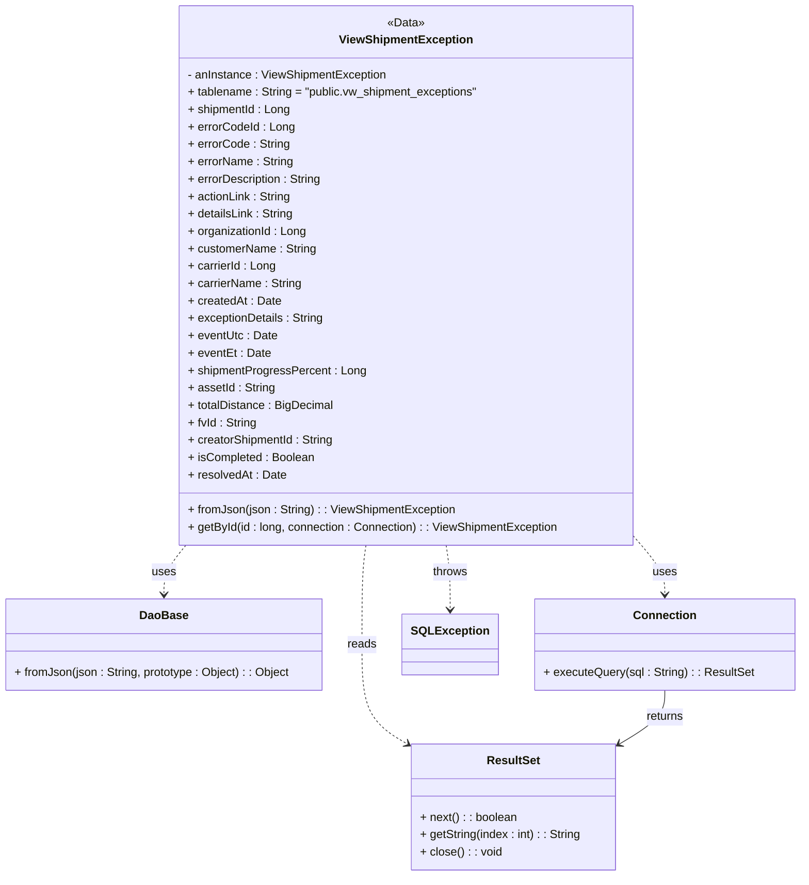
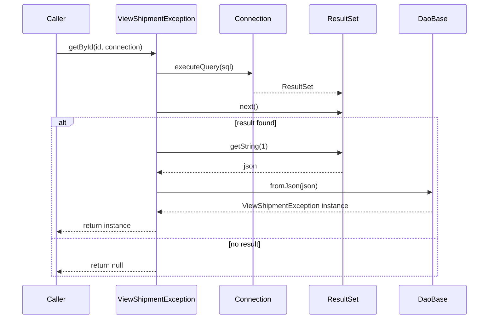

# Diagram: platform-java-lambdas/shipment/src/main/java/com/freightverify/shipment/datastore/postgresql/dao/ViewShipmentException.java

> Auto-generated by Obscura crawlers

## Diagram 1

### SVG

<svg id="container" width="1089.0625" xmlns="http://www.w3.org/2000/svg" class="classDiagram" height="1208" viewBox="0 0 1089.0625 1208" role="graphics-document document" aria-roledescription="class"><g><defs><marker id="container_class-aggregationStart" class="marker aggregation class" refX="18" refY="7" markerWidth="190" markerHeight="240" orient="auto"><path d="M 18,7 L9,13 L1,7 L9,1 Z"></path></marker></defs><defs><marker id="container_class-aggregationEnd" class="marker aggregation class" refX="1" refY="7" markerWidth="20" markerHeight="28" orient="auto"><path d="M 18,7 L9,13 L1,7 L9,1 Z"></path></marker></defs><defs><marker id="container_class-extensionStart" class="marker extension class" refX="18" refY="7" markerWidth="190" markerHeight="240" orient="auto"><path d="M 1,7 L18,13 V 1 Z"></path></marker></defs><defs><marker id="container_class-extensionEnd" class="marker extension class" refX="1" refY="7" markerWidth="20" markerHeight="28" orient="auto"><path d="M 1,1 V 13 L18,7 Z"></path></marker></defs><defs><marker id="container_class-compositionStart" class="marker composition class" refX="18" refY="7" markerWidth="190" markerHeight="240" orient="auto"><path d="M 18,7 L9,13 L1,7 L9,1 Z"></path></marker></defs><defs><marker id="container_class-compositionEnd" class="marker composition class" refX="1" refY="7" markerWidth="20" markerHeight="28" orient="auto"><path d="M 18,7 L9,13 L1,7 L9,1 Z"></path></marker></defs><defs><marker id="container_class-dependencyStart" class="marker dependency class" refX="6" refY="7" markerWidth="190" markerHeight="240" orient="auto"><path d="M 5,7 L9,13 L1,7 L9,1 Z"></path></marker></defs><defs><marker id="container_class-dependencyEnd" class="marker dependency class" refX="13" refY="7" markerWidth="20" markerHeight="28" orient="auto"><path d="M 18,7 L9,13 L14,7 L9,1 Z"></path></marker></defs><defs><marker id="container_class-lollipopStart" class="marker lollipop class" refX="13" refY="7" markerWidth="190" markerHeight="240" orient="auto"><circle stroke="black" fill="transparent" cx="7" cy="7" r="6"></circle></marker></defs><defs><marker id="container_class-lollipopEnd" class="marker lollipop class" refX="1" refY="7" markerWidth="190" markerHeight="240" orient="auto"><circle stroke="black" fill="transparent" cx="7" cy="7" r="6"></circle></marker></defs><g class="root"><g class="clusters"></g><g class="edgePaths"><path d="M256.186,752L251.185,758.167C246.185,764.333,236.184,776.667,231.184,788C226.184,799.333,226.184,809.667,226.184,814.833L226.184,820" id="id_ViewShipmentException_DaoBase_1" class="edge-thickness-normal edge-pattern-dashed relation" style=";;;" data-edge="true" data-et="edge" data-id="id_ViewShipmentException_DaoBase_1" data-points="W3sieCI6MjU2LjE4NTY2NjI1OTE2ODcsInkiOjc1Mn0seyJ4IjoyMjYuMTgzNTkzNzUsInkiOjc4OX0seyJ4IjoyMjYuMTgzNTkzNzUsInkiOjgyNn1d" marker-end="url(#container_class-dependencyEnd)"></path><path d="M870.266,748.482L875.992,755.235C881.717,761.988,893.169,775.494,898.895,787.414C904.621,799.333,904.621,809.667,904.621,814.833L904.621,820" id="id_ViewShipmentException_Connection_2" class="edge-thickness-normal edge-pattern-dashed relation" style=";;;" data-edge="true" data-et="edge" data-id="id_ViewShipmentException_Connection_2" data-points="W3sieCI6ODcwLjI2NTYyNSwieSI6NzQ4LjQ4MTkxNTc2ODM2ODd9LHsieCI6OTA0LjYyMTA5Mzc1LCJ5Ijo3ODl9LHsieCI6OTA0LjYyMTA5Mzc1LCJ5Ijo4MjZ9XQ==" marker-end="url(#container_class-dependencyEnd)"></path><path d="M504.663,752L503.782,758.167C502.9,764.333,501.138,776.667,500.256,799.5C499.375,822.333,499.375,855.667,499.375,889C499.375,922.333,499.375,955.667,508.767,978.081C518.158,1000.495,536.941,1011.989,546.333,1017.737L555.724,1023.484" id="id_ViewShipmentException_ResultSet_3" class="edge-thickness-normal edge-pattern-dashed relation" style=";;;" data-edge="true" data-et="edge" data-id="id_ViewShipmentException_ResultSet_3" data-points="W3sieCI6NTA0LjY2MjkzNTUxMzQ0NzQ1LCJ5Ijo3NTJ9LHsieCI6NDk5LjM3NSwieSI6Nzg5fSx7IngiOjQ5OS4zNzUsInkiOjg4OX0seyJ4Ijo0OTkuMzc1LCJ5Ijo5ODl9LHsieCI6NTYwLjg0MTc5Njg3NSwieSI6MTAyNi42MTYwNzA0ODE4NjM3fV0=" marker-end="url(#container_class-dependencyEnd)"></path><path d="M904.621,952L904.621,958.167C904.621,964.333,904.621,976.667,895.23,988.581C885.838,1000.495,867.055,1011.989,857.664,1017.737L848.272,1023.484" id="id_Connection_ResultSet_4" class="edge-thickness-normal edge-pattern-solid relation" style=";;;" data-edge="true" data-et="edge" data-id="id_Connection_ResultSet_4" data-points="W3sieCI6OTA0LjYyMTA5Mzc1LCJ5Ijo5NTJ9LHsieCI6OTA0LjYyMTA5Mzc1LCJ5Ijo5ODl9LHsieCI6ODQzLjE1NDI5Njg3NSwieSI6MTAyNi42MTYwNzA0ODE4NjM3fV0=" marker-end="url(#container_class-dependencyEnd)"></path><path d="M610.993,752L611.875,758.167C612.756,764.333,614.519,776.667,615.4,791.5C616.281,806.333,616.281,823.667,616.281,832.333L616.281,841" id="id_ViewShipmentException_SQLException_5" class="edge-thickness-normal edge-pattern-dashed relation" style=";;;" data-edge="true" data-et="edge" data-id="id_ViewShipmentException_SQLException_5" data-points="W3sieCI6NjEwLjk5MzMxNDQ4NjU1MjUsInkiOjc1Mn0seyJ4Ijo2MTYuMjgxMjUsInkiOjc4OX0seyJ4Ijo2MTYuMjgxMjUsInkiOjg0N31d" marker-end="url(#container_class-dependencyEnd)"></path></g><g class="edgeLabels"><g class="edgeLabel" transform="translate(226.18359375, 789)"><g class="label" data-id="id_ViewShipmentException_DaoBase_1" transform="translate(-16.4921875, -12)"><foreignObject width="32.984375" height="24">

uses

</foreignObject></g></g><g class="edgeLabel" transform="translate(904.62109375, 789)"><g class="label" data-id="id_ViewShipmentException_Connection_2" transform="translate(-16.4921875, -12)"><foreignObject width="32.984375" height="24">

uses

</foreignObject></g></g><g class="edgeLabel" transform="translate(499.375, 889)"><g class="label" data-id="id_ViewShipmentException_ResultSet_3" transform="translate(-20.0078125, -12)"><foreignObject width="40.015625" height="24">

reads

</foreignObject></g></g><g class="edgeLabel" transform="translate(904.62109375, 989)"><g class="label" data-id="id_Connection_ResultSet_4" transform="translate(-26.265625, -12)"><foreignObject width="52.53125" height="24">

returns

</foreignObject></g></g><g class="edgeLabel" transform="translate(616.28125, 789)"><g class="label" data-id="id_ViewShipmentException_SQLException_5" transform="translate(-24.5703125, -12)"><foreignObject width="49.140625" height="24">

throws

</foreignObject></g></g></g><g class="nodes"><g class="node default" id="classId-ViewShipmentException-0" transform="translate(557.828125, 380)"><g class="basic label-container"><path d="M-312.4375 -372 L312.4375 -372 L312.4375 372 L-312.4375 372" stroke="none" stroke-width="0" fill="#ECECFF" style=""></path><path d="M-312.4375 -372 C-73.04118719002318 -372, 166.35512561995364 -372, 312.4375 -372 M-312.4375 -372 C-167.59687953522973 -372, -22.756259070459464 -372, 312.4375 -372 M312.4375 -372 C312.4375 -210.65491690846224, 312.4375 -49.30983381692448, 312.4375 372 M312.4375 -372 C312.4375 -89.52407138589831, 312.4375 192.95185722820338, 312.4375 372 M312.4375 372 C121.3591337854705 372, -69.71923242905899 372, -312.4375 372 M312.4375 372 C77.24213756303865 372, -157.9532248739227 372, -312.4375 372 M-312.4375 372 C-312.4375 188.27770592698008, -312.4375 4.555411853960152, -312.4375 -372 M-312.4375 372 C-312.4375 91.37055397299457, -312.4375 -189.25889205401086, -312.4375 -372" stroke="#9370DB" stroke-width="1.3" fill="none" stroke-dasharray="0 0" style=""></path></g><g class="annotation-group text" transform="translate(-25.7421875, -348)"><g class="label" style="" transform="translate(0,-12)"><foreignObject width="51.484375" height="24">

«Data»

</foreignObject></g></g><g class="label-group text" transform="translate(-88.03125, -324)"><g class="label" style="font-weight: bolder" transform="translate(0,-12)"><foreignObject width="176.0625" height="24">

ViewShipmentException

</foreignObject></g></g><g class="members-group text" transform="translate(-300.4375, -276)"><g class="label" style="" transform="translate(0,-12)"><foreignObject width="276.484375" height="24">

- anInstance : ViewShipmentException

</foreignObject></g><g class="label" style="" transform="translate(0,12)"><foreignObject width="404.703125" height="24">

+ tablename : String = "public.vw_shipment_exceptions"

</foreignObject></g><g class="label" style="" transform="translate(0,36)"><foreignObject width="141.890625" height="24">

+ shipmentId : Long

</foreignObject></g><g class="label" style="" transform="translate(0,60)"><foreignObject width="145.828125" height="24">

+ errorCodeId : Long

</foreignObject></g><g class="label" style="" transform="translate(0,84)"><foreignObject width="139.8125" height="24">

+ errorCode : String

</foreignObject></g><g class="label" style="" transform="translate(0,108)"><foreignObject width="145.609375" height="24">

+ errorName : String

</foreignObject></g><g class="label" style="" transform="translate(0,132)"><foreignObject width="186.890625" height="24">

+ errorDescription : String

</foreignObject></g><g class="label" style="" transform="translate(0,156)"><foreignObject width="142.84375" height="24">

+ actionLink : String

</foreignObject></g><g class="label" style="" transform="translate(0,180)"><foreignObject width="146.8125" height="24">

+ detailsLink : String

</foreignObject></g><g class="label" style="" transform="translate(0,204)"><foreignObject width="163.796875" height="24">

+ organizationId : Long

</foreignObject></g><g class="label" style="" transform="translate(0,228)"><foreignObject width="177.25" height="24">

+ customerName : String

</foreignObject></g><g class="label" style="" transform="translate(0,252)"><foreignObject width="121.40625" height="24">

+ carrierId : Long

</foreignObject></g><g class="label" style="" transform="translate(0,276)"><foreignObject width="157.453125" height="24">

+ carrierName : String

</foreignObject></g><g class="label" style="" transform="translate(0,300)"><foreignObject width="127.03125" height="24">

+ createdAt : Date

</foreignObject></g><g class="label" style="" transform="translate(0,324)"><foreignObject width="188.25" height="24">

+ exceptionDetails : String

</foreignObject></g><g class="label" style="" transform="translate(0,348)"><foreignObject width="121.765625" height="24">

+ eventUtc : Date

</foreignObject></g><g class="label" style="" transform="translate(0,372)"><foreignObject width="112.109375" height="24">

+ eventEt : Date

</foreignObject></g><g class="label" style="" transform="translate(0,396)"><foreignObject width="243.578125" height="24">

+ shipmentProgressPercent : Long

</foreignObject></g><g class="label" style="" transform="translate(0,420)"><foreignObject width="119.546875" height="24">

+ assetId : String

</foreignObject></g><g class="label" style="" transform="translate(0,444)"><foreignObject width="201.09375" height="24">

+ totalDistance : BigDecimal

</foreignObject></g><g class="label" style="" transform="translate(0,468)"><foreignObject width="94.953125" height="24">

+ fvId : String

</foreignObject></g><g class="label" style="" transform="translate(0,492)"><foreignObject width="203.078125" height="24">

+ creatorShipmentId : String

</foreignObject></g><g class="label" style="" transform="translate(0,516)"><foreignObject width="174.546875" height="24">

+ isCompleted : Boolean

</foreignObject></g><g class="label" style="" transform="translate(0,540)"><foreignObject width="134.453125" height="24">

+ resolvedAt : Date

</foreignObject></g></g><g class="methods-group text" transform="translate(-300.4375, 324)"><g class="label" style="" transform="translate(0,-12)"><foreignObject width="368.671875" height="24">

+ fromJson(json : String) : : ViewShipmentException

</foreignObject></g><g class="label" style="" transform="translate(0,12)"><foreignObject width="512.84375" height="24">

+ getById(id : long, connection : Connection) : : ViewShipmentException

</foreignObject></g></g><g class="divider" style=""><path d="M-312.4375 -300 C-81.45661381672701 -300, 149.52427236654597 -300, 312.4375 -300 M-312.4375 -300 C-90.93969686499074 -300, 130.55810627001853 -300, 312.4375 -300" stroke="#9370DB" stroke-width="1.3" fill="none" stroke-dasharray="0 0" style=""></path></g><g class="divider" style=""><path d="M-312.4375 300 C-97.72312302333404 300, 116.99125395333192 300, 312.4375 300 M-312.4375 300 C-187.12689530037966 300, -61.81629060075929 300, 312.4375 300" stroke="#9370DB" stroke-width="1.3" fill="none" stroke-dasharray="0 0" style=""></path></g></g><g class="node default" id="classId-DaoBase-1" transform="translate(226.18359375, 889)"><g class="basic label-container"><path d="M-218.18359375 -63 L218.18359375 -63 L218.18359375 63 L-218.18359375 63" stroke="none" stroke-width="0" fill="#ECECFF" style=""></path><path d="M-218.18359375 -63 C-86.98285267565649 -63, 44.21788839868702 -63, 218.18359375 -63 M-218.18359375 -63 C-59.37350189142933 -63, 99.43658996714134 -63, 218.18359375 -63 M218.18359375 -63 C218.18359375 -24.943053445492076, 218.18359375 13.113893109015848, 218.18359375 63 M218.18359375 -63 C218.18359375 -34.472812618376686, 218.18359375 -5.945625236753372, 218.18359375 63 M218.18359375 63 C104.15543071170441 63, -9.872732326591176 63, -218.18359375 63 M218.18359375 63 C91.89567902402347 63, -34.39223570195307 63, -218.18359375 63 M-218.18359375 63 C-218.18359375 13.651602691884626, -218.18359375 -35.69679461623075, -218.18359375 -63 M-218.18359375 63 C-218.18359375 17.05683598664035, -218.18359375 -28.886328026719298, -218.18359375 -63" stroke="#9370DB" stroke-width="1.3" fill="none" stroke-dasharray="0 0" style=""></path></g><g class="annotation-group text" transform="translate(0, -39)"></g><g class="label-group text" transform="translate(-31.7109375, -39)"><g class="label" style="font-weight: bolder" transform="translate(0,-12)"><foreignObject width="63.421875" height="24">

DaoBase

</foreignObject></g></g><g class="members-group text" transform="translate(-206.18359375, 9)"></g><g class="methods-group text" transform="translate(-206.18359375, 39)"><g class="label" style="" transform="translate(0,-12)"><foreignObject width="380.65625" height="24">

+ fromJson(json : String, prototype : Object) : : Object

</foreignObject></g></g><g class="divider" style=""><path d="M-218.18359375 -15 C-57.21287777078069 -15, 103.75783820843861 -15, 218.18359375 -15 M-218.18359375 -15 C-92.47864415839872 -15, 33.226305433202555 -15, 218.18359375 -15" stroke="#9370DB" stroke-width="1.3" fill="none" stroke-dasharray="0 0" style=""></path></g><g class="divider" style=""><path d="M-218.18359375 9 C-116.25844046181882 9, -14.333287173637643 9, 218.18359375 9 M-218.18359375 9 C-45.81223983080173 9, 126.55911408839654 9, 218.18359375 9" stroke="#9370DB" stroke-width="1.3" fill="none" stroke-dasharray="0 0" style=""></path></g></g><g class="node default" id="classId-Connection-2" transform="translate(904.62109375, 889)"><g class="basic label-container"><path d="M-176.44140625 -63 L176.44140625 -63 L176.44140625 63 L-176.44140625 63" stroke="none" stroke-width="0" fill="#ECECFF" style=""></path><path d="M-176.44140625 -63 C-82.74315114368744 -63, 10.955103962625117 -63, 176.44140625 -63 M-176.44140625 -63 C-52.52841604251712 -63, 71.38457416496576 -63, 176.44140625 -63 M176.44140625 -63 C176.44140625 -35.59154673612194, 176.44140625 -8.183093472243876, 176.44140625 63 M176.44140625 -63 C176.44140625 -26.225945245305695, 176.44140625 10.54810950938861, 176.44140625 63 M176.44140625 63 C51.734473681394874 63, -72.97245888721025 63, -176.44140625 63 M176.44140625 63 C78.90608766814198 63, -18.629230913716043 63, -176.44140625 63 M-176.44140625 63 C-176.44140625 22.122788570943143, -176.44140625 -18.754422858113713, -176.44140625 -63 M-176.44140625 63 C-176.44140625 29.39787734454815, -176.44140625 -4.204245310903701, -176.44140625 -63" stroke="#9370DB" stroke-width="1.3" fill="none" stroke-dasharray="0 0" style=""></path></g><g class="annotation-group text" transform="translate(0, -39)"></g><g class="label-group text" transform="translate(-41.2265625, -39)"><g class="label" style="font-weight: bolder" transform="translate(0,-12)"><foreignObject width="82.453125" height="24">

Connection

</foreignObject></g></g><g class="members-group text" transform="translate(-164.44140625, 9)"></g><g class="methods-group text" transform="translate(-164.44140625, 39)"><g class="label" style="" transform="translate(0,-12)"><foreignObject width="287.65625" height="24">

+ executeQuery(sql : String) : : ResultSet

</foreignObject></g></g><g class="divider" style=""><path d="M-176.44140625 -15 C-81.54282028800753 -15, 13.355765673984934 -15, 176.44140625 -15 M-176.44140625 -15 C-38.70517545235464 -15, 99.03105534529072 -15, 176.44140625 -15" stroke="#9370DB" stroke-width="1.3" fill="none" stroke-dasharray="0 0" style=""></path></g><g class="divider" style=""><path d="M-176.44140625 9 C-98.2132737222073 9, -19.98514119441461 9, 176.44140625 9 M-176.44140625 9 C-50.16310590948798 9, 76.11519443102404 9, 176.44140625 9" stroke="#9370DB" stroke-width="1.3" fill="none" stroke-dasharray="0 0" style=""></path></g></g><g class="node default" id="classId-ResultSet-3" transform="translate(701.998046875, 1113)"><g class="basic label-container"><path d="M-141.15625 -87 L141.15625 -87 L141.15625 87 L-141.15625 87" stroke="none" stroke-width="0" fill="#ECECFF" style=""></path><path d="M-141.15625 -87 C-69.28334490718413 -87, 2.58956018563174 -87, 141.15625 -87 M-141.15625 -87 C-42.6440174795833 -87, 55.868215040833405 -87, 141.15625 -87 M141.15625 -87 C141.15625 -44.67873940331678, 141.15625 -2.3574788066335657, 141.15625 87 M141.15625 -87 C141.15625 -28.10421559018849, 141.15625 30.791568819623024, 141.15625 87 M141.15625 87 C45.52518813020646 87, -50.10587373958708 87, -141.15625 87 M141.15625 87 C71.6985011877146 87, 2.240752375429196 87, -141.15625 87 M-141.15625 87 C-141.15625 27.349638762273607, -141.15625 -32.30072247545279, -141.15625 -87 M-141.15625 87 C-141.15625 39.47559937151325, -141.15625 -8.048801256973505, -141.15625 -87" stroke="#9370DB" stroke-width="1.3" fill="none" stroke-dasharray="0 0" style=""></path></g><g class="annotation-group text" transform="translate(0, -63)"></g><g class="label-group text" transform="translate(-35.21875, -63)"><g class="label" style="font-weight: bolder" transform="translate(0,-12)"><foreignObject width="70.4375" height="24">

ResultSet

</foreignObject></g></g><g class="members-group text" transform="translate(-129.15625, -15)"></g><g class="methods-group text" transform="translate(-129.15625, 15)"><g class="label" style="" transform="translate(0,-12)"><foreignObject width="133.921875" height="24">

+ next() : : boolean

</foreignObject></g><g class="label" style="" transform="translate(0,12)"><foreignObject width="223.09375" height="24">

+ getString(index : int) : : String

</foreignObject></g><g class="label" style="" transform="translate(0,36)"><foreignObject width="112.03125" height="24">

+ close() : : void

</foreignObject></g></g><g class="divider" style=""><path d="M-141.15625 -39 C-72.84268639277575 -39, -4.529122785551493 -39, 141.15625 -39 M-141.15625 -39 C-33.79294956893435 -39, 73.5703508621313 -39, 141.15625 -39" stroke="#9370DB" stroke-width="1.3" fill="none" stroke-dasharray="0 0" style=""></path></g><g class="divider" style=""><path d="M-141.15625 -15 C-61.36604469059738 -15, 18.424160618805246 -15, 141.15625 -15 M-141.15625 -15 C-40.68885243044629 -15, 59.77854513910742 -15, 141.15625 -15" stroke="#9370DB" stroke-width="1.3" fill="none" stroke-dasharray="0 0" style=""></path></g></g><g class="node default" id="classId-SQLException-4" transform="translate(616.28125, 889)"><g class="basic label-container"><path d="M-61.8984375 -42 L61.8984375 -42 L61.8984375 42 L-61.8984375 42" stroke="none" stroke-width="0" fill="#ECECFF" style=""></path><path d="M-61.8984375 -42 C-36.95352808606229 -42, -12.00861867212459 -42, 61.8984375 -42 M-61.8984375 -42 C-28.74744462593965 -42, 4.4035482481207 -42, 61.8984375 -42 M61.8984375 -42 C61.8984375 -13.836749477941119, 61.8984375 14.326501044117762, 61.8984375 42 M61.8984375 -42 C61.8984375 -12.082969662210278, 61.8984375 17.834060675579444, 61.8984375 42 M61.8984375 42 C26.222346656020378 42, -9.453744187959245 42, -61.8984375 42 M61.8984375 42 C24.76486829315357 42, -12.368700913692862 42, -61.8984375 42 M-61.8984375 42 C-61.8984375 18.496765071833885, -61.8984375 -5.006469856332231, -61.8984375 -42 M-61.8984375 42 C-61.8984375 14.29713394248708, -61.8984375 -13.405732115025842, -61.8984375 -42" stroke="#9370DB" stroke-width="1.3" fill="none" stroke-dasharray="0 0" style=""></path></g><g class="annotation-group text" transform="translate(0, -18)"></g><g class="label-group text" transform="translate(-49.8984375, -18)"><g class="label" style="font-weight: bolder" transform="translate(0,-12)"><foreignObject width="99.796875" height="24">

SQLException

</foreignObject></g></g><g class="members-group text" transform="translate(-49.8984375, 30)"></g><g class="methods-group text" transform="translate(-49.8984375, 60)"></g><g class="divider" style=""><path d="M-61.8984375 6 C-22.36587295728767 6, 17.16669158542466 6, 61.8984375 6 M-61.8984375 6 C-14.427775158078788 6, 33.042887183842424 6, 61.8984375 6" stroke="#9370DB" stroke-width="1.3" fill="none" stroke-dasharray="0 0" style=""></path></g><g class="divider" style=""><path d="M-61.8984375 24 C-29.5502804552836 24, 2.7978765894328035 24, 61.8984375 24 M-61.8984375 24 C-33.493558992790796 24, -5.088680485581591 24, 61.8984375 24" stroke="#9370DB" stroke-width="1.3" fill="none" stroke-dasharray="0 0" style=""></path></g></g></g></g></g></svg>

## Diagram 2

### SVG

<svg id="container" width="1110" xmlns="http://www.w3.org/2000/svg" height="751" viewBox="-50 -10 1110 751" role="graphics-document document" aria-roledescription="sequence"><g><rect x="860" y="665" fill="#eaeaea" stroke="#666" width="150" height="65" name="DaoBase" rx="3" ry="3" class="actor actor-bottom"></rect><text x="935" y="697.5" dominant-baseline="central" alignment-baseline="central" class="actor actor-box" style="text-anchor: middle; font-size: 16px; font-weight: 400;"><tspan x="935" dy="0">DaoBase</tspan></text></g><g><rect x="660" y="665" fill="#eaeaea" stroke="#666" width="150" height="65" name="ResultSet" rx="3" ry="3" class="actor actor-bottom"></rect><text x="735" y="697.5" dominant-baseline="central" alignment-baseline="central" class="actor actor-box" style="text-anchor: middle; font-size: 16px; font-weight: 400;"><tspan x="735" dy="0">ResultSet</tspan></text></g><g><rect x="460" y="665" fill="#eaeaea" stroke="#666" width="150" height="65" name="Connection" rx="3" ry="3" class="actor actor-bottom"></rect><text x="535" y="697.5" dominant-baseline="central" alignment-baseline="central" class="actor actor-box" style="text-anchor: middle; font-size: 16px; font-weight: 400;"><tspan x="535" dy="0">Connection</tspan></text></g><g><rect x="216" y="665" fill="#eaeaea" stroke="#666" width="194" height="65" name="ViewShipmentException" rx="3" ry="3" class="actor actor-bottom"></rect><text x="313" y="697.5" dominant-baseline="central" alignment-baseline="central" class="actor actor-box" style="text-anchor: middle; font-size: 16px; font-weight: 400;"><tspan x="313" dy="0">ViewShipmentException</tspan></text></g><g><rect x="0" y="665" fill="#eaeaea" stroke="#666" width="150" height="65" name="Caller" rx="3" ry="3" class="actor actor-bottom"></rect><text x="75" y="697.5" dominant-baseline="central" alignment-baseline="central" class="actor actor-box" style="text-anchor: middle; font-size: 16px; font-weight: 400;"><tspan x="75" dy="0">Caller</tspan></text></g><g><line id="actor4" x1="935" y1="65" x2="935" y2="665" class="actor-line 200" stroke-width="0.5px" stroke="#999" name="DaoBase"></line><g id="root-4"><rect x="860" y="0" fill="#eaeaea" stroke="#666" width="150" height="65" name="DaoBase" rx="3" ry="3" class="actor actor-top"></rect><text x="935" y="32.5" dominant-baseline="central" alignment-baseline="central" class="actor actor-box" style="text-anchor: middle; font-size: 16px; font-weight: 400;"><tspan x="935" dy="0">DaoBase</tspan></text></g></g><g><line id="actor3" x1="735" y1="65" x2="735" y2="665" class="actor-line 200" stroke-width="0.5px" stroke="#999" name="ResultSet"></line><g id="root-3"><rect x="660" y="0" fill="#eaeaea" stroke="#666" width="150" height="65" name="ResultSet" rx="3" ry="3" class="actor actor-top"></rect><text x="735" y="32.5" dominant-baseline="central" alignment-baseline="central" class="actor actor-box" style="text-anchor: middle; font-size: 16px; font-weight: 400;"><tspan x="735" dy="0">ResultSet</tspan></text></g></g><g><line id="actor2" x1="535" y1="65" x2="535" y2="665" class="actor-line 200" stroke-width="0.5px" stroke="#999" name="Connection"></line><g id="root-2"><rect x="460" y="0" fill="#eaeaea" stroke="#666" width="150" height="65" name="Connection" rx="3" ry="3" class="actor actor-top"></rect><text x="535" y="32.5" dominant-baseline="central" alignment-baseline="central" class="actor actor-box" style="text-anchor: middle; font-size: 16px; font-weight: 400;"><tspan x="535" dy="0">Connection</tspan></text></g></g><g><line id="actor1" x1="313" y1="65" x2="313" y2="665" class="actor-line 200" stroke-width="0.5px" stroke="#999" name="ViewShipmentException"></line><g id="root-1"><rect x="216" y="0" fill="#eaeaea" stroke="#666" width="194" height="65" name="ViewShipmentException" rx="3" ry="3" class="actor actor-top"></rect><text x="313" y="32.5" dominant-baseline="central" alignment-baseline="central" class="actor actor-box" style="text-anchor: middle; font-size: 16px; font-weight: 400;"><tspan x="313" dy="0">ViewShipmentException</tspan></text></g></g><g><line id="actor0" x1="75" y1="65" x2="75" y2="665" class="actor-line 200" stroke-width="0.5px" stroke="#999" name="Caller"></line><g id="root-0"><rect x="0" y="0" fill="#eaeaea" stroke="#666" width="150" height="65" name="Caller" rx="3" ry="3" class="actor actor-top"></rect><text x="75" y="32.5" dominant-baseline="central" alignment-baseline="central" class="actor actor-box" style="text-anchor: middle; font-size: 16px; font-weight: 400;"><tspan x="75" dy="0">Caller</tspan></text></g></g><g></g><defs><symbol id="computer" width="24" height="24"><path transform="scale(.5)" d="M2 2v13h20v-13h-20zm18 11h-16v-9h16v9zm-10.228 6l.466-1h3.524l.467 1h-4.457zm14.228 3h-24l2-6h2.104l-1.33 4h18.45l-1.297-4h2.073l2 6zm-5-10h-14v-7h14v7z"></path></symbol></defs><defs><symbol id="database" fill-rule="evenodd" clip-rule="evenodd"><path transform="scale(.5)" d="M12.258.001l.256.004.255.005.253.008.251.01.249.012.247.015.246.016.242.019.241.02.239.023.236.024.233.027.231.028.229.031.225.032.223.034.22.036.217.038.214.04.211.041.208.043.205.045.201.046.198.048.194.05.191.051.187.053.183.054.18.056.175.057.172.059.168.06.163.061.16.063.155.064.15.066.074.033.073.033.071.034.07.034.069.035.068.035.067.035.066.035.064.036.064.036.062.036.06.036.06.037.058.037.058.037.055.038.055.038.053.038.052.038.051.039.05.039.048.039.047.039.045.04.044.04.043.04.041.04.04.041.039.041.037.041.036.041.034.041.033.042.032.042.03.042.029.042.027.042.026.043.024.043.023.043.021.043.02.043.018.044.017.043.015.044.013.044.012.044.011.045.009.044.007.045.006.045.004.045.002.045.001.045v17l-.001.045-.002.045-.004.045-.006.045-.007.045-.009.044-.011.045-.012.044-.013.044-.015.044-.017.043-.018.044-.02.043-.021.043-.023.043-.024.043-.026.043-.027.042-.029.042-.03.042-.032.042-.033.042-.034.041-.036.041-.037.041-.039.041-.04.041-.041.04-.043.04-.044.04-.045.04-.047.039-.048.039-.05.039-.051.039-.052.038-.053.038-.055.038-.055.038-.058.037-.058.037-.06.037-.06.036-.062.036-.064.036-.064.036-.066.035-.067.035-.068.035-.069.035-.07.034-.071.034-.073.033-.074.033-.15.066-.155.064-.16.063-.163.061-.168.06-.172.059-.175.057-.18.056-.183.054-.187.053-.191.051-.194.05-.198.048-.201.046-.205.045-.208.043-.211.041-.214.04-.217.038-.22.036-.223.034-.225.032-.229.031-.231.028-.233.027-.236.024-.239.023-.241.02-.242.019-.246.016-.247.015-.249.012-.251.01-.253.008-.255.005-.256.004-.258.001-.258-.001-.256-.004-.255-.005-.253-.008-.251-.01-.249-.012-.247-.015-.245-.016-.243-.019-.241-.02-.238-.023-.236-.024-.234-.027-.231-.028-.228-.031-.226-.032-.223-.034-.22-.036-.217-.038-.214-.04-.211-.041-.208-.043-.204-.045-.201-.046-.198-.048-.195-.05-.19-.051-.187-.053-.184-.054-.179-.056-.176-.057-.172-.059-.167-.06-.164-.061-.159-.063-.155-.064-.151-.066-.074-.033-.072-.033-.072-.034-.07-.034-.069-.035-.068-.035-.067-.035-.066-.035-.064-.036-.063-.036-.062-.036-.061-.036-.06-.037-.058-.037-.057-.037-.056-.038-.055-.038-.053-.038-.052-.038-.051-.039-.049-.039-.049-.039-.046-.039-.046-.04-.044-.04-.043-.04-.041-.04-.04-.041-.039-.041-.037-.041-.036-.041-.034-.041-.033-.042-.032-.042-.03-.042-.029-.042-.027-.042-.026-.043-.024-.043-.023-.043-.021-.043-.02-.043-.018-.044-.017-.043-.015-.044-.013-.044-.012-.044-.011-.045-.009-.044-.007-.045-.006-.045-.004-.045-.002-.045-.001-.045v-17l.001-.045.002-.045.004-.045.006-.045.007-.045.009-.044.011-.045.012-.044.013-.044.015-.044.017-.043.018-.044.02-.043.021-.043.023-.043.024-.043.026-.043.027-.042.029-.042.03-.042.032-.042.033-.042.034-.041.036-.041.037-.041.039-.041.04-.041.041-.04.043-.04.044-.04.046-.04.046-.039.049-.039.049-.039.051-.039.052-.038.053-.038.055-.038.056-.038.057-.037.058-.037.06-.037.061-.036.062-.036.063-.036.064-.036.066-.035.067-.035.068-.035.069-.035.07-.034.072-.034.072-.033.074-.033.151-.066.155-.064.159-.063.164-.061.167-.06.172-.059.176-.057.179-.056.184-.054.187-.053.19-.051.195-.05.198-.048.201-.046.204-.045.208-.043.211-.041.214-.04.217-.038.22-.036.223-.034.226-.032.228-.031.231-.028.234-.027.236-.024.238-.023.241-.02.243-.019.245-.016.247-.015.249-.012.251-.01.253-.008.255-.005.256-.004.258-.001.258.001zm-9.258 20.499v.01l.001.021.003.021.004.022.005.021.006.022.007.022.009.023.01.022.011.023.012.023.013.023.015.023.016.024.017.023.018.024.019.024.021.024.022.025.023.024.024.025.052.049.056.05.061.051.066.051.07.051.075.051.079.052.084.052.088.052.092.052.097.052.102.051.105.052.11.052.114.051.119.051.123.051.127.05.131.05.135.05.139.048.144.049.147.047.152.047.155.047.16.045.163.045.167.043.171.043.176.041.178.041.183.039.187.039.19.037.194.035.197.035.202.033.204.031.209.03.212.029.216.027.219.025.222.024.226.021.23.02.233.018.236.016.24.015.243.012.246.01.249.008.253.005.256.004.259.001.26-.001.257-.004.254-.005.25-.008.247-.011.244-.012.241-.014.237-.016.233-.018.231-.021.226-.021.224-.024.22-.026.216-.027.212-.028.21-.031.205-.031.202-.034.198-.034.194-.036.191-.037.187-.039.183-.04.179-.04.175-.042.172-.043.168-.044.163-.045.16-.046.155-.046.152-.047.148-.048.143-.049.139-.049.136-.05.131-.05.126-.05.123-.051.118-.052.114-.051.11-.052.106-.052.101-.052.096-.052.092-.052.088-.053.083-.051.079-.052.074-.052.07-.051.065-.051.06-.051.056-.05.051-.05.023-.024.023-.025.021-.024.02-.024.019-.024.018-.024.017-.024.015-.023.014-.024.013-.023.012-.023.01-.023.01-.022.008-.022.006-.022.006-.022.004-.022.004-.021.001-.021.001-.021v-4.127l-.077.055-.08.053-.083.054-.085.053-.087.052-.09.052-.093.051-.095.05-.097.05-.1.049-.102.049-.105.048-.106.047-.109.047-.111.046-.114.045-.115.045-.118.044-.12.043-.122.042-.124.042-.126.041-.128.04-.13.04-.132.038-.134.038-.135.037-.138.037-.139.035-.142.035-.143.034-.144.033-.147.032-.148.031-.15.03-.151.03-.153.029-.154.027-.156.027-.158.026-.159.025-.161.024-.162.023-.163.022-.165.021-.166.02-.167.019-.169.018-.169.017-.171.016-.173.015-.173.014-.175.013-.175.012-.177.011-.178.01-.179.008-.179.008-.181.006-.182.005-.182.004-.184.003-.184.002h-.37l-.184-.002-.184-.003-.182-.004-.182-.005-.181-.006-.179-.008-.179-.008-.178-.01-.176-.011-.176-.012-.175-.013-.173-.014-.172-.015-.171-.016-.17-.017-.169-.018-.167-.019-.166-.02-.165-.021-.163-.022-.162-.023-.161-.024-.159-.025-.157-.026-.156-.027-.155-.027-.153-.029-.151-.03-.15-.03-.148-.031-.146-.032-.145-.033-.143-.034-.141-.035-.14-.035-.137-.037-.136-.037-.134-.038-.132-.038-.13-.04-.128-.04-.126-.041-.124-.042-.122-.042-.12-.044-.117-.043-.116-.045-.113-.045-.112-.046-.109-.047-.106-.047-.105-.048-.102-.049-.1-.049-.097-.05-.095-.05-.093-.052-.09-.051-.087-.052-.085-.053-.083-.054-.08-.054-.077-.054v4.127zm0-5.654v.011l.001.021.003.021.004.021.005.022.006.022.007.022.009.022.01.022.011.023.012.023.013.023.015.024.016.023.017.024.018.024.019.024.021.024.022.024.023.025.024.024.052.05.056.05.061.05.066.051.07.051.075.052.079.051.084.052.088.052.092.052.097.052.102.052.105.052.11.051.114.051.119.052.123.05.127.051.131.05.135.049.139.049.144.048.147.048.152.047.155.046.16.045.163.045.167.044.171.042.176.042.178.04.183.04.187.038.19.037.194.036.197.034.202.033.204.032.209.03.212.028.216.027.219.025.222.024.226.022.23.02.233.018.236.016.24.014.243.012.246.01.249.008.253.006.256.003.259.001.26-.001.257-.003.254-.006.25-.008.247-.01.244-.012.241-.015.237-.016.233-.018.231-.02.226-.022.224-.024.22-.025.216-.027.212-.029.21-.03.205-.032.202-.033.198-.035.194-.036.191-.037.187-.039.183-.039.179-.041.175-.042.172-.043.168-.044.163-.045.16-.045.155-.047.152-.047.148-.048.143-.048.139-.05.136-.049.131-.05.126-.051.123-.051.118-.051.114-.052.11-.052.106-.052.101-.052.096-.052.092-.052.088-.052.083-.052.079-.052.074-.051.07-.052.065-.051.06-.05.056-.051.051-.049.023-.025.023-.024.021-.025.02-.024.019-.024.018-.024.017-.024.015-.023.014-.023.013-.024.012-.022.01-.023.01-.023.008-.022.006-.022.006-.022.004-.021.004-.022.001-.021.001-.021v-4.139l-.077.054-.08.054-.083.054-.085.052-.087.053-.09.051-.093.051-.095.051-.097.05-.1.049-.102.049-.105.048-.106.047-.109.047-.111.046-.114.045-.115.044-.118.044-.12.044-.122.042-.124.042-.126.041-.128.04-.13.039-.132.039-.134.038-.135.037-.138.036-.139.036-.142.035-.143.033-.144.033-.147.033-.148.031-.15.03-.151.03-.153.028-.154.028-.156.027-.158.026-.159.025-.161.024-.162.023-.163.022-.165.021-.166.02-.167.019-.169.018-.169.017-.171.016-.173.015-.173.014-.175.013-.175.012-.177.011-.178.009-.179.009-.179.007-.181.007-.182.005-.182.004-.184.003-.184.002h-.37l-.184-.002-.184-.003-.182-.004-.182-.005-.181-.007-.179-.007-.179-.009-.178-.009-.176-.011-.176-.012-.175-.013-.173-.014-.172-.015-.171-.016-.17-.017-.169-.018-.167-.019-.166-.02-.165-.021-.163-.022-.162-.023-.161-.024-.159-.025-.157-.026-.156-.027-.155-.028-.153-.028-.151-.03-.15-.03-.148-.031-.146-.033-.145-.033-.143-.033-.141-.035-.14-.036-.137-.036-.136-.037-.134-.038-.132-.039-.13-.039-.128-.04-.126-.041-.124-.042-.122-.043-.12-.043-.117-.044-.116-.044-.113-.046-.112-.046-.109-.046-.106-.047-.105-.048-.102-.049-.1-.049-.097-.05-.095-.051-.093-.051-.09-.051-.087-.053-.085-.052-.083-.054-.08-.054-.077-.054v4.139zm0-5.666v.011l.001.02.003.022.004.021.005.022.006.021.007.022.009.023.01.022.011.023.012.023.013.023.015.023.016.024.017.024.018.023.019.024.021.025.022.024.023.024.024.025.052.05.056.05.061.05.066.051.07.051.075.052.079.051.084.052.088.052.092.052.097.052.102.052.105.051.11.052.114.051.119.051.123.051.127.05.131.05.135.05.139.049.144.048.147.048.152.047.155.046.16.045.163.045.167.043.171.043.176.042.178.04.183.04.187.038.19.037.194.036.197.034.202.033.204.032.209.03.212.028.216.027.219.025.222.024.226.021.23.02.233.018.236.017.24.014.243.012.246.01.249.008.253.006.256.003.259.001.26-.001.257-.003.254-.006.25-.008.247-.01.244-.013.241-.014.237-.016.233-.018.231-.02.226-.022.224-.024.22-.025.216-.027.212-.029.21-.03.205-.032.202-.033.198-.035.194-.036.191-.037.187-.039.183-.039.179-.041.175-.042.172-.043.168-.044.163-.045.16-.045.155-.047.152-.047.148-.048.143-.049.139-.049.136-.049.131-.051.126-.05.123-.051.118-.052.114-.051.11-.052.106-.052.101-.052.096-.052.092-.052.088-.052.083-.052.079-.052.074-.052.07-.051.065-.051.06-.051.056-.05.051-.049.023-.025.023-.025.021-.024.02-.024.019-.024.018-.024.017-.024.015-.023.014-.024.013-.023.012-.023.01-.022.01-.023.008-.022.006-.022.006-.022.004-.022.004-.021.001-.021.001-.021v-4.153l-.077.054-.08.054-.083.053-.085.053-.087.053-.09.051-.093.051-.095.051-.097.05-.1.049-.102.048-.105.048-.106.048-.109.046-.111.046-.114.046-.115.044-.118.044-.12.043-.122.043-.124.042-.126.041-.128.04-.13.039-.132.039-.134.038-.135.037-.138.036-.139.036-.142.034-.143.034-.144.033-.147.032-.148.032-.15.03-.151.03-.153.028-.154.028-.156.027-.158.026-.159.024-.161.024-.162.023-.163.023-.165.021-.166.02-.167.019-.169.018-.169.017-.171.016-.173.015-.173.014-.175.013-.175.012-.177.01-.178.01-.179.009-.179.007-.181.006-.182.006-.182.004-.184.003-.184.001-.185.001-.185-.001-.184-.001-.184-.003-.182-.004-.182-.006-.181-.006-.179-.007-.179-.009-.178-.01-.176-.01-.176-.012-.175-.013-.173-.014-.172-.015-.171-.016-.17-.017-.169-.018-.167-.019-.166-.02-.165-.021-.163-.023-.162-.023-.161-.024-.159-.024-.157-.026-.156-.027-.155-.028-.153-.028-.151-.03-.15-.03-.148-.032-.146-.032-.145-.033-.143-.034-.141-.034-.14-.036-.137-.036-.136-.037-.134-.038-.132-.039-.13-.039-.128-.041-.126-.041-.124-.041-.122-.043-.12-.043-.117-.044-.116-.044-.113-.046-.112-.046-.109-.046-.106-.048-.105-.048-.102-.048-.1-.05-.097-.049-.095-.051-.093-.051-.09-.052-.087-.052-.085-.053-.083-.053-.08-.054-.077-.054v4.153zm8.74-8.179l-.257.004-.254.005-.25.008-.247.011-.244.012-.241.014-.237.016-.233.018-.231.021-.226.022-.224.023-.22.026-.216.027-.212.028-.21.031-.205.032-.202.033-.198.034-.194.036-.191.038-.187.038-.183.04-.179.041-.175.042-.172.043-.168.043-.163.045-.16.046-.155.046-.152.048-.148.048-.143.048-.139.049-.136.05-.131.05-.126.051-.123.051-.118.051-.114.052-.11.052-.106.052-.101.052-.096.052-.092.052-.088.052-.083.052-.079.052-.074.051-.07.052-.065.051-.06.05-.056.05-.051.05-.023.025-.023.024-.021.024-.02.025-.019.024-.018.024-.017.023-.015.024-.014.023-.013.023-.012.023-.01.023-.01.022-.008.022-.006.023-.006.021-.004.022-.004.021-.001.021-.001.021.001.021.001.021.004.021.004.022.006.021.006.023.008.022.01.022.01.023.012.023.013.023.014.023.015.024.017.023.018.024.019.024.02.025.021.024.023.024.023.025.051.05.056.05.06.05.065.051.07.052.074.051.079.052.083.052.088.052.092.052.096.052.101.052.106.052.11.052.114.052.118.051.123.051.126.051.131.05.136.05.139.049.143.048.148.048.152.048.155.046.16.046.163.045.168.043.172.043.175.042.179.041.183.04.187.038.191.038.194.036.198.034.202.033.205.032.21.031.212.028.216.027.22.026.224.023.226.022.231.021.233.018.237.016.241.014.244.012.247.011.25.008.254.005.257.004.26.001.26-.001.257-.004.254-.005.25-.008.247-.011.244-.012.241-.014.237-.016.233-.018.231-.021.226-.022.224-.023.22-.026.216-.027.212-.028.21-.031.205-.032.202-.033.198-.034.194-.036.191-.038.187-.038.183-.04.179-.041.175-.042.172-.043.168-.043.163-.045.16-.046.155-.046.152-.048.148-.048.143-.048.139-.049.136-.05.131-.05.126-.051.123-.051.118-.051.114-.052.11-.052.106-.052.101-.052.096-.052.092-.052.088-.052.083-.052.079-.052.074-.051.07-.052.065-.051.06-.05.056-.05.051-.05.023-.025.023-.024.021-.024.02-.025.019-.024.018-.024.017-.023.015-.024.014-.023.013-.023.012-.023.01-.023.01-.022.008-.022.006-.023.006-.021.004-.022.004-.021.001-.021.001-.021-.001-.021-.001-.021-.004-.021-.004-.022-.006-.021-.006-.023-.008-.022-.01-.022-.01-.023-.012-.023-.013-.023-.014-.023-.015-.024-.017-.023-.018-.024-.019-.024-.02-.025-.021-.024-.023-.024-.023-.025-.051-.05-.056-.05-.06-.05-.065-.051-.07-.052-.074-.051-.079-.052-.083-.052-.088-.052-.092-.052-.096-.052-.101-.052-.106-.052-.11-.052-.114-.052-.118-.051-.123-.051-.126-.051-.131-.05-.136-.05-.139-.049-.143-.048-.148-.048-.152-.048-.155-.046-.16-.046-.163-.045-.168-.043-.172-.043-.175-.042-.179-.041-.183-.04-.187-.038-.191-.038-.194-.036-.198-.034-.202-.033-.205-.032-.21-.031-.212-.028-.216-.027-.22-.026-.224-.023-.226-.022-.231-.021-.233-.018-.237-.016-.241-.014-.244-.012-.247-.011-.25-.008-.254-.005-.257-.004-.26-.001-.26.001z"></path></symbol></defs><defs><symbol id="clock" width="24" height="24"><path transform="scale(.5)" d="M12 2c5.514 0 10 4.486 10 10s-4.486 10-10 10-10-4.486-10-10 4.486-10 10-10zm0-2c-6.627 0-12 5.373-12 12s5.373 12 12 12 12-5.373 12-12-5.373-12-12-12zm5.848 12.459c.202.038.202.333.001.372-1.907.361-6.045 1.111-6.547 1.111-.719 0-1.301-.582-1.301-1.301 0-.512.77-5.447 1.125-7.445.034-.192.312-.181.343.014l.985 6.238 5.394 1.011z"></path></symbol></defs><defs><marker id="arrowhead" refX="7.9" refY="5" markerUnits="userSpaceOnUse" markerWidth="12" markerHeight="12" orient="auto-start-reverse"><path d="M -1 0 L 10 5 L 0 10 z"></path></marker></defs><defs><marker id="crosshead" markerWidth="15" markerHeight="8" orient="auto" refX="4" refY="4.5"><path fill="none" stroke="#000000" stroke-width="1pt" d="M 1,2 L 6,7 M 6,2 L 1,7" style="stroke-dasharray: 0, 0;"></path></marker></defs><defs><marker id="filled-head" refX="15.5" refY="7" markerWidth="20" markerHeight="28" orient="auto"><path d="M 18,7 L9,13 L14,7 L9,1 Z"></path></marker></defs><defs><marker id="sequencenumber" refX="15" refY="15" markerWidth="60" markerHeight="40" orient="auto"><circle cx="15" cy="15" r="6"></circle></marker></defs><g><line x1="64" y1="267" x2="946" y2="267" class="loopLine"></line><line x1="946" y1="267" x2="946" y2="645" class="loopLine"></line><line x1="64" y1="645" x2="946" y2="645" class="loopLine"></line><line x1="64" y1="267" x2="64" y2="645" class="loopLine"></line><line x1="64" y1="557" x2="946" y2="557" class="loopLine" style="stroke-dasharray: 3, 3;"></line><polygon points="64,267 114,267 114,280 105.6,287 64,287" class="labelBox"></polygon><text x="89" y="280" text-anchor="middle" dominant-baseline="middle" alignment-baseline="middle" class="labelText" style="font-size: 16px; font-weight: 400;">alt</text><text x="530" y="285" text-anchor="middle" class="loopText" style="font-size: 16px; font-weight: 400;"><tspan x="530">[result found]</tspan></text><text x="505" y="575" text-anchor="middle" class="loopText" style="font-size: 16px; font-weight: 400;">[no result]</text></g><text x="193" y="80" text-anchor="middle" dominant-baseline="middle" alignment-baseline="middle" class="messageText" dy="1em" style="font-size: 16px; font-weight: 400;">getById(id, connection)</text><line x1="76" y1="113" x2="309" y2="113" class="messageLine0" stroke-width="2" stroke="none" marker-end="url(#arrowhead)" style="fill: none;"></line><text x="423" y="128" text-anchor="middle" dominant-baseline="middle" alignment-baseline="middle" class="messageText" dy="1em" style="font-size: 16px; font-weight: 400;">executeQuery(sql)</text><line x1="314" y1="161" x2="531" y2="161" class="messageLine0" stroke-width="2" stroke="none" marker-end="url(#arrowhead)" style="fill: none;"></line><text x="634" y="176" text-anchor="middle" dominant-baseline="middle" alignment-baseline="middle" class="messageText" dy="1em" style="font-size: 16px; font-weight: 400;">ResultSet</text><line x1="536" y1="209" x2="731" y2="209" class="messageLine1" stroke-width="2" stroke="none" marker-end="url(#arrowhead)" style="stroke-dasharray: 3, 3; fill: none;"></line><text x="523" y="224" text-anchor="middle" dominant-baseline="middle" alignment-baseline="middle" class="messageText" dy="1em" style="font-size: 16px; font-weight: 400;">next()</text><line x1="314" y1="257" x2="731" y2="257" class="messageLine0" stroke-width="2" stroke="none" marker-end="url(#arrowhead)" style="fill: none;"></line><text x="523" y="317" text-anchor="middle" dominant-baseline="middle" alignment-baseline="middle" class="messageText" dy="1em" style="font-size: 16px; font-weight: 400;">getString(1)</text><line x1="314" y1="350" x2="731" y2="350" class="messageLine0" stroke-width="2" stroke="none" marker-end="url(#arrowhead)" style="fill: none;"></line><text x="526" y="365" text-anchor="middle" dominant-baseline="middle" alignment-baseline="middle" class="messageText" dy="1em" style="font-size: 16px; font-weight: 400;">json</text><line x1="734" y1="398" x2="317" y2="398" class="messageLine1" stroke-width="2" stroke="none" marker-end="url(#arrowhead)" style="stroke-dasharray: 3, 3; fill: none;"></line><text x="623" y="413" text-anchor="middle" dominant-baseline="middle" alignment-baseline="middle" class="messageText" dy="1em" style="font-size: 16px; font-weight: 400;">fromJson(json)</text><line x1="314" y1="446" x2="931" y2="446" class="messageLine0" stroke-width="2" stroke="none" marker-end="url(#arrowhead)" style="fill: none;"></line><text x="626" y="461" text-anchor="middle" dominant-baseline="middle" alignment-baseline="middle" class="messageText" dy="1em" style="font-size: 16px; font-weight: 400;">ViewShipmentException instance</text><line x1="934" y1="494" x2="317" y2="494" class="messageLine1" stroke-width="2" stroke="none" marker-end="url(#arrowhead)" style="stroke-dasharray: 3, 3; fill: none;"></line><text x="196" y="509" text-anchor="middle" dominant-baseline="middle" alignment-baseline="middle" class="messageText" dy="1em" style="font-size: 16px; font-weight: 400;">return instance</text><line x1="312" y1="542" x2="79" y2="542" class="messageLine1" stroke-width="2" stroke="none" marker-end="url(#arrowhead)" style="stroke-dasharray: 3, 3; fill: none;"></line><text x="196" y="602" text-anchor="middle" dominant-baseline="middle" alignment-baseline="middle" class="messageText" dy="1em" style="font-size: 16px; font-weight: 400;">return null</text><line x1="312" y1="635" x2="79" y2="635" class="messageLine1" stroke-width="2" stroke="none" marker-end="url(#arrowhead)" style="stroke-dasharray: 3, 3; fill: none;"></line></svg>
