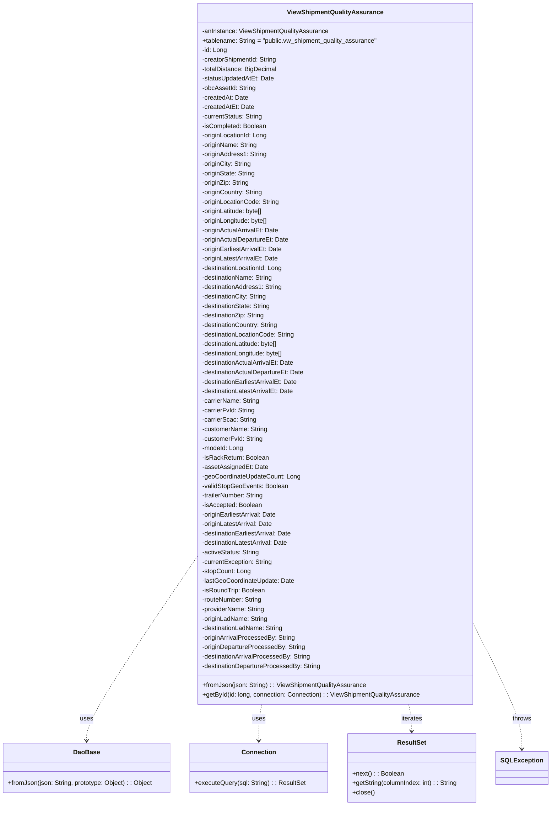
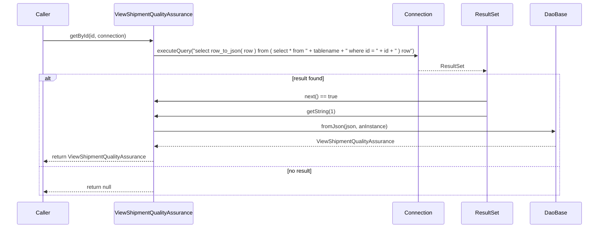

# Diagram: platform-java-lambdas/shipment/src/main/java/com/freightverify/shipment/datastore/postgresql/dao/ViewShipmentQualityAssurance.java

> Auto-generated by Obscura crawlers

## Diagram 1

### SVG

<svg id="container" width="1385.625" xmlns="http://www.w3.org/2000/svg" class="classDiagram" height="2040" viewBox="0 0 1385.625 2040" role="graphics-document document" aria-roledescription="class"><g><defs><marker id="container_class-aggregationStart" class="marker aggregation class" refX="18" refY="7" markerWidth="190" markerHeight="240" orient="auto"><path d="M 18,7 L9,13 L1,7 L9,1 Z"></path></marker></defs><defs><marker id="container_class-aggregationEnd" class="marker aggregation class" refX="1" refY="7" markerWidth="20" markerHeight="28" orient="auto"><path d="M 18,7 L9,13 L1,7 L9,1 Z"></path></marker></defs><defs><marker id="container_class-extensionStart" class="marker extension class" refX="18" refY="7" markerWidth="190" markerHeight="240" orient="auto"><path d="M 1,7 L18,13 V 1 Z"></path></marker></defs><defs><marker id="container_class-extensionEnd" class="marker extension class" refX="1" refY="7" markerWidth="20" markerHeight="28" orient="auto"><path d="M 1,1 V 13 L18,7 Z"></path></marker></defs><defs><marker id="container_class-compositionStart" class="marker composition class" refX="18" refY="7" markerWidth="190" markerHeight="240" orient="auto"><path d="M 18,7 L9,13 L1,7 L9,1 Z"></path></marker></defs><defs><marker id="container_class-compositionEnd" class="marker composition class" refX="1" refY="7" markerWidth="20" markerHeight="28" orient="auto"><path d="M 18,7 L9,13 L1,7 L9,1 Z"></path></marker></defs><defs><marker id="container_class-dependencyStart" class="marker dependency class" refX="6" refY="7" markerWidth="190" markerHeight="240" orient="auto"><path d="M 5,7 L9,13 L1,7 L9,1 Z"></path></marker></defs><defs><marker id="container_class-dependencyEnd" class="marker dependency class" refX="13" refY="7" markerWidth="20" markerHeight="28" orient="auto"><path d="M 18,7 L9,13 L14,7 L9,1 Z"></path></marker></defs><defs><marker id="container_class-lollipopStart" class="marker lollipop class" refX="13" refY="7" markerWidth="190" markerHeight="240" orient="auto"><circle stroke="black" fill="transparent" cx="7" cy="7" r="6"></circle></marker></defs><defs><marker id="container_class-lollipopEnd" class="marker lollipop class" refX="1" refY="7" markerWidth="190" markerHeight="240" orient="auto"><circle stroke="black" fill="transparent" cx="7" cy="7" r="6"></circle></marker></defs><g class="root"><g class="clusters"></g><g class="edgePaths"><path d="M499.982,1407.565L453.269,1476.47C406.555,1545.376,313.127,1683.188,266.413,1761.261C219.699,1839.333,219.699,1857.667,219.699,1866.833L219.699,1876" id="id_ViewShipmentQualityAssurance_DaoBase_1" class="edge-thickness-normal edge-pattern-dashed relation" style=";;;" data-edge="true" data-et="edge" data-id="id_ViewShipmentQualityAssurance_DaoBase_1" data-points="W3sieCI6NDk5Ljk4MjQyMTg3NSwieSI6MTQwNy41NjQ1NzYwNTk1MDA3fSx7IngiOjIxOS42OTkyMTg3NSwieSI6MTgyMX0seyJ4IjoyMTkuNjk5MjE4NzUsInkiOjE4ODJ9XQ==" marker-end="url(#container_class-dependencyEnd)"></path><path d="M661.408,1784L660.121,1790.167C658.833,1796.333,656.258,1808.667,654.971,1824C653.684,1839.333,653.684,1857.667,653.684,1866.833L653.684,1876" id="id_ViewShipmentQualityAssurance_Connection_2" class="edge-thickness-normal edge-pattern-dashed relation" style=";;;" data-edge="true" data-et="edge" data-id="id_ViewShipmentQualityAssurance_Connection_2" data-points="W3sieCI6NjYxLjQwNzg5MDYyNDk5OTksInkiOjE3ODR9LHsieCI6NjUzLjY4MzU5Mzc1LCJ5IjoxODIxfSx7IngiOjY1My42ODM1OTM3NSwieSI6MTg4Mn1d" marker-end="url(#container_class-dependencyEnd)"></path><path d="M1032.174,1784L1033.462,1790.167C1034.749,1796.333,1037.324,1808.667,1038.611,1820C1039.898,1831.333,1039.898,1841.667,1039.898,1846.833L1039.898,1852" id="id_ViewShipmentQualityAssurance_ResultSet_3" class="edge-thickness-normal edge-pattern-dashed relation" style=";;;" data-edge="true" data-et="edge" data-id="id_ViewShipmentQualityAssurance_ResultSet_3" data-points="W3sieCI6MTAzMi4xNzQxNDA2MjUsInkiOjE3ODR9LHsieCI6MTAzOS44OTg0Mzc1LCJ5IjoxODIxfSx7IngiOjEwMzkuODk4NDM3NSwieSI6MTg1OH1d" marker-end="url(#container_class-dependencyEnd)"></path><path d="M1193.6,1580.098L1213.954,1620.248C1234.309,1660.399,1275.018,1740.699,1295.372,1793.516C1315.727,1846.333,1315.727,1871.667,1315.727,1884.333L1315.727,1897" id="id_ViewShipmentQualityAssurance_SQLException_4" class="edge-thickness-normal edge-pattern-dashed relation" style=";;;" data-edge="true" data-et="edge" data-id="id_ViewShipmentQualityAssurance_SQLException_4" data-points="W3sieCI6MTE5My41OTk2MDkzNzUsInkiOjE1ODAuMDk4MTY5NDc0NTgyOH0seyJ4IjoxMzE1LjcyNjU2MjUsInkiOjE4MjF9LHsieCI6MTMxNS43MjY1NjI1LCJ5IjoxOTAzfV0=" marker-end="url(#container_class-dependencyEnd)"></path></g><g class="edgeLabels"><g class="edgeLabel" transform="translate(219.69921875, 1821)"><g class="label" data-id="id_ViewShipmentQualityAssurance_DaoBase_1" transform="translate(-16.4921875, -12)"><foreignObject width="32.984375" height="24">

uses

</foreignObject></g></g><g class="edgeLabel" transform="translate(653.68359375, 1821)"><g class="label" data-id="id_ViewShipmentQualityAssurance_Connection_2" transform="translate(-16.4921875, -12)"><foreignObject width="32.984375" height="24">

uses

</foreignObject></g></g><g class="edgeLabel" transform="translate(1039.8984375, 1821)"><g class="label" data-id="id_ViewShipmentQualityAssurance_ResultSet_3" transform="translate(-27.4140625, -12)"><foreignObject width="54.828125" height="24">

iterates

</foreignObject></g></g><g class="edgeLabel" transform="translate(1315.7265625, 1821)"><g class="label" data-id="id_ViewShipmentQualityAssurance_SQLException_4" transform="translate(-24.5703125, -12)"><foreignObject width="49.140625" height="24">

throws

</foreignObject></g></g></g><g class="nodes"><g class="node default" id="classId-ViewShipmentQualityAssurance-0" transform="translate(846.791015625, 896)"><g class="basic label-container"><path d="M-346.80859375 -888 L346.80859375 -888 L346.80859375 888 L-346.80859375 888" stroke="none" stroke-width="0" fill="#ECECFF" style=""></path><path d="M-346.80859375 -888 C-160.00375951193277 -888, 26.80107472613446 -888, 346.80859375 -888 M-346.80859375 -888 C-186.48944434241034 -888, -26.170294934820674 -888, 346.80859375 -888 M346.80859375 -888 C346.80859375 -426.96594819236856, 346.80859375 34.068103615262885, 346.80859375 888 M346.80859375 -888 C346.80859375 -235.14286559853497, 346.80859375 417.71426880293006, 346.80859375 888 M346.80859375 888 C165.2041520083959 888, -16.400289733208183 888, -346.80859375 888 M346.80859375 888 C165.56017891005118 888, -15.688235929897644 888, -346.80859375 888 M-346.80859375 888 C-346.80859375 498.1744543242498, -346.80859375 108.34890864849956, -346.80859375 -888 M-346.80859375 888 C-346.80859375 350.78464356038603, -346.80859375 -186.43071287922794, -346.80859375 -888" stroke="#9370DB" stroke-width="1.3" fill="none" stroke-dasharray="0 0" style=""></path></g><g class="annotation-group text" transform="translate(0, -864)"></g><g class="label-group text" transform="translate(-115.5390625, -864)"><g class="label" style="font-weight: bolder" transform="translate(0,-12)"><foreignObject width="231.078125" height="24">

ViewShipmentQualityAssurance

</foreignObject></g></g><g class="members-group text" transform="translate(-334.80859375, -816)"><g class="label" style="" transform="translate(0,-12)"><foreignObject width="321.71875" height="24">

-anInstance: ViewShipmentQualityAssurance

</foreignObject></g><g class="label" style="" transform="translate(0,12)"><foreignObject width="448.09375" height="24">

+tablename: String = "public.vw_shipment_quality_assurance"

</foreignObject></g><g class="label" style="" transform="translate(0,36)"><foreignObject width="63.21875" height="24">

-id: Long

</foreignObject></g><g class="label" style="" transform="translate(0,60)"><foreignObject width="193.0625" height="24">

-creatorShipmentId: String

</foreignObject></g><g class="label" style="" transform="translate(0,84)"><foreignObject width="191" height="24">

-totalDistance: BigDecimal

</foreignObject></g><g class="label" style="" transform="translate(0,108)"><foreignObject width="183.359375" height="24">

-statusUpdatedAtEt: Date

</foreignObject></g><g class="label" style="" transform="translate(0,132)"><foreignObject width="136.640625" height="24">

-obcAssetId: String

</foreignObject></g><g class="label" style="" transform="translate(0,156)"><foreignObject width="117.078125" height="24">

-createdAt: Date

</foreignObject></g><g class="label" style="" transform="translate(0,180)"><foreignObject width="131.1875" height="24">

-createdAtEt: Date

</foreignObject></g><g class="label" style="" transform="translate(0,204)"><foreignObject width="155.609375" height="24">

-currentStatus: String

</foreignObject></g><g class="label" style="" transform="translate(0,228)"><foreignObject width="164.53125" height="24">

-isCompleted: Boolean

</foreignObject></g><g class="label" style="" transform="translate(0,252)"><foreignObject width="167.78125" height="24">

-originLocationId: Long

</foreignObject></g><g class="label" style="" transform="translate(0,276)"><foreignObject width="141.71875" height="24">

-originName: String

</foreignObject></g><g class="label" style="" transform="translate(0,300)"><foreignObject width="163.609375" height="24">

-originAddress1: String

</foreignObject></g><g class="label" style="" transform="translate(0,324)"><foreignObject width="126.765625" height="24">

-originCity: String

</foreignObject></g><g class="label" style="" transform="translate(0,348)"><foreignObject width="137" height="24">

-originState: String

</foreignObject></g><g class="label" style="" transform="translate(0,372)"><foreignObject width="122.03125" height="24">

-originZip: String

</foreignObject></g><g class="label" style="" transform="translate(0,396)"><foreignObject width="156.21875" height="24">

-originCountry: String

</foreignObject></g><g class="label" style="" transform="translate(0,420)"><foreignObject width="198.046875" height="24">

-originLocationCode: String

</foreignObject></g><g class="label" style="" transform="translate(0,444)"><foreignObject width="158.828125" height="24">

-originLatitude: byte[]

</foreignObject></g><g class="label" style="" transform="translate(0,468)"><foreignObject width="171.140625" height="24">

-originLongitude: byte[]

</foreignObject></g><g class="label" style="" transform="translate(0,492)"><foreignObject width="196.078125" height="24">

-originActualArrivalEt: Date

</foreignObject></g><g class="label" style="" transform="translate(0,516)"><foreignObject width="221.9375" height="24">

-originActualDepartureEt: Date

</foreignObject></g><g class="label" style="" transform="translate(0,540)"><foreignObject width="205.359375" height="24">

-originEarliestArrivalEt: Date

</foreignObject></g><g class="label" style="" transform="translate(0,564)"><foreignObject width="194.953125" height="24">

-originLatestArrivalEt: Date

</foreignObject></g><g class="label" style="" transform="translate(0,588)"><foreignObject width="208.6875" height="24">

-destinationLocationId: Long

</foreignObject></g><g class="label" style="" transform="translate(0,612)"><foreignObject width="182.609375" height="24">

-destinationName: String

</foreignObject></g><g class="label" style="" transform="translate(0,636)"><foreignObject width="204.5" height="24">

-destinationAddress1: String

</foreignObject></g><g class="label" style="" transform="translate(0,660)"><foreignObject width="167.65625" height="24">

-destinationCity: String

</foreignObject></g><g class="label" style="" transform="translate(0,684)"><foreignObject width="177.890625" height="24">

-destinationState: String

</foreignObject></g><g class="label" style="" transform="translate(0,708)"><foreignObject width="162.921875" height="24">

-destinationZip: String

</foreignObject></g><g class="label" style="" transform="translate(0,732)"><foreignObject width="197.109375" height="24">

-destinationCountry: String

</foreignObject></g><g class="label" style="" transform="translate(0,756)"><foreignObject width="238.9375" height="24">

-destinationLocationCode: String

</foreignObject></g><g class="label" style="" transform="translate(0,780)"><foreignObject width="199.71875" height="24">

-destinationLatitude: byte[]

</foreignObject></g><g class="label" style="" transform="translate(0,804)"><foreignObject width="212.046875" height="24">

-destinationLongitude: byte[]

</foreignObject></g><g class="label" style="" transform="translate(0,828)"><foreignObject width="236.96875" height="24">

-destinationActualArrivalEt: Date

</foreignObject></g><g class="label" style="" transform="translate(0,852)"><foreignObject width="262.84375" height="24">

-destinationActualDepartureEt: Date

</foreignObject></g><g class="label" style="" transform="translate(0,876)"><foreignObject width="246.25" height="24">

-destinationEarliestArrivalEt: Date

</foreignObject></g><g class="label" style="" transform="translate(0,900)"><foreignObject width="235.84375" height="24">

-destinationLatestArrivalEt: Date

</foreignObject></g><g class="label" style="" transform="translate(0,924)"><foreignObject width="147.4375" height="24">

-carrierName: String

</foreignObject></g><g class="label" style="" transform="translate(0,948)"><foreignObject width="134.828125" height="24">

-carrierFvId: String

</foreignObject></g><g class="label" style="" transform="translate(0,972)"><foreignObject width="137.984375" height="24">

-carrierScac: String

</foreignObject></g><g class="label" style="" transform="translate(0,996)"><foreignObject width="167.234375" height="24">

-customerName: String

</foreignObject></g><g class="label" style="" transform="translate(0,1020)"><foreignObject width="154.625" height="24">

-customerFvId: String

</foreignObject></g><g class="label" style="" transform="translate(0,1044)"><foreignObject width="104.78125" height="24">

-modeId: Long

</foreignObject></g><g class="label" style="" transform="translate(0,1068)"><foreignObject width="169.046875" height="24">

-isRackReturn: Boolean

</foreignObject></g><g class="label" style="" transform="translate(0,1092)"><foreignObject width="163.84375" height="24">

-assetAssignedEt: Date

</foreignObject></g><g class="label" style="" transform="translate(0,1116)"><foreignObject width="249.84375" height="24">

-geoCoordinateUpdateCount: Long

</foreignObject></g><g class="label" style="" transform="translate(0,1140)"><foreignObject width="217.625" height="24">

-validStopGeoEvents: Boolean

</foreignObject></g><g class="label" style="" transform="translate(0,1164)"><foreignObject width="159.953125" height="24">

-trailerNumber: String

</foreignObject></g><g class="label" style="" transform="translate(0,1188)"><foreignObject width="152.0625" height="24">

-isAccepted: Boolean

</foreignObject></g><g class="label" style="" transform="translate(0,1212)"><foreignObject width="191.34375" height="24">

-originEarliestArrival: Date

</foreignObject></g><g class="label" style="" transform="translate(0,1236)"><foreignObject width="180.9375" height="24">

-originLatestArrival: Date

</foreignObject></g><g class="label" style="" transform="translate(0,1260)"><foreignObject width="232.234375" height="24">

-destinationEarliestArrival: Date

</foreignObject></g><g class="label" style="" transform="translate(0,1284)"><foreignObject width="221.828125" height="24">

-destinationLatestArrival: Date

</foreignObject></g><g class="label" style="" transform="translate(0,1308)"><foreignObject width="145.984375" height="24">

-activeStatus: String

</foreignObject></g><g class="label" style="" transform="translate(0,1332)"><foreignObject width="180.703125" height="24">

-currentException: String

</foreignObject></g><g class="label" style="" transform="translate(0,1356)"><foreignObject width="123.515625" height="24">

-stopCount: Long

</foreignObject></g><g class="label" style="" transform="translate(0,1380)"><foreignObject width="234.265625" height="24">

-lastGeoCoordinateUpdate: Date

</foreignObject></g><g class="label" style="" transform="translate(0,1404)"><foreignObject width="161.203125" height="24">

-isRoundTrip: Boolean

</foreignObject></g><g class="label" style="" transform="translate(0,1428)"><foreignObject width="154.53125" height="24">

-routeNumber: String

</foreignObject></g><g class="label" style="" transform="translate(0,1452)"><foreignObject width="160.8125" height="24">

-providerName: String

</foreignObject></g><g class="label" style="" transform="translate(0,1476)"><foreignObject width="167.796875" height="24">

-originLadName: String

</foreignObject></g><g class="label" style="" transform="translate(0,1500)"><foreignObject width="208.703125" height="24">

-destinationLadName: String

</foreignObject></g><g class="label" style="" transform="translate(0,1524)"><foreignObject width="237.34375" height="24">

-originArrivalProcessedBy: String

</foreignObject></g><g class="label" style="" transform="translate(0,1548)"><foreignObject width="263.203125" height="24">

-originDepartureProcessedBy: String

</foreignObject></g><g class="label" style="" transform="translate(0,1572)"><foreignObject width="278.234375" height="24">

-destinationArrivalProcessedBy: String

</foreignObject></g><g class="label" style="" transform="translate(0,1596)"><foreignObject width="304.109375" height="24">

-destinationDepartureProcessedBy: String

</foreignObject></g></g><g class="methods-group text" transform="translate(-334.80859375, 840)"><g class="label" style="" transform="translate(0,-12)"><foreignObject width="413.890625" height="24">

+fromJson(json: String) : : ViewShipmentQualityAssurance

</foreignObject></g><g class="label" style="" transform="translate(0,12)"><foreignObject width="554.078125" height="24">

+getById(id: long, connection: Connection) : : ViewShipmentQualityAssurance

</foreignObject></g></g><g class="divider" style=""><path d="M-346.80859375 -840 C-149.11961709455 -840, 48.56935956090001 -840, 346.80859375 -840 M-346.80859375 -840 C-158.11471084651373 -840, 30.57917205697254 -840, 346.80859375 -840" stroke="#9370DB" stroke-width="1.3" fill="none" stroke-dasharray="0 0" style=""></path></g><g class="divider" style=""><path d="M-346.80859375 816 C-187.28043497272807 816, -27.752276195456147 816, 346.80859375 816 M-346.80859375 816 C-103.3561138201886 816, 140.0963661096228 816, 346.80859375 816" stroke="#9370DB" stroke-width="1.3" fill="none" stroke-dasharray="0 0" style=""></path></g></g><g class="node default" id="classId-DaoBase-1" transform="translate(219.69921875, 1945)"><g class="basic label-container"><path d="M-211.69921875 -63 L211.69921875 -63 L211.69921875 63 L-211.69921875 63" stroke="none" stroke-width="0" fill="#ECECFF" style=""></path><path d="M-211.69921875 -63 C-113.11814449177513 -63, -14.537070233550253 -63, 211.69921875 -63 M-211.69921875 -63 C-90.26136756074341 -63, 31.176483628513182 -63, 211.69921875 -63 M211.69921875 -63 C211.69921875 -27.27473768051891, 211.69921875 8.450524638962179, 211.69921875 63 M211.69921875 -63 C211.69921875 -25.186573611018645, 211.69921875 12.62685277796271, 211.69921875 63 M211.69921875 63 C93.250555411352 63, -25.198107927296007 63, -211.69921875 63 M211.69921875 63 C75.8619831780421 63, -59.97525239391581 63, -211.69921875 63 M-211.69921875 63 C-211.69921875 35.54019680006088, -211.69921875 8.080393600121774, -211.69921875 -63 M-211.69921875 63 C-211.69921875 26.899847037052275, -211.69921875 -9.20030592589545, -211.69921875 -63" stroke="#9370DB" stroke-width="1.3" fill="none" stroke-dasharray="0 0" style=""></path></g><g class="annotation-group text" transform="translate(0, -39)"></g><g class="label-group text" transform="translate(-31.7109375, -39)"><g class="label" style="font-weight: bolder" transform="translate(0,-12)"><foreignObject width="63.421875" height="24">

DaoBase

</foreignObject></g></g><g class="members-group text" transform="translate(-199.69921875, 9)"></g><g class="methods-group text" transform="translate(-199.69921875, 39)"><g class="label" style="" transform="translate(0,-12)"><foreignObject width="367.6875" height="24">

+fromJson(json: String, prototype: Object) : : Object

</foreignObject></g></g><g class="divider" style=""><path d="M-211.69921875 -15 C-76.72238680285511 -15, 58.254445144289775 -15, 211.69921875 -15 M-211.69921875 -15 C-100.67818630052658 -15, 10.342846148946848 -15, 211.69921875 -15" stroke="#9370DB" stroke-width="1.3" fill="none" stroke-dasharray="0 0" style=""></path></g><g class="divider" style=""><path d="M-211.69921875 9 C-60.137161319005 9, 91.42489611199 9, 211.69921875 9 M-211.69921875 9 C-95.86770508991037 9, 19.963808570179253 9, 211.69921875 9" stroke="#9370DB" stroke-width="1.3" fill="none" stroke-dasharray="0 0" style=""></path></g></g><g class="node default" id="classId-Connection-2" transform="translate(653.68359375, 1945)"><g class="basic label-container"><path d="M-172.28515625 -63 L172.28515625 -63 L172.28515625 63 L-172.28515625 63" stroke="none" stroke-width="0" fill="#ECECFF" style=""></path><path d="M-172.28515625 -63 C-66.17307451381785 -63, 39.939007222364296 -63, 172.28515625 -63 M-172.28515625 -63 C-84.78346014289303 -63, 2.7182359642139318 -63, 172.28515625 -63 M172.28515625 -63 C172.28515625 -25.661726476860473, 172.28515625 11.676547046279055, 172.28515625 63 M172.28515625 -63 C172.28515625 -36.76610862904333, 172.28515625 -10.532217258086654, 172.28515625 63 M172.28515625 63 C61.80940825127131 63, -48.666339747457386 63, -172.28515625 63 M172.28515625 63 C56.47047503135656 63, -59.344206187286886 63, -172.28515625 63 M-172.28515625 63 C-172.28515625 22.206507161301147, -172.28515625 -18.586985677397706, -172.28515625 -63 M-172.28515625 63 C-172.28515625 15.030020093738017, -172.28515625 -32.939959812523966, -172.28515625 -63" stroke="#9370DB" stroke-width="1.3" fill="none" stroke-dasharray="0 0" style=""></path></g><g class="annotation-group text" transform="translate(0, -39)"></g><g class="label-group text" transform="translate(-41.2265625, -39)"><g class="label" style="font-weight: bolder" transform="translate(0,-12)"><foreignObject width="82.453125" height="24">

Connection

</foreignObject></g></g><g class="members-group text" transform="translate(-160.28515625, 9)"></g><g class="methods-group text" transform="translate(-160.28515625, 39)"><g class="label" style="" transform="translate(0,-12)"><foreignObject width="279.34375" height="24">

+executeQuery(sql: String) : : ResultSet

</foreignObject></g></g><g class="divider" style=""><path d="M-172.28515625 -15 C-40.46806694630956 -15, 91.34902235738087 -15, 172.28515625 -15 M-172.28515625 -15 C-56.51598555171921 -15, 59.25318514656158 -15, 172.28515625 -15" stroke="#9370DB" stroke-width="1.3" fill="none" stroke-dasharray="0 0" style=""></path></g><g class="divider" style=""><path d="M-172.28515625 9 C-100.98326849555647 9, -29.681380741112946 9, 172.28515625 9 M-172.28515625 9 C-76.59470424006237 9, 19.09574776987526 9, 172.28515625 9" stroke="#9370DB" stroke-width="1.3" fill="none" stroke-dasharray="0 0" style=""></path></g></g><g class="node default" id="classId-ResultSet-3" transform="translate(1039.8984375, 1945)"><g class="basic label-container"><path d="M-163.9296875 -87 L163.9296875 -87 L163.9296875 87 L-163.9296875 87" stroke="none" stroke-width="0" fill="#ECECFF" style=""></path><path d="M-163.9296875 -87 C-60.33424104828525 -87, 43.2612054034295 -87, 163.9296875 -87 M-163.9296875 -87 C-38.258455452733656 -87, 87.41277659453269 -87, 163.9296875 -87 M163.9296875 -87 C163.9296875 -31.125284177683753, 163.9296875 24.749431644632494, 163.9296875 87 M163.9296875 -87 C163.9296875 -31.94320622376833, 163.9296875 23.113587552463343, 163.9296875 87 M163.9296875 87 C78.03477144799496 87, -7.860144604010088 87, -163.9296875 87 M163.9296875 87 C56.94981551287093 87, -50.030056474258146 87, -163.9296875 87 M-163.9296875 87 C-163.9296875 22.946442790490963, -163.9296875 -41.107114419018075, -163.9296875 -87 M-163.9296875 87 C-163.9296875 24.280835598597882, -163.9296875 -38.438328802804236, -163.9296875 -87" stroke="#9370DB" stroke-width="1.3" fill="none" stroke-dasharray="0 0" style=""></path></g><g class="annotation-group text" transform="translate(0, -63)"></g><g class="label-group text" transform="translate(-35.21875, -63)"><g class="label" style="font-weight: bolder" transform="translate(0,-12)"><foreignObject width="70.4375" height="24">

ResultSet

</foreignObject></g></g><g class="members-group text" transform="translate(-151.9296875, -15)"></g><g class="methods-group text" transform="translate(-151.9296875, 15)"><g class="label" style="" transform="translate(0,-12)"><foreignObject width="129.90625" height="24">

+next() : : Boolean

</foreignObject></g><g class="label" style="" transform="translate(0,12)"><foreignObject width="268.640625" height="24">

+getString(columnIndex: int) : : String

</foreignObject></g><g class="label" style="" transform="translate(0,36)"><foreignObject width="56.15625" height="24">

+close()

</foreignObject></g></g><g class="divider" style=""><path d="M-163.9296875 -39 C-71.14184570206004 -39, 21.645996095879923 -39, 163.9296875 -39 M-163.9296875 -39 C-56.57685998998561 -39, 50.775967520028786 -39, 163.9296875 -39" stroke="#9370DB" stroke-width="1.3" fill="none" stroke-dasharray="0 0" style=""></path></g><g class="divider" style=""><path d="M-163.9296875 -15 C-92.4035929373432 -15, -20.87749837468641 -15, 163.9296875 -15 M-163.9296875 -15 C-64.0274072808458 -15, 35.874872938308414 -15, 163.9296875 -15" stroke="#9370DB" stroke-width="1.3" fill="none" stroke-dasharray="0 0" style=""></path></g></g><g class="node default" id="classId-SQLException-4" transform="translate(1315.7265625, 1945)"><g class="basic label-container"><path d="M-61.8984375 -42 L61.8984375 -42 L61.8984375 42 L-61.8984375 42" stroke="none" stroke-width="0" fill="#ECECFF" style=""></path><path d="M-61.8984375 -42 C-15.96420514555517 -42, 29.97002720888966 -42, 61.8984375 -42 M-61.8984375 -42 C-13.582637703394191 -42, 34.73316209321162 -42, 61.8984375 -42 M61.8984375 -42 C61.8984375 -23.41830206866012, 61.8984375 -4.8366041373202435, 61.8984375 42 M61.8984375 -42 C61.8984375 -21.43988244422673, 61.8984375 -0.8797648884534581, 61.8984375 42 M61.8984375 42 C19.13268892722585 42, -23.6330596455483 42, -61.8984375 42 M61.8984375 42 C28.270795937745348 42, -5.356845624509305 42, -61.8984375 42 M-61.8984375 42 C-61.8984375 20.150649450132782, -61.8984375 -1.6987010997344356, -61.8984375 -42 M-61.8984375 42 C-61.8984375 11.648837735102333, -61.8984375 -18.702324529795334, -61.8984375 -42" stroke="#9370DB" stroke-width="1.3" fill="none" stroke-dasharray="0 0" style=""></path></g><g class="annotation-group text" transform="translate(0, -18)"></g><g class="label-group text" transform="translate(-49.8984375, -18)"><g class="label" style="font-weight: bolder" transform="translate(0,-12)"><foreignObject width="99.796875" height="24">

SQLException

</foreignObject></g></g><g class="members-group text" transform="translate(-49.8984375, 30)"></g><g class="methods-group text" transform="translate(-49.8984375, 60)"></g><g class="divider" style=""><path d="M-61.8984375 6 C-30.871454113930415 6, 0.15552927213916945 6, 61.8984375 6 M-61.8984375 6 C-27.02023748934044 6, 7.8579625213191235 6, 61.8984375 6" stroke="#9370DB" stroke-width="1.3" fill="none" stroke-dasharray="0 0" style=""></path></g><g class="divider" style=""><path d="M-61.8984375 24 C-16.95439401640141 24, 27.989649467197182 24, 61.8984375 24 M-61.8984375 24 C-30.907966176036556 24, 0.0825051479268879 24, 61.8984375 24" stroke="#9370DB" stroke-width="1.3" fill="none" stroke-dasharray="0 0" style=""></path></g></g></g></g></g></svg>

## Diagram 2

### SVG

<svg id="container" width="1825" xmlns="http://www.w3.org/2000/svg" height="703" viewBox="-50 -10 1825 703" role="graphics-document document" aria-roledescription="sequence"><g><rect x="1575" y="617" fill="#eaeaea" stroke="#666" width="150" height="65" name="DB" rx="3" ry="3" class="actor actor-bottom"></rect><text x="1650" y="649.5" dominant-baseline="central" alignment-baseline="central" class="actor actor-box" style="text-anchor: middle; font-size: 16px; font-weight: 400;"><tspan x="1650" dy="0">DaoBase</tspan></text></g><g><rect x="1375" y="617" fill="#eaeaea" stroke="#666" width="150" height="65" name="RS" rx="3" ry="3" class="actor actor-bottom"></rect><text x="1450" y="649.5" dominant-baseline="central" alignment-baseline="central" class="actor actor-box" style="text-anchor: middle; font-size: 16px; font-weight: 400;"><tspan x="1450" dy="0">ResultSet</tspan></text></g><g><rect x="1175" y="617" fill="#eaeaea" stroke="#666" width="150" height="65" name="C" rx="3" ry="3" class="actor actor-bottom"></rect><text x="1250" y="649.5" dominant-baseline="central" alignment-baseline="central" class="actor actor-box" style="text-anchor: middle; font-size: 16px; font-weight: 400;"><tspan x="1250" dy="0">Connection</tspan></text></g><g><rect x="298" y="617" fill="#eaeaea" stroke="#666" width="248" height="65" name="V" rx="3" ry="3" class="actor actor-bottom"></rect><text x="422" y="649.5" dominant-baseline="central" alignment-baseline="central" class="actor actor-box" style="text-anchor: middle; font-size: 16px; font-weight: 400;"><tspan x="422" dy="0">ViewShipmentQualityAssurance</tspan></text></g><g><rect x="0" y="617" fill="#eaeaea" stroke="#666" width="150" height="65" name="Caller" rx="3" ry="3" class="actor actor-bottom"></rect><text x="75" y="649.5" dominant-baseline="central" alignment-baseline="central" class="actor actor-box" style="text-anchor: middle; font-size: 16px; font-weight: 400;"><tspan x="75" dy="0">Caller</tspan></text></g><g><line id="actor4" x1="1650" y1="65" x2="1650" y2="617" class="actor-line 200" stroke-width="0.5px" stroke="#999" name="DB"></line><g id="root-4"><rect x="1575" y="0" fill="#eaeaea" stroke="#666" width="150" height="65" name="DB" rx="3" ry="3" class="actor actor-top"></rect><text x="1650" y="32.5" dominant-baseline="central" alignment-baseline="central" class="actor actor-box" style="text-anchor: middle; font-size: 16px; font-weight: 400;"><tspan x="1650" dy="0">DaoBase</tspan></text></g></g><g><line id="actor3" x1="1450" y1="65" x2="1450" y2="617" class="actor-line 200" stroke-width="0.5px" stroke="#999" name="RS"></line><g id="root-3"><rect x="1375" y="0" fill="#eaeaea" stroke="#666" width="150" height="65" name="RS" rx="3" ry="3" class="actor actor-top"></rect><text x="1450" y="32.5" dominant-baseline="central" alignment-baseline="central" class="actor actor-box" style="text-anchor: middle; font-size: 16px; font-weight: 400;"><tspan x="1450" dy="0">ResultSet</tspan></text></g></g><g><line id="actor2" x1="1250" y1="65" x2="1250" y2="617" class="actor-line 200" stroke-width="0.5px" stroke="#999" name="C"></line><g id="root-2"><rect x="1175" y="0" fill="#eaeaea" stroke="#666" width="150" height="65" name="C" rx="3" ry="3" class="actor actor-top"></rect><text x="1250" y="32.5" dominant-baseline="central" alignment-baseline="central" class="actor actor-box" style="text-anchor: middle; font-size: 16px; font-weight: 400;"><tspan x="1250" dy="0">Connection</tspan></text></g></g><g><line id="actor1" x1="422" y1="65" x2="422" y2="617" class="actor-line 200" stroke-width="0.5px" stroke="#999" name="V"></line><g id="root-1"><rect x="298" y="0" fill="#eaeaea" stroke="#666" width="248" height="65" name="V" rx="3" ry="3" class="actor actor-top"></rect><text x="422" y="32.5" dominant-baseline="central" alignment-baseline="central" class="actor actor-box" style="text-anchor: middle; font-size: 16px; font-weight: 400;"><tspan x="422" dy="0">ViewShipmentQualityAssurance</tspan></text></g></g><g><line id="actor0" x1="75" y1="65" x2="75" y2="617" class="actor-line 200" stroke-width="0.5px" stroke="#999" name="Caller"></line><g id="root-0"><rect x="0" y="0" fill="#eaeaea" stroke="#666" width="150" height="65" name="Caller" rx="3" ry="3" class="actor actor-top"></rect><text x="75" y="32.5" dominant-baseline="central" alignment-baseline="central" class="actor actor-box" style="text-anchor: middle; font-size: 16px; font-weight: 400;"><tspan x="75" dy="0">Caller</tspan></text></g></g><g></g><defs><symbol id="computer" width="24" height="24"><path transform="scale(.5)" d="M2 2v13h20v-13h-20zm18 11h-16v-9h16v9zm-10.228 6l.466-1h3.524l.467 1h-4.457zm14.228 3h-24l2-6h2.104l-1.33 4h18.45l-1.297-4h2.073l2 6zm-5-10h-14v-7h14v7z"></path></symbol></defs><defs><symbol id="database" fill-rule="evenodd" clip-rule="evenodd"><path transform="scale(.5)" d="M12.258.001l.256.004.255.005.253.008.251.01.249.012.247.015.246.016.242.019.241.02.239.023.236.024.233.027.231.028.229.031.225.032.223.034.22.036.217.038.214.04.211.041.208.043.205.045.201.046.198.048.194.05.191.051.187.053.183.054.18.056.175.057.172.059.168.06.163.061.16.063.155.064.15.066.074.033.073.033.071.034.07.034.069.035.068.035.067.035.066.035.064.036.064.036.062.036.06.036.06.037.058.037.058.037.055.038.055.038.053.038.052.038.051.039.05.039.048.039.047.039.045.04.044.04.043.04.041.04.04.041.039.041.037.041.036.041.034.041.033.042.032.042.03.042.029.042.027.042.026.043.024.043.023.043.021.043.02.043.018.044.017.043.015.044.013.044.012.044.011.045.009.044.007.045.006.045.004.045.002.045.001.045v17l-.001.045-.002.045-.004.045-.006.045-.007.045-.009.044-.011.045-.012.044-.013.044-.015.044-.017.043-.018.044-.02.043-.021.043-.023.043-.024.043-.026.043-.027.042-.029.042-.03.042-.032.042-.033.042-.034.041-.036.041-.037.041-.039.041-.04.041-.041.04-.043.04-.044.04-.045.04-.047.039-.048.039-.05.039-.051.039-.052.038-.053.038-.055.038-.055.038-.058.037-.058.037-.06.037-.06.036-.062.036-.064.036-.064.036-.066.035-.067.035-.068.035-.069.035-.07.034-.071.034-.073.033-.074.033-.15.066-.155.064-.16.063-.163.061-.168.06-.172.059-.175.057-.18.056-.183.054-.187.053-.191.051-.194.05-.198.048-.201.046-.205.045-.208.043-.211.041-.214.04-.217.038-.22.036-.223.034-.225.032-.229.031-.231.028-.233.027-.236.024-.239.023-.241.02-.242.019-.246.016-.247.015-.249.012-.251.01-.253.008-.255.005-.256.004-.258.001-.258-.001-.256-.004-.255-.005-.253-.008-.251-.01-.249-.012-.247-.015-.245-.016-.243-.019-.241-.02-.238-.023-.236-.024-.234-.027-.231-.028-.228-.031-.226-.032-.223-.034-.22-.036-.217-.038-.214-.04-.211-.041-.208-.043-.204-.045-.201-.046-.198-.048-.195-.05-.19-.051-.187-.053-.184-.054-.179-.056-.176-.057-.172-.059-.167-.06-.164-.061-.159-.063-.155-.064-.151-.066-.074-.033-.072-.033-.072-.034-.07-.034-.069-.035-.068-.035-.067-.035-.066-.035-.064-.036-.063-.036-.062-.036-.061-.036-.06-.037-.058-.037-.057-.037-.056-.038-.055-.038-.053-.038-.052-.038-.051-.039-.049-.039-.049-.039-.046-.039-.046-.04-.044-.04-.043-.04-.041-.04-.04-.041-.039-.041-.037-.041-.036-.041-.034-.041-.033-.042-.032-.042-.03-.042-.029-.042-.027-.042-.026-.043-.024-.043-.023-.043-.021-.043-.02-.043-.018-.044-.017-.043-.015-.044-.013-.044-.012-.044-.011-.045-.009-.044-.007-.045-.006-.045-.004-.045-.002-.045-.001-.045v-17l.001-.045.002-.045.004-.045.006-.045.007-.045.009-.044.011-.045.012-.044.013-.044.015-.044.017-.043.018-.044.02-.043.021-.043.023-.043.024-.043.026-.043.027-.042.029-.042.03-.042.032-.042.033-.042.034-.041.036-.041.037-.041.039-.041.04-.041.041-.04.043-.04.044-.04.046-.04.046-.039.049-.039.049-.039.051-.039.052-.038.053-.038.055-.038.056-.038.057-.037.058-.037.06-.037.061-.036.062-.036.063-.036.064-.036.066-.035.067-.035.068-.035.069-.035.07-.034.072-.034.072-.033.074-.033.151-.066.155-.064.159-.063.164-.061.167-.06.172-.059.176-.057.179-.056.184-.054.187-.053.19-.051.195-.05.198-.048.201-.046.204-.045.208-.043.211-.041.214-.04.217-.038.22-.036.223-.034.226-.032.228-.031.231-.028.234-.027.236-.024.238-.023.241-.02.243-.019.245-.016.247-.015.249-.012.251-.01.253-.008.255-.005.256-.004.258-.001.258.001zm-9.258 20.499v.01l.001.021.003.021.004.022.005.021.006.022.007.022.009.023.01.022.011.023.012.023.013.023.015.023.016.024.017.023.018.024.019.024.021.024.022.025.023.024.024.025.052.049.056.05.061.051.066.051.07.051.075.051.079.052.084.052.088.052.092.052.097.052.102.051.105.052.11.052.114.051.119.051.123.051.127.05.131.05.135.05.139.048.144.049.147.047.152.047.155.047.16.045.163.045.167.043.171.043.176.041.178.041.183.039.187.039.19.037.194.035.197.035.202.033.204.031.209.03.212.029.216.027.219.025.222.024.226.021.23.02.233.018.236.016.24.015.243.012.246.01.249.008.253.005.256.004.259.001.26-.001.257-.004.254-.005.25-.008.247-.011.244-.012.241-.014.237-.016.233-.018.231-.021.226-.021.224-.024.22-.026.216-.027.212-.028.21-.031.205-.031.202-.034.198-.034.194-.036.191-.037.187-.039.183-.04.179-.04.175-.042.172-.043.168-.044.163-.045.16-.046.155-.046.152-.047.148-.048.143-.049.139-.049.136-.05.131-.05.126-.05.123-.051.118-.052.114-.051.11-.052.106-.052.101-.052.096-.052.092-.052.088-.053.083-.051.079-.052.074-.052.07-.051.065-.051.06-.051.056-.05.051-.05.023-.024.023-.025.021-.024.02-.024.019-.024.018-.024.017-.024.015-.023.014-.024.013-.023.012-.023.01-.023.01-.022.008-.022.006-.022.006-.022.004-.022.004-.021.001-.021.001-.021v-4.127l-.077.055-.08.053-.083.054-.085.053-.087.052-.09.052-.093.051-.095.05-.097.05-.1.049-.102.049-.105.048-.106.047-.109.047-.111.046-.114.045-.115.045-.118.044-.12.043-.122.042-.124.042-.126.041-.128.04-.13.04-.132.038-.134.038-.135.037-.138.037-.139.035-.142.035-.143.034-.144.033-.147.032-.148.031-.15.03-.151.03-.153.029-.154.027-.156.027-.158.026-.159.025-.161.024-.162.023-.163.022-.165.021-.166.02-.167.019-.169.018-.169.017-.171.016-.173.015-.173.014-.175.013-.175.012-.177.011-.178.01-.179.008-.179.008-.181.006-.182.005-.182.004-.184.003-.184.002h-.37l-.184-.002-.184-.003-.182-.004-.182-.005-.181-.006-.179-.008-.179-.008-.178-.01-.176-.011-.176-.012-.175-.013-.173-.014-.172-.015-.171-.016-.17-.017-.169-.018-.167-.019-.166-.02-.165-.021-.163-.022-.162-.023-.161-.024-.159-.025-.157-.026-.156-.027-.155-.027-.153-.029-.151-.03-.15-.03-.148-.031-.146-.032-.145-.033-.143-.034-.141-.035-.14-.035-.137-.037-.136-.037-.134-.038-.132-.038-.13-.04-.128-.04-.126-.041-.124-.042-.122-.042-.12-.044-.117-.043-.116-.045-.113-.045-.112-.046-.109-.047-.106-.047-.105-.048-.102-.049-.1-.049-.097-.05-.095-.05-.093-.052-.09-.051-.087-.052-.085-.053-.083-.054-.08-.054-.077-.054v4.127zm0-5.654v.011l.001.021.003.021.004.021.005.022.006.022.007.022.009.022.01.022.011.023.012.023.013.023.015.024.016.023.017.024.018.024.019.024.021.024.022.024.023.025.024.024.052.05.056.05.061.05.066.051.07.051.075.052.079.051.084.052.088.052.092.052.097.052.102.052.105.052.11.051.114.051.119.052.123.05.127.051.131.05.135.049.139.049.144.048.147.048.152.047.155.046.16.045.163.045.167.044.171.042.176.042.178.04.183.04.187.038.19.037.194.036.197.034.202.033.204.032.209.03.212.028.216.027.219.025.222.024.226.022.23.02.233.018.236.016.24.014.243.012.246.01.249.008.253.006.256.003.259.001.26-.001.257-.003.254-.006.25-.008.247-.01.244-.012.241-.015.237-.016.233-.018.231-.02.226-.022.224-.024.22-.025.216-.027.212-.029.21-.03.205-.032.202-.033.198-.035.194-.036.191-.037.187-.039.183-.039.179-.041.175-.042.172-.043.168-.044.163-.045.16-.045.155-.047.152-.047.148-.048.143-.048.139-.05.136-.049.131-.05.126-.051.123-.051.118-.051.114-.052.11-.052.106-.052.101-.052.096-.052.092-.052.088-.052.083-.052.079-.052.074-.051.07-.052.065-.051.06-.05.056-.051.051-.049.023-.025.023-.024.021-.025.02-.024.019-.024.018-.024.017-.024.015-.023.014-.023.013-.024.012-.022.01-.023.01-.023.008-.022.006-.022.006-.022.004-.021.004-.022.001-.021.001-.021v-4.139l-.077.054-.08.054-.083.054-.085.052-.087.053-.09.051-.093.051-.095.051-.097.05-.1.049-.102.049-.105.048-.106.047-.109.047-.111.046-.114.045-.115.044-.118.044-.12.044-.122.042-.124.042-.126.041-.128.04-.13.039-.132.039-.134.038-.135.037-.138.036-.139.036-.142.035-.143.033-.144.033-.147.033-.148.031-.15.03-.151.03-.153.028-.154.028-.156.027-.158.026-.159.025-.161.024-.162.023-.163.022-.165.021-.166.02-.167.019-.169.018-.169.017-.171.016-.173.015-.173.014-.175.013-.175.012-.177.011-.178.009-.179.009-.179.007-.181.007-.182.005-.182.004-.184.003-.184.002h-.37l-.184-.002-.184-.003-.182-.004-.182-.005-.181-.007-.179-.007-.179-.009-.178-.009-.176-.011-.176-.012-.175-.013-.173-.014-.172-.015-.171-.016-.17-.017-.169-.018-.167-.019-.166-.02-.165-.021-.163-.022-.162-.023-.161-.024-.159-.025-.157-.026-.156-.027-.155-.028-.153-.028-.151-.03-.15-.03-.148-.031-.146-.033-.145-.033-.143-.033-.141-.035-.14-.036-.137-.036-.136-.037-.134-.038-.132-.039-.13-.039-.128-.04-.126-.041-.124-.042-.122-.043-.12-.043-.117-.044-.116-.044-.113-.046-.112-.046-.109-.046-.106-.047-.105-.048-.102-.049-.1-.049-.097-.05-.095-.051-.093-.051-.09-.051-.087-.053-.085-.052-.083-.054-.08-.054-.077-.054v4.139zm0-5.666v.011l.001.02.003.022.004.021.005.022.006.021.007.022.009.023.01.022.011.023.012.023.013.023.015.023.016.024.017.024.018.023.019.024.021.025.022.024.023.024.024.025.052.05.056.05.061.05.066.051.07.051.075.052.079.051.084.052.088.052.092.052.097.052.102.052.105.051.11.052.114.051.119.051.123.051.127.05.131.05.135.05.139.049.144.048.147.048.152.047.155.046.16.045.163.045.167.043.171.043.176.042.178.04.183.04.187.038.19.037.194.036.197.034.202.033.204.032.209.03.212.028.216.027.219.025.222.024.226.021.23.02.233.018.236.017.24.014.243.012.246.01.249.008.253.006.256.003.259.001.26-.001.257-.003.254-.006.25-.008.247-.01.244-.013.241-.014.237-.016.233-.018.231-.02.226-.022.224-.024.22-.025.216-.027.212-.029.21-.03.205-.032.202-.033.198-.035.194-.036.191-.037.187-.039.183-.039.179-.041.175-.042.172-.043.168-.044.163-.045.16-.045.155-.047.152-.047.148-.048.143-.049.139-.049.136-.049.131-.051.126-.05.123-.051.118-.052.114-.051.11-.052.106-.052.101-.052.096-.052.092-.052.088-.052.083-.052.079-.052.074-.052.07-.051.065-.051.06-.051.056-.05.051-.049.023-.025.023-.025.021-.024.02-.024.019-.024.018-.024.017-.024.015-.023.014-.024.013-.023.012-.023.01-.022.01-.023.008-.022.006-.022.006-.022.004-.022.004-.021.001-.021.001-.021v-4.153l-.077.054-.08.054-.083.053-.085.053-.087.053-.09.051-.093.051-.095.051-.097.05-.1.049-.102.048-.105.048-.106.048-.109.046-.111.046-.114.046-.115.044-.118.044-.12.043-.122.043-.124.042-.126.041-.128.04-.13.039-.132.039-.134.038-.135.037-.138.036-.139.036-.142.034-.143.034-.144.033-.147.032-.148.032-.15.03-.151.03-.153.028-.154.028-.156.027-.158.026-.159.024-.161.024-.162.023-.163.023-.165.021-.166.02-.167.019-.169.018-.169.017-.171.016-.173.015-.173.014-.175.013-.175.012-.177.01-.178.01-.179.009-.179.007-.181.006-.182.006-.182.004-.184.003-.184.001-.185.001-.185-.001-.184-.001-.184-.003-.182-.004-.182-.006-.181-.006-.179-.007-.179-.009-.178-.01-.176-.01-.176-.012-.175-.013-.173-.014-.172-.015-.171-.016-.17-.017-.169-.018-.167-.019-.166-.02-.165-.021-.163-.023-.162-.023-.161-.024-.159-.024-.157-.026-.156-.027-.155-.028-.153-.028-.151-.03-.15-.03-.148-.032-.146-.032-.145-.033-.143-.034-.141-.034-.14-.036-.137-.036-.136-.037-.134-.038-.132-.039-.13-.039-.128-.041-.126-.041-.124-.041-.122-.043-.12-.043-.117-.044-.116-.044-.113-.046-.112-.046-.109-.046-.106-.048-.105-.048-.102-.048-.1-.05-.097-.049-.095-.051-.093-.051-.09-.052-.087-.052-.085-.053-.083-.053-.08-.054-.077-.054v4.153zm8.74-8.179l-.257.004-.254.005-.25.008-.247.011-.244.012-.241.014-.237.016-.233.018-.231.021-.226.022-.224.023-.22.026-.216.027-.212.028-.21.031-.205.032-.202.033-.198.034-.194.036-.191.038-.187.038-.183.04-.179.041-.175.042-.172.043-.168.043-.163.045-.16.046-.155.046-.152.048-.148.048-.143.048-.139.049-.136.05-.131.05-.126.051-.123.051-.118.051-.114.052-.11.052-.106.052-.101.052-.096.052-.092.052-.088.052-.083.052-.079.052-.074.051-.07.052-.065.051-.06.05-.056.05-.051.05-.023.025-.023.024-.021.024-.02.025-.019.024-.018.024-.017.023-.015.024-.014.023-.013.023-.012.023-.01.023-.01.022-.008.022-.006.023-.006.021-.004.022-.004.021-.001.021-.001.021.001.021.001.021.004.021.004.022.006.021.006.023.008.022.01.022.01.023.012.023.013.023.014.023.015.024.017.023.018.024.019.024.02.025.021.024.023.024.023.025.051.05.056.05.06.05.065.051.07.052.074.051.079.052.083.052.088.052.092.052.096.052.101.052.106.052.11.052.114.052.118.051.123.051.126.051.131.05.136.05.139.049.143.048.148.048.152.048.155.046.16.046.163.045.168.043.172.043.175.042.179.041.183.04.187.038.191.038.194.036.198.034.202.033.205.032.21.031.212.028.216.027.22.026.224.023.226.022.231.021.233.018.237.016.241.014.244.012.247.011.25.008.254.005.257.004.26.001.26-.001.257-.004.254-.005.25-.008.247-.011.244-.012.241-.014.237-.016.233-.018.231-.021.226-.022.224-.023.22-.026.216-.027.212-.028.21-.031.205-.032.202-.033.198-.034.194-.036.191-.038.187-.038.183-.04.179-.041.175-.042.172-.043.168-.043.163-.045.16-.046.155-.046.152-.048.148-.048.143-.048.139-.049.136-.05.131-.05.126-.051.123-.051.118-.051.114-.052.11-.052.106-.052.101-.052.096-.052.092-.052.088-.052.083-.052.079-.052.074-.051.07-.052.065-.051.06-.05.056-.05.051-.05.023-.025.023-.024.021-.024.02-.025.019-.024.018-.024.017-.023.015-.024.014-.023.013-.023.012-.023.01-.023.01-.022.008-.022.006-.023.006-.021.004-.022.004-.021.001-.021.001-.021-.001-.021-.001-.021-.004-.021-.004-.022-.006-.021-.006-.023-.008-.022-.01-.022-.01-.023-.012-.023-.013-.023-.014-.023-.015-.024-.017-.023-.018-.024-.019-.024-.02-.025-.021-.024-.023-.024-.023-.025-.051-.05-.056-.05-.06-.05-.065-.051-.07-.052-.074-.051-.079-.052-.083-.052-.088-.052-.092-.052-.096-.052-.101-.052-.106-.052-.11-.052-.114-.052-.118-.051-.123-.051-.126-.051-.131-.05-.136-.05-.139-.049-.143-.048-.148-.048-.152-.048-.155-.046-.16-.046-.163-.045-.168-.043-.172-.043-.175-.042-.179-.041-.183-.04-.187-.038-.191-.038-.194-.036-.198-.034-.202-.033-.205-.032-.21-.031-.212-.028-.216-.027-.22-.026-.224-.023-.226-.022-.231-.021-.233-.018-.237-.016-.241-.014-.244-.012-.247-.011-.25-.008-.254-.005-.257-.004-.26-.001-.26.001z"></path></symbol></defs><defs><symbol id="clock" width="24" height="24"><path transform="scale(.5)" d="M12 2c5.514 0 10 4.486 10 10s-4.486 10-10 10-10-4.486-10-10 4.486-10 10-10zm0-2c-6.627 0-12 5.373-12 12s5.373 12 12 12 12-5.373 12-12-5.373-12-12-12zm5.848 12.459c.202.038.202.333.001.372-1.907.361-6.045 1.111-6.547 1.111-.719 0-1.301-.582-1.301-1.301 0-.512.77-5.447 1.125-7.445.034-.192.312-.181.343.014l.985 6.238 5.394 1.011z"></path></symbol></defs><defs><marker id="arrowhead" refX="7.9" refY="5" markerUnits="userSpaceOnUse" markerWidth="12" markerHeight="12" orient="auto-start-reverse"><path d="M -1 0 L 10 5 L 0 10 z"></path></marker></defs><defs><marker id="crosshead" markerWidth="15" markerHeight="8" orient="auto" refX="4" refY="4.5"><path fill="none" stroke="#000000" stroke-width="1pt" d="M 1,2 L 6,7 M 6,2 L 1,7" style="stroke-dasharray: 0, 0;"></path></marker></defs><defs><marker id="filled-head" refX="15.5" refY="7" markerWidth="20" markerHeight="28" orient="auto"><path d="M 18,7 L9,13 L14,7 L9,1 Z"></path></marker></defs><defs><marker id="sequencenumber" refX="15" refY="15" markerWidth="60" markerHeight="40" orient="auto"><circle cx="15" cy="15" r="6"></circle></marker></defs><g><line x1="64" y1="219" x2="1661" y2="219" class="loopLine"></line><line x1="1661" y1="219" x2="1661" y2="597" class="loopLine"></line><line x1="64" y1="597" x2="1661" y2="597" class="loopLine"></line><line x1="64" y1="219" x2="64" y2="597" class="loopLine"></line><line x1="64" y1="509" x2="1661" y2="509" class="loopLine" style="stroke-dasharray: 3, 3;"></line><polygon points="64,219 114,219 114,232 105.6,239 64,239" class="labelBox"></polygon><text x="89" y="232" text-anchor="middle" dominant-baseline="middle" alignment-baseline="middle" class="labelText" style="font-size: 16px; font-weight: 400;">alt</text><text x="887.5" y="237" text-anchor="middle" class="loopText" style="font-size: 16px; font-weight: 400;"><tspan x="887.5">[result found]</tspan></text><text x="862.5" y="527" text-anchor="middle" class="loopText" style="font-size: 16px; font-weight: 400;">[no result]</text></g><text x="247" y="80" text-anchor="middle" dominant-baseline="middle" alignment-baseline="middle" class="messageText" dy="1em" style="font-size: 16px; font-weight: 400;">getById(id, connection)</text><line x1="76" y1="113" x2="418" y2="113" class="messageLine0" stroke-width="2" stroke="none" marker-end="url(#arrowhead)" style="fill: none;"></line><text x="835" y="128" text-anchor="middle" dominant-baseline="middle" alignment-baseline="middle" class="messageText" dy="1em" style="font-size: 16px; font-weight: 400;">executeQuery("select row_to_json( row ) from ( select * from " + tablename + " where id = " + id + " ) row")</text><line x1="423" y1="161" x2="1246" y2="161" class="messageLine0" stroke-width="2" stroke="none" marker-end="url(#arrowhead)" style="fill: none;"></line><text x="1349" y="176" text-anchor="middle" dominant-baseline="middle" alignment-baseline="middle" class="messageText" dy="1em" style="font-size: 16px; font-weight: 400;">ResultSet</text><line x1="1251" y1="209" x2="1446" y2="209" class="messageLine1" stroke-width="2" stroke="none" marker-end="url(#arrowhead)" style="stroke-dasharray: 3, 3; fill: none;"></line><text x="938" y="269" text-anchor="middle" dominant-baseline="middle" alignment-baseline="middle" class="messageText" dy="1em" style="font-size: 16px; font-weight: 400;">next() == true</text><line x1="1449" y1="302" x2="426" y2="302" class="messageLine0" stroke-width="2" stroke="none" marker-end="url(#arrowhead)" style="fill: none;"></line><text x="938" y="317" text-anchor="middle" dominant-baseline="middle" alignment-baseline="middle" class="messageText" dy="1em" style="font-size: 16px; font-weight: 400;">getString(1)</text><line x1="1449" y1="350" x2="426" y2="350" class="messageLine0" stroke-width="2" stroke="none" marker-end="url(#arrowhead)" style="fill: none;"></line><text x="1035" y="365" text-anchor="middle" dominant-baseline="middle" alignment-baseline="middle" class="messageText" dy="1em" style="font-size: 16px; font-weight: 400;">fromJson(json, anInstance)</text><line x1="423" y1="398" x2="1646" y2="398" class="messageLine0" stroke-width="2" stroke="none" marker-end="url(#arrowhead)" style="fill: none;"></line><text x="1038" y="413" text-anchor="middle" dominant-baseline="middle" alignment-baseline="middle" class="messageText" dy="1em" style="font-size: 16px; font-weight: 400;">ViewShipmentQualityAssurance</text><line x1="1649" y1="446" x2="426" y2="446" class="messageLine1" stroke-width="2" stroke="none" marker-end="url(#arrowhead)" style="stroke-dasharray: 3, 3; fill: none;"></line><text x="250" y="461" text-anchor="middle" dominant-baseline="middle" alignment-baseline="middle" class="messageText" dy="1em" style="font-size: 16px; font-weight: 400;">return ViewShipmentQualityAssurance</text><line x1="421" y1="494" x2="79" y2="494" class="messageLine1" stroke-width="2" stroke="none" marker-end="url(#arrowhead)" style="stroke-dasharray: 3, 3; fill: none;"></line><text x="250" y="554" text-anchor="middle" dominant-baseline="middle" alignment-baseline="middle" class="messageText" dy="1em" style="font-size: 16px; font-weight: 400;">return null</text><line x1="421" y1="587" x2="79" y2="587" class="messageLine1" stroke-width="2" stroke="none" marker-end="url(#arrowhead)" style="stroke-dasharray: 3, 3; fill: none;"></line></svg>
