# Diagram: platform-java-lambdas/shipment/src/main/java/com/freightverify/shipment/datastore/postgresql/dao/ViewShipmentTracking.java

> Auto-generated by Obscura crawlers

## Mermaid

```mermaid
classDiagram
    class ViewShipmentTracking {
        <<Data, EqualsAndHashCode, Singleton>>
        -anInstance: ViewShipmentTracking
        +tablename: String
        -id: Long
        -actorType: String
        -actorId: String
        -actorEmail: String
        -fvId: String
        -createdByOrgId: Long
        -creatorShipmentId: String
        -totalDistance: BigDecimal
        -progress: Long
        -statusUpdatedAt: Date
        -obcAssetId: String
        -createdAt: Date
        -updatedAt: Date
        -isAccepted: Boolean
        -isCompleted: Boolean
        -currentStatus: String
        -activeStatus: String
        -activeUntil: Date
        -eta: Date
        -currentException: String
        -remainingDistance: BigDecimal
        -messageId: String
        -isBehindSchedule: Boolean
        -pickedUpAt: Date
        -deliveredAt: Date
        -modeId: Long
        -modeName: String
        -trailerNumber: String
        -carrierOrganizationId: Long
        -carrierName: String
        -carrierFvId: String
        -carrierMcNumber: String
        -carrierScac: String
        -originCode: String
        -originName: String
        -originLocationId: Long
        -originLocationActualId: Long
        -originAddress: String
        -originCity: String
        -originState: String
        -originPostalCode: String
        -originCountry: String
        -originTimezone: String
        -originLadId: Long
        -originLadName: String
        -originEarliestArrival: Date
        -originLatestArrival: Date
        -originDistance: BigDecimal
        -originRemainingDistance: BigDecimal
        -originCalculatedEta: Date
        -originActualArrival: Date
        -originActualDeparture: Date
        -originRegion: JsonNode
        -destinationCode: String
        -destinationName: String
        -destinationLocationId: Long
        -destinationLocationActualId: Long
        -destinationAddress: String
        -destinationCity: String
        -destinationState: String
        -destinationPostalCode: String
        -destinationCountry: String
        -destinationTimezone: String
        -destinationLadId: Long
        -destinationLadName: String
        -destinationDistance: BigDecimal
        -destinationRemainingDistance: BigDecimal
        -destinationCalculatedEta: Date
        -destinationActualArrival: Date
        -destinationActualDeparture: Date
        -destinationEarliestArrival: Date
        -destinationLatestArrival: Date
        -destinationRegion: JsonNode
        -isRackReturn: Boolean
        -lineOfBusinessId: Long
        -originStopIdentifier: String
        -destinationStopIdentifier: String
        -trackingDisabled: Boolean
        -proNumber: String
        -railAssetId: String
        -routeNumber: String
        -referenceNumber: String
        -lastStatusUpdate: Date
        -destinationEta: Date
        -currentCity: String
        -currentState: String
        -currentPostalCode: String
        -currentCountry: String
        -remainingMiles: BigDecimal
        -currentLatitude: BigDecimal
        -currentLongitude: BigDecimal
        -currentReportedAt: Date
        -leg: Boolean
        -submodeId: Long
        -parentShipmentId: Long
        -tripPlanNumber: String
        -shipmentReferenceDetails: JsonNode
        -stopDetails: JsonNode
        -shipmentPolicy: JsonNode
        -latestEventShipmentId: Long
        -currentRoadOrganizationId: Long
        -currentRoadName: String
        -currentRoadScac: String
        -statusTypeName: String
        -statusName: String
        -shipmentDetails: JsonNode
        -railTrainId: String
        -railLoadedStatus: String
        -shipmentChangeTs: Date
        -activeChildShipment: String
        -destinationFrozenEta: Date
        -destinationFrozenEtaReason: String
        +fromJson(json: String): ViewShipmentTracking
        +getById(id: long, connection: Connection): ViewShipmentTracking
    }
    class DaoBase
    class Connection
    class ResultSet
    class JsonNode
    class BigDecimal
    class Date
    class SQLException
    ViewShipmentTracking ..> DaoBase : calls DaoBase.fromJson
    ViewShipmentTracking ..> Connection : executes query
    ViewShipmentTracking ..> ResultSet : iterates results
    ViewShipmentTracking o-- JsonNode : contains JSON fields
    ViewShipmentTracking o-- BigDecimal : numeric fields
    ViewShipmentTracking o-- Date : timestamp fields
```

### SVG

<svg id="container" width="984.63671875" xmlns="http://www.w3.org/2000/svg" class="classDiagram" height="3078" viewBox="0 0 984.63671875 3078" role="graphics-document document" aria-roledescription="class"><g><defs><marker id="container_class-aggregationStart" class="marker aggregation class" refX="18" refY="7" markerWidth="190" markerHeight="240" orient="auto"><path d="M 18,7 L9,13 L1,7 L9,1 Z"></path></marker></defs><defs><marker id="container_class-aggregationEnd" class="marker aggregation class" refX="1" refY="7" markerWidth="20" markerHeight="28" orient="auto"><path d="M 18,7 L9,13 L1,7 L9,1 Z"></path></marker></defs><defs><marker id="container_class-extensionStart" class="marker extension class" refX="18" refY="7" markerWidth="190" markerHeight="240" orient="auto"><path d="M 1,7 L18,13 V 1 Z"></path></marker></defs><defs><marker id="container_class-extensionEnd" class="marker extension class" refX="1" refY="7" markerWidth="20" markerHeight="28" orient="auto"><path d="M 1,1 V 13 L18,7 Z"></path></marker></defs><defs><marker id="container_class-compositionStart" class="marker composition class" refX="18" refY="7" markerWidth="190" markerHeight="240" orient="auto"><path d="M 18,7 L9,13 L1,7 L9,1 Z"></path></marker></defs><defs><marker id="container_class-compositionEnd" class="marker composition class" refX="1" refY="7" markerWidth="20" markerHeight="28" orient="auto"><path d="M 18,7 L9,13 L1,7 L9,1 Z"></path></marker></defs><defs><marker id="container_class-dependencyStart" class="marker dependency class" refX="6" refY="7" markerWidth="190" markerHeight="240" orient="auto"><path d="M 5,7 L9,13 L1,7 L9,1 Z"></path></marker></defs><defs><marker id="container_class-dependencyEnd" class="marker dependency class" refX="13" refY="7" markerWidth="20" markerHeight="28" orient="auto"><path d="M 18,7 L9,13 L14,7 L9,1 Z"></path></marker></defs><defs><marker id="container_class-lollipopStart" class="marker lollipop class" refX="13" refY="7" markerWidth="190" markerHeight="240" orient="auto"><circle stroke="black" fill="transparent" cx="7" cy="7" r="6"></circle></marker></defs><defs><marker id="container_class-lollipopEnd" class="marker lollipop class" refX="1" refY="7" markerWidth="190" markerHeight="240" orient="auto"><circle stroke="black" fill="transparent" cx="7" cy="7" r="6"></circle></marker></defs><g class="root"><g class="clusters"></g><g class="edgePaths"><path d="M147.059,2735.621L137.917,2771.184C128.776,2806.748,110.493,2877.874,101.352,2918.604C92.211,2959.333,92.211,2969.667,92.211,2974.833L92.211,2980" id="id_ViewShipmentTracking_DaoBase_1" class="edge-thickness-normal edge-pattern-dashed relation" style=";;;" data-edge="true" data-et="edge" data-id="id_ViewShipmentTracking_DaoBase_1" data-points="W3sieCI6MTQ3LjA1ODU5Mzc1LCJ5IjoyNzM1LjYyMTM5NTk4NDkzNTZ9LHsieCI6OTIuMjEwOTM3NSwieSI6Mjk0OX0seyJ4Ijo5Mi4yMTA5Mzc1LCJ5IjoyOTg2fV0=" marker-end="url(#container_class-dependencyEnd)"></path><path d="M256.656,2912L255.729,2918.167C254.802,2924.333,252.948,2936.667,252.021,2948C251.094,2959.333,251.094,2969.667,251.094,2974.833L251.094,2980" id="id_ViewShipmentTracking_Connection_2" class="edge-thickness-normal edge-pattern-dashed relation" style=";;;" data-edge="true" data-et="edge" data-id="id_ViewShipmentTracking_Connection_2" data-points="W3sieCI6MjU2LjY1NjMxMDMzODMxNDMsInkiOjI5MTJ9LHsieCI6MjUxLjA5Mzc1LCJ5IjoyOTQ5fSx7IngiOjI1MS4wOTM3NSwieSI6Mjk4Nn1d" marker-end="url(#container_class-dependencyEnd)"></path><path d="M403.363,2912L403.059,2918.167C402.755,2924.333,402.147,2936.667,401.843,2948C401.539,2959.333,401.539,2969.667,401.539,2974.833L401.539,2980" id="id_ViewShipmentTracking_ResultSet_3" class="edge-thickness-normal edge-pattern-dashed relation" style=";;;" data-edge="true" data-et="edge" data-id="id_ViewShipmentTracking_ResultSet_3" data-points="W3sieCI6NDAzLjM2MzIyMzUzNTA5MDcsInkiOjI5MTJ9LHsieCI6NDAxLjUzOTA2MjUsInkiOjI5NDl9LHsieCI6NDAxLjUzOTA2MjUsInkiOjI5ODZ9XQ==" marker-end="url(#container_class-dependencyEnd)"></path><path d="M547.385,2929.229L547.547,2932.524C547.71,2935.819,548.034,2942.41,548.197,2951.872C548.359,2961.333,548.359,2973.667,548.359,2979.833L548.359,2986" id="id_ViewShipmentTracking_JsonNode_4" class="edge-thickness-normal edge-pattern-solid relation" style=";;;" data-edge="true" data-et="edge" data-id="id_ViewShipmentTracking_JsonNode_4" data-points="W3sieCI6NTQ2LjUzNTIxMzk2NDkwOTMsInkiOjI5MTJ9LHsieCI6NTQ4LjM1OTM3NSwieSI6Mjk0OX0seyJ4Ijo1NDguMzU5Mzc1LCJ5IjoyOTg2fV0=" marker-start="url(#container_class-aggregationStart)"></path><path d="M695.013,2929.06L695.511,2932.383C696.009,2935.706,697.004,2942.353,697.502,2951.843C698,2961.333,698,2973.667,698,2979.833L698,2986" id="id_ViewShipmentTracking_BigDecimal_5" class="edge-thickness-normal edge-pattern-solid relation" style=";;;" data-edge="true" data-et="edge" data-id="id_ViewShipmentTracking_BigDecimal_5" data-points="W3sieCI6NjkyLjQ1NzQzNTI1NDM2NTQsInkiOjI5MTJ9LHsieCI6Njk4LCJ5IjoyOTQ5fSx7IngiOjY5OCwieSI6Mjk4Nn1d" marker-start="url(#container_class-aggregationStart)"></path><path d="M806.845,2850.213L810.776,2866.677C814.707,2883.142,822.568,2916.071,826.499,2938.702C830.43,2961.333,830.43,2973.667,830.43,2979.833L830.43,2986" id="id_ViewShipmentTracking_Date_6" class="edge-thickness-normal edge-pattern-solid relation" style=";;;" data-edge="true" data-et="edge" data-id="id_ViewShipmentTracking_Date_6" data-points="W3sieCI6ODAyLjgzOTg0Mzc1LCJ5IjoyODMzLjQzNDUwMjE1OTI2OTR9LHsieCI6ODMwLjQyOTY4NzUsInkiOjI5NDl9LHsieCI6ODMwLjQyOTY4NzUsInkiOjI5ODZ9XQ==" marker-start="url(#container_class-aggregationStart)"></path></g><g class="edgeLabels"><g class="edgeLabel" transform="translate(92.2109375, 2949)"><g class="label" data-id="id_ViewShipmentTracking_DaoBase_1" transform="translate(-84.2109375, -12)"><foreignObject width="168.421875" height="24">

calls DaoBase.fromJson

</foreignObject></g></g><g class="edgeLabel" transform="translate(251.09375, 2949)"><g class="label" data-id="id_ViewShipmentTracking_Connection_2" transform="translate(-54.671875, -12)"><foreignObject width="109.34375" height="24">

executes query

</foreignObject></g></g><g class="edgeLabel" transform="translate(401.5390625, 2949)"><g class="label" data-id="id_ViewShipmentTracking_ResultSet_3" transform="translate(-54.1015625, -12)"><foreignObject width="108.203125" height="24">

iterates results

</foreignObject></g></g><g class="edgeLabel" transform="translate(548.359375, 2949)"><g class="label" data-id="id_ViewShipmentTracking_JsonNode_4" transform="translate(-72.71875, -12)"><foreignObject width="145.4375" height="24">

contains JSON fields

</foreignObject></g></g><g class="edgeLabel" transform="translate(698, 2949)"><g class="label" data-id="id_ViewShipmentTracking_BigDecimal_5" transform="translate(-51.6328125, -12)"><foreignObject width="103.265625" height="24">

numeric fields

</foreignObject></g></g><g class="edgeLabel" transform="translate(830.4296875, 2949)"><g class="label" data-id="id_ViewShipmentTracking_Date_6" transform="translate(-60.796875, -12)"><foreignObject width="121.59375" height="24">

timestamp fields

</foreignObject></g></g></g><g class="nodes"><g class="node default" id="classId-ViewShipmentTracking-0" transform="translate(474.94921875, 1460)"><g class="basic label-container"><path d="M-327.890625 -1452 L327.890625 -1452 L327.890625 1452 L-327.890625 1452" stroke="none" stroke-width="0" fill="#ECECFF" style=""></path><path d="M-327.890625 -1452 C-145.3627158172677 -1452, 37.165193365464575 -1452, 327.890625 -1452 M-327.890625 -1452 C-80.73946203095952 -1452, 166.41170093808097 -1452, 327.890625 -1452 M327.890625 -1452 C327.890625 -751.1979998068027, 327.890625 -50.395999613605454, 327.890625 1452 M327.890625 -1452 C327.890625 -839.8124012324371, 327.890625 -227.62480246487416, 327.890625 1452 M327.890625 1452 C163.9113603036746 1452, -0.06790439265080295 1452, -327.890625 1452 M327.890625 1452 C116.7797426805069 1452, -94.3311396389862 1452, -327.890625 1452 M-327.890625 1452 C-327.890625 674.2272764711064, -327.890625 -103.54544705778721, -327.890625 -1452 M-327.890625 1452 C-327.890625 616.0438738240333, -327.890625 -219.91225235193338, -327.890625 -1452" stroke="#9370DB" stroke-width="1.3" fill="none" stroke-dasharray="0 0" style=""></path></g><g class="annotation-group text" transform="translate(-142.234375, -1428)"><g class="label" style="" transform="translate(0,-12)"><foreignObject width="284.46875" height="24">

«Data, EqualsAndHashCode, Singleton»

</foreignObject></g></g><g class="label-group text" transform="translate(-83.25, -1404)"><g class="label" style="font-weight: bolder" transform="translate(0,-12)"><foreignObject width="166.5" height="24">

ViewShipmentTracking

</foreignObject></g></g><g class="members-group text" transform="translate(-315.890625, -1356)"><g class="label" style="" transform="translate(0,-12)"><foreignObject width="257.1875" height="24">

-anInstance: ViewShipmentTracking

</foreignObject></g><g class="label" style="" transform="translate(0,12)"><foreignObject width="136.578125" height="24">

+tablename: String

</foreignObject></g><g class="label" style="" transform="translate(0,36)"><foreignObject width="63.21875" height="24">

-id: Long

</foreignObject></g><g class="label" style="" transform="translate(0,60)"><foreignObject width="128.3125" height="24">

-actorType: String

</foreignObject></g><g class="label" style="" transform="translate(0,84)"><foreignObject width="108.875" height="24">

-actorId: String

</foreignObject></g><g class="label" style="" transform="translate(0,108)"><foreignObject width="134.765625" height="24">

-actorEmail: String

</foreignObject></g><g class="label" style="" transform="translate(0,132)"><foreignObject width="84.703125" height="24">

-fvId: String

</foreignObject></g><g class="label" style="" transform="translate(0,156)"><foreignObject width="160.796875" height="24">

-createdByOrgId: Long

</foreignObject></g><g class="label" style="" transform="translate(0,180)"><foreignObject width="193.0625" height="24">

-creatorShipmentId: String

</foreignObject></g><g class="label" style="" transform="translate(0,204)"><foreignObject width="191" height="24">

-totalDistance: BigDecimal

</foreignObject></g><g class="label" style="" transform="translate(0,228)"><foreignObject width="111.203125" height="24">

-progress: Long

</foreignObject></g><g class="label" style="" transform="translate(0,252)"><foreignObject width="169.234375" height="24">

-statusUpdatedAt: Date

</foreignObject></g><g class="label" style="" transform="translate(0,276)"><foreignObject width="136.640625" height="24">

-obcAssetId: String

</foreignObject></g><g class="label" style="" transform="translate(0,300)"><foreignObject width="117.078125" height="24">

-createdAt: Date

</foreignObject></g><g class="label" style="" transform="translate(0,324)"><foreignObject width="123.5625" height="24">

-updatedAt: Date

</foreignObject></g><g class="label" style="" transform="translate(0,348)"><foreignObject width="152.0625" height="24">

-isAccepted: Boolean

</foreignObject></g><g class="label" style="" transform="translate(0,372)"><foreignObject width="164.53125" height="24">

-isCompleted: Boolean

</foreignObject></g><g class="label" style="" transform="translate(0,396)"><foreignObject width="155.609375" height="24">

-currentStatus: String

</foreignObject></g><g class="label" style="" transform="translate(0,420)"><foreignObject width="145.984375" height="24">

-activeStatus: String

</foreignObject></g><g class="label" style="" transform="translate(0,444)"><foreignObject width="125.671875" height="24">

-activeUntil: Date

</foreignObject></g><g class="label" style="" transform="translate(0,468)"><foreignObject width="70.734375" height="24">

-eta: Date

</foreignObject></g><g class="label" style="" transform="translate(0,492)"><foreignObject width="180.703125" height="24">

-currentException: String

</foreignObject></g><g class="label" style="" transform="translate(0,516)"><foreignObject width="230.234375" height="24">

-remainingDistance: BigDecimal

</foreignObject></g><g class="label" style="" transform="translate(0,540)"><foreignObject width="134.09375" height="24">

-messageId: String

</foreignObject></g><g class="label" style="" transform="translate(0,564)"><foreignObject width="204.140625" height="24">

-isBehindSchedule: Boolean

</foreignObject></g><g class="label" style="" transform="translate(0,588)"><foreignObject width="130.75" height="24">

-pickedUpAt: Date

</foreignObject></g><g class="label" style="" transform="translate(0,612)"><foreignObject width="130.640625" height="24">

-deliveredAt: Date

</foreignObject></g><g class="label" style="" transform="translate(0,636)"><foreignObject width="104.78125" height="24">

-modeId: Long

</foreignObject></g><g class="label" style="" transform="translate(0,660)"><foreignObject width="140.828125" height="24">

-modeName: String

</foreignObject></g><g class="label" style="" transform="translate(0,684)"><foreignObject width="159.953125" height="24">

-trailerNumber: String

</foreignObject></g><g class="label" style="" transform="translate(0,708)"><foreignObject width="203.46875" height="24">

-carrierOrganizationId: Long

</foreignObject></g><g class="label" style="" transform="translate(0,732)"><foreignObject width="147.4375" height="24">

-carrierName: String

</foreignObject></g><g class="label" style="" transform="translate(0,756)"><foreignObject width="134.828125" height="24">

-carrierFvId: String

</foreignObject></g><g class="label" style="" transform="translate(0,780)"><foreignObject width="183.96875" height="24">

-carrierMcNumber: String

</foreignObject></g><g class="label" style="" transform="translate(0,804)"><foreignObject width="137.984375" height="24">

-carrierScac: String

</foreignObject></g><g class="label" style="" transform="translate(0,828)"><foreignObject width="135.921875" height="24">

-originCode: String

</foreignObject></g><g class="label" style="" transform="translate(0,852)"><foreignObject width="141.71875" height="24">

-originName: String

</foreignObject></g><g class="label" style="" transform="translate(0,876)"><foreignObject width="167.78125" height="24">

-originLocationId: Long

</foreignObject></g><g class="label" style="" transform="translate(0,900)"><foreignObject width="212.921875" height="24">

-originLocationActualId: Long

</foreignObject></g><g class="label" style="" transform="translate(0,924)"><foreignObject width="157.15625" height="24">

-originAddress: String

</foreignObject></g><g class="label" style="" transform="translate(0,948)"><foreignObject width="126.765625" height="24">

-originCity: String

</foreignObject></g><g class="label" style="" transform="translate(0,972)"><foreignObject width="137" height="24">

-originState: String

</foreignObject></g><g class="label" style="" transform="translate(0,996)"><foreignObject width="180.453125" height="24">

-originPostalCode: String

</foreignObject></g><g class="label" style="" transform="translate(0,1020)"><foreignObject width="156.21875" height="24">

-originCountry: String

</foreignObject></g><g class="label" style="" transform="translate(0,1044)"><foreignObject width="169.078125" height="24">

-originTimezone: String

</foreignObject></g><g class="label" style="" transform="translate(0,1068)"><foreignObject width="131.75" height="24">

-originLadId: Long

</foreignObject></g><g class="label" style="" transform="translate(0,1092)"><foreignObject width="167.796875" height="24">

-originLadName: String

</foreignObject></g><g class="label" style="" transform="translate(0,1116)"><foreignObject width="191.34375" height="24">

-originEarliestArrival: Date

</foreignObject></g><g class="label" style="" transform="translate(0,1140)"><foreignObject width="180.9375" height="24">

-originLatestArrival: Date

</foreignObject></g><g class="label" style="" transform="translate(0,1164)"><foreignObject width="199.546875" height="24">

-originDistance: BigDecimal

</foreignObject></g><g class="label" style="" transform="translate(0,1188)"><foreignObject width="276.21875" height="24">

-originRemainingDistance: BigDecimal

</foreignObject></g><g class="label" style="" transform="translate(0,1212)"><foreignObject width="188.46875" height="24">

-originCalculatedEta: Date

</foreignObject></g><g class="label" style="" transform="translate(0,1236)"><foreignObject width="182.0625" height="24">

-originActualArrival: Date

</foreignObject></g><g class="label" style="" transform="translate(0,1260)"><foreignObject width="207.765625" height="24">

-originActualDeparture: Date

</foreignObject></g><g class="label" style="" transform="translate(0,1284)"><foreignObject width="176.125" height="24">

-originRegion: JsonNode

</foreignObject></g><g class="label" style="" transform="translate(0,1308)"><foreignObject width="176.828125" height="24">

-destinationCode: String

</foreignObject></g><g class="label" style="" transform="translate(0,1332)"><foreignObject width="182.609375" height="24">

-destinationName: String

</foreignObject></g><g class="label" style="" transform="translate(0,1356)"><foreignObject width="208.6875" height="24">

-destinationLocationId: Long

</foreignObject></g><g class="label" style="" transform="translate(0,1380)"><foreignObject width="253.8125" height="24">

-destinationLocationActualId: Long

</foreignObject></g><g class="label" style="" transform="translate(0,1404)"><foreignObject width="198.0625" height="24">

-destinationAddress: String

</foreignObject></g><g class="label" style="" transform="translate(0,1428)"><foreignObject width="167.65625" height="24">

-destinationCity: String

</foreignObject></g><g class="label" style="" transform="translate(0,1452)"><foreignObject width="177.890625" height="24">

-destinationState: String

</foreignObject></g><g class="label" style="" transform="translate(0,1476)"><foreignObject width="221.359375" height="24">

-destinationPostalCode: String

</foreignObject></g><g class="label" style="" transform="translate(0,1500)"><foreignObject width="197.109375" height="24">

-destinationCountry: String

</foreignObject></g><g class="label" style="" transform="translate(0,1524)"><foreignObject width="209.96875" height="24">

-destinationTimezone: String

</foreignObject></g><g class="label" style="" transform="translate(0,1548)"><foreignObject width="172.640625" height="24">

-destinationLadId: Long

</foreignObject></g><g class="label" style="" transform="translate(0,1572)"><foreignObject width="208.703125" height="24">

-destinationLadName: String

</foreignObject></g><g class="label" style="" transform="translate(0,1596)"><foreignObject width="240.4375" height="24">

-destinationDistance: BigDecimal

</foreignObject></g><g class="label" style="" transform="translate(0,1620)"><foreignObject width="317.109375" height="24">

-destinationRemainingDistance: BigDecimal

</foreignObject></g><g class="label" style="" transform="translate(0,1644)"><foreignObject width="229.375" height="24">

-destinationCalculatedEta: Date

</foreignObject></g><g class="label" style="" transform="translate(0,1668)"><foreignObject width="222.953125" height="24">

-destinationActualArrival: Date

</foreignObject></g><g class="label" style="" transform="translate(0,1692)"><foreignObject width="248.671875" height="24">

-destinationActualDeparture: Date

</foreignObject></g><g class="label" style="" transform="translate(0,1716)"><foreignObject width="232.234375" height="24">

-destinationEarliestArrival: Date

</foreignObject></g><g class="label" style="" transform="translate(0,1740)"><foreignObject width="221.828125" height="24">

-destinationLatestArrival: Date

</foreignObject></g><g class="label" style="" transform="translate(0,1764)"><foreignObject width="217.015625" height="24">

-destinationRegion: JsonNode

</foreignObject></g><g class="label" style="" transform="translate(0,1788)"><foreignObject width="169.046875" height="24">

-isRackReturn: Boolean

</foreignObject></g><g class="label" style="" transform="translate(0,1812)"><foreignObject width="171.0625" height="24">

-lineOfBusinessId: Long

</foreignObject></g><g class="label" style="" transform="translate(0,1836)"><foreignObject width="199.6875" height="24">

-originStopIdentifier: String

</foreignObject></g><g class="label" style="" transform="translate(0,1860)"><foreignObject width="240.578125" height="24">

-destinationStopIdentifier: String

</foreignObject></g><g class="label" style="" transform="translate(0,1884)"><foreignObject width="195.5" height="24">

-trackingDisabled: Boolean

</foreignObject></g><g class="label" style="" transform="translate(0,1908)"><foreignObject width="140.46875" height="24">

-proNumber: String

</foreignObject></g><g class="label" style="" transform="translate(0,1932)"><foreignObject width="133.671875" height="24">

-railAssetId: String

</foreignObject></g><g class="label" style="" transform="translate(0,1956)"><foreignObject width="154.53125" height="24">

-routeNumber: String

</foreignObject></g><g class="label" style="" transform="translate(0,1980)"><foreignObject width="184.109375" height="24">

-referenceNumber: String

</foreignObject></g><g class="label" style="" transform="translate(0,2004)"><foreignObject width="172.3125" height="24">

-lastStatusUpdate: Date

</foreignObject></g><g class="label" style="" transform="translate(0,2028)"><foreignObject width="153.484375" height="24">

-destinationEta: Date

</foreignObject></g><g class="label" style="" transform="translate(0,2052)"><foreignObject width="137.0625" height="24">

-currentCity: String

</foreignObject></g><g class="label" style="" transform="translate(0,2076)"><foreignObject width="147.296875" height="24">

-currentState: String

</foreignObject></g><g class="label" style="" transform="translate(0,2100)"><foreignObject width="190.765625" height="24">

-currentPostalCode: String

</foreignObject></g><g class="label" style="" transform="translate(0,2124)"><foreignObject width="166.515625" height="24">

-currentCountry: String

</foreignObject></g><g class="label" style="" transform="translate(0,2148)"><foreignObject width="205.90625" height="24">

-remainingMiles: BigDecimal

</foreignObject></g><g class="label" style="" transform="translate(0,2172)"><foreignObject width="207.9375" height="24">

-currentLatitude: BigDecimal

</foreignObject></g><g class="label" style="" transform="translate(0,2196)"><foreignObject width="220.265625" height="24">

-currentLongitude: BigDecimal

</foreignObject></g><g class="label" style="" transform="translate(0,2220)"><foreignObject width="182.203125" height="24">

-currentReportedAt: Date

</foreignObject></g><g class="label" style="" transform="translate(0,2244)"><foreignObject width="95.84375" height="24">

-leg: Boolean

</foreignObject></g><g class="label" style="" transform="translate(0,2268)"><foreignObject width="131.0625" height="24">

-submodeId: Long

</foreignObject></g><g class="label" style="" transform="translate(0,2292)"><foreignObject width="180.75" height="24">

-parentShipmentId: Long

</foreignObject></g><g class="label" style="" transform="translate(0,2316)"><foreignObject width="173.640625" height="24">

-tripPlanNumber: String

</foreignObject></g><g class="label" style="" transform="translate(0,2340)"><foreignObject width="274.59375" height="24">

-shipmentReferenceDetails: JsonNode

</foreignObject></g><g class="label" style="" transform="translate(0,2364)"><foreignObject width="166.09375" height="24">

-stopDetails: JsonNode

</foreignObject></g><g class="label" style="" transform="translate(0,2388)"><foreignObject width="195.5625" height="24">

-shipmentPolicy: JsonNode

</foreignObject></g><g class="label" style="" transform="translate(0,2412)"><foreignObject width="213.859375" height="24">

-latestEventShipmentId: Long

</foreignObject></g><g class="label" style="" transform="translate(0,2436)"><foreignObject width="244.953125" height="24">

-currentRoadOrganizationId: Long

</foreignObject></g><g class="label" style="" transform="translate(0,2460)"><foreignObject width="188.921875" height="24">

-currentRoadName: String

</foreignObject></g><g class="label" style="" transform="translate(0,2484)"><foreignObject width="179.484375" height="24">

-currentRoadScac: String

</foreignObject></g><g class="label" style="" transform="translate(0,2508)"><foreignObject width="177.609375" height="24">

-statusTypeName: String

</foreignObject></g><g class="label" style="" transform="translate(0,2532)"><foreignObject width="143.875" height="24">

-statusName: String

</foreignObject></g><g class="label" style="" transform="translate(0,2556)"><foreignObject width="202.6875" height="24">

-shipmentDetails: JsonNode

</foreignObject></g><g class="label" style="" transform="translate(0,2580)"><foreignObject width="131.21875" height="24">

-railTrainId: String

</foreignObject></g><g class="label" style="" transform="translate(0,2604)"><foreignObject width="179.890625" height="24">

-railLoadedStatus: String

</foreignObject></g><g class="label" style="" transform="translate(0,2628)"><foreignObject width="184.078125" height="24">

-shipmentChangeTs: Date

</foreignObject></g><g class="label" style="" transform="translate(0,2652)"><foreignObject width="206.96875" height="24">

-activeChildShipment: String

</foreignObject></g><g class="label" style="" transform="translate(0,2676)"><foreignObject width="200.6875" height="24">

-destinationFrozenEta: Date

</foreignObject></g><g class="label" style="" transform="translate(0,2700)"><foreignObject width="263.1875" height="24">

-destinationFrozenEtaReason: String

</foreignObject></g></g><g class="methods-group text" transform="translate(-315.890625, 1404)"><g class="label" style="" transform="translate(0,-12)"><foreignObject width="349.375" height="24">

+fromJson(json: String) : : ViewShipmentTracking

</foreignObject></g><g class="label" style="" transform="translate(0,12)"><foreignObject width="489.546875" height="24">

+getById(id: long, connection: Connection) : : ViewShipmentTracking

</foreignObject></g></g><g class="divider" style=""><path d="M-327.890625 -1380 C-135.80520160119065 -1380, 56.28022179761871 -1380, 327.890625 -1380 M-327.890625 -1380 C-195.70556391233407 -1380, -63.52050282466814 -1380, 327.890625 -1380" stroke="#9370DB" stroke-width="1.3" fill="none" stroke-dasharray="0 0" style=""></path></g><g class="divider" style=""><path d="M-327.890625 1380 C-108.88259354858013 1380, 110.12543790283974 1380, 327.890625 1380 M-327.890625 1380 C-92.66461043267472 1380, 142.56140413465056 1380, 327.890625 1380" stroke="#9370DB" stroke-width="1.3" fill="none" stroke-dasharray="0 0" style=""></path></g></g><g class="node default" id="classId-DaoBase-1" transform="translate(92.2109375, 3028)"><g class="basic label-container"><path d="M-43.7109375 -42 L43.7109375 -42 L43.7109375 42 L-43.7109375 42" stroke="none" stroke-width="0" fill="#ECECFF" style=""></path><path d="M-43.7109375 -42 C-16.977750817447273 -42, 9.755435865105454 -42, 43.7109375 -42 M-43.7109375 -42 C-22.29795846864223 -42, -0.884979437284457 -42, 43.7109375 -42 M43.7109375 -42 C43.7109375 -8.665423234362486, 43.7109375 24.66915353127503, 43.7109375 42 M43.7109375 -42 C43.7109375 -25.18590477997571, 43.7109375 -8.371809559951423, 43.7109375 42 M43.7109375 42 C8.883975534191151 42, -25.942986431617697 42, -43.7109375 42 M43.7109375 42 C19.808604199009395 42, -4.093729101981211 42, -43.7109375 42 M-43.7109375 42 C-43.7109375 10.391115821899902, -43.7109375 -21.217768356200196, -43.7109375 -42 M-43.7109375 42 C-43.7109375 10.066761711606958, -43.7109375 -21.866476576786084, -43.7109375 -42" stroke="#9370DB" stroke-width="1.3" fill="none" stroke-dasharray="0 0" style=""></path></g><g class="annotation-group text" transform="translate(0, -18)"></g><g class="label-group text" transform="translate(-31.7109375, -18)"><g class="label" style="font-weight: bolder" transform="translate(0,-12)"><foreignObject width="63.421875" height="24">

DaoBase

</foreignObject></g></g><g class="members-group text" transform="translate(-31.7109375, 30)"></g><g class="methods-group text" transform="translate(-31.7109375, 60)"></g><g class="divider" style=""><path d="M-43.7109375 6 C-22.22103289361206 6, -0.7311282872241165 6, 43.7109375 6 M-43.7109375 6 C-13.692859914970331 6, 16.325217670059338 6, 43.7109375 6" stroke="#9370DB" stroke-width="1.3" fill="none" stroke-dasharray="0 0" style=""></path></g><g class="divider" style=""><path d="M-43.7109375 24 C-16.052182729357952 24, 11.606572041284096 24, 43.7109375 24 M-43.7109375 24 C-11.862417625494981 24, 19.986102249010038 24, 43.7109375 24" stroke="#9370DB" stroke-width="1.3" fill="none" stroke-dasharray="0 0" style=""></path></g></g><g class="node default" id="classId-Connection-2" transform="translate(251.09375, 3028)"><g class="basic label-container"><path d="M-53.2265625 -42 L53.2265625 -42 L53.2265625 42 L-53.2265625 42" stroke="none" stroke-width="0" fill="#ECECFF" style=""></path><path d="M-53.2265625 -42 C-19.313782255497117 -42, 14.598997989005767 -42, 53.2265625 -42 M-53.2265625 -42 C-13.113270508317747 -42, 27.000021483364506 -42, 53.2265625 -42 M53.2265625 -42 C53.2265625 -22.207486356228355, 53.2265625 -2.4149727124567093, 53.2265625 42 M53.2265625 -42 C53.2265625 -16.70724294806542, 53.2265625 8.585514103869158, 53.2265625 42 M53.2265625 42 C27.889491925274598 42, 2.5524213505491957 42, -53.2265625 42 M53.2265625 42 C13.493142348634969 42, -26.240277802730063 42, -53.2265625 42 M-53.2265625 42 C-53.2265625 12.14189850986142, -53.2265625 -17.71620298027716, -53.2265625 -42 M-53.2265625 42 C-53.2265625 20.644585393235467, -53.2265625 -0.7108292135290668, -53.2265625 -42" stroke="#9370DB" stroke-width="1.3" fill="none" stroke-dasharray="0 0" style=""></path></g><g class="annotation-group text" transform="translate(0, -18)"></g><g class="label-group text" transform="translate(-41.2265625, -18)"><g class="label" style="font-weight: bolder" transform="translate(0,-12)"><foreignObject width="82.453125" height="24">

Connection

</foreignObject></g></g><g class="members-group text" transform="translate(-41.2265625, 30)"></g><g class="methods-group text" transform="translate(-41.2265625, 60)"></g><g class="divider" style=""><path d="M-53.2265625 6 C-31.42143832108931 6, -9.616314142178616 6, 53.2265625 6 M-53.2265625 6 C-25.56608704532905 6, 2.094388409341903 6, 53.2265625 6" stroke="#9370DB" stroke-width="1.3" fill="none" stroke-dasharray="0 0" style=""></path></g><g class="divider" style=""><path d="M-53.2265625 24 C-17.765270000335875 24, 17.69602249932825 24, 53.2265625 24 M-53.2265625 24 C-16.7810343187476 24, 19.6644938625048 24, 53.2265625 24" stroke="#9370DB" stroke-width="1.3" fill="none" stroke-dasharray="0 0" style=""></path></g></g><g class="node default" id="classId-ResultSet-3" transform="translate(401.5390625, 3028)"><g class="basic label-container"><path d="M-47.21875 -42 L47.21875 -42 L47.21875 42 L-47.21875 42" stroke="none" stroke-width="0" fill="#ECECFF" style=""></path><path d="M-47.21875 -42 C-14.658328884679975 -42, 17.90209223064005 -42, 47.21875 -42 M-47.21875 -42 C-13.992183971245765 -42, 19.23438205750847 -42, 47.21875 -42 M47.21875 -42 C47.21875 -18.655164716537325, 47.21875 4.689670566925351, 47.21875 42 M47.21875 -42 C47.21875 -11.288484872820788, 47.21875 19.423030254358423, 47.21875 42 M47.21875 42 C20.33074107694056 42, -6.557267846118883 42, -47.21875 42 M47.21875 42 C12.236811649803848 42, -22.745126700392305 42, -47.21875 42 M-47.21875 42 C-47.21875 14.628611015901502, -47.21875 -12.742777968196997, -47.21875 -42 M-47.21875 42 C-47.21875 20.407672836491553, -47.21875 -1.1846543270168937, -47.21875 -42" stroke="#9370DB" stroke-width="1.3" fill="none" stroke-dasharray="0 0" style=""></path></g><g class="annotation-group text" transform="translate(0, -18)"></g><g class="label-group text" transform="translate(-35.21875, -18)"><g class="label" style="font-weight: bolder" transform="translate(0,-12)"><foreignObject width="70.4375" height="24">

ResultSet

</foreignObject></g></g><g class="members-group text" transform="translate(-35.21875, 30)"></g><g class="methods-group text" transform="translate(-35.21875, 60)"></g><g class="divider" style=""><path d="M-47.21875 6 C-24.869151520115132 6, -2.5195530402302637 6, 47.21875 6 M-47.21875 6 C-10.440280244298528 6, 26.338189511402945 6, 47.21875 6" stroke="#9370DB" stroke-width="1.3" fill="none" stroke-dasharray="0 0" style=""></path></g><g class="divider" style=""><path d="M-47.21875 24 C-22.458950646915653 24, 2.3008487061686935 24, 47.21875 24 M-47.21875 24 C-10.212276349371201 24, 26.794197301257597 24, 47.21875 24" stroke="#9370DB" stroke-width="1.3" fill="none" stroke-dasharray="0 0" style=""></path></g></g><g class="node default" id="classId-JsonNode-4" transform="translate(548.359375, 3028)"><g class="basic label-container"><path d="M-46.8828125 -42 L46.8828125 -42 L46.8828125 42 L-46.8828125 42" stroke="none" stroke-width="0" fill="#ECECFF" style=""></path><path d="M-46.8828125 -42 C-23.244576121557113 -42, 0.39366025688577366 -42, 46.8828125 -42 M-46.8828125 -42 C-22.42617045915298 -42, 2.0304715816940373 -42, 46.8828125 -42 M46.8828125 -42 C46.8828125 -24.881700158792505, 46.8828125 -7.76340031758501, 46.8828125 42 M46.8828125 -42 C46.8828125 -13.643980654331, 46.8828125 14.712038691338002, 46.8828125 42 M46.8828125 42 C26.99603277251345 42, 7.109253045026897 42, -46.8828125 42 M46.8828125 42 C26.548943450598788 42, 6.215074401197576 42, -46.8828125 42 M-46.8828125 42 C-46.8828125 9.29432577447799, -46.8828125 -23.41134845104402, -46.8828125 -42 M-46.8828125 42 C-46.8828125 18.94197601808806, -46.8828125 -4.116047963823881, -46.8828125 -42" stroke="#9370DB" stroke-width="1.3" fill="none" stroke-dasharray="0 0" style=""></path></g><g class="annotation-group text" transform="translate(0, -18)"></g><g class="label-group text" transform="translate(-34.8828125, -18)"><g class="label" style="font-weight: bolder" transform="translate(0,-12)"><foreignObject width="69.765625" height="24">

JsonNode

</foreignObject></g></g><g class="members-group text" transform="translate(-34.8828125, 30)"></g><g class="methods-group text" transform="translate(-34.8828125, 60)"></g><g class="divider" style=""><path d="M-46.8828125 6 C-15.479372065945064 6, 15.924068368109872 6, 46.8828125 6 M-46.8828125 6 C-19.795477527538008 6, 7.291857444923984 6, 46.8828125 6" stroke="#9370DB" stroke-width="1.3" fill="none" stroke-dasharray="0 0" style=""></path></g><g class="divider" style=""><path d="M-46.8828125 24 C-16.821804197143308 24, 13.239204105713384 24, 46.8828125 24 M-46.8828125 24 C-25.83932687479411 24, -4.7958412495882214 24, 46.8828125 24" stroke="#9370DB" stroke-width="1.3" fill="none" stroke-dasharray="0 0" style=""></path></g></g><g class="node default" id="classId-BigDecimal-5" transform="translate(698, 3028)"><g class="basic label-container"><path d="M-52.7578125 -42 L52.7578125 -42 L52.7578125 42 L-52.7578125 42" stroke="none" stroke-width="0" fill="#ECECFF" style=""></path><path d="M-52.7578125 -42 C-11.995473079612829 -42, 28.766866340774342 -42, 52.7578125 -42 M-52.7578125 -42 C-19.409278105415993 -42, 13.939256289168014 -42, 52.7578125 -42 M52.7578125 -42 C52.7578125 -19.64971538750938, 52.7578125 2.700569224981237, 52.7578125 42 M52.7578125 -42 C52.7578125 -11.032702137698475, 52.7578125 19.93459572460305, 52.7578125 42 M52.7578125 42 C16.406551958354456 42, -19.94470858329109 42, -52.7578125 42 M52.7578125 42 C13.739520879558569 42, -25.278770740882862 42, -52.7578125 42 M-52.7578125 42 C-52.7578125 12.853203031336601, -52.7578125 -16.293593937326797, -52.7578125 -42 M-52.7578125 42 C-52.7578125 14.441612696853312, -52.7578125 -13.116774606293376, -52.7578125 -42" stroke="#9370DB" stroke-width="1.3" fill="none" stroke-dasharray="0 0" style=""></path></g><g class="annotation-group text" transform="translate(0, -18)"></g><g class="label-group text" transform="translate(-40.7578125, -18)"><g class="label" style="font-weight: bolder" transform="translate(0,-12)"><foreignObject width="81.515625" height="24">

BigDecimal

</foreignObject></g></g><g class="members-group text" transform="translate(-40.7578125, 30)"></g><g class="methods-group text" transform="translate(-40.7578125, 60)"></g><g class="divider" style=""><path d="M-52.7578125 6 C-15.191081193550616 6, 22.375650112898768 6, 52.7578125 6 M-52.7578125 6 C-30.20025758058371 6, -7.642702661167419 6, 52.7578125 6" stroke="#9370DB" stroke-width="1.3" fill="none" stroke-dasharray="0 0" style=""></path></g><g class="divider" style=""><path d="M-52.7578125 24 C-20.61414784819494 24, 11.529516803610122 24, 52.7578125 24 M-52.7578125 24 C-16.93086974154935 24, 18.896073016901298 24, 52.7578125 24" stroke="#9370DB" stroke-width="1.3" fill="none" stroke-dasharray="0 0" style=""></path></g></g><g class="node default" id="classId-Date-6" transform="translate(830.4296875, 3028)"><g class="basic label-container"><path d="M-28.875 -42 L28.875 -42 L28.875 42 L-28.875 42" stroke="none" stroke-width="0" fill="#ECECFF" style=""></path><path d="M-28.875 -42 C-9.759003133374097 -42, 9.356993733251805 -42, 28.875 -42 M-28.875 -42 C-9.771608262089813 -42, 9.331783475820373 -42, 28.875 -42 M28.875 -42 C28.875 -23.543766820762592, 28.875 -5.087533641525184, 28.875 42 M28.875 -42 C28.875 -21.018749224277133, 28.875 -0.03749844855426687, 28.875 42 M28.875 42 C9.412838343467783 42, -10.049323313064434 42, -28.875 42 M28.875 42 C12.234113767546017 42, -4.4067724649079665 42, -28.875 42 M-28.875 42 C-28.875 13.616342311968559, -28.875 -14.767315376062882, -28.875 -42 M-28.875 42 C-28.875 9.283264946723548, -28.875 -23.433470106552903, -28.875 -42" stroke="#9370DB" stroke-width="1.3" fill="none" stroke-dasharray="0 0" style=""></path></g><g class="annotation-group text" transform="translate(0, -18)"></g><g class="label-group text" transform="translate(-16.875, -18)"><g class="label" style="font-weight: bolder" transform="translate(0,-12)"><foreignObject width="33.75" height="24">

Date

</foreignObject></g></g><g class="members-group text" transform="translate(-16.875, 30)"></g><g class="methods-group text" transform="translate(-16.875, 60)"></g><g class="divider" style=""><path d="M-28.875 6 C-9.61291922443602 6, 9.64916155112796 6, 28.875 6 M-28.875 6 C-9.708325712933107 6, 9.458348574133787 6, 28.875 6" stroke="#9370DB" stroke-width="1.3" fill="none" stroke-dasharray="0 0" style=""></path></g><g class="divider" style=""><path d="M-28.875 24 C-12.961731429094849 24, 2.9515371418103022 24, 28.875 24 M-28.875 24 C-6.385558419100896 24, 16.10388316179821 24, 28.875 24" stroke="#9370DB" stroke-width="1.3" fill="none" stroke-dasharray="0 0" style=""></path></g></g><g class="node default" id="classId-SQLException-7" transform="translate(914.73828125, 1460)"><g class="basic label-container"><path d="M-61.8984375 -42 L61.8984375 -42 L61.8984375 42 L-61.8984375 42" stroke="none" stroke-width="0" fill="#ECECFF" style=""></path><path d="M-61.8984375 -42 C-25.761067967110613 -42, 10.376301565778775 -42, 61.8984375 -42 M-61.8984375 -42 C-27.85634177420293 -42, 6.185753951594137 -42, 61.8984375 -42 M61.8984375 -42 C61.8984375 -19.296803585464556, 61.8984375 3.4063928290708887, 61.8984375 42 M61.8984375 -42 C61.8984375 -15.818750599313091, 61.8984375 10.362498801373818, 61.8984375 42 M61.8984375 42 C34.86785009658653 42, 7.837262693173059 42, -61.8984375 42 M61.8984375 42 C30.70974907164382 42, -0.47893935671235965 42, -61.8984375 42 M-61.8984375 42 C-61.8984375 25.01450870291586, -61.8984375 8.029017405831723, -61.8984375 -42 M-61.8984375 42 C-61.8984375 19.272167453335808, -61.8984375 -3.455665093328385, -61.8984375 -42" stroke="#9370DB" stroke-width="1.3" fill="none" stroke-dasharray="0 0" style=""></path></g><g class="annotation-group text" transform="translate(0, -18)"></g><g class="label-group text" transform="translate(-49.8984375, -18)"><g class="label" style="font-weight: bolder" transform="translate(0,-12)"><foreignObject width="99.796875" height="24">

SQLException

</foreignObject></g></g><g class="members-group text" transform="translate(-49.8984375, 30)"></g><g class="methods-group text" transform="translate(-49.8984375, 60)"></g><g class="divider" style=""><path d="M-61.8984375 6 C-15.611432335832014 6, 30.675572828335973 6, 61.8984375 6 M-61.8984375 6 C-21.033021674333433 6, 19.832394151333133 6, 61.8984375 6" stroke="#9370DB" stroke-width="1.3" fill="none" stroke-dasharray="0 0" style=""></path></g><g class="divider" style=""><path d="M-61.8984375 24 C-34.63144181148077 24, -7.364446122961532 24, 61.8984375 24 M-61.8984375 24 C-28.633187570800047 24, 4.6320623583999065 24, 61.8984375 24" stroke="#9370DB" stroke-width="1.3" fill="none" stroke-dasharray="0 0" style=""></path></g></g></g></g></g></svg>
