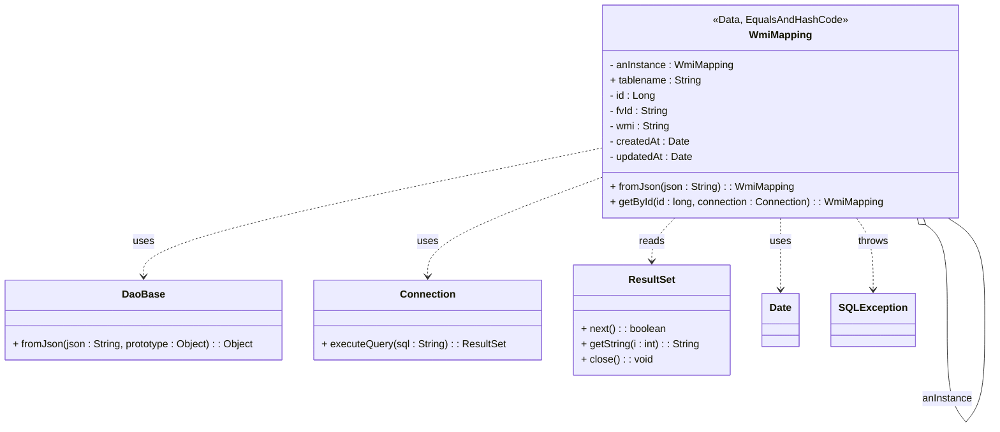
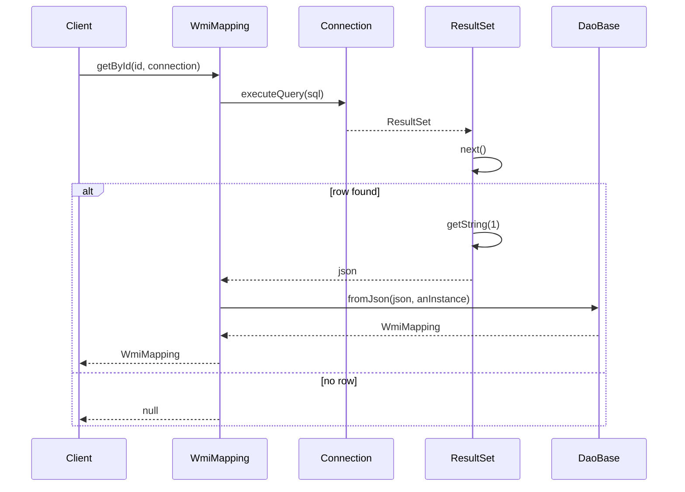

# Diagram: platform-java-lambdas/shipment/src/main/java/com/freightverify/shipment/datastore/postgresql/dao/WmiMapping.java

> Auto-generated by Obscura crawlers

## Diagram 1

### SVG

<svg id="container" width="1543.60498046875" xmlns="http://www.w3.org/2000/svg" class="classDiagram" height="674.1499633789062" viewBox="0 0 1543.60498046875 674.1499633789062" role="graphics-document document" aria-roledescription="class"><g><defs><marker id="container_class-aggregationStart" class="marker aggregation class" refX="18" refY="7" markerWidth="190" markerHeight="240" orient="auto"><path d="M 18,7 L9,13 L1,7 L9,1 Z"></path></marker></defs><defs><marker id="container_class-aggregationEnd" class="marker aggregation class" refX="1" refY="7" markerWidth="20" markerHeight="28" orient="auto"><path d="M 18,7 L9,13 L1,7 L9,1 Z"></path></marker></defs><defs><marker id="container_class-extensionStart" class="marker extension class" refX="18" refY="7" markerWidth="190" markerHeight="240" orient="auto"><path d="M 1,7 L18,13 V 1 Z"></path></marker></defs><defs><marker id="container_class-extensionEnd" class="marker extension class" refX="1" refY="7" markerWidth="20" markerHeight="28" orient="auto"><path d="M 1,1 V 13 L18,7 Z"></path></marker></defs><defs><marker id="container_class-compositionStart" class="marker composition class" refX="18" refY="7" markerWidth="190" markerHeight="240" orient="auto"><path d="M 18,7 L9,13 L1,7 L9,1 Z"></path></marker></defs><defs><marker id="container_class-compositionEnd" class="marker composition class" refX="1" refY="7" markerWidth="20" markerHeight="28" orient="auto"><path d="M 18,7 L9,13 L1,7 L9,1 Z"></path></marker></defs><defs><marker id="container_class-dependencyStart" class="marker dependency class" refX="6" refY="7" markerWidth="190" markerHeight="240" orient="auto"><path d="M 5,7 L9,13 L1,7 L9,1 Z"></path></marker></defs><defs><marker id="container_class-dependencyEnd" class="marker dependency class" refX="13" refY="7" markerWidth="20" markerHeight="28" orient="auto"><path d="M 18,7 L9,13 L14,7 L9,1 Z"></path></marker></defs><defs><marker id="container_class-lollipopStart" class="marker lollipop class" refX="13" refY="7" markerWidth="190" markerHeight="240" orient="auto"><circle stroke="black" fill="transparent" cx="7" cy="7" r="6"></circle></marker></defs><defs><marker id="container_class-lollipopEnd" class="marker lollipop class" refX="1" refY="7" markerWidth="190" markerHeight="240" orient="auto"><circle stroke="black" fill="transparent" cx="7" cy="7" r="6"></circle></marker></defs><g class="root"><g class="clusters"></g><g class="edgePaths"><path d="M942.961,233.614L823.498,258.179C704.035,282.743,465.109,331.871,345.646,365.602C226.184,399.333,226.184,417.667,226.184,426.833L226.184,436" id="id_WmiMapping_DaoBase_1" class="edge-thickness-normal edge-pattern-dashed relation" style=";;;" data-edge="true" data-et="edge" data-id="id_WmiMapping_DaoBase_1" data-points="W3sieCI6OTQyLjk2MDkzNzUsInkiOjIzMy42MTQ0NTc4MzEzMjUzfSx7IngiOjIyNi4xODM1OTM3NSwieSI6MzgxfSx7IngiOjIyNi4xODM1OTM3NSwieSI6NDQyfV0=" marker-end="url(#container_class-dependencyEnd)"></path><path d="M942.961,279.993L897.602,296.827C852.243,313.662,761.526,347.331,716.167,373.332C670.809,399.333,670.809,417.667,670.809,426.833L670.809,436" id="id_WmiMapping_Connection_2" class="edge-thickness-normal edge-pattern-dashed relation" style=";;;" data-edge="true" data-et="edge" data-id="id_WmiMapping_Connection_2" data-points="W3sieCI6OTQyLjk2MDkzNzUsInkiOjI3OS45OTI1NDYwMjE1OTgyfSx7IngiOjY3MC44MDg1OTM3NSwieSI6MzgxfSx7IngiOjY3MC44MDg1OTM3NSwieSI6NDQyfV0=" marker-end="url(#container_class-dependencyEnd)"></path><path d="M1057.295,344L1051.206,350.167C1045.118,356.333,1032.942,368.667,1026.854,380C1020.766,391.333,1020.766,401.667,1020.766,406.833L1020.766,412" id="id_WmiMapping_ResultSet_3" class="edge-thickness-normal edge-pattern-dashed relation" style=";;;" data-edge="true" data-et="edge" data-id="id_WmiMapping_ResultSet_3" data-points="W3sieCI6MTA1Ny4yOTQ2NjQ2MzQxNDYzLCJ5IjozNDR9LHsieCI6MTAyMC43NjU2MjUsInkiOjM4MX0seyJ4IjoxMDIwLjc2NTYyNSwieSI6NDE4fV0=" marker-end="url(#container_class-dependencyEnd)"></path><path d="M1443.662,354.867L1449.031,359.222C1454.4,363.578,1465.139,372.289,1470.509,397.303C1475.878,422.317,1475.878,463.633,1475.878,484.292L1475.878,504.95" id="WmiMapping-cyclic-special-1" class="edge-thickness-normal edge-pattern-solid relation" style=";;;" data-edge="true" data-et="edge" data-id="WmiMapping-cyclic-special-1" data-points="W3sieCI6MTQzMC4yNjQ5MDg1MzcxOTU5LCJ5IjozNDR9LHsieCI6MTQ3NS44NzgxMjUwMDA3NDUsInkiOjM4MX0seyJ4IjoxNDc1Ljg3ODEyNTAwMDc0NSwieSI6NTA0Ljk0OTk5OTk5OTI1NDk0fV0=" marker-start="url(#container_class-aggregationStart)"></path><path d="M1475.878,505.05L1475.878,525.708C1475.878,546.367,1475.878,587.683,1480.849,614.508C1485.819,641.333,1495.76,653.667,1500.731,659.833L1505.701,666" id="WmiMapping-cyclic-special-mid" class="edge-thickness-normal edge-pattern-solid relation" style=";;;" data-edge="true" data-et="edge" data-id="WmiMapping-cyclic-special-mid" data-points="W3sieCI6MTQ3NS44NzgxMjUwMDA3NDUsInkiOjUwNS4wNTAwMDAwMDA3NDUwNn0seyJ4IjoxNDc1Ljg3ODEyNTAwMDc0NSwieSI6NjI5fSx7IngiOjE1MDUuNzAxMTA0OTI1OTIxMywieSI6NjY2fV0="></path><path d="M1505.782,666L1510.752,659.833C1515.723,653.667,1525.664,641.333,1530.634,614.5C1535.605,587.667,1535.605,546.333,1535.605,505C1535.605,463.667,1535.605,422.333,1526.206,395.5C1516.807,368.667,1498.009,356.333,1488.61,350.167L1479.212,344" id="WmiMapping-cyclic-special-2" class="edge-thickness-normal edge-pattern-solid relation" style=";;;" data-edge="true" data-et="edge" data-id="WmiMapping-cyclic-special-2" data-points="W3sieCI6MTUwNS43ODE3MDc1NzU1Njg4LCJ5Ijo2NjZ9LHsieCI6MTUzNS42MDQ2ODc1MDA3NDUsInkiOjYyOX0seyJ4IjoxNTM1LjYwNDY4NzUwMDc0NSwieSI6NTA1fSx7IngiOjE1MzUuNjA0Njg3NTAwNzQ1LCJ5IjozODF9LHsieCI6MTQ3OS4yMTE1NTQ4Nzg2NTk0LCJ5IjozNDR9XQ=="></path><path d="M1223.156,344L1223.156,350.167C1223.156,356.333,1223.156,368.667,1223.156,387.5C1223.156,406.333,1223.156,431.667,1223.156,444.333L1223.156,457" id="id_WmiMapping_Date_5" class="edge-thickness-normal edge-pattern-dashed relation" style=";;;" data-edge="true" data-et="edge" data-id="id_WmiMapping_Date_5" data-points="W3sieCI6MTIyMy4xNTYyNSwieSI6MzQ0fSx7IngiOjEyMjMuMTU2MjUsInkiOjM4MX0seyJ4IjoxMjIzLjE1NjI1LCJ5Ijo0NjN9XQ==" marker-end="url(#container_class-dependencyEnd)"></path><path d="M1338.522,344L1342.756,350.167C1346.991,356.333,1355.46,368.667,1359.695,387.5C1363.93,406.333,1363.93,431.667,1363.93,444.333L1363.93,457" id="id_WmiMapping_SQLException_6" class="edge-thickness-normal edge-pattern-dashed relation" style=";;;" data-edge="true" data-et="edge" data-id="id_WmiMapping_SQLException_6" data-points="W3sieCI6MTMzOC41MjE3OTg3ODA0ODc5LCJ5IjozNDR9LHsieCI6MTM2My45Mjk2ODc1LCJ5IjozODF9LHsieCI6MTM2My45Mjk2ODc1LCJ5Ijo0NjN9XQ==" marker-end="url(#container_class-dependencyEnd)"></path></g><g class="edgeLabels"><g class="edgeLabel" transform="translate(226.18359375, 381)"><g class="label" data-id="id_WmiMapping_DaoBase_1" transform="translate(-16.4921875, -12)"><foreignObject width="32.984375" height="24">

uses

</foreignObject></g></g><g class="edgeLabel" transform="translate(670.80859375, 381)"><g class="label" data-id="id_WmiMapping_Connection_2" transform="translate(-16.4921875, -12)"><foreignObject width="32.984375" height="24">

uses

</foreignObject></g></g><g class="edgeLabel" transform="translate(1020.765625, 381)"><g class="label" data-id="id_WmiMapping_ResultSet_3" transform="translate(-20.0078125, -12)"><foreignObject width="40.015625" height="24">

reads

</foreignObject></g></g><g class="edgeLabel"><g class="label" data-id="WmiMapping-cyclic-special-1" transform="translate(0, 0)"><foreignObject width="0" height="0">

</foreignObject></g></g><g class="edgeLabel" transform="translate(1475.878125000745, 629)"><g class="label" data-id="WmiMapping-cyclic-special-mid" transform="translate(-39.7265625, -12)"><foreignObject width="79.453125" height="24">

anInstance

</foreignObject></g></g><g class="edgeLabel"><g class="label" data-id="WmiMapping-cyclic-special-2" transform="translate(0, 0)"><foreignObject width="0" height="0">

</foreignObject></g></g><g class="edgeLabel" transform="translate(1223.15625, 381)"><g class="label" data-id="id_WmiMapping_Date_5" transform="translate(-16.4921875, -12)"><foreignObject width="32.984375" height="24">

uses

</foreignObject></g></g><g class="edgeLabel" transform="translate(1363.9296875, 381)"><g class="label" data-id="id_WmiMapping_SQLException_6" transform="translate(-24.5703125, -12)"><foreignObject width="49.140625" height="24">

throws

</foreignObject></g></g></g><g class="nodes"><g class="node default" id="classId-WmiMapping-0" transform="translate(1223.15625, 176)"><g class="basic label-container"><path d="M-280.1953125 -168 L280.1953125 -168 L280.1953125 168 L-280.1953125 168" stroke="none" stroke-width="0" fill="#ECECFF" style=""></path><path d="M-280.1953125 -168 C-78.62226035859354 -168, 122.95079178281293 -168, 280.1953125 -168 M-280.1953125 -168 C-69.65839791281999 -168, 140.87851667436001 -168, 280.1953125 -168 M280.1953125 -168 C280.1953125 -98.3555612187948, 280.1953125 -28.71112243758961, 280.1953125 168 M280.1953125 -168 C280.1953125 -96.40648528981824, 280.1953125 -24.81297057963647, 280.1953125 168 M280.1953125 168 C67.91071711346802 168, -144.37387827306395 168, -280.1953125 168 M280.1953125 168 C114.85434329052651 168, -50.48662591894697 168, -280.1953125 168 M-280.1953125 168 C-280.1953125 76.64768295732186, -280.1953125 -14.704634085356275, -280.1953125 -168 M-280.1953125 168 C-280.1953125 41.30767436619085, -280.1953125 -85.3846512676183, -280.1953125 -168" stroke="#9370DB" stroke-width="1.3" fill="none" stroke-dasharray="0 0" style=""></path></g><g class="annotation-group text" transform="translate(-103.859375, -144)"><g class="label" style="" transform="translate(0,-12)"><foreignObject width="207.71875" height="24">

«Data, EqualsAndHashCode»

</foreignObject></g></g><g class="label-group text" transform="translate(-47.2578125, -120)"><g class="label" style="font-weight: bolder" transform="translate(0,-12)"><foreignObject width="94.515625" height="24">

WmiMapping

</foreignObject></g></g><g class="members-group text" transform="translate(-268.1953125, -72)"><g class="label" style="" transform="translate(0,-12)"><foreignObject width="196.1875" height="24">

- anInstance : WmiMapping

</foreignObject></g><g class="label" style="" transform="translate(0,12)"><foreignObject width="145.140625" height="24">

+ tablename : String

</foreignObject></g><g class="label" style="" transform="translate(0,36)"><foreignObject width="71.703125" height="24">

- id : Long

</foreignObject></g><g class="label" style="" transform="translate(0,60)"><foreignObject width="93.421875" height="24">

- fvId : String

</foreignObject></g><g class="label" style="" transform="translate(0,84)"><foreignObject width="95.59375" height="24">

- wmi : String

</foreignObject></g><g class="label" style="" transform="translate(0,108)"><foreignObject width="125.5" height="24">

- createdAt : Date

</foreignObject></g><g class="label" style="" transform="translate(0,132)"><foreignObject width="131.96875" height="24">

- updatedAt : Date

</foreignObject></g></g><g class="methods-group text" transform="translate(-268.1953125, 120)"><g class="label" style="" transform="translate(0,-12)"><foreignObject width="288.359375" height="24">

+ fromJson(json : String) : : WmiMapping

</foreignObject></g><g class="label" style="" transform="translate(0,12)"><foreignObject width="432.53125" height="24">

+ getById(id : long, connection : Connection) : : WmiMapping

</foreignObject></g></g><g class="divider" style=""><path d="M-280.1953125 -96 C-141.5125141366008 -96, -2.829715773201599 -96, 280.1953125 -96 M-280.1953125 -96 C-151.45116537613583 -96, -22.707018252271666 -96, 280.1953125 -96" stroke="#9370DB" stroke-width="1.3" fill="none" stroke-dasharray="0 0" style=""></path></g><g class="divider" style=""><path d="M-280.1953125 96 C-63.48727368803546 96, 153.22076512392908 96, 280.1953125 96 M-280.1953125 96 C-155.4529863155201 96, -30.710660131040186 96, 280.1953125 96" stroke="#9370DB" stroke-width="1.3" fill="none" stroke-dasharray="0 0" style=""></path></g></g><g class="node default" id="classId-DaoBase-1" transform="translate(226.18359375, 505)"><g class="basic label-container"><path d="M-218.18359375 -63 L218.18359375 -63 L218.18359375 63 L-218.18359375 63" stroke="none" stroke-width="0" fill="#ECECFF" style=""></path><path d="M-218.18359375 -63 C-49.41732046608902 -63, 119.34895281782195 -63, 218.18359375 -63 M-218.18359375 -63 C-54.88110534499046 -63, 108.42138306001908 -63, 218.18359375 -63 M218.18359375 -63 C218.18359375 -14.544291529215258, 218.18359375 33.911416941569485, 218.18359375 63 M218.18359375 -63 C218.18359375 -26.075442208913906, 218.18359375 10.849115582172189, 218.18359375 63 M218.18359375 63 C80.91234231352257 63, -56.358909122954856 63, -218.18359375 63 M218.18359375 63 C87.30638795148249 63, -43.570817847035016 63, -218.18359375 63 M-218.18359375 63 C-218.18359375 33.60811058771626, -218.18359375 4.216221175432523, -218.18359375 -63 M-218.18359375 63 C-218.18359375 15.973584991779546, -218.18359375 -31.052830016440907, -218.18359375 -63" stroke="#9370DB" stroke-width="1.3" fill="none" stroke-dasharray="0 0" style=""></path></g><g class="annotation-group text" transform="translate(0, -39)"></g><g class="label-group text" transform="translate(-31.7109375, -39)"><g class="label" style="font-weight: bolder" transform="translate(0,-12)"><foreignObject width="63.421875" height="24">

DaoBase

</foreignObject></g></g><g class="members-group text" transform="translate(-206.18359375, 9)"></g><g class="methods-group text" transform="translate(-206.18359375, 39)"><g class="label" style="" transform="translate(0,-12)"><foreignObject width="380.65625" height="24">

+ fromJson(json : String, prototype : Object) : : Object

</foreignObject></g></g><g class="divider" style=""><path d="M-218.18359375 -15 C-48.634816009064764 -15, 120.91396173187047 -15, 218.18359375 -15 M-218.18359375 -15 C-82.75797299065877 -15, 52.66764776868246 -15, 218.18359375 -15" stroke="#9370DB" stroke-width="1.3" fill="none" stroke-dasharray="0 0" style=""></path></g><g class="divider" style=""><path d="M-218.18359375 9 C-76.60476690429314 9, 64.97405994141371 9, 218.18359375 9 M-218.18359375 9 C-94.32753566299174 9, 29.52852242401653 9, 218.18359375 9" stroke="#9370DB" stroke-width="1.3" fill="none" stroke-dasharray="0 0" style=""></path></g></g><g class="node default" id="classId-Connection-2" transform="translate(670.80859375, 505)"><g class="basic label-container"><path d="M-176.44140625 -63 L176.44140625 -63 L176.44140625 63 L-176.44140625 63" stroke="none" stroke-width="0" fill="#ECECFF" style=""></path><path d="M-176.44140625 -63 C-55.44931376573655 -63, 65.5427787185269 -63, 176.44140625 -63 M-176.44140625 -63 C-87.06650436873699 -63, 2.308397512526028 -63, 176.44140625 -63 M176.44140625 -63 C176.44140625 -21.67259038422346, 176.44140625 19.654819231553077, 176.44140625 63 M176.44140625 -63 C176.44140625 -21.806155195420097, 176.44140625 19.387689609159807, 176.44140625 63 M176.44140625 63 C48.79579099283538 63, -78.84982426432924 63, -176.44140625 63 M176.44140625 63 C63.10529699986276 63, -50.23081225027448 63, -176.44140625 63 M-176.44140625 63 C-176.44140625 21.866445574494186, -176.44140625 -19.267108851011628, -176.44140625 -63 M-176.44140625 63 C-176.44140625 13.668976106682777, -176.44140625 -35.662047786634446, -176.44140625 -63" stroke="#9370DB" stroke-width="1.3" fill="none" stroke-dasharray="0 0" style=""></path></g><g class="annotation-group text" transform="translate(0, -39)"></g><g class="label-group text" transform="translate(-41.2265625, -39)"><g class="label" style="font-weight: bolder" transform="translate(0,-12)"><foreignObject width="82.453125" height="24">

Connection

</foreignObject></g></g><g class="members-group text" transform="translate(-164.44140625, 9)"></g><g class="methods-group text" transform="translate(-164.44140625, 39)"><g class="label" style="" transform="translate(0,-12)"><foreignObject width="287.65625" height="24">

+ executeQuery(sql : String) : : ResultSet

</foreignObject></g></g><g class="divider" style=""><path d="M-176.44140625 -15 C-66.75135271936018 -15, 42.93870081127963 -15, 176.44140625 -15 M-176.44140625 -15 C-35.67557573452055 -15, 105.0902547809589 -15, 176.44140625 -15" stroke="#9370DB" stroke-width="1.3" fill="none" stroke-dasharray="0 0" style=""></path></g><g class="divider" style=""><path d="M-176.44140625 9 C-38.16324270951259 9, 100.11492083097482 9, 176.44140625 9 M-176.44140625 9 C-93.3655558024422 9, -10.289705354884404 9, 176.44140625 9" stroke="#9370DB" stroke-width="1.3" fill="none" stroke-dasharray="0 0" style=""></path></g></g><g class="node default" id="classId-ResultSet-3" transform="translate(1020.765625, 505)"><g class="basic label-container"><path d="M-123.515625 -87 L123.515625 -87 L123.515625 87 L-123.515625 87" stroke="none" stroke-width="0" fill="#ECECFF" style=""></path><path d="M-123.515625 -87 C-44.15591627850716 -87, 35.20379244298567 -87, 123.515625 -87 M-123.515625 -87 C-64.09838691106889 -87, -4.6811488221377715 -87, 123.515625 -87 M123.515625 -87 C123.515625 -29.582322194784105, 123.515625 27.83535561043179, 123.515625 87 M123.515625 -87 C123.515625 -43.33671588059116, 123.515625 0.3265682388176856, 123.515625 87 M123.515625 87 C54.65639439457587 87, -14.202836210848261 87, -123.515625 87 M123.515625 87 C42.98350599404431 87, -37.548613011911385 87, -123.515625 87 M-123.515625 87 C-123.515625 18.16395330268618, -123.515625 -50.67209339462764, -123.515625 -87 M-123.515625 87 C-123.515625 22.81563156369988, -123.515625 -41.36873687260024, -123.515625 -87" stroke="#9370DB" stroke-width="1.3" fill="none" stroke-dasharray="0 0" style=""></path></g><g class="annotation-group text" transform="translate(0, -63)"></g><g class="label-group text" transform="translate(-35.21875, -63)"><g class="label" style="font-weight: bolder" transform="translate(0,-12)"><foreignObject width="70.4375" height="24">

ResultSet

</foreignObject></g></g><g class="members-group text" transform="translate(-111.515625, -15)"></g><g class="methods-group text" transform="translate(-111.515625, 15)"><g class="label" style="" transform="translate(0,-12)"><foreignObject width="133.921875" height="24">

+ next() : : boolean

</foreignObject></g><g class="label" style="" transform="translate(0,12)"><foreignObject width="187.8125" height="24">

+ getString(i : int) : : String

</foreignObject></g><g class="label" style="" transform="translate(0,36)"><foreignObject width="112.03125" height="24">

+ close() : : void

</foreignObject></g></g><g class="divider" style=""><path d="M-123.515625 -39 C-45.64249221795629 -39, 32.23064056408742 -39, 123.515625 -39 M-123.515625 -39 C-53.21542489208633 -39, 17.084775215827335 -39, 123.515625 -39" stroke="#9370DB" stroke-width="1.3" fill="none" stroke-dasharray="0 0" style=""></path></g><g class="divider" style=""><path d="M-123.515625 -15 C-48.96315947163926 -15, 25.589306056721483 -15, 123.515625 -15 M-123.515625 -15 C-72.77151644030107 -15, -22.027407880602155 -15, 123.515625 -15" stroke="#9370DB" stroke-width="1.3" fill="none" stroke-dasharray="0 0" style=""></path></g></g><g class="node default" id="classId-Date-4" transform="translate(1223.15625, 505)"><g class="basic label-container"><path d="M-28.875 -42 L28.875 -42 L28.875 42 L-28.875 42" stroke="none" stroke-width="0" fill="#ECECFF" style=""></path><path d="M-28.875 -42 C-8.085013541196432 -42, 12.704972917607137 -42, 28.875 -42 M-28.875 -42 C-15.188091101127462 -42, -1.501182202254924 -42, 28.875 -42 M28.875 -42 C28.875 -18.119991603055933, 28.875 5.760016793888134, 28.875 42 M28.875 -42 C28.875 -18.43603840477543, 28.875 5.127923190449138, 28.875 42 M28.875 42 C17.2200870651047 42, 5.5651741302093996 42, -28.875 42 M28.875 42 C8.196932577982096 42, -12.481134844035807 42, -28.875 42 M-28.875 42 C-28.875 24.957994422198325, -28.875 7.915988844396651, -28.875 -42 M-28.875 42 C-28.875 9.793070622700952, -28.875 -22.413858754598095, -28.875 -42" stroke="#9370DB" stroke-width="1.3" fill="none" stroke-dasharray="0 0" style=""></path></g><g class="annotation-group text" transform="translate(0, -18)"></g><g class="label-group text" transform="translate(-16.875, -18)"><g class="label" style="font-weight: bolder" transform="translate(0,-12)"><foreignObject width="33.75" height="24">

Date

</foreignObject></g></g><g class="members-group text" transform="translate(-16.875, 30)"></g><g class="methods-group text" transform="translate(-16.875, 60)"></g><g class="divider" style=""><path d="M-28.875 6 C-13.768194805561077 6, 1.3386103888778464 6, 28.875 6 M-28.875 6 C-6.364577395701943 6, 16.145845208596114 6, 28.875 6" stroke="#9370DB" stroke-width="1.3" fill="none" stroke-dasharray="0 0" style=""></path></g><g class="divider" style=""><path d="M-28.875 24 C-6.711168464502723 24, 15.452663070994554 24, 28.875 24 M-28.875 24 C-13.191634479174052 24, 2.491731041651896 24, 28.875 24" stroke="#9370DB" stroke-width="1.3" fill="none" stroke-dasharray="0 0" style=""></path></g></g><g class="node default" id="classId-SQLException-5" transform="translate(1363.9296875, 505)"><g class="basic label-container"><path d="M-61.8984375 -42 L61.8984375 -42 L61.8984375 42 L-61.8984375 42" stroke="none" stroke-width="0" fill="#ECECFF" style=""></path><path d="M-61.8984375 -42 C-34.00497146113083 -42, -6.111505422261658 -42, 61.8984375 -42 M-61.8984375 -42 C-32.28260465392485 -42, -2.666771807849692 -42, 61.8984375 -42 M61.8984375 -42 C61.8984375 -11.782908614309385, 61.8984375 18.43418277138123, 61.8984375 42 M61.8984375 -42 C61.8984375 -11.079798039378968, 61.8984375 19.840403921242064, 61.8984375 42 M61.8984375 42 C17.081002245369845 42, -27.73643300926031 42, -61.8984375 42 M61.8984375 42 C19.145048695990674 42, -23.608340108018652 42, -61.8984375 42 M-61.8984375 42 C-61.8984375 21.561988190808286, -61.8984375 1.123976381616572, -61.8984375 -42 M-61.8984375 42 C-61.8984375 15.1230039102193, -61.8984375 -11.7539921795614, -61.8984375 -42" stroke="#9370DB" stroke-width="1.3" fill="none" stroke-dasharray="0 0" style=""></path></g><g class="annotation-group text" transform="translate(0, -18)"></g><g class="label-group text" transform="translate(-49.8984375, -18)"><g class="label" style="font-weight: bolder" transform="translate(0,-12)"><foreignObject width="99.796875" height="24">

SQLException

</foreignObject></g></g><g class="members-group text" transform="translate(-49.8984375, 30)"></g><g class="methods-group text" transform="translate(-49.8984375, 60)"></g><g class="divider" style=""><path d="M-61.8984375 6 C-19.14085532034956 6, 23.616726859300883 6, 61.8984375 6 M-61.8984375 6 C-18.56993164419079 6, 24.758574211618424 6, 61.8984375 6" stroke="#9370DB" stroke-width="1.3" fill="none" stroke-dasharray="0 0" style=""></path></g><g class="divider" style=""><path d="M-61.8984375 24 C-15.590089544815243 24, 30.718258410369515 24, 61.8984375 24 M-61.8984375 24 C-27.979944958406527 24, 5.938547583186946 24, 61.8984375 24" stroke="#9370DB" stroke-width="1.3" fill="none" stroke-dasharray="0 0" style=""></path></g></g><g class="label edgeLabel" id="WmiMapping---WmiMapping---1" transform="translate(1475.878125000745, 505)"><rect width="0.1" height="0.1"></rect><g class="label" style="" transform="translate(0, 0)"><rect></rect><foreignObject width="0" height="0">

</foreignObject></g></g><g class="label edgeLabel" id="WmiMapping---WmiMapping---2" transform="translate(1505.741406250745, 666.0500000007451)"><rect width="0.1" height="0.1"></rect><g class="label" style="" transform="translate(0, 0)"><rect></rect><foreignObject width="0" height="0">

</foreignObject></g></g></g></g></g></svg>

## Diagram 2

### SVG

<svg id="container" width="1089" xmlns="http://www.w3.org/2000/svg" height="811" viewBox="-50 -10 1089 811" role="graphics-document document" aria-roledescription="sequence"><g><rect x="839" y="725" fill="#eaeaea" stroke="#666" width="150" height="65" name="DaoBase" rx="3" ry="3" class="actor actor-bottom"></rect><text x="914" y="757.5" dominant-baseline="central" alignment-baseline="central" class="actor actor-box" style="text-anchor: middle; font-size: 16px; font-weight: 400;"><tspan x="914" dy="0">DaoBase</tspan></text></g><g><rect x="639" y="725" fill="#eaeaea" stroke="#666" width="150" height="65" name="ResultSet" rx="3" ry="3" class="actor actor-bottom"></rect><text x="714" y="757.5" dominant-baseline="central" alignment-baseline="central" class="actor actor-box" style="text-anchor: middle; font-size: 16px; font-weight: 400;"><tspan x="714" dy="0">ResultSet</tspan></text></g><g><rect x="439" y="725" fill="#eaeaea" stroke="#666" width="150" height="65" name="Connection" rx="3" ry="3" class="actor actor-bottom"></rect><text x="514" y="757.5" dominant-baseline="central" alignment-baseline="central" class="actor actor-box" style="text-anchor: middle; font-size: 16px; font-weight: 400;"><tspan x="514" dy="0">Connection</tspan></text></g><g><rect x="238" y="725" fill="#eaeaea" stroke="#666" width="150" height="65" name="WmiMapping" rx="3" ry="3" class="actor actor-bottom"></rect><text x="313" y="757.5" dominant-baseline="central" alignment-baseline="central" class="actor actor-box" style="text-anchor: middle; font-size: 16px; font-weight: 400;"><tspan x="313" dy="0">WmiMapping</tspan></text></g><g><rect x="0" y="725" fill="#eaeaea" stroke="#666" width="150" height="65" name="Client" rx="3" ry="3" class="actor actor-bottom"></rect><text x="75" y="757.5" dominant-baseline="central" alignment-baseline="central" class="actor actor-box" style="text-anchor: middle; font-size: 16px; font-weight: 400;"><tspan x="75" dy="0">Client</tspan></text></g><g><line id="actor4" x1="914" y1="65" x2="914" y2="725" class="actor-line 200" stroke-width="0.5px" stroke="#999" name="DaoBase"></line><g id="root-4"><rect x="839" y="0" fill="#eaeaea" stroke="#666" width="150" height="65" name="DaoBase" rx="3" ry="3" class="actor actor-top"></rect><text x="914" y="32.5" dominant-baseline="central" alignment-baseline="central" class="actor actor-box" style="text-anchor: middle; font-size: 16px; font-weight: 400;"><tspan x="914" dy="0">DaoBase</tspan></text></g></g><g><line id="actor3" x1="714" y1="65" x2="714" y2="725" class="actor-line 200" stroke-width="0.5px" stroke="#999" name="ResultSet"></line><g id="root-3"><rect x="639" y="0" fill="#eaeaea" stroke="#666" width="150" height="65" name="ResultSet" rx="3" ry="3" class="actor actor-top"></rect><text x="714" y="32.5" dominant-baseline="central" alignment-baseline="central" class="actor actor-box" style="text-anchor: middle; font-size: 16px; font-weight: 400;"><tspan x="714" dy="0">ResultSet</tspan></text></g></g><g><line id="actor2" x1="514" y1="65" x2="514" y2="725" class="actor-line 200" stroke-width="0.5px" stroke="#999" name="Connection"></line><g id="root-2"><rect x="439" y="0" fill="#eaeaea" stroke="#666" width="150" height="65" name="Connection" rx="3" ry="3" class="actor actor-top"></rect><text x="514" y="32.5" dominant-baseline="central" alignment-baseline="central" class="actor actor-box" style="text-anchor: middle; font-size: 16px; font-weight: 400;"><tspan x="514" dy="0">Connection</tspan></text></g></g><g><line id="actor1" x1="313" y1="65" x2="313" y2="725" class="actor-line 200" stroke-width="0.5px" stroke="#999" name="WmiMapping"></line><g id="root-1"><rect x="238" y="0" fill="#eaeaea" stroke="#666" width="150" height="65" name="WmiMapping" rx="3" ry="3" class="actor actor-top"></rect><text x="313" y="32.5" dominant-baseline="central" alignment-baseline="central" class="actor actor-box" style="text-anchor: middle; font-size: 16px; font-weight: 400;"><tspan x="313" dy="0">WmiMapping</tspan></text></g></g><g><line id="actor0" x1="75" y1="65" x2="75" y2="725" class="actor-line 200" stroke-width="0.5px" stroke="#999" name="Client"></line><g id="root-0"><rect x="0" y="0" fill="#eaeaea" stroke="#666" width="150" height="65" name="Client" rx="3" ry="3" class="actor actor-top"></rect><text x="75" y="32.5" dominant-baseline="central" alignment-baseline="central" class="actor actor-box" style="text-anchor: middle; font-size: 16px; font-weight: 400;"><tspan x="75" dy="0">Client</tspan></text></g></g><g></g><defs><symbol id="computer" width="24" height="24"><path transform="scale(.5)" d="M2 2v13h20v-13h-20zm18 11h-16v-9h16v9zm-10.228 6l.466-1h3.524l.467 1h-4.457zm14.228 3h-24l2-6h2.104l-1.33 4h18.45l-1.297-4h2.073l2 6zm-5-10h-14v-7h14v7z"></path></symbol></defs><defs><symbol id="database" fill-rule="evenodd" clip-rule="evenodd"><path transform="scale(.5)" d="M12.258.001l.256.004.255.005.253.008.251.01.249.012.247.015.246.016.242.019.241.02.239.023.236.024.233.027.231.028.229.031.225.032.223.034.22.036.217.038.214.04.211.041.208.043.205.045.201.046.198.048.194.05.191.051.187.053.183.054.18.056.175.057.172.059.168.06.163.061.16.063.155.064.15.066.074.033.073.033.071.034.07.034.069.035.068.035.067.035.066.035.064.036.064.036.062.036.06.036.06.037.058.037.058.037.055.038.055.038.053.038.052.038.051.039.05.039.048.039.047.039.045.04.044.04.043.04.041.04.04.041.039.041.037.041.036.041.034.041.033.042.032.042.03.042.029.042.027.042.026.043.024.043.023.043.021.043.02.043.018.044.017.043.015.044.013.044.012.044.011.045.009.044.007.045.006.045.004.045.002.045.001.045v17l-.001.045-.002.045-.004.045-.006.045-.007.045-.009.044-.011.045-.012.044-.013.044-.015.044-.017.043-.018.044-.02.043-.021.043-.023.043-.024.043-.026.043-.027.042-.029.042-.03.042-.032.042-.033.042-.034.041-.036.041-.037.041-.039.041-.04.041-.041.04-.043.04-.044.04-.045.04-.047.039-.048.039-.05.039-.051.039-.052.038-.053.038-.055.038-.055.038-.058.037-.058.037-.06.037-.06.036-.062.036-.064.036-.064.036-.066.035-.067.035-.068.035-.069.035-.07.034-.071.034-.073.033-.074.033-.15.066-.155.064-.16.063-.163.061-.168.06-.172.059-.175.057-.18.056-.183.054-.187.053-.191.051-.194.05-.198.048-.201.046-.205.045-.208.043-.211.041-.214.04-.217.038-.22.036-.223.034-.225.032-.229.031-.231.028-.233.027-.236.024-.239.023-.241.02-.242.019-.246.016-.247.015-.249.012-.251.01-.253.008-.255.005-.256.004-.258.001-.258-.001-.256-.004-.255-.005-.253-.008-.251-.01-.249-.012-.247-.015-.245-.016-.243-.019-.241-.02-.238-.023-.236-.024-.234-.027-.231-.028-.228-.031-.226-.032-.223-.034-.22-.036-.217-.038-.214-.04-.211-.041-.208-.043-.204-.045-.201-.046-.198-.048-.195-.05-.19-.051-.187-.053-.184-.054-.179-.056-.176-.057-.172-.059-.167-.06-.164-.061-.159-.063-.155-.064-.151-.066-.074-.033-.072-.033-.072-.034-.07-.034-.069-.035-.068-.035-.067-.035-.066-.035-.064-.036-.063-.036-.062-.036-.061-.036-.06-.037-.058-.037-.057-.037-.056-.038-.055-.038-.053-.038-.052-.038-.051-.039-.049-.039-.049-.039-.046-.039-.046-.04-.044-.04-.043-.04-.041-.04-.04-.041-.039-.041-.037-.041-.036-.041-.034-.041-.033-.042-.032-.042-.03-.042-.029-.042-.027-.042-.026-.043-.024-.043-.023-.043-.021-.043-.02-.043-.018-.044-.017-.043-.015-.044-.013-.044-.012-.044-.011-.045-.009-.044-.007-.045-.006-.045-.004-.045-.002-.045-.001-.045v-17l.001-.045.002-.045.004-.045.006-.045.007-.045.009-.044.011-.045.012-.044.013-.044.015-.044.017-.043.018-.044.02-.043.021-.043.023-.043.024-.043.026-.043.027-.042.029-.042.03-.042.032-.042.033-.042.034-.041.036-.041.037-.041.039-.041.04-.041.041-.04.043-.04.044-.04.046-.04.046-.039.049-.039.049-.039.051-.039.052-.038.053-.038.055-.038.056-.038.057-.037.058-.037.06-.037.061-.036.062-.036.063-.036.064-.036.066-.035.067-.035.068-.035.069-.035.07-.034.072-.034.072-.033.074-.033.151-.066.155-.064.159-.063.164-.061.167-.06.172-.059.176-.057.179-.056.184-.054.187-.053.19-.051.195-.05.198-.048.201-.046.204-.045.208-.043.211-.041.214-.04.217-.038.22-.036.223-.034.226-.032.228-.031.231-.028.234-.027.236-.024.238-.023.241-.02.243-.019.245-.016.247-.015.249-.012.251-.01.253-.008.255-.005.256-.004.258-.001.258.001zm-9.258 20.499v.01l.001.021.003.021.004.022.005.021.006.022.007.022.009.023.01.022.011.023.012.023.013.023.015.023.016.024.017.023.018.024.019.024.021.024.022.025.023.024.024.025.052.049.056.05.061.051.066.051.07.051.075.051.079.052.084.052.088.052.092.052.097.052.102.051.105.052.11.052.114.051.119.051.123.051.127.05.131.05.135.05.139.048.144.049.147.047.152.047.155.047.16.045.163.045.167.043.171.043.176.041.178.041.183.039.187.039.19.037.194.035.197.035.202.033.204.031.209.03.212.029.216.027.219.025.222.024.226.021.23.02.233.018.236.016.24.015.243.012.246.01.249.008.253.005.256.004.259.001.26-.001.257-.004.254-.005.25-.008.247-.011.244-.012.241-.014.237-.016.233-.018.231-.021.226-.021.224-.024.22-.026.216-.027.212-.028.21-.031.205-.031.202-.034.198-.034.194-.036.191-.037.187-.039.183-.04.179-.04.175-.042.172-.043.168-.044.163-.045.16-.046.155-.046.152-.047.148-.048.143-.049.139-.049.136-.05.131-.05.126-.05.123-.051.118-.052.114-.051.11-.052.106-.052.101-.052.096-.052.092-.052.088-.053.083-.051.079-.052.074-.052.07-.051.065-.051.06-.051.056-.05.051-.05.023-.024.023-.025.021-.024.02-.024.019-.024.018-.024.017-.024.015-.023.014-.024.013-.023.012-.023.01-.023.01-.022.008-.022.006-.022.006-.022.004-.022.004-.021.001-.021.001-.021v-4.127l-.077.055-.08.053-.083.054-.085.053-.087.052-.09.052-.093.051-.095.05-.097.05-.1.049-.102.049-.105.048-.106.047-.109.047-.111.046-.114.045-.115.045-.118.044-.12.043-.122.042-.124.042-.126.041-.128.04-.13.04-.132.038-.134.038-.135.037-.138.037-.139.035-.142.035-.143.034-.144.033-.147.032-.148.031-.15.03-.151.03-.153.029-.154.027-.156.027-.158.026-.159.025-.161.024-.162.023-.163.022-.165.021-.166.02-.167.019-.169.018-.169.017-.171.016-.173.015-.173.014-.175.013-.175.012-.177.011-.178.01-.179.008-.179.008-.181.006-.182.005-.182.004-.184.003-.184.002h-.37l-.184-.002-.184-.003-.182-.004-.182-.005-.181-.006-.179-.008-.179-.008-.178-.01-.176-.011-.176-.012-.175-.013-.173-.014-.172-.015-.171-.016-.17-.017-.169-.018-.167-.019-.166-.02-.165-.021-.163-.022-.162-.023-.161-.024-.159-.025-.157-.026-.156-.027-.155-.027-.153-.029-.151-.03-.15-.03-.148-.031-.146-.032-.145-.033-.143-.034-.141-.035-.14-.035-.137-.037-.136-.037-.134-.038-.132-.038-.13-.04-.128-.04-.126-.041-.124-.042-.122-.042-.12-.044-.117-.043-.116-.045-.113-.045-.112-.046-.109-.047-.106-.047-.105-.048-.102-.049-.1-.049-.097-.05-.095-.05-.093-.052-.09-.051-.087-.052-.085-.053-.083-.054-.08-.054-.077-.054v4.127zm0-5.654v.011l.001.021.003.021.004.021.005.022.006.022.007.022.009.022.01.022.011.023.012.023.013.023.015.024.016.023.017.024.018.024.019.024.021.024.022.024.023.025.024.024.052.05.056.05.061.05.066.051.07.051.075.052.079.051.084.052.088.052.092.052.097.052.102.052.105.052.11.051.114.051.119.052.123.05.127.051.131.05.135.049.139.049.144.048.147.048.152.047.155.046.16.045.163.045.167.044.171.042.176.042.178.04.183.04.187.038.19.037.194.036.197.034.202.033.204.032.209.03.212.028.216.027.219.025.222.024.226.022.23.02.233.018.236.016.24.014.243.012.246.01.249.008.253.006.256.003.259.001.26-.001.257-.003.254-.006.25-.008.247-.01.244-.012.241-.015.237-.016.233-.018.231-.02.226-.022.224-.024.22-.025.216-.027.212-.029.21-.03.205-.032.202-.033.198-.035.194-.036.191-.037.187-.039.183-.039.179-.041.175-.042.172-.043.168-.044.163-.045.16-.045.155-.047.152-.047.148-.048.143-.048.139-.05.136-.049.131-.05.126-.051.123-.051.118-.051.114-.052.11-.052.106-.052.101-.052.096-.052.092-.052.088-.052.083-.052.079-.052.074-.051.07-.052.065-.051.06-.05.056-.051.051-.049.023-.025.023-.024.021-.025.02-.024.019-.024.018-.024.017-.024.015-.023.014-.023.013-.024.012-.022.01-.023.01-.023.008-.022.006-.022.006-.022.004-.021.004-.022.001-.021.001-.021v-4.139l-.077.054-.08.054-.083.054-.085.052-.087.053-.09.051-.093.051-.095.051-.097.05-.1.049-.102.049-.105.048-.106.047-.109.047-.111.046-.114.045-.115.044-.118.044-.12.044-.122.042-.124.042-.126.041-.128.04-.13.039-.132.039-.134.038-.135.037-.138.036-.139.036-.142.035-.143.033-.144.033-.147.033-.148.031-.15.03-.151.03-.153.028-.154.028-.156.027-.158.026-.159.025-.161.024-.162.023-.163.022-.165.021-.166.02-.167.019-.169.018-.169.017-.171.016-.173.015-.173.014-.175.013-.175.012-.177.011-.178.009-.179.009-.179.007-.181.007-.182.005-.182.004-.184.003-.184.002h-.37l-.184-.002-.184-.003-.182-.004-.182-.005-.181-.007-.179-.007-.179-.009-.178-.009-.176-.011-.176-.012-.175-.013-.173-.014-.172-.015-.171-.016-.17-.017-.169-.018-.167-.019-.166-.02-.165-.021-.163-.022-.162-.023-.161-.024-.159-.025-.157-.026-.156-.027-.155-.028-.153-.028-.151-.03-.15-.03-.148-.031-.146-.033-.145-.033-.143-.033-.141-.035-.14-.036-.137-.036-.136-.037-.134-.038-.132-.039-.13-.039-.128-.04-.126-.041-.124-.042-.122-.043-.12-.043-.117-.044-.116-.044-.113-.046-.112-.046-.109-.046-.106-.047-.105-.048-.102-.049-.1-.049-.097-.05-.095-.051-.093-.051-.09-.051-.087-.053-.085-.052-.083-.054-.08-.054-.077-.054v4.139zm0-5.666v.011l.001.02.003.022.004.021.005.022.006.021.007.022.009.023.01.022.011.023.012.023.013.023.015.023.016.024.017.024.018.023.019.024.021.025.022.024.023.024.024.025.052.05.056.05.061.05.066.051.07.051.075.052.079.051.084.052.088.052.092.052.097.052.102.052.105.051.11.052.114.051.119.051.123.051.127.05.131.05.135.05.139.049.144.048.147.048.152.047.155.046.16.045.163.045.167.043.171.043.176.042.178.04.183.04.187.038.19.037.194.036.197.034.202.033.204.032.209.03.212.028.216.027.219.025.222.024.226.021.23.02.233.018.236.017.24.014.243.012.246.01.249.008.253.006.256.003.259.001.26-.001.257-.003.254-.006.25-.008.247-.01.244-.013.241-.014.237-.016.233-.018.231-.02.226-.022.224-.024.22-.025.216-.027.212-.029.21-.03.205-.032.202-.033.198-.035.194-.036.191-.037.187-.039.183-.039.179-.041.175-.042.172-.043.168-.044.163-.045.16-.045.155-.047.152-.047.148-.048.143-.049.139-.049.136-.049.131-.051.126-.05.123-.051.118-.052.114-.051.11-.052.106-.052.101-.052.096-.052.092-.052.088-.052.083-.052.079-.052.074-.052.07-.051.065-.051.06-.051.056-.05.051-.049.023-.025.023-.025.021-.024.02-.024.019-.024.018-.024.017-.024.015-.023.014-.024.013-.023.012-.023.01-.022.01-.023.008-.022.006-.022.006-.022.004-.022.004-.021.001-.021.001-.021v-4.153l-.077.054-.08.054-.083.053-.085.053-.087.053-.09.051-.093.051-.095.051-.097.05-.1.049-.102.048-.105.048-.106.048-.109.046-.111.046-.114.046-.115.044-.118.044-.12.043-.122.043-.124.042-.126.041-.128.04-.13.039-.132.039-.134.038-.135.037-.138.036-.139.036-.142.034-.143.034-.144.033-.147.032-.148.032-.15.03-.151.03-.153.028-.154.028-.156.027-.158.026-.159.024-.161.024-.162.023-.163.023-.165.021-.166.02-.167.019-.169.018-.169.017-.171.016-.173.015-.173.014-.175.013-.175.012-.177.01-.178.01-.179.009-.179.007-.181.006-.182.006-.182.004-.184.003-.184.001-.185.001-.185-.001-.184-.001-.184-.003-.182-.004-.182-.006-.181-.006-.179-.007-.179-.009-.178-.01-.176-.01-.176-.012-.175-.013-.173-.014-.172-.015-.171-.016-.17-.017-.169-.018-.167-.019-.166-.02-.165-.021-.163-.023-.162-.023-.161-.024-.159-.024-.157-.026-.156-.027-.155-.028-.153-.028-.151-.03-.15-.03-.148-.032-.146-.032-.145-.033-.143-.034-.141-.034-.14-.036-.137-.036-.136-.037-.134-.038-.132-.039-.13-.039-.128-.041-.126-.041-.124-.041-.122-.043-.12-.043-.117-.044-.116-.044-.113-.046-.112-.046-.109-.046-.106-.048-.105-.048-.102-.048-.1-.05-.097-.049-.095-.051-.093-.051-.09-.052-.087-.052-.085-.053-.083-.053-.08-.054-.077-.054v4.153zm8.74-8.179l-.257.004-.254.005-.25.008-.247.011-.244.012-.241.014-.237.016-.233.018-.231.021-.226.022-.224.023-.22.026-.216.027-.212.028-.21.031-.205.032-.202.033-.198.034-.194.036-.191.038-.187.038-.183.04-.179.041-.175.042-.172.043-.168.043-.163.045-.16.046-.155.046-.152.048-.148.048-.143.048-.139.049-.136.05-.131.05-.126.051-.123.051-.118.051-.114.052-.11.052-.106.052-.101.052-.096.052-.092.052-.088.052-.083.052-.079.052-.074.051-.07.052-.065.051-.06.05-.056.05-.051.05-.023.025-.023.024-.021.024-.02.025-.019.024-.018.024-.017.023-.015.024-.014.023-.013.023-.012.023-.01.023-.01.022-.008.022-.006.023-.006.021-.004.022-.004.021-.001.021-.001.021.001.021.001.021.004.021.004.022.006.021.006.023.008.022.01.022.01.023.012.023.013.023.014.023.015.024.017.023.018.024.019.024.02.025.021.024.023.024.023.025.051.05.056.05.06.05.065.051.07.052.074.051.079.052.083.052.088.052.092.052.096.052.101.052.106.052.11.052.114.052.118.051.123.051.126.051.131.05.136.05.139.049.143.048.148.048.152.048.155.046.16.046.163.045.168.043.172.043.175.042.179.041.183.04.187.038.191.038.194.036.198.034.202.033.205.032.21.031.212.028.216.027.22.026.224.023.226.022.231.021.233.018.237.016.241.014.244.012.247.011.25.008.254.005.257.004.26.001.26-.001.257-.004.254-.005.25-.008.247-.011.244-.012.241-.014.237-.016.233-.018.231-.021.226-.022.224-.023.22-.026.216-.027.212-.028.21-.031.205-.032.202-.033.198-.034.194-.036.191-.038.187-.038.183-.04.179-.041.175-.042.172-.043.168-.043.163-.045.16-.046.155-.046.152-.048.148-.048.143-.048.139-.049.136-.05.131-.05.126-.051.123-.051.118-.051.114-.052.11-.052.106-.052.101-.052.096-.052.092-.052.088-.052.083-.052.079-.052.074-.051.07-.052.065-.051.06-.05.056-.05.051-.05.023-.025.023-.024.021-.024.02-.025.019-.024.018-.024.017-.023.015-.024.014-.023.013-.023.012-.023.01-.023.01-.022.008-.022.006-.023.006-.021.004-.022.004-.021.001-.021.001-.021-.001-.021-.001-.021-.004-.021-.004-.022-.006-.021-.006-.023-.008-.022-.01-.022-.01-.023-.012-.023-.013-.023-.014-.023-.015-.024-.017-.023-.018-.024-.019-.024-.02-.025-.021-.024-.023-.024-.023-.025-.051-.05-.056-.05-.06-.05-.065-.051-.07-.052-.074-.051-.079-.052-.083-.052-.088-.052-.092-.052-.096-.052-.101-.052-.106-.052-.11-.052-.114-.052-.118-.051-.123-.051-.126-.051-.131-.05-.136-.05-.139-.049-.143-.048-.148-.048-.152-.048-.155-.046-.16-.046-.163-.045-.168-.043-.172-.043-.175-.042-.179-.041-.183-.04-.187-.038-.191-.038-.194-.036-.198-.034-.202-.033-.205-.032-.21-.031-.212-.028-.216-.027-.22-.026-.224-.023-.226-.022-.231-.021-.233-.018-.237-.016-.241-.014-.244-.012-.247-.011-.25-.008-.254-.005-.257-.004-.26-.001-.26.001z"></path></symbol></defs><defs><symbol id="clock" width="24" height="24"><path transform="scale(.5)" d="M12 2c5.514 0 10 4.486 10 10s-4.486 10-10 10-10-4.486-10-10 4.486-10 10-10zm0-2c-6.627 0-12 5.373-12 12s5.373 12 12 12 12-5.373 12-12-5.373-12-12-12zm5.848 12.459c.202.038.202.333.001.372-1.907.361-6.045 1.111-6.547 1.111-.719 0-1.301-.582-1.301-1.301 0-.512.77-5.447 1.125-7.445.034-.192.312-.181.343.014l.985 6.238 5.394 1.011z"></path></symbol></defs><defs><marker id="arrowhead" refX="7.9" refY="5" markerUnits="userSpaceOnUse" markerWidth="12" markerHeight="12" orient="auto-start-reverse"><path d="M -1 0 L 10 5 L 0 10 z"></path></marker></defs><defs><marker id="crosshead" markerWidth="15" markerHeight="8" orient="auto" refX="4" refY="4.5"><path fill="none" stroke="#000000" stroke-width="1pt" d="M 1,2 L 6,7 M 6,2 L 1,7" style="stroke-dasharray: 0, 0;"></path></marker></defs><defs><marker id="filled-head" refX="15.5" refY="7" markerWidth="20" markerHeight="28" orient="auto"><path d="M 18,7 L9,13 L14,7 L9,1 Z"></path></marker></defs><defs><marker id="sequencenumber" refX="15" refY="15" markerWidth="60" markerHeight="40" orient="auto"><circle cx="15" cy="15" r="6"></circle></marker></defs><g><line x1="64" y1="297" x2="925" y2="297" class="loopLine"></line><line x1="925" y1="297" x2="925" y2="705" class="loopLine"></line><line x1="64" y1="705" x2="925" y2="705" class="loopLine"></line><line x1="64" y1="297" x2="64" y2="705" class="loopLine"></line><line x1="64" y1="617" x2="925" y2="617" class="loopLine" style="stroke-dasharray: 3, 3;"></line><polygon points="64,297 114,297 114,310 105.6,317 64,317" class="labelBox"></polygon><text x="89" y="310" text-anchor="middle" dominant-baseline="middle" alignment-baseline="middle" class="labelText" style="font-size: 16px; font-weight: 400;">alt</text><text x="519.5" y="315" text-anchor="middle" class="loopText" style="font-size: 16px; font-weight: 400;"><tspan x="519.5">[row found]</tspan></text><text x="494.5" y="635" text-anchor="middle" class="loopText" style="font-size: 16px; font-weight: 400;">[no row]</text></g><text x="193" y="80" text-anchor="middle" dominant-baseline="middle" alignment-baseline="middle" class="messageText" dy="1em" style="font-size: 16px; font-weight: 400;">getById(id, connection)</text><line x1="76" y1="113" x2="309" y2="113" class="messageLine0" stroke-width="2" stroke="none" marker-end="url(#arrowhead)" style="fill: none;"></line><text x="412" y="128" text-anchor="middle" dominant-baseline="middle" alignment-baseline="middle" class="messageText" dy="1em" style="font-size: 16px; font-weight: 400;">executeQuery(sql)</text><line x1="314" y1="161" x2="510" y2="161" class="messageLine0" stroke-width="2" stroke="none" marker-end="url(#arrowhead)" style="fill: none;"></line><text x="613" y="176" text-anchor="middle" dominant-baseline="middle" alignment-baseline="middle" class="messageText" dy="1em" style="font-size: 16px; font-weight: 400;">ResultSet</text><line x1="515" y1="209" x2="710" y2="209" class="messageLine1" stroke-width="2" stroke="none" marker-end="url(#arrowhead)" style="stroke-dasharray: 3, 3; fill: none;"></line><text x="715" y="224" text-anchor="middle" dominant-baseline="middle" alignment-baseline="middle" class="messageText" dy="1em" style="font-size: 16px; font-weight: 400;">next()</text><path d="M 715,257 C 775,247 775,287 715,277" class="messageLine0" stroke-width="2" stroke="none" marker-end="url(#arrowhead)" style="fill: none;"></path><text x="715" y="347" text-anchor="middle" dominant-baseline="middle" alignment-baseline="middle" class="messageText" dy="1em" style="font-size: 16px; font-weight: 400;">getString(1)</text><path d="M 715,380 C 775,370 775,410 715,400" class="messageLine0" stroke-width="2" stroke="none" marker-end="url(#arrowhead)" style="fill: none;"></path><text x="515" y="425" text-anchor="middle" dominant-baseline="middle" alignment-baseline="middle" class="messageText" dy="1em" style="font-size: 16px; font-weight: 400;">json</text><line x1="713" y1="458" x2="317" y2="458" class="messageLine1" stroke-width="2" stroke="none" marker-end="url(#arrowhead)" style="stroke-dasharray: 3, 3; fill: none;"></line><text x="612" y="473" text-anchor="middle" dominant-baseline="middle" alignment-baseline="middle" class="messageText" dy="1em" style="font-size: 16px; font-weight: 400;">fromJson(json, anInstance)</text><line x1="314" y1="506" x2="910" y2="506" class="messageLine0" stroke-width="2" stroke="none" marker-end="url(#arrowhead)" style="fill: none;"></line><text x="615" y="521" text-anchor="middle" dominant-baseline="middle" alignment-baseline="middle" class="messageText" dy="1em" style="font-size: 16px; font-weight: 400;">WmiMapping</text><line x1="913" y1="554" x2="317" y2="554" class="messageLine1" stroke-width="2" stroke="none" marker-end="url(#arrowhead)" style="stroke-dasharray: 3, 3; fill: none;"></line><text x="196" y="569" text-anchor="middle" dominant-baseline="middle" alignment-baseline="middle" class="messageText" dy="1em" style="font-size: 16px; font-weight: 400;">WmiMapping</text><line x1="312" y1="602" x2="79" y2="602" class="messageLine1" stroke-width="2" stroke="none" marker-end="url(#arrowhead)" style="stroke-dasharray: 3, 3; fill: none;"></line><text x="196" y="662" text-anchor="middle" dominant-baseline="middle" alignment-baseline="middle" class="messageText" dy="1em" style="font-size: 16px; font-weight: 400;">null</text><line x1="312" y1="695" x2="79" y2="695" class="messageLine1" stroke-width="2" stroke="none" marker-end="url(#arrowhead)" style="stroke-dasharray: 3, 3; fill: none;"></line></svg>
