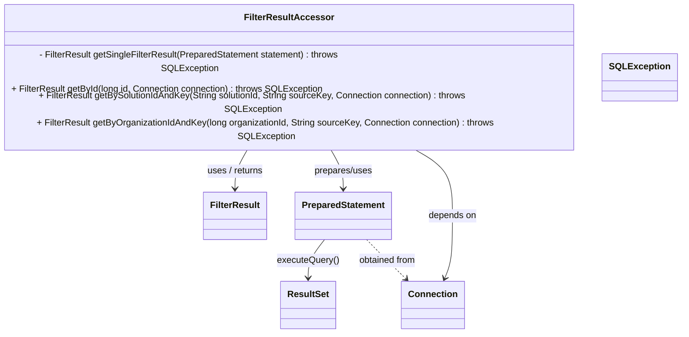
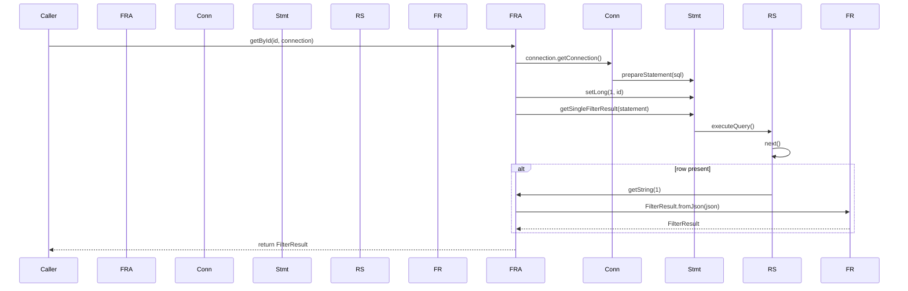

# Diagram: platform-java-lambdas/shipment/src/main/java/com/freightverify/shipment/io/postgres/FilterResultAccessor.java

> Auto-generated by Obscura crawlers

## Diagram 1

### SVG

<svg id="container" width="1205.4765625" xmlns="http://www.w3.org/2000/svg" class="classDiagram" height="530" viewBox="0 0 1205.4765625 530" role="graphics-document document" aria-roledescription="class"><g><defs><marker id="container_class-aggregationStart" class="marker aggregation class" refX="18" refY="7" markerWidth="190" markerHeight="240" orient="auto"><path d="M 18,7 L9,13 L1,7 L9,1 Z"></path></marker></defs><defs><marker id="container_class-aggregationEnd" class="marker aggregation class" refX="1" refY="7" markerWidth="20" markerHeight="28" orient="auto"><path d="M 18,7 L9,13 L1,7 L9,1 Z"></path></marker></defs><defs><marker id="container_class-extensionStart" class="marker extension class" refX="18" refY="7" markerWidth="190" markerHeight="240" orient="auto"><path d="M 1,7 L18,13 V 1 Z"></path></marker></defs><defs><marker id="container_class-extensionEnd" class="marker extension class" refX="1" refY="7" markerWidth="20" markerHeight="28" orient="auto"><path d="M 1,1 V 13 L18,7 Z"></path></marker></defs><defs><marker id="container_class-compositionStart" class="marker composition class" refX="18" refY="7" markerWidth="190" markerHeight="240" orient="auto"><path d="M 18,7 L9,13 L1,7 L9,1 Z"></path></marker></defs><defs><marker id="container_class-compositionEnd" class="marker composition class" refX="1" refY="7" markerWidth="20" markerHeight="28" orient="auto"><path d="M 18,7 L9,13 L1,7 L9,1 Z"></path></marker></defs><defs><marker id="container_class-dependencyStart" class="marker dependency class" refX="6" refY="7" markerWidth="190" markerHeight="240" orient="auto"><path d="M 5,7 L9,13 L1,7 L9,1 Z"></path></marker></defs><defs><marker id="container_class-dependencyEnd" class="marker dependency class" refX="13" refY="7" markerWidth="20" markerHeight="28" orient="auto"><path d="M 18,7 L9,13 L14,7 L9,1 Z"></path></marker></defs><defs><marker id="container_class-lollipopStart" class="marker lollipop class" refX="13" refY="7" markerWidth="190" markerHeight="240" orient="auto"><circle stroke="black" fill="transparent" cx="7" cy="7" r="6"></circle></marker></defs><defs><marker id="container_class-lollipopEnd" class="marker lollipop class" refX="1" refY="7" markerWidth="190" markerHeight="240" orient="auto"><circle stroke="black" fill="transparent" cx="7" cy="7" r="6"></circle></marker></defs><g class="root"><g class="clusters"></g><g class="edgePaths"><path d="M447.598,206L443.347,212.167C439.097,218.333,430.595,230.667,426.344,242C422.094,253.333,422.094,263.667,422.094,268.833L422.094,274" id="id_FilterResultAccessor_FilterResult_1" class="edge-thickness-normal edge-pattern-solid relation" style=";;;" data-edge="true" data-et="edge" data-id="id_FilterResultAccessor_FilterResult_1" data-points="W3sieCI6NDQ3LjU5ODIwMTk3NjEwMjksInkiOjIwNn0seyJ4Ijo0MjIuMDkzNzUsInkiOjI0M30seyJ4Ijo0MjIuMDkzNzUsInkiOjI4MH1d" marker-end="url(#container_class-dependencyEnd)"></path><path d="M584.081,206L588.332,212.167C592.583,218.333,601.084,230.667,605.335,242C609.586,253.333,609.586,263.667,609.586,268.833L609.586,274" id="id_FilterResultAccessor_PreparedStatement_2" class="edge-thickness-normal edge-pattern-solid relation" style=";;;" data-edge="true" data-et="edge" data-id="id_FilterResultAccessor_PreparedStatement_2" data-points="W3sieCI6NTg0LjA4MTQ4NTUyMzg5NzEsInkiOjIwNn0seyJ4Ijo2MDkuNTg1OTM3NSwieSI6MjQzfSx7IngiOjYwOS41ODU5Mzc1LCJ5IjoyODB9XQ==" marker-end="url(#container_class-dependencyEnd)"></path><path d="M723.755,206L736.706,212.167C749.657,218.333,775.559,230.667,788.51,250C801.461,269.333,801.461,295.667,801.461,322C801.461,348.333,801.461,374.667,799.07,393.09C796.679,411.513,791.896,422.026,789.505,427.282L787.114,432.539" id="id_FilterResultAccessor_Connection_3" class="edge-thickness-normal edge-pattern-solid relation" style=";;;" data-edge="true" data-et="edge" data-id="id_FilterResultAccessor_Connection_3" data-points="W3sieCI6NzIzLjc1NTE5ODc1OTE5MTIsInkiOjIwNn0seyJ4Ijo4MDEuNDYwOTM3NSwieSI6MjQzfSx7IngiOjgwMS40NjA5Mzc1LCJ5IjozMjJ9LHsieCI6ODAxLjQ2MDkzNzUsInkiOjQwMX0seyJ4Ijo3ODQuNjI5NDUwMTU4MjI3OSwieSI6NDM4fV0=" marker-end="url(#container_class-dependencyEnd)"></path><path d="M575.928,364L570.986,370.167C566.045,376.333,556.161,388.667,551.219,400C546.277,411.333,546.277,421.667,546.277,426.833L546.277,432" id="id_PreparedStatement_ResultSet_4" class="edge-thickness-normal edge-pattern-solid relation" style=";;;" data-edge="true" data-et="edge" data-id="id_PreparedStatement_ResultSet_4" data-points="W3sieCI6NTc1LjkyODIwNDExMzkyNCwieSI6MzY0fSx7IngiOjU0Ni4yNzczNDM3NSwieSI6NDAxfSx7IngiOjU0Ni4yNzczNDM3NSwieSI6NDM4fV0=" marker-end="url(#container_class-dependencyEnd)"></path><path d="M649.578,364L655.45,370.167C661.321,376.333,673.065,388.667,684.523,400.301C695.98,411.934,707.152,422.869,712.738,428.336L718.324,433.803" id="id_PreparedStatement_Connection_5" class="edge-thickness-normal edge-pattern-dashed relation" style=";;;" data-edge="true" data-et="edge" data-id="id_PreparedStatement_Connection_5" data-points="W3sieCI6NjQ5LjU3NzcyOTQzMDM3OTgsInkiOjM2NH0seyJ4Ijo2ODQuODA4NTkzNzUsInkiOjQwMX0seyJ4Ijo3MjIuNjExNzQ4NDE3NzIxNSwieSI6NDM4fV0=" marker-end="url(#container_class-dependencyEnd)"></path></g><g class="edgeLabels"><g class="edgeLabel" transform="translate(422.09375, 243)"><g class="label" data-id="id_FilterResultAccessor_FilterResult_1" transform="translate(-51.15625, -12)"><foreignObject width="102.3125" height="24">

uses / returns

</foreignObject></g></g><g class="edgeLabel" transform="translate(609.5859375, 243)"><g class="label" data-id="id_FilterResultAccessor_PreparedStatement_2" transform="translate(-52.34375, -12)"><foreignObject width="104.6875" height="24">

prepares/uses

</foreignObject></g></g><g class="edgeLabel" transform="translate(801.4609375, 322)"><g class="label" data-id="id_FilterResultAccessor_Connection_3" transform="translate(-42.9453125, -12)"><foreignObject width="85.890625" height="24">

depends on

</foreignObject></g></g><g class="edgeLabel" transform="translate(546.27734375, 401)"><g class="label" data-id="id_PreparedStatement_ResultSet_4" transform="translate(-54.7421875, -12)"><foreignObject width="109.484375" height="24">

executeQuery()

</foreignObject></g></g><g class="edgeLabel" transform="translate(684.80859375, 401)"><g class="label" data-id="id_PreparedStatement_Connection_5" transform="translate(-51.875, -12)"><foreignObject width="103.75" height="24">

obtained from

</foreignObject></g></g></g><g class="nodes"><g class="node default" id="classId-FilterResultAccessor-0" transform="translate(515.83984375, 107)"><g class="basic label-container"><path d="M-507.83984375 -99 L507.83984375 -99 L507.83984375 99 L-507.83984375 99" stroke="none" stroke-width="0" fill="#ECECFF" style=""></path><path d="M-507.83984375 -99 C-203.82291024359483 -99, 100.19402326281033 -99, 507.83984375 -99 M-507.83984375 -99 C-185.39956815396016 -99, 137.04070744207968 -99, 507.83984375 -99 M507.83984375 -99 C507.83984375 -43.971599709698125, 507.83984375 11.056800580603749, 507.83984375 99 M507.83984375 -99 C507.83984375 -56.369197246858896, 507.83984375 -13.738394493717792, 507.83984375 99 M507.83984375 99 C304.1077341440096 99, 100.37562453801922 99, -507.83984375 99 M507.83984375 99 C186.64122155641383 99, -134.55740063717235 99, -507.83984375 99 M-507.83984375 99 C-507.83984375 26.87697455673124, -507.83984375 -45.24605088653752, -507.83984375 -99 M-507.83984375 99 C-507.83984375 24.244967995340446, -507.83984375 -50.51006400931911, -507.83984375 -99" stroke="#9370DB" stroke-width="1.3" fill="none" stroke-dasharray="0 0" style=""></path></g><g class="annotation-group text" transform="translate(0, -75)"></g><g class="label-group text" transform="translate(-74.0390625, -75)"><g class="label" style="font-weight: bolder" transform="translate(0,-12)"><foreignObject width="148.078125" height="24">

FilterResultAccessor

</foreignObject></g></g><g class="members-group text" transform="translate(-495.83984375, -27)"></g><g class="methods-group text" transform="translate(-495.83984375, 3)"><g class="label" style="" transform="translate(0,-12)"><foreignObject width="639.234375" height="24">

- FilterResult getSingleFilterResult(PreparedStatement statement) : throws SQLException

</foreignObject></g><g class="label" style="" transform="translate(0,12)"><foreignObject width="553" height="24">

+ FilterResult getById(long id, Connection connection) : throws SQLException

</foreignObject></g><g class="label" style="" transform="translate(0,36)"><foreignObject width="867.34375" height="24">

+ FilterResult getBySolutionIdAndKey(String solutionId, String sourceKey, Connection connection) : throws SQLException

</foreignObject></g><g class="label" style="" transform="translate(0,60)"><foreignObject width="917.640625" height="24">

+ FilterResult getByOrganizationIdAndKey(long organizationId, String sourceKey, Connection connection) : throws SQLException

</foreignObject></g></g><g class="divider" style=""><path d="M-507.83984375 -51 C-179.07138058584832 -51, 149.69708257830337 -51, 507.83984375 -51 M-507.83984375 -51 C-286.3731970069445 -51, -64.90655026388902 -51, 507.83984375 -51" stroke="#9370DB" stroke-width="1.3" fill="none" stroke-dasharray="0 0" style=""></path></g><g class="divider" style=""><path d="M-507.83984375 -27 C-242.549855519123 -27, 22.740132711753972 -27, 507.83984375 -27 M-507.83984375 -27 C-183.19770784903756 -27, 141.4444280519249 -27, 507.83984375 -27" stroke="#9370DB" stroke-width="1.3" fill="none" stroke-dasharray="0 0" style=""></path></g></g><g class="node default" id="classId-FilterResult-1" transform="translate(422.09375, 322)"><g class="basic label-container"><path d="M-54.0078125 -42 L54.0078125 -42 L54.0078125 42 L-54.0078125 42" stroke="none" stroke-width="0" fill="#ECECFF" style=""></path><path d="M-54.0078125 -42 C-27.087264077986333 -42, -0.16671565597266635 -42, 54.0078125 -42 M-54.0078125 -42 C-31.94498694032327 -42, -9.882161380646536 -42, 54.0078125 -42 M54.0078125 -42 C54.0078125 -20.19265660354002, 54.0078125 1.6146867929199615, 54.0078125 42 M54.0078125 -42 C54.0078125 -10.949923546934532, 54.0078125 20.100152906130937, 54.0078125 42 M54.0078125 42 C24.274885034829023 42, -5.458042430341955 42, -54.0078125 42 M54.0078125 42 C13.862808821866224 42, -26.28219485626755 42, -54.0078125 42 M-54.0078125 42 C-54.0078125 17.391024119274363, -54.0078125 -7.217951761451275, -54.0078125 -42 M-54.0078125 42 C-54.0078125 24.922212203959962, -54.0078125 7.844424407919924, -54.0078125 -42" stroke="#9370DB" stroke-width="1.3" fill="none" stroke-dasharray="0 0" style=""></path></g><g class="annotation-group text" transform="translate(0, -18)"></g><g class="label-group text" transform="translate(-42.0078125, -18)"><g class="label" style="font-weight: bolder" transform="translate(0,-12)"><foreignObject width="84.015625" height="24">

FilterResult

</foreignObject></g></g><g class="members-group text" transform="translate(-42.0078125, 30)"></g><g class="methods-group text" transform="translate(-42.0078125, 60)"></g><g class="divider" style=""><path d="M-54.0078125 6 C-31.36314099891676 6, -8.718469497833517 6, 54.0078125 6 M-54.0078125 6 C-18.88167444990367 6, 16.24446360019266 6, 54.0078125 6" stroke="#9370DB" stroke-width="1.3" fill="none" stroke-dasharray="0 0" style=""></path></g><g class="divider" style=""><path d="M-54.0078125 24 C-16.12965674163769 24, 21.748499016724622 24, 54.0078125 24 M-54.0078125 24 C-18.101371560380038 24, 17.805069379239924 24, 54.0078125 24" stroke="#9370DB" stroke-width="1.3" fill="none" stroke-dasharray="0 0" style=""></path></g></g><g class="node default" id="classId-Connection-2" transform="translate(765.5234375, 480)"><g class="basic label-container"><path d="M-53.2265625 -42 L53.2265625 -42 L53.2265625 42 L-53.2265625 42" stroke="none" stroke-width="0" fill="#ECECFF" style=""></path><path d="M-53.2265625 -42 C-30.09095922748893 -42, -6.955355954977861 -42, 53.2265625 -42 M-53.2265625 -42 C-20.651401109256717 -42, 11.923760281486565 -42, 53.2265625 -42 M53.2265625 -42 C53.2265625 -21.119159154446415, 53.2265625 -0.23831830889282912, 53.2265625 42 M53.2265625 -42 C53.2265625 -23.56299716020267, 53.2265625 -5.12599432040534, 53.2265625 42 M53.2265625 42 C23.609811887401424 42, -6.006938725197152 42, -53.2265625 42 M53.2265625 42 C27.796831535121985 42, 2.36710057024397 42, -53.2265625 42 M-53.2265625 42 C-53.2265625 21.695667136827083, -53.2265625 1.3913342736541665, -53.2265625 -42 M-53.2265625 42 C-53.2265625 11.883761770364117, -53.2265625 -18.232476459271766, -53.2265625 -42" stroke="#9370DB" stroke-width="1.3" fill="none" stroke-dasharray="0 0" style=""></path></g><g class="annotation-group text" transform="translate(0, -18)"></g><g class="label-group text" transform="translate(-41.2265625, -18)"><g class="label" style="font-weight: bolder" transform="translate(0,-12)"><foreignObject width="82.453125" height="24">

Connection

</foreignObject></g></g><g class="members-group text" transform="translate(-41.2265625, 30)"></g><g class="methods-group text" transform="translate(-41.2265625, 60)"></g><g class="divider" style=""><path d="M-53.2265625 6 C-15.222365622237902 6, 22.781831255524196 6, 53.2265625 6 M-53.2265625 6 C-16.661504124386113 6, 19.903554251227774 6, 53.2265625 6" stroke="#9370DB" stroke-width="1.3" fill="none" stroke-dasharray="0 0" style=""></path></g><g class="divider" style=""><path d="M-53.2265625 24 C-30.599040101952472 24, -7.971517703904944 24, 53.2265625 24 M-53.2265625 24 C-23.6050544920524 24, 6.016453515895201 24, 53.2265625 24" stroke="#9370DB" stroke-width="1.3" fill="none" stroke-dasharray="0 0" style=""></path></g></g><g class="node default" id="classId-PreparedStatement-3" transform="translate(609.5859375, 322)"><g class="basic label-container"><path d="M-83.484375 -42 L83.484375 -42 L83.484375 42 L-83.484375 42" stroke="none" stroke-width="0" fill="#ECECFF" style=""></path><path d="M-83.484375 -42 C-49.43899662839242 -42, -15.393618256784833 -42, 83.484375 -42 M-83.484375 -42 C-40.35841022293716 -42, 2.767554554125681 -42, 83.484375 -42 M83.484375 -42 C83.484375 -17.71020791360738, 83.484375 6.579584172785239, 83.484375 42 M83.484375 -42 C83.484375 -13.340598873267023, 83.484375 15.318802253465954, 83.484375 42 M83.484375 42 C29.441731350337967 42, -24.600912299324065 42, -83.484375 42 M83.484375 42 C25.91959292838368 42, -31.645189143232642 42, -83.484375 42 M-83.484375 42 C-83.484375 21.171061725779595, -83.484375 0.3421234515591891, -83.484375 -42 M-83.484375 42 C-83.484375 23.324885328189946, -83.484375 4.649770656379893, -83.484375 -42" stroke="#9370DB" stroke-width="1.3" fill="none" stroke-dasharray="0 0" style=""></path></g><g class="annotation-group text" transform="translate(0, -18)"></g><g class="label-group text" transform="translate(-71.484375, -18)"><g class="label" style="font-weight: bolder" transform="translate(0,-12)"><foreignObject width="142.96875" height="24">

PreparedStatement

</foreignObject></g></g><g class="members-group text" transform="translate(-71.484375, 30)"></g><g class="methods-group text" transform="translate(-71.484375, 60)"></g><g class="divider" style=""><path d="M-83.484375 6 C-19.659452857531647 6, 44.165469284936705 6, 83.484375 6 M-83.484375 6 C-28.222654794705818 6, 27.039065410588364 6, 83.484375 6" stroke="#9370DB" stroke-width="1.3" fill="none" stroke-dasharray="0 0" style=""></path></g><g class="divider" style=""><path d="M-83.484375 24 C-39.413633863197894 24, 4.657107273604211 24, 83.484375 24 M-83.484375 24 C-48.416832018470956 24, -13.349289036941911 24, 83.484375 24" stroke="#9370DB" stroke-width="1.3" fill="none" stroke-dasharray="0 0" style=""></path></g></g><g class="node default" id="classId-ResultSet-4" transform="translate(546.27734375, 480)"><g class="basic label-container"><path d="M-47.21875 -42 L47.21875 -42 L47.21875 42 L-47.21875 42" stroke="none" stroke-width="0" fill="#ECECFF" style=""></path><path d="M-47.21875 -42 C-11.996902308790212 -42, 23.224945382419577 -42, 47.21875 -42 M-47.21875 -42 C-25.17732561537029 -42, -3.135901230740579 -42, 47.21875 -42 M47.21875 -42 C47.21875 -24.439372678167214, 47.21875 -6.878745356334427, 47.21875 42 M47.21875 -42 C47.21875 -15.648527622922412, 47.21875 10.702944754155176, 47.21875 42 M47.21875 42 C14.723283944011023 42, -17.772182111977955 42, -47.21875 42 M47.21875 42 C22.53973714108131 42, -2.1392757178373785 42, -47.21875 42 M-47.21875 42 C-47.21875 10.544457484453247, -47.21875 -20.911085031093506, -47.21875 -42 M-47.21875 42 C-47.21875 18.721545162189503, -47.21875 -4.556909675620993, -47.21875 -42" stroke="#9370DB" stroke-width="1.3" fill="none" stroke-dasharray="0 0" style=""></path></g><g class="annotation-group text" transform="translate(0, -18)"></g><g class="label-group text" transform="translate(-35.21875, -18)"><g class="label" style="font-weight: bolder" transform="translate(0,-12)"><foreignObject width="70.4375" height="24">

ResultSet

</foreignObject></g></g><g class="members-group text" transform="translate(-35.21875, 30)"></g><g class="methods-group text" transform="translate(-35.21875, 60)"></g><g class="divider" style=""><path d="M-47.21875 6 C-9.803985337118093 6, 27.610779325763815 6, 47.21875 6 M-47.21875 6 C-13.311412457098449 6, 20.595925085803103 6, 47.21875 6" stroke="#9370DB" stroke-width="1.3" fill="none" stroke-dasharray="0 0" style=""></path></g><g class="divider" style=""><path d="M-47.21875 24 C-23.52691867218162 24, 0.16491265563676194 24, 47.21875 24 M-47.21875 24 C-9.865233675427682 24, 27.488282649144637 24, 47.21875 24" stroke="#9370DB" stroke-width="1.3" fill="none" stroke-dasharray="0 0" style=""></path></g></g><g class="node default" id="classId-SQLException-5" transform="translate(1135.578125, 107)"><g class="basic label-container"><path d="M-61.8984375 -42 L61.8984375 -42 L61.8984375 42 L-61.8984375 42" stroke="none" stroke-width="0" fill="#ECECFF" style=""></path><path d="M-61.8984375 -42 C-12.947529320570915 -42, 36.00337885885817 -42, 61.8984375 -42 M-61.8984375 -42 C-21.968789247158064 -42, 17.960859005683872 -42, 61.8984375 -42 M61.8984375 -42 C61.8984375 -23.46222196224909, 61.8984375 -4.924443924498178, 61.8984375 42 M61.8984375 -42 C61.8984375 -10.819007270239798, 61.8984375 20.361985459520405, 61.8984375 42 M61.8984375 42 C23.23810858541261 42, -15.422220329174777 42, -61.8984375 42 M61.8984375 42 C24.059098158970393 42, -13.780241182059214 42, -61.8984375 42 M-61.8984375 42 C-61.8984375 14.846485225639785, -61.8984375 -12.307029548720429, -61.8984375 -42 M-61.8984375 42 C-61.8984375 13.198827937491796, -61.8984375 -15.602344125016408, -61.8984375 -42" stroke="#9370DB" stroke-width="1.3" fill="none" stroke-dasharray="0 0" style=""></path></g><g class="annotation-group text" transform="translate(0, -18)"></g><g class="label-group text" transform="translate(-49.8984375, -18)"><g class="label" style="font-weight: bolder" transform="translate(0,-12)"><foreignObject width="99.796875" height="24">

SQLException

</foreignObject></g></g><g class="members-group text" transform="translate(-49.8984375, 30)"></g><g class="methods-group text" transform="translate(-49.8984375, 60)"></g><g class="divider" style=""><path d="M-61.8984375 6 C-28.0386508105706 6, 5.821135878858797 6, 61.8984375 6 M-61.8984375 6 C-21.52132558648971 6, 18.85578632702058 6, 61.8984375 6" stroke="#9370DB" stroke-width="1.3" fill="none" stroke-dasharray="0 0" style=""></path></g><g class="divider" style=""><path d="M-61.8984375 24 C-14.72430106063127 24, 32.44983537873746 24, 61.8984375 24 M-61.8984375 24 C-21.31983647777779 24, 19.258764544444418 24, 61.8984375 24" stroke="#9370DB" stroke-width="1.3" fill="none" stroke-dasharray="0 0" style=""></path></g></g></g></g></g></svg>

## Diagram 2

### SVG

<svg id="container" width="2353" xmlns="http://www.w3.org/2000/svg" height="784" viewBox="-50 -10 2353 784" role="graphics-document document" aria-roledescription="sequence"><g><rect x="2103" y="698" fill="#eaeaea" stroke="#666" width="150" height="65" name="FR" rx="3" ry="3" class="actor actor-bottom"></rect><text x="2178" y="730.5" dominant-baseline="central" alignment-baseline="central" class="actor actor-box" style="text-anchor: middle; font-size: 16px; font-weight: 400;"><tspan x="2178" dy="0">FR</tspan></text></g><g><rect x="1903" y="698" fill="#eaeaea" stroke="#666" width="150" height="65" name="RS" rx="3" ry="3" class="actor actor-bottom"></rect><text x="1978" y="730.5" dominant-baseline="central" alignment-baseline="central" class="actor actor-box" style="text-anchor: middle; font-size: 16px; font-weight: 400;"><tspan x="1978" dy="0">RS</tspan></text></g><g><rect x="1703" y="698" fill="#eaeaea" stroke="#666" width="150" height="65" name="Stmt" rx="3" ry="3" class="actor actor-bottom"></rect><text x="1778" y="730.5" dominant-baseline="central" alignment-baseline="central" class="actor actor-box" style="text-anchor: middle; font-size: 16px; font-weight: 400;"><tspan x="1778" dy="0">Stmt</tspan></text></g><g><rect x="1470" y="698" fill="#eaeaea" stroke="#666" width="150" height="65" name="Conn" rx="3" ry="3" class="actor actor-bottom"></rect><text x="1545" y="730.5" dominant-baseline="central" alignment-baseline="central" class="actor actor-box" style="text-anchor: middle; font-size: 16px; font-weight: 400;"><tspan x="1545" dy="0">Conn</tspan></text></g><g><rect x="1200" y="698" fill="#eaeaea" stroke="#666" width="150" height="65" name="FRA" rx="3" ry="3" class="actor actor-bottom"></rect><text x="1275" y="730.5" dominant-baseline="central" alignment-baseline="central" class="actor actor-box" style="text-anchor: middle; font-size: 16px; font-weight: 400;"><tspan x="1275" dy="0">FRA</tspan></text></g><g><rect x="1000" y="698" fill="#eaeaea" stroke="#666" width="150" height="65" name="FilterResult" rx="3" ry="3" class="actor actor-bottom"></rect><text x="1075" y="730.5" dominant-baseline="central" alignment-baseline="central" class="actor actor-box" style="text-anchor: middle; font-size: 16px; font-weight: 400;"><tspan x="1075" dy="0">FR</tspan></text></g><g><rect x="800" y="698" fill="#eaeaea" stroke="#666" width="150" height="65" name="ResultSet" rx="3" ry="3" class="actor actor-bottom"></rect><text x="875" y="730.5" dominant-baseline="central" alignment-baseline="central" class="actor actor-box" style="text-anchor: middle; font-size: 16px; font-weight: 400;"><tspan x="875" dy="0">RS</tspan></text></g><g><rect x="600" y="698" fill="#eaeaea" stroke="#666" width="150" height="65" name="PreparedStatement" rx="3" ry="3" class="actor actor-bottom"></rect><text x="675" y="730.5" dominant-baseline="central" alignment-baseline="central" class="actor actor-box" style="text-anchor: middle; font-size: 16px; font-weight: 400;"><tspan x="675" dy="0">Stmt</tspan></text></g><g><rect x="400" y="698" fill="#eaeaea" stroke="#666" width="150" height="65" name="Connection" rx="3" ry="3" class="actor actor-bottom"></rect><text x="475" y="730.5" dominant-baseline="central" alignment-baseline="central" class="actor actor-box" style="text-anchor: middle; font-size: 16px; font-weight: 400;"><tspan x="475" dy="0">Conn</tspan></text></g><g><rect x="200" y="698" fill="#eaeaea" stroke="#666" width="150" height="65" name="FilterResultAccessor" rx="3" ry="3" class="actor actor-bottom"></rect><text x="275" y="730.5" dominant-baseline="central" alignment-baseline="central" class="actor actor-box" style="text-anchor: middle; font-size: 16px; font-weight: 400;"><tspan x="275" dy="0">FRA</tspan></text></g><g><rect x="0" y="698" fill="#eaeaea" stroke="#666" width="150" height="65" name="Caller" rx="3" ry="3" class="actor actor-bottom"></rect><text x="75" y="730.5" dominant-baseline="central" alignment-baseline="central" class="actor actor-box" style="text-anchor: middle; font-size: 16px; font-weight: 400;"><tspan x="75" dy="0">Caller</tspan></text></g><g><line id="actor10" x1="2178" y1="65" x2="2178" y2="698" class="actor-line 200" stroke-width="0.5px" stroke="#999" name="FR"></line><g id="root-10"><rect x="2103" y="0" fill="#eaeaea" stroke="#666" width="150" height="65" name="FR" rx="3" ry="3" class="actor actor-top"></rect><text x="2178" y="32.5" dominant-baseline="central" alignment-baseline="central" class="actor actor-box" style="text-anchor: middle; font-size: 16px; font-weight: 400;"><tspan x="2178" dy="0">FR</tspan></text></g></g><g><line id="actor9" x1="1978" y1="65" x2="1978" y2="698" class="actor-line 200" stroke-width="0.5px" stroke="#999" name="RS"></line><g id="root-9"><rect x="1903" y="0" fill="#eaeaea" stroke="#666" width="150" height="65" name="RS" rx="3" ry="3" class="actor actor-top"></rect><text x="1978" y="32.5" dominant-baseline="central" alignment-baseline="central" class="actor actor-box" style="text-anchor: middle; font-size: 16px; font-weight: 400;"><tspan x="1978" dy="0">RS</tspan></text></g></g><g><line id="actor8" x1="1778" y1="65" x2="1778" y2="698" class="actor-line 200" stroke-width="0.5px" stroke="#999" name="Stmt"></line><g id="root-8"><rect x="1703" y="0" fill="#eaeaea" stroke="#666" width="150" height="65" name="Stmt" rx="3" ry="3" class="actor actor-top"></rect><text x="1778" y="32.5" dominant-baseline="central" alignment-baseline="central" class="actor actor-box" style="text-anchor: middle; font-size: 16px; font-weight: 400;"><tspan x="1778" dy="0">Stmt</tspan></text></g></g><g><line id="actor7" x1="1545" y1="65" x2="1545" y2="698" class="actor-line 200" stroke-width="0.5px" stroke="#999" name="Conn"></line><g id="root-7"><rect x="1470" y="0" fill="#eaeaea" stroke="#666" width="150" height="65" name="Conn" rx="3" ry="3" class="actor actor-top"></rect><text x="1545" y="32.5" dominant-baseline="central" alignment-baseline="central" class="actor actor-box" style="text-anchor: middle; font-size: 16px; font-weight: 400;"><tspan x="1545" dy="0">Conn</tspan></text></g></g><g><line id="actor6" x1="1275" y1="65" x2="1275" y2="698" class="actor-line 200" stroke-width="0.5px" stroke="#999" name="FRA"></line><g id="root-6"><rect x="1200" y="0" fill="#eaeaea" stroke="#666" width="150" height="65" name="FRA" rx="3" ry="3" class="actor actor-top"></rect><text x="1275" y="32.5" dominant-baseline="central" alignment-baseline="central" class="actor actor-box" style="text-anchor: middle; font-size: 16px; font-weight: 400;"><tspan x="1275" dy="0">FRA</tspan></text></g></g><g><line id="actor5" x1="1075" y1="65" x2="1075" y2="698" class="actor-line 200" stroke-width="0.5px" stroke="#999" name="FilterResult"></line><g id="root-5"><rect x="1000" y="0" fill="#eaeaea" stroke="#666" width="150" height="65" name="FilterResult" rx="3" ry="3" class="actor actor-top"></rect><text x="1075" y="32.5" dominant-baseline="central" alignment-baseline="central" class="actor actor-box" style="text-anchor: middle; font-size: 16px; font-weight: 400;"><tspan x="1075" dy="0">FR</tspan></text></g></g><g><line id="actor4" x1="875" y1="65" x2="875" y2="698" class="actor-line 200" stroke-width="0.5px" stroke="#999" name="ResultSet"></line><g id="root-4"><rect x="800" y="0" fill="#eaeaea" stroke="#666" width="150" height="65" name="ResultSet" rx="3" ry="3" class="actor actor-top"></rect><text x="875" y="32.5" dominant-baseline="central" alignment-baseline="central" class="actor actor-box" style="text-anchor: middle; font-size: 16px; font-weight: 400;"><tspan x="875" dy="0">RS</tspan></text></g></g><g><line id="actor3" x1="675" y1="65" x2="675" y2="698" class="actor-line 200" stroke-width="0.5px" stroke="#999" name="PreparedStatement"></line><g id="root-3"><rect x="600" y="0" fill="#eaeaea" stroke="#666" width="150" height="65" name="PreparedStatement" rx="3" ry="3" class="actor actor-top"></rect><text x="675" y="32.5" dominant-baseline="central" alignment-baseline="central" class="actor actor-box" style="text-anchor: middle; font-size: 16px; font-weight: 400;"><tspan x="675" dy="0">Stmt</tspan></text></g></g><g><line id="actor2" x1="475" y1="65" x2="475" y2="698" class="actor-line 200" stroke-width="0.5px" stroke="#999" name="Connection"></line><g id="root-2"><rect x="400" y="0" fill="#eaeaea" stroke="#666" width="150" height="65" name="Connection" rx="3" ry="3" class="actor actor-top"></rect><text x="475" y="32.5" dominant-baseline="central" alignment-baseline="central" class="actor actor-box" style="text-anchor: middle; font-size: 16px; font-weight: 400;"><tspan x="475" dy="0">Conn</tspan></text></g></g><g><line id="actor1" x1="275" y1="65" x2="275" y2="698" class="actor-line 200" stroke-width="0.5px" stroke="#999" name="FilterResultAccessor"></line><g id="root-1"><rect x="200" y="0" fill="#eaeaea" stroke="#666" width="150" height="65" name="FilterResultAccessor" rx="3" ry="3" class="actor actor-top"></rect><text x="275" y="32.5" dominant-baseline="central" alignment-baseline="central" class="actor actor-box" style="text-anchor: middle; font-size: 16px; font-weight: 400;"><tspan x="275" dy="0">FRA</tspan></text></g></g><g><line id="actor0" x1="75" y1="65" x2="75" y2="698" class="actor-line 200" stroke-width="0.5px" stroke="#999" name="Caller"></line><g id="root-0"><rect x="0" y="0" fill="#eaeaea" stroke="#666" width="150" height="65" name="Caller" rx="3" ry="3" class="actor actor-top"></rect><text x="75" y="32.5" dominant-baseline="central" alignment-baseline="central" class="actor actor-box" style="text-anchor: middle; font-size: 16px; font-weight: 400;"><tspan x="75" dy="0">Caller</tspan></text></g></g><g></g><defs><symbol id="computer" width="24" height="24"><path transform="scale(.5)" d="M2 2v13h20v-13h-20zm18 11h-16v-9h16v9zm-10.228 6l.466-1h3.524l.467 1h-4.457zm14.228 3h-24l2-6h2.104l-1.33 4h18.45l-1.297-4h2.073l2 6zm-5-10h-14v-7h14v7z"></path></symbol></defs><defs><symbol id="database" fill-rule="evenodd" clip-rule="evenodd"><path transform="scale(.5)" d="M12.258.001l.256.004.255.005.253.008.251.01.249.012.247.015.246.016.242.019.241.02.239.023.236.024.233.027.231.028.229.031.225.032.223.034.22.036.217.038.214.04.211.041.208.043.205.045.201.046.198.048.194.05.191.051.187.053.183.054.18.056.175.057.172.059.168.06.163.061.16.063.155.064.15.066.074.033.073.033.071.034.07.034.069.035.068.035.067.035.066.035.064.036.064.036.062.036.06.036.06.037.058.037.058.037.055.038.055.038.053.038.052.038.051.039.05.039.048.039.047.039.045.04.044.04.043.04.041.04.04.041.039.041.037.041.036.041.034.041.033.042.032.042.03.042.029.042.027.042.026.043.024.043.023.043.021.043.02.043.018.044.017.043.015.044.013.044.012.044.011.045.009.044.007.045.006.045.004.045.002.045.001.045v17l-.001.045-.002.045-.004.045-.006.045-.007.045-.009.044-.011.045-.012.044-.013.044-.015.044-.017.043-.018.044-.02.043-.021.043-.023.043-.024.043-.026.043-.027.042-.029.042-.03.042-.032.042-.033.042-.034.041-.036.041-.037.041-.039.041-.04.041-.041.04-.043.04-.044.04-.045.04-.047.039-.048.039-.05.039-.051.039-.052.038-.053.038-.055.038-.055.038-.058.037-.058.037-.06.037-.06.036-.062.036-.064.036-.064.036-.066.035-.067.035-.068.035-.069.035-.07.034-.071.034-.073.033-.074.033-.15.066-.155.064-.16.063-.163.061-.168.06-.172.059-.175.057-.18.056-.183.054-.187.053-.191.051-.194.05-.198.048-.201.046-.205.045-.208.043-.211.041-.214.04-.217.038-.22.036-.223.034-.225.032-.229.031-.231.028-.233.027-.236.024-.239.023-.241.02-.242.019-.246.016-.247.015-.249.012-.251.01-.253.008-.255.005-.256.004-.258.001-.258-.001-.256-.004-.255-.005-.253-.008-.251-.01-.249-.012-.247-.015-.245-.016-.243-.019-.241-.02-.238-.023-.236-.024-.234-.027-.231-.028-.228-.031-.226-.032-.223-.034-.22-.036-.217-.038-.214-.04-.211-.041-.208-.043-.204-.045-.201-.046-.198-.048-.195-.05-.19-.051-.187-.053-.184-.054-.179-.056-.176-.057-.172-.059-.167-.06-.164-.061-.159-.063-.155-.064-.151-.066-.074-.033-.072-.033-.072-.034-.07-.034-.069-.035-.068-.035-.067-.035-.066-.035-.064-.036-.063-.036-.062-.036-.061-.036-.06-.037-.058-.037-.057-.037-.056-.038-.055-.038-.053-.038-.052-.038-.051-.039-.049-.039-.049-.039-.046-.039-.046-.04-.044-.04-.043-.04-.041-.04-.04-.041-.039-.041-.037-.041-.036-.041-.034-.041-.033-.042-.032-.042-.03-.042-.029-.042-.027-.042-.026-.043-.024-.043-.023-.043-.021-.043-.02-.043-.018-.044-.017-.043-.015-.044-.013-.044-.012-.044-.011-.045-.009-.044-.007-.045-.006-.045-.004-.045-.002-.045-.001-.045v-17l.001-.045.002-.045.004-.045.006-.045.007-.045.009-.044.011-.045.012-.044.013-.044.015-.044.017-.043.018-.044.02-.043.021-.043.023-.043.024-.043.026-.043.027-.042.029-.042.03-.042.032-.042.033-.042.034-.041.036-.041.037-.041.039-.041.04-.041.041-.04.043-.04.044-.04.046-.04.046-.039.049-.039.049-.039.051-.039.052-.038.053-.038.055-.038.056-.038.057-.037.058-.037.06-.037.061-.036.062-.036.063-.036.064-.036.066-.035.067-.035.068-.035.069-.035.07-.034.072-.034.072-.033.074-.033.151-.066.155-.064.159-.063.164-.061.167-.06.172-.059.176-.057.179-.056.184-.054.187-.053.19-.051.195-.05.198-.048.201-.046.204-.045.208-.043.211-.041.214-.04.217-.038.22-.036.223-.034.226-.032.228-.031.231-.028.234-.027.236-.024.238-.023.241-.02.243-.019.245-.016.247-.015.249-.012.251-.01.253-.008.255-.005.256-.004.258-.001.258.001zm-9.258 20.499v.01l.001.021.003.021.004.022.005.021.006.022.007.022.009.023.01.022.011.023.012.023.013.023.015.023.016.024.017.023.018.024.019.024.021.024.022.025.023.024.024.025.052.049.056.05.061.051.066.051.07.051.075.051.079.052.084.052.088.052.092.052.097.052.102.051.105.052.11.052.114.051.119.051.123.051.127.05.131.05.135.05.139.048.144.049.147.047.152.047.155.047.16.045.163.045.167.043.171.043.176.041.178.041.183.039.187.039.19.037.194.035.197.035.202.033.204.031.209.03.212.029.216.027.219.025.222.024.226.021.23.02.233.018.236.016.24.015.243.012.246.01.249.008.253.005.256.004.259.001.26-.001.257-.004.254-.005.25-.008.247-.011.244-.012.241-.014.237-.016.233-.018.231-.021.226-.021.224-.024.22-.026.216-.027.212-.028.21-.031.205-.031.202-.034.198-.034.194-.036.191-.037.187-.039.183-.04.179-.04.175-.042.172-.043.168-.044.163-.045.16-.046.155-.046.152-.047.148-.048.143-.049.139-.049.136-.05.131-.05.126-.05.123-.051.118-.052.114-.051.11-.052.106-.052.101-.052.096-.052.092-.052.088-.053.083-.051.079-.052.074-.052.07-.051.065-.051.06-.051.056-.05.051-.05.023-.024.023-.025.021-.024.02-.024.019-.024.018-.024.017-.024.015-.023.014-.024.013-.023.012-.023.01-.023.01-.022.008-.022.006-.022.006-.022.004-.022.004-.021.001-.021.001-.021v-4.127l-.077.055-.08.053-.083.054-.085.053-.087.052-.09.052-.093.051-.095.05-.097.05-.1.049-.102.049-.105.048-.106.047-.109.047-.111.046-.114.045-.115.045-.118.044-.12.043-.122.042-.124.042-.126.041-.128.04-.13.04-.132.038-.134.038-.135.037-.138.037-.139.035-.142.035-.143.034-.144.033-.147.032-.148.031-.15.03-.151.03-.153.029-.154.027-.156.027-.158.026-.159.025-.161.024-.162.023-.163.022-.165.021-.166.02-.167.019-.169.018-.169.017-.171.016-.173.015-.173.014-.175.013-.175.012-.177.011-.178.01-.179.008-.179.008-.181.006-.182.005-.182.004-.184.003-.184.002h-.37l-.184-.002-.184-.003-.182-.004-.182-.005-.181-.006-.179-.008-.179-.008-.178-.01-.176-.011-.176-.012-.175-.013-.173-.014-.172-.015-.171-.016-.17-.017-.169-.018-.167-.019-.166-.02-.165-.021-.163-.022-.162-.023-.161-.024-.159-.025-.157-.026-.156-.027-.155-.027-.153-.029-.151-.03-.15-.03-.148-.031-.146-.032-.145-.033-.143-.034-.141-.035-.14-.035-.137-.037-.136-.037-.134-.038-.132-.038-.13-.04-.128-.04-.126-.041-.124-.042-.122-.042-.12-.044-.117-.043-.116-.045-.113-.045-.112-.046-.109-.047-.106-.047-.105-.048-.102-.049-.1-.049-.097-.05-.095-.05-.093-.052-.09-.051-.087-.052-.085-.053-.083-.054-.08-.054-.077-.054v4.127zm0-5.654v.011l.001.021.003.021.004.021.005.022.006.022.007.022.009.022.01.022.011.023.012.023.013.023.015.024.016.023.017.024.018.024.019.024.021.024.022.024.023.025.024.024.052.05.056.05.061.05.066.051.07.051.075.052.079.051.084.052.088.052.092.052.097.052.102.052.105.052.11.051.114.051.119.052.123.05.127.051.131.05.135.049.139.049.144.048.147.048.152.047.155.046.16.045.163.045.167.044.171.042.176.042.178.04.183.04.187.038.19.037.194.036.197.034.202.033.204.032.209.03.212.028.216.027.219.025.222.024.226.022.23.02.233.018.236.016.24.014.243.012.246.01.249.008.253.006.256.003.259.001.26-.001.257-.003.254-.006.25-.008.247-.01.244-.012.241-.015.237-.016.233-.018.231-.02.226-.022.224-.024.22-.025.216-.027.212-.029.21-.03.205-.032.202-.033.198-.035.194-.036.191-.037.187-.039.183-.039.179-.041.175-.042.172-.043.168-.044.163-.045.16-.045.155-.047.152-.047.148-.048.143-.048.139-.05.136-.049.131-.05.126-.051.123-.051.118-.051.114-.052.11-.052.106-.052.101-.052.096-.052.092-.052.088-.052.083-.052.079-.052.074-.051.07-.052.065-.051.06-.05.056-.051.051-.049.023-.025.023-.024.021-.025.02-.024.019-.024.018-.024.017-.024.015-.023.014-.023.013-.024.012-.022.01-.023.01-.023.008-.022.006-.022.006-.022.004-.021.004-.022.001-.021.001-.021v-4.139l-.077.054-.08.054-.083.054-.085.052-.087.053-.09.051-.093.051-.095.051-.097.05-.1.049-.102.049-.105.048-.106.047-.109.047-.111.046-.114.045-.115.044-.118.044-.12.044-.122.042-.124.042-.126.041-.128.04-.13.039-.132.039-.134.038-.135.037-.138.036-.139.036-.142.035-.143.033-.144.033-.147.033-.148.031-.15.03-.151.03-.153.028-.154.028-.156.027-.158.026-.159.025-.161.024-.162.023-.163.022-.165.021-.166.02-.167.019-.169.018-.169.017-.171.016-.173.015-.173.014-.175.013-.175.012-.177.011-.178.009-.179.009-.179.007-.181.007-.182.005-.182.004-.184.003-.184.002h-.37l-.184-.002-.184-.003-.182-.004-.182-.005-.181-.007-.179-.007-.179-.009-.178-.009-.176-.011-.176-.012-.175-.013-.173-.014-.172-.015-.171-.016-.17-.017-.169-.018-.167-.019-.166-.02-.165-.021-.163-.022-.162-.023-.161-.024-.159-.025-.157-.026-.156-.027-.155-.028-.153-.028-.151-.03-.15-.03-.148-.031-.146-.033-.145-.033-.143-.033-.141-.035-.14-.036-.137-.036-.136-.037-.134-.038-.132-.039-.13-.039-.128-.04-.126-.041-.124-.042-.122-.043-.12-.043-.117-.044-.116-.044-.113-.046-.112-.046-.109-.046-.106-.047-.105-.048-.102-.049-.1-.049-.097-.05-.095-.051-.093-.051-.09-.051-.087-.053-.085-.052-.083-.054-.08-.054-.077-.054v4.139zm0-5.666v.011l.001.02.003.022.004.021.005.022.006.021.007.022.009.023.01.022.011.023.012.023.013.023.015.023.016.024.017.024.018.023.019.024.021.025.022.024.023.024.024.025.052.05.056.05.061.05.066.051.07.051.075.052.079.051.084.052.088.052.092.052.097.052.102.052.105.051.11.052.114.051.119.051.123.051.127.05.131.05.135.05.139.049.144.048.147.048.152.047.155.046.16.045.163.045.167.043.171.043.176.042.178.04.183.04.187.038.19.037.194.036.197.034.202.033.204.032.209.03.212.028.216.027.219.025.222.024.226.021.23.02.233.018.236.017.24.014.243.012.246.01.249.008.253.006.256.003.259.001.26-.001.257-.003.254-.006.25-.008.247-.01.244-.013.241-.014.237-.016.233-.018.231-.02.226-.022.224-.024.22-.025.216-.027.212-.029.21-.03.205-.032.202-.033.198-.035.194-.036.191-.037.187-.039.183-.039.179-.041.175-.042.172-.043.168-.044.163-.045.16-.045.155-.047.152-.047.148-.048.143-.049.139-.049.136-.049.131-.051.126-.05.123-.051.118-.052.114-.051.11-.052.106-.052.101-.052.096-.052.092-.052.088-.052.083-.052.079-.052.074-.052.07-.051.065-.051.06-.051.056-.05.051-.049.023-.025.023-.025.021-.024.02-.024.019-.024.018-.024.017-.024.015-.023.014-.024.013-.023.012-.023.01-.022.01-.023.008-.022.006-.022.006-.022.004-.022.004-.021.001-.021.001-.021v-4.153l-.077.054-.08.054-.083.053-.085.053-.087.053-.09.051-.093.051-.095.051-.097.05-.1.049-.102.048-.105.048-.106.048-.109.046-.111.046-.114.046-.115.044-.118.044-.12.043-.122.043-.124.042-.126.041-.128.04-.13.039-.132.039-.134.038-.135.037-.138.036-.139.036-.142.034-.143.034-.144.033-.147.032-.148.032-.15.03-.151.03-.153.028-.154.028-.156.027-.158.026-.159.024-.161.024-.162.023-.163.023-.165.021-.166.02-.167.019-.169.018-.169.017-.171.016-.173.015-.173.014-.175.013-.175.012-.177.01-.178.01-.179.009-.179.007-.181.006-.182.006-.182.004-.184.003-.184.001-.185.001-.185-.001-.184-.001-.184-.003-.182-.004-.182-.006-.181-.006-.179-.007-.179-.009-.178-.01-.176-.01-.176-.012-.175-.013-.173-.014-.172-.015-.171-.016-.17-.017-.169-.018-.167-.019-.166-.02-.165-.021-.163-.023-.162-.023-.161-.024-.159-.024-.157-.026-.156-.027-.155-.028-.153-.028-.151-.03-.15-.03-.148-.032-.146-.032-.145-.033-.143-.034-.141-.034-.14-.036-.137-.036-.136-.037-.134-.038-.132-.039-.13-.039-.128-.041-.126-.041-.124-.041-.122-.043-.12-.043-.117-.044-.116-.044-.113-.046-.112-.046-.109-.046-.106-.048-.105-.048-.102-.048-.1-.05-.097-.049-.095-.051-.093-.051-.09-.052-.087-.052-.085-.053-.083-.053-.08-.054-.077-.054v4.153zm8.74-8.179l-.257.004-.254.005-.25.008-.247.011-.244.012-.241.014-.237.016-.233.018-.231.021-.226.022-.224.023-.22.026-.216.027-.212.028-.21.031-.205.032-.202.033-.198.034-.194.036-.191.038-.187.038-.183.04-.179.041-.175.042-.172.043-.168.043-.163.045-.16.046-.155.046-.152.048-.148.048-.143.048-.139.049-.136.05-.131.05-.126.051-.123.051-.118.051-.114.052-.11.052-.106.052-.101.052-.096.052-.092.052-.088.052-.083.052-.079.052-.074.051-.07.052-.065.051-.06.05-.056.05-.051.05-.023.025-.023.024-.021.024-.02.025-.019.024-.018.024-.017.023-.015.024-.014.023-.013.023-.012.023-.01.023-.01.022-.008.022-.006.023-.006.021-.004.022-.004.021-.001.021-.001.021.001.021.001.021.004.021.004.022.006.021.006.023.008.022.01.022.01.023.012.023.013.023.014.023.015.024.017.023.018.024.019.024.02.025.021.024.023.024.023.025.051.05.056.05.06.05.065.051.07.052.074.051.079.052.083.052.088.052.092.052.096.052.101.052.106.052.11.052.114.052.118.051.123.051.126.051.131.05.136.05.139.049.143.048.148.048.152.048.155.046.16.046.163.045.168.043.172.043.175.042.179.041.183.04.187.038.191.038.194.036.198.034.202.033.205.032.21.031.212.028.216.027.22.026.224.023.226.022.231.021.233.018.237.016.241.014.244.012.247.011.25.008.254.005.257.004.26.001.26-.001.257-.004.254-.005.25-.008.247-.011.244-.012.241-.014.237-.016.233-.018.231-.021.226-.022.224-.023.22-.026.216-.027.212-.028.21-.031.205-.032.202-.033.198-.034.194-.036.191-.038.187-.038.183-.04.179-.041.175-.042.172-.043.168-.043.163-.045.16-.046.155-.046.152-.048.148-.048.143-.048.139-.049.136-.05.131-.05.126-.051.123-.051.118-.051.114-.052.11-.052.106-.052.101-.052.096-.052.092-.052.088-.052.083-.052.079-.052.074-.051.07-.052.065-.051.06-.05.056-.05.051-.05.023-.025.023-.024.021-.024.02-.025.019-.024.018-.024.017-.023.015-.024.014-.023.013-.023.012-.023.01-.023.01-.022.008-.022.006-.023.006-.021.004-.022.004-.021.001-.021.001-.021-.001-.021-.001-.021-.004-.021-.004-.022-.006-.021-.006-.023-.008-.022-.01-.022-.01-.023-.012-.023-.013-.023-.014-.023-.015-.024-.017-.023-.018-.024-.019-.024-.02-.025-.021-.024-.023-.024-.023-.025-.051-.05-.056-.05-.06-.05-.065-.051-.07-.052-.074-.051-.079-.052-.083-.052-.088-.052-.092-.052-.096-.052-.101-.052-.106-.052-.11-.052-.114-.052-.118-.051-.123-.051-.126-.051-.131-.05-.136-.05-.139-.049-.143-.048-.148-.048-.152-.048-.155-.046-.16-.046-.163-.045-.168-.043-.172-.043-.175-.042-.179-.041-.183-.04-.187-.038-.191-.038-.194-.036-.198-.034-.202-.033-.205-.032-.21-.031-.212-.028-.216-.027-.22-.026-.224-.023-.226-.022-.231-.021-.233-.018-.237-.016-.241-.014-.244-.012-.247-.011-.25-.008-.254-.005-.257-.004-.26-.001-.26.001z"></path></symbol></defs><defs><symbol id="clock" width="24" height="24"><path transform="scale(.5)" d="M12 2c5.514 0 10 4.486 10 10s-4.486 10-10 10-10-4.486-10-10 4.486-10 10-10zm0-2c-6.627 0-12 5.373-12 12s5.373 12 12 12 12-5.373 12-12-5.373-12-12-12zm5.848 12.459c.202.038.202.333.001.372-1.907.361-6.045 1.111-6.547 1.111-.719 0-1.301-.582-1.301-1.301 0-.512.77-5.447 1.125-7.445.034-.192.312-.181.343.014l.985 6.238 5.394 1.011z"></path></symbol></defs><defs><marker id="arrowhead" refX="7.9" refY="5" markerUnits="userSpaceOnUse" markerWidth="12" markerHeight="12" orient="auto-start-reverse"><path d="M -1 0 L 10 5 L 0 10 z"></path></marker></defs><defs><marker id="crosshead" markerWidth="15" markerHeight="8" orient="auto" refX="4" refY="4.5"><path fill="none" stroke="#000000" stroke-width="1pt" d="M 1,2 L 6,7 M 6,2 L 1,7" style="stroke-dasharray: 0, 0;"></path></marker></defs><defs><marker id="filled-head" refX="15.5" refY="7" markerWidth="20" markerHeight="28" orient="auto"><path d="M 18,7 L9,13 L14,7 L9,1 Z"></path></marker></defs><defs><marker id="sequencenumber" refX="15" refY="15" markerWidth="60" markerHeight="40" orient="auto"><circle cx="15" cy="15" r="6"></circle></marker></defs><g><line x1="1264" y1="441" x2="2189" y2="441" class="loopLine"></line><line x1="2189" y1="441" x2="2189" y2="630" class="loopLine"></line><line x1="1264" y1="630" x2="2189" y2="630" class="loopLine"></line><line x1="1264" y1="441" x2="1264" y2="630" class="loopLine"></line><polygon points="1264,441 1314,441 1314,454 1305.6,461 1264,461" class="labelBox"></polygon><text x="1289" y="454" text-anchor="middle" dominant-baseline="middle" alignment-baseline="middle" class="labelText" style="font-size: 16px; font-weight: 400;">alt</text><text x="1751.5" y="459" text-anchor="middle" class="loopText" style="font-size: 16px; font-weight: 400;"><tspan x="1751.5">[row present]</tspan></text></g><text x="674" y="80" text-anchor="middle" dominant-baseline="middle" alignment-baseline="middle" class="messageText" dy="1em" style="font-size: 16px; font-weight: 400;">getById(id, connection)</text><line x1="76" y1="113" x2="1271" y2="113" class="messageLine0" stroke-width="2" stroke="none" marker-end="url(#arrowhead)" style="fill: none;"></line><text x="1409" y="128" text-anchor="middle" dominant-baseline="middle" alignment-baseline="middle" class="messageText" dy="1em" style="font-size: 16px; font-weight: 400;">connection.getConnection()</text><line x1="1276" y1="161" x2="1541" y2="161" class="messageLine0" stroke-width="2" stroke="none" marker-end="url(#arrowhead)" style="fill: none;"></line><text x="1660" y="176" text-anchor="middle" dominant-baseline="middle" alignment-baseline="middle" class="messageText" dy="1em" style="font-size: 16px; font-weight: 400;">prepareStatement(sql)</text><line x1="1546" y1="209" x2="1774" y2="209" class="messageLine0" stroke-width="2" stroke="none" marker-end="url(#arrowhead)" style="fill: none;"></line><text x="1525" y="224" text-anchor="middle" dominant-baseline="middle" alignment-baseline="middle" class="messageText" dy="1em" style="font-size: 16px; font-weight: 400;">setLong(1, id)</text><line x1="1276" y1="257" x2="1774" y2="257" class="messageLine0" stroke-width="2" stroke="none" marker-end="url(#arrowhead)" style="fill: none;"></line><text x="1525" y="272" text-anchor="middle" dominant-baseline="middle" alignment-baseline="middle" class="messageText" dy="1em" style="font-size: 16px; font-weight: 400;">getSingleFilterResult(statement)</text><line x1="1276" y1="305" x2="1774" y2="305" class="messageLine0" stroke-width="2" stroke="none" marker-end="url(#arrowhead)" style="fill: none;"></line><text x="1877" y="320" text-anchor="middle" dominant-baseline="middle" alignment-baseline="middle" class="messageText" dy="1em" style="font-size: 16px; font-weight: 400;">executeQuery()</text><line x1="1779" y1="353" x2="1974" y2="353" class="messageLine0" stroke-width="2" stroke="none" marker-end="url(#arrowhead)" style="fill: none;"></line><text x="1979" y="368" text-anchor="middle" dominant-baseline="middle" alignment-baseline="middle" class="messageText" dy="1em" style="font-size: 16px; font-weight: 400;">next()</text><path d="M 1979,401 C 2039,391 2039,431 1979,421" class="messageLine0" stroke-width="2" stroke="none" marker-end="url(#arrowhead)" style="fill: none;"></path><text x="1628" y="491" text-anchor="middle" dominant-baseline="middle" alignment-baseline="middle" class="messageText" dy="1em" style="font-size: 16px; font-weight: 400;">getString(1)</text><line x1="1977" y1="524" x2="1279" y2="524" class="messageLine0" stroke-width="2" stroke="none" marker-end="url(#arrowhead)" style="fill: none;"></line><text x="1725" y="539" text-anchor="middle" dominant-baseline="middle" alignment-baseline="middle" class="messageText" dy="1em" style="font-size: 16px; font-weight: 400;">FilterResult.fromJson(json)</text><line x1="1276" y1="572" x2="2174" y2="572" class="messageLine0" stroke-width="2" stroke="none" marker-end="url(#arrowhead)" style="fill: none;"></line><text x="1728" y="587" text-anchor="middle" dominant-baseline="middle" alignment-baseline="middle" class="messageText" dy="1em" style="font-size: 16px; font-weight: 400;">FilterResult</text><line x1="2177" y1="620" x2="1279" y2="620" class="messageLine1" stroke-width="2" stroke="none" marker-end="url(#arrowhead)" style="stroke-dasharray: 3, 3; fill: none;"></line><text x="677" y="645" text-anchor="middle" dominant-baseline="middle" alignment-baseline="middle" class="messageText" dy="1em" style="font-size: 16px; font-weight: 400;">return FilterResult</text><line x1="1274" y1="678" x2="79" y2="678" class="messageLine1" stroke-width="2" stroke="none" marker-end="url(#arrowhead)" style="stroke-dasharray: 3, 3; fill: none;"></line></svg>
